# China Autos & Shared Mobility | Asia Pacific

# AI, Global, Premium - Step In or Step Aside

We mark to market our auto-major forecasts to reflect YTD sales trends and 1Q results. Product homogenization laid bare at the Beijing Auto Show underscores the need for differentiation. Execution is now shifting toward AI, globalization, and brand upgrade, which have become key strategic priorities.

Why now? April sales continue to reveal a widening gap between YTD run rates and auto majors' full-year targets. While 1Q GPM came in better than feared, operating de-leverage and FX headwinds persist. Overseas growth holds up, but domestic demand shows clear cracks amid intensifying competition.

What's next? After a solid run in April, China autos sentiment has turned more subdued as moderate seasonal recovery and sector rotation kept conviction thin. Earnings expectations, however, have been meaningfully reset. New launches combined with easing YoY comparisons should help the auto sector regain investor traction in mid-3Q, with AD-focused names potentially seeing valuation re-ratings.

The Beijing Auto Show suggested that the anti-involution campaign may risk prolonging the involution they aim to curb, as faster and more aggressive rollout of a slew of look-alike models increasingly saturate the market. On the bright side, EV majors are accelerating reinvention and investments across four fronts:

1. Overseas: Global expansion remains the primary growth driver. We lift our 2026 export growth forecast to 33% YoY (from 22%), with NEV exports +88% YoY to 4.5m units, offsetting softer domestic demand.   
2. Technology & AI: Competition is pivoting from price to value. L2+ penetration is expected to reach 32% in 2026 (vs. 25% in 2025), while L3/L4 moves from concept to commercialization.   
3. Mix upgrade: Demand continues to gravitate toward premium and mid-to-large SUVs, with the Rmb200–300k+ segment up 2–3ppt YoY in 1Q26.   
4. To-B opportunities: Deeper OEM partnerships and in-house technologies commercialization (e.g., XPeng/VW, NIO) are gaining genuine traction.

Stock view: Our updated estimates reflect the latest sales trajectory and company guidance. We prefer quality players such as XPeng (XPEV.N), Voyah (7489.HK), and SAIC (600104.SS) for re-rating opportunities, where pessimism bias, 2H26 launches, overseas exposure could offer stronger downside protection. We remain positive on NIO (NIO.N) and Geely (175.HK), although 15%+ YTD rally for both vs. HSI +3% could magnify near-term debates. While we remain constructive on BYD's (1211.HK) global expansion and order gains, upside would heavily hinge on domestic sales, with 2nd gen blade battery capacity ramp-up likely contributing to near-term volatility. Expectations for Li Auto's (LI.O) L9 appear low, suggesting potential upside.

MS ASIA LIMITED+

# Tim Hsiao

Equity Analyst

Tim.Hsiao@morganstanley.com +852 2848-1982

# Stanley Wang

Research Associate

Stanley.Wang@morganstanley.com +852 2848-7382

# Peggy Wang

Research Associate

Peggy.Pc.Wang@morganstanley.com +852 3963-3934

# Shelley Wang, CFA

Equity Analyst

Shelley.Wang@morganstanley.com +852 3963-0047

# Joey Xu, CFA

Equity Analyst

Joey.Xu@morganstanley.com +852 3963-0337

# CHINA AUTOS & SHARED MOBILITY

Asia Pacific

Industry View

In-Line

MS does and seeks to do business with companies covered in MS. As a result, investors should be aware that the firm may have a conflict of interest that could affect the objectivity of MS. Investors should consider MS as only a single factor in making their investment decision.

# For analyst certification and other important disclosures, refer to the Disclosure Section, located at the end of this report.

+= Analysts employed by non-U.S. affiliates are not registered with FINRA, may not be associated persons of the member and may not be subject to FINRA restrictions on communications with a subject company, public appearances and trading securities held by a research analyst account.

# What's Changed?

Exhibit 1: Summary of PT Changes 

<table><tr><td>Company</td><td>Ticker</td><td>Rating</td><td>Old PT</td><td>New PT</td></tr><tr><td>XPeng</td><td>XPEV.N</td><td>OW</td><td>US$34</td><td>US$25</td></tr><tr><td>XPeng</td><td>9868.HK</td><td>OW</td><td>HK$131</td><td>HK$96</td></tr><tr><td>Li Auto</td><td>LI.O</td><td>OW</td><td>US$22</td><td>US$21.5</td></tr><tr><td>Li Auto</td><td>2015.HK</td><td>OW</td><td>HK$86</td><td>HK$83</td></tr><tr><td>NIO</td><td>NIO.N</td><td>OW</td><td>US$7</td><td>US$7.4</td></tr><tr><td>NIO</td><td>9866.HK</td><td>OW</td><td>HK$54</td><td>HK$58</td></tr><tr><td>BYD</td><td>1211.HK</td><td>OW</td><td>HK$126</td><td>HK$121</td></tr><tr><td>BYD</td><td>002594.SZ</td><td>OW</td><td>RMB 125</td><td>RMB 120</td></tr><tr><td>GWM</td><td>2333.HK</td><td>EW</td><td>HK$15</td><td>HK$12</td></tr><tr><td>GWM</td><td>601633.SS</td><td>UW</td><td>RMB 17</td><td>RMB 14</td></tr></table>

Source: MS

# Stock calls and more thoughts

China OEMs' shares saw increased dispersion ranging from gains of 25%+ to declines of 35%+ YTD. In our view, this reflects a mix of low- to mid-teens sector correction on cyclical concerns, alongside widening divergence driven by stronger order momentum and robust overseas sales, which bode well for ASP and GPM. We also see management guidance at the start of the year as somewhat clouded by limited demand visibility and an uncertain competitive landscape, both assuming that the macro backdrop does not deteriorate further. We see downside risk to 2Q volume sales, but expect easier base effects from 3Q to support another round of trading opportunities.

# We share our thoughts on a few key topics among investors:

Positioning: Despite numerous model launches following the Beijing Auto Show in late April, investor conviction in China autos remains subdued, with most investors either having no exposure or inclined to sell into rallies, as domestic demand remains weak and cost inflation continues to weigh on both OEM volume and margins.

Volume: Based on our observations, the surge in new model launches has reinforced consumer hesitation rather than catalyzing demand. China's auto industry is on track for a record year of product launches and technological upgrades, especially for key players like BYD, Geely, HIMA, XPeng, NIO, and Leapmotor. However, the breadth of choices has entrenched a "wait-and-see" mindset, with many buyers deferring purchases in anticipation of better pricing, refreshed models, or the renewal of local trade-in sUBSidies. This dynamic is further compounded by subdued Chinese consumer confidence and a softer domestic consumption outlook for 2026.

Pricing: We believe the government's latest anti-involution guidelines — aimed at curbing steep OEM retail discounts and financing promotions — alongside announced price hikes by several OEMs due to raw material cost inflation, could risk further dampening domestic demand recovery. However, it is worth monitoring whether rising consumer expectations of future price increases could prompt early order lock-ins.

R&D: Most OEMs under coverage have guided for double-digit YoY R&D spending growth in 2026, driven by increased investment in AI, computing power, and autonomous driving. While this could risk operating de-leverage near-term if R&D growth outpaces vehicle sales volume, we think the key debate is whether it ultimately converts into meaningful non-vehicle revenue streams (e.g., physical AI) and stronger AD-driven sales over the long run.

Overseas: Exports are set to remain a key profit driver for China OEMs in 2026, in our view, as domestic volume and margin pressures persist. We forecast PV exports to grow 33% and NEV exports to nearly double YoY, as OEMs like BYD, Geely, SAIC, XPeng, and Leapmotor continue to gain share overseas. Based on our estimates and OEM guidance, overseas unit profitability may be 5–10x higher than domestic.

What's changed? We revise our forecasts for key EV players to reflect: 1) a slower-than-expected demand recovery after a soft 1Q26; 2) a higher export mix as domestic demand wanes; 3) higher non-vehicle sales growth; 4) idiosyncratic GPM adjustments as scale headwinds and greater cost inflation pass-through from would be somewhat mitigated by favorable mix of new launches and, to a greater extent, overseas sales; 5) higher R&D expenses as OEMs race to become leading AD players; and 6) higher SG&A from overseas expansion. We believe OEMs with scale, a more premium/overseas sales mix, strong supply chain bargaining power, and AD tech advantages are best positioned in a weaker domestic market. More details from our Beijing Auto Show Takeaways.

Upcoming model launches and catalysts to watch. 2Q26 features a dense product launch calendar, which could catalyze a more meaningful demand recovery in 2H26 across both mass-market and premium segments. Most notably, BYD's upcoming Tech Day in May could showcase its next-generation autonomous driving capabilities and new model launches, while its updated pricing strategy could also come under investor scrutiny.

# OW EV startups, Geely, BYD, SAIC, Voyah; EW GWM-H

XPeng (XPEV.N/9868.HK): Despite underperforming YTD (-24% vs. HSI +2%), weighed by a sluggish start to vehicle sales, we are optimistic that GX and the upcoming Mona L03 are set to revitalize sales momentum from 2H onwards. We remain hopeful that a potential rebound in sales could lay a compelling groundwork for the market to reassess XPeng's physical AI promise – from robotaxis to humanoids. Its deepening partnership with Volkswagen should also some support to margins and limit downside risk.

Li Auto (LI.O/2015.HK): While we remain mindful of cyclical and competitive risks, we believe upcoming upgrades to the L9 and the i9 launch in 2H could lift the monthly average run rate back toward \~40k units, in line with mid-range 2024–25 levels. We continue to view Li Auto as a measured-risk but potentially high-reward opportunity, supported by low expectations, a sUBStantial discount to cash value, operational agility, and a clear commitment to pivoting toward physical AI. Key risks remain execution and product differentiation in the high-end family segment, as well as the ability to attract and retain top AI talent. Its ongoing share buyback program could also serve as a key share price support.

NIO (NIO.N/9866.HK): Given the stock has rallied 17% YTD (vs. HSI +2%), we see potential for near-term profit-taking. That said, we stay optimistic that a steady 1Q print and upcoming ES9/L80 launches in May could help sustain momentum through 2Q. Building on the success of the ES8 last year, NIO aims to replicate that momentum with the upcoming ES9 launch, which would serve as a critical catalyst for volume growth and margin expansion from 2H onwards, and a key step toward achieving the company's full-year profitability breakeven target, in our view.

Geely (175.HK): 25%+ YTD rally (vs. HSI's +2%) may prompt near-term profit-taking, but we expect Geely's unit profit to continue trending higher into 2Q and 2H26, supported by 1) overseas upside, 2) robust ZEEKR order backlog, 3) iHEV rollout, and 4) a solid Galaxy model pipeline. 10x 26e P/E and high-end/overseas progression anchor a compelling risk-reward. To revisit its previous high of HK\$25.6, we believe the market needs to see further progress toward Geely's 750k overseas target and additional blockbuster models, like Starwish last year, to advance Galaxy sales in China.

BYD (1211.HK/002594.SZ): We expect capacity bottleneck for its 2nd gen blade battery to largely alleviate by summer 2026. By then, new models—including Great Tang, Sealion 08, Han EV, and FQB Tai 7—should play a more meaningful role in driving domestic

volume recovery. Meanwhile, we remain positive on BYD's overseas progress, as it continues to gain share in key markets in LaTAM, ASEAN, and Europe. All eyes are closely monitoring its upcoming Tech Day in May, where the company shall unveil its latest smart driving technology and strategy following its latest price hike to "God's EyE" models.

SAIC (600104.SS): We are Overweight on SAIC for its sales recovery trend. Despite uncertainties around domestic demand and global geopolitical tension, we see scope for profitability improvement, underpinned by the company's extensive integration across the auto value chain. (See our report.)

Voyah (7489.HK): We like Voyah given its continuous products rollout in 2026 to sustain sales growth momentum, and we see the current valuation discount of Voyah vs. peers as offering an attractive risk-reward profile, with sales growth potentials this year. (See our report.)

GWM (2333.HK/601633.SS): We believe volume upside in 2026 will largely hinge on new models launches under the Tank and WEY brands, while export momentum will stay crucial to GWM's profit margins. We remain positive on GWM's overseas share gains in LatAm and ASEAN, although potential volume/profitability downside in Russia following the scrappage tax hike and volatility in tax rebates, may continue to weigh on overseas margins. Meanwhile, we think that higher bill-of-materials (BoM) cost from AD adoption could also impact domestic margins negatively. Hence, we stay Equal-weight on its H-share and Underweight on its A-share.

This report references jurisdiction(s) or person(s) which may be the subject of economic sanctions. Readers are solely responsible for ensuring that their investment activities are carried out in compliance with applicable laws.

# Order of Preference

Exhibit 2: China OEM Order of Preference 

<table><tr><td></td><td>XPeng - ADS XPEY.N</td><td>Voyah 7489.HK</td><td>SAIC 600104.SS</td><td>GAC-H 2238.HK</td><td>NIO - ADS NIO.N</td><td>Geely 0175.HK</td><td>Li Auto - ADS LLO</td><td>BYD - H 1211.HK</td><td>BYD - A 002594.SZ</td><td>Chang&#x27;an-A 000625.SZ</td><td>BAIC 1958.HK</td><td>GWM-H 2333.HK</td><td>JAC 600418.SS</td><td>GWM-A 601633.SS</td><td>GAC-A 601238.SS</td></tr><tr><td>Rating</td><td>Overweight</td><td>Overweight</td><td>Overweight</td><td>Overweight</td><td>Overweight</td><td>Overweight</td><td>Overweight</td><td>Overweight</td><td>Overweight</td><td>Overweight</td><td>Equal-Weight HKD</td><td>Equal-Weight HKD</td><td>Equal-Weight HKD</td><td>Equal-Weight HKD</td><td>Underweight</td></tr><tr><td>Trading Currency</td><td>USD</td><td>HKD</td><td>CNY</td><td>HKD</td><td>USD</td><td>HKD</td><td>USD</td><td>HKD</td><td>CNY</td><td>CNY</td><td>HKD</td><td>HKD</td><td>CNY</td><td>CNY</td><td>CNY</td></tr><tr><td>Price Target</td><td>25.00</td><td>8.10</td><td>22.90</td><td>3.90</td><td>7.40</td><td>28.00</td><td>21.50</td><td>121.00</td><td>120.00</td><td>12.60</td><td>2.16</td><td>12.00</td><td>47.40</td><td>14.00</td><td>4.00</td></tr><tr><td>Current Price</td><td>15.93</td><td>5.89</td><td>13.59</td><td>2.78</td><td>5.90</td><td>22.70</td><td>17.72</td><td>100.70</td><td>100.46</td><td>9.36</td><td>1.37</td><td>12.25</td><td>49.51</td><td>19.85</td><td>6.99</td></tr><tr><td>Upside/(Downside) (%)</td><td>57%</td><td>38%</td><td>69%</td><td>40%</td><td>25%</td><td>23%</td><td>21%</td><td>20%</td><td>19%</td><td>35%</td><td>58%</td><td>-2%</td><td>-4%</td><td>-29%</td><td>-43%</td></tr><tr><td>Market Cap (in USD mm)</td><td>15,165.3</td><td>2,766.7</td><td>22,796.1</td><td>8,494.1</td><td>27,112.3</td><td>29,263.8</td><td>17,853.5</td><td>124,577.6</td><td>124,577.6</td><td>13,628.8</td><td>1,401.7</td><td>22,413.8</td><td>15,875.8</td><td>22,413.8</td><td>8,494.1</td></tr><tr><td>Avg Daily Traded Vol (in USD mm)</td><td>29.7</td><td>11.0</td><td>137.7</td><td>10.3</td><td>43.0</td><td>163.2</td><td>95.6</td><td>484.0</td><td>977.8</td><td>140.7</td><td>3.6</td><td>35.4</td><td>395.6</td><td>57.8</td><td>38.7</td></tr><tr><td colspan="16">Street View: Ratings</td></tr><tr><td>Buy/Overweight</td><td>71%</td><td>0%</td><td>54%</td><td>89%</td><td>66%</td><td>95%</td><td>47%</td><td>89%</td><td>93%</td><td>67%</td><td>0%</td><td>73%</td><td>0%</td><td>51%</td><td>0%</td></tr><tr><td>Hold/Equal-weight</td><td>23%</td><td>0%</td><td>31%</td><td>11%</td><td>31%</td><td>5%</td><td>44%</td><td>9%</td><td>4%</td><td>25%</td><td>50%</td><td>27%</td><td>0%</td><td>13%</td><td>0%</td></tr><tr><td>Sell/Underweight</td><td>6%</td><td>0%</td><td>15%</td><td>0%</td><td>3%</td><td>0%</td><td>9%</td><td>3%</td><td>4%</td><td>9%</td><td>50%</td><td>0%</td><td>0%</td><td>6%</td><td>0%</td></tr><tr><td>Bull Case Value</td><td>40.00</td><td>11.10</td><td>29.20</td><td>6.60</td><td>14.00</td><td>47.00</td><td>30.00</td><td>210.00</td><td>209.00</td><td>16.70</td><td>3.62</td><td>22.00</td><td>73.50</td><td>30.00</td><td>13.80</td></tr><tr><td>Upside (%)</td><td>151%</td><td>88%</td><td>115%</td><td>137%</td><td>137%</td><td>107%</td><td>69%</td><td>109%</td><td>108%</td><td>78%</td><td>164%</td><td>80%</td><td>48%</td><td>51%</td><td>97%</td></tr><tr><td>Bear Case Value</td><td>10.00</td><td>3.90</td><td>11.40</td><td>1.50</td><td>2.70</td><td>9.00</td><td>7.00</td><td>49.00</td><td>46.00</td><td>6.30</td><td>1.30</td><td>4.00</td><td>19.00</td><td>5.00</td><td>1.50</td></tr><tr><td>Downside (%)</td><td>-37%</td><td>-34%</td><td>-16%</td><td>-46%</td><td>-54%</td><td>-60%</td><td>-60%</td><td>-51%</td><td>-54%</td><td>-33%</td><td>-5%</td><td>-67%</td><td>-62%</td><td>-75%</td><td>-79%</td></tr><tr><td>Risk/Reward Skew</td><td>4.1</td><td>2.6</td><td>7.1</td><td>3.0</td><td>2.5</td><td>1.8</td><td>1.1</td><td>2.1</td><td>2.0</td><td>2.4</td><td>32.1</td><td>1.2</td><td>0.8</td><td>0.7</td><td>1.2</td></tr><tr><td colspan="16">MS Estimates</td></tr><tr><td>FY26e</td><td>CNY</td><td>CNY</td><td>CNY</td><td>CNY</td><td>CNY</td><td>CNY</td><td>CNY</td><td>CNY</td><td>CNY</td><td>CNY</td><td>CNY</td><td>CNY</td><td>CNY</td><td>CNY</td><td>CNY</td></tr><tr><td>Sales</td><td>85,793</td><td>59,445</td><td>704,276</td><td>106,886</td><td>128,580</td><td>421,679</td><td>135,096</td><td>912,565</td><td>912,565</td><td>179,020</td><td>168,884</td><td>227,808</td><td>76,186</td><td>227,808</td><td>106,886</td></tr><tr><td>EBITDA</td><td>(1,226)</td><td>2,415</td><td>26,246</td><td>4,591</td><td>2,615</td><td>30,801</td><td>(534)</td><td>135,318</td><td>135,318</td><td>11,665</td><td>23,445</td><td>19,958</td><td>4,486</td><td>19,958</td><td>4,591</td></tr><tr><td>EBIT</td><td>(4,764)</td><td>230</td><td>9,123</td><td>(5,029)</td><td>(3,961)</td><td>24,825</td><td>(534)</td><td>48,082</td><td>48,082</td><td>5,262</td><td>14,742</td><td>7,439</td><td>2,592</td><td>7,439</td><td>(5,029)</td></tr><tr><td>EPS</td><td>(3.84)</td><td>0.43</td><td>1.46</td><td>0.11</td><td>(1.45)</td><td>2.26</td><td>0.96</td><td>4.21</td><td>4.21</td><td>0.57</td><td>0.23</td><td>1.12</td><td>0.84</td><td>1.12</td><td>0.11</td></tr><tr><td colspan="16">FY27e</td></tr><tr><td>Sales</td><td>108,010</td><td>73,905</td><td>743,287</td><td>121,023</td><td>156,629</td><td>464,915</td><td>166,194</td><td>999,719</td><td>999,719</td><td>193,725</td><td>173,529</td><td>232,698</td><td>99,241</td><td>232,698</td><td>121,023</td></tr><tr><td>EBITDA</td><td>1,809</td><td>3,313</td><td>35,456</td><td>6,752</td><td>6,003</td><td>34,267</td><td>5,896</td><td>164,665</td><td>164,665</td><td>13,711</td><td>24,550</td><td>22,575</td><td>6,986</td><td>22,575</td><td>6,752</td></tr><tr><td>EBIT</td><td>(2,000)</td><td>1,062</td><td>16,919</td><td>(2,695)</td><td>(208)</td><td>28,358</td><td>5,896</td><td>61,514</td><td>61,514</td><td>7,462</td><td>15,847</td><td>8,716</td><td>5,224</td><td>8,716</td><td>(2,695)</td></tr><tr><td>EPS</td><td>(1.02)</td><td>0.52</td><td>1.94</td><td>0.39</td><td>0.35</td><td>2.59</td><td>6.63</td><td>5.42</td><td>5.42</td><td>0.70</td><td>0.34</td><td>1.25</td><td>1.90</td><td>1.25</td><td>0.39</td></tr><tr><td colspan="16">FY26 MSe vs. Consensus Mean</td></tr><tr><td>Sales</td><td>-9.6%</td><td>15.0%</td><td>2.0%</td><td>-1.1%</td><td>-3.3%</td><td>0.5%</td><td>3.2%</td><td>-2.1%</td><td>-3.0%</td><td>-9.4%</td><td>1.3%</td><td>-10.2%</td><td>-3.0%</td><td>-11.1%</td><td>-1.0%</td></tr><tr><td>EBITDA</td><td>-189.0%</td><td>15.0%</td><td>-25.4%</td><td>47.6%</td><td>-52.8%</td><td>-13.6%</td><td>-111.7%</td><td>6.0%</td><td>7.6%</td><td>15.5%</td><td>24.0%</td><td>-5.0%</td><td>47.1%</td><td>-7.3%</td><td>34.0%</td></tr><tr><td>EBIT</td><td>137.0%</td><td>15.0%</td><td>-32.4%</td><td>-25.9%</td><td>93.9%</td><td>9.8%</td><td>-1190.5%</td><td>1.1%</td><td>4.2%</td><td>17.5%</td><td>47.7%</td><td>-39.8%</td><td>205.2%</td><td>-36.2%</td><td>-29.8%</td></tr><tr><td>EPS</td><td>537.2%</td><td>14.4%</td><td>36.0%</td><td>-227.3%</td><td>24.2%</td><td>16.6%</td><td>-17.0%</td><td>-6.2%</td><td>-9.7%</td><td>7.7%</td><td>1344.5%</td><td>-18.7%</td><td>99.1%</td><td>-22.4%</td><td>-160.6%</td></tr><tr><td colspan="16">FY27 MSe vs. Consensus Mean</td></tr><tr><td>Sales</td><td>-9.5%</td><td>15.0%</td><td>3.5%</td><td>-0.3%</td><td>-0.5%</td><td>-3.5%</td><td>3.3%</td><td>-4.0%</td><td>-4.6%</td><td>-8.0%</td><td>-0.8%</td><td>-18.7%</td><td>-7.0%</td><td>-20.1%</td><td>2.7%</td></tr><tr><td>EBITDA</td><td>-57.2%</td><td>15.0%</td><td>-9.5%</td><td>11.7%</td><td>-21.8%</td><td>-16.5%</td><td>-42.0%</td><td>10.6%</td><td>12.7%</td><td>21.9%</td><td>17.8%</td><td>-3.2%</td><td>10.3%</td><td>-7.4%</td><td>32.9%</td></tr><tr><td>EBIT</td><td>-288.7%</td><td>15.0%</td><td>-1.7%</td><td>-45.9%</td><td>-112.2%</td><td>4.1%</td><td>-3.0%</td><td>4.0%</td><td>6.1%</td><td>52.8%</td><td>35.7%</td><td>-39.0%</td><td>40.2%</td><td>-37.3%</td><td>-44.4%</td></tr><tr><td>EPS</td><td>-146.2%</td><td>14.7%</td><td>56.1%</td><td>2667.0%</td><td>-17.0%</td><td>10.2%</td><td>27.6%</td><td>-5.0%</td><td>-7.5%</td><td>9.7%</td><td>561.6%</td><td>-22.0%</td><td>19.7%</td><td>-27.0%</td><td>868.4%</td></tr><tr><td colspan="16">Valuation Multiples at Last Close</td></tr><tr><td colspan="16">FY26e</td></tr><tr><td>P/E</td><td>-28.2x</td><td>12.0x</td><td>9.3x</td><td>21.1x</td><td>-27.7x</td><td>8.7x</td><td>125.5x</td><td>20.8x</td><td>23.9x</td><td>16.6x</td><td>5.2x</td><td>9.5x</td><td>58.9x</td><td>17.7x</td><td>61.0x</td></tr><tr><td>EV/EBIT</td><td>-20.7x</td><td>41.9x</td><td>10.5x</td><td>-10.0x</td><td>-42.5x</td><td>5.3x</td><td>-131.5x</td><td>18.3x</td><td>18.3x</td><td>4.5x</td><td>0.4x</td><td>14.8x</td><td>34.9x</td><td>14.8x</td><td>-10.0x</td></tr><tr><td>EV/EBITDA</td><td>-80.3x</td><td>4.0x</td><td>3.7x</td><td>10.9x</td><td>64.4x</td><td>4.3x</td><td>-131.5x</td><td>6.5x</td><td>6.5x</td><td>2.0x</td><td>0.2x</td><td>5.5x</td><td>20.2x</td><td>5.5x</td><td>10.9x</td></tr><tr><td>EV/Sales</td><td>1.1x</td><td>0.2x</td><td>0.1x</td><td>0.5x</td><td>1.3x</td><td>0.3x</td><td>0.5x</td><td>1.0x</td><td>1.0x</td><td>0.1x</td><td>0.0x</td><td>0.5x</td><td>1.2x</td><td>0.5x</td><td>0.5x</td></tr><tr><td>FCF Yield</td><td>-3.2%</td><td>25.0%</td><td>8.0%</td><td>-16.8%</td><td>7.2%</td><td>14.4%</td><td>3.5%</td><td>2.3%</td><td>2.3%</td><td>8.6%</td><td>97.7%</td><td>6.8%</td><td>12.3%</td><td>6.8%</td><td>-16.8%</td></tr><tr><td colspan="16">FY27e</td></tr><tr><td>P/E</td><td>-106.8x</td><td>9.9x</td><td>7.0x</td><td>6.2x</td><td>114.7x</td><td>7.6x</td><td>18.2x</td><td>16.2x</td><td>18.5x</td><td>13.5x</td><td>3.5x</td><td>8.5x</td><td>26.0x</td><td>15.9x</td><td>18.0x</td></tr><tr><td>EV/EBIT</td><td>-47.7x</td><td>5.1x</td><td>4.8x</td><td>-15.8x</td><td>-745.2x</td><td>3.7x</td><td>9.6x</td><td>14.2x</td><td>14.2x</td><td>2.8x</td><td>0.2x</td><td>11.1x</td><td>15.3x</td><td>11.1x</td><td>-15.8x</td></tr><tr><td>EV/EBITDA</td><td>52.7x</td><td>1.6x</td><td>2.3x</td><td>6.3x</td><td>25.8x</td><td>3.1x</td><td>9.6x</td><td>5.3x</td><td>5.3x</td><td>1.5x</td><td>0.1x</td><td>4.3x</td><td>11.4x</td><td>4.3x</td><td>6.3x</td></tr><tr><td>EV/Sales</td><td>0.9x</td><td>0.1x</td><td>0.1x</td><td>0.4x</td><td>1.0x</td><td>0.2x</td><td>0.3x</td><td>0.9x</td><td>0.9x</td><td>0.1x</td><td>0.0x</td><td>0.4x</td><td>0.8x</td><td>0.4x</td><td>0.4x</td></tr><tr><td>FCF Yield</td><td>3.0%</td><td>20.9%</td><td>12.2%</td><td>-8.8%</td><td>7.3%</td><td>14.4%</td><td>11.0%</td><td>3.6%</td><td>3.6%</td><td>6.2%</td><td>101.0%</td><td>8.8%</td><td>12.5%</td><td>8.8%</td><td>-8.8%</td></tr></table>

Source: MS, Thomson Reuters (consensus mean). e = MS estimates   
Note: Past performance is no guarantee of future results. Results shown do not include transaction costs.   
Source: Factset, MS estimates. Note: Past performance is no guarantee of future results. Results shown do not include transaction costs; Closing prices as of May 7, 2026.

# XPeng (XPEV.N/9868.HK); OW

# Estimate Changes

We lower our 2026-28 volume estimates by 8-16% to 462k/596k/666k units to reflect subdued domestic demand in 1H26 and intensifying competition among EV players. Our 2026-28 revenue forecast falls by 10-16% accordingly.

Our 2026-28 vehicle margin estimates remain largely unchanged, while our 2026-28 group GPM estimates go up by 0.1-0.5pt to 18.9%/19.1%/19.1% given a lower vehicle sales mix.

We tweak up our 2026 R&D forecast to Rmb12.4bn (from Rmb12bn), reflecting higher investments in AI computing power, autonomous driving, and other physical AI initiatives. We also look for higher SG&A expenses in 2026-28 to support overseas expansion.

We now expect XPeng to stay loss-making in 2026 and 2027 with Rmb3.7bn and Rmb1.0bn net losses, respectively. We look for XPeng to turn net profit breakeven in 2028 with Rmb202mn profit. Our 2026-28 net loss/profit per share estimates fall by a similar magnitude.

Exhibit 3: XPeng: estimate revisions 

<table><tr><td>XPeng (9868.HK;XPEV.N)</td><td colspan="3">Old</td><td colspan="3">New</td><td colspan="3">Change (%)</td></tr><tr><td>(Rmb m)</td><td>2026E</td><td>2027E</td><td>2028E</td><td>2026E</td><td>2027E</td><td>2028E</td><td>2026E</td><td>2027E</td><td>2028E</td></tr><tr><td>Sales volume (unts)</td><td>553,384</td><td>653,566</td><td>725,380</td><td>462,114</td><td>595,508</td><td>665,805</td><td>-16%</td><td>-9%</td><td>-8%</td></tr><tr><td>Revenue</td><td>101,923</td><td>120,270</td><td>134,951</td><td>85,793</td><td>108,010</td><td>121,618</td><td>-16%</td><td>-10%</td><td>-10%</td></tr><tr><td>Gross Profit</td><td>19,133</td><td>22,381</td><td>25,595</td><td>16,244</td><td>20,598</td><td>23,181</td><td>-15%</td><td>-8%</td><td>-9%</td></tr><tr><td>Operating Profit</td><td>(972)</td><td>(14)</td><td>1,813</td><td>(4,764)</td><td>(2,000)</td><td>(942)</td><td>NA</td><td>NA</td><td>NA</td></tr><tr><td>Net Profit</td><td>150</td><td>1,107</td><td>2,774</td><td>(3,658)</td><td>(967)</td><td>202</td><td>NA</td><td>NA</td><td>NA</td></tr><tr><td>EPS (ADR)</td><td>0.16</td><td>1.16</td><td>2.91</td><td>(3.84)</td><td>(1.02)</td><td>0.21</td><td>NA</td><td>NA</td><td>NA</td></tr><tr><td>EPS (H-shares)</td><td>0.08</td><td>0.58</td><td>1.46</td><td>(1.92)</td><td>(0.51)</td><td>0.11</td><td>NA</td><td>NA</td><td>NA</td></tr><tr><td>Margins (%)</td><td></td><td></td><td></td><td></td><td></td><td></td><td></td><td></td><td></td></tr><tr><td>Gross Margin</td><td>18.8%</td><td>18.6%</td><td>19.0%</td><td>18.9%</td><td>19.1%</td><td>19.1%</td><td>0.2pt</td><td>0.5pt</td><td>0.1pt</td></tr><tr><td>Operating Margin</td><td>-1.0%</td><td>0.0%</td><td>1.3%</td><td>-5.6%</td><td>-1.9%</td><td>-0.8%</td><td>-4.6pt</td><td>-1.8pt</td><td>-2.1pt</td></tr><tr><td>Net Margin</td><td>0.1%</td><td>0.9%</td><td>2.1%</td><td>-4.3%</td><td>-0.9%</td><td>0.2%</td><td>-4.4pt</td><td>-1.8pt</td><td>-1.9pt</td></tr></table>

Source: Company Data, MS. E = MS estimates

# Valuation Methodology

We continue to use a probability-weighted methodology to value XPeng ADRs to capture its long-term cash flow, where we assign 30%/50%/20% probability to our bull/base/bear case scenarios.

# ADR

Base case US\$21 (from US\$29): This implies 1.7x 2026e P/Sales. We expect XPeng to turn profitable in 2028 on the back of greater scale benefits and margin expansion from overseas sales and premium model launches, though higher opex from AI investments and overseas expansion could weigh on profitability near term. We expect technology service revenue from Volkswagen to help support the company's gross margins in the long run. Meanwhile, increasing ADAS adoption rate should provide more visibility on long-term growth potential from a service revenue perspective.

Bull case US\$40 (from US\$54): This implies 3.2x 2026e P/Sales. We use sum-of-the-parts valuation to capture XPeng's long-term value and synergy across its vehicle, AI chip, robotaxi, and humanoid business. More details above.

Bear case US\$10 (from US\$14.5): This implies 0.8x 2026e P/Sales. We assume a 20% volume decline and 3ppt contraction in gross margins from 2026 onward compared with our base case scenario, reflecting more intense-than-expected competition. XPeng's volume share contracts in this scenario.

Our DCF-derived probability-weighted price target lowers by 26% to US\$25, implying 2.0x 2026e P/Sales. Our DCF assumptions are unchanged: WACC of 12.8% and a long-term growth rate assumption of 3%.

# XPeng-H

Our price target of HK\$96 is derived from our ADR price target, applying a HKD/USD exchange rate of 7.8. It implies 2.0x 2026E P/Sales. Our scenario values remain unchanged:

Base case HK\$84 (from HK\$113), implying 1.7x 2026E P/Sales.

Bull case HK\$156 (from HK\$211), implying 3.2x 2026E P/Sales.

Bear case HK\$39 (from HK\$57), implying 0.8x 2026E P/Sales.

Exhibit 4: XPeng: DCF valuation 

<table><tr><td>Rmb mn</td><td>2024A</td><td>2025E</td><td>2026E</td><td>2027E</td><td>2028E</td><td>2029E</td><td>2030E</td></tr><tr><td>Turnover</td><td>40,866</td><td>76,720</td><td>85,313</td><td>106,810</td><td>119,938</td><td>132,488</td><td>144,380</td></tr><tr><td>YoY%</td><td>33%</td><td>88%</td><td>11%</td><td>25%</td><td>12%</td><td>10%</td><td>9%</td></tr><tr><td>Pre-tax profit (EBIT)</td><td>(5,831)</td><td>(1,157)</td><td>(3,616)</td><td>(956)</td><td>200</td><td>1,754</td><td>3,537</td></tr><tr><td>EBIT margin</td><td>-16%</td><td>-4%</td><td>-6%</td><td>-2%</td><td>-1%</td><td>0%</td><td>1%</td></tr><tr><td>YoY%</td><td>-44%</td><td>-80%</td><td>213%</td><td>-74%</td><td>-121%</td><td>779%</td><td>102%</td></tr><tr><td>+Depreciation &amp; Amortization</td><td>2,573</td><td>2,988</td><td>3,539</td><td>3,808</td><td>4,108</td><td>4,445</td><td>4,826</td></tr><tr><td>EBITDA</td><td>(3,258)</td><td>1,831</td><td>(77)</td><td>2,852</td><td>4,308</td><td>6,198</td><td>8,364</td></tr><tr><td>-Less Adjusted taxes</td><td>1,018</td><td>792</td><td>828</td><td>721</td><td>820</td><td>1,053</td><td>1,255</td></tr><tr><td>- Capital expenditure</td><td>(2,423)</td><td>(3,347)</td><td>(3,447)</td><td>(3,547)</td><td>(3,647)</td><td>(3,747)</td><td>(3,847)</td></tr><tr><td>+/- Changes in working capital</td><td>(1,694)</td><td>5,616</td><td>225</td><td>3,806</td><td>8,784</td><td>9,317</td><td>9,837</td></tr><tr><td>Free cash flow</td><td>(6,288)</td><td>4,879</td><td>(2,514)</td><td>3,821</td><td>10,267</td><td>12,734</td><td>15,078</td></tr><tr><td>Corporate NPV</td><td>122,006</td><td></td><td></td><td></td><td></td><td></td><td></td></tr><tr><td>Minorities</td><td>-</td><td></td><td></td><td></td><td></td><td></td><td></td></tr><tr><td>Net (debt)/cash</td><td>21,901</td><td></td><td></td><td></td><td></td><td></td><td></td></tr><tr><td>Equity NPV</td><td>143,907</td><td></td><td></td><td></td><td></td><td></td><td></td></tr><tr><td>NOSH - ADS</td><td>952</td><td></td><td></td><td></td><td></td><td></td><td></td></tr><tr><td>NPV Per share</td><td>151.2</td><td></td><td></td><td></td><td></td><td></td><td></td></tr><tr><td>Exchange rate - RMB/USD</td><td>7.2</td><td></td><td></td><td></td><td></td><td></td><td></td></tr><tr><td>ADS base case (USD)</td><td>21</td><td></td><td></td><td></td><td></td><td></td><td></td></tr><tr><td>Exchange rate - HKD/USD</td><td>7.8</td><td></td><td></td><td></td><td></td><td></td><td></td></tr><tr><td>H-share base cas (HKD)</td><td>84</td><td></td><td></td><td></td><td></td><td></td><td></td></tr></table>

Source: Company Data, MS. E = MS estimates

# Financial Summary

Exhibit 5: XPeng: Financial Summary   
Income Statement 

<table><tr><td>(Rmb Mn)</td><td>2024</td><td>2025</td><td>2026E</td><td>2027E</td><td>2028E</td></tr><tr><td>Revenue</td><td>40,866</td><td>76,720</td><td>85,793</td><td>108,010</td><td>121,618</td></tr><tr><td>Cost of sales</td><td>(35,021)</td><td>(62,247)</td><td>(69,549)</td><td>(87,412)</td><td>(98,437)</td></tr><tr><td>Gross profit</td><td>5,846</td><td>14,473</td><td>16,244</td><td>20,598</td><td>23,181</td></tr><tr><td>R&amp;D expenses</td><td>(6,457)</td><td>(9,490)</td><td>(12,440)</td><td>(13,501)</td><td>(14,473)</td></tr><tr><td>SG&amp;A expenses</td><td>(6,871)</td><td>(9,398)</td><td>(10,295)</td><td>(10,909)</td><td>(11,554)</td></tr><tr><td>Others</td><td>823</td><td>1,644</td><td>1,726</td><td>1,813</td><td>1,903</td></tr><tr><td>Operating profit (GAAP)</td><td>(6,658)</td><td>(2,771)</td><td>(4,764)</td><td>(2,000)</td><td>(942)</td></tr><tr><td>Interest income</td><td>1,375</td><td>1,163</td><td>1,207</td><td>1,102</td><td>1,199</td></tr><tr><td>Interest expense</td><td>(344)</td><td>(380)</td><td>(389)</td><td>(389)</td><td>(389)</td></tr><tr><td>Other income / (expense)</td><td>(203)</td><td>831</td><td>331</td><td>331</td><td>331</td></tr><tr><td>Pretax profit</td><td>(5,831)</td><td>(1,157)</td><td>(3,616)</td><td>(956)</td><td>200</td></tr><tr><td>Income tax</td><td>70</td><td>(14)</td><td>(42)</td><td>(11)</td><td>2</td></tr><tr><td>Profit after tax</td><td>(5,761)</td><td>(1,170)</td><td>(3,658)</td><td>(967)</td><td>202</td></tr><tr><td>Minority interests</td><td>-</td><td>-</td><td>-</td><td>-</td><td>-</td></tr><tr><td>Net income</td><td>(5,761)</td><td>(1,170)</td><td>(3,658)</td><td>(967)</td><td>202</td></tr><tr><td>Disc. Operational income</td><td></td><td>-</td><td>-</td><td></td><td></td></tr><tr><td>Reported net income</td><td>(5,761)</td><td>(1,170)</td><td>(3,658)</td><td>(967)</td><td>202</td></tr><tr><td>EPS - ADS (Rmb)</td><td>(6.12)</td><td>(1.20)</td><td>(3.84)</td><td>(1.02)</td><td>0.21</td></tr><tr><td>EPS - H (Rmb)</td><td>(3.06)</td><td>(0.60)</td><td>(1.92)</td><td>(0.51)</td><td>0.11</td></tr></table>

Balance Sheet 

<table><tr><td>(Rmb Mn)</td><td>2024</td><td>2025</td><td>2026E</td><td>2027E</td><td>2028E</td></tr><tr><td>Non-current assets</td><td>32,970</td><td>39,909</td><td>39,817</td><td>39,556</td><td>39,095</td></tr><tr><td>Property and equipment, net</td><td>11,522</td><td>13,527</td><td>13,436</td><td>13,174</td><td>12,713</td></tr><tr><td>Intangible assets, net</td><td>4,610</td><td>4,253</td><td>4,253</td><td>4,253</td><td>4,253</td></tr><tr><td>Long-term investments</td><td>7,940</td><td>8,255</td><td>8,255</td><td>8,255</td><td>8,255</td></tr><tr><td>Other non-current assets</td><td>8,898</td><td>13,873</td><td>13,873</td><td>13,873</td><td>13,873</td></tr><tr><td>Current assets</td><td>49,736</td><td>63,254</td><td>61,366</td><td>68,023</td><td>79,663</td></tr><tr><td>Cash and cash equivalents</td><td>35,533</td><td>38,304</td><td>34,962</td><td>38,062</td><td>47,509</td></tr><tr><td>Inventory</td><td>5,563</td><td>10,381</td><td>11,598</td><td>14,577</td><td>16,416</td></tr><tr><td>Other current assets</td><td>8,640</td><td>14,570</td><td>14,806</td><td>15,384</td><td>15,738</td></tr><tr><td>Current liabilities</td><td>39,865</td><td>58,113</td><td>55,248</td><td>56,873</td><td>61,403</td></tr><tr><td>Short-term borrowings</td><td>4,609</td><td>4,282</td><td>4,282</td><td>4,282</td><td>4,282</td></tr><tr><td>Trade payable</td><td>23,080</td><td>37,163</td><td>34,298</td><td>35,923</td><td>40,454</td></tr><tr><td>Taxes payable</td><td>-</td><td>-</td><td>-</td><td>-</td><td>-</td></tr><tr><td>Other current liabilities</td><td>12,175</td><td>16,668</td><td>16,668</td><td>16,668</td><td>16,668</td></tr><tr><td>Non-current liabilities</td><td>11,566</td><td>14,681</td><td>19,225</td><td>24,963</td><td>31,409</td></tr><tr><td>Long-term borrowings</td><td>5,665</td><td>6,589</td><td>6,589</td><td>6,589</td><td>6,589</td></tr><tr><td>Other non-current liabilities</td><td>5,902</td><td>8,092</td><td>12,636</td><td>18,374</td><td>24,820</td></tr><tr><td>Equity</td><td>31,275</td><td>30,369</td><td>26,711</td><td>25,743</td><td>25,945</td></tr><tr><td>Convertible preferred stock</td><td>-</td><td>-</td><td>-</td><td>-</td><td>-</td></tr><tr><td>Common Stock</td><td>70,672</td><td>71,236</td><td>71,236</td><td>71,236</td><td>71,236</td></tr><tr><td>Accumulated deficit</td><td>(41,491)</td><td>(42,630)</td><td>(46,288)</td><td>(47,255)</td><td>(47,053)</td></tr><tr><td>Others</td><td>2,094</td><td>1,762</td><td>1,762</td><td>1,762</td><td>1,762</td></tr><tr><td>Minority interests</td><td>-</td><td>-</td><td>-</td><td>-</td><td>-</td></tr></table>

Financial Analysis 

<table><tr><td></td><td>2024</td><td>2025</td><td>2026E</td><td>2027E</td><td>2028E</td></tr><tr><td colspan="6">Growth (%)</td></tr><tr><td>Revenue</td><td>33.2%</td><td>87.7%</td><td>11.8%</td><td>25.9%</td><td>12.6%</td></tr><tr><td>Operating profit (GAAP)</td><td>-38.9%</td><td>-58.4%</td><td>71.9%</td><td>-58.0%</td><td>-52.9%</td></tr><tr><td>Net profit</td><td>-44.2%</td><td>-80.3%</td><td>221.0%</td><td>-73.6%</td><td>-120.9%</td></tr><tr><td colspan="6">Margins (%)</td></tr><tr><td>Gross Margin</td><td>14.3%</td><td>18.9%</td><td>18.9%</td><td>19.1%</td><td>19.1%</td></tr><tr><td>Operating Margin</td><td>-16.3%</td><td>-3.6%</td><td>-5.6%</td><td>-1.9%</td><td>-0.8%</td></tr><tr><td>Net Margin</td><td>-14.2%</td><td>-1.5%</td><td>-4.3%</td><td>-0.9%</td><td>0.2%</td></tr><tr><td colspan="6">Revenue composition</td></tr><tr><td>Vehicle sales - unit</td><td>190,068</td><td>429,445</td><td>462,114</td><td>595,508</td><td>665,805</td></tr><tr><td>Revenue - vehicle sales</td><td>35,829</td><td>68,379</td><td>76,177</td><td>96,201</td><td>108,060</td></tr><tr><td>Revenue - Other</td><td>3,437</td><td>4,341</td><td>5,175</td><td>6,209</td><td>7,518</td></tr><tr><td colspan="6">Revenue mix</td></tr><tr><td>Revenue - vehicle sales</td><td>91.2%</td><td>94.0%</td><td>93.6%</td><td>93.9%</td><td>93.5%</td></tr><tr><td>Revenue - software</td><td>8.8%</td><td>6.0%</td><td>6.4%</td><td>6.1%</td><td>6.5%</td></tr><tr><td colspan="6">Gearing (x)</td></tr><tr><td>Asset/Equity</td><td>2.64</td><td>3.40</td><td>3.79</td><td>4.18</td><td>4.58</td></tr><tr><td>Total Liabilities/Equity</td><td>1.64</td><td>2.40</td><td>2.79</td><td>3.18</td><td>3.58</td></tr></table>

Cashflow Statement 

<table><tr><td>(Rmb Mn)</td><td>2024</td><td>2025</td><td>2026E</td><td>2027E</td><td>2028E</td></tr><tr><td>Cash from operating activities</td><td>(2,012)</td><td>8,259</td><td>105</td><td>6,647</td><td>13,094</td></tr><tr><td>Cash from investing activities</td><td>(1,255)</td><td>(7,334)</td><td>(3,447)</td><td>(3,547)</td><td>(3,647)</td></tr><tr><td>Cash from financing activities</td><td>669</td><td>515</td><td>-</td><td>-</td><td>-</td></tr><tr><td>Exchange difference</td><td>-</td><td>-</td><td>-</td><td>-</td><td>-</td></tr><tr><td>Increase in cash and equivalents</td><td>(2,598)</td><td>1,439</td><td>(3,342)</td><td>3,100</td><td>9,447</td></tr><tr><td>Cash BOP</td><td>24,302</td><td>21,740</td><td>23,401</td><td>20,059</td><td>23,160</td></tr><tr><td>Cash EOP</td><td>21,704</td><td>23,178</td><td>20,059</td><td>23,160</td><td>32,607</td></tr></table>

Source: Company Data, MS. E = MS estimates

# Risk Reward – XPeng Inc. (XPEV.N)

Irons in the fire - AI Turing chip, humanoids, and robotaxis

# PRICE TARGET US\$25.00

Probability-weighted DCF methodology. Weightings for our bull/base/bear case scenarios are 30%/50%/20% - the bull/bear weighting reflects the potential for valuation re-rating from non-vehicle business/the macro outlook to weaken and sector competition to worsen. Key base case assumptions: 3% terminal growth rate, 1.6x beta, 12.8% WACC.

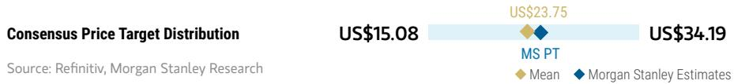

bar_line

| Category | Value     |
| -------- | --------- |
| Consensus Price Target Distribution | US$15.08  |
| MS PT    | US$23.75  |
| MS Estimates | US$34.19  |

RISK REWARD CHART AND OPTIONS IMPLIED PROBABILITIES (12M)   
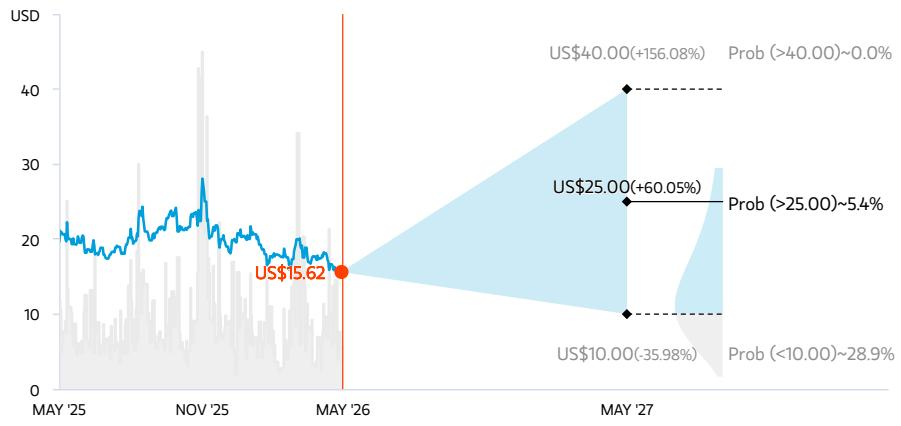

line

| Date     | Price (USD) |
| -------- | ----------- |
| MAY '25  | 15.62       |
| MAY '27  | 40.00(+156.08%) Prob (>40.00)~0.0% |
| MAY '27  | 25.00(+60.05%) Prob (>25.00)~5.4% |
| MAY '27  | 10.00(-35.98%) Prob (<10.00)~28.9% |

Key: — Historical Stock Performance ● Current Stock Price ◆ Price Target   
Source: Refinitiv, MS, MS Institutional Equities Division. The probabilities of our Bull, Base, and Bear case scenarios playing out were estimated with implied volatility data from the options market as of 8 May 2026. All figures are approximate risk-neutral probabilities of the stock reaching beyond the scenario price in either three-months' or one-years' time. View explanation of Options Probabilities methodology here

# OVERWEIGHT THESIS

■ With a robust new model pipeline, we expect XPeng's monthly sales to take off from 2H26 and further expand in 2027, underpinned by its super electric hybrid system and L4 rollout.   
■ More meaningful margin improvement should materialize from 2026, when the scale benefits of new models fully kick in.   
■ We see increasing value in XPeng's new initiatives in AI Turing chip, humanoids, and robotaxis, which should unlock potential valuation upside as they enter mass rollout in 2026.

Consensus Rating Distribution   
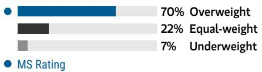

bar

| Category | Value (%) |
|---|---|
| Overweight | 70 |
| Equal-weight | 22 |
| Underweight | 7 |
MS Rating

Source: Refinitiv, MS

Risk Reward Themes 

<table><tr><td>Electric Vehicles:</td><td>Positive</td></tr><tr><td>Pricing Power:</td><td>Negative</td></tr><tr><td>Secular Growth:</td><td>Positive</td></tr></table>

View descriptions of Risk Rewards Themes here

# BULL CASE

# 3.2x 2026E P/Sales

Acceleration in sales volume ramp-up and rapid rollout of new initiatives: (1) new hybrid model sales in 2027 ramp up at a more rapid pace; (2) volume increase leads to better operating leverage; (3) rapid rollout of humanoids and L4 robotaxis in 2026. Our SOTP valuation reflects 1) Rmb220bn from vehicle business (1.5x 2028 P/S), 2) Rmb35bn from AI Turing chip business (6x 2028 P/S), 3) Rmb11bn from humanoid business (10x 2028 P/S), 4) Rmb14bn from robotaxi business (10x 2028 P/S).

# US\$40.00

# BASE CASE

# 1.7x 2026E P/Sales

Volume growth largely on track, helped by new model introductions: XPeng turns profitable in 2028, underpinned by scale benefits, ASP growth and margin expansion from overseas sales and premium model launches, as well as growing operating leverage. We expect technology service revenue from Volkswagen to help support the company's gross margins in the long run. Meanwhile, increasing ADAS adoption rate should provide more visibility on long-term growth potential from a service revenue perspective.

# US\$21.00

# BEAR CASE

# US\$10.00

# 0.8x 2026E P/Sales

Less competitive model rollout amid a fiercer competitive landscape: (1) with increasing market entrants in the price range of Rmb150k-300k, Xpeng's market share gain slows; (2) weaker-than-expected ADAS adoption rate growth puts pressure on long-term growth potential.

# Risk Reward – XPeng Inc. (XPEV.N)

KEY EARNINGS INPUTS 

<table><tr><td>Drivers</td><td>2025</td><td>2026e</td><td>2027e</td><td>2028e</td></tr><tr><td>Vehicle Sales Volume</td><td>429,445.0</td><td>462,114.0</td><td>595,508.3</td><td>665,804.8</td></tr><tr><td>Vehicle ASP (Rmb)</td><td>165,398</td><td>174,679</td><td>171,181</td><td>171,981</td></tr><tr><td>Vehicle Gross Margin (%)</td><td>12.8</td><td>13.0</td><td>13.5</td><td>13.6</td></tr><tr><td>R&amp;D/sales (%)</td><td>12.4</td><td>14.5</td><td>12.5</td><td>11.9</td></tr><tr><td>SG&amp;A/sales (%)</td><td>12.3</td><td>12.0</td><td>10.1</td><td>9.5</td></tr></table>

# INVESTMENT DRIVERS

• Total vehicle sales volume   
• XNGP adoption rate   
- Gross margin

# GLOBAL REVENUE EXPOSURE

100%

Mainland China

Source: MS Estimate View explanation of regional hierarchies here

# RISKS TO PT/RATING

# RISKS TO UPSIDE

- More competitive model introductions that drive volume growth   
• Greater-than-expected margin expansion   
- Better-than-expected branding with superior in-car user experience

# RISKS TO DOWNSIDE

- Intensified competition in the midrange/high-end segments   
• Cash flow pressure with lower profitability   
- Moderating auto sales growth pressuring overall industry valuation

# OWNERSHIP POSITIONING

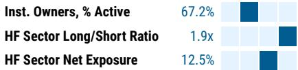

bar

| Category | Value |
| -------- | ----- |
| Inst. Owners, % Active | 67.2% |
| HF Sector Long/Short Ratio | 1.9x |
| HF Sector Net Exposure | 12.5% |

Refinitiv; MSPB Content. Includes certain hedge fund exposures held with MSPB. Information may be inconsistent with or may not reflect broader market trends. Long/Short Ratio = Long Exposure / Short exposure. Sector % of Total Net Exposure = (For a particular sector: Long Exposure - Short Exposure) / (Across all sectors: Long Exposure – Short Exposure).

# MS ESTIMATES VS. CONSENSUS

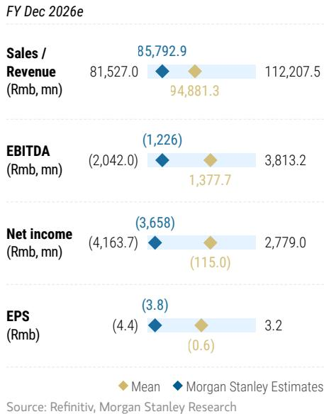

bar_line

FY Dec 2026e
| Metric | Mean (Rmb mn) | MS Estimates |
| :--- | :--- | :--- |
| Sales / Revenue | 81,527.0 | 94,881.3 |
| EBITDA (Rmb, mn) | (2,042.0) | (1,226) |
| Net income (Rmb, mn) | (4,163.7) | (3,658) |
| EPS (Rmb) | (4.4) | (3.8) |
| Sales / Revenue (Rmb, mn) | 85,792.9 | 112,207.5 |
| EBITDA (Rmb, mn) | 1,377.7 | 3,813.2 |
| Net income (Rmb, mn) | 115.0 | 2,779.0 |
| EPS (Rmb) | (0.6) | 3.2 |
Source: Refinitiv, MS

# Risk Reward – XPeng Inc. (9868.HK)

Irons in the fire - AI Turing chip, humanoids, and robotaxis

# PRICE TARGET HK\$96.00

Derived from our ADR price target using 7.8 HKD/USD. We assign 30%/50%/20% weightings to our bull/base/bear case scenarios - the bull/bear weighting reflects the potential for valuation re-rating from non-vehicle business/the macro outlook to weaken and sector competition to worsen.

Key base case assumptions: 3% terminal growth rate, 1.6x beta, 12.8% WACC.

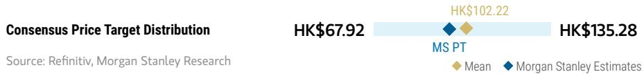

bar_line

| Consensus Price Target Distribution | HK$    |
| ----------------------------------- | ------ |
| MS PT                               | 67.92  |
| MS Estimates             | 135.28 |

RISK REWARD CHART   
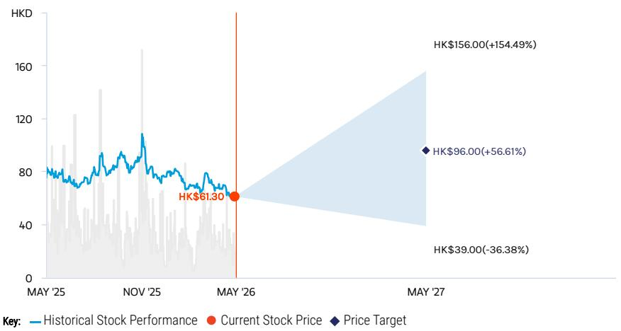

line

| Date       | Historical Stock Performance | Current Stock Price | Price Target |
| ---------- | ----------------------------- | ------------------- | ------------ |
| MAY '26    | HK$61.30                      | -                   | -            |
| MAY '27    | HK$156.00 (154.49%)           | -                   | HK$96.00 (56.61%) |

Source: Refinitiv, MS

# OVERWEIGHT THESIS

■ With a robust new model pipeline, we expect XPeng's monthly sales to take off from 2H26 and further expand in 2027, underpinned by its super electric hybrid system and L4 rollout.   
■ More meaningful margin improvement should materialize from 2026, when the scale benefits of new models fully kick in.   
■ We see increasing value in XPeng's new initiatives in AI Turing chip, humanoids, and robotaxis, which should unlock potential valuation upside as they enter mass rollout in 2026.

Consensus Rating Distribution   
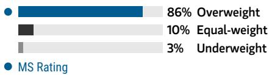

bar

| Category | Value (%) |
|---|---|
| Overweight | 86 |
| Equal-weight | 10 |
| Underweight | 3 |
| MS Rating | (not labeled with value) |

Source: Refinitiv, MS

# Risk Reward Themes

Electric Vehicles: Positive

Pricing Power: Negative

Secular Growth: Positive

View descriptions of Risk Rewards Themes here

# BULL CASE

# 3.2x 2026E P/Sales

Acceleration in sales volume ramp-up and rapid rollout of new initiatives: (1) new hybrid model sales in 2027 ramp up at a more rapid pace; (2) volume increase leads to better operating leverage; (3) rapid rollout of humanoids and L4 robotaxis in 2026. Our SOTP valuation reflects 1) Rmb220bn from vehicle business (1.5x 2028 P/S), 2) Rmb35bn from AI Turing chip business (6x 2028 P/S), 3) Rmb11bn from humanoid business (10x 2028 P/S), 4) Rmb14bn from robotaxi business (10x 2028 P/S).

# HK\$156.00

# BASE CASE

# 1.7x 2026E P/Sales

Volume growth largely on track, helped by new model introductions: XPeng turns profitable in 2028, underpinned by scale benefits, ASP growth and margin expansion from overseas sales and premium model launches, as well as growing operating leverage. We expect technology service revenue from Volkswagen to help support the company's gross margins in the long run. Meanwhile, increasing ADAS adoption rate should provide more visibility on long-term growth potential from a service revenue perspective.

# HK\$84.00

# BEAR CASE

# HK\$39.00

# 0.8x 2026E P/Sales

Less competitive model rollout amid a fiercer competitive landscape: (1) with increasing market entrants in the price range of Rmb150k-300k, Xpeng's market share gain slows; (2) weaker-than-expected ADAS adoption rate growth puts pressure on long-term growth potential.

# Risk Reward – XPeng Inc. (9868.HK)

KEY EARNINGS INPUTS 

<table><tr><td>Drivers</td><td>2025</td><td>2026e</td><td>2027e</td><td>2028e</td></tr><tr><td>Vehicle Sales Volume</td><td>429,445.0</td><td>462,114.0</td><td>595,508.3</td><td>665,804.8</td></tr><tr><td>Vehicle ASP (Rmb)</td><td>165,398</td><td>174,679</td><td>171,181</td><td>171,981</td></tr><tr><td>Vehicle Gross Margin (%)</td><td>12.8</td><td>13.0</td><td>13.5</td><td>13.6</td></tr><tr><td>R&amp;D/sales (%)</td><td>12.4</td><td>14.5</td><td>12.5</td><td>11.9</td></tr><tr><td>SG&amp;A/sales (%)</td><td>12.3</td><td>12.0</td><td>10.1</td><td>9.5</td></tr></table>

# INVESTMENT DRIVERS

• Total vehicle sales volume   
• XNGP adoption rate   
- Gross margin

# GLOBAL REVENUE EXPOSURE

100%

Mainland China

Source: MS Estimate View explanation of regional hierarchies here

# MS ALPHA MODELS

5/5

MOST

3 Month

Horizon

Source: Refinitiv, FactSet, MS; 1 is the highest favored Quintile and 5 is the least favored Quintile

# RISKS TO PT/RATING

# RISKS TO UPSIDE

- More competitive model introductions that drive volume growth   
• Greater-than-expected margin expansion   
- Better-than-expected branding with superior in-car user experience

# RISKS TO DOWNSIDE

- Intensified competition in the mid-/high-end segments   
• Cash flow pressure with lower profitability   
- Moderating auto sales growth pressuring overall industry valuation

# OWNERSHIP POSITIONING

Inst. Owners, % Active

37.5%

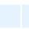

Source: Refinitiv, MS

# MS ESTIMATES VS. CONSENSUS

FY Dec 2026e

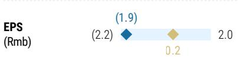

bar

| Metric | Value |
|--------|-------|
| EPS (Rmb) | (2.2) |
| EPS (Rmb) | 1.9   |
| EPS (Rmb) | 0.2   |
| EPS (Rmb) | 2.0   |

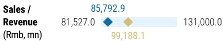

bar_line

| Metric | Value |
| --- | --- |
| Sales / Revenue (Rmb, mn) | 85,792.9 |
| Value | 81,527.0 |
| Value | 131,000.0 |
| Lower Segment | 99,188.1 |

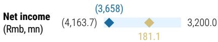

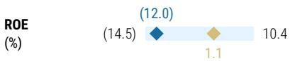

Mean

◆M

orga

n :

Source: Refinitiv, MS

# Li Auto (LI.O/2015.HK); OW

# Estimate Changes

We keep Li Auto's 2026 volume estimates unchanged at 490k units, in line with company guidance. Meanwhile, we lower our 2027/28 volume forecast by 5-7% to 599k/693k units, respectively, factoring in intensifying competition among mid-to-large size SUVs.

Our GPM forecast for 2026/27 remains unchanged at 15.8% and 17.6%, while we lower our 2028 GPM estimates by 0.5pt to 18.5%.

Our R&D expense estimates remain largely unchanged, while we revise up our SG&A estimates for 2026-28 to reflect the company's latest efforts to expand overseas.

Accordingly, our net profit forecasts for 2026-28 fall by 39%/25%/20% to Rmb1.0bn/6.7bn/11.2bn. Our EPS estimates fall by a similar magnitude.

Exhibit 6: Li Auto: Estimate revisions 

<table><tr><td>Li Auto (LI.O;2015.HK)</td><td colspan="3">Old</td><td colspan="3">New</td><td colspan="3">Change (%)</td></tr><tr><td>(Rmb m)</td><td>2026E</td><td>2027E</td><td>2028E</td><td>2026E</td><td>2027E</td><td>2028E</td><td>2026E</td><td>2027E</td><td>2028E</td></tr><tr><td>Sales volume (units)</td><td>489,555</td><td>641,777</td><td>728,819</td><td>489,555</td><td>598,732</td><td>693,034</td><td>0%</td><td>-7%</td><td>-5%</td></tr><tr><td>Revenue</td><td>135,096</td><td>178,685</td><td>203,126</td><td>135,096</td><td>166,194</td><td>193,021</td><td>0%</td><td>-7%</td><td>-5%</td></tr><tr><td>Gross Profit</td><td>21,313</td><td>31,359</td><td>38,472</td><td>21,284</td><td>29,188</td><td>35,616</td><td>0%</td><td>-7%</td><td>-7%</td></tr><tr><td>Operating Profit</td><td>171</td><td>8,604</td><td>14,164</td><td>(534)</td><td>5,896</td><td>10,804</td><td>NM</td><td>-31%</td><td>-24%</td></tr><tr><td>Net Profit</td><td>1,588</td><td>8,925</td><td>14,072</td><td>969</td><td>6,684</td><td>11,206</td><td>-39%</td><td>-25%</td><td>-20%</td></tr><tr><td>EPS (ADR)</td><td>1.58</td><td>8.86</td><td>13.97</td><td>0.96</td><td>6.63</td><td>11.12</td><td>-39%</td><td>-25%</td><td>-20%</td></tr><tr><td>EPS (H-shares)</td><td>0.79</td><td>4.43</td><td>6.98</td><td>0.48</td><td>3.32</td><td>5.56</td><td>-39%</td><td>-25%</td><td>-20%</td></tr><tr><td>Margins (%)</td><td></td><td></td><td></td><td></td><td></td><td></td><td></td><td></td><td></td></tr><tr><td>Gross Margin</td><td>15.8%</td><td>17.6%</td><td>18.9%</td><td>15.8%</td><td>17.6%</td><td>18.5%</td><td>0.0pt</td><td>0.0pt</td><td>-0.5pt</td></tr><tr><td>Operating Margin</td><td>0.1%</td><td>4.8%</td><td>7.0%</td><td>-0.4%</td><td>3.5%</td><td>5.6%</td><td>-0.5pt</td><td>-1.3pt</td><td>-1.4pt</td></tr><tr><td>Net Margin</td><td>1.2%</td><td>5.0%</td><td>6.9%</td><td>0.7%</td><td>4.0%</td><td>5.8%</td><td>-0.5pt</td><td>-1.0pt</td><td>-1.1pt</td></tr></table>

Source: Company Data, MS. E = MS Estimates

# Valuation Methodology

We continue to use a probability-weighted methodology to value Li Auto ADRs to capture long-term cash flow. Weightings for our bull/base/bear case scenarios are unchanged at 25%/50%/25%; this skew reflects the potential for the macro outlook to improve/weaken and for sector competition to lessen/worsen, in line with our view on EV start-up peers.

Base case US\$24 (from US\$25): This implies 1.4x 2026e P/sales. This scenario reflects current market conditions, including intensified price competition and subdued domestic demand, while assuming a potential turnaround in 2H26 following Li Auto's L9 facelift in 2Q26 and further volume recovery in 2027 from new model launches.

Bull case US\$30 (from US\$31): This implies 1.7x 2026e P/sales. We assume 20% incremental growth in total volume, as well as an additional 2ppt expansion in gross margin from 2026 vs. our base case. This scenario assumes Li Auto's L series facelifts and new model launches surprise the market on the upside. On top of that, we see upside potential from growing overseas sales and expansion into other physical AI applications (autonomous vehicles, humanoids). Therefore, we assume an additional 1ppt in our long-term growth assumption.

Bear case US\$7 (from US\$7.5): Our bear case value implies 0.4x 2026e P/sales. We assume a 30% decline in volume and 4ppt contraction in vehicle gross margin vs. our base case from 2026 onward.

Our DCF-derived probability-weighted price target declines by 3% to US\$21.5, implying 1.2x 2026e P/sales. In our DCF valuation, our WACC assumption remains unchanged at 15.9%, including a beta of 2.1, China equity risk premium of 4%, risk-free rate of 3%, pretax cost of debt of 7%, a target gearing ratio of 25%, and a long-term growth rate assumption of 3%.

Li Auto-H: Our price target goes down by 3% to HK\$83, implying 1.2x 2026e P/S. This is derived from our ADR price target, applying an exchange rate of 7.8 HKD/USD (unchanged). Our scenario value changes for Li Auto-H are as follows:

Base case: HK\$95 (from HK\$97), implying 1.4x 2026e P/S.

Bull case: HK\$117 (from HK\$121), implying 1.7x 2026e P/S.

Bear case: HK\$27 (from HK\$29), implying 0.4x 2026e P/S.

Exhibit 7: Li Auto: DCF valuation 

<table><tr><td>Rmb mn</td><td>2024A</td><td>2025A</td><td>2026E</td><td>2027E</td><td>2028E</td><td>2029E</td><td>2030E</td></tr><tr><td>Turnover</td><td>146,390</td><td>117,117</td><td>135,096</td><td>166,194</td><td>193,021</td><td>209,281</td><td>221,653</td></tr><tr><td>YoY%</td><td>16%</td><td>-20%</td><td>15%</td><td>23%</td><td>16%</td><td>8%</td><td>6%</td></tr><tr><td>Pre-tax profit (EBIT)</td><td>9,316</td><td>1,297</td><td>1,103</td><td>7,609</td><td>12,757</td><td>14,459</td><td>15,770</td></tr><tr><td>EBIT margin</td><td>5%</td><td>0%</td><td>0%</td><td>4%</td><td>6%</td><td>6%</td><td>6%</td></tr><tr><td>YoY%</td><td>-19%</td><td>-109%</td><td>-11%</td><td>-998%</td><td>58%</td><td>4%</td><td>2%</td></tr><tr><td>+Depreciation &amp; Amortization</td><td>3,058</td><td>-</td><td>-</td><td>-</td><td>-</td><td>-</td><td>-</td></tr><tr><td>EBITDA</td><td>10,077</td><td>(521)</td><td>(534)</td><td>5,896</td><td>10,804</td><td>12,197</td><td>13,214</td></tr><tr><td>-Less Adjusted taxes</td><td>(1,410)</td><td>(1,538)</td><td>(1,438)</td><td>(1,505)</td><td>(1,715)</td><td>(1,987)</td><td>(2,245)</td></tr><tr><td>- Capital expenditure</td><td>(7,730)</td><td>(4,206)</td><td>(4,836)</td><td>(5,562)</td><td>(6,118)</td><td>(6,730)</td><td>(7,403)</td></tr><tr><td>+/- Changes in working capital</td><td>(1,101)</td><td>(13,439)</td><td>6,600</td><td>10,472</td><td>10,122</td><td>8,235</td><td>7,494</td></tr><tr><td>Free cash flow</td><td>863</td><td>(18,043)</td><td>1,295</td><td>10,089</td><td>13,494</td><td>12,220</td><td>11,698</td></tr><tr><td>Corporate NPV</td><td>81,327</td><td></td><td></td><td></td><td></td><td></td><td></td></tr><tr><td>Minorities</td><td>-</td><td></td><td></td><td></td><td></td><td></td><td></td></tr><tr><td>Net (debt)/cash</td><td>95,966</td><td></td><td></td><td></td><td></td><td></td><td></td></tr><tr><td>Equity NPV</td><td>177,293</td><td></td><td></td><td></td><td></td><td></td><td></td></tr><tr><td>NOSH - ADS</td><td>1,008</td><td></td><td></td><td></td><td></td><td></td><td></td></tr><tr><td>NPV Per share</td><td>176.0</td><td></td><td></td><td></td><td></td><td></td><td></td></tr><tr><td>Exchange rate - RMB/USD</td><td>7.3</td><td></td><td></td><td></td><td></td><td></td><td></td></tr><tr><td>ADS base case (USD)</td><td>24</td><td></td><td></td><td></td><td></td><td></td><td></td></tr><tr><td>Exchange rate - HKD/USD</td><td>7.8</td><td></td><td></td><td></td><td></td><td></td><td></td></tr><tr><td>H-share base case (HKD)</td><td>95</td><td></td><td></td><td></td><td></td><td></td><td></td></tr></table>

Source: Company Data, MS. E = MS estimates

# Financial Summary

Exhibit 8: Li Auto: Financial Summary 

<table><tr><td colspan="6">Income Statement</td><td colspan="6">Financial Analysis</td></tr><tr><td>(Rmb Mn)</td><td>2024A</td><td>2025A</td><td>2026E</td><td>2027E</td><td>2028E</td><td></td><td>2024A</td><td>2025A</td><td>2026E</td><td>2027E</td><td>2028E</td></tr><tr><td>Revenue</td><td>144,460</td><td>112,313</td><td>135,096</td><td>166,194</td><td>193,021</td><td>Growth (%)</td><td></td><td></td><td></td><td></td><td></td></tr><tr><td>Cost of sales</td><td>(114,804)</td><td>(91,327)</td><td>(113,812)</td><td>(137,007)</td><td>(157,406)</td><td>Revenue</td><td>16.6%</td><td>-22.3%</td><td>20.3%</td><td>23.0%</td><td>16.1%</td></tr><tr><td>Gross profit</td><td>29,656</td><td>20,985</td><td>21,284</td><td>29,188</td><td>35,616</td><td>Operating profit (GAAP)</td><td>-5.2%</td><td>NM</td><td>NM</td><td>NM</td><td>83.2%</td></tr><tr><td>R&amp;D expenses</td><td>(11,071)</td><td>(11,315)</td><td>(12,159)</td><td>(12,963)</td><td>(13,705)</td><td>Net profit</td><td>-31.9%</td><td>-85.8%</td><td>-14.9%</td><td>589.6%</td><td>67.7%</td></tr><tr><td>SG&amp;A expenses</td><td>(12,229)</td><td>(10,665)</td><td>(10,132)</td><td>(10,803)</td><td>(11,581)</td><td></td><td></td><td></td><td></td><td></td><td></td></tr><tr><td>Others</td><td>664</td><td>474</td><td>474</td><td>474</td><td>474</td><td>Margins (%)</td><td></td><td></td><td></td><td></td><td></td></tr><tr><td>Operating profit (GAAP)</td><td>7,019</td><td>(521)</td><td>(534)</td><td>5,896</td><td>10,804</td><td>Gross Margin</td><td>20.5%</td><td>18.7%</td><td>15.8%</td><td>17.6%</td><td>18.5%</td></tr><tr><td>Interest income</td><td>1,820</td><td>1,919</td><td>1,815</td><td>1,891</td><td>2,131</td><td>Operating Margin</td><td>4.9%</td><td>-0.5%</td><td>-0.4%</td><td>3.5%</td><td>5.6%</td></tr><tr><td>Interest expense</td><td>(188)</td><td>(168)</td><td>(178)</td><td>(178)</td><td>(178)</td><td>Net Margin</td><td>5.6%</td><td>1.0%</td><td>0.7%</td><td>4.0%</td><td>5.8%</td></tr><tr><td>Other income / (expense)</td><td>664</td><td>67</td><td>-</td><td>-</td><td>-</td><td></td><td></td><td></td><td></td><td></td><td></td></tr><tr><td>Pretax profit</td><td>9,316</td><td>1,297</td><td>1,103</td><td>7,609</td><td>12,757</td><td>Revenue composition</td><td></td><td></td><td></td><td></td><td></td></tr><tr><td>Income tax</td><td>(1,270)</td><td>(158)</td><td>(134)</td><td>(925)</td><td>(1,551)</td><td>Vehicle sales - unit</td><td>500,508</td><td>406,343</td><td>489,555</td><td>598,732</td><td>693,034</td></tr><tr><td>Profit after tax</td><td>8,045</td><td>1,139</td><td>969</td><td>6,684</td><td>11,206</td><td>Revenue - vehicle sales</td><td>138,538</td><td>106,683</td><td>129,316</td><td>159,807</td><td>186,120</td></tr><tr><td>Minority interests</td><td>-</td><td>-</td><td>-</td><td>-</td><td>-</td><td>Revenue - Other</td><td>5,922</td><td>5,629</td><td>5,780</td><td>6,388</td><td>6,902</td></tr><tr><td>Net income</td><td>8,045</td><td>1,139</td><td>969</td><td>6,684</td><td>11,206</td><td></td><td></td><td></td><td></td><td></td><td></td></tr><tr><td>Disc. Operational income</td><td>-</td><td>-</td><td>-</td><td>-</td><td>-</td><td>Revenue mix</td><td></td><td></td><td></td><td></td><td></td></tr><tr><td>Reported net income</td><td>8,045</td><td>1,139</td><td>969</td><td>6,684</td><td>11,206</td><td>Revenue - vehicle sales</td><td>95.9%</td><td>95.0%</td><td>95.7%</td><td>96.2%</td><td>96.4%</td></tr><tr><td>EPS (Rmb) - ADR</td><td>8.06</td><td>1.12</td><td>0.96</td><td>6.63</td><td>11.12</td><td>Revenue - software</td><td>4.1%</td><td>5.0%</td><td>4.3%</td><td>3.8%</td><td>3.6%</td></tr><tr><td>EPS (Rmb) - H share</td><td>4.03</td><td>0.56</td><td>0.48</td><td>3.32</td><td>5.56</td><td></td><td></td><td></td><td></td><td></td><td></td></tr><tr><td></td><td></td><td></td><td></td><td></td><td></td><td>Gearing (x)</td><td></td><td></td><td></td><td></td><td></td></tr><tr><td colspan="6">Balance Sheet</td><td>Asset/Equity</td><td>2.29</td><td>2.12</td><td>2.20</td><td>2.23</td><td>2.19</td></tr><tr><td>(Rmb Mn)</td><td>2024A</td><td>2025A</td><td>2026E</td><td>2027E</td><td>2028E</td><td>Total Liabilities/Equity</td><td>1.28</td><td>1.12</td><td>1.20</td><td>1.23</td><td>1.19</td></tr><tr><td>Non-current assets</td><td>36,039</td><td>39,010</td><td>43,846</td><td>49,408</td><td>55,526</td><td></td><td></td><td></td><td></td><td></td><td></td></tr><tr><td>Property and equipment, net</td><td>22,056</td><td>23,967</td><td>28,803</td><td>34,365</td><td>40,483</td><td></td><td></td><td></td><td></td><td></td><td></td></tr><tr><td>Intangible assets, net</td><td>-</td><td>-</td><td>-</td><td>-</td><td>-</td><td></td><td></td><td></td><td></td><td></td><td></td></tr><tr><td>Long-term investments</td><td>923</td><td>849</td><td>849</td><td>849</td><td>849</td><td colspan="6">Cashflow Statement</td></tr><tr><td>Other non-current assets</td><td>13,061</td><td>14,194</td><td>14,194</td><td>14,194</td><td>14,194</td><td>(Rmb Mn)</td><td>2024A</td><td>2025A</td><td>2026E</td><td>2027E</td><td>2028E</td></tr><tr><td>Current assets</td><td>126,310</td><td>115,286</td><td>121,709</td><td>137,343</td><td>156,564</td><td>Cash from operating activities</td><td>15,933</td><td>(8,611)</td><td>9,080</td><td>18,940</td><td>23,355</td></tr><tr><td>Cash and cash equivalents</td><td>112,813</td><td>101,239</td><td>105,483</td><td>118,862</td><td>136,099</td><td>Cash from investing activities</td><td>(41,137)</td><td>(703)</td><td>(4,836)</td><td>(5,562)</td><td>(6,118)</td></tr><tr><td>Inventory</td><td>8,186</td><td>8,752</td><td>10,907</td><td>13,130</td><td>15,085</td><td>Cash from financing activities</td><td>(416)</td><td>767</td><td>-</td><td>-</td><td>-</td></tr><tr><td>Other current assets</td><td>5,312</td><td>5,294</td><td>5,318</td><td>5,352</td><td>5,380</td><td>Exchange difference</td><td>198</td><td>(453)</td><td>-</td><td>-</td><td>-</td></tr><tr><td></td><td></td><td></td><td></td><td></td><td></td><td>Increase in cash and equivalents</td><td>(25,422)</td><td>(9,000)</td><td>4,244</td><td>13,379</td><td>17,238</td></tr><tr><td>Current liabilities</td><td>69,216</td><td>63,548</td><td>72,327</td><td>85,055</td><td>97,160</td><td>Cash BOP</td><td>91,330</td><td>65,908</td><td>56,908</td><td>61,152</td><td>74,530</td></tr><tr><td>Short-term borrowings</td><td>281</td><td>6,218</td><td>6,218</td><td>6,218</td><td>6,218</td><td>Cash EOP</td><td>65,908</td><td>56,908</td><td>61,152</td><td>74,530</td><td>91,768</td></tr><tr><td>Trade payable</td><td>53,596</td><td>40,579</td><td>46,772</td><td>56,304</td><td>64,687</td><td></td><td></td><td></td><td></td><td></td><td></td></tr><tr><td>Taxes payable</td><td>-</td><td>-</td><td>-</td><td>-</td><td>-</td><td></td><td></td><td></td><td></td><td></td><td></td></tr><tr><td>Other current liabilities</td><td>15,339</td><td>16,751</td><td>19,337</td><td>22,533</td><td>26,256</td><td></td><td></td><td></td><td></td><td></td><td></td></tr><tr><td>Non-current liabilities</td><td>21,813</td><td>17,608</td><td>17,608</td><td>17,608</td><td>17,608</td><td></td><td></td><td></td><td></td><td></td><td></td></tr><tr><td>Long-term borrowings</td><td>8,152</td><td>3,299</td><td>3,299</td><td>3,299</td><td>3,299</td><td></td><td></td><td></td><td></td><td></td><td></td></tr><tr><td>Other non-current liabilities</td><td>13,661</td><td>14,309</td><td>14,309</td><td>14,309</td><td>14,309</td><td></td><td></td><td></td><td></td><td></td><td></td></tr><tr><td></td><td></td><td></td><td></td><td></td><td></td><td></td><td></td><td></td><td></td><td></td><td></td></tr><tr><td>Equity</td><td>70,875</td><td>72,619</td><td>75,099</td><td>83,568</td><td>96,801</td><td></td><td></td><td></td><td></td><td></td><td></td></tr><tr><td>Convertible preferred stock</td><td>-</td><td>-</td><td>-</td><td>-</td><td>-</td><td></td><td></td><td></td><td></td><td></td><td></td></tr><tr><td>Common Stock</td><td>1</td><td>1</td><td>1</td><td>1</td><td>1</td><td></td><td></td><td></td><td></td><td></td><td></td></tr><tr><td>Accumulated deficit</td><td>10,919</td><td>13,301</td><td>15,781</td><td>24,249</td><td>37,483</td><td></td><td></td><td></td><td></td><td></td><td></td></tr><tr><td>Others</td><td>59,955</td><td>59,317</td><td>59,317</td><td>59,317</td><td>59,317</td><td></td><td></td><td></td><td></td><td></td><td></td></tr><tr><td>Minority interests</td><td>-</td><td>-</td><td>-</td><td>-</td><td>-</td><td></td><td></td><td></td><td></td><td></td><td></td></tr></table>

Source: Company Data, MS. E = MS Estimates

# Risk Reward – Li Auto Inc. (LI.O)

Reforging the model, strategy and market conviction

# PRICE TARGET US\$21.50

Probability-weighted DCF methodology. Weightings for our bull/base/bear case scenarios are 25%/50%/25% - the bull/bear weighting reflects the potential for the macro outlook to improve/weaken and for sector competition to lessen/worsen. We factor in solid volume growth over time as China's EV penetration increases. Key base case assumptions: WACC 15.9%, beta 2.1, long-term growth 3%.

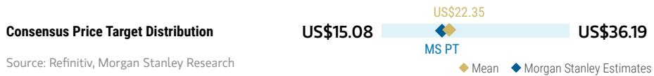

bar

| Category | Value     |
| -------- | --------- |
| MS PT    | US$15.08  |
| US$22.35 | US$36.19  |

RISK REWARD CHART AND OPTIONS IMPLIED PROBABILITIES (12M)   
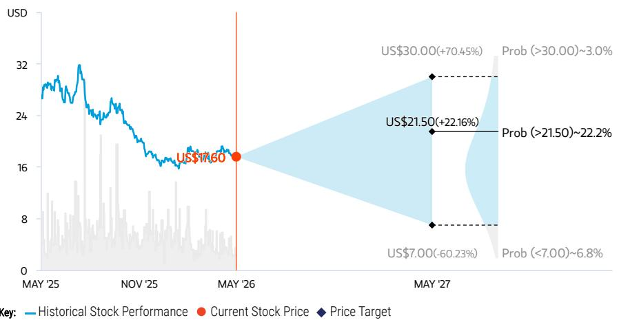

line

| Date    | Historical Stock Performance | Current Stock Price | Price Target |
|---------|-------------------------------|---------------------|--------------|
| MAY '25 | ~30                           | -                   | -            |
| NOV '25 | ~24                           | -                   | -            |
| MAY '26 | ~16                           | US$17.60            | -            |
| MAY '27 | -                             | US$21.50            | US$30.00     |
| MAY '27 | -                             | US$21.50            | Prob(>21.50) |
| MAY '27 | -                             | US$7.00             | Prob(<7.00)  |
| MAY '27 | -                             | Prob(>30.00)        | Prob(>30.00) |

Source: Refinitiv, MS, MS Institutional Equities Division. The probabilities of our Bull, Base, and Bear case scenarios playing out were estimated with implied volatility data from the options market as of 7 May 2026. All figures are approximate risk-neutral probabilities of the stock reaching beyond the scenario price in either three-months' or one-years' time. View explanation of Options Probabilities methodology here

# OVERWEIGHT THESIS

■ Li Auto's early-mover advantage in EREVs could enable the company to penetrate low-tier regions in China more effectively, while its BEV launches could help strengthen its market share in high-tier regions.   
■ We think the company deserves more credit for its well-rounded strategy and quality execution, laying a favorable foundation for the upcoming L series upgrade in 2Q26, which could be the next stock catalyst and growth driver.   
■ Li Auto just kicked off its overseas expansion in 2H25, which could underpin both volume and margin upside from 2026 onwards.

Consensus Rating Distribution   
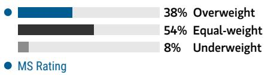

bar

| Category | Value (%) |
|---|---|
| Overweight | 38 |
| Equal-weight | 54 |
| Underweight | 8 |
MS Rating (implied by context)

Source: Refinitiv, MS

# Risk Reward Themes

<table><tr><td>Electric Vehicles:</td><td>Positive</td></tr><tr><td>Pricing Power:</td><td>Negative</td></tr><tr><td>Self-help:</td><td>Positive</td></tr></table>

View descriptions of Risk Rewards Themes here

# BULL CASE

# Implies 1.7x 2026E P/S

Faster-than-expected volume recovery of L series, followed by the introduction of new models: 1) Effective execution of marketing strategy targeting family consumers to help a rapid recovery of L family sales; 2) gross margin expansion helped by improving scalability; 3) meaningful progress on autonomous driving development that leads to higher visibility on future revenue contribution and long-term growth potential.

# US\$30.00

# BASE CASE

# Implies 1.4x 2026E P/S

L series upgrade to lead volume/margin recovery from 2027: 1) L series sales recover following its major upgrade in 2026; 2) further sales contribution from the I series and Mega in 2026-27; 3) steady gross margin recovery from scale benefits and overseas sales in 2027-28; 4) on-track autonomous driving development targeting L4 by 2026-27.

# US\$24.00

# BEAR CASE

# US\$7.00

# Implies 0.4x 2026E P/S

Weaker-than-expected L series sales recovery: 1) The company needs to accelerate the model introduction plan, which could raise capital requirements, particularly amid lower-than-expected sales; 2) new model introductions behind schedule; 3) autonomous driving development lagging peers.

# Risk Reward – Li Auto Inc. (LI.O)

KEY EARNINGS INPUTS 

<table><tr><td>Drivers</td><td>2025</td><td>2026e</td><td>2027e</td><td>2028e</td></tr><tr><td>Vehicle Sales Volume</td><td>406,343.0</td><td>489,555.3</td><td>598,731.5</td><td>693,034.2</td></tr><tr><td>Vehicle ASP (Rmb)</td><td>310,040</td><td>298,489</td><td>301,607</td><td>303,470</td></tr><tr><td>Vehicle Gross Margin (%)</td><td>17.9</td><td>15.0</td><td>17.0</td><td>18.0</td></tr><tr><td>R&amp;D/sales (%)</td><td>10.1</td><td>9.0</td><td>7.8</td><td>7.1</td></tr><tr><td>SG&amp;A/sales (%)</td><td>9.5</td><td>7.5</td><td>6.5</td><td>6.0</td></tr></table>

# INVESTMENT DRIVERS

• Further ramp-up of L family sales with expanding distribution channels   
- Margin expansion with improving scalability   
- Rapid introduction of new models

# GLOBAL REVENUE EXPOSURE

100%

Mainland China

Source: MS Estimate View explanation of regional hierarchies here

# RISKS TO PT/RATING

# RISKS TO UPSIDE

- More rapid sales volume ramp-up of L series and, therefore, better-than-expected margins.   
• Volume growth from BEV models.   
- Faster-than-expected AD development.

# RISKS TO DOWNSIDE

- Unexpected disruption owing to component bottleneck.   
- Delayed model launches.   
• Moderating auto sales growth.

# OWNERSHIP POSITIONING

<table><tr><td>Inst. Owners, % Active</td><td>62.3%</td><td></td><td></td></tr><tr><td>HF Sector Long/Short Ratio</td><td>1.9x</td><td></td><td></td></tr><tr><td>HF Sector Net Exposure</td><td>12.5%</td><td></td><td></td></tr></table>

Refinitiv; MSPB Content. Includes certain hedge fund exposures held with MSPB. Information may be inconsistent with or may not reflect broader market trends. Long/Short Ratio = Long Exposure / Short exposure. Sector % of Total Net Exposure = (For a particular sector: Long Exposure - Short Exposure) / (Across all sectors: Long Exposure – Short Exposure).

# MS ESTIMATES VS. CONSENSUS

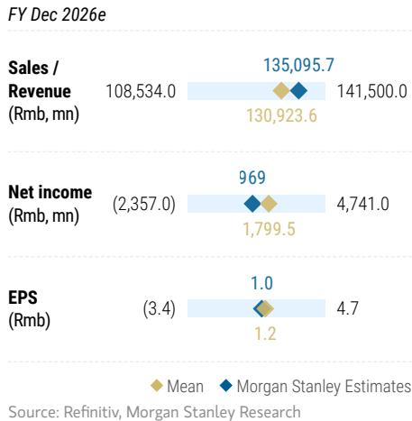

bar_line

FY Dec 2026e
| Metric | Mean (Rmb mn) | MS Estimates |
| :--- | :--- | :--- |
| Sales / Revenue | 108,534.0 | 135,095.7 |
| Net income (Rmb, mn) | (2,357.0) | 969 |
| EPS (Rmb) | (3.4) | 1.0 |
| Sales / Revenue (Rmb, mn) | 130,923.6 | 141,500.0 |
| Net income (Rmb, mn) | 1,799.5 | 4,741.0 |
| EPS (Rmb) | 1.2 | 4.7 |
Source: Refinitiv, MS

# Risk Reward – Li Auto Inc. (2015.HK)

Reforging the model, strategy and market conviction

# PRICE TARGET HK\$83.00

Probability-weighted DCF methodology. Derived from our ADR price target, and applying a HKD/USD exchange rate of 7.8. Weightings for our bull/base/bear case scenarios are 25%/50%/25% - the bull/bear weighting reflects the potential for the macro outlook to improve/weaken and for sector competition to lessen/worsen. Key base case assumptions: WACC 15.9%, beta 2.1, long-term growth 3%.

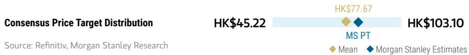

bar_line

| Consensus Price Target Distribution | HK$45.22 | HK$77.67 | HK$103.10 |
| ----------------------------------- | -------- | -------- | --------- |
| MS PT                               |          |          |           |
| Mean                                |          |          |           |
| MS Estimates             |          |          |           |

RISK REWARD CHART AND OPTIONS IMPLIED PROBABILITIES (12M)   
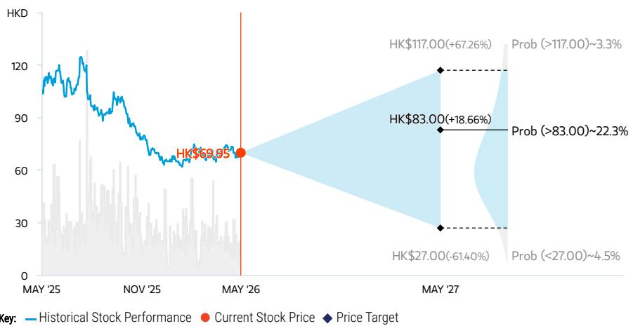

line

| Date       | Historical Stock Performance | Current Stock Price | Price Target |
| ---------- | ----------------------------- | ------------------- | ------------ |
| MAY '25    | ~120                          | -                   | -            |
| NOV '25    | ~90                           | -                   | -            |
| MAY '26    | ~69.95                        | HK$69.95            | -            |
| MAY '27    | -                             | -                   | -            |
|        | -                             | HK$83.00            | -            |
|        | -                             | -                   | -            |
|        | -                             | -                   | -            |
|        | -                             | -                   | -            |
|        | -                             | -                   | -            |
|        | -                             | -                   | -            |
|        | -                             | -                   | -            |
|        | -                             | -                   | -            |
|        | -                             | -                   | -            |
|        | -                             | -                   | -            |

Source: Refinitiv, MS, MS Institutional Equities Division. The probabilities of our Bull, Base, and Bear case scenarios playing out were estimated with implied volatility data from the options market as of 7 May 2026. All figures are approximate risk-neutral probabilities of the stock reaching beyond the scenario price in either three-months' or one-years' time. View explanation of Options Probabilities methodology here

# OVERWEIGHT THESIS

■ Li Auto's early-mover advantage in EREVs could enable the company to penetrate low-tier regions in China more effectively, while its BEV launches could help strengthen its market share in high-tier regions.   
■ We think the company deserves more credit for its well-rounded strategy and quality execution, laying a favorable foundation for the upcoming L series upgrade in 2Q26, which could be the next stock catalyst and growth driver.   
■ Li Auto just kicked off its overseas expansion in 2H25, which could underpin both volume and margin upside from 2026 onwards.

Consensus Rating Distribution   
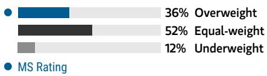

bar

| Category | Value (%) |
|---|---|
| Overweight | 36 |
| Equal-weight | 52 |
| Underweight | 12 |
MS Rating

Source: Refinitiv, MS

# Risk Reward Themes

<table><tr><td>Electric Vehicles:</td><td>Positive</td></tr><tr><td>Pricing Power:</td><td>Negative</td></tr><tr><td>Secular Growth:</td><td>Positive</td></tr></table>

View descriptions of Risk Rewards Themes here

# BULL CASE

# Implies 1.7x 2026E P/S

Faster-than-expected volume recovery of L series, followed by the introduction of new models: 1) Effective execution of marketing strategy targeting family consumers to help a rapid recovery of L family sales; 2) gross margin expansion helped by improving scalability; 3) meaningful progress on autonomous driving development that leads to higher visibility on future revenue contribution and long-term growth potential.

# HK\$117.00

# BASE CASE

# Implies 1.4x 2026E P/S

L series upgrade to lead volume/margin recovery from 2027: 1) L series sales recover following its major upgrade in 2026; 2) further sales contribution from the I series and Mega in 2026-27; 3) steady gross margin recovery from scale benefits and overseas sales in 2027-28; 4) on-track autonomous driving development targeting L4 by 2026-27.

# HK\$95.00

# BEAR CASE

# HK\$27.00

# Implies 0.4x 2026E P/S

Weaker-than-expected L series sales recovery: 1) The company needs to accelerate the model introduction plan, which could raise capital requirements, particularly amid lower-than-expected sales; 2) new model introductions behind schedule; 3) autonomous driving development lagging peers.

# Risk Reward – Li Auto Inc. (2015.HK)

KEY EARNINGS INPUTS 

<table><tr><td>Drivers</td><td>2025</td><td>2026e</td><td>2027e</td><td>2028e</td></tr><tr><td>Vehicle Sales Volume</td><td>406,343.0</td><td>489,555.3</td><td>598,731.5</td><td>693,034.2</td></tr><tr><td>Vehicle ASP (Rmb)</td><td>310,040</td><td>298,489</td><td>301,607</td><td>303,470</td></tr><tr><td>Vehicle Gross Margin (%)</td><td>17.9</td><td>15.0</td><td>17.0</td><td>18.0</td></tr><tr><td>R&amp;D/sales (%)</td><td>10.1</td><td>9.0</td><td>7.8</td><td>7.1</td></tr><tr><td>SG&amp;A/sales (%)</td><td>9.5</td><td>7.5</td><td>6.5</td><td>6.0</td></tr></table>

# INVESTMENT DRIVERS

• Further ramp-up of L family sales with expanding distribution channels   
- Margin expansion with improving scalability   
- Rapid introduction of new models

# GLOBAL REVENUE EXPOSURE

100%

Mainland China

Source: MS Estimate View explanation of regional hierarchies here

# MS ALPHA MODELS

5/5

MOST

3 Month

Horizon

Source: Refinitiv, FactSet, MS; 1 is the highest favored Quintile and 5 is the least favored Quintile

# RISKS TO PT/RATING

# RISKS TO UPSIDE

- More rapid sales volume ramp-up of L series and, therefore, better-than-expected margins.   
• Volume growth from BEV models.   
- Faster-than-expected AD development.

# RISKS TO DOWNSIDE

- Unexpected disruption owing to component bottleneck.   
- Delayed model launches.   
• Moderating auto sales growth.

# OWNERSHIP POSITIONING

Inst. Owners, % Active

28.2%

Source: Refinitiv, MS

# MS ESTIMATES VS. CONSENSUS

FY Dec 2026e

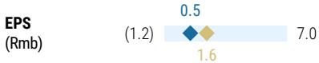

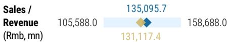

bar_line

| Category | Value     |
| -------- | --------- |
| Revenue (Rmb, mn) | 105,588.0 |
| Sales / Revenue | 135,095.7 |
| Sales / Revenue | 131,117.4 |
| Sales / Revenue | 158,688.0 |

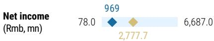

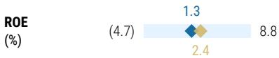

Mean

organ Stanley Estimates

Source: Refinitiv, MS

# NIO (NIO.N/9866.HK); OW

# Estimate Changes

Our 2026-28 volume and revenue estimates remain largely unchanged (<1% adjustments).

We raise our 2026-28 GPM estimates by 0.4-2.0pt to 18.0%/18.2%/18.4% to reflect a higher sales mix of ES8/ES9 (20%+ GPM) given their robust order backlog, more than offsetting raw material cost inflation.

We also lower our opex forecast for 2026-28 as last year's restructuring efforts continue to bear fruit, improving NIO's operational efficiency.

Our net loss estimates narrow by 62% (net loss per share narrows by 66%) to Rmb3.3bn in 2026, while we now look for NIO to reach net profit breakeven in 2027, one year earlier than our previous estimates. We forecast Rmb796mn and Rmb4.3bn net profit in 2027 and 2028, respectively. Our 2026-28 net loss/profit estimates move by a similar magnitude.

Exhibit 9: NIO: Estimate revisions 

<table><tr><td>NIO (NIO.N;9866.HK)</td><td colspan="3">Before change</td><td colspan="3">After change</td><td colspan="3">Change (%)</td></tr><tr><td>(Rmb m)</td><td>2026E</td><td>2027E</td><td>2028E</td><td>2026E</td><td>2027E</td><td>2028E</td><td>2026E</td><td>2027E</td><td>2028E</td></tr><tr><td>Sales volume (units)</td><td>476,240</td><td>569,313</td><td>655,924</td><td>473,579</td><td>574,819</td><td>660,749</td><td>-1%</td><td>1%</td><td>1%</td></tr><tr><td>Revenue</td><td>128,033</td><td>154,873</td><td>180,820</td><td>128,580</td><td>156,629</td><td>182,131</td><td>0%</td><td>1%</td><td>1%</td></tr><tr><td>Gross Profit</td><td>19,442</td><td>25,316</td><td>31,761</td><td>21,755</td><td>27,202</td><td>32,584</td><td>12%</td><td>7%</td><td>3%</td></tr><tr><td>Operating Profit</td><td>(9,109)</td><td>(4,265)</td><td>1,202</td><td>(3,961)</td><td>(208)</td><td>3,625</td><td>-57%</td><td>-95%</td><td>202%</td></tr><tr><td>Net Profit</td><td>(8,673)</td><td>(3,497)</td><td>2,380</td><td>(3,301)</td><td>796</td><td>4,328</td><td>-62%</td><td>NM</td><td>82%</td></tr><tr><td>EPS - Rmb</td><td>(4.2)</td><td>(1.7)</td><td>1.2</td><td>(1.5)</td><td>0.4</td><td>1.9</td><td>-66%</td><td>NM</td><td>64%</td></tr><tr><td>Margins (%)</td><td></td><td></td><td></td><td></td><td></td><td></td><td></td><td></td><td></td></tr><tr><td>Vehicle Margin</td><td>16.0%</td><td>17.0%</td><td>18.0%</td><td>18.0%</td><td>18.2%</td><td>18.4%</td><td>2.0</td><td>1.2</td><td>0.4</td></tr><tr><td>Gross Margin</td><td>15.2%</td><td>16.3%</td><td>17.6%</td><td>16.9%</td><td>17.4%</td><td>17.9%</td><td>1.7</td><td>1.0</td><td>0.3</td></tr><tr><td>Operating Margin</td><td>-7.1%</td><td>-2.8%</td><td>0.7%</td><td>-3.1%</td><td>-0.1%</td><td>2.0%</td><td>4.0</td><td>2.6</td><td>1.3</td></tr><tr><td>Net Margin</td><td>-6.8%</td><td>-2.3%</td><td>1.3%</td><td>-2.6%</td><td>0.5%</td><td>2.4%</td><td>4.2</td><td>2.8</td><td>1.1</td></tr></table>

Source: Company data, MS (E) estimates

# Valuation Methodology

We continue to use a probability-weighted methodology to value NIO's ADR to capture its long-term cash flow. Weightings for our bull/base/bear case scenarios are unchanged at 25%/50%/25% - this bull/bear weighting reflects the potential for the macro outlook to improve/weaken and for sector competition to lessen/worsen, in-line with our view on EV start-up peers.

# ADR

Base case value of US\$6.4 (from US\$6): This implies 0.8x 2026e P/S. This scenario reflects current market conditions, including intensifying price competition and an uncertain global macro outlook, while NIO's restructuring efforts continue to bear fruit, resulting in greater cost savings and operating leverage.

Bull case value of US\$14 (from US\$13): This implies 1.8x 2026e P/S. We assume additional 20% growth in total volume with 10% increase in vehicle ASP, which leads to further 3ppt expansion in gross margin from 2026. On top of that, we see upside potential from growing overseas sales and expansion into other physical AI applications (autonomous vehicles, humanoids). Therefore, we assume an additional 3ppt in our long-term growth assumption.

Bear case value of US\$2.7 (from US\$2.5): Our bear case implies 0.3x 2026e P/S. We assume a 30% decline in volume and 2ppt contraction in vehicle gross margin vs. our base case from 2026 onward. Our cut mainly reflects the current macro slowdown as well as intensifying competition.

Our DCF-derived probability-weighted price target goes up by 5% to US\$7.4, implying 1.0x 2026e P/S. In our DCF valuation, our WACC assumption remains unchanged at 17.8%, including a beta of 2.4, China equity risk premium of 4%, risk-free rate of 3%, pretax cost of debt of 6%, a target gearing ratio of 25%, and a long-term growth rate assumption of 3%.

NIO-H: Our price target of HK\$58 (from HK\$54) is derived from our ADR price target, applying a HKD/USD exchange rate of 7.8, implying 1.0x 2026E P/Sales. Our scenario value changes for NIO-H are as follows:

Base case HK\$50 (from HK\$47), implying 0.8x 2026E P/Sales

Bull case HK\$109 (from HK\$101), implying 1.8x 2026E P/Sales

Bear case HK\$21 (from HK\$20), implying 0.3x 2026E P/Sales

Exhibit 10: NIO: DCF Model – Base Case 

<table><tr><td>Rmb mn</td><td>2024A</td><td>2025A</td><td>2026E</td><td>2027E</td><td>2028E</td><td>2029E</td><td>2030E</td></tr><tr><td>Turnover</td><td>65,732</td><td>87,488</td><td>128,580</td><td>156,629</td><td>182,131</td><td>203,493</td><td>223,775</td></tr><tr><td>YoY%</td><td>18%</td><td>33%</td><td>47%</td><td>22%</td><td>16%</td><td>12%</td><td>10%</td></tr><tr><td>Pre-tax profit (EBIT)</td><td>(22,425)</td><td>(14,821)</td><td>(3,276)</td><td>839</td><td>5,096</td><td>9,269</td><td>13,664</td></tr><tr><td>EBIT margin</td><td>-34%</td><td>-17%</td><td>-3%</td><td>1%</td><td>3%</td><td>5%</td><td>6%</td></tr><tr><td>YoY%</td><td>10%</td><td>-34%</td><td>-78%</td><td>-126%</td><td>507%</td><td>82%</td><td>47%</td></tr><tr><td>+Depreciation &amp; Amortization</td><td>5,875</td><td>5,997</td><td>6,576</td><td>6,211</td><td>5,931</td><td>5,715</td><td>5,550</td></tr><tr><td>EBITDA</td><td>(15,999)</td><td>(8,045)</td><td>2,615</td><td>6,003</td><td>9,556</td><td>13,043</td><td>16,719</td></tr><tr><td>-Less Adjusted taxes</td><td>(55)</td><td>125</td><td>(236)</td><td>(566)</td><td>(867)</td><td>(1,267)</td><td>(1,737)</td></tr><tr><td>- Capital expenditure</td><td>9,142</td><td>8,500</td><td>5,000</td><td>5,000</td><td>5,000</td><td>5,000</td><td>5,000</td></tr><tr><td>+/- Changes in working capital</td><td>(6,857)</td><td>(6,972)</td><td>(13,355)</td><td>(9,701)</td><td>(8,622)</td><td>(6,966)</td><td>(6,389)</td></tr><tr><td>Free cash flow</td><td>(18,867)</td><td>(10,349)</td><td>11,393</td><td>11,143</td><td>13,018</td><td>14,293</td><td>16,815</td></tr><tr><td>Corporate NPV - NIO China</td><td>101,450</td><td></td><td></td><td></td><td></td><td></td><td></td></tr><tr><td>Net (debt)/cash</td><td>16,235</td><td></td><td></td><td></td><td></td><td></td><td></td></tr><tr><td>Equity NPV - NIO China</td><td>117,685</td><td></td><td></td><td></td><td></td><td></td><td></td></tr><tr><td>Equity NPV - NIO Inc.</td><td>106,340</td><td></td><td></td><td></td><td></td><td></td><td></td></tr><tr><td>NOSH - ADS</td><td>2,273</td><td></td><td></td><td></td><td></td><td></td><td>3.0</td></tr><tr><td>NPV Per share</td><td>47</td><td></td><td></td><td></td><td></td><td></td><td>2.4</td></tr><tr><td>Exchange rate - RMB/USD</td><td>7.3</td><td></td><td></td><td></td><td></td><td></td><td>4.0</td></tr><tr><td>ADS base case (USD)</td><td>6.4</td><td></td><td></td><td></td><td></td><td></td><td>4.0</td></tr><tr><td>Exchange rate - HKD/USD</td><td>7.8</td><td></td><td></td><td></td><td></td><td></td><td>22.2</td></tr><tr><td>H-share base case (HKD)</td><td>50</td><td></td><td></td><td></td><td></td><td></td><td>17.8</td></tr></table>

Source: Company data, MS (E) estimates

# Financial Summary

Exhibit 11: NIO: Financial Summary   
Income Statement 

<table><tr><td>(Rmb Mn)</td><td>2024A</td><td>2025A</td><td>2026E</td><td>2027E</td><td>2028E</td></tr><tr><td>Revenue</td><td>65,732</td><td>87,488</td><td>128,580</td><td>156,629</td><td>182,131</td></tr><tr><td>Cost of sales</td><td>(59,239)</td><td>(75,572)</td><td>(106,825)</td><td>(129,427)</td><td>(149,547)</td></tr><tr><td>Gross profit</td><td>6,493</td><td>11,916</td><td>21,755</td><td>27,202</td><td>32,584</td></tr><tr><td>R&amp;D expenses</td><td>(13,037)</td><td>(10,605)</td><td>(10,286)</td><td>(10,964)</td><td>(11,656)</td></tr><tr><td>SG&amp;A expenses</td><td>(15,741)</td><td>(16,088)</td><td>(15,430)</td><td>(16,446)</td><td>(17,302)</td></tr><tr><td>Others</td><td>412</td><td>736</td><td>-</td><td>-</td><td>-</td></tr><tr><td>Operating profit (GAAP)</td><td>(21,874)</td><td>(14,041)</td><td>(3,961)</td><td>(208)</td><td>3,625</td></tr><tr><td>Stock-based compensation</td><td>(1,929)</td><td>(1,791)</td><td>(1,725)</td><td>(1,839)</td><td>(1,943)</td></tr><tr><td>Operating profit (ex. stock comp)</td><td>(19,946)</td><td>(12,251)</td><td>(2,236)</td><td>1,631</td><td>5,568</td></tr><tr><td>Interest income</td><td>854</td><td>762</td><td>1,119</td><td>1,481</td><td>1,905</td></tr><tr><td>Interest expense</td><td>(798)</td><td>(885)</td><td>(885)</td><td>(885)</td><td>(885)</td></tr><tr><td>Other income / (expense)</td><td>(606)</td><td>(656)</td><td>451</td><td>451</td><td>451</td></tr><tr><td>Protax profit</td><td>(22,425)</td><td>(14,821)</td><td>(3,276)</td><td>839</td><td>5,096</td></tr><tr><td>Income tax</td><td>23</td><td>(122)</td><td>(27)</td><td>(42)</td><td>(764)</td></tr><tr><td>Profit after tax</td><td>(22,402)</td><td>(14,943)</td><td>(3,303)</td><td>797</td><td>4,331</td></tr><tr><td>Minority interests</td><td>92</td><td>(18)</td><td>3</td><td>(1)</td><td>(4)</td></tr><tr><td>Net income</td><td>(22,310)</td><td>(14,961)</td><td>(3,301)</td><td>796</td><td>4,328</td></tr><tr><td>Convertible redeemable preferred shares</td><td>(348)</td><td>(610)</td><td>-</td><td>-</td><td>-</td></tr><tr><td>Reported net income</td><td>(22,658)</td><td>(15,571)</td><td>(3,301)</td><td>796</td><td>4,328</td></tr><tr><td>EPS (Rmb)</td><td>(11.03)</td><td>(6.85)</td><td>(1.45)</td><td>0.35</td><td>1.90</td></tr></table>

Balance Sheet 

<table><tr><td>(Rmb Mn)</td><td>2024A</td><td>2025A</td><td>2026E</td><td>2027E</td><td>2028E</td></tr><tr><td>Non-current assets</td><td>45,719</td><td>47,115</td><td>45,539</td><td>44,327</td><td>43,397</td></tr><tr><td>Property and equipment, net</td><td>25,893</td><td>28,396</td><td>26,820</td><td>25,609</td><td>24,678</td></tr><tr><td>Intangible assets, net</td><td>30</td><td>30</td><td>30</td><td>30</td><td>30</td></tr><tr><td>Long-term investments</td><td>3,126</td><td>2,019</td><td>2,019</td><td>2,019</td><td>2,019</td></tr><tr><td>Other non-current assets</td><td>16,670</td><td>16,670</td><td>16,670</td><td>16,670</td><td>16,670</td></tr><tr><td>Current assets</td><td>61,886</td><td>65,118</td><td>83,258</td><td>100,226</td><td>119,110</td></tr><tr><td>Cash and cash equivalents</td><td>19,329</td><td>20,052</td><td>33,405</td><td>46,953</td><td>62,780</td></tr><tr><td>Inventory</td><td>7,087</td><td>9,041</td><td>12,780</td><td>15,484</td><td>17,892</td></tr><tr><td>Other current assets</td><td>35,470</td><td>36,025</td><td>37,073</td><td>37,788</td><td>38,438</td></tr><tr><td>Current liabilities</td><td>62,311</td><td>71,792</td><td>89,934</td><td>103,054</td><td>114,734</td></tr><tr><td>Short-term borrowings</td><td>5,730</td><td>5,730</td><td>5,730</td><td>5,730</td><td>5,730</td></tr><tr><td>Trade payable</td><td>34,387</td><td>43,868</td><td>62,010</td><td>75,130</td><td>86,810</td></tr><tr><td>Taxes payable</td><td>400</td><td>400</td><td>400</td><td>400</td><td>400</td></tr><tr><td>Other current liabilities</td><td>21,794</td><td>21,794</td><td>21,794</td><td>21,794</td><td>21,794</td></tr><tr><td>Non-current liabilities</td><td>31,787</td><td>31,787</td><td>31,787</td><td>31,787</td><td>31,787</td></tr><tr><td>Long-term borrowings</td><td>11,441</td><td>11,441</td><td>11,441</td><td>11,441</td><td>11,441</td></tr><tr><td>Other non-current liabilities</td><td>9,086</td><td>9,086</td><td>9,086</td><td>9,086</td><td>9,086</td></tr><tr><td>Equity</td><td>13,507</td><td>8,654</td><td>7,076</td><td>9,712</td><td>15,986</td></tr><tr><td>Convertible preferred stock</td><td>7,442</td><td>7,442</td><td>7,442</td><td>7,442</td><td>7,442</td></tr><tr><td>Common Stock</td><td>4</td><td>8,303</td><td>8,303</td><td>8,303</td><td>8,303</td></tr><tr><td>Accumulated deficit</td><td>(113,068)</td><td>(126,220)</td><td>(127,798)</td><td>(125,162)</td><td>(118,888)</td></tr><tr><td>Others</td><td>119,032</td><td>119,032</td><td>119,032</td><td>119,032</td><td>119,032</td></tr><tr><td>Minority interests</td><td>98</td><td>98</td><td>98</td><td>98</td><td>98</td></tr></table>

Financial Analysis 

<table><tr><td></td><td>2024A</td><td>2025A</td><td>2026E</td><td>2027E</td><td>2028E</td></tr><tr><td colspan="6">Growth (%)</td></tr><tr><td>Revenue</td><td>18.2%</td><td>33.1%</td><td>47.0%</td><td>21.8%</td><td>16.3%</td></tr><tr><td>Operating profit (GAAP)</td><td>NM</td><td>NM</td><td>NM</td><td>NM</td><td>NM</td></tr><tr><td>Net profit</td><td>NM</td><td>NM</td><td>NM</td><td>NM</td><td>443.4%</td></tr><tr><td colspan="6">Margins (%)</td></tr><tr><td>Gross Margin</td><td>9.9%</td><td>13.6%</td><td>16.9%</td><td>17.4%</td><td>17.9%</td></tr><tr><td>Operating Margin</td><td>-33.3%</td><td>-16.0%</td><td>-3.1%</td><td>-0.1%</td><td>2.0%</td></tr><tr><td>Net Margin</td><td>-34.5%</td><td>-17.8%</td><td>-2.6%</td><td>0.5%</td><td>2.4%</td></tr><tr><td colspan="6">Efficiency</td></tr><tr><td>Asset Turnover (x)</td><td>1.6</td><td>1.3</td><td>1.0</td><td>0.9</td><td>0.9</td></tr><tr><td>Inventory Days</td><td>44</td><td>44</td><td>44</td><td>44</td><td>44</td></tr><tr><td>Receivables Days</td><td>9</td><td>9</td><td>9</td><td>9</td><td>9</td></tr><tr><td>Payable Days</td><td>212</td><td>212</td><td>212</td><td>212</td><td>212</td></tr><tr><td colspan="6">Return (%)</td></tr><tr><td>ROA</td><td>-19%</td><td>-14%</td><td>-3%</td><td>1%</td><td>3%</td></tr><tr><td>ROE</td><td>-77%</td><td>-116%</td><td>-39%</td><td>11%</td><td>45%</td></tr><tr><td colspan="6">Gearing (x)</td></tr><tr><td>Asset/Equity</td><td>8.02</td><td>13.12</td><td>18.46</td><td>15.04</td><td>10.23</td></tr><tr><td>Total Liabilities/Equity</td><td>7.02</td><td>12.11</td><td>17.44</td><td>14.03</td><td>9.22</td></tr><tr><td>Total IB Debt/Equity</td><td>1.28</td><td>2.01</td><td>2.46</td><td>1.79</td><td>1.08</td></tr></table>

Cashflow Statement 

<table><tr><td>(Rmb Mn)</td><td>2024A</td><td>2025A</td><td>2026E</td><td>2027E</td><td>2028E</td></tr><tr><td>Cash from operating activities</td><td>(7,849)</td><td>924</td><td>18,353</td><td>18,548</td><td>20,827</td></tr><tr><td>Cash from investing activities</td><td>(4,958)</td><td>(8,500)</td><td>(5,000)</td><td>(5,000)</td><td>(5,000)</td></tr><tr><td>Cash from financing activities</td><td>1,772</td><td>8,299</td><td>-</td><td>-</td><td>-</td></tr><tr><td>Exchange difference</td><td>161</td><td>-</td><td>-</td><td>-</td><td>-</td></tr><tr><td>Increase in cash and equivalents</td><td>(10,874)</td><td>723</td><td>13,353</td><td>13,548</td><td>15,827</td></tr><tr><td>Cash BOP</td><td>38,622</td><td>27,747</td><td>28,470</td><td>41,824</td><td>55,372</td></tr><tr><td>Cash EOP</td><td>27,747</td><td>28,470</td><td>41,824</td><td>55,372</td><td>71,199</td></tr></table>

Source: Company data, MS (E) estimates

# Risk Reward – NIO Inc. (NIO.N)

Execution, the key to reviving stock performance

# PRICE TARGET US\$7.40

Probability-weighted valuation methodology. We factor in solid volume growth over time and expect net profit to break even in 2028. Key assumptions: WACC 17.8%, reflecting beta 2.4, and long-term growth rate 3.0%. Weightings for our bull/base/bear case scenarios are 25%/50%/25% - the bull/bear weightings reflect the potential for the macro outlook to improve/weaken and for sector competition to lessen/worsen.

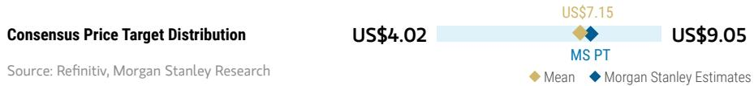

bar_line

| Category | Value     |
| -------- | --------- |
| MS PT    | US$7.15   |
| MS Estimates | US$9.05   |
| Mean     | US$4.02   |

RISK REWARD CHART AND OPTIONS IMPLIED PROBABILITIES (12M)   
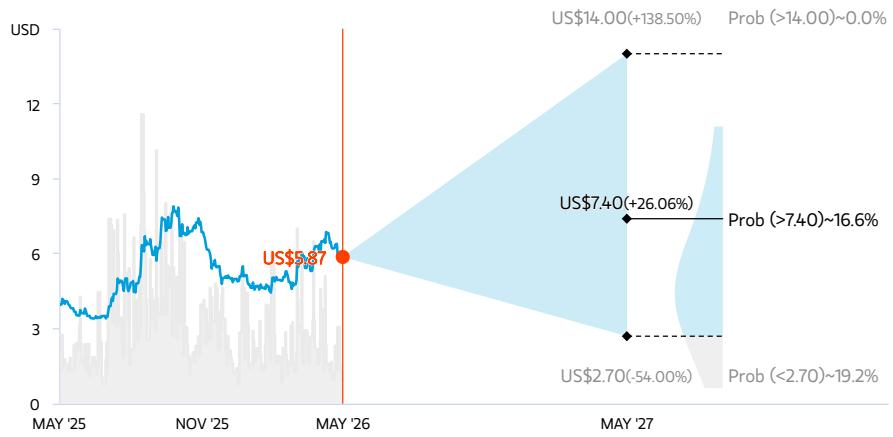

line

| Date       | Price (USD) | Probability Range |
| ---------- | ----------- | ------------------ |
| MAY '25    | ~3.5        | -                  |
| NOV '25    | ~6.0        | -                  |
| MAY '26    | 5.87        | -                  |
| MAY '27    | 7.40        | +26.06%            |
| MAY '27    | 14.00       | +138.50%           |
| MAY '27    | 2.70        | -54.00%            |
| MAY '27    | 19.2%       | -                  |

Key: — Historical Stock Performance ● Current Stock Price ◆ Price Target   
Source: Refinitiv, MS, MS Institutional Equities Division. The probabilities of our Bull, Base, and Bear case scenarios playing out were estimated with implied volatility data from the options market as of 7 May 2026. All figures are approximate risk-neutral probabilities of the stock reaching beyond the scenario price in either three-months' or one-years' time. View explanation of Options Probabilities methodology here

# OVERWEIGHT THESIS

For NIO shares to outperform from here, we would expect to see one or both of the following: 1) sales of NIO brand and Onvo to further take off in 2026 following new ES8 and Onvo L80 launch; and/or 2) a reduction in the company's cash burn via more effective restructuring and cost reduction.   
If the company can demonstrate quality execution in growing the sales of its sub-brand Onvo and good cost synergy, reflected in contained opex and capex, we think the stock can outperform with more structural growth into 2026.

Consensus Rating Distribution   
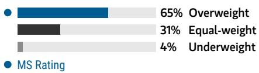

bar

| Rating | Percentage (%) |
| :--- | :--- |
| Overweight | 65 |
| Equal-weight | 31 |
| Underweight | 4 |
MS Rating

Source: Refinitiv, MS

# Risk Reward Themes

Electric Vehicles: Positive

Self-help: Positive

View descriptions of Risk Rewards Themes here

# BULL CASE

# 1.8x 2026E P/S

Successful expansion into new segments and/or better ADAS adoption: 1) Notably higher-than-expected orders and sales volume; 2) more rapid growth of market acceptance of NIO's ADAS services, with higher adoption rate and higher sUBScription price in the long run; 3) accelerating sales network expansion to support total sales growth, which in turn helps NIO achieve self-funding ahead of our expectation.

# US\$14.00

# BASE CASE

# 0.8x 2026E P/S

Further ramp-ups in sales volume, and operating efficiency improvements: Our base-case incorporates: 1) a steady sales volume ramp-up as well as market share expansion in the premium NEV segment; 2) turning profitable in 2027; 3) more aggressive sales network expansion.

# US\$6.40

# BEAR CASE

# US\$2.70

# 0.3x 2026E P/S

Worse-than-expected sales and margins: 1) Lower sales volume, ASP and margins due to weaker-than-expected demand for NIO's vehicles and less customer preference for NIO's optional add-on features, or BaaS plan; 2) 30% lower sales, 10% lower ASP and 2ppt lower vehicles gross margin compared to our base case to incorporate demand weakness amid consumption slowdown; 3) slower-than-expected ADAS service adoption rate and monetization potential.

# Risk Reward – NIO Inc. (NIO.N)

KEY EARNINGS INPUTS 

<table><tr><td>Drivers</td><td>2025</td><td>2026e</td><td>2027e</td><td>2028e</td></tr><tr><td>ES6 Sales Volume</td><td>43,631</td><td>30,542</td><td>33,596</td><td>36,284</td></tr><tr><td>ES6 ASP (Rmb)</td><td>290,309</td><td>290,309</td><td>290,309</td><td>290,309</td></tr><tr><td>ES8 Sales Volume</td><td>46,795</td><td>140,385</td><td>154,424</td><td>166,777</td></tr><tr><td>ES8 ASP (Rmb)</td><td>355,980</td><td>355,980</td><td>355,980</td><td>355,980</td></tr></table>

# INVESTMENT DRIVERS

- Sales volume   
• Introduction of new models   
- BaaS penetration

# GLOBAL REVENUE EXPOSURE

100%

Mainland China

Source: MS Estimate View explanation of regional hierarchies here

# RISKS TO PT/RATING

# RISKS TO UPSIDE

• Introduction of new models   
• Stronger-than-expected sales volume   
- Better-than-expected improvements in operating efficiency

# RISKS TO DOWNSIDE

- Weaker-than-expected sales volume   
- Lack of signs of efficiency improvement   
• Moderating auto sales growth pressuring overall industry valuations

OWNERSHIP POSITIONING   
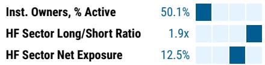

bar

| Category | Value |
| -------- | ----- |
| Inst. Owners, % Active | 50.1% |
| HF Sector Long/Short Ratio | 1.9x |
| HF Sector Net Exposure | 12.5% |

Refinitiv; MSPB Content. Includes certain hedge fund exposures held with MSPB. Information may be inconsistent with or may not reflect broader market trends. Long/Short Ratio = Long Exposure / Short exposure. Sector % of Total Net Exposure = (For a particular sector: Long Exposure - Short Exposure) / (Across all sectors: Long Exposure – Short Exposure).

MS ESTIMATES VS. CONSENSUS   
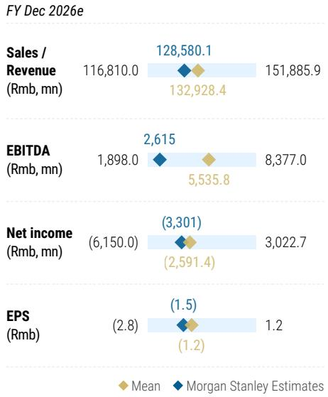

bar_line

FY Dec 2026e
| Metric | Mean (Rmb mn) | MS Estimates |
| :--- | :--- | :--- |
| Sales / Revenue | 116,810.0 | 128,580.1 |
| EBITDA | 1,898.0 | 2,615 |
| Net income | (6,150.0) | (3,301) |
| EPS | (2.8) | (1.5) |
| | (1.2) | |

Source: Refinitiv, MS

# Risk Reward – NIO Inc. (9866.HK)

Execution, the key to reviving stock performance

# PRICE TARGET HK\$58.00

Derived from our ADR price target using a HKD/USD exchange rate of 7.8. For the ADR, we assign 25%/50%/25% weightings to our bull/base/bear case scenarios - the bull/bear weighting reflects the potential for the macro outlook to improve/weaken and for sector competition to lessen/worsen. Key assumptions: WACC 17.8%, reflecting NIO's more mature stage of business, beta 2.4, and a long-term growth rate of 3%.

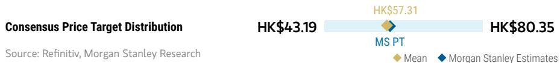

bar_line

| Consensus Price Target Distribution | HK$43.19 | HK$57.31 | HK$80.35 |
| ----------------------------------- | -------- | -------- | -------- |
| MS PT                               | -        | -        | -        |
| Mean                                | -        | -        | -        |
| MS Estimates             | -        | -        | -        |

RISK REWARD CHART   
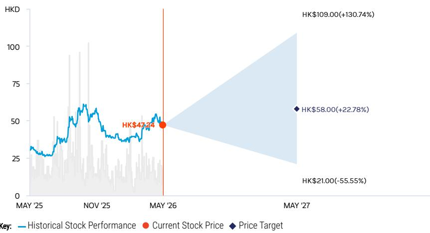

line

| Date       | Historical Stock Performance | Current Stock Price | Price Target |
| ---------- | ----------------------------- | ------------------- | ------------ |
| MAY '26    | HK$47.24                      | -                   | -            |
| MAY '27    | -                             | HK$58.00            | HK$21.00     |

Source: Refinitiv, MS

# OVERWEIGHT THESIS

For NIO shares to outperform from here, we would expect to see one or both of the following: 1) sales of NIO brand and Onvo to further take off in 2026 following new ES8 and Onvo L80 launch; and/or 2) a reduction in the company's cash burn via more effective restructuring and cost reduction.   
If the company can demonstrate quality execution in growing the sales of its sub-brand Onvo and good cost synergy, reflected in contained opex and capex, we think the stock can outperform with more structural growth into 2026.

Consensus Rating Distribution   
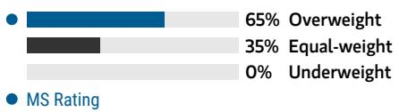

bar

| Category | Value (%) |
|---|---|
| Overweight | 65 |
| Equal-weight | 35 |
| Underweight | 0 |
| MS Rating | - |

Source: Refinitiv, MS

# Risk Reward Themes

Electric Vehicles: Positive

Self-help: Positive

View descriptions of Risk Rewards Themes here

# BULL CASE

# 1.8x 2026E P/S

Successful expansion into new segments and/or better ADAS adoption: (1) notably higher-than-expected orders and sales volume; (2) more rapid growth of market acceptance of NIO's ADAS services, with higher adoption rate and higher sUBScription price in the long run; (3) accelerating sales network expansion to support total sales growth, which in turn helps NIO achieve self-funding ahead of our expectation.

# HK\$109.00

# BASE CASE

# 0.8x 2026E P/S

Further ramp-ups in sales volume; operating efficiency improvements: Our base case incorporates: (1) a steady sales volume ramp-up as well as market share expansion in the premium NEV segment; (2) turning profitable in 2027; (3) more aggressive sales network expansion.

# HK\$50.00

# BEAR CASE

# HK\$21.00

# 0.3x 2026E P/S

Worse-than-expected sales and margins: (1) lower sales volume, ASP and margins due to weaker-than-expected demand for NIO's vehicles and less customer preference for NIO's optional add-on features, or BaaS plan; (2) 30% lower sales, 10% lower ASP, and 2ppt lower vehicles gross margin compared to our base case to incorporate demand weakness amid consumption slowdown; (3) slower-than-expected ADAS service adoption rate and monetization potential.

# Risk Reward – NIO Inc. (9866.HK)

KEY EARNINGS INPUTS 

<table><tr><td>Drivers</td><td>2025</td><td>2026e</td><td>2027e</td><td>2028e</td></tr><tr><td>ES6 Sales Volume</td><td>43,631</td><td>30,542</td><td>33,596</td><td>36,284</td></tr><tr><td>ES6 ASP (Rmb)</td><td>290,309</td><td>290,309</td><td>290,309</td><td>290,309</td></tr><tr><td>ES8 Sales Volume</td><td>46,795</td><td>140,385</td><td>154,424</td><td>166,777</td></tr><tr><td>ES8 ASP (Rmb)</td><td>355,980</td><td>355,980</td><td>355,980</td><td>355,980</td></tr></table>

# INVESTMENT DRIVERS

- Sales volume   
• Introduction of new models   
- BaaS penetration

# GLOBAL REVENUE EXPOSURE

100%

Mainland China

Source: MS Estimate View explanation of regional hierarchies here

# MS ALPHA MODELS

4/5

MOST

3 Month

Horizon

Source: Refinitiv, FactSet, MS; 1 is the highest favored Quintile and 5 is the least favored Quintile

# RISKS TO PT/RATING

# RISKS TO UPSIDE

• Introduction of new models   
• Stronger-than-expected sales volume   
- Better-than-expected improvements in operating efficiency

# RISKS TO DOWNSIDE

- Weaker-than-expected sales volume   
- Lack of signs of efficiency improvement   
• Moderating auto sales growth pressuring overall industry valuations

# OWNERSHIP POSITIONING

Inst. Owners, % Active

31.5%

Source: Refinitiv, MS

# MS ESTIMATES VS. CONSENSUS

<table><tr><td colspan="3">FY Dec 2026e</td></tr><tr><td rowspan="2">Sales / Revenue (Rmb, mn)</td><td rowspan="2">111,704.0</td><td>128,580.1</td></tr><tr><td>128,619.6</td></tr><tr><td rowspan="2">EBITDA (Rmb, mn)</td><td rowspan="2">(2,532.4)</td><td>2,615</td></tr><tr><td>3,830.1</td></tr><tr><td rowspan="2">Net income (Rmb, mn)</td><td rowspan="2">(8,672.6)</td><td>(3,301)</td></tr><tr><td>(3,184.8)</td></tr><tr><td rowspan="2">EPS (Rmb)</td><td rowspan="2">(4.2)</td><td>(1.5)</td></tr><tr><td>(1.5)</td></tr></table>

Source: Refinitiv, MS

# BYD (1211.HK/002594.SZ); OW

# Estimate Changes

Our 2026-28 volume and revenue forecasts remain largely unchanged.

We revise down our 2026-28 GPM forecasts by 0.3pt to 18.0%/18.4%/18.8%, reflecting raw material cost inflation and higher BoM cost from smart driving/ultra-fast charging spec upgrades, which could be partially offset by a higher mix of overseas and premium model sales.

We increase our opex forecast for 2026-28 on the back of higher R&D investments in smart driving and SG&A expenses overseas.

Our 2026-28 net profit forecasts lower by 6-8% to Rmb38bn/Rmb49bn/Rmb59bn and our EPS forecasts fall by a similar magnitude.

Exhibit 12: BYD: Estimate revisions 

<table><tr><td>BYD (1211.HK ; 002594.SZ)</td><td colspan="3">New</td><td colspan="3">Old</td><td colspan="3">Change</td></tr><tr><td>(Rmb m)</td><td>2026E</td><td>2027E</td><td>2028E</td><td>2026E</td><td>2027E</td><td>2028E</td><td>2026E</td><td>2027E</td><td>2028E</td></tr><tr><td>Auto sales volume (units)</td><td>5,176,236</td><td>5,721,710</td><td>6,187,411</td><td>5,176,236</td><td>5,721,710</td><td>6,187,411</td><td>0.0%</td><td>0.0%</td><td>0.0%</td></tr><tr><td>Revenue</td><td>912,565</td><td>999,719</td><td>1,080,301</td><td>912,565</td><td>999,719</td><td>1,080,301</td><td>0.0%</td><td>0.0%</td><td>0.0%</td></tr><tr><td>Gross Profit</td><td>164,323</td><td>184,232</td><td>202,810</td><td>166,774</td><td>186,928</td><td>205,713</td><td>-1.5%</td><td>-1.4%</td><td>-1.4%</td></tr><tr><td>Operating Profit</td><td>47,410</td><td>60,746</td><td>73,043</td><td>51,205</td><td>65,002</td><td>78,010</td><td>-7.4%</td><td>-6.5%</td><td>-6.4%</td></tr><tr><td>Net Profit</td><td>38,013</td><td>48,924</td><td>58,876</td><td>41,097</td><td>52,381</td><td>62,911</td><td>-7.5%</td><td>-6.6%</td><td>-6.4%</td></tr><tr><td>EPS</td><td>4.21</td><td>5.42</td><td>6.52</td><td>4.55</td><td>5.80</td><td>6.97</td><td>-7.5%</td><td>-6.6%</td><td>-6.4%</td></tr><tr><td>Magins</td><td colspan="3"></td><td colspan="3"></td><td colspan="3"></td></tr><tr><td>Gross Margin</td><td>18.0%</td><td>18.4%</td><td>18.8%</td><td>18.3%</td><td>18.7%</td><td>19.0%</td><td>-0.3pt</td><td>-0.3pt</td><td>-0.3pt</td></tr><tr><td>Operating Margin</td><td>5.2%</td><td>6.1%</td><td>6.8%</td><td>5.6%</td><td>6.5%</td><td>7.2%</td><td>-0.4pt</td><td>-0.4pt</td><td>-0.5pt</td></tr><tr><td>Net Margin</td><td>4.2%</td><td>4.9%</td><td>5.4%</td><td>4.5%</td><td>5.2%</td><td>5.8%</td><td>-0.3pt</td><td>-0.3pt</td><td>-0.4pt</td></tr><tr><td>Net Profit per vehicle (Rmb)</td><td>6,729</td><td>7,813</td><td>8,735</td><td>7,346</td><td>8,438</td><td>9,410</td><td>-8.4%</td><td>-7.4%</td><td>-7.2%</td></tr></table>

Source: Company data, MS (E) estimates

# Valuation Methodology

We continue to use a blended, probability-weighted methodology to value BYD. We apply unchanged probability weightings of 25%, 50%, and 25% to our bull, base, and bear case scenarios, in line with what we use for its EV start-up peers.

H-shares

Base case HK\$112 (from HK\$117): This implies 25x 2026e P/E. We maintain our WACC of 14.3%, based on 8% equity risk premium, 1.8 beta, 4% risk-free rate, and 3% long-term growth. Our lower base case value reflects our lower 2026-28 earnings estimates.

Bull case HK\$210 (from HK\$220): This implies 40x bull case 2026e P/E. We continue to use a SOTP (sum-of-the-parts) valuation methodology to derive our bull case value. There are three main parts:

- BYD's whole EV business – 2x EV/sales: benchmarked against EV startups;   
- BYD's battery business – 10x EV/EBITDA: benchmarked against CATL; and   
- BYDE – we use its most recent closing market cap.

Bear case HK\$49 (from HK\$51): This is based on 12x 2026e bear case P/E. In this scenario, we assume worse-than-expected auto sales both domestically and overseas as several emerging markets enter economic recessions, while BYD cuts prices more aggressively from fiercer EV competition. We factor in minimum external battery sales and lower auto

sales volume.

Our probability-weighted price target goes down by 4% to HK\$121 (from HK\$126), implying 27x 2026e P/E.

A-shares

Our price target for BYD-A decreases by a similar magnitude, to Rmb120 (from Rmb125), implying 27x 2026 P/E. For BYD-A, we continue to apply a 5% premium to our H-share bull and base case values, and no premium to our bear case value. We apply an exchange rate of 1.06 RMB/HKD (unchanged).

Therefore, we make the following changes:

Base case Rmb112 (from Rmb116), implying 25x 2026E P/E.

Bull case Rmb209 (from Rmb219), implying 40x bull case 2026E P/E.

Bear case Rmb46 (from Rmb48), implying 12x 2026E bear case P/E.

Exhibit 13: BYD: DCF Model – Base Case 

<table><tr><td>Rmb m</td><td>2024</td><td>2025E</td><td>2026E</td><td>2027E</td><td>2028E</td><td>2029E</td><td>2030E</td><td>2031E</td><td>2032E</td><td>2033E</td></tr><tr><td>Revenue</td><td>777,102</td><td>803,965</td><td>912,565</td><td>999,719</td><td>1,079,696</td><td>1,160,673</td><td>1,241,921</td><td>1,322,645</td><td>1,408,617</td><td>1,500,178</td></tr><tr><td>yoy</td><td>29.0%</td><td>3.5%</td><td>13.5%</td><td>9.6%</td><td>8.0%</td><td>7.5%</td><td>7.0%</td><td>6.5%</td><td>6.5%</td><td>6.5%</td></tr><tr><td>EBIT</td><td>50,897</td><td>39,104</td><td>47,463</td><td>60,988</td><td>66,947</td><td>73,129</td><td>79,490</td><td>85,979</td><td>92,977</td><td>100,520</td></tr><tr><td>EBIT margin</td><td>6.5%</td><td>4.9%</td><td>5.2%</td><td>6.1%</td><td>6.2%</td><td>6.3%</td><td>6.4%</td><td>6.5%</td><td>6.6%</td><td>6.7%</td></tr><tr><td>+D&amp;A</td><td>66,906</td><td>80,526</td><td>87,236</td><td>103,152</td><td>111,404</td><td>119,759</td><td>128,142</td><td>136,472</td><td>145,342</td><td>154,789</td></tr><tr><td>D&amp;A as % of revenue</td><td>8.6%</td><td>10.0%</td><td>9.6%</td><td>10.3%</td><td>10.3%</td><td>10.3%</td><td>10.3%</td><td>10.3%</td><td>10.3%</td><td>10.3%</td></tr><tr><td>-Adjusted Taxes (EBIT * t)</td><td>(8,110)</td><td>(6,224)</td><td>(7,554)</td><td>(9,707)</td><td>(16,737)</td><td>(18,282)</td><td>(19,872)</td><td>(21,495)</td><td>(23,244)</td><td>(25,130)</td></tr><tr><td>-Capital Expenditure</td><td>(101,026)</td><td>(159,622)</td><td>(132,841)</td><td>(142,841)</td><td>(135,699)</td><td>(128,914)</td><td>(122,469)</td><td>(116,345)</td><td>(110,528)</td><td>(105,002)</td></tr><tr><td>+Change in Working Capital</td><td>18,699</td><td>(56,263)</td><td>27,523</td><td>21,375</td><td>24,239</td><td>27,360</td><td>30,739</td><td>34,374</td><td>38,438</td><td>42,984</td></tr><tr><td>Free Cash Flow</td><td>27,366</td><td>(102,479)</td><td>21,827</td><td>32,967</td><td>50,154</td><td>73,051</td><td>96,030</td><td>118,985</td><td>142,985</td><td>168,162</td></tr><tr><td>Discount factor</td><td>1.00</td><td>1.00</td><td>1.14</td><td>1.29</td><td>1.47</td><td>1.66</td><td>1.89</td><td>2.15</td><td>2.44</td><td>2.77</td></tr><tr><td>PV</td><td>27,366</td><td>(102,479)</td><td>19,217</td><td>25,554</td><td>34,227</td><td>43,892</td><td>50,798</td><td>55,414</td><td>58,629</td><td>60,707</td></tr><tr><td>Terminal Value</td><td></td><td></td><td></td><td></td><td></td><td></td><td></td><td></td><td></td><td></td></tr><tr><td>Corporate NPV</td><td>939,299</td><td></td><td></td><td></td><td></td><td></td><td></td><td></td><td></td><td></td></tr><tr><td>-Minorities</td><td>13,595</td><td></td><td></td><td></td><td></td><td></td><td></td><td></td><td></td><td></td></tr><tr><td>-Net Debt</td><td>(35,121)</td><td></td><td></td><td></td><td></td><td></td><td></td><td></td><td></td><td></td></tr><tr><td>Equity NPV</td><td>960,825</td><td></td><td></td><td></td><td></td><td></td><td></td><td></td><td></td><td></td></tr><tr><td>NOSH</td><td>9,026</td><td></td><td></td><td></td><td></td><td></td><td></td><td></td><td></td><td></td></tr><tr><td>NPV per share</td><td>106.45</td><td></td><td></td><td></td><td></td><td></td><td></td><td></td><td></td><td></td></tr><tr><td>Exchange rate</td><td>1.06</td><td></td><td></td><td></td><td></td><td></td><td></td><td></td><td></td><td></td></tr><tr><td>H-share base case (HK$)</td><td>112</td><td></td><td></td><td></td><td></td><td></td><td></td><td></td><td></td><td></td></tr><tr><td>A-share base case (Rmb)</td><td>112</td><td></td><td></td><td></td><td></td><td></td><td></td><td></td><td></td><td></td></tr></table>

Source: Company Data, MS. E = MS Estimates

# Financial Summary

Exhibit 14: BYD: Financial Summary 

<table><tr><td colspan="6">Income Statement</td></tr><tr><td>(Rmb m)</td><td>2024</td><td>2025E</td><td>2026E</td><td>2027E</td><td>2028E</td></tr><tr><td>Auto Sales Volume</td><td>4,272,145</td><td>4,602,436</td><td>5,176,236</td><td>5,721,710</td><td>6,187,411</td></tr><tr><td>Revenue</td><td>777,102</td><td>803,965</td><td>912,565</td><td>999,719</td><td>1,080,301</td></tr><tr><td>COGS</td><td>(626,047)</td><td>(661,305)</td><td>(748,242)</td><td>(815,487)</td><td>(877,491)</td></tr><tr><td>Gross Profit</td><td>151,056</td><td>142,666</td><td>164,323</td><td>184,232</td><td>202,810</td></tr><tr><td>Other operating income</td><td>13,367</td><td>14,814</td><td>13,702</td><td>13,502</td><td>13,324</td></tr><tr><td>Selling and distribution expenses</td><td>(24,085)</td><td>(26,185)</td><td>(28,809)</td><td>(30,561)</td><td>(31,944)</td></tr><tr><td>Administrative expenses</td><td>(18,645)</td><td>(20,200)</td><td>(22,016)</td><td>(23,119)</td><td>(23,902)</td></tr><tr><td>Research and development costs</td><td>(53,195)</td><td>(57,978)</td><td>(63,985)</td><td>(68,096)</td><td>(71,424)</td></tr><tr><td>Other operating expenses</td><td>(18,012)</td><td>(12,926)</td><td>(15,805)</td><td>(15,212)</td><td>(15,821)</td></tr><tr><td>Operating Profit</td><td>50,486</td><td>40,185</td><td>47,410</td><td>60,146</td><td>73,041</td></tr><tr><td>Non-Operating Income</td><td>1,252</td><td>1,132</td><td>1,192</td><td>1,162</td><td>1,177</td></tr><tr><td>Non-Operating Expense</td><td>(2,057)</td><td>(1,564)</td><td>(1,810)</td><td>(1,687)</td><td>(1,749)</td></tr><tr><td>Profit Before Tax</td><td>49,681</td><td>39,753</td><td>46,791</td><td>60,221</td><td>72,471</td></tr><tr><td>Income Tax Expense</td><td>(8,093)</td><td>(5,992)</td><td>(7,447)</td><td>(9,584)</td><td>(11,534)</td></tr><tr><td>Profit After Tax</td><td>41,588</td><td>33,761</td><td>39,344</td><td>50,637</td><td>60,937</td></tr><tr><td>Minority interests</td><td>(1,334)</td><td>(1,142)</td><td>(1,331)</td><td>(1,712)</td><td>(2,061)</td></tr><tr><td>Net Profit</td><td>40,254</td><td>32,619</td><td>38,013</td><td>48,924</td><td>58,876</td></tr><tr><td>EPS (Rmb)</td><td>4.61</td><td>3.61</td><td>4.21</td><td>5.42</td><td>6.52</td></tr></table>

<table><tr><td colspan="6">Cash Flow Statement</td></tr><tr><td>(Rmb m)</td><td>2024</td><td>2025E</td><td>2026E</td><td>2027E</td><td>2028E</td></tr><tr><td>Cash Flow from Investing Activities</td><td>(129,082)</td><td>(197,463)</td><td>(132,841)</td><td>(142,841)</td><td>(152,841)</td></tr><tr><td>Cash Flow from Financing Activities</td><td>(10,268)</td><td>104,614</td><td>(16,908)</td><td>(21,761)</td><td>(26,187)</td></tr><tr><td>Effect from foreign exchange</td><td>(460)</td><td>6,400</td><td>-</td><td>-</td><td>-</td></tr><tr><td>Change in Cash</td><td>(6,356)</td><td>(27,314)</td><td>4,354</td><td>10,561</td><td>21,693</td></tr><tr><td>Beginning Cash</td><td>109,094</td><td>102,739</td><td>75,425</td><td>79,778</td><td>90,340</td></tr><tr><td>Ending Cash</td><td>102,739</td><td>75,425</td><td>79,778</td><td>90,340</td><td>112,033</td></tr></table>

<table><tr><td colspan="6">Growth and Margins</td></tr><tr><td></td><td>2024</td><td>2025E</td><td>2026E</td><td>2027E</td><td>2028E</td></tr><tr><td>Revenue growth</td><td>29.0%</td><td>3.5%</td><td>13.5%</td><td>9.6%</td><td>8.1%</td></tr><tr><td>Gross profit growth</td><td>35.0%</td><td>-5.6%</td><td>15.2%</td><td>12.1%</td><td>10.1%</td></tr><tr><td>Operating profit growth</td><td>32.5%</td><td>-20.4%</td><td>18.0%</td><td>28.1%</td><td>20.2%</td></tr><tr><td>Net profit growth</td><td>34.0%</td><td>-19.0%</td><td>16.5%</td><td>28.7%</td><td>20.3%</td></tr><tr><td>Gross margin</td><td>19.4%</td><td>17.7%</td><td>18.0%</td><td>18.4%</td><td>18.8%</td></tr><tr><td>Operating margin</td><td>6.5%</td><td>5.0%</td><td>5.2%</td><td>6.1%</td><td>6.8%</td></tr><tr><td>Net margin</td><td>5.2%</td><td>4.1%</td><td>4.2%</td><td>4.9%</td><td>5.4%</td></tr></table>

<table><tr><td colspan="6">Balance Sheet</td></tr><tr><td>(Rmb m)</td><td>2024</td><td>2025E</td><td>2026E</td><td>2027E</td><td>2028E</td></tr><tr><td>Cash and Cash Equivalents</td><td>102,739</td><td>75,425</td><td>79,778</td><td>90,340</td><td>112,033</td></tr><tr><td>Financial Asset Held for Trading</td><td>40,939</td><td>54,533</td><td>54,533</td><td>54,533</td><td>54,533</td></tr><tr><td>Trade Receivables</td><td>62,299</td><td>37,005</td><td>42,003</td><td>46,015</td><td>49,724</td></tr><tr><td>Prepayments and Other Receivables</td><td>18,040</td><td>13,663</td><td>15,508</td><td>16,989</td><td>18,359</td></tr><tr><td>Inventories</td><td>116,036</td><td>138,421</td><td>157,118</td><td>172,124</td><td>185,998</td></tr><tr><td>Contract Assets</td><td>1,411</td><td>1,165</td><td>1,165</td><td>1,165</td><td>1,165</td></tr><tr><td>Long-Term Receivables due within One Year</td><td>11,379</td><td>20,534</td><td>20,534</td><td>20,534</td><td>20,534</td></tr><tr><td>Other Current Assets</td><td>17,729</td><td>30,723</td><td>30,723</td><td>30,723</td><td>30,723</td></tr><tr><td>Total current assets</td><td>370,572</td><td>371,468</td><td>401,363</td><td>432,422</td><td>473,068</td></tr><tr><td>Fixed Assets</td><td>262,287</td><td>292,776</td><td>337,195</td><td>376,080</td><td>408,430</td></tr><tr><td>Construction in Progress</td><td>19,954</td><td>48,294</td><td>48,294</td><td>48,294</td><td>48,294</td></tr><tr><td>Right of Use Assets</td><td>10,575</td><td>9,083</td><td>7,566</td><td>6,024</td><td>4,457</td></tr><tr><td>Intangible Assets</td><td>38,424</td><td>41,485</td><td>44,189</td><td>46,535</td><td>48,524</td></tr><tr><td>Other non-current assets</td><td>81,543</td><td>120,625</td><td>120,625</td><td>120,625</td><td>120,625</td></tr><tr><td>Total non-current assets</td><td>412,784</td><td>512,262</td><td>557,868</td><td>597,557</td><td>630,329</td></tr><tr><td>Total Assets</td><td>783,356</td><td>883,730</td><td>959,231</td><td>1,029,980</td><td>1,103,397</td></tr><tr><td colspan="6"></td></tr><tr><td>Short-Term Borrowings</td><td>12,103</td><td>38,485</td><td>38,485</td><td>38,485</td><td>38,485</td></tr><tr><td>Trade Payables</td><td>241,643</td><td>186,742</td><td>211,292</td><td>230,281</td><td>247,790</td></tr><tr><td>Contract Liabilities</td><td>43,730</td><td>51,471</td><td>51,471</td><td>51,471</td><td>51,471</td></tr><tr><td>Other Payables</td><td>144,989</td><td>119,483</td><td>135,623</td><td>148,575</td><td>160,551</td></tr><tr><td>Other Current Liabilities</td><td>53,520</td><td>72,270</td><td>73,732</td><td>74,904</td><td>75,989</td></tr><tr><td>LT interest bearing borrowings</td><td>8,258</td><td>60,706</td><td>60,706</td><td>60,706</td><td>60,706</td></tr><tr><td>Other liabilities</td><td>80,425</td><td>96,034</td><td>106,948</td><td>115,707</td><td>123,805</td></tr><tr><td>Total non-current liabilities</td><td>88,682</td><td>156,739</td><td>167,654</td><td>176,412</td><td>184,511</td></tr><tr><td>Total liabilities</td><td>584,668</td><td>625,191</td><td>678,256</td><td>720,129</td><td>758,796</td></tr><tr><td colspan="6"></td></tr><tr><td>Share capital</td><td>2,909</td><td>9,117</td><td>9,117</td><td>9,117</td><td>9,117</td></tr><tr><td>Capital reserve</td><td>75,574</td><td>114,011</td><td>114,011</td><td>114,011</td><td>114,011</td></tr><tr><td>Undistributed profit</td><td>98,648</td><td>116,057</td><td>137,163</td><td>164,326</td><td>197,015</td></tr><tr><td>Other equity</td><td>8,120</td><td>7,089</td><td>7,089</td><td>7,089</td><td>7,089</td></tr><tr><td>Non-controlling interests</td><td>13,437</td><td>12,265</td><td>13,595</td><td>15,308</td><td>17,368</td></tr><tr><td>Total equity</td><td>198,688</td><td>258,539</td><td>280,975</td><td>309,851</td><td>344,601</td></tr><tr><td colspan="6"></td></tr><tr><td>Total equity and liabilities</td><td>783,356</td><td>883,730</td><td>959,231</td><td>1,029,980</td><td>1,103,397</td></tr></table>

Source: Company data, MS estimates (E)

# Risk Reward – BYD Company Limited (1211.HK)

Global EV bellwether with smart driving and global ambitions

# PRICE TARGET HK\$121.00

Blended methodology, weighted 25% bull, 50% base, 25% bear. We think incremental volume from ADAS adoption and trade-in stimulus extension could partially offset the fierce competitive landscape in the mass market segment.

- Bull: SOTP, implying 40x 2026E bull P/E. Reflects re-rating of comps (CATL, EV startups).   
- Base: DCF (14.3% WACC, 3.0% long-term growth).   
- Bear: 12x 2026E P/E - worse auto sales domestically and overseas, more severe price cuts.

Consensus Price Target Distribution

Source: Refinitiv, MS

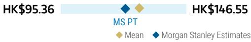

bar_line

| Metric | Value |
| --- | --- |
| HK$95.36 MS PT | 95.36 |
| HK$146.55 Mean | 146.55 |
| HK$146.55 MS Estimates | 146.55 |

RISK REWARD CHART AND OPTIONS IMPLIED PROBABILITIES (12M)   
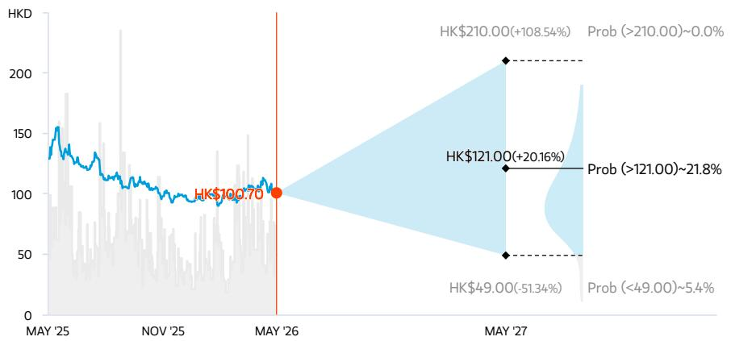

line

| Date     | Value   |
| -------- | ------- |
| MAY '25  | HK$100.70 |
| MAY '26  | 100.70  |
| MAY '27  | 210.00 (+108.54%) |
| MAY '27  | 121.00 (+20.16%) |
| MAY '27  | 49.00 (-51.34%) |
| MAY '27  | >121.00 (~21.8%) |
| MAY '27  | Prob (>210.00)~0.0% |
| MAY '27  | Prob (<49.00)~5.4% |

Key: — Historical Stock Performance ● Current Stock Price ◆ Price Target   
Source: Refinitiv, MS, MS Institutional Equities Division. The probabilities of our Bull, Base, and Bear case scenarios playing out were estimated with implied volatility data from the options market as of 7 May 2026. All figures are approximate risk-neutral probabilities of the stock reaching beyond the scenario price in either three-months' or one-years' time. View explanation of Options Probabilities methodology here

# OVERWEIGHT THESIS

■ We expect BYD to enjoy greater advantages in cost competition and bargaining power with the supply chain vs. other Chinese OEMs, given its vertically integrated supply chain and growing scale.   
■ We think BYD's efforts to democratize ADAS and ultra fast charging technology in the mass market segment could eventually transform BYD into a smart driving technology enabler.

■ BYD's PHEV offerings could be highly price-competitive in emerging markets where charging infrastructure is undeveloped, while it could help bypass EV tariffs in developed markets.

Consensus Rating Distribution   
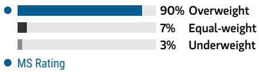

bar

| Category      | Value |
| ------------- | ----- |
| Overweight    | 90%   |
| Equal-weight  | 7%    |
| Underweight   | 3%    |

Source: Refinitiv, MS

# Risk Reward Themes

Disruption: Negative
Electric Vehicles: Positive
Pricing Power: Positive

View descriptions of Risk Rewards Themes here

# BULL CASE

# 40x 2026E bull-case P/E

Rapid global expansion and domestic recovery: Our SOTP-based bull-case value is mainly to benchmark: 1) BYD's whole EV business with that of leading EV startups; 2) BYD's battery business with CATL; and 3) BYDE with its recent closing market cap.

# HK\$210.00

# BASE CASE

# 25x 2026E base-case P/E

2nd gen blade battery to lead domestic recovery while overseas share gain continues: We use DCF to derive our base-case valuation. We factor in 10%+ volume CAGR and 20%+ earnings CAGR from 2026-28. We expect steady ASP and unit profit to rise, with a higher proportion of overseas and premium sales offsetting ongoing price pressure in the mass market.

# HK\$112.00

# BEAR CASE

# HK\$49.00

# 12x 2026E bear-case P/E

Worse-than-expected auto sales and EV battery business: We assume worse-than-expected auto sales both domestically and overseas as several emerging markets enter economic recession, while BYD cuts prices more aggressively in response to fiercer EV competition. We factor in minimum external battery sales and lower auto sales volume.

# Risk Reward – BYD Company Limited (1211.HK)

KEY EARNINGS INPUTS 

<table><tr><td>Drivers</td><td>2025</td><td>2026e</td><td>2027e</td><td>2028e</td></tr><tr><td>NEV PV Sales Volume (Rmb, mn)</td><td>4,545,423</td><td>5,113,275</td><td>5,652,171</td><td>6,110,592</td></tr><tr><td>NEV CV Sales Volume (Rmb, mn)</td><td>57,013</td><td>62,960</td><td>69,540</td><td>76,819</td></tr><tr><td>Revenue (Rmb, mn)</td><td>803,965</td><td>912,565</td><td>999,719</td><td>1,080,301</td></tr><tr><td>Gross Profit (Rmb, mn)</td><td>142,660</td><td>164,323</td><td>184,232</td><td>202,810</td></tr><tr><td>EPS (Rmb)</td><td>4</td><td>4</td><td>5</td><td>7</td></tr></table>

# INVESTMENT DRIVERS

- EV sales   
- ASP trend   
- Overseas sales

# GLOBAL REVENUE EXPOSURE

100%

Mainland China

Source: MS Estimate View explanation of regional hierarchies here

# MS ALPHA MODELS

5/5

MOST

3 Month

Horizon

Source: Refinitiv, FactSet, MS; 1 is the highest favored Quintile and 5 is the least favored Quintile

# RISKS TO PT/RATING

# RISKS TO UPSIDE

- New model launches   
- Faster-than-expected overseas expansion   
• Stronger-than-expected demand for NEVs globally

# RISKS TO DOWNSIDE

- Lack of progress in overseas expansion amid rising protectionism   
- Weaker-than-expected demand for NEVs globally   
- Worse-than-expected gross margin

# OWNERSHIP POSITIONING

Inst. Owners, % Active

51.2%

Source: Refinitiv, MS

# MS ESTIMATES VS. CONSENSUS

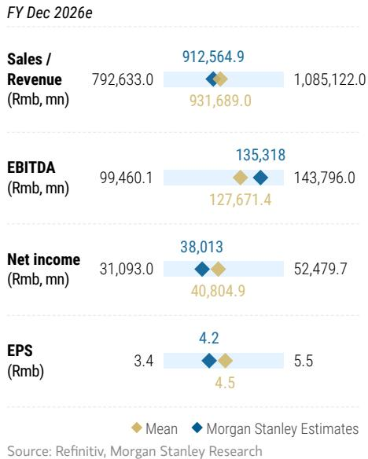

bar_line

FY Dec 2026e
| Metric | Mean (Rmb mn) | MS Estimates |
| :--- | :--- | :--- |
| Sales / Revenue | 792,633.0 | 912,564.9 |
| EBITDA | 99,460.1 | 135,318 |
| Net income | 31,093.0 | 38,013 |
| EPS | 3.4 | 4.2 |
| Source: Refinitiv, MS

# Risk Reward – BYD Company Limited (002594.SZ)

Global EV bellwether with smart driving and global ambitions

# PRICE TARGET Rmb120.00

Blended methodology, weighted 25% bull, 50% base, 25% bear. We think incremental volume from ADAS adoption and trade-in stimulus extension could partially offset the fierce competitive landscape in the mass market segment.

We apply a 5% premium to our H-share bull and bear case scenario values; no premium in our bear case.

We use an exchange rate of 1.06 RMB/HKD.

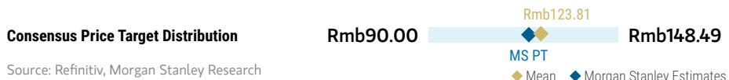

bar_line

| Consensus Price Target Distribution | Rmb90.00 | Rmb123.81 | Rmb148.49 |
| ----------------------------------- | -------- | --------- | --------- |
| MS PT                               |          |           |           |
| Mean                                |          |           |           |
| MS Estimates             |          |           |           |

RISK REWARD CHART   
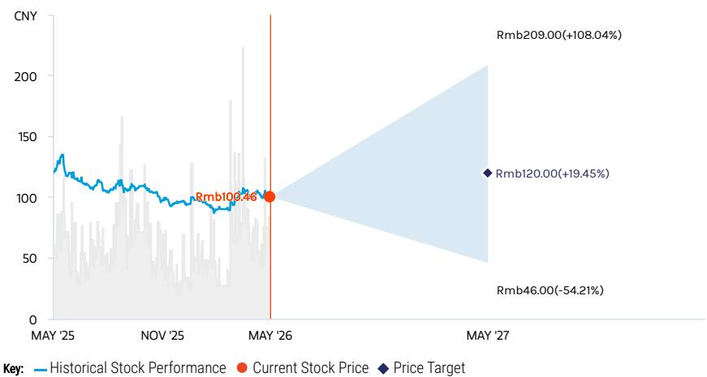

line

| Date       | Historical Stock Performance | Current Stock Price | Price Target |
| ---------- | ----------------------------- | ------------------- | ------------ |
| MAY '26    | Rmb100.46                     | Rmb100.46            | -            |
| MAY '27    | -                             | -                   | Rmb46.00 (-54.21%) |
| Rmb209.00 | +108.04%                      | -                   | -            |
| Rmb120.00 | +19.45%                       | -                   | -            |

Source: Refinitiv, MS

# OVERWEIGHT THESIS

■ We expect BYD to enjoy greater advantages in cost competition and bargaining power with the supply chain vs. other Chinese OEMs, given its vertically integrated supply chain and growing scale.
■ We think BYD's efforts to democratize ADAS and ultra fast charging technology in the mass market segment could eventually transform BYD into a smart driving technology enabler.   
■ BYD's PHEV offerings could be highly price-competitive in emerging markets where charging infrastructure is undeveloped, while it could help bypass EV tariffs in developed markets.

Consensus Rating Distribution   
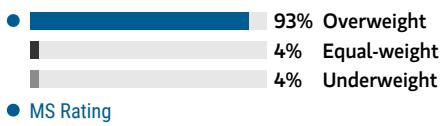

bar

| Category | Value (%) |
|---|---|
| Overweight | 93 |
| Equal-weight | 4 |
| Underweight | 4 |
MS Rating

Source: Refinitiv, MS

# Risk Reward Themes

Disruption: Positive
Electric Vehicles: Positive
Pricing Power: Negative

View descriptions of Risk Rewards Themes here

# BULL CASE

# 40x 2026E bull case P/E

Rapid global expansion and domestic recovery: Our SOTP-based bull-case value is mainly to benchmark: 1) BYD's whole EV business with that of leading EV startups; 2) BYD's battery business with CATL; and 3) BYDE with its recent closing market cap.

# Rmb209.00

# BASE CASE

# 25x 2026E base case P/E

2nd gen blade battery to lead domestic recovery while overseas share gain continues: We use DCF to derive our base-case valuation. We factor in 10%+ volume CAGR and 20%+ earnings CAGR from 2026-28. We expect steady ASP and unit profit to rise, with a higher proportion of overseas and premium sales offsetting ongoing price pressure in the mass market.

# Rmb112.00

# BEAR CASE

# 12x 2026E bear case P/E

Worse-than-expected auto sales and EV battery business: We assume worse-than-expected auto sales both domestically and overseas as several emerging markets enter economic recession, while BYD cuts prices more aggressively in response to fiercer EV competition. We factor in minimum external battery sales and lower auto sales volume.

# Rmb46.00

# Risk Reward – BYD Company Limited (002594.SZ)

KEY EARNINGS INPUTS 

<table><tr><td>Drivers</td><td>2025</td><td>2026e</td><td>2027e</td><td>2028e</td></tr><tr><td>NEV PV Sales Volume (Rmb, mn)</td><td>4,545,423</td><td>5,113,275</td><td>5,652,171</td><td>6,110,592</td></tr><tr><td>NEV CV Sales Volume (Rmb, mn)</td><td>57,013</td><td>62,960</td><td>69,540</td><td>76,819</td></tr><tr><td>Revenue (Rmb, mn)</td><td>803,965</td><td>912,565</td><td>999,719</td><td>1,080,301</td></tr><tr><td>Gross Profit (Rmb, mn)</td><td>142,660</td><td>164,323</td><td>184,232</td><td>202,810</td></tr><tr><td>EPS (Rmb)</td><td>4</td><td>4</td><td>5</td><td>7</td></tr></table>

# INVESTMENT DRIVERS

- EV sales   
- ASP trend   
- Overseas sales

# GLOBAL REVENUE EXPOSURE

100%

Mainland China

Source: MS Estimate View explanation of regional hierarchies here

# MS ALPHA MODELS

5/5

MOST

3 Month

Horizon

Source: Refinitiv, FactSet, MS; 1 is the highest favored Quintile and 5 is the least favored Quintile

# RISKS TO PT/RATING

# RISKS TO UPSIDE

- New model launch schedule   
- Faster-than-expected overseas expansion   
• Stronger-than-expected demand for NEVs globally

# RISKS TO DOWNSIDE

- Lack of progress in overseas expansion amid rising protectionism   
- Weaker-than-expected demand for NEVs   
- Worse-than-expected gross margin

# OWNERSHIP POSITIONING

Inst. Owners, % Active

72.6%

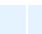

Source: Refinitiv, MS

# MS ESTIMATES VS. CONSENSUS

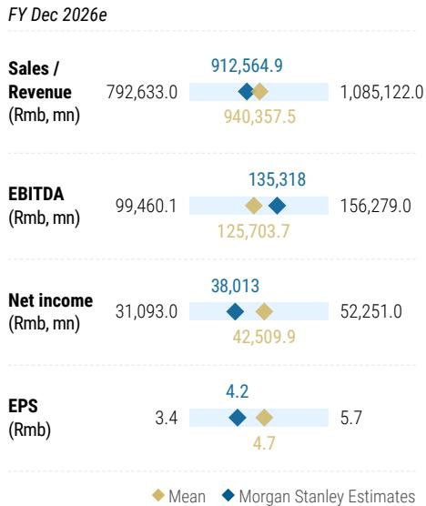

bar_line

FY Dec 2026e
| Metric | Mean (Rmb mn) | MS Estimates (Rmb mn) |
| :--- | :--- | :--- |
| Sales / Revenue | 792,633.0 | 912,564.9 |
| EBITDA | 99,460.1 | 135,318 |
| Net income | 31,093.0 | 38,013 |
| EPS | 3.4 | 4.2 |
| Sales / Revenue (Rmb, mn) | 940,357.5 | 1,085,122.0 |
| EBITDA (Rmb, mn) | 125,703.7 | 156,279.0 |
| Net income (Rmb, mn) | 42,509.9 | 52,251.0 |
| EPS (Rmb) | 4.7 | 5.7 |

Source: Refinitiv, MS

# GWM (2333.HK/601633.SS); EW/UW

# Estimate Changes

We incorporate GWM's 2025 actual shipments and lower our 2026/27 shipment forecasts by 1-2% to 1.37mn/1.41mn units, respectively, and we introduce 2028 shipment estimate at 1.45mn units.

We revise down our 2026-27 GPM estimates by 1.4/1.1pt to 18.8%/19.2% to reflect ongoing raw material cost inflation and fiercer competition both domestically and overseas.

Meanwhile, we also model lower non-operating income in 2026-28 given volatility in tax rebates from Russia. We look for Rmb3.4bn non-operating income in 2026.

Our 2026-27 net profit forecasts go down by 30-32% to Rmb9.8/11bn, implying unit profit of Rmb7.2/7.8k for 2026/27; we introduce 2028 net profit estimate at Rmb12.2bn, implying unit profit of Rmb8.4k. Our 2026-28 EPS estimates fall by 27-29%.

Exhibit 15: GWM: Estimate revisions 

<table><tr><td>GWM (2333.HK ; 601633.SS)</td><td colspan="3">New</td><td colspan="3">Old</td><td colspan="3">Change</td></tr><tr><td>(Rmb m)</td><td>2026E</td><td>2027E</td><td>2028E</td><td>2026E</td><td>2027E</td><td>2028E</td><td>2026E</td><td>2027E</td><td>2028E</td></tr><tr><td>Auto sales volume (units)</td><td>1,365,772</td><td>1,407,874</td><td>1,448,677</td><td>1,370,748</td><td>1,431,311</td><td></td><td>-0.4%</td><td>-1.6%</td><td></td></tr><tr><td>Revenue</td><td>227,808</td><td>232,698</td><td>237,317</td><td>223,240</td><td>230,804</td><td></td><td>2.0%</td><td>0.8%</td><td></td></tr><tr><td>Gross Profit</td><td>42,815</td><td>44,618</td><td>46,456</td><td>44,970</td><td>46,814</td><td></td><td>-4.8%</td><td>-4.7%</td><td></td></tr><tr><td>Net Profit</td><td>9,821</td><td>10,962</td><td>12,172</td><td>14,497</td><td>15,581</td><td></td><td>-32.3%</td><td>-29.6%</td><td></td></tr><tr><td>EPS</td><td>1.12</td><td>1.25</td><td>1.38</td><td>1.59</td><td>1.71</td><td></td><td>-29.3%</td><td>-26.9%</td><td></td></tr><tr><td>Magins</td><td></td><td></td><td></td><td></td><td></td><td></td><td></td><td></td><td></td></tr><tr><td>Gross Margin</td><td>18.8%</td><td>19.2%</td><td>19.6%</td><td>20.1%</td><td>20.3%</td><td></td><td>-1.4pt</td><td>-1.1pt</td><td></td></tr><tr><td>Net Margin</td><td>4.3%</td><td>4.7%</td><td>5.1%</td><td>5.8%</td><td>6.0%</td><td></td><td>-1.5pt</td><td>-1.3pt</td><td></td></tr><tr><td>Net Profit per vehicle (Rmb)</td><td>7,191</td><td>7,786</td><td>8,402</td><td>9,405</td><td>9,670</td><td></td><td>-23.5%</td><td>-19.5%</td><td></td></tr></table>

Source: MS (E) estimates

# Valuation Methodology

We continue to use DCF methodology to value Great Wall's H-shares. Our DCF assumptions are unchanged: WACC of 11.5% and a long-term growth rate assumption of 3%. Reflecting the aforementioned estimates changes, our H-share price target (base case scenario value) goes down by 20% to HK\$12, implying 11x 2026e P/E. Meanwhile, we continue to apply a 25% premium to our H-share PT to derive our A-share PT, which decrease by 18% to Rmb14, implying 13x 2026e P/E.

Exhibit 16: GWM: DCF valuation 

<table><tr><td>Rmb mn</td><td>2023A</td><td>2024A</td><td>2025E</td><td>2026E</td><td>2027E</td><td>2028E</td><td>2029E</td><td>2030E</td><td>2031E</td><td>2032E</td></tr><tr><td>Turnover</td><td>173,212</td><td>202,194</td><td>222,824</td><td>227,808</td><td>232,698</td><td>237,352</td><td>242,099</td><td>246,941</td><td>251,880</td><td>256,917</td></tr><tr><td>YoY%</td><td>0%</td><td>0%</td><td>10%</td><td>2%</td><td>2%</td><td>2%</td><td>2%</td><td>2%</td><td>2%</td><td>2%</td></tr><tr><td>Pre-tax profit (EBIT)</td><td>5,378</td><td>10,109</td><td>5,267</td><td>7,439</td><td>8,716</td><td>8,890</td><td>9,068</td><td>9,249</td><td>9,434</td><td>9,623</td></tr><tr><td>EBIT margin</td><td>3%</td><td>5%</td><td>2%</td><td>3%</td><td>4%</td><td>4%</td><td>4%</td><td>4%</td><td>4%</td><td>4%</td></tr><tr><td>YoY%</td><td>0%</td><td>0%</td><td>0%</td><td>0%</td><td>0%</td><td>2%</td><td>2%</td><td>2%</td><td>2%</td><td>2%</td></tr><tr><td>+Depreciation &amp; Amortization</td><td>4,544</td><td>5,462</td><td>11,029</td><td>12,518</td><td>13,859</td><td>14,136</td><td>14,419</td><td>14,708</td><td>15,002</td><td>15,452</td></tr><tr><td>EBITDA</td><td>12,992</td><td>19,989</td><td>16,295</td><td>19,958</td><td>22,575</td><td>23,027</td><td>23,487</td><td>23,957</td><td>24,436</td><td>25,075</td></tr><tr><td>-Less Adjusted taxes</td><td>(801)</td><td>(1,566)</td><td>(1,893)</td><td>(1,884)</td><td>(2,103)</td><td>(1,334)</td><td>(1,360)</td><td>(1,387)</td><td>(1,415)</td><td>(1,443)</td></tr><tr><td>- Capital expenditure</td><td>(16,713)</td><td>(11,737)</td><td>(10,564)</td><td>(9,507)</td><td>(8,557)</td><td>(7,068)</td><td>(7,210)</td><td>(7,354)</td><td>(7,501)</td><td>(7,726)</td></tr><tr><td>+/- Changes in working capital</td><td>2,662</td><td>4,198</td><td>(903)</td><td>(14)</td><td>(78)</td><td>(56)</td><td>(57)</td><td>(58)</td><td>(59)</td><td>(60)</td></tr><tr><td>Free cash flow</td><td>(1,860)</td><td>10,884</td><td>2,935</td><td>8,552</td><td>11,838</td><td>14,569</td><td>14,860</td><td>15,158</td><td>15,461</td><td>15,845</td></tr><tr><td>Discount factor</td><td>1.00</td><td>1.00</td><td>1.11</td><td>1.24</td><td>1.39</td><td>1.55</td><td>1.72</td><td>1.92</td><td>2.14</td><td>2.39</td></tr><tr><td>PV</td><td>(1,860)</td><td>10,884</td><td>2,633</td><td>6,880</td><td>8,541</td><td>9,427</td><td>8,624</td><td>7,890</td><td>7,218</td><td>6,635</td></tr><tr><td>Terminal Value</td><td></td><td></td><td></td><td></td><td></td><td></td><td></td><td></td><td></td><td></td></tr><tr><td>Corporate NPV</td><td>91,527</td><td></td><td></td><td></td><td></td><td></td><td></td><td></td><td></td><td></td></tr><tr><td>Minorities</td><td>(8)</td><td colspan="4">Cost of equity (%)</td><td colspan="5">Cost of debt (%)</td></tr><tr><td>Net (debt)/cash</td><td>12,482</td><td colspan="3">Risk free rate (%)</td><td>3.6</td><td colspan="4">Average spread over risk-free rate (%)</td><td>1.2</td></tr><tr><td>Equity NPV</td><td>104,001</td><td colspan="3">Beta</td><td>1.65</td><td colspan="4">Pre-tax cost of debt (%)</td><td>4.8</td></tr><tr><td>NOSH</td><td>9,127</td><td colspan="3">HK Equity risk premium (%)</td><td>3.0</td><td colspan="4">Average corporate tax rate for company (%)</td><td>25.0</td></tr><tr><td>NPV Per share</td><td>11.4</td><td colspan="3">China Equity risk premium (%)</td><td>3.0</td><td colspan="4">Post-tax cost of debt (%)</td><td>3.6</td></tr><tr><td>Exchange rate</td><td>1.09</td><td colspan="3">CAPM unleveraged discount rate</td><td>13.5</td><td colspan="4">Estimated target gearing (net debt/EV) (%)</td><td>20.0</td></tr><tr><td>H-share PT (HK$)</td><td>12</td><td colspan="3">WACC (%)</td><td>11.5</td><td></td><td></td><td></td><td></td><td></td></tr><tr><td>A-share PT (Rmb)</td><td>14</td><td></td><td></td><td></td><td></td><td></td><td></td><td></td><td></td><td></td></tr></table>

Source: Company data, MS (E) estimates.

# Financial Summary

Exhibit 17: GWM: Financial Summary   
Income Statement 

<table><tr><td>(Rmb Mn)</td><td>2024A</td><td>2025A</td><td>2026E</td><td>2027E</td><td>2028E</td></tr><tr><td>Revenue</td><td>202,194</td><td>222,824</td><td>227,808</td><td>232,698</td><td>237,317</td></tr><tr><td>Cost of sales</td><td>(162,752)</td><td>(182,622)</td><td>(184,993)</td><td>(188,080)</td><td>(190,862)</td></tr><tr><td>Gross profit</td><td>39,442</td><td>40,202</td><td>42,815</td><td>44,618</td><td>46,456</td></tr><tr><td>Business tax and surcharges</td><td>(7,410)</td><td>(8,483)</td><td>(8,673)</td><td>(8,859)</td><td>(9,035)</td></tr><tr><td>Selling expenses</td><td>(7,832)</td><td>(11,273)</td><td>(11,297)</td><td>(11,424)</td><td>(11,532)</td></tr><tr><td>Administrative expenses</td><td>(14,090)</td><td>(15,179)</td><td>(15,405)</td><td>(15,619)</td><td>(15,810)</td></tr><tr><td>Other operating expenses</td><td>-</td><td>-</td><td>-</td><td>-</td><td>-</td></tr><tr><td>Operating profit</td><td>10,109</td><td>5,267</td><td>7,439</td><td>8,716</td><td>10,078</td></tr><tr><td>Finance costs</td><td>(99)</td><td>1,970</td><td>800</td><td>800</td><td>800</td></tr><tr><td>Impairment loss on assets</td><td>(779)</td><td>(589)</td><td>(589)</td><td>(589)</td><td>(589)</td></tr><tr><td>Gain / loss from changes in fair value</td><td>42</td><td>167</td><td>167</td><td>167</td><td>167</td></tr><tr><td>Investment income</td><td>881</td><td>574</td><td>587</td><td>599</td><td>611</td></tr><tr><td>Non-operating income</td><td>4,133</td><td>4,483</td><td>3,417</td><td>3,490</td><td>3,560</td></tr><tr><td>Non-operating expenses</td><td>(62)</td><td>(113)</td><td>(115)</td><td>(118)</td><td>(120)</td></tr><tr><td>Income tax expenses</td><td>(1,566)</td><td>(1,893)</td><td>(1,884)</td><td>(2,103)</td><td>(2,335)</td></tr><tr><td>Minority interests</td><td>(0)</td><td>-</td><td>-</td><td>-</td><td>-</td></tr><tr><td>Net profit</td><td>12,660</td><td>9,865</td><td>9,821</td><td>10,962</td><td>12,172</td></tr><tr><td>EPS (Rmb)</td><td>1.39</td><td>1.08</td><td>1.08</td><td>1.20</td><td>1.33</td></tr><tr><td>MW EPS (Rmb)</td><td>1.45</td><td>1.13</td><td>1.12</td><td>1.25</td><td>1.38</td></tr></table>

Balance Sheet 

<table><tr><td>(Rmb Mn)</td><td>2024A</td><td>2025A</td><td>2026E</td><td>2027E</td><td>2028E</td></tr><tr><td>Non-current assets</td><td>83,831</td><td>83,366</td><td>80,355</td><td>75,053</td><td>67,687</td></tr><tr><td>PPE</td><td>31,844</td><td>31,380</td><td>28,369</td><td>23,066</td><td>15,701</td></tr><tr><td>Prepaid land premium (Long term prn</td><td>12,907</td><td>12,907</td><td>12,907</td><td>12,907</td><td>12,907</td></tr><tr><td>Construction in progress</td><td>3,960</td><td>3,960</td><td>3,960</td><td>3,960</td><td>3,960</td></tr><tr><td>Intangible assets</td><td>12,345</td><td>12,345</td><td>12,345</td><td>12,345</td><td>12,345</td></tr><tr><td>Investments in associates</td><td>0</td><td>0</td><td>0</td><td>0</td><td>0</td></tr><tr><td>Long term investments</td><td>13,323</td><td>13,323</td><td>13,323</td><td>13,323</td><td>13,323</td></tr><tr><td>Other long-term assets</td><td>9,452</td><td>9,452</td><td>9,452</td><td>9,452</td><td>9,452</td></tr><tr><td>Current assets</td><td>133,435</td><td>144,268</td><td>154,796</td><td>168,453</td><td>184,964</td></tr><tr><td>Inventories</td><td>25,408</td><td>28,510</td><td>28,880</td><td>29,362</td><td>29,796</td></tr><tr><td>Trade and bills receivables</td><td>9,638</td><td>10,622</td><td>10,859</td><td>11,093</td><td>11,313</td></tr><tr><td>Other receivables</td><td>3,411</td><td>3,759</td><td>3,843</td><td>3,926</td><td>4,004</td></tr><tr><td>Prepayments</td><td>1,942</td><td>1,942</td><td>1,942</td><td>1,942</td><td>1,942</td></tr><tr><td>Pledged bank deposits</td><td>3,531</td><td>3,531</td><td>3,531</td><td>3,531</td><td>3,531</td></tr><tr><td>Cash and cash equivalents</td><td>27,210</td><td>33,609</td><td>43,445</td><td>56,304</td><td>72,084</td></tr><tr><td>Other current assets</td><td>62,295</td><td>62,295</td><td>62,295</td><td>62,295</td><td>62,295</td></tr><tr><td>Current liabilities</td><td>122,229</td><td>125,759</td><td>126,437</td><td>127,157</td><td>127,827</td></tr><tr><td>Trade payables</td><td>11,711</td><td>13,141</td><td>13,312</td><td>13,534</td><td>13,734</td></tr><tr><td>Bills payables</td><td>79,571</td><td>79,571</td><td>79,571</td><td>79,571</td><td>79,571</td></tr><tr><td>Other payables, advance from custor</td><td>20,584</td><td>22,684</td><td>23,191</td><td>23,689</td><td>24,159</td></tr><tr><td>Short term bank loans</td><td>6,665</td><td>6,665</td><td>6,665</td><td>6,665</td><td>6,665</td></tr><tr><td>Other current liabilities</td><td>3,698</td><td>3,698</td><td>3,698</td><td>3,698</td><td>3,698</td></tr><tr><td>Non-current liabilities</td><td>16,041</td><td>16,041</td><td>16,041</td><td>16,041</td><td>16,041</td></tr><tr><td>Long term bank loan</td><td>11,594</td><td>11,594</td><td>11,594</td><td>11,594</td><td>11,594</td></tr><tr><td>Deferred income tax liabilities</td><td>3,455</td><td>3,455</td><td>3,455</td><td>3,455</td><td>3,455</td></tr><tr><td>Deferred tax liabilities</td><td>992</td><td>992</td><td>992</td><td>992</td><td>992</td></tr><tr><td>Minority interests</td><td>8</td><td>8</td><td>8</td><td>8</td><td>8</td></tr><tr><td>Shareholders&#x27; equity</td><td>78,988</td><td>85,858</td><td>92,697</td><td>100,331</td><td>108,807</td></tr><tr><td>Issued capital</td><td>8,892</td><td>8,892</td><td>8,892</td><td>8,892</td><td>8,892</td></tr><tr><td>Share premium</td><td>3,626</td><td>3,626</td><td>3,626</td><td>3,626</td><td>3,626</td></tr><tr><td>Retained earnings</td><td>61,431</td><td>68,301</td><td>75,141</td><td>82,775</td><td>91,251</td></tr><tr><td>AOCI</td><td>5,039</td><td>5,039</td><td>5,039</td><td>5,039</td><td>5,039</td></tr></table>

Financial Analysis 

<table><tr><td></td><td>2024A</td><td>2025A</td><td>2026E</td><td>2027E</td><td>2028E</td></tr><tr><td>Growth (%)</td><td></td><td></td><td></td><td></td><td></td></tr><tr><td>Turnover</td><td>16.7%</td><td>10.2%</td><td>2.2%</td><td>2.1%</td><td>2.0%</td></tr><tr><td>Operating Profit</td><td>88.0%</td><td>-47.9%</td><td>41.3%</td><td>17.2%</td><td>15.6%</td></tr><tr><td>Net Profit</td><td>80.3%</td><td>-22.1%</td><td>-0.4%</td><td>11.6%</td><td>11.0%</td></tr><tr><td>Margins (%)</td><td></td><td></td><td></td><td></td><td></td></tr><tr><td>Gross Margin</td><td>19.5%</td><td>18.0%</td><td>18.8%</td><td>19.2%</td><td>19.6%</td></tr><tr><td>Operating Margin</td><td>5.0%</td><td>2.4%</td><td>3.3%</td><td>3.7%</td><td>4.2%</td></tr><tr><td>Net Margin</td><td>6.3%</td><td>4.4%</td><td>4.3%</td><td>4.7%</td><td>5.1%</td></tr><tr><td>Efficiency</td><td></td><td></td><td></td><td></td><td></td></tr><tr><td>Asset Turnover (X)</td><td>0.93</td><td>0.98</td><td>0.97</td><td>0.96</td><td>0.94</td></tr><tr><td>Inventory Days</td><td>57</td><td>57</td><td>57</td><td>57</td><td>57</td></tr><tr><td>Receivables Days</td><td>17</td><td>17</td><td>17</td><td>17</td><td>17</td></tr><tr><td>Payable Days</td><td>26</td><td>26</td><td>26</td><td>26</td><td>26</td></tr><tr><td>Return (%)</td><td></td><td></td><td></td><td></td><td></td></tr><tr><td>ROA</td><td>6.0%</td><td>4.4%</td><td>4.2%</td><td>4.6%</td><td>4.9%</td></tr><tr><td>ROE</td><td>17.2%</td><td>12.0%</td><td>11.0%</td><td>11.4%</td><td>11.6%</td></tr><tr><td>Gearing (X)</td><td></td><td></td><td></td><td></td><td></td></tr><tr><td>Asset/Equity</td><td>2.8</td><td>2.7</td><td>2.5</td><td>2.4</td><td>2.3</td></tr><tr><td>Total Liabilities/Equity</td><td>1.8</td><td>1.7</td><td>1.5</td><td>1.4</td><td>1.3</td></tr><tr><td>Total IB Debt/Equity</td><td>0.2</td><td>0.2</td><td>0.2</td><td>0.2</td><td>0.2</td></tr><tr><td>Net Interest Coverage</td><td>763</td><td>764</td><td>765</td><td>766</td><td>767</td></tr></table>

Financial Analysis 

<table><tr><td>(Rmb Mn)</td><td>2024A</td><td>2025A</td><td>2026E</td><td>2027E</td><td>2028E</td></tr><tr><td>Cash fr oper. activi</td><td>27,750</td><td>19,990</td><td>22,326</td><td>24,744</td><td>27,176</td></tr><tr><td>Cash fr inv. activi</td><td>(23,296)</td><td>(10,564)</td><td>(9,507)</td><td>(8,557)</td><td>(7,701)</td></tr><tr><td>Cash fr fin. activities</td><td>(12,178)</td><td>(2,995)</td><td>(2,982)</td><td>(3,328)</td><td>(3,695)</td></tr><tr><td>Inc in cash &amp; bank equival</td><td>(7,723)</td><td>6,431</td><td>9,837</td><td>12,859</td><td>15,779</td></tr><tr><td>Cash &amp; bank equival b/f</td><td>35,272</td><td>27,177</td><td>33,609</td><td>43,445</td><td>56,304</td></tr><tr><td>Cash &amp; bank equival c/f</td><td>27,177</td><td>33,609</td><td>43,445</td><td>56,304</td><td>72,084</td></tr></table>

Source: Company data, MS estimates (E)

# Risk Reward – Great Wall Motor Company Limited (2333.HK)

NEV transition - a long road ahead

# PRICE TARGET HK\$12.00

Base case DCF; WACC of 11.5% and terminal growth of 3%.

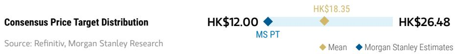

bar_line

| Consensus Price Target Distribution | Mean    | MS Estimates |
| ----------------------------------- | ------- | ------------------------ |
| HK$12.00                            |         |                          |
| HK$18.35                            |         |                          |
| HK$26.48                            |         |                          |

RISK REWARD CHART AND OPTIONS IMPLIED PROBABILITIES (12M)   
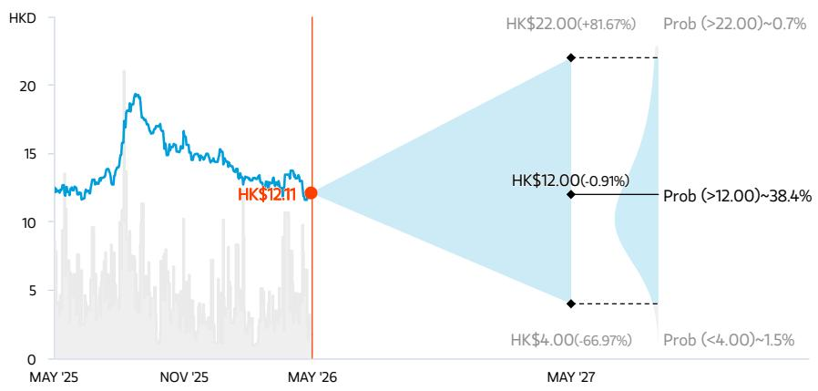

line

| Date    | Value     |
|---------|-----------|
| MAY '25 | HK$12.11  |
| MAY '26 | HK$12.00  |
| MAY '27 | HK$4.00   |
| Prob    | Prob (>22.00) ~0.7% |
| Prob (Prob) | Prob (>12.00) ~38.4% |
| Prob (Prob) | Prob (<4.00) ~1.5% |

Key: — Historical Stock Performance ● Current Stock Price ◆ Price Target   
Source: Refinitiv, MS, MS Institutional Equities Division. The probabilities of our Bull, Base, and Bear case scenarios playing out were estimated with implied volatility data from the options market as of 8 May 2026. All figures are approximate risk-neutral probabilities of the stock reaching beyond the scenario price in either three-months' or one-years' time. View explanation of Options Probabilities methodology here

# EQUAL-WEIGHT THESIS

■ The company's product premiumization remains intact with the rollout of the Tank series, but its NEV strategy looks a bit conservative compared to peers.   
■ Despite exports sustaining good momentum, overseas sales could face growing margin pressure from Russia's scrappage tax hike and higher tariffs in Brazil.   
■ With local peers rolling out L2 ADAS features on mass market models, GWM may need to either accelerate the ADAS rollout or cut prices to stay competitive.

Consensus Rating Distribution   
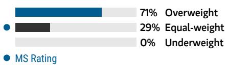

bar

| Category | Value (%) |
|---|---|
| Overweight | 71 |
| Equal-weight | 29 |
| Underweight | 0 |
| MS Rating | |

Source: Refinitiv, MS

# Risk Reward Themes

Electric Vehicles: Positive

Pricing Power: Negative

View descriptions of Risk Rewards Themes here

# BULL CASE

# 20x 2026E P/E

Stronger-than-expected SUV sales and margin expansion: Haval's new models see better-than-expected sales volume. The Haval brand achieves higher-than-expected sales volume with fewer-than-expected discounts, therefore gross margin surprises on the upside. More modest supply shortage than expected.

# HK\$22.00

# BASE CASE

# 11x 2026E P/E

Deferred tax rebates from Russia and new models under Ora and WEY's new platforms may power stronger earnings recovery in 2026. That said, we stay cautious on fiercer domestic headwinds in 2026, while Russian demand uncertainties remain an overhang.

# HK\$12.00

# BEAR CASE

# HK\$4.00

# 3x 2026E P/E

Tougher-than-expected competition in the SUV segment: Fierce competition in the SUV segment along with price competition drags down prices and margins for GWM in 2026.

# Risk Reward – Great Wall Motor Company Limited (2333.HK)

KEY EARNINGS INPUTS 

<table><tr><td>Drivers</td><td>2025</td><td>2026e</td><td>2027e</td><td>2028e</td></tr><tr><td>Haval Sales Volume</td><td>935,803.7</td><td>982,593.9</td><td>1,031,723.6</td><td>1,083,309.7</td></tr><tr><td>Haval ASP (Rmb)</td><td>111,035</td><td>114,366</td><td>117,797</td><td>121,331</td></tr><tr><td>WEY Sales Volume</td><td>93,466</td><td>102,813</td><td>113,094</td><td>124,403</td></tr><tr><td>WEY ASP (Rmb)</td><td>188,175</td><td>197,584</td><td>207,463</td><td>217,836</td></tr><tr><td>Ora Sales Volume</td><td>267,745</td><td>307,906</td><td>354,092</td><td>407,206</td></tr></table>

# INVESTMENT DRIVERS

• Sales of Haval brand   
• Sales of WEY brand   
• Sales of ORA brand   
- Pickup in sales

# GLOBAL REVENUE EXPOSURE

0-10% Latin America   
0-10% MEA   
90-100% Mainland China

Source: MS Estimate View explanation of regional hierarchies here

# MS ALPHA MODELS

1/5

MOST

3 Month

Horizon

Source: Refinitiv, FactSet, MS; 1 is the highest favored Quintile and 5 is the least favored Quintile

# RISKS TO PT/RATING

# RISKS TO UPSIDE

- Higher-than-expected adjusted profitability in 2026.   
• Better SUV sales in China.   
- Successful ramp-up of new SUVs in 2026.   
- Successful turnaround for WEY brand via hybrid model introduction.

# RISKS TO DOWNSIDE

• Lower-than-expected profitability in 2026.   
• Deterioration of SUV demand in China.   
- Disrupted margin expansion amid any intensified competition.

# OWNERSHIP POSITIONING

Inst. Owners, % Active

23.7%

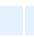

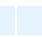

Source: Refinitiv, MS

# MS ESTIMATES VS. CONSENSUS

FY Dec 2026e

Sales /

Revenue

(Rmb, mn)

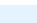

EDITDA

EBITDA

(Rmb, mn)

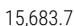

Net income

(Rmb, mn)

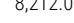

EPS

(Rmb)

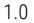

Source: Refinitiv, MS

# Risk Reward – Great Wall Motor Company Limited (601633.SS)

NEV transition - a long road ahead; valuation appears stretched

# PRICE TARGET Rmb14.00

We apply a 25% premium to our H-share PT, reflecting the level where arbitrage trades in dual-listed situations become largely uneconomical.

bar_line

| Rating       | Value   |
| ------------ | ------- |
| Rmb13.10     | Rmb13.10 |
| Rmb24.02     | Rmb24.02 |
| Rmb34.60     | Rmb34.60 |

RISK REWARD CHART   

line

| Date     | Historical Stock Performance | Current Stock Price | Price Target |
| -------- | ---------------------------- | ------------------- | ------------ |
| MAY '26  | Rmb 19.80                    | Rmb 19.80           | Rmb 19.80    |
| MAY '27  | Rmb 30.00 (+51.52%)         | Rmb 14.00 (-29.29%) | Rmb 5.00 (-74.75%) |

Source: Refinitiv, MS

# UNDERWEIGHT THESIS

■ The company's product premiumization remains intact with the rollout of the Tank series, but its NEV strategy looks a bit conservative compared to peers.   
■ Despite exports sustaining good momentum, overseas sales could face growing margin pressure from Russia's scrappage tax hike and higher tariffs in Brazil.   
- With local peers rolling out L2 ADAS features on mass market models, GWM may need to either accelerate the ADAS rollout or cut prices to stay competitive.
- We are UW on GWM-A due to our view of its stretched valuation.

Consensus Rating Distribution   

bar

| Category     | Value  |
| ------------ | ------ |
| Overweight   | 64%    |
| Equal-weight | 14%    |
| Underweight  | 21%    |

Source: Refinitiv, MS

# Risk Reward Themes

Electric Vehicles: Positive Pricing Power: Negative

View descriptions of Risk Rewards Themes here

# BULL CASE

# 27x 2026E P/E

Stronger-than-expected SUV sales and margin expansion: Haval's new models see better-than-expected sales volume. The Haval brand achieves higher-than-expected sales volume with fewer-than-expected discounts, therefore gross margin surprises on the upside. We assign a 50% A-H share premium in the bull case (average level since 2019), vs. 20% for the base and bear cases, to capture the extreme A-share sentiment.

# Rmb30.00

# BASE CASE

# 13x 2026E P/E

Deferred tax rebates from Russia and new models under Ora and WEY's new platforms may power stronger earnings recovery in 2026. That said, we stay cautious on fiercer domestic headwinds in 2026, while Russian demand uncertainties remain an overhang.

# Rmb14.00

# BEAR CASE

# 4x 2026E P/E

Tougher-than-expected competition in the SUV segment: Fierce competition in the SUV segment drags down prices and margins for GWM in 2026.

# Rmb5.00

# Risk Reward – Great Wall Motor Company Limited (601633.SS)

KEY EARNINGS INPUTS 

<table><tr><td>Drivers</td><td>2025</td><td>2026e</td><td>2027e</td><td>2028e</td></tr><tr><td>Haval Sales Volume</td><td>935,803.7</td><td>982,593.9</td><td>1,031,723.6</td><td>1,083,309.7</td></tr><tr><td>Haval ASP (Rmb)</td><td>111,035</td><td>114,366</td><td>117,797</td><td>121,331</td></tr><tr><td>WEY Sales Volume</td><td>93,466</td><td>102,813</td><td>113,094</td><td>124,403</td></tr><tr><td>WEY ASP (Rmb)</td><td>188,175</td><td>197,584</td><td>207,463</td><td>217,836</td></tr><tr><td>Ora Sales Volume</td><td>267,745</td><td>307,906</td><td>354,092</td><td>407,206</td></tr></table>

# INVESTMENT DRIVERS

• Sales of Haval brand   
• Sales of WEY brand   
• Sales of ORA brand   
- Pickup in sales

# GLOBAL REVENUE EXPOSURE

0-10% Latin America   
0-10% MEA   
90-100% Mainland China

Source: MS Estimate View explanation of regional hierarchies here

# MS ALPHA MODELS

1/5

MOST

3 Month

Horizon

Source: Refinitiv, FactSet, MS; 1 is the highest favored Quintile and 5 is the least favored Quintile

# RISKS TO PT/RATING

# RISKS TO UPSIDE

• Higher-than-expected profitability in 2026   
- Successful ramp-up of new SUVs in 2026   
- Successful turnaround for WEY brand   
- Expanding A/H premium

# RISKS TO DOWNSIDE

- Lower-than-expected profitability in 2026, from higher spending on sales and marketing with new model introduction   
- Disrupted margin expansion amid any intensified competition   
• Deterioration of SUV demand in China   
- Narrowing A/H premium

# OWNERSHIP POSITIONING

Inst. Owners, % Active

71.3%

Source: Refinitiv, MS

# MS ESTIMATES VS. CONSENSUS

FY Dec 2026e

Sales /

Revenue

(Rmb, mn)

EBITDA

EBITDA (Rmb, mn)

15,683.7

Net income

(Rmb, mn)

9.144.0

EPS

(Rmb)

Mean

◆M

organ Stanley Estimates

Source: Refinitiv, MS

# Risk Reward Reference links

1. View explanation of Options Probabilities methodology -   
Options\_Probabilities\_Exhibit\_Link.pdf   
2. View descriptions of Risk Rewards Themes - RR\_Themes\_Exhibit\_Link.pdf   
3. View explanation of regional hierarchies - GEG\_Exhibit\_Link.pdf   
4. View explanation of Theme/Exposure methodology -   
ESG\_Sustainable\_Solutions\_External\_Link.pdf   
5. View explanation of HERS methodology - ESG\_HERS\_External\_Link.pdf

# Disclosure Section

The information and opinions in MS were prepared or are disseminated by MS Asia Limited (which accepts the responsibility for its contents) and/or MS Asia (Singapore) Pte. (Registration number 199206298Z) and/or MS Asia (Singapore) Securities Pte Ltd (Registration number 200008434H), regulated by the Monetary Authority of Singapore (which accepts legal responsibility for its contents and should be contacted with respect to any matters arising from, or in connection with, MS), and/or MS Taiwan Limited and/or MS & Co International plc, Seoul Branch, and/or MS Australia Limited (A.B.N. 67 003 734 576, holder of Australian financial services license No. 233742, which accepts responsibility for its contents), and/or MS Wealth Management Australia Pty Ltd (A.B.N. 19 009 145 555, holder of Australian financial services license No. 240813, which accepts responsibility for its contents), and/or MS India Company Private Limited having Corporate Identification No (CIN) U22990MH1998PTC115305, regulated by the Securities and Exchange Board of India ("SEBI") and holder of licenses as a Research Analyst (SEBI Registration No. INH000001105); Stock Broker (SEBI Stock Broker Registration No. INZ000244438), Merchant Banker (SEBI Registration No. INM000011203), and depository participant with National Securities Depository Limited (SEBI Registration No. IN-DP-NSDL-567-2021) having registered office at Altimus, Level 39 & 40, Pandurang Budhkar Marg, Worli, Mumbai 400018, India; Telephone no. +91-22-61181000; Compliance Officer Details: Mr. Tejarshi Hardas, Tel. No.: +91-22-61181000 or Email: tejarshi.hardas@morganstanley.com; Grievance officer details: Mr. Tejarshi Hardas, Tel. No.: +91-22-61181000 or Email: msic-compliance@morganstanley.com which accepts the responsibility for its contents and should be contacted with respect to any matters arising from, or in connection with, MS, and their affiliates (collectively, "MS"). MS India Company Private Limited (MSICPL) may use AI tools in providing research services. All recommendations contained herein are made by the duly qualified research analysts.

For important disclosures, stock price charts and equity rating histories regarding companies that are the subject of this report, please see the MS Disclosure Website at www.morganstanley.com/eqr/disclosures/webapp/generalresearch, or contact your investment representative or MS at 1585 Broadway, (Attention: Research Management), New York, NY, 10036 USA.

For valuation methodology and risks associated with any recommendation, rating or price target referenced in this research report, please contact the Client Support Team as follows: US/Canada +1 800 303-2495; Hong Kong +852 2848-5999; Latin America +1 718 754-5444 (U.S.); London +44 (0)20-7425-8169; Singapore +65 6834-6860; Sydney +61 (0)2-9770-1505; Tokyo +81 (0)3-6836-9000. Alternatively you may contact your investment representative or MS at 1585 Broadway, (Attention: Research Management), New York, NY 10036 USA.

# Analyst Certification

The following analysts hereby certify that their views about the companies and their securities discussed in this report are accurately expressed and that they have not received and will not receive direct or indirect compensation in exchange for expressing specific recommendations or views in this report: Tim Hsiao; Shelley Wang, CFA; Joey Xu, CFA.

# Global Research Conflict Management Policy

MS has been published in accordance with our conflict management policy, which is available at www.morganstanley.com/institutional/research/conflictpolicies. A Portuguese version of the policy can be found at www.morganstanley.com.br

# Important Regulatory Disclosures on Subject Companies

As of April 30, 2026, MS beneficially owned 1% or more of a class of common equity securities of the following companies covered in MS: Brilliance China Automotive, BYD Company Limited, EHang Holdings Ltd, Geely Automobile Holdings, Great Wall Motor Company Limited, Li Auto Inc., NIO Inc., Suzhou Recodeal Interconnect System, Voyah Automotive Technology Co. Ltd., WeRide Inc, XPeng Inc..

Within the last 12 months, MS managed or co-managed a public offering (or 144A offering) of securities of Horizon Robotics, NIO Inc., WeRide Inc, Zhongsheng Group Holdings. Within the last 12 months, MS has received compensation for investment banking services from Huizhou Desay SV Automotive Co Ltd, NIO Inc., WeRide Inc.

In the next 3 months, MS expects to receive or intends to seek compensation for investment banking services from BYD Company Limited, Changzhou Xingyu Automotive Lighting Sys, Chongqing Changan Automobile, EHang Holdings Ltd, Fuyao Glass Industry Group, Geely Automobile Holdings, Great Wall Motor Company Limited, Hesai Group, Huayu Automotive, Huizhou Desay SV Automotive Co Ltd, Li Auto Inc., Minth Group Limited, Ningbo Joyson Electronic Corp, Ningbo Tuopu Group Co Ltd, NIO Inc., SAIC Motor Corp. Ltd., WeRide Inc, XPeng Inc., Zhongsheng Group Holdings.

Within the last 12 months, MS has received compensation for products and services other than investment banking services from BYD Company Limited, EHang Holdings Ltd, Geely Automobile Holdings, Hesai Group, Horizon Robotics, Minth Group Limited, Zhongsheng Group Holdings.

Within the last 12 months, MS has provided or is providing investment banking services to, or has an investment banking client relationship with, the following company: BYD Company Limited, Changzhou Xingyu Automotive Lighting Sys, Chongqing Changan Automobile, EHang Holdings Ltd, Fuyao Glass Industry Group, Geely Automobile Holdings, Great Wall Motor Company Limited, Hesai Group, Horizon Robotics, Huayu Automotive, Huizhou Desay SV Automotive Co Ltd, Li Auto Inc., Minth Group Limited, Ningbo Joyson Electronic Corp, Ningbo Tuopu Group Co Ltd, NIO Inc., SAIC Motor Corp. Ltd., WeRide Inc, XPeng Inc., Zhongsheng Group Holdings.

Within the last 12 months, MS has either provided or is providing non-investment banking, securities-related services to and/or in the past has entered into an agreement to provide services or has a client relationship with the following company: BYD Company Limited, China MeiDong Auto Holdings Ltd, EHang Holdings Ltd, Geely Automobile Holdings, Hesai Group, Horizon Robotics, Minth Group Limited, NIO Inc., Zhongsheng Group Holdings.

The equity research analysts or strategists principally responsible for the preparation of MS have received compensation based upon various factors, including quality of research, investor client feedback, stock picking, competitive factors, firm revenues and overall investment banking revenues. Equity Research analysts' or strategists' compensation is not linked to investment banking or capital markets transactions performed by MS or the profitability or revenues of particular trading desks.

MS and its affiliates do business that relates to companies/instruments covered in MS, including market making, providing liquidity, fund management, commercial banking, extension of credit, investment services and investment banking. MS sells to and buys from customers the securities/instruments of companies covered in MS on a principal basis. MS may have a position in the debt of the Company or instruments discussed in this report. MS trades or may trade as principal in the debt securities (or in related derivatives) that are the subject of the debt research report.

Certain disclosures listed above are also for compliance with applicable regulations in non-US jurisdictions.

# STOCK RATINGS

MS uses a relative rating system using terms such as Overweight, Equal-weight, Not-Rated or Underweight (see definitions below). MS does not assign ratings of Buy, Hold or Sell to the stocks we cover. Overweight, Equal-weight, Not-Rated and Underweight are not the equivalent of buy, hold and sell. Investors should carefully read the definitions of all ratings used in MS. In addition, since MS contains more complete information concerning the analyst's views, investors should carefully read MS, in its entirety, and not infer the contents from the rating alone. In any case, ratings (or research) should not be used or relied upon as investment advice. An investor's decision to buy or sell a stock should depend on individual circumstances (such as the investor's existing holdings) and other considerations.

# Global Stock Ratings Distribution

(as of April 30, 2026)

The Stock Ratings described below apply to MS's Fundamental Equity Research and do not apply to Debt Research produced by the Firm.

For disclosure purposes only (in accordance with FINRA requirements), we include the category headings of Buy, Hold, and Sell alongside our ratings of Overweight, Equal-weight, Not-Rated and Underweight. MS does not assign ratings of Buy, Hold or Sell to the stocks we cover. Overweight, Equal-weight, Not-Rated and Underweight are not the equivalent of buy, hold, and sell but represent recommended relative weightings (see definitions below). To satisfy regulatory requirements, we correspond Overweight, our most positive stock rating, with a buy recommendation; we correspond Equal-weight and Not-Rated to hold and Underweight to sell recommendations, respectively.

<table><tr><td></td><td colspan="2">Coverage Universe</td><td colspan="3">Investment Banking Clients (IBC)</td><td colspan="2">Other Material Investment ServicesClients (MISC)</td></tr><tr><td>Stock RatingCategory</td><td>Count</td><td>% of Total</td><td>Count</td><td>% of Total IBC</td><td>% of RatingCategory</td><td>Count</td><td>% of Total OtherMISC</td></tr><tr><td>Overweight/Buy</td><td>1546</td><td>42%</td><td>467</td><td>51%</td><td>30%</td><td>709</td><td>44%</td></tr><tr><td>Equal-weight/Hold</td><td>1568</td><td>43%</td><td>358</td><td>39%</td><td>23%</td><td>715</td><td>44%</td></tr><tr><td>Not-Rated/Hold</td><td>4</td><td>0%</td><td>0</td><td>0%</td><td>0%</td><td>1</td><td>0%</td></tr><tr><td>Underweight/Sell</td><td>555</td><td>15%</td><td>84</td><td>9%</td><td>15%</td><td>202</td><td>12%</td></tr><tr><td>Total</td><td>3,673</td><td></td><td>909</td><td></td><td></td><td>1627</td><td></td></tr></table>

Data include common stock and ADRs currently assigned ratings. Investment Banking Clients are companies from whom MS received investment banking compensation in the last 12 months. Due to rounding off of decimals, the percentages provided in the "% of total" column may not add up to exactly 100 percent.

# Analyst Stock Ratings

Overweight (O). The stock's total return is expected to exceed the average total return of the analyst's industry (or industry team's) coverage universe, on a risk-adjusted basis, over the next 12-18 months.

Equal-weight (E). The stock's total return is expected to be in line with the average total return of the analyst's industry (or industry team's) coverage universe, on a risk-adjusted basis, over the next 12-18 months.

Not-Rated (NR). Currently the analyst does not have adequate conviction about the stock's total return relative to the average total return of the analyst's industry (or industry team's) coverage universe, on a risk-adjusted basis, over the next 12-18 months.

Underweight (U). The stock's total return is expected to be below the average total return of the analyst's industry (or industry team's) coverage universe, on a risk-adjusted basis, over the next 12-18 months.

Unless otherwise specified, the time frame for price targets included in MS is 12 to 18 months.

# Analyst Industry Views

Attractive (A): The analyst expects the performance of his or her industry coverage universe over the next 12-18 months to be attractive vs. the relevant broad market benchmark, as indicated below.

In-Line (I): The analyst expects the performance of his or her industry coverage universe over the next 12-18 months to be in line with the relevant broad market benchmark, as indicated below. Cautious (C): The analyst views the performance of his or her industry coverage universe over the next 12-18 months with caution vs. the relevant broad market benchmark, as indicated below. Benchmarks for each region are as follows: North America - S&P 500; Latin America - relevant MSCI country index or MSCI Latin America Index; Europe - MSCI Europe; Japan - TOPIX; Asia - relevant MSCI country index or MSCI sub-regional index or MSCI AC Asia Pacific ex Japan Index.

# Important Disclosures for MS Smith Barney LLC Customers

Important disclosures regarding any material conflict of interest that can reasonably be expected to have influenced MS Smith Barney LLC's choice of a third-party research provider or the subject company of a third-party research report, are available on the MS Wealth Management disclosure website at www.morganstanley.com/online/researchdisclosures. For MS specific disclosures, you may refer to https://www.morganstanley.com/eqr/disclosures/webapp/generalresearch.

Each MS report is reviewed and approved on behalf of MS Smith Barney LLC. This review and approval is conducted by the same person who reviews the research report on behalf of MS. This could create a conflict of interest.

# Other Important Disclosures

MS policy is to update research reports as and when the Research Analyst and Research Management deem appropriate, based on developments with the issuer, the sector, or the market that may have a material impact on the research views or opinions stated therein. In addition, certain Research publications are intended to be updated on a regular periodic basis (weekly/monthly/quarterly/annual) and will ordinarily be updated with that frequency, unless the Research Analyst and Research Management determine that a different publication schedule is appropriate based on current conditions.

MS is not acting as a municipal advisor and the opinions or views contained herein are not intended to be, and do not constitute, advice within the meaning of Section 975 of the Dodd-Frank Wall Street Reform and Consumer Protection Act.

MS produces an equity research product called a "Tactical Idea." Views contained in a "Tactical Idea" on a particular stock may be contrary to the recommendations or views expressed in research on the same stock. This may be the result of differing time horizons, methodologies, market events, or other factors. For all research available on a particular stock, please contact your sales representative or go to Matrix at http://www.morganstanley.com/matrix.

MS is provided to our clients through our proprietary research portal on Matrix and also distributed electronically by MS to clients. Certain, but not all, MS products are also made available to clients through third-party vendors or redistributed to clients through alternate electronic means as a convenience. For access to all available MS, please contact your sales representative or go to Matrix at http://www.morganstanley.com/matrix.

Any access and/or use of MS is subject to MS's Terms of Use (http://www.morganstanley.com/terms.html). By accessing and/or using MS, you are indicating that you have read and agree to be bound by our Terms of Use (http://www.morganstanley.com/terms.html). In addition you consent to MS processing your personal data and using cookies in accordance with our Privacy Policy and our Global Cookies Policy (http://www.morganstanley.com/privacy\_pledge.html), including for the purposes of setting your preferences and to collect readership data so that we can deliver better and more personalized service and products to you. To find out more information about how MS processes personal data, how we use cookies and how to reject cookies see our Privacy Policy and our Global Cookies Policy (http://www.morganstanley.com/privacy\_pledge.html). Please use the provided link to review the Terms and Conditions and Most Important Terms and Conditions for MS India Company Private Limited (https://www.morganstanley.com/assets/pdfs/about-us-global-offices/india/Terms\_and\_conditions.pdf) and the following link to review the audit report (https://ny.matrix.ms.com/eqr/research/webapp/researchdocs/MSICPL\_Morgan\_Stanley\_Research\_Audit\_Report.pdf).

If you do not agree to our Terms of Use and/or if you do not wish to provide your consent to MS processing your personal data or using cookies please do not access our research. MS does not provide individually tailored investment advice. MS has been prepared without regard to the circumstances and objectives of those who receive it. MS recommends that investors independently evaluate particular investments and strategies, and encourages investors to seek the advice of a financial adviser. The appropriateness of an investment or strategy will depend on an investor's circumstances and objectives. The securities, instruments, or strategies discussed in MS may not be suitable for all investors, and certain investors may not be eligible to purchase or participate in some or all of them. MS is not an offer to buy or sell or the solicitation of an offer to buy or sell any security/instrument or to participate in any particular trading strategy. The value of and income from your investments may vary because of changes in interest rates, foreign exchange rates, default rates, prepayment rates, securities/instruments prices, market indexes, operational or financial conditions of companies or other factors. There may be time limitations on the exercise of options or other rights in securities/instruments transactions. Past performance is not necessarily a guide to future performance. Estimates of future performance are based on assumptions that may not be realized. If provided, and unless otherwise stated, the closing price on the cover page is that of the primary exchange for the subject company's securities/instruments.

The fixed income research analysts, strategists or economists principally responsible for the preparation of MS have received compensation based upon various factors, including quality, accuracy and value of research, firm profitability or revenues (which include fixed income trading and capital markets profitability or revenues), client feedback and competitive factors. Fixed Income Research analysts', strategists' or economists' compensation is not linked to investment banking or capital markets transactions performed by MS or the profitability or revenues of particular trading desks.

The "Important Regulatory Disclosures on Subject Companies" section in MS lists all companies mentioned where MS owns 1% or more of a class of common equity securities of the companies. For all other companies mentioned in MS, MS may have an investment of less than 1% in securities/instruments or derivatives of securities/instruments of companies and may trade them in ways different from those discussed in MS. Employees of MS not involved in the preparation of MS may have investments in securities/instruments or derivatives of securities/instruments of companies mentioned and may trade them in ways different from those discussed in MS. Derivatives may be issued by MS or associated persons.

With the exception of information regarding MS, MS is based on public information. MS makes every effort to use reliable, comprehensive information, but we make no representation that it is accurate or complete. We have no obligation to tell you when opinions or information in MS change apart from when we intend to discontinue equity research coverage of a subject company. Facts and views presented in MS have not been reviewed by, and may not reflect information known to, professionals in other MS business areas, including investment banking personnel.

MS personnel may participate in company events such as site visits and are generally prohibited from accepting payment by the company of associated expenses unless pre-approved by authorized members of Research management.

MS may make investment decisions that are inconsistent with the recommendations or views in this report.

To our readers based in Taiwan or trading in Taiwan securities/instruments: Information on securities/instruments that trade in Taiwan is distributed by MS Taiwan Limited ("MSTL"). Such information is for your reference only. The reader should independently evaluate the investment risks and is solely responsible for their investment decisions. MS may not be distributed to the public media or quoted or used by the public media without the express written consent of MS. Any non-customer reader within the scope of Article 7-1 of the Taiwan Stock Exchange Recommendation Regulations accessing and/or receiving MS is not permitted to provide MS to any third party (including but not limited to related parties, affiliated companies and any other third parties) or engage in any activities regarding MS which may create or give the appearance of creating a conflict of interest. Information on securities/instruments that do not trade in Taiwan is for informational purposes only and is not to be construed as a recommendation or a solicitation to trade in such securities/instruments. MSTL may not execute transactions for clients in these securities/instruments.

Certain information in MS was sourced by employees of the Shanghai Representative Office of MS Asia Limited for the use of MS Asia Limited. MS is not incorporated under PRC law and the research in relation to this report is conducted outside the PRC. MS does not constitute an offer to sell or the solicitation of an offer to buy any securities in the PRC. PRC investors shall have the relevant qualifications to invest in such securities and shall be responsible for obtaining all relevant approvals, licenses, verifications and/or registrations from the relevant governmental authorities themselves. Neither this report nor any part of it is intended as, or shall constitute, provision of any consultancy or advisory service of securities investment as defined under PRC law. Such information is provided for your reference only.

MS is disseminated in Brazil by MS C.T.V.M. S.A. located at Av. Brigadeiro Faria Lima, 3600, 6th floor, São Paulo - SP, Brazil; and is regulated by the Comissão de Valores Mobiliários; in Mexico by MS México, Casa de Bolsa, S.A. de C.V which is regulated by Comision Nacional Bancaria y de Valores. Paseo de los Tamarindos 90, Torre 1, Col. Bosques de las Lomas Floor 29, 05120 Mexico City; in Japan by MS MUFG Securities Co., Ltd. and, for Commodities related research reports only, MS Capital Group Japan Co., Ltd; in Hong Kong by MS Asia Limited (which accepts responsibility for its contents) and by MS Bank Asia Limited; in Singapore by MS Asia (Singapore) Pte. (Registration number 199206298Z) and/or MS Asia (Singapore) Securities Pte Ltd (Registration number 200008434H), regulated by the Monetary Authority of Singapore (which accepts legal responsibility for its contents and should be contacted with respect to any matters arising from, or in connection with, MS) and by MS Bank Asia Limited, Singapore Branch (Registration number T14FC0118J); in Australia to "wholesale clients" within the meaning of the Australian Corporations Act by MS Australia Limited A.B.N. 67 003 734 576, holder of Australian financial services license No. 233742, which accepts responsibility for its contents; in Australia to "wholesale clients" and "retail clients" within the meaning of the Australian Corporations Act by MS Wealth Management Australia Pty Ltd (A.B.N. 19 009 145 555, holder of Australian financial services license No. 240813, which accepts responsibility for its contents; in Korea by MS & Co International plc, Seoul Branch; in India by MS India Company Private Limited having Corporate Identification No (CIN) U22990MH1998PTC115305, regulated by the Securities and Exchange Board of India ("SEBI") and holder of licenses as a Research Analyst (SEBI Registration No. INH000001105); Stock Broker (SEBI Stock Broker Registration No. INZ000244438), Merchant Banker (SEBI Registration No. INM000011203), and depository participant with National Securities Depository Limited (SEBI Registration No. IN-DP-NSDL-567-2021) having registered office at Altimus, Level 39 & 40, Pandurang Budhkar Marg, Worli, Mumbai 400018, India;

Telephone no. +91-22-61181000; Compliance Officer Details: Mr. Tejarshi Hardas, Tel. No.: +91-22-61181000 or Email: tejarshi.hardas@morganstanley.com; Grievance officer details: Mr. Tejarshi Hardas, Tel. No.: +91-22-61181000 or Email: msic-compliance@morganstanley.com. MS India Company Private Limited (MSICPL) may use AI tools in providing research services. All recommendations contained herein are made by the duly qualified research analysts; in Canada by MS Canada Limited; in Germany and the European Economic Area where required by MS Europe S.E., authorised and regulated by Bundesanstalt fuer Finanzdienstleistungsaufsicht (BaFin) under the reference number 149169; in the US by MS & Co. LLC, which accepts responsibility for its contents. MS & Co. International plc, authorized by the Prudential Regulation Authority and regulated by the Financial Conduct Authority and the Prudential Regulation Authority, disseminates in the UK research that it has prepared, and research which has been prepared by any of its affiliates, only to persons who (i) are investment professionals falling within Article 19(5) of the Financial Services and Markets Act 2000 (Financial Promotion) Order 2005 (as amended, the "Order"); (ii) are persons who are high net worth entities falling within Article 49(2)(a) to (d) of the Order; or (iii) are persons to whom an invitation or inducement to engage in investment activity (within the meaning of section 21 of the Financial Services and Markets Act 2000, as amended) may otherwise lawfully be communicated or caused to be communicated. RMB MS Proprietary Limited is a member of the JSE Limited and A2X (Pty) Ltd. RMB MS Proprietary Limited is a joint venture owned equally by MS International Holdings Inc. and RMB Investment Advisory (Proprietary) Limited, which is wholly owned by FirstRand Limited. The information in MS is being disseminated by MS Saudi Arabia, regulated by the Capital Market Authority in the Kingdom of Saudi Arabia, and is directed at Sophisticated investors only.

MS Hong Kong Securities Limited is the liquidity provider/market maker for securities of Brilliance China Automotive, BYD Company Limited, Geely Automobile Holdings, Great Wall Motor Company Limited, Guangzhou Automobile Group, Hesai Group, Horizon Robotics, Li Auto Inc., NIO Inc., XPeng Inc., Zhejiang Sanhua Intelligent Controls, Zhongsheng Group Holdings listed on the Stock Exchange of Hong Kong Limited. An updated list can be found on HKEx website: http://www.hkex.com.hk.

The information in MS is being communicated by MS & Co. International plc (DIFC Branch), regulated by the Dubai Financial Services Authority (the DFSA) or by MS & Co. International plc (ADGM Branch), regulated by the Financial Services Regulatory Authority Abu Dhabi (the FSRA), and is directed at Professional Clients only, as defined by the DFSA or the FSRA, respectively. The financial products or financial services to which this research relates will only be made available to a customer who we are satisfied meets the regulatory criteria of a Professional Client. A distribution of the different MS Research ratings or recommendations, in percentage terms for Investments in each sector covered, is available upon request from your sales representative.

The information in MS is being communicated by MS & Co. International plc (QFC Branch), regulated by the Qatar Financial Centre Regulatory Authority (the QFCRA), and is directed at business customers and market counterparties only and is not intended for Retail Customers as defined by the QFCRA.

As required by the Capital Markets Board of Turkey, investment information, comments and recommendations stated here, are not within the scope of investment advisory activity. Investment advisory service is provided exclusively to persons based on their risk and income preferences by the authorized firms. Comments and recommendations stated here are general in nature. These opinions may not fit to your financial status, risk and return preferences. For this reason, to make an investment decision by relying solely to this information stated here may not bring about outcomes that fit your expectations.

The trademarks and service marks contained in MS are the property of their respective owners. Third-party data providers make no warranties or representations relating to the accuracy, completeness, or timeliness of the data they provide and shall not have liability for any damages relating to such data. The Global Industry Classification Standard (GICS) was developed by and is the exclusive property of MSCI and S&P.

MS, or any portion thereof may not be reprinted, sold or redistributed without the written consent of MS.

Indicators and trackers referenced in MS may not be used as, or treated as, a benchmark under Regulation EU 2016/1011, or any other similar framework.

The issuers and/or fixed income products recommended or discussed in certain fixed income research reports may not be continuously followed. Accordingly, investors should regard those fixed income research reports as providing stand-alone analysis and should not expect continuing analysis or additional reports relating to such issuers and/or individual fixed income products. MS may hold, from time to time, material financial and commercial interests regarding the company subject to the Research report.

Registration granted by SEBI and certification from the National Institute of Securities Markets (NISM) in no way guarantee performance of the intermediary or provide any assurance of returns to investors. Investment in securities market are subject to market risks. Read all the related documents carefully before investing.

Stock Ratings are subject to change. Please see latest research for each company.   
\* Historical prices are not split adjusted.   
INDUSTRY COVERAGE: China Autos & Shared Mobility 

<table><tr><td>COMPANY (TICKER)</td><td>RATING (AS OF)</td><td>PRICE* (05/11/2026)</td></tr><tr><td colspan="3">Joey Xu, CFA</td></tr><tr><td>Anhui Jianghuai Automobile (600418.SS)</td><td>E (08/19/2023)</td><td>Rmb51.40</td></tr><tr><td>BAIC Motor (1958.HK)</td><td>E (10/02/2025)</td><td>HK$1.35</td></tr><tr><td>Brilliance China Automotive (1114.HK)</td><td>E (03/31/2025)</td><td>HK$3.07</td></tr><tr><td>Chongqing Changan Automobile (000625.SZ)</td><td>E (03/03/2026)</td><td>Rmb9.30</td></tr><tr><td>Guangzhou Automobile Group (601238.SS)</td><td>U (10/23/2019)</td><td>Rmb6.95</td></tr><tr><td>Guangzhou Automobile Group (2238.HK)</td><td>O (05/05/2020)</td><td>HK$2.75</td></tr><tr><td>Huayu Automotive (600741.SS)</td><td>O (09/08/2020)</td><td>Rmb18.12</td></tr><tr><td>Jiangsu Changshu Automotive Trim Group (603035.SS)</td><td>E (08/14/2023)</td><td>Rmb13.41</td></tr><tr><td>Ningbo Huaxiang Electronic Co., Ltd. (002048.SZ)</td><td>E (05/05/2026)</td><td>Rmb29.71</td></tr><tr><td>SAIC Motor Corp. Ltd. (600104.SS)</td><td>O (11/25/2021)</td><td>Rmb13.56</td></tr><tr><td>Voyah Automotive Technology Co. Ltd, (7489.HK)</td><td>O (03/31/2026)</td><td>HK$5.74</td></tr><tr><td>Zhengzhou Yutong Bus Co (600066.SS)</td><td>E (09/22/2023)</td><td>Rmb35.66</td></tr><tr><td colspan="3">Shelley Wang, CFA</td></tr><tr><td>Beijing Jingwei Hirain Technologies (688326.SS)</td><td>U (09/27/2024)</td><td>Rmb90.65</td></tr><tr><td>Bethel Automotive Safety Systems Co Ltd (603596.SS)</td><td>O (12/11/2023)</td><td>Rmb32.39</td></tr><tr><td>Changzhou Xingyu Automotive Lighting Sys (601799.SS)</td><td>O (09/27/2024)</td><td>Rmb139.10</td></tr><tr><td>China MeiDong Auto Holdings Ltd (1268.HK)</td><td>E (01/08/2024)</td><td>HK$1.00</td></tr><tr><td>China Yongda Automobiles Services (3669.HK)</td><td>E (08/13/2024)</td><td>HK$1.01</td></tr><tr><td>Foryou Corporation (002906.SZ)</td><td>O (03/06/2024)</td><td>Rmb31.70</td></tr><tr><td>Fuyao Glass Industry Group (600660.SS)</td><td>E (12/01/2016)</td><td>Rmb59.40</td></tr><tr><td>Fuyao Glass Industry Group (3606.HK)</td><td>E (12/01/2016)</td><td>HK$64.00</td></tr><tr><td>Huizhou Desay SV Automotive Co Ltd (002920.SZ)</td><td>O (02/28/2025)</td><td>Rmb104.47</td></tr><tr><td>Keboda (603786.SS)</td><td>O (01/17/2024)</td><td>Rmb56.75</td></tr><tr><td>Minth Group Limited (0425.HK)</td><td>O (08/24/2015)</td><td>HK$40.96</td></tr><tr><td>NavInfo Co Ltd (002405.SZ)</td><td>U (03/06/2024)</td><td>Rmb9.40</td></tr><tr><td>Nexteer Automotive Group (1316.HK)</td><td>E (02/28/2025)</td><td>HK$5.29</td></tr><tr><td>Ningbo Joyson Electronic Corp (600699.SS)</td><td>E (03/11/2026)</td><td>Rmb28.93</td></tr><tr><td>Ningbo Tuopu Group Co Ltd (601689.SS)</td><td>E (11/12/2025)</td><td>Rmb66.96</td></tr><tr><td>Ningbo Xusheng Group Co Ltd (603305.SS)</td><td>E (06/18/2025)</td><td>Rmb16.61</td></tr><tr><td>Suzhou Recodeal Interconnect System (688800.SS)</td><td>U (09/27/2024)</td><td>Rmb127.73</td></tr><tr><td>TUHU Car Inc (9690.HK)</td><td>O (07/29/2024)</td><td>HK$13.59</td></tr><tr><td>Zhejiang Sanhua Intelligent Controls (002050.SZ)</td><td>E (11/12/2025)</td><td>Rmb51.21</td></tr><tr><td>Zhongsheng Group Holdings (0881.HK)</td><td>O (10/12/2021)</td><td>HK$7.17</td></tr><tr><td colspan="3">Tim Hsiao</td></tr><tr><td>BAIC BluePark New Energy (600733.SS)</td><td>U (08/07/2024)</td><td>Rmb7.10</td></tr><tr><td>BYD Company Limited (002594.SZ)</td><td>O (04/14/2025)</td><td>Rmb100.44</td></tr><tr><td>BYD Company Limited (1211.HK)</td><td>O (04/14/2025)</td><td>HK$101.70</td></tr><tr><td>EHang Holdings Ltd (EH.O)</td><td>O (03/13/2025)</td><td>US$10.30</td></tr><tr><td>Geely Automobile Holdings (0175.HK)</td><td>O (06/26/2024)</td><td>HK$22.44</td></tr><tr><td>Great Wall Motor Company Limited (601633.SS)</td><td>U (03/16/2022)</td><td>Rmb19.80</td></tr><tr><td>Great Wall Motor Company Limited (2333.HK)</td><td>E (01/08/2024)</td><td>HK$11.91</td></tr><tr><td>Hesai Group (HSAI.O)</td><td>O (07/28/2025)</td><td>US$21.60</td></tr><tr><td>Horizon Robotics (9660.HK)</td><td>O (12/02/2024)</td><td>HK$6.87</td></tr><tr><td>Li Auto Inc. (LI.O)</td><td>O (08/24/2020)</td><td>US$18.00</td></tr><tr><td>Li Auto Inc. (2015.HK)</td><td>O (11/16/2021)</td><td>HK$73.85</td></tr><tr><td>NIO Inc. (9866.HK)</td><td>O (10/03/2022)</td><td>HK$46.84</td></tr><tr><td>NIO Inc. (NIO.N)</td><td>O (08/26/2020)</td><td>US$5.85</td></tr><tr><td>WeRide Inc (WRD.O)</td><td>O (11/19/2024)</td><td>US$7.51</td></tr><tr><td>XPeng Inc. (9868.HK)</td><td>O (11/16/2021)</td><td>HK$62.50</td></tr><tr><td>XPeng Inc. (XPEV.N)</td><td>O (01/29/2021)</td><td>US$15.62</td></tr></table>

© 2026 MS