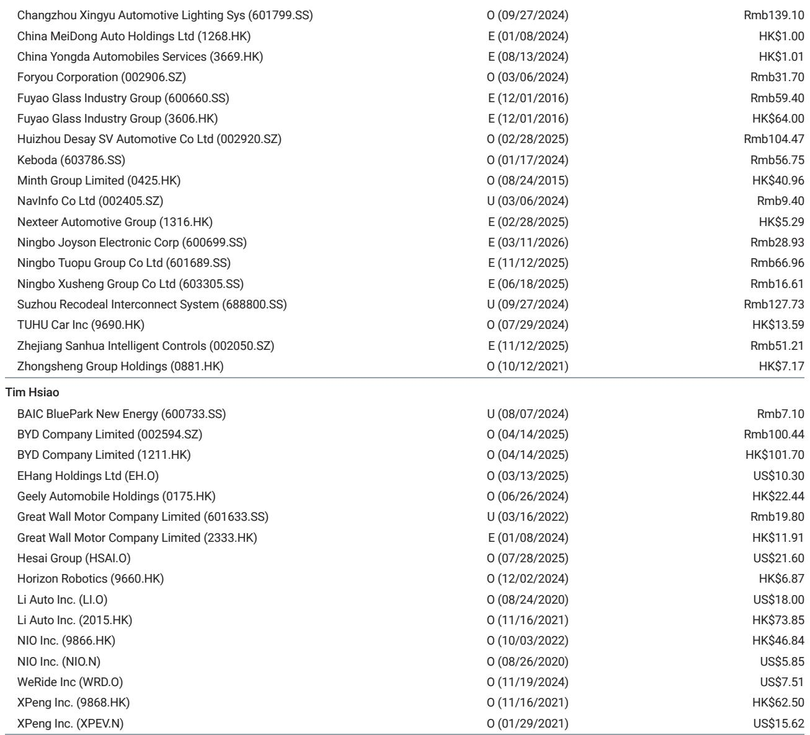
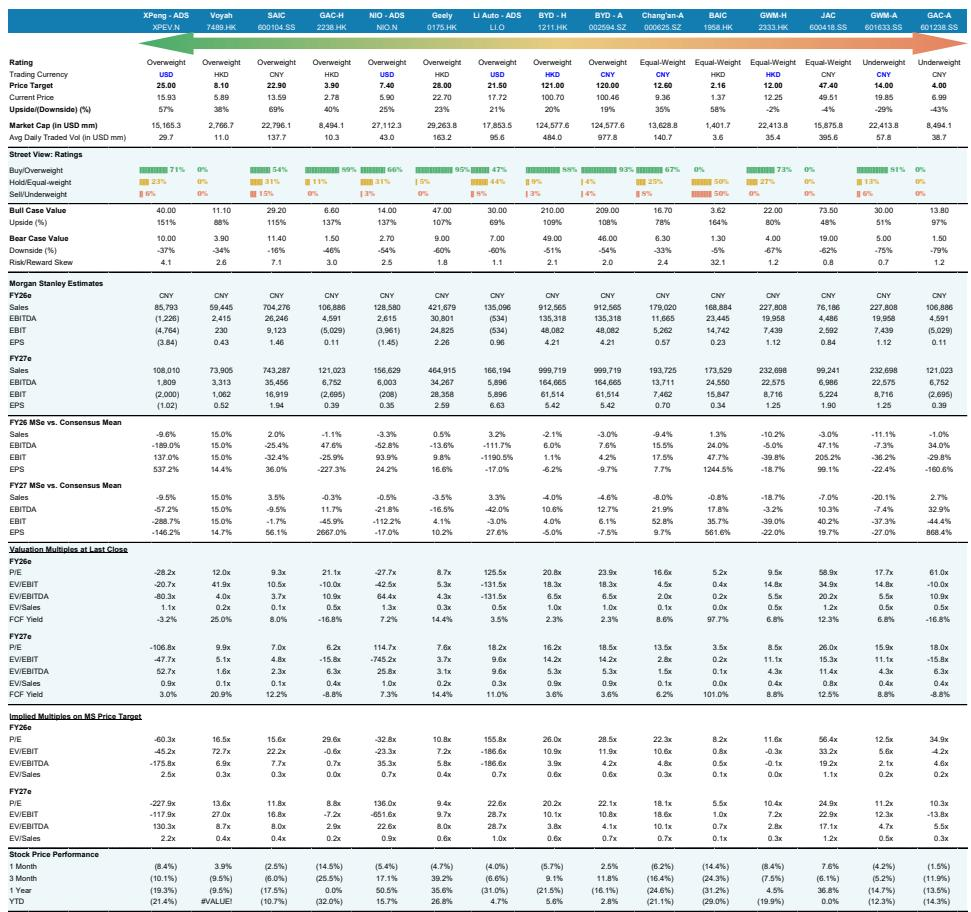
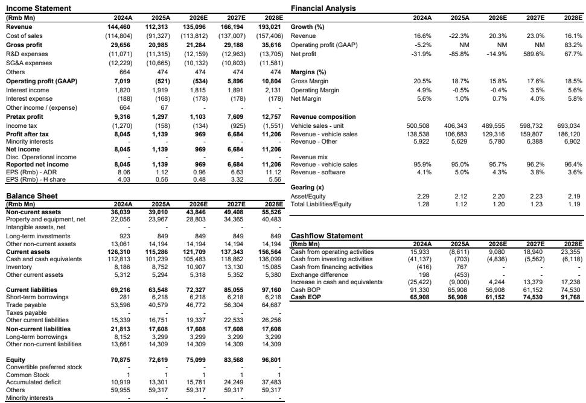

# China's Auto Industry Has Reached an Inflection Point Where Overseas Expansion and AI Investment Will Determine the Winners, Not Domestic Volume

The Chinese automotive industry is no longer a story about who can sell the most cars in China. After the first quarter of 2026, the data is clear: domestic demand is cracking under the weight of product homogenization, consumer wait-and-see behavior, and intensifying price competition that the government's own anti-involution guidelines may paradoxically prolong. Yet the same forces that are compressing margins at home are compelling a strategic reorientation that will separate the enduring franchises from the also-rans. The new competitive battleground has three dimensions: global market share, artificial intelligence capability, and brand premiumization. Investors who continue to evaluate Chinese auto companies primarily on domestic volume trajectories are using an outdated framework.

Why now matters. The first quarter of 2026 revealed a widening gap between year-to-date sales run rates and the full-year targets that management teams set with limited demand visibility back in January. Gross profit margins came in better than feared, but operating deleverage and foreign exchange headwinds persist. The Beijing Auto Show in late April laid bare the problem of product homogenization: a wave of look-alike models from nearly every major OEM, all chasing the same segments with similar specifications. The anti-involution campaign, intended to curb excessive discounting, may actually be prolonging the very dynamic it aims to stop by encouraging faster and more aggressive rollout cycles. Meanwhile, overseas growth remains robust, and the divergence between domestic stagnation and international expansion has never been wider.

The strategic pivot is already underway. Leading EV players are accelerating investments across four fronts: overseas capacity and distribution, AI and autonomous driving technology, mix upgrade toward premium segments, and commercializing in-house technologies through original equipment manufacturer partnerships. These are not incremental adjustments. They represent a fundamental reallocation of capital and management attention away from the increasingly crowded domestic mass market. The question for investors is which companies have the scale, technological depth, and financial resilience to execute on all four fronts simultaneously.

## Overseas Expansion Has Become the Primary Profit Engine, and the Gap Between Winners and Laggards Will Widen as Domestic Margins Compress

The numbers are stark. A global investment bank report now forecasts 2026 passenger vehicle export growth of 33 percent year over year, up from a prior estimate of 22 percent, with new energy vehicle exports expected to nearly double to 4.5 million units. This revision reflects a fundamental shift: overseas markets are not just a growth supplement but the primary source of incremental profitability. Based on both OEM guidance and analyst estimates, overseas unit profitability may be five to ten times higher than domestic unit profitability. When domestic margins are under pressure from price competition, raw material cost inflation, and rising research and development spending, the ability to generate outsized profits abroad becomes the single most important determinant of overall corporate returns.

The implications for stock selection are direct. Companies with established overseas distribution networks, localized production capacity, and brand recognition in key markets such as Latin America, Southeast Asia, and Europe are better positioned to capture this profit pool. BYD continues to gain share in Latin America, ASEAN, and Europe, and its overseas progress remains a positive factor even as domestic volume recovery hinges on second-generation blade battery capacity ramp-up. Geely's 25 percent year-to-date rally reflects investor recognition of its overseas upside, robust ZEEKR order backlog, and solid Galaxy model pipeline, though further upside requires progress toward its 750,000-unit overseas target. SAIC's extensive integration across the auto value chain provides a structural advantage in navigating global geopolitical tensions.

The open question is whether the export growth trajectory can sustain its current pace if trade barriers escalate or if geopolitical tensions in key markets such as Russia disrupt profitability. The report notes that Great Wall Motor faces potential volume and profitability downside in Russia following a scrappage tax hike and volatility in tax rebates, which could weigh on overseas margins. This is a reminder that overseas expansion is not frictionless, and companies with diversified geographic exposure will have an advantage over those concentrated in any single market.

## The Race to Commercialize Autonomous Driving Is Reshaping Competitive Dynamics, But the Near-Term Cost Burden Is Real

Competition in China's auto industry is pivoting from price to value, and the most important dimension of value differentiation is increasingly autonomous driving capability. L2+ penetration is expected to reach 32 percent by 2026, up from 25 percent in 2025, while L3 and L4 technologies are moving from concept toward commercialization. Every major OEM under coverage has guided for double-digit year-over-year research and development spending growth in 2026, driven by increased investment in AI, computing power, and autonomous driving. This is not optional. In a market where product homogenization is the defining problem, advanced driver assistance systems and autonomous driving capabilities represent the most credible path to differentiation.

Yet this investment comes with a near-term cost. If research and development spending growth outpaces vehicle sales volume, operating deleverage is a real risk. The report explicitly flags this tension: the key debate is whether increased R&D spending ultimately converts into meaningful non-vehicle revenue streams, such as physical AI applications including robotaxis and humanoids, and stronger autonomous-driving-driven sales over the long run. XPeng, despite a 24 percent year-to-date underperformance, is positioning its physical AI promise as a foundational valuation driver. Li Auto is pivoting toward physical AI while maintaining operational agility. NIO's upcoming ES9 and L80 launches are expected to support volume growth and margin expansion, but the company's ability to attract and retain top AI talent remains a risk.

The strategic question for investors is whether the market is properly discounting the long-term value of autonomous driving investments against the near-term earnings drag. The report suggests that autonomous-driving-focused names could see valuation re-ratings in mid-2026, as easier year-over-year comparisons and new product launches help the sector regain investor traction. But this is not a uniform re-rating. Companies that can demonstrate tangible progress toward commercialization, whether through robotaxi deployments, technology licensing, or partnerships, will be rewarded. Those that merely spend without showing results will face continued skepticism.

## Product Homogenization Creates a Window for Companies That Can Execute on Brand Premiumization and Mix Upgrade

The Beijing Auto Show underscored a troubling dynamic for the industry as a whole but an opportunity for the few companies that have managed to escape the commodity trap. Demand continues to gravitate toward premium and mid-to-large SUVs, with the 200,000 to 300,000 renminbi and above segment gaining two to three percentage points of share year over year in the first quarter of 2026. This is not a cyclical shift. It reflects a structural change in Chinese consumer preferences, driven by rising household incomes in tier-one and tier-two Cities, a desire for differentiation in an increasingly homogeneous market, and the aspirational nature of premium brands.

The challenge is that most OEMs are chasing the same premium segments with similar products. The anti-involution campaign, by encouraging faster rollout cycles, may actually be accelerating the saturation of these segments. Companies that can build genuine brand equity, through superior product quality, distinctive design language, or technological leadership, will command pricing power and margin premiums. Voyah, which the report identifies as offering an attractive risk-reward profile given its valuation discount to peers, is pursuing continuous product rollouts in 2026 to sustain sales growth momentum. Its current valuation suggests the market has not fully priced in its potential to capture premium segment share.

The decision framework for investors should focus on three indicators of premiumization success. First, average selling price trajectory: are new models launching at higher price points than the models they replace? Second, mix shift: is the proportion of sales coming from premium segments increasing quarter over quarter? Third, brand perception metrics: are the company's vehicles being cross-shopped against established premium brands or against mass-market competitors? Companies that can answer all three questions affirmatively are building durable competitive advantages. Those that cannot are likely to remain trapped in the commodity cycle.

## What the Report Does Not Yet Fully Answer: The Sustainability of Overseas Profitability and the Timing of Autonomous Driving Monetization

For all its analytical rigor, the report leaves two critical questions unresolved. The first concerns the sustainability of overseas profitability. The five-to-ten times multiple of overseas unit profitability over domestic unit profitability is striking, but it raises the question of how long this gap can persist. As more Chinese OEMs expand abroad, competition in overseas markets will intensify. Local incumbents are not standing still, and regulatory barriers, including tariffs and local content requirements, are likely to increase. The report acknowledges that Great Wall Motor faces headwinds in Russia and that global geopolitical tensions create uncertainty for SAIC, but it does not model a scenario in which overseas margins compress meaningfully. Investors need to stress-test their assumptions about how much of the overseas profit pool is structural versus temporary.

The second unresolved question is the timing and magnitude of autonomous driving monetization. The report is optimistic about the potential for physical AI applications, including robotaxis and humanoids, to generate non-vehicle revenue streams. But it does not provide a detailed timeline or revenue forecast for these initiatives. The gap between R&D spending and commercial returns could be wider and longer than current valuations imply. XPeng's physical AI promise is cited as a potential re-rating catalyst, but the company is still loss-making at the operating level. Li Auto's pivot toward physical AI is noted as a positive development, but the report also flags execution and product differentiation risks. Investors should ask: at what point does autonomous driving investment stop being a cost center and start being a profit center? The report does not answer this question, and the range of outcomes is wide.

## A Decision Framework for Investors: Three Filters for Stock Selection in the New Competitive Landscape

Given the strategic shifts underway, investors need a disciplined framework for evaluating Chinese auto companies. The first filter is overseas exposure and execution capability. Companies that have already established meaningful overseas revenue streams, localized production capacity, and diversified geographic presence should be preferred over those that are still in the early stages of international expansion. The second filter is autonomous driving investment efficiency. Companies that can demonstrate a clear path to commercialization, whether through technology licensing, robotaxi deployment, or integration with broader AI ecosystems, should be valued more highly than those that are spending without a credible monetization strategy. The third filter is mix upgrade momentum. Companies that are gaining share in premium segments, launching models at higher price points, and building brand equity should command premium valuations.

Applying this framework to the report's stock calls reveals a consistent logic. XPeng is favored despite its year-to-date underperformance because of its physical AI promise and deepening partnership with Volkswagen, which provides margin support and limits downside risk. Li Auto is viewed as a measured-risk, high-reward opportunity supported by low expectations, a sUBStantial discount to cash value, and operational agility. NIO's upcoming model launches and profitability breakeven target make it a catalyst-driven story, though its 17 percent year-to-date rally raises the risk of near-term profit-taking. BYD's global expansion and order gains are positive, but domestic volume recovery and second-generation blade battery capacity ramp-up introduce near-term volatility. SAIC and Voyah are cited for their sales recovery trends and valuation discounts, respectively.

The framework also explains the report's more cautious stance on Great Wall Motor, where volume upside depends on new model launches under the Tank and WEY brands, and overseas margins face headwinds from the Russia scrappage tax hike and tax rebate volatility. The report is Equal-weight on Great Wall Motor's H-shares and Underweight on its A-shares, reflecting the view that the company faces structural challenges in both its domestic and overseas operations.

## The Next Catalyst Cycle Begins in Mid-2026, and the Companies with the Strongest Overseas and AI Narratives Will Lead the Re-rating

The report's assessment of near-term sentiment is sobering. Investor conviction in China autos remains subdued, with most investors either having no exposure or inclined to sell into rallies. Domestic demand is weak, cost inflation continues to weigh on margins, and the surge in new model launches has reinforced consumer hesitation rather than catalyzing demand. The breadth of choices has entrenched a wait-and-see mindset, with many buyers deferring purchases in anticipation of better pricing, refreshed models, or the renewal of local trade-in sUBSidies.

Yet the report also identifies a potential catalyst sequence beginning in mid-2026. New product launches combined with easing year-over-year comparisons should help the auto sector regain investor traction, with autonomous-driving-focused names potentially seeing valuation re-ratings. The second quarter of 2026 features a dense product launch calendar across both mass-market and premium segments, including BYD's upcoming Tech Day in May, which could showcase next-generation autonomous driving capabilities and new model launches. XPeng's GX and Mona L03 are expected to revitalize sales momentum from the second half onward. Li Auto's L9 upgrades and i9 launch could lift monthly average run rates back toward 40,000 units. NIO's ES9 and L80 launches in May could help sustain momentum through the second quarter.

The pattern is clear. The companies that will lead the next upcycle are those that have invested most aggressively in the three strategic priorities of overseas expansion, AI capability, and brand premiumization. The companies that have continued to compete primarily on domestic volume and price will lag. The report's order of preference reflects this judgment, with XPeng, Voyah, and SAIC at the top, followed by NIO, Geely, Li Auto, and BYD, and with Great Wall Motor at the bottom.

## Join the Community to Read the Full Report and Review the Original Charts

The analysis presented here is based on a detailed research report that includes price target changes, financial estimates, and risk-reward assessments for fifteen Chinese auto companies. The full report contains the specific valuation methodologies, bull and bear case scenarios, and supporting data that underpin the stock calls. It also includes the original charts that illustrate the key trends in overseas growth, autonomous driving penetration, and mix upgrade dynamics. For investors who want to go deeper into the strategic questions that the report raises but does not fully resolve, the full document is essential reading.

Join the community to read the full report and review the original charts.

*This article is for learning and discussion only and does not constitute investment advice.*

Personal reading notes and learning share only. Not investment advice.

