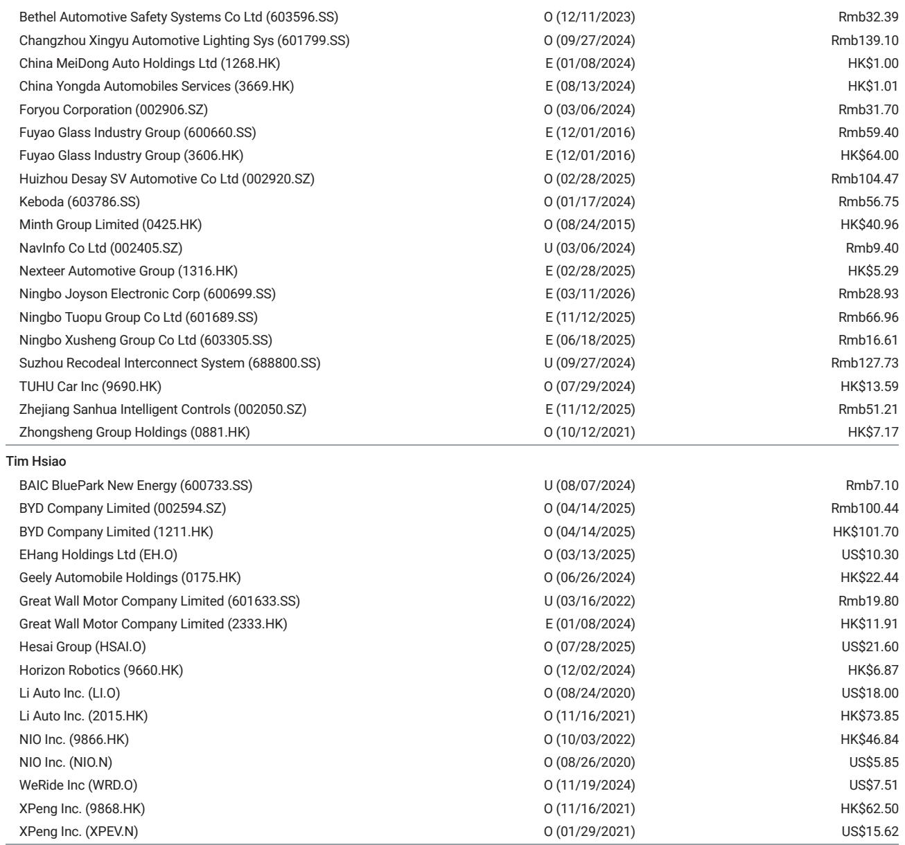
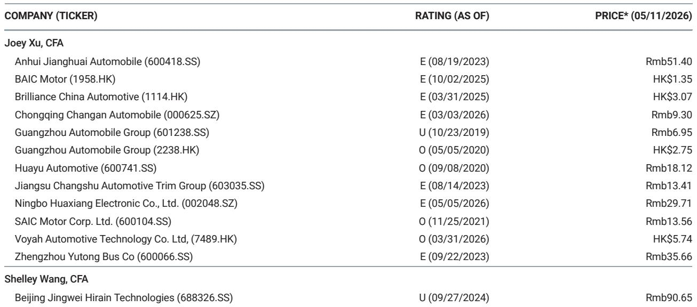
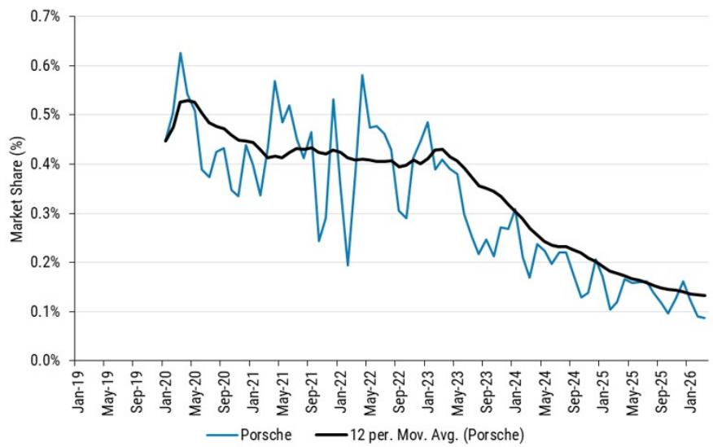

# 保时捷中国经销商正在经历一场“假性复苏”

**“以价换量”让位于“以量换利”之后，经销商利润在1Q26短暂转正。但2Q26的销量目标与折扣回调，正在暴露一个更本质的问题：豪华车经销商的核心矛盾，从来不是库存周期，而是品牌溢价能否在电动化时代被重新定价。**

这份来自某外资投行的最新渠道调研，聚焦保时捷中国经销商的真实反馈。报告篇幅不长，但信号密度极高。它回答了一个许多投资者正在追问的问题：当豪华品牌主动减产、收缩销量目标，经销商的利润真的能回来吗？

答案是：能，但只是暂时的。

1Q26的数据确实好看。保时捷中国经销商的新车毛利率（GP3，含返利和佣金收入）同比和环比均实现改善，从2H25的负值区间重新回到正值。这背后是保时捷中国1Q26销量同比大幅下滑21%——用牺牲规模换来了价格体系的短暂稳定。

但这组数据真正值得关注的，不是利润转正本身，而是它揭示了一个更深层的结构性矛盾：豪华车经销商利润的修复，高度依赖品牌方的供给约束。一旦品牌方为了新产品放量而放松供给纪律，经销商的利润窗口就会迅速关闭。而保时捷在2Q26的动作，恰好印证了这一点。

## 1. 1Q26的利润改善，本质是“供给收缩”的一次性红利，而非需求复苏

保时捷中国经销商在1Q26实现了GP3的转正，这是一个重要的观察点。但我们需要拆解这笔账是怎么算的。

报告明确指出，利润改善的直接驱动力是“supply cuts”——保时捷中国主动削减了给经销商的批发量。1Q26销量同比下降21%，意味着经销商手里的库存压力减轻，终端折扣幅度收窄，新车销售的亏损面得以收窄。

这里有一个容易被忽略的细节：GP3包含了返利和佣金收入。也就是说，经销商的利润改善，一部分来自终端售价的回升，另一部分来自厂家给予的返利政策。这两者本质上都是品牌方在用利润补贴渠道。

**这意味着什么？** 1Q26的利润改善，不是经销商自身运营效率提升的结果，也不是终端需求回暖带来的自然修复。它更像是品牌方主动“止血”的一次性操作。只要保时捷愿意继续压低销量目标，经销商的利润就能维持。但问题是，保时捷愿意一直这么做吗？

2Q26的动作给出了答案：不愿意。

## 2. 2Q26的销量目标上调，正在暴露经销商利润的脆弱性

报告提到，随着新车型（Panamera Pure）的推出，保时捷中国经销商在2Q26面临更高的销量目标，并且“will offer wider retail discounts to meet volume targets”。这是一个非常关键的信号。

Panamera Pure是保时捷专门为中国市场定制的车型，起售价定在人民币99.8万元——恰好卡在10%豪车税门槛之下。经销商对这款车的订单预期是乐观的。但问题是，为了完成更高的销量目标，经销商不得不重新加大折扣力度。

这里存在一个经典的“囚徒困境”：单个经销商为了完成厂家给的销量目标，有动力通过折扣抢份额；但当所有经销商都这么做时，终端价格体系就会再次承压，最终所有人的利润都会被侵蚀。

**所以，2Q26的经销商利润大概率会再次承压。** 1Q26的利润转正，很可能只是昙花一现。保时捷在“量”和“利”之间的摇摆，折射出豪华品牌在中国市场面临的一个根本性困境：既要维护品牌溢价，又要面对中国本土高端品牌的竞争压力，很难长期坚持“价值优先于销量”的策略。

## 3. Panamera Pure的定价策略，是一次精心计算但风险极高的“卡位”

报告对Panamera Pure的定价策略做了详细描述：定制化、卡位豪车税门槛、增加标配配置。这看起来是一次聪明的市场操作。

但我们需要思考的是：这种“卡位”策略真的能持续吗？

从产品层面看，Panamera Pure的定价逻辑是：在维持品牌调性的前提下，通过降低入门门槛来吸引更多中国消费者。99.8万元的起售价，恰好避开了10%的豪车税，相当于变相降价了近10万元。这对于那些对价格敏感但又想拥有保时捷品牌的消费者来说，确实有吸引力。

但从竞争层面看，这个价格带正在被中国本土高端品牌迅速渗透。蔚来的ET9、理想MEGA、比亚迪的仰望U8，都在80万至120万的价格区间内形成了有力的竞争。这些中国品牌不仅在电动化和智能化上领先，而且在本土化服务、充电网络等方面具有明显优势。

**所以，Panamera Pure的定价策略，本质上是一次“品牌溢价”与“本土竞争”之间的博弈。** 保时捷试图通过产品定制和定价卡位来维持溢价，但中国本土品牌正在用更快的产品迭代和更贴近本土需求的功能配置，不断侵蚀这个溢价空间。

报告没有展开讨论这一点，但这是理解保时捷经销商中长期利润前景的关键。

## 4. 报告尚未完全回答的关键问题：品牌溢价能否在电动化时代被重新定价？

这是整份报告留下最值得追问的问题。

保时捷在1Q26通过减产实现了利润修复，但这只是短期手段。真正的问题在于：在电动化和智能化的浪潮下，保时捷的品牌溢价是否还能像燃油车时代那样坚挺？

从目前的市场反馈来看，答案并不乐观。中国高端电动车消费者对“品牌”的定义正在发生变化。过去，保时捷的品牌溢价来自发动机、操控、历史传承。但在电动车时代，这些传统优势被大幅削弱——电动车的动力性能很容易做到顶级，智能化和自动驾驶成为新的差异化维度，而这些恰恰是传统豪华品牌的短板。

保时捷当然意识到了这一点。它正在加速电动化转型，但转型的速度和效果仍有待验证。报告提到的Panamera Pure本质上仍然是一款燃油/混动车型，而不是纯电产品。保时捷的纯电车型Macan EV和718 EV尚未在中国市场形成足够的声量。

**因此，一个合理的判断是：保时捷经销商的中长期利润，不取决于短期的销量目标或折扣策略，而取决于保时捷能否在电动化时代重新定义自己的品牌溢价。** 如果保时捷的纯电产品无法在中国市场形成与燃油车时代相当的品牌吸引力，那么经销商的利润修复将始终是“脉冲式”的，无法持续。

## 5. 对投资者的观察框架：如何判断经销商利润修复的可持续性

基于以上分析，我们可以提炼出一个用于判断豪华车经销商利润修复可持续性的观察框架，包含三个核心变量：

**第一个变量：品牌方的供给纪律。** 经销商利润能否持续，首先要看品牌方是否愿意长期维持“价值优先于销量”的策略。如果品牌方为了市场份额或新产品放量而放松供给约束，经销商利润就会迅速恶化。保时捷在2Q26的动作已经给出了一个负面信号。

**第二个变量：品牌溢价在电动化时代的稳定性。** 这是最根本的变量。如果品牌能在电动化时代维持甚至提升品牌溢价，那么经销商利润就有长期支撑。如果品牌溢价被侵蚀，那么任何短期的利润修复都只是“回光返照”。投资者需要密切关注保时捷纯电产品的市场反馈、中国本土高端品牌的竞争动态，以及品牌方在电动化转型上的投入节奏。

**第三个变量：经销商的运营效率。** 在品牌溢价和供给纪律给定的前提下，经销商的运营效率决定了它在利润周期中的韧性。运营效率高的经销商，在品牌方收紧供给时能更快实现利润修复，在品牌方放松供给时能更好地控制库存风险。投资者需要关注经销商的库存周转天数、费用控制能力、以及售后业务占比等指标。

这三个变量共同决定了经销商利润的“天花板”和“地板”。目前来看，保时捷经销商面临的核心矛盾是第二个变量——品牌溢价的稳定性——正在被电动化浪潮冲击。而报告提供的数据，恰恰暴露了这个矛盾的短期表现：供给纪律可以修复利润，但无法解决品牌溢价的问题。

---

这份报告的价值，不在于它给出了1Q26的利润转正数据，而在于它通过2Q26的动作，揭示了豪华车经销商利润修复的脆弱性。对于关注中国豪车市场的投资者来说，真正的观察窗口不是利润数字本身，而是品牌方在“量”和“利”之间的每一次摇摆。

报告中还有更多关于经销商库存结构、返利政策细节、以及Panamera Pure订单转化的数据，这些内容对于判断经销商利润的短期走势至关重要。如果你希望获得完整的研报原文和详细的图表数据，欢迎来我们的星球微信群里继续讨论。我们会在群内分享完整的研报解读，以及基于这些数据构建的经销商利润预测模型。

Personal reading notes and learning share only. Not investment advice.

