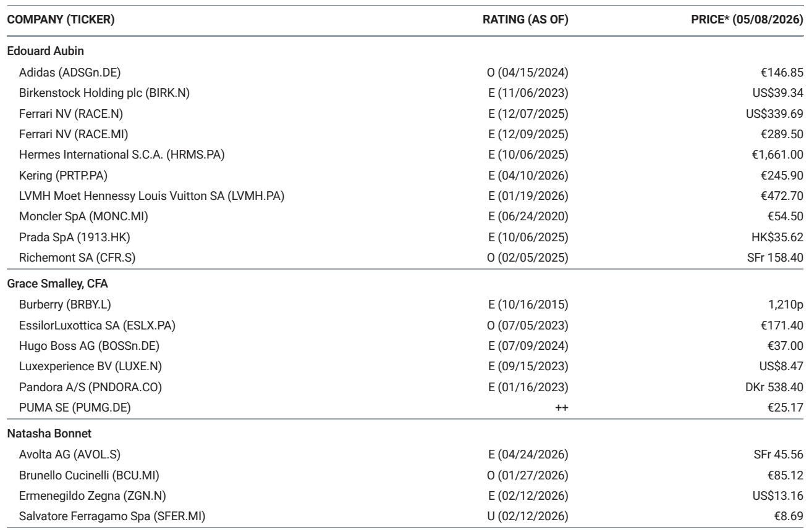
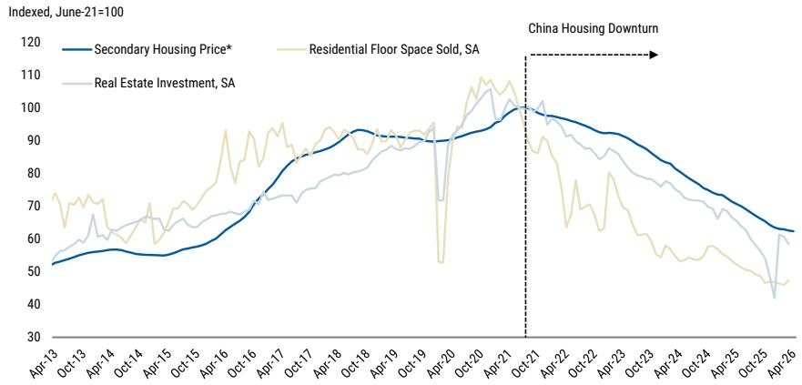
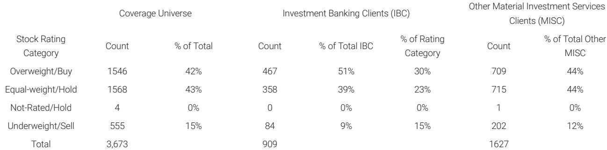

# 中国房地产的财富效应正在被股市对冲，但奢侈品投资者不应过早乐观

某外资投行最新的欧洲奢侈品行业研报揭示了一个微妙但关键的变化：中国二手房价格仍在下跌，但跌幅在4月有所收窄，同时一线城市出现企稳迹象。然而，该行的中国房地产团队依然保持谨慎，认为需要更多证据才能转为建设性立场。对于欧洲奢侈品板块而言，这意味着超过30%的中国需求仍处于不确定状态。但报告真正值得关注的判断是：过去12-18个月，中国股市的上涨部分抵消了房地产市场的财富毁灭，两者合计的净财富效应可能正在逼近一个临界点。市场对这一对冲机制的持续性存在低估。

这份研报的核心价值不在于提供了多少新的数据点，而在于它揭示了一个被市场广泛讨论但很少被量化的关系：当中国家庭超过70%的财富沉淀在房地产中时，房价的持续下跌与股市的上涨之间，正在形成一种脆弱的平衡。理解这种平衡的边界，比猜测下一个月的销售数据更为重要。

## 1. 房价下跌的速度在放缓，但扩散至更多城市的复苏仍遥不可及

4月的数据提供了一个矛盾的信号。根据该投行跟踪的85个样本城市，二手房交易价格环比下降0.4%，同比下降11.8%，相较于3月环比下降0.6%有所改善。91%的样本城市录得环比下跌，其中19%的城市跌幅加快，而3月这一比例为84%。表面上，跌幅收窄似乎是个好消息。

但真正的结构性变化发生在一线城市。报告明确指出，上海和北京的二手房销售持续超出预期，持续时间也比市场预期的更长。这推动了一线城市二手房价格出现温和回升。然而，问题在于这种回暖并没有扩散到更多城市。该行的中国房地产团队认为，由于二手房挂牌量和新房库存仍处于高位，居民情绪依然脆弱，租金仍在下降，一线城市的销售可能在未来几个月因政策效应消退而降温。

这里的含义是：当前一线城市的回暖更像是政策刺激下的短期脉冲，而非基本面改善驱动的趋势反转。对于奢侈品消费而言，一线城市的高净值人群固然是核心客户群，但二线及以下城市的中产阶层才是过去几年消费增长的主要驱动力。如果这些城市的房价继续下行，奢侈品消费的底部支撑就尚未形成。

## 2. 股市上涨提供了约31万亿人民币的对冲，但这一机制存在三个脆弱性

这份研报最具洞察力的部分，是它提供了一个粗略但极具启发性的量化框架。该投行估算，自2024年12月以来，中国房地产市场的价值毁灭约为38万亿人民币，而同期中国股市的上涨创造了约31万亿人民币的财富。两者相抵，净财富损失约为7万亿人民币。

这个数字本身并不令人震惊，但它揭示了一个被许多投资者忽视的机制：过去12个月，上证指数上涨了约25%，这在很大程度上得益于流动性和政策叙事的支持。对于持有股票资产的高净值人群而言，股市的上涨确实部分弥补了房产缩水的损失。这或许可以解释为什么尽管房地产持续低迷，但高端奢侈品消费并未出现断崖式下跌。

然而，这一对冲机制至少存在三个脆弱性。第一，股市的财富效应在人群中的分布极不均匀。持有大量股票的群体与持有大量房产的群体虽然有重叠，但并非完全一致。股市上涨的财富效应主要集中在少数高净值人群，而房价下跌则影响更广泛的中产阶层。第二，股市的上涨高度依赖政策和流动性，一旦政策预期转向或流动性收紧，这一对冲可能迅速消失。第三，也是最关键的，房地产市场的财富毁灭是存量资产的直接减记，而股市的上涨是增量价值的创造，两者对消费行为的影响机制不同——房产缩水对消费的抑制效应通常比股市上涨的刺激效应更为直接和持久。

## 3. 奢侈品板块的“中国叙事”正在从需求侧转向供给侧，但报告尚未完全展开

报告将中国房地产市场作为欧洲奢侈品板块的关键风险因素，这本身并不新鲜。真正值得深挖的是，这一风险下隐含的行业结构变化。过去几年，市场对奢侈品公司的关注点主要集中在“中国消费者是否还在买”，而现在，问题正在演变为“中国消费者在哪里买、通过什么渠道买”。

如果房价持续下跌导致中国消费者削减整体奢侈品预算，那么品牌将面临两难选择：是降价保量，还是维持价格体系保利润？报告没有明确讨论这一点，但逻辑上，这直接关系到各品牌的定价策略和渠道策略。那些在中国市场依赖旅游零售和代购渠道的品牌，受到的冲击可能更大，因为这些渠道的消费者对价格更为敏感。而那些拥有强大本土直营渠道、能够将中国需求转化为本土销售的品牌，则可能更具韧性。

报告提到了“equity market remains supportive”，但并未深入分析股市财富效应对不同奢侈品品类的差异化影响。例如，硬奢（珠宝、腕表）与软奢（皮具、成衣）的消费决策对财富变化的敏感度可能存在显著差异。这部分内容在完整报告中或许有更详细的拆解，但就公开的研报摘要而言，它留下了一个值得进一步探讨的伏笔。

## 4. 真正的风险不是房价继续跌，而是股市不再涨

基于上述分析，我们可以推导出一个更具前瞻性的判断：当前欧洲奢侈品板块面临的最大风险，并非中国房价继续下跌——市场对此已有充分预期——而是支撑消费的股市对冲机制出现逆转。如果上证指数在某个时点回调，那么净财富效应将迅速恶化，届时中国奢侈品需求的收缩速度可能超出市场预期。

报告中的数据显示，4月二手房价格跌幅收窄，但一线城市之外的复苏依然难以捉摸。这意味着，即使房价不再大幅下跌，只要它不涨，财富效应就仍然是负面的。而股市的上涨已经持续了一段时间，估值和情绪都处于相对高位。任何外部冲击或政策转向都可能触发股市调整，届时“房价跌+股市跌”的双重打击将对中国奢侈品需求产生叠加效应。

对于投资者而言，这意味着不能简单地将中国奢侈品需求与房价走势挂钩。更准确的观察框架应该是：房价走势决定了财富毁灭的基准线，而股市走势决定了这个基准线之上是“缓和”还是“加剧”。当前市场可能过度关注房价本身，而对股市的持续性缺乏足够的警惕。

## 5. 报告尚未完全回答的三个关键问题

尽管这份研报提供了有价值的数据和框架，但它也留下了几个尚未完全回答的问题。

第一，中国一线城市二手房销售的韧性究竟来自哪里？是真实的自住需求释放，还是投资者在政策窗口期进行的短期操作？如果是后者，那么这种韧性将随着政策效应消退而迅速消失。报告中的中国房地产团队倾向于后一种解释，但并未提供足够的证据来区分这两种可能性。

第二，股市上涨的31万亿人民币财富创造中，有多少真正转化为了消费？股市财富效应的转化率通常远低于房地产财富效应，因为股票资产的流动性更高、变现更容易，但人们也更倾向于将其视为“账面浮盈”而非“真实财富”。如果转化率较低，那么股市对奢侈品消费的实际支撑作用可能被高估。

第三，欧洲奢侈品公司在中国市场的定价策略是否已经做出了适应性调整？报告没有讨论各品牌在中国市场的定价折扣、促销活动或渠道策略变化。如果品牌方已经开始通过非价格手段（如增加服务、调整产品组合）来应对需求放缓，那么这些措施的效果如何，目前尚不清楚。

这些问题的答案，可能需要深入阅读完整报告中的图表细节、公司分析以及行业专家的观点才能获得更清晰的图景。

---

以上分析基于该投行研报的核心数据与逻辑框架，但报告本身还包含了更多关于各品牌在中国市场的具体敞口、估值水平以及竞争格局的拆解。那些图表背后的二阶影响、不同品牌之间的差异化表现，以及分析师对关键假设的敏感性测试，都是理解这一轮中国房地产周期对奢侈品行业真正冲击程度所不可或缺的信息。

欢迎来星球微信群里继续讨论，我们将基于完整报告中的原始图表和详细数据，进一步拆解上述未解问题，并与大家分享更深入的观察框架。

Personal reading notes and learning share only. Not investment advice.

