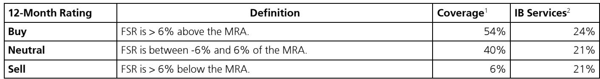

# 细胞治疗真正的转折点不在适应症，而在制造环节的范式切换

过去三年，中国CAR-T行业经历了从资本热捧到商业化遇冷的完整周期。五款产品先后获批，全部进入商业保险目录，但销量并未如预期般爆发。市场习惯性地将问题归结于支付能力不足、适应症空间有限。但一份来自某外资投行与产业专家的闭门对话纪要，揭示了一个更根本的结构性变量正在酝酿：制造环节的范式切换，而非新靶点的发现，可能才是决定下一个五年行业格局的关键。

这份纪要的核心信号是：体内CAR-T技术正在从实验室概念走向工业化验证，其潜在成本结构一旦兑现，将从根本上改写现有细胞疗法的竞争逻辑。而当前市场对这一变化的定价，可能仍然停留在“远期技术”的折现中，低估了其商业化落地的时间表。

## 1. 体内CAR-T真正的颠覆性不在于疗效，而在于把细胞治疗从“定制化”推向“标准化”

传统CAR-T的制造流程本质上是一个高度定制化的生物制药过程：从患者体内采集T细胞，经过基因修饰、扩增、质控，再回输到患者体内。这个过程不仅耗时数周，而且单次治疗成本高达数十万元人民币。即使通过国产替代将生产成本压缩至20万元左右，其商业模式依然受限于“一患者一批次”的制造逻辑。

体内CAR-T的突破在于，它试图将这一过程简化为一次注射。通过病毒载体或LNP-mRNA递送系统，直接在患者体内完成T细胞的工程化改造。专家在会议中明确指出，大规模工业化生产有望将单支成本降至数百美元。这意味着，CAR-T的治疗成本可能从当前的数十万元级别，下降至与高端生物制剂相当的水平。

这个变化的意义远超“降价”。它意味着细胞治疗第一次有可能从“最后一线的定制化抢救方案”，转变为“可规模化使用的标准治疗手段”。参考PD-1抑制剂从单抗到双抗的演进路径，制造端的简化往往是适应症扩张的前提条件。

## 2. 两个递送系统各有短板，但LNP-mRNA的临床管理优势可能被低估

目前体内CAR-T的两条主流技术路线——病毒载体和LNP-mRNA——呈现出不同的风险收益特征。病毒载体路线的早期探索性研究已报告超过80%的客观缓解率，但3级以上细胞因子释放综合征（CRS）和神经毒性的发生率较高，这对临床管理能力提出了极高要求。

相比之下，LNP-mRNA的优势不在于疗效的深度，而在于安全性。纪要明确指出，其CRS发生率更低，副作用更可控。在真实世界的临床决策中，安全性和可管理性往往比理论上的最高疗效更具决定性。如果LNP-mRNA能够在后续研究中证明其应答持续性与病毒载体相当，那么它在商业化推广上的优势可能远超市场预期。

这里仍需验证的关键问题是：LNP-mRNA的应答深度和持续时间是否足以支撑其在实体瘤或自身免疫性疾病中的长期疗效。纪要中专家也坦承，这一点“需要被证明”。

## 3. 中国IIT体系的独特优势正在成为BD交易的隐形障碍

一个值得深思的悖论出现在BD交易层面。纪要提到，尽管中国体内CAR-T公司能够通过研究者发起的临床试验（IIT）快速生成人体疗效数据，但跨国药企（MNC）通常要求更严格的临床前数据集作为BD交易的基础。这导致了一个结构性错配：中国拥有全球最快的临床验证速度，但这一优势并未直接转化为BD交易的达成。

这不是一个简单的“标准差异”问题。它反映的是MNC对IIT数据质量的疑虑——样本量有限、缺乏随机对照、终点定义不一致。对于体内CAR-T这种新技术，MNC需要更高的证据等级才能做出数十亿美元的交易决策。这意味着，中国公司若想实现BD出海，可能需要主动提升早期临床设计的严谨性，而非仅仅追求速度。

## 4. 商业保险降价并未激活市场，真正的支付瓶颈在制造端而非定价端

五款CAR-T产品纳入商业保险目录并降价约30%后，销量并未显著加速。这一现象被市场解读为“支付能力不足”，但纪要中的专家观点提供了另一个视角：即使降价后，每支产品的价格仍然超出绝大多数患者的承受范围。商业保险的覆盖范围有限，且报销比例不统一，导致实际可及性仍然很低。

真正的支付瓶颈，归根结底是制造端成本过高。只要单次治疗成本仍维持在十万元以上级别，仅靠支付端的小幅降价无法从根本上扩大可及人群。这也是为什么体内CAR-T的低成本制造前景，比任何支付改革都更具结构性的意义。如果体内CAR-T能够将成本降至数千美元级别，细胞治疗将首次具备与主流靶向治疗和免疫治疗竞争支付空间的能力。

## 5. 报告尚未完全回答的关键问题：体内CAR-T的工业化放大风险如何定价

纪要中专家提到“大规模工业化生产可将成本降至数百美元”，但这个假设成立的前提是：生产工艺能够实现稳定、可重复的放大。对于体内CAR-T而言，这恰恰是最不确定的环节。病毒载体的生产本身就面临产能瓶颈和质控挑战；LNP-mRNA虽然在新冠疫苗中已验证了大规模生产能力，但将其应用于体内T细胞工程化，递送效率和靶向特异性仍需优化。

报告没有展开讨论的是，如果工业化放大过程中出现系统性障碍，体内CAR-T的时间表可能推迟3-5年。这期间，传统CAR-T的制造优化（如自动化、封闭式生产、通用型CAR-T）可能进一步缩小成本差距。投资者需要问自己的是：当前对体内CAR-T公司的估值，是否充分反映了这种工业化风险？如果放大失败，安全边际在哪里？

## 6. 一个更务实的观察框架：从“谁有靶点”转向“谁有工艺”

上述讨论指向一个更根本的认知迁移。过去几年，市场对细胞治疗公司的评估框架高度集中在靶点选择上——谁拿到了CD19、BCMA，谁就有先发优势。但这份纪要提示我们，随着技术路线趋于成熟，竞争的核心正在从“靶点发现”转向“工艺工程”。

体内CAR-T的竞争壁垒，将更多地体现在递送系统的优化、规模化生产的成本控制、以及临床管理方案的完善上。这意味着，具备病毒载体或LNP制造经验的CDMO公司、拥有封闭式自动化生产设备的设备商、以及能够设计更安全递送载体的技术平台，可能比单纯的生物技术公司更具长期价值。

对于产业决策者而言，一个可行的观察指标是：关注体内CAR-T公司是否开始披露其生产工艺的细节、批次一致性数据、以及成本结构假设。这些信息比早期临床数据更能反映其商业化的真实进度。

---

上述讨论中，体内CAR-T的工业化放大风险、LNP-mRNA的应答持久性验证、以及中国IIT数据与MNC交易标准之间的鸿沟，都是报告中有提及但未充分展开的关键变量。这些问题的答案，将直接影响我们对细胞治疗行业未来三年发展路径的判断。欢迎来星球微信群里继续讨论这些未解问题，我们也会在后续的专题中逐一拆解。

Personal reading notes and learning share only. Not investment advice.

