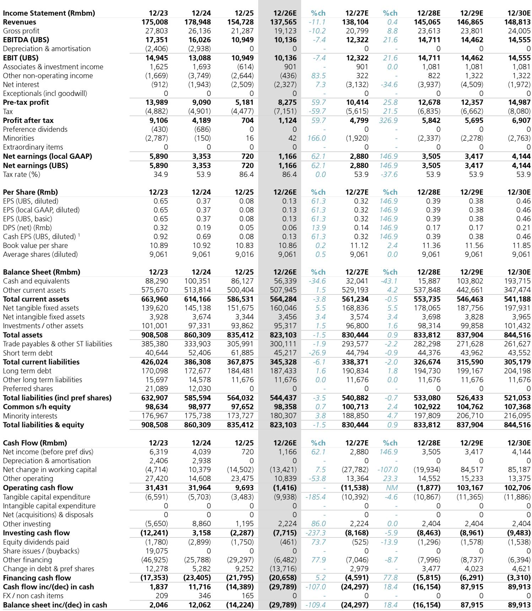
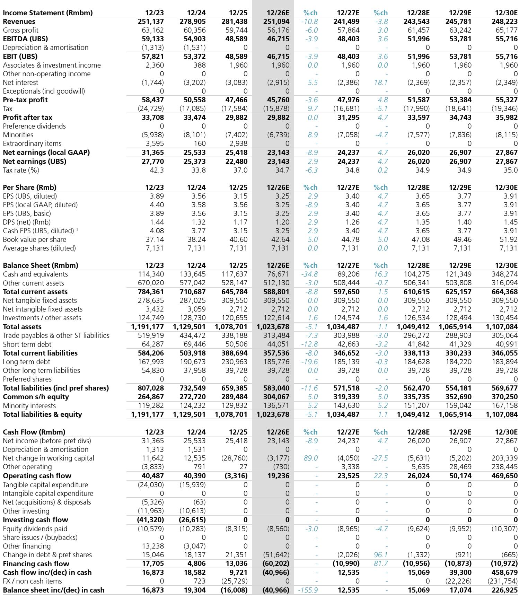
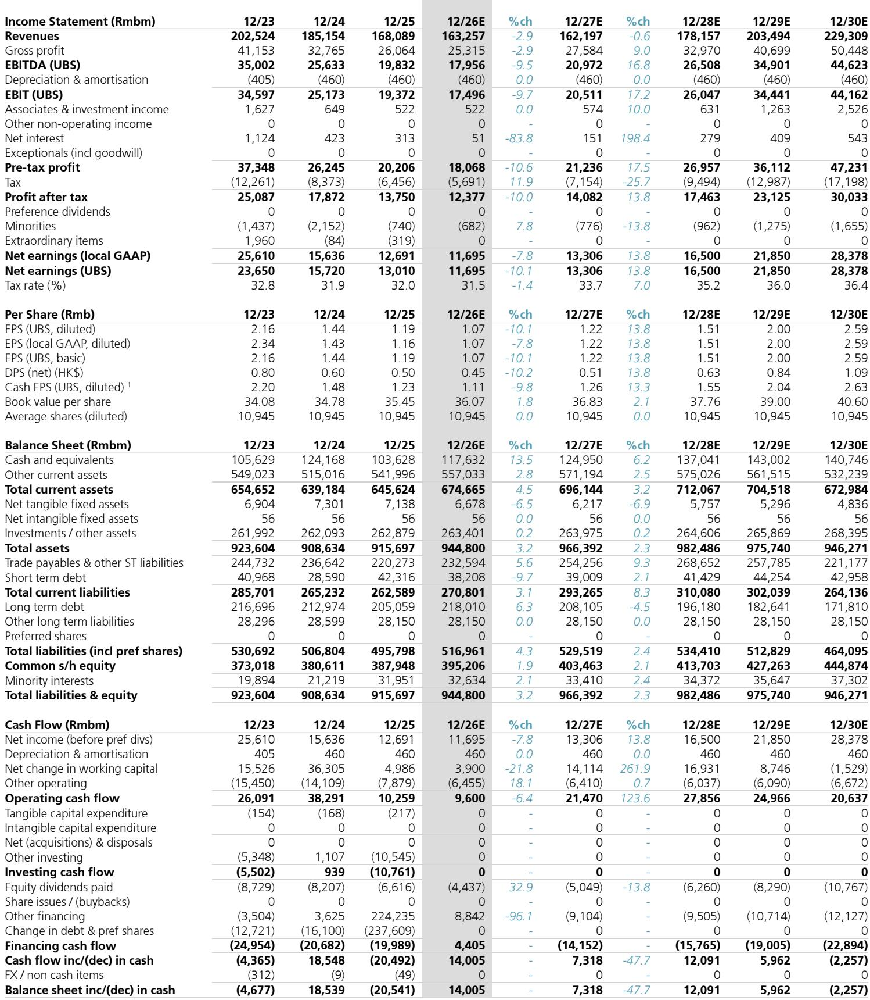

# 中国房地产的真正拐点，不是政策，是AI供应链带来的收入重构

过去五年，每一次关于中国房地产触底的判断，最终都被证明是“狼来了”。市场对“政策放松-销售回暖-价格企稳”这一叙事路径已经形成免疫。但这一次，某外资投行在最新发布的研报中提出了一个截然不同的逻辑起点：**推动一线城市房价企稳的核心变量，不再是降息或放松限购，而是AI供应链扩张带来的工业企业利润回升**。

这份报告上调了中国房地产板块评级，其核心判断是：2026年一线城市房价将停止下跌（此前预测-10%），2027年将实现2%的正增长。支撑这一判断的，不是对政策的再预期，而是对工业企业利润结构、新经济公司总部地理分布以及库存实际消化程度的微观观察。

我们仔细拆解了这份报告的逻辑链条，发现它真正试图回答的问题是：**过去五年反复出现的“负反馈循环”，这一次是否真的被打破了？**

## 1. 工业利润与房价的0.63相关性，这次由AI供应链驱动

报告首先建立了一个关键的分析框架：一线城市房价与工业企业利润之间存在0.63的强相关性。这不是一个简单的统计巧合，而是一个完整的传导链条——企业盈利增长带来员工收入改善、财富效应增强，进而转化为购房需求。

过去五年，这个链条长期处于断裂状态：房地产市场下行拖累了上下游产业链，企业利润恶化，进一步压制了住房需求，形成负反馈循环。但2026年第一季度，情况出现了变化。工业企业利润同比增长15%，PPI在经历了三年半的负增长后首次转正。

关键在于利润增长的结构。报告拆解了这15%的增长来源：计算机、通信及其他电子设备制造业贡献了8.2个百分点，有色金属冶炼和化学制品分别贡献了5.2和2.8个百分点。换句话说，**AI相关产业是这一轮工业利润复苏的绝对主力**。

这意味着什么？过去依靠房地产拉动工业的逻辑正在逆转。现在，是AI供应链的扩张在反哺房地产需求。如果这一趋势持续，那么房价企稳的基础将比过去任何一轮政策刺激都更加坚实。

## 2. 新经济公司的总部地图，正在重写城市房价的分化逻辑

报告做了一个非常“麦肯锡式”的交叉分析：筛选出市值超过100亿元人民币、过去12个月股价涨幅超过50%的514家公司，然后逐一标注它们的总部所在地。

结果清晰地指向了几个城市：北京（43家）、上海（50家）、深圳（48家），其次是苏州和东莞。这些城市同时也是2026年前四个月二手房交易量同比增幅最显著的地方。北京和上海的二手房交易量分别增长了18%和14%，而杭州、广州等城市则出现了负增长。

**这不是简单的“强者恒强”，而是一个新的定价逻辑正在形成。** 过去，一线城市的房价溢价主要来自公共服务、教育资源和人口净流入。现在，AI和新经济产业的集聚效应正在成为新的定价锚点。企业的盈利能力直接转化为员工的购买力，而这些购买力又高度集中在企业总部所在的城市。

对于投资者而言，这意味着城市选择的重要性进一步上升。报告特别指出，其看好的公司（中国海外发展、贝壳、金茂、招商蛇口）都有一个共同特征：一线城市土储占比约41%，远高于同行平均的25%以下。

## 3. 影子库存正在消化，郊区空置率下降是真正的供给端信号

市场对房地产的担忧，除了需求端，还有供给端的一个“灰犀牛”——影子库存。过去几年大量交付的新房，尤其是郊区楼盘，很多处于空置状态。这些房源一旦被投入二手房或租赁市场，就会形成持续的供给冲击。

报告用了一个巧妙的代理指标来衡量空置率：毛坯房在二手房挂牌中的占比。毛坯房必然处于空置状态，因此这个比例的变动可以反映真实空置率的变化。对比2023年6月和2026年4月的数据，北京、上海、广州、深圳以及杭州的郊区，毛坯房挂牌占比下降了0.6至10.1个百分点不等。

**这个信号的意义可能比房价本身更重要。** 它意味着过去几年积累的“隐形库存”正在被实际消化——要么通过出租，要么通过二手交易。叠加过去三年新开工面积和土地出让面积的大幅下降，未来新房、二手房、租赁房和保障性住房的整体供给都将趋于收缩。

供给侧的改善，是支撑房价从“不再下跌”走向“温和上涨”的前提条件。如果这一趋势延续，一线城市郊区将不再是价格拖累，反而可能成为下一轮修复的起点。

## 4. 估值修复的空间：从0.66倍市净率到0.85倍

在股价层面，报告给出了一个相对保守但明确的判断：当前房地产板块的交易市净率为0.66倍，如果修复至15年均值0.85倍，对应约30%的上行空间。

但报告并未简单地将这一修复视为“均值回归”。它隐含了一个关键假设：**如果一线城市房价如期企稳，市场对房地产板块的定价将从“破产清算”逻辑转向“资产价值重估”逻辑。** 0.66倍的市净率隐含了市场对大量资产减值的预期，而一旦房价稳定，这一预期将被修正。

报告上调了多只个股的目标价，幅度从22%到81%不等。其中，中国海外发展的目标价从13.80港元上调至25.00港元，涨幅最大。这背后反映的是对一线城市土储价值的重新定价。

## 5. 报告没有完全回答的三个关键问题

尽管这份报告的逻辑链条清晰、数据支撑扎实，但它并非没有盲点。我们认为，以下三个问题仍然需要投资者进一步验证和讨论：

**第一，AI供应链的利润增长能否持续？** 当前工业利润的高增长，一部分来自AI相关产业的爆发，另一部分来自大宗商品价格上涨和“反内卷”政策带来的产能收缩。如果全球经济放缓或AI投资周期出现波动，利润增长的持续性将受到考验。报告对此没有做情景分析。

**第二，财富效应向住房需求的传导效率如何？** 报告假设企业利润增长和股价上涨会转化为住房购买力。但现实中，新经济公司的员工更偏好租房还是买房？他们的收入增长是否会因高房价而被挤出到其他城市？这些微观行为层面的不确定性，报告并未深入讨论。

**第三，二线城市的房价何时企稳？** 报告预测2026年二线城市房价仍将下跌5%，但2027年将企稳。这一判断的依据是什么？如果一线城市与二线城市的差距进一步拉大，是否会引发新一轮的人口和资源虹吸，反而加剧二线城市的压力？

这些问题，正是我们希望在社群中与更多投资者深入探讨的方向。报告提供了很好的分析框架和起点，但真正的投资决策，需要在更充分的讨论和验证后才能做出。

---

如果你对这份报告的完整内容、原始图表数据，或者对上述三个未解问题有更深入的兴趣，欢迎来我们的星球微信群继续讨论。我们会定期组织对重点研报的拆解和辩论，帮助大家在信息过载中找到真正的投资锚点。

Personal reading notes and learning share only. Not investment advice.

