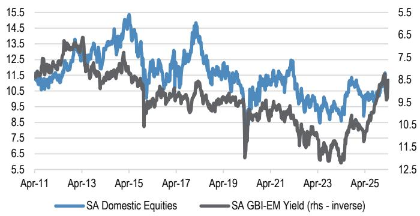
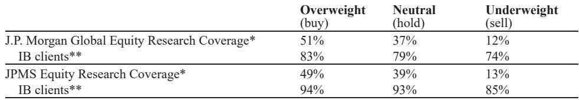
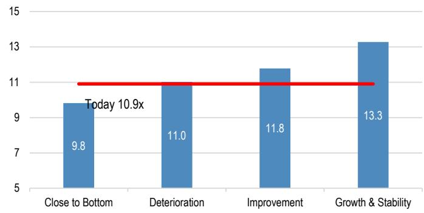

# South Africa’s Reform Story Is Real, But Investors Are Pricing in a Political Wildcard That Could Derail the Rally

The most important signal to emerge from last week’s meetings between South African companies and international investors is not that the reform agenda is working—it is that the reform agenda is working, yet capital remains hesitant. This is not a contradiction; it is a strategic inflection point. Offshore allocators broadly agree that macroeconomic conditions are improving, that logistics and energy reforms are gaining tangible momentum, and that financial companies in particular are positioned for a multi-year structural uplift. But they are not buying. The reason lies in a three-part tension that the report surfaces with unusual clarity: a genuine improvement in fundamentals, an unresolved geopolitical shock from the Middle East that complicates the entry narrative, and a political risk that has re-emerged from what many assumed was a settled landscape.

Why now matters is that this tension creates a window of mispricing. Domestic equity valuations remain depressed relative to their own history and to emerging market peers, even as the underlying drivers of earnings—corporate loan growth, logistical efficiency gains, consumer staple resilience—are moving in the right direction. The report’s data on long-term SA equity allocation shows a steady decline from 55 percent in 2011 to 42 percent in 2024, while international allocation has risen from 22 percent to 38 percent over the same period. That is a structural shift, not a cyclical one. But structural shifts can reverse when the catalyst is strong enough. The question is whether the current reform momentum, combined with the valuation discount, is that catalyst.

The meetings revealed that the answer depends on three variables that are not all under government control: the pace of local government reform, the trajectory of the Middle East conflict, and the resolution of a political scenario that the report’s guest speakers see very differently than the research team does. That divergence itself is a piece of information. It means the market is pricing in a probability of political disruption that the research team believes is overstated. If the team is right, the current discount offers an asymmetric opportunity. If the guest speakers are right, the discount is rational and may widen further.

This article unpacks the report’s findings into a decision framework for allocators, identifies the areas where the analysis leaves meaningful open questions, and translates the sector-level feedback into actionable implications for portfolio construction. The core argument is this: South African domestic equities are undervalued relative to the reform trajectory, but the path to revaluation requires a resolution of political uncertainty that the report does not—and cannot—fully resolve. That is precisely why the full report, with its original charts and company-level detail, is worth reading.

## The Reform Agenda Is Broadly on Track, But Local Government Remains the Achilles’ Heel That Could Slow the Entire Cycle

The report’s feedback on reforms is more granular and more constructive than the headline narrative in most global commentary. Logistics, long the most visible constraint on South African growth, is viewed as on track. The expected uptick in Durban Pier 2 volumes and the belief that 200 million tons over the next two to three years is achievable on the rail network represent real operational milestones. Critically, the codification of the National Rail Master Plan and the separation of Transnet into law were cited as key tenets of progress. These are not aspirational statements; they are legislative and regulatory actions that create a framework for execution.

Energy reforms are similarly on track, though the report flags a specific concern: the Independent Transmission Program, at just under 1,200 kilometers, is limited in scale and expensive for the seven pre-qualified bid winners. The insight here is that the program’s structure may actually constrain the benefits it was designed to unlock. A larger, more ambitious program would deliver economies of scale that the current approach does not. This is a second-order implication that the report does not fully explore: if transmission bottlenecks become the next binding constraint on renewable energy deployment, the reform narrative could shift from “on track” to “insufficiently ambitious” within a year.

The areas of concern are bulk water and local government reforms, where progress remains notably lagging. This is the section of the report that deserves the most attention from investors. Local government is where reforms meet daily economic reality—municipal service delivery, business licensing, property registration, and the operational environment for small and medium enterprises. If national-level reforms are working but local-level implementation is failing, the aggregate impact on growth will be muted. The report does not quantify this gap, but the implication is clear: the reform cycle’s ceiling may be lower than the headline optimism suggests.

So what does this mean for investors? It means that the reform trade is not a single bet. It is a basket of bets on different reform vectors, each with its own timeline, probability of success, and sensitivity to political disruption. Logistics and energy are investable now. Bulk water and local government are not. The portfolio implication is that investors should favor companies that are directly exposed to the reforms that are working—financials that lend to corporates benefiting from logistics improvements, for example—and avoid those that depend on the lagging reform areas.

## Financial Companies Are the Highest-Conviction Theme Because They Combine Structural Reform Exposure with Disciplined Return Management

The report’s strongest conviction is in South African financials. This is not a cyclical call; it is a structural one. The bank discussions were broadly constructive, with management teams positioning for a multi-year uplift from structural reforms while maintaining discipline on returns and credit. The key phrase is “multi-year uplift.” This is not about a single quarter of earnings surprise. It is about a sustained improvement in the operating environment that allows banks to grow loans, expand margins, and generate higher returns on equity without taking excessive risk.

The report surfaces several critical nuances. Pan-African diversification and scenario planning were recurring themes, with war-linked inflation and oil risks front of mind. This tells us that even the most optimistic bank managements are not assuming a smooth path. They are building buffers. They are stress-testing for higher fuel prices and slower client activity. The expectation that client activity could slow with a lag as higher fuel and broader macro pressure feeds through is a realistic assessment, not a bearish one.

Competitive intensity is rising, especially in payments and select lending products. This is where the report’s insight becomes actionable. The most consistent messages from bank management were around protecting return on equity through mix, capital-light fee growth, and selective balance sheet growth—not chasing volume. This is the behavior of disciplined compounders, not reckless lenders. For investors, the implication is that the winners in this cycle will be those that can grow earnings without degrading their return profiles. The report’s top picks—DSY, CPI, and FSR—are names that fit this profile.

The insurer meetings added another layer. The sector is increasingly driven by distribution advantage and ecosystem strength, with “bank-insurer convergence” accelerating. Some insurers framed themselves as moving from heavy investment cycles into phases where operating leverage, cost discipline, and capital optimization should translate into better earnings and cash generation. This is a maturation story, not a growth story, but it is a compelling one for investors who value free cash flow and capital return.

The watch point is near-term macro uncertainty and potential pressure on persistency. Value of New Business is not expected to increase materially in the short to medium term. But the tone was that well-positioned platforms can defend margins through data-driven underwriting, pricing agility, and cross-sell. This is a classic quality-over-quantity argument, and it is consistent with the broader theme of disciplined growth.

## Consumer Staples Are a Defensive Bet on Market Share Gains, But the Report Raises a Critical Question About Demand Resilience

The consumer feedback is the most sobering section of the report, and also the most strategically interesting. Rising diesel and petrol prices directly account for less than one percent of sales for most companies and are viewed as less disruptive than load-shedding. Most companies aim to limit the impact on consumers and offset higher costs through efficiency gains. There has been a lag in passing these costs through, as many firms had previously built up buffers.

The main concern is whether demand will remain robust, given the pressure on discretionary income and the heightened risk of interest rate hikes. This is the question that the report leaves open. The sector’s total market size is not expanding, but the winners are those gaining market share. Competition is intensifying, and the lower end of the market continues to demonstrate resilience.

For investors, this creates a clear framework. The consumer staples trade is not a bet on aggregate consumption growth. It is a bet on which companies can take share in a zero-sum market. The report’s top picks—PPH, SHP, and TBS—are names that have demonstrated this ability. Pepkor is notably broadening its appeal by expanding into financial services, which adds a growth vector to a defensive base.

But the open question is whether the resilience of the lower end of the market can persist if interest rates rise further. The report does not model this scenario, and it is a material risk. If the consumer pressure intensifies, even the market share winners could see margin compression. The defensive thesis holds only if the macro environment does not deteriorate beyond the current range.

## The Report Does Not Fully Resolve the Tension Between Political Risk and Reform Momentum, and That Uncertainty Is the Market’s Central Pricing Problem

This section identifies what the report does not fully answer. The political outlook was a dominant topic in the meetings, and the guest speakers held high conviction that President Ramaphosa would resign following a Constitutional Court ruling—a view the research team does not share. This divergence is not trivial. It represents a fundamental disagreement about the stability of the political environment, and it has direct implications for the reform trajectory.

If the guest speakers are right, the reform agenda could stall or reverse. If the research team is right, the current political noise is just that—noise. The report does not resolve this disagreement, and it cannot. The outcome depends on legal rulings and political decisions that are inherently unpredictable.

The implication for investors is that the political risk premium embedded in South African equity valuations may be either too high or too low, depending on which view prevails. This is not a reason to avoid the market. It is a reason to size positions carefully, to favor companies with strong balance sheets and diversified revenue streams, and to be prepared for volatility.

The report’s data on long-term SA equity allocation shows that domestic investors have been reducing their exposure for over a decade. This is a structural trend that will take a powerful catalyst to reverse. The reform agenda could be that catalyst, but only if the political environment remains stable. The report provides the evidence for the reform case. It does not—and cannot—provide certainty on the political outcome.

## A Decision Framework for Allocators: Three Scenarios, Three Portfolio Responses

The report’s findings can be translated into a decision framework with three scenarios. The first scenario is that reforms continue on track, political risks recede, and the Middle East conflict does not escalate further. In this scenario, domestic equities are attractively valued, with the report estimating a 22 percent upside for a path toward growth and stability at 13.3 times forward price-to-earnings. The portfolio response is to overweight financials and consumer staples, with a bias toward the report’s high-conviction names.

The second scenario is that reforms stall at the local government level, political uncertainty persists, and the Middle East conflict creates sustained headwinds for emerging market flows. In this scenario, the valuation discount is justified, and the market may remain range-bound. The portfolio response is to favor exporters and companies with offshore revenue exposure, while maintaining a core position in high-quality domestic names that can defend margins in a slow-growth environment.

The third scenario is a negative political shock that disrupts the reform agenda entirely. In this scenario, domestic equities would re-rate downward, and the defensive characteristics of consumer staples would not provide full protection. The portfolio response is to reduce domestic exposure and increase cash or offshore allocations.

The report does not assign probabilities to these scenarios, and it should not. The value of the framework is not in predicting which scenario will occur, but in ensuring that the portfolio is positioned to survive all three and thrive in the most likely one. The current evidence supports the first scenario, but the second and third cannot be dismissed.

Join the community to read the full report and review the original charts. The report contains company-level detail on which names resonated most with foreign investors, the full data on equity allocation trends, and the specific valuation scenarios that underpin the upside estimate. The charts on long-term SA equity allocation and the relationship between domestic equities and bond yields are particularly useful for understanding the structural context.

*This article is for learning and discussion only and does not constitute investment advice.*

Personal reading notes and learning share only. Not investment advice.

