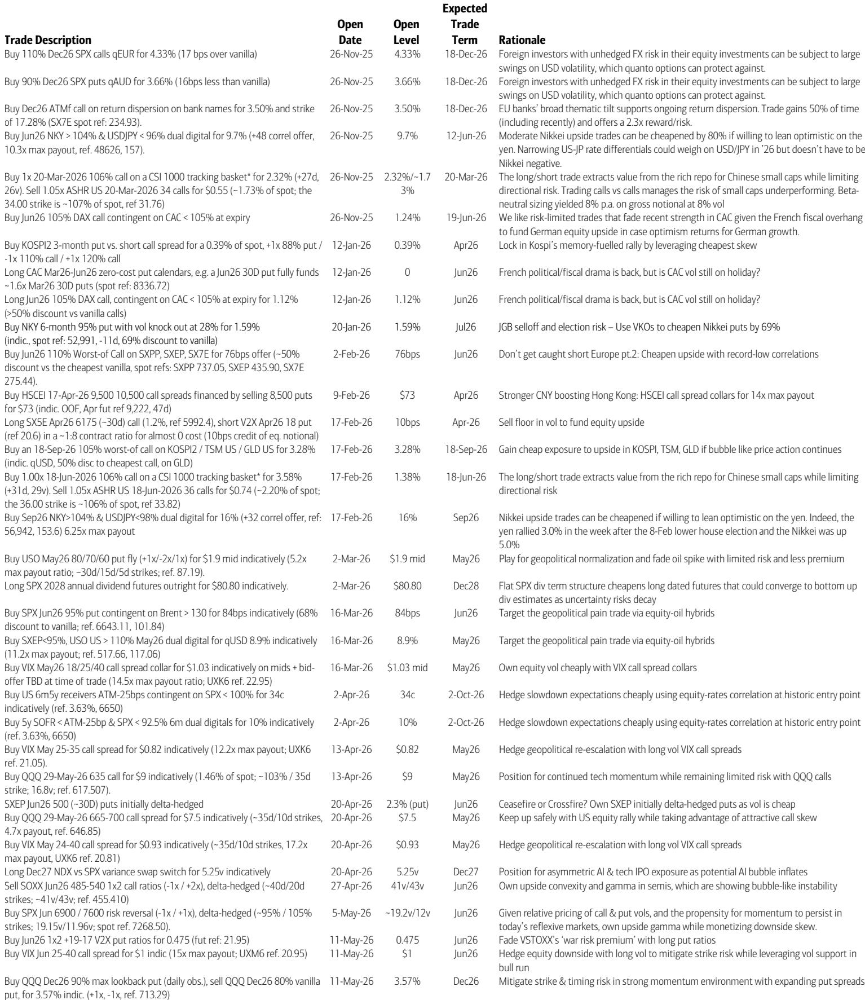
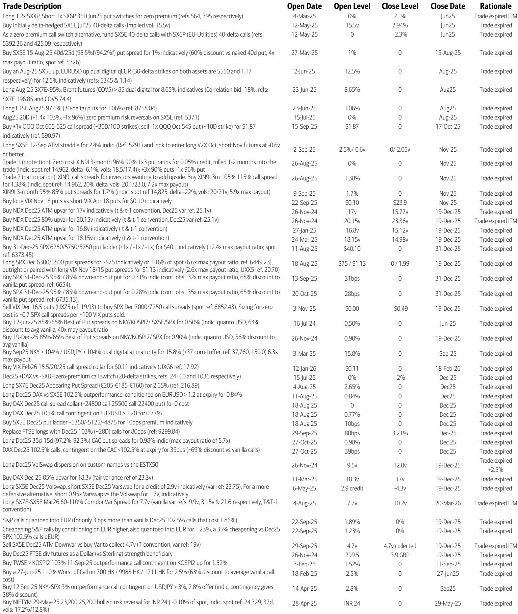
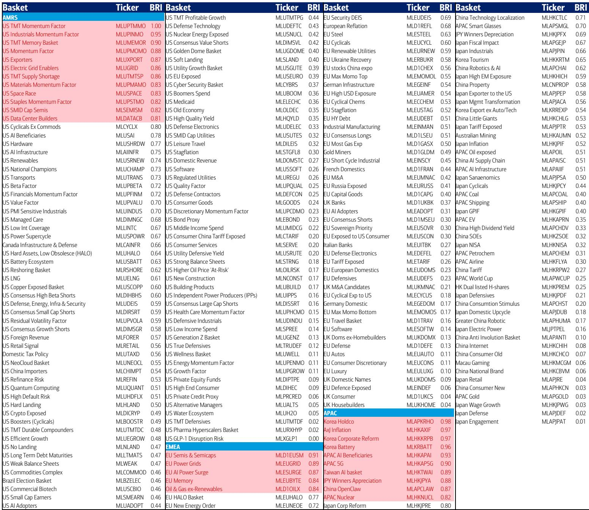

# Hedging the Bubble Era Requires a Volatility Strategy, Not a Strike Price

The current market environment presents a paradox that every institutional investor must confront: US technology stocks are generating historic upside momentum, with the Nasdaq posting twelve all-time highs in a single month, while the same price action is pushing a well-regarded Bubble Risk Indicator closer to the 0.8 threshold that has historically preceded significant drawdowns. This is not a forecast of an imminent crash, nor is it a call to abandon equities. It is a structural observation that the conventional hedging playbook is ill-suited for the regime we now inhabit. When markets exhibit the characteristics of what analysts are calling "The Bubble Era," the traditional approach of buying put options at fixed strike prices introduces two critical risks that can destroy hedge effectiveness: strike risk and timing risk. The investor who hedges too early or at the wrong level may watch their protection expire worthless while the rally continues, only to be left exposed when the reversal finally arrives. The argument of this article is straightforward: the most analytically sound response to rising bubble risks is not to reduce equity exposure, but to restructure hedges around volatility itself, using instruments that automatically adjust to market trends.

Why now? Because the evidence of bubble-like dynamics is no longer confined to a single indicator or a narrow set of stocks. The Kospi and Nikkei are registering extreme Bubble Risk Indicator readings of 1.0 and 0.85 respectively. US technology stocks as a sector score 0.7, with semiconductors at 0.85. Even the broader S&P 500 sits at 0.6. Meanwhile, realized volatility in US equities is near record highs relative to implied volatility, creating a divergence that historically signals either a consolidation or a sharp repricing. The investor who waits for the bubble to burst before adjusting their hedge will find that the cost of protection has already surged, and the available instruments are no longer priced attractively. The time to think structurally about volatility-based hedging is now, while the options market still offers limited-risk entry points.

The following sections will first examine why fixed-strike hedges fail in high-trend environments, then explore how volatility-based structures and lookback-style options offer a superior framework. We will then turn to Europe, where a different opportunity exists in the fading of geopolitical risk, and to Asia, where the AI rally presents a distinct set of trade-offs. Finally, we will identify what the current research leaves unanswered and offer a decision framework for institutional investors navigating this complex landscape.

## Fixed-Strike Put Options Introduce Strike and Timing Risk That Undermine Their Protective Value in Runaway Markets

The instinct to buy put options as insurance against a tech correction is understandable, but in the current environment, it is likely to be counterproductive. The logic is simple: when a market is making repeated new highs, the investor who buys a put at a strike price of 5% below the current level faces two possible outcomes, neither of which is satisfactory. If the market continues to rally, the put loses value rapidly as the underlying moves further away from the strike, and the investor must either accept the decay or roll the hedge higher, incurring additional costs. If the market does correct, the investor must have chosen both the correct strike and the correct expiration, a combination that is notoriously difficult to predict. This is strike risk and timing risk, and they are the silent killers of hedge effectiveness in trending markets.

The data from the recent past illustrates the point. Since 2023, the QQQ has experienced draw-ups of 8% or more from any given point within a three-month window in only about 10% of observations. Yet the market has continued to grind higher, making the probability of a sharp, timely correction low enough that a fixed-strike put buyer is effectively paying for an insurance policy that is unlikely to pay out, even as the underlying risk of a bubble bursting grows. The problem is not that the hedge is unnecessary; it is that the instrument is poorly matched to the market regime. In a high-trend environment, the investor needs a hedge that re-strikes itself automatically as the market moves, maintaining a constant distance from the current price rather than relying on a single, static level.

## Volatility-Based Hedges and Lookback-Style Structures Offer a Superior Framework by Automatically Adjusting Protection to Market Trends

The alternative to fixed-strike hedging is to shift the focus from the level of the underlying to the level of volatility itself. Long equity combined with long volatility has worked well in recent periods, and structures such as VIX call spreads with limited payout ratios (for example, 15x maximum return) offer a way to gain exposure to a volatility spike without the unlimited risk of a naked long vol position. These instruments are compelling because they do not require the investor to predict the direction of the equity market; they only require the investor to believe that the current level of implied volatility is too low relative to the risk of a dislocation. In a bubble environment, that is a more defensible bet than trying to guess the exact top.

More specifically, structures that mimic lookback put options are particularly well-suited to the current regime. A lookback put, in its pure form, allows the holder to sell the underlying at the highest price observed during the option's life. While exchange-traded lookback options are rare, the same economic effect can be achieved through expanding put spreads on indices like the QQQ. These structures automatically re-strike the protection higher as the market rallies, effectively resetting the hedge at the prior maximum. The result is that the investor is always protected against a decline from the most recent peak, without needing to predict when that peak will occur. The cost of this protection is not trivial, but it is significantly more efficient than buying a series of fixed-strike puts in succession. The research indicates that these structures require only an approximately 8% draw-up in the QQQ by December to outperform vanilla puts, a threshold that has been in the bottom decile of draw-ups since 2023. In other words, the market does not need to rally aggressively for the lookback-style structure to justify its premium; it only needs to avoid a sharp, immediate correction, which is precisely the environment we are in.

## European Equity Markets Present a Distinct Opportunity as Geopolitical Risk Premium Begins to Fade, But the Timing Requires Careful Structuring

While the US and Asian markets are characterized by bubble-like momentum, Europe offers a different analytical challenge. The VIX has normalized, Brent crude has retreated from crisis highs, and European equities have remained resilient despite episodic setbacks in negotiations. The BofA Global Financial Stress Index has declined for five of the last six weeks, with equity stress leading the decline. Within this context, the V2X volatility index, which measures implied volatility on the Euro Stoxx 50, continues to embed a war risk premium that reflects Europe's greater sensitivity to geopolitical conflict.

The argument for reducing European risk premium is based on the observation that the V2X curve is upward-sloping and still elevated relative to pre-war levels. As confidence in a durable ceasefire builds, there is scope for the V2X to "catch down" to those lower levels. This creates an opportunity to structure trades that benefit from limited volatility normalization without requiring a precise forecast of the timing of any resolution. Specifically, put ratios on the V2X with a June 2026 expiration and a 4x maximum payout ratio offer a way to position for a decline in European volatility at a cost that is manageable. The investor is essentially betting that the V2X will not remain at its current elevated level, but does not need to predict exactly when the decline will occur, as long as it happens before the expiration.

This trade is not without risk. If geopolitical tensions escalate again, the V2X could spike higher, and the put ratio would suffer losses. But the asymmetry is attractive: the maximum loss is limited to the premium paid, while the potential payout is multiple times that premium if volatility normalizes. For investors who are already long European equities, this structure also serves as a partial hedge, because a decline in volatility is typically associated with rising equity prices. The key insight is that Europe is not a bubble story; it is a normalization story, and the instruments best suited to capturing that normalization are different from those used to hedge US tech momentum.

## The AI Rally in Asia Creates a Structural Challenge for Investors Who Want Upside Exposure Without Unlimited Downside Risk

The performance of Asian AI stocks has been extraordinary. SK Hynix and Samsung Electronics have gained 193% and 137% year-to-date respectively. The Bubble Risk Indicator for the Kospi is at 1.0, the maximum reading, and the Nikkei is at 0.85. For an investor who believes in the long-term thesis for AI but is concerned about the frothy near-term price action, the question is how to maintain exposure without accepting the full downside risk of a correction.

The answer, according to the research, lies in worst-of call options. These structures offer upside exposure to a basket of stocks, but with a critical twist: the payout is based on the worst-performing stock in the basket, while the cost is significantly lower than buying a vanilla call on any single name. At current pricing, three-month worst-of calls on top AI stocks in Korea, Taiwan, and Japan are available at a 59% discount to the cheapest vanilla call option. For the top three IT stocks in Korea specifically, the discount is 66%, and the structure could have paid out 13.5 times the cost in the recent past.

The logic is compelling. The investor is not betting that all the stocks in the basket will rally; they are betting that the worst performer will still deliver a positive return. This is a lower-conviction bet than a directional call, but it is also a lower-cost bet, and it comes with limited loss. If the entire basket declines, the investor loses only the premium paid. In a market where individual stock prices are elevated and the risk of a correction is real, worst-of calls offer a way to participate in the AI theme while capping the downside. The trade-off is that the upside is also capped by the performance of the weakest link, but for investors who are more concerned about missing the rally than maximizing its magnitude, this is an acceptable compromise.

## What the Current Research Leaves Unanswered: The Interaction Between Bubble Risk and Geopolitical Risk Across Regions

For all the analytical rigor of the current research, several important questions remain unresolved. The first is how the Bubble Risk Indicator behaves in an environment where multiple asset classes are simultaneously showing elevated readings. The Kospi, Brent crude, the Bloomberg Commodity Index, and US technology stocks are all scoring high on the BRI. Historically, bubbles have been more localized; the dot-com bubble was primarily a US equity phenomenon, while the commodity bubble of 2008 was concentrated in energy and materials. The current environment, where equity, commodity, and regional bubble risks are all elevated, is unusual, and the historical precedents for such a broad-based froth are limited.

The second unresolved question is the interaction between bubble risk and geopolitical risk. The research suggests that European volatility is declining as geopolitical tensions ease, but US tech volatility remains elevated despite the absence of a comparable geopolitical catalyst. This divergence raises the question of whether the US tech bubble is being sustained by a different set of factors, such as AI enthusiasm and passive inflows, that may be less sensitive to geopolitical developments. If so, the hedging strategies that work for Europe may not be directly applicable to the US.

The third question is the duration of the current regime. The lookback-style hedges and VIX call spreads that are recommended in the research have finite expirations, typically three to six months. If the bubble persists for longer than that, the investor must decide whether to roll the hedges forward, incurring additional costs, or to let them expire and accept the risk of an unprotected position. The research does not offer a clear framework for making this decision, and it is one that every institutional investor will have to confront.

## A Decision Framework for Institutional Investors: Matching Hedge Structure to Market Regime

The research points toward a decision framework that can be summarized in three questions. First, what is the dominant market regime in the asset class you are hedging? If it is a high-trend, momentum-driven regime like US tech, fixed-strike hedges are likely to fail, and lookback-style or volatility-based structures are more appropriate. If it is a normalization regime like European equities, where the risk is that elevated volatility will decline, put ratios on the volatility index itself may be the better choice.

Second, what is your conviction level on the underlying thesis? If you have high conviction that a specific stock or index will rally, a vanilla call option is the most efficient instrument. If your conviction is lower but you still want exposure, worst-of calls or basket options offer a way to participate at a lower cost with limited downside.

Third, what is your time horizon? The lookback-style structures and VIX call spreads that are recommended in the research have relatively short expirations, typically three to six months. If your investment horizon is longer, you may need to accept the cost of rolling the hedges, or you may need to use longer-dated instruments that are more expensive but require less active management.

This framework is not a sUBStitute for the detailed analysis in the full report, but it provides a starting point for thinking about how to allocate hedging resources across different asset classes and regimes. The key insight is that hedging is not a one-size-fits-all activity; it must be tailored to the specific characteristics of the market environment.

## The Full Report Contains Detailed Charts and Data That Cannot Be Replicated Here

The analysis presented in this article is based on a parsing of a recent research report from a global investment bank, but it necessarily omits the granular data, charts, and exhibits that make the full report valuable. The Bubble Risk Indicator landscape, the Global Financial Stress Index breakdown, and the specific pricing of the recommended structures are all best understood through the original visualizations. For investors who want to review the exact thresholds, payout ratios, and historical backtests that support the arguments made here, the full report is essential reading.

Join the community to read the full report and review the original charts.

*This article is for learning and discussion only and does not constitute investment advice.*

Personal reading notes and learning share only. Not investment advice.

