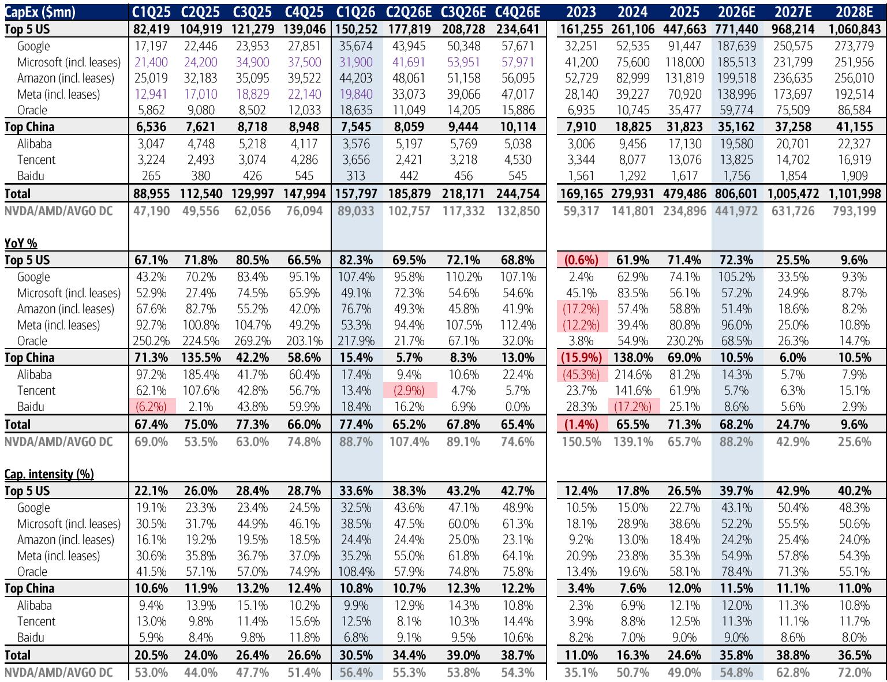
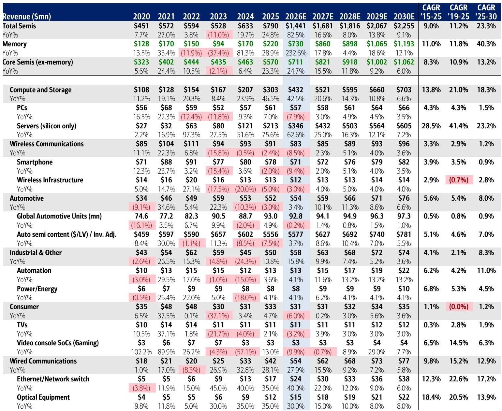
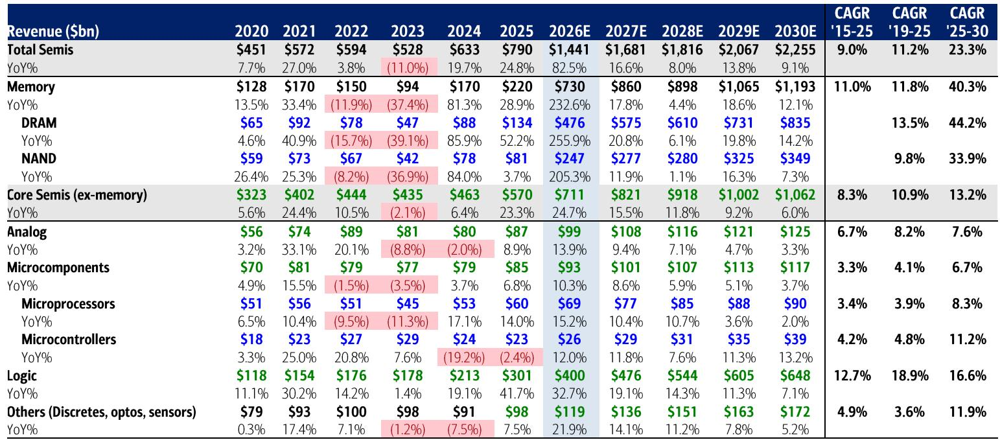

# AI Infrastructure Spending Will Reach $1.7 Trillion by 2030, But the Real Story Is How the Market Is Diversifying

The conventional narrative around AI infrastructure has been dominated by a single question: can the spending be sustained? That framing misses the more important strategic shift underway. The AI data center total addressable market is now projected to reach approximately $1.7 trillion by calendar year 2030, representing a 45% compound annual growth rate from 2025 levels. This revision upward from the prior $1.4 trillion estimate is not merely an extrapolation of existing trends. It reflects a fundamental structural change in how compute, memory, and networking are being deployed across increasingly specialized workloads.

What makes this moment different from previous technology investment cycles is the breadth of the expansion. The growth is not concentrated in a single chip architecture or a single hyperscaler. It is spreading across custom accelerators, server CPUs, high-bandwidth memory, and optical networking in ways that are additive rather than sUBStitutive. For investors and corporate strategists, the critical insight is not whether the spending will continue, but which segments will capture the disproportionate share of value as the infrastructure stack becomes more heterogeneous.

The year 2026 is shaping up to be an inflection point. The coming initial public offerings of major AI platform companies are likely to provide the market with clearer visibility into return on investment trajectories. By 2027, new architectural innovations in compute and memory systems are expected to improve tokenomics and efficiency, potentially easing the current supply chain bottlenecks that have constrained leading-edge component shipments. The companies that have planned their capacity and product roadmaps through this transition will be positioned to deliver consistent outperformance.

## The Diversification of Compute and Memory Is Expanding the Total Addressable Market, Not Fragmenting It

A common concern among investors has been that the proliferation of custom silicon from hyperscalers would cannibalize the market for general-purpose AI accelerators. The evidence points in the opposite direction. Within the revised $1.7 trillion TAM, the AI accelerator outlook has been raised to $1.2 trillion from $1.0 trillion, driven largely by increased shipments of custom ASICs from major cloud providers. This is not a zero-sum game. The expansion of custom silicon is broadening the overall compute ecosystem, not replacing existing workloads.

The data center server CPU outlook has been raised to $110 billion from $80 billion, with AI-dedicated CPUs now projected to reach $88 billion by 2030. These CPUs are being deployed in new standalone racks that work in tandem with existing GPU-CPU compute racks. Similarly, SRAM-based ultra-low-latency memory racks are expected to coexist with HBM-based GPU racks. The pattern is clear: each new architecture addresses a specific workload requirement, and together they are expanding the total addressable compute capacity.

This diversification has important implications for supply chain planning. The bottlenecks that have constrained the industry are not uniform across all components. Companies that have invested in packaging capacity, power infrastructure, and advanced memory technologies are better positioned to capture demand across multiple segments. The risk is not that demand will collapse, but that supply constraints will shift from one component category to another as the architecture mix evolves. The winners will be those who can anticipate these shifts and align their manufacturing and procurement strategies accordingly.

## Memory Supply Elasticity Is Structurally Lower, Creating a Sustained Pricing Advantage for Vendors

The memory segment has historically been characterized by boom-and-bust cycles driven by rapid capacity expansion and sUBSequent oversupply. That pattern is breaking down. Capital constraints, packaging limitations, and power availability are now acting as structural barriers to rapid supply growth. The supply-demand sufficiency ratio is not expected to rise above 110%, which means that pricing should generally hold up through the forecast period.

This structural shift has profound implications for where value is captured in the semiconductor supply chain. Memory vendors are now in a stronger position relative to equipment vendors. When supply elasticity is low, demand growth translates more directly into revenue and margin expansion for the producers rather than for the companies that sell them the tools to build capacity. The medium-term outlook favors memory companies over semiconductor capital equipment companies.

The HBM segment is particularly illustrative. HBM is projected to remain approximately 14-20% of overall accelerator spend, reaching $168 billion in TAM by 2030. While this percentage may decline toward the lower end of the range as memory tiers broaden for agentic AI workloads, the absolute dollar opportunity remains enormous. The valuation framework for memory companies is shifting from a purely cyclical multiple to a sum-of-parts approach that values the sustainable AI and HBM business at multiples comparable to compute peers, while the traditional cyclical DRAM and NAND business is valued in line with historical upcycles. This dual valuation methodology captures the reality that memory is no longer a single homogeneous business.

## The Networking Layer Is Becoming a Larger Share of the Infrastructure Pie, With Optical Connectivity Leading the Way

Networking has often been treated as a secondary consideration in AI infrastructure analysis, but the numbers tell a different story. AI networking is now projected to reach $316 billion by 2030, up from the prior estimate of $240 billion. This represents approximately 20% of the total AI data center TAM, and the growth rate of 56% CAGR from 2025 to 2030 outpaces both compute and memory.

The driver is the exponential increase in data movement requirements as models scale. Optical connectivity, in particular, is expected to grow at a 42% CAGR to $88 billion, while copper connectivity grows at 61% to $22 billion. The shift from 800G to 1.6T and eventually 3.2T transceivers is creating a multi-year upgrade cycle that benefits companies supplying digital signal processors, transimpedance amplifiers, and laser drivers.

The Ethernet transceiver TAM is being revised upward by approximately $7 billion in 2027 and $10 billion in 2028. For companies that supply the key components inside these transceivers, the opportunity is sUBStantial. A $10 billion increase in transceiver TAM translates to approximately $2 billion in DSP TAM alone, and companies with 60-70% market share at the 800G and 1.6T generations stand to capture over $1 billion in additional revenue. The networking layer is transitioning from a cost center to a value creation opportunity.

## What the Report Does Not Fully Answer: The Sustainability of Hyperscaler Custom Silicon Programs and the Second-Order Effects on the Merchant Silicon Market

While the report provides a detailed framework for the AI infrastructure TAM, it leaves several important questions unresolved. The first concerns the long-term economics of hyperscaler custom silicon programs. These programs require massive upfront investment in design teams, software stacks, and supply chain relationships. The report assumes that custom ASIC shipments will continue to grow and that this growth is additive to the overall TAM. However, it does not fully address what happens if the return on investment for these custom programs proves lower than expected, or if the hyperscalers decide to consolidate their chip strategies around a smaller number of architectures.

The second unresolved question is the second-order effect on the merchant silicon market. If custom ASICs capture a larger share of the accelerator market, what happens to the pricing power and margin structure of merchant silicon vendors? The report implicitly assumes that the total TAM expands enough to accommodate both, but this assumption has not been stress-tested under scenarios where overall AI infrastructure spending growth decelerates.

The third question is about the timing of the transition to new architectures. The report highlights 2027 as a year when new compute and memory systems could improve efficiency. But the adoption curve for new architectures is notoriously difficult to predict. If the transition takes longer than expected, the companies that have positioned themselves for a rapid shift could face inventory buildup and margin pressure.

These open questions do not invalidate the report's conclusions, but they suggest that investors should maintain a margin of safety in their valuation assumptions. The most prudent approach is to build scenarios that account for both the upside case, where diversification drives continued TAM expansion, and the downside case, where the market consolidates around a narrower set of winning architectures.

## A Decision Framework for Allocating Capital Across the AI Infrastructure Stack

For corporate strategists and portfolio managers, the report provides a useful framework for capital allocation decisions. The framework should be organized around three dimensions: architectural positioning, supply chain exposure, and valuation methodology.

On architectural positioning, the key question is whether a company is exposed to the segments that are growing faster than the overall TAM. The networking layer, custom ASICs, and AI CPUs are growing at rates that exceed the 45% CAGR for the total market. Companies with dominant positions in these sUBSegments are likely to deliver above-average revenue growth. Conversely, companies that are primarily exposed to the merchant GPU market face a more competitive environment as custom silicon gains share.

On supply chain exposure, the critical distinction is between vendors and equipment suppliers. The structural decline in memory supply elasticity favors memory vendors over equipment vendors. Similarly, companies that have secured packaging capacity and power allocations are better positioned than those that have not. The supply chain bottlenecks are not uniform, and the companies that have planned accordingly will have a competitive advantage.

On valuation methodology, the report demonstrates the importance of moving beyond single-multiple frameworks. The sum-of-parts approach applied to memory companies is equally relevant for other segments. Companies with both a sustainable AI business and a traditional cyclical business should be valued using different multiples for each component. Applying a single multiple to the entire business risks mispricing either the growth or the cyclicality.

The most important implication of this framework is that the AI infrastructure opportunity is not monolithic. The winners will be companies that have positioned themselves in the fastest-growing sUBSegments, secured their supply chains, and communicated their business mix clearly enough that the market can apply appropriate valuation methodologies. The losers will be companies that are caught in the middle, with exposure to multiple sUBSegments but without clear leadership in any of them.

## The Full Report Contains the Detailed TAM Estimates and Valuation Models That Support These Conclusions

The analysis presented here is based on a comprehensive research report that includes detailed TAM estimates across compute, memory, networking, and storage segments through 2030. The report also contains price objective changes for the top picks, including a revised sum-of-parts valuation for the memory sector and updated estimates for networking companies benefiting from the optical upgrade cycle.

The original report includes charts showing the evolution of the AI data center TAM from $823 billion in June 2025 to the current $1.7 trillion estimate, as well as vendor-level market share projections for AI accelerators through 2030. These charts provide the granular data that supports the strategic conclusions outlined here.

For readers who want to examine the underlying assumptions, review the original charts, and understand the specific valuation methodologies applied to each sUBSegment, the full report is available.

Join the community to read the full report and review the original charts.

*This article is for learning and discussion only and does not constitute investment advice.*

Personal reading notes and learning share only. Not investment advice.

