# Asia Economics Mid-Year Outlook

# The industrial super-cycle is outweighing the energy shock

We remain more constructive than consensus, as we expect the strength of the industrial cycle to offset the effects of higher energy prices. At the same time, we don't expect as many rate hikes as the market is pricing in.

# Key Takeaways

Asia's macro outlook hinges on two factors – the strength of the industrial cycle vs. the disruptions posed by the energy shock.   
2Q growth momentum is holding up better than we had expected. The strength of the industrial cycle is outweighing the drag from geopolitical tensions.   
The ongoing tech and non-tech exports recovery and a robust capex cycle sustain job creation and growth in wages and consumption – broadening the recovery.   
Korea, Taiwan, China, and Japan are the key beneficiaries of this upswing in the industrial and capex cycle.   
The risk is if a severe re-escalation leads to a disruptive sharp rise in oil prices through US\$150/bbl for a sustained period.

In this report, we highlight how the strength of the industrial cycle benefits Asia and how Asia's growth cycle is broadening.

MS ASIA LIMITED

# Chetan Ahya

Chief Asia Economist

Chetan.Ahya@morganstanley.com +852 2239-7812

MS ASIA (SINGAPORE) PTE.

# Derrick Y Kam

Asia Economist

Derrick.Kam@morganstanley.com +65 6834-8272

MS ASIA LIMITED

# Jonathan Cheung

Economist

Jonathan.Cheung@morganstanley.com +852 2848-5652

# Kelly Wang

Economist

Kelly.Wang@morganstanley.com +852 3963-0891

MS INDIA COMPANY PRIVATE LIMITED

# Sudhanshu Agarwal

Economist

Sudhanshu.Agarwal@morganstanley.com +91 22 6995-4568

Exhibit 1: Asia – real GDP growth forecasts 

<table><tr><td>Real GDP (%Y)</td><td>2025</td><td>2026E</td><td>2027E</td></tr><tr><td>China</td><td>5.0</td><td>4.8</td><td>4.7</td></tr><tr><td>Hong Kong</td><td>3.6</td><td>4.8</td><td>4.5</td></tr><tr><td>India</td><td>7.5</td><td>6.8</td><td>7.0</td></tr><tr><td>Indonesia</td><td>5.1</td><td>5.1</td><td>5.0</td></tr><tr><td>Korea</td><td>1.1</td><td>2.8</td><td>2.2</td></tr><tr><td>Malaysia</td><td>5.1</td><td>4.6</td><td>4.7</td></tr><tr><td>Philippines</td><td>4.5</td><td>4.0</td><td>5.0</td></tr><tr><td>Singapore</td><td>5.0</td><td>2.9</td><td>2.6</td></tr><tr><td>Taiwan</td><td>8.6</td><td>8.9</td><td>4.7</td></tr><tr><td>Thailand</td><td>2.4</td><td>1.6</td><td>2.3</td></tr><tr><td>Australia</td><td>2.0</td><td>1.9</td><td>1.5</td></tr><tr><td>Japan</td><td>1.2</td><td>0.4</td><td>1.0</td></tr><tr><td>Asia</td><td>5.0</td><td>4.8</td><td>4.7</td></tr><tr><td>Asia ex China</td><td>5.0</td><td>4.7</td><td>4.7</td></tr><tr><td>Asia ex India</td><td>4.4</td><td>4.2</td><td>4.1</td></tr><tr><td>Asia ex China ex India</td><td>3.3</td><td>3.2</td><td>3.0</td></tr><tr><td>AXJ</td><td>5.5</td><td>5.2</td><td>5.1</td></tr><tr><td>AXJ ex China</td><td>5.9</td><td>5.7</td><td>5.6</td></tr><tr><td>AXJ ex China ex India</td><td>4.3</td><td>4.4</td><td>3.9</td></tr></table>

Source: CEIC, MS (E) forecasts.

# The strength of the industrial cycle is outweighing the energy shock

At the centre of two countervailing forces: Our recent research has been focused on two issues – 1) the strength of the industrial cycle and 2) the potential disruptions arising from the geopolitical tensions in the Middle East. Asia, interestingly, sits right in the middle of these forces. It is simultaneously the key beneficiary of an upswing in the industrial cycle – given its high share of industrial value-added globally and a high weight of the industrial sector in its GDP. But it is also the most exposed region to energy shocks – given its high dependence on imported oil and gas. So far, Asia has managed the energy shock well, and the strength of the industrial cycle is supporting Asia's growth.

High-frequency data are affirming that the industrial cycle is pulling ahead: Asia entered this period with clear cyclical momentum: manufacturing PMIs had strengthened, industrial production was improving, exports – especially for non-tech – were holding up, and capital goods imports pointed to a firmer investment cycle. Though growth data points did soften in March as the initial rise in energy prices filtered through, growth has since recovered momentum in April, as evident in the pickup in PMIs and exports.

Exhibit 2: Asia and global manufacturing PMIs inflected higher again in April   
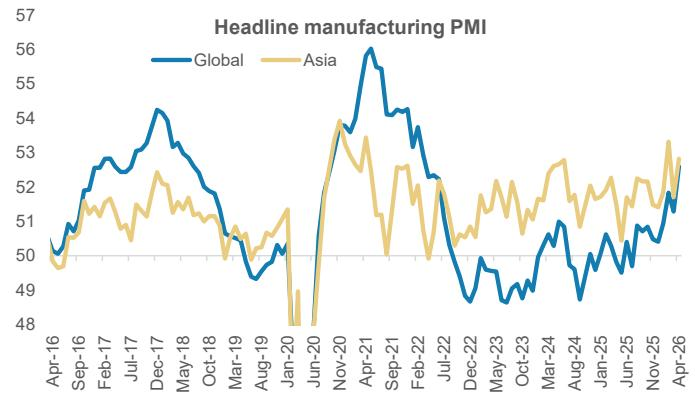

line

| Month    | Global | Asia |
|----------|--------|------|
| Apr-16   | 50.0   | 49.5 |
| Sep-16   | 51.5   | 50.5 |
| Feb-17   | 52.5   | 51.0 |
| Jul-17   | 53.0   | 51.5 |
| Dec-17   | 54.0   | 52.0 |
| May-18   | 53.0   | 51.5 |
| Oct-18   | 52.0   | 51.0 |
| Mar-19   | 51.0   | 50.5 |
| Aug-19   | 50.0   | 50.0 |
| Jan-20   | 49.0   | 48.5 |
| Jun-20   | 54.0   | 53.0 |
| Nov-20   | 56.0   | 54.0 |
| Apr-21   | 55.0   | 53.0 |
| Sep-21   | 54.0   | 52.0 |
| Feb-22   | 53.0   | 51.0 |
| Jul-22   | 52.0   | 50.0 |
| Dec-22   | 49.0   | 48.5 |
| May-23   | 48.5   | 48.0 |
| Oct-23   | 49.0   | 48.5 |
| Mar-24   | 50.0   | 49.0 |
| Aug-24   | 49.0   | 48.5 |
| Jan-25   | 50.0   | 49.0 |
| Jun-25   | 51.0   | 50.0 |
| Nov-25   | 52.0   | 51.0 |
| Apr-26   | 53.0   | 52.0 |

Source: CEIC, Haver, MS

Exhibit 3: Asia's industrial production growth is at a four-year high   
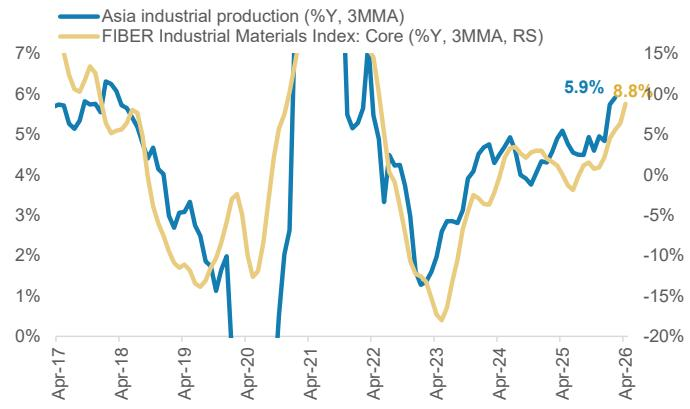

line

| Date   | Asia industrial production (%Y, 3MMA) | FIBER Industrial Materials Index (%Y, 3MMA, RS) |
|--------|----------------------------------------|--------------------------------------------------|
| Apr-26 | 5.9%                                   | 8.8%                                             |

Source: Haver, MS

Exhibit 4: Non-tech exports picking up   
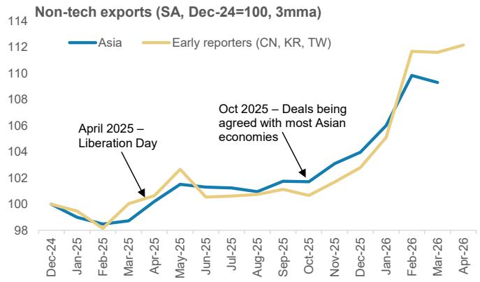

line

| Date    | Asia | Early reporters (CN, KR, TW) |
|---------|------|------------------------------|
| Dec-24  | 100  | 100                          |
| Jan-25  | 99   | 99                           |
| Feb-25  | 98   | 98                           |
| Mar-25  | 99   | 100                          |
| Apr-25  | 100  | 101                          |
| May-25  | 101  | 103                          |
| Jun-25  | 101  | 101                          |
| Jul-25  | 101  | 101                          |
| Aug-25  | 101  | 101                          |
| Sep-25  | 102  | 101                          |
| Oct-25  | 102  | 101                          |
| Nov-25  | 103  | 103                          |
| Dec-25  | 104  | 104                          |
| Jan-26  | 106  | 106                          |
| Feb-26  | 110  | 112                          |
| Mar-26  | 109  | 112                          |
| Apr-26  | 109  | 112                          |

Source: CEIC, Haver, MS; Note: As China and Korea's April export data is currently available for a limited set of products, we calculate their non-tech exports as the residual from total exports after excluding early-reporting tech items.

Exhibit 5: Capex momentum remains strong   
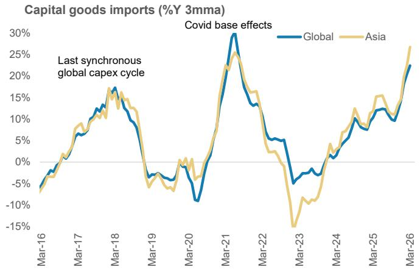

line

| Date   | Global | Asia |
|--------|--------|------|
| Mar-16 | -5%    | -5%  |
| Mar-17 | 10%    | 10%  |
| Mar-18 | 15%    | 15%  |
| Mar-19 | -5%    | -5%  |
| Mar-20 | -10%   | -5%  |
| Mar-21 | 30%    | 25%  |
| Mar-22 | 5%     | 5%   |
| Mar-23 | -5%    | -15% |
| Mar-24 | 5%     | 5%   |
| Mar-25 | 10%    | 10%  |
| Mar-26 | 25%    | 25%  |

Source: CEIC, Haver, MS

Asia has managed the energy shock well: Asia has managed its fuel supplies in several ways:

- Sharp cuts in China's energy imports: China has cut its oil and LNG imports $30\%$ and $56\%$ from the December 2025 peak. This has increased supplies for the rest of Asia.   
- Drawdown of inventories at sea and strategic reserves   
- Shift to alternative energy sources, including coal, nuclear, and renewable energy   
- Increasing domestic refined product production – for example, India has increased LPG production by 40%

Separately, an increase in US exports of oil and gas has also helped Asia manage this energy shock better (see The Oil Manual: Why Is the Price of Oil Not Higher? May 11, 2026). For example, the US has increased its seaborne crude and petroleum exports 71%Y – from 5.2 mb/d a year ago to 8.9 mb/d currently. This has meant that Asia has been able to mitigate the supply disruptions and keep production going, albeit with the backdrop of higher prices.

Exhibit 6: China's oil imports have fallen $30\%$ vs. December 2025   
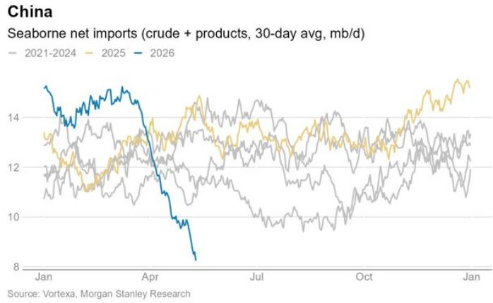

line

| Month | 2021-2024 | 2025 | 2026 |
|-------|-----------|------|------|
| Jan   | ~13.5     | ~13.8 | ~15.0 |
| Apr   | ~11.5     | ~13.5 | ~10.0 |
| Jul   | ~10.5     | ~13.8 | ~9.0 |
| Oct   | ~11.0     | ~13.5 | ~10.5 |
| Jan   | ~12.5     | ~14.5 | ~13.0 |

Source: Vortexa, MS

Exhibit 8: Drawdown of strategic reserves and both observable and unobservable inventories has helped   
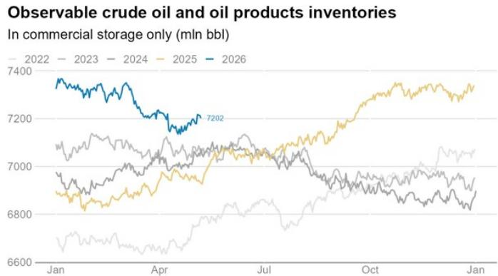

line

| Month | 2022 | 2023 | 2024 | 2025 | 2026 |
|-------|------|------|------|------|------|
| Jan   | ~6700 | ~6900 | ~7100 | ~6850 | ~7350 |
| Apr   | ~6800 | ~7000 | ~7050 | ~6950 | ~7150 |
| Jul   | ~6900 | ~7100 | ~7150 | ~7100 | ~7202 |
| Oct   | ~6850 | ~7050 | ~7100 | ~7300 | ~7350 |
| Jan   | ~6800 | ~6950 | ~6950 | ~7350 | ~7350 |

Note: inventories on land, at sea and in-transit, not including SPR in OECD countries  
Source: IEA, EIA/DOE, PJK, IE, Genscape, PAJ, Platts, Vortexa, MS   
Source: IEA, EIA/DOE, PJK, IE, Genscape, PAJ, Platts, Vortexa, MS, Note: Inventories include SPR

Exhibit 7: Its gas imports have also fallen 56%, increasing available supplies for other economies   
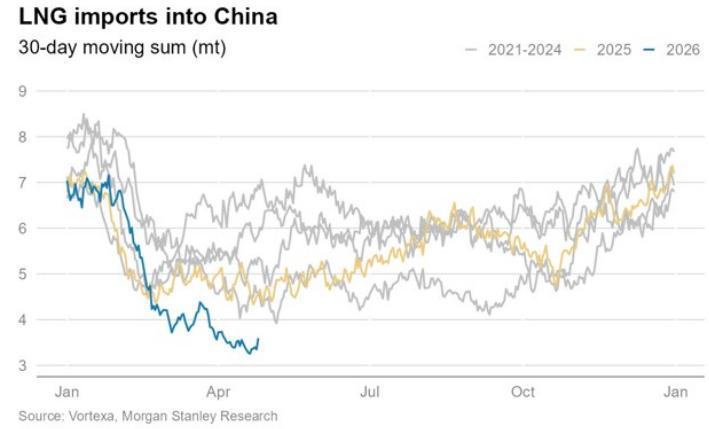

line

| Month | 2021-2024 | 2025 | 2026 |
|-------|-----------|------|------|
| Jan   | ~8.5      | ~7.0 | ~7.0 |
| Apr   | ~4.0      | ~4.5 | ~3.5 |
| Jul   | ~6.0      | ~5.5 | -    |
| Oct   | ~6.5      | ~6.0 | -    |
| Jan   | ~7.5      | ~7.0 | -    |

Source: Vortexa, MS

Exhibit 9: Seaborne oil exports from the US have surged   
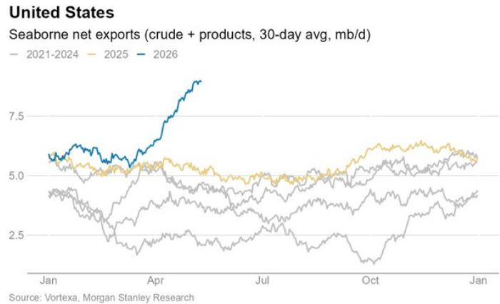

line

| Month | 2021-2024 | 2025 | 2026 |
|-------|-----------|------|------|
| Jan   | ~4.5      | ~5.5 | ~6.0 |
| Apr   | ~3.0      | ~5.0 | ~7.0 |
| Jul   | ~3.5      | ~5.0 | ~7.5 |
| Oct   | ~2.0      | ~5.5 | ~8.0 |
| Jan   | ~4.0      | ~5.5 | ~8.5 |

Source: Vortexa, MS

The most powerful industrial cycle since mid-2000s: Meanwhile, Asia is entering its most powerful industrial super-cycle since the mid-2000s. A sustained, multi-year rise in capex is underway, underpinned by structural forces (see Asia Economics: Headed Towards an Industrial Super-Cycle, April 27, 2026).

Four key drivers: We identify four interlocking structural drivers that distinguish this cycle.

1. AI and AI-related infrastructure: AI and related spending are still a top priority for CIOs and Asia's corporate sector has to accelerate spending to catch up with the US. At the same time, Asia remains a key supplier to the AI supply chain and these companies will collectively lift their capex too to meet the rising demand.   
2. Energy and energy transition: Across the region, economies are having to spend more on energy for powering AI, making the energy transition to renewables and for energy security. This would have moved up the policy agenda after the recent energy shock.   
3. Defense spending: Policymakers across the region had already been budgeting increases in their defense spending in the coming years. The geopolitical tensions have only further cemented this planned increase in expenditures.   
4. Broader industrial capex spillovers: The rise in spending in the three segments above will catalyse a broader capex and industrial cycle as the full effects work through the entire supply chain. There will be a positive reinforcement loop.

Asia's capex to grow 3x faster in the next five years: We forecast Asia's gross fixed investment to reach US\$16trn by 2030, up from US\$11trn currently — a 7% CAGR over the next five years, approximately three times the pace of growth seen over 2023–25. The high-growth structural segments — AI infrastructure, energy transition, and defense — are expected to expand at a 16% CAGR over 2026–30, with combined spending in these four segments (including broader industrial spillovers) rising to a US\$9trn annual run rate in 2030, up from US\$5trn in 2025.

These are not standalone factors — they are intertwined and will have an effect on the industrial cycle greater than the sum of their parts. Moreover, Asia stands to enjoy a double benefit given its role as the production powerhouse. This capex surge will not remain confined to investment alone: as capex rises, it will catalyse job creation and wage growth, which in turn lifts consumption, creating a self-reinforcing virtuous cycle.

Geopolitical tensions – a near-term drag but a medium-term catalyst: The same tensions that are raising oil and gas costs are simultaneously forcing governments and corporations to accelerate spending on energy security, AI infrastructure, and defense — all of which are structural tailwinds for Asia's industrial cycle.

Capex leads to a trade boom: While capex was initially driven by AI and tech-related spending, it led to a strong rise in Asia's tech exports, and over the past six months, we have seen a sustained rise in non-tech exports. From an outlook perspective, we see this positive dynamic being sustained. Our global economics team highlights that the outlook for global trade is improving, underpinned by a stronger global capex cycle. They project that global capex growth (ex-China property investment) will improve from $3.9\%$ Y in 2025 to $4.3\%$ in 2026. This also means that global capex growth will be much stronger than overall GDP growth. This backdrop will continue to support Asia's trade.

Exhibit 10: Asia's gross fixed investment to rise to \$16trn by 2030   
Asia gross fixed investment\* (US\$trn)  
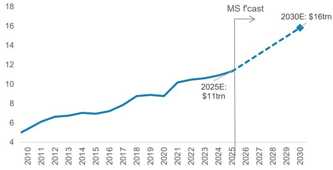

line

| Year | Value |
| ---- | ----- |
| 2025E | $11tr |
| 2030E | $16tr |

Source: CEIC, Haver, IEA, Lowy Institute, MS estimates; Note: \*We exclude China real estate capex given the structural decline in property demand.

Exhibit 11: The rise in capex is to be driven by new sources of structural demand – AI and AI infrastructure spending, energy and energy transition, and defense spending   
Asia nominal investment in high growth sectors (US\$trn)   
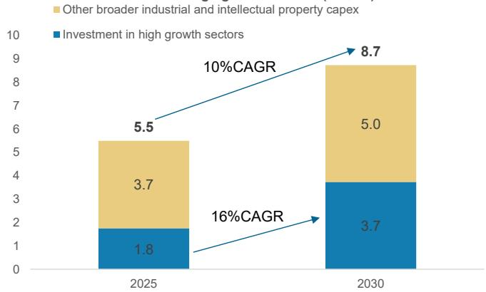

bar_stacked

| Year | Investment in high growth sectors | Other broader industrial and intellectual property capex |
| :--- | :--- | :--- |
| 2025 | 1.8 | 3.7 |
| 2030 | 3.7 | 5.0 |
| 2025 (CAGR) | 16% CAGR | 10% CAGR |
| 2030 (CAGR) | 8.7 | 10% CAGR |

Source: CEIC, Haver, IEA, Lowy Institute, MS estimates; Note: \*We exclude China 'sreal estate capex given the structural decline in property demand.

Exhibit 12: US IT capex to sustain Asia's tech exports   
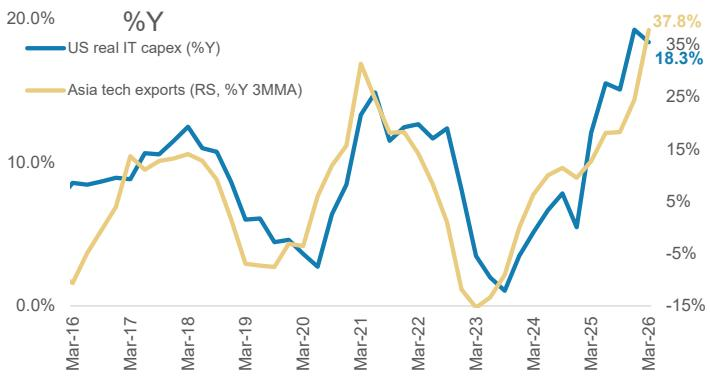

line

| Date   | US real IT capex (%) | Asia tech exports (RS, %Y 3MMA) |
|--------|----------------------|----------------------------------|
| Mar-26 | 37.8                 | 18.3                             |

Source: Haver, CEIC, MS

Exhibit 13: Energy shock will catalyse stronger spending on energy security   
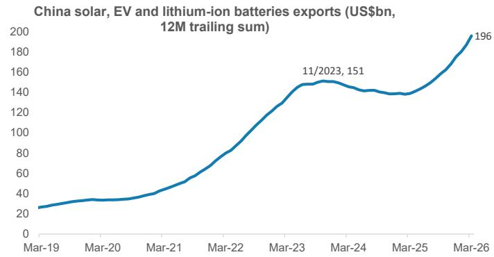

line

| Date    | Value |
|---------|-------|
| 11/2023 | 151   |
| Mar-26  | 196   |

Source: CEIC, MS

Exhibit 14: Renewable energy still accounts for a small share of Asia's energy   
Asia share of primary energy consumption by fuel type (\%, 2024)   
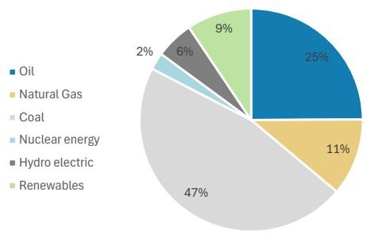

pie

| Category | Percentage (%) |
| :--- | :--- |
| Oil | 25 |
| Natural Gas | 11 |
| Coal | 47 |
| Nuclear energy | 2 |
| Hydro electric | 6 |
| Renewables | 9 |

Source: World Statistical Review of Energy, IEA, MS

Exhibit 15: Asia's defense spending to rise   
Defense spending (% of GDP)   
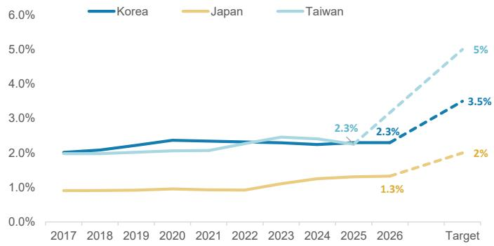

line

| Year | Korea (%) | Japan (%) | Taiwan (%) |
|---|---|---|---|
| 2017 | 2.0 | 0.9 | 1.9 |
| 2020 | 2.4 | 0.9 | 2.0 |
| 2025 | 2.3 | 1.3 | 2.3 |
| Target | 3.5 | 2 | 5 |

Source: CEIC, Government budget documents, News sources, MS; Note: Taiwan's defense spending in 2026 is set to reach 3.3% of GDP (following a broader NATO standards).

Exhibit 16: Global capex growth (ex-China property investment) will improve from 3.9%Y in 2025 to 4.3% in 2026   
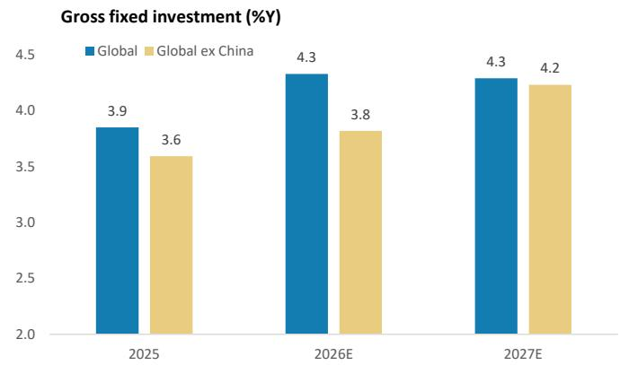

bar

Gross fixed investment (%Y)
| Year | Global (%) | Global ex China (%) |
| :--- | :--- | :--- |
| 2025 | 3.9 | 3.6 |
| 2026E | 4.3 | 3.8 |
| 2027E | 4.3 | 4.2 |

Source: CEIC, Haver, MS Estimates

Exhibit 17: Excluding China, global capex growth would accelerate from 3.6%Y in 2025 to 3.8% in 2026 and 4.2% in 2027   
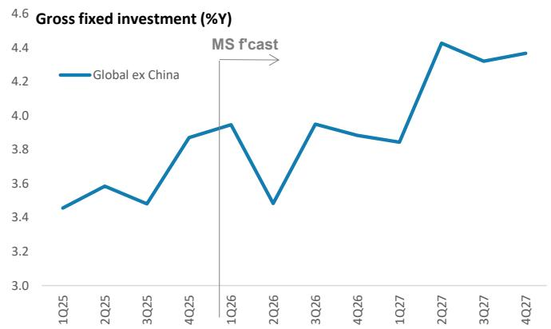

line

| Quarter | Gross fixed investment (%Y) |
| ------- | --------------------------- |
| 1Q25    | 3.4                         |
| 2Q25    | 3.6                         |
| 3Q25    | 3.5                         |
| 4Q25    | 3.9                         |
| 1Q26    | 4.0                         |
| 2Q26    | 3.5                         |
| 3Q26    | 3.9                         |
| 4Q26    | 3.8                         |
| 1Q27    | 3.8                         |
| 2Q27    | 4.4                         |
| 3Q27    | 4.3                         |
| 4Q27    | 4.4                         |

Source: CEIC, Haver, MS Estimates

Which economies benefit most from this industrial and capex super-cycle: While the super-cycle will lift all Asian economies, we highlight Taiwan, Korea, China, and Japan as the primary beneficiaries, given the high exposure to AI, energy, and defense high-growth sectors. They will benefit from both domestic capex pickup and expanded export opportunities. From a market perspective, the industrial sector carries a larger weight in their MSCI indices too. India will also benefit from the industrial cycle pickup, alongside a domestic capex boost driven by easy fiscal and monetary policies. Australia and Indonesia stand to gain as commodity exporters, with the raw materials price index already at a four-year high.

Exhibit 18: We highlight Taiwan, Korea, China, and Japan – they are more exposed to a pickup in domestic capex and export opportunities in the high-growth sectors of AI, energy and defense   
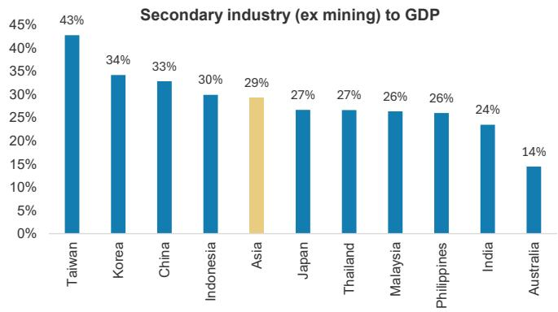

bar

Secondary industry (ex mining) to GDP
| Country | Secondary Industry (ex mining) (%) |
| :--- | :--- |
| Taiwan | 43 |
| Korea | 34 |
| China | 33 |
| Indonesia | 30 |
| Asia | 29 |
| Japan | 27 |
| Thailand | 27 |
| Malaysia | 26 |
| Philippines | 26 |
| India | 24 |
| Australia | 14 |

Source: Haver, MS; PPP weighted average used for Asia.

Exhibit 19: Taiwan, Thailand, China, Japan, and Korea have higher share of capital goods exports in the overall export basket   
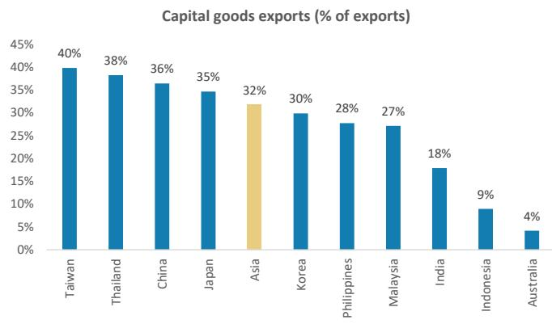

bar

Capital goods exports (% of exports)
| Country | Capital goods exports (% of exports) |
| :--- | :--- |
| Taiwan | 40 |
| Thailand | 38 |
| China | 36 |
| Japan | 35 |
| Asia | 32 |
| Korea | 30 |
| Philippines | 28 |
| Malaysia | 27 |
| India | 18 |
| Indonesia | 9 |
| Australia | 4 |

Source: Haver, MS; PPP weighted average used for Asia.

The growth cycle is broadening: Six months ago in our Year Ahead Outlook, we had drawn attention to the notion that Asia's recovery was broadening. Six months on, we still see this unfolding. We think Asia is in a virtuous cycle, where the rise in exports – both tech and non-tech – and the robust capex cycle will help to support job creation and wage growth – underpinning consumption growth. This backdrop will generate positive spillovers to Asia's growth momentum.

For China, considering the starting point of excess capacity and deflationary pressures, we think that the strength in exports will first show up in improving capacity utilization, which will then reduce deflationary pressures and improves nominal GDP growth. As that unfolds, corporate revenue growth picks up, followed by wage growth. Meanwhile, job creation should improve with a lag, as companies will first utilize the slack in their capacity before looking to start hiring.

Exhibit 20: More broad-based pickup in exports and capex will generate positive spillover for labour market and wage growth   
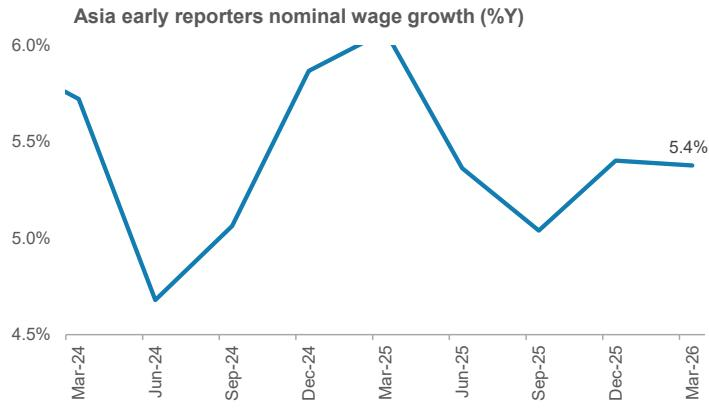

line

| Month   | Nominal Wage Growth (%) |
| ------- | ------------------------ |
| Mar-24  | 5.8%                     |
| Jun-24  | 4.7%                     |
| Sep-24  | 5.1%                     |
| Dec-24  | 5.9%                     |
| Mar-25  | 6.0%                     |
| Jun-25  | 5.3%                     |
| Sep-25  | 5.0%                     |
| Dec-25  | 5.4%                     |
| Mar-26  | 5.4%                     |

Source: CEIC, Haver, Capitaline, MS

Exhibit 21: Retail sales growth suggests consumers have so far held up better than expected amid energy shock   
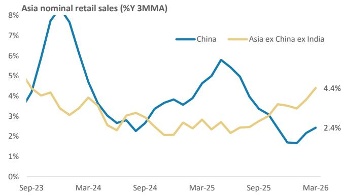

line

| Date   | China | Asia ex China ex India |
|--------|-------|-------------------------|
| Mar-26 | 2.4%  | 4.4%                    |

Source: CEIC, Haver, MS

Growth moderates from 2Q but stabilizes thereafter: We expect growth to moderate in 2Q as higher energy prices will lead to a drag on growth. But the combination of the mitigation strategies as well as the strength of the industrial cycle has meant that 2Q26 was already tracking better at 4.6%Y than we had expected in the April forecast update (4.2%Y). From 2Q onwards, we are expecting growth to stabilize around these levels. In our April forecast update, we had brought our growth estimate for Asia down 40bps – but in this forecast round, we have lifted it back up. Indeed, our 2026 GDP growth forecast for Asia now stands at 4.8% – unchanged from our Year Ahead Outlook. Our 2027 GDP growth forecast is now moderately higher than it was then.

Risks to the outlook – industrial cycle vs. oil price trajectory: The key upside risk is if the capex and industrial cycle is even stronger than we had built in, or if oil prices rapidly move lower. The key downside risk is if we get a severe re-escalation that results in oil prices moving through US\$150/bbl, which then triggers a global recession, with spillovers to Asia.

Our rule of thumb is that each sustained US\$10/bbl increase in oil prices reduces Asia's GDP growth \~20-30bp on a gross basis, or \~10bp after mitigating measures and fiscal offsets. But we are concerned that non-linear effects could kick in as a result of stronger oil prices.

Exhibit 22: Asia – real GDP growth forecasts 

<table><tr><td rowspan="2">Real GDP (%Y)</td><td colspan="4">2025</td><td colspan="4">2026</td><td colspan="4">2027</td><td rowspan="2">2025</td><td rowspan="2">2026E</td><td rowspan="2">2027E</td></tr><tr><td>1Q</td><td>2Q</td><td>3Q</td><td>4Q</td><td>1QE</td><td>2QE</td><td>3QE</td><td>4QE</td><td>1QE</td><td>2QE</td><td>3QE</td><td>4QE</td></tr><tr><td>China</td><td>5.4</td><td>5.2</td><td>4.8</td><td>4.5</td><td>5.0</td><td>4.7</td><td>4.8</td><td>4.9</td><td>4.7</td><td>4.8</td><td>4.8</td><td>4.6</td><td>5.0</td><td>4.8</td><td>4.7</td></tr><tr><td>Hong Kong</td><td>3.2</td><td>3.3</td><td>3.8</td><td>4.0</td><td>5.9</td><td>5.0</td><td>4.4</td><td>3.8</td><td>3.3</td><td>4.6</td><td>5.1</td><td>5.0</td><td>3.6</td><td>4.8</td><td>4.5</td></tr><tr><td>India</td><td>7.0</td><td>6.7</td><td>8.4</td><td>7.8</td><td>7.4</td><td>6.5</td><td>6.7</td><td>6.8</td><td>7.0</td><td>7.0</td><td>7.2</td><td>7.0</td><td>7.5</td><td>6.8</td><td>7.0</td></tr><tr><td>Indonesia</td><td>4.9</td><td>5.1</td><td>5.0</td><td>5.4</td><td>5.6</td><td>5.0</td><td>5.0</td><td>5.0</td><td>5.0</td><td>5.1</td><td>5.0</td><td>5.1</td><td>5.1</td><td>5.1</td><td>5.0</td></tr><tr><td>Korea</td><td>-0.1</td><td>1.0</td><td>1.7</td><td>1.6</td><td>3.6</td><td>3.1</td><td>2.8</td><td>1.5</td><td>2.2</td><td>3.7</td><td>1.6</td><td>1.5</td><td>1.1</td><td>2.8</td><td>2.2</td></tr><tr><td>Malaysia</td><td>4.4</td><td>4.4</td><td>5.4</td><td>6.3</td><td>5.3</td><td>4.7</td><td>4.4</td><td>4.0</td><td>4.8</td><td>4.7</td><td>4.7</td><td>4.5</td><td>5.1</td><td>4.6</td><td>4.7</td></tr><tr><td>Philippines</td><td>5.4</td><td>5.4</td><td>4.0</td><td>3.0</td><td>2.8</td><td>3.8</td><td>4.4</td><td>5.0</td><td>5.7</td><td>4.4</td><td>5.2</td><td>4.8</td><td>4.5</td><td>4.0</td><td>5.0</td></tr><tr><td>Singapore</td><td>4.5</td><td>5.4</td><td>4.5</td><td>5.7</td><td>4.6</td><td>3.5</td><td>1.9</td><td>1.5</td><td>2.5</td><td>2.6</td><td>2.4</td><td>2.8</td><td>5.0</td><td>2.9</td><td>2.6</td></tr><tr><td>Taiwan</td><td>5.5</td><td>7.7</td><td>8.2</td><td>12.7</td><td>13.7</td><td>10.1</td><td>9.0</td><td>2.8</td><td>6.4</td><td>6.1</td><td>3.7</td><td>2.4</td><td>8.6</td><td>8.9</td><td>4.7</td></tr><tr><td>Thailand</td><td>3.1</td><td>2.8</td><td>1.2</td><td>2.5</td><td>1.4</td><td>1.3</td><td>1.8</td><td>2.0</td><td>2.0</td><td>2.2</td><td>2.5</td><td>2.5</td><td>2.4</td><td>1.6</td><td>2.3</td></tr><tr><td>Australia</td><td>1.3</td><td>1.9</td><td>2.1</td><td>2.6</td><td>2.6</td><td>1.9</td><td>1.7</td><td>1.2</td><td>1.2</td><td>1.4</td><td>1.5</td><td>1.7</td><td>2.0</td><td>1.9</td><td>1.5</td></tr><tr><td>Japan</td><td>1.6</td><td>2.1</td><td>0.7</td><td>0.4</td><td>0.9</td><td>-0.1</td><td>0.5</td><td>0.5</td><td>0.3</td><td>1.1</td><td>1.3</td><td>1.1</td><td>1.2</td><td>0.4</td><td>1.0</td></tr><tr><td>Asia</td><td>5.0</td><td>5.0</td><td>5.0</td><td>4.9</td><td>5.2</td><td>4.6</td><td>4.7</td><td>4.6</td><td>4.7</td><td>4.9</td><td>4.8</td><td>4.6</td><td>5.0</td><td>4.8</td><td>4.7</td></tr><tr><td>Asia ex China</td><td>4.6</td><td>4.8</td><td>5.3</td><td>5.3</td><td>5.4</td><td>4.6</td><td>4.6</td><td>4.3</td><td>4.7</td><td>4.9</td><td>4.8</td><td>4.6</td><td>5.0</td><td>4.7</td><td>4.7</td></tr><tr><td>Asia ex India</td><td>4.5</td><td>4.6</td><td>4.1</td><td>4.2</td><td>4.6</td><td>4.1</td><td>4.2</td><td>4.0</td><td>4.1</td><td>4.3</td><td>4.1</td><td>3.9</td><td>4.4</td><td>4.2</td><td>4.1</td></tr><tr><td>Asia ex China ex India</td><td>2.9</td><td>3.5</td><td>3.1</td><td>3.6</td><td>4.0</td><td>3.2</td><td>3.2</td><td>2.5</td><td>2.9</td><td>3.3</td><td>3.0</td><td>2.8</td><td>3.3</td><td>3.2</td><td>3.0</td></tr><tr><td>AXJ</td><td>5.4</td><td>5.3</td><td>5.5</td><td>5.4</td><td>5.7</td><td>5.1</td><td>5.2</td><td>5.0</td><td>5.2</td><td>5.3</td><td>5.1</td><td>4.9</td><td>5.5</td><td>5.2</td><td>5.1</td></tr><tr><td>AXJ ex China</td><td>5.4</td><td>5.5</td><td>6.4</td><td>6.4</td><td>6.4</td><td>5.6</td><td>5.6</td><td>5.2</td><td>5.6</td><td>5.8</td><td>5.6</td><td>5.4</td><td>5.9</td><td>5.7</td><td>5.6</td></tr><tr><td>AXJ ex China ex India</td><td>3.7</td><td>4.3</td><td>4.2</td><td>5.0</td><td>5.4</td><td>4.6</td><td>4.4</td><td>3.4</td><td>4.1</td><td>4.4</td><td>3.8</td><td>3.6</td><td>4.3</td><td>4.4</td><td>3.9</td></tr></table>

Source: Haver, CEIC, MS (E) forecasts

# Outlook for the top six economies by PPP weight

China – ey beneficiary of industrial super-cycle: China’s relatively limited exposure to the energy shock and continued support from robust exports lead our Chief Economist for China, Robin Xing, to expect 2026 growth to reach 4.8%Y. We have been highlighting China as one of the key beneficiaries of Asia’s capex super-cycle, given that it is more exposed to the high-growth sectors of AI, energy, and defense, and will benefit from a pickup in export opportunities and domestic capex. Reflecting this, real exports growth within GDP is likely to accelerate to 8%Y (vs. 5.4% in 2025), while we estimate real GFCF growth (excluding property investment) should pick up to 5.8%Y this year (vs. 4.6% in 2025). With growth on track to reach the 4.5-5% target, additional policy easing is likely to be limited. We see an improvement in nominal GDP growth to a 4-year high of 5.1%Y (vs. 4% in 2025).

India – domestic demand momentum intact: Incoming high-frequency indicators suggest that the domestic demand recovery since 2H25 remains largely intact. While the drag from negative terms of trade and supply shortage disruptions to select sectors is likely to weigh on 2Q growth temporarily, we expect growth to gradually recover from 3Q onwards as these challenges ease. Overall, our Chief Economist for India, Upasana Chachra, expects growth to average a healthy 6.8%Y for 2026. Within domestic demand, urban consumption and government capex are likely to be key sources of support. Measures to stabilize fuel prices should help keep real private consumption growth buoyant at 7%Y for 2026, even as rural demand faces headwinds from weather and fertilizer-related disruptions. Government capex is likely to be focused on infrastructure and defense spending.

Japan – stronger exports and fiscal support to cushion the energy shock: Our Chief Economist for Japan, Takeshi Yamaguchi, expects real GDP growth to slow given the headwinds from weaker terms of trade, higher inflation weighing on real wage growth (and hence consumption), and shortages in refined products such as naphtha affecting production in certain sectors. But stronger exports and pro-growth policies to be unveiled during the summer will help cushion growth. Importantly, we also see Japan as one of the economies that benefit more from the upswing in the industrial/capex cycle. Structural drivers of Japan’s reflationary environment that we have previously highlighted (such as favorable r-g gap) are still intact.

Indonesia – waiting for the capex turnaround: Growth momentum had picked up in 1Q26, supported by a 21.8% surge in government spending. We have been highlighting that a pickup in the capex cycle remains key to sustain the next phase of the expansion. But, so far, this has not yet transpired. The investment/GDP ratio has been flat-lining since 1Q25 and remains well below its pre-covid levels, creating challenges for job creation and sustained consumption growth.

We see three key factors that could help improve the macro outlook:

1. A pickup in the pace of policy reforms that supports corporate sentiment,   
2. A sustained rise in commodity prices helping to lift terms of trade,   
3. A rise in public capex which catalyses an overall capex cycle.

Korea – recovery is broadening to consumption: While Korea is among the economies relatively more exposed to the energy shock in Asia, offsets from strength in exports and fiscal support lead our Chief Economist for Korea, Kathleen Oh, to expect real GDP growth to pick up to 2.8%Y in 2026 (vs. 1.1% in 2025). Real export growth is likely to accelerate to 10%Y this year (vs. 4.2% in 2025), led by semiconductor exports but also supported by Korea’s high exposure to other high-growth sectors of energy/energy transition, defense, and broader capital goods exports. Kathleen also expects the recovery to broaden out to consumption, supported by 1) lower income household support from supplementary budgets, (2) improving labor income, and 3) positive wealth effects.

Taiwan – riding the AI super-cycle: Taiwan’s central role in advanced semis production is continuing to boost exports, and we expect growth to remain strong at 8.9%Y this year (vs. a high base of 8.6% in 2025). The much-stronger-than-expected 1Q26 GDP print underscored the continued strength in external demand, and Kathleen sees sustained strength in semis exports through next year, fueled by strong US hyperscaler capex guidance. The positive spillover from exports to domestic capex is likely to lift gross capital formation (GCF) growth to 10%Y this year (vs. 4.9% last year), while the government’s universal cash handout programme and wealth effects from equity market are tailwinds for private consumption recovery.

Exhibit 23: China – stabilization in ex-property capex amid strong pickup in Asia's industrial cycle   
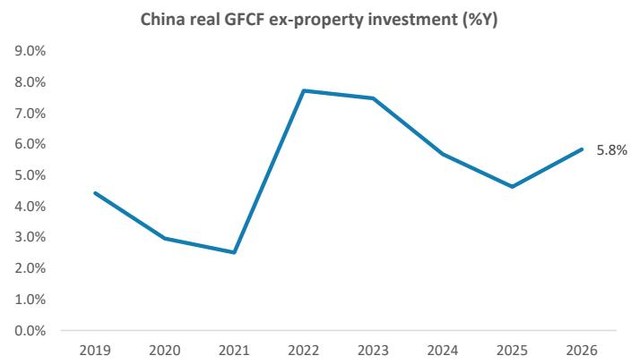

line

China real GFCF ex-property investment (%Y)
| Year | Real GFCF ex-property investment (%) |
| :--- | :--- |
| 2019 | 4.5 |
| 2020 | 3.0 |
| 2021 | 2.5 |
| 2022 | 7.8 |
| 2023 | 7.5 |
| 2024 | 5.7 |
| 2025 | 4.7 |
| 2026 | 5.8 |

Source: Haver, CEIC, MS estimates

Exhibit 24: India – domestic demand indicators are remaining robust   
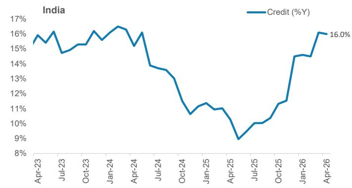

line

| Month   | Credit (%Y) |
|---------|-------------|
| Apr-23  | 15.5%       |
| Jul-23  | 14.8%       |
| Oct-23  | 15.2%       |
| Jan-24  | 16.5%       |
| Apr-24  | 15.0%       |
| Jul-24  | 13.8%       |
| Oct-24  | 11.0%       |
| Jan-25  | 11.5%       |
| Apr-25  | 9.0%        |
| Jul-25  | 10.0%       |
| Oct-25  | 11.5%       |
| Jan-26  | 14.5%       |
| Apr-26  | 16.0%       |

Source: CEIC, MS

Exhibit 25: Japan – r-g gap retained, keeping overall policy environment accommodative   
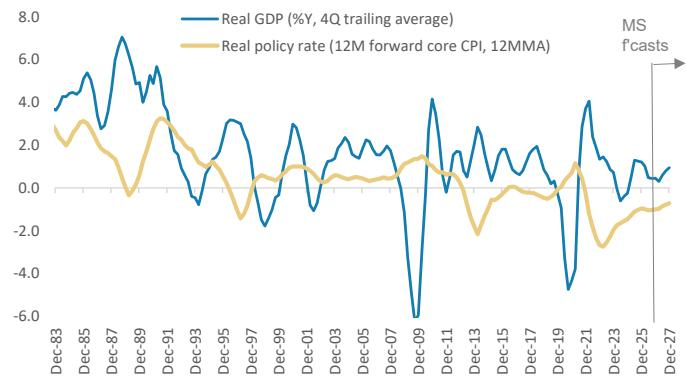

line

| Date    | Real GDP (%Y, 4Q trailing average) | Real policy rate (12M forward core CPI, 12MMA) |
|---------|-------------------------------------|-----------------------------------------------|
| Dec-83  | ~4.0                                | ~2.5                                          |
| Dec-85  | ~5.5                                | ~3.0                                          |
| Dec-87  | ~7.0                                | ~1.0                                          |
| Dec-89  | ~6.0                                | ~3.5                                          |
| Dec-91  | ~4.0                                | ~2.0                                          |
| Dec-93  | ~0.0                                | ~1.0                                          |
| Dec-95  | ~3.0                                | ~0.5                                          |
| Dec-97  | ~-2.0                               | ~0.0                                          |
| Dec-99  | ~3.0                                | ~1.0                                          |
| Dec-01  | ~-1.0                               | ~0.5                                          |
| Dec-03  | ~2.0                                | ~0.5                                          |
| Dec-05  | ~2.5                                | ~0.5                                          |
| Dec-07  | ~1.0                                | ~1.0                                          |
| Dec-09  | ~-6.0                               | ~1.5                                          |
| Dec-11  | ~4.0                                | ~1.0                                          |
| Dec-13  | ~2.0                                | ~-2.0                                         |
| Dec-15  | ~3.0                                | ~-1.0                                         |
| Dec-17  | ~2.0                                | ~0.0                                          |
| Dec-19  | ~-5.0                               | ~1.0                                          |
| Dec-21  | ~4.0                                | ~-3.0                                         |
| Dec-23  | ~1.0                                | ~-1.0                                         |
| Dec-25  | ~1.5                                | ~-1.5                                         |
| Dec-27  | ~1.0                                | ~-1.0                                         |

Source: Haver, MS forecasts

Exhibit 26: Indonesia – waiting for the capex turnaround
Indonesia fixed investment to GDP (%, 4Q trailing sum)   
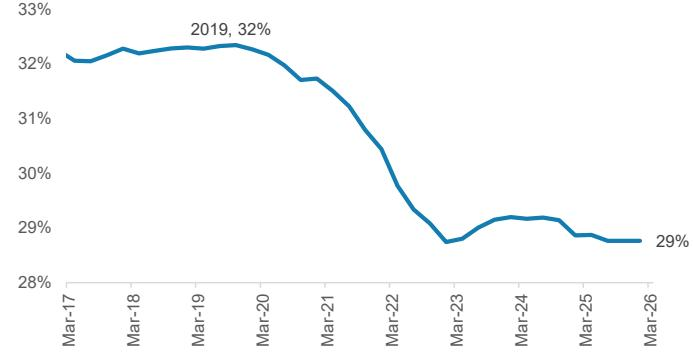

line

| Date   | Value |
|--------|-------|
| Mar-17 | 32%   |
| Mar-26 | 29%   |

Source: Haver, MS

Exhibit 27: Korea & Taiwan – strong rise in semiconductor prices completely offsetting the terms of trade impact from higher energy prices so far   
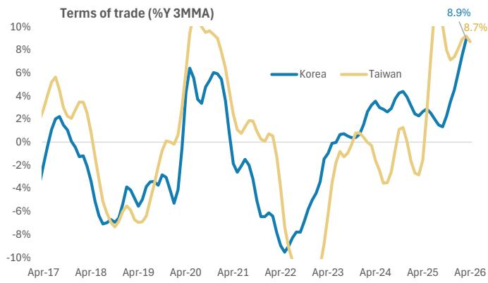

line

| Date   | Korea | Taiwan |
|--------|-------|--------|
| Apr-26 | 8.9%  | 8.7%   |

Source: Haver, MS

Exhibit 28: Korea – non-tech exports also inflecting higher   
Korea non-tech exports (SA, Dec-24=100, 3mma)   
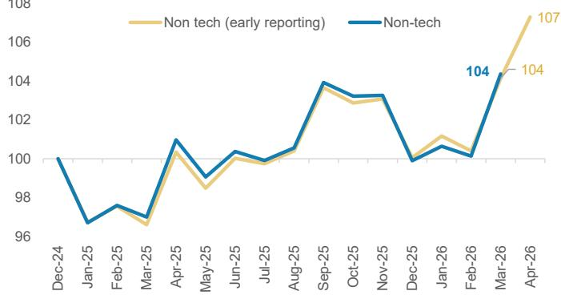

line

| Month    | Non tech (early reporting) | Non-tech |
| -------- | --------------------------- | -------- |
| Apr-26   | 107                         | 104      |

Source: Haver, MS

# Inflation – Headline to rise, driven by energy, but still remain largely within central banks' comfort zone

Policymakers continue to limit fuel price pass-through for now: Policymakers in the region have largely continued to limit the pass-through of international oil price increases into domestic fuel prices. On a nominal dollar GDP-weighted basis, Asia's oil prices in local currency terms have risen 59% over the past two months, but domestic fuel prices have risen only 15% – implying that policymakers have absorbed 75% of the impact. Reflecting this, headline CPI was relatively muted at 1.9% in March (vs. 2% in February), and we expect it to average a still benign 2.1% in 2Q. On a PPP-adjusted basis, over 90% of the region still had inflation within the central banks' comfort zone in March.

Exhibit 29: Ranking Asian economies' sensitivity to the rise in oil prices   
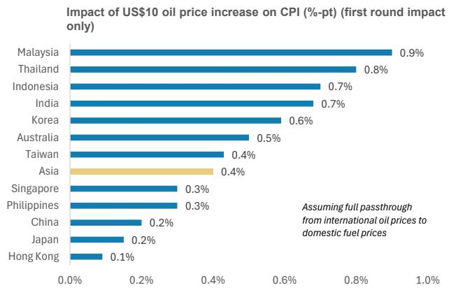

bar

| Country/Region | Impact of US$10 oil price increase on CPI (%-pt) (first round impact only) |
| :--- | :--- |
| Malaysia | 0.9 |
| Thailand | 0.8 |
| Indonesia | 0.7 |
| India | 0.7 |
| Korea | 0.6 |
| Australia | 0.5 |
| Taiwan | 0.4 |
| Asia | 0.4 |
| Singapore | 0.3 |
| Philippines | 0.3 |
| China | 0.2 |
| Japan | 0.2 |
| Hong Kong | 0.1 |
Assuming full passthrough from international oil prices to domestic fuel prices

Source: Haver, MS estimates

Exhibit 30: Policymakers have limited the pass-through from international oil price rise to domestic fuel prices to roughly a quarter so far   
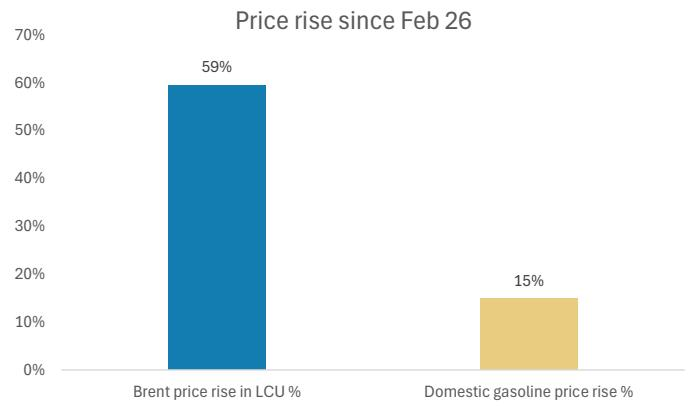

bar

Price rise since Feb 26
| Category | Price Rise (%) |
| :--- | :--- |
| Brent price rise in LCU % | 59 |
| Domestic gasoline price rise % | 15 |

Source: CEIC, GlobalPetrolPrices.com, MS

Exhibit 31: Brent price has increased 59% in local currency terms. but domestic fuel prices have increased only 15% since before the oil price shock   
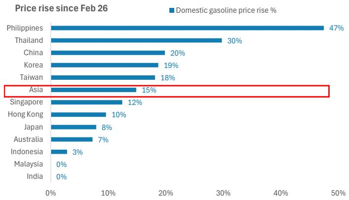

bar

Price rise since Feb 26
| Region | Domestic gasoline price rise (%) |
| :--- | :--- |
| Philippines | 47 |
| Thailand | 30 |
| China | 20 |
| Korea | 19 |
| Taiwan | 18 |
| Asia | 15 |
| Singapore | 12 |
| Hong Kong | 10 |
| Japan | 8 |
| Australia | 7 |
| Indonesia | 3 |
| Malaysia | 0 |
| India | 0 |

Source: CEIC, GlobalPetrolPrices.com, MS

Exhibit 32: Headline and core inflation have been relatively benign   
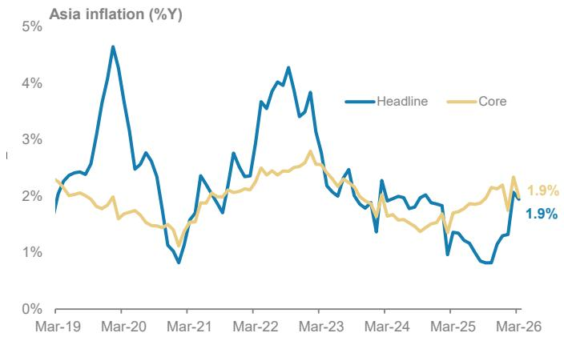

line

| Date   | Headline | Core  |
|--------|----------|-------|
| Mar-26 | 1.9%     | 1.9%  |

Source: Haver, MS

Exhibit 33: Core services inflation has moved lower   
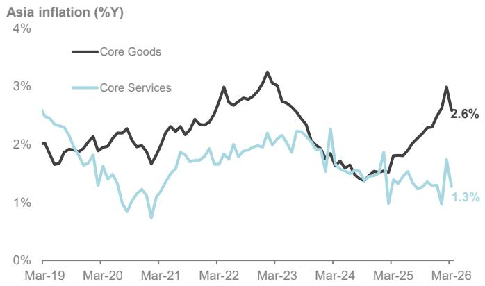

line

| Date   | Core Goods | Core Services |
|--------|------------|---------------|
| Mar-26 | 2.6%       | 1.3%          |

Source: Haver, MS

Exhibit 34: While policymakers have limited fuel price pass-through, we expect some energy-driven rise in headline inflation   
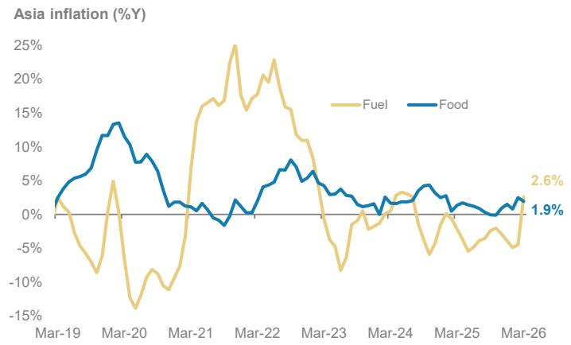

line

| Date   | Fuel  | Food  |
|--------|-------|-------|
| Mar-26 | 2.6%  | 1.9%  |

Source: Haver, MS

Some energy-driven rise in headline inflation ahead: To be sure, significant uncertainty remains over the trajectory of energy prices, and the ability of policymakers to continue to mitigate the fuel price pass-through also varies across the region. In our base case, we have assumed a 2Q peak in oil prices before a step-down to US\$80-90/bbl in 2H26, with policymakers allowing a gradual increase in pass-through over the next few months. We expect Asia's headline inflation to rise from 1.8%Y in March 2026 to 2.5%Y in 4Q26, but we highlight that 81% of the region in PPP terms will still have inflation that is within the respective central banks' comfort zone. Meanwhile, we also expect limited second-round pass-through to core inflation. We expect Asia's core CPI to remain relatively stable at 2.1%Y through 2Q-4Q26.

Exhibit 35: Asia – headline CPI forecasts 

<table><tr><td>Headline CPI (%Y)</td><td>2025</td><td>2026E</td><td>2027E</td></tr><tr><td>China</td><td>0.1</td><td>0.8</td><td>0.6</td></tr><tr><td>Hong Kong</td><td>1.4</td><td>2.0</td><td>1.8</td></tr><tr><td>India</td><td>2.2</td><td>4.1</td><td>4.7</td></tr><tr><td>Indonesia</td><td>1.9</td><td>3.0</td><td>2.5</td></tr><tr><td>Korea</td><td>2.0</td><td>2.5</td><td>2.2</td></tr><tr><td>Malaysia</td><td>1.4</td><td>1.8</td><td>2.1</td></tr><tr><td>Philippines</td><td>1.7</td><td>6.3</td><td>3.9</td></tr><tr><td>Singapore</td><td>0.9</td><td>2.3</td><td>1.9</td></tr><tr><td>Taiwan</td><td>1.9</td><td>1.8</td><td>2.1</td></tr><tr><td>Thailand</td><td>0.0</td><td>2.2</td><td>1.7</td></tr><tr><td>Australia</td><td>2.9</td><td>4.5</td><td>2.7</td></tr><tr><td>Japan</td><td>3.2</td><td>2.2</td><td>1.4</td></tr><tr><td>Asia</td><td>1.1</td><td>2.1</td><td>1.9</td></tr><tr><td>Asia ex China</td><td>2.1</td><td>3.3</td><td>3.2</td></tr><tr><td>Asia ex India</td><td>0.9</td><td>1.5</td><td>1.2</td></tr><tr><td>Asia ex China ex India</td><td>2.1</td><td>2.8</td><td>2.1</td></tr><tr><td>AXJ</td><td>0.9</td><td>2.0</td><td>2.0</td></tr><tr><td>AXJ ex China</td><td>1.9</td><td>3.5</td><td>3.6</td></tr><tr><td>AXJ ex China ex India</td><td>1.6</td><td>2.8</td><td>2.3</td></tr></table>

Source: Haver, MS forecasts

Exhibit 36: Over 90% of Asian economies have inflation within the respective central banks' comfort zones   
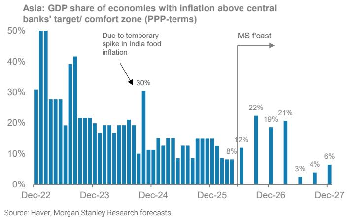

bar

| Date    | GDP Share of Economies with Inflation |
|---------|----------------------------------------|
| Dec-22  | 50%                                    |
| Dec-23  | 30%                                    |
| Dec-24  | 12%                                    |
| Dec-25  | 8%                                     |
| Dec-26  | 19%                                    |
| Dec-27  | 6%                                     |

China – from deflation to lowflation: Higher input prices have led to one round of reflation in China across PPI and CPI. Our economics team for China expects PPI and CPI to average 1.5% and 0.8% in 2026, respectively, ending three years of deflation. China’s lesser exposure to the energy shock also limits the inflation upside from the energy shock. More importantly, we believe a return to a moderate sustainable reflationary environment of around 2% inflation would require more proactive fiscal policy to fill the domestic demand shortfall. As such, still-soft domestic demand and weak labor market conditions are likely to cap the spillover to core inflation – and we expect core CPI to average 1%Y in 2026 (vs. 0.8% in 2025). Our economics team for China also notes that the relationship between headline inflation and the GDP deflator may weaken during periods of large shocks, and as such only expects the deflator to average 0.5%Y in 2026 (see China's 3D Journey: False Dawn: Decoding China's Inflation Dynamics, March 24, 2026).

Japan – US-style core CPI rising only gradually: While policymakers have continued with fuel sUBSidies for now, Takeshi Yamaguchi sees a possibility that the fuel sUBSidies could be reduced in the summer months. He and his team expects headline CPI to breach 2% by July 2026, peaking at 4%Y – driven by higher energy and food prices. That said, while not incorporated in our forecasts at the moment, policymakers are discussing plans to reinstate sUBSidies for electricity and gas for July-September. If taken up, that would imply some downside to our inflation forecasts. With higher headline inflation likely to weigh on real wages and private consumption once again, US-style core CPI is expected to rise only gradually to 1.7%Y in 4Q26 (vs. 1.4%Y currently).

Exhibit 37: China – moving from deflation to lowflation   
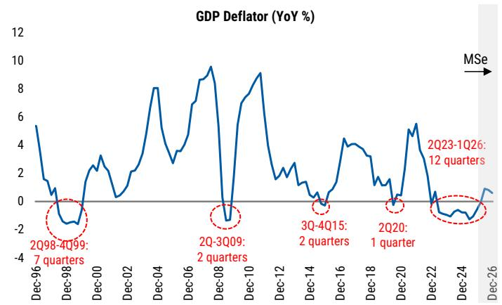

line

| Quarter       | Year | GDP Deflator (YoY %) |
| ------------- | ---- | --------------------- |
| 2Q98-2Q99     | 7    | -2                    |
| 2Q3Q09        | 2    | -1                    |
| 3Q-4Q15       | 2    | 0                     |
| 2Q20          | 1    | 0                     |
| 2Q23-1Q26     | 12   | -1                    |

Source: CEIC, MS forecasts

Exhibit 38: Japan – US-style core CPI rising only gradually   
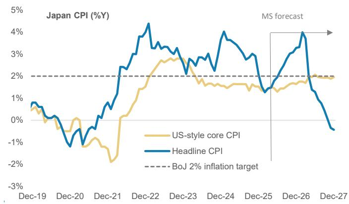

line

| Date    | US-style core CPI | Headline CPI |
|---------|-------------------|--------------|
| Dec-19  | ~0.5%             | ~0.8%        |
| Dec-20  | ~-0.5%            | ~-1.0%       |
| Dec-21  | ~-1.5%            | ~-0.5%       |
| Dec-22  | ~2.5%             | ~4.5%        |
| Dec-23  | ~2.0%             | ~3.0%        |
| Dec-24  | ~1.5%             | ~4.0%        |
| Dec-25  | ~1.0%             | ~1.5%        |
| Dec-26  | ~1.5%             | ~4.0%        |
| Dec-27  | ~2.0%             | ~-0.5%       |

Source: CEIC, MS forecasts

India – staying within the upper bound: In India, we expect headline inflation to rise to 5.4%Y by 1Q27 (vs. 3.5% currently), staying within the upper bound of the inflation target range. A low base of comparison, FX weakness, upside risks to food inflation, and second-round pass-through to core inflation are likely key drivers.

In the rest of Asia, we see more evident pickup in headline inflation in 2Q26: This is especially true for economies that have allowed more fuel pass-through, such as Australia and the Philippines.

Exhibit 39: Headline inflation forecasts 

<table><tr><td rowspan="2">Headline CPI (%Y)</td><td colspan="4">2025</td><td colspan="4">2026</td><td colspan="4">2027</td><td rowspan="2">2025</td><td rowspan="2">2026E</td><td rowspan="2">2027E</td></tr><tr><td>1Q</td><td>2Q</td><td>3Q</td><td>4Q</td><td>1Q</td><td>2QE</td><td>3QE</td><td>4QE</td><td>1QE</td><td>2QE</td><td>3QE</td><td>4QE</td></tr><tr><td>China</td><td>-0.1</td><td>0.0</td><td>-0.2</td><td>0.6</td><td>0.8</td><td>0.8</td><td>0.9</td><td>0.8</td><td>0.7</td><td>0.6</td><td>0.6</td><td>0.7</td><td>0.1</td><td>0.8</td><td>0.6</td></tr><tr><td>Hong Kong</td><td>1.6</td><td>1.8</td><td>1.1</td><td>1.3</td><td>1.6</td><td>2.1</td><td>2.2</td><td>2.1</td><td>1.7</td><td>1.8</td><td>1.9</td><td>1.8</td><td>1.4</td><td>2.0</td><td>1.8</td></tr><tr><td>India</td><td>3.7</td><td>2.7</td><td>1.7</td><td>0.8</td><td>3.1</td><td>3.9</td><td>4.3</td><td>5.2</td><td>5.4</td><td>5.1</td><td>4.3</td><td>3.9</td><td>2.2</td><td>4.1</td><td>4.7</td></tr><tr><td>Indonesia</td><td>0.6</td><td>1.8</td><td>2.4</td><td>2.8</td><td>3.9</td><td>2.7</td><td>2.7</td><td>2.8</td><td>2.6</td><td>2.4</td><td>2.4</td><td>2.4</td><td>1.9</td><td>3.0</td><td>2.5</td></tr><tr><td>Korea</td><td>2.1</td><td>2.1</td><td>1.9</td><td>1.9</td><td>2.1</td><td>2.9</td><td>2.6</td><td>2.5</td><td>2.4</td><td>1.9</td><td>2.1</td><td>2.3</td><td>2.0</td><td>2.5</td><td>2.2</td></tr><tr><td>Malaysia</td><td>1.5</td><td>1.3</td><td>1.3</td><td>1.4</td><td>1.6</td><td>1.7</td><td>2.1</td><td>2.3</td><td>2.3</td><td>2.2</td><td>2.1</td><td>2.0</td><td>1.4</td><td>1.8</td><td>2.1</td></tr><tr><td>Philippines</td><td>2.2</td><td>1.4</td><td>1.4</td><td>1.7</td><td>2.8</td><td>7.7</td><td>7.4</td><td>7.3</td><td>6.7</td><td>2.1</td><td>3.1</td><td>3.9</td><td>1.7</td><td>6.3</td><td>3.9</td></tr><tr><td>Singapore</td><td>1.0</td><td>0.8</td><td>0.6</td><td>1.2</td><td>1.5</td><td>2.7</td><td>2.5</td><td>2.3</td><td>2.1</td><td>1.9</td><td>1.9</td><td>1.9</td><td>0.9</td><td>2.3</td><td>1.9</td></tr><tr><td>Taiwan</td><td>2.2</td><td>1.9</td><td>1.7</td><td>1.6</td><td>1.2</td><td>2.3</td><td>2.1</td><td>1.8</td><td>2.1</td><td>2.2</td><td>1.9</td><td>2.1</td><td>1.9</td><td>1.8</td><td>2.1</td></tr><tr><td>Thailand</td><td>1.1</td><td>-0.3</td><td>-0.7</td><td>-0.5</td><td>-0.5</td><td>2.9</td><td>3.2</td><td>3.2</td><td>3.1</td><td>1.4</td><td>1.2</td><td>1.2</td><td>0.0</td><td>2.2</td><td>1.7</td></tr><tr><td>Australia</td><td>2.4</td><td>2.1</td><td>3.2</td><td>3.7</td><td>4.1</td><td>5.0</td><td>4.6</td><td>4.2</td><td>3.4</td><td>2.5</td><td>2.3</td><td>2.6</td><td>2.9</td><td>4.5</td><td>2.7</td></tr><tr><td>Japan</td><td>3.8</td><td>3.4</td><td>2.9</td><td>2.7</td><td>1.4</td><td>1.7</td><td>2.5</td><td>3.1</td><td>3.7</td><td>1.6</td><td>0.7</td><td>-0.2</td><td>3.2</td><td>2.2</td><td>1.4</td></tr><tr><td>Asia</td><td>1.4</td><td>1.2</td><td>0.9</td><td>1.1</td><td>1.7</td><td>2.1</td><td>2.3</td><td>2.4</td><td>2.4</td><td>2.0</td><td>1.8</td><td>1.7</td><td>1.1</td><td>2.1</td><td>1.9</td></tr><tr><td>Asia ex China</td><td>2.8</td><td>2.3</td><td>1.9</td><td>1.6</td><td>2.6</td><td>3.3</td><td>3.5</td><td>4.0</td><td>4.1</td><td>3.3</td><td>2.9</td><td>2.6</td><td>2.1</td><td>3.3</td><td>3.2</td></tr><tr><td>Asia ex India</td><td>0.8</td><td>0.8</td><td>0.7</td><td>1.2</td><td>1.3</td><td>1.6</td><td>1.7</td><td>1.7</td><td>1.6</td><td>1.1</td><td>1.0</td><td>1.1</td><td>0.9</td><td>1.5</td><td>1.2</td></tr><tr><td>Asia ex China ex India</td><td>2.1</td><td>2.0</td><td>2.0</td><td>2.2</td><td>2.2</td><td>2.9</td><td>3.0</td><td>3.1</td><td>3.1</td><td>2.0</td><td>1.8</td><td>1.7</td><td>2.1</td><td>2.8</td><td>2.1</td></tr><tr><td>AXJ</td><td>1.1</td><td>1.0</td><td>0.6</td><td>0.9</td><td>1.7</td><td>2.0</td><td>2.2</td><td>2.3</td><td>2.3</td><td>2.0</td><td>1.8</td><td>1.8</td><td>0.9</td><td>2.0</td><td>2.0</td></tr><tr><td>AXJ ex China</td><td>2.6</td><td>2.1</td><td>1.6</td><td>1.3</td><td>2.7</td><td>3.5</td><td>3.7</td><td>4.1</td><td>4.2</td><td>3.7</td><td>3.3</td><td>3.1</td><td>1.9</td><td>3.5</td><td>3.6</td></tr><tr><td>AXJ ex China ex India</td><td>1.4</td><td>1.5</td><td>1.5</td><td>1.7</td><td>2.2</td><td>3.1</td><td>3.0</td><td>3.0</td><td>2.9</td><td>2.1</td><td>2.1</td><td>2.3</td><td>1.6</td><td>2.8</td><td>2.3</td></tr></table>

Source: Haver, MS (E) forecasts

Exhibit 40: Core inflation forecasts 

<table><tr><td rowspan="2">Core Inflation (YoY)</td><td colspan="4">2025</td><td colspan="4">2026</td><td colspan="4">2027</td><td rowspan="2">2025</td><td rowspan="2">2026E</td><td rowspan="2">2027E</td></tr><tr><td>1Q</td><td>2Q</td><td>3Q</td><td>4Q</td><td>1Q</td><td>2QE</td><td>3QE</td><td>4QE</td><td>1QE</td><td>2QE</td><td>3QE</td><td>4QE</td></tr><tr><td>China</td><td>0.3</td><td>0.6</td><td>0.9</td><td>1.2</td><td>1.2</td><td>1.1</td><td>0.9</td><td>0.8</td><td>0.7</td><td>0.8</td><td>0.9</td><td>0.9</td><td>0.8</td><td>1.0</td><td>0.8</td></tr><tr><td>Hong Kong</td><td>1.5</td><td>1.8</td><td>1.2</td><td>1.4</td><td>1.5</td><td>2.2</td><td>2.2</td><td>2.1</td><td>1.9</td><td>2.0</td><td>2.0</td><td>1.9</td><td>1.5</td><td>2.0</td><td>1.9</td></tr><tr><td>India (core-core)</td><td>3.3</td><td>3.5</td><td>3.1</td><td>2.5</td><td>2.1</td><td>2.6</td><td>3.3</td><td>4.2</td><td>4.6</td><td>4.4</td><td>4.1</td><td>4.3</td><td>3.1</td><td>3.0</td><td>4.3</td></tr><tr><td>India (core)</td><td>4.0</td><td>4.4</td><td>4.3</td><td>4.6</td><td>3.7</td><td>4.1</td><td>4.5</td><td>4.9</td><td>4.5</td><td>4.3</td><td>4.0</td><td>4.1</td><td>4.3</td><td>4.3</td><td>4.2</td></tr><tr><td>Indonesia</td><td>2.4</td><td>2.4</td><td>2.2</td><td>2.4</td><td>2.5</td><td>2.4</td><td>2.5</td><td>2.5</td><td>2.3</td><td>2.0</td><td>1.9</td><td>1.9</td><td>2.4</td><td>2.5</td><td>2.0</td></tr><tr><td>Korea</td><td>1.9</td><td>2.0</td><td>1.7</td><td>2.0</td><td>2.2</td><td>2.2</td><td>2.3</td><td>2.5</td><td>2.5</td><td>2.0</td><td>1.9</td><td>1.8</td><td>1.9</td><td>2.3</td><td>2.1</td></tr><tr><td>Malaysia</td><td>1.9</td><td>1.8</td><td>2.0</td><td>2.2</td><td>2.1</td><td>2.0</td><td>2.1</td><td>2.2</td><td>2.1</td><td>2.2</td><td>1.8</td><td>1.8</td><td>2.0</td><td>2.0</td><td>2.0</td></tr><tr><td>Philippines</td><td>2.0</td><td>1.5</td><td>2.0</td><td>1.0</td><td>3.2</td><td>7.2</td><td>7.2</td><td>7.1</td><td>6.4</td><td>2.4</td><td>2.7</td><td>3.5</td><td>1.6</td><td>6.2</td><td>3.7</td></tr><tr><td>Singapore</td><td>0.6</td><td>0.6</td><td>0.4</td><td>1.2</td><td>1.4</td><td>2.2</td><td>2.2</td><td>2.0</td><td>1.8</td><td>1.6</td><td>1.6</td><td>1.6</td><td>0.7</td><td>1.9</td><td>1.6</td></tr><tr><td>Taiwan</td><td>1.5</td><td>1.3</td><td>1.2</td><td>1.4</td><td>1.7</td><td>2.1</td><td>1.9</td><td>1.8</td><td>2.0</td><td>2.2</td><td>2.1</td><td>1.8</td><td>1.3</td><td>1.9</td><td>2.0</td></tr><tr><td>Thailand</td><td>0.9</td><td>1.0</td><td>0.8</td><td>0.6</td><td>0.6</td><td>1.0</td><td>1.1</td><td>1.1</td><td>1.1</td><td>1.0</td><td>1.1</td><td>1.2</td><td>0.9</td><td>1.0</td><td>1.1</td></tr><tr><td>Australia</td><td>3.0</td><td>2.7</td><td>3.0</td><td>3.4</td><td>3.5</td><td>3.7</td><td>3.5</td><td>3.2</td><td>3.0</td><td>2.7</td><td>2.6</td><td>2.5</td><td>3.0</td><td>3.5</td><td>2.7</td></tr><tr><td>Japan (US-style core)</td><td>1.5</td><td>1.6</td><td>1.5</td><td>1.6</td><td>1.4</td><td>1.4</td><td>1.5</td><td>1.7</td><td>1.7</td><td>2.0</td><td>1.9</td><td>1.9</td><td>1.6</td><td>1.5</td><td>1.9</td></tr><tr><td>Japan (core-core)</td><td>2.7</td><td>3.2</td><td>3.2</td><td>3.0</td><td>2.5</td><td>2.1</td><td>2.1</td><td>2.5</td><td>2.6</td><td>2.8</td><td>2.5</td><td>2.1</td><td>3.0</td><td>2.3</td><td>2.5</td></tr><tr><td>Asia</td><td>1.4</td><td>1.6</td><td>1.6</td><td>1.7</td><td>1.6</td><td>1.8</td><td>1.8</td><td>2.0</td><td>2.0</td><td>1.9</td><td>1.9</td><td>1.9</td><td>1.6</td><td>1.8</td><td>1.9</td></tr><tr><td>Asia ex China</td><td>2.4</td><td>2.5</td><td>2.3</td><td>2.1</td><td>2.0</td><td>2.5</td><td>2.7</td><td>3.2</td><td>3.3</td><td>3.0</td><td>2.9</td><td>2.9</td><td>2.3</td><td>2.6</td><td>3.0</td></tr><tr><td>Asia ex India</td><td>0.9</td><td>1.1</td><td>1.2</td><td>1.4</td><td>1.5</td><td>1.6</td><td>1.5</td><td>1.4</td><td>1.3</td><td>1.3</td><td>1.3</td><td>1.3</td><td>1.2</td><td>1.5</td><td>1.3</td></tr><tr><td>Asia ex China ex India</td><td>1.8</td><td>1.8</td><td>1.7</td><td>1.8</td><td>2.0</td><td>2.3</td><td>2.4</td><td>2.4</td><td>2.3</td><td>2.0</td><td>2.0</td><td>2.0</td><td>1.8</td><td>2.3</td><td>2.1</td></tr><tr><td>AXJ</td><td>1.3</td><td>1.5</td><td>1.6</td><td>1.6</td><td>1.6</td><td>1.8</td><td>1.8</td><td>2.0</td><td>2.0</td><td>1.9</td><td>1.9</td><td>1.9</td><td>1.6</td><td>1.8</td><td>1.9</td></tr><tr><td>AXJ ex China</td><td>2.6</td><td>2.7</td><td>2.4</td><td>2.1</td><td>2.1</td><td>2.6</td><td>2.9</td><td>3.4</td><td>3.6</td><td>3.2</td><td>3.1</td><td>3.2</td><td>2.5</td><td>2.8</td><td>3.3</td></tr><tr><td>AXJ ex China ex India</td><td>1.8</td><td>1.8</td><td>1.7</td><td>1.7</td><td>2.1</td><td>2.5</td><td>2.6</td><td>2.6</td><td>2.5</td><td>1.9</td><td>1.9</td><td>1.9</td><td>1.8</td><td>2.5</td><td>2.1</td></tr></table>

Source: Haver, MS (E) forecasts; Note: For India, new CPI data with revised base starts from Jan-26. India's core-core inflation excludes gold, silver, petrol and diesel from official core inflation. For Japan, US-style core inflation are all items less food (less alcoholic beverages) and energy. All regional aggregates are taking core-core inflation for India and US-style core inflation for Japan.

# Policy – A gradual and modest rate hike cycle

We still expect less rate hikes than priced in by markets: Reflecting our inflation forecasts, we are also expecting central banks in Asia to be hiking less than what markets are pricing in.

Highlighting four central banks with tightening bias – Japan, Australia, Korea, and the Philippines: We see two main factors determining Asian central banks' reaction function;

1. Starting point and persistence of inflation relative to central banks' comfort zone   
2. Sensitivity to energy shock.

On this basis, we highlight Japan, Australia, Korea, and the Philippines where we have seen more persistent inflation in the run-up to geopolitical tensions. In the past 12 months, headline inflation has been above the central bank's inflation target or midpoint of target range for between two to nine months for these four economies. For the Philippines, Australia and Korea, the latest inflation print is also above central banks' comfort zone across both headline and core inflation, reflecting the higher starting point of inflation and the larger pass-through to domestic fuel prices. Taken together, we see BOJ, BOK, and BSP as most likely to retain/signal a tightening bias. RBA, after having tightened 75bps, is moving into a more data-dependent mode.

Exhibit 41: Over the past 12 months, Japan, Korea, Australia, and the Philippines have recorded the highest number of months with headline inflation above their central bank targets   
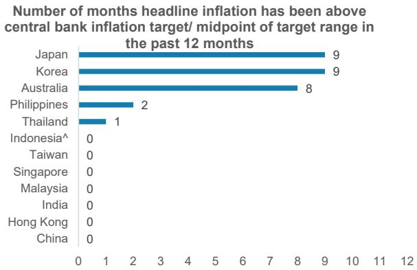

bar

Number of months headline inflation has been above central bank inflation target/ midpoint of target range in the past 12 months
| Country | Number of Months Headline Inflation |
| :--- | :--- |
| Japan | 9 |
| Korea | 9 |
| Australia | 8 |
| Philippines | 2 |
| Thailand | 1 |
| Indonesia^ | 0 |
| Taiwan | 0 |
| Singapore | 0 |
| Malaysia | 0 |
| India | 0 |
| Hong Kong | 0 |
| China | 0 |

Source: Haver, CEIC, MS; Note: ^We take the 3.5% upper bound of inflation target range for Indonesia given central bank guidance.

Exhibit 42: Australia, Korea, and the Philippines have the highest number of months with core inflation above central bank targets   
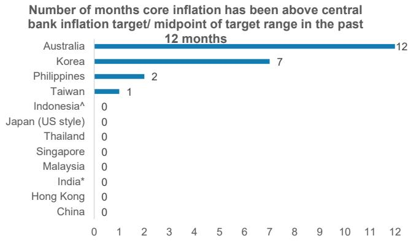

bar

Number of months core inflation has been above central bank inflation target/ midpoint of target range in the past 12 months
| Country/Region | Months Core Inflation (in %) |
| :--- | :--- |
| Australia | 12 |
| Korea | 7 |
| Philippines | 2 |
| Taiwan | 1 |
| Indonesia^ | 0 |
| Japan (US style) | 0 |
| Thailand | 0 |
| Singapore | 0 |
| Malaysia | 0 |
| India* | 0 |
| Hong Kong | 0 |
| China | 0 |

Source: Haver, CEIC, MS; Note: \*India is core inflation ex gold and silver. ^We take the 3.5% upper bound of inflation target range for Indonesia given central bank guidance.

Exhibit 43: Inflation in Korea, Australia, and the Philippines is currently above central banks' comfort zones 

<table><tr><td></td><td>Headline inflation</td><td>Core inflation</td><td>Headline inflation above central bank inflation target/ midpoint of target range</td><td>Core inflation above central bank inflation target/ midpoint of target range</td></tr><tr><td>China</td><td>1.2%</td><td>1.2%</td><td>No</td><td>No</td></tr><tr><td>India</td><td>3.4%</td><td>2.1%</td><td>No</td><td>No</td></tr><tr><td>Indonesia</td><td>2.4%</td><td>2.4%</td><td>No</td><td>No</td></tr><tr><td>Korea</td><td>2.6%</td><td>2.2%</td><td>Yes</td><td>Yes</td></tr><tr><td>Malaysia</td><td>1.7%</td><td>2.1%</td><td>No</td><td>No</td></tr><tr><td>Philippines</td><td>7.2%</td><td>6.9%</td><td>Yes</td><td>Yes</td></tr><tr><td>Singapore</td><td>1.8%</td><td>1.7%</td><td>No</td><td>No</td></tr><tr><td>Taiwan</td><td>1.7%</td><td>1.7%</td><td>No</td><td>No</td></tr><tr><td>Thailand</td><td>2.9%</td><td>0.8%</td><td>Yes</td><td>No</td></tr><tr><td>Australia</td><td>4.0%</td><td>3.5%</td><td>Yes</td><td>Yes</td></tr><tr><td>Japan (US-style core)</td><td>1.5%</td><td>1.4%</td><td>No</td><td>No</td></tr></table>

Source: CEIC, Haver, MS

Exhibit 44: We see BOJ, BOK, and BSP as most likely to retain/signal a tightening bias   
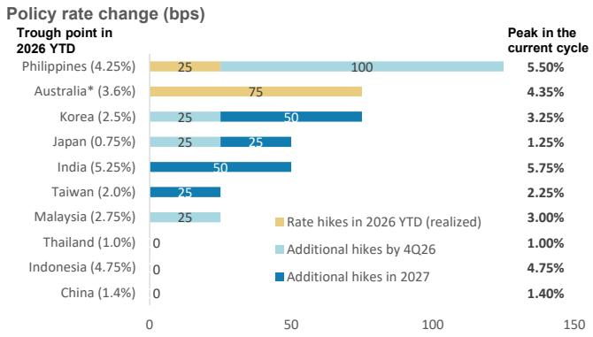

bar

| Country/Region | Rate hikes in 2026 YTD (bps) | Additional hikes by 4Q26 (%) | Additional hikes in 2027 (%) |
| -------------- | ---------------------------- | ----------------------------- | ---------------------------- |
| Philippines   | 25                           | 100                           | 5.50                         |
| Australia*     | 75                           | -                             | 4.35                         |
| Korea          | -                            | 25                            | 3.25                         |
| Japan          | -                            | 25                            | 1.25                         |
| India          | -                            | -                             | 5.75                         |
| Taiwan         | -                            | -                             | 2.25                         |
| Malaysia       | -                            | 25                            | 3.00                         |
| Thailand       | 0                            | -                             | 1.00                         |
| Indonesia      | 0                            | -                             | 4.75                         |
| China          | 0                            | -                             | 1.40                         |

Source: CEIC, Haver, MS forecasts, Note: \*We expect 50bps rate cuts in 2027 from RBA.

- BOJ – maintaining the June hike in our base case: Against the backdrop of BOJ's hawkish messaging at the April meeting, Takeshi Yamaguchi continues to expect a June rate hike. Key risk to the June timing is if geopolitical tensions persist and recession risks for the global economy and Japan rise materially.   
- BOK – first hike from 4Q26: Kathleen Oh expects three 25bps hikes from BOK – one each quarter beginning from 4Q26 – once the recovery broadens and underlying inflation momentum picks up more evidently.   
- RBA – data-dependent hold: After hiking 75bps this year, RBA has now moved into a more data-dependent stance. Our Economist ofr Australia, Chris Read, expects the weaker demand environment amid more restrictive fiscal and monetary policy alongside headwinds from Australia’s shortages in refined petroleum products to keep RBA on hold for the rest of the year, before cutting in 2Q27. The key risk is if net stimulus impact from the government budget is larger than expected.   
- BSP – additional 100bps in rate hikes: Given the strong pickup in headline inflation to 7.2%Y in April amid significant increase in domestic fuel prices, we see 50bps in hikes in 2Q26 - either in form of a 50bps rate hike at the June meeting or in 2 25bps rate hike - one at an off cycle meeting and the other at the June meeting. Thereafter, we expect 2two more rate hikes to take the policy rate to 5.5%. The risks are skewed towards more rate hikes than we expect.

For other economies, we see lower risks of near-term rate hikes given the more benign starting point of inflation and government intervention in domestic fuel prices. We see rate hikes beginning in 1Q27 for CBC (25bps in total), and 2Q27 for RBI (50bps in total) and as the growth recovery broadens and underlying inflation momentum picks up. We also expect a one-off rate hike from BNM in 3Q26, though this should be viewed in the context of policy normalization rather than an extended rate hike cycle. We expect BI, BOT, and PBOC to remain on hold through the rest of the year.

- RBI: With headline inflation expected to rise but stay within the 6% upper threshold of the inflation target range, Upasana Chachra expects RBI to remain on hold through 2026. In 2027, as core CPI ex-gold and silver rises more durably above the 4% target range midpoint, we expect RBI to hike 25bps each in 1Q27 and 2Q27.   
- BI: With the government committed to keeping domestic fuel prices stable for 2026, the gradual rise in inflation means that we see BI maintaining the policy rate at $4.75\%$ for 2026. The backdrop of currency depreciation also means that the central bank will have to continue to prioritise currency stability, which in turn limits the room for further rate cuts.   
- PBOC: Robin Xing believes that additional monetary easing is unlikely, given that the economy is on track to reach the 4.5-5% growth target, with PBOC likely to use liquidity operations and targeted credit tools to manage financial conditions instead. While the large trade surplus suggests scope for RMB strength, we expect PBOC to manage the pace and magnitude of currency appreciation in view of a still highly uncertain external environment. Robin and team forecast year-end 2026 USDCNY at 6.75.

Exhibit 45: We expect a more gradual pace of rate hikes than the market has currently priced in   
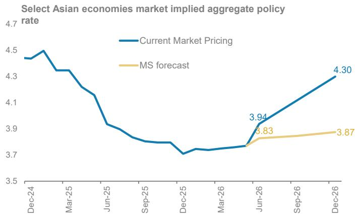

line

| Date   | Current Market Pricing | MS forecast |
|--------|------------------------|-------------|
| Jun-26 | 3.94                   | 3.83        |
| Dec-26 | 4.30                   | 3.87        |

Source: WITP, MS; Note: Select economies include India, Korea, Malaysia, Thailand, Australia, Japan, Taiwan, Indonesia and Philippines. Market consensus is used for Indonesia and Philippines as their market pricing is not available.

Exhibit 46: Overall, we see a gradual and modest rate hike cycle in Asia   
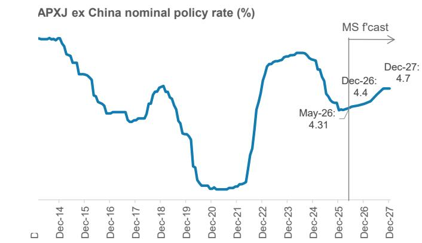

line

| Date    | APXJ ex China nominal policy rate (%) |
|---------|----------------------------------------|
| May-26  | 4.31                                   |
| Dec-26  | 4.4                                    |
| Dec-27  | 4.7                                    |

Source: Haver, MS forecasts

Exhibit 47:   
Asia – policy rate forecasts 

<table><tr><td rowspan="2">Policy rate (%)</td><td rowspan="2">Current</td><td colspan="4">2026</td><td colspan="4">2027</td></tr><tr><td>1Q</td><td>2QE</td><td>3QE</td><td>4QE</td><td>1QE</td><td>2QE</td><td>3QE</td><td>4QE</td></tr><tr><td>China*</td><td>1.40</td><td>1.40</td><td>1.40</td><td>1.40</td><td>1.40</td><td>1.40</td><td>1.40</td><td>1.40</td><td>1.40</td></tr><tr><td>Hong Kong</td><td>4.00</td><td>4.00</td><td>4.00</td><td>4.00</td><td>4.00</td><td>3.75</td><td>3.50</td><td>3.50</td><td>3.50</td></tr><tr><td>India</td><td>5.25</td><td>5.25</td><td>5.25</td><td>5.25</td><td>5.25</td><td>5.25</td><td>5.50</td><td>5.75</td><td>5.75</td></tr><tr><td>Indonesia</td><td>4.75</td><td>4.75</td><td>4.75</td><td>4.75</td><td>4.75</td><td>4.75</td><td>4.75</td><td>4.75</td><td>4.75</td></tr><tr><td>Korea</td><td>2.50</td><td>2.50</td><td>2.50</td><td>2.50</td><td>2.75</td><td>3.00</td><td>3.25</td><td>3.25</td><td>3.25</td></tr><tr><td>Malaysia</td><td>2.75</td><td>2.75</td><td>2.75</td><td>3.00</td><td>3.00</td><td>3.00</td><td>3.00</td><td>3.00</td><td>3.00</td></tr><tr><td>Philippines</td><td>4.50</td><td>4.25</td><td>5.00</td><td>5.25</td><td>5.50</td><td>5.50</td><td>5.50</td><td>5.50</td><td>5.50</td></tr><tr><td>Taiwan</td><td>2.00</td><td>2.00</td><td>2.00</td><td>2.00</td><td>2.00</td><td>2.13</td><td>2.13</td><td>2.25</td><td>2.25</td></tr><tr><td>Thailand</td><td>1.00</td><td>1.00</td><td>1.00</td><td>1.00</td><td>1.00</td><td>1.00</td><td>1.00</td><td>1.00</td><td>1.00</td></tr><tr><td>Australia</td><td>4.35</td><td>4.10</td><td>4.35</td><td>4.35</td><td>4.35</td><td>4.35</td><td>4.10</td><td>3.85</td><td>3.85</td></tr><tr><td>Japan</td><td>0.75</td><td>0.75</td><td>1.00</td><td>1.00</td><td>1.00</td><td>1.00</td><td>1.25</td><td>1.25</td><td>1.25</td></tr></table>

Source: Haver, MS (E) forecasts; Note: \*7day reverse repo rate.

# Risks

In our view, the key upside risk for Asia could come from the capex super-cycle being even stronger than we expect for the US and Asia: For the US, our global economics team believes upside to US growth could emanate from:

1. Stronger private sector spending amid strong household wealth effect and elevated business confidence, and   
2. Faster-than-expected AI adoption leading to a productivity boost to US growth.

This would have positive spillover effects for Asia's trade and capex cycle too, given that Asia will benefit strongly from both increased demand for exports. This would then catalyse a further rise in Asia's broader industrial capex and production.

# The key downside risk would be re-escalation of geopolitical tensions in the Middle

East: The Strait of Hormuz could be shut for many more months, leading oil prices to exceed US\$150/bbl and remain elevated for several months – which would trigger a global recession. Pricing could also remain elevated for other materials critical to the supply chain, including petrochemicals and fertilizers, plastics, and inputs for semis manufacturing, metal processing, battery manufacturing, etc. This triggers broad-based demand destruction. Asia would be the most exposed region given its imported energy dependence, while economies with larger industrial activity and exports exposure would face greater downside.

# Forecast Summary Tables

Exhibit 48: Global real GDP growth forecasts (%YoY) 

<table><tr><td>Real GDP (%Y)</td><td>2025</td><td>2026E</td><td>2027E</td></tr><tr><td>Global</td><td>3.5</td><td>3.2</td><td>3.4</td></tr><tr><td>G10</td><td>1.8</td><td>1.4</td><td>1.7</td></tr><tr><td>US</td><td>2.1</td><td>2.2</td><td>2.5</td></tr><tr><td>Euro Area</td><td>1.5</td><td>0.6</td><td>1.0</td></tr><tr><td>Japan</td><td>1.2</td><td>0.4</td><td>1.0</td></tr><tr><td>UK</td><td>1.4</td><td>0.8</td><td>1.1</td></tr><tr><td>EM</td><td>4.9</td><td>4.6</td><td>4.6</td></tr><tr><td>China</td><td>5.0</td><td>4.8</td><td>4.7</td></tr><tr><td>India</td><td>7.5</td><td>6.8</td><td>7.0</td></tr><tr><td>Brazil</td><td>2.3</td><td>2.0</td><td>1.6</td></tr><tr><td>Mexico</td><td>0.6</td><td>1.1</td><td>1.7</td></tr></table>

Source: CEIC, MS (E) forecasts

Exhibit 49: Asia – real GDP growth forecasts 

<table><tr><td>Real GDP (%Y)</td><td>2025</td><td>2026E</td><td>2027E</td></tr><tr><td>China</td><td>5.0</td><td>4.8</td><td>4.7</td></tr><tr><td>Hong Kong</td><td>3.6</td><td>4.8</td><td>4.5</td></tr><tr><td>India</td><td>7.5</td><td>6.8</td><td>7.0</td></tr><tr><td>Indonesia</td><td>5.1</td><td>5.1</td><td>5.0</td></tr><tr><td>Korea</td><td>1.1</td><td>2.8</td><td>2.2</td></tr><tr><td>Malaysia</td><td>5.1</td><td>4.6</td><td>4.7</td></tr><tr><td>Philippines</td><td>4.5</td><td>4.0</td><td>5.0</td></tr><tr><td>Singapore</td><td>5.0</td><td>2.9</td><td>2.6</td></tr><tr><td>Taiwan</td><td>8.6</td><td>8.9</td><td>4.7</td></tr><tr><td>Thailand</td><td>2.4</td><td>1.6</td><td>2.3</td></tr><tr><td>Australia</td><td>2.0</td><td>1.9</td><td>1.5</td></tr><tr><td>Japan</td><td>1.2</td><td>0.4</td><td>1.0</td></tr><tr><td>Asia</td><td>5.0</td><td>4.8</td><td>4.7</td></tr><tr><td>Asia ex China</td><td>5.0</td><td>4.7</td><td>4.7</td></tr><tr><td>Asia ex India</td><td>4.4</td><td>4.2</td><td>4.1</td></tr><tr><td>Asia ex China ex India</td><td>3.3</td><td>3.2</td><td>3.0</td></tr><tr><td>AXJ</td><td>5.5</td><td>5.2</td><td>5.1</td></tr><tr><td>AXJ ex China</td><td>5.9</td><td>5.7</td><td>5.6</td></tr><tr><td>AXJ ex China ex India</td><td>4.3</td><td>4.4</td><td>3.9</td></tr></table>

Source: CEIC, MS (E) forecasts.

# Exhibit 50:

Real GDP quarterly forecasts (%YoY) 

<table><tr><td rowspan="2">Real GDP (%Y)</td><td colspan="4">2025</td><td colspan="4">2026</td><td colspan="4">2027</td><td rowspan="2">2025</td><td rowspan="2">2026E</td><td rowspan="2">2027E</td></tr><tr><td>1Q</td><td>2Q</td><td>3Q</td><td>4Q</td><td>1QE</td><td>2QE</td><td>3QE</td><td>4QE</td><td>1QE</td><td>2QE</td><td>3QE</td><td>4QE</td></tr><tr><td>China</td><td>5.4</td><td>5.2</td><td>4.8</td><td>4.5</td><td>5.0</td><td>4.7</td><td>4.8</td><td>4.9</td><td>4.7</td><td>4.8</td><td>4.8</td><td>4.6</td><td>5.0</td><td>4.8</td><td>4.7</td></tr><tr><td>Hong Kong</td><td>3.2</td><td>3.3</td><td>3.8</td><td>4.0</td><td>5.9</td><td>5.0</td><td>4.4</td><td>3.8</td><td>3.3</td><td>4.6</td><td>5.1</td><td>5.0</td><td>3.6</td><td>4.8</td><td>4.5</td></tr><tr><td>India</td><td>7.0</td><td>6.7</td><td>8.4</td><td>7.8</td><td>7.4</td><td>6.5</td><td>6.7</td><td>6.8</td><td>7.0</td><td>7.0</td><td>7.2</td><td>7.0</td><td>7.5</td><td>6.8</td><td>7.0</td></tr><tr><td>Indonesia</td><td>4.9</td><td>5.1</td><td>5.0</td><td>5.4</td><td>5.6</td><td>5.0</td><td>5.0</td><td>5.0</td><td>5.0</td><td>5.1</td><td>5.0</td><td>5.1</td><td>5.1</td><td>5.1</td><td>5.0</td></tr><tr><td>Korea</td><td>-0.1</td><td>1.0</td><td>1.7</td><td>1.6</td><td>3.6</td><td>3.1</td><td>2.8</td><td>1.5</td><td>2.2</td><td>3.7</td><td>1.6</td><td>1.5</td><td>1.1</td><td>2.8</td><td>2.2</td></tr><tr><td>Malaysia</td><td>4.4</td><td>4.4</td><td>5.4</td><td>6.3</td><td>5.3</td><td>4.7</td><td>4.4</td><td>4.0</td><td>4.8</td><td>4.7</td><td>4.7</td><td>4.5</td><td>5.1</td><td>4.6</td><td>4.7</td></tr><tr><td>Philippines</td><td>5.4</td><td>5.4</td><td>4.0</td><td>3.0</td><td>2.8</td><td>3.8</td><td>4.4</td><td>5.0</td><td>5.7</td><td>4.4</td><td>5.2</td><td>4.8</td><td>4.5</td><td>4.0</td><td>5.0</td></tr><tr><td>Singapore</td><td>4.5</td><td>5.4</td><td>4.5</td><td>5.7</td><td>4.6</td><td>3.5</td><td>1.9</td><td>1.5</td><td>2.5</td><td>2.6</td><td>2.4</td><td>2.8</td><td>5.0</td><td>2.9</td><td>2.6</td></tr><tr><td>Taiwan</td><td>5.5</td><td>7.7</td><td>8.2</td><td>12.7</td><td>13.7</td><td>10.1</td><td>9.0</td><td>2.8</td><td>6.4</td><td>6.1</td><td>3.7</td><td>2.4</td><td>8.6</td><td>8.9</td><td>4.7</td></tr><tr><td>Thailand</td><td>3.1</td><td>2.8</td><td>1.2</td><td>2.5</td><td>1.4</td><td>1.3</td><td>1.8</td><td>2.0</td><td>2.0</td><td>2.2</td><td>2.5</td><td>2.5</td><td>2.4</td><td>1.6</td><td>2.3</td></tr><tr><td>Australia</td><td>1.3</td><td>1.9</td><td>2.1</td><td>2.6</td><td>2.6</td><td>1.9</td><td>1.7</td><td>1.2</td><td>1.2</td><td>1.4</td><td>1.5</td><td>1.7</td><td>2.0</td><td>1.9</td><td>1.5</td></tr><tr><td>Japan</td><td>1.6</td><td>2.1</td><td>0.7</td><td>0.4</td><td>0.9</td><td>-0.1</td><td>0.5</td><td>0.5</td><td>0.3</td><td>1.1</td><td>1.3</td><td>1.1</td><td>1.2</td><td>0.4</td><td>1.0</td></tr><tr><td>Asia</td><td>5.0</td><td>5.0</td><td>5.0</td><td>4.9</td><td>5.2</td><td>4.6</td><td>4.7</td><td>4.6</td><td>4.7</td><td>4.9</td><td>4.8</td><td>4.6</td><td>5.0</td><td>4.8</td><td>4.7</td></tr><tr><td>Asia ex China</td><td>4.6</td><td>4.8</td><td>5.3</td><td>5.3</td><td>5.4</td><td>4.6</td><td>4.6</td><td>4.3</td><td>4.7</td><td>4.9</td><td>4.8</td><td>4.6</td><td>5.0</td><td>4.7</td><td>4.7</td></tr><tr><td>Asia ex India</td><td>4.5</td><td>4.6</td><td>4.1</td><td>4.2</td><td>4.6</td><td>4.1</td><td>4.2</td><td>4.0</td><td>4.1</td><td>4.3</td><td>4.1</td><td>3.9</td><td>4.4</td><td>4.2</td><td>4.1</td></tr><tr><td>Asia ex China ex India</td><td>2.9</td><td>3.5</td><td>3.1</td><td>3.6</td><td>4.0</td><td>3.2</td><td>3.2</td><td>2.5</td><td>2.9</td><td>3.3</td><td>3.0</td><td>2.8</td><td>3.3</td><td>3.2</td><td>3.0</td></tr><tr><td>AXJ</td><td>5.4</td><td>5.3</td><td>5.5</td><td>5.4</td><td>5.7</td><td>5.1</td><td>5.2</td><td>5.0</td><td>5.2</td><td>5.3</td><td>5.1</td><td>4.9</td><td>5.5</td><td>5.2</td><td>5.1</td></tr><tr><td>AXJ ex China</td><td>5.4</td><td>5.5</td><td>6.4</td><td>6.4</td><td>6.4</td><td>5.6</td><td>5.6</td><td>5.2</td><td>5.6</td><td>5.8</td><td>5.6</td><td>5.4</td><td>5.9</td><td>5.7</td><td>5.6</td></tr><tr><td>AXJ ex China ex India</td><td>3.7</td><td>4.3</td><td>4.2</td><td>5.0</td><td>5.4</td><td>4.6</td><td>4.4</td><td>3.4</td><td>4.1</td><td>4.4</td><td>3.8</td><td>3.6</td><td>4.3</td><td>4.4</td><td>3.9</td></tr></table>

Source: CEIC, MS (E) forecasts

Exhibit 51: Private consumption quarterly forecasts (%YoY) 

<table><tr><td rowspan="2">Private Consumption %Y</td><td colspan="4">2025</td><td colspan="4">2026</td><td colspan="4">2027</td><td rowspan="2">2025</td><td rowspan="2">2026E</td><td rowspan="2">2027E</td></tr><tr><td>1Q</td><td>2Q</td><td>3Q</td><td>4Q</td><td>1QE</td><td>2QE</td><td>3QE</td><td>4QE</td><td>1QE</td><td>2QE</td><td>3QE</td><td>4QE</td></tr><tr><td>China</td><td>5.3</td><td>5.2</td><td>3.8</td><td>3.6</td><td>3.1</td><td>3.5</td><td>3.8</td><td>3.9</td><td>4.3</td><td>3.9</td><td>4.0</td><td>4.0</td><td>4.5</td><td>3.7</td><td>4.0</td></tr><tr><td>Hong Kong</td><td>-0.9</td><td>2.3</td><td>2.4</td><td>2.7</td><td>5.0</td><td>2.4</td><td>2.9</td><td>3.6</td><td>3.2</td><td>3.5</td><td>3.6</td><td>3.1</td><td>1.7</td><td>3.5</td><td>3.3</td></tr><tr><td>India</td><td>5.6</td><td>9.2</td><td>8.0</td><td>8.7</td><td>7.8</td><td>6.3</td><td>6.8</td><td>6.9</td><td>7.2</td><td>6.6</td><td>6.8</td><td>7.4</td><td>7.8</td><td>7.0</td><td>7.0</td></tr><tr><td>Indonesia</td><td>4.9</td><td>5.0</td><td>4.9</td><td>5.1</td><td>5.5</td><td>5.0</td><td>5.0</td><td>5.0</td><td>5.1</td><td>5.0</td><td>5.1</td><td>5.0</td><td>5.0</td><td>5.1</td><td>5.1</td></tr><tr><td>Korea</td><td>0.6</td><td>0.9</td><td>1.9</td><td>1.9</td><td>2.6</td><td>2.2</td><td>1.8</td><td>2.0</td><td>-0.5</td><td>1.4</td><td>2.6</td><td>0.8</td><td>1.3</td><td>2.2</td><td>1.1</td></tr><tr><td>Malaysia</td><td>5.0</td><td>5.3</td><td>5.0</td><td>5.3</td><td>5.0</td><td>4.8</td><td>4.5</td><td>4.8</td><td>5.0</td><td>5.0</td><td>5.0</td><td>5.0</td><td>5.2</td><td>4.8</td><td>5.0</td></tr><tr><td>Philippines</td><td>5.3</td><td>5.2</td><td>4.0</td><td>3.8</td><td>3.0</td><td>3.0</td><td>4.0</td><td>4.0</td><td>4.5</td><td>4.5</td><td>5.0</td><td>5.0</td><td>4.6</td><td>3.5</td><td>4.8</td></tr><tr><td>Singapore</td><td>3.9</td><td>3.7</td><td>3.4</td><td>4.5</td><td>4.0</td><td>3.5</td><td>2.7</td><td>2.8</td><td>2.5</td><td>2.5</td><td>2.7</td><td>2.8</td><td>3.9</td><td>3.3</td><td>2.6</td></tr><tr><td>Taiwan</td><td>1.4</td><td>0.2</td><td>0.7</td><td>3.4</td><td>4.9</td><td>5.0</td><td>3.0</td><td>0.7</td><td>1.8</td><td>2.9</td><td>4.4</td><td>2.1</td><td>1.4</td><td>3.4</td><td>2.8</td></tr><tr><td>Thailand</td><td>2.4</td><td>2.5</td><td>2.5</td><td>3.3</td><td>2.0</td><td>2.3</td><td>2.6</td><td>2.4</td><td>2.5</td><td>2.5</td><td>2.0</td><td>2.0</td><td>2.7</td><td>2.3</td><td>2.3</td></tr><tr><td>Australia</td><td>0.9</td><td>2.3</td><td>2.6</td><td>2.4</td><td>2.5</td><td>1.4</td><td>1.1</td><td>1.1</td><td>0.9</td><td>1.2</td><td>1.4</td><td>1.6</td><td>2.1</td><td>1.5</td><td>1.3</td></tr><tr><td>Japan</td><td>1.4</td><td>1.4</td><td>1.5</td><td>1.7</td><td>1.2</td><td>1.0</td><td>0.5</td><td>0.2</td><td>0.0</td><td>0.1</td><td>0.3</td><td>0.4</td><td>1.5</td><td>0.7</td><td>0.2</td></tr><tr><td>Asia</td><td>4.5</td><td>5.3</td><td>4.4</td><td>4.6</td><td>4.2</td><td>3.9</td><td>4.1</td><td>4.1</td><td>4.3</td><td>4.1</td><td>4.3</td><td>4.3</td><td>4.7</td><td>4.1</td><td>4.2</td></tr><tr><td>Asia ex China</td><td>3.8</td><td>5.3</td><td>4.9</td><td>5.4</td><td>5.2</td><td>4.3</td><td>4.3</td><td>4.3</td><td>4.3</td><td>4.2</td><td>4.5</td><td>4.6</td><td>4.8</td><td>4.5</td><td>4.4</td></tr><tr><td>Asia ex India</td><td>4.2</td><td>4.2</td><td>3.4</td><td>3.5</td><td>3.2</td><td>3.3</td><td>3.3</td><td>3.3</td><td>3.5</td><td>3.3</td><td>3.6</td><td>3.4</td><td>3.8</td><td>3.3</td><td>3.4</td></tr><tr><td>Asia ex China ex India</td><td>2.5</td><td>2.7</td><td>2.8</td><td>3.2</td><td>3.2</td><td>2.9</td><td>2.6</td><td>2.3</td><td>2.1</td><td>2.5</td><td>2.9</td><td>2.5</td><td>2.8</td><td>2.7</td><td>2.5</td></tr><tr><td>AXJ</td><td>4.9</td><td>5.7</td><td>4.7</td><td>4.9</td><td>4.5</td><td>4.2</td><td>4.4</td><td>4.5</td><td>4.7</td><td>4.5</td><td>4.7</td><td>4.7</td><td>5.0</td><td>4.5</td><td>4.6</td></tr><tr><td>AXJ ex China</td><td>4.4</td><td>6.3</td><td>5.7</td><td>6.3</td><td>6.1</td><td>5.1</td><td>5.2</td><td>5.2</td><td>5.2</td><td>5.2</td><td>5.5</td><td>5.5</td><td>5.7</td><td>5.4</td><td>5.3</td></tr><tr><td>AXJ ex China ex India</td><td>3.1</td><td>3.2</td><td>3.3</td><td>3.9</td><td>4.1</td><td>3.8</td><td>3.5</td><td>3.3</td><td>3.1</td><td>3.5</td><td>4.0</td><td>3.3</td><td>3.4</td><td>3.7</td><td>3.5</td></tr></table>

Source: CEIC, MS (E) forecasts.

Exhibit 52: Gross fixed investment quarterly forecasts (%YoY) 

<table><tr><td rowspan="2">Gross Fixed Investment %Y</td><td colspan="4">2025</td><td colspan="4">2026</td><td colspan="4">2027</td><td rowspan="2">2025</td><td rowspan="2">2026E</td><td rowspan="2">2027E</td></tr><tr><td>1Q</td><td>2Q</td><td>3Q</td><td>4Q</td><td>1QE</td><td>2QE</td><td>3QE</td><td>4QE</td><td>1QE</td><td>2QE</td><td>3QE</td><td>4QE</td></tr><tr><td>China (ex property)</td><td>2.0</td><td>2.8</td><td>1.8</td><td>1.7</td><td>10.8</td><td>6.5</td><td>4.6</td><td>3.8</td><td>3.1</td><td>4.4</td><td>4.8</td><td>4.3</td><td>4.6</td><td>5.8</td><td>4.5</td></tr><tr><td>Hong Kong</td><td>1.4</td><td>1.8</td><td>3.4</td><td>10.5</td><td>17.7</td><td>2.5</td><td>3.5</td><td>3.9</td><td>1.1</td><td>13.3</td><td>8.4</td><td>4.7</td><td>4.3</td><td>6.5</td><td>6.8</td></tr><tr><td>India</td><td>6.2</td><td>4.9</td><td>8.4</td><td>7.8</td><td>6.8</td><td>6.0</td><td>6.6</td><td>6.9</td><td>7.2</td><td>7.4</td><td>7.3</td><td>6.7</td><td>6.9</td><td>6.6</td><td>7.1</td></tr><tr><td>Indonesia</td><td>2.1</td><td>7.0</td><td>5.0</td><td>6.1</td><td>6.0</td><td>4.5</td><td>3.8</td><td>3.7</td><td>4.5</td><td>4.8</td><td>5.0</td><td>5.0</td><td>5.1</td><td>4.5</td><td>4.8</td></tr><tr><td>Korea</td><td>-2.3</td><td>-1.5</td><td>-1.1</td><td>-2.1</td><td>1.0</td><td>-0.6</td><td>0.2</td><td>0.0</td><td>2.9</td><td>5.9</td><td>-1.4</td><td>0.7</td><td>-1.8</td><td>0.1</td><td>2.0</td></tr><tr><td>Malaysia</td><td>9.7</td><td>12.1</td><td>7.4</td><td>9.3</td><td>4.5</td><td>4.0</td><td>4.2</td><td>5.0</td><td>4.2</td><td>4.0</td><td>4.2</td><td>4.5</td><td>9.6</td><td>4.4</td><td>4.2</td></tr><tr><td>Philippines</td><td>6.5</td><td>3.1</td><td>0.7</td><td>-6.4</td><td>-2.7</td><td>0.0</td><td>2.0</td><td>2.0</td><td>3.0</td><td>3.0</td><td>4.0</td><td>4.0</td><td>1.0</td><td>0.3</td><td>3.5</td></tr><tr><td>Singapore</td><td>8.8</td><td>4.5</td><td>4.1</td><td>7.4</td><td>2.6</td><td>1.6</td><td>1.5</td><td>2.7</td><td>3.8</td><td>2.2</td><td>2.4</td><td>2.4</td><td>6.2</td><td>2.1</td><td>2.7</td></tr><tr><td>Taiwan</td><td>16.7</td><td>4.8</td><td>1.4</td><td>-3.4</td><td>5.2</td><td>5.8</td><td>16.7</td><td>12.3</td><td>9.1</td><td>5.7</td><td>4.3</td><td>2.1</td><td>4.9</td><td>10.0</td><td>5.3</td></tr><tr><td>Thailand</td><td>4.6</td><td>5.8</td><td>1.4</td><td>8.1</td><td>2.0</td><td>1.2</td><td>3.5</td><td>1.0</td><td>2.2</td><td>2.4</td><td>3.0</td><td>3.2</td><td>4.9</td><td>1.9</td><td>2.7</td></tr><tr><td>Australia</td><td>1.9</td><td>1.4</td><td>4.9</td><td>5.0</td><td>5.2</td><td>5.3</td><td>2.4</td><td>2.1</td><td>1.7</td><td>1.8</td><td>1.8</td><td>1.8</td><td>3.3</td><td>3.7</td><td>1.8</td></tr><tr><td>Japan</td><td>1.4</td><td>1.8</td><td>-0.9</td><td>1.2</td><td>1.4</td><td>-0.4</td><td>0.8</td><td>-0.2</td><td>-0.5</td><td>0.7</td><td>1.2</td><td>1.4</td><td>0.9</td><td>0.5</td><td>0.7</td></tr><tr><td>Asia</td><td>3.4</td><td>3.5</td><td>3.2</td><td>3.3</td><td>7.7</td><td>5.1</td><td>4.6</td><td>4.1</td><td>3.9</td><td>4.8</td><td>4.7</td><td>4.4</td><td>2.3</td><td>5.1</td><td>4.6</td></tr><tr><td>Asia ex China</td><td>4.7</td><td>4.2</td><td>4.6</td><td>4.8</td><td>4.7</td><td>3.7</td><td>4.7</td><td>4.4</td><td>4.7</td><td>5.2</td><td>4.6</td><td>4.4</td><td>4.5</td><td>4.4</td><td>4.7</td></tr><tr><td>Asia ex India</td><td>2.6</td><td>3.1</td><td>1.8</td><td>2.1</td><td>7.9</td><td>4.8</td><td>4.1</td><td>3.3</td><td>3.0</td><td>4.1</td><td>4.0</td><td>3.7</td><td>1.1</td><td>4.7</td><td>3.9</td></tr><tr><td>Asia ex China ex India</td><td>3.6</td><td>3.7</td><td>1.9</td><td>2.7</td><td>3.3</td><td>2.0</td><td>3.2</td><td>2.5</td><td>2.8</td><td>3.5</td><td>2.6</td><td>2.7</td><td>2.9</td><td>2.8</td><td>2.9</td></tr><tr><td>AXJ</td><td>3.6</td><td>3.7</td><td>3.5</td><td>3.4</td><td>8.3</td><td>5.5</td><td>5.0</td><td>4.5</td><td>4.3</td><td>5.2</td><td>5.1</td><td>4.7</td><td>2.4</td><td>5.5</td><td>5.0</td></tr><tr><td>AXJ ex China</td><td>5.5</td><td>4.8</td><td>5.6</td><td>5.5</td><td>5.3</td><td>4.4</td><td>5.5</td><td>5.3</td><td>5.8</td><td>6.1</td><td>5.4</td><td>5.1</td><td>5.3</td><td>5.1</td><td>5.6</td></tr><tr><td>AXJ ex China ex India</td><td>4.6</td><td>4.7</td><td>2.7</td><td>3.0</td><td>3.8</td><td>2.6</td><td>4.3</td><td>3.6</td><td>4.2</td><td>4.8</td><td>3.3</td><td>3.3</td><td>3.7</td><td>3.5</td><td>3.9</td></tr></table>

Source: CEIC, MS (E) forecasts; Note: Korea and Taiwan as gross capital formation. MS estimates are used for China as its official data does not have quarterly GFCF breakdown.

Exhibit 53: CPI forecasts (%YoY) 

<table><tr><td>Headline CPI (%Y)</td><td>2025</td><td>2026E</td><td>2027E</td></tr><tr><td>China</td><td>0.1</td><td>0.8</td><td>0.6</td></tr><tr><td>Hong Kong</td><td>1.4</td><td>2.0</td><td>1.8</td></tr><tr><td>India</td><td>2.2</td><td>4.1</td><td>4.7</td></tr><tr><td>Indonesia</td><td>1.9</td><td>3.0</td><td>2.5</td></tr><tr><td>Korea</td><td>2.0</td><td>2.5</td><td>2.2</td></tr><tr><td>Malaysia</td><td>1.4</td><td>1.8</td><td>2.1</td></tr><tr><td>Philippines</td><td>1.7</td><td>6.3</td><td>3.9</td></tr><tr><td>Singapore</td><td>0.9</td><td>2.3</td><td>1.9</td></tr><tr><td>Taiwan</td><td>1.9</td><td>1.8</td><td>2.1</td></tr><tr><td>Thailand</td><td>0.0</td><td>2.2</td><td>1.7</td></tr><tr><td>Australia</td><td>2.9</td><td>4.5</td><td>2.7</td></tr><tr><td>Japan</td><td>3.2</td><td>2.2</td><td>1.4</td></tr><tr><td>Asia</td><td>1.1</td><td>2.1</td><td>1.9</td></tr><tr><td>Asia ex China</td><td>2.1</td><td>3.3</td><td>3.2</td></tr><tr><td>Asia ex India</td><td>0.9</td><td>1.5</td><td>1.2</td></tr><tr><td>Asia ex China ex India</td><td>2.1</td><td>2.8</td><td>2.1</td></tr><tr><td>AXJ</td><td>0.9</td><td>2.0</td><td>2.0</td></tr><tr><td>AXJ ex China</td><td>1.9</td><td>3.5</td><td>3.6</td></tr><tr><td>AXJ ex China ex India</td><td>1.6</td><td>2.8</td><td>2.3</td></tr></table>

Source: CEIC, MS (E) forecasts

Exhibit 54: Current account balance forecasts (% of GDP) 

<table><tr><td>Current account balance (% GDP)</td><td>2025</td><td>2026E</td><td>2027E</td></tr><tr><td>China</td><td>3.8</td><td>3.2</td><td>4.3</td></tr><tr><td>Hong Kong</td><td>12.2</td><td>8.8</td><td>8.5</td></tr><tr><td>India</td><td>-0.4</td><td>-1.5</td><td>-1.2</td></tr><tr><td>Indonesia</td><td>-0.1</td><td>-0.5</td><td>-0.8</td></tr><tr><td>Korea</td><td>6.1</td><td>11.6</td><td>6.7</td></tr><tr><td>Malaysia</td><td>1.6</td><td>1.3</td><td>1.5</td></tr><tr><td>Philippines</td><td>-3.4</td><td>-4.0</td><td>-3.5</td></tr><tr><td>Singapore</td><td>16.7</td><td>16.0</td><td>15.8</td></tr><tr><td>Taiwan</td><td>16.2</td><td>25.1</td><td>16.1</td></tr><tr><td>Thailand</td><td>2.8</td><td>1.9</td><td>2.0</td></tr><tr><td>Australia</td><td>-2.4</td><td>-3.1</td><td>-3.5</td></tr><tr><td>Japan</td><td>4.9</td><td>2.4</td><td>3.7</td></tr><tr><td>Asia</td><td>3.0</td><td>2.6</td><td>2.8</td></tr><tr><td>Asia ex China</td><td>2.3</td><td>2.0</td><td>1.5</td></tr><tr><td>Asia ex India</td><td>3.9</td><td>3.7</td><td>4.0</td></tr><tr><td>Asia ex China ex India</td><td>4.2</td><td>4.5</td><td>3.4</td></tr><tr><td>AXJ</td><td>3.0</td><td>2.8</td><td>2.9</td></tr><tr><td>AXJ ex China</td><td>2.1</td><td>2.2</td><td>1.3</td></tr><tr><td>AXJ ex China ex India</td><td>4.7</td><td>6.3</td><td>4.1</td></tr></table>

Source: CEIC, MS (E) forecasts

Exhibit 55:   
General Government Budget Balance (% GDP) 

<table><tr><td>General Government Budget Balance (% GDP)</td><td>2022</td><td>2023</td><td>2024</td><td>2025</td><td>2026E</td><td>2027E</td></tr><tr><td>China</td><td>-15.4</td><td>-12.2</td><td>-11.1</td><td>-11.7</td><td>-11.7</td><td>-11.7</td></tr><tr><td>Hong Kong</td><td>-7.3</td><td>-2.7</td><td>-0.9</td><td>1.0</td><td>0.5</td><td>0.5</td></tr><tr><td>India</td><td>-9.4</td><td>-9.3</td><td>-8.5</td><td>-7.8</td><td>-7.9</td><td>-7.5</td></tr><tr><td>Indonesia</td><td>-2.3</td><td>-1.6</td><td>-2.3</td><td>-2.9</td><td>-3.0</td><td>-2.8</td></tr><tr><td>Korea</td><td>-5.1</td><td>-3.6</td><td>-3.6</td><td>-2.9</td><td>-2.7</td><td>-2.5</td></tr><tr><td>Malaysia</td><td>-4.6</td><td>-4.1</td><td>-3.4</td><td>-3.5</td><td>-4.0</td><td>-3.5</td></tr><tr><td>Philippines</td><td>-5.5</td><td>-4.4</td><td>-5.7</td><td>-5.8</td><td>-6.0</td><td>-5.5</td></tr><tr><td>Singapore</td><td>-0.8</td><td>-1.6</td><td>0.3</td><td>1.9</td><td>0.8</td><td>0.5</td></tr><tr><td>Taiwan</td><td>-0.2</td><td>-2.5</td><td>0.4</td><td>-0.3</td><td>0.5</td><td>0.1</td></tr><tr><td>Thailand</td><td>-4.6</td><td>-1.9</td><td>-5.6</td><td>-5.3</td><td>-5.5</td><td>-5.0</td></tr><tr><td>Australia</td><td>0.4</td><td>1.3</td><td>-0.1</td><td>-1.8</td><td>-2.1</td><td>-1.3</td></tr><tr><td>Japan</td><td>-4.2</td><td>-3.0</td><td>-1.7</td><td>-0.7</td><td>-1.9</td><td>-2.5</td></tr><tr><td>Asia</td><td>-10.4</td><td>-8.5</td><td>-7.9</td><td>-8.0</td><td>-8.1</td><td>-8.1</td></tr><tr><td>Asia ex China</td><td>-5.7</td><td>-5.1</td><td>-4.8</td><td>-4.5</td><td>-4.8</td><td>-4.6</td></tr><tr><td>Asia ex India</td><td>-10.6</td><td>-8.3</td><td>-7.7</td><td>-8.0</td><td>-8.2</td><td>-8.2</td></tr><tr><td>Asia ex China ex India</td><td>-3.4</td><td>-2.4</td><td>-2.3</td><td>-2.1</td><td>-2.5</td><td>-2.5</td></tr><tr><td>AXJ</td><td>-11.3</td><td>-9.4</td><td>-8.6</td><td>-8.8</td><td>-8.8</td><td>-8.7</td></tr><tr><td>AXJ ex China</td><td>-6.4</td><td>-6.0</td><td>-5.7</td><td>-5.4</td><td>-5.5</td><td>-5.2</td></tr><tr><td>AXJ ex China ex India</td><td>-3.5</td><td>-2.7</td><td>-2.8</td><td>-2.8</td><td>-2.8</td><td>-2.7</td></tr></table>

Source: Haver, MS forecasts

# Disclosure Section

Information and opinions in MS were prepared or are disseminated by one or more of the following, which accept responsibility for its contents: MS Asia Limited, and/or MS Asia (Singapore) Pte. (Registration number 199206298Z) and/or MS Asia (Singapore) Securities Pte Ltd (Registration number 200008434H), regulated by the Monetary Authority of Singapore (which accepts legal responsibility for its contents and should be contacted with respect to any matters arising from, or in connection with, MS), and/or MS Taiwan Limited and/or MS & Co International plc, Seoul Branch, and/or MS Australia Limited (A.B.N. 67 003 734 576, holder of Australian financial services license No. 233742), and/or MS Wealth Management Australia Pty Ltd (A.B.N. 19 009 145 555, holder of Australian financial services license No. 240813, and/or MS India Company Private Limited having Corporate Identification No (CIN) U22990MH1998PTC115305, regulated by the Securities and Exchange Board of India ("SEBI") and holder of licenses as a Research Analyst (SEBI Registration No. INH000001105), Stock Broker (SEBI Stock Broker Registration No. INZ000244438), Merchant Banker (SEBI Registration No. INM000011203), and depository participant with National Securities Depository Limited (SEBI Registration No. IN-DP-NSDL-567-2021) having registered office at Altimus, Level 39 & 40, Pandurang Budhkar Marg, Worli, Mumbai 400018, India; Telephone no. +91-22-61181000; Compliance Officer Details: Mr. Tejarshi Hardas, Tel. No.: +91-22-61181000 or Email: tejarshi.hardas@morganstanley.com; Grievance officer details: Mr. Tejarshi Hardas, Tel. No.: +91-22-61181000 or Email: msic-compliance@morganstanley.com which accepts the responsibility for its contents and should be contacted with respect to any matters arising from, or in connection with, MS and their affiliates (collectively, "MS"). MS India Company Private Limited (MSICPL) may use AI tools in providing research services. All recommendations contained herein are made by the duly qualified research analysts; For important disclosures, stock price charts and equity rating histories regarding companies that are the subject of this report, please see the MS Disclosure Website at www.morganstanley.com/eqr/disclosures/webapp/generalresearch, or contact your investment representative or MS at 1585 Broadway, (Attention: Research Management), New York, NY, 10036 USA.

For valuation methodology and risks associated with any recommendation, rating or price target referenced in this research report, please contact the Client Support Team as follows: US/Canada +1 800 303-2495; Hong Kong +852 2848-5999; Latin America +1 718 754-5444 (U.S.); London +44 (0)20-7425-8169; Singapore +65 6834-6860; Sydney +61 (0)2-9770-1505; Tokyo +81 (0)3-6836-9000. Alternatively you may contact your investment representative or MS at 1585 Broadway, (Attention: Research Management), New York, NY 10036 USA.

# Global Research Conflict Management Policy

MS has been published in accordance with our conflict management policy, which is available at www.morganstanley.com/institutional/research/conflictpolicies. A Portuguese version of the policy can be found at www.morganstanley.com.br

# Important Disclosures

MS is not acting as a municipal advisor and the opinions or views contained herein are not intended to be, and do not constitute, advice within the meaning of Section 975 of the Dodd-Frank Wall Street Reform and Consumer Protection Act.

MS does not provide individually tailored investment advice. MS has been prepared without regard to the circumstances and objectives of those who receive it. MS recommends that investors independently evaluate particular investments and strategies, and encourages investors to seek the advice of a financial adviser. The appropriateness of an investment or strategy will depend on an investor's circumstances and objectives. The securities, instruments, or strategies discussed in MS may not be suitable for all investors, and certain investors may not be eligible to purchase or participate in some or all of them. MS is not an offer to buy or sell or the solicitation of an offer to buy or sell any security/instrument or to participate in any particular trading strategy. The value of and income from your investments may vary because of changes in interest rates, foreign exchange rates, default rates, prepayment rates, securities/instruments prices, market indexes, operational or financial conditions of companies or other factors. There may be time limitations on the exercise of options or other rights in securities/instruments transactions. Past performance is not necessarily a guide to future performance. Estimates of future performance are based on assumptions that may not be realized. If provided, and unless otherwise stated, the closing price on the cover page is that of the primary exchange for the subject company's securities/instruments.

The fixed income research analysts, strategists or economists principally responsible for the preparation of MS have received compensation based upon various factors, including quality, accuracy and value of research, firm profitability or revenues (which include fixed income trading and capital markets profitability or revenues), client feedback and competitive factors. Fixed Income Research analysts', strategists' or economists' compensation is not linked to investment banking or capital markets transactions performed by MS or the profitability or revenues of particular trading desks.

With the exception of information regarding MS, MS is based on public information. MS makes every effort to use reliable, comprehensive information, but we make no representation that it is accurate or complete. We have no obligation to tell you when opinions or information in MS change apart from when we intend to discontinue equity research coverage of a subject company. Facts and views presented in MS have not been reviewed by, and may not reflect information known to, professionals in other MS business areas, including investment banking personnel.

MS may make investment decisions that are inconsistent with the recommendations or views in this report.

To our readers based in Taiwan or trading in Taiwan securities/instruments: Information on securities/instruments that trade in Taiwan is distributed by MS Taiwan Limited ("MSTL"). Such information is for your reference only. The reader should independently evaluate the investment risks and is solely responsible for their investment decisions. MS may not be distributed to the public media or quoted or used by the public media without the express written consent of MS. Any non-customer reader within the scope of Article 7-1 of the Taiwan Stock Exchange Recommendation Regulations accessing and/or receiving MS is not permitted to provide MS to any third party (including but not limited to related parties, affiliated companies and any other third parties) or engage in any activities regarding MS which may create or give the appearance of creating a conflict of interest. Information on securities/instruments that do not trade in Taiwan is for informational purposes only and is not to be construed as a recommendation or a solicitation to trade in such securities/instruments. MSTL may not execute transactions for clients in these securities/instruments.

MS is not incorporated under PRC law and the research in relation to this report is conducted outside the PRC. MS does not constitute an offer to sell or the solicitation of an offer to buy any securities in the PRC. PRC investors shall have the relevant qualifications to invest in such securities and shall be responsible for obtaining all relevant approvals, licenses, verifications and/or registrations from the relevant governmental authorities themselves. Neither this report nor any part of it is intended as, or shall constitute, provision of any consultancy or advisory service of securities investment as defined under PRC law. Such information is provided for your reference only.

MS is disseminated in Brazil by MS C.T.V.M. S.A. located at Av. Brigadeiro Faria Lima, 3600, 6th floor, São Paulo - SP, Brazil; and is regulated by the Comissão de Valores Mobiliários; in Mexico by MS México, Casa de Bolsa, S.A. de C.V which is regulated by Comision Nacional Bancaria y de Valores. Paseo de los Tamarindos 90, Torre 1, Col. Bosques de las Lomas Floor 29, 05120 Mexico City; in Japan by MS MUFG Securities Co., Ltd. and, for Commodities related research reports only, MS Capital Group Japan Co., Ltd; in Hong Kong by MS Asia Limited (which accepts responsibility for its contents) and by MS Bank Asia Limited; in Singapore by MS Asia (Singapore) Pte. (Registration number 199206298Z) and/or MS Asia (Singapore) Securities Pte Ltd (Registration number 200008434H), regulated by the Monetary Authority of

Singapore (which accepts legal responsibility for its contents and should be contacted with respect to any matters arising from, or in connection with, MS) and by MS Bank Asia Limited, Singapore Branch (Registration number T14FC0118); in Australia to "wholesale clients" within the meaning of the Australian Corporations Act by MS Australia Limited A.B.N. 67 003 734 576, holder of Australian financial services license No. 233742, which accepts responsibility for its contents; in Australia to "wholesale clients" and "retail clients" within the meaning of the Australian Corporations Act by MS Wealth Management Australia Pty Ltd (A.B.N. 19 009 145 555, holder of Australian financial services license No. 240813, which accepts responsibility for its contents; in Korea by MS & Co International plc, Seoul Branch; in India by MS India Company Private Limited having Corporate Identification No (CIN) U22990MH1998PTC115305, regulated by the Securities and Exchange Board of India ("SEBI") and holder of licenses as a Research Analyst (SEBI Registration No. INH000001105); Stock Broker (SEBI Stock Broker Registration No. INZ000244438), Merchant Banker (SEBI Registration No. INM000011203), and depository participant with National Securities Depository Limited (SEBI Registration No. IN-DP-NSDL-567-2021) having registered office at Altimus, Level 39 & 40, Pandurang Budhkar Marg, Worli, Mumbai 400018, India; Telephone no. +91-22-61181000; Compliance Officer Details: Mr. Tejarshi Hardas, Tel. No.: +91-22-61181000 or Email: tejarshi.hardas@morganstanley.com; Grievance officer details: Mr. Tejarshi Hardas, Tel. No.: +91-22-61181000 or Email: msic-compliance@morganstanley.com. MS India Company Private Limited (MSICPL) may use AI tools in providing research services. All recommendations contained herein are made by the duly qualified research analysts; in Canada by MS Canada Limited; in Germany and the European Economic Area where required by MS Europe S.E., regulated by Bundesanstalt fuer Finanzdienstleistungsaufsicht (BaFin) under the reference number 149169; in the United States by MS & Co. LLC, which accepts responsibility for its contents. MS & Co. International plc, authorized by the Prudential Regulation Authority and regulated by the Financial Conduct Authority and the Prudential Regulation Authority, disseminates in the UK research that it has prepared, and research which has been prepared by any of its affiliates, only to persons who (i) are investment professionals falling within Article 19(5) of the Financial Services and Markets Act 2000 (Financial Promotion) Order 2005 (as amended, the "Order"); (ii) are persons who are high net worth entities falling within Article 49(2)(a) to (d) of the Order; or (iii) are persons to whom an invitation or inducement to engage in investment activity (within the meaning of section 21 of the Financial Services and Markets Act 2000, as amended) may otherwise lawfully be communicated or caused to be communicated. RMB MS Proprietary Limited is a member of the JSE Limited and A2X (Pty) Ltd. RMB MS Proprietary Limited is a joint venture owned equally by MS International Holdings Inc. and RMB Investment Advisory (Proprietary) Limited, which is wholly owned by FirstRand Limited. The information in MS is being disseminated by MS Saudi Arabia, regulated by the Capital Market Authority in the Kingdom of Saudi Arabia, and is directed at Sophisticated investors only.

The trademarks and service marks contained in MS are the property of their respective owners. Third-party data providers make no warranties or representations relating to the accuracy, completeness, or timeliness of the data they provide and shall not have liability for any damages relating to such data. The Global Industry Classification Standard (GICS) was developed by and is the exclusive property of MSCI and S&P.

MS, or any portion thereof may not be reprinted, sold or redistributed without the written consent of MS.

Indicators and trackers referenced in MS may not be used as, or treated as, a benchmark under Regulation EU 2016/1011, or any other similar framework.

The information in MS is being communicated by MS & Co. International plc (DIFC Branch), regulated by the Dubai Financial Services Authority (the DFSA) or by MS & Co. International plc (ADGM Branch), regulated by the Financial Services Regulatory Authority Abu Dhabi (the FSRA), and is directed at Professional Clients only, as defined by the DFSA or the FSRA, respectively. The financial products or financial services to which this research relates will only be made available to a customer who we are satisfied meets the regulatory criteria of a Professional Client. A distribution of the different MS Research ratings or recommendations, in percentage terms for Investments in each sector covered, is available upon request from your sales representative.

The information in MS is being communicated by MS & Co. International plc (QFC Branch), regulated by the Qatar Financial Centre Regulatory Authority (the QFCRA), and is directed at business customers and market counterparties only and is not intended for Retail Customers as defined by the QFCRA.

As required by the Capital Markets Board of Turkey, investment information, comments and recommendations stated here, are not within the scope of investment advisory activity. Investment advisory service is provided exclusively to persons based on their risk and income preferences by the authorized firms. Comments and recommendations stated here are general in nature. These opinions may not fit to your financial status, risk and return preferences. For this reason, to make an investment decision by relying solely to this information stated here may not bring about outcomes that fit your expectations.

Registration granted by SEBI and certification from the National Institute of Securities Markets (NISM) in no way guarantee performance of the intermediary or provide any assurance of returns to investors. Investment in securities market are subject to market risks. Read all the related documents carefully before investing.

© 2026 MS