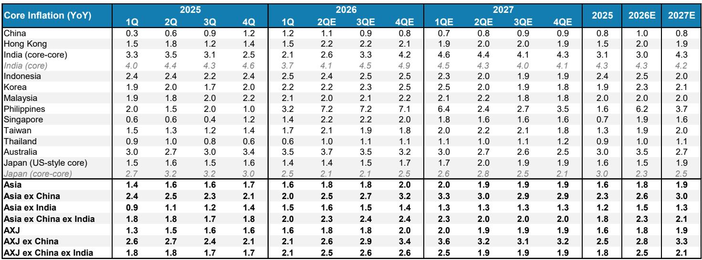
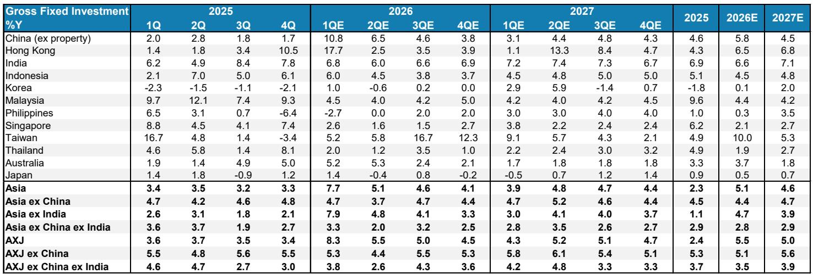
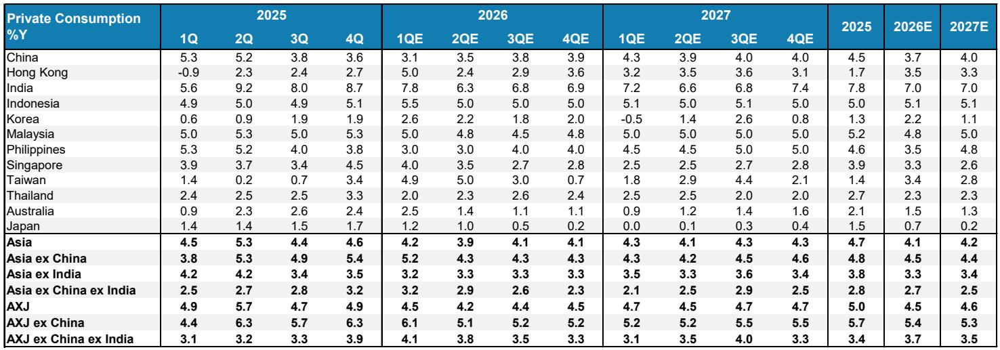

# Asia’s Industrial Super-Cycle Is Outweighing the Energy Shock — And That Changes the Investment Narrative

The dominant macro narrative of the past year has been that rising energy prices, driven by geopolitical tensions, would inevitably drag down Asian growth. That narrative is wrong. The strength of the industrial cycle is not merely holding up — it is pulling ahead, and the evidence from high-frequency data through April confirms that the region has entered a new phase of self-reinforcing expansion.

Asia sits at the intersection of two powerful and opposing forces. It is the region most exposed to energy shocks, given its heavy dependence on imported oil and gas. Yet it is also the primary beneficiary of a global industrial upswing, because of its outsized share of global manufacturing value-added and the high weight of industry in its GDP. For much of the first quarter, markets struggled to determine which force would dominate. The answer is now clear: the industrial cycle is winning.

This is not a defensive argument about resilience. It is an offensive argument about structural transformation. The capex cycle now underway in Asia is the most powerful since the mid-2000s, and it is being driven by four interlocking structural forces — AI infrastructure, energy transition, defense spending, and broader industrial spillovers — that together create a self-reinforcing loop. The energy shock, rather than derailing growth, is actually accelerating parts of this cycle by forcing governments and corporations to spend more on energy security and domestic production capacity.

The implications for asset allocation, sector positioning, and country exposure are significant. Investors who remain anchored to the view that Asia is a passive victim of external shocks are missing the deeper story: the region is undergoing a capex-driven transformation that will reshape its growth profile for years.

## The Industrial Cycle Has Already Decoupled from Energy Headwinds

The most important single data point from the report is not a forecast but a fact: Asia’s manufacturing PMIs and industrial production inflected higher again in April, after a brief softening in March when the initial energy price spike filtered through. This pattern — a temporary dip followed by a resumption of momentum — is the signature of a cycle that has enough underlying strength to absorb external shocks.

Asia’s industrial production growth has reached a four-year high. Non-tech exports, which had lagged the tech-driven recovery, are now picking up decisively. Capital goods imports remain strong, signaling that firms are not just running existing capacity harder but are investing in new capacity. This is not a cyclical bounce from a low base; it is a broadening recovery that is now touching multiple sectors and economies.

The mechanism by which Asia has managed the energy shock is equally instructive. China cut its oil imports by 30 percent and its LNG imports by 56 percent from the December 2025 peak, freeing up supplies for the rest of Asia. Inventories at sea and strategic reserves have been drawn down. Alternative energy sources — coal, nuclear, renewables — have been ramped up. India increased its LPG production by 40 percent. Meanwhile, US seaborne crude and petroleum exports have surged 71 percent year-on-year, from 5.2 million barrels per day to 8.9 million.

These adjustments are not costless. Energy prices are higher, and that will weigh on margins and consumer purchasing power. But the key insight is that the industrial cycle has enough momentum to absorb these costs without breaking. The question is whether that momentum can be sustained, and the report’s answer is that it can — because the drivers of the current cycle are structural, not cyclical.

## Four Structural Drivers Are Creating a Self-Reinforcing Capex Loop

The report identifies four interlocking forces that distinguish this cycle from previous upswings. Each is individually significant, but their interaction is what makes the current period transformational.

First, AI and AI-related infrastructure spending remains a top priority for CIOs globally, and Asia’s corporate sector is accelerating its own spending to catch up with the US. At the same time, Asia is a key supplier to the AI supply chain, and these companies are lifting their own capex to meet rising demand. This creates a double benefit: Asia benefits both as a producer of AI-related goods and as an investor in AI infrastructure.

Second, the energy transition is moving up the policy agenda across the region, accelerated by the recent energy shock. Asia’s share of renewable energy in primary energy consumption was only 9 percent in 2024, compared to 47 percent for coal. The gap between current reality and policy ambition is enormous, and closing it will require massive investment in renewable capacity, grid infrastructure, and energy storage.

Third, defense spending is rising structurally. Korea, Japan, and Taiwan have all announced multi-year increases, with targets that imply a significant step-up from current levels. Korea’s target of 3.5 percent of GDP, Japan’s 2 percent, and Taiwan’s 5 percent are not just incremental adjustments — they represent a fundamental reprioritization of fiscal resources.

Fourth, the rise in spending in these three segments will catalyze broader industrial capex spillovers as the effects work through the entire supply chain. This is not a linear process; it is a positive reinforcement loop. More spending on AI data centers requires more energy, which requires more investment in power generation, which requires more grid infrastructure, which requires more industrial output. Each round of spending creates demand for the next.

The report forecasts that Asia’s gross fixed investment will reach $16 trillion by 2030, up from $11 trillion currently — a 7 percent CAGR over the next five years, roughly three times the pace of growth seen over 2023-2025. The high-growth structural segments — AI infrastructure, energy transition, and defense — are expected to expand at a 16 percent CAGR over 2026-2030, with combined spending in these four segments rising to a $9 trillion annual run rate in 2030 from $5 trillion in 2025.

## The Energy Shock Is a Catalyst, Not a Contradiction

One of the most counterintuitive findings in the report is that the same geopolitical tensions that are raising energy costs are also forcing governments and corporations to accelerate spending on energy security, AI infrastructure, and defense. In other words, the energy shock is not just a headwind — it is also a catalyst for the capex cycle.

This is not a Panglossian argument that every crisis is an opportunity. Higher energy prices do reduce disposable income and compress margins. But the report’s data shows that the positive effect of accelerated capex is currently outweighing the negative effect of higher energy costs. The key variable is the duration and severity of the energy shock. If oil prices were to rise above $150 per barrel for a sustained period, the calculus would change. But at current levels, the industrial cycle is strong enough to absorb the shock.

This has important implications for how investors should think about risk. The conventional approach is to treat geopolitical tensions as a binary risk that either materializes or does not. The report suggests a more nuanced framework: geopolitical tensions can simultaneously create costs and opportunities, and the net effect depends on the relative speed and magnitude of the two forces. In the current environment, the capex response is happening faster and on a larger scale than the energy drag.

## Korea, Taiwan, China, and Japan Are the Key Beneficiaries — But the Recovery Is Broadening

The report identifies Korea, Taiwan, China, and Japan as the primary beneficiaries of the industrial upswing. These economies have the highest exposure to the tech supply chain, the deepest industrial bases, and the most ambitious capex plans. Korea and Taiwan benefit from their dominant positions in semiconductors and AI-related hardware. China benefits from its scale and its aggressive push into advanced manufacturing. Japan benefits from its strength in industrial equipment, materials, and precision components.

But the recovery is broadening. Non-tech exports are picking up, which benefits economies like India, Indonesia, and Malaysia that have a higher share of commodity and resource-based exports. The capex cycle in AI infrastructure and energy transition creates demand for a wide range of industrial inputs — from steel and copper to construction services and engineering consulting — that are produced across the region.

The broadening of the recovery is important because it reduces the vulnerability of the overall Asian growth story to a downturn in any single sector or economy. If tech exports slow, non-tech exports and domestic capex can provide offsetting support. If China’s growth moderates, India and Southeast Asia can pick up the slack. This diversification is a structural improvement in the region’s growth resilience.

## What the Report Does Not Fully Answer: The Sustainability of the Capex Financing Model

For all its analytical rigor, the report leaves one critical question open: how will this massive increase in capex be financed? Asia’s gross fixed investment is projected to rise by $5 trillion over five years. That is an enormous increase in capital spending, and it will require a corresponding increase in savings, foreign capital inflows, or fiscal resources.

The report does not provide a detailed analysis of the financing side of the equation. It notes that corporate balance sheets in Asia are generally healthy, and that the region has a high savings rate. But the scale of the required investment is unprecedented in peacetime, and it is not obvious that the financing will be available on favorable terms, especially if global interest rates remain higher than in the pre-2022 era.

There is also the question of fiscal capacity. Defense spending increases are being funded by government budgets, which in many Asian economies are already constrained by aging populations and rising healthcare costs. Energy transition investments will require a mix of public and private capital, but the regulatory frameworks to attract private investment are still evolving in many countries. AI infrastructure investments are largely being made by the corporate sector, but the returns on these investments are uncertain and may take longer to materialize than investors expect.

Investors should watch for signs of financing stress: rising corporate leverage, widening fiscal deficits, or a slowdown in capital inflows. If the financing side of the equation proves more challenging than the report assumes, the capex cycle could fall short of its potential.

## A Decision Framework for Investors: Three Questions to Ask

The report’s analysis can be translated into a practical decision framework for investors. Rather than trying to predict whether the industrial cycle will continue to outweigh the energy shock, investors should ask three questions that will determine the outcome.

First, is the capex cycle self-sustaining or dependent on external demand? The report argues that Asia’s capex is increasingly driven by domestic structural forces — AI infrastructure, energy transition, defense — rather than by export demand alone. If this is correct, the cycle is more resilient to a global slowdown. If it is incorrect, and the capex is ultimately dependent on US and European demand for Asian exports, then a global recession would break the cycle.

Second, how quickly can Asia adjust to higher energy prices if they persist? The report shows that Asia has already made significant adjustments — cutting imports, drawing down inventories, shifting to alternatives. But these adjustments have limits. Inventories can only be drawn down so far. Alternative energy sources take time to build. If energy prices remain elevated for two to three years, the cost to the real economy will accumulate.

Third, will the benefits of the capex cycle be broadly shared or concentrated in a few economies and sectors? The report’s data suggests that the benefits are broadening, but the concentration of AI-related capex in Korea and Taiwan, and of defense spending in Japan and Korea, means that some economies will benefit much more than others. Investors need to be selective about country and sector exposure.

## Why This Report Matters Now

The conventional wisdom on Asia has been cautious for the past year, dominated by fears of energy shocks, geopolitical tensions, and a potential global recession. The report challenges that consensus with a data-driven argument that the industrial cycle is stronger than the headwinds. The evidence from April data supports this view.

But the report is not a blanket endorsement of all Asian assets. It is a call for a more nuanced and selective approach. The economies and sectors that are most exposed to the structural capex drivers — AI infrastructure, energy transition, defense — are likely to outperform. The economies and sectors that are most exposed to energy costs and have less capacity to adjust are likely to underperform.

The report also raises a deeper strategic question: is Asia entering a period of structurally higher investment and growth, or is this a cyclical upswing that will fade as the energy shock intensifies? The answer depends on whether the structural drivers of capex — AI, energy transition, defense — are as powerful as the report assumes, and whether the financing is available to sustain them.

These are questions that cannot be answered by a single report. They require ongoing analysis, data monitoring, and debate. That is why the full report, with its detailed charts and scenarios, is essential reading for anyone with serious exposure to Asian markets.

Join the community to read the full report and review the original charts.

*This article is for learning and discussion only and does not constitute investment advice.*

Personal reading notes and learning share only. Not investment advice.

