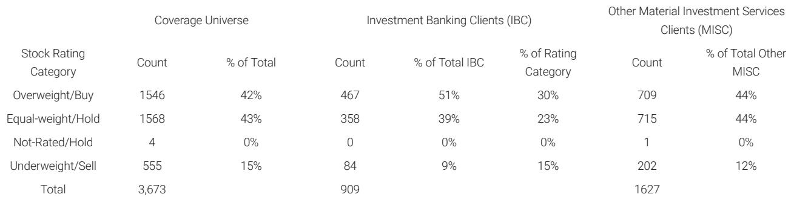

# 4月电动车定价回暖：改款周期正在重塑价格战逻辑，而非终结它

市场对2025年中国电动车行业的普遍担忧是价格战无休止、利润持续承压。某外资投行最新发布的4月终端零售价格追踪却指向了一个更微妙的信号：在经历了3月的普遍降价后，4月多家头部品牌的加权平均零售价出现了环比改善。这一改善并非来自需求端的突然爆发，而是源于供给侧的产品迭代——改款车型正在成为价格体系的新锚点。真正值得关注的，不是价格战是否结束，而是定价权的来源正在从“规模摊薄成本”切换为“产品迭代速度与品牌溢价”。

这份月度追踪报告覆盖了比亚迪、理想、小鹏、蔚来、吉利银河等核心玩家。数据显示，4月价格环比变化呈现显著分化：蔚来均价环比上涨4%，吉利银河上涨7%，小鹏微涨0.6%，理想持平，而比亚迪则微降0.3%。表面看，这是“涨跌互现”的常态波动，但深入拆解每一家公司的价格构成，会发现一个更具结构性的叙事正在展开。

## 1. 改款是4月价格改善的唯一驱动力，折扣收窄只是辅助因素

4月价格改善的核心引擎只有一个：产品改款。蔚来5566系列（ET5、ES6等）改款后，每款车型的零售价环比提升了约10%，直接拉动整体均价上涨4%。吉利银河的A7、M9、Starshine 8完成2026年款改款后，单车零售价环比涨幅均超过10%，带动品牌均价上涨7%。小鹏MONA M03改款后价格提升6500元。理想L6/L7/L8的折扣环比收窄了约3000元，但L9价格持平，整体均价未变。这些案例清晰地表明，改款是4月价格上行的“第一性原理”。

折扣收窄是辅助因素，但不是主导力量。理想的案例最有说服力：虽然L系列折扣收窄，但整体均价并未上涨，因为L9在新款发布前价格持平。这意味着，单纯的促销力度收缩并不足以推动品牌均价上升——只有当产品本身的价值感通过改款被重新锚定，消费者才愿意接受更高的实际成交价。

这个现象对投资者的含义是：在评估一家车企的定价能力时，不能只看“折扣率”或“终端优惠”这类短期指标。折扣可以随时放大或收缩，但改款节奏和产品力升级才是决定价格中枢能否上移的长期变量。那些拥有更密集、更高质量改款计划的车企，将在定价博弈中占据主动。

## 2. 比亚迪的“价格悖论”：规模优势并未阻止均价下行，改款覆盖不足是主因

比亚迪4月均价环比下降0.3%，这似乎与其行业龙头的地位相悖。但仔细拆解数据，原因并不复杂：改款带来的价格提升被其他车型的价格下降所抵消。海豹06和海狮05在改款后零售价确有改善，但比亚迪庞大的产品矩阵中，仍有大量车型未能享受改款红利，其价格在市场竞争中被动下滑。

这里的关键洞察是：比亚迪的规模优势正在从“定价护城河”变成“价格管理难题”。当一家公司拥有超过20款在售车型时，改款无法同步覆盖所有产品线。未被改款的车型在竞品新品的挤压下，被迫降价以维持市场份额。这导致的结果是：比亚迪的品牌均价在过去一年半中从1.0（2024年1月基准）持续下降至0.82（2026年4月），累计降幅接近18%。

比亚迪的挑战不在于其制造效率或成本控制，而在于如何让产品迭代的速度追上其产品线扩张的速度。即将推出的“Great Tang”等新车型能否扭转这一趋势，将是未来几个季度观察的重点。对于投资者而言，这意味着比亚迪的利润弹性可能并不完全来自销量增长，而更多地取决于其能否通过改款节奏优化来稳定价格中枢。

## 3. 蔚来的价格修复验证了“高端品牌溢价”的可持续性，但需要持续投入验证

蔚来4月均价环比上涨4%，是报告中最引人注目的改善之一。5566系列改款后价格提升约10%，且这一提升并未伴随明显的销量下滑（报告未提供销量数据，但价格能够站住说明市场需求具有一定韧性）。这验证了一个判断：蔚来的高端品牌定位并非空中楼阁，其用户群体对产品升级的支付意愿仍然存在。

但这里有一个报告尚未完全展开的关键问题：蔚来的价格修复是否可持续？改款带来的价格提升通常具有一次性特征——第一波尝鲜用户愿意为新产品支付溢价，但随着时间的推移，竞品跟进和用户新鲜感消退，价格可能重新承压。蔚来能否通过持续的产品力升级（如智能驾驶、换电网络、服务体验）来维持这一价格水平，而不是陷入“改款-涨价-降价”的循环，将决定其品牌溢价的真实厚度。

对于关注蔚来的投资者来说，4月的数据是一个积极信号，但它更像是一个“压力测试”的通过，而非长期趋势的确立。需要跟踪的是：未来3-6个月，蔚来的终端折扣是否会重新扩大，以及下一代平台的定价策略能否延续这一趋势。

## 4. 吉利银河的7%涨幅是一个值得警惕的信号：低基数下的“反弹”不等于趋势反转

吉利银河4月均价环比上涨7%，是样本中涨幅最大的品牌。但这需要放在更长的周期中看待。报告中的图表显示，吉利银河的零售价在2025年下半年经历了较大幅度的下滑，4月的上涨更像是从低点的技术性反弹。改款车型的价格提升幅度超过10%，但这是否意味着品牌定价能力已经全面恢复，仍存疑问。

这里有两个未解问题。第一，吉利银河的改款车型是否只是短期提振了均价，而未被改款的车型价格是否仍在承压？第二，7%的环比涨幅是否足以覆盖此前几个月的累计跌幅？如果答案是“不足以”，那么这一数据更多反映的是“价格触底后的修复”，而非“定价权的重新确立”。

对于产业观察者而言，吉利银河的案例提供了一个重要的分析框架：在评估一家车企的价格趋势时，不能只看单月环比变化，而必须结合过去6-12个月的价格曲线来判断当前改善是“趋势反转”还是“均值回归”。后者往往伴随着后续的价格回落。

## 5. 报告没有完全回答的核心问题：改款驱动的价格改善能持续多久？

这是整份报告最值得深入讨论、但尚未被完全解答的问题。4月的数据清晰地展示了“改款可以推高价格”这一短期结论，但改款效应的持续性取决于三个尚未被验证的变量。

第一，改款带来的价格提升是否会被竞品的“对标改款”所抵消？当一家公司通过改款提价后，竞争对手可能会加速自己的改款节奏或加大促销力度，从而侵蚀先发优势。第二，消费者的支付意愿在宏观经济不确定性下是否具有韧性？4月的价格改善发生在政策相对稳定的窗口期，如果宏观环境发生变化，改款溢价可能迅速消失。第三，改款本身是否意味着成本的上升？如果改款带来的BOM成本增加超过了零售价的提升幅度，那么对利润的贡献可能是负面的。

这些问题的答案不在4月的月度数据中，而需要在更长的时间维度、更广泛的品牌样本中寻找。这也是为什么，单月的价格数据可以给市场带来短期情绪提振，但无法构成投资决策的充分依据。

## 6. 一个更实用的观察框架：用“改款覆盖率”和“价格恢复周期”替代“均价变化”

对于希望从这份报告及其后续数据中获取洞察的读者，我们建议建立一个更精细的跟踪框架，而不是只盯住“均价环比变化”这个单一指标。

第一个维度是“改款覆盖率”：即一家公司当月被改款车型的销量占比。如果改款车型占比高，整体均价更容易被推升；如果占比低，均价可能被大量未改款车型拖累。比亚迪4月均价下降的根本原因，就是改款覆盖率不足以对冲其他车型的降价压力。

第二个维度是“价格恢复周期”：即改款车型从上市到价格回归到改款前水平的时间长度。如果这个周期在3个月以上，说明改款确实改变了消费者的价值认知；如果周期只有1-2个月，说明所谓的“改款溢价”只是短期营销效果。理想L系列的折扣收窄是一个正面信号，但需要持续跟踪折扣是否会在未来几个月重新扩大。

第三个维度是“价格-销量弹性”：即价格上涨对销量的负面影响程度。蔚来改款后价格提升10%，如果销量没有同步下滑，说明其品牌溢价是真实的；如果销量出现明显下降，则说明价格提升是以牺牲市场份额为代价的。

这三个维度结合起来，比单纯的“均价环比”更能反映一家车企的真实定价能力。它们也是我们在社群中持续跟踪和讨论的核心变量。

---

4月电动车零售价格的回暖是一个值得关注的变化，但它更像是一面镜子，折射出行业定价逻辑正在从“成本战”转向“产品战”。改款能力强的公司正在获得定价主动权，而产品线庞大但迭代速度不足的公司则面临均价持续下行的压力。对于投资者而言，在价格战的大背景下，识别哪些公司拥有“可持续的改款溢价能力”，比判断“价格战是否结束”更有实际意义。

这份某外资投行的月度报告提供了4月各品牌的价格变化细节和原始图表，包括比亚迪、蔚来、理想、小鹏、吉利银河的逐月零售价曲线。报告还包含了对未来几个月改款计划对价格影响的展望，以及各品牌折扣率变化的详细拆解。这些数据和分析维度，在公开渠道中很难系统获取。

我们已在社群中上传了完整报告原文及关键图表，并会在后续的讨论中持续跟踪5月价格数据的变化，验证4月的改善是否具有持续性。如果你对上述讨论中提到的“改款覆盖率”“价格恢复周期”等框架感兴趣，或者想看到蔚来5566系列改款后的逐周价格变化趋势，欢迎加入我们的微信群，一起在数据中寻找答案。

Personal reading notes and learning share only. Not investment advice.

