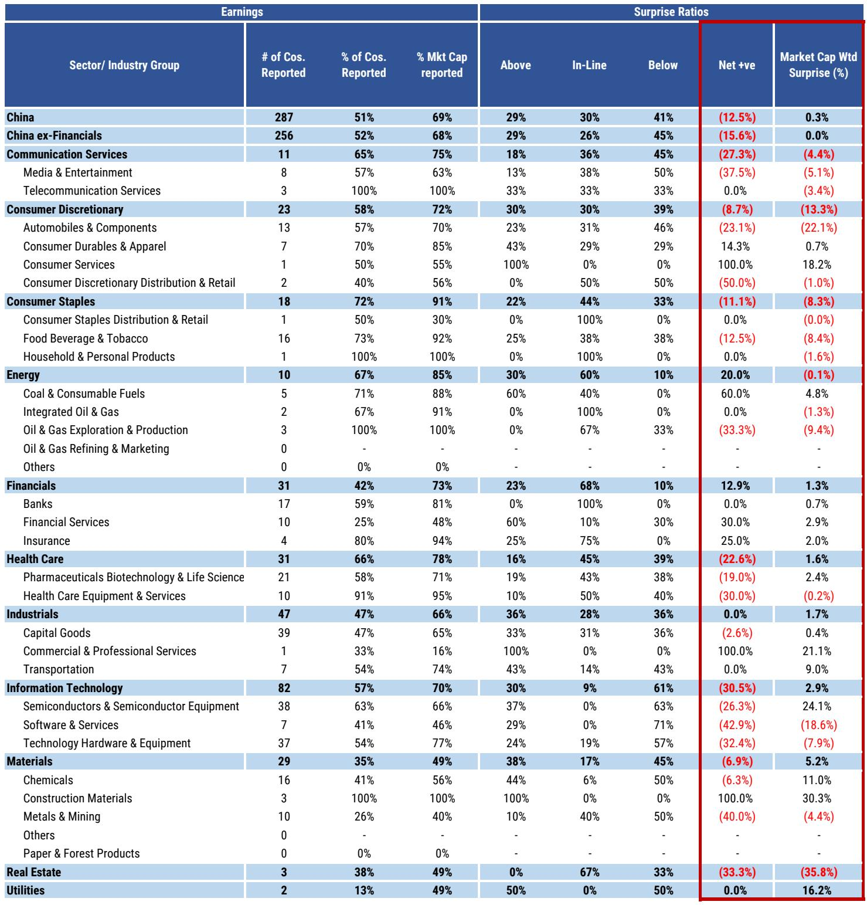
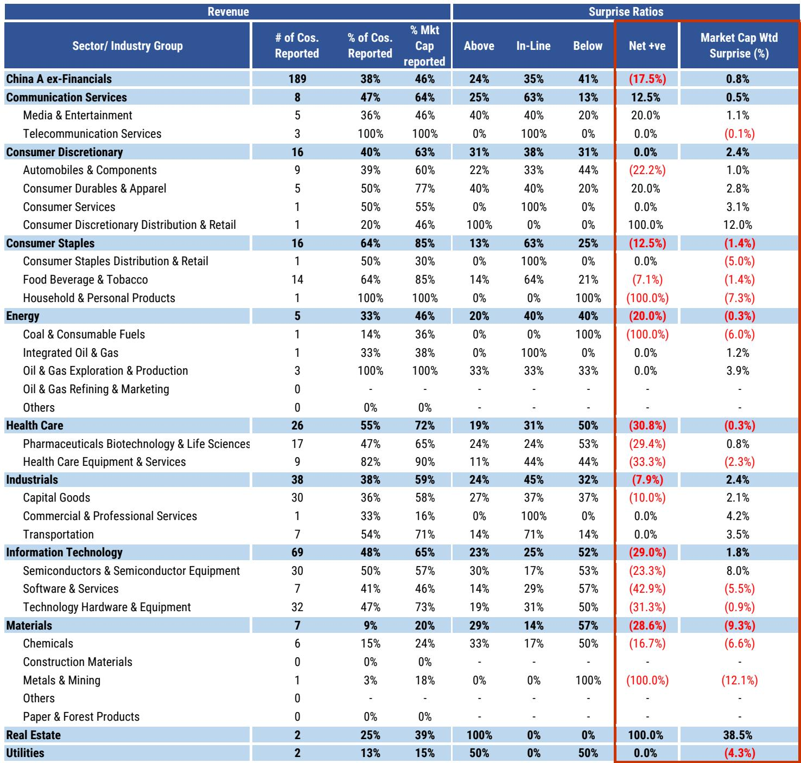
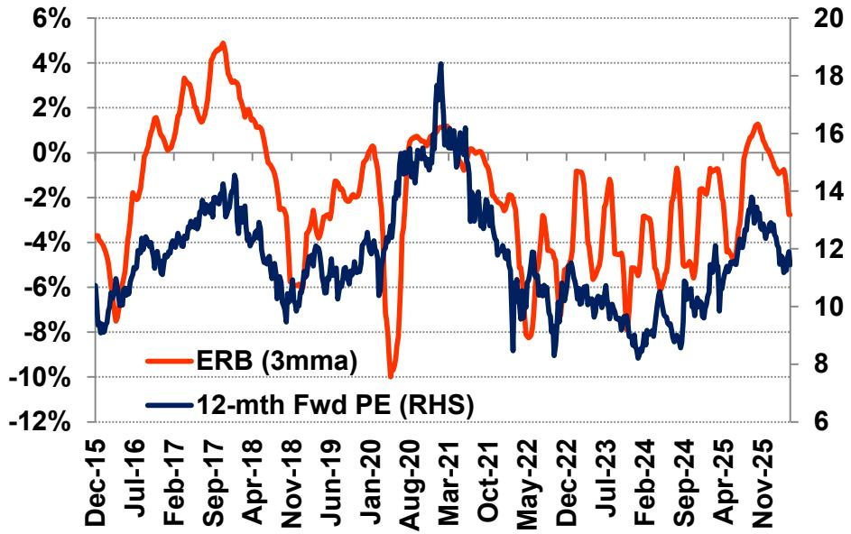

# China A-Share Earnings Are Turning, But the Recovery Is Not Yet Broad-Based

The first-quarter 2026 earnings season for China A-shares has delivered a message that is both encouraging and incomplete. After a punishing fourth quarter of 2025, when nearly a quarter of companies missed consensus estimates, the net miss rate has narrowed sharply to 12.5 percent by company count. More importantly, the weighted earnings surprise turned positive at 0.3 percent, a meaningful swing from the negative 3.4 percent recorded in the prior quarter. This is the kind of improvement that investors have been waiting for, but it would be a strategic error to read this as a green light for broad-based exposure.

The improvement is real, but it is concentrated. Financials and Industrials are driving the recovery, while downstream consumption remains stuck in a cycle of weak demand and limited pricing power. Revenue trends tell a similar story: a net miss of 17.5 percent by company count, with weighted revenue surprise barely positive at 0.8 percent. The headline numbers suggest the worst of the earnings downgrade cycle may be behind us. The sector-level data, however, reveals a market that is healing unevenly, and the implications for portfolio construction are significant.

Why does this matter now? The second quarter of 2026 is unfolding against a backdrop of converging tailwinds: strong export growth, early signs of reflation, and a regulatory tightening on e-commerce competition announced in April that could reshape the profit landscape for consumer-facing companies. The earnings set-up should become more favourable when second-quarter results are published starting in July. But the first-quarter data provides the baseline, and that baseline tells us which parts of the market are genuinely recovering and which are still struggling to find a floor.

This is not a report about whether China A-shares are investable. It is about where the earnings momentum is building, where it is breaking down, and what strategic questions the data leaves unanswered.

## Financials and Industrials Are Leading the Recovery, Not Just by Accident but by Structure

The most striking feature of the first-quarter earnings data is the divergence between sectors that are benefiting from structural tailwinds and those that are still waiting for a demand recovery. Financials recorded a net earnings beat of 12.9 percent by company count, with a weighted surprise of positive 1.3 percent. Within Financials, banks reported in-line results on a weighted basis, but the broader financial services and insurance sub-sectors delivered strong beats. The banking sector is being supported by net interest margin recovery and healthy fee income growth, a combination that suggests the worst of the margin compression cycle may have passed.

Industrials posted a net neutral by company count, which represents a significant improvement from the net miss in the fourth quarter of 2025. More telling is the weighted surprise of positive 1.7 percent. The capital goods sub-sector is the engine here. Demand for AI data centre equipment, battery equipment, and automation and robotics remains robust, driven by a supportive capex cycle that shows no signs of abating. There is also evidence that leading industrial players have sufficient pricing power to pass through higher input costs for raw materials and memory components. This is not a cyclical blip; it reflects China's growing export market share and the structural competitiveness of its industrial base.

The implication is clear: if you want exposure to the earnings recovery in China A-shares, the industrial and financial sectors are where the momentum is building. But this raises a strategic question that the data alone cannot answer.

## Downstream Consumption Is Still Missing on Both Earnings and Revenue, and the Reasons Are Structural

Consumer Discretionary and Consumer Staples both recorded double misses: net negative by company count and negative by weighted surprise. Consumer Discretionary posted a weighted surprise of negative 13.3 percent, one of the worst in the entire index. Consumer Staples were not far behind at negative 8.3 percent. This is not a one-quarter phenomenon. These sectors have been underperforming for multiple quarters, and the first-quarter data confirms that the weakness is persistent.

The problem is not simply weak domestic demand, although that is a factor. It is the combination of weak demand and limited pricing power. Consumer companies cannot pass through cost increases to end customers in an environment where households remain cautious about spending. The result is margin compression that shows up directly in earnings misses. The Automobiles and Components sub-sector, which includes major electric vehicle manufacturers, posted a weighted surprise of negative 22.1 percent, underscoring the intensity of price competition in that market.

The April announcement of e-commerce regulatory tightening could change this dynamic. If the regulatory environment becomes less permissive of aggressive discounting and price wars, the competitive landscape for consumer-facing companies could become more rational. But that is a forward-looking hope, not a current reality. The first-quarter data says that downstream consumption is still in a downturn, and investors who position for a V-shaped recovery in this segment are taking a significant risk.

The strategic question here is whether the regulatory shift is enough to turn around a sector that is also grappling with demographic headwinds and shifting consumer preferences. The first-quarter data does not provide an answer, but it does provide a warning.

## Information Technology Shows a Troubling Pattern That the Weighted Surprise Numbers Mask

Information Technology recorded a net miss of 30.5 percent by company count, one of the worst in the index. Yet the weighted surprise was positive 2.9 percent. This is a classic example of why headline numbers can be misleading. The positive weighted surprise is driven almost entirely by the Semiconductors and Semiconductor Equipment sub-sector, which posted a weighted surprise of positive 24.1 percent. Remove that sub-sector, and the picture darkens significantly.

Software and Services recorded a weighted surprise of negative 18.6 percent. Technology Hardware and Equipment posted negative 7.9 percent. The divergence within Information Technology is extreme. The semiconductor sub-sector is benefiting from the same capex cycle that is driving industrial demand, particularly for AI-related chips and equipment. But the rest of the technology sector is struggling with weak end-market demand and inventory adjustments.

This pattern matters because it suggests that the technology recovery in China is narrow and dependent on a specific set of capex-driven demand drivers. If the capex cycle slows or if global semiconductor demand softens, the positive weighted surprise in Information Technology could reverse quickly. The strategic takeaway is that technology exposure needs to be highly selective, targeting the sub-sectors that are directly tied to industrial and AI-related investment cycles, while avoiding the broader technology segments that are still in a downturn.

## The Report Leaves Unanswered Questions About the Sustainability of the Earnings Improvement

The first-quarter data shows improvement, but it does not tell us whether that improvement is sustainable. Several open questions remain, and they are critical for portfolio strategy.

First, how much of the earnings beat in Financials is driven by one-time factors versus genuine structural improvement? Net interest margin recovery is supporting banks, but loan growth remains moderate, and the quality of fee income growth needs to be examined more closely. If the earnings beat is concentrated in a few large institutions, the sector-level numbers may overstate the breadth of the recovery.

Second, can the industrial sector maintain its pricing power in the face of ongoing foreign exchange headwinds? The report notes that FX headwinds are likely to linger into the second quarter, albeit at a reduced magnitude. If the renminbi strengthens further, export-oriented industrial companies could face margin pressure that offsets their pricing gains.

Third, will the e-commerce regulatory tightening actually translate into improved profitability for consumer companies, or will it simply shift competition to other dimensions? History suggests that regulation can change the form of competition without necessarily reducing its intensity.

These are not questions that the current data can answer. They are the analytical gaps that make the full report valuable. Investors who understand what the data says, and what it does not say, are better positioned to make informed decisions about timing and sector allocation.

## A Decision Framework for Positioning Around the Earnings Turn

The first-quarter earnings data provides a clear framework for portfolio decisions, even if it does not provide all the answers. The framework has three dimensions.

First, prioritise sectors where the earnings improvement is broad-based and structurally supported. Financials and Industrials meet this criterion. Within Industrials, focus on capital goods sub-sectors tied to AI data centre equipment, battery equipment, and automation. Within Financials, focus on banks with demonstrated net interest margin recovery and insurance companies with healthy premium growth.

Second, be highly selective within Information Technology. The semiconductor sub-sector is a legitimate opportunity, but it is important to distinguish between companies that are benefiting from the AI-related capex cycle and those that are exposed to broader technology end-markets that remain weak. The weighted surprise data suggests that the semiconductor opportunity is real, but it is not a reason to buy the entire technology sector.

Third, wait for confirmation before adding exposure to downstream consumption. The regulatory tightening on e-commerce is a positive signal, but it has not yet translated into earnings improvement. The second-quarter results, due in July, will provide the first real test of whether the regulatory environment is changing the profit dynamics for consumer companies. Until then, the risk-reward in Consumer Discretionary and Consumer Staples remains unattractive.

This framework is not about making a single directional bet on China A-shares. It is about recognising that the earnings cycle is turning in specific parts of the market, and that capital should be allocated accordingly. The first-quarter data provides the evidence base for that allocation. The unanswered questions provide the discipline to avoid overconfidence.

Join the community to read the full report and review the original charts that show the sector-level earnings and revenue surprises in detail. The data behind this analysis is worth examining directly, particularly the exhibits that break down the divergence between weighted and unweighted surprises across sectors.

*This article is for learning and discussion only and does not constitute investment advice.*

Personal reading notes and learning share only. Not investment advice.

