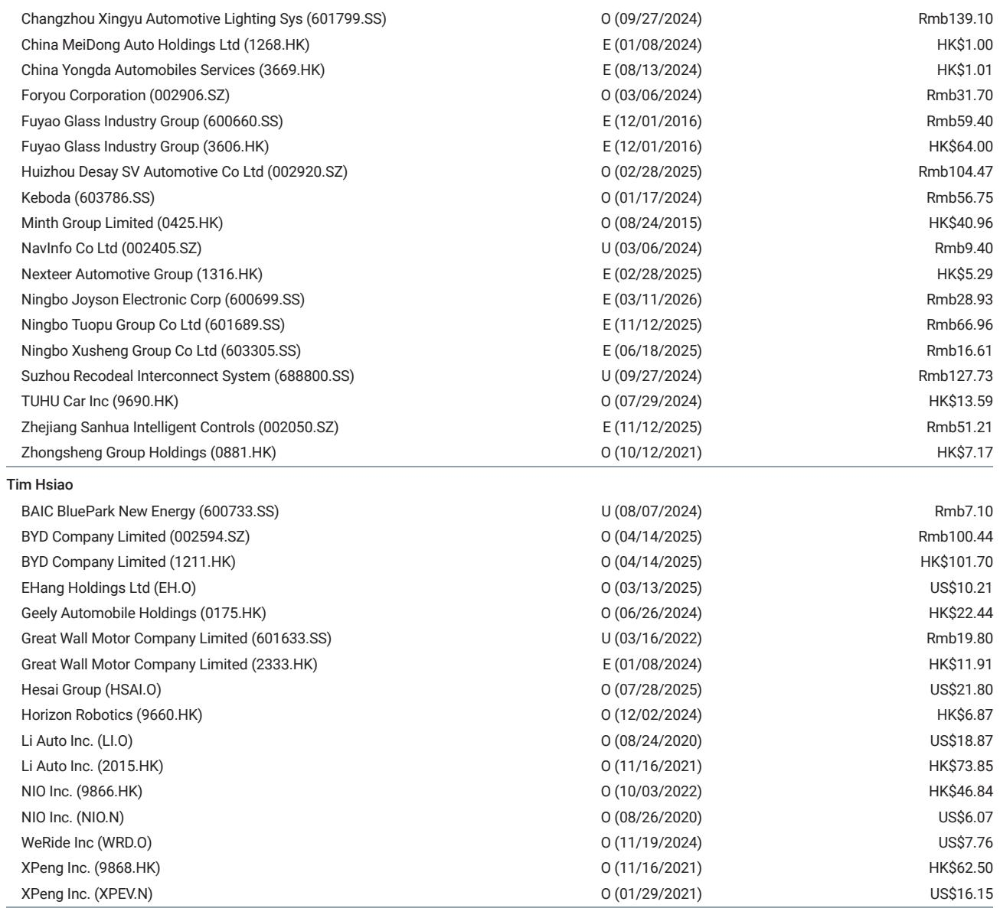
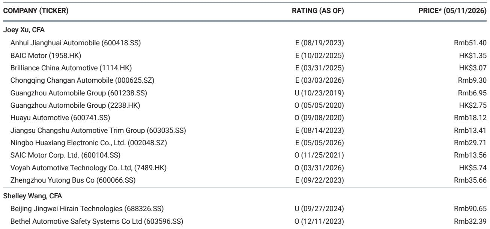
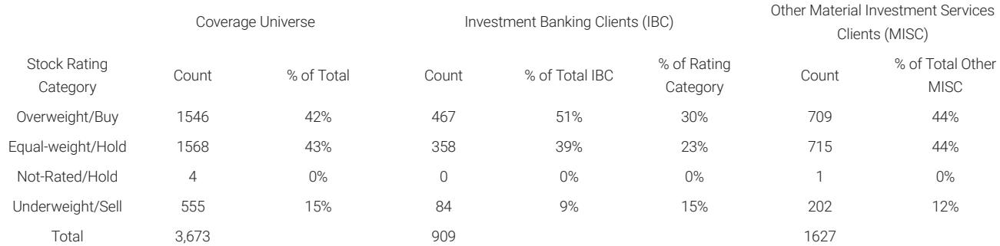

# China’s EV Market Is Not Recovering Uniformly: Model Cycles, Not Demand, Are Now the Only Signal That Matters

The post-holiday plunge in China’s EV weekly orders was widely expected, but the pattern of divergence across automakers tells a story that goes far beyond seasonal weakness. In the week ending May 6, total industry orders fell sharply, yet the dispersion between winners and losers was the widest it has been in months. BYD dropped 27% week-over-week. Geely Galaxy fell 46%. Aito collapsed 51%. Meanwhile, Tesla rose 9%, NIO dropped only 16%, and Li Auto slipped a mere 7%. This is not a demand story. It is a product-cycle story. And it signals that the old ways of reading the Chinese EV market—by aggregate volume, by brand loyalty, by price war intensity—are becoming obsolete.

The conventional narrative holds that China’s EV market is a brutal zero-sum game where price cuts determine winners. That framework is breaking down. What we are observing instead is a market where the timing of new model launches, the specificity of product segments, and the ability to refresh lineups without cannibalizing existing sales are becoming the dominant variables. The post-holiday order data is not noise. It is a clean experiment: remove the holiday distortion, control for seasonal effects, and what remains is a clear read on which companies have momentum and which are living off past glories.

This matters now because the next four to six weeks will be decisive. The remainder of May is packed with flagship SUV launches across nearly every major OEM. The order data from early May is the baseline. The question is not whether demand will recover—it will, seasonally. The question is which companies have the product firepower to convert that seasonal tailwind into sustained market share gains. The report from a global investment bank makes this point explicitly: investor attention will center on the rollout of flagship SUVs throughout the rest of May. But the data already offers a preview of who is positioned to win and who is at risk of being left behind.

The strategic implication is uncomfortable for incumbents. The market is no longer forgiving of weak product cycles. If an automaker does not have a compelling new model entering the market at the right price point with the right features, the order book will show it immediately. There is no grace period. There is no brand loyalty buffer. The data from early May is a warning shot for any company that thinks it can coast on past reputation.

## The Post-Holiday Order Collapse Is Not Uniform, and the Dispersion Reveals Which Companies Have True Product Momentum

The headline numbers look alarming. BYD, the undisputed market leader, saw weekly orders fall to approximately 55.6-56.1k, a 27% decline week-over-week and a 34% drop year-over-year. Geely Galaxy fell 46% week-over-week. Aito, the Huawei-partnered brand that had been on a tear, plunged 51%. Even Xiaomi, which has generated enormous consumer buzz, saw orders drop 44% week-over-week.

But these numbers are misleading if read in isolation. The key insight is not the absolute decline but the relative performance. Tesla’s weekly orders actually rose 9% week-over-week and 33% year-over-year. Li Auto fell only 7%. NIO dropped 16%. Leapmotor, a lower-profile player, fell 23% but still showed a 67% year-over-year gain. The divergence is not random. It maps almost perfectly onto product cycle positioning.

Tesla benefits from having a mature, globally optimized product lineup that does not face the same cannibalization risk from new launches. Li Auto and NIO are in the sweet spot of their model cycles, with new SUV launches that are generating genuine incremental demand rather than simply shifting orders from existing models. Leapmotor is riding a wave of low-cost EV adoption that is still expanding the addressable market. In contrast, BYD’s decline is partly a function of its own success: the company has launched so many new models in rapid succession that the incremental impact of any single launch is diminishing, and the order book is now reflecting a normalization from an unsustainable peak.

The so-what is clear: the days of reading aggregate market share as a proxy for competitive strength are over. The only metric that matters is the slope of the order trajectory for each company’s newest models relative to its legacy lineup. Investors who focus on total volume will miss the signal entirely.

## The SUV Launch Wave in Late May Will Separate Structural Winners from Cyclical Recoveries

The report identifies the rollout of flagship SUVs as the single most important catalyst for the remainder of May. This is not a minor product cycle. It is a concentrated wave of new entries across nearly every price point and technology platform. The competitive landscape is about to become significantly more crowded, and the order data from early May provides the baseline against which the success of these launches will be measured.

For Li Auto, the market expectation is built around the ES9 and, to a lesser extent, the L80. For NIO, the ES9 is similarly central. For XPeng, the focus is on the L03 and L05. For BYD, the slew of new launches has already sparked market discussion about a potential guidance upgrade. The question is whether these new models will expand the total addressable market for each brand or simply cannibalize existing sales.

History suggests that the answer will vary dramatically by company. Li Auto has demonstrated an ability to launch new models that expand its customer base without destroying the order book of its existing lineup. NIO has shown similar discipline, though its premium positioning makes it more vulnerable to macroeconomic headwinds. BYD, by contrast, faces a cannibalization risk that is structural: its product lineup is so broad and its price points so overlapping that every new launch risks stealing share from an existing BYD model. The early May data, which shows BYD orders falling 34% year-over-year, may be the first sign that this cannibalization is accelerating.

The strategic takeaway is that the SUV wave will not lift all boats. It will amplify the divergence we already see in the early May data. Companies with strong model cycle execution will see their order books accelerate. Companies that are launching me-too products into already crowded segments will see their orders stagnate or decline. The market is about to become ruthlessly discriminating.

## Tesla’s Resilience and Li Auto’s Stability Suggest That Incumbency Alone Is No Longer a Moat

The most striking data point in the early May numbers is Tesla’s performance. Weekly orders of 12-12.2k represent a 9% week-over-week increase and a 33% year-over-year gain. This is happening despite Tesla’s relatively mature product lineup and the absence of a major new model launch in China. The resilience is not a mystery. Tesla benefits from a brand strength that is increasingly rare in the Chinese market: consumers trust the product even without constant refreshment.

Li Auto tells a similar story. A 7% week-over-week decline and a 20% month-over-month increase suggest that the company’s order book is remarkably stable for a brand that is in the middle of a product transition. The market is rewarding Li Auto for its disciplined approach to product development and its clear positioning in the family SUV segment.

What these two companies have in common is a product strategy that avoids the trap of over-diversification. They do not try to be everything to everyone. They focus on a clear customer need and execute relentlessly. This is the opposite of the strategy being pursued by many Chinese EV makers, who are flooding the market with multiple models in overlapping segments in the hope that something sticks.

The implication is uncomfortable for the rest of the industry. If Tesla and Li Auto can maintain order stability without constant new model launches, then the competitive advantage is shifting from product quantity to product quality and brand trust. Companies that have been relying on a rapid cadence of new launches to mask underlying weaknesses in their core products will be exposed.

## What the Report Does Not Fully Answer: The Role of Pricing Power and Margin Sustainability in the Coming SUV Wave

The report provides granular order data and identifies the SUV launch wave as the key catalyst, but it leaves several critical questions unanswered. The most important is the relationship between order volume and pricing power. A company can generate high order volumes by cutting prices aggressively, but that strategy is not sustainable if margins are destroyed in the process.

The early May data does not include pricing information. We do not know whether Tesla’s order growth was achieved through price cuts or through genuine demand strength. We do not know whether Li Auto’s stability reflects pricing discipline or a willingness to discount. We do not know whether BYD’s decline is a function of demand saturation or a strategic decision to hold prices.

The second unanswered question is about the quality of orders. Not all orders are equal. A pre-order for a new model that requires a small deposit is very different from a purchase order with a large down payment. The report does not distinguish between these types of orders, and the difference matters enormously for revenue recognition and production planning.

The third question is about the sustainability of the SUV wave itself. The market is about to be flooded with new SUV models from nearly every major OEM. It is entirely possible that the aggregate demand for SUVs in China is not growing fast enough to absorb all of this new supply. If that happens, the SUV wave could become a destructive price war rather than a growth catalyst.

These are not criticisms of the report. They are the natural limits of weekly order data. But they are also the questions that investors should be asking as they evaluate the implications of the data. The order numbers are a leading indicator, but they are not the full picture.

## A Decision Framework for Investors: How to Use Weekly Order Data Without Being Misled

For investors trying to make sense of the weekly order data, the following framework can help separate signal from noise.

First, always normalize for model cycle effects. A company that is launching a new model will naturally see a spike in orders, followed by a decline as the initial wave passes. The key metric is not the absolute order level but the trajectory of orders for the new model relative to the company’s historical baseline. If the new model is generating orders that are significantly above the company’s baseline, the launch is a success. If the new model is simply cannibalizing orders from existing models, the launch is a failure disguised as growth.

Second, compare order trends across companies within the same price segment. The Chinese EV market is not a single market. It is a collection of segments defined by price point, technology platform, and target customer. A company that is winning in the premium segment may be losing in the mass market, and vice versa. Comparing order trends across companies in different segments is meaningless.

Third, look for consistency over multiple weeks. One week of data is noise. Two weeks of data is a pattern. Three weeks of data is a trend. The early May data is useful because it provides a clean read after the holiday distortion, but it should not be over-interpreted. The real test will come in the weeks following the SUV launches.

Fourth, cross-reference order data with production data. Order data is a demand-side indicator. Production data is a supply-side indicator. If orders are rising but production is flat, the company may be capacity-constrained. If orders are falling but production is rising, the company may be building inventory. The relationship between the two tells you more than either metric alone.

Fifth, and most importantly, do not confuse order volume with profitability. A company can generate high order volumes by selling cars at a loss. The weekly order data tells you nothing about margins. Investors who focus exclusively on order volume are setting themselves up for disappointment.

## The Next Four Weeks Will Define the Rest of the Year, and the Data Already Points to Where the Answers Lie

The post-holiday order plunge was predictable. The divergence across companies was not. The fact that Tesla, Li Auto, and NIO held up relatively well while BYD, Geely Galaxy, and Aito collapsed is not a random fluctuation. It is a reflection of underlying product cycle dynamics that will only intensify in the coming weeks.

The SUV launch wave in late May is the most important catalyst for the Chinese EV market this year. It will determine which companies have genuine momentum and which are living on borrowed time. The early May data provides the baseline. The next four weeks will provide the answer.

For investors, the message is clear: stop looking at aggregate market share. Stop assuming that past winners will continue to win. Start paying attention to the specific product cycles, the pricing strategies, and the order trajectories of individual models. The market is no longer forgiving of mistakes. The data is there. The question is whether you are reading it correctly.

Join the community to read the full report and review the original charts.

*This article is for learning and discussion only and does not constitute investment advice.*

Personal reading notes and learning share only. Not investment advice.

