# Energy Majors | Europe

# 1Q26 Wrap: Volatile Near Term; Compelling Medium Term

The earnings season confirmed that the disruption is working through the integrated model: downstream and trading drove beats, while upstream strength should become more visible in 2Q. "Wait-and-see" message on distributions, but these too should grind higher as balance sheets improve.

# Key Takeaways

Earnings beat on elevated expectations, driven primarily by downstream margins and trading/optimisation gains.   
1Q upstream pricing remained muted by contractual lags; stronger realised pricing should support 2Q earnings materially.   
Distribution frameworks remained conservative: companies preferred balance-sheet strengthening over accelerating payouts.   
We remain constructive on the sector as higher-for-longer commodity pricing supports FCF and future shareholder returns.   
Stick to TotalEnergies (Top Pick) as our preferred quality compounder; BP as the higher-leverage play on FCF improvement; Repsol on refining strength.

Exhibit 1: Near-term trading will likely be determined by geopolitical headlines; in the medium term, however, we think the sector continues to offer value   
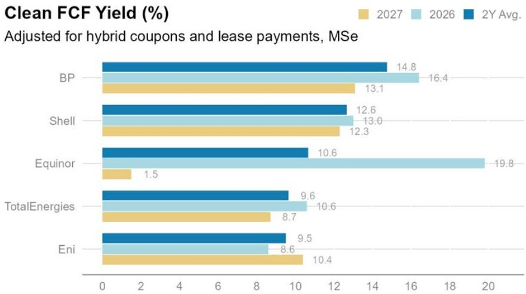

bar

Clean FCF Yield (%)
| Company | 2027 (%) | 2026 (%) | 2Y Avg. (%) |
| :--- | :--- | :--- | :--- |
| BP | 13.1 | 16.4 | 14.8 |
| Shell | 12.3 | 13.0 | 12.6 |
| Equinor | 1.5 | 19.8 | 10.6 |
| TotalEnergies | 8.7 | 10.6 | 9.6 |
| Eni | 10.4 | 8.6 | 9.5 |
Adjusted for hybrid coupons and lease payments, MSe

Source: MS estimates.   
Modelling assumption: Brent avg. \$94/bbl in 2026, real \$80/bbl sUBSequently.

MS & CO. INTERNATIONAL PLC+

# Martijn Rats, CFA

Equity Analyst and Commodities Strategist

Martijn.Rats@morganstanley.com +44 20 7425-6618

# Guilherme Levy

Equity Analyst

Guilherme.Levy@morganstanley.com +44 20 7425-6616

# Alice Bergier Winograd

Equity Analyst

Alice.Winograd@morganstanley.com +44 20 7425-0174

ENERGY 

<table><tr><td colspan="2">EuropeIndustry View</td><td>Attractive</td></tr><tr><td colspan="3">WHAT&#x27;S CHANGED</td></tr><tr><td>Equinor ASA (EQNR.OL)Price Target</td><td>FromNKr 388.00</td><td>ToNKr 376.00</td></tr><tr><td>Shell PLC (SHEL.N)Price Target</td><td>FromUS$95.50</td><td>ToUS$93.00</td></tr><tr><td>Shell PLC (SHEL.L)Price Target</td><td>From3,589p</td><td>To3,495p</td></tr><tr><td>TotalEnergies SE (TTEF.PA)Price Target</td><td>From€88.30</td><td>To€89.10</td></tr><tr><td>TotalEnergies SE (TTE.N)Price Target</td><td>FromUS$102.50</td><td>ToUS$103.30</td></tr></table>

text_image

European Energy

MS does and seeks to do business with companies covered in MS. As a result, investors should be aware that the firm may have a conflict of interest that could affect the objectivity of MS. Investors should consider MS as only a single factor in making their investment decision.

# For analyst certification and other important disclosures, refer to the Disclosure Section, located at the end of this report.

+= Analysts employed by non-U.S. affiliates are not registered with FINRA, may not be associated persons of the member and may not be subject to FINRA restrictions on communications with a subject company, public appearances and trading securities held by a research analyst account.

Exhibit 2: Quarterly net income consensus revisions   
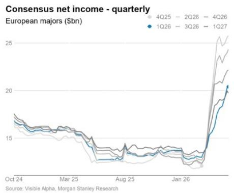

line

| Quarter | 1Q26 | 2Q26 | 3Q26 | 4Q26 | 1Q27 |
|---------|------|------|------|------|------|
| European majors ($bn) | 17.5 | 17.8 | 17.6 | 17.9 | 17.7 |

# Stronger-than-expected 1Q, but the key debate shifts to durability and timing

The European majors entered 1Q26 with expectations already elevated. Consensus earnings had repriced sharply higher into results as commodity prices strengthened, while Energy equities materially outperformed the broader market.

Against that backdrop, the sector still delivered earnings beats.

Contrary to intuition, however, the dominant driver was not upstream prices - instead, most earnings beats came from downstream and trading. That distinction is relevant for how we think about 2Q26 and beyond.

The 1Q26 earnings season signals three things in our view:

- Integrated models continue to monetise disruption through trading and optimisation   
- The full upstream pricing benefit from the stronger commodity environment has not yet flowed through to earnings   
- Management teams remain cautious on distributions despite stronger cash generation, preferring to preserve balance-sheet flexibility

The implication is that 1Q26 likely marks the start of a broader earnings and distributions uplift rather than the peak.

# Earnings beats on top of elevated expectations – driven by downstream and trading

Across the peer group, results generally exceeded expectations despite a significantly higher pre-results bar. The dominant drivers for the earnings beats were downstream and trading.

Downstream, refineries capitalised on the loss of Middle Eastern supply as well as on regional crude and product dislocations. Assets ran exceptionally hard over the quarter, and margins sustained strong levels despite weaker months in January and February – which suggests a strong exit rate out of March into 2Q.

Shell, BP and Eni were the clearest examples of this dynamic.

- BP reported adjusted earnings 20% ahead of consensus, with the beat overwhelmingly driven by Customers & Products, where operating profit exceeded expectations by \~30% due to refining, midstream and exceptional oil trading performance. Its upstream and LNG divisions missed expectations by \~8%.   
- Shell similarly beat consensus by 8% through a combination of strong trading, refining and marketing prints, with Chemicals & Products and Marketing beating expectations by a combined 35%, while Integrated Gas missed by more than 10%.   
- Eni effectively demonstrated the opposite dynamic, reinforcing where the earnings upside actually came from in 1Q. While upstream performed well – production grew 9% Y/Y – the company missed expectations because outages in two major refineries (Ruwais and Sannazzaro) prevented it from capturing the March refining margin rally, combined with weaker LNG/Power results.

Exhibit 3: Downstream results - including refining, crude/products trading, and marketing - accounted for most of the earnings beat in 1Q26, with muted prints elsewhere   
1Q26 Results vs. consensus 

<table><tr><td></td><td>Bottom line</td><td>Upstream</td><td>IG/LNG</td><td>Power</td><td>Downstr.</td></tr><tr><td>Shell</td><td>8%</td><td>1%</td><td>-13%</td><td>-16%</td><td>35%</td></tr><tr><td>BP</td><td>20%</td><td>-6%</td><td>-10%</td><td>NA</td><td>30%</td></tr><tr><td>TotalEnergies</td><td>4%</td><td>3%</td><td>1%</td><td>9%</td><td>16%</td></tr><tr><td>Eni</td><td>-13%</td><td>2%</td><td>-12%</td><td>NA</td><td>-75%</td></tr><tr><td>Equinor</td><td>9%</td><td>8%</td><td>14%</td><td>NA</td><td>NA</td></tr></table>

Source: Company data, MS. Note: segment fit across Upstream, IG/LNG, Power, Downstream is indicative; specific company disclosures may not fit exactly across either vertical.

The globally and vertically integrated model proved highly effective in monetising disruption. However, this also raises the key question for the next few quarters: how repeatable are current trading gains?

Our estimate is that trading and optimisation likely contributed some \$3bn in incremental Q/Q earnings in the first quarter – or several hundred million dollars each of Shell, BP and TotalEnergies – particularly across oil and refined products. That would make the strong trading print responsible for nearly half of the earnings growth across the three names, compared to the previous quarter.

That contribution is unlikely to disappear in 2Q, but sustaining 1Q run-rates may well be challenging.

In other words, the sector likely remains structurally supported by disruption – but the composition of earnings should, at the margin, rotate back toward upstream pricing leverage, even if refining continues to do well.

Exhibit 4: On our estimates, crude/products trading may have contributed around \$3bn in incremental quarter-on-quarter earnings   
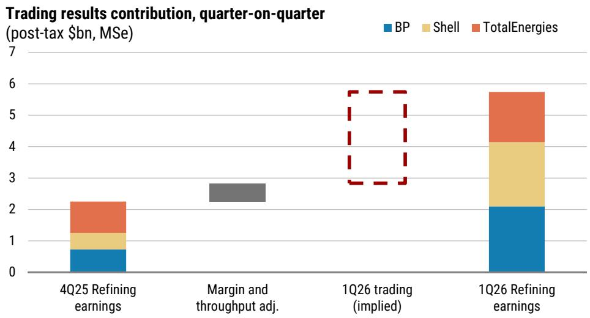

bar_stacked

Trading results contribution, quarter-on-quarter (post-tax $bn, MSe)
| Category | BP ($bn) | Shell ($bn) | TotalEnergies ($bn) |
| :--- | :--- | :--- | :--- |
| 4Q25 Refining earnings | 0.7 | 0.6 | 1.0 |
| Margin and throughput adj. | 0.0 | 0.0 | 2.7 |
| 1Q26 trading (implied) | 0.0 | 0.0 | 5.8 |
| 1Q26 Refining earnings | 2.1 | 2.3 | 1.9 |

Source: Company data, MS estimates. Note: we take 1Q26 implied trading results as the difference between 1Q26 refining earnings and a price-normalised, volume-normalised 4Q25 refining earnings.

# Production and pricing impacts shift into 2Q – with pricing still dominating the net effect

At first glance, output in 1Q26 appeared surprisingly resilient. Oil and gas production across the majors was broadly flat quarter-on-quarter despite material portfolio exposure to the Middle East Gulf. This resilience reflected two offsetting mechanisms:

• disruption effects were felt for only one-third of the quarter   
- organic portfolio growth across the group offset part of the disruption

The picture should change in 2Q.

On aggregate, we estimate the majors to have $\sim 10\%$ aggregate production exposure to Middle East shut-ins in 2Q; with low- to mid-single-digit underlying annual organic growth, the net effect is likely to be a $\sim 5\%$ production decline compared to the same quarter of last year.

Indeed, companies are now broadly guiding for lower production quarter-on-quarter as disruption impacts become more fully reflected, and maintenance activity increases.

- TotalEnergies indicated that current shut-ins in Qatar, Iraq and UAE offshore represent around 15% of total production exposure.   
- BP guided to lower reported upstream production in 2026 due to Gulf of America maintenance and Middle East disruption effects.   
- Equinor is expected to see lower production in 2Q despite effectively no Middle East exposure, primarily due to turnaround activity

However, we maintain that the more important variable here remains pricing. The commodity backdrop strengthened materially through the quarter, but the realised benefit in 1Q earnings was still relatively muted.

This reflects contractual pricing lags, weaker January-February pricing, and potentially realised discounts versus spot benchmarks.

As a result, realised pricing across the group lagged the move in spot commodities by roughly \$5/bbl across the peer group. The stronger commodity environment should therefore become much more visible in 2Q realised earnings.

At the commodity level, our estimates imply roughly $\sim 40\%$ quarter-on-quarter improvement in realised upstream pricing assumptions entering 2Q26 versus 1Q26.

The key uncertainty is whether realised prices continue to trade at wider-than-normal discounts to benchmarks due to timing lags, regional pricing distortions or transportation/logistics costs, for instance.

Even so, the broader conclusion remains unchanged: production losses are localised and operationally visible. Pricing benefits are global and apply across entire portfolios. On balance, this asymmetry remains structurally positive for sector earnings.

Exhibit 5: 2Q26 is where a stronger commodity backdrop should really shine through in the earnings of the European majors   
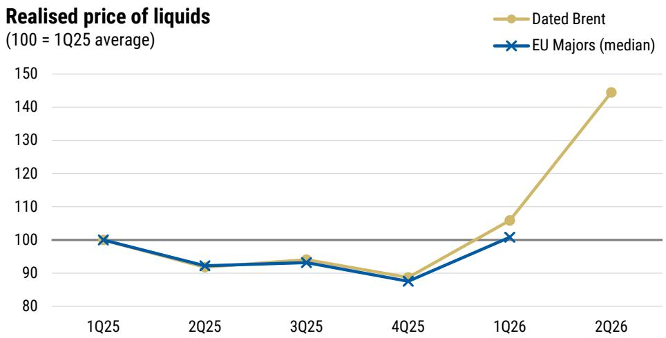

line

| Quarter | Dated Brent | EU Majors (median) |
| ------- | ----------- | ------------------ |
| 1Q25    | 100         | 100                |
| 2Q25    | 92          | 92                 |
| 3Q25    | 94          | 93                 |
| 4Q25    | 88          | 87                 |
| 1Q26    | 106         | 100                |
| 2Q26    | 145         | -                  |

Source: Company data, MS estimates

# Conservative distributions despite materially improved cash generation

The strongest message out of this earnings season was, in our view, a remarkably conservative stance on capital allocation.

The majors' existing capital frameworks were set ahead of a significantly weaker commodity outlook, with the sector preparing for a period of large oil and gas surpluses: capex budgets were tightened, distributions were rebased, and divestment and cost savings programmes became the norm.

Now, despite a higher earnings run-rate and a stronger commodity outlook, companies did not alter frameworks beyond what already existed.

Where flexibility was already embedded in frameworks, they moved toward the higher end of existing ranges:

- TotalEnergies maintained buybacks at the top-end of the range (\$1.5bn/qtr) while reiterating payout discipline   
- Eni raised 2026 buybacks guidance to €2.8bn, effectively increasing its planning scenario to \$80/bbl oil prices and €50/MWh TTF.

But, importantly, neither company moved beyond their pre-existing distribution frameworks.

Elsewhere, distributions were unchanged – or even lowered:

- BP reiterated its buyback pause and prioritised accelerated de-leveraging   
- Equinor maintained its buyback and dividend unchanged, flagging that changes ought to be made on "money already earned" as opposed to stronger forecasts   
- Shell notably increased its dividend by a surprise +5% Q/Q, but reduced its buyback to \$3.0bn/qtr, effectively trimming annual distributions paid by \~\$1.5bn

The message from management teams was very consistent: companies remain cautious about over-distributing into a highly volatile commodity environment.

In practice, the sector is taking a deliberate wait-and-see approach, and management teams appear comfortable allowing additional cash to accumulate on balance sheets in the near term.

However, increases in distributions are a question of "when", not "if", in our view. In a higher-for-longer commodity price environment, current dividend and buyback run-rates might be simply insufficient to meet existing policy floors at \~35-40% of CFFO returned to shareholders.

In our commodity strip (Exhibit 6), we expect CFFO payout policies to be cleared at around \$4bn for Shell, \$2bn for TotalEnergies and €775mn for Eni (without accounting for a potential special dividend). This would mark a \~30% increase from current run-rates, likely to come before the end of the year.

While Equinor and BP don't have such explicit mechanisms, an increase in returns in the peer group would likely cause them to follow, as they sit on an improved balance sheet and struggle to remain competitive on distributions.

In summary, despite the conservative message out of 1Q26, our expectation for a step-up in buybacks remains unchanged. As the situation remains volatile, management teams have chosen to build balance sheet dry powder – at some point, however, this is likely to translate into higher distributions capacity.

Exhibit 6: In the below exercise, we estimate implied quarterly buybacks under a range of CFFO payouts (Brent at \$85/bbl)   
Indicative quarterly buyback range (MSe, USDmn except for Eni in EURmn)   
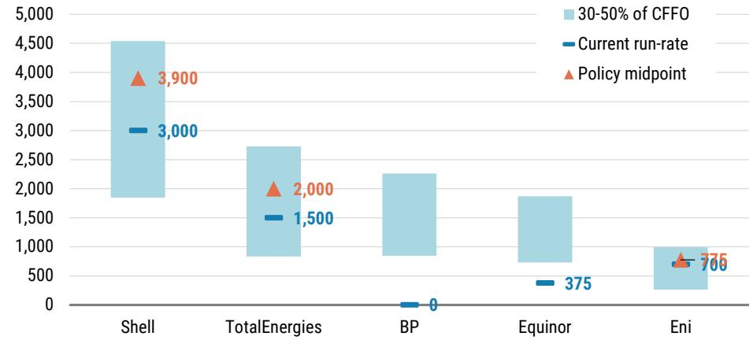

bar

| Company       | 30-50% of CFFO | Current run-rate | Policy midpoint |
| ------------- | -------------- | ---------------- | --------------- |
| Shell         | 4,500          | 3,000            | 3,900           |
| TotalEnergies | 2,750          | 1,500            | 2,000           |
| BP            | 2,250          | 0                | -               |
| Equinor       | 1,850          | 375              | -               |
| Eni           | 950            | 700              | 775             |

Source: Company data, MS estimates. Note: average commodity prices Brent \$85/bbl, European gas \$20/mmbtu, refining margin \$12/bbl.

# Unstable Near Term, Compelling Medium Term: Sector View Remains 'Attractive'

Near term, the Energy sector is likely to remain volatile. Oil prices and share prices remain closely tied to developments in the Middle East, and the path of the conflict remains difficult to forecast. However, the market is not the same one it was before the disruption started.

Even under a further de-escalation scenario, we do not think investors can simply return to treating disruption through the Strait of Hormuz as a remote tail risk. Flows remain severely curtailed, inventories have drawn, freight and product markets have repriced, and the market now needs to assign a more persistent risk premium to the new order around the Strait.

Exhibit 7: Flows through the Strait of Hormuz continue on a halt ...   
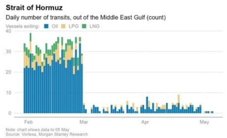

bar_stacked

Strait of Hormuz
| Month | Vessels exiting: Oil | Vessels exiting: LPG | Vessels exiting: LNG |
|---|---|---|---|
| Feb | 22 | 6 | 10 |
| Mar | 35 | 8 | 10 |
| Apr | 9 | 4 | 0 |
| May | 2 | 1 | 0 |

Exhibit 8: ... and draws to global inventories are already quite visible   
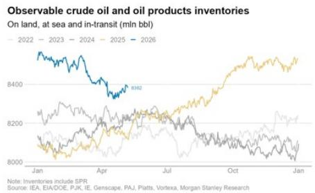

line

| Date | 2022 | 2023 | 2024 | 2025 | 2026 |
|------|------|------|------|------|------|
| Jan  | ~8100 | ~8150 | ~8120 | ~8130 | ~8392 |
| Apr  | ~8150 | ~8180 | ~8160 | ~8170 | ~8350 |
| Jul  | ~8120 | ~8160 | ~8140 | ~8150 | ~8330 |
| Oct  | ~8100 | ~8140 | ~8120 | ~8130 | ~8310 |
| Jan  | ~8080 | ~8120 | ~8100 | ~8110 | ~8300 |

That matters for the commodity framework. In oil, we continue to see \$80/bbl as a conservative long-term anchor rather than an aggressive assumption for the coming years. It is close to the most frequently observed real Brent price over the last two decades and remains well below the higher-price regimes associated with demand destruction.

At the same time, perceptions of the level of globally accessible spare capacity have likely shifted lower, strategic stockpiling demand should become an additional source of demand over time, and secure non-Hormuz barrels should command a greater premium. This supports our view that the current backdrop should drive a structural repricing of oil-market risk, not just a cyclical price spike.

Exhibit 9: In our models we assume \$80/bbl from 2027, which strikes us a conservative assumption   
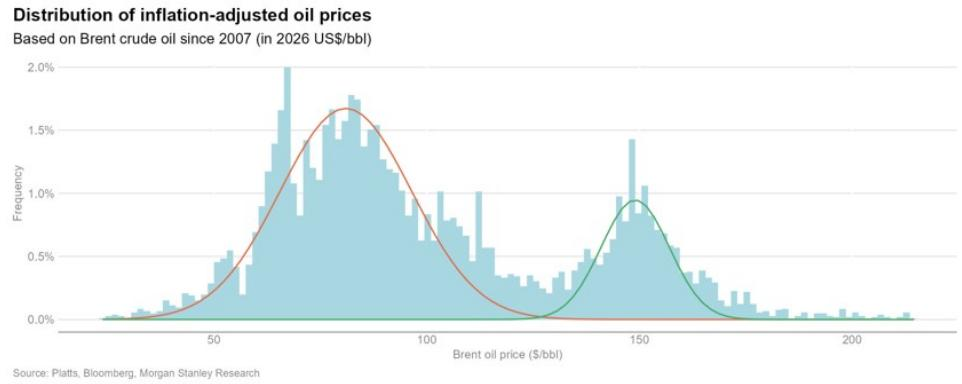

histogram

| Brent oil price ($/bbl) | Frequency |
| ----------------------- | --------- |
| 50                      | 0.0%      |
| 75                      | 2.0%      |
| 100                     | 1.0%      |
| 125                     | 0.5%      |
| 150                     | 1.5%      |
| 175                     | 0.5%      |
| 200                     | 0.0%      |

We also have a constructive view on natural gas. As we argued in Calm on the Surface, storage refill is already lagging and Europe likely needs to price more aggressively into 3Q26 to attract LNG and rebuild inventories. We therefore see further upside risk to both European and global gas prices through year-end, with our forecasts above the forward curve for summer and winter 2026/27.

Exhibit 10: Consensus has not yet fully adjusted to a higher-for-longer oil price on equity models

For equities, the near term will probably remain unsettled, but the medium-term setup is attractive: at \$80+/bbl, the sector works. Cash flow generation remains strong, balance sheets continue to improve, and distribution capacity is still not fully reflected in

Consensus oil price assumptions in equity models   
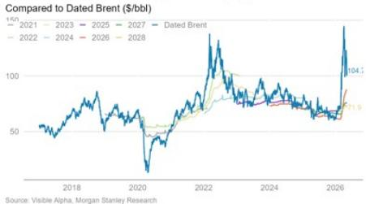

line

| Year | Dated Brent ($/bbl) |
|------|----------------------|
| 2026 | 104.7                |

consensus.

On earnings estimates, we are currently \~10% above consensus compiled by Visible Alpha for 2026, whereas historically we have typically been 5-10% below consensus on the European Energy majors. That represents a meaningful shift in the earnings setup, and we think consensus remains slow to fully reflect the higher commodity price framework.

We also see scope for further upside to consensus buyback forecasts over the coming quarters. The Street has already moved higher, but in our view it still underestimates how excess cash can translate into upgraded shareholder distributions.

Finally, valuation also remains supportive. Relative to the wider market, the sector's FCF yield remains above its historical average, suggesting that the equity market is still not fully pricing the improved cash flow outlook

Exhibit 11: We see room for further upward revisions to buyback forecasts from consensus ...   
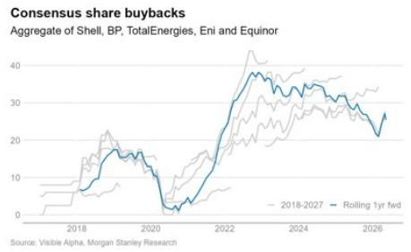

line

| Year | 2018-2027 | Rolling 1yr fwd |
|------|-----------|-----------------|
| 2018 | ~5        | ~5              |
| 2019 | ~15       | ~15             |
| 2020 | ~5        | ~5              |
| 2021 | ~10       | ~10             |
| 2022 | ~35       | ~35             |
| 2023 | ~40       | ~40             |
| 2024 | ~35       | ~35             |
| 2025 | ~30       | ~30             |
| 2026 | ~25       | ~25             |

Exhibit 12: ... which should provide upside to current distribution yields   
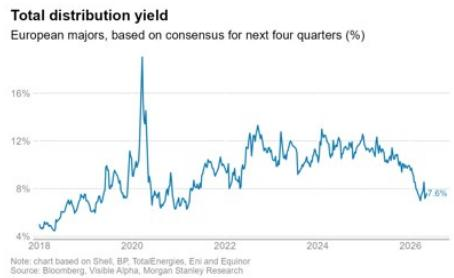

line

| Year | Total distribution yield |
| ---- | ------------------------ |
| 2026 | 7.6%                     |

Exhibit 13: The sector's FCF yield prospects have improved ...   
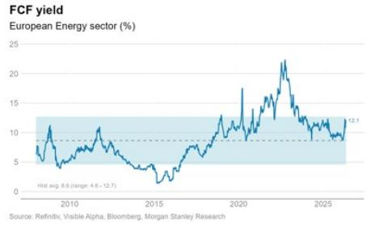

line

| Year | FCF Yield (%) |
|------|---------------|
| 2025 | 12.1          |

Exhibit 14: ... and it is now trading at a discount to the market that is above historical levels   
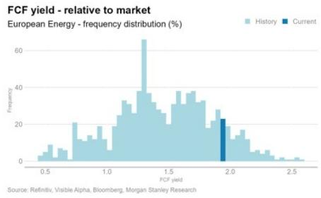

histogram

| FCF yield | History Frequency (%) | Current Frequency (%) |
| --------- | --------------------- | --------------------- |
| 0.5       | 5                     | 0                     |
| 0.6       | 10                    | 0                     |
| 0.7       | 15                    | 0                     |
| 0.8       | 20                    | 0                     |
| 0.9       | 25                    | 0                     |
| 1.0       | 30                    | 0                     |
| 1.1       | 35                    | 0                     |
| 1.2       | 40                    | 0                     |
| 1.3       | 45                    | 0                     |
| 1.4       | 50                    | 0                     |
| 1.5       | 45                    | 0                     |
| 1.6       | 40                    | 0                     |
| 1.7       | 35                    | 0                     |
| 1.8       | 30                    | 0                     |
| 1.9       | 25                    | 20                    |
| 2.0       | 20                    | 25                    |
| 2.1       | 15                    | 0                     |
| 2.2       | 10                    | 0                     |
| 2.3       | 5                     | 0                     |
| 2.4       | 2                     | 0                     |
| 2.5       | 1                     | 0                     |

This leaves European Energy in a different investment phase. The sector can compound through a combination of resilient free cash flow, balance sheet repair and rising shareholder distributions, while still offering a hedge against persistent macro and geopolitical disruption. That combination is not fully priced, in our view. We therefore maintain our Attractive sector view for the European Energy Majors.

On a stock level, our preferences also remain unchanged for the time, and we like TotalEnergies, BP and Repsol to play the sector:

TotalEnergies (Overweight, Top Pick): TotalEnergies remains our preferred quality compounder in the sector. Its oil and gas portfolio provides sector-leading growth while its

Integrated Power adds a differentiated FCF growth leg in the medium term. Price-conditioned distributions and ongoing capital discipline give the company flexibility through the cycle, making the investment case less dependent on a single commodity outcome.

BP (Overweight): BP offers the highest torque to the stronger commodity backdrop among the European majors, with oil, gas and refining upside feeding directly into de-gearing capacity and the potential recovery of distributions over time. The investment case is also helped by a self-help agenda that is becoming more tangible with strong operational performance. On our numbers, the shares screen particularly compelling with FCF yield of \~13% (post-leases and hybrids) in an oil scenario of \$80/bbl, driving valuation support alongside the macro leverage.

Repsol (Overweight): After a hiccup in early April, refining margins have recovered in Europe in recent weeks, and we expect Repsol to be nimble to monetise that opportunity at its diesel-leveraged plants. Supported by that, we see the stock trading at a discount to peers at $>16\%$ clean FCF yield this year, which should allow it to raise the pace of share buybacks over the coming quarters.

Macro-political developments leading to the potential implementation of windfall taxes are key to follow in this case. However, if history is any guide, we do not currently expect a potential taxation increase to affect the company's ability to remunerate shareholders (see Exploring the Impact of Potential Windfall Taxes), and therefore remain Overweight.

Shell (Equal-weight): Shell is a defensive business, supported by balance sheet strength and a broad earnings mix. However, those attributes are less differentiated in a stronger commodity tape, where higher-beta peers offer greater upside capture. The potential acquisition of ARC helps address a growth shortfall to peers, but, after incorporating producing assets, Shell's forward-looking annual growth of \~1% remains less compelling than that of TotalEnergies or Eni.

Equinor (Equal-weight): Equinor has clear upside to tighter oil and gas markets, given its high sensitivity to European gas prices and its relatively low exposure to Middle East asset disruption. On the other hand, beyond the short-term disruption, the medium-term equity story still leaves open questions around capital allocation – specifically, how the company will be able to diversify away from a declining Norwegian Continental Shelf. With those opportunities and risks broadly balanced, the shares look more fairly positioned after the recent re-rating.

Eni (Equal-weight): Eni offers high production growth, high commodity beta and a clear strategic framework through its satellite model. The stronger commodity backdrop supports cash generation and buybacks, while recent execution has reinforced confidence in the growth story. However, the valuation already reflects much of that progress, leaving the shares less attractive than other high-beta or quality-compounding opportunities in the sector.

Galp (Equal-weight): We continue to like Galp's long-term value proposition with a high-quality portfolio of oil & gas fields in Brazil and Namibia, and think the potential combination of downstream assets with Moeve could drive interest from the market to the shares (for more details on the ongoing discussions see What We Know About the Galp/Moeve Downstream Combination). However, for the time being, we continue to find

Galp's story too defensive relative to other opportunities in our sector (such as Repsol), and hence remain on the sidelines.

Exhibit 15: European Majors: Comps sheet 

<table><tr><td rowspan="2">Company</td><td rowspan="2">MS Rating</td><td rowspan="2">Ccy</td><td rowspan="2">Last Close</td><td rowspan="2">Price Target</td><td rowspan="2">Upside %</td><td colspan="2">FCF Yield (%)</td><td colspan="2">Total DY (%)</td><td colspan="2">Buyback yield (%)</td><td colspan="2">Total yield (%)</td></tr><tr><td>26E</td><td>27E</td><td>26E</td><td>27E</td><td>26E</td><td>27E</td><td>26E</td><td>27E</td></tr><tr><td>BP</td><td>O</td><td>GBp</td><td>536</td><td>619</td><td>16%</td><td>16.3%</td><td>13.4%</td><td>4.7%</td><td>4.8%</td><td>0.5%</td><td>3.6%</td><td>5.2%</td><td>8.5%</td></tr><tr><td>Eni</td><td>E</td><td>EUR</td><td>22.8</td><td>25.3</td><td>11%</td><td>8.7%</td><td>10.5%</td><td>6.4%</td><td>5.1%</td><td>3.7%</td><td>4.3%</td><td>10.0%</td><td>9.4%</td></tr><tr><td>Equinor</td><td>E</td><td>NOK</td><td>338</td><td>376</td><td>11%</td><td>19.8%</td><td>1.5%</td><td>4.3%</td><td>4.5%</td><td>3.6%</td><td>2.0%</td><td>7.9%</td><td>6.5%</td></tr><tr><td>Shell</td><td>E</td><td>GBp</td><td>3,103</td><td>3,495</td><td>13%</td><td>13.1%</td><td>12.6%</td><td>3.6%</td><td>3.8%</td><td>5.9%</td><td>7.2%</td><td>9.5%</td><td>11.0%</td></tr><tr><td>TotalEnergies</td><td>O</td><td>EUR</td><td>75.8</td><td>89.1</td><td>18%</td><td>10.6%</td><td>8.7%</td><td>4.7%</td><td>4.9%</td><td>3.2%</td><td>3.4%</td><td>7.9%</td><td>8.3%</td></tr><tr><td>Repsol</td><td>O</td><td>EUR</td><td>22.1</td><td>28.0</td><td>27%</td><td>16.4%</td><td>8.9%</td><td>5.2%</td><td>5.7%</td><td>4.3%</td><td>7.3%</td><td>9.5%</td><td>13.0%</td></tr><tr><td>Galp</td><td>E</td><td>EUR</td><td>19.1</td><td>24.0</td><td>26%</td><td>9.9%</td><td>7.8%</td><td>3.8%</td><td>4.3%</td><td>1.8%</td><td>3.3%</td><td>5.6%</td><td>7.5%</td></tr><tr><td>Median Integrated Majors</td><td></td><td></td><td></td><td></td><td></td><td>13.1%</td><td>8.9%</td><td>4.7%</td><td>4.8%</td><td>3.6%</td><td>3.6%</td><td>7.9%</td><td>8.5%</td></tr></table>

Source: FactSet, MS estimates. Note: FCF adjusted hybrid coupons and lease payments. Buybacks are on a paid basis.

# Housekeeping

# We update our forecasts to reflect macro developments, 1Q26 actuals and new guidance for FY26 and beyond.

Our EPS changes are primarily driven by 1Q26 actuals, new 2Q26 / FY26 guidance, and updated commodity estimates in line with April-May/26 actuals and our latest house views (see latest Oil Manual, European Gas Manual).

We adjust price targets for TotalEnergies and Shell to reflect changes in DPS and we adjust Equinor's price target to reflect USDNOK movements (see Risk Reward section for valuation methodologies). We adjust our bull and bear cases commensurately with our price targets.

Ratings remain unchanged.

Exhibit 16: 

<table><tr><td colspan="3">EPS</td><td colspan="2">New</td><td colspan="2">Old</td><td colspan="2">Change</td></tr><tr><td>Company</td><td>Ticker</td><td>Ccy</td><td>2026</td><td>2027</td><td>2026</td><td>2027</td><td>2026</td><td>2027</td></tr><tr><td rowspan="2">Shell</td><td>SHEL.L</td><td>GBp</td><td>6.17</td><td>5.26</td><td>6.24</td><td>5.08</td><td>(1%)</td><td>4%</td></tr><tr><td>SHEL.N</td><td>USD</td><td>12.35</td><td>10.51</td><td>12.48</td><td>10.16</td><td>(1%)</td><td>4%</td></tr><tr><td rowspan="2">BP</td><td>BP.L</td><td>GBP</td><td>1.14</td><td>0.89</td><td>1.10</td><td>0.89</td><td>3%</td><td>(0%)</td></tr><tr><td>BP.N</td><td>USD</td><td>6.82</td><td>5.35</td><td>6.62</td><td>5.36</td><td>3%</td><td>(0%)</td></tr><tr><td rowspan="2">TotalEnergies</td><td>TTEF.PA</td><td>EUR</td><td>12.23</td><td>10.08</td><td>12.29</td><td>10.06</td><td>(0%)</td><td>0%</td></tr><tr><td>TTE.N</td><td>USD</td><td>12.23</td><td>10.08</td><td>12.29</td><td>10.06</td><td>(0%)</td><td>0%</td></tr><tr><td rowspan="2">Eni</td><td>ENI.MI</td><td>EUR</td><td>2.92</td><td>2.37</td><td>2.98</td><td>2.34</td><td>(2%)</td><td>2%</td></tr><tr><td>E.N</td><td>USD</td><td>5.85</td><td>4.75</td><td>5.96</td><td>4.67</td><td>(2%)</td><td>2%</td></tr><tr><td rowspan="2">Equinor</td><td>EQNR.OL</td><td>NOK</td><td>5.65</td><td>4.12</td><td>5.82</td><td>4.09</td><td>(3%)</td><td>1%</td></tr><tr><td>EQNR.N</td><td>USD</td><td>5.65</td><td>4.12</td><td>5.82</td><td>4.09</td><td>(3%)</td><td>1%</td></tr><tr><td>Aramco</td><td>2222.SE</td><td>SAR</td><td>2.09</td><td>1.87</td><td>2.08</td><td>1.87</td><td>0%</td><td>0%</td></tr></table>

Source: Visible Alpha consensus, MS estimates.

Exhibit 17: 

<table><tr><td rowspan="2">Company</td><td rowspan="2">Ticker</td><td rowspan="2">Ccy</td><td rowspan="2">Rating</td><td colspan="2">PT</td><td colspan="2">%</td></tr><tr><td>New</td><td>Old</td><td>Change</td><td>Upside</td></tr><tr><td rowspan="2">Shell</td><td>SHEL.L</td><td>GBp</td><td>EW</td><td>3,495</td><td>3,589</td><td>(3%)</td><td>13%</td></tr><tr><td>SHEL.N</td><td>USD</td><td>EW</td><td>93.0</td><td>95.5</td><td>(3%)</td><td>11%</td></tr><tr><td rowspan="2">BP</td><td>BP.L</td><td>GBp</td><td>OW</td><td>619</td><td>619</td><td>-</td><td>16%</td></tr><tr><td>BP.N</td><td>USD</td><td>OW</td><td>49.4</td><td>49.4</td><td>-</td><td>14%</td></tr><tr><td rowspan="2">TotalEnergies</td><td>TTEF.PA</td><td>EUR</td><td>OW*</td><td>89.1</td><td>88.3</td><td>1%</td><td>18%</td></tr><tr><td>TTE.N</td><td>USD</td><td>OW*</td><td>103.30</td><td>102.5</td><td>1%</td><td>17%</td></tr><tr><td rowspan="2">Eni</td><td>ENI.MI</td><td>EUR</td><td>EW</td><td>25.3</td><td>25.3</td><td>-</td><td>11%</td></tr><tr><td>E.N</td><td>USD</td><td>EW</td><td>58.8</td><td>58.8</td><td>-</td><td>10%</td></tr><tr><td rowspan="2">Equinor</td><td>EQNR.OL</td><td>NOK</td><td>EW</td><td>376</td><td>388</td><td>(3%)</td><td>11%</td></tr><tr><td>EQNR.N</td><td>USD</td><td>EW</td><td>40.4</td><td>40.4</td><td>-</td><td>10%</td></tr><tr><td>Aramco</td><td>2222.SE</td><td>SAR</td><td>EW</td><td>28.4</td><td>28.4</td><td>-</td><td>3%</td></tr></table>

\*Top Pick. Source: MS estimates.

Exhibit 18:   
Summary of difference to consensus 

<table><tr><td colspan="2">Adj. net income (bn)</td><td colspan="2">MSe</td><td colspan="2">Consensus</td><td colspan="2">MS vs Cons.</td></tr><tr><td>Company</td><td>Ccy</td><td>2026</td><td>2027</td><td>2026</td><td>2027</td><td>2026</td><td>2027</td></tr><tr><td>Shell</td><td>USD</td><td>35.2</td><td>28.1</td><td>31.0</td><td>25.9</td><td>13%</td><td>8%</td></tr><tr><td>BP</td><td>USD</td><td>17.6</td><td>13.3</td><td>13.9</td><td>10.7</td><td>27%</td><td>25%</td></tr><tr><td>TotalEnergies</td><td>USD</td><td>27.0</td><td>21.7</td><td>25.1</td><td>21.1</td><td>7%</td><td>2%</td></tr><tr><td>Eni</td><td>EUR</td><td>8.7</td><td>6.7</td><td>7.7</td><td>6.6</td><td>13%</td><td>1%</td></tr><tr><td>Equinor</td><td>USD</td><td>13.8</td><td>9.8</td><td>12.3</td><td>9.3</td><td>12%</td><td>6%</td></tr><tr><td>Aramco</td><td>USD</td><td>135</td><td>120</td><td>127</td><td>124</td><td>6%</td><td>(3%)</td></tr></table>

Source: Visible Alpha, MS estimates

# Europe's Energy Majors in Charts

Exhibit 19:   
Operating Cash Flow   
By quarter, including forecast (\$bn)   
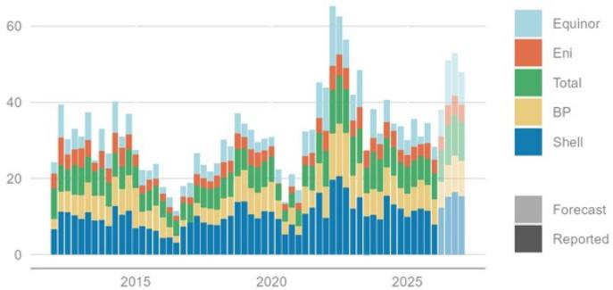

bar_stacked

| Year | Shell | BP | Total | Eni | Equinor |
|---|---|---|---|---|---|
| 2014 | 8 | 7 | 10 | 6 | 13 |
| 2015 | 9 | 7 | 11 | 7 | 13 |
| 2016 | 6 | 6 | 8 | 5 | 10 |
| 2017 | 9 | 7 | 10 | 6 | 13 |
| 2018 | 10 | 7 | 12 | 7 | 13 |
| 2019 | 11 | 8 | 13 | 8 | 13 |
| 2020 | 10 | 7 | 12 | 7 | 13 |
| 2021 | 10 | 7 | 12 | 7 | 13 |
| 2022 | 18 | 14 | 24 | 10 | 25 |
| 2023 | 18 | 14 | 24 | 10 | 25 |
| 2024 | 15 | 13 | 19 | 9 | 23 |
| 2025 | 13 | 12 | 16 | 9 | 23 |
| 2026E | 15 | 13 | 20 | 10 | 25 |
The chart displays a stacked bar chart representing the total values for each year from 2014 to 2026E. The legend indicates that 'Forecast' and 'Reported' are estimated based on the data. The Y-axis represents the total value, and the X-axis represents the year. The chart is saved as a PNG file named 'box_plot.png'.

Source: Company data, MS estimates

Exhibit 20:   
Free Cash Flow   
By quarter, including forecast (\$bn)   
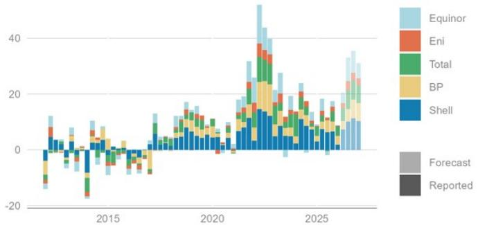

bar_stacked

| Year | Total | BP | Shell | Total | Eni | Equinor | Forecast | Reported |
|---|---|---|---|---|---|---|---|---|
| 2014 | -10 | 0 | 0 | -5 | 0 | 10 | 0 | 0 |
| 2015 | -15 | 0 | 0 | -10 | 0 | 8 | 0 | 0 |
| 2016 | -5 | 0 | 0 | -3 | 0 | 5 | 0 | 0 |
| 2017 | 0 | 0 | 0 | 5 | 0 | 12 | 0 | 0 |
| 2018 | 5 | 0 | 0 | 10 | 0 | 15 | 0 | 0 |
| 2019 | 10 | 0 | 0 | 15 | 0 | 18 | 0 | 0 |
| 2020 | 5 | 0 | 0 | 8 | 0 | 12 | 0 | 0 |
| 2021 | 15 | 5 | 5 | 25 | 5 | 35 | 0 | 0 |
| 2022 | 35 | 15 | 10 | 45 | 15 | 45 | 0 | 0 |
| 2023e-03 | -5 | 10 | -5 | -15 | -5 | -15 | -5 | -5 |
| 2024e-03 | -5 | -5 | -5 | -15 | -5 | -15 | -5 | -5 |
| 2025e-03 | -5 | -5 | -5 | -15 | -5 | -15 | -5 | -5 |
| 2026e-03 | -5 | -5 | -5 | -15 | -5 | -15 | -5 | -5 |
| 2027e-03 | -5 | -5 | -5 | -15 | -5 | -15 | -5 | -5 |
The chart displays a stacked bar chart with categories labeled as 'Equinor', 'Eni', 'Total', 'BP', and 'Shell'. The x-axis represents time (years), and the y-axis represents the value of each component. The legend indicates that 'Forecast' and 'Reported' are estimated based on the provided data. The chart is grouped into three rows: top row (top row), bottom row (bottom row), and bottom row (bottom row). The y-axis is unlabeled but represents the magnitude of each bar. The data series are color-coded and labeled in the legend. The chart is saved as a PNG file named 'box_plot.png'.

Source: Company data, MS estimates

Exhibit 21:   
Net Income   
By quarter, including forecast (\$bn)   
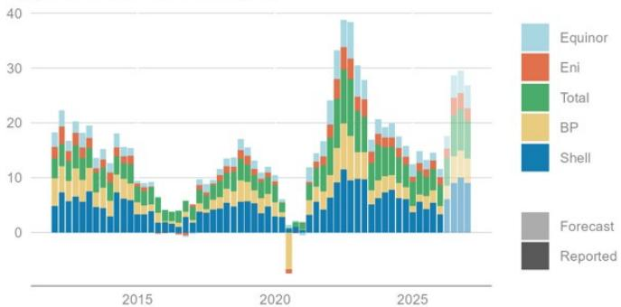  
Source: Company data, MS estimates

Exhibit 22:   
Net debt   
By quarter, including forecast (\$bn)   
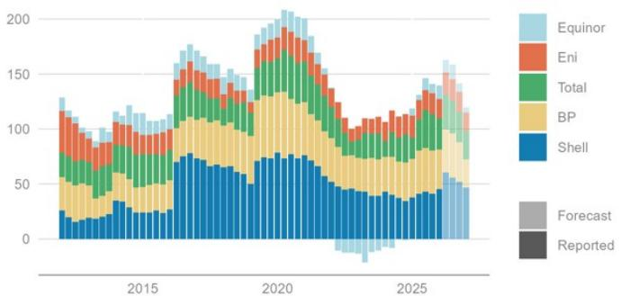

bar_stacked

| Year | Shell | BP | Total | Eni | Equinor | Forecast |
|---|---|---|---|---|---|---|
| 2014 | 25 | 30 | 35 | 20 | 10 | 0 |
| 2015 | 30 | 35 | 40 | 25 | 15 | 0 |
| 2016 | 35 | 40 | 45 | 30 | 20 | 0 |
| 2017 | 40 | 45 | 50 | 35 | 25 | 0 |
| 2018 | 45 | 50 | 55 | 40 | 30 | 0 |
| 2019 | 50 | 55 | 60 | 45 | 35 | 0 |
| 2020 | 55 | 60 | 65 | 50 | 40 | 0 |
| 2021 | 60 | 65 | 70 | 55 | 45 | 0 |
| 2022 | 65 | 70 | 75 | 60 | 50 | 0 |
| 2023 | 70 | 75 | 80 | 65 | 55 | -10 |
| 2024E | 75 | 80 | 85 | 70 | 60 | -15 |
| 2025E | 80 | 85 | 90 | 75 | 65 | -20 |
| 2026E | 85 | 90 | 95 | 80 | 70 | -25 |
| 2027E | 90 | 95 | 100 | 85 | 75 | -30 |
The chart displays a stacked bar chart with categories labeled as Shell, BP, Total, Eni, Equinor, Forecast, and Reported. The Y-axis represents numerical values ranging from -10 to +20. The X-axis represents time periods from approximately January to December. The legend indicates each component's color coding for visual distinction. The data is presented in a single column format with years on the left and forecast/reported values on the right. The chart lacks explicit numerical labels but visually represents cumulative or sequential trends across the timeline.

Source: Company data, MS estimates

Exhibit 23:   
Oil & gas production   
Year-on-year change (mboe/d)   
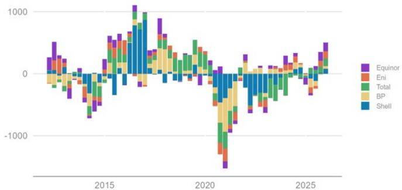

bar_stacked

| Year | Equinor | Eni | Total | BP | Shell |
|---|---|---|---|---|---|
| 2014 | 300 | 100 | -100 | -50 | -200 |
| 2015 | 600 | 400 | 200 | 100 | -800 |
| 2016 | 700 | 500 | 300 | 200 | -600 |
| 2017 | 900 | 600 | 400 | 300 | -400 |
| 2018 | 800 | 500 | 300 | 200 | -300 |
| 2019 | 400 | 300 | 100 | 50 | -100 |
| 2020 | 100 | -50 | -150 | -250 | -180 |
| 2021 | -1500 | -1200 | -1800 | -1600 | -1400 |
| 2022 | 300 | -150 | -50 | -150 | -120 |
| 2023 | 200 | -180 | -45 | -180 | -160 |
| 2024 | 350 | -160 | -35 | -165 | -145 |
| 2025 | -250 | -185 | -165 | -175 | -155 |
| 2026 | 450 | -175 | -35 | -175 | -165 |
The chart displays a stacked bar chart with values for each year from 2014 to 2026. The x-axis represents the years, and the y-axis represents the numerical values. The legend indicates five categories: Equinor, Eni, Total, BP, and Shell. The data is presented in a single column format with no explicit title or axis labels provided. The chart lacks a title or legend but implies a comparison of the total values across these categories over time.

Source: Company data, MS

Exhibit 24:   
Oil & gas production   
Year-on-year change (mboe/d)   
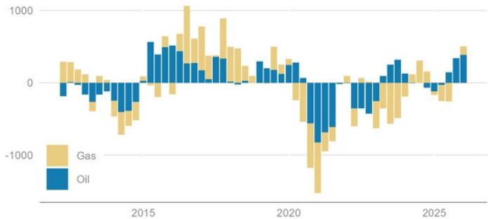

bar

| Year | Gas | Oil |
|---|---|---|
| 2014 | -100 | -200 |
| 2015 | 100 | 500 |
| 2016 | 800 | 600 |
| 2017 | 900 | 300 |
| 2018 | 500 | 300 |
| 2019 | 300 | 200 |
| 2020 | 400 | 200 |
| 2021 | -1500 | -800 |
| 2022 | -500 | -400 |
| 2023 | -300 | 300 |
| 2024 | 300 | 100 |
| 2025 | -100 | -100 |
| 2026 | 500 | 400 |

Note: chart shows aggregate of Shell, TotalEnergies, BP, Eni and Equinor  
Source: Company data, MS

Exhibit 25:   
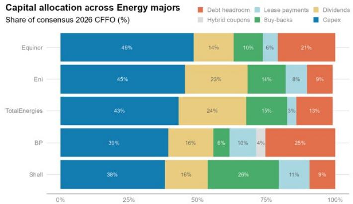

bar_stacked

Capital allocation across Energy majors
| Company | Debt headroom (%) | Lease payments (%) | Dividends (%) | Hybrid coupons (%) | Buy-backs (%) | Capex (%) |
| :--- | :--- | :--- | :--- | :--- | :--- | :--- |
| Equinor | 21 | 6 | 14 | 6 | 10 | 49 |
| Eni | 9 | 8 | 23 | 14 | 0 | 45 |
| TotalEnergies | 13 | 3 | 24 | 15 | 0 | 43 |
| BP | 25 | 4 | 16 | 10 | 6 | 39 |
| Shell | 9 | 11 | 16 | 26 | 0 | 38 |

Source: Company guidance, Visible Alpha, MS

# Exhibit 26:

Total distribution yield   
Dividends and share buybacks as % of market cap, based on 2026 consensus estimates (%)   
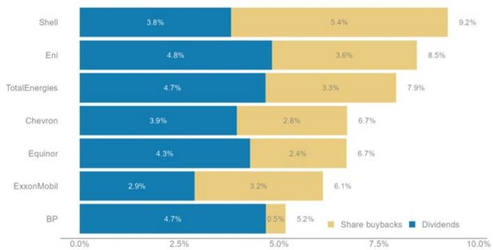

bar_stacked

| Company | Share buybacks (%) | Dividends (%) |
| :--- | :--- | :--- |
| Shell | 5.4 | 3.8 |
| Eni | 3.6 | 4.8 |
| TotalEnergies | 3.3 | 4.7 |
| Chevron | 2.8 | 3.9 |
| Equinor | 2.4 | 4.3 |
| ExxonMobil | 3.2 | 2.9 |
| BP | 0.5 | 4.7 |
The chart displays a stacked bar format representing the percentage composition of 'Share buybacks' (yellow) and 'Dividends' (blue). The values for each bar sum to 100% for all entries.

Source: Visible Alpha, MS

Exhibit 27:   
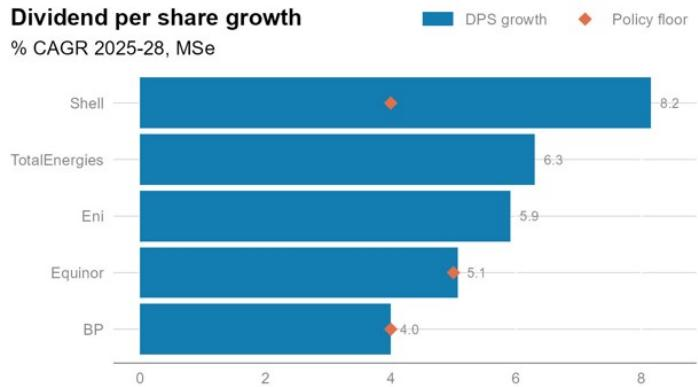

bar

Dividend per share growth
| Company | DPS growth (%) | Policy floor (%) |
| :--- | :--- | :--- |
| Shell | 8.2 | 4.0 |
| TotalEnergies | 6.3 | |
| Eni | 5.9 | |
| Equinor | 5.1 | |
| BP | 4.0 | |

Source: MS estimates.   
Modelling assumption: Brent avg. \$94/bbl in 2026, real \$80/bbl sUBSequently.

# Exhibit 28:

FCF Dividend Cover (%)   
FCF adjusted for hybrid coupons and lease payments, MSe   
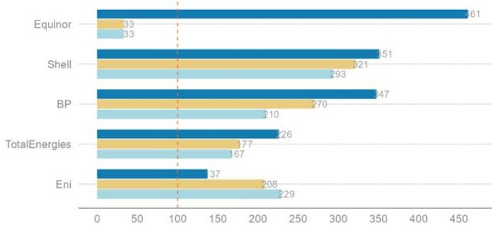

bar

| Company | Series 1 | Series 2 | Series 3 |
| :--- | :--- | :--- | :--- |
| Equinor | 61 | 33 | 33 |
| Shell | 51 | 321 | 293 |
| BP | 347 | 270 | 210 |
| TotalEnergies | 226 | 177 | 167 |
| Eni | 37 | 208 | 229 |

Source: MS estimates.   
Modelling assumption: Brent avg. \$94/bbl in 2026, real \$80/bbl sUBSequently.

Exhibit 29:   
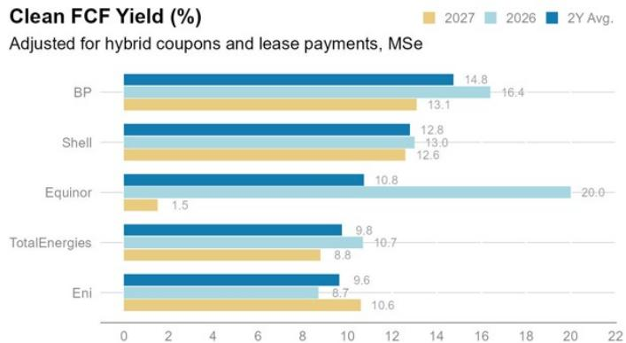

bar

Clean FCF Yield (%)
| Company | 2027 (%) | 2026 (%) | 2Y Avg. (%) |
| :--- | :--- | :--- | :--- |
| BP | 13.1 | 16.4 | 14.8 |
| Shell | 12.6 | 13.0 | 12.8 |
| Equinor | 1.5 | 20.0 | 10.8 |
| TotalEnergies | 8.8 | 10.7 | 9.8 |
| Eni | 10.6 | 6.7 | 9.6 |
Adjusted for hybrid coupons and lease payments, MSe

Source: MS estimates.   
Modelling assumption: Brent avg. \$94/bbl in 2026, real \$80/bbl sUBSequently.

# Exhibit 30:

All-in gearing ratio over time (%)   
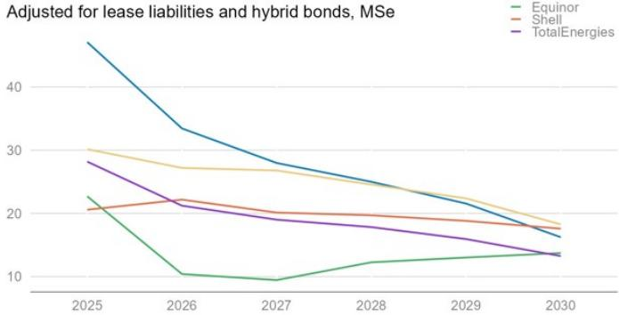

line

| Year | Equinor | Shell | TotalEnergies |
|------|---------|-------|---------------|
| 2025 | 23      | 21    | 28            |
| 2026 | 10      | 22    | 21            |
| 2027 | 9       | 20    | 19            |
| 2028 | 12      | 20    | 18            |
| 2029 | 13      | 19    | 16            |
| 2030 | 14      | 18    | 13            |

Source: MS estimates.   
Modelling assumption: Brent avg. \$94/bbl in 2026, real \$80/bbl sUBSequently.

# Consensus Forecasts

Exhibit 31:   
Consensus Net income   
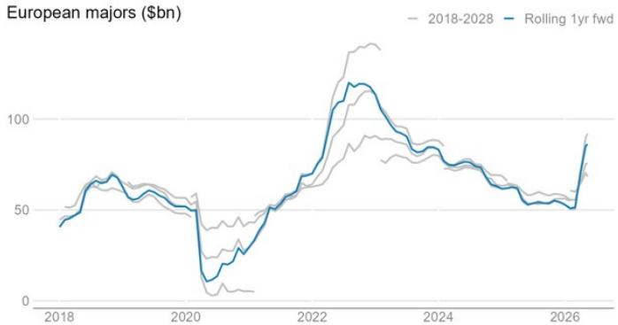

line

| Year | 2018-2028 | Rolling 1yr fwd |
|------|-----------|-----------------|
| 2018 | ~45       | ~40             |
| 2019 | ~60       | ~65             |
| 2020 | ~50       | ~10             |
| 2021 | ~30       | ~35             |
| 2022 | ~70       | ~80             |
| 2023 | ~110      | ~115            |
| 2024 | ~80       | ~75             |
| 2025 | ~65       | ~60             |
| 2026 | ~70       | ~50             |

Source: Visible Alpha, MS

Exhibit 32:   
Consensus net income - quarterly   
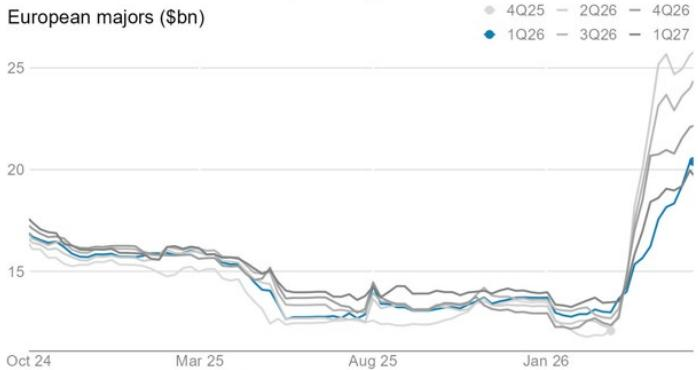

line

| Date   | 4Q25 | 2Q26 | 4Q26 | 1Q26 | 3Q26 | 1Q27 |
|--------|------|------|------|------|------|------|
| Oct 24 | ~17  | ~17  | ~17  | ~17  | ~17  | ~17  |
| Mar 25 | ~15  | ~15  | ~15  | ~15  | ~15  | ~15  |
| Aug 25 | ~13  | ~13  | ~13  | ~13  | ~13  | ~13  |
| Jan 26 | ~13  | ~13  | ~13  | ~13  | ~13  | ~13  |
| Apr 26 | ~25  | ~25  | ~25  | ~20  | ~20  | ~20  |

Source: Visible Alpha, MS

Exhibit 33:   
Consensus CFFO   
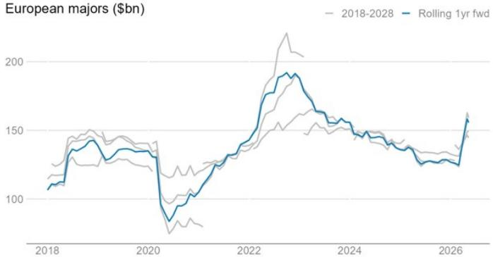

line

| Year | 2018-2028 | Rolling 1yr fwd |
|------|-----------|-----------------|
| 2018 | ~120      | ~110            |
| 2019 | ~145      | ~135            |
| 2020 | ~130      | ~80             |
| 2021 | ~125      | ~100            |
| 2022 | ~150      | ~140            |
| 2023 | ~180      | ~190            |
| 2024 | ~155      | ~150            |
| 2025 | ~145      | ~135            |
| 2026 | ~140      | ~160            |

Source: Visible Alpha, MS

Exhibit 34:   
Consensus Capex   
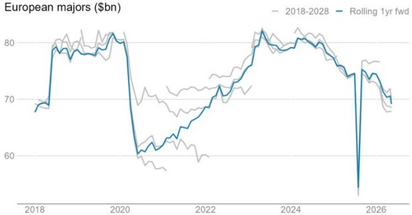

line

| Year | Rolling 1yr fwd ($) | 2018-2028 ($) |
|------|---------------------|---------------|
| 2018 | ~68                 | ~69           |
| 2019 | ~78                 | ~79           |
| 2020 | ~60                 | ~81           |
| 2021 | ~63                 | ~70           |
| 2022 | ~70                 | ~73           |
| 2023 | ~75                 | ~78           |
| 2024 | ~80                 | ~81           |
| 2025 | ~75                 | ~76           |
| 2026 | ~68                 | ~70           |

Source: Visible Alpha, MS

Exhibit 35:   
Consensus FCF   
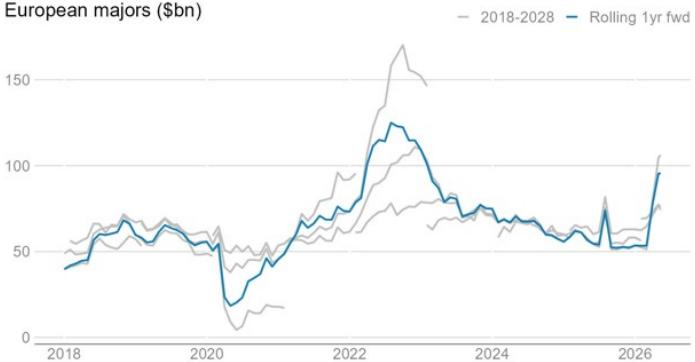

line

| Year | 2018-2028 | Rolling 1yr fwd |
|------|-----------|-----------------|
| 2018 | ~50       | ~40             |
| 2019 | ~60       | ~65             |
| 2020 | ~10       | ~20             |
| 2021 | ~50       | ~55             |
| 2022 | ~80       | ~100            |
| 2023 | ~160      | ~120            |
| 2024 | ~70       | ~75             |
| 2025 | ~60       | ~65             |
| 2026 | ~100      | ~95             |

Source: Visible Alpha, MS

Exhibit 36:   
Consensus share buybacks   
Aggregate of Shell, BP, TotalEnergies, Eni and Equinor   
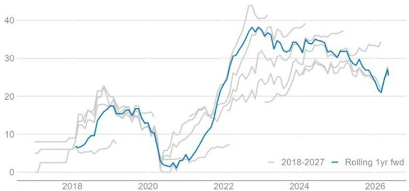

line

| Year | Rolling 1yr fwd |
|------|-----------------|
| 2018 | ~5              |
| 2019 | ~15             |
| 2020 | ~5              |
| 2021 | ~10             |
| 2022 | ~30             |
| 2023 | ~35             |
| 2024 | ~30             |
| 2025 | ~25             |
| 2026 | ~20             |

Source: Visible Alpha, MS

# Valuation

Exhibit 37:   
Price to Cash Flow   
European Energy sector   
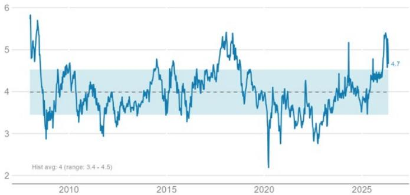

line

| Year | Value |
| ---- | ----- |
| 2026 | 4.7   |

Source: Refinitiv, Visible Alpha, Bloomberg, MS

Exhibit 38:   
Dividend yield   
European Energy sector (%)   
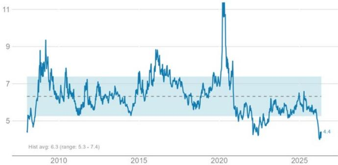

line

| Year | Value |
| ---- | ----- |
| 2025 | 4.4   |

Source: Refinitiv, Visible Alpha, Bloomberg, MS

Exhibit 39:   
Price to Cash Flow - relative to market   
European Energy sector   
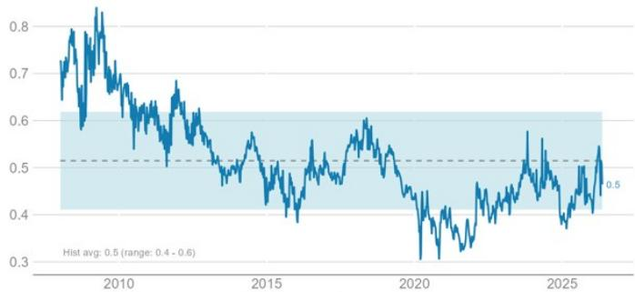

line

| Year | Value |
|------|-------|
| 2025 | 0.5   |

Source: Refinitiv, Visible Alpha, Bloomberg, MS

Exhibit 40:   
Dividend yield - relative to market   
European Energy sector (%)   
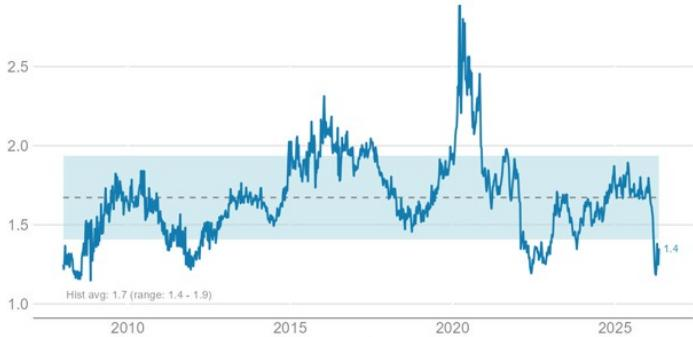

line

| Year | Value |
| ---- | ----- |
| 2010 | 1.7   |
| 2020 | 2.6   |
| 2025 | 1.4   |

Source: Refinitiv, Visible Alpha, Bloomberg, MS

Exhibit 41:   
Price to Cash Flow   
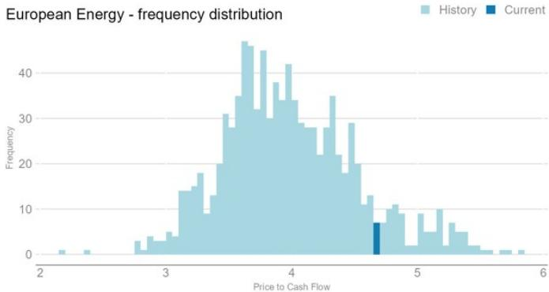

histogram

| Price to Cash Flow | Frequency |
| ------------------ | --------- |
| 2.0                | 1         |
| 2.1                | 1         |
| 2.2                | 1         |
| 2.3                | 1         |
| 2.4                | 1         |
| 2.5                | 1         |
| 2.6                | 1         |
| 2.7                | 1         |
| 2.8                | 1         |
| 2.9                | 1         |
| 3.0                | 1         |
| 3.1                | 1         |
| 3.2                | 1         |
| 3.3                | 1         |
| 3.4                | 1         |
| 3.5                | 1         |
| 3.6                | 1         |
| 3.7                | 1         |
| 3.8                | 1         |
| 3.9                | 1         |
| 4.0                | 1         |
| 4.1                | 1         |
| 4.2                | 1         |
| 4.3                | 1         |
| 4.4                | 1         |
| 4.5                | 1         |
| 4.6                | 1         |
| 4.7                | 1         |
| 4.8                | 1         |
| 4.9                | 1         |
| 5.0                | 1         |
| 5.1                | 1         |
| 5.2                | 1         |
| 5.3                | 1         |
| 5.4                | 1         |
| 5.5                | 1         |
| 5.6                | 1         |
| 5.7                | 1         |
| 5.8                | 1         |
| 5.9                | 1         |
| 6.0                | 1         |

Source: Refinitiv, Visible Alpha, Bloomberg, MS

Exhibit 42:   
Dividend yield   
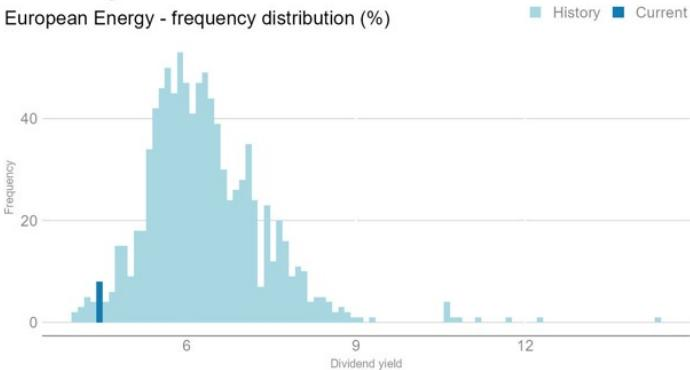

histogram

| Dividend yield | Frequency |
| -------------- | --------- |
| 4.0            | 3         |
| 4.5            | 8         |
| 5.0            | 15        |
| 5.5            | 35        |
| 6.0            | 48        |
| 6.5            | 40        |
| 7.0            | 30        |
| 7.5            | 20        |
| 8.0            | 10        |
| 8.5            | 5         |
| 9.0            | 2         |
| 9.5            | 1         |
| 10.0           | 0         |
| 10.5           | 0         |
| 11.0           | 0         |
| 11.5           | 0         |
| 12.0           | 0         |
| 12.5           | 0         |
| 13.0           | 0         |

Source: Refinitiv, Visible Alpha, Bloomberg, MS

Exhibit 43:   
FCF yield   
European Energy sector (%)   
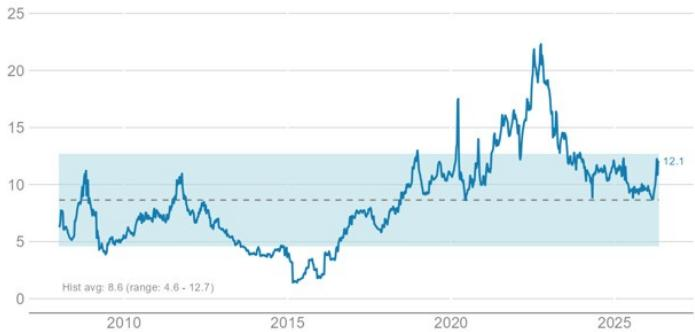

line

| Year | Value |
| ---- | ----- |
| 2025 | 12.1  |

Source: Refinitiv, Visible Alpha, Bloomberg, MS

Exhibit 44:   
Price to Earnings   
European Energy sector   
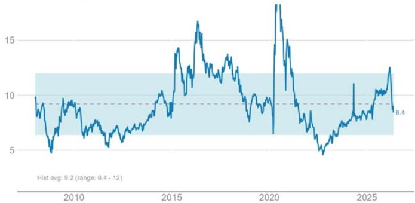

line

| Year | Value |
| ---- | ----- |
| 2025 | 8.4   |

Source: Refinitiv, Visible Alpha, Bloomberg, MS

Exhibit 45:   
FCF yield   
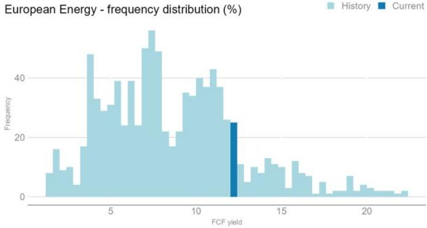

bar

European Energy - frequency distribution (%)
| FCF yield (%) | Frequency |
|---|---|
| 1.5 | 8 |
| 2.0 | 16 |
| 2.5 | 10 |
| 3.0 | 4 |
| 3.5 | 17 |
| 4.0 | 46 |
| 4.5 | 33 |
| 5.0 | 30 |
| 5.5 | 39 |
| 6.0 | 39 |
| 6.5 | 24 |
| 7.0 | 48 |
| 7.5 | 47 |
| 8.0 | 22 |
| 8.5 | 18 |
| 9.0 | 22 |
| 9.5 | 35 |
| 10.0 | 36 |
| 10.5 | 40 |
| 11.0 | 42 |
| 11.5 | 37 |
| 12.0 | 25 |
| 12.5 | 11 |
| 13.0 | 8 |
| 13.5 | 12 |
| 14.0 | 10 |
| 14.5 | 13 |
| 15.0 | 11 |
| 15.5 | 8 |
| 16.0 | 6 |
| 16.5 | 4 |
| 17.0 | 2 |
| 17.5 | 2 |
| 18.0 | 6 |
| 18.5 | 3 |
| 19.0 | 2 |
| 19.5 | 1 |
| 20.0 | 1 |
| 20.5 | 1 |
| 21.0 | 1 |
| 21.5 | 1 |
| 22.0 | 1 |
The chart displays a bar chart comparing the frequency distribution of FCF yield for History and Current data points. The 'Current' category is highlighted in blue, indicating it may be a specific data point or comparison group. The 'History' category is represented by light blue bars with no explicit numerical labels on the y-axis. The title 'European Energy - frequency distribution (%)' appears to be part of a multi-panel figure.

Source: Refinitiv, Visible Alpha, Bloomberg, MS

Exhibit 46:   
Price to Earnings   
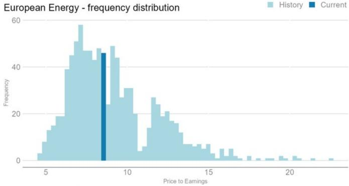

histogram

| Price to Earnings Range | Frequency |
| ----------------------- | --------- |
| 4.5 - 5.0               | 3         |
| 5.0 - 5.5               | 8         |
| 5.5 - 6.0               | 12        |
| 6.0 - 6.5               | 18        |
| 6.5 - 7.0               | 25        |
| 7.0 - 7.5               | 38        |
| 7.5 - 8.0               | 45        |
| 8.0 - 8.5               | 58        |
| 8.5 - 9.0               | 48        |
| 9.0 - 9.5               | 42        |
| 9.5 - 10.0              | 32        |
| 10.0 - 10.5             | 20        |
| 10.5 - 11.0             | 15        |
| 11.0 - 11.5             | 28        |
| 11.5 - 12.0             | 22        |
| 12.0 - 12.5             | 18        |
| 12.5 - 13.0             | 12        |
| 13.0 - 13.5             | 8         |
| 13.5 - 14.0             | 6         |
| 14.0 - 14.5             | 4         |
| 14.5 - 15.0             | 3         |
| 15.0 - 15.5             | 2         |
| 15.5 - 16.0             | 1         |
| 16.0 - 16.5             | 1         |
| 16.5 - 17.0             | 0         |
| 17.0 - 17.5             | 0         |
| 17.5 - 18.0             | 0         |
| 18.0 - 18.5             | 0         |
| 18.5 - 19.0             | 0         |
| 19.0 - 19.5             | 0         |
| 19.5 - 20.0             | 0         |
| 20.0 - 20.5             | 0         |
| 20.5 - 21.0             | 0         |
| 21.0 - 21.5             | 0         |
| 21.5 - 22.0             | 0         |
| 22.0 - 22.5             | 0         |
| 22.5 - 23.0             | 0         |
| 23.0 - 23.5             | 0         |
| 23.5 - 24.0             | 0         |
| 24.0 - 24.5             | 0         |
| 24.5 - 25.0             | 0         |
| 25.0 - 25.5             | 0         |
| 25.5 - 26.0             | 0         |
| 26.0 - 26.5             | 0         |
| 26.5 - 27.0             | 0         |
| 27.0 - 27.5             | 0         |
| 27.5 - 28.0             | 0         |
| 28.0 - 28.5             | 0         |
| 28.5 - 29.0             | 0         |
| 29.0 - 29.5             | 0         |
| 29.5 - 30.0             | 0         |
| Note: The actual frequencies may vary due to the random nature of the data generation process in the code execution.

Source: Refinitiv, Visible Alpha, Bloomberg, MS

# Consensus Valuation Table

# Exhibit 47:

# Valuation metrics

Based on Visible Alpha consensus estimates 

<table><tr><td rowspan="2"></td><td colspan="3">P/CF</td><td colspan="3">FCF yield (%)</td><td colspan="3">Div yield (%)</td></tr><tr><td>2026</td><td>2027</td><td>2028</td><td>2026</td><td>2027</td><td>2028</td><td>2026</td><td>2027</td><td>2028</td></tr><tr><td>BP</td><td>3.8</td><td>3.9</td><td>4.1</td><td>19.4</td><td>14.4</td><td>13.1</td><td>4.5</td><td>4.8</td><td>5.0</td></tr><tr><td>Eni</td><td>4.8</td><td>4.9</td><td>5.0</td><td>10.5</td><td>11.0</td><td>10.7</td><td>4.8</td><td>5.0</td><td>5.2</td></tr><tr><td>Equinor</td><td>3.9</td><td>5.2</td><td>5.5</td><td>13.5</td><td>10.1</td><td>8.1</td><td>4.2</td><td>4.4</td><td>4.6</td></tr><tr><td>Galp</td><td>5.5</td><td>6.6</td><td>7.2</td><td>10.9</td><td>8.6</td><td>6.3</td><td>3.4</td><td>3.6</td><td>3.7</td></tr><tr><td>Neste</td><td>7.7</td><td>8.3</td><td>8.5</td><td>8.1</td><td>9.2</td><td>9.1</td><td>1.8</td><td>2.3</td><td>2.7</td></tr><tr><td>OMV</td><td>4.4</td><td>4.4</td><td>4.4</td><td>-1.6</td><td>7.3</td><td>9.0</td><td>7.0</td><td>7.8</td><td>8.0</td></tr><tr><td>Repsol</td><td>6.2</td><td>3.7</td><td>3.7</td><td>9.2</td><td>10.8</td><td>10.6</td><td>4.8</td><td>5.1</td><td>5.5</td></tr><tr><td>Shell</td><td>4.6</td><td>4.7</td><td>4.9</td><td>12.9</td><td>12.0</td><td>11.4</td><td>3.8</td><td>3.9</td><td>4.0</td></tr><tr><td>TotalEnergies</td><td>5.8</td><td>6.0</td><td>6.1</td><td>9.1</td><td>8.6</td><td>8.4</td><td>4.6</td><td>5.0</td><td>5.3</td></tr><tr><td>European avg.</td><td>4.9</td><td>5.1</td><td>5.3</td><td>12.0</td><td>10.9</td><td>10.2</td><td>4.3</td><td>4.5</td><td>4.8</td></tr><tr><td>Aramco</td><td>11.5</td><td>11.4</td><td>11.3</td><td>5.8</td><td>6.0</td><td>6.2</td><td>5.0</td><td>5.6</td><td>5.8</td></tr><tr><td>Chevron</td><td>7.1</td><td>6.9</td><td>7.2</td><td>9.0</td><td>9.1</td><td>8.6</td><td>3.9</td><td>4.1</td><td>4.3</td></tr><tr><td>Exxon Mobil</td><td>8.5</td><td>8.4</td><td>8.3</td><td>7.2</td><td>7.3</td><td>7.5</td><td>2.9</td><td>3.0</td><td>3.1</td></tr></table>

Source: Visible Alpha, MS   
Updated: 11 May 2026

# Exhibit 48:

Total distribution yield   
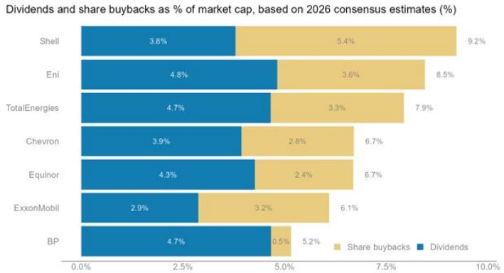

bar_stacked

Dividends and share buybacks as % of market cap, based on 2026 consensus estimates (%)
| Company | Dividends (%) | Share buybacks (%) |
| :--- | :--- | :--- |
| Shell | 3.8 | 5.4 |
| Eni | 4.8 | 3.6 |
| TotalEnergies | 4.7 | 3.3 |
| Chevron | 3.9 | 2.8 |
| Equinor | 4.3 | 2.4 |
| ExxonMobil | 2.9 | 3.2 |
| BP | 4.7 | 0.5 |
2026 Consensus Estimates (%)

Source: Visible Alpha, MS

# Exhibit 49:

Adjusted total distribution yield   
2026 consensus dividend + buyback yield, as spread over company's 10yr USD bond yield   
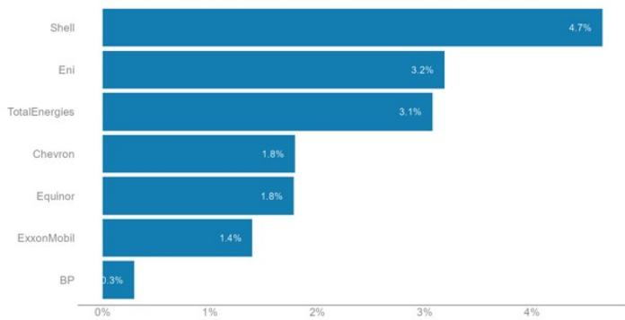

bar

| Company | Percentage (%) |
| :--- | :--- |
| Shell | 4.7 |
| Eni | 3.2 |
| TotalEnergies | 3.1 |
| Chevron | 1.8 |
| Equinor | 1.8 |
| ExxonMobil | 1.4 |
| BP | 0.3 |

Source: Visible Alpha, Bloomberg, MS

# Quarterly Earnings Surprise Analysis

Exhibit 50:

# Surprise analysis

Difference between reported net income and consensus prior to announcement (%) 

<table><tr><td>company</td><td>1QFY-2024</td><td>2QFY-2024</td><td>3QFY-2024</td><td>4QFY-2024</td><td>1QFY-2025</td><td>2QFY-2025</td><td>3QFY-2025</td><td>4QFY-2025</td><td>1QFY-2026</td></tr><tr><td>BP</td><td>-7.5</td><td>5.0</td><td>11.7</td><td>-10.0</td><td>-16.2</td><td>27.9</td><td>10.1</td><td>-0.6</td><td>22.5</td></tr><tr><td>Eni</td><td>-5.6</td><td>4.9</td><td>12.2</td><td>-12.9</td><td>11.7</td><td>20.2</td><td>22.3</td><td>17.1</td><td>-17.3</td></tr><tr><td>Equinor</td><td>35.8</td><td>17.8</td><td>10.9</td><td>13.4</td><td>-25.8</td><td>-8.0</td><td>-40.1</td><td>26.3</td><td>37.6</td></tr><tr><td>Galp</td><td>29.5</td><td>30.4</td><td>22.9</td><td>-58.4</td><td>-1.7</td><td>73.2</td><td>29.9</td><td>15.0</td><td>1.7</td></tr><tr><td>Neste</td><td>-35.4</td><td>-198.4</td><td>-79.3</td><td>-982.8</td><td>58.6</td><td>76.2</td><td>11.5</td><td>64.9</td><td>199.4</td></tr><tr><td>OMV</td><td>12.8</td><td>-9.1</td><td>-26.1</td><td>10.2</td><td>-18.2</td><td>-5.2</td><td>23.0</td><td>4.3</td><td>-24.2</td></tr><tr><td>Repsol</td><td>14.1</td><td>17.3</td><td>-3.1</td><td>16.7</td><td>3.1</td><td>42.8</td><td>5.4</td><td>-4.5</td><td>-3.2</td></tr><tr><td>Shell</td><td>23.1</td><td>6.8</td><td>13.3</td><td>-15.3</td><td>10.3</td><td>11.8</td><td>8.8</td><td>-5.8</td><td>10.9</td></tr><tr><td>TotalEnergies</td><td>12.2</td><td>-4.8</td><td>-3.4</td><td>4.2</td><td>-2.3</td><td>-1.6</td><td>-1.1</td><td>-1.5</td><td>3.9</td></tr><tr><td>Exxon Mobil</td><td>-6.3</td><td>6.0</td><td>3.8</td><td>6.8</td><td>1.1</td><td>6.0</td><td>3.7</td><td>0.5</td><td>21.7</td></tr><tr><td>Chevron</td><td>-1.3</td><td>-14.7</td><td>1.6</td><td>-5.2</td><td>1.8</td><td>3.4</td><td>8.4</td><td>5.6</td><td>38.3</td></tr><tr><td>Average</td><td>6.5</td><td>-12.6</td><td>-3.2</td><td>-93.9</td><td>2.0</td><td>22.4</td><td>7.4</td><td>11.0</td><td>26.5</td></tr></table>

Source: Visible Alpha, MS

Exhibit 51:   
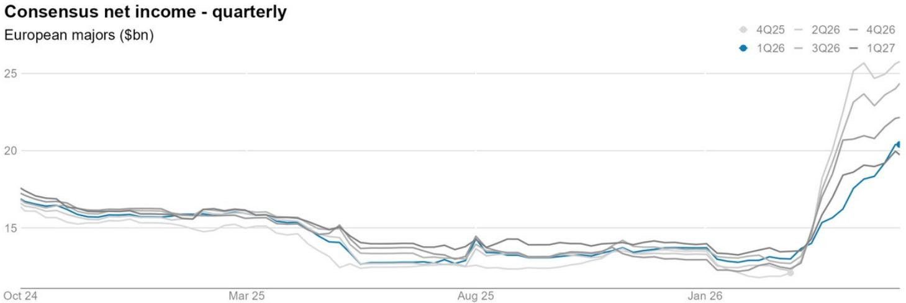

line

| Date     | 4Q25 | 2Q26 | 4Q26 | 1Q26 | 3Q26 | 1Q27 |
| -------- | ---- | ---- | ---- | ---- | ---- | ---- |
| Oct 24   | ~17.5 | ~17.0 | ~17.2 | ~16.8 | ~16.5 | ~16.7 |
| Mar 25   | ~15.5 | ~15.0 | ~15.3 | ~14.8 | ~14.5 | ~14.7 |
| Aug 25   | ~13.0 | ~13.5 | ~14.0 | ~13.2 | ~13.0 | ~13.3 |
| Jan 26   | ~11.0 | ~11.5 | ~12.0 | ~11.2 | ~11.0 | ~11.3 |
| Latest   | ~25.0 | ~24.0 | ~23.0 | ~20.5 | ~19.5 | ~19.0 |

Source: Visible Alpha, MS

# Consensus Revisions

Exhibit 52:

# Consensus revisions

Change in consensus forecast since last quarterly results (%)

<table><tr><td>company</td><td>Revision since</td><td>Latest update</td><td>2QFY-2026</td><td>3QFY-2026</td><td>4QFY-2026</td><td>FY-2026</td><td>FY-2027</td><td>FY-2028</td></tr><tr><td colspan="9">Net income</td></tr><tr><td>BP</td><td>22 Apr</td><td>07 May</td><td>-2.2</td><td>5.0</td><td>4.4</td><td>4.9</td><td>1.4</td><td>0.2</td></tr><tr><td>Eni</td><td>21 Apr</td><td>04 May</td><td>-4.2</td><td>-4.3</td><td>5.5</td><td>-1.5</td><td>0.2</td><td>0.4</td></tr><tr><td>Equinor</td><td>04 May</td><td>11 May</td><td>1.2</td><td>2.2</td><td>-1.4</td><td>2.1</td><td>2.2</td><td>-2.1</td></tr><tr><td>Galp</td><td>22 Apr</td><td>08 May</td><td>-2.1</td><td>2.2</td><td>3.0</td><td>0.3</td><td>0.8</td><td>-0.4</td></tr><tr><td>Neste</td><td>24 Apr</td><td>08 May</td><td>28.2</td><td>19.3</td><td>44.3</td><td>25.7</td><td>9.5</td><td>4.7</td></tr><tr><td>OMV</td><td>23 Apr</td><td>08 May</td><td>-6.0</td><td>-9.5</td><td>-8.7</td><td>-2.8</td><td>-0.2</td><td>1.5</td></tr><tr><td>Repsol</td><td>17 Apr</td><td>08 May</td><td>4.7</td><td>3.8</td><td>13.7</td><td>6.4</td><td>0.6</td><td>0.3</td></tr><tr><td>Shell</td><td>24 Apr</td><td>11 May</td><td>7.5</td><td>8.6</td><td>10.9</td><td>10.8</td><td>4.8</td><td>-3.8</td></tr><tr><td>TotalEnergies</td><td>23 Apr</td><td>07 May</td><td>5.8</td><td>6.3</td><td>6.2</td><td>6.1</td><td>2.7</td><td>1.0</td></tr><tr><td>Exxon Mobil</td><td>01 May</td><td>08 May</td><td>0.7</td><td>5.4</td><td>3.7</td><td>8.1</td><td>4.3</td><td>2.4</td></tr><tr><td>Chevron</td><td>01 May</td><td>08 May</td><td>5.4</td><td>5.5</td><td>3.5</td><td>5.9</td><td>0.3</td><td>-0.2</td></tr><tr><td colspan="9">CFFO</td></tr><tr><td>BP</td><td>22 Apr</td><td>07 May</td><td>1.3</td><td>8.5</td><td>-0.4</td><td>1.3</td><td>-0.1</td><td>-0.7</td></tr><tr><td>Eni</td><td>21 Apr</td><td>05 May</td><td>5.7</td><td>11.0</td><td>5.9</td><td>1.4</td><td>-0.9</td><td>-1.1</td></tr><tr><td>Equinor</td><td>04 May</td><td>11 May</td><td>6.2</td><td>-9.8</td><td>-23.3</td><td>-9.1</td><td>5.6</td><td>1.2</td></tr><tr><td>Galp</td><td>16 Apr</td><td>05 May</td><td>9.2</td><td>-4.8</td><td>-12.4</td><td>2.7</td><td>0.4</td><td>0.2</td></tr><tr><td>Neste</td><td>24 Apr</td><td>06 May</td><td>44.5</td><td>17.0</td><td>14.4</td><td>26.1</td><td>8.1</td><td>5.3</td></tr><tr><td>OMV</td><td>23 Apr</td><td>08 May</td><td>11.3</td><td>-5.0</td><td>2.3</td><td>4.6</td><td>1.4</td><td>-1.7</td></tr><tr><td>Repsol</td><td>16 Apr</td><td>05 May</td><td>NA</td><td>NA</td><td>NA</td><td>-22.5</td><td>11.5</td><td>13.1</td></tr><tr><td>Shell</td><td>24 Apr</td><td>09 May</td><td>-0.6</td><td>-6.7</td><td>-14.0</td><td>0.2</td><td>0.5</td><td>-4.3</td></tr><tr><td>TotalEnergies</td><td>23 Apr</td><td>05 May</td><td>-1.7</td><td>3.5</td><td>4.5</td><td>0.4</td><td>-0.2</td><td>-0.5</td></tr><tr><td>Aramco</td><td>04 Mar</td><td>29 Apr</td><td>31.0</td><td>18.0</td><td>12.7</td><td>19.6</td><td>10.4</td><td>3.3</td></tr><tr><td>Exxon Mobil</td><td>01 May</td><td>05 May</td><td>-1.1</td><td>2.9</td><td>1.5</td><td>1.8</td><td>1.9</td><td>0.8</td></tr><tr><td>Chevron</td><td>01 May</td><td>05 May</td><td>4.9</td><td>1.4</td><td>1.2</td><td>1.0</td><td>1.2</td><td>0.6</td></tr></table>

Source: Visible Alpha, MS

# Exhibit 53:

Consensus revisions   
Change in consensus forecast since last quarterly results (%) 

<table><tr><td>company</td><td>Revision since</td><td>Latest update</td><td>2QFY-2026</td><td>3QFY-2026</td><td>4QFY-2026</td><td>FY-2026</td><td>FY-2027</td><td>FY-2028</td></tr><tr><td colspan="9">FCF</td></tr><tr><td>BP</td><td>22 Apr</td><td>05 May</td><td>8.5</td><td>16.9</td><td>-4.7</td><td>6.3</td><td>0.8</td><td>-1.2</td></tr><tr><td>Eni</td><td>21 Apr</td><td>05 May</td><td>7.6</td><td>23.2</td><td>14.1</td><td>1.9</td><td>-1.5</td><td>-1.7</td></tr><tr><td>Equinor</td><td>04 May</td><td>11 May</td><td>11.9</td><td>-7.6</td><td>3.7</td><td>-14.0</td><td>18.2</td><td>8.8</td></tr><tr><td>Galp</td><td>15 Apr</td><td>05 May</td><td>14.1</td><td>-4.4</td><td>-21.5</td><td>3.1</td><td>0.9</td><td>0.5</td></tr><tr><td>Neste</td><td>24 Apr</td><td>06 May</td><td>72.1</td><td>25.6</td><td>47.9</td><td>55.2</td><td>11.3</td><td>7.0</td></tr><tr><td>OMV</td><td>23 Apr</td><td>08 May</td><td>24.3</td><td>-11.2</td><td>-31.2</td><td>-54.4</td><td>12.1</td><td>27.4</td></tr><tr><td>Repsol</td><td>17 Apr</td><td>07 May</td><td>9.5</td><td>9.1</td><td>36.9</td><td>3.4</td><td>3.9</td><td>6.3</td></tr><tr><td>Shell</td><td>23 Apr</td><td>09 May</td><td>12.1</td><td>-3.7</td><td>-18.8</td><td>-1.4</td><td>-3.1</td><td>-10.0</td></tr><tr><td>TotalEnergies</td><td>23 Apr</td><td>05 May</td><td>4.6</td><td>10.4</td><td>16.2</td><td>-2.5</td><td>-1.2</td><td>-2.1</td></tr><tr><td>Aramco</td><td>04 Mar</td><td>29 Apr</td><td>54.2</td><td>31.6</td><td>21.5</td><td>36.1</td><td>13.5</td><td>1.5</td></tr><tr><td>Exxon Mobil</td><td>01 May</td><td>05 May</td><td>4.3</td><td>4.0</td><td>1.1</td><td>3.7</td><td>4.1</td><td>3.3</td></tr><tr><td>Chevron</td><td>01 May</td><td>05 May</td><td>7.1</td><td>2.5</td><td>1.5</td><td>2.9</td><td>0.7</td><td>0.4</td></tr><tr><td colspan="9">DPS</td></tr><tr><td>BP</td><td>01 Apr</td><td>07 May</td><td>0.1</td><td>0.1</td><td>0.0</td><td>-0.1</td><td>-0.1</td><td>-0.1</td></tr><tr><td>Eni</td><td>24 Mar</td><td>05 May</td><td>-8.3</td><td>0.3</td><td>-23.2</td><td>-1.9</td><td>0.2</td><td>0.2</td></tr><tr><td>Equinor</td><td>07 Apr</td><td>11 May</td><td>-11.1</td><td>-11.1</td><td>-11.7</td><td>0.0</td><td>-0.1</td><td>-0.2</td></tr><tr><td>Galp</td><td>20 Mar</td><td>08 May</td><td>0.0</td><td>0.0</td><td>0.0</td><td>-0.3</td><td>-0.2</td><td>-0.2</td></tr><tr><td>Neste</td><td>04 Mar</td><td>08 May</td><td>25.0</td><td>NA</td><td>18.1</td><td>20.1</td><td>10.6</td><td>8.9</td></tr><tr><td>OMV</td><td>09 Feb</td><td>08 May</td><td>-23.3</td><td>NA</td><td>NA</td><td>-3.0</td><td>-0.8</td><td>-0.6</td></tr><tr><td>Repsol</td><td>07 Apr</td><td>08 May</td><td>-1.3</td><td>-9.7</td><td>-1.3</td><td>0.1</td><td>0.1</td><td>0.3</td></tr><tr><td>Shell</td><td>21 Apr</td><td>08 May</td><td>6.7</td><td>8.4</td><td>6.8</td><td>6.6</td><td>7.2</td><td>4.6</td></tr><tr><td>TotalEnergies</td><td>23 Apr</td><td>07 May</td><td>2.7</td><td>2.7</td><td>2.0</td><td>1.8</td><td>2.2</td><td>2.4</td></tr><tr><td>Aramco</td><td>27 Feb</td><td>29 Apr</td><td>0.2</td><td>0.2</td><td>3.0</td><td>1.0</td><td>10.6</td><td>6.4</td></tr><tr><td>Exxon Mobil</td><td>08 Apr</td><td>05 May</td><td>0.0</td><td>0.4</td><td>0.5</td><td>0.3</td><td>0.4</td><td>0.6</td></tr><tr><td>Chevron</td><td>21 Apr</td><td>07 May</td><td>0.0</td><td>0.0</td><td>0.1</td><td>0.1</td><td>0.0</td><td>-0.1</td></tr></table>

Source: Visible Alpha, MS

# Distribution Policies

Exhibit 54: European majors: Summary of shareholder payout policies 

<table><tr><td>Company</td><td>Current Distribution Guidance</td></tr><tr><td>Shell</td><td>Total distributions at 40-50% of CFFO through the cycle. ~4% annual progressive DPS growth, building from $0.39/sh in 2Q26 (which stands at +9% y/y). Guidance to buy back $3.0bn of shares in 2Q26.</td></tr><tr><td>BP</td><td>DPS expected to increase by at least 4% p.a. At 4Q25 results, BP suspended its buyback programme and retired previous guidance of shareholder distributions at 30-40% of CFFO.</td></tr><tr><td>TotalEnergies</td><td>Total distributions at &gt;40% of CFFO. DPS raised by ~+6% p.a. at the time of 1Q26 results. Buyback of $1.5bn announced for 2Q26, and guided $0.75-1.5/qtr based on oil price scenarios. In the past, the company has indicated that share count reductions feed into DPS hikes.</td></tr><tr><td>Eni</td><td>Total distributions at 35-45% of CFFO. Base remuneration of €1.10/sh dividend and €2.8bn buyback floor for FY2026. Based on commodity scenarios, 60% of incremental CFFO will be distributed as buybacks (Brent at $70-$90/bbl); further 100% incremental CFFO to be distributed as a special dividend (Brent at &gt;$90/bbl).</td></tr><tr><td>Equinor</td><td>Base quarterly dividend increased to $0.39/share and ambition to grow quarterly DPS by 2 cents annually. Buybacks announced at $1.5bn in 2026.</td></tr><tr><td>Saudi Aramco</td><td>Sustainable and progressive base dividend policy; raised the base dividend by ~4% in 1Q26 to an annual rate of ~$85bn. In March 2026, the company announced a share buyback programme of up to $3 billion over the following 18 months.</td></tr><tr><td>Repsol</td><td>Distribute 30-40% of CFFO through the cycle on a combination of dividends and buybacks. For 2026, guidance is to distribute €1.9bn under the company&#x27;s base case scenario, with a dividend of €1.051/sh and €350mn of share buybacks in 1H26.</td></tr><tr><td>Galp</td><td>Expects to distribute 1/3 of CFFO (ex. W/C). Announced a DPS of €0.64 for 2025 along with 4Q25 results, and expects it to grow progressively (at least by 4% p.a.). Buybacks are supplementary, and for 2026 (based off 2025 results) the company will repurchase €250mn of shares.</td></tr><tr><td>OMV</td><td>Until 2025, 20-30% of CFFO to be distributed as a combinaton of progressive regular dividends plus an additional variable dividend (no buybacks). From 2026, will distribute 50% of BGI&#x27;s dividends to OMV plus 20-30% of CFFO ex BGI&#x27;s dividends to OMV.</td></tr></table>

Source: Company data, MS

# Consensus Snapshot

Exhibit 55: Consensus table

Consensus forecasts   
11 May 2026 

<table><tr><td>Item</td><td>2QFY-2026</td><td>FY-2026</td><td>FY-2027</td><td>FY-2028</td></tr><tr><td colspan="5">Aramco (SAR)</td></tr><tr><td>Net income</td><td>126.5</td><td>474.6</td><td>465.1</td><td>469.5</td></tr><tr><td>CFFO</td><td>159.3</td><td>579.9</td><td>583.7</td><td>589.2</td></tr><tr><td>Chg w/cap</td><td>5.8</td><td>-21.4</td><td>-5.4</td><td>-2.0</td></tr><tr><td>CFFO ex w/cap</td><td>153.5</td><td>601.2</td><td>589.1</td><td>591.3</td></tr><tr><td>Capex</td><td>47.9</td><td>194.1</td><td>187.0</td><td>177.2</td></tr><tr><td>Adj FCF</td><td>105.5</td><td>407.1</td><td>402.1</td><td>414.0</td></tr><tr><td>Dividends</td><td>83.8</td><td>335.5</td><td>381.6</td><td>396.9</td></tr><tr><td>Buybacks</td><td>NA</td><td>NA</td><td>NA</td><td>NA</td></tr><tr><td>Chg net debt</td><td>-7.6</td><td>-8.1</td><td>-13.4</td><td>8.9</td></tr><tr><td>DPS</td><td>0.34</td><td>1.36</td><td>1.54</td><td>1.60</td></tr><tr><td colspan="5">Neste (€)</td></tr><tr><td>Net income</td><td>0.7</td><td>1.9</td><td>1.6</td><td>1.5</td></tr><tr><td>CFFO</td><td>0.9</td><td>2.8</td><td>2.6</td><td>2.6</td></tr><tr><td>Chg w/cap</td><td>-0.1</td><td>-0.1</td><td>-0.1</td><td>-0.1</td></tr><tr><td>CFFO ex w/cap</td><td>1.0</td><td>3.0</td><td>2.7</td><td>2.6</td></tr><tr><td>Capex</td><td>0.3</td><td>1.1</td><td>0.6</td><td>0.6</td></tr><tr><td>Adj FCF</td><td>0.8</td><td>1.9</td><td>2.1</td><td>2.0</td></tr><tr><td>Dividends</td><td>0.1</td><td>0.2</td><td>0.4</td><td>0.7</td></tr><tr><td>Buybacks</td><td>NA</td><td>NA</td><td>NA</td><td>NA</td></tr><tr><td>Chg net debt</td><td>-0.4</td><td>-0.5</td><td>-0.6</td><td>-0.4</td></tr><tr><td>DPS</td><td>0.07</td><td>0.51</td><td>0.64</td><td>0.76</td></tr></table>

Note: Data in billions, except for per share figures   
Source: Visible Alpha, MS

<table><tr><td>Item</td><td>2QFY-2026</td><td>FY-2026</td><td>FY-2027</td><td>FY-2028</td></tr><tr><td colspan="5">BP ($)</td></tr><tr><td>Net income</td><td>4.0</td><td>13.9</td><td>10.7</td><td>9.7</td></tr><tr><td>CFFO</td><td>8.4</td><td>30.5</td><td>29.6</td><td>28.6</td></tr><tr><td>Chg w/cap</td><td>0.4</td><td>-4.7</td><td>-0.6</td><td>-0.9</td></tr><tr><td>CFFO ex w/cap</td><td>8.0</td><td>35.1</td><td>30.2</td><td>29.5</td></tr><tr><td>Capex</td><td>3.3</td><td>13.3</td><td>13.6</td><td>13.6</td></tr><tr><td>Adj FCF</td><td>4.7</td><td>21.8</td><td>16.5</td><td>15.9</td></tr><tr><td>Dividends</td><td>1.4</td><td>5.6</td><td>5.8</td><td>6.0</td></tr><tr><td>Buybacks</td><td>NA</td><td>0.6</td><td>2.0</td><td>4.5</td></tr><tr><td>Chg net debt</td><td>-4.0</td><td>-7.9</td><td>-5.4</td><td>-5.6</td></tr><tr><td>DPS</td><td>0.09</td><td>0.34</td><td>0.35</td><td>0.37</td></tr><tr><td colspan="5">OMV (€)</td></tr><tr><td>Net income</td><td>0.7</td><td>2.5</td><td>2.3</td><td>2.1</td></tr><tr><td>CFFO</td><td>1.3</td><td>5.2</td><td>5.0</td><td>4.8</td></tr><tr><td>Chg w/cap</td><td>0.2</td><td>-0.3</td><td>0.0</td><td>NA</td></tr><tr><td>CFFO ex w/cap</td><td>1.1</td><td>5.5</td><td>5.0</td><td>4.8</td></tr><tr><td>Capex</td><td>0.9</td><td>4.7</td><td>3.2</td><td>3.0</td></tr><tr><td>Adj FCF</td><td>0.3</td><td>0.8</td><td>1.8</td><td>1.9</td></tr><tr><td>Dividends</td><td>1.7</td><td>1.8</td><td>1.9</td><td>1.9</td></tr><tr><td>Buybacks</td><td>NA</td><td>NA</td><td>NA</td><td>NA</td></tr><tr><td>Chg net debt</td><td>1.4</td><td>0.0</td><td>0.2</td><td>0.0</td></tr><tr><td>DPS</td><td>2.30</td><td>4.22</td><td>4.68</td><td>4.81</td></tr></table>

<table><tr><td>Item</td><td>2QFY-2026</td><td>FY-2026</td><td>FY-2027</td><td>FY-2028</td></tr><tr><td colspan="5">Eni (€)</td></tr><tr><td>Net income</td><td>2.4</td><td>8.0</td><td>7.0</td><td>6.9</td></tr><tr><td>CFFO</td><td>4.2</td><td>14.6</td><td>14.2</td><td>14.0</td></tr><tr><td>Chg w/cap</td><td>NA</td><td>-0.6</td><td>0.6</td><td>0.2</td></tr><tr><td>CFFO ex w/cap</td><td>4.2</td><td>15.1</td><td>13.6</td><td>13.8</td></tr><tr><td>Capex</td><td>1.9</td><td>7.2</td><td>6.6</td><td>6.5</td></tr><tr><td>Adj FCF</td><td>2.2</td><td>7.9</td><td>7.0</td><td>7.2</td></tr><tr><td>Dividends</td><td>0.8</td><td>3.6</td><td>3.6</td><td>3.6</td></tr><tr><td>Buybacks</td><td>0.8</td><td>2.5</td><td>1.9</td><td>1.9</td></tr><tr><td>Chg net debt</td><td>-0.3</td><td>-0.1</td><td>-1.0</td><td>-0.9</td></tr><tr><td>DPS</td><td>0.28</td><td>1.10</td><td>1.14</td><td>1.19</td></tr><tr><td colspan="5">Repsol (€)</td></tr><tr><td>Net income</td><td>1.4</td><td>4.3</td><td>3.6</td><td>3.4</td></tr><tr><td>CFFO</td><td>NA</td><td>4.5</td><td>7.2</td><td>7.2</td></tr><tr><td>Chg w/cap</td><td>NA</td><td>0.5</td><td>0.6</td><td>0.6</td></tr><tr><td>CFFO ex w/cap</td><td>NA</td><td>4.1</td><td>6.6</td><td>6.6</td></tr><tr><td>Capex</td><td>NA</td><td>4.9</td><td>4.2</td><td>4.3</td></tr><tr><td>Adj FCF</td><td>NA</td><td>-0.8</td><td>2.4</td><td>2.4</td></tr><tr><td>Dividends</td><td>NA</td><td>1.0</td><td>0.9</td><td>0.9</td></tr><tr><td>Buybacks</td><td>NA</td><td>NA</td><td>NA</td><td>NA</td></tr><tr><td>Chg net debt</td><td>-0.1</td><td>-1.1</td><td>1.1</td><td>2.2</td></tr><tr><td>DPS</td><td>0.33</td><td>1.06</td><td>1.14</td><td>1.21</td></tr></table>

<table><tr><td>Item</td><td>2QFY-2026</td><td>FY-2026</td><td>FY-2027</td><td>FY-2028</td></tr><tr><td colspan="5">Equinor ($)</td></tr><tr><td>Net income</td><td>3.5</td><td>12.6</td><td>9.7</td><td>7.8</td></tr><tr><td>CFFO</td><td>8.4</td><td>24.5</td><td>18.5</td><td>17.3</td></tr><tr><td>Chg w/cap</td><td>-0.2</td><td>-0.6</td><td>1.0</td><td>1.0</td></tr><tr><td>CFFO ex w/cap</td><td>8.6</td><td>25.1</td><td>17.5</td><td>16.3</td></tr><tr><td>Capex</td><td>3.2</td><td>12.9</td><td>10.1</td><td>11.2</td></tr><tr><td>Adj FCF</td><td>5.4</td><td>12.2</td><td>7.4</td><td>5.1</td></tr><tr><td>Dividends</td><td>1.0</td><td>3.8</td><td>3.9</td><td>4.0</td></tr><tr><td>Buybacks</td><td>0.4</td><td>2.3</td><td>3.1</td><td>2.1</td></tr><tr><td>Chg net debt</td><td>-0.7</td><td>-2.0</td><td>-1.5</td><td>0.2</td></tr><tr><td>DPS</td><td>0.31</td><td>1.57</td><td>1.65</td><td>1.73</td></tr><tr><td colspan="5">Shell ($)</td></tr><tr><td>Net income</td><td>8.3</td><td>31.0</td><td>25.9</td><td>22.8</td></tr><tr><td>CFFO</td><td>13.8</td><td>51.8</td><td>50.4</td><td>48.4</td></tr><tr><td>Chg w/cap</td><td>5.0</td><td>-8.2</td><td>3.2</td><td>0.4</td></tr><tr><td>CFFO ex w/cap</td><td>8.8</td><td>60.0</td><td>47.2</td><td>47.9</td></tr><tr><td>Capex</td><td>4.5</td><td>18.5</td><td>21.0</td><td>20.8</td></tr><tr><td>Adj FCF</td><td>4.3</td><td>41.5</td><td>26.2</td><td>27.1</td></tr><tr><td>Dividends</td><td>2.2</td><td>8.9</td><td>9.1</td><td>8.9</td></tr><tr><td>Buybacks</td><td>3.0</td><td>12.8</td><td>12.5</td><td>13.0</td></tr><tr><td>Chg net debt</td><td>-1.4</td><td>-5.9</td><td>-3.4</td><td>-3.4</td></tr><tr><td>DPS</td><td>0.40</td><td>1.60</td><td>1.68</td><td>1.70</td></tr></table>

<table><tr><td>Item</td><td>2QFY-2026</td><td>FY-2026</td><td>FY-2027</td><td>FY-2028</td></tr><tr><td colspan="5">Galp (€)</td></tr><tr><td>Net income</td><td>0.4</td><td>1.4</td><td>1.2</td><td>1.1</td></tr><tr><td>CFFO</td><td>0.8</td><td>2.7</td><td>2.5</td><td>2.3</td></tr><tr><td>Chg w/cap</td><td>-0.2</td><td>0.0</td><td>0.1</td><td>0.0</td></tr><tr><td>CFFO ex w/cap</td><td>1.0</td><td>2.8</td><td>2.4</td><td>2.3</td></tr><tr><td>Capex</td><td>0.3</td><td>1.0</td><td>0.9</td><td>1.1</td></tr><tr><td>Adj FCF</td><td>0.7</td><td>1.8</td><td>1.4</td><td>1.2</td></tr><tr><td>Dividends</td><td>0.3</td><td>0.7</td><td>0.7</td><td>0.7</td></tr><tr><td>Buybacks</td><td>NA</td><td>NA</td><td>NA</td><td>NA</td></tr><tr><td>Chg net debt</td><td>0.0</td><td>-0.3</td><td>-0.2</td><td>0.0</td></tr><tr><td>DPS</td><td>0.33</td><td>0.65</td><td>0.68</td><td>0.71</td></tr><tr><td colspan="5">TotalEnergies ($)</td></tr><tr><td>Net income</td><td>7.2</td><td>25.1</td><td>21.1</td><td>20.0</td></tr><tr><td>CFFO</td><td>9.8</td><td>35.1</td><td>34.1</td><td>33.8</td></tr><tr><td>Chg w/cap</td><td>0.5</td><td>-2.9</td><td>1.0</td><td>0.9</td></tr><tr><td>CFFO ex w/cap</td><td>9.3</td><td>38.0</td><td>33.1</td><td>32.9</td></tr><tr><td>Capex</td><td>5.5</td><td>16.7</td><td>15.3</td><td>15.2</td></tr><tr><td>Adj FCF</td><td>3.8</td><td>21.4</td><td>17.9</td><td>17.7</td></tr><tr><td>Dividends</td><td>2.3</td><td>9.1</td><td>9.6</td><td>9.8</td></tr><tr><td>Buybacks</td><td>1.5</td><td>6.7</td><td>6.0</td><td>6.0</td></tr><tr><td>Chg net debt</td><td>-1.9</td><td>-4.3</td><td>-4.1</td><td>-3.4</td></tr><tr><td>DPS</td><td>1.06</td><td>4.15</td><td>4.46</td><td>4.75</td></tr></table>

# Risk Reward – BP plc (BP.L)

Macro Tailwind Compounds with Execution – Overweight

# PRICE TARGET 619p

We derive our 2026 year-end price target from our base case valuation of the shares using a DDM model. We assume DPS of \~\$0.36 in 2027, growing by 4% to mid-2030s, 3.5% to \~2045 and then by 3% into perpetuity. We discount dividends at an \~8% cost of equity.

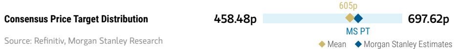

bar_line

| Category             | Value    |
| -------------------- | -------- |
| Mean                 | 605p     |
| MS Estimates | 697.62p  |
| Consensus Price Target Distribution | 458.48p  |

RISK REWARD CHART AND OPTIONS IMPLIED PROBABILITIES (12M)   
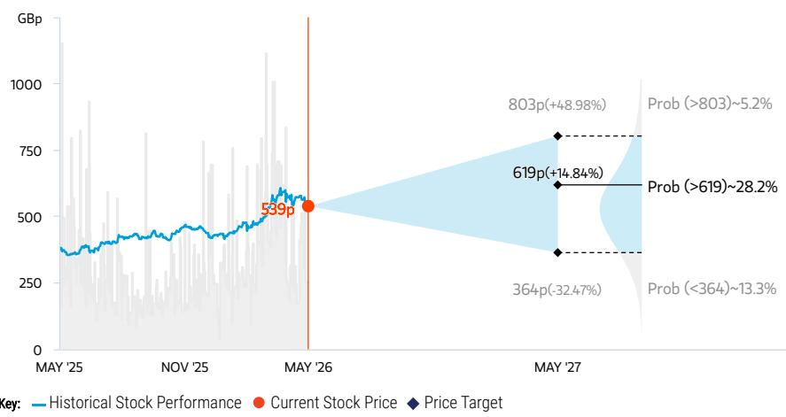

line

| Date     | Historical Stock Performance | Current Stock Price | Price Target |
| -------- | ----------------------------- | ------------------- | ------------ |
| MAY '26  | 539p                          | 539p                |              |
| MAY '27  | 803p(+48.98%)                 | 619p(+14.84%)       | Prob (>803)   |
| MAY '27  | 803p(+5.2%)                   | 619p(-28.2%)        | Prob (>619)   |
| MAY '27  | 803p(-13.3%)                  | 364p(-32.47%)       | Prob (<364)   |

Source: Refinitiv, MS, MS Institutional Equities Division. The probabilities of our Bull, Base, and Bear case scenarios playing out were estimated with implied volatility data from the options market as of 11 May 2026. All figures are approximate risk-neutral probabilities of the stock reaching beyond the scenario price in either three-months' or one-years' time. View explanation of Options Probabilities methodology here

# OVERWEIGHT THESIS

■ We saw signs of renewed operational momentum in BP's current turnaround plan, including exploration success, progress on cost savings, and announcements of asset disposals.   
■ A structurally stronger oil and gas outlook has come at the right time, allowing the company to de-gear faster and on a self-funded basis.   
■ Higher prices shorten the timeline to reinstate buybacks and avoid hard choices between leaning in to upstream growth and offering competitive distributions.   
■ Risk-reward now skewed positive in our view, as macro shifts from constraint to cash expansion; we are Overweight.

Consensus Rating Distribution   
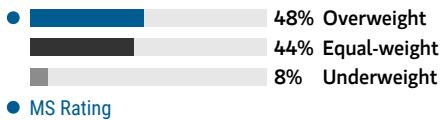

bar

| Category | Value (%) |
|---|---|
| Overweight | 48 |
| Equal-weight | 44 |
| Underweight | 8 |
MS Rating

Source: Refinitiv, MS

# Risk Reward Themes

Self-help: Positive

View descriptions of Risk Rewards Themes here

# BULL CASE

# Renewed momentum at full steam

We assume DPS of \$0.36 in 2027, growing by 6% p.a. until 2030, 5% p.a. until \~2050, reverting to 2% into perpetuity. We discount dividends at a 7.25% cost of equity.

# 803p

# BASE CASE

# Execution improvements

We assume DPS of \~\$0.36 in 2027, growing by 4% to mid-2030s, 3.5% until \~2045 and then by 3% into perpetuity. We discount dividends at an \~8% cost of equity.

# 619p

# BEAR CASE

# 364p

# Muted DPS growth

We assume a DPS of \$0.34 in 2027, growing at 2% p.a. to \~2030 and 1% thereafter. We discount dividends at a 8.25% cost of equity.

# Risk Reward – BP plc (BP.L)

KEY EARNINGS INPUTS 

<table><tr><td>Drivers</td><td>2025</td><td>2026e</td><td>2027e</td><td>2028e</td></tr><tr><td>Brent ($/bbl)</td><td>69.1</td><td>95.2</td><td>80.0</td><td>81.2</td></tr><tr><td>Henry Hub ($/MMBtu)</td><td>3.4</td><td>3.8</td><td>4.0</td><td>4.1</td></tr><tr><td>Total Production (thousand boe/d)</td><td>2,311</td><td>2,310</td><td>2,339</td><td>2,364</td></tr><tr><td>BP Average RMM ($/bbl)</td><td>12.8</td><td>16.5</td><td>10.6</td><td>10.9</td></tr><tr><td>Capex ($ Million)</td><td>14,533</td><td>13,390</td><td>13,000</td><td>14,745</td></tr></table>

# INVESTMENT DRIVERS

- Oil and gas prices, refining and chemical margins   
- Oil and gas production, downstream utilisation   
• Capital expenditure, especially relative to dividend   
• Organic FCF, dividend cover and gearing (ND/ND+E)   
• Dividend sustainability and growth

# GLOBAL REVENUE EXPOSURE

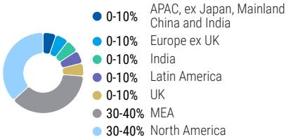

pie

| Region | Percentage (%) |
| :--- | :--- |
| APAC, ex Japan, Mainland China and India | 0-10 |
| Europe ex UK | 0-10 |
| India | 0-10 |
| Latin America | 0-10 |
| UK | 0-10 |
| MEA | 30-40 |
| North America | 30-40 |

Source: MS Estimate View explanation of regional hierarchies here

# MS ALPHA MODELS

1/5

MOST

3 Month

Horizon

Source: Refinitiv, FactSet, MS; 1 is the highest favored Quintile and 5 is the least favored Quintile

# RISKS TO PT/RATING

# RISKS TO UPSIDE

- Higher oil prices   
- Lower capex   
• Higher cost savings   
• Shareholder remuneration growth   
• Significant asset sales at good value   
- Execution in low-carbon businesses starts to improve

# RISKS TO DOWNSIDE

• A decline in commodity prices   
• Delays to key start-ups   
• Accelerating mature field decline rates   
• Higher than expected capex   
- Lower than expected cost savings   
• Shareholder remuneration slowdown

# OWNERSHIP POSITIONING

heatmap

| Category                     | Value |
| ---------------------------- | ----- |
| Inst. Owners, % Active       | 61.5% |
| HF Sector Long/Short Ratio   | 2x    |
| HF Sector Net Exposure        | 3%    |

Refinitiv; MSPB Content. Includes certain hedge fund exposures held with MSPB. Information may be inconsistent with or may not reflect broader market trends. Long/Short Ratio = Long Exposure / Short exposure. Sector % of Total Net Exposure = (For a particular sector: Long Exposure - Short Exposure) / (Across all sectors: Long Exposure – Short Exposure).

# MS ESTIMATES VS. CONSENSUS

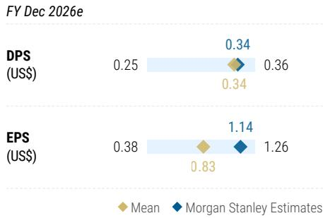

bar_line

| Metric | Mean | MS Estimates |
|--------|------|--------------------------|
| DPS (US$) | 0.25 | 0.34 |
| EPS (US$) | 0.38 | 1.14 |

Source: Refinitiv, MS

# Risk Reward – BP plc (BP.N)

Macro Tailwind Compounds with Execution – Overweight

# PRICE TARGET US\$49.40

We derive our 2026 year-end price target from our base case valuation of the shares using a DDM model. We assume DPS of \~\$0.36 in 2027, growing by 4% to \~mid-2030s, \~3.5% to \~2045 and then by \~3% into perpetuity. We discount dividends at an \~8% cost of equity. Our ADR target is derived from our target for the local stock, using a GBP:USD rate of 1.33.

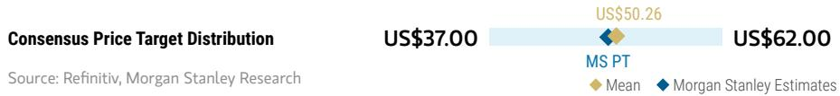

bar_line

| Category | Price Target (US$) |
| -------- | ------------------ |
| MS PT    | 50.26              |
| MS Estimates | 62.00          |
| Mean     | -                  |
| MS Estimates | -                  |

RISK REWARD CHART AND OPTIONS IMPLIED PROBABILITIES (12M)   
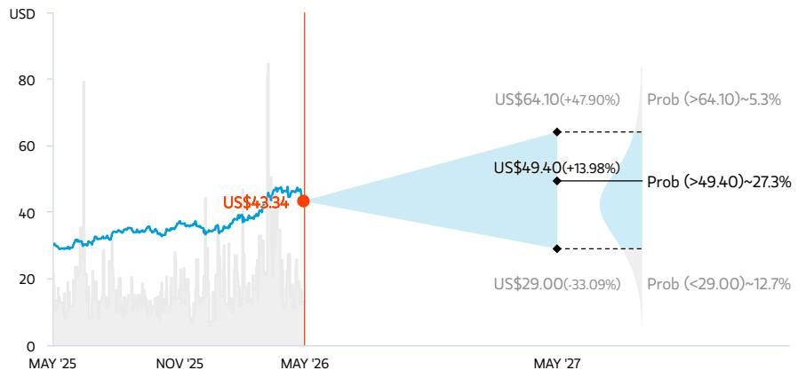

line

| Date       | Value     |
| ---------- | --------- |
| MAY '25    | US$43.34  |
| MAY '26    | US$64.10  |
| MAY '27    | US$49.40  |
| MAY '27    | Prob (>64.10) ~5.3% |
| MAY '27    | Prob (>49.40) ~27.3% |
| MAY '27    | Prob (<29.00) ~12.7% |
| MAY '27    | US$29.00  |

Key: — Historical Stock Performance ● Current Stock Price ◆ Price Target   
Source: Refinitiv, MS, MS Institutional Equities Division. The probabilities of our Bull, Base, and Bear case scenarios playing out were estimated with implied volatility data from the options market as of 8 May 2026. All figures are approximate risk-neutral probabilities of the stock reaching beyond the scenario price in either three-months' or one-years' time. View explanation of Options Probabilities methodology here

# OVERWEIGHT THESIS

■ We saw signs of renewed operational momentum in BP's current turnaround plan, including exploration success, progress on cost savings, and announcements of asset disposals.   
■ A structurally stronger oil and gas outlook has come at the right time, allowing the company to de-gear faster and on a self-funded basis.   
■ Higher prices shorten the timeline to reinstate buybacks and avoid hard choices between leaning in to upstream growth and offering competitive distributions.   
■ Risk-reward now skewed positive in our view, as macro shifts from constraint to cash expansion; we are Overweight.

Consensus Rating Distribution   
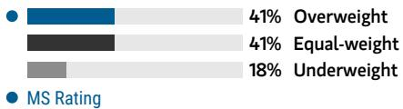

bar

| Category      | Value |
| ------------- | ----- |
| Overweight    | 41%   |
| Equal-weight  | 41%   |
| Underweight   | 18%   |

Source: Refinitiv, MS

# Risk Reward Themes

Self-help: Positive

View descriptions of Risk Rewards Themes here

# BULL CASE

# US\$64.10

# BASE CASE

# US\$49.40

# BEAR CASE

# US\$29.00

# Renewed momentum at full steam

We assume DPS of \$0.36 in 2027, growing by 6% p.a. until 2030, 5% p.a. until \~2050, reverting to 2% into perpetuity. We discount dividends at a 7.25% cost of equity.

# Execution improvements

We assume DPS of \~\$0.36 in 2027, growing by 4% to mid-2030s, 3.5% until \~2045 and then by 3% into perpetuity. We discount dividends at an \~8% cost of equity.

# Muted DPS growth

We assume a DPS of \$0.34 in 2027, growing at 2% p.a. to \~2030 and by 1% thereafter. We discount dividends at an 8.25% cost of equity.

# Risk Reward – BP plc (BP.N)

KEY EARNINGS INPUTS 

<table><tr><td>Drivers</td><td>2025</td><td>2026e</td><td>2027e</td><td>2028e</td></tr><tr><td>Brent ($/bbl)</td><td>69.1</td><td>95.2</td><td>80.0</td><td>81.2</td></tr><tr><td>Henry Hub ($/MMBtu)</td><td>3.4</td><td>3.8</td><td>4.0</td><td>4.1</td></tr><tr><td>Total Production (thousand boe/d)</td><td>2,311</td><td>2,310</td><td>2,339</td><td>2,364</td></tr><tr><td>BP Average RMM ($/bbl)</td><td>12.8</td><td>16.5</td><td>10.6</td><td>10.9</td></tr><tr><td>Capex ($ Million)</td><td>14,533</td><td>13,390</td><td>13,000</td><td>14,745</td></tr></table>

# INVESTMENT DRIVERS

- Oil and gas prices, refining and chemical margins   
• Oil and gas production, downstream utilisation   
• Capital expenditure, especially relative to dividend   
• Organic FCF, dividend cover and gearing (ND/ND+E)   
• Dividend sustainability and growth

# GLOBAL REVENUE EXPOSURE

pie

| Region | Percentage (%) |
| :--- | :--- |
| APAC, ex Japan, Mainland China and India | 0-10 |
| Europe ex UK | 0-10 |
| India | 0-10 |
| Latin America | 0-10 |
| UK | 0-10 |
| MEA | 30-40 |
| North America | 30-40 |

Source: MS Estimate View explanation of regional hierarchies here

# RISKS TO PT/RATING

# RISKS TO UPSIDE

- Higher oil prices   
- Lower capex   
• Higher cost savings   
• Shareholder remuneration growth   
• Significant asset sales at good value   
- Improvement in low-carbon business returns

# RISKS TO DOWNSIDE

• A decline in commodity prices   
- Delays to key start-ups   
• Accelerating mature field decline rates   
• Higher than expected capex   
- Lower than expected cost savings   
• Shareholder remuneration slowdown

# OWNERSHIP POSITIONING

<table><tr><td>Inst. Owners, % Active</td><td>72.2%</td><td></td></tr><tr><td>HF Sector Long/Short Ratio</td><td>1.7x</td><td></td></tr><tr><td>HF Sector Net Exposure</td><td>4.3%</td><td></td></tr></table>

Refinitiv; MSPB Content. Includes certain hedge fund exposures held with MSPB. Information may be inconsistent with or may not reflect broader market trends. Long/Short Ratio = Long Exposure / Short exposure. Sector % of Total Net Exposure = (For a particular sector: Long Exposure - Short Exposure) / (Across all sectors: Long Exposure – Short Exposure).

# MS ESTIMATES VS. CONSENSUS

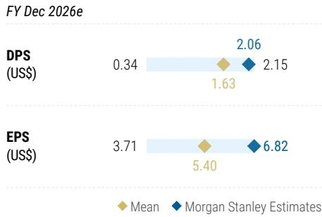

bar_line

| Metric | Mean | MS Estimates |
|--------|------|--------------------------|
| DPS (US$) | 0.34 | 2.06 |
| EPS (US$) | 3.71 | 6.82 |

Source: Refinitiv, MS

# Risk Reward – Eni SpA (ENI.MI)

Clarity on Long-Term Strategy Priced In – Equal-weight

# PRICE TARGET €25.30

We set our end-2026 price target in line with our base case valuation using a discount dividend model. We forecast 2027 DPS of €1.16. We assume 5% p.a. DPS growth to 2030, followed by 3.5% p.a. to \~2045 and then 3% p.a. into perpetuity. We use an \~8% cost of equity.

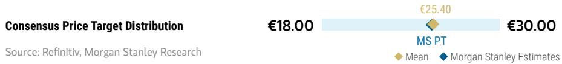

bar_line

| Category | Price Target (€) |
| -------- | ---------------- |
| MS PT    | 25.40            |
| MS Estimates | 30.00          |

RISK REWARD CHART AND OPTIONS IMPLIED PROBABILITIES (12M)   
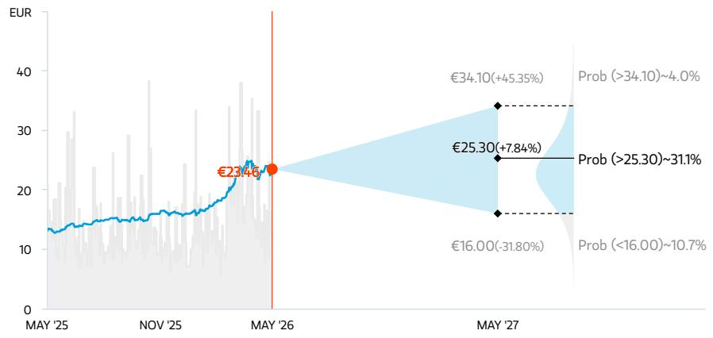

line

| Date     | Value   | Probability Range |
| -------- | ------- | ----------------- |
| MAY '26  | €23.48  | -                 |
| MAY '27  | €34.10  | +45.35%           |
| MAY '27  | €25.30  | +7.84%            |
| MAY '27  | €16.00  | -31.80%           |
| MAY '27  | Prob (>34.10) ~ 4.0% | |
| MAY '27  | Prob (>25.30) ~ 31.1% | |
| MAY '27  | Prob (<16.00) ~ 10.7% | |

Key: — Historical Stock Performance ● Current Stock Price ◆ Price Target   
Source: Refinitiv, MS, MS Institutional Equities Division. The probabilities of our Bull, Base, and Bear case scenarios playing out were estimated with implied volatility data from the options market as of 11 May 2026. All figures are approximate risk-neutral probabilities of the stock reaching beyond the scenario price in either three-months' or one-years' time. View explanation of Options Probabilities methodology here

# EQUAL-WEIGHT THESIS

■ Eni has a clear vision of what its future looks like and is delivering on its 'satellite' strategy more quickly than we initially expected, and at attractive multiples.   
■ Disposals inflows and a stronger macro backdrop are preventing gearing from rising, which could provide upside to buybacks in the near term.   
However, Eni's successful execution has left the company trading at a premium to peers, and we prefer to wait for a better entry point to play the story; we rate the shares Equal-weight.

Consensus Rating Distribution   
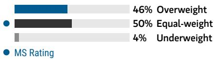

bar

| Category       | Value |
| -------------- | ----- |
| Overweight     | 46%   |
| Equal-weight   | 50%   |
| Underweight    | 4%    |
| MS Rating      | 4%    |

Source: Refinitiv, MS

# Risk Reward Themes

Renewable Energy: Positive

Self-help: Positive

View descriptions of Risk Rewards Themes here

# BULL CASE

# €34.10

# BASE CASE

# €25.30

# BEAR CASE

# €16.00

# DPS growth accelerates in the coming years

Eni accelerates DPS growth supported by a more benign commodity price environment and share buybacks. We assume this leads to average DPS growth of 7.5% p.a. until 2030, 5% until \~2050, and 2% into perpetuity. We factor in a 7.5% cost of equity.

# 4% annual DPS growth to 2030

We forecast 2027 DPS of €1.16. We assume 5% p.a. DPS growth to 2030, followed by 3.5% p.a. to \~2050 and then 2% p.a. into perpetuity. We use an \~8% cost of equity.

# Reduced DPS hikes

We assume DPS grows by 2% p.a. to \~2030 and then by 1.0% annually to perpetuity, We discount the dividend flow stream by 8.5%.

# Risk Reward – Eni SpA (ENI.MI)

KEY EARNINGS INPUTS 

<table><tr><td>Drivers</td><td>2025</td><td>2026e</td><td>2027e</td><td>2028e</td></tr><tr><td>Brent price ($/bbl) (€)</td><td>69</td><td>95</td><td>80</td><td>81</td></tr><tr><td>NBP price (p/therm) (€)</td><td>89</td><td>156</td><td>113</td><td>68</td></tr><tr><td>Standard Eni refining margin ($/bbl) (€)</td><td>7</td><td>10</td><td>6</td><td>5</td></tr><tr><td>Total hydrocarbon production (Kboe/d)</td><td>1,728</td><td>1,798</td><td>1,852</td><td>1,905</td></tr></table>

# INVESTMENT DRIVERS

• Oil and gas prices, refining and chemical margins   
- Oil and gas production, downstream utilisation   
• Capital expenditure, especially relative to dividend   
• Organic FCF, dividend cover and gearing (ND/ND+E)   
• Dividend sustainability and growth

# GLOBAL REVENUE EXPOSURE

0-10% APAC, ex Japan, Mainland China and India   
0-10% Latin America   
0-10% North America   
10-20% Europe ex UK   
60-70% MEA

Source: MS Estimate View explanation of regional hierarchies here

# MS ALPHA MODELS

3/5

MOST

3 Month

Horizon

Source: Refinitiv, FactSet, MS; 1 is the highest favored Quintile and 5 is the least favored Quintile

# RISKS TO PT/RATING

# RISKS TO UPSIDE

• Higher commodity prices   
- Higher than expected value unlock from 'satellite' strategy   
• Higher than expected dividends   
• High E&P production growth   
- Lower capex

# RISKS TO DOWNSIDE

• Lower commodity prices   
- Disappointing value unlock from 'satellite' strategy   
- Dividend cuts   
• Higher-than-expected capex   
• Production declines

# OWNERSHIP POSITIONING

<table><tr><td>Inst. Owners, % Active</td><td>54.1%</td><td></td><td></td><td></td><td></td></tr><tr><td>HF Sector Long/Short Ratio</td><td>2x</td><td></td><td></td><td></td><td></td></tr><tr><td>HF Sector Net Exposure</td><td>3%</td><td></td><td></td><td></td><td></td></tr></table>

Refinitiv; MSPB Content. Includes certain hedge fund exposures held with MSPB. Information may be inconsistent with or may not reflect broader market trends. Long/Short Ratio = Long Exposure / Short exposure. Sector % of Total Net Exposure = (For a particular sector: Long Exposure - Short Exposure) / (Across all sectors: Long Exposure – Short Exposure).

# MS ESTIMATES VS. CONSENSUS

FY Dec 2026e

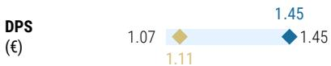

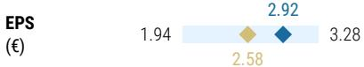  
◆ Mean ◆ MS Estimates   
Source: Refinitiv, MS

# Risk Reward – Eni SpA (E.N)

Clarity on Long-Term Strategy Priced In – Equal-weight

# PRICE TARGET US\$58.80

We set our end-2026 price target in line with our base case valuation using a discount dividend model. We forecast 2027 DPS of €1.16. We assume 5% p.a. DPS growth to 2030, followed by 3.5% p.a. to \~2045 and then 2% p.a. into perpetuity. We use an \~8% cost of equity. Our ADR target is derived from our price target for the local stock, using a EUR:USD rate of 1.16.

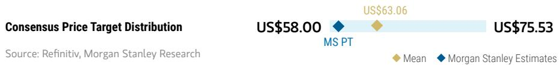

bar_line

| Scenario         | Price    |
| ---------------- | -------- |
| MS PT            | $58.00   |
| MS  | $63.06   |
| US$75.53         | $75.53   |

RISK REWARD CHART   
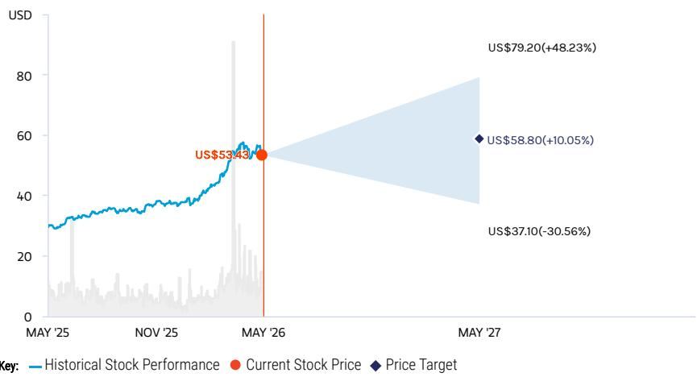

line

| Date     | Historical Stock Performance | Current Stock Price | Price Target |
| -------- | ---------------------------- | ------------------- | ------------ |
| MAY '25  | ~30                          | -                   | -            |
| NOV '25  | ~35                          | -                   | -            |
| MAY '26  | $53.43                       | $53.43              | -            |
| MAY '27  | -                            | $58.80              | $58.80       |

Source: Refinitiv, MS

# EQUAL-WEIGHT THESIS

■ Eni has a clear vision of what its future looks like and is delivering on its 'satellite' strategy more quickly than we initially expected, and at attractive multiples.   
■ Disposals inflows and a stronger macro backdrop are preventing gearing from rising, which could provide upside to buybacks in the near term.   
However, Eni's successful execution has left the company trading at a premium to peers, and we prefer to wait for a better entry point to play the story; we rate the shares Equal-weight.

Consensus Rating Distribution   
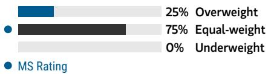

bar

| Category      | Value |
| ------------- | ----- |
| Overweight    | 25%   |
| Equal-weight  | 75%   |
| Underweight   | 0%    |
| MS Rating     | 0%    |

Source: Refinitiv, MS

# Risk Reward Themes

Renewable Energy: Positive
Self-help: Positive

View descriptions of Risk Rewards Themes here

# BULL CASE

# US\$79.20

# BASE CASE

# US\$58.80

# BEAR CASE

# US\$37.10

# DPS growth accelerates in the coming years

Eni accelerates DPS growth supported by a more benign commodity price environment and share buybacks. We assume this leads to average DPS growth of 7.5% p.a. until 2030, 5% until \~2050, and 2% into perpetuity. We factor in a 7.5% cost of equity.

# 4% annual DPS growth to 2030

We forecast 2027 DPS of €1.16. We assume 5% p.a. DPS growth to 2030, followed by 3.5% p.a. to \~2045 and then 3% p.a. into perpetuity. We use an \~8% cost of equity.

# Reduced DPS hikes

We assume DPS grows by 2% p.a. to \~2030 and then by 1% annually to perpetuity, We discount the dividend flow stream by 8.5%.

# Risk Reward – Eni SpA (E.N)

KEY EARNINGS INPUTS 

<table><tr><td>Drivers</td><td>2025</td><td>2026e</td><td>2027e</td><td>2028e</td></tr><tr><td>Brent price ($/bbl) (€)</td><td>69</td><td>95</td><td>80</td><td>81</td></tr><tr><td>NBP price (p/therm) (€)</td><td>89</td><td>156</td><td>113</td><td>68</td></tr><tr><td>Standard Eni refining margin ($/bbl) (€)</td><td>7</td><td>10</td><td>6</td><td>5</td></tr><tr><td>Total hydrocarbon production (Kboe/d)</td><td>1,728</td><td>1,798</td><td>1,852</td><td>1,905</td></tr></table>

# INVESTMENT DRIVERS

• Oil and gas prices, refining and chemical margins   
- Oil and gas production, downstream utilisation   
• Capital expenditure, especially relative to dividend   
• Organic FCF, dividend cover and gearing (ND/ND+E)   
• Dividend sustainability and growth

GLOBAL REVENUE EXPOSURE   
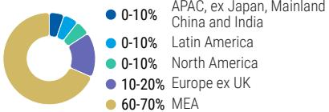

pie

| Region | Percentage (%) |
| :--- | :--- |
| APAC, ex Japan, Mainland China and India | 0-10 |
| Latin America | 0-10 |
| North America | 0-10 |
| Europe ex UK | 10-20 |
| MEA | 60-70 |

Source: MS Estimate View explanation of regional hierarchies here

# RISKS TO PT/RATING

# RISKS TO UPSIDE

• Higher commodity prices   
- Higher than expected value unlock from 'satellite' strategy   
• Higher than expected dividends   
• High E&P production growth   
- Lower capex

# RISKS TO DOWNSIDE

• Lower commodity prices   
- Disappointing value unlock from 'satellite' strategy   
- Dividend cuts   
• Higher-than-expected capex   
• Production declines

OWNERSHIP POSITIONING   
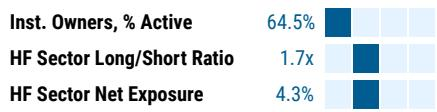

heatmap

| Category                  | Value  |
| ------------------------- | ------ |
| Inst. Owners, % Active    | 64.5%  |
| HF Sector Long/Short Ratio | 1.7x   |
| HF Sector Net Exposure    | 4.3%   |

Refinitiv; MSPB Content. Includes certain hedge fund exposures held with MSPB. Information may be inconsistent with or may not reflect broader market trends. Long/Short Ratio = Long Exposure / Short exposure. Sector % of Total Net Exposure = (For a particular sector: Long Exposure - Short Exposure) / (Across all sectors: Long Exposure – Short Exposure).

MS ESTIMATES VS. CONSENSUS   
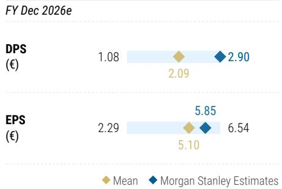

bar_line

| Metric | Mean | MS Estimates |
|--------|------|--------------------------|
| DPS (€) | 2.09 | 2.90                     |
| EPS (€) | 5.10 | 5.85                     |

Source: Refinitiv, MS

# Risk Reward – Saudi Aramco (2222.SE)

Resilient Under a Volatile Environment - Equal-weight

# PRICE TARGET SAR 28.40

We derive our price target from our base case valuation of the shares using a dividend discount model, in which we forecast base dividends to grow by 4% p.a. until \~2045, moderating to 2% p.a. thereafter. We use a 8.5% discount rate.

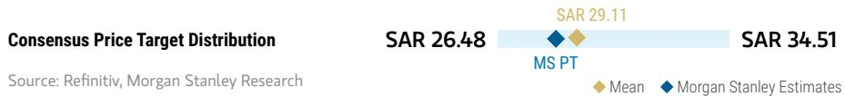

bar_line

| Consensus Price Target Distribution | SAR Value |
| ----------------------------------- | --------- |
| SAR 26.48                           | 29.11     |
| SAR 34.51                           | 34.51     |

RISK REWARD CHART   
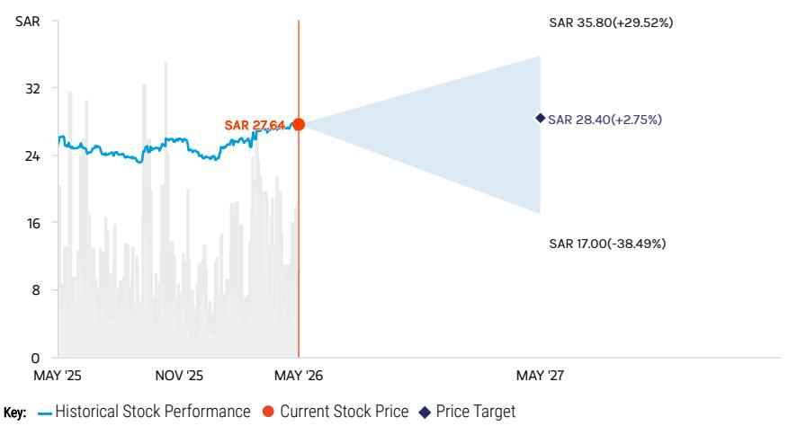

line

| Date     | Historical Stock Performance | Current Stock Price | Price Target |
| -------- | ----------------------------- | ------------------- | ------------ |
| MAY '26  | 27.64                         | -                   | -            |
| MAY '27  | -                             | 35.80(+29.52%)      | 28.40(+2.75%) |

Source: Refinitiv, MS

# EQUAL-WEIGHT THESIS

■ Saudi Aramco, the world's largest oil company, has a leading cost position, extensive reserve life and one of the lowest carbon intensities.   
The company's unique asset base is partly offset by its high oil price sensitivity, higher geopolitical risks, and limited minority investor influence.   
■ Over the coming years, dividend surprises could rely on a balance between Aramco's ability to raise production levels and its balance sheet.

Consensus Rating Distribution   
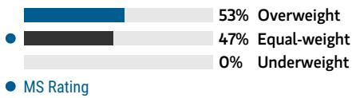

bar

| Category     | Value |
| ------------ | ----- |
| Overweight   | 53%   |
| Equal-weight | 47%   |
| Underweight  | 0%    |

Source: Refinitiv, MS

# Risk Reward Themes

Pricing Power: Positive

View descriptions of Risk Rewards Themes here

# BULL CASE

# \~5% DPS mid-term growth

We forecast base dividends to grow by 6% p.a. until 2030. Following this period, we assume a 20-year period of \~5% growth, moderating to 2% p.a. thereafter. We use an 8% discount rate.

# SAR 35.80

# BASE CASE

# SAR 28.40

# \~4% DPS mid-term growth

We forecast base dividends to grow by 4% p.a. until \~2045, moderating to 2% p.a. thereafter. We use an 8.5% discount rate.

# BEAR CASE

# SAR 17.00

# \~0.5% DPS mid-term growth

We assume an average DPS growth rate of 0.5% p.a. to perpetuity, and discount the dividend flow stream at a cost of equity of 9%.

# Risk Reward – Saudi Aramco (2222.SE)

KEY EARNINGS INPUTS 

<table><tr><td>Drivers</td><td>2025</td><td>2026e</td><td>2027e</td><td>2028e</td></tr><tr><td>Brent price ($/b)</td><td>68.7</td><td>95.2</td><td>80.0</td><td>81.2</td></tr><tr><td>Total production (thousand boe/d)</td><td>12,917</td><td>13,349</td><td>14,240</td><td>14,484</td></tr><tr><td>Cash capex (SAR million)</td><td>190,444</td><td>188,739</td><td>186,058</td><td>178,991</td></tr></table>

# INVESTMENT DRIVERS

- Oil and gas prices, refining and chemical margins   
- Oil and gas production, downstream utilisation   
• Capital expenditure, especially relative to dividend   
- Organic FCF, dividend cover and gearing (ND/ND+E)   
• Dividend sustainability and growth

# GLOBAL REVENUE EXPOSURE

100%

MEA

Source: MS Estimate View explanation of regional hierarchies here

# MS ALPHA MODELS

3/5

MOST

3 Month

Horizon

Source: Refinitiv, FactSet, MS; 1 is the highest favored Quintile and 5 is the least favored Quintile

# RISKS TO PT/RATING

# RISKS TO UPSIDE

• Stronger oil prices with stable/higher production   
• Higher refining and chemicals margins   
• Higher dividend growth   
- Lower capex

# RISKS TO DOWNSIDE

- Lower oil prices   
• Lower refining and chemicals margins   
- Lower dividend growth   
- Higher capex

# OWNERSHIP POSITIONING

<table><tr><td>Inst. Owners, % Active</td><td>30.9%</td><td></td><td></td></tr><tr><td>HF Sector Long/Short Ratio</td><td>2x</td><td></td><td></td></tr><tr><td>HF Sector Net Exposure</td><td>3%</td><td></td><td></td></tr></table>

Refinitiv; MSPB Content. Includes certain hedge fund exposures held with MSPB. Information may be inconsistent with or may not reflect broader market trends. Long/Short Ratio = Long Exposure / Short exposure. Sector % of Total Net Exposure = (For a particular sector: Long Exposure - Short Exposure) / (Across all sectors: Long Exposure – Short Exposure).

# MS ESTIMATES VS. CONSENSUS

FY Dec 2026e

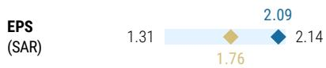

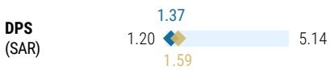

♦ MS Estimates

Source: Refinitiv, MS

# Risk Reward – TotalEnergies SE (TTE.N)

Compounding Through Cycle – Overweight

# PRICE TARGET US\$103.30

We derive our 2026 year-end price target from our base case valuation of the shares using a DDM model. We forecast a 2027 DPS of \~€3.78. We assume 5% p.a. dividend growth until 2030, then 3.5% growth for \~20 years, followed by 3% p.a into perpetuity. We apply an \~8% cost of equity. Our ADR target is derived from our target for the local stock, using a EUR:USD rate of 1.16.

RISK REWARD CHART AND OPTIONS IMPLIED PROBABILITIES (12M)   
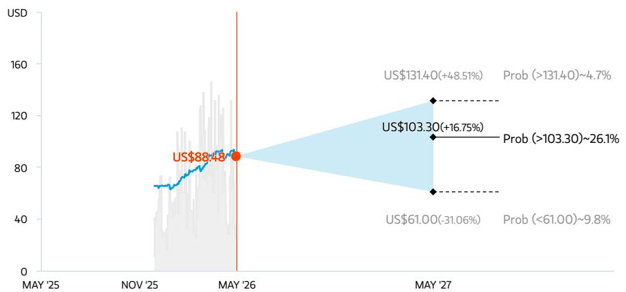

line

| Date    | Price     | Probability Range |
|---------|-----------|-------------------|
| MAY '25 | $88.48    | -                 |
| MAY '26 | -         | -                 |
| MAY '27 | $103.30   | +16.75%           |
| MAY '27 | $131.40   | +48.51%           |
| MAY '27 | $61.00    | -31.06%           |
| MAY '27 | -         | -                 |

Key: — Historical Stock Performance ● Current Stock Price ◆ Price Target   
Source: Refinitiv, MS, MS Institutional Equities Division. The probabilities of our Bull, Base, and Bear case scenarios playing out were estimated with implied volatility data from the options market as of 8 May 2026. All figures are approximate risk-neutral probabilities of the stock reaching beyond the scenario price in either three-months' or one-years' time. View explanation of Options Probabilities methodology here

# OVERWEIGHT THESIS

■ The company offers a best-in-class balance of growth, resilience and capital discipline across cycles.   
■ Visible growth pipelines in both upstream and integrated power, along with strong execution and self-help, underpin sustained FCF expansion and per-share growth.   
■ Management took action to prepare the company for a softer commodity outlook; price-conditioned buybacks ensure capital returns while retaining flexibility.   
■ We remain Overweight on an 'all-weather' mix of defensiveness and distribution upside.

Consensus Rating Distribution   
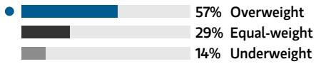

bar

| Category | Value (%) |
|---|---|
| Overweight | 57 |
| Equal-weight | 29 |
| Underweight | 14 |

MS Rating   
Source: Refinitiv, MS

# Risk Reward Themes

Renewable Energy: Positive

View descriptions of Risk Rewards Themes here

# BULL CASE

# US\$131.40

# BASE CASE

# US\$103.30

# BEAR CASE

# US\$61.00

# Higher buybacks sustain higher DPS growth

We model a 2027 DPS of \~€3.78. We then assume \~6% p.a. dividend growth until 2030 and a long-term growth rate of 5% p.a. for 20 years, followed by 2% p.a. We apply a 7.25% cost of equity.

# DPS growth facilitated by buybacks

We forecast a 2027 DPS of \~€3.78. We assume \~5% p.a. dividend growth until 2030, then a long-term growth rate of 3.5% for \~20 years, followed by 3% p.a. We apply an \~8% cost of equity.

# DPS growth lower into perpetuity

We model a 2027 DPS of \~€3.69. We then assume 2% p.a. growth rate to 2030, followed by 1% p.a. into perpetuity. We apply an 8.25% cost of equity.

# Risk Reward – TotalEnergies SE (TTE.N)

KEY EARNINGS INPUTS 

<table><tr><td>Drivers</td><td>2025</td><td>2026e</td><td>2027e</td><td>2028e</td></tr><tr><td>Brent price ($/bbl) (US$)</td><td>69</td><td>95</td><td>80</td><td>81</td></tr><tr><td>NBP price (p/therm) (US$)</td><td>89</td><td>156</td><td>113</td><td>68</td></tr><tr><td>Standard Eni refining margin ($/bbl) (US$)</td><td>53</td><td>79</td><td>36</td><td>34</td></tr><tr><td>Total hydrocarbon production (Kboe/d)</td><td>2,528</td><td>2,500</td><td>2,635</td><td>2,715</td></tr></table>

# INVESTMENT DRIVERS

• Oil and gas prices, refining and chemical margins   
- Oil and gas production, downstream utilisation   
• Capital expenditure, especially relative to dividend   
• Organic FCF, dividend cover and gearing (ND/ND+E)   
• Dividend sustainability and growth

# GLOBAL REVENUE EXPOSURE

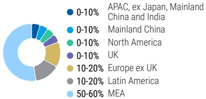

pie

| Region | Percentage (%) |
| :--- | :--- |
| APAC, ex Japan, Mainland China and India | 0-10 |
| Mainland China | 0-10 |
| North America | 0-10 |
| UK | 0-10 |
| Europe ex UK | 10-20 |
| Latin America | 10-20 |
| MEA | 50-60 |

Source: MS Estimate View explanation of regional hierarchies here

# RISKS TO PT/RATING

# RISKS TO UPSIDE

• Higher commodity prices   
- Lower capex   
• Higher than expected cost savings   
- Remuneration growth   
• Significant asset sales at good value

# RISKS TO DOWNSIDE

• Lower commodity prices   
• Delays to key start-ups   
- Remuneration slowdown   
• Accelerating mature field decline rates   
• Higher-than-expected capex   
- Lower-than-expected cost savings

# OWNERSHIP POSITIONING

<table><tr><td>Inst. Owners, % Active</td><td>70.8%</td><td colspan="2"></td></tr><tr><td>HF Sector Long/Short Ratio</td><td>1.7x</td><td colspan="2"></td></tr><tr><td>HF Sector Net Exposure</td><td>4.3%</td><td colspan="2"></td></tr></table>

Refinitiv; MSPB Content. Includes certain hedge fund exposures held with MSPB. Information may be inconsistent with or may not reflect broader market trends. Long/Short Ratio = Long Exposure / Short exposure. Sector % of Total Net Exposure = (For a particular sector: Long Exposure - Short Exposure) / (Across all sectors: Long Exposure – Short Exposure).

# MS ESTIMATES VS. CONSENSUS

FY Dec 2026e

DPS (US\$)

Note: There are not sufficient brokers supplying consensus data for this metric

EPS
(US\$)

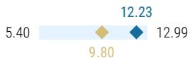

♦ MS Estimates

Source: Refinitiv, MS

# Risk Reward – TotalEnergies SE (TTEF.PA)

Top Pick

Compounding Through Cycle – Overweight

# PRICE TARGET €89.10

We derive our 2026 year-end price target from our base case valuation of the shares using a DDM model. We forecast a 2027 DPS of \~€3.78. We assume 5% p.a. dividend growth until \~2030, then 3.5% growth p.a. for \~20 years, followed by 3% p.a. into perpetuity. We apply an \~8% cost of equity.

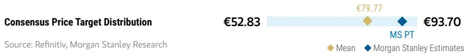

bar_line

| Category | Value   |
| -------- | ------- |
| Mean     | €79.77  |
| MS Estimates | €93.70  |

RISK REWARD CHART AND OPTIONS IMPLIED PROBABILITIES (12M)   
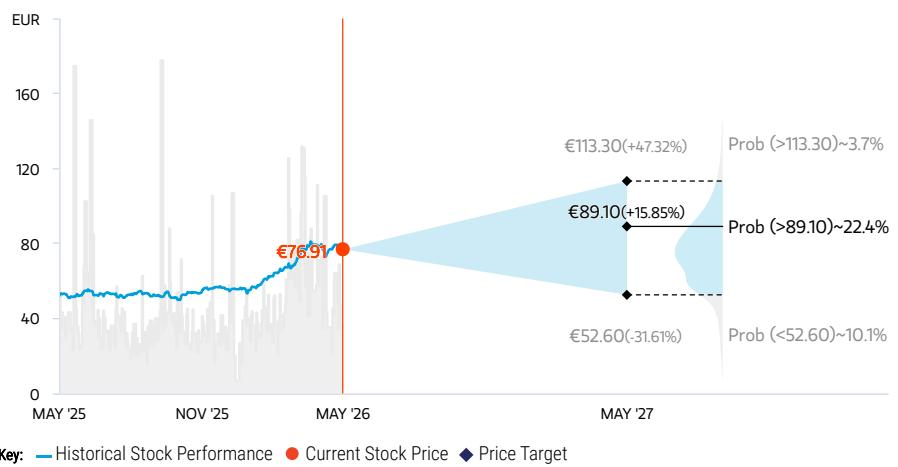

line

| Date     | Historical Stock Performance | Current Stock Price | Price Target |
| -------- | ----------------------------- | ------------------- | ------------ |
| MAY '26  | €76.91                        | -                   | -            |
| MAY '27  | €113.30 (+47.32%)           | -                   | -            |
| MAY '27  | €89.10 (+15.85%)             | -                   | -            |
| MAY '27  | €52.60 (-31.61%)             | -                   | -            |
| MAY '27  | Prob (>113.30)                | -                   | -            |
| MAY '27  | Prob (>89.10)                 | -                   | -            |
| MAY '27  | Prob (<52.60)                 | -                   | -            |

Source: Refinitiv, MS, MS Institutional Equities Division. The probabilities of our Bull, Base, and Bear case scenarios playing out were estimated with implied volatility data from the options market as of 11 May 2026. All figures are approximate risk-neutral probabilities of the stock reaching beyond the scenario price in either three-months' or one-years' time. View explanation of Options Probabilities methodology here

# OVERWEIGHT THESIS

■ The company offers a best-in-class balance of growth, resilience and capital discipline across cycles.   
■ Visible growth pipelines in both upstream and integrated power, along with strong execution and self-help, underpin sustained FCF expansion and per-share growth.   
■ Management took action to prepare the company for a softer commodity outlook; price-conditioned buybacks ensure capital returns while retaining flexibility.   
■ We remain Overweight on an 'all-weather' mix of defensiveness and distribution upside.

Consensus Rating Distribution   
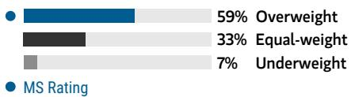

bar

| Category | Value (%) |
|---|---|
| Overweight | 59 |
| Equal-weight | 33 |
| Underweight | 7 |
MS Rating

Source: Refinitiv, MS

# Risk Reward Themes

Renewable Energy: Positive

View descriptions of Risk Rewards Themes here

# BULL CASE

# €113.30

# BASE CASE

# €89.10

# BEAR CASE

# €52.60

# Higher buybacks sustain higher DPS growth

We model a 2027 DPS of \~€3.78. We then assume \~6% p.a. dividend growth until 2030 and a long-term growth rate of 5% p.a. for 20 years, followed by 2% p.a. We apply a 7.25% cost of equity.

# DPS growth facilitated by buybacks

We forecast a 2027 DPS of \~€3.78. We assume \~5% p.a. dividend growth until 2030, then a long-term growth rate of 3.5% for \~20 years, followed by 3% p.a. We apply an \~8% cost of equity.

# DPS growth lower into perpetuity

We model a 2027 DPS of \~€3.69. We then assume 2% p.a. growth rate to 2030, followed by 1% p.a. into perpetuity. We apply an 8.25% cost of equity.

# Risk Reward – TotalEnergies SE (TTEF.PA)

KEY EARNINGS INPUTS 

<table><tr><td>Drivers</td><td>2025</td><td>2026e</td><td>2027e</td><td>2028e</td></tr><tr><td>Brent price ($/bbl) (US$)</td><td>69</td><td>95</td><td>80</td><td>81</td></tr><tr><td>NBP price (p/therm) (US$)</td><td>89</td><td>156</td><td>113</td><td>68</td></tr><tr><td>Standard Eni refining margin ($/bbl) (US$)</td><td>53</td><td>79</td><td>36</td><td>34</td></tr><tr><td>Total hydrocarbon production (Kboe/d)</td><td>2,528</td><td>2,500</td><td>2,635</td><td>2,715</td></tr></table>

# INVESTMENT DRIVERS

• Oil and gas prices, refining and chemical margins   
- Oil and gas production, downstream utilisation   
• Capital expenditure, especially relative to dividend   
• Organic FCF, dividend cover and gearing (ND/ND+E)   
• Dividend sustainability and growth

# GLOBAL REVENUE EXPOSURE

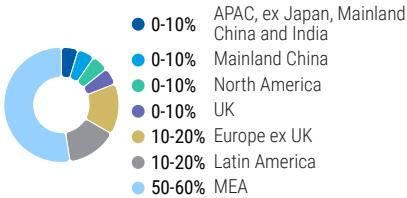

pie

| Region | Percentage (%) |
| :--- | :--- |
| APAC, ex Japan, Mainland China and India | 0-10 |
| Mainland China | 0-10 |
| North America | 0-10 |
| UK | 0-10 |
| Europe ex UK | 10-20 |
| Latin America | 10-20 |
| MEA | 50-60 |

Source: MS Estimate View explanation of regional hierarchies here

# MS ALPHA MODELS

3/5 MOST

3 Month Horizon

Source: Refinitiv, FactSet, MS; 1 is the highest favored Quintile and 5 is the least favored Quintile

# RISKS TO PT/RATING

# RISKS TO UPSIDE

• Higher commodity prices   
- Lower capex   
• Higher than expected cost savings   
- Remuneration growth   
• Significant asset sales at good value

# RISKS TO DOWNSIDE

• Lower commodity prices   
• Delays to key start-ups   
- Remuneration slowdown   
• Accelerating mature field decline rates   
• Higher-than-expected capex   
- Lower-than-expected cost savings

# OWNERSHIP POSITIONING

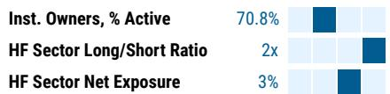

heatmap

| Category                  | Value |
| ------------------------- | ----- |
| Inst. Owners, % Active    | 70.8% |
| HF Sector Long/Short Ratio | 2x    |
| HF Sector Net Exposure    | 3%    |

Refinitiv; MSPB Content. Includes certain hedge fund exposures held with MSPB. Information may be inconsistent with or may not reflect broader market trends. Long/Short Ratio = Long Exposure / Short exposure. Sector % of Total Net Exposure = (For a particular sector: Long Exposure - Short Exposure) / (Across all sectors: Long Exposure – Short Exposure).

# MS ESTIMATES VS. CONSENSUS

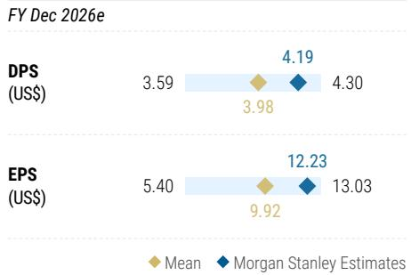

bar_line

| Metric (US$) | Mean  | MS Estimates |
|--------------|-------|--------------------------|
| DPS          | 3.59  | 4.19                     |
| EPS          | 5.40  | 12.23                    |

Source: Refinitiv, MS

# Risk Reward – Equinor ASA (EQNR.N)

More Balanced Risk-Reward – Equal-weight

# PRICE TARGET US\$40.40

We derive our end-2026 price target from our DDM model. We grow the base dividend of \~\$1.7/sh by \~4.5% until the end of the decade, and then by \~3.5% p.a. until the mid \~2040s, before reverting to a 3% pace to perpetuity. We discount the dividend stream at 7.5%. Our ADR target is derived from our target for the local stock, using a USD:NOK rate of 9.3.

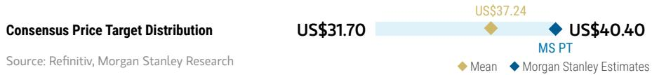

bar_line

| Consensus Price Target Distribution | Value     |
| ----------------------------------- | --------- |
| US$31.70                            | US$37.24  |
| US$40.40                            | US$40.40  |

RISK REWARD CHART AND OPTIONS IMPLIED PROBABILITIES (12M)   
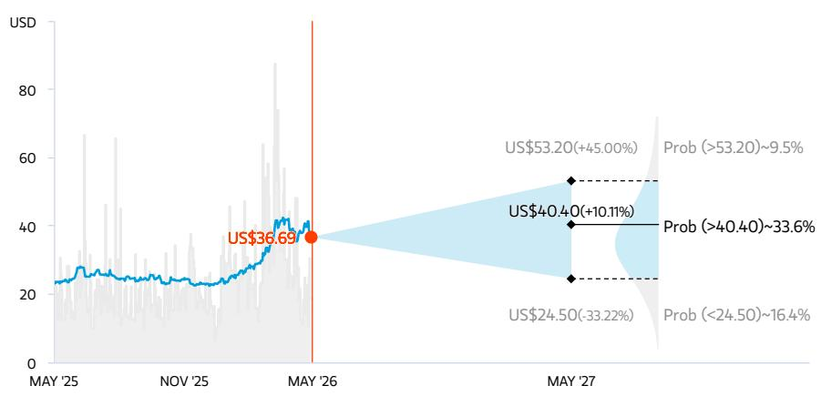

line

| Date     | Price    | Probability Range |
| -------- | -------- | ----------------- |
| MAY '25  | ~25      | -                 |
| NOV '25  | ~28      | -                 |
| MAY '26  | $36.69   | -                 |
| MAY '27  | $53.20   | +45.00%           |
| MAY '27  | $40.40   | +10.11%           |
| MAY '27  | $24.50   | -33.22%           |
| MAY '27  | ~$33.60  | -                 |
| MAY '27  | ~$16.40  | -                 |

Key: — Historical Stock Performance ● Current Stock Price ◆ Price Target   
Source: Refinitiv, MS, MS Institutional Equities Division. The probabilities of our Bull, Base, and Bear case scenarios playing out were estimated with implied volatility data from the options market as of 8 May 2026. All figures are approximate risk-neutral probabilities of the stock reaching beyond the scenario price in either three-months' or one-years' time. View explanation of Options Probabilities methodology here

# EQUAL-WEIGHT THESIS

■ Equinor's high gas leverage benefits the most from tightening gas markets, relative to its peer group.   
The company's core exposure to Europe and the Americas also makes it relatively more insulated from asset disruption risk in the current environment, commanding a valuation premium.   
■ However, capital allocation uncertainties persist in the core business, with the expected decline in the Norwegian Continental Shelf and a mixed record of international expansion.   
■ The shares' sharp re-rating already reflects stronger FCF and distribution assumptions, in our view.   
■ We rate Equinor Equal-weight, given a more balanced risk-reward profile.

Consensus Rating Distribution   
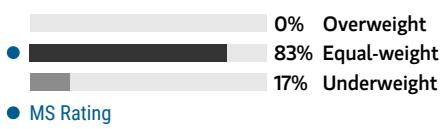

bar

| Category | Value (%) |
|---|---|
| Overweight | 0 |
| Equal-weight | 83 |
| Underweight | 17 |
MS Rating (implied by context)

Source: Refinitiv, MS

# BULL CASE

# US\$53.20

# Higher prices allow for above guidance DPS growth

We model the company growing base DPS by 6% p.a. to \~2030, reverting to 45% p.a. to \~2050 and 2% p.a. into perpetuity. We discount the dividend stream at 7%.

# BASE CASE

# US\$40.40

# Growing the base dividend in line with guidance

We grow the base dividend by $\sim 4.5\%$ until the end of the decade, then by $\sim 3.5\%$ p.a. until the mid $\sim 2040s$ , and further $3\%$ p.a. into perpetuity. We discount the dividend stream at $7.5\%$ .

# BEAR CASE

# US\$24.50

# DPS grows below guidance

We assume a base dividend of \~\$1.7 per share in 2027, growing by \~2% p.a. to \~2030, then 1% p.a. to perpetuity. We apply an 8% cost of equity.

# Risk Reward – Equinor ASA (EQNR.N)

KEY EARNINGS INPUTS 

<table><tr><td>Drivers</td><td>2025</td><td>2026e</td><td>2027e</td><td>2028e</td></tr><tr><td>Total hydrocarbon production (Kboe/d)</td><td>2,019</td><td>2,086</td><td>2,062</td><td>2,025</td></tr></table>

# INVESTMENT DRIVERS

- Oil and gas prices   
- Oil and gas production, downstream utilisation   
• Capital expenditure, especially relative to dividend   
- Organic FCF, dividend cover and gearing (ND/ND+E)   
• Dividend sustainability and growth

# GLOBAL REVENUE EXPOSURE

0-10% Latin America   
0-10% MEA   
0-10% UK   
10-20% North America   
60-70% Europe ex UK

Source: MS Estimate View explanation of regional hierarchies here

# RISKS TO PT/RATING

# RISKS TO UPSIDE

• Higher oil and gas prices   
• Higher than expected dividend growth   
• Material share buybacks   
- Asset sales at attractive multiples   
• Lower capex over the coming years   
- Lower oil and gas prices   
• Lower than expected dividend growth   
- Asset M&A leading to lower FCF and dividend cover   
• Further setbacks in offshore wind

# RISKS TO DOWNSIDE

# OWNERSHIP POSITIONING

<table><tr><td>Inst. Owners, % Active</td><td>76.8%</td><td></td><td></td><td></td></tr><tr><td>HF Sector Long/Short Ratio</td><td>1.7x</td><td></td><td></td><td></td></tr><tr><td>HF Sector Net Exposure</td><td>4.3%</td><td></td><td></td><td></td></tr></table>

Refinitiv; MSPB Content. Includes certain hedge fund exposures held with MSPB. Information may be inconsistent with or may not reflect broader market trends. Long/Short Ratio = Long Exposure / Short exposure. Sector % of Total Net Exposure = (For a particular sector: Long Exposure - Short Exposure) / (Across all sectors: Long Exposure – Short Exposure).

# MS ESTIMATES VS. CONSENSUS

FY Dec 2026e

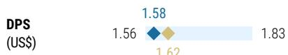

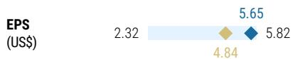  
◆ Mean ◆ MS Estimates   
Source: Refinitiv, MS

# Risk Reward – Equinor ASA (EQNR.OL)

More Balanced Risk-Reward – Equal-weight

# PRICE TARGET NKr 376.00

We derive our end-2026 price target from our DDM model. We grow the base dividend of \~\$1.7/sh by \~4.5% until the end of the decade, and then by \~3.5% p.a. until the mid \~2040s, before reverting to a 3% pace into perpetuity. We discount the dividend stream at 7.5% and USDNOK of 9.3.

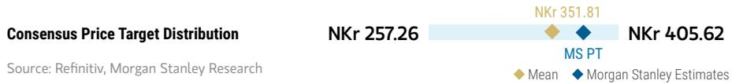

bar_line

| Consensus Price Target Distribution | NKr Value |
| ----------------------------------- | --------- |
| NKr 257.26                          | 351.81    |
| NKr 405.62                          | 405.62    |

RISK REWARD CHART AND OPTIONS IMPLIED PROBABILITIES (12M)   
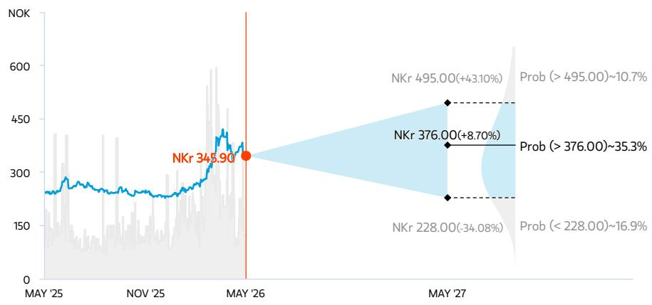

line

| Date       | NKr Value |
| ---------- | --------- |
| MAY '25    | 345.90    |
| MAY '26    | 345.90    |
| MAY '27    | 495.00 (+43.10%) |
| MAY '27    | 376.00 (+8.70%) |
| MAY '27    | 376.00 (~35.3%) |
| MAY '27    | 228.00 (-34.08%) |

Key: — Historical Stock Performance ● Current Stock Price ◆ Price Target   
Source: Refinitiv, MS, MS Institutional Equities Division. The probabilities of our Bull, Base, and Bear case scenarios playing out were estimated with implied volatility data from the options market as of 11 May 2026. All figures are approximate risk-neutral probabilities of the stock reaching beyond the scenario price in either three-months' or one-years' time. View explanation of Options Probabilities methodology here

# EQUAL-WEIGHT THESIS

■ Equinor's high gas leverage benefits the most from tightening gas markets, relative to its peer group.   
The company's core exposure to Europe and the Americas also makes it relatively more insulated from asset disruption risk in the current environment, commanding a valuation premium.   
■ However, capital allocation uncertainties persist in the core business, with the expected decline in the Norwegian Continental Shelf and a mixed record of international expansion.   
■ The shares' sharp re-rating already reflects stronger FCF and distribution assumptions, in our view.   
■ We rate Equinor Equal-weight, given a more balanced risk-reward profile.

Consensus Rating Distribution   
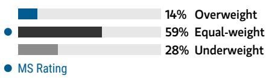

bar

| Category      | Value |
| ------------- | ----- |
| Overweight    | 14%   |
| Equal-weight  | 59%   |
| Underweight   | 28%   |

Source: Refinitiv, MS

# BULL CASE

# NKr 495.00

# Higher prices allow for above guidance DPS growth

We model the company growing base DPS by 6% p.a. to \~2030, reverting to 5% p.a. to \~2050 and 2% p.a. into perpetuity. We discount the dividend stream at 7%.

# BASE CASE

# NKr 376.00

# Growing the base dividend in line with guidance

We grow the base dividend by $\sim 4.5\%$ until the end of the decade, then by $\sim 3.5\%$ p.a. until the mid $\sim 2040s$ , and further $3\%$ p.a. into perpetuity. We discount the dividend stream at $7.5\%$ . We use USDNOK of 9.3.

# BEAR CASE

# NKr 228.00

# DPS grows below guidance

We assume a base dividend of \~\$1.7 per share in 2027, growing by \~2% p.a. to \~2030 and then 1% p.a. to perpetuity. We apply an 8% cost of equity.

# Risk Reward – Equinor ASA (EQNR.OL)

KEY EARNINGS INPUTS 

<table><tr><td>Drivers</td><td>2025</td><td>2026e</td><td>2027e</td><td>2028e</td></tr><tr><td>Total hydrocarbon production (Kboe/d)</td><td>2,019</td><td>2,086</td><td>2,062</td><td>2,025</td></tr></table>

# INVESTMENT DRIVERS

- Oil and gas prices   
- Oil and gas production, downstream utilisation   
• Capital expenditure, especially relative to dividend   
- Organic FCF, dividend cover and gearing (ND/ND+E)   
• Dividend sustainability and growth

# GLOBAL REVENUE EXPOSURE

0-10% Latin America   
0-10% MEA   
0-10% UK   
10-20% North America   
60-70% Europe ex UK

Source: MS Estimate View explanation of regional hierarchies here

# MS ALPHA MODELS

1/5

MOST

3 Month

Horizon

Source: Refinitiv, FactSet, MS; 1 is the highest favored Quintile and 5 is the least favored Quintile

# RISKS TO PT/RATING

# RISKS TO UPSIDE

• Higher oil and gas prices   
• Higher than expected dividend growth   
• Material share buybacks   
- Asset sales at attractive multiples   
• Lower capex over the coming years   
• Lower oil and gas prices   
• Lower than expected dividend growth   
- Asset M&A leading to lower FCF and dividend cover   
• Further setbacks in offshore wind

# RISKS TO DOWNSIDE

# OWNERSHIP POSITIONING

Inst. Owners, % Active

80.1%

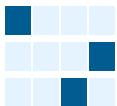

HF Sector Long/Short Ratio

2x

HF Sector Net Exposure

3%

Refinitiv; MSPB Content. Includes certain hedge fund exposures held with MSPB. Information may be inconsistent with or may not reflect broader market trends. Long/Short Ratio = Long Exposure / Short exposure. Sector % of Total Net Exposure = (For a particular sector: Long Exposure - Short Exposure) / (Across all sectors: Long Exposure – Short Exposure).

# MS ESTIMATES VS. CONSENSUS

FY Dec 2026e

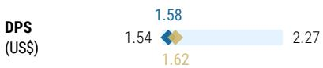

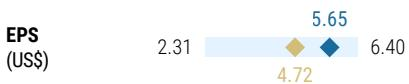

Mean

◆ M

organ Stanley Estimates

Source: Refinitiv, MS

# Risk Reward – Shell PLC (SHEL.L)

Defensiveness Less Differentiated – Equal-weight

# PRICE TARGET 3,495p

Our 2026 year-end price target is based on a DDM model. Notwithstanding the company's 4% guidance, we assume a DPS of \~\$1.62 for Shell in 2027, growing by 10% p.a. until the early-2030s, reverting to 3.5% p.a. from that period, and then to 3% from \~2045 into perpetuity. We assume a cost of equity of \~8%.

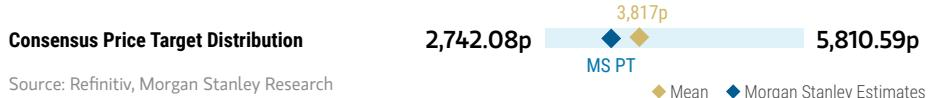

bar_line

| Category       | Value    |
| -------------- | -------- |
| Mean           | 3,817p   |
| MS Estimate | 5,810.59p |
| Consensus Price Target Distribution | 2,742.08p |

RISK REWARD CHART AND OPTIONS IMPLIED PROBABILITIES (12M)   
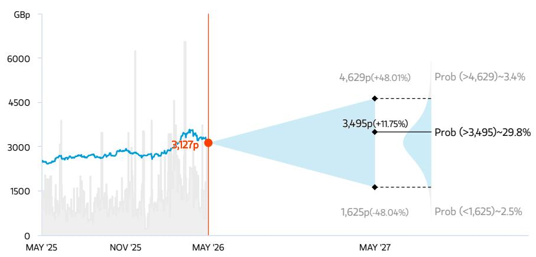

line

| Date     | Value     |
| -------- | --------- |
| MAY '26  | 3,127p    |
| MAY '27  | 4,629p (+48.01%) |
| MAY '27  | 3,495p (+11.75%) |
| MAY '27  | 1,625p (-48.04%) |

Key: — Historical Stock Performance ● Current Stock Price ◆ Price Target   
Source: Refinitiv, MS, MS Institutional Equities Division. The probabilities of our Bull, Base, and Bear case scenarios playing out were estimated with implied volatility data from the options market as of 11 May 2026. All figures are approximate risk-neutral probabilities of the stock reaching beyond the scenario price in either three-months' or one-years' time. View explanation of Options Probabilities methodology here

# EQUAL-WEIGHT THESIS

- Shell's per-share FCF growth has relied primarily on cost savings and buybacks, which is a less differentiated value proposition in a rising price environment.   
■ Strong balance sheet provides resilience, but scores higher in our order of preference when facing a weaker commodity outlook.   
■ Lower operational leverage relative to peers further limits upside capture, even if offering distribution upside.   
■ Relative valuation should remain supported, but we see limited re-rating potential compared to higher-beta peers – hence our Equal-weight rating.

Consensus Rating Distribution   
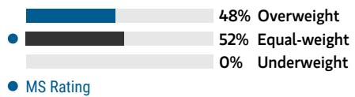

bar

| Category      | Value |
| ------------- | ----- |
| Overweight    | 48%   |
| Equal-weight  | 52%   |
| Underweight   | 0%    |

Source: Refinitiv, MS

# Risk Reward Themes

Self-help: Positive

View descriptions of Risk Rewards Themes here

# BULL CASE

# 4,629p

# More double-digit DPS hikes; 6.0% mid-term growth

We assume Shell grows its DPS by 15% p.a. until 2030, followed by \~5% per year to \~2050 and then 2% in perpetuity. We assume a cost of equity of 7.5%.

# BASE CASE

# 3,495p

# More double-digit DPS hikes; 5% mid-term growth

We assume Shell grows its DPS by \~10% p.a. until 2032, before reverting to 3.5% until \~2045, and then to 3% in perpetuity. We assume a cost of equity of \~8%.

# BEAR CASE

# 1,625p

# DPS growth below guidance

We assume that Shell raises DPS by \~2% p.a. until \~2030 and then reverts to 1% in perpetuity. We assume an 8.5% cost of equity.

# Risk Reward – Shell PLC (SHEL.L)

KEY EARNINGS INPUTS 

<table><tr><td>Drivers</td><td>2025</td><td>2026e</td><td>2027e</td><td>2028e</td></tr><tr><td>Brent price ($/b)</td><td>68.7</td><td>95.2</td><td>80.0</td><td>81.2</td></tr><tr><td>Henry Hub $/MMBtu)</td><td>3.5</td><td>3.8</td><td>4.0</td><td>4.1</td></tr><tr><td>Total production (thousand boe/d)</td><td>2,759</td><td>2,734</td><td>3,187</td><td>3,211</td></tr><tr><td>Indicative refining margin ($/bbl)</td><td>10.1</td><td>15.2</td><td>7.7</td><td>7.3</td></tr><tr><td>Capex ($ million)</td><td>20,914</td><td>24,122</td><td>20,160</td><td>20,160</td></tr></table>

# INVESTMENT DRIVERS

- Oil and gas prices, refining and chemical margins   
• Oil and gas production, downstream utilisation   
- Capex, organic FCF, dividend cover and gearing (ND/ND+E)   
• Progress towards Energy Transition   
• Dividend sustainability and growth

# GLOBAL REVENUE EXPOSURE

0-10% Mainland China   
0-10% UK   
10-20% Europe ex UK   
10-20% Latin America   
10-20% North America   
20-30% MEA

● 20-30% APAC, ex Japan, Mainland China and India

Source: MS Estimate

View explanation of regional hierarchies here

# MS ALPHA MODELS

1/5

MOST

3 Month

Horizon

Source: Refinitiv, FactSet, MS; 1 is the highest favored Quintile and 5 is the least favored Quintile

# RISKS TO PT/RATING

# RISKS TO UPSIDE

- Shell's FCF delivery better than expected, due to better macro or lower than expected capex/opex   
• More visibility on long-term strategy   
- Higher dividend than guided, without raising capex

# RISKS TO DOWNSIDE

- Macro environment materially worse than current/expected   
- Shell's capex for renewables/energy transition hinders dividend growth   
• Shell is not competitive in New Energies

# OWNERSHIP POSITIONING

<table><tr><td>Inst. Owners, % Active</td><td>61.4%</td><td colspan="3"></td></tr><tr><td>HF Sector Long/Short Ratio</td><td>2x</td><td colspan="3"></td></tr><tr><td>HF Sector Net Exposure</td><td>3%</td><td colspan="3"></td></tr></table>

Refinitiv; MSPB Content. Includes certain hedge fund exposures held with MSPB. Information may be inconsistent with or may not reflect broader market trends. Long/Short Ratio = Long Exposure / Short exposure. Sector % of Total Net Exposure = (For a particular sector: Long Exposure - Short Exposure) / (Across all sectors: Long Exposure – Short Exposure).

# MS ESTIMATES VS. CONSENSUS

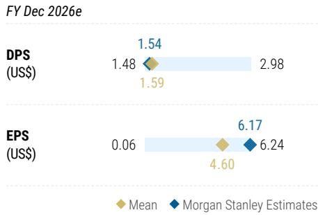  
Source: Refinitiv, MS

# Risk Reward – Shell PLC (SHEL.N)

Defensiveness Less Differentiated – Equal-weight

# PRICE TARGET US\$93.00

Our 2026 year-end price target is based on a DDM model. Notwithstanding the company's 4% guidance, we assume a DPS of \~\$1.62 for Shell in 2027, growing by 10% p.a. until the early-2030s, reverting to 3.5% p.a. from that period, and then to 3% from \~2045 into perpetuity. We assume a cost of equity of \~8%. Our ADR target is derived from our target for the local stock, using a GBP:USD rate of 1.33.

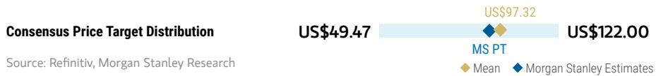

bar_line

| Category             | Value    |
| -------------------- | -------- |
| MS PT                | $97.32   |
| MS Estimates | $122.00  |
| Mean                 | $49.47   |

RISK REWARD CHART AND OPTIONS IMPLIED PROBABILITIES (12M)   
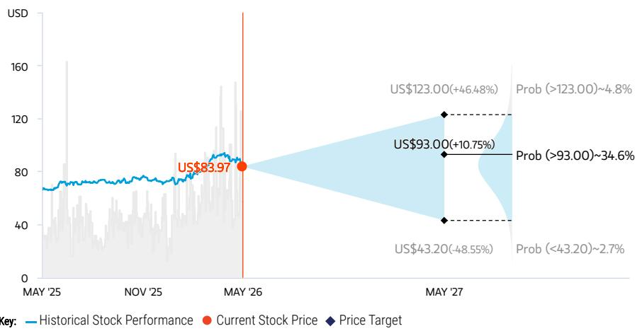

line

| Date     | Historical Stock Performance | Current Stock Price | Price Target |
| -------- | ----------------------------- | ------------------- | ------------ |
| MAY '25  | ~70                           | -                   | -            |
| NOV '25  | ~75                           | -                   | -            |
| MAY '26  | $83.97                        | $83.97              | -            |
| MAY '27  | -                             | $123.00 (+46.48%)   | $93.00 (+10.75%) |
|         | -                             | -                   | $43.20 (-48.55%) |
|         | -                             | -                   | Prob (<43.20)~2.7% |

Source: Refinitiv, MS, MS Institutional Equities Division. The probabilities of our Bull, Base, and Bear case scenarios playing out were estimated with implied volatility data from the options market as of 8 May 2026. All figures are approximate risk-neutral probabilities of the stock reaching beyond the scenario price in either three-months' or one-years' time. View explanation of Options Probabilities methodology here

# EQUAL-WEIGHT THESIS

■ Shell's per-share FCF growth has relied primarily on cost savings and buybacks, which is a less differentiated value proposition in a rising price environment.   
■ Strong balance sheet provides resilience, but scores higher in our order of preference when facing a weaker commodity outlook.   
■ Lower operational leverage relative to peers further limits upside capture, even if offering distribution upside.   
■ Relative valuation should remain supported, but we see limited re-rating potential compared to higher-beta peers – hence our Equal-weight rating.

Consensus Rating Distribution   
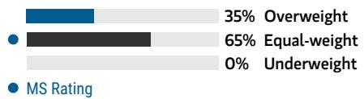

bar

| Category      | Value |
| ------------- | ----- |
| Overweight    | 35%   |
| Equal-weight  | 65%   |
| Underweight   | 0%    |
| MS Rating     | 0%    |

Source: Refinitiv, MS

# Risk Reward Themes

Self-help: Positive

View descriptions of Risk Rewards Themes here

# BULL CASE

# US\$123.00

# More double-digit DPS hikes; 6.0% mid-term growth

We assume Shell grows its DPS by 15% p.a. until 2030, followed by \~5% per year to \~2050 and then 2% in perpetuity. We assume a cost of equity of 7.5%.

# BASE CASE

# US\$93.00

# More double-digit DPS hikes; 5% mid-term growth

We assume Shell grows its DPS by \~10% p.a. until 2032, before reverting to 3.5% until \~2045, and then to 3% in perpetuity. We assume a cost of equity of \~8%.

# BEAR CASE

# US\$43.20

# DPS growth below guidance

We assume that Shell raises DPS by \~2% p.a. until \~2030 and then reverts to 1% in perpetuity. We assume an 8.5% cost of equity.

# Risk Reward – Shell PLC (SHEL.N)

KEY EARNINGS INPUTS 

<table><tr><td>Drivers</td><td>2025</td><td>2026e</td><td>2027e</td><td>2028e</td></tr><tr><td>Brent price ($/b)</td><td>68.7</td><td>95.2</td><td>80.0</td><td>81.2</td></tr><tr><td>Henry Hub $/MMBtu)</td><td>3.5</td><td>3.8</td><td>4.0</td><td>4.1</td></tr><tr><td>Total production (thousand boe/d)</td><td>2,759</td><td>2,734</td><td>3,187</td><td>3,211</td></tr><tr><td>Indicative refining margin ($/bbl)</td><td>10.1</td><td>15.2</td><td>7.7</td><td>7.3</td></tr><tr><td>Capex ($ million)</td><td>20,914</td><td>24,122</td><td>20,160</td><td>20,160</td></tr></table>

# INVESTMENT DRIVERS

- Oil and gas prices, refining and chemical margins   
• Oil and gas production, downstream utilisation   
- Capex, organic FCF, dividend cover and gearing (ND/ND+E)   
• Progress towards Energy Transition   
• Dividend sustainability and growth

# GLOBAL REVENUE EXPOSURE

0-10% Mainland China   
0-10% UK   
10-20% Europe ex UK   
10-20% Latin America   
10-20% North America   
● 20-30% APAC, ex Japan, Mainland China and India   
20-30% MEA

Source: MS Estimate

View explanation of regional hierarchies here

# RISKS TO PT/RATING

# RISKS TO UPSIDE

- Shell's FCF delivery better than expected, due to better macro or lower than expected capex/opex   
• More visibility on long-term strategy   
- Higher dividend than guided, without raising capex

# RISKS TO DOWNSIDE

- Macro environment materially worse than current/expected   
- Shell's capex for renewables/energy transition hinders dividend growth   
• Shell is not competitive in New Energies

# OWNERSHIP POSITIONING

<table><tr><td>Inst. Owners, % Active</td><td>83.6%</td><td></td><td></td><td></td><td></td></tr><tr><td>HF Sector Long/Short Ratio</td><td>1.7x</td><td></td><td></td><td></td><td></td></tr><tr><td>HF Sector Net Exposure</td><td>4.3%</td><td></td><td></td><td></td><td></td></tr></table>

Refinitiv; MSPB Content. Includes certain hedge fund exposures held with MSPB. Information may be inconsistent with or may not reflect broader market trends. Long/Short Ratio = Long Exposure / Short exposure. Sector % of Total Net Exposure = (For a particular sector: Long Exposure - Short Exposure) / (Across all sectors: Long Exposure – Short Exposure).

# MS ESTIMATES VS. CONSENSUS

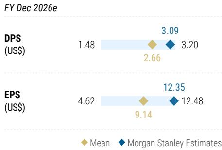

bar_line

| Metric | Mean | MS Estimates |
|--------|------|--------------------------|
| DPS (US$) | 1.48 | 3.09 |
| EPS (US$) | 4.62 | 12.35 |

Source: Refinitiv, MS

# Risk Reward – Repsol (REP.MC)

Gaining Exposure to Refined Products Disruption – Overweight

# PRICE TARGET €28.00

Our year-end 2026 price target is based on our base case dividend discount model for the shares. Until the end of the decade, we expect Repsol's DPS to increase by \~9% p.a., then by 6% p.a. in the 2030s, and by 3% into perpetuity. We discount the future dividend stream at an \~8.8% cost of equity.

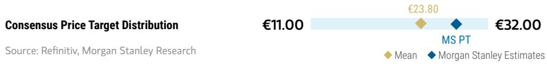

bar_line

| Category             | Value   |
| -------------------- | ------- |
| Mean                 | €23.80  |
| MS Estimates | €32.00  |

RISK REWARD CHART AND OPTIONS IMPLIED PROBABILITIES (12M)   
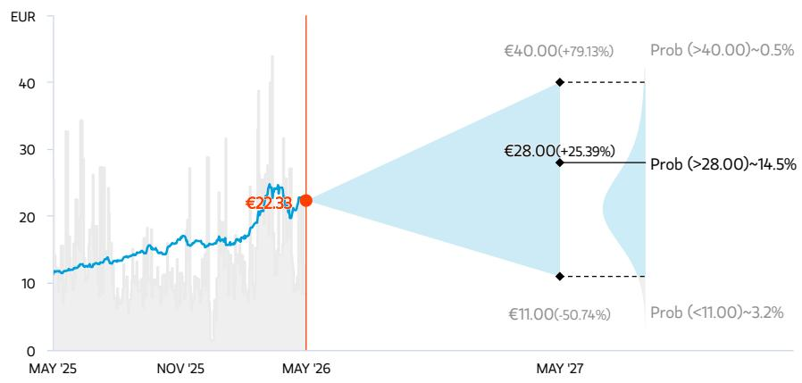

line

| Date     | Value    |
| -------- | -------- |
| MAY '26  | €22.33   |
| MAY '27  | €40.00 (+79.13%) |
| MAY '27  | €28.00 (+25.39%) |
| MAY '27  | €11.00 (-50.74%) |
| MAY '27  | Prob (>40.00)~0.5% |
| MAY '27  | Prob (>28.00)~14.5% |
| MAY '27  | Prob (<11.00)~3.2% |

Key: — Historical Stock Performance ● Current Stock Price ◆ Price Target   
Source: Refinitiv, MS, MS Institutional Equities Division. The probabilities of our Bull, Base, and Bear case scenarios playing out were estimated with implied volatility data from the options market as of 11 May 2026. All figures are approximate risk-neutral probabilities of the stock reaching beyond the scenario price in either three-months' or one-years' time. View explanation of Options Probabilities methodology here

# OVERWEIGHT THESIS

■ Disruptions in the supply chain of refined products take a long time to be resolved, and that supports higher crack spreads for longer.   
■ Higher earnings should allow Repsol to materially step up buybacks from 2H26 and into 2027.   
Although the shares have rallied post the disruption in Hormuz, we still see them as offering higher yields compared to mid-major peers.   
■ Other company-specific events, such as the upcoming E&P segment liquidity event, and Venezuela, could provide further upside to the story.

Consensus Rating Distribution   
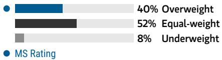

bar

| Category | Value (%) |
|---|---|
| Overweight | 40 |
| Equal-weight | 52 |
| Underweight | 8 |
MS Rating (implied by context)

Source: Refinitiv, MS

# BULL CASE

# €40.00

# BASE CASE

# €28.00

# BEAR CASE

# €11.00

# A golden age of refining

Repsol's refinery park stands out over the coming years amid shrinking global capacity, and margins remain at \~\$9/bbl in the long-term (and close to \$20 in 2026). This is coupled with higher oil and gas prices that allow Repsol to extend buybacks, supporting superior DPS growth rates for longer.

# Refining margins stay supported over 2026-27

Refining margins stay in the low double digits over 2026, allowing Repsol to materially step up buybacks later this year.

# Refining margins consistently depressed

Refining margins are negatively affected by declining oil demand in Europe, at the same time that US gas prices trend lower. Repsol keep its buyback program at a minimum, and the market assigns a higher discount rate to the shares.

# Risk Reward – Repsol (REP.MC)

KEY EARNINGS INPUTS 

<table><tr><td>Drivers</td><td>2025</td><td>2026e</td><td>2027e</td><td>2028e</td></tr><tr><td>Brent Price ($/bbl)</td><td>69</td><td>95</td><td>80</td><td>81</td></tr><tr><td>Total E&amp;P Production (Kboe/d)</td><td>548</td><td>564</td><td>591</td><td>604</td></tr><tr><td>Refining Indicator - Spain ($/bbl)</td><td>8</td><td>11</td><td>8</td><td>7</td></tr></table>

# INVESTMENT DRIVERS

- Oil and gas prices   
- Downstream margins (refining and chemicals)   
- Sustainability of shareholder returns   
• Balance sheet in a good shape

# GLOBAL REVENUE EXPOSURE

0-10% North America

30-40% Latin America

60-70% Europe ex UK

Source: MS Estimate View explanation of regional hierarchies here

# MS ALPHA MODELS

1/5

MOST

3 Month

Horizon

Source: Refinitiv, FactSet, MS; 1 is the highest favored Quintile and 5 is the least favored Quintile

# RISKS TO PT/RATING

# RISKS TO UPSIDE

- Better than expected environment for oil, gas, and refining margins.   
• Liquidity event in the E&P business (+/-).   
• Investments in renewables and low carbon start to bear fruit.

# RISKS TO DOWNSIDE

- More depressed commodity price environment.   
- Refining margins move consistently lower.   
- Returns from green investments remain at subpar levels.   
- Failure to deliver on asset sales programme.

# OWNERSHIP POSITIONING

Inst. Owners, % Active

HF Sector Long/Short Ratio

HF Sector Net Exposure

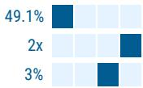

Refinitiv; MSPB Content. Includes certain hedge fund exposures held with MSPB. Information may be inconsistent with or may not reflect broader market trends. Long/Short Ratio = Long Exposure / Short exposure. Sector % of Total Net Exposure = (For a particular sector: Long Exposure - Short Exposure) / (Across all sectors: Long Exposure – Short Exposure).

# MS ESTIMATES VS. CONSENSUS

FY Dec 2026e

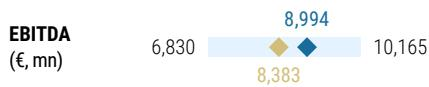

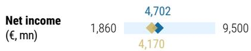

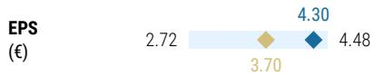

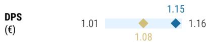  
◆ Mean ◆ MS Estimates   
Source: Refinitiv, MS

# Risk Reward – Galp Energia (GALP.LS)

Defensive Name Relative to Other EU Majors – Equal-weight

# PRICE TARGET €24.00

Our year-end 2026 price target is based on our base case dividend discount model for the shares. We expect Galp to raise dividends per share by \~9% p.a. until the late 2030s, then by 4% into perpetuity. We discount the future dividend stream at an \~8.7% cost of equity.

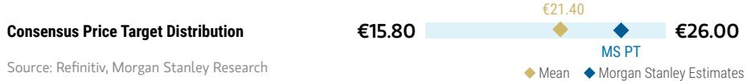

bar_line

| Category | Value     |
| -------- | --------- |
| Mean     | €21.40    |
| MS Estimates | €26.00   |

RISK REWARD CHART   
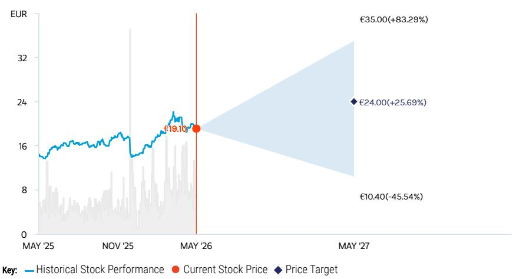

line

| Date     | Historical Stock Performance | Current Stock Price | Price Target |
| -------- | ----------------------------- | ------------------- | ------------ |
| MAY '26  | €19.10                        | €19.10              | €19.10       |
| MAY '27  | €35.00(+83.29%)               | €24.00(+25.69%)    | €24.00       |
| MAY '27  | €10.40(-45.54%)               | -                   | -            |

Source: Refinitiv, MS

# EQUAL-WEIGHT THESIS

■ Galp is a defensive name to play European Energy, with high-quality assets, growth, low capex over the coming years and declining gearing.   
■ The potential restructuring of the downstream division could also drive synergies and be supportive to shareholder payouts.   
■ However, the disruption in the Middle East has led to more pronounced increases in refining margins and gas prices rather than crude. Hence, we prefer to play the mid-majors via Repsol at the moment.

Consensus Rating Distribution   
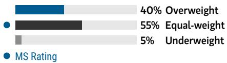

bar

| Category      | Value |
| ------------- | ----- |
| Overweight    | 40%   |
| Equal-weight  | 55%   |
| Underweight   | 5%    |

Source: Refinitiv, MS

# BULL CASE

# Persistently high Brent prices

Oil prices remain supported at nearly \$100/bbl, new projects in Namibia get approved faster than expected, and the market focuses on exploration optionality on other new fronts. Higher production allows the company to consistently raise dividends above peers over the 2030s.

# €35.00

# BASE CASE

# €24.00

# BEAR CASE

# €10.40

# Brent prices stay supported for longer

Galp benefits from a sustained period of higher oil prices, with Brent converging to \$80/bbl in the long-term. Declining capex, the ramp-up of Bacalhau and the inflow from Rovuma LNG also provide support to shareholder payouts.

# Depressed oil price environment

A pronounced downturn in oil prices prevents Galp from raising dividends much above 4% p.a. despite the production increase of the coming years. Namibia is sanctioned, but returns prove disappointing and add pressure to the balance sheet this decade.

# Risk Reward – Galp Energia (GALP.LS)

KEY EARNINGS INPUTS 

<table><tr><td>Drivers</td><td>2025</td><td>2026e</td><td>2027e</td><td>2028e</td></tr><tr><td>Brent Price ($/bbl)</td><td>69</td><td>95</td><td>80</td><td>81</td></tr><tr><td>Total E&amp;P Production (Kboe/d)</td><td>111</td><td>127</td><td>139</td><td>130</td></tr><tr><td>Refining Margin ($/bbl)</td><td>7</td><td>12</td><td>7</td><td>7</td></tr></table>

# INVESTMENT DRIVERS

- Oil and gas prices   
- Downstream margins (refining, trading)   
• Crystallisation of exploration value   
- Gearing under control and dividend growth sustainability

# GLOBAL REVENUE EXPOSURE

40-50% Europe ex UK   
50-60% Latin America

Source: MS Estimate

View explanation of regional hierarchies here

# MS ALPHA MODELS

2/5

MOST

3 Month

Horizon

Source: Refinitiv, FactSet, MS; 1 is the highest favored Quintile and 5 is the least favored Quintile

# RISKS TO PT/RATING

# RISKS TO UPSIDE

• Further de-risking events in Namibia (+/-)   
• Higher oil and gas realisation prices   
• Production surprises to the upside (with Bacalhau ramp-up and low depletion in Tupi)   
- Industrial business supported by high refining margins/trading   
• Higher returns on green investments

# RISKS TO DOWNSIDE

- Lower oil prices and refining margins   
• Acceleration of decline rates in the pre-salt   
- Green investments continue to yield subpar returns

# OWNERSHIP POSITIONING

<table><tr><td>Inst. Owners, % Active</td><td>76.2%</td><td></td><td></td><td></td></tr><tr><td>HF Sector Long/Short Ratio</td><td>2x</td><td></td><td></td><td></td></tr><tr><td>HF Sector Net Exposure</td><td>3%</td><td></td><td></td><td></td></tr></table>

Refinitiv; MSPB Content. Includes certain hedge fund exposures held with MSPB. Information may be inconsistent with or may not reflect broader market trends. Long/Short Ratio = Long Exposure / Short exposure. Sector % of Total Net Exposure = (For a particular sector: Long Exposure - Short Exposure) / (Across all sectors: Long Exposure – Short Exposure).

# MS ESTIMATES VS. CONSENSUS

FY Dec 2026e

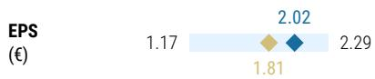

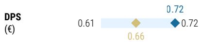

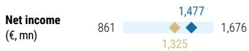

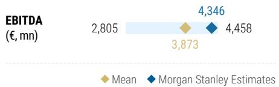

bar_line

|        | Mean  | MS Estimates |
| ------ | ----- | ------------------------ |
| EBITDA (€, mn) | 2,805 | 4,346                  |
|          | 3,873 |                          |

Source: Refinitiv, MS

# Risk Reward Reference links

1. View explanation of Options Probabilities methodology -   
Options\_Probabilities\_Exhibit\_Link.pdf   
2. View descriptions of Risk Rewards Themes - RR\_Themes\_Exhibit\_Link.pdf   
3. View explanation of regional hierarchies - GEG\_Exhibit\_Link.pdf   
4. View explanation of Theme/Exposure methodology -   
ESG\_Sustainable\_Solutions\_External\_Link.pdf   
5. View explanation of HERS methodology - ESG\_HERS\_External\_Link.pdf

# Disclosure Section

The information and opinions in MS were prepared or are disseminated by MS Europe S.E., regulated by Bundesanstalt fuer Finanzdienstleistungsaufsicht (BaFin) and/or MS & Co. International plc, authorized by the Prudential Regulation Authority and regulated by the Financial Conduct Authority and the Prudential Regulation Authority. MS & Co. International plc disseminates in the UK research that it has prepared, and which has been prepared by any of its affiliates, only to persons who (i) are investment professionals falling within Article 19(5) of the Financial Services and Markets Act 2000 (Financial Promotion) Order 2005 (as amended, the "Order"); (ii) are persons who are high net worth entities falling within Article 49(2)(a) to (d) of the Order; or (iii) are persons to whom an invitation or inducement to engage in investment activity (within the meaning of section 21 of the Financial Services and Markets Act 2000, as amended) may otherwise lawfully be communicated or caused to be communicated. As used in this disclosure section, MS includes RMB MS Proprietary Limited, MS Europe S.E., MS & Co International plc and its affiliates.

For important disclosures, stock price charts and equity rating histories regarding companies that are the subject of this report, please see the MS Disclosure Website at www.morganstanley.com/eqr/disclosures/webapp/generalresearch, or contact your investment representative or MS at 1585 Broadway, (Attention: Research Management), New York, NY, 10036 USA.

For valuation methodology and risks associated with any recommendation, rating or price target referenced in this research report, please contact the Client Support Team as follows: US/Canada +1 800 303-2495; Hong Kong +852 2848-5999; Latin America +1 718 754-5444 (U.S.); London +44 (0)20-7425-8169; Singapore +65 6834-6860; Sydney +61 (0)2-9770-1505; Tokyo +81 (0)3-6836-9000. Alternatively you may contact your investment representative or MS at 1585 Broadway, (Attention: Research Management), New York, NY 10036 USA.

# Analyst Certification

The following analysts hereby certify that their views about the companies and their securities discussed in this report are accurately expressed and that they have not received and will not receive direct or indirect compensation in exchange for expressing specific recommendations or views in this report: Alice Bergier Winograd; Guilherme Levy; Martijn Rats, CFA.

# Global Research Conflict Management Policy

MS has been published in accordance with our conflict management policy, which is available at www.morganstanley.com/institutional/research/conflictpolicies. A Portuguese version of the policy can be found at www.morganstanley.com.br

# Important Regulatory Disclosures on Subject Companies

As of April 30, 2026, MS beneficially owned 1% or more of a class of common equity securities of the following companies covered in MS: BP plc, Galp Energia, Repsol, Shell PLC, TotalEnergies SE.

Within the last 12 months, MS managed or co-managed a public offering (or 144A offering) of securities of Eni SpA, Equinor ASA, Repsol, Saudi Aramco, Shell PLC.

Within the last 12 months, MS has received compensation for investment banking services from BP plc, Eni SpA, Equinor ASA, Repsol, Saudi Aramco, Shell PLC, TotalEnergies SE. In the next 3 months, MS expects to receive or intends to seek compensation for investment banking services from BP plc, Eni SpA, Equinor ASA, Galp Energia, Neste Corporation, OMV AG, Repsol, Sasol Ltd, Saudi Aramco, Shell PLC, TotalEnergies SE.

Within the last 12 months, MS has received compensation for products and services other than investment banking services from BP plc, Eni SpA, Equinor ASA, Galp Energia, Neste Corporation, OMV AG, Repsol, Sasol Ltd, Saudi Aramco, Shell PLC, TotalEnergies SE.

Within the last 12 months, MS has provided or is providing investment banking services to, or has an investment banking client relationship with, the following company: BP plc, Eni SpA, Equinor ASA, Galp Energia, Neste Corporation, OMV AG, Repsol, Sasol Ltd, Saudi Aramco, Shell PLC, TotalEnergies SE.

Within the last 12 months, MS has either provided or is providing non-investment banking, securities-related services to and/or in the past has entered into an agreement to provide services or has a client relationship with the following company: BP plc, Eni SpA, Equinor ASA, Galp Energia, Neste Corporation, OMV AG, Repsol, Sasol Ltd, Saudi Aramco, Shell PLC, TotalEnergies SE.

The equity research analysts or strategists principally responsible for the preparation of MS have received compensation based upon various factors, including quality of research, investor client feedback, stock picking, competitive factors, firm revenues and overall investment banking revenues. Equity Research analysts' or strategists' compensation is not linked to investment banking or capital markets transactions performed by MS or the profitability or revenues of particular trading desks.

MS and its affiliates do business that relates to companies/instruments covered in MS, including market making, providing liquidity, fund management, commercial banking, extension of credit, investment services and investment banking. MS sells to and buys from customers the securities/instruments of companies covered in MS on a principal basis. MS may have a position in the debt of the Company or instruments discussed in this report. MS trades or may trade as principal in the debt securities (or in related derivatives) that are the subject of the debt research report.

Certain disclosures listed above are also for compliance with applicable regulations in non-US jurisdictions.

# STOCK RATINGS

MS uses a relative rating system using terms such as Overweight, Equal-weight, Not-Rated or Underweight (see definitions below). MS does not assign ratings of Buy, Hold or Sell to the stocks we cover. Overweight, Equal-weight, Not-Rated and Underweight are not the equivalent of buy, hold and sell. Investors should carefully read the definitions of all ratings used in MS. In addition, since MS contains more complete information concerning the analyst's views, investors should carefully read MS, in its entirety, and not infer the contents from the rating alone. In any case, ratings (or research) should not be used or relied upon as investment advice. An investor's decision to buy or sell a stock should depend on individual circumstances (such as the investor's existing holdings) and other considerations.

# Global Stock Ratings Distribution

(as of April 30, 2026)

The Stock Ratings described below apply to MS's Fundamental Equity Research and do not apply to Debt Research produced by the Firm.

For disclosure purposes only (in accordance with FINRA requirements), we include the category headings of Buy, Hold, and Sell alongside our ratings of Overweight, Equal-weight, Not-Rated and Underweight. MS does not assign ratings of Buy, Hold or Sell to the stocks we cover. Overweight, Equal-weight, Not-Rated and Underweight are not the equivalent of buy, hold, and sell but represent recommended relative weightings (see definitions below). To satisfy regulatory requirements, we correspond Overweight, our most positive stock rating, with a buy recommendation; we correspond Equal-weight and Not-Rated to hold and Underweight to sell recommendations, respectively.

<table><tr><td></td><td colspan="2">Coverage Universe</td><td colspan="3">Investment Banking Clients (IBC)</td><td colspan="2">Other Material Investment ServicesClients (MISC)</td></tr><tr><td>Stock RatingCategory</td><td>Count</td><td>% of Total</td><td>Count</td><td>% of Total IBC</td><td>% of RatingCategory</td><td>Count</td><td>% of Total OtherMISC</td></tr><tr><td>Overweight/Buy</td><td>1546</td><td>42%</td><td>467</td><td>51%</td><td>30%</td><td>709</td><td>44%</td></tr><tr><td>Equal-weight/Hold</td><td>1568</td><td>43%</td><td>358</td><td>39%</td><td>23%</td><td>715</td><td>44%</td></tr><tr><td>Not-Rated/Hold</td><td>4</td><td>0%</td><td>0</td><td>0%</td><td>0%</td><td>1</td><td>0%</td></tr><tr><td>Underweight/Sell</td><td>555</td><td>15%</td><td>84</td><td>9%</td><td>15%</td><td>202</td><td>12%</td></tr><tr><td>Total</td><td>3,673</td><td></td><td>909</td><td></td><td></td><td>1627</td><td></td></tr></table>

Data include common stock and ADRs currently assigned ratings. Investment Banking Clients are companies from whom MS received investment banking compensation in the last 12 months. Due to rounding off of decimals, the percentages provided in the "% of total" column may not add up to exactly 100 percent.

# Analyst Stock Ratings

Overweight (O). The stock's total return is expected to exceed the average total return of the analyst's industry (or industry team's) coverage universe, on a risk-adjusted basis, over the next 12-18 months.

Equal-weight (E). The stock's total return is expected to be in line with the average total return of the analyst's industry (or industry team's) coverage universe, on a risk-adjusted basis, over the next 12-18 months.

Not-Rated (NR). Currently the analyst does not have adequate conviction about the stock's total return relative to the average total return of the analyst's industry (or industry team's) coverage universe, on a risk-adjusted basis, over the next 12-18 months.

Underweight (U). The stock's total return is expected to be below the average total return of the analyst's industry (or industry team's) coverage universe, on a risk-adjusted basis, over the next 12-18 months.

Unless otherwise specified, the time frame for price targets included in MS is 12 to 18 months.

# Analyst Industry Views

Attractive (A): The analyst expects the performance of his or her industry coverage universe over the next 12-18 months to be attractive vs. the relevant broad market benchmark, as indicated below.

In-Line (I): The analyst expects the performance of his or her industry coverage universe over the next 12-18 months to be in line with the relevant broad market benchmark, as indicated below. Cautious (C): The analyst views the performance of his or her industry coverage universe over the next 12-18 months with caution vs. the relevant broad market benchmark, as indicated below. Benchmarks for each region are as follows: North America - S&P 500; Latin America - relevant MSCI country index or MSCI Latin America Index; Europe - MSCI Europe; Japan - TOPIX; Asia - relevant MSCI country index or MSCI sub-regional index or MSCI AC Asia Pacific ex Japan Index.

# Important Disclosures for MS Smith Barney LLC Customers

Important disclosures regarding any material conflict of interest that can reasonably be expected to have influenced MS Smith Barney LLC's choice of a third-party research provider or the subject company of a third-party research report, are available on the MS Wealth Management disclosure website at www.morganstanley.com/online/researchdisclosures. For MS specific disclosures, you may refer to https://www.morganstanley.com/eqr/disclosures/webapp/generalresearch.

Each MS report is reviewed and approved on behalf of MS Smith Barney LLC. This review and approval is conducted by the same person who reviews the research report on behalf of MS. This could create a conflict of interest.

# Other Important Disclosures

MS policy is to update research reports as and when the Research Analyst and Research Management deem appropriate, based on developments with the issuer, the sector, or the market that may have a material impact on the research views or opinions stated therein. In addition, certain Research publications are intended to be updated on a regular periodic basis (weekly/monthly/quarterly/annual) and will ordinarily be updated with that frequency, unless the Research Analyst and Research Management determine that a different publication schedule is appropriate based on current conditions.

MS is not acting as a municipal advisor and the opinions or views contained herein are not intended to be, and do not constitute, advice within the meaning of Section 975 of the Dodd-Frank Wall Street Reform and Consumer Protection Act.

MS produces an equity research product called a "Tactical Idea." Views contained in a "Tactical Idea" on a particular stock may be contrary to the recommendations or views expressed in research on the same stock. This may be the result of differing time horizons, methodologies, market events, or other factors. For all research available on a particular stock, please contact your sales representative or go to Matrix at http://www.morganstanley.com/matrix.

MS is provided to our clients through our proprietary research portal on Matrix and also distributed electronically by MS to clients. Certain, but not all, MS products are also made available to clients through third-party vendors or redistributed to clients through alternate electronic means as a convenience. For access to all available MS, please contact your sales representative or go to Matrix at http://www.morganstanley.com/matrix.

Any access and/or use of MS is subject to MS's Terms of Use (http://www.morganstanley.com/terms.html). By accessing and/or using MS, you are indicating that you have read and agree to be bound by our Terms of Use (http://www.morganstanley.com/terms.html). In addition you consent to MS processing your personal data and using cookies in accordance with our Privacy Policy and our Global Cookies Policy (http://www.morganstanley.com/privacy\_pledge.html), including for the purposes of setting your preferences and to collect readership data so that we can deliver better and more personalized service and products to you. To find out more information about how MS processes personal data, how we use cookies and how to reject cookies see our Privacy Policy and our Global Cookies Policy (http://www.morganstanley.com/privacy\_pledge.html). Please use the provided link to review the Terms and Conditions and Most Important Terms and Conditions for MS India Company Private Limited (https://www.morganstanley.com/assets/pdfs/about-us-global-offices/india/Terms\_and\_conditions.pdf) and the following link to review the audit report (https://ny.matrix.ms.com/eqr/research/webapp/researchdocs/MSICPL\_Morgan\_Stanley\_Research\_Audit\_Report.pdf).

If you do not agree to our Terms of Use and/or if you do not wish to provide your consent to MS processing your personal data or using cookies please do not access our research.

MS does not provide individually tailored investment advice. MS has been prepared without regard to the circumstances and objectives of those who receive it. MS recommends that investors independently evaluate particular investments and strategies, and encourages investors to seek the advice of a financial adviser. The appropriateness of an investment or strategy will depend on an investor's circumstances and objectives. The securities, instruments, or strategies discussed in MS may not be suitable for all investors, and certain investors may not be eligible to purchase or participate in some or all of them. MS is not an offer to buy or sell or the solicitation of an offer to buy or sell any security/instrument or to participate in any particular trading strategy. The value of and income from your investments may vary because of changes in interest rates, foreign exchange rates, default rates, prepayment rates, securities/instruments prices, market indexes, operational or financial conditions of companies or other factors. There may be time limitations on the exercise of options or other rights in securities/instruments transactions. Past performance is not necessarily a guide to future performance. Estimates of future performance are based on assumptions that may not be realized. If provided, and unless otherwise stated, the closing price on the cover page is that of the primary exchange for the subject company's securities/instruments.

The fixed income research analysts, strategists or economists principally responsible for the preparation of MS have received compensation based upon various factors, including quality, accuracy and value of research, firm profitability or revenues (which include fixed income trading and capital markets profitability or revenues), client feedback and competitive factors. Fixed Income Research analysts', strategists' or economists' compensation is not linked to investment banking or capital markets transactions performed by MS or the profitability or revenues of particular trading desks.

The "Important Regulatory Disclosures on Subject Companies" section in MS lists all companies mentioned where MS owns 1% or more of a class of common equity securities of the companies. For all other companies mentioned in MS, MS may have an investment of less than 1% in securities/instruments or derivatives of securities/instruments of companies and may trade them in ways different from those discussed in MS. Employees of MS not involved in the preparation of MS may have investments in securities/instruments or derivatives of securities/instruments of companies mentioned and may trade them in ways different from those discussed in MS. Derivatives may be issued by MS or associated persons.

With the exception of information regarding MS, MS is based on public information. MS makes every effort to use reliable, comprehensive information, but we make no representation that it is accurate or complete. We have no obligation to tell you when opinions or information in MS change apart from when we intend to discontinue equity research coverage of a subject company. Facts and views presented in MS have not been reviewed by, and may not reflect information known to, professionals in other MS business areas, including investment banking personnel.

MS personnel may participate in company events such as site visits and are generally prohibited from accepting payment by the company of associated expenses unless pre-approved by authorized members of Research management.

MS may make investment decisions that are inconsistent with the recommendations or views in this report.

To our readers based in Taiwan or trading in Taiwan securities/instruments: Information on securities/instruments that trade in Taiwan is distributed by MS Taiwan Limited ("MSTL"). Such information is for your reference only. The reader should independently evaluate the investment risks and is solely responsible for their investment decisions. MS may not be distributed to the public media or quoted or used by the public media without the express written consent of MS. Any non-customer reader within the scope of Article 7-1 of the Taiwan Stock Exchange Recommendation Regulations accessing and/or receiving MS is not permitted to provide MS to any third party (including but not limited to related parties, affiliated companies and any other third parties) or engage in any activities regarding MS which may create or give the appearance of creating a conflict of interest. Information on securities/instruments that do not trade in Taiwan is for informational purposes only and is not to be construed as a recommendation or a solicitation to trade in such securities/instruments. MSTL may not execute transactions for clients in these securities/instruments.

MS is not incorporated under PRC law and the research in relation to this report is conducted outside the PRC. MS does not constitute an offer to sell or the solicitation of an offer to buy any securities in the PRC. PRC investors shall have the relevant qualifications to invest in such securities and shall be responsible for obtaining all relevant approvals, licenses, verifications and/or registrations from the relevant governmental authorities themselves. Neither this report nor any part of it is intended as, or shall constitute, provision of any consultancy or advisory service of securities investment as defined under PRC law. Such information is provided for your reference only.

MS is disseminated in Brazil by MS C.T.V.M. S.A. located at Av. Brigadeiro Faria Lima, 3600, 6th floor, São Paulo - SP, Brazil; and is regulated by the Comissão de Valores Mobiliários; in Mexico by MS México, Casa de Bolsa, S.A. de C.V which is regulated by Comision Nacional Bancaria y de Valores. Paseo de los Tamarindos 90, Torre 1, Col. Bosques de las Lomas Floor 29, 05120 Mexico City; in Japan by MS MUFG Securities Co., Ltd. and, for Commodities related research reports only, MS Capital Group Japan Co., Ltd; in Hong Kong by MS Asia Limited (which accepts responsibility for its contents) and by MS Bank Asia Limited; in Singapore by MS Asia (Singapore) Pte. (Registration number 199206298Z) and/or MS Asia (Singapore) Securities Pte Ltd (Registration number 200008434H), regulated by the Monetary Authority of Singapore (which accepts legal responsibility for its contents and should be contacted with respect to any matters arising from, or in connection with, MS) and by MS Bank Asia Limited, Singapore Branch (Registration number T14FC0118); in Australia to "wholesale clients" within the meaning of the Australian Corporations Act by MS Australia Limited A.B.N. 67 003 734 576, holder of Australian financial services license No. 233742, which accepts responsibility for its contents; in Australia to "wholesale clients" and "retail clients" within the meaning of the Australian Corporations Act by MS Wealth Management Australia Pty Ltd (A.B.N. 19 009 145 555, holder of Australian financial services license No. 240813, which accepts responsibility for its contents; in Korea by MS & Co International plc, Seoul Branch; in India by MS India Company Private Limited having Corporate Identification No (CIN) U22990MH1998PTC115305, regulated by the Securities and Exchange Board of India ("SEBI") and holder of licenses as a Research Analyst (SEBI Registration No. INH000001105); Stock Broker (SEBI Stock Broker Registration No. INZ000244438), Merchant Banker (SEBI Registration No. INM000011203), and depository participant with National Securities Depository Limited (SEBI Registration No. IN-DP-NSDL-567-2021) having registered office at Altimus, Level 39 & 40, Pandurang Budhkar Marg, Worli, Mumbai 400018, India; Telephone no. +91-22-61181000; Compliance Officer Details: Mr. Tejarshi Hardas, Tel. No.: +91-22-61181000 or Email: tejarshi.hardas@morganstanley.com; Grievance officer details: Mr. Tejarshi Hardas, Tel. No.: +91-22-61181000 or Email: msic-compliance@morganstanley.com. MS India Company Private Limited (MSICPL) may use AI tools in providing research services. All recommendations contained herein are made by the duly qualified research analysts; in Canada by MS Canada Limited; in Germany and the European Economic Area where required by MS Europe S.E., authorised and regulated by Bundesanstalt fuer Finanzdienstleistungsaufsicht (BaFin) under the reference number 149169; in the US by MS & Co. LLC, which accepts responsibility for its contents. MS & Co. International plc, authorized by the Prudential Regulation Authority and regulated by the Financial Conduct Authority and the Prudential Regulation Authority, disseminates in the UK research that it has prepared, and research which has been prepared by any of its affiliates, only to persons who (i) are investment professionals falling within Article 19(5) of the Financial Services and Markets Act 2000 (Financial Promotion) Order 2005 (as amended, the "Order"); (ii) are persons who are high net worth entities falling within Article 49(2)(a) to (d) of the Order; or (iii) are persons to whom an invitation or inducement to engage in investment activity (within the meaning of section 21 of the Financial Services and Markets Act 2000, as amended) may otherwise lawfully be communicated or caused to be communicated. RMB MS Proprietary Limited is a member of the JSE Limited and A2X (Pty) Ltd. RMB MS Proprietary Limited is a joint venture owned equally by MS International Holdings Inc. and RMB Investment Advisory (Proprietary) Limited, which is wholly owned by FirstRand Limited. The information in MS is being disseminated by MS Saudi Arabia, regulated by the Capital Market Authority in the Kingdom of Saudi Arabia, and is directed at Sophisticated investors only.

The information in MS is being communicated by MS & Co. International plc (DIFC Branch), regulated by the Dubai Financial Services Authority (the DFSA) or by MS & Co. International plc (ADGM Branch), regulated by the Financial Services Regulatory Authority Abu Dhabi (the FSRA), and is directed at Professional Clients only, as defined by the DFSA or the FSRA, respectively. The financial products or financial services to which this research relates will only be made available to a customer who we are satisfied meets the regulatory criteria of a Professional Client. A distribution of the different MS Research ratings or recommendations, in percentage terms for Investments in each sector covered, is available upon request from your sales representative.

The information in MS is being communicated by MS & Co. International plc (QFC Branch), regulated by the Qatar Financial Centre Regulatory Authority (the QFCRA), and is directed at business customers and market counterparties only and is not intended for Retail Customers as defined by the QFCRA.

As required by the Capital Markets Board of Turkey, investment information, comments and recommendations stated here, are not within the scope of investment advisory activity. Investment advisory service is provided exclusively to persons based on their risk and income preferences by the authorized firms. Comments and recommendations stated here are general in nature. These opinions may not fit to your financial status, risk and return preferences. For this reason, to make an investment decision by relying solely to this information stated here may not bring about outcomes that fit your expectations.

The trademarks and service marks contained in MS are the property of their respective owners. Third-party data providers make no warranties or representations relating to the accuracy, completeness, or timeliness of the data they provide and shall not have liability for any damages relating to such data. The Global Industry Classification Standard (GICS) was developed by and is the exclusive property of MSCI and S&P.

MS, or any portion thereof may not be reprinted, sold or redistributed without the written consent of MS.

Indicators and trackers referenced in MS may not be used as, or treated as, a benchmark under Regulation EU 2016/1011, or any other similar framework.

The issuers and/or fixed income products recommended or discussed in certain fixed income research reports may not be continuously followed. Accordingly, investors should regard those fixed income research reports as providing stand-alone analysis and should not expect continuing analysis or additional reports relating to such issuers and/or individual fixed income products. MS may hold, from time to time, material financial and commercial interests regarding the company subject to the Research report.

Registration granted by SEBI and certification from the National Institute of Securities Markets (NISM) in no way guarantee performance of the intermediary or provide any assurance of returns to investors. Investment in securities market are subject to market risks. Read all the related documents carefully before investing.

INDUSTRY COVERAGE: Energy 

<table><tr><td>COMPANY (TICKER)</td><td>RATING (AS OF)</td><td>PRICE* (05/11/2026)</td></tr><tr><td>Alice Bergier Winograd</td><td></td><td></td></tr><tr><td>Neste Corporation (NESTE.HE)</td><td>E (04/01/2026)</td><td>€28.60</td></tr><tr><td>Christopher Nicholson</td><td></td><td></td></tr><tr><td>Sasol Ltd (SOLJ.J)</td><td>E (09/22/2025)</td><td>ZAc 21,515</td></tr><tr><td>Guilherme Levy</td><td></td><td></td></tr><tr><td>Galp Energia (GALP.LS)</td><td>E (03/24/2026)</td><td>€19.10</td></tr><tr><td>OMV AG (OMVV.VI)</td><td></td><td>€60.05</td></tr><tr><td>Repsol (REP.MC)</td><td>O (03/24/2026)</td><td>€22.33</td></tr><tr><td>Martijn Rats, CFA</td><td></td><td></td></tr><tr><td>BP plc (BP.N)</td><td>O (03/24/2026)</td><td>US$43.34</td></tr><tr><td>BP plc (BP.L)</td><td>O (03/24/2026)</td><td>539p</td></tr><tr><td>Eni SpA (ENI.MI)</td><td>E (01/07/2025)</td><td>€23.46</td></tr><tr><td>Eni SpA (E.N)</td><td>E (01/07/2025)</td><td>US$53.43</td></tr><tr><td>Equinor ASA (EQNR.N)</td><td>E (03/24/2026)</td><td>US$36.69</td></tr><tr><td>Equinor ASA (EQNR.OL)</td><td>E (03/24/2026)</td><td>NKr 345.90</td></tr><tr><td>Saudi Aramco (2222.SE)</td><td>E (05/12/2023)</td><td>SAR 27.64</td></tr><tr><td>Shell PLC (SHEL.N)</td><td>E (03/24/2026)</td><td>US$83.97</td></tr><tr><td>Shell PLC (SHEL.L)</td><td>E (03/24/2026)</td><td>3,128p</td></tr><tr><td>TotalEnergies SE (TTEF.PA)</td><td>O (05/11/2025)</td><td>€76.91</td></tr><tr><td>TotalEnergies SE (TTE.N)</td><td>O (05/11/2025)</td><td>US$88.48</td></tr></table>

Stock Ratings are subject to change. Please see latest research for each company.   
\* Historical prices are not split adjusted.