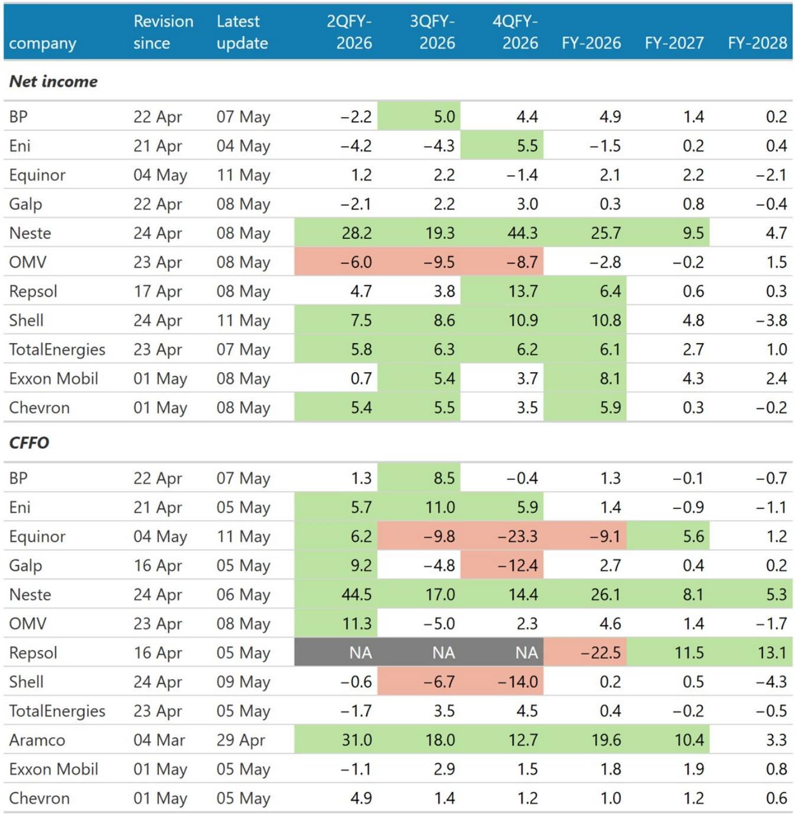
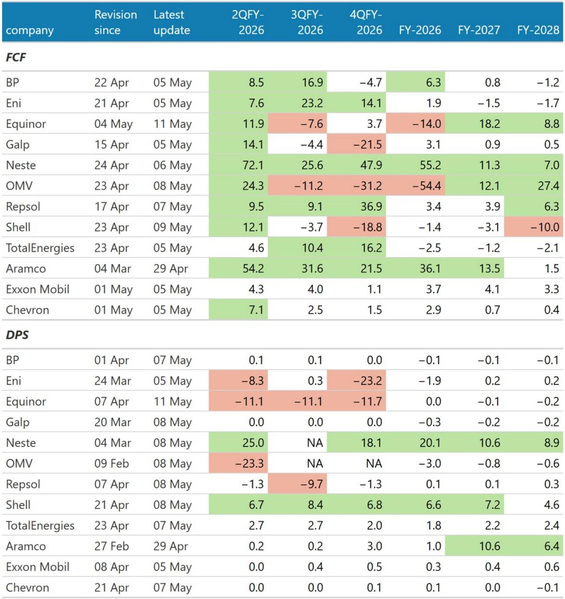
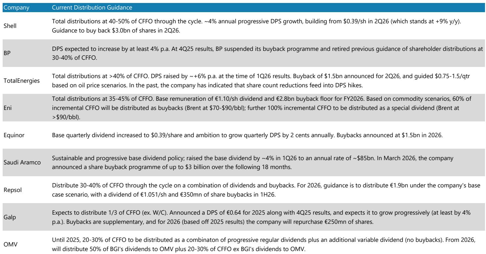

# The European Majors Are Not Peaking: 1Q26 Was the Start of an Earnings Uplift, Not the End

The 1Q26 earnings season for European energy majors delivered beats against elevated expectations, but the market is misreading the signal. The consensus narrative is that a combination of geopolitical disruption and strong commodity prices produced a one-off quarter that will be difficult to replicate. That interpretation is half right and half dangerous.

What the market is missing is that 1Q26 earnings were dominated by downstream and trading gains, not upstream pricing. The full benefit of the stronger commodity environment has not yet flowed through to reported earnings. Upstream pricing lags, contractual mechanisms, and volume disruptions have deferred what should be a materially larger earnings contribution into 2Q26 and beyond.

The sector is not peaking. It is rotating. The composition of earnings is shifting from trading-driven beats toward production-driven cash flow, and management teams are deliberately building balance sheet capacity for a distribution step-up that has not yet been priced in.

This matters now because the window for positioning is narrowing. The market is treating the sector as a near-term volatility trade tied to headlines. The medium-term structural case—higher free cash flow yields, conservative payout frameworks, and a commodity price floor that is higher than consensus assumes—remains underappreciated.

## The Earnings Beat Was Real, But Its Composition Reveals a Rotation Underway

The 1Q26 results exceeded consensus across the peer group, but the source of the beat tells a more important story than the magnitude. Downstream and trading drove the upside, not upstream production or pricing.

Shell beat consensus by 8 percent, with Chemicals and Products and Marketing exceeding expectations by a combined 35 percent, while Integrated Gas missed by more than 10 percent. BP reported adjusted earnings 20 percent ahead of consensus, with the beat overwhelmingly concentrated in Customers and Products, where operating profit exceeded expectations by roughly 30 percent due to refining, midstream, and exceptional oil trading performance. Its upstream and LNG divisions missed expectations by approximately 8 percent.

TotalEnergies delivered a more modest 4 percent beat, but the pattern was consistent: downstream outperformed upstream. Eni effectively proved the rule by exception—it missed consensus by 13 percent because outages at two major refineries prevented it from capturing the March refining margin rally.

The integrated model monetized disruption effectively. On our estimates, trading and optimisation likely contributed roughly $3 billion in incremental quarter-on-quarter earnings across Shell, BP, and TotalEnergies, concentrated in crude and refined products. That contribution represents nearly half of the sequential earnings growth for those three names.

The strategic question is not whether trading can repeat at these levels—it likely cannot—but whether the composition of earnings is about to become more favorable. The answer is yes, and the mechanism is upstream pricing.

## Production Losses Are Localized, But Pricing Benefits Are Global and Structural

At first glance, 1Q26 production appeared resilient. Aggregate output across the majors was broadly flat quarter-on-quarter despite material portfolio exposure to the Middle East Gulf. This reflected two offsetting forces: disruption effects were felt for only one-third of the quarter, and organic portfolio growth partially compensated.

The picture changes materially in 2Q26. On aggregate, we estimate the majors have roughly 10 percent production exposure to Middle East shut-ins in the current quarter. With low- to mid-single-digit underlying annual organic growth, the net effect is likely a production decline of approximately 5 percent year-on-year.

Companies are already guiding for this. TotalEnergies indicated that current shut-ins in Qatar, Iraq, and UAE offshore represent around 15 percent of total production exposure. BP guided to lower reported upstream production in 2026 due to Gulf of America maintenance and Middle East disruption effects. Equinor expects lower production in 2Q despite effectively no Middle East exposure, primarily due to turnaround activity.

But production is the wrong variable to focus on. The commodity backdrop strengthened materially through 1Q26, yet the realized benefit in reported earnings was relatively muted due to contractual pricing lags, weaker January-February pricing, and potentially realized discounts versus spot benchmarks.

Realized pricing across the group lagged the move in spot commodities by roughly $5 per barrel. That gap is about to close. Our estimates imply roughly a 40 percent quarter-on-quarter improvement in realized upstream pricing assumptions entering 2Q26 versus 1Q26.

The asymmetry is the key insight: production losses are localized and operationally visible, while pricing benefits are global and apply across entire portfolios. Even if production declines by 5 percent, the pricing uplift on the remaining 95 percent of production will more than compensate. The net effect remains structurally positive for sector earnings.

## Management Teams Are Building Dry Powder, Signaling Confidence in Future Distributions

The most counterintuitive signal from 1Q26 was the conservatism of management teams on capital allocation. Despite materially stronger cash generation, companies did not alter distribution frameworks beyond what already existed.

TotalEnergies maintained buybacks at the top end of its existing range while reiterating payout discipline. Eni raised 2026 buyback guidance to 2.8 billion euros, effectively increasing its planning scenario to $80 per barrel oil prices, but did not move beyond its pre-existing framework.

Elsewhere, distributions were unchanged or even lowered. BP reiterated its buyback pause and prioritized accelerated deleveraging. Equinor maintained its buyback and dividend unchanged, flagging that changes should be made on "money already earned" rather than stronger forecasts. Shell increased its dividend by a surprise 5 percent quarter-on-quarter but reduced its buyback to $3.0 billion per quarter, effectively trimming annual distributions by roughly $1.5 billion.

The message from management teams was remarkably consistent: they are comfortable allowing additional cash to accumulate on balance sheets in the near term, preferring to preserve flexibility rather than accelerate payouts into a volatile environment.

This is not a signal of weakness. It is a signal of discipline. In a higher-for-longer commodity price environment, current dividend and buyback run-rates are simply insufficient to meet existing policy floors at roughly 35 to 40 percent of cash flow from operations returned to shareholders.

On our commodity strip, we expect cash flow from operations payout policies to be cleared at around $4 billion for Shell, $2 billion for TotalEnergies, and 775 million euros for Eni without accounting for a potential special dividend. That would mark roughly a 30 percent increase from current run-rates, likely to come before the end of the year.

The sector is building balance sheet dry powder. At some point, that powder will be deployed into higher distributions. The question is not whether, but when.

## What the Report Does Not Fully Answer: The Durability of Trading Gains and the Path of Realized Discounts

The report provides robust analysis of 1Q26 earnings composition and the expected rotation toward upstream pricing, but it leaves two critical questions unresolved.

First, how repeatable are current trading gains? The report estimates that trading and optimization contributed roughly $3 billion in incremental quarter-on-quarter earnings in 1Q26, concentrated in crude and refined products. It acknowledges that sustaining 1Q run-rates may be challenging, but it does not provide a framework for estimating the normalized contribution of trading to sector earnings over a full cycle. If trading gains prove more persistent than assumed, the earnings trajectory could be even stronger than current estimates suggest. If they prove to be purely episodic, the sector faces a modest headwind in the second half of 2026.

Second, what is the path of realized discounts versus spot benchmarks? The report notes that realized pricing lagged spot by roughly $5 per barrel in 1Q26, but it does not model whether this discount will persist or narrow. If realized discounts remain wider than normal due to transportation costs, regional pricing distortions, or contractual mechanisms, the expected 40 percent improvement in realized pricing assumptions entering 2Q26 could prove optimistic. Conversely, if discounts narrow as markets normalize, the upside could be even larger.

These are the analytical questions that separate a good report from a complete investment framework. The report provides the data to ask them, but investors will need to make their own judgments on the answers.

## A Decision Framework for Positioning in European Energy

For investors considering how to position in the sector, the 1Q26 earnings season provides a clear framework built on three dimensions: earnings composition, distribution trajectory, and commodity price exposure.

First, assess earnings composition. Companies with stronger upstream exposure relative to trading and downstream are likely to see the largest sequential improvement in 2Q26 as pricing lags close. TotalEnergies offers the most balanced profile, with diversified exposure across upstream, LNG, and downstream that reduces single-segment risk. BP offers higher leverage to free cash flow improvement as its upstream earnings catch up to the commodity environment.

Second, evaluate distribution trajectory. Companies with explicit payout policies tied to cash flow from operations are most likely to deliver distribution increases in the second half of 2026. Shell and TotalEnergies have the clearest mechanisms, while Eni has moved toward greater clarity. BP and Equinor lack explicit frameworks but will face competitive pressure to follow if the peer group increases returns.

Third, consider commodity price exposure. The report assumes Brent at $94 per barrel in 2026 and $80 per barrel in real terms thereafter, with European gas at $20 per million British thermal units and refining margins at $12 per barrel. Investors with a more bullish view on oil prices should favor BP and Equinor for their higher upstream leverage. Investors with a more cautious view should favor TotalEnergies for its integrated diversification and lower commodity sensitivity.

The key risk to this framework is a rapid de-escalation of Middle East tensions that compresses the risk premium embedded in oil prices. But even under a de-escalation scenario, the market is not the same one it was before the disruption began. Flows remain severely curtailed, inventories have drawn, freight and product markets have repriced, and the market now needs to assign a more persistent risk premium to the new order around the Strait of Hormuz.

The sector remains attractive not because of the current geopolitical premium, but because the underlying cash flow generation and distribution capacity are structurally higher than the market prices in.

Join the community to read the full report and review the original charts.

*This article is for learning and discussion only and does not constitute investment advice.*

Personal reading notes and learning share only. Not investment advice.

