# European Autos: Key themes, views and ideas

1. What is in the price: improved Risk- Reward   
2. Margin cycle timing: bottoming in 2025-26, mild recovery from 2027   
3. Structural issues: China share gain acceleration   
4. We prefer: Premium vs Volume OEMs   
5. Company specific: tariffs, product pipeline, JVs, valuation

6. How to Play it? European OEMs: 2026 getting darker

A. Parts: Execution Over Cycle

Tyres: No strong reason to be in Tyres

Trucks: PMIs to Power Multiple Inflection

# MS EUROPE

MS EUROPE S.E.+

Javier Martinez de Olcoz

EQUITY ANALYST

Javier.Martinez.Olcoz@morganstanley.com

+34 914 181 289

# MS & CO. INTERNATIONAL PLC+

Shaqeal A. Kirunda

EQUITY ANALYST

Shageal.Kirunda@morganstanley.com

+44 207 425 0736

Matias Rodriguez Florez-Estrada

RESEARCH ASSOCIATE

Matias.Rodriguez@morganstanley.com

+44 207 425-1091

# 1 – What's in the price? Significant underperformance improves Risk-Reward

# Underperforming European Market

SXAP vs SXXP (100 = -1Y)   
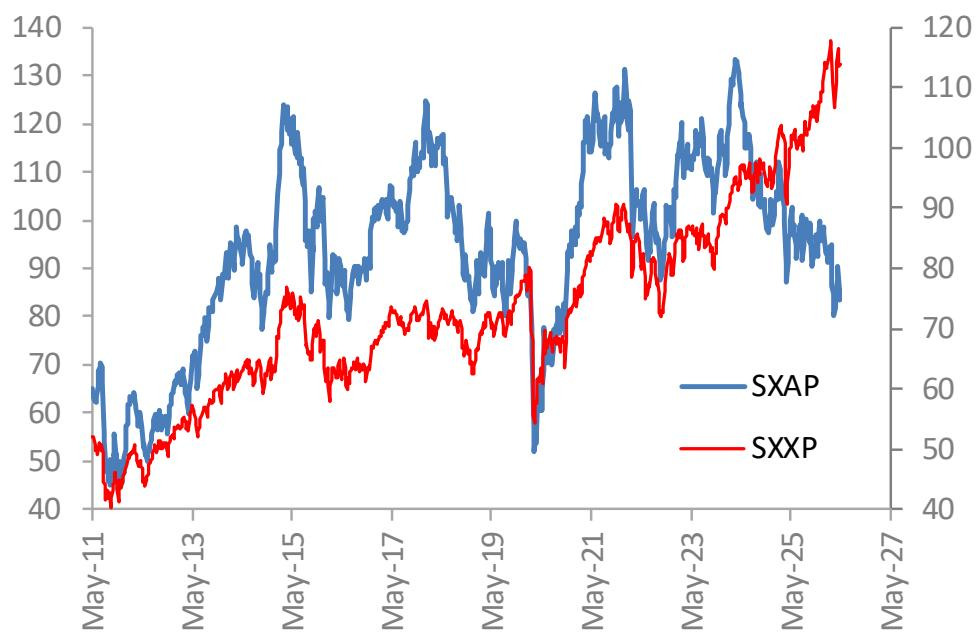

line

| Date   | SXAP | SXXP |
|--------|------|------|
| May-11 | 70   | 50   |
| May-13 | 60   | 55   |
| May-15 | 125  | 85   |
| May-17 | 115  | 80   |
| May-19 | 95   | 75   |
| May-21 | 130  | 95   |
| May-23 | 120  | 90   |
| May-25 | 100  | 105  |
| May-27 | 85   | 115  |

# 1 – What's in the price? Significant underperformance improves Risk-Reward

# Underperforming cyclicals, even consumers peers

SXAP vs European Cyclicals (100 = -1Y)   
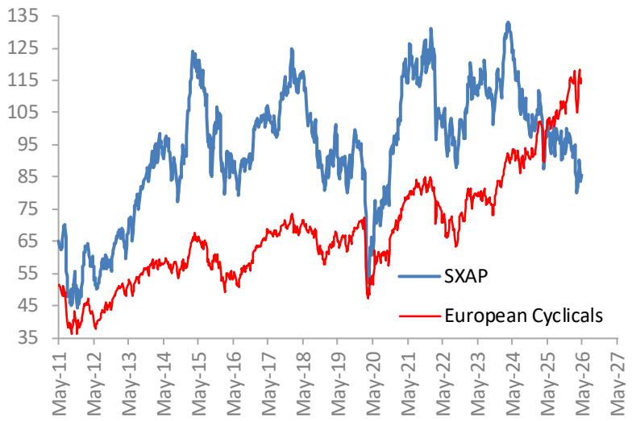

line

| Date   | SXAP  | European Cyclicals |
|--------|-------|--------------------|
| May-11 | 65    | 45                 |
| May-12 | 55    | 35                 |
| May-13 | 70    | 45                 |
| May-14 | 90    | 55                 |
| May-15 | 120   | 60                 |
| May-16 | 85    | 50                 |
| May-17 | 100   | 65                 |
| May-18 | 125   | 70                 |
| May-19 | 95    | 60                 |
| May-20 | 70    | 45                 |
| May-21 | 120   | 80                 |
| May-22 | 130   | 85                 |
| May-23 | 115   | 90                 |
| May-24 | 135   | 95                 |
| May-25 | 105   | 100                |
| May-26 | 90    | 110                |
| May-27 | 80    | 115                |

SXAP vs EU Consum. Discretionary (100 = -1Y)   
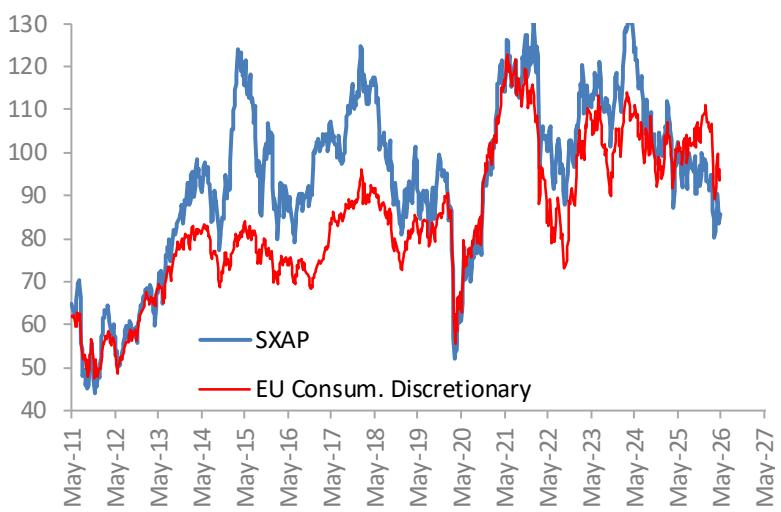

line

| Date   | SXAP  | EU Consum. Discretionary |
|--------|-------|--------------------------|
| May-11 | 68    | 62                       |
| May-12 | 45    | 50                       |
| May-13 | 65    | 60                       |
| May-14 | 95    | 80                       |
| May-15 | 125   | 85                       |
| May-16 | 90    | 75                       |
| May-17 | 105   | 85                       |
| May-18 | 125   | 95                       |
| May-19 | 90    | 80                       |
| May-20 | 50    | 60                       |
| May-21 | 120   | 115                      |
| May-22 | 105   | 100                      |
| May-23 | 115   | 105                      |
| May-24 | 130   | 110                      |
| May-25 | 100   | 95                       |
| May-26 | 80    | 90                       |
| May-27 | 70    | 85                       |

# 1 – What's in the price? Relative Performance: Trucks > Parts > Tyres > OEMs

EU OEMs vs Europe Mkt (100=-1Y)   
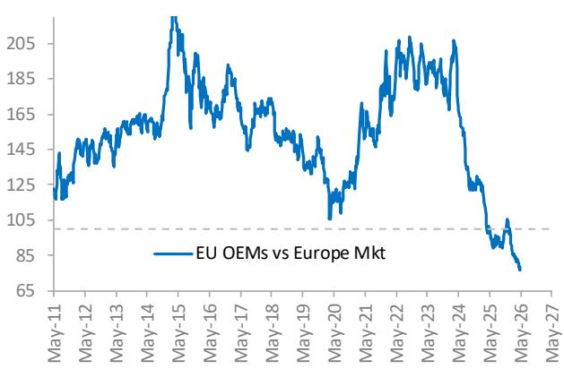

line

| Date   | EU OEMs vs Europe Mkt |
|--------|------------------------|
| May-11 | 120                    |
| May-12 | 140                    |
| May-13 | 150                    |
| May-14 | 160                    |
| May-15 | 210                    |
| May-16 | 180                    |
| May-17 | 170                    |
| May-18 | 160                    |
| May-19 | 150                    |
| May-20 | 105                    |
| May-21 | 160                    |
| May-22 | 200                    |
| May-23 | 190                    |
| May-24 | 205                    |
| May-25 | 130                    |
| May-26 | 90                     |
| May-27 | 70                     |

EU Trucks vs Europe Mkt (100=-1Y)   
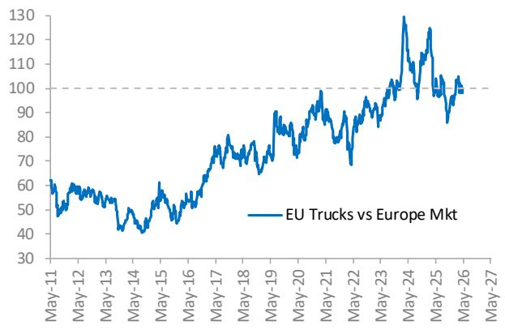

line

| Date   | EU Trucks vs Europe Mkt |
|--------|--------------------------|
| May-11 | 60                       |
| May-12 | 55                       |
| May-13 | 50                       |
| May-14 | 45                       |
| May-15 | 55                       |
| May-16 | 60                       |
| May-17 | 70                       |
| May-18 | 75                       |
| May-19 | 80                       |
| May-20 | 90                       |
| May-21 | 95                       |
| May-22 | 85                       |
| May-23 | 100                      |
| May-24 | 130                      |
| May-25 | 120                      |
| May-26 | 100                      |
| May-27 | 100                      |

EU Auto Parts vs Europe Mkt (100=-1Y)   
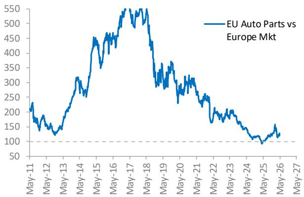

line

| Date   | EU Auto Parts vs Europe Mkt |
|--------|-----------------------------|
| May-11 | 220                         |
| May-12 | 180                         |
| May-13 | 130                         |
| May-14 | 280                         |
| May-15 | 450                         |
| May-16 | 480                         |
| May-17 | 550                         |
| May-18 | 520                         |
| May-19 | 350                         |
| May-20 | 300                         |
| May-21 | 250                         |
| May-22 | 200                         |
| May-23 | 180                         |
| May-24 | 150                         |
| May-25 | 100                         |
| May-26 | 150                         |
| May-27 | 120                         |

EU Tyres vs Europe Mkt (100=-1Y)   
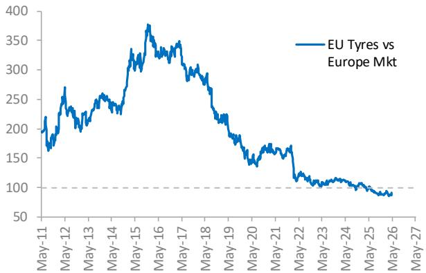

line

| Date   | EU Tyres vs Europe Mkt |
|--------|------------------------|
| May-11 | ~170                   |
| May-12 | ~270                   |
| May-13 | ~240                   |
| May-14 | ~250                   |
| May-15 | ~330                   |
| May-16 | ~380                   |
| May-17 | ~340                   |
| May-18 | ~300                   |
| May-19 | ~220                   |
| May-20 | ~150                   |
| May-21 | ~170                   |
| May-22 | ~120                   |
| May-23 | ~110                   |
| May-24 | ~105                   |
| May-25 | ~95                    |
| May-26 | ~90                    |
| May-27 | ~85                    |

# 1 – What's in the price? Relative Performance: Trucks > Tyres > Parts > OEMs

EU OEMs vs Global OEMs (100=-1Y)   
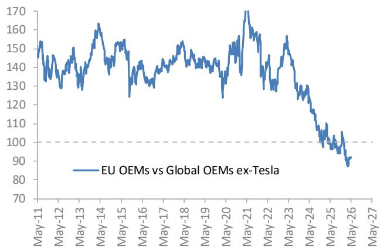

line

| Date   | EU OEMs vs Global OEMs ex-Tesla |
|--------|----------------------------------|
| May-11 | 150                              |
| May-12 | 140                              |
| May-13 | 155                              |
| May-14 | 165                              |
| May-15 | 150                              |
| May-16 | 140                              |
| May-17 | 135                              |
| May-18 | 145                              |
| May-19 | 140                              |
| May-20 | 130                              |
| May-21 | 170                              |
| May-22 | 155                              |
| May-23 | 150                              |
| May-24 | 130                              |
| May-25 | 100                              |
| May-26 | 90                               |
| May-27 | 85                               |

EU Trucks vs Int. OEMs (100=-1Y)   
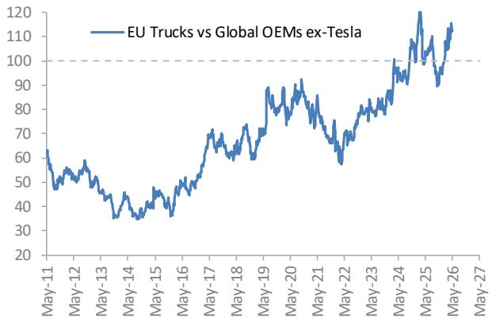

line

| Date   | EU Trucks vs Global OEMs ex-Tesla |
|--------|-----------------------------------|
| May-11 | 60                                |
| May-12 | 50                                |
| May-13 | 45                                |
| May-14 | 35                                |
| May-15 | 40                                |
| May-16 | 50                                |
| May-17 | 60                                |
| May-18 | 70                                |
| May-19 | 80                                |
| May-20 | 90                                |
| May-21 | 85                                |
| May-22 | 70                                |
| May-23 | 80                                |
| May-24 | 95                                |
| May-25 | 100                               |
| May-26 | 110                               |
| May-27 | 115                               |

EU Auto Parts vs Int. Auto Parts (100=-1Y)   
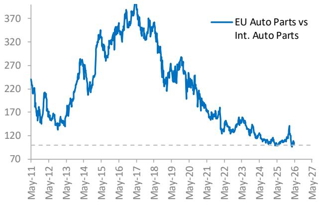

line

| Date   | EU Auto Parts vs Int. Auto Parts |
|--------|-----------------------------------|
| May-11 | 220                               |
| May-12 | 180                               |
| May-13 | 160                               |
| May-14 | 250                               |
| May-15 | 300                               |
| May-16 | 350                               |
| May-17 | 370                               |
| May-18 | 340                               |
| May-19 | 280                               |
| May-20 | 260                               |
| May-21 | 220                               |
| May-22 | 180                               |
| May-23 | 160                               |
| May-24 | 140                               |
| May-25 | 120                               |
| May-26 | 100                               |
| May-27 | 90                                |

EU Tyres vs Int. Tyres (100=-1Y)   
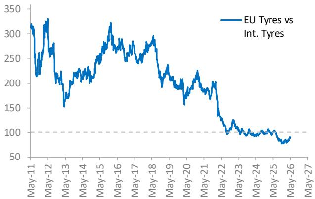

line

| Date   | EU Tyres vs Int. Tyres |
|--------|------------------------|
| May-11 | 320                    |
| May-12 | 330                    |
| May-13 | 160                    |
| May-14 | 220                    |
| May-15 | 280                    |
| May-16 | 320                    |
| May-17 | 290                    |
| May-18 | 270                    |
| May-19 | 230                    |
| May-20 | 160                    |
| May-21 | 220                    |
| May-22 | 100                    |
| May-23 | 110                    |
| May-24 | 100                    |
| May-25 | 90                     |
| May-26 | 80                     |
| May-27 | 90                     |

# 1 – What's in the price? Relative Performance: Trucks > Parts > Tyres > OEMs

EU OEMs (100=-2Y)   
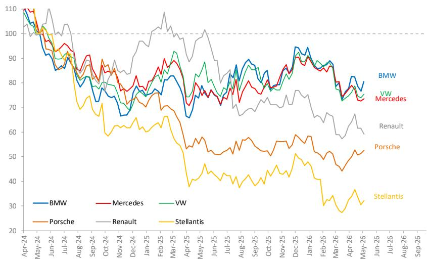

EU Trucks (100=-2Y)   
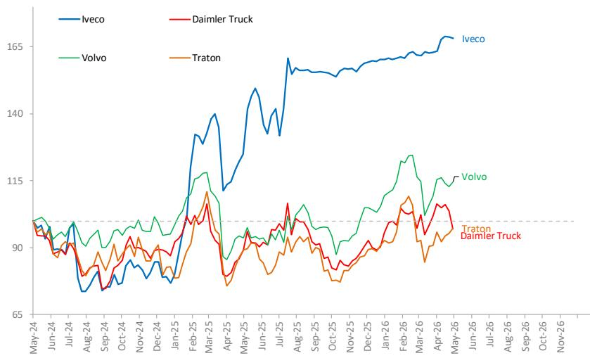

EU Auto Parts (100=-2Y)   
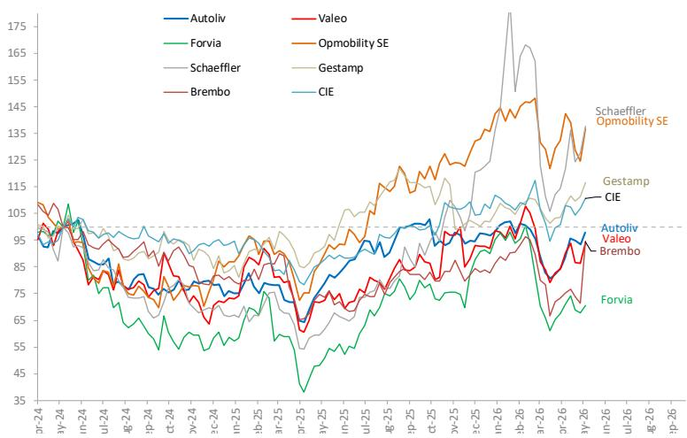

EU Tyres (100=-2Y)   
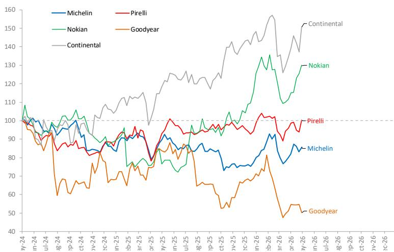  
Source: Datastream, MS

# 1 – What's in the price? Autos performance driven by Earnings

# Margins are a good proxy for Autos absolute and relative performance

SXAP (100 = -1Y)   
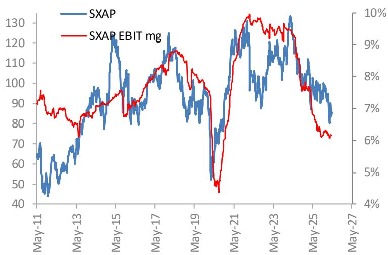

line

| Date   | SXAP | SXAP EBIT mg |
|--------|------|--------------|
| May-11 | 65   | 95           |
| May-13 | 70   | 85           |
| May-15 | 120  | 90           |
| May-17 | 115  | 100          |
| May-19 | 90   | 80           |
| May-21 | 125  | 100          |
| May-23 | 130  | 95           |
| May-25 | 100  | 75           |
| May-27 | 85   | 65           |

SXAP vs SXXP (100 = -1Y)   
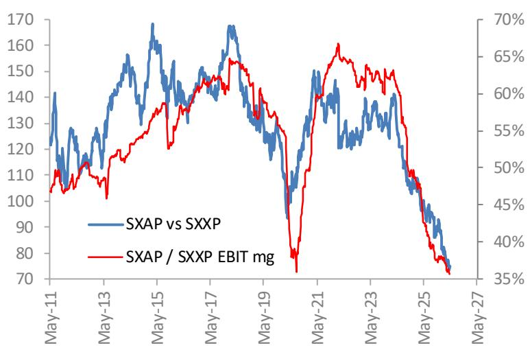

line

| Date   | SXAP vs SXXP | SXAP / SXXP EBIT mg |
|--------|--------------|---------------------|
| May-11 | 140          | 50%                 |
| May-13 | 150          | 55%                 |
| May-15 | 170          | 60%                 |
| May-17 | 160          | 65%                 |
| May-19 | 130          | 55%                 |
| May-21 | 150          | 65%                 |
| May-23 | 140          | 60%                 |
| May-25 | 100          | 45%                 |
| May-27 | 70           | 35%                 |

# 1 – What's in the price? Autos performance driven by Earnings

# EPS also matters

SXAP (100 = -1Y)   
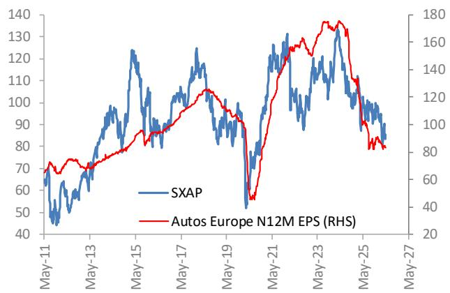

line

| Date   | SXAP | Autos Europe N12M EPS (RHS) |
|--------|------|-----------------------------|
| May-11 | 45   | 70                          |
| May-13 | 65   | 75                          |
| May-15 | 125  | 85                          |
| May-17 | 100  | 105                         |
| May-19 | 90   | 95                          |
| May-21 | 130  | 160                         |
| May-23 | 135  | 175                         |
| May-25 | 100  | 100                         |
| May-27 | 85   | 80                          |

SXAP vs SXXP (100 = -1Y)   
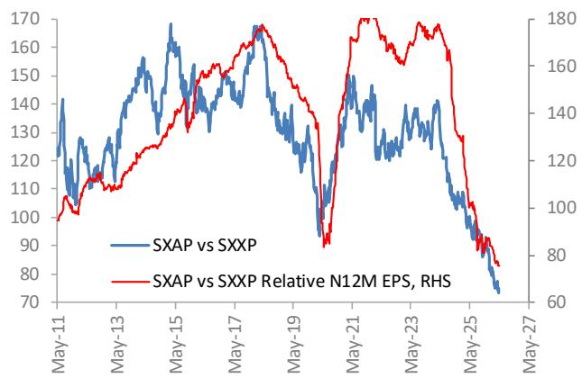

line

| Date   | SXAP vs SXXP | SXAP vs SXXP Relative N12M EPS, RHS |
|--------|--------------|-------------------------------------|
| May-11 | 140          | 100                                 |
| May-13 | 150          | 110                                 |
| May-15 | 165          | 120                                 |
| May-17 | 160          | 130                                 |
| May-19 | 140          | 150                                 |
| May-21 | 150          | 160                                 |
| May-23 | 140          | 150                                 |
| May-25 | 100          | 120                                 |
| May-27 | 70           | 80                                  |

SXAP vs SXXP (100 = -1Y)   
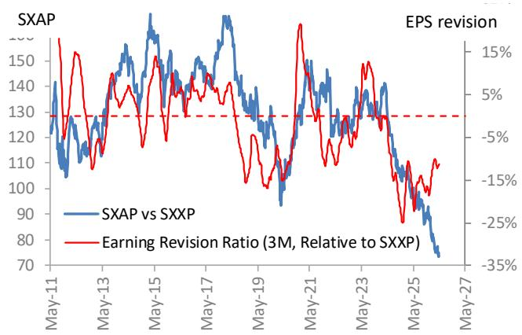

line

| Date   | SXAP vs SXXP | Earning Revision Ratio (3M, Relative to SXXP) |
|--------|--------------|-----------------------------------------------|
| May-11 | ~140         | ~15%                                          |
| May-13 | ~130         | ~5%                                           |
| May-15 | ~150         | ~0%                                           |
| May-17 | ~140         | ~5%                                           |
| May-19 | ~130         | ~0%                                           |
| May-21 | ~140         | ~5%                                           |
| May-23 | ~130         | ~0%                                           |
| May-25 | ~100         | ~-25%                                         |
| May-27 | ~70          | ~-35%                                         |

# 1 – What's in the price? Autos performance driven by Margins

... the same applies for APs, Tyres and relative sUBSector performance

EU Auto Parts (100 = -1Y)   
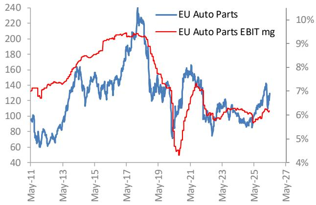

line

| Date   | EU Auto Parts | EU Auto Parts EBIT mg |
|--------|---------------|------------------------|
| May-11 | 100           | 7%                     |
| May-13 | 80            | 8%                     |
| May-15 | 160           | 9%                     |
| May-17 | 230           | 9%                     |
| May-19 | 140           | 6%                     |
| May-21 | 160           | 5%                     |
| May-23 | 120           | 6%                     |
| May-25 | 140           | 6%                     |
| May-27 | 130           | 6%                     |

EU Auto Parts vs SXXP (100 = -1Y)   
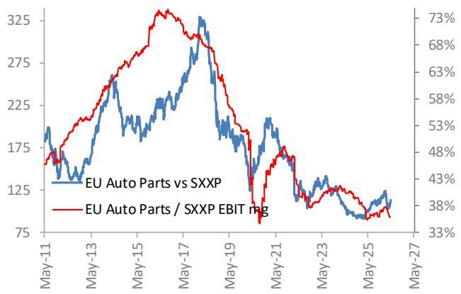

line

| Date   | EU Auto Parts vs SXXP | EU Auto Parts / SXXP EBIT mg |
|--------|------------------------|-------------------------------|
| May-11 | ~180                   | ~48%                          |
| May-13 | ~220                   | ~58%                          |
| May-15 | ~280                   | ~68%                          |
| May-17 | ~320                   | ~73%                          |
| May-19 | ~200                   | ~53%                          |
| May-21 | ~120                   | ~43%                          |
| May-23 | ~100                   | ~38%                          |
| May-25 | ~80                    | ~33%                          |
| May-27 | ~100                   | ~38%                          |

EU OEMs vs EU Suppliers (100 = -1Y)   
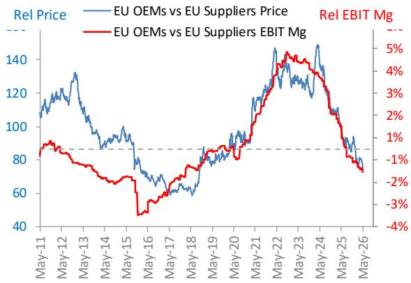

line

| Date   | EU OEMs vs EU Suppliers Price | EU OEMs vs EU Suppliers EBIT Mg |
|--------|--------------------------------|----------------------------------|
| May-11 | ~110                           | ~90                              |
| May-12 | ~130                           | ~85                              |
| May-13 | ~100                           | ~75                              |
| May-14 | ~90                            | ~65                              |
| May-15 | ~80                            | ~50                              |
| May-16 | ~70                            | ~40                              |
| May-17 | ~65                            | ~55                              |
| May-18 | ~75                            | ~65                              |
| May-19 | ~85                            | ~75                              |
| May-20 | ~95                            | ~85                              |
| May-21 | ~110                           | ~95                              |
| May-22 | ~140                           | ~130                             |
| May-23 | ~130                           | ~140                             |
| May-24 | ~145                           | ~135                             |
| May-25 | ~100                           | ~90                              |
| May-26 | ~75                            | ~65                              |

EU Suppliers vs EU Tyres (100 = -1Y)   
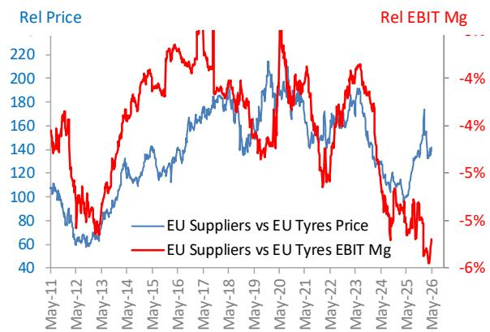

line

| Date   | EU Suppliers vs EU Tyres Price | EU Suppliers vs EU Tyres EBIT Mg |
|--------|----------------------------------|-----------------------------------|
| May-11 | 100                              | -4%                               |
| May-12 | 80                               | -5%                               |
| May-13 | 100                              | -4%                               |
| May-14 | 120                              | -4%                               |
| May-15 | 140                              | -4%                               |
| May-16 | 160                              | -4%                               |
| May-17 | 180                              | -4%                               |
| May-18 | 190                              | -4%                               |
| May-19 | 200                              | -4%                               |
| May-20 | 210                              | -4%                               |
| May-21 | 190                              | -5%                               |
| May-22 | 180                              | -5%                               |
| May-23 | 170                              | -5%                               |
| May-24 | 150                              | -5%                               |
| May-25 | 130                              | -6%                               |
| May-26 | 170                              | -6%                               |

Source: Datastream, MS

# 1 – What's in the price? Autos performance driven by Margins

... the same applies for relative company performance   
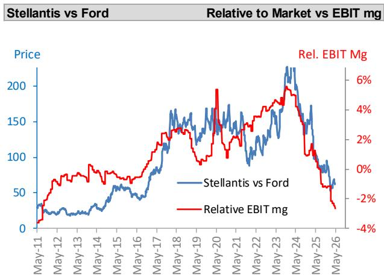

line

| Date   | Stellantis vs Ford | Relative EBIT mg |
|--------|--------------------|------------------|
| May-11 | ~20                | ~-4%             |
| May-12 | ~30                | ~-2%             |
| May-13 | ~40                | ~0%              |
| May-14 | ~50                | ~2%              |
| May-15 | ~60                | ~4%              |
| May-16 | ~70                | ~6%              |
| May-17 | ~80                | ~4%              |
| May-18 | ~100               | ~2%              |
| May-19 | ~120               | ~0%              |
| May-20 | ~150               | ~4%              |
| May-21 | ~170               | ~2%              |
| May-22 | ~180               | ~0%              |
| May-23 | ~200               | ~2%              |
| May-24 | ~180               | ~4%              |
| May-25 | ~150               | ~2%              |
| May-26 | ~70                | ~-2%             |

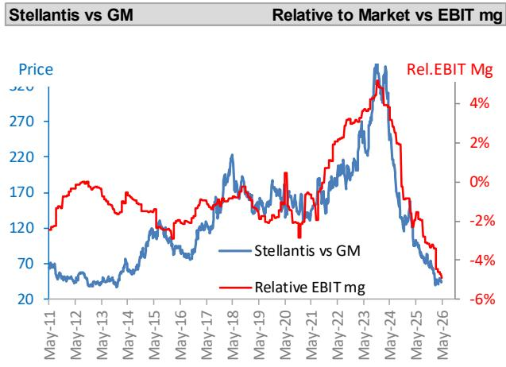

line

| Date   | Stellantis vs GM | Relative EBIT mg |
|--------|------------------|------------------|
| May-11 | ~70              | ~12%             |
| May-12 | ~65              | ~15%             |
| May-13 | ~60              | ~14%             |
| May-14 | ~70              | ~13%             |
| May-15 | ~80              | ~12%             |
| May-16 | ~90              | ~11%             |
| May-17 | ~100             | ~10%             |
| May-18 | ~120             | ~8%              |
| May-19 | ~130             | ~6%              |
| May-20 | ~140             | ~4%              |
| May-21 | ~150             | ~2%              |
| May-22 | ~160             | ~0%              |
| May-23 | ~180             | -2%              |
| May-24 | ~200             | -4%              |
| May-25 | ~150             | -6%              |
| May-26 | ~50              | -6%              |

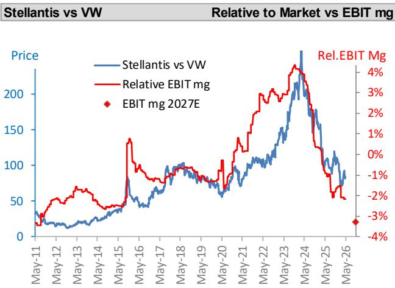

line

| Date   | Stellantis vs VW | Relative EBIT mg | EBIT mg 2027E |
|--------|------------------|------------------|---------------|
| May-11 | ~20              | ~0%              | -             |
| May-12 | ~30              | ~1%              | -             |
| May-13 | ~40              | ~2%              | -             |
| May-14 | ~50              | ~3%              | -             |
| May-15 | ~60              | ~4%              | -             |
| May-16 | ~80              | ~3%              | -             |
| May-17 | ~90              | ~2%              | -             |
| May-18 | ~100             | ~1%              | -             |
| May-19 | ~90              | ~0%              | -             |
| May-20 | ~70              | ~-1%             | -             |
| May-21 | ~100             | ~1%              | -             |
| May-22 | ~150             | ~2%              | -             |
| May-23 | ~200             | ~3%              | -             |
| May-24 | ~250             | ~4%              | -             |
| May-25 | ~150             | ~2%              | -             |
| May-26 | ~50              | ~-3%             | -3%           |

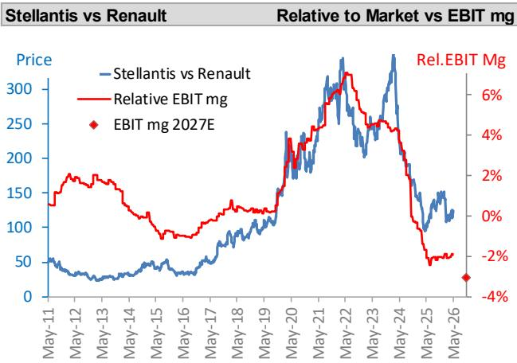

line

| Date    | Stellantis vs Renault | Relative EBIT mg | EBIT mg 2027E |
|---------|------------------------|------------------|---------------|
| May-11  | ~50                    | ~18              | -             |
| May-12  | ~40                    | ~17              | -             |
| May-13  | ~35                    | ~16              | -             |
| May-14  | ~45                    | ~14              | -             |
| May-15  | ~50                    | ~12              | -             |
| May-16  | ~60                    | ~10              | -             |
| May-17  | ~70                    | ~9               | -             |
| May-18  | ~80                    | ~11              | -             |
| May-19  | ~90                    | ~13              | -             |
| May-20  | ~150                   | ~20              | -             |
| May-21  | ~250                   | ~30              | -             |
| May-22  | ~300                   | ~40              | -             |
| May-23  | ~250                   | ~35              | -             |
| May-24  | ~350                   | ~45              | -             |
| May-25  | ~150                   | ~5               | -             |
| May-26  | ~100                   | ~-2              | -4%           |

Source: Datastream, MS estimates

# 1 – What's in the price? Autos performance driven by Margins

... the same applies for relative company performance   
BMW vs Mercedes   
Relative to Market vs EBIT mg   
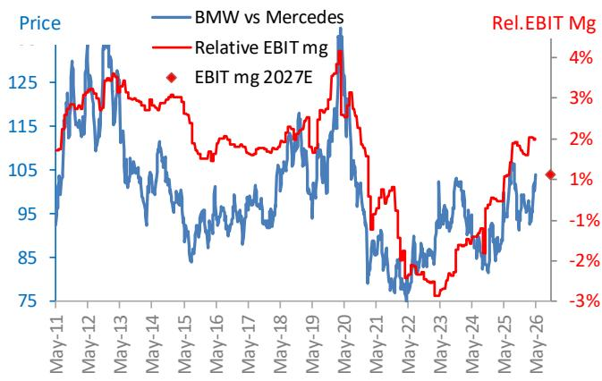

line

| Date   | BMW vs Mercedes | Relative EBIT mg | EBIT mg 2027E |
|--------|-----------------|------------------|---------------|
| May-11 | ~105            | ~1.5%            | -             |
| May-12 | ~125            | ~2.5%            | -             |
| May-13 | ~115            | ~3.0%            | -             |
| May-14 | ~105            | ~2.5%            | -             |
| May-15 | ~95             | ~2.0%            | -             |
| May-16 | ~105            | ~1.5%            | -             |
| May-17 | ~115            | ~1.0%            | -             |
| May-18 | ~125            | ~0.5%            | -             |
| May-19 | ~130            | ~0.0%            | -             |
| May-20 | ~135            | ~-0.5%           | -             |
| May-21 | ~95             | ~-1.5%           | -             |
| May-22 | ~85             | ~-2.5%           | -             |
| May-23 | ~95             | ~-3.0%           | -             |
| May-24 | ~105            | ~-2.0%           | -             |
| May-25 | ~115            | ~-1.0%           | -             |
| May-26 | ~105            | ~0.5%            | 1.0%          |

BMW vs Porsche   
Relative to Market vs EBIT mg   
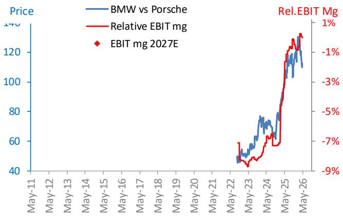

line

| Date   | BMW vs Porsche | Relative EBIT mg | EBIT mg 2027E |
|--------|----------------|------------------|---------------|
| May-21 | ~45            | ~-8%             | -             |
| May-22 | ~50            | ~-7%             | -             |
| May-23 | ~55            | ~-6%             | -             |
| May-24 | ~70            | ~-5%             | -             |
| May-25 | ~100           | ~-3%             | -             |
| May-26 | ~130           | ~-1%             | -             |

VW vs Ford   
Relative to Market vs EBIT mg   
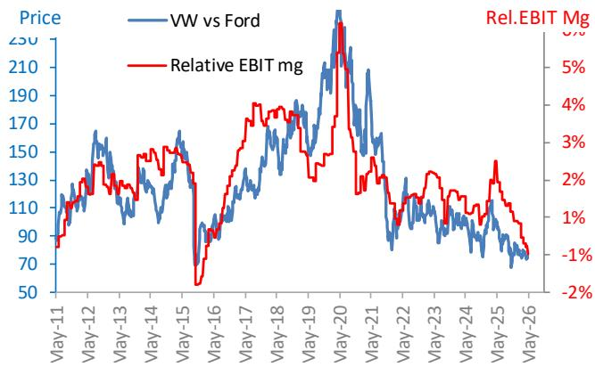

line

| Date   | Price | Relative EBIT mg |
|--------|-------|------------------|
| May-11 | 90    | 0%               |
| May-12 | 130   | 1%               |
| May-13 | 150   | 2%               |
| May-14 | 140   | 1%               |
| May-15 | 70    | -2%              |
| May-16 | 90    | 0%               |
| May-17 | 170   | 3%               |
| May-18 | 180   | 4%               |
| May-19 | 200   | 5%               |
| May-20 | 250   | 5%               |
| May-21 | 190   | 3%               |
| May-22 | 90    | -1%              |
| May-23 | 110   | 1%               |
| May-24 | 130   | 2%               |
| May-25 | 150   | 3%               |
| May-26 | 70    | -1%              |

VW vs Renault   
Relative to Market vs EBIT mg   
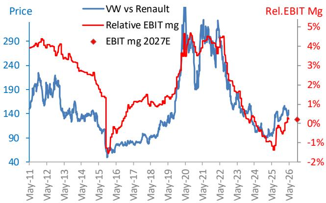

line

| Date   | Price | Rel.EBIT Mg |
|--------|-------|-------------|
| May-11 | 190   | 4%          |
| May-12 | 230   | 4%          |
| May-13 | 180   | 3%          |
| May-14 | 140   | 2%          |
| May-15 | 90    | -1%         |
| May-16 | 40    | -2%         |
| May-17 | 80    | 0%          |
| May-18 | 100   | 1%          |
| May-19 | 140   | 2%          |
| May-20 | 290   | 5%          |
| May-21 | 270   | 4%          |
| May-22 | 250   | 3%          |
| May-23 | 180   | 1%          |
| May-24 | 100   | -1%         |
| May-25 | 80    | -2%         |
| May-26 | 140   | 0%          |

# 1 – What's in the price? Autos performs as cyclical sectors

SXAP (100 = -1Y)   
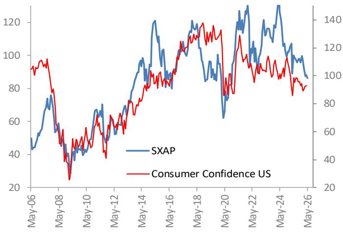

line

| Date   | SXAP | Consumer Confidence US |
|--------|------|------------------------|
| May-06 | 45   | 95                     |
| May-08 | 75   | 50                     |
| May-10 | 40   | 30                     |
| May-12 | 65   | 55                     |
| May-14 | 95   | 85                     |
| May-16 | 120  | 105                    |
| May-18 | 115  | 125                    |
| May-20 | 60   | 70                     |
| May-22 | 130  | 110                    |
| May-24 | 125  | 100                    |
| May-26 | 90   | 80                     |

SXAP Rel. Performance vs Copper/Gold   
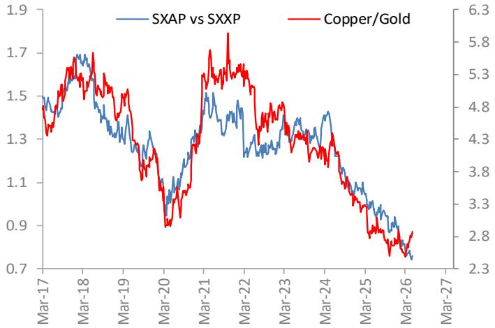

line

| Date   | SXAP vs SXXP | Copper/Gold |
|--------|--------------|-------------|
| Mar-17 | 1.5          | 4.8         |
| Mar-18 | 1.7          | 5.3         |
| Mar-19 | 1.4          | 4.5         |
| Mar-20 | 1.0          | 3.8         |
| Mar-21 | 1.5          | 5.8         |
| Mar-22 | 1.3          | 4.9         |
| Mar-23 | 1.4          | 4.2         |
| Mar-24 | 1.5          | 3.9         |
| Mar-25 | 1.0          | 3.0         |
| Mar-26 | 0.7          | 2.8         |
| Mar-27 | 0.7          | 2.3         |

SXAP vs SXXP (100 = -1Y)   
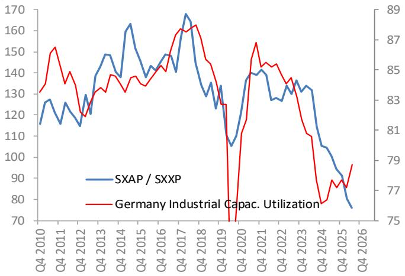

line

| Quarter | SXAP / SXXP | Germany Industrial Capac. Utilization |
|---------|-------------|----------------------------------------|
| Q4 2010 | 120         | 83                                     |
| Q4 2011 | 130         | 85                                     |
| Q4 2012 | 125         | 84                                     |
| Q4 2013 | 135         | 83                                     |
| Q4 2014 | 145         | 84                                     |
| Q4 2015 | 150         | 85                                     |
| Q4 2016 | 145         | 86                                     |
| Q4 2017 | 165         | 87                                     |
| Q4 2018 | 155         | 86                                     |
| Q4 2019 | 130         | 75                                     |
| Q4 2020 | 105         | 77                                     |
| Q4 2021 | 140         | 85                                     |
| Q4 2022 | 135         | 84                                     |
| Q4 2023 | 130         | 83                                     |
| Q4 2024 | 110         | 77                                     |
| Q4 2025 | 90          | 79                                     |
| Q4 2026 | 75          | 80                                     |

EU OEMs PE   
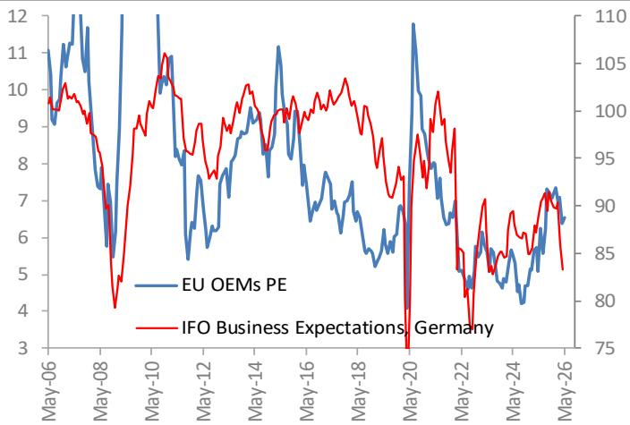

line

| Date   | EU OEMs PE | IFO Business Expectations, Germany |
|--------|------------|-------------------------------------|
| May-06 | 9.5        | 9.8                                 |
| May-08 | 7.0        | 4.0                                 |
| May-10 | 11.5       | 10.5                                |
| May-12 | 8.0        | 8.5                                 |
| May-14 | 9.0        | 9.5                                 |
| May-16 | 8.5        | 9.0                                 |
| May-18 | 7.5        | 8.0                                 |
| May-20 | 11.5       | 7.0                                 |
| May-22 | 6.0        | 4.0                                 |
| May-24 | 5.0        | 6.5                                 |
| May-26 | 7.0        | 5.0                                 |

# 2 – Structural Issues: slow market and low level of capacity utilization

Industrial business with still low level of capacity utilization   
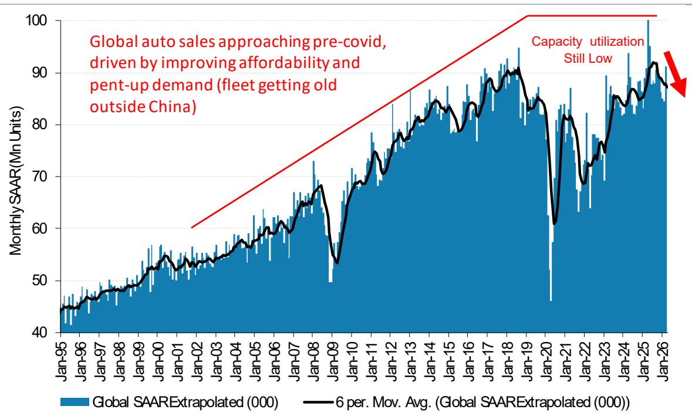

line

| Date    | Global SAARExtrapolated (Mn Units) | 6 per. Mov. Avg. (Mn Units) |
|---------|------------------------------------|------------------------------|
| Jan-95  | ~45                                | ~45                          |
| Jan-96  | ~47                                | ~46                          |
| Jan-97  | ~48                                | ~47                          |
| Jan-98  | ~49                                | ~48                          |
| Jan-99  | ~50                                | ~49                          |
| Jan-00  | ~52                                | ~50                          |
| Jan-01  | ~53                                | ~51                          |
| Jan-02  | ~54                                | ~52                          |
| Jan-03  | ~55                                | ~53                          |
| Jan-04  | ~56                                | ~54                          |
| Jan-05  | ~57                                | ~55                          |
| Jan-06  | ~58                                | ~56                          |
| Jan-07  | ~59                                | ~57                          |
| Jan-08  | ~60                                | ~58                          |
| Jan-09  | ~61                                | ~59                          |
| Jan-10  | ~62                                | ~60                          |
| Jan-11  | ~63                                | ~61                          |
| Jan-12  | ~64                                | ~62                          |
| Jan-13  | ~65                                | ~63                          |
| Jan-14  | ~66                                | ~64                          |
| Jan-15  | ~67                                | ~65                          |
| Jan-16  | ~68                                | ~66                          |
| Jan-17  | ~69                                | ~67                          |
| Jan-18  | ~70                                | ~68                          |
| Jan-19  | ~71                                | ~69                          |
| Jan-20  | ~72                                | ~70                          |
| Jan-21  | ~73                                | ~71                          |
| Jan-22  | ~74                                | ~72                          |
| Jan-23  | ~75                                | ~73                          |
| Jan-24  | ~76                                | ~74                          |
| Jan-25  | ~77                                | ~75                          |
| Jan-26  | ~78                                | ~76                          |

Global Auto Sales tracker: Narrowly up (24 Apr 2026)

# 2 – Structural Issues: slow market, China not growing anymore

Global Auto sales: China and US now falling, room to recover in Europe and RoW   
China SAAR (6MMAV), Monthly   
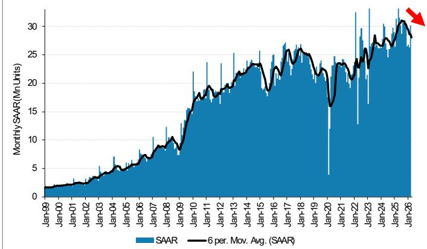

line

| Date   | SAAR (Mn Units) |
|--------|-----------------|
| Jan-99 | 1               |
| Jan-00 | 2               |
| Jan-01 | 3               |
| Jan-02 | 4               |
| Jan-03 | 5               |
| Jan-04 | 6               |
| Jan-05 | 7               |
| Jan-06 | 8               |
| Jan-07 | 9               |
| Jan-08 | 10              |
| Jan-09 | 11              |
| Jan-10 | 12              |
| Jan-11 | 13              |
| Jan-12 | 14              |
| Jan-13 | 15              |
| Jan-14 | 16              |
| Jan-15 | 17              |
| Jan-16 | 18              |
| Jan-17 | 19              |
| Jan-18 | 20              |
| Jan-19 | 21              |
| Jan-20 | 22              |
| Jan-21 | 23              |
| Jan-22 | 24              |
| Jan-23 | 25              |
| Jan-24 | 26              |
| Jan-25 | 27              |
| Jan-26 | 28              |

United States SAAR (6MMAV), Monthly   
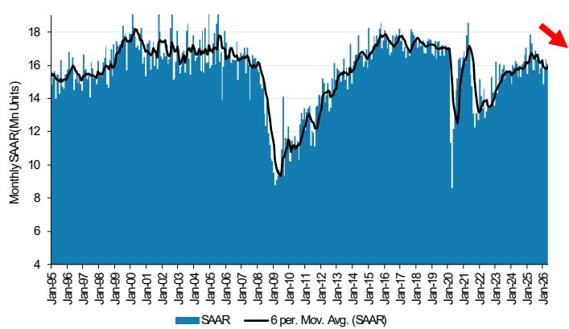

line

| Date   | SAAR (Mn Units) |
|--------|-----------------|
| Jan-95 | 15.0            |
| Jan-96 | 15.5            |
| Jan-97 | 16.0            |
| Jan-98 | 16.5            |
| Jan-99 | 17.0            |
| Jan-00 | 17.5            |
| Jan-01 | 17.0            |
| Jan-02 | 16.5            |
| Jan-03 | 16.0            |
| Jan-04 | 15.5            |
| Jan-05 | 15.0            |
| Jan-06 | 14.5            |
| Jan-07 | 14.0            |
| Jan-08 | 13.5            |
| Jan-09 | 10.0            |
| Jan-10 | 11.0            |
| Jan-11 | 12.0            |
| Jan-12 | 13.0            |
| Jan-13 | 14.0            |
| Jan-14 | 15.0            |
| Jan-15 | 16.0            |
| Jan-16 | 17.0            |
| Jan-17 | 17.5            |
| Jan-18 | 17.0            |
| Jan-19 | 16.5            |
| Jan-20 | 15.0            |
| Jan-21 | 13.0            |
| Jan-22 | 14.0            |
| Jan-23 | 15.0            |
| Jan-24 | 16.0            |
| Jan-25 | 17.0            |
| Jan-26 | 16.5            |

Europe SAAR (6MMAV), Monthly   
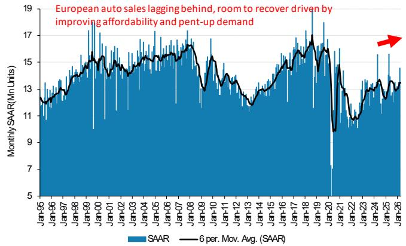

line

| Date   | SAAR (Mn Units) |
|--------|-----------------|
| Jan-95 | 11.5            |
| Jan-96 | 12.0            |
| Jan-97 | 12.5            |
| Jan-98 | 13.0            |
| Jan-99 | 13.5            |
| Jan-00 | 14.0            |
| Jan-01 | 14.5            |
| Jan-02 | 15.0            |
| Jan-03 | 15.5            |
| Jan-04 | 16.0            |
| Jan-05 | 16.5            |
| Jan-06 | 17.0            |
| Jan-07 | 16.5            |
| Jan-08 | 16.0            |
| Jan-09 | 15.5            |
| Jan-10 | 15.0            |
| Jan-11 | 14.5            |
| Jan-12 | 14.0            |
| Jan-13 | 13.5            |
| Jan-14 | 13.0            |
| Jan-15 | 13.5            |
| Jan-16 | 14.0            |
| Jan-17 | 14.5            |
| Jan-18 | 15.0            |
| Jan-19 | 15.5            |
| Jan-20 | 16.0            |
| Jan-21 | 16.5            |
| Jan-22 | 17.0            |
| Jan-23 | 17.5            |
| Jan-24 | 18.0            |
| Jan-25 | 18.5            |
| Jan-26 | 19.0            |

EM ex China SAAR, Monthly   
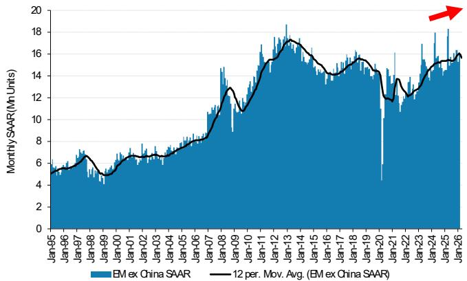

line

| Date   | EM ex China SAAR (Mn Units) | 12 per. Mov. Avg. (Mn Units) |
|--------|-----------------------------|-------------------------------|
| Jan-95 | 5                           | 5                             |
| Jan-96 | 6                           | 6                             |
| Jan-97 | 7                           | 7                             |
| Jan-98 | 6                           | 6                             |
| Jan-99 | 5                           | 5                             |
| Jan-00 | 6                           | 6                             |
| Jan-01 | 7                           | 7                             |
| Jan-02 | 8                           | 8                             |
| Jan-03 | 9                           | 9                             |
| Jan-04 | 10                          | 10                            |
| Jan-05 | 11                          | 11                            |
| Jan-06 | 12                          | 12                            |
| Jan-07 | 13                          | 13                            |
| Jan-08 | 14                          | 14                            |
| Jan-09 | 15                          | 15                            |
| Jan-10 | 16                          | 16                            |
| Jan-11 | 17                          | 17                            |
| Jan-12 | 18                          | 18                            |
| Jan-13 | 17                          | 17                            |
| Jan-14 | 16                          | 16                            |
| Jan-15 | 15                          | 15                            |
| Jan-16 | 14                          | 14                            |
| Jan-17 | 15                          | 15                            |
| Jan-18 | 16                          | 16                            |
| Jan-19 | 15                          | 15                            |
| Jan-20 | 14                          | 14                            |
| Jan-21 | 13                          | 13                            |
| Jan-22 | 14                          | 14                            |
| Jan-23 | 15                          | 15                            |
| Jan-24 | 16                          | 16                            |
| Jan-25 | 17                          | 17                            |
| Jan-26 | 18                          | 18                            |

# 2 – Structural Issues: European volume recovery should continue

# Affordability improving in Europe

EU: at pre-Covid levels   
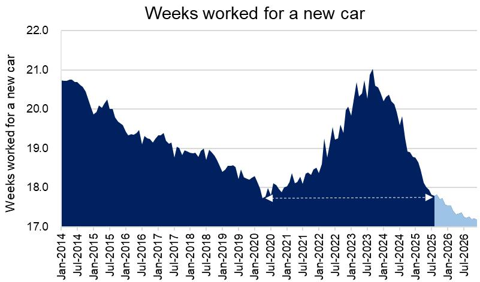

line

| Date       | Weeks worked for a new car |
| ---------- | --------------------------- |
| Jan-2014   | 20.8                        |
| Jul-2014   | 20.7                        |
| Jan-2015   | 20.5                        |
| Jul-2015   | 20.3                        |
| Jan-2016   | 20.1                        |
| Jul-2016   | 19.8                        |
| Jan-2017   | 19.6                        |
| Jul-2017   | 19.4                        |
| Jan-2018   | 19.2                        |
| Jul-2018   | 19.0                        |
| Jan-2019   | 18.8                        |
| Jul-2019   | 18.6                        |
| Jan-2020   | 18.4                        |
| Jul-2020   | 18.2                        |
| Jan-2021   | 18.0                        |
| Jul-2021   | 17.8                        |
| Jan-2022   | 17.6                        |
| Jul-2022   | 17.4                        |
| Jan-2023   | 17.2                        |
| Jul-2023   | 17.0                        |
| Jan-2024   | 16.8                        |
| Jul-2024   | 16.6                        |
| Jan-2025   | 16.4                        |
| Jul-2025   | 16.2                        |
| Jan-2026   | 16.0                        |
| Jul-2026   | 15.8                        |

... but the conflict could change the situation   
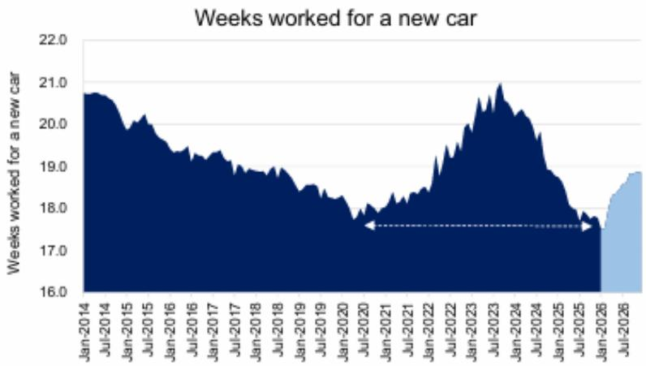

line

| Date       | Weeks worked for a new car |
| ---------- | --------------------------- |
| Jan-2014   | 21.0                        |
| Jul-2014   | 20.5                        |
| Jan-2015   | 20.0                        |
| Jul-2015   | 19.5                        |
| Jan-2016   | 19.0                        |
| Jul-2016   | 18.5                        |
| Jan-2017   | 18.0                        |
| Jul-2017   | 17.5                        |
| Jan-2018   | 17.0                        |
| Jul-2018   | 16.5                        |
| Jan-2019   | 16.0                        |
| Jul-2019   | 17.5                        |
| Jan-2020   | 18.0                        |
| Jul-2020   | 18.5                        |
| Jan-2021   | 19.0                        |
| Jul-2021   | 19.5                        |
| Jan-2022   | 20.0                        |
| Jul-2022   | 20.5                        |
| Jan-2023   | 21.0                        |
| Jul-2023   | 21.5                        |
| Jan-2024   | 21.0                        |
| Jul-2024   | 20.5                        |
| Jan-2025   | 19.5                        |
| Jul-2025   | 18.5                        |
| Jan-2026   | 17.5                        |
| Jul-2026   | 18.5                        |

# 2 – Structural Issues: Premium Market now losing share globally ...

Premium Sales in Major Markets, Monthly   
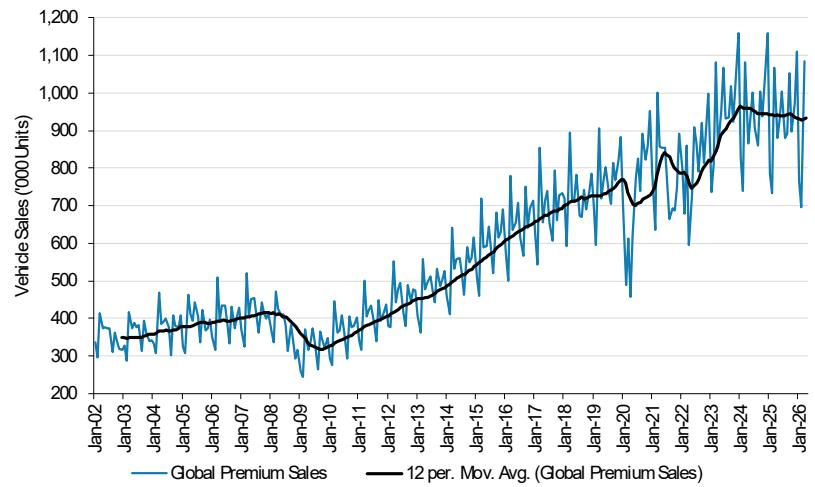

line

| Date   | Global Premium Sales (1000 Units) | 12 per. Mov. Avg. (1000 Units) |
|--------|----------------------------------|---------------------------------|
| Jan-02 | ~350                             | ~350                            |
| Jan-03 | ~380                             | ~360                            |
| Jan-04 | ~400                             | ~370                            |
| Jan-05 | ~420                             | ~380                            |
| Jan-06 | ~450                             | ~390                            |
| Jan-07 | ~480                             | ~400                            |
| Jan-08 | ~500                             | ~410                            |
| Jan-09 | ~350                             | ~320                            |
| Jan-10 | ~380                             | ~330                            |
| Jan-11 | ~420                             | ~350                            |
| Jan-12 | ~450                             | ~370                            |
| Jan-13 | ~480                             | ~390                            |
| Jan-14 | ~520                             | ~420                            |
| Jan-15 | ~580                             | ~460                            |
| Jan-16 | ~650                             | ~520                            |
| Jan-17 | ~700                             | ~580                            |
| Jan-18 | ~750                             | ~650                            |
| Jan-19 | ~800                             | ~720                            |
| Jan-20 | ~750                             | ~780                            |
| Jan-21 | ~850                             | ~820                            |
| Jan-22 | ~900                             | ~880                            |
| Jan-23 | ~950                             | ~920                            |
| Jan-24 | ~1,150                           | ~980                            |
| Jan-25 | ~1,100                           | ~960                            |
| Jan-26 | ~1,150                           | ~940                            |

Global Premium Market Share (%), Monthly   
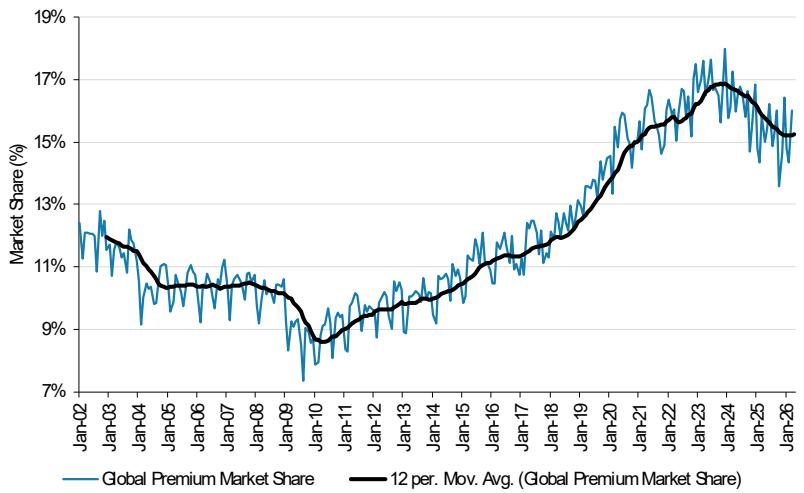

line

| Date   | Global Premium Market Share | 12 per. Mov. Avg. (Global Premium Market Share) |
|--------|-----------------------------|--------------------------------------------------|
| Jan-02 | ~12.5%                      | ~12.5%                                           |
| Jan-03 | ~11.5%                      | ~11.8%                                           |
| Jan-04 | ~10.5%                      | ~11.0%                                           |
| Jan-05 | ~10.8%                      | ~10.8%                                           |
| Jan-06 | ~10.5%                      | ~10.8%                                           |
| Jan-07 | ~10.8%                      | ~10.8%                                           |
| Jan-08 | ~10.5%                      | ~10.8%                                           |
| Jan-09 | ~9.5%                       | ~9.5%                                            |
| Jan-10 | ~8.5%                       | ~8.8%                                            |
| Jan-11 | ~9.0%                       | ~9.0%                                            |
| Jan-12 | ~9.5%                       | ~9.5%                                            |
| Jan-13 | ~10.0%                      | ~10.0%                                           |
| Jan-14 | ~10.5%                      | ~10.5%                                           |
| Jan-15 | ~11.0%                      | ~11.0%                                           |
| Jan-16 | ~11.5%                      | ~11.5%                                           |
| Jan-17 | ~12.0%                      | ~12.0%                                           |
| Jan-18 | ~12.5%                      | ~12.5%                                           |
| Jan-19 | ~13.5%                      | ~13.5%                                           |
| Jan-20 | ~14.5%                      | ~14.5%                                           |
| Jan-21 | ~15.5%                      | ~15.5%                                           |
| Jan-22 | ~16.5%                      | ~16.5%                                           |
| Jan-23 | ~17.0%                      | ~17.0%                                           |
| Jan-24 | ~17.5%                      | ~17.5%                                           |
| Jan-25 | ~16.5%                      | ~16.5%                                           |
| Jan-26 | ~15.5%                      | ~15.5%                                           |

# 2 – Structural Issues: Pressure from China OEMs keeps increasing

China OEMs gaining global share: 15% a few years ago -> 30% 2030e   
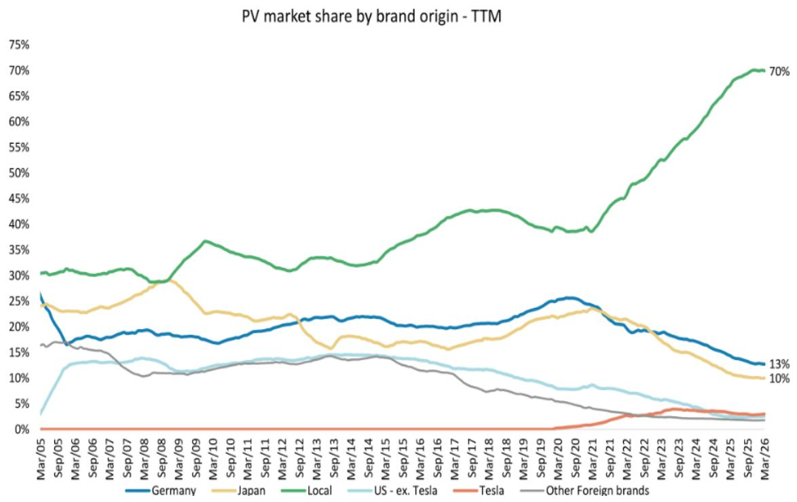

China Structural Advantages:

\- Cost

\- Product pipeline

\- ADAS

\- Speed to market

# Key Forecasts for 2026

• Domestic passenger car sales to decline 11% YoY   
• Export sales to grow 33% YoY and reach 8.0mn units   
• NEV sales to grow 13% YoY, with sales penetration reaching 60%   
• L3 AD commercialized; L4/Robotaxi deployment to accelerate   
• Accelerating smart-driving/cockpit integration   
- Policies – Scrappage + replacement sUBSidies   
• Chinese brands to dominate with 70% market share

# 2 – Structural Issues: China OEMs gaining market share

# EU OEMs losing market share in China market:

BMW China Market Share (%), Monthly   
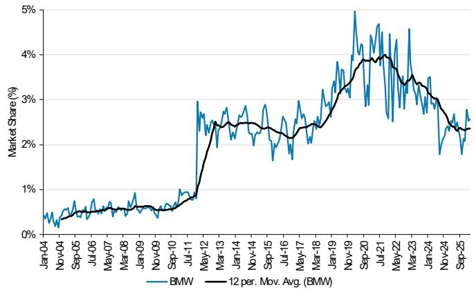

line

| Date    | BMW  | 12 per. Mov. Avg. (BMW) |
|---------|------|--------------------------|
| Jan-04  | 0.3% | 0.3%                     |
| Nov-04  | 0.4% | 0.4%                     |
| Sep-05  | 0.5% | 0.5%                     |
| Jul-06  | 0.6% | 0.6%                     |
| May-07  | 0.7% | 0.7%                     |
| Mar-08  | 0.8% | 0.8%                     |
| Jan-09  | 0.9% | 0.9%                     |
| Nov-09  | 1.0% | 1.0%                     |
| Sep-10  | 1.1% | 1.1%                     |
| Jul-11  | 1.2% | 1.2%                     |
| May-12  | 2.5% | 2.5%                     |
| Mar-13  | 2.6% | 2.6%                     |
| Jan-14  | 2.7% | 2.7%                     |
| Nov-14  | 2.8% | 2.8%                     |
| Sep-15  | 2.9% | 2.9%                     |
| Jul-16  | 3.0% | 3.0%                     |
| May-17  | 3.1% | 3.1%                     |
| Mar-18  | 3.2% | 3.2%                     |
| Jan-19  | 3.3% | 3.3%                     |
| Nov-19  | 3.4% | 3.4%                     |
| Sep-20  | 3.5% | 3.5%                     |
| Jul-21  | 3.6% | 3.6%                     |
| May-22  | 3.7% | 3.7%                     |
| Mar-23  | 3.8% | 3.8%                     |
| Jan-24  | 3.9% | 3.9%                     |
| Nov-24  | 4.0% | 4.0%                     |
| Sep-25  | 4.1% | 4.1%                     |

Mercedes-Benz China Market Share (%), Monthly   
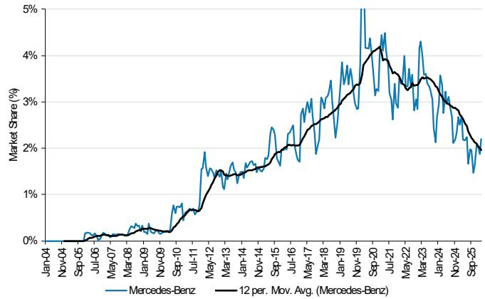

line

| Date    | Mercedes-Benz | 12 per. Mov. Avg. (Mercedes-Benz) |
|---------|---------------|-----------------------------------|
| Jan-04  | 0%            | 0%                                |
| Nov-04  | 0%            | 0%                                |
| Sep-05  | 0%            | 0%                                |
| Jul-06  | 0%            | 0%                                |
| May-07  | 0%            | 0%                                |
| Mar-08  | 0%            | 0%                                |
| Jan-09  | 0%            | 0%                                |
| Nov-09  | 0%            | 0%                                |
| Sep-10  | 0%            | 0%                                |
| Jul-11  | 0%            | 0%                                |
| May-12  | 1.5%          | 1.5%                              |
| Mar-13  | 1.5%          | 1.5%                              |
| Jan-14  | 1.5%          | 1.5%                              |
| Nov-14  | 1.5%          | 1.5%                              |
| Sep-15  | 2.0%          | 2.0%                              |
| Jul-16  | 2.5%          | 2.5%                              |
| May-17  | 3.0%          | 3.0%                              |
| Mar-18  | 3.5%          | 3.5%                              |
| Jan-19  | 4.0%          | 4.0%                              |
| Nov-19  | 4.5%          | 4.5%                              |
| Sep-20  | 4.0%          | 4.0%                              |
| Jul-21  | 3.5%          | 3.5%                              |
| May-22  | 3.0%          | 3.0%                              |
| Mar-23  | 3.5%          | 3.5%                              |
| Jan-24  | 3.0%          | 3.0%                              |
| Nov-24  | 2.5%          | 2.5%                              |
| Sep-25  | 2.0%          | 2.0%                              |

Volkswagen China Market Share (%), Monthly   
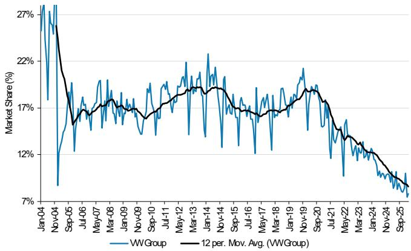

line

| Date    | WW Group | 12 per. Mov. Avg. (WW Group) |
|---------|----------|------------------------------|
| Jan-04  | 27%      | 27%                          |
| Nov-04  | 12%      | 12%                          |
| Sep-05  | 17%      | 17%                          |
| Jul-06  | 17%      | 17%                          |
| May-07  | 17%      | 17%                          |
| Mar-08  | 17%      | 17%                          |
| Jan-09  | 17%      | 17%                          |
| Nov-09  | 17%      | 17%                          |
| Sep-10  | 17%      | 17%                          |
| Jul-11  | 17%      | 17%                          |
| May-12  | 17%      | 17%                          |
| Mar-13  | 17%      | 17%                          |
| Jan-14  | 22%      | 22%                          |
| Nov-14  | 17%      | 17%                          |
| Sep-15  | 17%      | 17%                          |
| Jul-16  | 17%      | 17%                          |
| May-17  | 17%      | 17%                          |
| Mar-18  | 17%      | 17%                          |
| Jan-19  | 22%      | 22%                          |
| Nov-19  | 17%      | 17%                          |
| Sep-20  | 17%      | 17%                          |
| Jul-21  | 12%      | 12%                          |
| May-22  | 12%      | 12%                          |
| Mar-23  | 12%      | 12%                          |
| Jan-24  | 12%      | 12%                          |
| Nov-24  | 12%      | 12%                          |
| Sep-25  | 7%       | 7%                           |

Porsche China Market Share (%), Monthly   
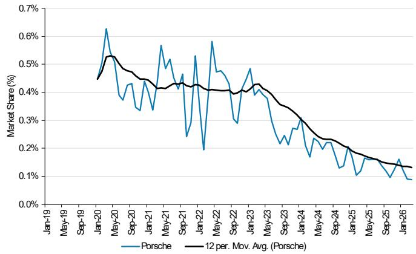

line

| Date    | Porsche | 12 per. Mov. Avg. (Porsche) |
|---------|---------|-----------------------------|
| Jan-19  |         |                             |
| May-19  |         |                             |
| Sep-19  |         |                             |
| Jan-20  |         |                             |
| May-20  |         |                             |
| Sep-20  |         |                             |
| Jan-21  |         |                             |
| May-21  |         |                             |
| Sep-21  |         |                             |
| Jan-22  |         |                             |
| May-22  |         |                             |
| Sep-22  |         |                             |
| Jan-23  |         |                             |
| May-23  |         |                             |
| Sep-23  |         |                             |
| Jan-24  |         |                             |
| May-24  |         |                             |
| Sep-24  |         |                             |
| Jan-25  |         |                             |
| May-25  |         |                             |
| Sep-25  |         |                             |
| Jan-26  |         |                             |

# 2 – Structural Issues: China Auto Exports moving out of the chart

China Auto Exports (vol)

1Q26: +53%

Last: +51%

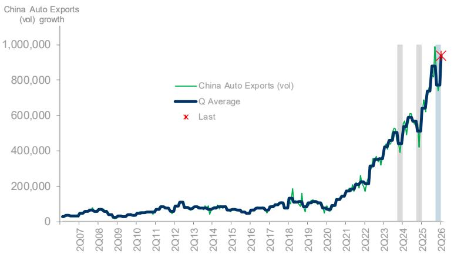

line

| Quarter | China Auto Exports (vol) | Q Average | Last |
| ------- | ------------------------ | --------- | ---- |
| 2Q26    | ~1,000,000               | ~950,000  | 1,000,000 |

China Auto Exports (vol) growth

1Q26: +53%

Last: +51%

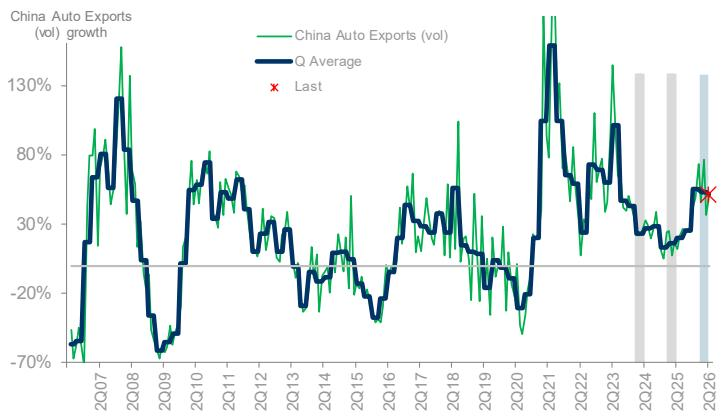

line

| Quarter | China Auto Exports (vol) | Q Average | Last |
|---------|--------------------------|-----------|------|
| 2Q07    | ~-60%                    | ~-60%     | -    |
| 2Q08    | ~130%                    | ~130%     | -    |
| 2Q09    | ~-70%                    | ~-70%     | -    |
| 2Q10    | ~80%                     | ~80%      | -    |
| 2Q11    | ~60%                     | ~60%      | -    |
| 2Q12    | ~40%                     | ~40%      | -    |
| 2Q13    | ~20%                     | ~20%      | -    |
| 2Q14    | ~-20%                    | ~-20%     | -    |
| 2Q15    | ~-40%                    | ~-40%     | -    |
| 2Q16    | ~-20%                    | ~-20%     | -    |
| 2Q17    | ~30%                     | ~30%      | -    |
| 2Q18    | ~50%                     | ~50%      | -    |
| 2Q19    | ~-20%                    | ~-20%     | -    |
| 2Q20    | ~-60%                    | ~-60%     | -    |
| 2Q21    | ~130%                    | ~130%     | -    |
| 2Q22    | ~80%                     | ~80%      | -    |
| 2Q23    | ~60%                     | ~60%      | -    |
| 2Q24    | ~30%                     | ~30%      | -    |
| 2Q25    | ~-20%                    | ~-20%     | -    |
| 2Q26    | ~30%                     | ~30%      | ~30% |

China Auto Parts Exports (USD)

1Q26: -3%

Last: +7%

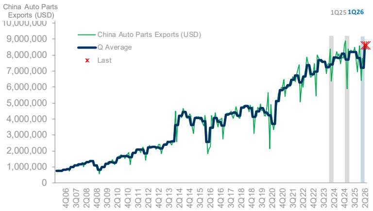

line

| Quarter | China Auto Parts Exports (USD) | Q Average | Last |
|---------|----------------------------------|-----------|------|
| 1Q25    | ~8,500,000                       | ~8,500,000 | 8,500,000 |
| 1Q26    | ~8,500,000                       | ~8,500,000 | 8,500,000 |

China Tyre Exports (USD)

1Q26: -7%

Last: -8%

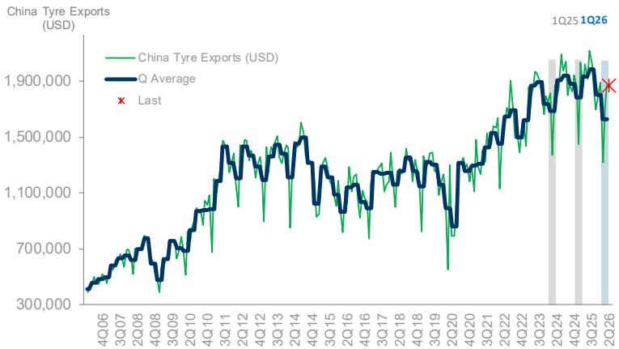

line

| Quarter | China Tyre Exports (USD) | Q Average (USD) |
| ------- | ------------------------ | --------------- |
| 1Q25    | ~1,900,000               | -               |
| 1Q26    | ~1,800,000               | -               |

Global Export tracker: China pressure and more to come (22 Apr 2026)

# 2 – Structural Issues: Pressure from China OEMs keeps increasing

China OEMs gaining global share: 15% a few years ago -> 30% 2030e   
Auto sales: % of sales produced in China   
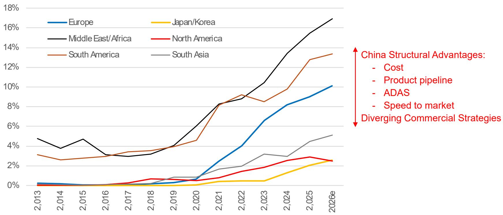

line

| Year   | Europe | Japan/Korea | Middle East/Africa | North America | South America | South Asia |
|--------|--------|-------------|--------------------|---------------|---------------|------------|
| 2013   | 0.2%   | 0.1%        | 4.7%               | 0.1%          | 3.0%          | 0.1%       |
| 2014   | 0.1%   | 0.1%        | 3.7%               | 0.1%          | 2.5%          | 0.1%       |
| 2015   | 0.1%   | 0.1%        | 4.6%               | 0.1%          | 2.6%          | 0.1%       |
| 2016   | 0.1%   | 0.1%        | 3.0%               | 0.1%          | 2.8%          | 0.1%       |
| 2017   | 0.1%   | 0.1%        | 2.9%               | 0.2%          | 3.3%          | 0.1%       |
| 2018   | 0.2%   | 0.1%        | 3.1%               | 0.5%          | 3.4%          | 0.5%       |
| 2019   | 0.3%   | 0.1%        | 4.0%               | 0.5%          | 3.5%          | 0.8%       |
| 2020   | 0.5%   | 0.1%        | 5.5%               | 0.5%          | 4.5%          | 1.5%       |
| 2021   | 2.5%   | 0.3%        | 8.2%               | 0.8%          | 8.0%          | 1.8%       |
| 2022   | 4.0%   | 0.3%        | 8.8%               | 1.5%          | 9.2%          | 2.0%       |
| 2023   | 6.5%   | 0.3%        | 10.5%              | 2.0%          | 8.5%          | 3.2%       |
| 2024   | 8.2%   | 1.5%        | 13.5%              | 2.5%          | 9.8%          | 3.0%       |
| 2025   | 9.0%   | 2.0%        | 15.5%              | 2.8%          | 12.8%         | 4.5%       |
| 2026e  | 10.2%  | 2.5%        | 17.0%              | 2.5%          | 13.5%         | 5.2%       |

# 2 – Structural Issues: Pressure from China OEMs keeps increasing

China OEMs gaining global share: 15% a few years ago -> 30% 2030e   
China market   
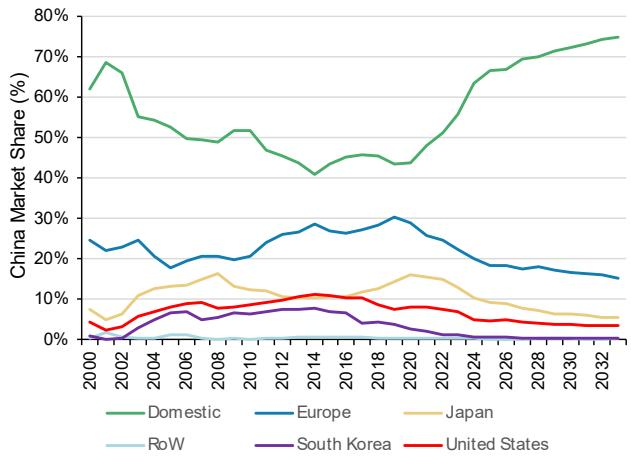

line

| Year | Domestic | Europe | Japan | RoW | South Korea | United States |
|------|----------|--------|-------|-----|-------------|---------------|
| 2000 | 65%      | 25%    | 8%    | 0%  | 2%          | 4%            |
| 2002 | 70%      | 24%    | 10%   | 0%  | 3%          | 5%            |
| 2004 | 55%      | 20%    | 12%   | 0%  | 5%          | 7%            |
| 2006 | 50%      | 18%    | 14%   | 0%  | 6%          | 8%            |
| 2008 | 52%      | 20%    | 16%   | 0%  | 7%          | 9%            |
| 2010 | 51%      | 21%    | 14%   | 0%  | 8%          | 8%            |
| 2012 | 48%      | 23%    | 12%   | 0%  | 9%          | 9%            |
| 2014 | 45%      | 28%    | 10%   | 0%  | 10%         | 10%           |
| 2016 | 46%      | 27%    | 11%   | 0%  | 9%          | 9%            |
| 2018 | 44%      | 30%    | 13%   | 0%  | 8%          | 8%            |
| 2020 | 43%      | 28%    | 15%   | 0%  | 7%          | 7%            |
| 2022 | 50%      | 25%    | 14%   | 0%  | 6%          | 6%            |
| 2024 | 65%      | 20%    | 10%   | 0%  | 5%          | 5%            |
| 2026 | 68%      | 18%    | 8%    | 0%  | 4%          | 4%            |
| 2028 | 70%      | 17%    | 7%    | 0%  | 3%          | 3%            |
| 2030 | 72%      | 16%    | 6%    | 0%  | 3%          | 3%            |
| 2032 | 75%      | 15%    | 5%    | 0%  | 3%          | 3%            |

US market   
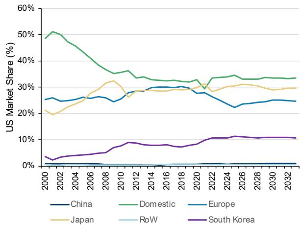

line

| Year | China | Domestic | Europe | Japan | RoW | South Korea |
|------|-------|----------|--------|-------|-----|-------------|
| 2000 | 0%    | 48%      | 25%    | 20%   | 0%  | 3%          |
| 2002 | 0%    | 50%      | 24%    | 18%   | 0%  | 4%          |
| 2004 | 0%    | 45%      | 25%    | 22%   | 0%  | 5%          |
| 2006 | 0%    | 40%      | 26%    | 25%   | 0%  | 6%          |
| 2008 | 0%    | 35%      | 25%    | 30%   | 0%  | 7%          |
| 2010 | 0%    | 33%      | 27%    | 32%   | 0%  | 8%          |
| 2012 | 0%    | 32%      | 28%    | 28%   | 0%  | 9%          |
| 2014 | 0%    | 31%      | 29%    | 28%   | 0%  | 8%          |
| 2016 | 0%    | 31%      | 29%    | 28%   | 0%  | 8%          |
| 2018 | 0%    | 31%      | 29%    | 28%   | 0%  | 8%          |
| 2020 | 0%    | 31%      | 28%    | 28%   | 0%  | 9%          |
| 2022 | 0%    | 33%      | 27%    | 29%   | 0%  | 10%         |
| 2024 | 0%    | 34%      | 25%    | 30%   | 0%  | 11%         |
| 2026 | 0%    | 34%      | 24%    | 31%   | 0%  | 11%         |
| 2028 | 0%    | 34%      | 25%    | 31%   | 0%  | 11%         |
| 2030 | 0%    | 34%      | 25%    | 31%   | 0%  | 11%         |
| 2032 | 0%    | 34%      | 25%    | 31%   | 0%  | 11%         |

Europe market   
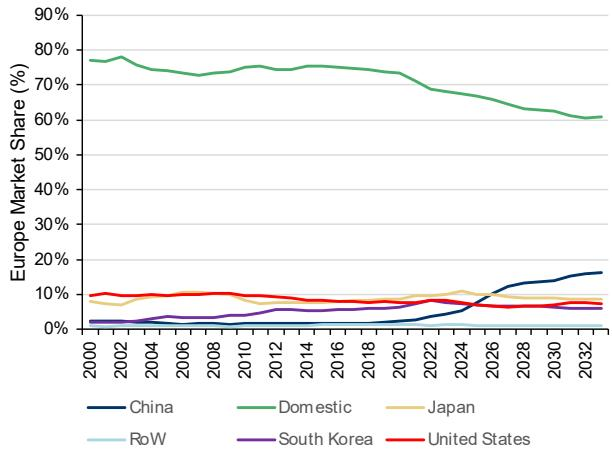

line

| Year | China | Domestic | Japan | RoW | South Korea | United States |
|------|-------|----------|-------|-----|-------------|---------------|
| 2000 | 0%    | 78%      | 10%   | 5%  | 5%          | 10%           |
| 2002 | 0%    | 77%      | 10%   | 5%  | 5%          | 10%           |
| 2004 | 0%    | 75%      | 10%   | 5%  | 5%          | 10%           |
| 2006 | 0%    | 74%      | 10%   | 5%  | 5%          | 10%           |
| 2008 | 0%    | 73%      | 10%   | 5%  | 5%          | 10%           |
| 2010 | 0%    | 74%      | 10%   | 5%  | 5%          | 10%           |
| 2012 | 0%    | 75%      | 10%   | 5%  | 5%          | 10%           |
| 2014 | 0%    | 76%      | 10%   | 5%  | 5%          | 10%           |
| 2016 | 0%    | 76%      | 10%   | 5%  | 5%          | 10%           |
| 2018 | 0%    | 75%      | 10%   | 5%  | 5%          | 10%           |
| 2020 | 0%    | 74%      | 10%   | 5%  | 5%          | 10%           |
| 2022 | 5%    | 72%      | 10%   | 5%  | 5%          | 10%           |
| 2024 | 10%   | 70%      | 10%   | 5%  | 5%          | 10%           |
| 2026 | 15%   | 68%      | 10%   | 5%  | 5%          | 10%           |
| 2028 | 18%   | 66%      | 10%   | 5%  | 5%          | 10%           |
| 2030 | 20%   | 64%      | 10%   | 5%  | 5%          | 10%           |
| 2032 | 22%   | 62%      | 10%   | 5%  | 5%          | 10%           |

Japan market   
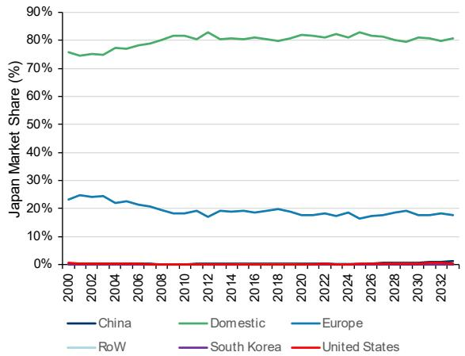

line

| Year | China | Domestic | Europe | RoW | South Korea | United States |
|------|-------|----------|--------|-----|-------------|---------------|
| 2000 | 24%   | 75%      | 24%    | 0%  | 0%          | 0%            |
| 2002 | 24%   | 76%      | 24%    | 0%  | 0%          | 0%            |
| 2004 | 23%   | 77%      | 23%    | 0%  | 0%          | 0%            |
| 2006 | 22%   | 78%      | 22%    | 0%  | 0%          | 0%            |
| 2008 | 21%   | 79%      | 21%    | 0%  | 0%          | 0%            |
| 2010 | 20%   | 80%      | 20%    | 0%  | 0%          | 0%            |
| 2012 | 19%   | 81%      | 19%    | 0%  | 0%          | 0%            |
| 2014 | 18%   | 80%      | 18%    | 0%  | 0%          | 0%            |
| 2016 | 19%   | 81%      | 19%    | 0%  | 0%          | 0%            |
| 2018 | 19%   | 81%      | 19%    | 0%  | 0%          | 0%            |
| 2020 | 18%   | 82%      | 18%    | 0%  | 0%          | 0%            |
| 2022 | 18%   | 82%      | 18%    | 0%  | 0%          | 0%            |
| 2024 | 17%   | 83%      | 17%    | 0%  | 0%          | 0%            |
| 2026 | 16%   | 83%      | 16%    | 0%  | 0%          | 0%            |
| 2028 | 17%   | 82%      | 17%    | 0%  | 0%          | 0%            |
| 2030 | 17%   | 81%      | 17%    | 0%  | 0%          | 0%            |
| 2032 | 17%   | 81%      | 17%    | 0%  | 0%          | 0%            |

Source: S&P Global, MS estimates. Note: Volvo Cars included as China OEM.

# 2 – Structural Issues: China OEMs gaining market share

# EU OEMs losing market share in Global market:

BMW Market Share (%), Monthly   
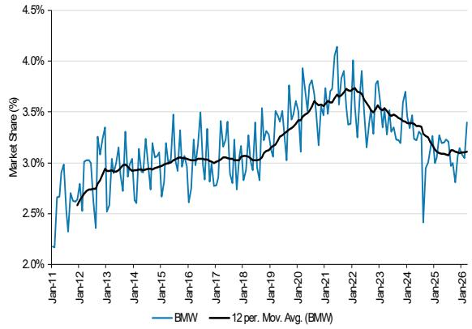

line

| Date   | BMW  | 12 per. Mov. Avg. (BMW) |
|--------|------|--------------------------|
| Jan-11 | 2.2% | 2.6%                     |
| Jan-12 | 3.0% | 2.8%                     |
| Jan-13 | 2.4% | 2.9%                     |
| Jan-14 | 3.2% | 2.9%                     |
| Jan-15 | 3.0% | 3.0%                     |
| Jan-16 | 3.5% | 3.0%                     |
| Jan-17 | 3.0% | 3.0%                     |
| Jan-18 | 3.5% | 3.0%                     |
| Jan-19 | 3.0% | 3.1%                     |
| Jan-20 | 3.5% | 3.3%                     |
| Jan-21 | 4.1% | 3.6%                     |
| Jan-22 | 3.8% | 3.7%                     |
| Jan-23 | 3.5% | 3.5%                     |
| Jan-24 | 3.0% | 3.3%                     |
| Jan-25 | 2.5% | 3.1%                     |
| Jan-26 | 3.4% | 3.1%                     |

Mercedes-Benz Market Share (%), Monthly   
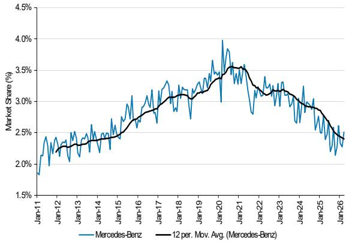

line

| Date   | Mercedes-Benz | 12 per. Mov. Avg. (Mercedes-Benz) |
|--------|---------------|-----------------------------------|
| Jan-11 | 1.8%          | 2.2%                              |
| Jan-12 | 2.4%          | 2.3%                              |
| Jan-13 | 2.3%          | 2.4%                              |
| Jan-14 | 2.5%          | 2.5%                              |
| Jan-15 | 2.7%          | 2.6%                              |
| Jan-16 | 2.9%          | 2.8%                              |
| Jan-17 | 3.0%          | 2.9%                              |
| Jan-18 | 3.1%          | 3.0%                              |
| Jan-19 | 3.2%          | 3.1%                              |
| Jan-20 | 3.5%          | 3.3%                              |
| Jan-21 | 3.6%          | 3.5%                              |
| Jan-22 | 3.4%          | 3.4%                              |
| Jan-23 | 3.3%          | 3.3%                              |
| Jan-24 | 3.1%          | 3.1%                              |
| Jan-25 | 2.9%          | 2.9%                              |
| Jan-26 | 2.5%          | 2.5%                              |

Porsche Group Market Share (%), Monthly   
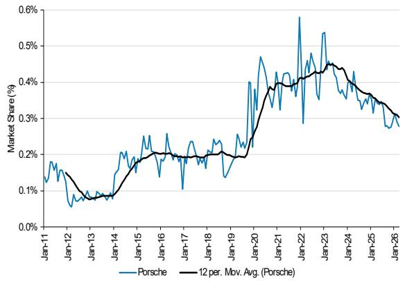

line

| Date   | Porsche | 12 per. Mov. Avg. (Porsche) |
|--------|---------|-----------------------------|
| Jan-11 | 0.18%   | 0.18%                       |
| Jan-12 | 0.07%   | 0.15%                       |
| Jan-13 | 0.09%   | 0.08%                       |
| Jan-14 | 0.12%   | 0.10%                       |
| Jan-15 | 0.20%   | 0.18%                       |
| Jan-16 | 0.25%   | 0.20%                       |
| Jan-17 | 0.15%   | 0.18%                       |
| Jan-18 | 0.20%   | 0.20%                       |
| Jan-19 | 0.25%   | 0.22%                       |
| Jan-20 | 0.45%   | 0.35%                       |
| Jan-21 | 0.48%   | 0.40%                       |
| Jan-22 | 0.55%   | 0.45%                       |
| Jan-23 | 0.50%   | 0.48%                       |
| Jan-24 | 0.45%   | 0.45%                       |
| Jan-25 | 0.35%   | 0.38%                       |
| Jan-26 | 0.30%   | 0.32%                       |

Stellantis Group Market Share (%), Monthly   
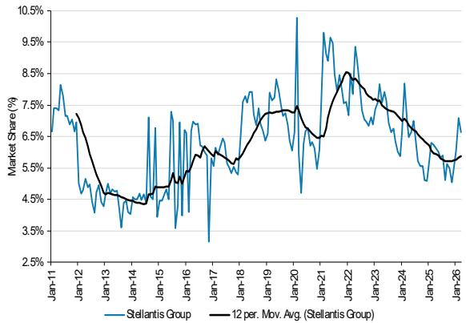

line

| Date   | Stellantis Group | 12 per. Mov. Avg. (Stellantis Group) |
|--------|------------------|--------------------------------------|
| Jan-11 | ~7.5%            | ~7.5%                                |
| Jan-12 | ~8.0%            | ~7.0%                                |
| Jan-13 | ~4.5%            | ~4.5%                                |
| Jan-14 | ~4.0%            | ~4.0%                                |
| Jan-15 | ~6.5%            | ~4.5%                                |
| Jan-16 | ~6.0%            | ~5.0%                                |
| Jan-17 | ~3.0%            | ~5.5%                                |
| Jan-18 | ~7.5%            | ~6.0%                                |
| Jan-19 | ~8.0%            | ~6.5%                                |
| Jan-20 | ~9.5%            | ~7.0%                                |
| Jan-21 | ~9.0%            | ~6.5%                                |
| Jan-22 | ~8.5%            | ~8.0%                                |
| Jan-23 | ~7.5%            | ~7.5%                                |
| Jan-24 | ~8.0%            | ~7.0%                                |
| Jan-25 | ~6.0%            | ~6.0%                                |
| Jan-26 | ~6.5%            | ~5.5%                                |

Volkswagen Group Market Share (%), Monthly   
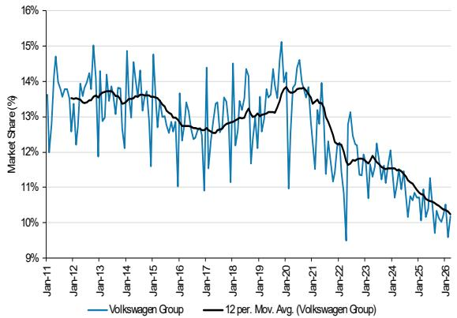

line

| Date   | Volkswagen Group | 12 per. Mov. Avg. (Volkswagen Group) |
|--------|------------------|--------------------------------------|
| Jan-11 | ~14.5%           | ~13.5%                               |
| Jan-12 | ~13.5%           | ~13.5%                               |
| Jan-13 | ~15.0%           | ~13.5%                               |
| Jan-14 | ~14.5%           | ~13.5%                               |
| Jan-15 | ~14.0%           | ~13.5%                               |
| Jan-16 | ~13.5%           | ~13.0%                               |
| Jan-17 | ~13.0%           | ~12.5%                               |
| Jan-18 | ~14.0%           | ~12.5%                               |
| Jan-19 | ~14.5%           | ~12.5%                               |
| Jan-20 | ~15.0%           | ~13.0%                               |
| Jan-21 | ~14.5%           | ~13.5%                               |
| Jan-22 | ~9.0%            | ~12.0%                               |
| Jan-23 | ~12.0%           | ~11.5%                               |
| Jan-24 | ~11.5%           | ~11.0%                               |
| Jan-25 | ~10.5%           | ~10.5%                               |
| Jan-26 | ~9.5%            | ~10.0%                               |

Renault Group Market Share (%), Monthly   
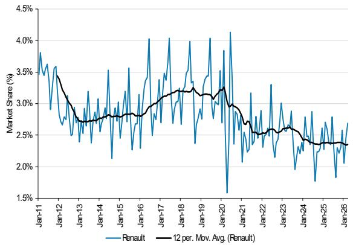

line

| Date   | Renault | 12 per. Mov. Avg. (Renault) |
|--------|---------|-----------------------------|
| Jan-11 | 3.8%    | 3.5%                        |
| Jan-12 | 3.6%    | 3.4%                        |
| Jan-13 | 2.7%    | 2.8%                        |
| Jan-14 | 2.9%    | 2.8%                        |
| Jan-15 | 3.0%    | 2.8%                        |
| Jan-16 | 3.5%    | 2.9%                        |
| Jan-17 | 4.0%    | 3.0%                        |
| Jan-18 | 3.8%    | 3.1%                        |
| Jan-19 | 3.9%    | 3.2%                        |
| Jan-20 | 4.1%    | 3.3%                        |
| Jan-21 | 2.5%    | 2.8%                        |
| Jan-22 | 2.7%    | 2.6%                        |
| Jan-23 | 2.9%    | 2.5%                        |
| Jan-24 | 2.6%    | 2.4%                        |
| Jan-25 | 2.8%    | 2.3%                        |
| Jan-26 | 2.7%    | 2.3%                        |

# 2 – Structural Issues: Pressure from China OEMs keeps increasing

# China OEMs gaining share: particularly in the Mass market

China Premium market: share including/excluding China OEMs (%), Monthly   
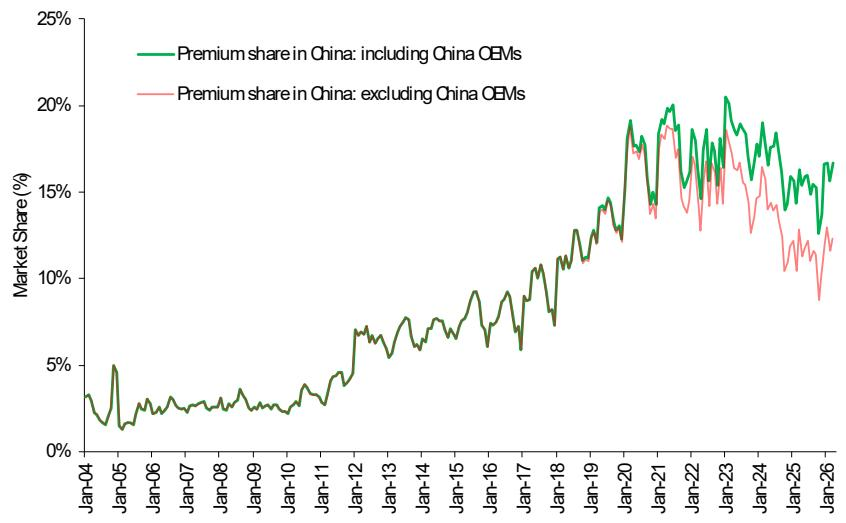

line

| Date   | Premium share in China: including China OEMs | Premium share in China: excluding China OEMs |
|--------|---------------------------------------------|-----------------------------------------------|
| Jan-04 | ~3%                                         | ~3%                                           |
| Jan-05 | ~5%                                         | ~2%                                           |
| Jan-06 | ~2%                                         | ~2%                                           |
| Jan-07 | ~2%                                         | ~2%                                           |
| Jan-08 | ~2%                                         | ~2%                                           |
| Jan-09 | ~2%                                         | ~2%                                           |
| Jan-10 | ~3%                                         | ~2%                                           |
| Jan-11 | ~4%                                         | ~2%                                           |
| Jan-12 | ~7%                                         | ~3%                                           |
| Jan-13 | ~7%                                         | ~3%                                           |
| Jan-14 | ~8%                                         | ~3%                                           |
| Jan-15 | ~9%                                         | ~3%                                           |
| Jan-16 | ~10%                                        | ~3%                                           |
| Jan-17 | ~11%                                        | ~3%                                           |
| Jan-18 | ~12%                                        | ~3%                                           |
| Jan-19 | ~13%                                        | ~3%                                           |
| Jan-20 | ~14%                                        | ~3%                                           |
| Jan-21 | ~15%                                        | ~3%                                           |
| Jan-22 | ~16%                                        | ~3%                                           |
| Jan-23 | ~17%                                        | ~3%                                           |
| Jan-24 | ~18%                                        | ~3%                                           |
| Jan-25 | ~17%                                        | ~3%                                           |
| Jan-26 | ~16%                                        | ~3%                                           |

China Mass market: share including/excluding China OEMs (%), Monthly   
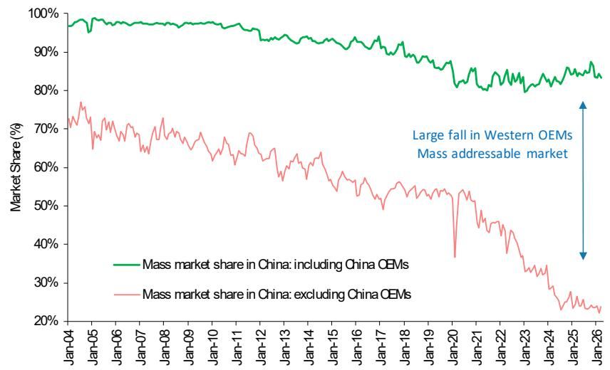

line

| Date   | Mass market share in China: including China OEMs | Mass market share in China: excluding China OEMs |
|--------|--------------------------------------------------|--------------------------------------------------|
| Jan-04 | ~98%                                             | ~72%                                             |
| Jan-05 | ~97%                                             | ~75%                                             |
| Jan-06 | ~96%                                             | ~73%                                             |
| Jan-07 | ~95%                                             | ~71%                                             |
| Jan-08 | ~94%                                             | ~69%                                             |
| Jan-09 | ~93%                                             | ~67%                                             |
| Jan-10 | ~92%                                             | ~65%                                             |
| Jan-11 | ~91%                                             | ~63%                                             |
| Jan-12 | ~90%                                             | ~61%                                             |
| Jan-13 | ~89%                                             | ~59%                                             |
| Jan-14 | ~88%                                             | ~57%                                             |
| Jan-15 | ~87%                                             | ~55%                                             |
| Jan-16 | ~86%                                             | ~53%                                             |
| Jan-17 | ~85%                                             | ~51%                                             |
| Jan-18 | ~84%                                             | ~49%                                             |
| Jan-19 | ~83%                                             | ~47%                                             |
| Jan-20 | ~82%                                             | ~45%                                             |
| Jan-21 | ~81%                                             | ~43%                                             |
| Jan-22 | ~80%                                             | ~41%                                             |
| Jan-23 | ~79%                                             | ~39%                                             |
| Jan-24 | ~78%                                             | ~37%                                             |
| Jan-25 | ~77%                                             | ~35%                                             |
| Jan-26 | ~76%                                             | ~33%                                             |

# 2 – Structural Issues: ... but Mass market much more impacted by China competition

Premium ex-China OEMs Market Share by Region (%), Monthly   
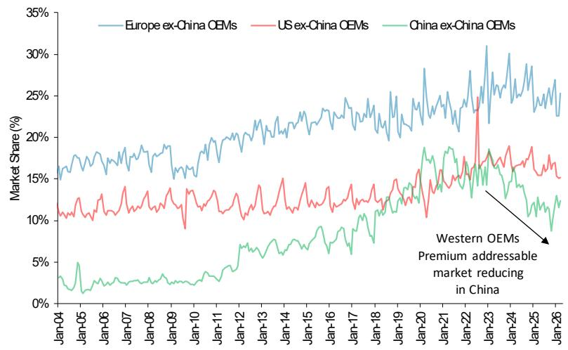

line

| Date   | Europe ex-China OEMs | US ex-China OEMs | China ex-China OEMs |
|--------|----------------------|------------------|---------------------|
| Jan-04 | ~16%                 | ~11%             | ~3%                 |
| Jan-05 | ~17%                 | ~12%             | ~4%                 |
| Jan-06 | ~18%                 | ~13%             | ~3%                 |
| Jan-07 | ~19%                 | ~14%             | ~3%                 |
| Jan-08 | ~20%                 | ~15%             | ~3%                 |
| Jan-09 | ~21%                 | ~16%             | ~3%                 |
| Jan-10 | ~22%                 | ~17%             | ~4%                 |
| Jan-11 | ~23%                 | ~18%             | ~5%                 |
| Jan-12 | ~24%                 | ~19%             | ~6%                 |
| Jan-13 | ~25%                 | ~20%             | ~7%                 |
| Jan-14 | ~26%                 | ~21%             | ~8%                 |
| Jan-15 | ~27%                 | ~22%             | ~9%                 |
| Jan-16 | ~28%                 | ~23%             | ~10%                |
| Jan-17 | ~29%                 | ~24%             | ~11%                |
| Jan-18 | ~30%                 | ~25%             | ~12%                |
| Jan-19 | ~31%                 | ~26%             | ~13%                |
| Jan-20 | ~32%                 | ~27%             | ~14%                |
| Jan-21 | ~33%                 | ~28%             | ~15%                |
| Jan-22 | ~34%                 | ~29%             | ~16%                |
| Jan-23 | ~35%                 | ~30%             | ~17%                |
| Jan-24 | ~34%                 | ~29%             | ~16%                |
| Jan-25 | ~33%                 | ~28%             | ~15%                |
| Jan-26 | ~32%                 | ~27%             | ~14%                |

Mass ex-China OEMs Market Share by Region (%), Monthly   
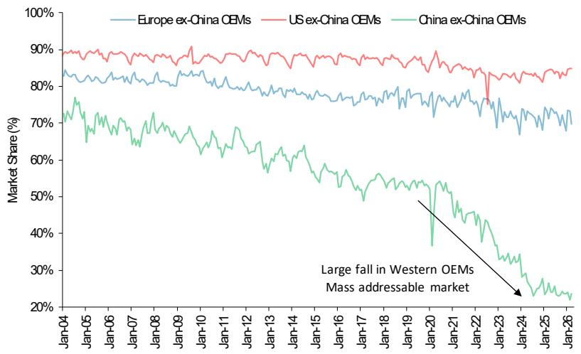

line

| Date   | Europe ex-China OEMs | US ex-China OEMs | China ex-China OEMs |
|--------|----------------------|------------------|---------------------|
| Jan-04 | ~85%                 | ~90%             | ~75%                |
| Jan-05 | ~83%                 | ~89%             | ~72%                |
| Jan-06 | ~82%                 | ~88%             | ~70%                |
| Jan-07 | ~81%                 | ~87%             | ~68%                |
| Jan-08 | ~80%                 | ~86%             | ~66%                |
| Jan-09 | ~79%                 | ~85%             | ~64%                |
| Jan-10 | ~78%                 | ~84%             | ~62%                |
| Jan-11 | ~77%                 | ~83%             | ~60%                |
| Jan-12 | ~76%                 | ~82%             | ~58%                |
| Jan-13 | ~75%                 | ~81%             | ~56%                |
| Jan-14 | ~74%                 | ~80%             | ~54%                |
| Jan-15 | ~73%                 | ~79%             | ~52%                |
| Jan-16 | ~72%                 | ~78%             | ~50%                |
| Jan-17 | ~71%                 | ~77%             | ~48%                |
| Jan-18 | ~70%                 | ~76%             | ~46%                |
| Jan-19 | ~69%                 | ~75%             | ~44%                |
| Jan-20 | ~68%                 | ~74%             | ~42%                |
| Jan-21 | ~67%                 | ~73%             | ~40%                |
| Jan-22 | ~66%                 | ~72%             | ~38%                |
| Jan-23 | ~65%                 | ~71%             | ~36%                |
| Jan-24 | ~64%                 | ~70%             | ~34%                |
| Jan-25 | ~63%                 | ~69%             | ~32%                |
| Jan-26 | ~62%                 | ~68%             | ~30%                |

# 2 – Structural Issues: Pressure from China exports keeps increasing

China OEMs gaining global share: 16% 2026e ->30% 2030e   
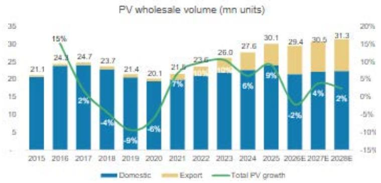

bar_line

PV wholesale volume (mn units)
| Year | Domestic (mn units) | Export (mn units) | Total PV growth (%) |
| :--- | :--- | :--- | :--- |
| 2015 | 21.1 | 1.4 | |
| 2016 | 24.3 | 1.9 | 15 |
| 2017 | 24.7 | 1.9 | 2 |
| 2018 | 23.7 | 1.4 | -4 |
| 2019 | 21.4 | 1.9 | -9 |
| 2020 | 20.1 | 1.9 | -6 |
| 2021 | 21.5 | 2.3 | 7 |
| 2022 | 23.5 | 3.6 | |
| 2023 | 26.0 | 4.9 | |
| 2024 | 27.6 | 6.3 | 6 |
| 2025 | 30.1 | 8.8 | 9 |
| 2026E | 29.4 | 8.8 | -2 |
| 2027E | 30.5 | 9.3 | 4 |
| 2028E | 31.3 | 9.8 | 2 |

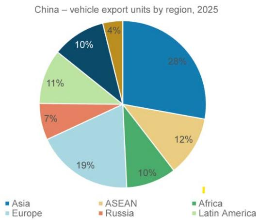

pie

China – vehicle export units by region, 2025
| Region | Export Units (%) |
|---|---|
| Asia | 28 |
| ASEAN | 12 |
| Africa | 10 |
| Russia | 7 |
| Europe | 19 |
| Latin America | 11 |
| Other | 4 |

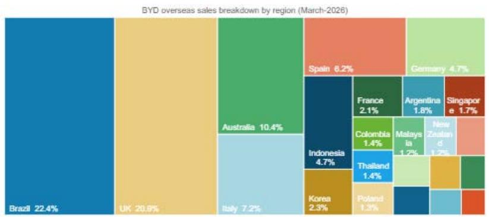

treemap

| Region       | Percentage |
| ------------ | ---------- |
| Brazil       | 22.4%      |
| UK           | 20.9%      |
| Australia    | 10.4%      |
| Italy        | 7.2%       |
| Spain        | 6.2%       |
| Germany      | 4.7%       |
| France       | 2.1%       |
| Argentina    | 1.8%       |
| Singapore    | 1.7%       |
| Indonesia    | 4.7%       |
| Colombia     | 1.4%       |
| Thailand     | 1.4%       |
| Korea        | 2.3%       |
| Poland       | 1.3%       |
| Malaysia     | 1.2%       |
| New Zealand  | 1.2%       |
| Poland       | 1.3%       |

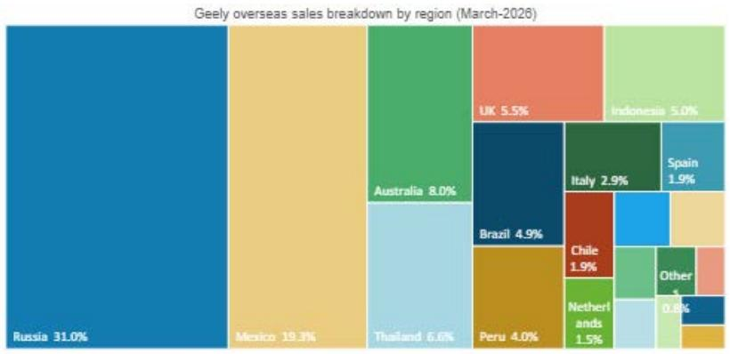

treemap

| Region       | Percentage |
| ------------ | ---------- |
| Russia       | 31.0%      |
| Mexico       | 19.3%      |
| Australia    | 8.0%       |
| Thailand     | 6.6%       |
| UK           | 5.5%       |
| Brazil       | 4.9%       |
| Peru         | 4.0%       |
| Italy        | 2.9%       |
| Chile        | 1.9%       |
| Netherlands   | 1.5%       |
| Indonesia    | 5.0%       |
| Spain        | 1.9%       |
| Other        | 0.8%       |

Where did China's OEMs sell overseas in March? (30 Apr 2026)

# 2 – Structural Issues: Pressure from China Onshoring also increasing

China APs to follow ...   
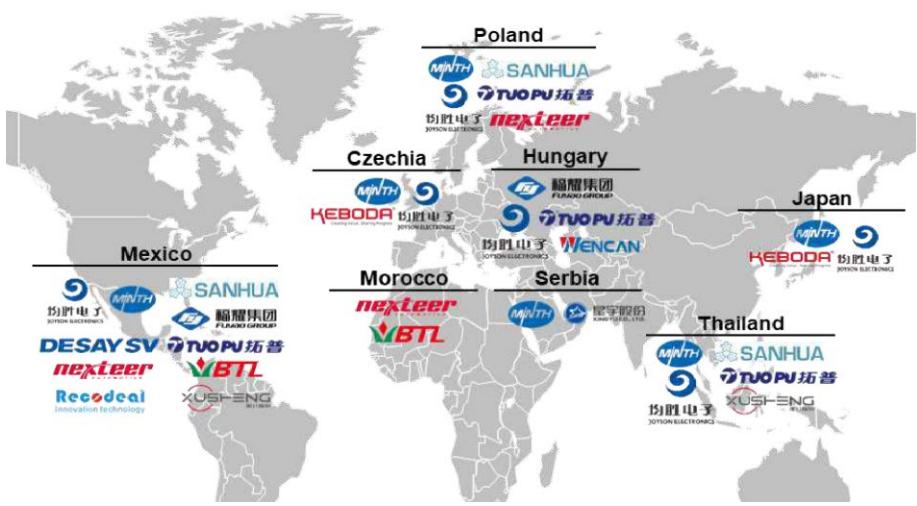

text_image

Poland
MINTH SANHUA
TUOPU拓普
nexteer
Czechia
MINTH
KEBODA 切进电子
JUNION ELECTRONICS
Hungary
福耀集团
FUANG GROUP
TUOPU拓普
WENCAN
Japan
MINTH
KEBODA 均胜电子
JUNION ELECTRONICS
Mexico
MINTH
SANHUA
福耀集团
FUANG GROUP
DESAY SV TUOPU拓普
nexteer BTL
Recodeai XUSI-ENG
Morocco nexteer BTL
Serbia
MINTH 星宇股份
JUNION ELECTRONICS
Thailand
MINTH SANHUA
TUOPU拓普
XUSI-ENG

... China OEMs   
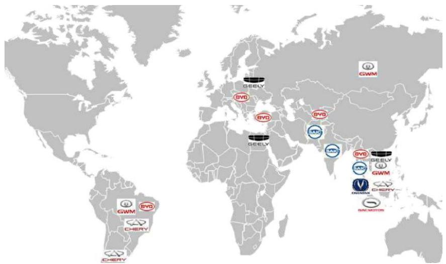

text_image

GWM
BYD
BYD
BYD
GEELY
GEELY
AAG
BYD
BYD
GWM
BYD
GWM
CHERY
CHERY
BAC MOTORS

# 2 – Structural Issues: China OEMs gaining market share

Global share: (+) China OEMs → (-) EU OEMs (particularly volume players)

EU OEMs GLOBAL MARKET SHARE (%)   
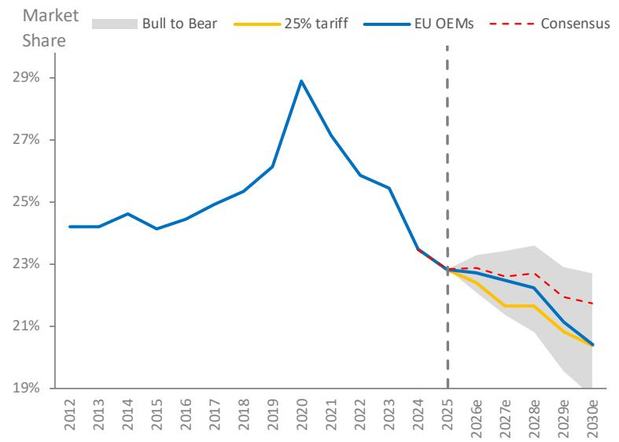

line

| Year   | EU OEMs | 25% tariff | Bull to Bear | Consensus |
|--------|---------|------------|--------------|-----------|
| 2012   | 24.0    | -          | -            | -         |
| 2013   | 24.0    | -          | -            | -         |
| 2014   | 24.5    | -          | -            | -         |
| 2015   | 24.0    | -          | -            | -         |
| 2016   | 24.5    | -          | -            | -         |
| 2017   | 25.0    | -          | -            | -         |
| 2018   | 25.5    | -          | -            | -         |
| 2019   | 26.5    | -          | -            | -         |
| 2020   | 29.0    | -          | -            | -         |
| 2021   | 27.5    | -          | -            | -         |
| 2022   | 26.0    | -          | -            | -         |
| 2023   | 25.5    | -          | -            | -         |
| 2024   | 23.0    | -          | -            | 23.0      |
| 2025e  | 23.0    | 23.0       | 23.0         | 23.0      |
| 2026e  | 23.0    | 23.0       | 23.0         | 23.0      |
| 2027e  | 23.0    | 23.0       | 23.0         | 23.0      |
| 2028e  | 23.0    | 23.0       | 23.0         | 23.0      |
| 2029e  | 21.5    | 21.5       | 21.5         | 21.5      |
| 2030e  | 21.0    | 21.0       | 21.0         | 21.0      |

EU OEMs GLOBAL MARKET SHARE (%)   
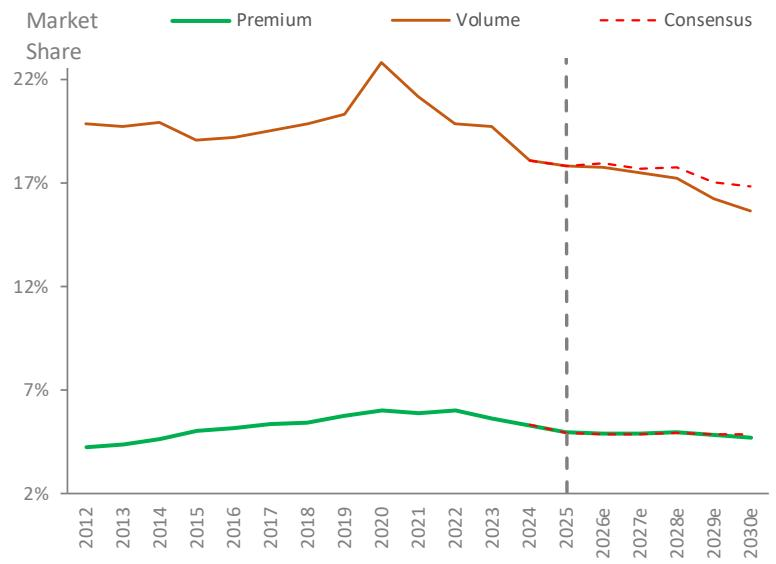

line

| Year   | Premium | Volume | Consensus |
| ------ | ------- | ------ | --------- |
| 2012   | ~4.5%   | ~18.5% | -         |
| 2013   | ~4.7%   | ~18.4% | -         |
| 2014   | ~5.0%   | ~18.5% | -         |
| 2015   | ~5.3%   | ~18.3% | -         |
| 2016   | ~5.5%   | ~18.4% | -         |
| 2017   | ~5.7%   | ~18.5% | -         |
| 2018   | ~5.8%   | ~18.6% | -         |
| 2019   | ~6.0%   | ~18.8% | -         |
| 2020   | ~6.5%   | ~22.0% | -         |
| 2021   | ~6.4%   | ~20.0% | -         |
| 2022   | ~6.5%   | ~19.0% | -         |
| 2023   | ~6.3%   | ~18.5% | -         |
| 2024   | ~6.0%   | ~17.5% | -         |
| 2025e  | ~5.8%   | ~17.3% | ~17.5%    |
| 2026e  | ~5.7%   | ~17.2% | ~17.4%    |
| 2027e  | ~5.6%   | ~17.1% | ~17.3%    |
| 2028e  | ~5.5%   | ~17.0% | ~17.2%    |
| 2029e  | ~5.4%   | ~16.8% | ~17.1%    |
| 2030e  | ~5.3%   | ~16.5% | ~17.0%    |

# 2 – Structural Issues: China OEMs gaining market share

# It is either prices or volume or both (European OEMs) ...

CAR NET REVENUE / UNIT (EUR)   
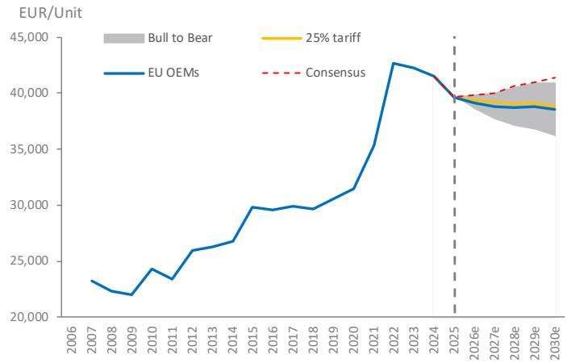

line

| Year | EU OEMs | Bull to Bear | 25% tariff | Consensus |
|------|---------|--------------|------------|-----------|
| 2025 | 40,000  | 39,000       | 39,500     | 39,800    |
| 2026e| 39,500  | 38,500       | 39,200     | 39,600    |
| 2027e| 39,200  | 38,200       | 39,100     | 39,700    |
| 2028e| 39,100  | 38,100       | 39,050     | 39,850    |
| 2029e| 39,050  | 38,050       | 38,950     | 40,150    |
| 2030e| 38,950  | 37,950       | 38,850     | 41,150    |

CAR NET REVENUE / UNIT (EUR)   
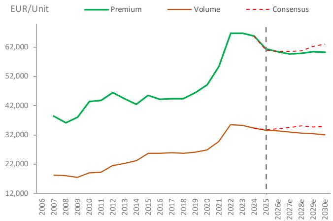

line

| Year   | Premium | Volume | Consensus |
|--------|---------|--------|-----------|
| 2006   |         |        |           |
| 2007   |         |        |           |
| 2008   |         |        |           |
| 2009   |         |        |           |
| 2010   |         |        |           |
| 2011   |         |        |           |
| 2012   |         |        |           |
| 2013   |         |        |           |
| 2014   |         |        |           |
| 2015   |         |        |           |
| 2016   |         |        |           |
| 2017   |         |        |           |
| 2018   |         |        |           |
| 2019   |         |        |           |
| 2020   |         |        |           |
| 2021   |         |        |           |
| 2022   |         |        |           |
| 2023   |         |        |           |
| 2024   |         |        |           |
| 2025e  |         |        |           |
| 2026e  |         |        |           |
| 2027e  |         |        |           |
| 2028e  |         |        |           |
| 2029e  |         |        |           |
| 2030e  |         |        |           |

WHOLESALE DELIVERIES (000, all vehicles)   
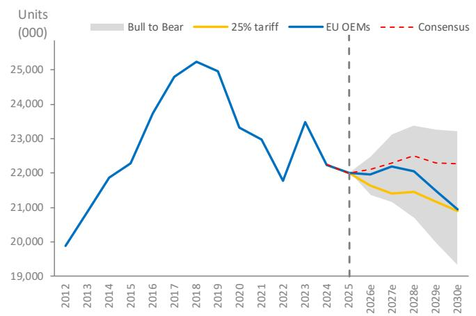

line

| Year   | EU OEMs | Bull to Bear | 25% tariff | Consensus |
|--------|---------|--------------|----------|-----------|
| 2012   | 19,800  |              |          |           |
| 2013   | 20,500  |              |          |           |
| 2014   | 21,500  |              |          |           |
| 2015   | 22,500  |              |          |           |
| 2016   | 23,500  |              |          |           |
| 2017   | 24,500  |              |          |           |
| 2018   | 25,500  |              |          |           |
| 2019   | 25,000  |              |          |           |
| 2020   | 23,500  |              |          |           |
| 2021   | 23,000  |              |          |           |
| 2022   | 21,800  |              |          |           |
| 2023   | 23,500  |              |          |           |
| 2024   | 22,500  |              |          |           |
| 2025e  | 22,000  |              |          |           |
| 2026e  | 21,800  |              |          |           |
| 2027e  | 22,200  |              |          |           |
| 2028e  | 22,500  |              |          |           |
| 2029e  | 21,800  |              |          |           |
| 2030e  | 21,500  |              |          |           |

DELIVERY GROWTH (All vehicles, %)   
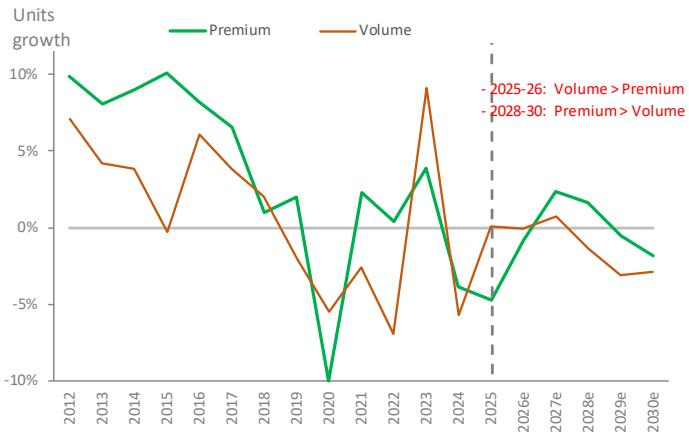

line

| Year   | Premium | Volume |
|--------|---------|--------|
| 2012   | 10%     | 7%     |
| 2013   | 8%      | 4%     |
| 2014   | 10%     | 4%     |
| 2015   | 10%     | -1%    |
| 2016   | 8%      | 6%     |
| 2017   | 6%      | 4%     |
| 2018   | 2%      | 2%     |
| 2019   | 2%      | -4%    |
| 2020   | -10%    | -5%    |
| 2021   | 2%      | -3%    |
| 2022   | 0%      | -7%    |
| 2023   | 4%      | 9%     |
| 2024   | -4%     | -5%    |
| 2025e  | -5%     | 0%     |
| 2026e  | -3%     | 0%     |
| 2027e  | 3%      | 1%     |
| 2028e  | 2%      | -1%    |
| 2029e  | -1%     | -3%    |
| 2030e  | -3%     | -3%    |

2 – Structural Issues: China OEMs gaining market share 

<table><tr><td>Global Main Markets</td><td>Mar-26</td><td>YoY (%)</td><td>Mkt Share (%)</td><td>Δ YoY Mkt Share (%)</td><td>YTD Mar-26</td><td>YTD YoY (%)</td><td>YTD Mkt Share (%)</td><td>Δ YTD Mkt Share (%)</td><td>3M Trailing Average</td><td>Average YoY 3M Trailing</td></tr><tr><td colspan="11">Vehicle Sales by OEMs</td></tr><tr><td>BMW</td><td>230,073</td><td>4.4%</td><td>3.4%</td><td>0.1%</td><td>536,823</td><td>0.3%</td><td>3.2%</td><td>0.1%</td><td>178,941</td><td>-0.3%</td></tr><tr><td>Mercedes-Benz</td><td>170,192</td><td>-8.9%</td><td>2.5%</td><td>-0.3%</td><td>400,677</td><td>-10.4%</td><td>2.4%</td><td>-0.2%</td><td>133,559</td><td>-10.6%</td></tr><tr><td>Ford</td><td>245,783</td><td>-10.2%</td><td>3.6%</td><td>-0.4%</td><td>640,632</td><td>-6.9%</td><td>3.8%</td><td>-0.2%</td><td>213,544</td><td>-6.6%</td></tr><tr><td>General Motors</td><td>381,243</td><td>-13.7%</td><td>5.6%</td><td>-0.9%</td><td>986,598</td><td>-9.8%</td><td>5.9%</td><td>-0.5%</td><td>328,866</td><td>-9.1%</td></tr><tr><td>Hyundai</td><td>304,774</td><td>2.7%</td><td>4.5%</td><td>0.1%</td><td>774,098</td><td>0.5%</td><td>4.6%</td><td>0.1%</td><td>258,033</td><td>0.3%</td></tr><tr><td>Kia</td><td>242,485</td><td>2.5%</td><td>3.6%</td><td>0.1%</td><td>620,778</td><td>3.6%</td><td>3.7%</td><td>0.2%</td><td>206,926</td><td>3.7%</td></tr><tr><td>JLR</td><td>36,125</td><td>-10.0%</td><td>0.5%</td><td>-0.1%</td><td>75,983</td><td>-15.5%</td><td>0.5%</td><td>-0.1%</td><td>25,328</td><td>-16.4%</td></tr><tr><td>Nissan</td><td>262,531</td><td>-1.5%</td><td>3.9%</td><td>-0.1%</td><td>618,484</td><td>-5.5%</td><td>3.7%</td><td>-0.1%</td><td>206,161</td><td>-5.9%</td></tr><tr><td>Honda</td><td>286,496</td><td>-15.1%</td><td>4.2%</td><td>-0.8%</td><td>677,900</td><td>-12.4%</td><td>4.0%</td><td>-0.5%</td><td>225,967</td><td>-11.8%</td></tr><tr><td>Suzuki</td><td>260,579</td><td>7.0%</td><td>3.9%</td><td>0.2%</td><td>747,708</td><td>1.4%</td><td>4.5%</td><td>0.2%</td><td>249,236</td><td>1.4%</td></tr><tr><td>Stellantis Group</td><td>448,392</td><td>7.0%</td><td>6.6%</td><td>0.4%</td><td>1,105,699</td><td>5.7%</td><td>6.6%</td><td>0.5%</td><td>368,566</td><td>5.6%</td></tr><tr><td>Renault</td><td>182,019</td><td>4.0%</td><td>2.7%</td><td>0.1%</td><td>407,063</td><td>-6.3%</td><td>2.4%</td><td>-0.1%</td><td>135,688</td><td>-7.4%</td></tr><tr><td>Tesla</td><td>191,390</td><td>23.6%</td><td>2.8%</td><td>0.5%</td><td>432,146</td><td>19.0%</td><td>2.6%</td><td>0.5%</td><td>144,049</td><td>19.1%</td></tr><tr><td>Toyota</td><td>726,188</td><td>-0.8%</td><td>10.7%</td><td>-0.1%</td><td>1,876,354</td><td>0.4%</td><td>11.2%</td><td>0.3%</td><td>625,451</td><td>0.5%</td></tr><tr><td>Volkswagen Group</td><td>688,556</td><td>-6.7%</td><td>10.2%</td><td>-0.8%</td><td>1,696,448</td><td>-6.8%</td><td>10.1%</td><td>-0.5%</td><td>565,483</td><td>-6.9%</td></tr><tr><td>Porsche</td><td>18,863</td><td>-20.7%</td><td>0.3%</td><td>-0.1%</td><td>49,249</td><td>-16.0%</td><td>0.3%</td><td>0.0%</td><td>16,416</td><td>-15.4%</td></tr><tr><td>Volvo</td><td>70,574</td><td>5.3%</td><td>1.0%</td><td>0.0%</td><td>152,163</td><td>-7.3%</td><td>0.9%</td><td>-0.1%</td><td>50,721</td><td>-8.8%</td></tr><tr><td>BYD</td><td>336,395</td><td>-13.7%</td><td>5.0%</td><td>-0.8%</td><td>773,957</td><td>-24.4%</td><td>4.6%</td><td>-1.4%</td><td>257,986</td><td>-25.1%</td></tr><tr><td>Rest of OEMs</td><td>1,703,575</td><td>12.6%</td><td>25.2%</td><td>2.7%</td><td>4,254,978</td><td>5.3%</td><td>25.4%</td><td>1.8%</td><td>1,418,326</td><td>4.9%</td></tr><tr><td>Total Global (Main Mkts)</td><td>6,767,370</td><td>0.5%</td><td>100.0%</td><td>0.0%</td><td>16,778,489</td><td>-2.2%</td><td>100.0%</td><td>0.0%</td><td>5,592,830</td><td>-2.4%</td></tr><tr><td>Premium</td><td>1,083,361</td><td>1.5%</td><td>16.0%</td><td>0.2%</td><td>2,543,989</td><td>-1.5%</td><td>15.2%</td><td>0.1%</td><td>847,996</td><td>-2.0%</td></tr><tr><td>Mass</td><td>5,684,009</td><td>0.3%</td><td>84.0%</td><td>-0.2%</td><td>14,234,500</td><td>-2.3%</td><td>84.8%</td><td>-0.1%</td><td>4,744,833</td><td>-2.5%</td></tr></table>

Source: Countries local auto associations, MS. Note: this chart does include only the following markets: China, US, Europe, Japan, India, Brazil, Turkey, South Korea, Russia, Argentina, Canada, Mexico, Malaysia, Thailand, Indonesia, Australia, South Africa.

# 2 – Structural Issues: China OEMs gaining market share

# Global market share: (+) China OEMs, Stellantis ... EU OEMs

Change in Market Share YTD (%), Mar-26   
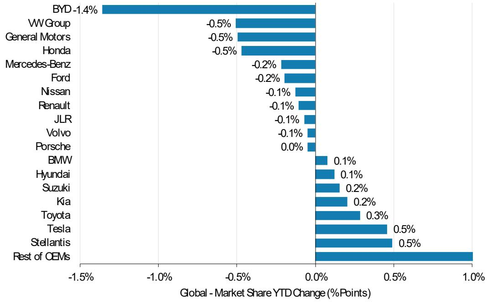

bar

| Company | Global - Market Share YTD Change (%Points) |
| :--- | :--- |
| BYD | -1.4 |
| VW Group | -0.5 |
| General Motors | -0.5 |
| Honda | -0.5 |
| Mercedes-Benz | -0.2 |
| Ford | -0.2 |
| Nissan | -0.1 |
| Renault | -0.1 |
| JLR | -0.1 |
| Volvo | -0.1 |
| Porsche | 0.0 |
| BMW | 0.1 |
| Hyundai | 0.1 |
| Suzuki | 0.2 |
| Kia | 0.2 |
| Toyota | 0.3 |
| Tesla | 0.5 |
| Stellantis | 0.5 |
| Rest of OEMs | 1.0 |

# 2 – Structural Issues: China OEMs gaining market share

# EU market share:

(+) Stellantis   
(-) Renault, VW, MBG, P911, BMW

# US market share:

(+) Stellantis, MBG, BMW   
(-) US OEMs, VW, P911

Change in Market Share YTD (%), Mar-26   
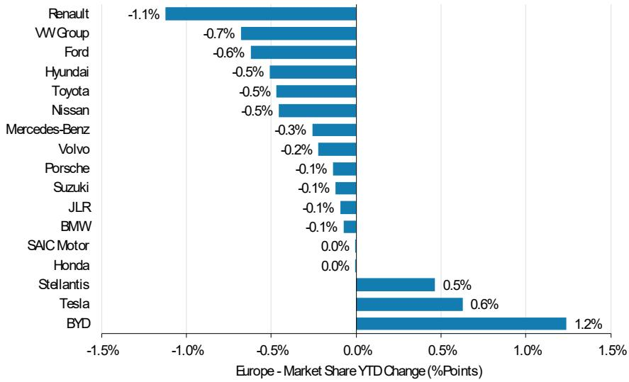

bar

| Manufacturer | Europe - Market Share YTD Change (%Points) |
| :--- | :--- |
| Renault | -1.1 |
| VW Group | -0.7 |
| Ford | -0.6 |
| Hyundai | -0.5 |
| Toyota | -0.5 |
| Nissan | -0.5 |
| Mercedes-Benz | -0.3 |
| Volvo | -0.2 |
| Porsche | -0.1 |
| Suzuki | -0.1 |
| JLR | -0.1 |
| BMW | -0.1 |
| SAIC Motor | 0.0 |
| Honda | 0.0 |
| Stellantis | 0.5 |
| Tesla | 0.6 |
| BYD | 1.2 |

Change in Market Share YTD (%), Apr-26   
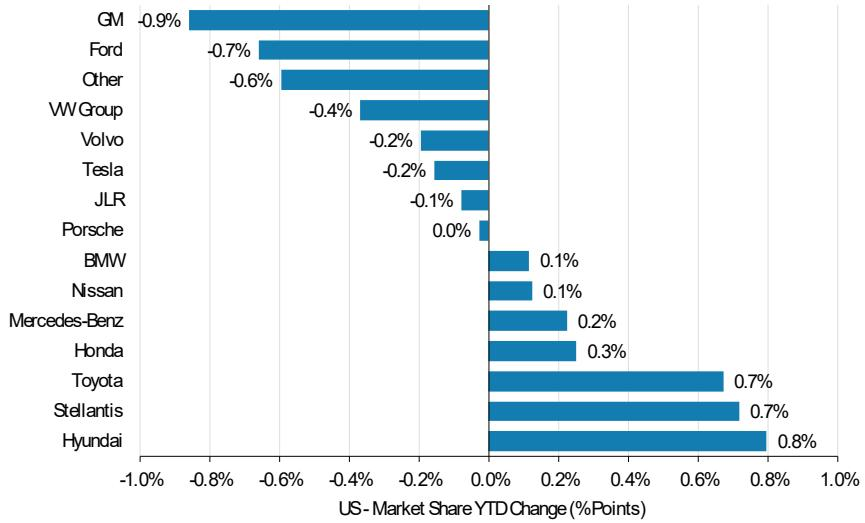

bar

| Company | US-Market Share YTD Change (%Points) |
| :--- | :--- |
| GM | -0.9 |
| Ford | -0.7 |
| Other | -0.6 |
| VW Group | -0.4 |
| Volvo | -0.2 |
| Tesla | -0.2 |
| JLR | -0.1 |
| Porsche | 0.0 |
| BMW | 0.1 |
| Nissan | 0.1 |
| Mercedes-Benz | 0.2 |
| Honda | 0.3 |
| Toyota | 0.7 |
| Stellantis | 0.7 |
| Hyundai | 0.8 |

# 2 – Structural Issues: China OEMs gaining market share

# China market share:

(+) BMW   
(-) VW, MBG, P911

# EM ex-China market share:

(+) VW, MBG   
(-) Renault, Stellantis, BMW, MBG

Change in Market Share YTD (%), Mar-26   
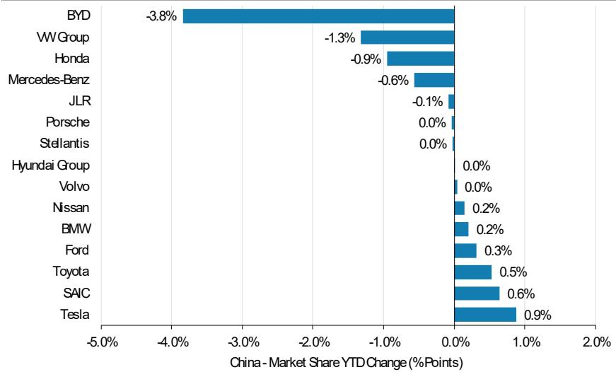

bar

| Company | China-Market Share YTD Change (%Points) |
| :--- | :--- |
| BYD | -3.8 |
| VW Group | -1.3 |
| Honda | -0.9 |
| Mercedes-Benz | -0.6 |
| JLR | -0.1 |
| Porsche | 0.0 |
| Stellantis | 0.0 |
| Hyundai Group | 0.0 |
| Volvo | 0.0 |
| Nissan | 0.2 |
| BMW | 0.2 |
| Ford | 0.3 |
| Toyota | 0.5 |
| SAIC | 0.6 |
| Tesla | 0.9 |

Change in Market Share YTD (%), Mar-26   
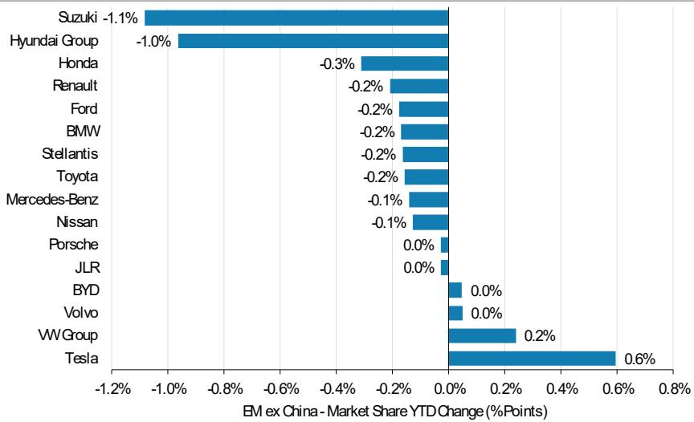

bar

| Company | BM ex China - Market Share YTD Change (%Points) |
| :--- | :--- |
| Suzuki | -1.1 |
| Hyundai Group | -1.0 |
| Honda | -0.3 |
| Renault | -0.2 |
| Ford | -0.2 |
| BMW | -0.2 |
| Stellantis | -0.2 |
| Toyota | -0.2 |
| Mercedes-Benz | -0.1 |
| Nissan | -0.1 |
| Porsche | 0.0 |
| JLR | 0.0 |
| BYD | 0.0 |
| Volvo | 0.0 |
| VWGroup | 0.2 |
| Tesla | 0.6 |

# 2 – Structural Issues: Pressure from China OEMs keeps increasing

# China OEMs gaining share: supported by EV penetration, faster in volume Segments

• 2026e: NEV wholesale 17.5mn units (+13% YoY) / Penetration 60%   
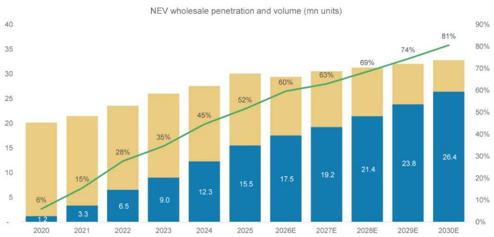

bar_line

NEV wholesale penetration and volume (mn units)
| Year | Blue Segment (mn units) | Yellow Segment (mn units) | Green Line (%) |
| :--- | :--- | :--- | :--- |
| 2020 | 1.2 | 18.4 | 6 |
| 2021 | 3.3 | 15.9 | 15 |
| 2022 | 6.5 | 17.9 | 28 |
| 2023 | 9.0 | 14.4 | 35 |
| 2024 | 12.3 | 13.4 | 45 |
| 2025 | 15.5 | 11.7 | 52 |
| 2026E | 17.5 | 10.6 | 60 |
| 2027E | 19.2 | 9.8 | 63 |
| 2028E | 21.4 | 8.9 | 69 |
| 2029E | 23.8 | 7.8 | 74 |
| 2030E | 26.4 | 6.8 | 81 |

China OEMs local market share (%)   
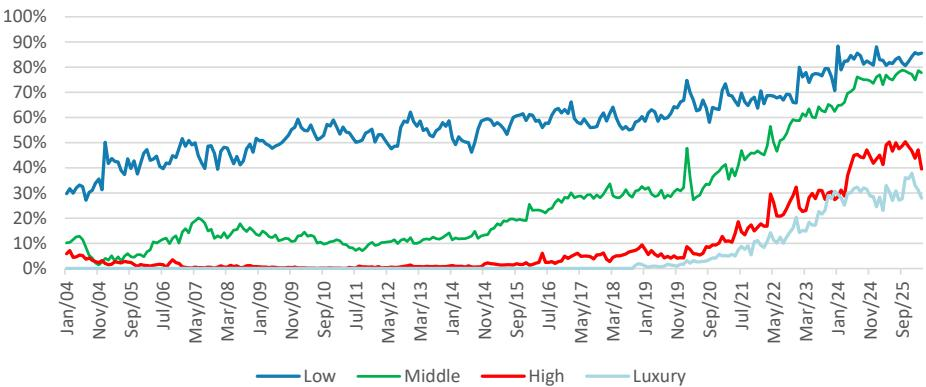

line

| Date   | Low  | Middle | High | Luxury |
|--------|------|--------|------|--------|
| Jan/04 | 30%  | 10%    | 5%   | 0%     |
| Nov/04 | 45%  | 5%     | 0%   | 0%     |
| Sep/05 | 50%  | 10%    | 0%   | 0%     |
| Jul/06 | 45%  | 15%    | 0%   | 0%     |
| May/07 | 50%  | 20%    | 0%   | 0%     |
| Mar/08 | 45%  | 15%    | 0%   | 0%     |
| Jan/09 | 50%  | 10%    | 0%   | 0%     |
| Nov/09 | 55%  | 15%    | 0%   | 0%     |
| Sep/10 | 60%  | 20%    | 0%   | 0%     |
| Jul/11 | 55%  | 15%    | 0%   | 0%     |
| May/12 | 60%  | 20%    | 0%   | 0%     |
| Mar/13 | 65%  | 25%    | 0%   | 0%     |
| Jan/14 | 60%  | 30%    | 0%   | 0%     |
| Nov/14 | 65%  | 35%    | 0%   | 0%     |
| Sep/15 | 70%  | 40%    | 0%   | 0%     |
| Jul/16 | 65%  | 45%    | 5%   | 0%     |
| May/17 | 70%  | 50%    | 10%  | 5%     |
| Mar/18 | 65%  | 55%    | 15%  | 10%    |
| Jan/19 | 70%  | 60%    | 20%  | 15%    |
| Nov/19 | 75%  | 65%    | 25%  | 20%    |
| Sep/20 | 70%  | 70%    | 30%  | 25%    |
| Jul/21 | 65%  | 75%    | 35%  | 30%    |
| May/22 | 70%  | 80%    | 40%  | 35%    |
| Mar/23 | 75%  | 85%    | 45%  | 40%    |
| Jan/24 | 80%  | 90%    | 50%  | 45%    |
| Nov/24 | 85%  | 95%    | 55%  | 50%    |
| Sep/25 | 90%  | 100%   | 60%  | 55%    |

2026 NEV Wholesale Volume Share   
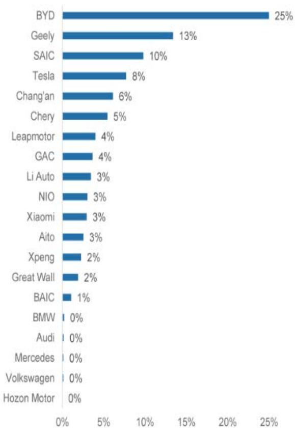

bar

| Company | Percentage (%) |
| :--- | :--- |
| BYD | 25 |
| Geely | 13 |
| SAIC | 10 |
| Tesla | 8 |
| Chang'an | 6 |
| Chery | 5 |
| Leapmotor | 4 |
| GAC | 4 |
| Li Auto | 3 |
| NIO | 3 |
| Xiaomi | 3 |
| Aito | 3 |
| Xpeng | 2 |
| Great Wall | 2 |
| BAIC | 1 |
| BMW | 0 |
| Audi | 0 |
| Mercedes | 0 |
| Volkswagen | 0 |
| Hozon Motor | 0 |

# 3 – Timing the Cycle: the key is the shape of the margin recovery

# Margin cycle inflection point; consensus now more rational

EBIT MARGIN (%, Co definition)   
EU OEMs   
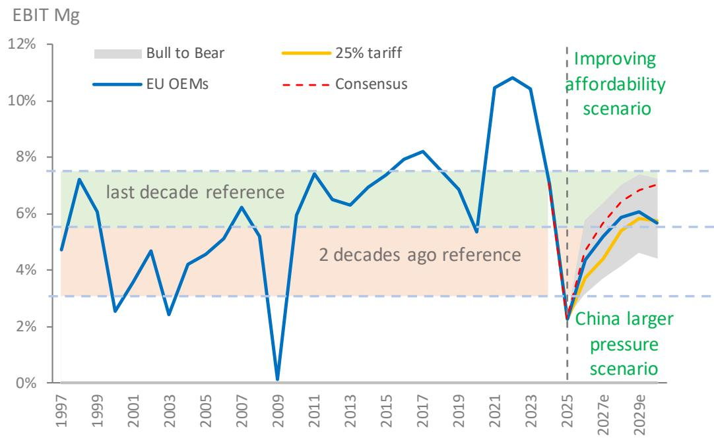

line

| Year | EU OEMs | Bull to Bear | 25% tariff | Consensus |
|------|---------|--------------|------------|-----------|
| 1997 | ~4.8%   | ~7.5%        | ~3.0%      | ~7.5%     |
| 1999 | ~6.0%   | ~7.5%        | ~3.0%      | ~7.5%     |
| 2001 | ~2.5%   | ~7.5%        | ~3.0%      | ~7.5%     |
| 2003 | ~2.5%   | ~7.5%        | ~3.0%      | ~7.5%     |
| 2005 | ~4.0%   | ~7.5%        | ~3.0%      | ~7.5%     |
| 2007 | ~6.0%   | ~7.5%        | ~3.0%      | ~7.5%     |
| 2009 | ~0.0%   | ~7.5%        | ~3.0%      | ~7.5%     |
| 2011 | ~7.5%   | ~7.5%        | ~3.0%      | ~7.5%     |
| 2013 | ~6.5%   | ~7.5%        | ~3.0%      | ~7.5%     |
| 2015 | ~7.5%   | ~7.5%        | ~3.0%      | ~7.5%     |
| 2017 | ~8.0%   | ~7.5%        | ~3.0%      | ~7.5%     |
| 2019 | ~7.0%   | ~7.5%        | ~3.0%      | ~7.5%     |
| 2021 | ~10.5%  | ~7.5%        | ~3.0%      | ~7.5%     |
| 2023 | ~10.5%  | ~7.5%        | ~3.0%      | ~7.5%     |
| 2025 | ~2.0%   | ~7.5%        | ~3.0%      | ~7.5%     |
| 2027e| ~4.0%   | ~7.5%        | ~4.0%      | ~7.5%     |
| 2029e| ~6.0%   | ~7.5%        | ~5.0%      | ~7.5%     |

# 3 – Timing the Cycle: the key is the shape of the margin recovery

# All companies impacted by the margin cycle

# Premium OEMs margins > volume OEMs (consensus now more rational, still high)

EBIT MARGIN (%, Co definition)   
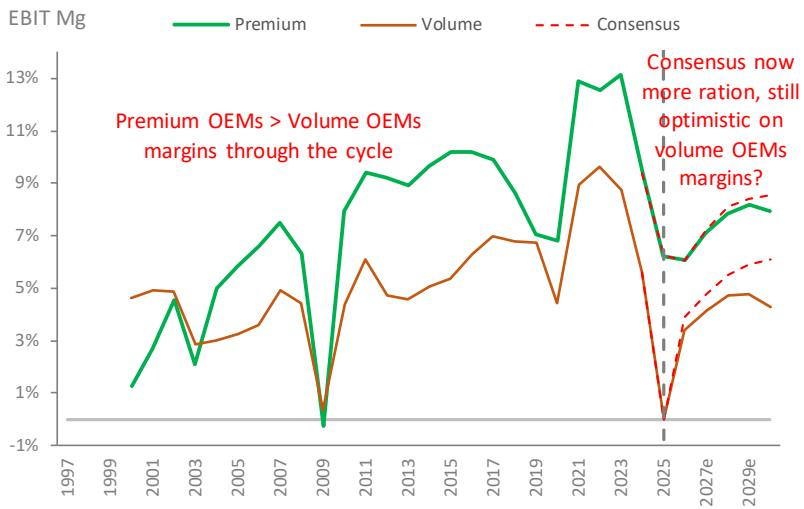

line

| Year | Premium | Volume | Consensus |
|------|---------|--------|-----------|
| 1997 | ~1%     | ~4.5%  | -         |
| 1999 | ~2%     | ~4.8%  | -         |
| 2001 | ~4%     | ~5%    | -         |
| 2003 | ~2.5%   | ~3%    | -         |
| 2005 | ~5%     | ~3.5%  | -         |
| 2007 | ~7.5%   | ~5%    | -         |
| 2009 | ~-1%    | ~-1%   | -         |
| 2011 | ~9%     | ~6%    | -         |
| 2013 | ~9%     | ~5%    | -         |
| 2015 | ~10%    | ~6%    | -         |
| 2017 | ~10%    | ~7%    | -         |
| 2019 | ~7%     | ~7%    | -         |
| 2021 | ~13%    | ~9%    | -         |
| 2023 | ~13%    | ~9%    | -         |
| 2025 | ~6%     | ~3%    | -         |
| 2027e| ~8%     | ~5%    | ~6%       |
| 2029e| ~8%     | ~5%    | ~6%       |

EU OEMs

EBIT MARGIN (%, Co definition)   
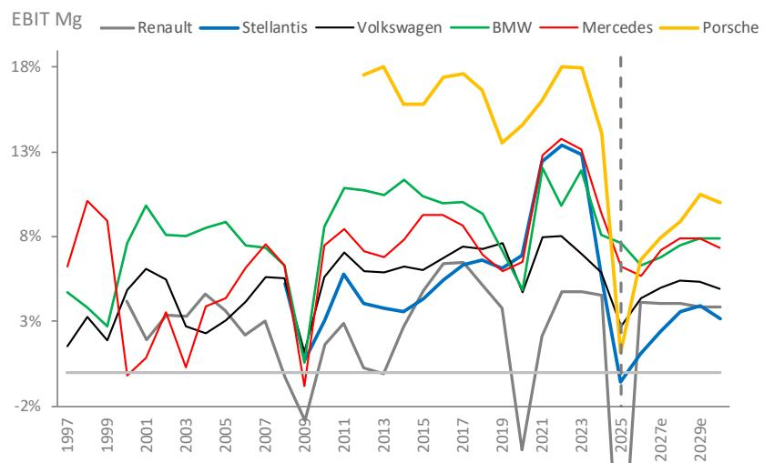  
EU OEMs

# 3 – Timing the Cycle: the key is the shape of the margin recovery

Global OEMs Margins have converged   
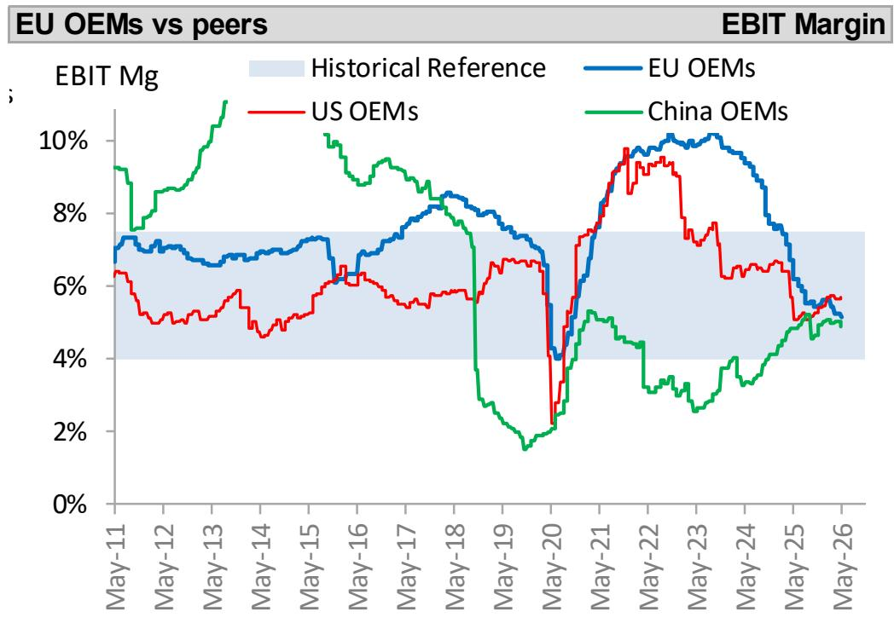

line

| Date   | Historical Reference | EU OEMs | US OEMs | China OEMs |
|--------|----------------------|---------|---------|------------|
| May-11 | 4%                   | 7%      | 6%      | 9%         |
| May-12 | 4%                   | 7%      | 5%      | 8%         |
| May-13 | 4%                   | 7%      | 6%      | 10%        |
| May-14 | 4%                   | 7%      | 5%      | 9%         |
| May-15 | 4%                   | 7%      | 6%      | 10%        |
| May-16 | 4%                   | 7%      | 6%      | 9%         |
| May-17 | 4%                   | 8%      | 6%      | 8%         |
| May-18 | 4%                   | 8%      | 6%      | 7%         |
| May-19 | 4%                   | 8%      | 6%      | 2%         |
| May-20 | 4%                   | 4%      | 2%      | 2%         |
| May-21 | 4%                   | 8%      | 7%      | 5%         |
| May-22 | 4%                   | 10%     | 9%      | 4%         |
| May-23 | 4%                   | 10%     | 9%      | 3%         |
| May-24 | 4%                   | 9%      | 7%      | 4%         |
| May-25 | 4%                   | 7%      | 6%      | 5%         |
| May-26 | 4%                   | 5%      | 5%      | 5%         |

# 3 – Timing the Cycle: it is also about Capex and R&D

# Capex and R&D control lagging behind operational cash flow fall

# Consensus still in denial

IND. CAPEX + TOTAL NET R&D / IND. REV.(%)   
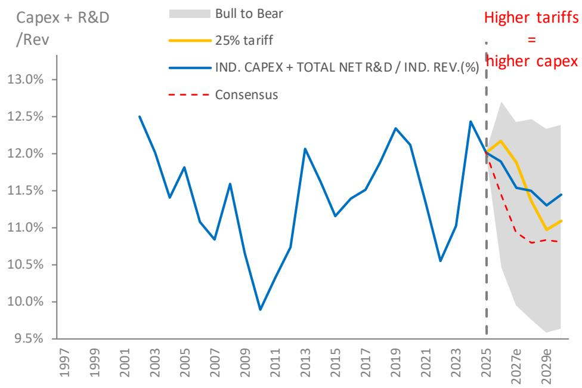

line

| Year | Capex + R&D / Rev (%) |
|------|------------------------|
| 1997 | ~12.5%                 |
| 1999 | ~12.0%                 |
| 2001 | ~11.5%                 |
| 2003 | ~11.0%                 |
| 2005 | ~10.8%                 |
| 2007 | ~10.5%                 |
| 2009 | ~10.0%                 |
| 2011 | ~10.5%                 |
| 2013 | ~11.5%                 |
| 2015 | ~11.0%                 |
| 2017 | ~11.5%                 |
| 2019 | ~12.0%                 |
| 2021 | ~11.5%                 |
| 2023 | ~11.0%                 |
| 2025 | ~12.5%                 |
| 2027e | ~11.5%                |
| 2029e | ~11.0%                |

# 3 – Timing the Cycle: it is also about Capex and R&D

# Capex and R&D control lagging behind operational cash flow fall

IND. CAPEX + TOTAL NET R&D / IND. REV.(%)   

line

| Year | Premium | Volume | Consensus |
|------|---------|--------|-----------|
| 2025e | 15.0% | 10.0% | 13.0% |
| 2027e | 13.0% | 10.5% | 12.5% |
| 2029e | 13.5% | 10.2% | 12.8% |

IND. CAPEX + TOTAL NET R&D / IND. REV.(%)   
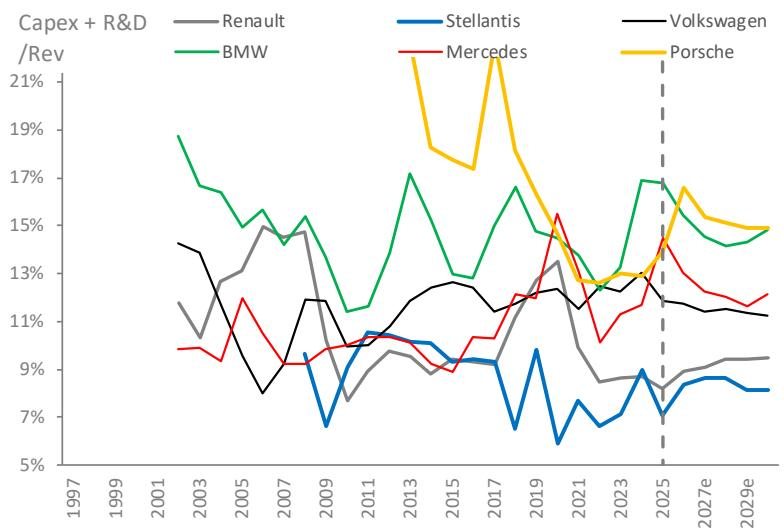

line

| Year | Renault | Stellantis | BMW | Mercedes | Volkswagen | Porsche |
|------|---------|------------|-----|----------|------------|---------|
| 1997 | 11.5%   | 11.0%      | 18.5% | 10.5%    | 14.0%      | 14.5%   |
| 1999 | 11.0%   | 10.5%      | 17.5% | 10.0%    | 13.5%      | 14.0%   |
| 2001 | 10.5%   | 10.0%      | 16.5% | 9.5%     | 13.0%      | 13.5%   |
| 2003 | 10.0%   | 9.5%       | 15.5% | 9.0%     | 12.5%      | 13.0%   |
| 2005 | 9.5%    | 9.0%       | 14.5% | 8.5%     | 12.0%      | 12.5%   |
| 2007 | 9.0%    | 8.5%       | 13.5% | 8.0%     | 11.5%      | 12.0%   |
| 2009 | 8.5%    | 8.0%       | 12.5% | 7.5%     | 11.0%      | 11.5%   |
| 2011 | 8.0%    | 7.5%       | 11.5% | 7.0%     | 10.5%      | 11.0%   |
| 2013 | 7.5%    | 7.0%       | 10.5% | 6.5%     | 10.0%      | 10.5%   |
| 2015 | 7.0%    | 6.5%       | 9.5%  | 6.0%     | 9.5%       | 10.0%   |
| 2017 | 6.5%    | 6.0%       | 8.5%  | 5.5%     | 9.0%       | 9.5%    |
| 2019 | 6.0%    | 5.5%       | 7.5%  | 5.0%     | 8.5%       | 9.0%    |
| 2021 | 5.5%    | 5.0%       | 6.5%  | 4.5%     | 8.0%       | 8.5%    |
| 2023 | 5.0%    | 4.5%       | 5.5%  | 4.0%     | 7.5%       | 8.0%    |
| 2025e| 4.5%    | 4.0%       | 4.5%  | 3.5%     | 7.0%       | 7.5%    |
| 2027e| 4.0%    | 3.5%       | 3.5%  | 3.0%     | 6.5%       | 7.0%    |
| 2029e| 3.5%    | 3.0%       | 2.5%  | 2.5%     | 6.0%       | 6.5%    |
| *Rev*| -       | -          | -     | -        | -          | -       |

EU OEMs

# 3 – Timing the Cycle: it is also about Working Capital

# Segments also drive working capital strategy

MS INDUSTRIAL WORKING CAPITAL (EUR mn) EU OEMs   
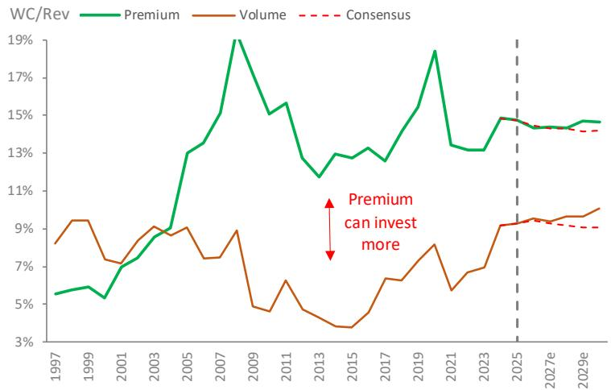

line

| Year | Premium | Volume | Consensus |
|------|---------|--------|-----------|
| 1997 | ~5.5%   | ~8.5%  | -         |
| 1999 | ~6.0%   | ~9.0%  | -         |
| 2001 | ~5.5%   | ~7.5%  | -         |
| 2003 | ~8.0%   | ~9.0%  | -         |
| 2005 | ~13.0%  | ~9.0%  | -         |
| 2007 | ~15.0%  | ~7.5%  | -         |
| 2009 | ~19.0%  | ~4.5%  | -         |
| 2011 | ~15.0%  | ~6.5%  | -         |
| 2013 | ~12.0%  | ~4.0%  | -         |
| 2015 | ~13.0%  | ~3.5%  | -         |
| 2017 | ~13.5%  | ~6.5%  | -         |
| 2019 | ~15.5%  | ~8.0%  | -         |
| 2021 | ~18.5%  | ~6.0%  | -         |
| 2023 | ~13.0%  | ~7.0%  | -         |
| 2025e| ~14.5% | ~9.0%  | ~9.0%     |
| 2027e| ~14.5% | ~9.5%  | ~9.0%     |
| 2029e| ~14.5% | ~10.0% | ~9.0%     |

MS Ind. WORKING CAPITAL / IND. SALES (%) EU OEMs   
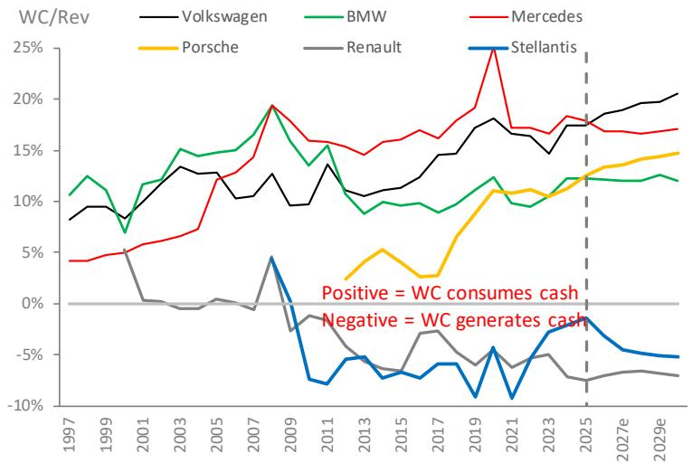

line

| Year | Volkswagen | BMW | Mercedes | Porsche | Renault | Stellantis |
|------|------------|-----|----------|---------|---------|------------|
| 1997 | ~8%        | ~11%| ~4%      | -       | -       | -          |
| 1999 | ~9%        | ~12%| ~5%      | -       | -       | -          |
| 2001 | ~8%        | ~10%| ~6%      | -       | ~5%     | -          |
| 2003 | ~10%       | ~13%| ~7%      | -       | ~0%     | -          |
| 2005 | ~12%       | ~14%| ~8%      | -       | ~0%     | -          |
| 2007 | ~13%       | ~15%| ~10%     | -       | ~0%     | -          |
| 2009 | ~14%       | ~19%| ~18%     | -       | ~4%     | ~5%        |
| 2011 | ~13%       | ~14%| ~16%     | -       | ~-3%    | ~-8%       |
| 2013 | ~11%       | ~10%| ~15%     | ~3%     | ~-5%    | ~-7%       |
| 2015 | ~12%       | ~9% | ~16%     | ~5%     | ~-4%    | ~-6%       |
| 2017 | ~13%       | ~10%| ~17%     | ~3%     | ~-3%    | ~-5%       |
| 2019 | ~15%       | ~12%| ~25%     | ~8%     | ~-4%    | ~-9%       |
| 2021 | ~17%       | ~13%| ~17%     | ~11%    | ~-5%    | ~-8%       |
| 2023 | ~16%       | ~12%| ~18%     | ~10%    | ~-4%    | ~-3%       |
| 2025e| ~18%       | ~13%| ~17%     | ~12%    | ~-5%    | ~-2%       |
| 2027e| ~19%       | ~14%| ~16%     | ~13%    | ~-6%    | ~-4%       |
| 2029e| ~20%       | ~13%| ~17%     | ~14%    | ~-7%    | ~-5%       |

# 3 – Timing the Cycle: Tariffs matter for European OEMs

EBIT MARGIN (%, Co definition)   
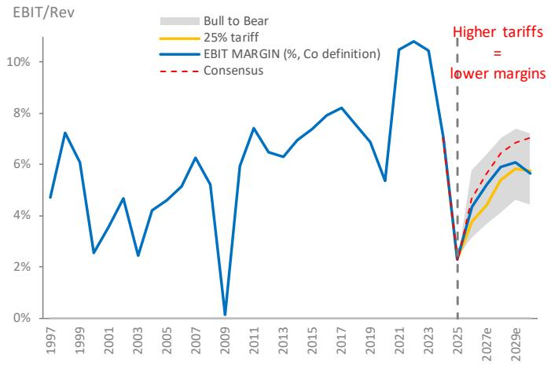

line

| Year | EBIT Margin (%, Co definition) | 25% tariff | Bull to Bear |
|------|--------------------------------|----------|--------------|
| 1997 | ~4.8%                          | -        | -            |
| 1999 | ~7.2%                          | -        | -            |
| 2001 | ~2.6%                          | -        | -            |
| 2003 | ~4.6%                          | -        | -            |
| 2005 | ~4.2%                          | -        | -            |
| 2007 | ~6.2%                          | -        | -            |
| 2009 | ~0.0%                          | -        | -            |
| 2011 | ~7.4%                          | -        | -            |
| 2013 | ~6.4%                          | -        | -            |
| 2015 | ~7.8%                          | -        | -            |
| 2017 | ~8.2%                          | -        | -            |
| 2019 | ~7.0%                          | -        | -            |
| 2021 | ~10.8%                         | -        | -            |
| 2023 | ~10.4%                         | -        | -            |
| 2025e| ~2.4%                          | ~2.4%    | ~2.4%        |
| 2027e| ~5.8%                          | ~5.6%    | ~5.6%        |
| 2029e| ~6.0%                          | ~5.8%    | ~6.8%        |

IND. CAPEX + TOTAL NET R&D / IND. REV.(%)   

line

| Year | Capex + R&D / Rev | 25% tariff | Consensus |
|------|-------------------|----------|---------|
| 2025e | 12.5% | 12.0% | 11.8% |
| 2027e | 12.0% | 11.5% | 11.0% |
| 2029e | 11.5% | 11.0% | 10.8% |

INDUSTRIAL FCF (EUR MN)   
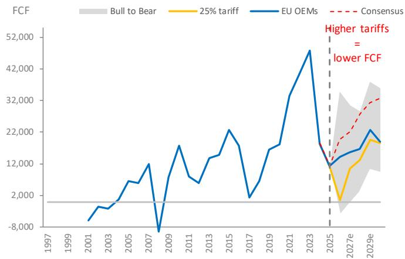

line

| Year | EU OEMs | 25% tariff | Bull to Bear |
|------|---------|------------|--------------|
| 1997 |         |            |              |
| 1999 |         |            |              |
| 2001 |         |            |              |
| 2003 |         |            |              |
| 2005 |         |            |              |
| 2007 |         |            |              |
| 2009 | -8,000  |            |              |
| 2011 |         |            |              |
| 2013 |         |            |              |
| 2015 |         |            |              |
| 2017 |         |            |              |
| 2019 |         |            |              |
| 2021 |         |            |              |
| 2023 | 45,000  |            |              |
| 2025e|         | 15,000     |              |
| 2027e|         | 18,000     |              |
| 2029e|         | 20,000     |              |

ROA (Group, %)   
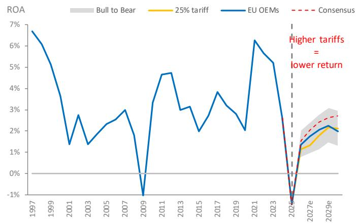

line

| Year | EU OEMs | Bull to Bear | 25% tariff | Consensus |
|------|---------|--------------|------------|-----------|
| 1997 | 6.8%    |              |            |           |
| 1999 | 5.5%    |              |            |           |
| 2001 | 1.5%    |              |            |           |
| 2003 | 1.4%    |              |            |           |
| 2005 | 2.2%    |              |            |           |
| 2007 | 3.0%    |              |            |           |
| 2009 | -1.0%   |              |            |           |
| 2011 | 4.8%    |              |            |           |
| 2013 | 3.0%    |              |            |           |
| 2015 | 2.0%    |              |            |           |
| 2017 | 3.8%    |              |            |           |
| 2019 | 2.5%    |              |            |           |
| 2021 | 6.2%    |              |            |           |
| 2023 | 5.2%    |              |            |           |
| 2025e| -1.0%   |              |            |           |
| 2027e| 1.5%    |              |            |           |
| 2029e| 2.0%    |              |            |           |

# 3 – Timing the Cycle: Premium vs Volume OEMs

EBIT MARGIN (%, Co definition)   
EU OEMs   
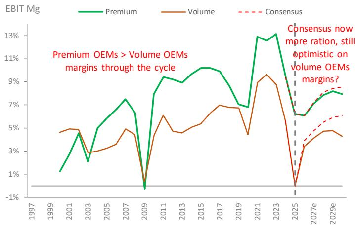

line

| Year | Premium | Volume | Consensus |
|------|---------|--------|-----------|
| 1997 |         |        |           |
| 1999 |         |        |           |
| 2001 |         |        |           |
| 2003 |         |        |           |
| 2005 |         |        |           |
| 2007 |         |        |           |
| 2009 |         |        |           |
| 2011 |         |        |           |
| 2013 |         |        |           |
| 2015 |         |        |           |
| 2017 |         |        |           |
| 2019 |         |        |           |
| 2021 |         |        |           |
| 2023 |         |        |           |
| 2025 |         |        |           |
| 2027e|         |        |           |
| 2029e|         |        |           |

MS INDUSTRIAL WORKING CAPITAL (EUR mn)   
EU OEMs   
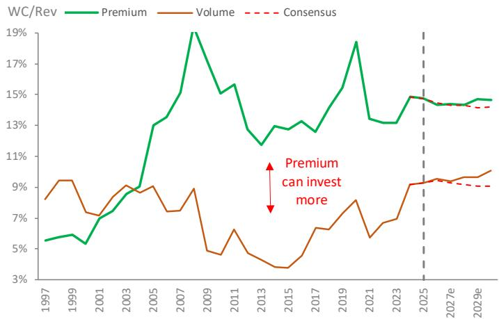

line

| Year | Premium | Volume | Consensus |
|------|---------|--------|-----------|
| 1997 | 5.5%    | 8.5%   | -         |
| 1999 | 6.0%    | 9.0%   | -         |
| 2001 | 7.0%    | 7.5%   | -         |
| 2003 | 8.5%    | 9.0%   | -         |
| 2005 | 13.0%   | 8.5%   | -         |
| 2007 | 15.0%   | 7.5%   | -         |
| 2009 | 19.0%   | 9.0%   | -         |
| 2011 | 15.5%   | 6.5%   | -         |
| 2013 | 12.0%   | 4.5%   | -         |
| 2015 | 13.0%   | 3.5%   | -         |
| 2017 | 13.5%   | 6.5%   | -         |
| 2019 | 15.0%   | 8.0%   | -         |
| 2021 | 18.5%   | 6.0%   | -         |
| 2023 | 13.0%   | 7.0%   | -         |
| 2025e| 14.5%   | 9.0%   | -         |
| 2027e| 14.0%   | 9.5%   | -         |
| 2029e| 14.5%   | 10.0%  | -         |

IND. CAPEX + TOTAL NET R&D / IND. REV.(%)   
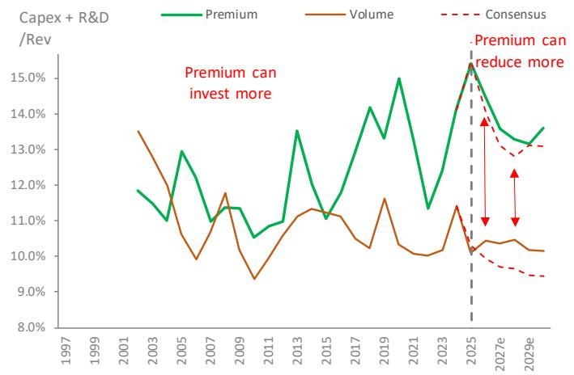

line

| Year | Premium | Volume | Consensus |
|------|---------|--------|-----------|
| 2025e | 15.0% | 10.0% | 14.0% |
| 2026e | 13.5% | 10.5% | 13.0% |
| 2027e | 13.0% | 10.5% | 12.5% |
| 2029e | 13.5% | 10.5% | 12.5% |

Industrial FCF / Industrial Rev (%)   
EU OEMs   
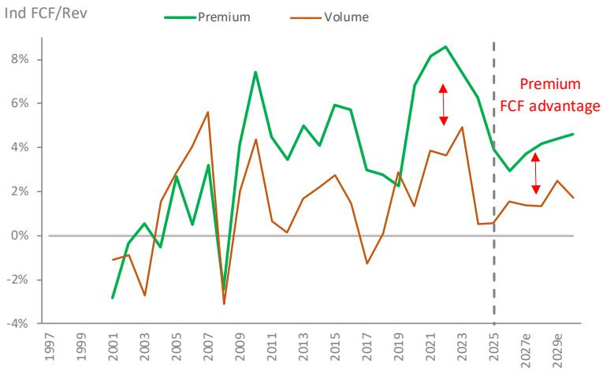

line

| Year | Premium | Volume |
|------|---------|--------|
| 2021 | 8%      | 4%     |
| 2023 | 6%      | 5%     |
| 2025e| 4%      | 1%     |
| 2029e| 5%      | 2%     |

# 3 – Timing the Cycle: Premium vs Volume OEMs

EBIT MARGIN (%, Co definition)   
EU OEMs   
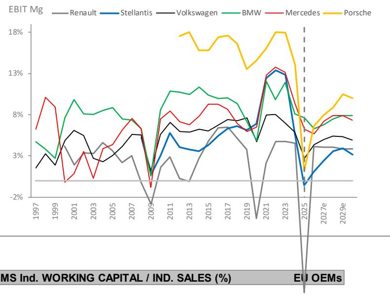

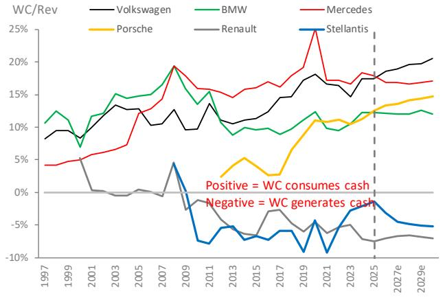

line

| Year | Volkswagen | BMW | Mercedes | Porsche | Renault | Stellantis |
|------|------------|-----|----------|---------|---------|------------|
| 1997 | ~8%        | ~12%| ~4%      | -       | -       | -          |
| 1999 | ~9%        | ~13%| ~5%      | -       | -       | -          |
| 2001 | ~10%       | ~11%| ~6%      | -       | ~0%     | -          |
| 2003 | ~12%       | ~14%| ~7%      | -       | ~-1%    | -          |
| 2005 | ~13%       | ~15%| ~8%      | -       | ~-1%    | -          |
| 2007 | ~14%       | ~16%| ~19%     | -       | ~-1%    | -          |
| 2009 | ~15%       | ~17%| ~18%     | -       | ~-2%    | ~4%        |
| 2011 | ~16%       | ~15%| ~16%     | -       | ~-3%    | ~-8%       |
| 2013 | ~17%       | ~14%| ~15%     | ~3%     | ~-4%    | ~-6%       |
| 2015 | ~18%       | ~13%| ~16%     | ~5%     | ~-5%    | ~-7%       |
| 2017 | ~19%       | ~12%| ~17%     | ~3%     | ~-6%    | ~-7%       |
| 2019 | ~20%       | ~13%| ~25%     | ~10%    | ~-7%    | ~-8%       |
| 2021 | ~21%       | ~14%| ~17%     | ~12%    | ~-8%    | ~-6%       |
| 2023 | ~20%       | ~13%| ~18%     | ~13%    | ~-9%    | ~-4%       |
| 2025e| ~21%       | ~14%| ~17%     | ~14%    | ~-9%    | ~-3%       |
| 2027e| ~22%       | ~15%| ~17%     | ~15%    | ~-9%    | ~-4%       |
| 2029e| ~23%       | ~16%| ~17%     | ~16%    | ~-9%    | ~-5%       |

IND. CAPEX + TOTAL NET R&D / IND. REV.(%)   
EU OEMs   
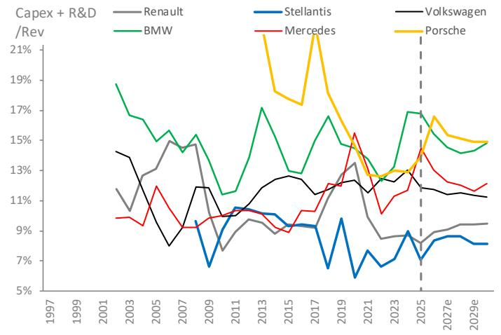

line

| Year | Renault | Stellantis | BMW | Volkswagen | Mercedes | Porsche |
|------|---------|------------|-----|------------|----------|---------|
| 1997 | 11.5%   | -          | -   | -          | -        | -       |
| 1999 | 11.8%   | -          | -   | -          | -        | -       |
| 2001 | 12.0%   | -          | 18.5% | 14.0%      | 9.5%     | -       |
| 2003 | 11.0%   | -          | 16.5% | 13.5%      | 9.0%     | -       |
| 2005 | 13.0%   | -          | 15.5% | 8.0%       | 11.5%    | -       |
| 2007 | 15.0%   | -          | 14.5% | 12.0%      | 9.0%     | -       |
| 2009 | 14.5%   | 7.0%       | 15.5% | 11.5%      | 9.5%     | -       |
| 2011 | 9.0%    | 9.5%       | 11.5% | 10.5%      | 9.0%     | -       |
| 2013 | 9.5%    | 9.0%       | 17.0% | 12.0%      | 8.5%     | 21.0%   |
| 2015 | 9.0%    | 9.5%       | 13.0% | 12.5%      | 9.0%     | 17.5%   |
| 2017 | 9.5%    | 9.0%       | 16.5% | 11.5%      | 10.5%    | 21.0%   |
| 2019 | 13.0%   | 6.5%       | 14.5% | 12.0%      | 15.5%    | 18.0%   |
| 2021 | 9.0%    | 7.5%       | 13.0% | 12.5%      | 9.5%     | 13.0%   |
| 2023 | 8.5%    | 8.0%       | 17.0% | 12.0%      | 13.0%    | 13.0%   |
| 2025e| 8.8%    | 7.0%       | 14.5% | 11.5%      | 14.5%    | 16.5%   |
| 2027e| 9.0%    | 8.5%       | 14.0% | 11.0%      | 13.5%    | 16.0%   |
| 2029e| 9.2%    | 8.0%       | 14.5% | 11.5%      | 13.0%    | 15.5%   |

Industrial FCF / Industrial Rev (%)   
EU OEMs   
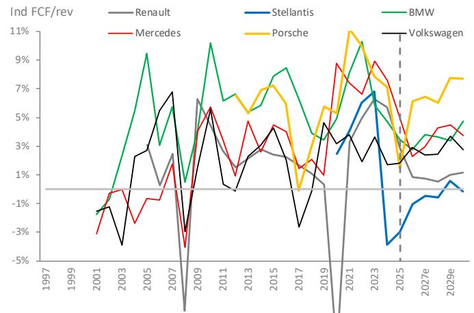

# 3 – Timing the Cycle: Premium vs Volume OEMs

INDUSTRIAL NET DEBT (CASH) (As reported, EUR MN)   
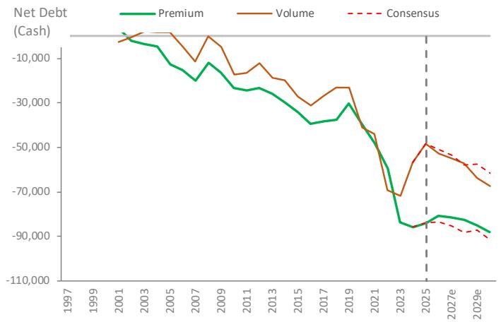

line

| Year   | Premium | Volume  | Consensus |
|--------|---------|---------|-----------|
| 1997   |         |         |           |
| 1999   |         |         |           |
| 2001   |         |         |           |
| 2003   |         |         |           |
| 2005   |         |         |           |
| 2007   |         |         |           |
| 2009   |         |         |           |
| 2011   |         |         |           |
| 2013   |         |         |           |
| 2015   |         |         |           |
| 2017   |         |         |           |
| 2019   |         |         |           |
| 2021   |         |         |           |
| 2023   |         |         |           |
| 2025e  |         |         |           |
| 2027e  |         |         |           |
| 2029e  |         |         |           |

INDUSTRIAL NET DEBT (CASH) (As reported, EUR MN)   
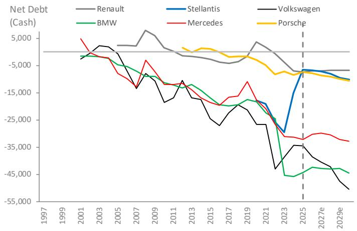

line

| Year | Renault | Stellantis | Volkswagen | BMW | Mercedes | Porsche |
|------|---------|------------|------------|-----|----------|---------|
| 1997 |         |            |            |     |          |         |
| 1999 |         |            |            |     |          |         |
| 2001 |         |            |            | -4,000 | 5,000    |         |
| 2003 |         |            |            | -4,500 | -4,500   |         |
| 2005 |         |            |            | -5,000 | -15,000  |         |
| 2007 |         |            |            | -15,000 | -15,000  |         |
| 2009 |         |            |            | -15,000 | -15,000  |         |
| 2011 |         |            |            | -15,000 | -15,000  |         |
| 2013 |         |            |            | -15,000 | -15,000  |         |
| 2015 |         |            |            | -15,000 | -15,000  |         |
| 2017 |         |            |            | -15,000 | -15,000  |         |
| 2019 |         |            |            | -15,000 | -15,000  |         |
| 2021 |         |            |            | -15,000 | -15,000  |         |
| 2023 |         | -35,000    | -35,000    | -45,000 | -35,000  | -35,000 |
| 2025e|         |            |            | -45,000 | -35,000  | -35,000 |
| 2029e|         |            |            | -45,000 | -35,000  | -35,000 |
The chart includes a vertical dashed line at 2025e for reference. The data is already in English. The values are estimated based on the provided code.

# 3 – Timing the Cycle: it is about margins and investments

Investors should reward strategies that focus on generating cash flow for shareholders, not simply on selling cars (VW example)

Industrial Gross Cash Flow   
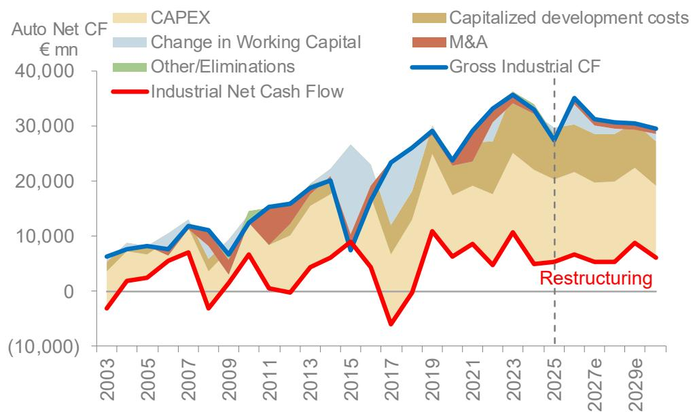

area

| Year | CAPEX | Capitalized development costs | M&A | Other/Eliminations | Change in Working Capital | Gross Industrial CF | Industrial Net Cash Flow |
|------|-------|-------------------------------|-----|-------------------|---------------------------|---------------------|--------------------------|
| 2003 | ~5,000 | ~5,000 | ~5,000 | ~5,000 | ~5,000 | ~6,000 | ~-5,000 |
| 2005 | ~7,000 | ~7,000 | ~7,000 | ~7,000 | ~7,000 | ~8,000 | ~2,000 |
| 2007 | ~10,000 | ~10,000 | ~10,000 | ~10,000 | ~10,000 | ~12,000 | ~7,000 |
| 2009 | ~5,000 | ~5,000 | ~5,000 | ~5,000 | ~5,000 | ~7,000 | ~-5,000 |
| 2011 | ~15,000 | ~15,000 | ~15,000 | ~15,000 | ~15,000 | ~18,000 | ~5,000 |
| 2013 | ~18,000 | ~18,000 | ~18,000 | ~18,000 | ~18,000 | ~22,000 | ~5,000 |
| 2015 | ~25,000 | ~25,000 | ~25,000 | ~25,000 | ~25,000 | ~28,000 | ~15,000 |
| 2017 | ~15,000 | ~15,000 | ~15,000 | ~15,000 | ~15,000 | ~22,000 | ~-15,000 |
| 2019 | ~25,000 | ~25,000 | ~25,000 | ~25,000 | ~25,000 | ~32,000 | ~12,000 |
| 2021 | ~28,000 | ~28,000 | ~28,000 | ~28,000 | ~28,000 | ~35,000 | ~8,000 |
| 2023 | ~32,000 | ~32,000 | ~32,000 | ~32,000 | ~32,000 | ~38,000 | ~12,000 |
| 27e* | ~35,000 | ~35,000 | ~35,000 | ~35,000 | ~35,000 | ~36,566 | ~6,566 |
| 29e* | ~34,566 | ~34,566 | ~34,566 | ~34,566 | ~34,566 | ~36,566 | ~7,566 |
The chart includes a vertical dashed line at 27e* and a horizontal dashed line labeled 'Restructuring'.

Volkswagen

# 3 – Timing the Cycle: Fx headwind: European players losing competitiveness

USD / EUR 1Q26: +11% Last: 1.18 +5%   
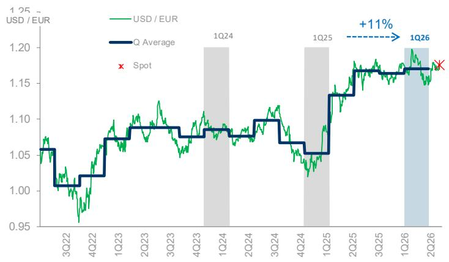

line

| Quarter | USD / EUR |
| ------- | --------- |
| 3Q22    | 1.05      |
| 4Q22    | 1.00      |
| 1Q23    | 1.08      |
| 2Q23    | 1.10      |
| 3Q23    | 1.08      |
| 4Q23    | 1.09      |
| 1Q24    | 1.08      |
| 2Q24    | 1.09      |
| 3Q24    | 1.07      |
| 4Q24    | 1.05      |
| 1Q25    | 1.15      |
| 2Q25    | 1.17      |
| 3Q25    | 1.17      |
| 4Q25    | 1.17      |
| 1Q26    | 1.17      |
| 2Q26    | 1.17      |

CNY / EUR 1Q26: +6% Last: 8.01 -2%   
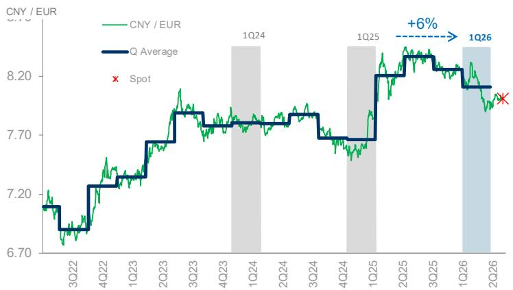

line

| Quarter | CNY / EUR |
| ------- | --------- |
| 1Q24    | 7.70      |
| 1Q25    | 8.20      |
| 1Q26    | 8.20      |

JPY / EUR 1Q26: +14% Last: 184 +13%   
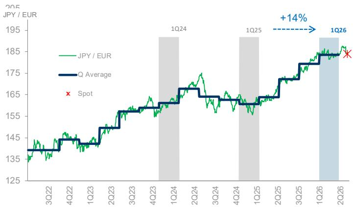

line

| Quarter | JPY / EUR | Q Average | Spot |
|---------|-----------|-----------|------|
| 1Q24    | ~165      | ~165      | -    |
| 1Q25    | ~160      | ~160      | -    |
| 1Q26    | ~185      | ~185      | X    |

KOW / EUR 1Q26: +12% Last: 1,701 +9%   
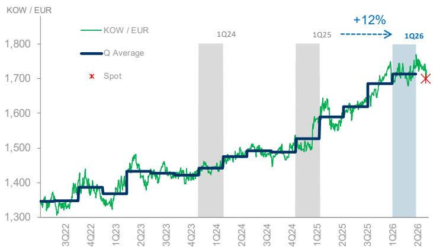

line

| Quarter | KOW / EUR | Q Average | Spot |
|---------|-----------|-----------|------|
| 1Q24    | ~1,450    | ~1,450    | -    |
| 1Q25    | ~1,600    | ~1,600    | -    |
| 1Q26    | ~1,750    | ~1,750    | 12%  |

Source: Datastream, MS estimates

# 3 – Timing the Cycle: Commodity prices still mixed but trending up

Brent (EUR/bbl) 1Q26: -5% Last (€): 101 +76%   
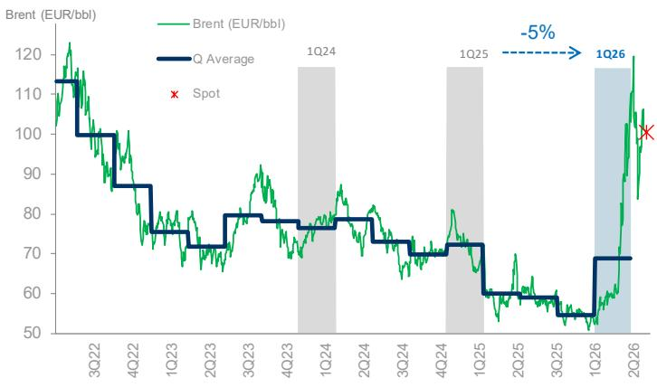

line

| Quarter | Brent (EUR/bbl) | Q Average | Spot |
|---------|-----------------|-----------|------|
| 1Q24    | ~115            | ~80       | -    |
| 1Q25    | ~70             | ~70       | -    |
| 1Q26    | ~120            | ~70       | ✗    |

Shipping Index (EUR) 1Q26: -27% Last (€): 1,662 +39%   
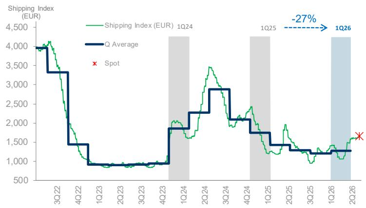

line

| Quarter | Shipping Index (EUR) |
| ------- | -------------------- |
| 3Q22    | 4,000                |
| 4Q22    | 1,500                |
| 1Q23    | 1,000                |
| 2Q23    | 1,000                |
| 3Q23    | 1,000                |
| 4Q23    | 1,000                |
| 1Q24    | 2,000                |
| 2Q24    | 3,500                |
| 3Q24    | 2,500                |
| 4Q24    | 2,000                |
| 1Q25    | 1,500                |
| 2Q25    | 1,500                |
| 3Q25    | 1,500                |
| 4Q25    | 1,500                |
| 1Q26    | 1,500                |
| 2Q26    | 1,500                |

Aluminium (EUR/MT) 1Q26: +9% Last (€): 3,029 +42%   
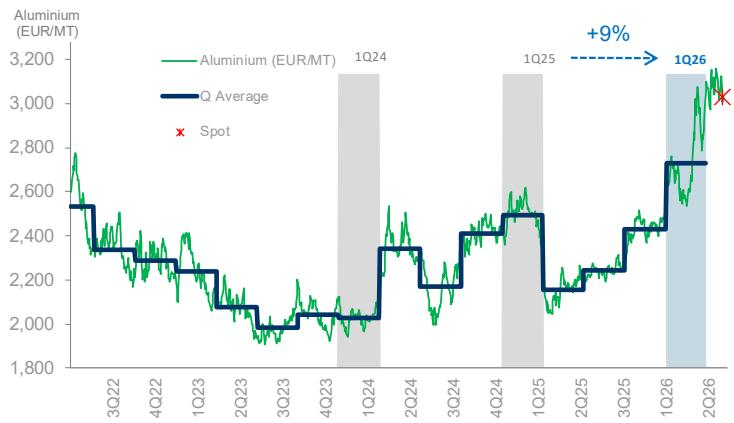

line

| Quarter | Aluminium (EUR/MT) | Q Average | Spot |
|---------|---------------------|-----------|------|
| 1Q24    | ~2,800              | ~2,500    | -    |
| 1Q25    | ~2,600              | ~2,500    | -    |
| 1Q26    | ~3,100              | ~2,700    | ✗    |

Lithium (EUR/MT) 1Q26: +92% Last (€): 23,654 +197%   
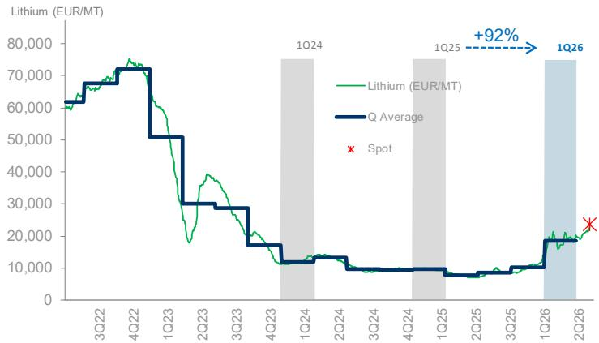

line

| Quarter | Lithium (EUR/MT) | Q Average | Spot |
|---------|------------------|-----------|------|
| 1Q24    | ~60,000          | ~60,000   | -    |
| 1Q25    | ~10,000          | ~10,000   | -    |
| 1Q26    | ~20,000          | ~20,000   | +92% |

Source: Datastream, MS estimates

# 3 – Timing the Cycle: US market dynamics

# US volume, inventories and incentives

Market share   
Stellantis   
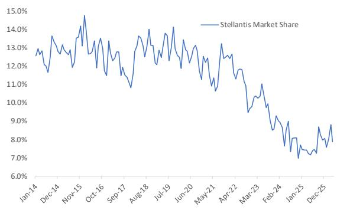

line

| Date    | Stellantis Market Share |
|---------|--------------------------|
| Jan-14  | 13.0%                    |
| Dec-14  | 12.5%                    |
| Nov-15  | 14.5%                    |
| Oct-16  | 13.0%                    |
| Sep-17  | 11.0%                    |
| Aug-18  | 13.5%                    |
| Jul-19  | 14.0%                    |
| Jun-20  | 13.0%                    |
| May-21  | 12.0%                    |
| Apr-22  | 11.5%                    |
| Mar-23  | 9.5%                     |
| Feb-24  | 8.5%                     |
| Jan-25  | 7.5%                     |
| Dec-25  | 8.0%                     |

Inventory Days   
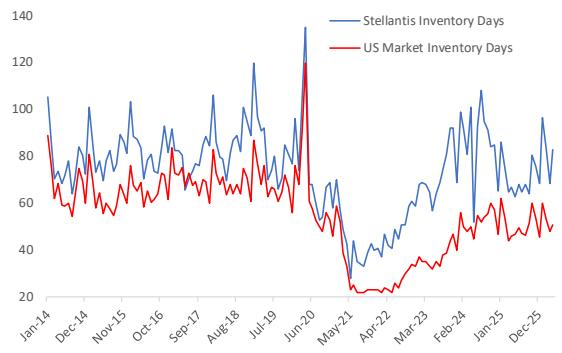

line

| Date    | Stellantis Inventory Days | US Market Inventory Days |
|---------|---------------------------|--------------------------|
| Jan-14  | ~105                      | ~90                      |
| Dec-14  | ~80                       | ~70                      |
| Nov-15  | ~100                      | ~65                      |
| Oct-16  | ~95                       | ~75                      |
| Sep-17  | ~85                       | ~70                      |
| Aug-18  | ~100                      | ~75                      |
| Jul-19  | ~120                      | ~80                      |
| Jun-20  | ~135                      | ~120                     |
| May-21  | ~60                       | ~20                      |
| Apr-22  | ~40                       | ~25                      |
| Mar-23  | ~60                       | ~30                      |
| Feb-24  | ~90                       | ~50                      |
| Jan-25  | ~110                      | ~60                      |
| Dec-25  | ~80                       | ~50                      |

Incentives (USD/unit)   
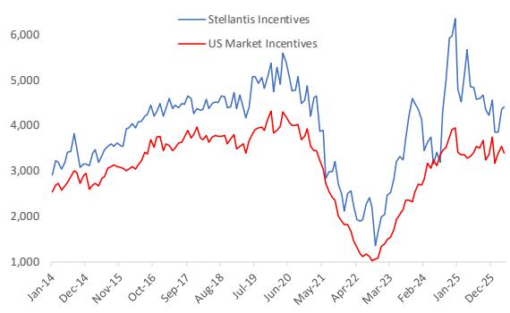

line

| Date   | Stellantis Incentives | US Market Incentives |
|--------|------------------------|----------------------|
| Jan-14 | ~3,000                 | ~2,800               |
| Dec-14 | ~3,500                 | ~3,000               |
| Nov-15 | ~3,800                 | ~3,200               |
| Oct-16 | ~4,000                 | ~3,500               |
| Sep-17 | ~4,200                 | ~3,700               |
| Aug-18 | ~4,500                 | ~3,900               |
| Jul-19 | ~4,800                 | ~4,100               |
| Jun-20 | ~5,200                 | ~4,300               |
| May-21 | ~4,500                 | ~3,500               |
| Apr-22 | ~2,500                 | ~1,500               |
| Mar-23 | ~1,500                 | ~1,200               |
| Feb-24 | ~3,500                 | ~3,000               |
| Jan-25 | ~6,500                 | ~3,800               |
| Dec-25 | ~4,500                 | ~3,500               |

Market share   
BMW & MBG   
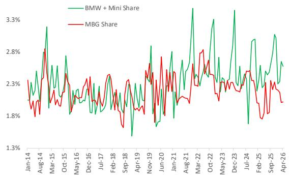

line

| Month    | BMW + Mini Share | MBG Share |
|----------|------------------|-----------|
| Jan-14   | 2.3%             | 2.3%      |
| Aug-14   | 2.8%             | 2.8%      |
| Mar-15   | 2.3%             | 2.3%      |
| Oct-15   | 2.8%             | 2.8%      |
| May-16   | 2.3%             | 2.3%      |
| Dec-16   | 2.3%             | 2.3%      |
| Jul-17   | 2.3%             | 2.3%      |
| Feb-18   | 2.3%             | 2.3%      |
| Sep-18   | 2.3%             | 2.3%      |
| Apr-19   | 2.3%             | 2.3%      |
| Nov-19   | 2.8%             | 2.8%      |
| Jun-20   | 2.3%             | 2.3%      |
| Jan-21   | 2.8%             | 2.8%      |
| Aug-21   | 3.3%             | 2.8%      |
| Mar-22   | 2.8%             | 2.8%      |
| Oct-22   | 2.8%             | 2.8%      |
| May-23   | 2.8%             | 2.8%      |
| Dec-23   | 3.3%             | 2.8%      |
| Jul-24   | 2.8%             | 2.8%      |
| Feb-25   | 2.8%             | 2.8%      |
| Sep-25   | 2.8%             | 2.8%      |
| Apr-26   | 2.8%             | 2.8%      |

Inventory Days   
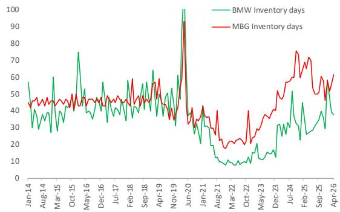

line

| Month    | BMW Inventory days | MBG Inventory days |
| -------- | ------------------ | ------------------ |
| Jan-14   | 55                 | 45                 |
| Aug-14   | 40                 | 45                 |
| Mar-15   | 60                 | 45                 |
| Oct-15   | 75                 | 45                 |
| May-16   | 40                 | 45                 |
| Dec-16   | 45                 | 45                 |
| Jul-17   | 50                 | 45                 |
| Feb-18   | 55                 | 45                 |
| Sep-18   | 60                 | 45                 |
| Apr-19   | 50                 | 45                 |
| Nov-19   | 60                 | 45                 |
| Jun-20   | 95                 | 90                 |
| Jan-21   | 30                 | 35                 |
| Aug-21   | 10                 | 20                 |
| Mar-22   | 10                 | 20                 |
| Oct-22   | 15                 | 30                 |
| May-23   | 20                 | 35                 |
| Dec-23   | 30                 | 40                 |
| Jul-24   | 40                 | 50                 |
| Feb-25   | 50                 | 60                 |
| Sep-25   | 40                 | 55                 |
| Apr-26   | 35                 | 60                 |

BMW & MBG   
BMW & MBG

Incentives (USD/unit)   
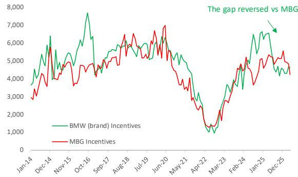

line

| Date    | BMW (brand) Incentives | MBG Incentives |
|---------|--------------------------|----------------|
| Jan-14  | ~3,500                   | ~3,000         |
| Dec-14  | ~6,000                   | ~4,500         |
| Nov-15  | ~5,500                   | ~4,000         |
| Oct-16  | ~7,500                   | ~4,500         |
| Sep-17  | ~5,500                   | ~5,000         |
| Aug-18  | ~6,000                   | ~5,500         |
| Jul-19  | ~6,500                   | ~6,000         |
| Jun-20  | ~7,000                   | ~6,500         |
| May-21  | ~5,500                   | ~5,000         |
| Apr-22  | ~1,500                   | ~1,000         |
| Mar-23  | ~3,000                   | ~2,500         |
| Feb-24  | ~4,500                   | ~4,000         |
| Jan-25  | ~6,500                   | ~5,500         |
| Dec-25  | ~7,000                   | ~5,000         |

BMW & MBG

US April Sales: all EU OEMs share up (4 May 2026)

# 4 – Company Specific: product pipeline

2024-25: Renault/BMW (+) and Porsche (-). 2026 is about MBG/BMW/VW (+) and Porsche (-)   
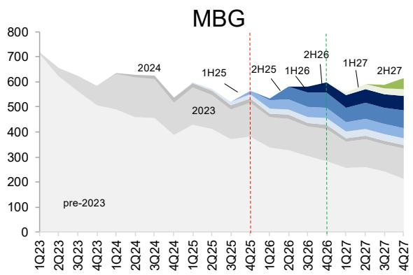

line

| Quarter | Value |
| ------- | ----- |
| 1Q23    | 700   |
| 2Q23    | 650   |
| 3Q23    | 600   |
| 4Q23    | 550   |
| 1Q24    | 500   |
| 2Q24    | 450   |
| 3Q24    | 400   |
| 4Q24    | 350   |
| 1Q25    | 300   |
| 2Q25    | 250   |
| 3Q25    | 200   |
| 4Q25    | 150   |
| 1Q26    | 100   |
| 2Q26    | 50    |
| 3Q26    | 0     |
| 4Q26    | -50   |
| 1Q27    | -100  |
| 2Q27    | -150  |
| 3Q27    | -200  |
| 4Q27    | -250  |

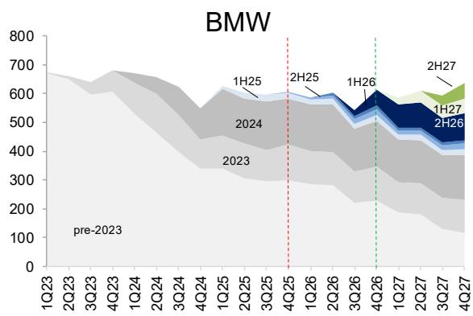

area

| Quarter | Value |
| ------- | ----- |
| 1Q23    | ~680  |
| 2Q23    | ~650  |
| 3Q23    | ~670  |
| 4Q23    | ~690  |
| 1Q24    | ~660  |
| 2Q24    | ~630  |
| 3Q24    | ~580  |
| 4Q24    | ~500  |
| 1Q25    | ~450  |
| 2Q25    | ~400  |
| 3Q25    | ~350  |
| 4Q25    | ~300  |
| 1Q26    | ~350  |
| 2Q26    | ~400  |
| 3Q26    | ~450  |
| 4Q26    | ~500  |
| 1Q27    | ~550  |
| 2Q27    | ~600  |
| 3Q27    | ~650  |
| 4Q27    | ~700  |

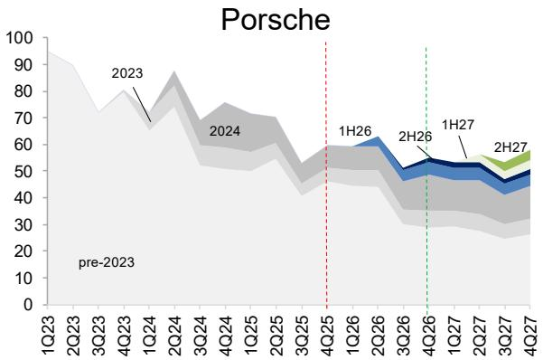

line

| Quarter | Value |
| ------- | ----- |
| 1Q23    | 90    |
| 2Q23    | 85    |
| 3Q23    | 75    |
| 4Q23    | 80    |
| 1Q24    | 70    |
| 2Q24    | 85    |
| 3Q24    | 75    |
| 4Q24    | 70    |
| 1Q25    | 65    |
| 2Q25    | 60    |
| 3Q25    | 55    |
| 4Q25    | 50    |
| 1Q26    | 60    |
| 2Q26    | 65    |
| 3Q26    | 55    |
| 4Q26    | 50    |
| 1Q27    | 55    |
| 2Q27    | 50    |
| 3Q27    | 45    |
| 4Q27    | 40    |

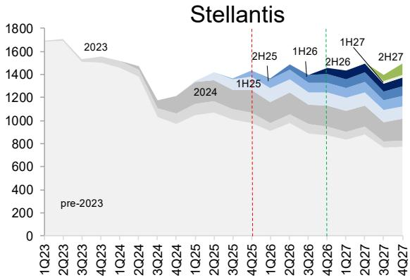

area

| Quarter | Value |
| ------- | ----- |
| 1Q23    | 1700  |
| 2Q23    | 1650  |
| 3Q23    | 1600  |
| 4Q23    | 1550  |
| 1Q24    | 1500  |
| 2Q24    | 1450  |
| 3Q24    | 1400  |
| 4Q24    | 1350  |
| 1Q25    | 1300  |
| 2Q25    | 1250  |
| 3Q25    | 1200  |
| 4Q25    | 1150  |
| 1Q26    | 1100  |
| 2Q26    | 1050  |
| 3Q26    | 1000  |
| 4Q26    | 950   |
| 1Q27    | 900   |
| 2Q27    | 850   |
| 3Q27    | 800   |
| 4Q27    | 750   |

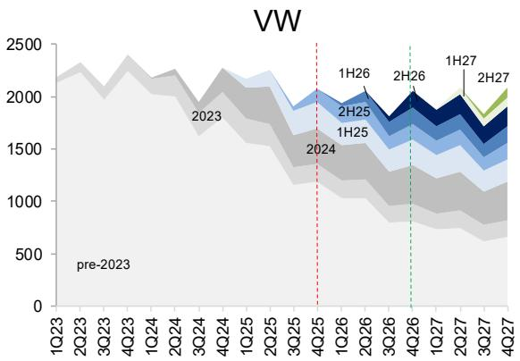

line

| Quarter | Value |
| ------- | ----- |
| 1Q23    | ~2200 |
| 2Q23    | ~2300 |
| 3Q23    | ~2100 |
| 4Q23    | ~2400 |
| 1Q24    | ~2300 |
| 2Q24    | ~2200 |
| 3Q24    | ~1800 |
| 4Q24    | ~2300 |
| 1Q25    | ~2100 |
| 2Q25    | ~1900 |
| 3Q25    | ~1700 |
| 4Q25    | ~1500 |
| 1Q26    | ~1800 |
| 2Q26    | ~2000 |
| 3Q26    | ~1700 |
| 4Q26    | ~1500 |
| 1Q27    | ~1800 |
| 2Q27    | ~2100 |
| 3Q27    | ~1900 |
| 4Q27    | ~1800 |

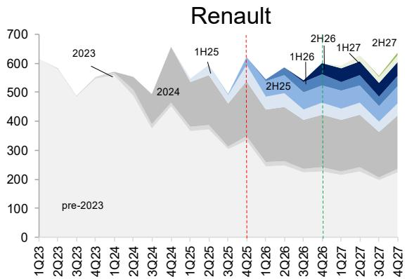

line

| Quarter | Value |
| ------- | ----- |
| 1Q23    | 600   |
| 2Q23    | 550   |
| 3Q23    | 500   |
| 4Q23    | 550   |
| 1Q24    | 500   |
| 2Q24    | 450   |
| 3Q24    | 400   |
| 4Q24    | 650   |
| 1Q25    | 550   |
| 2Q25    | 500   |
| 3Q25    | 450   |
| 4Q25    | 600   |
| 1Q26    | 550   |
| 2Q26    | 500   |
| 3Q26    | 450   |
| 4Q26    | 600   |
| 1Q27    | 550   |
| 2Q27    | 500   |
| 3Q27    | 450   |
| 4Q27    | 600   |

# Autos & Shared Mobility: Global Product Pipeline: Peaking in 2026

# 4 – Company Specific: product pipeline

China OEMs still lead the product launch race   
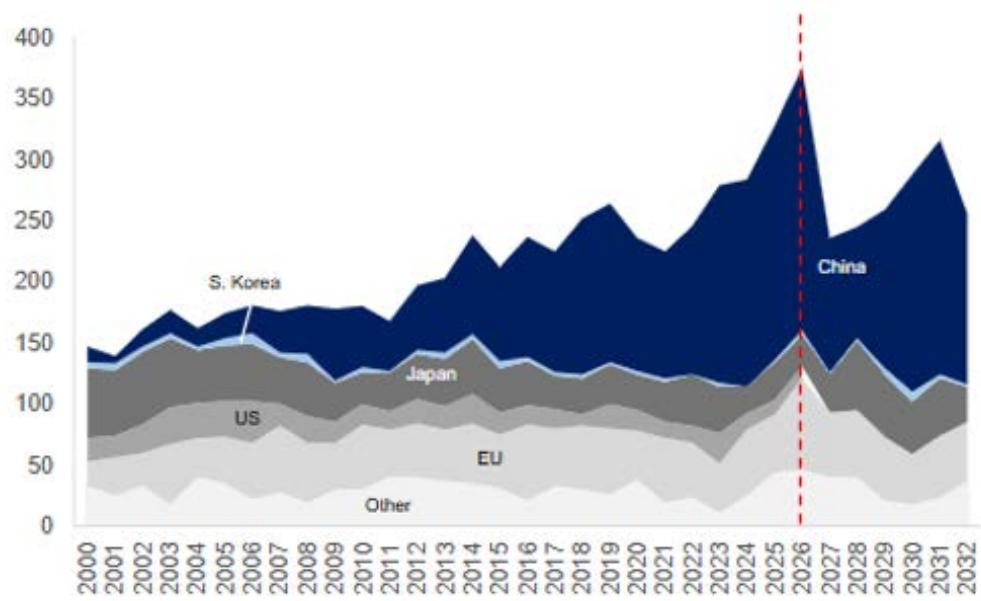  
Autos & Shared Mobility: Global Product Pipeline: Peaking in 2026

# 4 – Company Specific: Geographical Exposure

European OEMs   
Geographical sales mix   
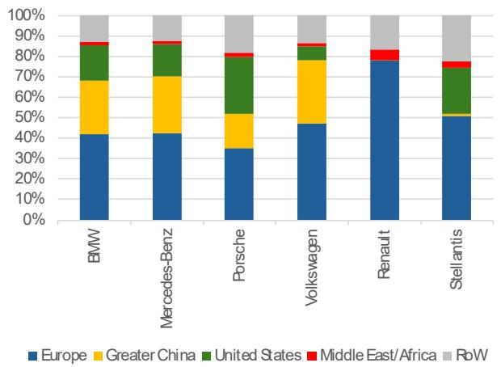

bar_stacked

| Manufacturer | Europe (%) | Greater China (%) | United States (%) | Middle East/Africa (%) | RoW (%) |
|---|---|---|---|---|---|
| BMW | 41 | 23 | 17 | 1 | 9 |
| Mercedes-Benz | 42 | 25 | 14 | 1 | 8 |
| Porsche | 34 | 16 | 25 | 2 | 17 |
| Volkswagen | 46 | 28 | 5 | 1 | 9 |
| Renault | 78 | 0 | 0 | 5 | 13 |
| Stellantis | 50 | 2 | 18 | 3 | 16 |

Europe   
% of global sales   
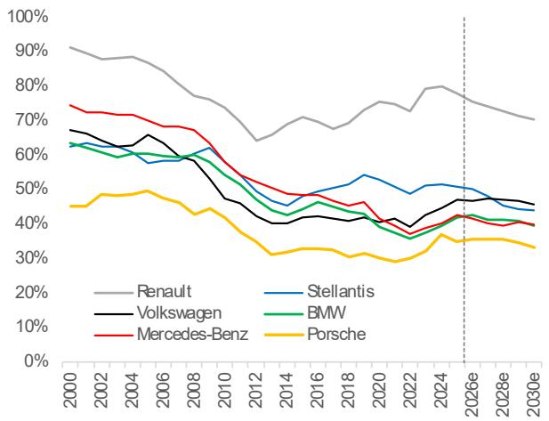

line

| Year   | Renault | Stellantis | Volkswagen | BMW  | Mercedes-Benz | Porsche |
|--------|---------|------------|------------|------|---------------|---------|
| 2000   | 90%     | 65%        | 68%        | 63%  | 73%           | 45%     |
| 2002   | 88%     | 63%        | 65%        | 61%  | 71%           | 47%     |
| 2004   | 86%     | 61%        | 63%        | 59%  | 69%           | 48%     |
| 2006   | 84%     | 59%        | 61%        | 57%  | 67%           | 49%     |
| 2008   | 82%     | 57%        | 59%        | 55%  | 65%           | 47%     |
| 2010   | 80%     | 55%        | 57%        | 53%  | 63%           | 45%     |
| 2012   | 78%     | 53%        | 55%        | 51%  | 61%           | 43%     |
| 2014   | 76%     | 51%        | 53%        | 49%  | 59%           | 41%     |
| 2016   | 74%     | 49%        | 51%        | 47%  | 57%           | 39%     |
| 2018   | 72%     | 47%        | 49%        | 45%  | 55%           | 37%     |
| 2020   | 70%     | 45%        | 47%        | 43%  | 53%           | 35%     |
| 2022   | 68%     | 43%        | 45%        | 41%  | 51%           | 33%     |
| 2024e  | 66%     | 41%        | 43%        | 39%  | 49%           | 31%     |
| 2026e  | 64%     | 39%        | 41%        | 37%  | 47%           | 29%     |
| 2028e  | 62%     | 37%        | 39%        | 35%  | 45%           | 27%     |
| 2030e  | 60%     | 35%        | 37%        | 33%  | 43%           | 25%     |

Greater China   
% of global sales   
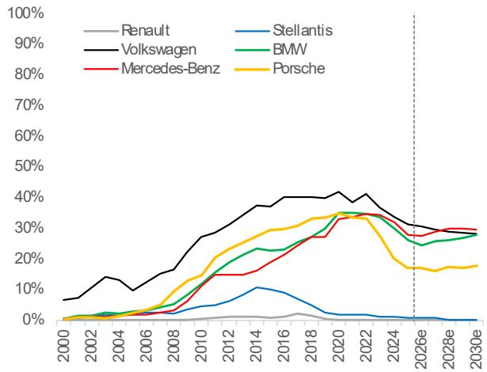

line

| Year   | Renault | Stellantis | Volkswagen | BMW  | Mercedes-Benz | Porsche |
|--------|---------|------------|------------|------|---------------|---------|
| 2000   | 0%      | 0%         | 5%         | 0%   | 0%            | 0%      |
| 2002   | 0%      | 0%         | 15%        | 0%   | 0%            | 0%      |
| 2004   | 0%      | 0%         | 10%        | 0%   | 0%            | 0%      |
| 2006   | 0%      | 0%         | 15%        | 5%   | 5%            | 5%      |
| 2008   | 0%      | 0%         | 25%        | 15%  | 15%           | 15%     |
| 2010   | 0%      | 5%         | 35%        | 25%  | 25%           | 25%     |
| 2012   | 0%      | 10%        | 40%        | 30%  | 30%           | 30%     |
| 2014   | 0%      | 15%        | 45%        | 35%  | 35%           | 35%     |
| 2016   | 0%      | 10%        | 45%        | 35%  | 35%           | 35%     |
| 2018   | 0%      | 5%         | 45%        | 35%  | 35%           | 35%     |
| 2020   | 0%      | 0%         | 45%        | 35%  | 35%           | 35%     |
| 2022   | 0%      | 0%         | 45%        | 35%  | 35%           | 35%     |
| 2024   | 0%      | 0%         | 35%        | 30%  | 30%           | 15%     |
| 2026e  | 0%      | 0%         | 30%        | 25%  | 30%           | 15%     |
| 2028e  | 0%      | 0%         | 30%        | 25%  | 30%           | 15%     |
| 2030e  | 0%      | 0%         | 30%        | 25%  | 30%           | 15%     |

RoW (ex Middle East & Africa)   
% of global sales   
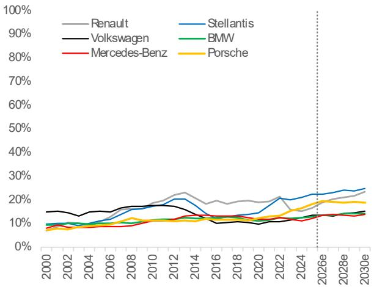

line

| Year   | Renault | Stellantis | Volkswagen | BMW  | Mercedes-Benz | Porsche |
|--------|---------|------------|------------|------|---------------|---------|
| 2000   | ~10%    | ~10%       | ~15%       | ~10% | ~10%          | ~10%    |
| 2002   | ~10%    | ~10%       | ~15%       | ~10% | ~10%          | ~10%    |
| 2004   | ~10%    | ~10%       | ~15%       | ~10% | ~10%          | ~10%    |
| 2006   | ~10%    | ~15%       | ~15%       | ~10% | ~10%          | ~10%    |
| 2008   | ~15%    | ~15%       | ~15%       | ~10% | ~10%          | ~15%    |
| 2010   | ~15%    | ~15%       | ~15%       | ~10% | ~10%          | ~15%    |
| 2012   | ~20%    | ~20%       | ~15%       | ~10% | ~10%          | ~15%    |
| 2014   | ~25%    | ~25%       | ~15%       | ~10% | ~10%          | ~15%    |
| 2016   | ~20%    | ~20%       | ~10%       | ~10% | ~10%          | ~15%    |
| 2018   | ~20%    | ~20%       | ~10%       | ~10% | ~10%          | ~15%    |
| 2020   | ~20%    | ~25%       | ~10%       | ~10% | ~10%          | ~15%    |
| 2022   | ~25%    | ~25%       | ~15%       | ~15% | ~15%          | ~20%    |
| 2024e  | ~25%    | ~25%       | ~15%       | ~15% | ~15%          | ~25%    |
| 2028e  | ~25%    | ~25%       | ~15%       | ~15% | ~15%          | ~25%    |
| 2030e  | ~25%    | ~25%       | ~15%       | ~15% | ~15%          | ~25%    |

Source: S&P Global, MS estimates

# 4 – Company Specific: Tariffs exposure

# Mexico and EU tariffs matter for European OEMs

US sales (split by region of production, %)   
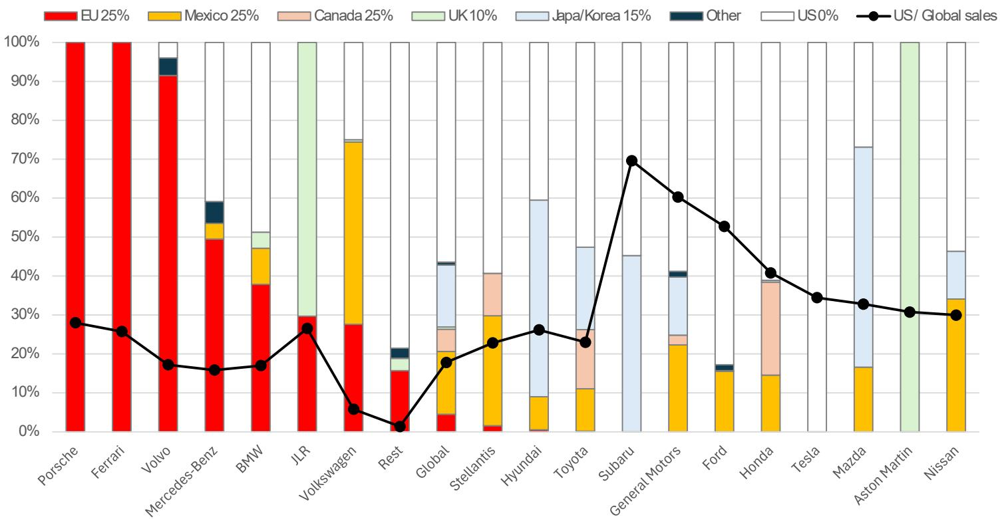  
Autos & Shared Mobility: EU-US Trade Deal: back to 25% Auto Tariffs? (5 May 2026)

# 5 – How to play it? MS vs Consensus: premium vs volume OEMs

Cars Adj. EBIT Margin (% / Net Revenue)   
MBG   
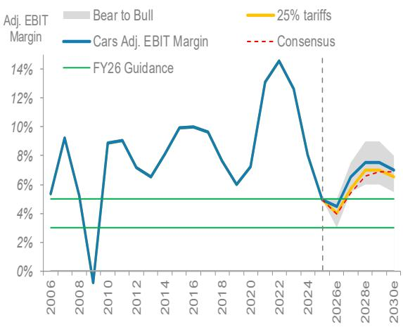

line

| Year   | Bear to Bull | Cars Adj. EBIT Margin | 25% tariffs | Consensus | FY26 Guidance |
|--------|-------------|------------------------|-----------|---------|---------------|
| 2006   | -           | -                      | -         | -       | 5%            |
| 2008   | -           | -                      | -         | -       | 9%            |
| 2010   | -           | -                      | -         | -       | 9%            |
| 2012   | -           | -                      | -         | -       | 7%            |
| 2014   | -           | -                      | -         | -       | 10%           |
| 2016   | -           | -                      | -         | -       | 10%           |
| 2018   | -           | -                      | -         | -       | 9%            |
| 2020   | -           | -                      | -         | -       | 6%            |
| 2022   | -           | 14%                    | -         | -       | 14%           |
| 2024   | -           | 8%                     | -         | -       | 5%            |
| 2026e  | 4%          | 5%                     | 4%        | 5%      | 5%            |
| 2028e  | 7%          | 7%                     | 7%        | 7%      | 7%            |
| 2030e  | 7%          | 7%                     | 7%        | 7%      | 7%            |

Cars Adj. EBIT Margin (% / Net Revenue)   
BMW   
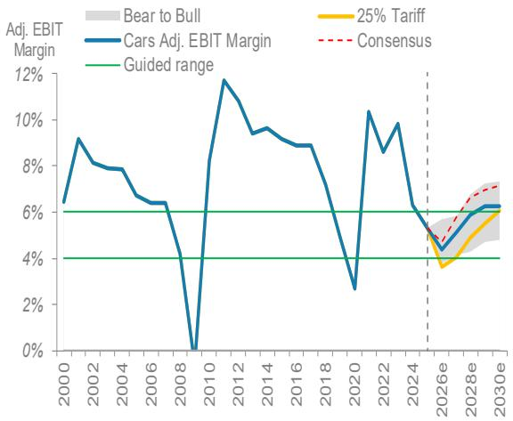

line

| Year   | Bear to Bull | Cars Adj. EBIT Margin | Guided range |
|--------|-------------|------------------------|--------------|
| 2000   | ~6%         | ~9%                    | 6%           |
| 2002   | ~7%         | ~8%                    | 6%           |
| 2004   | ~6%         | ~7%                    | 6%           |
| 2006   | ~6%         | ~6%                    | 6%           |
| 2008   | ~4%         | ~0%                    | 6%           |
| 2010   | ~12%        | ~12%                   | 6%           |
| 2012   | ~10%        | ~11%                   | 6%           |
| 2014   | ~9%         | ~9%                    | 6%           |
| 2016   | ~8%         | ~8%                    | 6%           |
| 2018   | ~7%         | ~7%                    | 6%           |
| 2020   | ~3%         | ~3%                    | 6%           |
| 2022   | ~10%        | ~10%                   | 6%           |
| 2024   | ~6%         | ~6%                    | 6%           |
| 2026e  | ~5%         | ~5%                    | 6%           |
| 2028e  | ~6%         | ~6%                    | 6%           |
| 2030e  | ~7%         | ~7%                    | 6%           |

Group EBIT Margin (% / Net Revenue)   
Porsche   
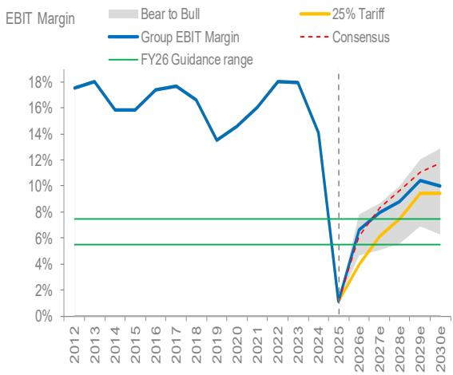

line

| Year   | Group EBIT Margin | 25% Tariff | Consensus | FY26 Guidance range |
|--------|-------------------|------------|-----------|---------------------|
| 2012   | 17.5%             | -          | -         | 7.5%                |
| 2013   | 18.0%             | -          | -         | 7.5%                |
| 2014   | 16.0%             | -          | -         | 7.5%                |
| 2015   | 16.0%             | -          | -         | 7.5%                |
| 2016   | 17.0%             | -          | -         | 7.5%                |
| 2017   | 17.5%             | -          | -         | 7.5%                |
| 2018   | 16.5%             | -          | -         | 7.5%                |
| 2019   | 13.5%             | -          | -         | 7.5%                |
| 2020   | 14.5%             | -          | -         | 7.5%                |
| 2021   | 16.0%             | -          | -         | 7.5%                |
| 2022   | 18.0%             | -          | -         | 7.5%                |
| 2023   | 18.0%             | -          | -         | 7.5%                |
| 2024   | 14.0%             | -          | -         | 7.5%                |
| 2025   | 1.0%              | 1.0%       | 1.0%      | 7.5%                |
| 2026e  | 6.5%              | 6.0%       | 7.0%      | 7.5%                |
| 2027e  | 8.0%              | 7.5%       | 8.5%      | 7.5%                |
| 2028e  | 9.0%              | 8.5%       | 9.5%      | 7.5%                |
| 2029e  | 10.0%             | 9.5%       | 10.5%     | 7.5%                |
| 2030e  | 9.5%              | 9.5%       | 11.0%     | 7.5%                |

Adj. EBIT (€ mn)   
Stellantis   
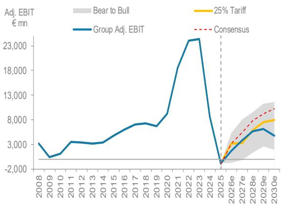

line

| Year   | Group Adj. EBIT (€ mn) | Bear to Bull (€ mn) | 25% Tariff (€ mn) | Consensus (€ mn) |
|--------|------------------------|--------------------|-------------------|------------------|
| 2008   | ~3,000                 | -                  | -                 | -                |
| 2009   | ~1,500                 | -                  | -                 | -                |
| 2010   | ~2,500                 | -                  | -                 | -                |
| 2011   | ~3,000                 | -                  | -                 | -                |
| 2012   | ~3,000                 | -                  | -                 | -                |
| 2013   | ~3,000                 | -                  | -                 | -                |
| 2014   | ~3,500                 | -                  | -                 | -                |
| 2015   | ~4,000                 | -                  | -                 | -                |
| 2016   | ~5,000                 | -                  | -                 | -                |
| 2017   | ~6,000                 | -                  | -                 | -                |
| 2018   | ~7,500                 | -                  | -                 | -                |
| 2019   | ~7,500                 | -                  | -                 | -                |
| 2020   | ~10,000                | -                  | -                 | -                |
| 2021   | ~18,000                | -                  | -                 | -                |
| 2022   | ~23,000                | -                  | -                 | -                |
| 2023   | ~23,500                | -                  | -                 | -                |
| 2024   | ~8,000                 | -                  | -                 | -                |
| 2025e  | ~-1,500                | ~-1,500            | ~-1,500           | ~-1,500          |
| 2026e  | ~-1,500                | ~-1,500            | ~-1,500           | ~-1,500          |
| 2027e  | ~-1,500                | ~-1,500            | ~-1,500           | ~-1,500          |
| 2028e  | ~-1,500                | ~-1,500            | ~-1,500           | ~-1,500          |
| 2029e  | ~-1,500                | ~-1,500            | ~-1,500           | ~-1,500          |
| 2030e  | ~-1,500                | ~-1,500            | ~-1,500           | ~-1,500          |

Adj. EBIT Margin (% / Net Revenue)   
VW   
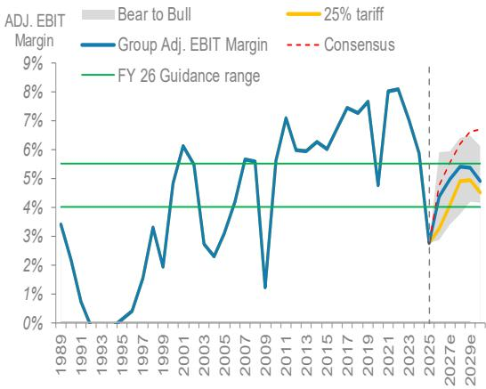

Operating Margin (Co. % / Net Revenue)   
Renault   
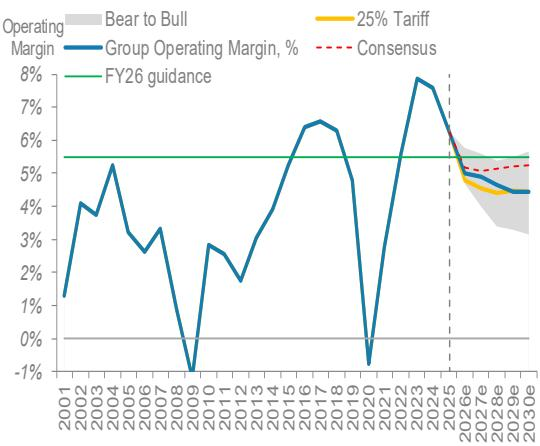

# 5 – How to play it? OEMs vs APs and Tyres

European Auto Segments   
PE   
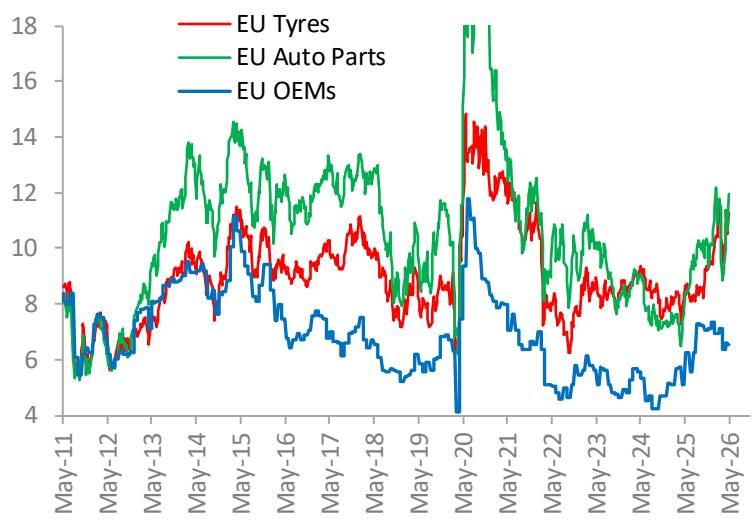

line

| Date   | EU Tyres | EU Auto Parts | EU OEMs |
|--------|----------|---------------|---------|
| May-11 | 8.5      | 7.0           | 8.0     |
| May-12 | 7.5      | 6.5           | 7.0     |
| May-13 | 8.0      | 7.5           | 7.5     |
| May-14 | 9.0      | 10.0          | 8.5     |
| May-15 | 10.0     | 14.0          | 9.5     |
| May-16 | 9.5      | 13.0          | 8.0     |
| May-17 | 10.0     | 13.5          | 7.5     |
| May-18 | 9.5      | 13.0          | 7.0     |
| May-19 | 8.5      | 12.0          | 6.5     |
| May-20 | 6.0      | 18.0          | 4.0     |
| May-21 | 14.0     | 17.0          | 12.0    |
| May-22 | 10.0     | 12.0          | 8.0     |
| May-23 | 9.0      | 11.0          | 6.0     |
| May-24 | 8.5      | 10.0          | 5.5     |
| May-25 | 9.0      | 11.0          | 6.5     |
| May-26 | 10.0     | 12.0          | 7.0     |

European Auto Segments   
PE   
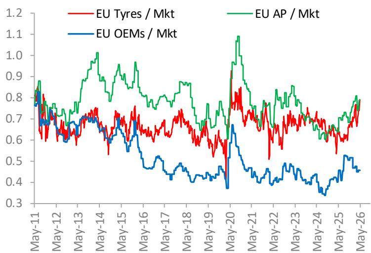

line

| Date   | EU Tyres / Mkt | EU OEMs / Mkt | EU AP / Mkt |
|--------|----------------|---------------|-------------|
| May-11 | 0.8            | 0.7           | 0.9         |
| May-12 | 0.7            | 0.65          | 0.8         |
| May-13 | 0.75           | 0.7           | 0.9         |
| May-14 | 0.7            | 0.65          | 1.0         |
| May-15 | 0.75           | 0.6           | 0.9         |
| May-16 | 0.7            | 0.55          | 0.8         |
| May-17 | 0.75           | 0.5           | 0.85        |
| May-18 | 0.7            | 0.45          | 0.8         |
| May-19 | 0.65           | 0.4           | 0.75        |
| May-20 | 0.8            | 0.35          | 1.1         |
| May-21 | 0.7            | 0.4           | 0.8         |
| May-22 | 0.75           | 0.45          | 0.85        |
| May-23 | 0.7            | 0.4           | 0.8         |
| May-24 | 0.65           | 0.35          | 0.75        |
| May-25 | 0.7            | 0.4           | 0.8         |
| May-26 | 0.75           | 0.45          | 0.8         |

# 5 – How to play it? OEMs Valuation Summary

<table><tr><td rowspan="2">2026e</td><td></td><td colspan="7">Top Pick</td></tr><tr><td></td><td>BMW</td><td>Mercedes</td><td>Porsche</td><td>Volkswagen</td><td>Renault</td><td>Stellantis</td><td>OEMs</td></tr><tr><td>Current Price</td><td></td><td>81.3</td><td>51.9</td><td>44.0</td><td>88.2</td><td>27.9</td><td>5.8</td><td></td></tr><tr><td>Ind. EV / EBIT (MS)</td><td>2026e</td><td>-0.5x</td><td>3.9x</td><td>19.6x</td><td>4.5x</td><td>-5.3x</td><td>25.1x</td><td>7.5x</td></tr><tr><td>PE</td><td>2026e</td><td>7.8x</td><td>8.9x</td><td>26.1x</td><td>4.6x</td><td>4.8x</td><td>-12.6x</td><td>9.2x</td></tr><tr><td>Div Yield</td><td>2026e</td><td>4.5%</td><td>5.8%</td><td>1.9%</td><td>6.9%</td><td>5.6%</td><td>0.0%</td><td>4.5%</td></tr><tr><td>Div Yield + Share Buybacks</td><td>2026e</td><td>6.4%</td><td>8.2%</td><td>1.9%</td><td>6.9%</td><td>5.6%</td><td>0.0%</td><td>5.5%</td></tr><tr><td>PBV</td><td>2026e</td><td>0.5x</td><td>0.5x</td><td>1.7x</td><td>0.2x</td><td>0.3x</td><td>0.3x</td><td>0.7x</td></tr><tr><td>Mkt Cap / capex + net R&amp;D</td><td>2026e</td><td>3.3x</td><td>3.5x</td><td>7.8x</td><td>1.3x</td><td>1.7x</td><td>1.3x</td><td>3.6x</td></tr><tr><td>Price Target</td><td></td><td>96.0</td><td>65.0</td><td>37.0</td><td>100.0</td><td>29.0</td><td>6.5</td><td></td></tr><tr><td>Ind. EV / EBIT (MS)</td><td>2026e</td><td>0.5x</td><td>6.1x</td><td>16.8x</td><td>5.4x</td><td>-5.1x</td><td>26.2x</td><td>8.0x</td></tr><tr><td>PE</td><td>2026e</td><td>9.3x</td><td>11.2x</td><td>22.0x</td><td>5.2x</td><td>5.0x</td><td>-14.0x</td><td>9.2x</td></tr><tr><td>PBV</td><td>2026e</td><td>0.6x</td><td>0.6x</td><td>1.4x</td><td>0.3x</td><td>0.4x</td><td>0.4x</td><td>0.7x</td></tr><tr><td>Div Yield</td><td>2026e</td><td>3.8%</td><td>4.7%</td><td>2.2%</td><td>6.1%</td><td>5.4%</td><td>0.0%</td><td>3.9%</td></tr><tr><td>Div Yield + Share Buybacks</td><td>2026e</td><td>5.8%</td><td>7.0%</td><td>2.2%</td><td>6.1%</td><td>5.4%</td><td>0.0%</td><td>4.9%</td></tr><tr><td>Rating</td><td></td><td>OW</td><td>OW</td><td>UW</td><td>EW</td><td>UW</td><td>EW</td><td>In-Line</td></tr></table>

# 5 – How to play it? OEMs Valuation Summary

EU OEMs   
PE   
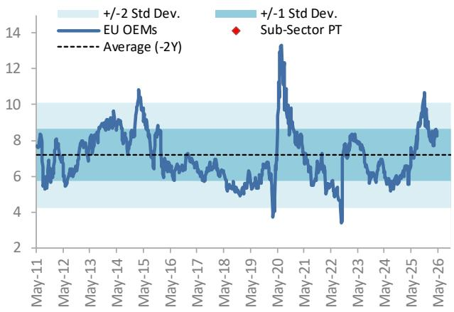

line

| Date   | EU OEMs | Sub-Sector PT |
|--------|---------|---------------|
| May-11 | 8       | -             |
| May-12 | 6       | -             |
| May-13 | 9       | -             |
| May-14 | 10      | -             |
| May-15 | 11      | -             |
| May-16 | 7       | -             |
| May-17 | 6       | -             |
| May-18 | 5       | -             |
| May-19 | 6       | -             |
| May-20 | 13      | -             |
| May-21 | 8       | -             |
| May-22 | 3       | -             |
| May-23 | 8       | -             |
| May-24 | 6       | -             |
| May-25 | 10      | -             |
| May-26 | 8       | -             |

EU OEMs   
EV / EBIT   
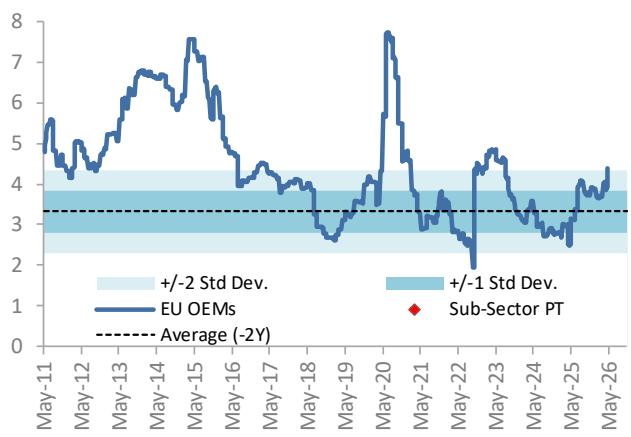

line

| Date   | EU OEMs | Average (-2Y) |
|--------|---------|---------------|
| May-11 | ~5.5    | 3.5           |
| May-12 | ~4.5    | 3.5           |
| May-13 | ~6.5    | 3.5           |
| May-14 | ~7.0    | 3.5           |
| May-15 | ~7.5    | 3.5           |
| May-16 | ~6.0    | 3.5           |
| May-17 | ~4.0    | 3.5           |
| May-18 | ~3.5    | 3.5           |
| May-19 | ~3.0    | 3.5           |
| May-20 | ~7.5    | 3.5           |
| May-21 | ~3.0    | 3.5           |
| May-22 | ~2.0    | 3.5           |
| May-23 | ~4.5    | 3.5           |
| May-24 | ~3.5    | 3.5           |
| May-25 | ~4.0    | 3.5           |
| May-26 | ~4.5    | 3.5           |

EU OEMs   
PBV   
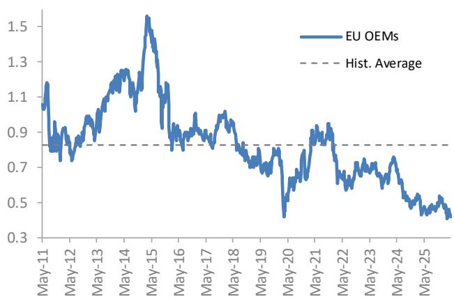

line

| Date   | EU OEMs |
|--------|---------|
| May-11 | 1.1     |
| May-12 | 0.9     |
| May-13 | 1.0     |
| May-14 | 1.2     |
| May-15 | 1.5     |
| May-16 | 0.9     |
| May-17 | 0.8     |
| May-18 | 0.9     |
| May-19 | 0.7     |
| May-20 | 0.4     |
| May-21 | 0.9     |
| May-22 | 0.7     |
| May-23 | 0.7     |
| May-24 | 0.5     |
| May-25 | 0.4     |

EU OEMs   
Dividend Yield   
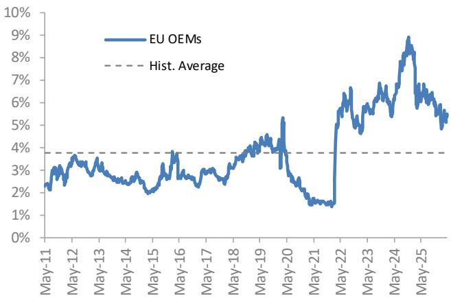

line

| Date   | EU OEMs |
|--------|---------|
| May-11 | 2.5%    |
| May-12 | 3.5%    |
| May-13 | 3.0%    |
| May-14 | 2.8%    |
| May-15 | 2.2%    |
| May-16 | 3.8%    |
| May-17 | 2.9%    |
| May-18 | 3.5%    |
| May-19 | 4.2%    |
| May-20 | 5.5%    |
| May-21 | 1.5%    |
| May-22 | 6.5%    |
| May-23 | 7.0%    |
| May-24 | 8.8%    |
| May-25 | 5.5%    |

# 5 – How to play it? Auto Parts & Tyres

EU Auto Parts   
PE   
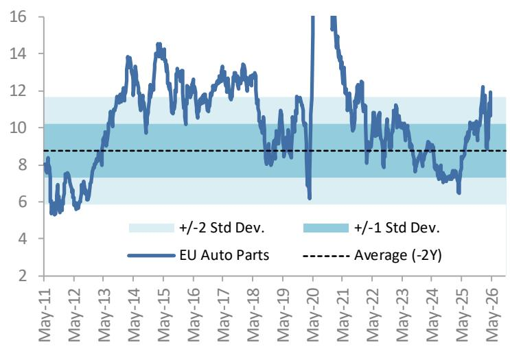

line

| Date   | EU Auto Parts | +/-1 Std Dev. | +/-2 Std Dev. |
|--------|---------------|---------------|---------------|
| May-11 | 8             | 10            | 11            |
| May-12 | 7             | 9             | 10            |
| May-13 | 8             | 10            | 11            |
| May-14 | 14            | 11            | 12            |
| May-15 | 15            | 12            | 13            |
| May-16 | 13            | 11            | 12            |
| May-17 | 13            | 10            | 11            |
| May-18 | 12            | 9             | 10            |
| May-19 | 10            | 8             | 9             |
| May-20 | 6             | 7             | 8             |
| May-21 | 16            | 10            | 11            |
| May-22 | 12            | 9             | 10            |
| May-23 | 10            | 8             | 9             |
| May-24 | 9             | 7             | 8             |
| May-25 | 7             | 6             | 7             |
| May-26 | 12            | 9             | 10            |

EU Tyres   
PE   
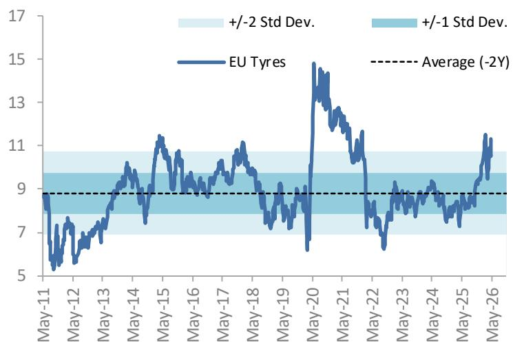

line

| Date   | EU Tyres |
|--------|----------|
| May-11 | 9.0      |
| May-12 | 6.0      |
| May-13 | 8.0      |
| May-14 | 9.5      |
| May-15 | 11.0     |
| May-16 | 9.0      |
| May-17 | 10.0     |
| May-18 | 11.0     |
| May-19 | 9.0      |
| May-20 | 15.0     |
| May-21 | 13.0     |
| May-22 | 7.0      |
| May-23 | 9.0      |
| May-24 | 9.5      |
| May-25 | 8.5      |
| May-26 | 11.0     |

# 5 – How to play it? Porsche

P911 benchmarking vs Luxury or Premium?   
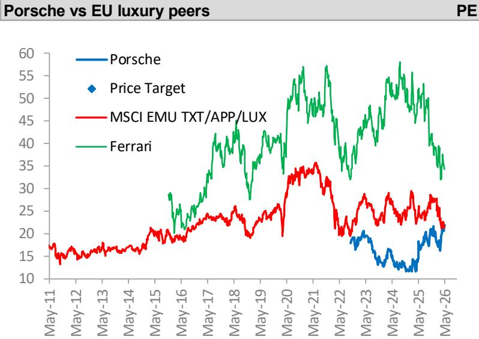

line

| Date   | Porsche | Price Target | MSCI EMU TXT/APP/LUX | Ferrari |
|--------|---------|--------------|----------------------|---------|
| May-11 |         |              | 17                   |         |
| May-12 |         |              | 16                   |         |
| May-13 |         |              | 17                   |         |
| May-14 |         |              | 18                   |         |
| May-15 |         |              | 20                   |         |
| May-16 |         |              | 22                   |         |
| May-17 |         |              | 24                   |         |
| May-18 |         |              | 26                   |         |
| May-19 |         |              | 28                   |         |
| May-20 |         |              | 30                   |         |
| May-21 |         |              | 32                   |         |
| May-22 |         |              | 34                   |         |
| May-23 |         |              | 36                   |         |
| May-24 |         |              | 38                   |         |
| May-25 |         |              | 40                   |         |
| May-26 |         |              | 42                   |         |

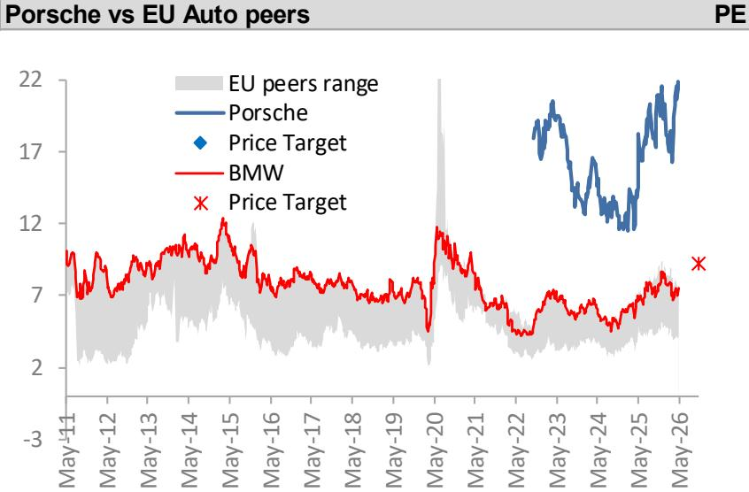

line

| Date   | Porsche | BMW  | Price Target |
|--------|---------|------|--------------|
| May-26 | 22      | 7    | 7            |

# 6 - Auto Parts & Tyres: Benchmarking Summary

REVENUE GROWTH (%)   
SUBSectors   
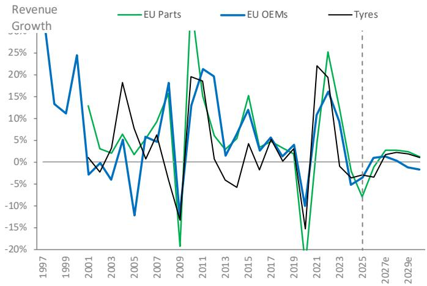

line

| Year | EU Parts | EU OEMs | Tyres |
|------|----------|---------|-------|
| 1997 | 28%      | 28%     | -     |
| 1999 | 12%      | 12%     | -     |
| 2001 | 13%      | 24%     | -     |
| 2003 | 6%       | -3%     | -     |
| 2005 | 3%       | -13%    | -     |
| 2007 | 15%      | 5%      | -     |
| 2009 | -20%     | -15%    | -     |
| 2011 | 28%      | 20%     | 19%   |
| 2013 | 5%       | 2%      | -5%   |
| 2015 | 15%      | 12%     | 4%    |
| 2017 | 4%       | 5%      | -3%   |
| 2019 | -20%     | -10%    | -15%  |
| 2021 | 25%      | 15%     | 22%   |
| 2023 | -5%      | -5%     | -3%   |
| 2025e| -8%     | -3%     | -3%   |
| 2027e| 3%      | 1%      | 1%    |
| 2029e| 3%      | -3%     | 1%    |

IND. CAPEX + TOTAL NET R&D / IND. REV.(%)   
SUBSectors   
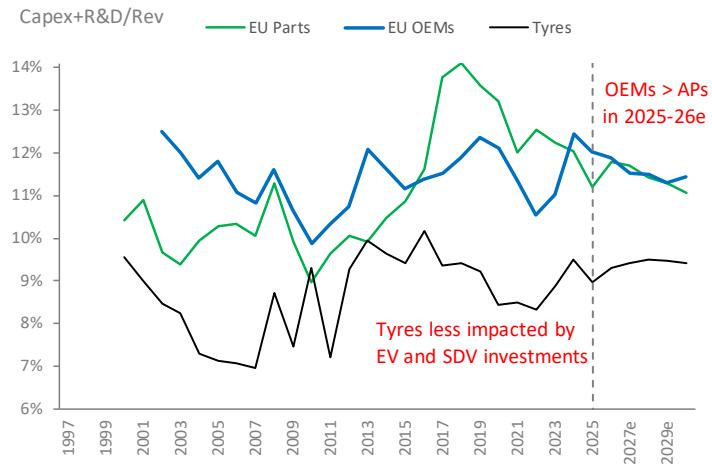

line

| Year | EU Parts | EU OEMs | Tyres |
|------|----------|---------|-------|
| 2025e | 11.5% | 12.5% | 9.5% |
| 2026e | 11.0% | 11.5% | 9.5% |

EBIT MARGIN (%, Co definition)   
SUBSectors   
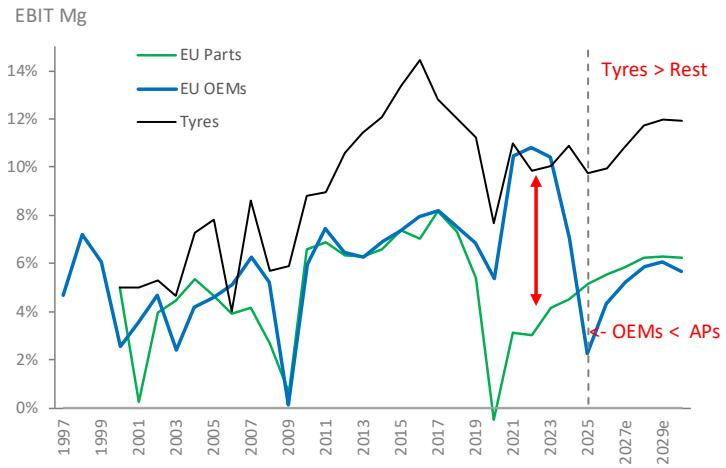

line

| Year | EU Parts | EU OEMs | Tyres |
|------|----------|---------|-------|
| 1997 | 0%       | 4%      | 0%    |
| 1999 | 0%       | 7%      | 0%    |
| 2001 | 0%       | 3%      | 5%    |
| 2003 | 5%       | 4%      | 5%    |
| 2005 | 5%       | 4%      | 8%    |
| 2007 | 4%       | 6%      | 8%    |
| 2009 | 0%       | 0%      | 6%    |
| 2011 | 6%       | 7%      | 9%    |
| 2013 | 6%       | 6%      | 11%   |
| 2015 | 7%       | 8%      | 13%   |
| 2017 | 8%       | 8%      | 14%   |
| 2019 | 6%       | 6%      | 11%   |
| 2021 | 3%       | 5%      | 8%    |
| 2023 | 4%       | 11%     | 10%   |
| 2025e| 5%       | 2%      | 10%   |
| 2027e| 6%       | 6%      | 12%   |
| 2029e| 6%       | 6%      | 12%   |

MS Ind. WORKING CAPITAL / IND. SALES (%)   
SUBSectors   
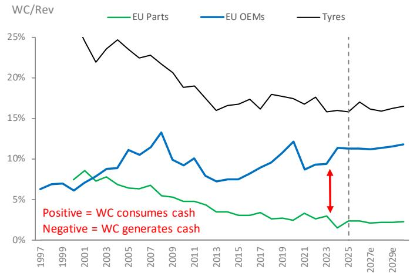

line

| Year | EU Parts | EU OEMs | Tyres |
|------|----------|---------|-------|
| 1997 | 6.5%     | 6.8%    | 25.0% |
| 1999 | 7.0%     | 7.2%    | 24.5% |
| 2001 | 8.0%     | 8.5%    | 23.0% |
| 2003 | 7.5%     | 9.0%    | 24.0% |
| 2005 | 7.0%     | 10.5%   | 23.5% |
| 2007 | 6.5%     | 11.0%   | 23.0% |
| 2009 | 6.0%     | 13.5%   | 22.0% |
| 2011 | 5.5%     | 10.0%   | 21.0% |
| 2013 | 5.0%     | 7.5%    | 19.0% |
| 2015 | 4.5%     | 7.8%    | 17.5% |
| 2017 | 4.0%     | 8.5%    | 18.0% |
| 2019 | 3.5%     | 10.0%   | 17.5% |
| 2021 | 3.0%     | 12.0%   | 17.0% |
| 2023 | 2.5%     | 9.0%    | 16.5% |
| 2025e| 2.0%     | 11.0%   | 16.0% |
| 2029e| 2.5%     | 11.5%   | 16.5% |

Positive = WC consumes cash

# 6 - Auto Parts & Tyres: Benchmarking Summary

NET PROFIT MARGIN (%)   
SUBSectors   
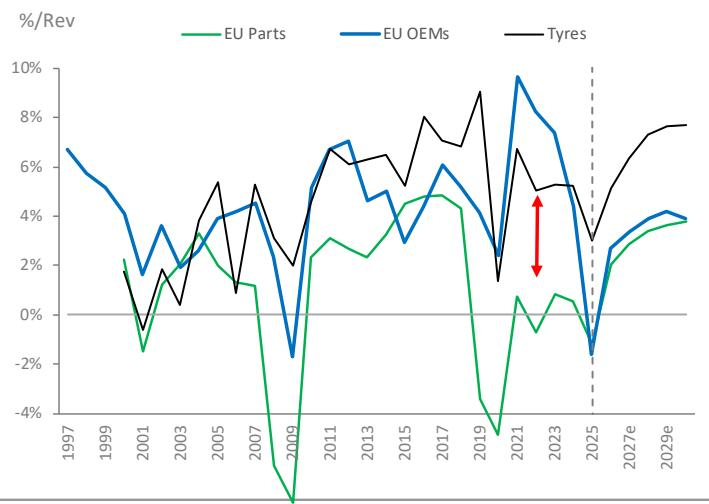

line

| Year | EU Parts | EU OEMs | Tyres |
|------|----------|---------|-------|
| 1997 |          |         |       |
| 1999 |          |         |       |
| 2001 |          |         |       |
| 2003 |          |         |       |
| 2005 |          |         |       |
| 2007 |          |         |       |
| 2009 |          |         |       |
| 2011 |          |         |       |
| 2013 |          |         |       |
| 2015 |          |         |       |
| 2017 |          |         |       |
| 2019 |          |         |       |
| 2021 |          |         |       |
| 2023 |          |         |       |
| 2025e|          |         |       |
| 2029e|          |         |       |

INDUSTRIAL ROA (%)   
SUBSectors   
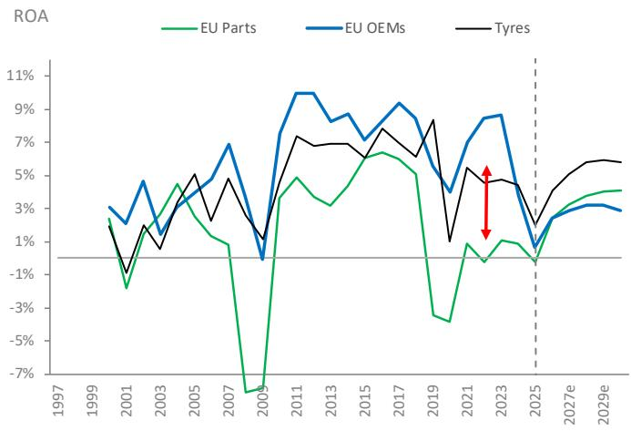

line

| Year | EU Parts | EU OEMs | Tyres |
|------|----------|---------|-------|
| 1997 | 2.5%     | 3.0%    | 2.8%  |
| 1999 | 1.5%     | 2.5%    | 2.0%  |
| 2001 | -2.0%    | 4.5%    | -1.5% |
| 2003 | 3.0%     | 1.5%    | 1.0%  |
| 2005 | 4.0%     | 5.0%    | 3.0%  |
| 2007 | 1.0%     | 7.0%    | 4.0%  |
| 2009 | -7.0%    | -1.0%   | -1.5% |
| 2011 | 5.0%     | 9.5%    | 7.0%  |
| 2013 | 3.0%     | 8.5%    | 6.5%  |
| 2015 | 6.0%     | 7.5%    | 6.0%  |
| 2017 | 5.5%     | 9.0%    | 7.5%  |
| 2019 | -4.0%    | 4.0%    | 8.0%  |
| 2021 | -1.0%    | 8.5%    | 5.0%  |
| 2023 | -1.5%    | 9.0%    | 4.5%  |
| 2025e| -1.0%   | 3.0%    | 3.5%  |
| 2029e| 4.0%    | 3.5%    | 6.0%  |

IND. NET DEBT / IND. EBITDA (As Reported, %)   
SUBSectors   
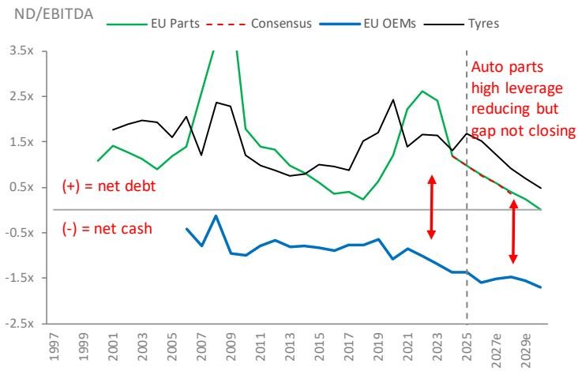

line

| Year | EU Parts | Consensus | EU OEMs | Tyres |
|------|----------|-----------|---------|-------|
| 1997 | 0.4x     | 0.4x      | 0.4x    | 0.4x  |
| 1999 | 0.6x     | 0.6x      | 0.6x    | 0.6x  |
| 2001 | 0.8x     | 0.8x      | 0.8x    | 0.8x  |
| 2003 | 1.0x     | 1.0x      | 1.0x    | 1.0x  |
| 2005 | 1.2x     | 1.2x      | 1.2x    | 1.2x  |
| 2007 | 1.4x     | 1.4x      | 1.4x    | 1.4x  |
| 2009 | 1.6x     | 1.6x      | 1.6x    | 1.6x  |
| 2011 | 1.8x     | 1.8x      | 1.8x    | 1.8x  |
| 2013 | 2.0x     | 2.0x      | 2.0x    | 2.0x  |
| 2015 | 2.2x     | 2.2x      | 2.2x    | 2.2x  |
| 2017 | 2.4x     | 2.4x      | 2.4x    | 2.4x  |
| 2019 | 2.6x     | 2.6x      | 2.6x    | 2.6x  |
| 2021 | 2.8x     | 2.8x      | 2.8x    | 2.8x  |
| 2023 | 3.0x     | 3.0x      | 3.0x    | 3.0x  |
| 2025e| -0.5x    | -0.5x     | -0.5x   | -0.5x |
| 2027e| -1.0x    | -1.0x     | -1.0x   | -1.0x |
| 2029e| -1.5x    | -1.5x     | -1.5x   | -1.5x |
| Post-2025e| -1.5x   | -1.5x     | -1.5x   | -1.5x |
| Auto parts high leverage reducing but gap not closing

# 6 - Auto Parts & Tyres: Global LVP falling in 2026, China has been gaining weight

Global LV Production (mn units)   
Annual   
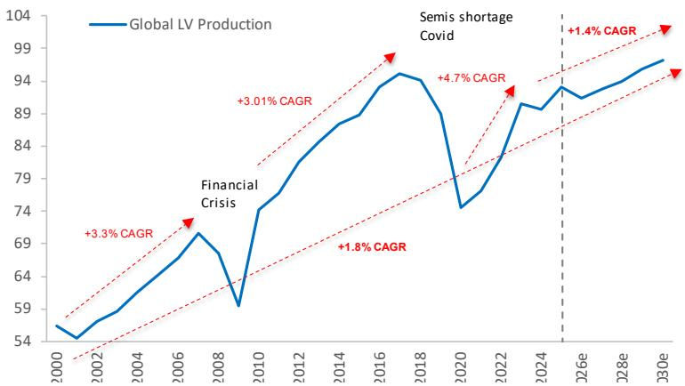

line

| Year | Global LV Production | CAGR   |
|------|----------------------|--------|
| 2000 | 55                   |        |
| 2002 | 58                   | +3.3%  |
| 2006 | 68                   |        |
| 2008 | 65                   |        |
| 2010 | 74                   | +3.01% |
| 2014 | 85                   |        |
| 2016 | 90                   |        |
| 2018 | 88                   |        |
| 2020 | 74                   | +4.7%  |
| 2022 | 85                   |        |
| 2024 | 90                   |        |
| 2026e| 93                   | +1.4%  |
| 2030e| 95                   |        |

Global LV Production by Region (mn units)   
Annual   
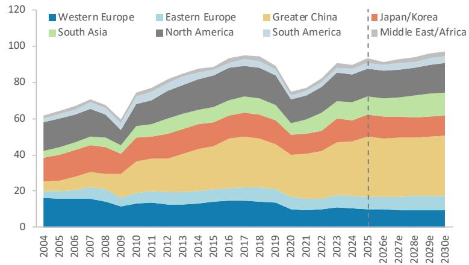

bar_stacked

| Year | Western Europe | Eastern Europe | Greater China | Japan/Korea | South Asia | North America | South America | Middle East/Africa |
|---|---|---|---|---|---|---|---|---|
| 2004 | 16 | 5 | 8 | 12 | 3 | 15 | 1 | 2 |
| 2005 | 16 | 5 | 9 | 13 | 3 | 15 | 1 | 2 |
| 2006 | 16 | 5 | 10 | 14 | 3 | 15 | 1 | 2 |
| 2007 | 16 | 5 | 11 | 15 | 3 | 15 | 1 | 2 |
| 2008 | 15 | 5 | 12 | 16 | 3 | 15 | 1 | 2 |
| 2009 | 12 | 5 | 13 | 17 | 3 | 15 | 1 | 2 |
| 2010 | 13 | 5 | 14 | 18 | 3 | 15 | 1 | 2 |
| 2011 | 13 | 5 | 15 | 19 | 3 | 15 | 1 | 2 |
| 2012 | 13 | 5 | 16 | 20 | 3 | 15 | 1 | 2 |
| 2013 | 13 | 5 | 17 | 21 | 3 | 15 | 1 | 2 |
| 2014 | 13 | 5 | 18 | 22 | 3 | 15 | 1 | 2 |
| 2015 | 14 | 5 | 19 | 23 | 3 | 15 | 1 | 2 |
| 2016 | 14 | 5 | 20 | 24 | 3 | 15 | 1 | 2 |
| 2017 | 14 | 5 | 21 | 25 | 3 | 15 | 1 | 2 |
| 2018 | 14 | 5 | 20 | 24 | 3 | 15 | 1 | 2 |
| 2019 | 14 | 5 | 19 | 23 | 3 | 15 | 1 | 2 |
| 2020 | 10 | 5 | 18 | 22 | 3 | 15 | 1 | 2 |
| 2021 | 9 | 5 | 17 | 21 | 3 | 15 | 1 | 2 |
| 2022 | 9 | 5 | 18 | 22 | 3 | 15 | 1 | 2 |
| 2023 | 9 | 5 | 19 | 23 | 3 | 15 | 1 | 2 |
| 2024e (projected) - Western Europe; Western Europe; Eastern Europe; Greater China; Japan/Korea; South Asia; North America; South America; Middle East/Africa; Middle East/Africa. Values are estimated based on the chart's title. The data is presented in a table format with years as columns and regions as categories. The values for the chart are estimated based on the table. The chart type is a stacked area chart.

<table><tr><td>YoY Growth</td><td>2022</td><td>2023</td><td>2024</td><td>2025</td></tr><tr><td>Region</td><td></td><td></td><td></td><td></td></tr><tr><td>Total Europe</td><td>-0.4%</td><td>13.5%</td><td>-4.4%</td><td>-0.7%</td></tr><tr><td>Western Europe</td><td>5.0%</td><td>13.2%</td><td>-8.2%</td><td>-2.0%</td></tr><tr><td>Eastern Europe</td><td>-8.2%</td><td>14.1%</td><td>1.8%</td><td>1.1%</td></tr><tr><td>Total Asia</td><td>8.2%</td><td>9.5%</td><td>0.1%</td><td>7.0%</td></tr><tr><td>Greater China</td><td>6.3%</td><td>10.0%</td><td>3.6%</td><td>10.0%</td></tr><tr><td>China</td><td>6.4%</td><td>10.0%</td><td>3.7%</td><td>10.2%</td></tr><tr><td>Japan/Korea</td><td>2.4%</td><td>15.0%</td><td>-6.4%</td><td>0.8%</td></tr><tr><td>South Asia</td><td>22.0%</td><td>1.7%</td><td>-1.9%</td><td>5.3%</td></tr><tr><td>India</td><td>23.3%</td><td>6.5%</td><td>3.8%</td><td>8.3%</td></tr><tr><td>North America</td><td>9.6%</td><td>9.7%</td><td>-1.5%</td><td>-1.2%</td></tr><tr><td>United States</td><td>9.5%</td><td>6.0%</td><td>-1.7%</td><td>-0.8%</td></tr><tr><td>South America</td><td>8.3%</td><td>3.2%</td><td>1.8%</td><td>3.2%</td></tr><tr><td>Middle East/Africa</td><td>9.1%</td><td>2.8%</td><td>2.1%</td><td>3.4%</td></tr><tr><td>Global</td><td>6.7%</td><td>9.9%</td><td>-1.0%</td><td>3.9%</td></tr></table>

<table><tr><td>2026e</td><td>2027e</td><td>2028e</td><td>2029e</td><td>2030e</td></tr><tr><td>-1.8%</td><td>0.7%</td><td>1.4%</td><td>0.9%</td><td>0.0%</td></tr><tr><td>-3.6%</td><td>-2.2%</td><td>0.1%</td><td>0.0%</td><td>0.5%</td></tr><tr><td>0.8%</td><td>4.7%</td><td>3.0%</td><td>2.1%</td><td>-0.7%</td></tr><tr><td>-1.2%</td><td>0.8%</td><td>0.6%</td><td>1.7%</td><td>1.7%</td></tr><tr><td>-2.3%</td><td>0.4%</td><td>-0.6%</td><td>1.7%</td><td>1.6%</td></tr><tr><td>-2.4%</td><td>0.3%</td><td>-0.6%</td><td>1.7%</td><td>1.6%</td></tr><tr><td>-2.1%</td><td>-2.2%</td><td>-2.3%</td><td>-0.7%</td><td>-1.6%</td></tr><tr><td>3.4%</td><td>5.3%</td><td>7.4%</td><td>3.8%</td><td>4.9%</td></tr><tr><td>6.0%</td><td>4.2%</td><td>6.8%</td><td>2.1%</td><td>5.6%</td></tr><tr><td>-2.0%</td><td>2.3%</td><td>1.0%</td><td>2.6%</td><td>2.2%</td></tr><tr><td>-2.1%</td><td>1.9%</td><td>2.4%</td><td>3.2%</td><td>4.2%</td></tr><tr><td>2.4%</td><td>7.0%</td><td>4.5%</td><td>6.4%</td><td>4.7%</td></tr><tr><td>-20.5%</td><td>15.9%</td><td>11.4%</td><td>4.3%</td><td>-1.3%</td></tr><tr><td>-1.8%</td><td>1.5%</td><td>1.2%</td><td>1.9%</td><td>1.5%</td></tr></table>

# 6 - Auto Parts & Tyres: Global LVP falling next quarter

Global LV Production Growth by Region (YoY)   
Quarterly   
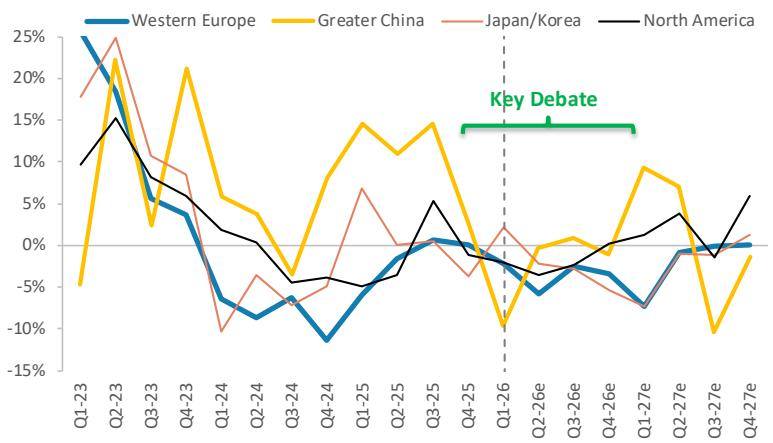

line

| Quarter | Western Europe | Greater China | Japan/Korea | North America |
|---------|----------------|---------------|-------------|---------------|
| Q1-23   | 25%            | -5%           | 18%         | 10%           |
| Q2-23   | 20%            | 22%           | 25%         | 15%           |
| Q3-23   | 10%            | 5%            | 10%         | 8%            |
| Q4-23   | 5%             | 20%           | 8%          | 5%            |
| Q1-24   | -5%            | 5%            | -10%        | 0%            |
| Q2-24   | -10%           | 0%            | -5%         | -5%           |
| Q3-24   | -5%            | -5%           | -5%         | -5%           |
| Q4-24   | -10%           | 10%           | -5%         | -5%           |
| Q1-25   | -5%            | 15%           | 7%          | -5%           |
| Q2-25   | 0%             | 10%           | 0%          | 0%            |
| Q3-25   | 0%             | 15%           | -5%         | 5%            |
| Q4-25   | 0%             | 0%            | 0%          | 0%            |
| Q1-26   | -5%            | -10%          | 2%          | -5%           |
| Q2-26e  | -5%            | 0%            | -5%         | -5%           |
| Q3-26e  | -5%            | 0%            | -5%         | -5%           |
| Q4-26e  | -5%            | 0%            | -5%         | -5%           |
| Q1-27e  | -5%            | 10%           | -5%         | 0%            |
| Q2-27e  | -5%            | 7%            | -5%         | 5%            |
| Q3-27e  | -5%            | -10%          | -5%         | -5%           |
| Q4-27e  | -5%            | -5%           | -5%         | 0%            |

Global LV Production by Region (mn units)   
Quarterly   
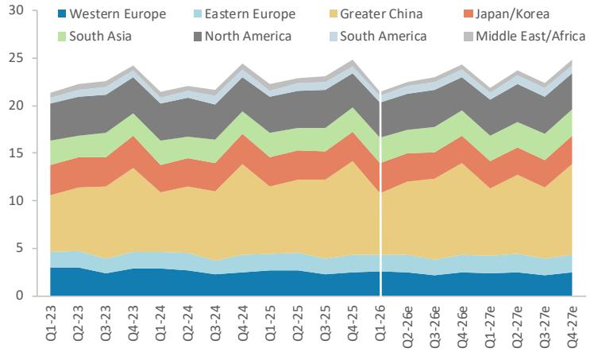

bar_stacked

| Quarter | Western Europe | Eastern Europe | Greater China | Japan/Korea | South Asia | North America | South America | Middle East/Africa |
|---|---|---|---|---|---|---|---|---|
| Q1-23 | 3.0 | 1.0 | 6.0 | 3.0 | 2.0 | 4.0 | 1.0 | 1.0 |
| Q2-23 | 3.0 | 1.0 | 6.0 | 3.0 | 2.0 | 4.0 | 1.0 | 1.0 |
| Q3-23 | 2.5 | 1.0 | 6.5 | 3.5 | 2.0 | 4.0 | 1.0 | 1.0 |
| Q4-23 | 2.5 | 1.0 | 7.0 | 4.0 | 2.0 | 4.0 | 1.0 | 1.0 |
| Q1-24 | 2.5 | 1.0 | 6.5 | 3.5 | 2.0 | 4.0 | 1.0 | 1.0 |
| Q2-24 | 2.5 | 1.0 | 6.5 | 3.5 | 2.0 | 4.0 | 1.0 | 1.0 |
| Q3-24 | 2.5 | 1.0 | 6.5 | 3.5 | 2.0 | 4.0 | 1.0 | 1.0 |
| Q4-24 | 2.5 | 1.0 | 7.0 | 4.0 | 2.0 | 4.0 | 1.0 | 1.0 |
| Q1-25 | 2.5 | 1.0 | 6.5 | 3.5 | 2.0 | 4.0 | 1.0 | 1.0 |
| Q2-25 | 2.5 | 1.0 | 6.5 | 3.5 | 2.0 | 4.0 | 1.0 | 1.0 |
| Q3-25 | 2.5 | 1.0 | 6.5 | 3.5 | 2.0 | 4.0 | 1.0 | 1.0 |
| Q4-25 | 2.5 | 1.0 | 7.0 | 4.0 | 2.0 | 4.0 | 1.0 | 1.0 |
| Q1-26e | 2.5 | 1.0 | 6.5 | 3.5 | 2.0 | 4.0 | 1.0 | 1.0 |
| Q2-26e | 2.5 | 1.0 | 6.5 | 3.5 | 2.0 | 4.0 | 1.0 | 1.0 |
| Q3-26e | 2.5 | 1.0 | 6.5 | 3.5 | 2.0 | 4.0 | 1.0 | 1.0 |
| Q4-26e | 2.5 | 1.0 | 7.0 | 4.0 | 2.0 | 4.0 | 1.0 | 1.0 |
| Q1-27e | 2.5 | 1.0 | 6.5 | 3.5 | 2.0 | 4.0 | 1.0 | 1.0 |
| Q2-27e | 2.5 | 1.0 | 6.5 | 3.5 | 2.0 | 4.0 | 1.0 | 1.0 |
| Q3-27e | 2.5 | 1.0 | 6.5 | 3.5 | 2.0 | 4.0 | 1.0 | 1.0 |
| Q4-27e | 2.5 | 1.0 | 7.0 | 4.0 | 2.0 | 4.0 | 1.0 | 1.0 |
The chart displays a stacked area chart with no explicit title, but it visually represents the proportional contribution of each region to the total value over time (Q1-Q4). The Y-axis is labeled with values ranging from -3 to +3, and the X-axis is labeled with quarters from Q1-23 to Q4-27e (estimated). The legend identifies seven categories: Western Europe, Eastern Europe, Greater China, Japan/Korea, South Asia, North America, South America, and Middle East/Africa (the latter two segments). The data appears to be aggregated into a single column for visual comparison.

<table><tr><td>YoY Growth</td><td>Q2-25</td><td>Q3-25</td><td>Q4-25</td><td>Q1-26</td><td>Q2-26e</td><td>Q3-26e</td><td>Q4-26e</td><td>Q1-27e</td><td>Q2-27e</td></tr><tr><td colspan="10">Region</td></tr><tr><td>Total Europe</td><td>-0.3%</td><td>3.7%</td><td>-0.1%</td><td>-0.9%</td><td>-3.7%</td><td>-0.6%</td><td>-1.7%</td><td>-2.0%</td><td>2.9%</td></tr><tr><td>Western Europe</td><td>-1.7%</td><td>0.6%</td><td>0.0%</td><td>-2.3%</td><td>-5.8%</td><td>-2.6%</td><td>-3.4%</td><td>-7.3%</td><td>-0.8%</td></tr><tr><td>Eastern Europe</td><td>1.8%</td><td>8.4%</td><td>-0.2%</td><td>1.3%</td><td>-0.6%</td><td>2.1%</td><td>0.7%</td><td>5.8%</td><td>8.2%</td></tr><tr><td>Total Asia</td><td>7.3%</td><td>9.2%</td><td>2.9%</td><td>-3.6%</td><td>-0.2%</td><td>1.0%</td><td>-2.0%</td><td>2.6%</td><td>5.4%</td></tr><tr><td>Greater China</td><td>11.0%</td><td>14.6%</td><td>2.8%</td><td>-9.7%</td><td>-0.3%</td><td>0.9%</td><td>-1.1%</td><td>9.2%</td><td>7.0%</td></tr><tr><td>China</td><td>11.2%</td><td>14.8%</td><td>2.9%</td><td>-9.8%</td><td>-0.4%</td><td>0.9%</td><td>-1.3%</td><td>9.2%</td><td>6.9%</td></tr><tr><td>Japan/Korea</td><td>0.0%</td><td>0.6%</td><td>-3.7%</td><td>2.2%</td><td>-2.2%</td><td>-2.9%</td><td>-5.3%</td><td>-7.3%</td><td>-1.1%</td></tr><tr><td>South Asia</td><td>5.8%</td><td>3.6%</td><td>12.5%</td><td>6.9%</td><td>2.9%</td><td>5.6%</td><td>-1.6%</td><td>-1.9%</td><td>8.4%</td></tr><tr><td>India</td><td>3.6%</td><td>6.3%</td><td>19.3%</td><td>9.4%</td><td>8.8%</td><td>8.8%</td><td>-2.7%</td><td>-6.1%</td><td>7.7%</td></tr><tr><td>North America</td><td>-3.5%</td><td>5.2%</td><td>-1.1%</td><td>-2.0%</td><td>-3.6%</td><td>-2.4%</td><td>0.2%</td><td>1.3%</td><td>3.8%</td></tr><tr><td>United States</td><td>-2.9%</td><td>7.6%</td><td>0.6%</td><td>-0.1%</td><td>-4.3%</td><td>-4.0%</td><td>0.6%</td><td>-1.1%</td><td>3.4%</td></tr><tr><td>South America</td><td>11.9%</td><td>-1.9%</td><td>-4.3%</td><td>3.8%</td><td>2.3%</td><td>2.1%</td><td>1.4%</td><td>5.8%</td><td>13.6%</td></tr><tr><td>Middle East/Africa</td><td>-3.1%</td><td>-2.9%</td><td>2.9%</td><td>-31.0%</td><td>-21.1%</td><td>-17.6%</td><td>-11.5%</td><td>13.2%</td><td>31.6%</td></tr><tr><td>Global</td><td>3.6%</td><td>6.8%</td><td>1.6%</td><td>-3.4%</td><td>-1.9%</td><td>-0.3%</td><td>-1.8%</td><td>1.8%</td><td>5.5%</td></tr></table>

Source: S&P Global, MS

# 6 - Auto Parts & Tyres: China pressure by segments

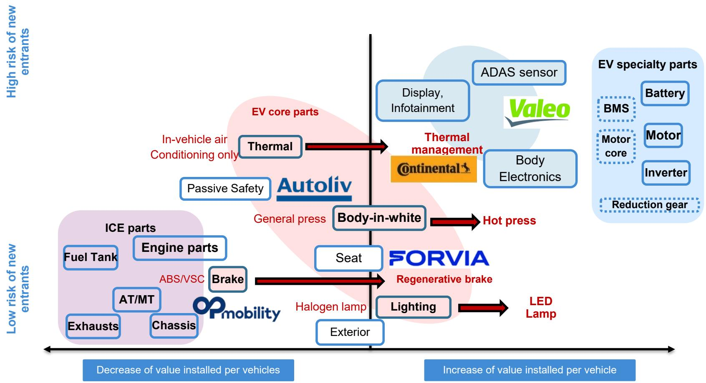

flowchart

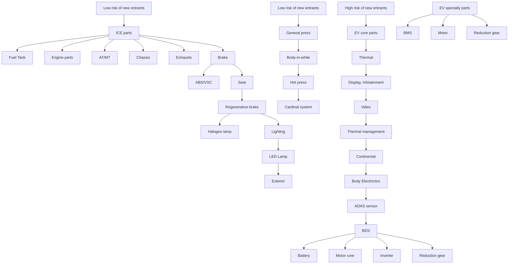
```mermaid
graph TD
    A["Low risk of new entrants"] --> B["ICE parts"]
    B --> C["Fuel Tank"]
    B --> D["Engine parts"]
    B --> E["AT/MT"]
    B --> F["Chassis"]
    B --> G["Exhausts"]
    B --> H["Brake"]
    H --> I["ABS/VSC"]
    H --> J["Seat"]
    J --> K["Regenerative brake"]
    K --> L["Halogen lamp"]
    K --> M["Lighting"]
    M --> N["LED Lamp"]
    N --> O["Exterior"]
    P["Low risk of new entrants"] --> Q["General press"]
    Q --> R["Body-in-white"]
    R --> S["Hot press"]
    S --> T["Cardinal system"]
    U["High risk of new entrants"] --> V["EV core parts"]
    V --> W["Thermal"]
    W --> X["Display, Infotainment"]
    X --> Y["Valeo"]
    Y --> Z["Thermal management"]
    Z --> AA["Continental"]
    AA --> AB["Body Electronics"]
    AB --> AC["ADAS sensor"]
    AC --> AD["BDS"]
    AD --> AE["Battery"]
    AD --> AF["Motor core"]
    AD --> AG["Inverter"]
    AD --> AH["Reduction gear"]
    AI["EV specialty parts"] --> AJ["BMS"]
    AI --> AK["Motor"]
    AI --> AL["Reduction gear"]
```

# 6 - Auto Parts & Tyres: timing the cycle

EBIT MARGIN (%, Co definition)   
EU Suppliers   
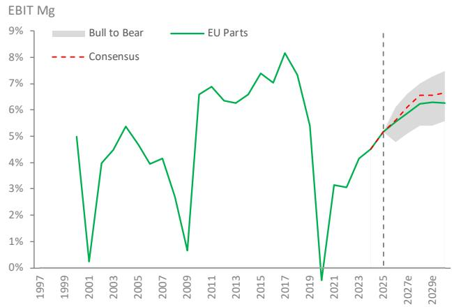

line

| Year   | Bull to Bear | EU Parts | Consensus |
|--------|-------------|----------|-----------|
| 1997   |             |          |           |
| 1999   |             | 5.0%     |           |
| 2001   |             | 0.0%     |           |
| 2003   |             | 4.0%     |           |
| 2005   |             | 5.5%     |           |
| 2007   |             | 4.0%     |           |
| 2009   |             | 0.5%     |           |
| 2011   |             | 6.5%     |           |
| 2013   |             | 6.0%     |           |
| 2015   |             | 7.0%     |           |
| 2017   |             | 8.0%     |           |
| 2019   |             | 5.0%     |           |
| 2021   |             | 3.0%     |           |
| 2023   |             | 4.0%     |           |
| 2025   |             | 5.0%     |           |
| 2027e  |             | 6.0%     | 6.5%      |
| 2029e  |             | 6.5%     | 6.5%      |

IND. CAPEX + TOTAL NET R&D / IND. REV.(%)   
EU Suppliers   
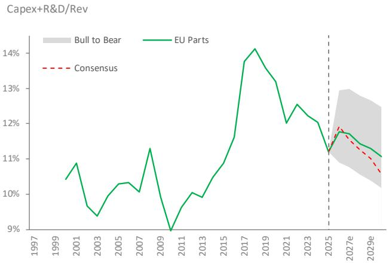

line

| Year   | EU Parts | Bull to Bear | Consensus |
|--------|----------|--------------|-----------|
| 1997   |          |              |           |
| 1999   |          |              |           |
| 2001   |          |              |           |
| 2003   |          |              |           |
| 2005   |          |              |           |
| 2007   |          |              |           |
| 2009   |          |              |           |
| 2011   |          |              |           |
| 2013   |          |              |           |
| 2015   |          |              |           |
| 2017   |          |              |           |
| 2019   |          |              |           |
| 2021   |          |              |           |
| 2023   |          |              |           |
| 2025   |          |              |           |
| 2027e  |          |              |           |
| 2029e  |          |              |           |

INDUSTRIAL FCF (EUR MN)   
EU Suppliers   
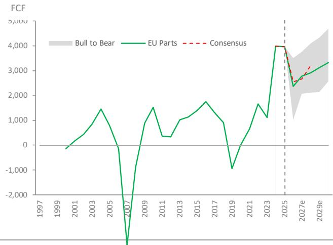

line

| Year | EU Parts | Consensus |
|------|----------|-----------|
| 1997 | -        | -         |
| 1999 | -        | -         |
| 2001 | -        | -         |
| 2003 | -        | -         |
| 2005 | -        | -         |
| 2007 | -        | -         |
| 2009 | -1,000   | -         |
| 2011 | 1,500    | -         |
| 2013 | 1,000    | -         |
| 2015 | 1,750    | -         |
| 2017 | 1,500    | -         |
| 2019 | -1,000   | -         |
| 2021 | 500      | -         |
| 2023 | 1,750    | -         |
| 2025 | 4,000    | 4,000     |
| 2027e| 2,500    | 3,000     |
| 2029e| 3,500    | 3,500     |

ROA (Group, %)   
EU Suppliers   
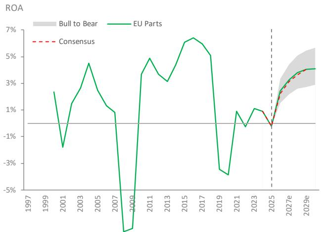

line

| Year | Bull to Bear | EU Parts | Consensus |
|------|-------------|----------|-----------|
| 1997 |             |          |           |
| 1999 |             |          |           |
| 2001 |             |          |           |
| 2003 |             |          |           |
| 2005 |             |          |           |
| 2007 |             |          |           |
| 2009 |             |          |           |
| 2011 |             |          |           |
| 2013 |             |          |           |
| 2015 |             |          |           |
| 2017 |             |          |           |
| 2019 |             |          |           |
| 2021 |             |          |           |
| 2023 |             |          |           |
| 2025 |             |          |           |
| 2027e|             |          |           |
| 2029e|             |          |           |

# 6 - Auto Parts & Tyres: : Tyres not intuitive price – cost dynamics

Tyre Comm - Tyre Price Index 1Q26: -7% Last: +8.1%   
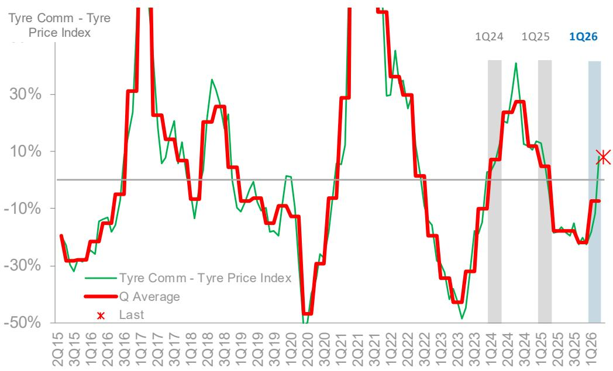

line

| Quarter | Tyre Comm - Tyre Price Index | Q Average | Last |
|---------|-------------------------------|-----------|------|
| 1Q24    | ~35%                          | ~35%      | -    |
| 1Q25    | ~30%                          | ~30%      | -    |
| 1Q26    | ~-5%                          | ~-5%      | ✗    |

# 6 - Auto Parts & Tyres: : Tyres not intuitive price – cost dynamics

Comm price Index - Global Tyre Prices   
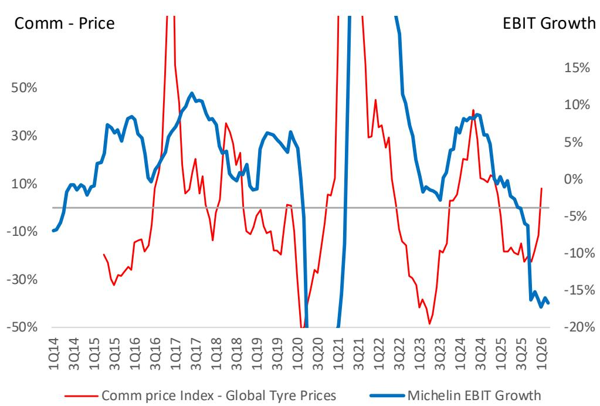

line

| Quarter | Comm Price Index - Global Tyre Prices | Michelin EBIT Growth |
|---------|----------------------------------------|----------------------|
| 1Q14    | -10%                                   | -5%                  |
| 3Q14    | -20%                                   | 0%                   |
| 1Q15    | -30%                                   | 5%                   |
| 3Q15    | -25%                                   | 10%                  |
| 1Q16    | -20%                                   | 15%                  |
| 3Q16    | -10%                                   | 0%                   |
| 1Q17    | 50%                                    | 5%                   |
| 3Q17    | 30%                                    | 10%                  |
| 1Q18    | 20%                                    | 5%                   |
| 3Q18    | 10%                                    | 0%                   |
| 1Q19    | 5%                                     | -5%                  |
| 3Q19    | -5%                                    | -10%                 |
| 1Q20    | -50%                                   | -20%                 |
| 3Q20    | -20%                                   | -5%                  |
| 1Q21    | 50%                                    | 15%                  |
| 3Q21    | 30%                                    | 10%                  |
| 1Q22    | 20%                                    | 5%                   |
| 3Q22    | 10%                                    | 0%                   |
| 1Q23    | -5%                                    | -5%                  |
| 3Q23    | -20%                                   | -10%                 |
| 1Q24    | 50%                                    | 10%                  |
| 3Q24    | 30%                                    | 5%                   |
| 1Q25    | 20%                                    | 0%                   |
| 3Q25    | -10%                                   | -5%                  |
| 1Q26    | -5%                                    | -15%                 |

# 6 - Auto Parts & Tyres: Tyres not intuitive price – cost dynamics

Exhibit 5: Oil prices are the most important factor in the raw material tracker   
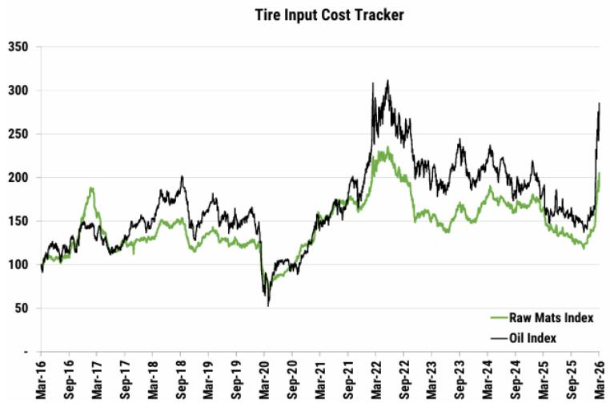

line

| Date   | Raw Mats Index | Oil Index |
|--------|----------------|---------|
| Mar-16 | ~100           | ~100    |
| Sep-16 | ~180           | ~140    |
| Mar-17 | ~120           | ~160    |
| Sep-17 | ~130           | ~180    |
| Mar-18 | ~140           | ~200    |
| Sep-18 | ~120           | ~160    |
| Mar-19 | ~130           | ~170    |
| Sep-19 | ~120           | ~150    |
| Mar-20 | ~50            | ~50     |
| Sep-20 | ~100           | ~100    |
| Mar-21 | ~150           | ~170    |
| Sep-21 | ~200           | ~220    |
| Mar-22 | ~230           | ~310    |
| Sep-22 | ~200           | ~250    |
| Mar-23 | ~180           | ~240    |
| Sep-23 | ~170           | ~230    |
| Mar-24 | ~180           | ~220    |
| Sep-24 | ~170           | ~210    |
| Mar-25 | ~160           | ~200    |
| Sep-25 | ~150           | ~180    |
| Mar-26 | ~200           | ~280    |

Source: Datastream, MS

Exhibit 6: Higher raw material rates tend to correlate with higher share prices   
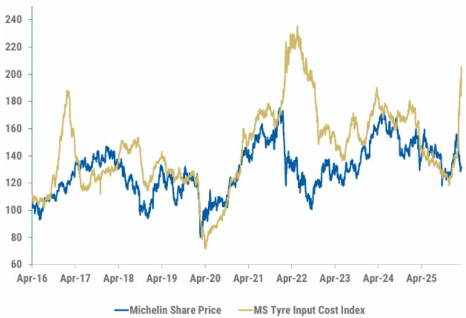

line

| Date   | Michelin Share Price | MS Tyre Input Cost Index |
|--------|----------------------|--------------------------|
| Apr-16 | ~100                 | ~105                     |
| Apr-17 | ~130                 | ~185                     |
| Apr-18 | ~140                 | ~135                     |
| Apr-19 | ~125                 | ~140                     |
| Apr-20 | ~100                 | ~70                      |
| Apr-21 | ~150                 | ~160                     |
| Apr-22 | ~170                 | ~230                     |
| Apr-23 | ~130                 | ~150                     |
| Apr-24 | ~160                 | ~185                     |
| Apr-25 | ~140                 | ~160                     |

Source: Datastream, MS

# The Classic Truck Playbook: PMIs → Orders → Earnings

1. Truck stocks move directionally with earnings revisions   
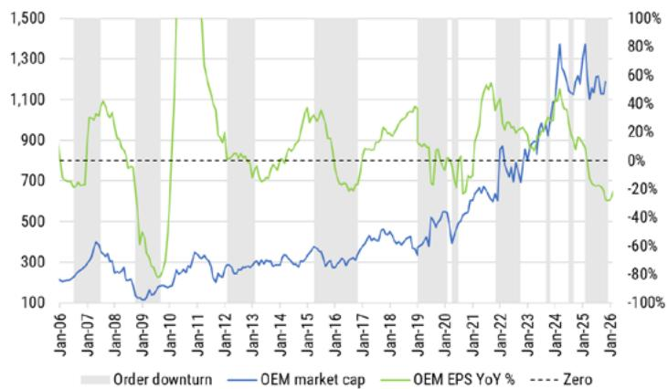

line

| Date   | OEM market cap | OEM EPS YoY % |
|--------|----------------|---------------|
| Jan-06 | ~250           | ~80%          |
| Jan-07 | ~350           | ~100%         |
| Jan-08 | ~200           | ~60%          |
| Jan-09 | ~150           | ~-80%         |
| Jan-10 | ~100           | ~-100%        |
| Jan-11 | ~250           | ~150%         |
| Jan-12 | ~200           | ~80%          |
| Jan-13 | ~250           | ~70%          |
| Jan-14 | ~300           | ~80%          |
| Jan-15 | ~350           | ~90%          |
| Jan-16 | ~400           | ~70%          |
| Jan-17 | ~450           | ~80%          |
| Jan-18 | ~500           | ~90%          |
| Jan-19 | ~550           | ~100%         |
| Jan-20 | ~600           | ~80%          |
| Jan-21 | ~700           | ~60%          |
| Jan-22 | ~800           | ~90%          |
| Jan-23 | ~900           | ~70%          |
| Jan-24 | ~1,300         | ~90%          |
| Jan-25 | ~1,200         | ~60%          |
| Jan-26 | ~1,100         | ~40%          |

3. Class 8 orders move in line with US ISM Manufacturing PMI   
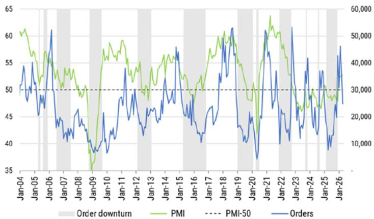

line

| Date   | Orders | PMI  | PMI-50 |
|--------|--------|------|--------|
| Jan-04 | 50     | 60   | 30,000 |
| Jan-05 | 48     | 58   | 30,000 |
| Jan-06 | 55     | 55   | 30,000 |
| Jan-07 | 62     | 52   | 30,000 |
| Jan-08 | 45     | 48   | 30,000 |
| Jan-09 | 38     | 35   | 30,000 |
| Jan-10 | 42     | 58   | 30,000 |
| Jan-11 | 50     | 55   | 30,000 |
| Jan-12 | 48     | 52   | 30,000 |
| Jan-13 | 45     | 50   | 30,000 |
| Jan-14 | 52     | 55   | 30,000 |
| Jan-15 | 58     | 58   | 30,000 |
| Jan-16 | 48     | 52   | 30,000 |
| Jan-17 | 45     | 58   | 30,000 |
| Jan-18 | 52     | 62   | 30,000 |
| Jan-19 | 48     | 55   | 30,000 |
| Jan-20 | 38     | 48   | 30,000 |
| Jan-21 | 62     | 65   | 30,000 |
| Jan-22 | 58     | 62   | 30,000 |
| Jan-23 | 48     | 52   | 30,000 |
| Jan-24 | 52     | 58   | 30,000 |
| Jan-25 | 48     | 52   | 30,000 |
| Jan-26 | 58     | 58   | 30,000 |

2. Earnings revisions tend to track Class 8 orders   
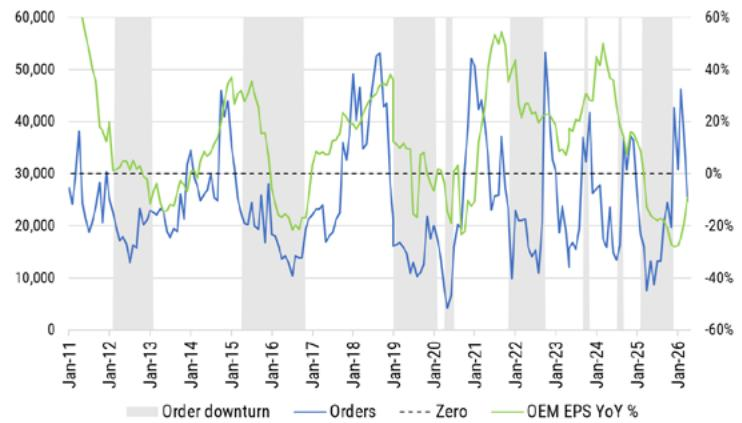

line

| Date   | Orders | OEM EPS YoY % |
|--------|--------|---------------|
| Jan-11 | 38,000 | 60%           |
| Jan-12 | 25,000 | 40%           |
| Jan-13 | 20,000 | 20%           |
| Jan-14 | 25,000 | 30%           |
| Jan-15 | 35,000 | 45%           |
| Jan-16 | 20,000 | 20%           |
| Jan-17 | 15,000 | 10%           |
| Jan-18 | 25,000 | 35%           |
| Jan-19 | 50,000 | 45%           |
| Jan-20 | 15,000 | 20%           |
| Jan-21 | 55,000 | 55%           |
| Jan-22 | 35,000 | 45%           |
| Jan-23 | 55,000 | 35%           |
| Jan-24 | 40,000 | 50%           |
| Jan-25 | 35,000 | 35%           |
| Jan-26 | 45,000 | 25%           |

4. OEM earnings expectations also move with their customers'   
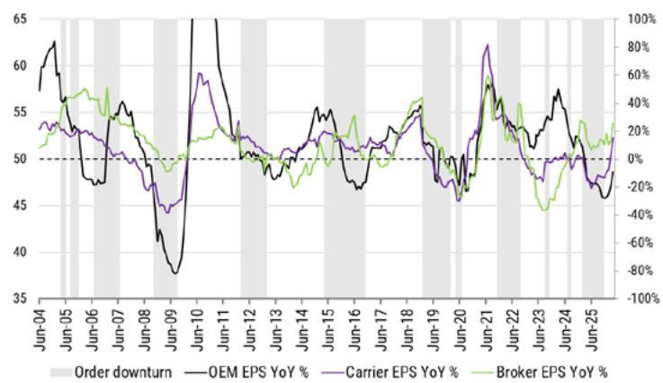

line

| Date   | OEM EPS YoY % | Carrier EPS YoY % | Broker EPS YoY % |
|--------|---------------|-------------------|------------------|
| Jun-04 | 62            | 53                | 55               |
| Jun-05 | 58            | 52                | 57               |
| Jun-06 | 55            | 51                | 56               |
| Jun-07 | 53            | 50                | 54               |
| Jun-08 | 51            | 48                | 52               |
| Jun-09 | 38            | 45                | 49               |
| Jun-10 | 65            | 59                | 53               |
| Jun-11 | 60            | 55                | 51               |
| Jun-12 | 50            | 52                | 49               |
| Jun-13 | 48            | 51                | 48               |
| Jun-14 | 52            | 53                | 50               |
| Jun-15 | 55            | 54                | 52               |
| Jun-16 | 53            | 52                | 51               |
| Jun-17 | 51            | 51                | 49               |
| Jun-18 | 54            | 53                | 52               |
| Jun-19 | 56            | 55                | 54               |
| Jun-20 | 48            | 46                | 49               |
| Jun-21 | 62            | 68                | 60               |
| Jun-22 | 58            | 60                | 57               |
| Jun-23 | 55            | 53                | 54               |
| Jun-24 | 57            | 51                | 52               |
| Jun-25 | 48            | 46                | 49               |

Source: ACT Research, Refinitiv, MS

# Trucks: Spot rates rising, Contract rates rising, freight operators profitable again

Trucking Spot and Contract Rates (\$)   
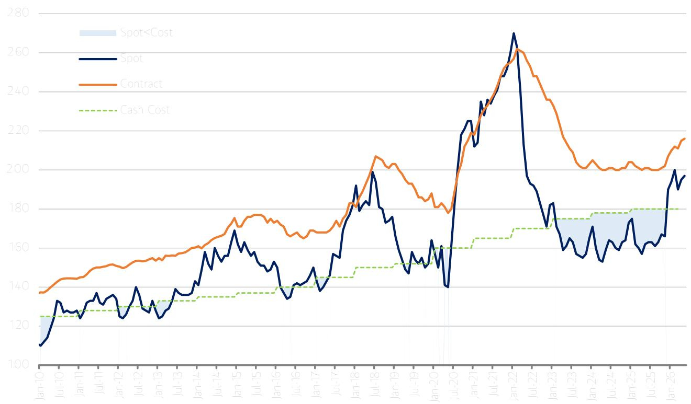

# Trucks: Start of a new cycle

April orders rose 201% YoY to c.25k, a 24% MoM decline   
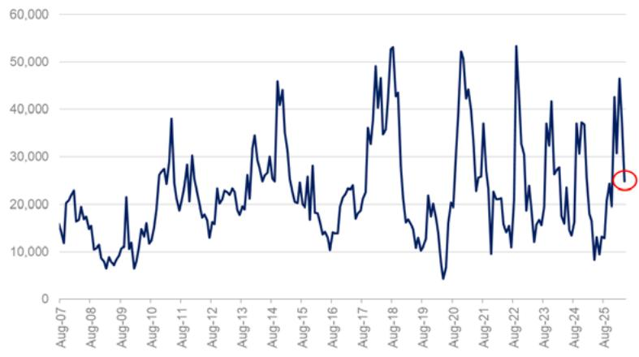

line

| Date   | Value |
|--------|-------|
| Aug-25 | 25000 |

April orders represented a normalisation in order momentum   
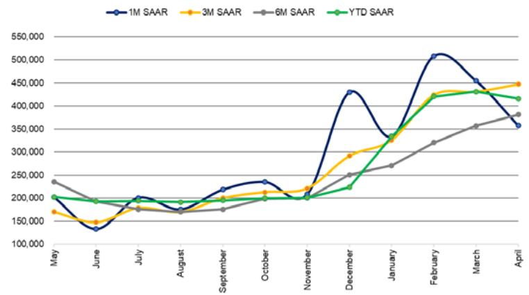

line

| Month     | 1M SAAR | 3M SAAR | 6M SAAR | YTD SAAR |
| --------- | ------- | ------- | ------- | -------- |
| May       | 200,000 | 170,000 | 230,000 | 200,000  |
| June      | 130,000 | 140,000 | 180,000 | 190,000  |
| July      | 200,000 | 170,000 | 170,000 | 180,000  |
| August    | 170,000 | 180,000 | 170,000 | 190,000  |
| September | 220,000 | 210,000 | 180,000 | 200,000  |
| October   | 230,000 | 215,000 | 200,000 | 210,000  |
| November  | 215,000 | 225,000 | 215,000 | 215,000  |
| December  | 435,000 | 295,000 | 255,000 | 225,000  |
| January   | 335,000 | 325,000 | 275,000 | 325,000  |
| February  | 515,000 | 425,000 | 325,000 | 425,000  |
| March     | 465,000 | 445,000 | 365,000 | 435,000  |
| April     | 365,000 | 455,000 | 385,000 | 415,000  |

Apr: Class 8 orders beat expectations for fifth consecutive month   
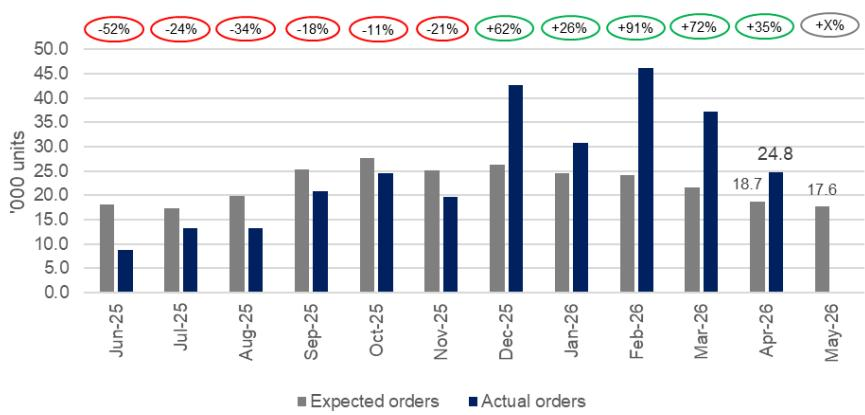

bar

| Month | Expected orders (in '000 units) | Actual orders (in '000 units) | Change (%) |
| :--- | :--- | :--- | :--- |
| Jun-25 | 18.0 | 9.0 | -52 |
| Jul-25 | 17.5 | 13.0 | -24 |
| Aug-25 | 20.0 | 13.0 | -34 |
| Sep-25 | 25.5 | 21.0 | -18 |
| Oct-25 | 27.5 | 24.5 | -11 |
| Nov-25 | 25.0 | 19.5 | -21 |
| Dec-25 | 26.0 | 42.5 | +62 |
| Jan-26 | 24.5 | 30.5 | +26 |
| Feb-26 | 24.0 | 46.0 | +91 |
| Mar-26 | 21.5 | 37.0 | +72 |
| Apr-26 | 18.7 | 24.8 | +35 |
| May-26 | 17.6 | | +X |

Order contributions approaching typical levels again in April   
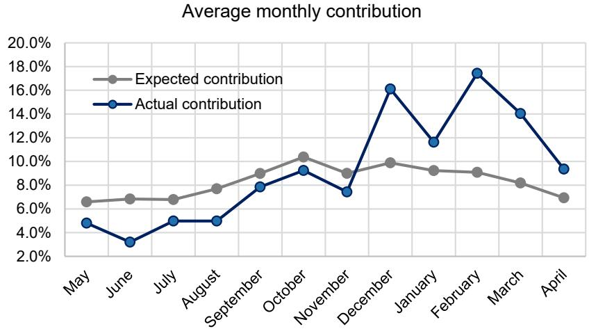

line

| Month     | Expected contribution | Actual contribution |
| --------- | --------------------- | ------------------- |
| May       | 6.5%                  | 4.8%                |
| June      | 6.7%                  | 3.2%                |
| July      | 6.6%                  | 4.9%                |
| August    | 7.5%                  | 4.9%                |
| September | 8.8%                  | 7.8%                |
| October   | 10.5%                 | 9.2%                |
| November  | 8.8%                  | 7.3%                |
| December  | 9.8%                  | 16.2%               |
| January   | 9.2%                  | 11.5%               |
| February  | 9.0%                  | 17.5%               |
| March     | 8.0%                  | 14.0%               |
| April     | 6.8%                  | 9.2%                |

Source: ACT, MS

# Trucks: Overweight Daimler Truck, Top Pick, PT €47

DTG has the most revenue exposure to North America   
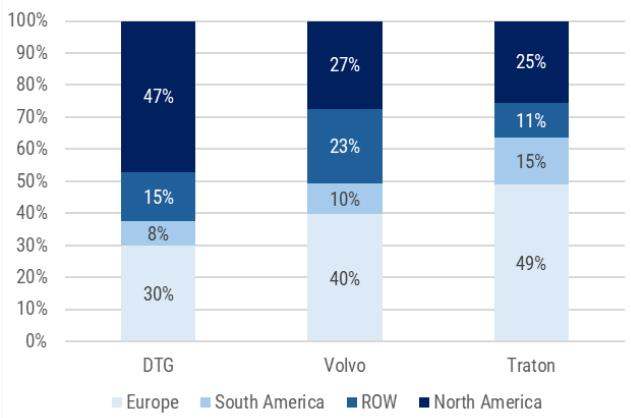

bar_stacked

| Company | Europe (%) | South America (%) | ROW (%) | North America (%) |
| :--- | :--- | :--- | :--- | :--- |
| DTG | 30 | 8 | 15 | 47 |
| Volvo | 40 | 10 | 23 | 27 |
| Traton | 49 | 15 | 11 | 25 |

DTG leads Truck stocks in shareholder returns with an 8% yield   
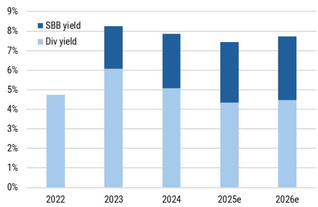

bar_stacked

| Year | Div yield (%) | SBB yield (%) |
| :--- | :--- | :--- |
| 2022 | 4.7 | 0.0 |
| 2023 | 6.0 | 2.1 |
| 2024 | 5.0 | 2.8 |
| 2025e | 4.3 | 3.1 |
| 2026e | 4.4 | 3.1 |

Source: ACT, Refinitiv, Company data, MS

Self-help actions in Mercedes-Benz provide further earnings growth   
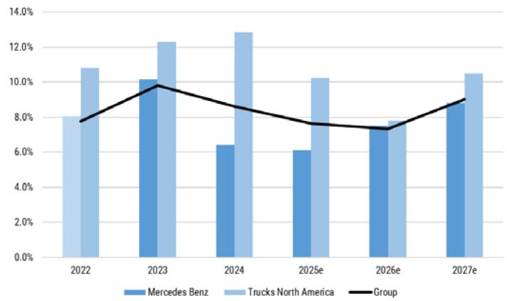

bar_line

| Year | Mercedes Benz (%) | Trucks North America (%) | Group (%) |
| :--- | :--- | :--- | :--- |
| 2022 | 8.0 | 10.8 | 7.8 |
| 2023 | 10.1 | 12.3 | 9.8 |
| 2024 | 6.4 | 12.9 | 8.5 |
| 2025e | 6.1 | 10.2 | 7.6 |
| 2026e | 7.3 | 7.8 | 7.4 |
| 2027e | 8.4 | 10.4 | 9.1 |

Valuation multiples reflecting positive sentiment   
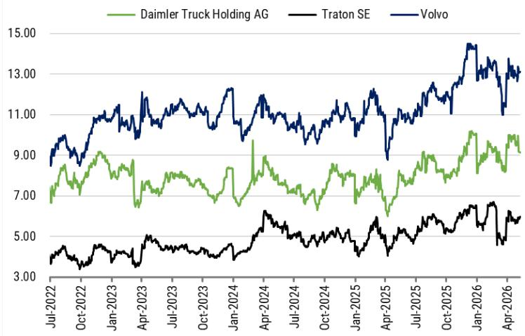

line

| Date       | Daimler Truck Holding AG | Traton SE | Volvo |
| ---------- | ------------------------ | --------- | ----- |
| Jul-2022   | ~7.0                     | ~3.5      | ~9.0  |
| Oct-2022   | ~8.0                     | ~3.8      | ~10.0 |
| Jan-2023   | ~8.5                     | ~4.0      | ~11.0 |
| Apr-2023   | ~7.5                     | ~4.5      | ~11.5 |
| Jul-2023   | ~8.0                     | ~4.8      | ~11.0 |
| Oct-2023   | ~7.8                     | ~4.7      | ~11.5 |
| Jan-2024   | ~8.5                     | ~5.0      | ~12.0 |
| Apr-2024   | ~9.0                     | ~5.5      | ~11.5 |
| Jul-2024   | ~8.5                     | ~5.0      | ~11.0 |
| Oct-2024   | ~8.0                     | ~4.8      | ~11.5 |
| Jan-2025   | ~8.5                     | ~5.0      | ~12.0 |
| Apr-2025   | ~7.5                     | ~4.5      | ~9.0  |
| Jul-2025   | ~8.5                     | ~5.0      | ~11.0 |
| Oct-2025   | ~9.0                     | ~5.5      | ~12.0 |
| Jan-2026   | ~9.5                     | ~6.0      | ~13.0 |
| Apr-2026   | ~9.0                     | ~5.5      | ~13.5 |

MS Global Auto trackers 

<table><tr><td>Tracker</td><td>Updated report</td></tr><tr><td>Global auto Sales:</td><td>Global Auto Sales: Narrowly up (24 Apr 2026)</td></tr><tr><td>- China Auto Sales:</td><td>Stronger March upturn against sector headwinds (1 Apr 2026)</td></tr><tr><td>- China OEMs:</td><td>How Market Share Reshuffled in February (17 Mar 2026)</td></tr><tr><td>- Japan OEMs:</td><td>Japanese OEM New Auto Sales in China (Mar 2026) for Auto Parts Industry (23 Apr 2026)</td></tr><tr><td>- Europe Auto Sales:</td><td>Europe-5 April Auto Sales: Market keeps growing, MBG now gaining share (7 May 2026)</td></tr><tr><td>- US Auto Sales:</td><td>SAAR In-Line with a Shift Toward Hybrids (3 May 2026)</td></tr><tr><td>- EU OEMs:</td><td>US April Sales: all EU OEMs share up (4 May 2026)</td></tr><tr><td>- Japan OEMs:</td><td>US Sales of Japan OEMs (Mar 2026): HEV Ratio Rises Further (2 Apr 2026)</td></tr><tr><td>- Korea OEMs sales:</td><td>April 2026 Volumes: HMC -8.0% YoY, Kia +1.0% YoY (4 May 2026)</td></tr><tr><td>- India Auto sales:</td><td>April 2026 – Strong Domestic Sales But Exports Picture was Mixed (4 May 2026)</td></tr><tr><td>Global EV sales:</td><td>Global EV Tracker: Global EVs Back in Gear (7 May 2026)</td></tr><tr><td>- China weekly orders:</td><td>Powering Through Holiday Disruption; May Rebound Ahead (7 May 2026)</td></tr><tr><td>Global Auto Production:</td><td>Another S&amp;P LVP downgrade. FY26 -1.8% YoY (16 Apr 2026)</td></tr><tr><td>- Japan OEMs:</td><td>Japanese OEMs&#x27; Global Production (Mar 2026): Implications for the Auto Parts Industry (28 Apr 2026)</td></tr><tr><td>Global exports/imports:</td><td>China pressure and more to come (22 Apr 2026)</td></tr><tr><td>- China export tracker</td><td>Where did China&#x27;s OEMs sell overseas in March? (30 Apr 2026)</td></tr><tr><td>Car Prices: - US:</td><td>Used Car Prices: Easing off the Gas After a Strong Start of the Year (8 May 2026)</td></tr><tr><td>- China:</td><td>March EV Prices Slipped Again (8 Apr 2026)</td></tr><tr><td>- Brazil:</td><td>April 2026; Depreciation Remains in Check (4 May 2026)</td></tr><tr><td>Global Product Pipeline:</td><td>Global Product Pipeline: Peaking in 2026 (14 Oct 2025)</td></tr><tr><td>Global Databook:</td><td>Shifting EV Dynamics Reshape the Global Auto Landscape (18 Mar 2026)</td></tr><tr><td>Global Tyres:</td><td>March Tyres Tracker: RT strength offsets OE weakness (23 Apr 2026)</td></tr><tr><td>- US market:</td><td>Truck Tire Decline Continues (10 Apr 2026)</td></tr><tr><td>- Japan market:</td><td>Domestic Tire Sales (Mar 2026): REP Strong; Downside Risks to Outlook (9 Apr 2026)</td></tr><tr><td>Trucks sales:</td><td>April ACT Class 8 Orders: +201% YoY on easy comps... but order SAAR starting to normalise (5 May 2026)</td></tr></table>

Valuation Comps: European Auto Value Chain 

<table><tr><td rowspan="2">Prices date: May 11, 2026</td><td rowspan="2">Crrc.</td><td rowspan="2">Mkt Cap US$ mn</td><td colspan="2">Price</td><td rowspan="2">MS Rating</td><td colspan="3">EPS</td><td rowspan="2">Revenue CAGR 25-27E</td><td colspan="2">EBIT margin</td><td colspan="2">EV/EBIT</td><td colspan="2">EV/EBITDA</td><td colspan="2">P/E</td><td colspan="2">Dividend Yield</td><td colspan="2">EV/Revenue</td></tr><tr><td>Last</td><td>Target</td><td>2025</td><td>2026E</td><td>2027E</td><td>2026E</td><td>2027E</td><td>2026E</td><td>2027E</td><td>2026E</td><td>2027E</td><td>2026E</td><td>2027E</td><td>2026E</td><td>2027E</td><td>2026E</td><td>2027E</td></tr><tr><td>EU Comps</td><td></td><td>508,734</td><td></td><td></td><td></td><td></td><td></td><td></td><td>2%</td><td>7%</td><td>8%</td><td>10x</td><td>7x</td><td>5x</td><td>5x</td><td>13x</td><td>25x</td><td>4.1%</td><td>4.9%</td><td>0.7x</td><td>0.7x</td></tr><tr><td>OEMs</td><td></td><td>251,709</td><td></td><td></td><td></td><td></td><td></td><td></td><td>0%</td><td>5%</td><td>6%</td><td>7x</td><td>5x</td><td>2x</td><td>2x</td><td>11x</td><td>38x</td><td>4.4%</td><td>5.0%</td><td>0.3x</td><td>0.3x</td></tr><tr><td>BMW</td><td>EUR</td><td>58,174</td><td>80.9</td><td>96.0</td><td>OW</td><td>12.4</td><td>9.9</td><td>11.2</td><td>1%</td><td>6%</td><td>7%</td><td>3x</td><td>3x</td><td>1x</td><td>1x</td><td>8x</td><td>7x</td><td>4.5%</td><td>5.1%</td><td>0.2x</td><td>0.2x</td></tr><tr><td>Mercedes</td><td>EUR</td><td>56,509</td><td>50.3</td><td>65.0</td><td>OW</td><td>5.3</td><td>5.8</td><td>7.9</td><td>2%</td><td>6%</td><td>7%</td><td>3x</td><td>2x</td><td>2x</td><td>1x</td><td>9x</td><td>7x</td><td>6.0%</td><td>7.1%</td><td>0.2x</td><td>0.2x</td></tr><tr><td>Stellantis</td><td>EUR</td><td>22,184</td><td>6.4</td><td>6.5</td><td>EW</td><td>(7.7)</td><td>(0.5)</td><td>0.0</td><td>2%</td><td>1%</td><td>2%</td><td>25x</td><td>10x</td><td>4x</td><td>3x</td><td>n.m.</td><td>341x</td><td>0.0%</td><td>0.2%</td><td>0.2x</td><td>0.2x</td></tr><tr><td>Renault</td><td>EUR</td><td>9,761</td><td>27.9</td><td>29.0</td><td>UW</td><td>(40.0)</td><td>6.7</td><td>6.3</td><td>-1%</td><td>4%</td><td>4%</td><td>1x</td><td>1x</td><td>1x</td><td>1x</td><td>5x</td><td>5x</td><td>6.4%</td><td>7.2%</td><td>0.1x</td><td>0.1x</td></tr><tr><td>Volkswagen</td><td>EUR</td><td>51,720</td><td>88.0</td><td>100.0</td><td>EW</td><td>13.3</td><td>17.7</td><td>22.0</td><td>1%</td><td>4%</td><td>5%</td><td>0x</td><td>0x</td><td>0x</td><td>0x</td><td>5x</td><td>4x</td><td>6.4%</td><td>7.9%</td><td>0.0x</td><td>0.0x</td></tr><tr><td>Porsche</td><td>EUR</td><td>45,610</td><td>45.0</td><td>37.0</td><td>UW</td><td>0.5</td><td>1.6</td><td>2.0</td><td>-3%</td><td>7%</td><td>8%</td><td>19x</td><td>15x</td><td>7x</td><td>7x</td><td>26x</td><td>21x</td><td>2.2%</td><td>1.8%</td><td>1.2x</td><td>1.2x</td></tr><tr><td>Aston Martin</td><td>GBP</td><td>649</td><td>0.5</td><td>NA</td><td>N.C.</td><td>(0.4)</td><td>(0.2)</td><td>(0.1)</td><td>13%</td><td>n.m.</td><td>n.m.</td><td>n.m.</td><td>n.m.</td><td>6x</td><td>5x</td><td>n.m.</td><td>n.m.</td><td>0.0%</td><td>0.0%</td><td>1.2x</td><td>1.1x</td></tr><tr><td>Volvo Car</td><td>SEK</td><td>7,103</td><td>22.5</td><td>NA</td><td>N.C.</td><td>0.1</td><td>2.9</td><td>4.4</td><td>0%</td><td>3%</td><td>5%</td><td>5x</td><td>3x</td><td>2x</td><td>1x</td><td>8x</td><td>5x</td><td>0.0%</td><td>0.5%</td><td>0.2x</td><td>0.2x</td></tr><tr><td>Suppliers</td><td></td><td>64,934</td><td></td><td></td><td></td><td></td><td></td><td></td><td>1%</td><td>8%</td><td>9%</td><td>12x</td><td>10x</td><td>6x</td><td>6x</td><td>19x</td><td>14x</td><td>2.6%</td><td>3.4%</td><td>0.9x</td><td>0.8x</td></tr><tr><td>Autoliv</td><td>USD</td><td>9,105</td><td>120.5</td><td>125.0</td><td>EW</td><td>9.6</td><td>11.0</td><td>12.2</td><td>3%</td><td>11%</td><td>11%</td><td>9x</td><td>8x</td><td>6x</td><td>6x</td><td>11x</td><td>11x</td><td>2.9%</td><td>3.2%</td><td>0.9x</td><td>0.9x</td></tr><tr><td>Continental</td><td>EUR</td><td>16,646</td><td>69.2</td><td>62.0</td><td>EW</td><td>(2.2)</td><td>5.5</td><td>6.8</td><td>-4%</td><td>11%</td><td>12%</td><td>9x</td><td>8x</td><td>8x</td><td>6x</td><td>13x</td><td>10x</td><td>2.8%</td><td>3.5%</td><td>1.1x</td><td>1.0x</td></tr><tr><td>Forvia</td><td>EUR</td><td>2,410</td><td>10.5</td><td>11.0</td><td>EW</td><td>(2.6)</td><td>1.9</td><td>2.4</td><td>0%</td><td>6%</td><td>6%</td><td>5x</td><td>4x</td><td>2x</td><td>2x</td><td>12x</td><td>4x</td><td>0.0%</td><td>3.3%</td><td>0.3x</td><td>0.3x</td></tr><tr><td>Schaeffler</td><td>EUR</td><td>9,769</td><td>9.2</td><td>NA</td><td>N.C.</td><td>(0.5)</td><td>0.4</td><td>0.7</td><td>4%</td><td>4%</td><td>5%</td><td>14x</td><td>10x</td><td>6x</td><td>5x</td><td>32x</td><td>15x</td><td>3.0%</td><td>3.8%</td><td>0.6x</td><td>0.6x</td></tr><tr><td>Gestamp</td><td>EUR</td><td>2,265</td><td>3.4</td><td>NA</td><td>N.C.</td><td>0.3</td><td>0.4</td><td>0.5</td><td>1%</td><td>5%</td><td>6%</td><td>8x</td><td>7x</td><td>3x</td><td>3x</td><td>9x</td><td>7x</td><td>2.8%</td><td>3.5%</td><td>0.4x</td><td>0.4x</td></tr><tr><td>Valeo S.A.</td><td>EUR</td><td>3,326</td><td>11.6</td><td>12.5</td><td>OW</td><td>1.3</td><td>1.9</td><td>2.4</td><td>1%</td><td>5%</td><td>5%</td><td>7x</td><td>6x</td><td>2x</td><td>2x</td><td>7x</td><td>6x</td><td>4.9%</td><td>6.2%</td><td>0.3x</td><td>0.3x</td></tr><tr><td>Brembo</td><td>EUR</td><td>3,967</td><td>10.4</td><td>NA</td><td>N.C.</td><td>0.7</td><td>0.7</td><td>0.8</td><td>5%</td><td>9%</td><td>10%</td><td>12x</td><td>10x</td><td>7x</td><td>6x</td><td>15x</td><td>13x</td><td>2.7%</td><td>3.0%</td><td>1.1x</td><td>1.0x</td></tr><tr><td>CIE</td><td>EUR</td><td>4,190</td><td>30.4</td><td>NA</td><td>N.C.</td><td>2.8</td><td>3.1</td><td>3.3</td><td>4%</td><td>14%</td><td>14%</td><td>9x</td><td>8x</td><td>6x</td><td>6x</td><td>10x</td><td>9x</td><td>3.7%</td><td>4.7%</td><td>1.2x</td><td>1.2x</td></tr><tr><td>Opmobility SE</td><td>EUR</td><td>2,650</td><td>15.9</td><td>++</td><td>++</td><td>1.3</td><td>1.5</td><td>1.7</td><td>1%</td><td>5%</td><td>5%</td><td>7x</td><td>6x</td><td>4x</td><td>3x</td><td>11x</td><td>9x</td><td>3.8%</td><td>4.2%</td><td>0.3x</td><td>0.3x</td></tr><tr><td>ElringKlinger</td><td>EUR</td><td>427</td><td>6.1</td><td>NA</td><td>N.C.</td><td>0.5</td><td>0.6</td><td>1.0</td><td>5%</td><td>6%</td><td>7%</td><td>9x</td><td>7x</td><td>4x</td><td>3x</td><td>9x</td><td>6x</td><td>3.2%</td><td>5.1%</td><td>0.5x</td><td>0.5x</td></tr><tr><td>Autoneum Holding</td><td>CHF</td><td>878</td><td>118.0</td><td>NA</td><td>N.C.</td><td>10.3</td><td>10.9</td><td>12.4</td><td>2%</td><td>6%</td><td>6%</td><td>9x</td><td>8x</td><td>5x</td><td>4x</td><td>11x</td><td>10x</td><td>3.0%</td><td>3.6%</td><td>0.5x</td><td>0.5x</td></tr><tr><td>Hella</td><td>EUR</td><td>9,302</td><td>71.2</td><td>NA</td><td>N.C.</td><td>0.8</td><td>1.8</td><td>2.2</td><td>1%</td><td>5%</td><td>5%</td><td>23x</td><td>19x</td><td>8x</td><td>8x</td><td>41x</td><td>32x</td><td>0.8%</td><td>1.0%</td><td>1.0x</td><td>1.0x</td></tr><tr><td>Tyres</td><td></td><td>51,548</td><td></td><td></td><td></td><td></td><td></td><td></td><td>0%</td><td>12%</td><td>13%</td><td>9x</td><td>8x</td><td>6x</td><td>5x</td><td>13x</td><td>11x</td><td>3.6%</td><td>4.4%</td><td>1.0x</td><td>1.0x</td></tr><tr><td>Continental</td><td>EUR</td><td>16,646</td><td>69.2</td><td>62.0</td><td>EW</td><td>(2.2)</td><td>5.5</td><td>6.8</td><td>-4%</td><td>11%</td><td>12%</td><td>9x</td><td>8x</td><td>8x</td><td>6x</td><td>13x</td><td>10x</td><td>2.8%</td><td>3.5%</td><td>1.1x</td><td>1.0x</td></tr><tr><td>Michelin</td><td>EUR</td><td>25,779</td><td>31.9</td><td>28.0</td><td>EW</td><td>3.0</td><td>3.2</td><td>3.6</td><td>0%</td><td>11%</td><td>12%</td><td>9x</td><td>8x</td><td>5x</td><td>5x</td><td>12x</td><td>10x</td><td>4.1%</td><td>5.0%</td><td>0.9x</td><td>0.9x</td></tr><tr><td>Nokian Tyres</td><td>EUR</td><td>1,764</td><td>10.7</td><td>NA</td><td>N.C.</td><td>(0.1)</td><td>0.4</td><td>0.7</td><td>7%</td><td>8%</td><td>10%</td><td>19x</td><td>14x</td><td>9x</td><td>7x</td><td>33x</td><td>16x</td><td>2.7%</td><td>3.6%</td><td>1.5x</td><td>1.4x</td></tr><tr><td>Pirelli &amp; C. SpA</td><td>EUR</td><td>7,359</td><td>6.2</td><td>6.4</td><td>EW</td><td>0.5</td><td>0.5</td><td>0.6</td><td>2%</td><td>16%</td><td>16%</td><td>7x</td><td>7x</td><td>5x</td><td>4x</td><td>13x</td><td>11x</td><td>3.9%</td><td>4.5%</td><td>1.2x</td><td>1.1x</td></tr><tr><td>Trucks</td><td></td><td>131,614</td><td></td><td></td><td></td><td></td><td></td><td></td><td>6%</td><td>10%</td><td>11%</td><td>14x</td><td>10x</td><td>10x</td><td>8x</td><td>13x</td><td>10x</td><td>4.5%</td><td>5.4%</td><td>1.3x</td><td>1.2x</td></tr><tr><td>Daimler Truck</td><td>EUR</td><td>36,378</td><td>40.4</td><td>47.0</td><td>OW</td><td>2.6</td><td>3.8</td><td>5.1</td><td>4%</td><td>8%</td><td>9%</td><td>13x</td><td>10x</td><td>11x</td><td>8x</td><td>11x</td><td>8x</td><td>4.9%</td><td>5.2%</td><td>1.1x</td><td>1.0x</td></tr><tr><td>Volvo</td><td>SEK</td><td>71,443</td><td>324.2</td><td>342.0</td><td>EW</td><td>16.9</td><td>20.4</td><td>25.6</td><td>7%</td><td>11%</td><td>13%</td><td>15x</td><td>12x</td><td>12x</td><td>10x</td><td>16x</td><td>13x</td><td>4.4%</td><td>5.6%</td><td>1.7x</td><td>1.5x</td></tr><tr><td>Iveco</td><td>EUR</td><td>4,364</td><td>13.9</td><td>++</td><td>++</td><td>1.8</td><td>2.4</td><td>2.7</td><td>7%</td><td>7%</td><td>8%</td><td>2x</td><td>1x</td><td>1x</td><td>1x</td><td>6x</td><td>5x</td><td>4.4%</td><td>4.9%</td><td>0.1x</td><td>0.1x</td></tr><tr><td>Traton</td><td>EUR</td><td>19,429</td><td>33.6</td><td>34.0</td><td>UW</td><td>3.1</td><td>4.2</td><td>6.0</td><td>8%</td><td>7%</td><td>9%</td><td>13x</td><td>9x</td><td>8x</td><td>6x</td><td>8x</td><td>6x</td><td>3.7%</td><td>5.4%</td><td>0.9x</td><td>0.8x</td></tr><tr><td>Other</td><td></td><td>8,929</td><td></td><td></td><td></td><td></td><td></td><td></td><td>11%</td><td>7%</td><td>7%</td><td>18x</td><td>13x</td><td>11x</td><td>9x</td><td>22x</td><td>15x</td><td>5.0%</td><td>5.8%</td><td>0.9x</td><td>0.8x</td></tr><tr><td>Aramis</td><td>EUR</td><td>378</td><td>3.8</td><td>5.0</td><td>OW</td><td>0.2</td><td>0.1</td><td>0.2</td><td>3%</td><td>1%</td><td>1%</td><td>21x</td><td>11x</td><td>7x</td><td>5x</td><td>35x</td><td>16x</td><td>n.a.</td><td>n.a.</td><td>0.2x</td><td>0.1x</td></tr><tr><td>Auto1</td><td>EUR</td><td>4,572</td><td>18.7</td><td>22.4</td><td>EW</td><td>0.4</td><td>0.6</td><td>0.9</td><td>16%</td><td>2%</td><td>3%</td><td>24x</td><td>16x</td><td>18x</td><td>13x</td><td>30x</td><td>20x</td><td>n.a.</td><td>n.a.</td><td>0.5x</td><td>0.4x</td></tr><tr><td>EDAG Engineering</td><td>EUR</td><td>102</td><td>3.5</td><td>NA</td><td>N.C.</td><td>(1.3)</td><td>0.0</td><td>0.6</td><td>3%</td><td>2%</td><td>4%</td><td>26x</td><td>10x</td><td>6x</td><td>4x</td><td>n.m.</td><td>6x</td><td>0.4%</td><td>6.2%</td><td>0.4x</td><td>0.4x</td></tr><tr><td>Sixt</td><td>EUR</td><td>3,877</td><td>69.8</td><td>NA</td><td>N.C.</td><td>6.2</td><td>6.8</td><td>7.6</td><td>6%</td><td>13%</td><td>13%</td><td>11x</td><td>10x</td><td>5x</td><td>4x</td><td>10x</td><td>9x</td><td>5.1%</td><td>5.7%</td><td>1.5x</td><td>1.4x</td></tr></table>

++ Stock Rating, Price Target, or Estimates for this company have been removed from consideration in this report because, under applicable law and/or MS policy, MS may be precluded from issuing such information with respect to this company at this time. Source: Company data, MS estimates (E), Thomson Reuters for non covered stocks (NC)

Valuation Comps: OEMs 

<table><tr><td rowspan="2">Prices date: May 11, 2026</td><td rowspan="2">Crrc.</td><td rowspan="2">Mkt Cap US$ mn</td><td colspan="2">Price</td><td rowspan="2">MS Rating</td><td colspan="3">EPS</td><td rowspan="2">Revenue CAGR 25-27E</td><td colspan="2">EBIT margin</td><td colspan="2">EV/EBIT</td><td colspan="2">EV/EBITDA</td><td colspan="2">P/E</td><td colspan="2">Dividend Yield</td><td colspan="2">EV/Revenue</td></tr><tr><td>Last</td><td>Target</td><td>2025</td><td>2026E</td><td>2027E</td><td>2026E</td><td>2027E</td><td>2026E</td><td>2027E</td><td>2026E</td><td>2027E</td><td>2026E</td><td>2027E</td><td>2026E</td><td>2027E</td><td>2026E</td><td>2027E</td></tr><tr><td>OEMs</td><td></td><td>3,116,880</td><td></td><td></td><td></td><td></td><td></td><td></td><td>9%</td><td>5%</td><td>6%</td><td>328.2x</td><td>187.3x</td><td>61.6x</td><td>51.4x</td><td>365.5x</td><td>212.3x</td><td>3.0%</td><td>3.4%</td><td>9.5x</td><td>7.9x</td></tr><tr><td>Europe</td><td></td><td>251,709</td><td></td><td></td><td></td><td></td><td></td><td></td><td>0%</td><td>5%</td><td>6%</td><td>7.3x</td><td>5.0x</td><td>2.4x</td><td>2.2x</td><td>10.9x</td><td>38.3x</td><td>4.4%</td><td>5.0%</td><td>0.3x</td><td>0.3x</td></tr><tr><td>BMW</td><td>EUR</td><td>58,174</td><td>80.9</td><td>96.0</td><td>OW</td><td>12.4</td><td>9.9</td><td>11.2</td><td>1%</td><td>6%</td><td>7%</td><td>2.9x</td><td>2.7x</td><td>1.5x</td><td>1.4x</td><td>8.3x</td><td>7.5x</td><td>4.5%</td><td>5.1%</td><td>0.2x</td><td>0.2x</td></tr><tr><td>Mercedes</td><td>EUR</td><td>56,509</td><td>50.3</td><td>65.0</td><td>OW</td><td>5.3</td><td>5.8</td><td>7.9</td><td>2%</td><td>6%</td><td>7%</td><td>3.2x</td><td>2.4x</td><td>1.6x</td><td>1.4x</td><td>8.7x</td><td>6.6x</td><td>6.0%</td><td>7.1%</td><td>0.2x</td><td>0.2x</td></tr><tr><td>Stellantis</td><td>EUR</td><td>22,184</td><td>6.4</td><td>6.5</td><td>EW</td><td>(7.7)</td><td>(0.5)</td><td>0.0</td><td>2%</td><td>1%</td><td>2%</td><td>24.7x</td><td>9.6x</td><td>3.8x</td><td>3.0x</td><td>n.m.</td><td>341.1x</td><td>0.0%</td><td>0.2%</td><td>0.2x</td><td>0.2x</td></tr><tr><td>Renault</td><td>EUR</td><td>9,761</td><td>27.9</td><td>29.0</td><td>UW</td><td>(40.0)</td><td>6.7</td><td>6.3</td><td>-1%</td><td>4%</td><td>4%</td><td>1.3x</td><td>1.4x</td><td>0.5x</td><td>0.6x</td><td>4.5x</td><td>4.8x</td><td>6.4%</td><td>7.2%</td><td>0.1x</td><td>0.1x</td></tr><tr><td>Volkswagen</td><td>EUR</td><td>51,720</td><td>88.0</td><td>100.0</td><td>EW</td><td>13.3</td><td>17.7</td><td>22.0</td><td>1%</td><td>4%</td><td>5%</td><td>0.5x</td><td>0.3x</td><td>0.1x</td><td>0.1x</td><td>4.9x</td><td>4.0x</td><td>6.4%</td><td>7.9%</td><td>0.0x</td><td>0.0x</td></tr><tr><td>Porsche</td><td>EUR</td><td>45,610</td><td>45.0</td><td>37.0</td><td>UW</td><td>0.5</td><td>1.6</td><td>2.0</td><td>-3%</td><td>7%</td><td>8%</td><td>18.8x</td><td>15.4x</td><td>6.8x</td><td>6.8x</td><td>25.8x</td><td>20.9x</td><td>2.2%</td><td>1.8%</td><td>1.2x</td><td>1.2x</td></tr><tr><td>Aston Martin</td><td>GBP</td><td>649</td><td>0.5</td><td>NA</td><td>N.C.</td><td>(0.4)</td><td>(0.2)</td><td>(0.1)</td><td>13%</td><td>n.m.</td><td>n.m.</td><td>n.m.</td><td>n.m.</td><td>6.2x</td><td>5.0x</td><td>n.m.</td><td>n.m.</td><td>0.0%</td><td>0.0%</td><td>1.2x</td><td>1.1x</td></tr><tr><td>Volvo Car</td><td>SEK</td><td>7,103</td><td>22.5</td><td>NA</td><td>N.C.</td><td>0.1</td><td>2.9</td><td>4.4</td><td>0%</td><td>3%</td><td>5%</td><td>4.8x</td><td>3.3x</td><td>1.6x</td><td>1.4x</td><td>7.8x</td><td>5.4x</td><td>0.0%</td><td>0.5%</td><td>0.2x</td><td>0.2x</td></tr><tr><td>North America</td><td></td><td>1,791,541</td><td></td><td></td><td></td><td></td><td></td><td></td><td>9%</td><td>4%</td><td>5%</td><td>541.8x</td><td>308.2x</td><td>98.7x</td><td>82.3x</td><td>607.8x</td><td>351.0x</td><td>2.9%</td><td>3.0%</td><td>15.3x</td><td>12.8x</td></tr><tr><td>Ford Motor</td><td>USD</td><td>49,091</td><td>12.3</td><td>14.0</td><td>EW</td><td>(3.2)</td><td>1.6</td><td>1.8</td><td>3%</td><td>5%</td><td>5%</td><td>15.8x</td><td>14.2x</td><td>10.0x</td><td>9.1x</td><td>7.5x</td><td>6.7x</td><td>4.9%</td><td>4.9%</td><td>0.8x</td><td>0.8x</td></tr><tr><td>General Motors</td><td>USD</td><td>71,051</td><td>78.8</td><td>100.0</td><td>OW</td><td>2.1</td><td>13.0</td><td>14.8</td><td>1%</td><td>7%</td><td>8%</td><td>5.2x</td><td>4.3x</td><td>3.1x</td><td>2.8x</td><td>6.0x</td><td>5.4x</td><td>n.a.</td><td>n.a.</td><td>0.4x</td><td>0.4x</td></tr><tr><td>Tesla Motors</td><td>USD</td><td>1,608,763</td><td>428.4</td><td>415.0</td><td>EW</td><td>1.1</td><td>0.7</td><td>1.2</td><td>10%</td><td>3%</td><td>4%</td><td>600.9x</td><td>341.8x</td><td>108.7x</td><td>90.7x</td><td>674.2x</td><td>389.4x</td><td>n.a.</td><td>n.a.</td><td>16.8x</td><td>14.0x</td></tr><tr><td>Harley-Davidson</td><td>USD</td><td>2,676</td><td>25.4</td><td>12.0</td><td>UW</td><td>2.7</td><td>(0.1)</td><td>0.8</td><td>-4%</td><td>n.m.</td><td>2%</td><td>n.m.</td><td>44.0x</td><td>33.5x</td><td>17.2x</td><td>n.m.</td><td>30.8x</td><td>3.3%</td><td>2.6%</td><td>0.9x</td><td>1.1x</td></tr><tr><td>Ferrari</td><td>USD</td><td>59,960</td><td>339.7</td><td>420.0</td><td>EW</td><td>9.0</td><td>9.6</td><td>10.7</td><td>7%</td><td>30%</td><td>30%</td><td>23.2x</td><td>21.0x</td><td>17.5x</td><td>15.9x</td><td>30.0x</td><td>27.2x</td><td>1.3%</td><td>1.5%</td><td>6.9x</td><td>6.3x</td></tr><tr><td>Japan</td><td></td><td>330,172</td><td></td><td></td><td></td><td></td><td></td><td></td><td>5%</td><td>8%</td><td>8%</td><td>14.9x</td><td>12.8x</td><td>9.4x</td><td>8.5x</td><td>9.0x</td><td>8.2x</td><td>3.9%</td><td>4.4%</td><td>1.1x</td><td>1.1x</td></tr><tr><td>Subaru</td><td>JPY</td><td>10,534</td><td>2,320</td><td>2,400</td><td>UW</td><td>190</td><td>319</td><td>323</td><td>7%</td><td>5%</td><td>5%</td><td>1.7x</td><td>1.1x</td><td>0.9x</td><td>0.6x</td><td>7.2x</td><td>7.1x</td><td>5.1%</td><td>5.4%</td><td>0.1x</td><td>0.1x</td></tr><tr><td>Honda Motor</td><td>JPY</td><td>31,537</td><td>1,251</td><td>1,600</td><td>EW</td><td>102</td><td>192</td><td>228</td><td>6%</td><td>5%</td><td>5%</td><td>12.0x</td><td>10.5x</td><td>7.3x</td><td>6.6x</td><td>6.7x</td><td>5.8x</td><td>6.2%</td><td>6.7%</td><td>0.6x</td><td>0.5x</td></tr><tr><td>Isuzu Motors</td><td>JPY</td><td>9,110</td><td>2,142</td><td>2,300</td><td>EW</td><td>206</td><td>253</td><td>282</td><td>6%</td><td>7%</td><td>7%</td><td>5.6x</td><td>5.3x</td><td>3.8x</td><td>3.5x</td><td>8.3x</td><td>7.8x</td><td>4.7%</td><td>5.3%</td><td>0.4x</td><td>0.4x</td></tr><tr><td>Mazda Motor</td><td>JPY</td><td>3,991</td><td>994</td><td>1,200</td><td>EW</td><td>134</td><td>198</td><td>203</td><td>6%</td><td>3%</td><td>3%</td><td>n.m.</td><td>n.m.</td><td>n.m.</td><td>n.m.</td><td>5.0x</td><td>4.9x</td><td>5.5%</td><td>5.5%</td><td>n.m.</td><td>n.m.</td></tr><tr><td>Mitsubishi Motors</td><td>JPY</td><td>2,621</td><td>329</td><td>400</td><td>EW</td><td>26</td><td>44</td><td>44</td><td>6%</td><td>3%</td><td>3%</td><td>0.5x</td><td>0.3x</td><td>0.2x</td><td>0.1x</td><td>6.9x</td><td>6.9x</td><td>3.4%</td><td>3.4%</td><td>0.0x</td><td>0.0x</td></tr><tr><td>Nissan Motor</td><td>JPY</td><td>7,715</td><td>350</td><td>400</td><td>EW</td><td>(67)</td><td>33</td><td>45</td><td>2%</td><td>1%</td><td>2%</td><td>52.9x</td><td>27.6x</td><td>9.8x</td><td>8.3x</td><td>9.3x</td><td>6.7x</td><td>0.0%</td><td>3.9%</td><td>0.5x</td><td>0.5x</td></tr><tr><td>Suzuki Motor</td><td>JPY</td><td>22,270</td><td>1,784</td><td>3,000</td><td>OW</td><td>202</td><td>218</td><td>236</td><td>10%</td><td>10%</td><td>10%</td><td>1.8x</td><td>1.2x</td><td>1.4x</td><td>0.9x</td><td>8.3x</td><td>7.7x</td><td>2.7%</td><td>3.0%</td><td>0.2x</td><td>0.1x</td></tr><tr><td>China</td><td></td><td>393,956</td><td></td><td></td><td></td><td></td><td></td><td></td><td>13%</td><td>7%</td><td>7%</td><td>14.5x</td><td>11.3x</td><td>9.3x</td><td>6.2x</td><td>19.9x</td><td>19.5x</td><td>2.3%</td><td>2.9%</td><td>0.9x</td><td>0.8x</td></tr><tr><td>Anhui Jianghuai</td><td>CNY</td><td>16,617</td><td>51.4</td><td>NA</td><td>N.C.</td><td>(0.8)</td><td>0.9</td><td>2.6</td><td>54%</td><td>3%</td><td>6%</td><td>n.m.</td><td>17.5x</td><td>34.0x</td><td>15.8x</td><td>n.m.</td><td>19.8x</td><td>0.1%</td><td>0.2%</td><td>1.6x</td><td>1.1x</td></tr><tr><td>BAIC Motor</td><td>HKD</td><td>1,403</td><td>1.4</td><td>2.2</td><td>EW</td><td>0.1</td><td>0.2</td><td>0.3</td><td>5%</td><td>9%</td><td>9%</td><td>n.m.</td><td>n.m.</td><td>n.m.</td><td>n.m.</td><td>5.2x</td><td>3.5x</td><td>0.0%</td><td>0.0%</td><td>n.m.</td><td>n.m.</td></tr><tr><td>BAIC BluePark</td><td>CNY</td><td>6,712</td><td>7.1</td><td>5.5</td><td>UW</td><td>(0.3)</td><td>(0.2)</td><td>(0.1)</td><td>11%</td><td>n.m.</td><td>n.m.</td><td>n.m.</td><td>n.m.</td><td>21.3x</td><td>16.0x</td><td>n.m.</td><td>n.m.</td><td>0.0%</td><td>0.0%</td><td>2.0x</td><td>1.8x</td></tr><tr><td>Brilliance</td><td>HKD</td><td>1,927</td><td>3.1</td><td>3.4</td><td>EW</td><td>0.5</td><td>0.4</td><td>0.4</td><td>11%</td><td>130%</td><td>117%</td><td>3.2x</td><td>2.7x</td><td>3.0x</td><td>2.6x</td><td>7.2x</td><td>7.2x</td><td>7%</td><td>6.8%</td><td>4.2x</td><td>3.1x</td></tr><tr><td>Chongqing Changan</td><td>CNY</td><td>13,538</td><td>9.3</td><td>NA</td><td>N.C.</td><td>NA</td><td>NA</td><td>NA</td><td>n.m.</td><td>n.a.</td><td>n.a.</td><td>n.a.</td><td>n.a.</td><td>n.a.</td><td>n.a.</td><td>n.a.</td><td>n.a.</td><td>n.a.</td><td>n.a.</td><td>n.a.</td><td>n.a.</td></tr><tr><td>FAW Car Company</td><td>CNY</td><td>4,804</td><td>6.6</td><td>NA</td><td>N.C.</td><td>0.2</td><td>0.3</td><td>0.5</td><td>15%</td><td>2%</td><td>3%</td><td>29.8x</td><td>15.8x</td><td>13.3x</td><td>11.6x</td><td>24.8x</td><td>13.9x</td><td>1.2%</td><td>2.3%</td><td>0.5x</td><td>0.4x</td></tr><tr><td>Geely Automobile</td><td>HKD</td><td>31,503</td><td>22.4</td><td>28.0</td><td>OW</td><td>1.7</td><td>2.3</td><td>2.6</td><td>16%</td><td>6%</td><td>6%</td><td>5.5x</td><td>3.9x</td><td>4.4x</td><td>3.2x</td><td>9.4x</td><td>8.2x</td><td>2.1%</td><td>2.4%</td><td>0.3x</td><td>0.2x</td></tr><tr><td>Great Wall</td><td>HKD</td><td>13,238</td><td>11.9</td><td>12.0</td><td>EW</td><td>1.1</td><td>1.1</td><td>1.2</td><td>2%</td><td>3%</td><td>4%</td><td>4.5x</td><td>2.4x</td><td>1.7x</td><td>0.9x</td><td>8.8x</td><td>7.9x</td><td>3.2%</td><td>3.5%</td><td>0.1x</td><td>0.1x</td></tr><tr><td>Great Wall</td><td>CNY</td><td>24,912</td><td>19.8</td><td>14.0</td><td>UW</td><td>1.1</td><td>1.1</td><td>1.2</td><td>2%</td><td>3%</td><td>4%</td><td>15.2x</td><td>11.5x</td><td>5.7x</td><td>4.4x</td><td>16.5x</td><td>14.9x</td><td>1.7%</td><td>1.8%</td><td>0.5x</td><td>0.4x</td></tr><tr><td>Guangzhou Automobile</td><td>HKD</td><td>3,603</td><td>2.8</td><td>3.9</td><td>OW</td><td>(0.2)</td><td>0.1</td><td>0.4</td><td>16%</td><td>n.m.</td><td>n.m.</td><td>n.m.</td><td>n.m.</td><td>2.5x</td><td>0.7x</td><td>20.7x</td><td>6.1x</td><td>0.0%</td><td>1.7%</td><td>0.1x</td><td>0.0x</td></tr><tr><td>Guangzhou Automobile</td><td>CNY</td><td>10,479</td><td>7.0</td><td>4.0</td><td>UW</td><td>(0.2)</td><td>0.1</td><td>0.4</td><td>16%</td><td>n.m.</td><td>n.m.</td><td>n.m.</td><td>n.m.</td><td>12.7x</td><td>7.7x</td><td>60.2x</td><td>17.8x</td><td>0.0%</td><td>0.6%</td><td>0.5x</td><td>0.4x</td></tr><tr><td>Jiangling Motors Company</td><td>HKD</td><td>1,133</td><td>10.4</td><td>NA</td><td>N.C.</td><td>1.6</td><td>NA</td><td>NA</td><td>8%</td><td>4%</td><td>4%</td><td>n.m.</td><td>n.m.</td><td>n.m.</td><td>n.m.</td><td>6.1x</td><td>5.7x</td><td>5.7%</td><td>5.8%</td><td>n.m.</td><td>n.m.</td></tr><tr><td>SAIC Motor Corp</td><td>CNY</td><td>22,911</td><td>13.6</td><td>22.9</td><td>OW</td><td>0.9</td><td>1.5</td><td>1.9</td><td>5%</td><td>1%</td><td>2%</td><td>n.m.</td><td>n.m.</td><td>n.m.</td><td>n.m.</td><td>9.3x</td><td>7.0x</td><td>3.2%</td><td>5.7%</td><td>n.m.</td><td>n.m.</td></tr><tr><td>BYD Company</td><td>CNY</td><td>133,920</td><td>100.4</td><td>120.0</td><td>OW</td><td>3.6</td><td>4.2</td><td>5.4</td><td>12%</td><td>5%</td><td>6%</td><td>19.3x</td><td>14.9x</td><td>6.8x</td><td>5.6x</td><td>24.0x</td><td>18.6x</td><td>1.9%</td><td>2.4%</td><td>1.0x</td><td>0.9x</td></tr><tr><td>Nio Inc.</td><td>HKD</td><td>14,772</td><td>46.8</td><td>7.4</td><td>OW</td><td>(6.9)</td><td>(1.5)</td><td>0.4</td><td>34%</td><td>n.m.</td><td>n.m.</td><td>n.m.</td><td>n.m.</td><td>31.4x</td><td>11.4x</td><td>n.m.</td><td>126.1x</td><td>0.0%</td><td>0.0%</td><td>0.6x</td><td>0.4x</td></tr><tr><td>Sinotruk</td><td>HKD</td><td>13,419</td><td>38.5</td><td>36.0</td><td>EW</td><td>2.5</td><td>2.9</td><td>3.4</td><td>11%</td><td>8%</td><td>8%</td><td>6.0x</td><td>4.4x</td><td>4.9x</td><td>3.6x</td><td>11.4x</td><td>9.8x</td><td>5.0%</td><td>5.8%</td><td>0.5x</td><td>0.4x</td></tr><tr><td>Yutong Bus</td><td>CNY</td><td>11,601</td><td>35.7</td><td>40.2</td><td>EW</td><td>2.5</td><td>2.8</td><td>3.2</td><td>11%</td><td>15%</td><td>15%</td><td>9.6x</td><td>8.4x</td><td>8.7x</td><td>7.7x</td><td>12.5x</td><td>11.1x</td><td>7.0%</td><td>8.4%</td><td>1.4x</td><td>1.3x</td></tr><tr><td>Weichai Power</td><td>HKD</td><td>45,807</td><td>41.6</td><td>47.0</td><td>OW</td><td>1.3</td><td>1.5</td><td>2.0</td><td>11%</td><td>8%</td><td>9%</td><td>13.2x</td><td>9.3x</td><td>7.6x</td><td>5.7x</td><td>23.3x</td><td>18.1x</td><td>2.5%</td><td>3.3%</td><td>1.0x</td><td>0.8x</td></tr><tr><td>Zhengzhou Yutong Bus Co</td><td>CNY</td><td>11,601</td><td>35.7</td><td>40.2</td><td>EW</td><td>2.5</td><td>2.8</td><td>3.2</td><td>11%</td><td>15%</td><td>15%</td><td>9.6x</td><td>8.4x</td><td>8.7x</td><td>7.7x</td><td>12.5x</td><td>11.1x</td><td>7.0%</td><td>8.4%</td><td>1.4x</td><td>1.3x</td></tr></table>

++ Stock Rating, Price Target, or Estimates for this company have been removed from consideration in this report because, under applicable law and/or MS policy, MS may be precluded from issuing such information with respect to this company at this time. Source: Company data, MS estimates (E), Thomson Reuters for non covered stocks (NC)

Valuation Comps: Auto Parts 

<table><tr><td rowspan="2">Prices date: May 11, 2026</td><td rowspan="2">Crrc.</td><td rowspan="2">Mkt Cap US$ mn</td><td colspan="2">Price</td><td rowspan="2">MS Rating</td><td colspan="3">EPS</td><td rowspan="2">Revenue CAGR 25-27E</td><td colspan="2">EBIT margin</td><td colspan="2">EV/EBIT</td><td colspan="2">EV/EBITDA</td><td colspan="2">P/E</td><td colspan="2">Dividend Yield</td><td colspan="2">EV/Revenue</td></tr><tr><td>Last</td><td>Target</td><td>2025</td><td>2026E</td><td>2027E</td><td>2026E</td><td>2027E</td><td>2026E</td><td>2027E</td><td>2026E</td><td>2027E</td><td>2026E</td><td>2027E</td><td>2026E</td><td>2027E</td><td>2026E</td><td>2027E</td></tr><tr><td>Suppliers</td><td></td><td>491,060</td><td></td><td></td><td></td><td></td><td></td><td></td><td>8%</td><td>11%</td><td>12%</td><td>18x</td><td>15x</td><td>13x</td><td>11x</td><td>24x</td><td>19x</td><td>1.6%</td><td>1.8%</td><td>2.3x</td><td>2.0x</td></tr><tr><td>Europe</td><td></td><td>52,661</td><td></td><td></td><td></td><td></td><td></td><td></td><td>2%</td><td>7%</td><td>7%</td><td>12x</td><td>10x</td><td>5x</td><td>5x</td><td>20x</td><td>14x</td><td>2.5%</td><td>3.3%</td><td>0.7x</td><td>0.7x</td></tr><tr><td>Autoliv</td><td>USD</td><td>9,105</td><td>120.5</td><td>125.0</td><td>EW</td><td>9.6</td><td>11.0</td><td>12.2</td><td>3%</td><td>11%</td><td>11%</td><td>9x</td><td>8x</td><td>6x</td><td>6x</td><td>11x</td><td>11x</td><td>2.9%</td><td>3.2%</td><td>0.9x</td><td>0.9x</td></tr><tr><td>Aumovio</td><td>EUR</td><td>4,271</td><td>36.0</td><td>NA</td><td>N.C.</td><td>(6.5)</td><td>2.8</td><td>4.7</td><td>0%</td><td>4%</td><td>5%</td><td>4x</td><td>3x</td><td>1x</td><td>1x</td><td>15x</td><td>8x</td><td>0.9%</td><td>2.5%</td><td>0.1x</td><td>0.1x</td></tr><tr><td>EDAG Engineering</td><td>EUR</td><td>102</td><td>3.5</td><td>NA</td><td>N.C.</td><td>(1.3)</td><td>0.0</td><td>0.6</td><td>3%</td><td>2%</td><td>4%</td><td>26x</td><td>10x</td><td>6x</td><td>4x</td><td>n.m.</td><td>6x</td><td>0.4%</td><td>6.2%</td><td>0.4x</td><td>0.4x</td></tr><tr><td>Forvia</td><td>EUR</td><td>2,410</td><td>10.5</td><td>11.0</td><td>EW</td><td>(2.6)</td><td>1.9</td><td>2.4</td><td>0%</td><td>6%</td><td>6%</td><td>5x</td><td>4x</td><td>2x</td><td>2x</td><td>12x</td><td>4x</td><td>0.0%</td><td>3.3%</td><td>0.3x</td><td>0.3x</td></tr><tr><td>Schaeffler</td><td>EUR</td><td>9,769</td><td>9.2</td><td>NA</td><td>N.C.</td><td>(0.5)</td><td>0.4</td><td>0.7</td><td>4%</td><td>4%</td><td>5%</td><td>14x</td><td>10x</td><td>6x</td><td>5x</td><td>32x</td><td>15x</td><td>3.0%</td><td>3.8%</td><td>0.6x</td><td>0.6x</td></tr><tr><td>Gestamp</td><td>EUR</td><td>2,265</td><td>3.4</td><td>NA</td><td>N.C.</td><td>0.3</td><td>0.4</td><td>0.5</td><td>1%</td><td>5%</td><td>6%</td><td>8x</td><td>7x</td><td>3x</td><td>3x</td><td>9x</td><td>7x</td><td>2.8%</td><td>3.5%</td><td>0.4x</td><td>0.4x</td></tr><tr><td>Valeo S.A.</td><td>EUR</td><td>3,326</td><td>11.6</td><td>12.5</td><td>OW</td><td>1.3</td><td>1.9</td><td>2.4</td><td>1%</td><td>5%</td><td>5%</td><td>7x</td><td>6x</td><td>2x</td><td>2x</td><td>7x</td><td>6x</td><td>4.9%</td><td>6.2%</td><td>0.3x</td><td>0.3x</td></tr><tr><td>Brembo</td><td>EUR</td><td>3,967</td><td>10.4</td><td>NA</td><td>N.C.</td><td>0.7</td><td>0.7</td><td>0.8</td><td>5%</td><td>9%</td><td>10%</td><td>12x</td><td>10x</td><td>7x</td><td>6x</td><td>15x</td><td>13x</td><td>2.7%</td><td>3.0%</td><td>1.1x</td><td>1.0x</td></tr><tr><td>CIE</td><td>EUR</td><td>4,190</td><td>30.4</td><td>NA</td><td>N.C.</td><td>2.8</td><td>3.1</td><td>3.3</td><td>4%</td><td>14%</td><td>14%</td><td>9x</td><td>8x</td><td>6x</td><td>6x</td><td>10x</td><td>9x</td><td>3.7%</td><td>4.7%</td><td>1.2x</td><td>1.2x</td></tr><tr><td>Opmobility SE</td><td>EUR</td><td>2,650</td><td>15.9</td><td>++</td><td>++</td><td>1.3</td><td>1.5</td><td>1.7</td><td>1%</td><td>5%</td><td>5%</td><td>7x</td><td>6x</td><td>4x</td><td>3x</td><td>11x</td><td>9x</td><td>3.8%</td><td>4.2%</td><td>0.3x</td><td>0.3x</td></tr><tr><td>ElringKlinger</td><td>EUR</td><td>427</td><td>6.1</td><td>NA</td><td>N.C.</td><td>0.5</td><td>0.6</td><td>1.0</td><td>5%</td><td>6%</td><td>7%</td><td>9x</td><td>7x</td><td>4x</td><td>3x</td><td>9x</td><td>6x</td><td>3.2%</td><td>5.1%</td><td>0.5x</td><td>0.5x</td></tr><tr><td>Autoneum Holding</td><td>CHF</td><td>878</td><td>118.0</td><td>NA</td><td>N.C.</td><td>10.3</td><td>10.9</td><td>12.4</td><td>2%</td><td>6%</td><td>6%</td><td>9x</td><td>8x</td><td>5x</td><td>4x</td><td>11x</td><td>10x</td><td>3.0%</td><td>3.6%</td><td>0.5x</td><td>0.5x</td></tr><tr><td>Hella</td><td>EUR</td><td>9,302</td><td>71.2</td><td>NA</td><td>N.C.</td><td>0.8</td><td>1.8</td><td>2.2</td><td>1%</td><td>5%</td><td>5%</td><td>23x</td><td>19x</td><td>8x</td><td>8x</td><td>41x</td><td>32x</td><td>0.8%</td><td>1.0%</td><td>1.0x</td><td>1.0x</td></tr><tr><td>North America</td><td></td><td>140,966</td><td></td><td></td><td></td><td></td><td></td><td></td><td>5%</td><td>13%</td><td>14%</td><td>18x</td><td>16x</td><td>15x</td><td>13x</td><td>22x</td><td>19x</td><td>1.5%</td><td>1.5%</td><td>2.6x</td><td>2.4x</td></tr><tr><td>American Axle</td><td>USD</td><td>1,572</td><td>6.6</td><td>NA</td><td>N.C.</td><td>NA</td><td>NA</td><td>NA</td><td>n.m.</td><td>n.a.</td><td>n.a.</td><td>n.a.</td><td>n.a.</td><td>n.a.</td><td>n.a.</td><td>n.a.</td><td>n.a.</td><td>n.a.</td><td>n.a.</td><td>n.a.</td><td>n.a.</td></tr><tr><td>BorgWarner Inc.</td><td>USD</td><td>12,578</td><td>61.3</td><td>60.0</td><td>EW</td><td>1.8</td><td>4.6</td><td>5.2</td><td>1%</td><td>11%</td><td>11%</td><td>9x</td><td>8x</td><td>6x</td><td>6x</td><td>13x</td><td>12x</td><td>0.7%</td><td>0.8%</td><td>0.9x</td><td>0.9x</td></tr><tr><td>Johnson Controls</td><td>USD</td><td>85,123</td><td>139.5</td><td>NA</td><td>N.C.</td><td>3.8</td><td>4.9</td><td>5.7</td><td>7%</td><td>15%</td><td>16%</td><td>24x</td><td>21x</td><td>20x</td><td>18x</td><td>29x</td><td>25x</td><td>1.1%</td><td>1.2%</td><td>3.7x</td><td>3.5x</td></tr><tr><td>Lear</td><td>USD</td><td>6,998</td><td>139.7</td><td>130.0</td><td>EW</td><td>12.8</td><td>14.5</td><td>17.6</td><td>3%</td><td>5%</td><td>5%</td><td>7x</td><td>7x</td><td>5x</td><td>4x</td><td>10x</td><td>8x</td><td>2.2%</td><td>2.2%</td><td>0.4x</td><td>0.3x</td></tr><tr><td>Magna International</td><td>USD</td><td>17,595</td><td>63.1</td><td>65.0</td><td>EW</td><td>5.7</td><td>7.2</td><td>7.9</td><td>2%</td><td>8%</td><td>7%</td><td>6x</td><td>7x</td><td>5x</td><td>5x</td><td>9x</td><td>9x</td><td>3.2%</td><td>3.1%</td><td>0.5x</td><td>0.5x</td></tr><tr><td>Visteon</td><td>USD</td><td>3,052</td><td>114.4</td><td>115.0</td><td>EW</td><td>9.9</td><td>8.5</td><td>10.3</td><td>4%</td><td>8%</td><td>10%</td><td>8x</td><td>6x</td><td>5x</td><td>4x</td><td>13x</td><td>11x</td><td>0.3%</td><td>0.0%</td><td>0.7x</td><td>0.6x</td></tr><tr><td>Adient</td><td>USD</td><td>1,786</td><td>22.8</td><td>22.0</td><td>EW</td><td>1.9</td><td>2.1</td><td>3.5</td><td>2%</td><td>4%</td><td>4%</td><td>6x</td><td>5x</td><td>4x</td><td>4x</td><td>11x</td><td>7x</td><td>15.5%</td><td>16.6%</td><td>0.2x</td><td>0.2x</td></tr><tr><td>Aptiv</td><td>USD</td><td>12,261</td><td>57.9</td><td>71.0</td><td>OW</td><td>3.5</td><td>6.1</td><td>7.5</td><td>6%</td><td>14%</td><td>15%</td><td>9x</td><td>7x</td><td>7x</td><td>6x</td><td>10x</td><td>8x</td><td>0.0%</td><td>0.0%</td><td>1.3x</td><td>1.1x</td></tr><tr><td>Japan</td><td></td><td>108,823</td><td></td><td></td><td></td><td></td><td></td><td></td><td>4%</td><td>8%</td><td>8%</td><td>8x</td><td>7x</td><td>5x</td><td>4x</td><td>13x</td><td>11x</td><td>1.1%</td><td>1.2%</td><td>0.6x</td><td>0.6x</td></tr><tr><td>Aisin Corp.</td><td>JPY</td><td>10,598</td><td>2,274</td><td>++</td><td>++</td><td>++</td><td>++</td><td>++</td><td>n.m.</td><td>n.a.</td><td>n.a.</td><td>n.a.</td><td>n.a.</td><td>n.a.</td><td>n.a.</td><td>n.a.</td><td>n.a.</td><td>++</td><td>++</td><td>n.a.</td><td>n.a.</td></tr><tr><td>Denso</td><td>JPY</td><td>32,981</td><td>1,879</td><td>++</td><td>++</td><td>++</td><td>++</td><td>++</td><td>n.m.</td><td>n.a.</td><td>n.a.</td><td>n.a.</td><td>n.a.</td><td>n.a.</td><td>n.a.</td><td>n.a.</td><td>n.a.</td><td>++</td><td>++</td><td>n.a.</td><td>n.a.</td></tr><tr><td>EXEDY</td><td>JPY</td><td>1,404</td><td>6,090</td><td>5,600</td><td>EW</td><td>390.4</td><td>431</td><td>442</td><td>0%</td><td>7%</td><td>8%</td><td>9x</td><td>8x</td><td>6x</td><td>5x</td><td>14x</td><td>14x</td><td>5.3%</td><td>5.6%</td><td>0.7x</td><td>0.6x</td></tr><tr><td>Koito Mfg.</td><td>JPY</td><td>4,495</td><td>2,640</td><td>2,650</td><td>EW</td><td>116.6</td><td>188</td><td>235</td><td>5%</td><td>7%</td><td>8%</td><td>8x</td><td>7x</td><td>5x</td><td>4x</td><td>15x</td><td>12x</td><td>2.3%</td><td>2.3%</td><td>0.5x</td><td>0.5x</td></tr><tr><td>NHK Spring</td><td>JPY</td><td>3,744</td><td>2,945</td><td>3,400</td><td>OW</td><td>189.8</td><td>232</td><td>264</td><td>6%</td><td>7%</td><td>7%</td><td>11x</td><td>9x</td><td>7x</td><td>6x</td><td>13x</td><td>11x</td><td>2.4%</td><td>2.7%</td><td>0.7x</td><td>0.7x</td></tr><tr><td>NOK</td><td>JPY</td><td>2,964</td><td>2,893</td><td>2,900</td><td>EW</td><td>185.2</td><td>208</td><td>235</td><td>0%</td><td>5%</td><td>6%</td><td>10x</td><td>9x</td><td>4x</td><td>4x</td><td>14x</td><td>13x</td><td>4.5%</td><td>4.5%</td><td>0.6x</td><td>0.5x</td></tr><tr><td>Stanley Electric</td><td>JPY</td><td>1,959</td><td>3,139</td><td>3,300</td><td>EW</td><td>215.1</td><td>240</td><td>279</td><td>4%</td><td>10%</td><td>10%</td><td>6x</td><td>6x</td><td>3x</td><td>3x</td><td>10x</td><td>9x</td><td>3.2%</td><td>3.8%</td><td>0.6x</td><td>0.6x</td></tr><tr><td>Toyota Gosei</td><td>JPY</td><td>3,488</td><td>4,600</td><td>6,300</td><td>OW</td><td>431.1</td><td>486</td><td>547</td><td>4%</td><td>7%</td><td>7%</td><td>6x</td><td>6x</td><td>4x</td><td>4x</td><td>9x</td><td>9x</td><td>2.6%</td><td>2.8%</td><td>0.5x</td><td>0.4x</td></tr><tr><td>Toyota Boshoku</td><td>JPY</td><td>2,600</td><td>2,300</td><td>3,200</td><td>EW</td><td>237.9</td><td>336</td><td>369</td><td>3%</td><td>4%</td><td>5%</td><td>3x</td><td>2x</td><td>2x</td><td>2x</td><td>7x</td><td>6x</td><td>3.8%</td><td>3.9%</td><td>0.1x</td><td>0.1x</td></tr><tr><td>Toyota Industries</td><td>JPY</td><td>39,192</td><td>20,425</td><td>++</td><td>++</td><td>NA</td><td>NA</td><td>NA</td><td>n.m.</td><td>n.a.</td><td>n.a.</td><td>n.a.</td><td>n.a.</td><td>n.a.</td><td>n.a.</td><td>n.a.</td><td>n.a.</td><td>n.a.</td><td>n.a.</td><td>n.a.</td><td>n.a.</td></tr><tr><td>Nifco</td><td>JPY</td><td>2,750</td><td>4,588</td><td>6,400</td><td>OW</td><td>348.5</td><td>401</td><td>441</td><td>4%</td><td>15%</td><td>15%</td><td>6x</td><td>6x</td><td>5x</td><td>5x</td><td>12x</td><td>11x</td><td>2.6%</td><td>2.8%</td><td>0.9x</td><td>0.9x</td></tr><tr><td>Musashi Seimitsu industry</td><td>JPY</td><td>2,268</td><td>5,160</td><td>4,500</td><td>EW</td><td>101.9</td><td>214</td><td>287</td><td>11%</td><td>7%</td><td>8%</td><td>18x</td><td>14x</td><td>10x</td><td>8x</td><td>25x</td><td>19x</td><td>1.2%</td><td>1.6%</td><td>1.2x</td><td>1.1x</td></tr><tr><td>Unipres</td><td>JPY</td><td>379</td><td>1,336</td><td>1,400</td><td>EW</td><td>96.6</td><td>178</td><td>185</td><td>1%</td><td>5%</td><td>5%</td><td>4x</td><td>3x</td><td>2x</td><td>2x</td><td>8x</td><td>7x</td><td>4.9%</td><td>5.2%</td><td>0.2x</td><td>0.2x</td></tr><tr><td>China</td><td></td><td>130,113</td><td></td><td></td><td></td><td></td><td></td><td></td><td>14%</td><td>13%</td><td>13%</td><td>25x</td><td>20x</td><td>18x</td><td>15x</td><td>29x</td><td>24x</td><td>1.8%</td><td>2.2%</td><td>3.2x</td><td>2.7x</td></tr><tr><td>Minth Group Limited</td><td>HKD</td><td>5,866</td><td>41.0</td><td>50.0</td><td>OW</td><td>2.3</td><td>2.7</td><td>3.3</td><td>14%</td><td>12%</td><td>13%</td><td>13x</td><td>10x</td><td>10x</td><td>8x</td><td>13x</td><td>10x</td><td>2.7%</td><td>3.3%</td><td>1.5x</td><td>1.3x</td></tr><tr><td>Ningbo Joyson</td><td>CNY</td><td>6,700</td><td>28.9</td><td>25.0</td><td>EW</td><td>0.9</td><td>1.1</td><td>1.4</td><td>6%</td><td>5%</td><td>6%</td><td>15x</td><td>12x</td><td>9x</td><td>8x</td><td>26x</td><td>21x</td><td>0.8%</td><td>1.0%</td><td>0.8x</td><td>0.7x</td></tr><tr><td>Nexteer Automotive</td><td>HKD</td><td>1,693</td><td>5.3</td><td>6.3</td><td>EW</td><td>0.1</td><td>0.1</td><td>0.1</td><td>8%</td><td>5%</td><td>6%</td><td>4x</td><td>3x</td><td>2x</td><td>2x</td><td>11x</td><td>9x</td><td>3.3%</td><td>3.8%</td><td>0.2x</td><td>0.2x</td></tr><tr><td>Foryou Corporation</td><td>CNY</td><td>2,426</td><td>31.7</td><td>42.0</td><td>OW</td><td>1.5</td><td>1.8</td><td>2.3</td><td>17%</td><td>7%</td><td>7%</td><td>15x</td><td>12x</td><td>10x</td><td>8x</td><td>17x</td><td>14x</td><td>1.9%</td><td>2.5%</td><td>1.0x</td><td>0.9x</td></tr><tr><td>Changzhou Xingyu</td><td>CNY</td><td>5,752</td><td>139.1</td><td>176.0</td><td>OW</td><td>5.7</td><td>6.7</td><td>8.9</td><td>24%</td><td>11%</td><td>12%</td><td>17x</td><td>12x</td><td>13x</td><td>10x</td><td>20x</td><td>15x</td><td>1.7%</td><td>2.2%</td><td>1.9x</td><td>1.5x</td></tr><tr><td>NavInfo Co</td><td>CNY</td><td>3,186</td><td>9.4</td><td>5.5</td><td>UW</td><td>0.0</td><td>(0.3)</td><td>(0.3)</td><td>11%</td><td>n.m.</td><td>n.m.</td><td>n.m.</td><td>n.m.</td><td>n.m.</td><td>n.m.</td><td>n.m.</td><td>n.m.</td><td>0.0%</td><td>0.0%</td><td>4.6x</td><td>4.3x</td></tr><tr><td>Keboda</td><td>CNY</td><td>3,370</td><td>56.8</td><td>78.0</td><td>OW</td><td>2.1</td><td>2.4</td><td>3.2</td><td>22%</td><td>13%</td><td>14%</td><td>20x</td><td>14x</td><td>16x</td><td>12x</td><td>24x</td><td>18x</td><td>1.3%</td><td>1.7%</td><td>2.5x</td><td>2.1x</td></tr><tr><td>Ningbo Xusheng</td><td>CNY</td><td>2,808</td><td>16.6</td><td>12.0</td><td>EW</td><td>0.3</td><td>0.5</td><td>0.6</td><td>13%</td><td>12%</td><td>13%</td><td>31x</td><td>25x</td><td>16x</td><td>14x</td><td>34x</td><td>29x</td><td>1.5%</td><td>1.7%</td><td>3.6x</td><td>3.3x</td></tr><tr><td>Suzhou Recodeal</td><td>CNY</td><td>3,638</td><td>127.7</td><td>59.0</td><td>UW</td><td>1.6</td><td>2.1</td><td>2.6</td><td>25%</td><td>11%</td><td>11%</td><td>52x</td><td>41x</td><td>40x</td><td>33x</td><td>59x</td><td>47x</td><td>0.5%</td><td>0.6%</td><td>6.0x</td><td>4.7x</td></tr><tr><td>Beijing Jingwei</td><td>CNY</td><td>1,224</td><td>90.7</td><td>72.0</td><td>UW</td><td>0.8</td><td>0.9</td><td>1.6</td><td>21%</td><td>2%</td><td>3%</td><td>54x</td><td>34x</td><td>22x</td><td>16x</td><td>75x</td><td>43x</td><td>0.3%</td><td>0.6%</td><td>1.1x</td><td>0.9x</td></tr><tr><td>Bethel Automotive</td><td>CNY</td><td>4,317</td><td>32.4</td><td>41.0</td><td>OW</td><td>1.5</td><td>1.7</td><td>2.0</td><td>16%</td><td>13%</td><td>13%</td><td>15x</td><td>12x</td><td>12x</td><td>10x</td><td>19x</td><td>17x</td><td>0.9%</td><td>1.1%</td><td>1.9x</td><td>1.6x</td></tr><tr><td>Ningbo Tuopu</td><td>CNY</td><td>17,090</td><td>67.0</td><td>62.0</td><td>EW</td><td>1.6</td><td>1.9</td><td>2.3</td><td>16%</td><td>10%</td><td>11%</td><td>32x</td><td>25x</td><td>20x</td><td>17x</td><td>35x</td><td>29x</td><td>0.8%</td><td>1.0%</td><td>3.2x</td><td>2.7x</td></tr><tr><td>Huizhou Desay</td><td>CNY</td><td>9,217</td><td>104.5</td><td>151.0</td><td>OW</td><td>4.3</td><td>4.9</td><td>5.9</td><td>17%</td><td>8%</td><td>8%</td><td>20x</td><td>16x</td><td>15x</td><td>13x</td><td>21x</td><td>18x</td><td>1.4%</td><td>1.7%</td><td>1.6x</td><td>1.3x</td></tr><tr><td>Zhejiang Sanhua</td><td>CNY</td><td>31,958</td><td>51.2</td><td>40.0</td><td>EW</td><td>1.0</td><td>1.1</td><td>1.4</td><td>12%</td><td>15%</td><td>15%</td><td>41x</td><td>33x</td><td>32x</td><td>26x</td><td>46x</td><td>38x</td><td>0.6%</td><td>0.8%</td><td>6.0x</td><td>5.1x</td></tr><tr><td>Fuyao Glass</td><td>HKD</td><td>21,501</td><td>64.0</td><td>53.5</td><td>EW</td><td>3.6</td><td>3.8</td><td>4.5</td><td>14%</td><td>22%</td><td>23%</td><td>12x</td><td>10x</td><td>9x</td><td>8x</td><td>15x</td><td>12x</td><td>4.0%</td><td>4.8%</td><td>2.7x</td><td>2.3x</td></tr><tr><td>Huayu Automotive</td><td>CNY</td><td>8,492</td><td>18.1</td><td>24.1</td><td>OW</td><td>2.2</td><td>2.6</td><td>3.0</td><td>5%</td><td>4%</td><td>4%</td><td>3x</td><td>2x</td><td>1x</td><td>1x</td><td>7x</td><td>6x</td><td>5.7%</td><td>6.6%</td><td>0.1x</td><td>0.1x</td></tr><tr><td>Korea</td><td></td><td>36,662</td><td></td><td></td><td></td><td></td><td></td><td></td><td>4%</td><td>6%</td><td>6%</td><td>6x</td><td>5x</td><td>4x</td><td>3x</td><td>11x</td><td>10x</td><td>1.2%</td><td>1.6%</td><td>0.3x</td><td>0.2x</td></tr><tr><td>Hanon Systems</td><td>KRW</td><td>3,329</td><td>5,730</td><td>3,000</td><td>UW</td><td>(267)</td><td>202</td><td>226</td><td>2%</td><td>4%</td><td>4%</td><td>16x</td><td>15x</td><td>6x</td><td>6x</td><td>24x</td><td>21x</td><td>0.0%</td><td>0.0%</td><td>0.6x</td><td>0.6x</td></tr><tr><td>Hyundai MOBIS</td><td>KRW</td><td>30,867</td><td>553,000</td><td>600,000</td><td>OW</td><td>40,995</td><td>57,520</td><td>63,318</td><td>5%</td><td>6%</td><td>6%</td><td>4x</td><td>3x</td><td>3x</td><td>3x</td><td>9x</td><td>8x</td><td>1.2%</td><td>1.7%</td><td>0.3x</td><td>0.2x</td></tr><tr><td>SNT Motiv</td><td>KRW</td><td>553</td><td>33,200</td><td>40,000</td><td>EW</td><td>2,921</td><td>4,021</td><td>4,278</td><td>9%</td><td>10%</td><td>10%</td><td>5x</td><td>5x</td><td>4x</td><td>4x</td><td>8x</td><td>8x</td><td>5.1%</td><td>5.5%</td><td>0.5x</td><td>0.5x</td></tr><tr><td>HL Mando Corp. KRW</td><td></td><td></td><td></td><td></td><td></td><td></td><td></td><td></td><td></td><td></td><td></td><td></td><td></td><td></td><td></td><td></td><td></td><td></td><td></td><td></td><td></td></tr></table>

# Valuation Comps: Tyres

<table><tr><td rowspan="2">Prices date: May 11, 2026</td><td rowspan="2">Crrc.</td><td rowspan="2">Mkt Cap US$ mn</td><td colspan="2">Price</td><td rowspan="2">MS Rating</td><td colspan="3">EPS</td><td rowspan="2">Revenue CAGR 25-27E</td><td colspan="2">EBIT margin</td><td colspan="2">EV/EBIT</td><td colspan="2">EV/EBITDA</td><td colspan="2">P/E</td><td colspan="2">Dividend Yield</td><td colspan="2">EV/Revenue</td></tr><tr><td>Last</td><td>Target</td><td>2025</td><td>2026E</td><td>2027E</td><td>2026E</td><td>2027E</td><td>2026E</td><td>2027E</td><td>2026E</td><td>2027E</td><td>2026E</td><td>2027E</td><td>2026E</td><td>2027E</td><td>2026E</td><td>2027E</td></tr><tr><td>Tyres</td><td></td><td>134,097</td><td></td><td></td><td></td><td></td><td></td><td></td><td>3%</td><td>11%</td><td>12%</td><td>10x</td><td>9x</td><td>6x</td><td>6x</td><td>13x</td><td>11x</td><td>3.2%</td><td>3.9%</td><td>1.1x</td><td>1.0x</td></tr><tr><td>Europe</td><td></td><td>51,548</td><td></td><td></td><td></td><td></td><td></td><td></td><td>0%</td><td>12%</td><td>13%</td><td>9x</td><td>8x</td><td>6x</td><td>5x</td><td>13x</td><td>11x</td><td>3.6%</td><td>4.4%</td><td>1.0x</td><td>1.0x</td></tr><tr><td>Continental</td><td>EUR</td><td>16,646</td><td>69.2</td><td>62.0</td><td>EW</td><td>(2.2)</td><td>5.5</td><td>6.8</td><td>-4%</td><td>11%</td><td>12%</td><td>9x</td><td>8x</td><td>8x</td><td>6x</td><td>13x</td><td>10x</td><td>2.8%</td><td>3.5%</td><td>1.1x</td><td>1.0x</td></tr><tr><td>Michelin</td><td>EUR</td><td>25,779</td><td>31.9</td><td>30.0</td><td>EW</td><td>3.0</td><td>3.2</td><td>3.6</td><td>0%</td><td>11%</td><td>12%</td><td>9x</td><td>8x</td><td>5x</td><td>5x</td><td>12x</td><td>10x</td><td>4.1%</td><td>5.0%</td><td>0.9x</td><td>0.9x</td></tr><tr><td>Nokian Tyres</td><td>EUR</td><td>1,764</td><td>10.7</td><td>NA</td><td>N.C.</td><td>(0.1)</td><td>0.4</td><td>0.7</td><td>7%</td><td>8%</td><td>10%</td><td>19x</td><td>14x</td><td>9x</td><td>7x</td><td>33x</td><td>16x</td><td>2.7%</td><td>3.6%</td><td>1.5x</td><td>1.4x</td></tr><tr><td>Pirelli &amp; C. SpA</td><td>EUR</td><td>7,359</td><td>6.2</td><td>6.4</td><td>EW</td><td>0.5</td><td>0.5</td><td>0.6</td><td>2%</td><td>16%</td><td>16%</td><td>7x</td><td>7x</td><td>5x</td><td>4x</td><td>13x</td><td>11x</td><td>3.9%</td><td>4.5%</td><td>1.2x</td><td>1.1x</td></tr><tr><td>North America</td><td></td><td>2,378</td><td></td><td></td><td></td><td></td><td></td><td></td><td>n.a.</td><td>4%</td><td>5%</td><td>8x</td><td>9x</td><td>5x</td><td>4x</td><td>10x</td><td>9x</td><td>0.0%</td><td>0.0%</td><td>0.4x</td><td>0.4x</td></tr><tr><td>Goodyear T&amp;R</td><td>USD</td><td>1,870</td><td>6.5</td><td>6.6</td><td>UW</td><td>0.9</td><td>0.7</td><td>1.3</td><td>-1%</td><td>5%</td><td>6%</td><td>8x</td><td>6x</td><td>4x</td><td>3x</td><td>10x</td><td>5x</td><td>0.0%</td><td>0.0%</td><td>0.4x</td><td>0.4x</td></tr><tr><td>Titan International</td><td>USD</td><td>509</td><td>7.9</td><td>NA</td><td>N.C.</td><td>(0.3)</td><td>(0.1)</td><td>0.4</td><td>4%</td><td>0%</td><td>3%</td><td>n.m.</td><td>18x</td><td>10x</td><td>8x</td><td>n.m.</td><td>24x</td><td>n.a.</td><td>n.a.</td><td>0.6x</td><td>0.5x</td></tr><tr><td>Japan</td><td></td><td>40,189</td><td></td><td></td><td></td><td></td><td></td><td></td><td>3%</td><td>12%</td><td>13%</td><td>8x</td><td>7x</td><td>5x</td><td>4x</td><td>11x</td><td>10x</td><td>3.7%</td><td>4.2%</td><td>0.9x</td><td>0.9x</td></tr><tr><td>Bridgestone</td><td>JPY</td><td>26,463</td><td>3,298.0</td><td>3,600</td><td>EW</td><td>238.4</td><td>269</td><td>327</td><td>1%</td><td>11%</td><td>12%</td><td>8x</td><td>8x</td><td>5x</td><td>5x</td><td>12x</td><td>11x</td><td>3.8%</td><td>4.2%</td><td>0.9x</td><td>0.9x</td></tr><tr><td>Sumitomo Rubber</td><td>JPY</td><td>3,420</td><td>2,043.5</td><td>2,500</td><td>EW</td><td>191.6</td><td>219</td><td>276</td><td>5%</td><td>8%</td><td>9%</td><td>7x</td><td>5x</td><td>4x</td><td>4x</td><td>9x</td><td>7x</td><td>4.2%</td><td>5.1%</td><td>0.5x</td><td>0.5x</td></tr><tr><td>Yokohama Rubber</td><td>JPY</td><td>6,497</td><td>6,429.0</td><td>7,400</td><td>EW</td><td>668.6</td><td>710</td><td>820</td><td>5%</td><td>14%</td><td>15%</td><td>7x</td><td>6x</td><td>5x</td><td>5x</td><td>9x</td><td>8x</td><td>3.1%</td><td>3.7%</td><td>1.1x</td><td>1.0x</td></tr><tr><td>Toyo Tire &amp; Rubber</td><td>JPY</td><td>3,809</td><td>3,814.0</td><td>5,000</td><td>OW</td><td>460.0</td><td>470</td><td>537</td><td>5%</td><td>16%</td><td>17%</td><td>5x</td><td>5x</td><td>4x</td><td>4x</td><td>8x</td><td>8x</td><td>3.9%</td><td>4.2%</td><td>0.9x</td><td>0.8x</td></tr><tr><td>China</td><td></td><td>18,750</td><td></td><td></td><td></td><td></td><td></td><td></td><td>12%</td><td>11%</td><td>12%</td><td>12x</td><td>10x</td><td>7x</td><td>6x</td><td>14x</td><td>11x</td><td>3.5%</td><td>4.0%</td><td>1.2x</td><td>1.1x</td></tr><tr><td>Cheng Shin Rubber</td><td>TWD</td><td>3,315</td><td>32.1</td><td>29.5</td><td>UW</td><td>1.5</td><td>1.6</td><td>1.6</td><td>0%</td><td>8%</td><td>8%</td><td>12x</td><td>12x</td><td>6x</td><td>6x</td><td>20x</td><td>20x</td><td>4.0%</td><td>4.0%</td><td>0.9x</td><td>0.9x</td></tr><tr><td>Shandong Linglong Tyre</td><td>CNY</td><td>2,851</td><td>13.4</td><td>NA</td><td>N.C.</td><td>0.9</td><td>1.0</td><td>1.4</td><td>12%</td><td>7%</td><td>8%</td><td>16x</td><td>12x</td><td>8x</td><td>7x</td><td>14x</td><td>10x</td><td>2.5%</td><td>3.1%</td><td>1.1x</td><td>1.0x</td></tr><tr><td>Sailun Group</td><td>CNY</td><td>6,625</td><td>13.5</td><td>NA</td><td>N.C.</td><td>1.1</td><td>1.4</td><td>1.7</td><td>17%</td><td>12%</td><td>13%</td><td>11x</td><td>9x</td><td>7x</td><td>6x</td><td>10x</td><td>8x</td><td>3.2%</td><td>3.7%</td><td>1.3x</td><td>1.1x</td></tr><tr><td>Kenda Rubber</td><td>TWD</td><td>523</td><td>17.4</td><td>NA</td><td>N.C.</td><td>0.2</td><td>0.5</td><td>n.a.</td><td>n.m.</td><td>n.a.</td><td>n.a.</td><td>n.a.</td><td>n.a.</td><td>n.a.</td><td>n.a.</td><td>45x</td><td>n.a.</td><td>n.a.</td><td>n.a.</td><td>n.a.</td><td>n.a.</td></tr><tr><td>Triangle Tyre</td><td>CNY</td><td>1,735</td><td>15.0</td><td>NA</td><td>N.C.</td><td>1.2</td><td>1.1</td><td>1.3</td><td>3%</td><td>10%</td><td>11%</td><td>9x</td><td>8x</td><td>7x</td><td>7x</td><td>13x</td><td>11x</td><td>n.a.</td><td>n.a.</td><td>0.9x</td><td>0.9x</td></tr><tr><td>Qingdao Sentury Tire</td><td>CNY</td><td>2,555</td><td>16.4</td><td>NA</td><td>N.C.</td><td>1.1</td><td>1.5</td><td>2.0</td><td>21%</td><td>16%</td><td>18%</td><td>10x</td><td>7x</td><td>7x</td><td>6x</td><td>11x</td><td>8x</td><td>4.5%</td><td>6.0%</td><td>1.5x</td><td>1.4x</td></tr><tr><td>Guizhou Tyre</td><td>CNY</td><td>1,145</td><td>5.0</td><td>NA</td><td>N.C.</td><td>n.a.</td><td>n.a.</td><td>n.a.</td><td>n.m.</td><td>n.a.</td><td>n.a.</td><td>n.a.</td><td>n.a.</td><td>n.a.</td><td>n.a.</td><td>n.a.</td><td>n.a.</td><td>n.a.</td><td>n.a.</td><td>n.a.</td><td>n.a.</td></tr><tr><td>Korea</td><td></td><td>6,751</td><td></td><td></td><td></td><td></td><td></td><td></td><td>5%</td><td>9%</td><td>9%</td><td>5x</td><td>5x</td><td>3x</td><td>3x</td><td>5x</td><td>5x</td><td>3.4%</td><td>4.4%</td><td>0.5x</td><td>0.4x</td></tr><tr><td>Hankook Tire</td><td>KRW</td><td>5,151</td><td>61,100.0</td><td>75,000</td><td>OW</td><td>8,795</td><td>10,812</td><td>11,819</td><td>4%</td><td>9%</td><td>9%</td><td>5x</td><td>4x</td><td>3x</td><td>3x</td><td>6x</td><td>5x</td><td>4.2%</td><td>5.3%</td><td>0.4x</td><td>0.4x</td></tr><tr><td>Kumho Tire</td><td>KRW</td><td>1,096</td><td>5,440.0</td><td>NA</td><td>N.C.</td><td>1,217.3</td><td>1,397.9</td><td>1,357.9</td><td>6%</td><td>11%</td><td>11%</td><td>6x</td><td>5x</td><td>4x</td><td>3x</td><td>4x</td><td>4x</td><td>0.0%</td><td>1.1%</td><td>0.6x</td><td>0.6x</td></tr><tr><td>Nexen Tire</td><td>KRW</td><td>504</td><td>7,110.0</td><td>NA</td><td>N.C.</td><td>1,508.4</td><td>1,465.7</td><td>1,660.9</td><td>4%</td><td>6%</td><td>6%</td><td>10x</td><td>9x</td><td>4x</td><td>4x</td><td>5x</td><td>4x</td><td>2.3%</td><td>2.3%</td><td>0.6x</td><td>0.6x</td></tr><tr><td>India</td><td></td><td>14,481</td><td></td><td></td><td></td><td></td><td></td><td></td><td>10%</td><td>11%</td><td>12%</td><td>19x</td><td>16x</td><td>13x</td><td>11x</td><td>24x</td><td>19x</td><td>0.8%</td><td>1.1%</td><td>2.3x</td><td>2.0x</td></tr><tr><td>Apollo Tyres</td><td>INR</td><td>2,751</td><td>406.0</td><td>535</td><td>EW</td><td>20.3</td><td>28.0</td><td>32.6</td><td>9%</td><td>9%</td><td>10%</td><td>11x</td><td>9x</td><td>7x</td><td>6x</td><td>15x</td><td>13x</td><td>1.4%</td><td>2.4%</td><td>1.0x</td><td>0.9x</td></tr><tr><td>JK Tyre</td><td>INR</td><td>1,239</td><td>395.7</td><td>NA</td><td>N.C.</td><td>37.3</td><td>47.2</td><td>55.0</td><td>10%</td><td>10%</td><td>10%</td><td>9x</td><td>8x</td><td>8x</td><td>6x</td><td>12x</td><td>9x</td><td>1.9%</td><td>2.1%</td><td>0.9x</td><td>0.8x</td></tr><tr><td>MRF</td><td>INR</td><td>5,861</td><td>128,961.4</td><td>NA</td><td>N.C.</td><td>5,786.4</td><td>5,572.0</td><td>7,368.7</td><td>10%</td><td>9%</td><td>10%</td><td>18x</td><td>15x</td><td>11x</td><td>10x</td><td>23x</td><td>19x</td><td>0.2%</td><td>0.2%</td><td>1.6x</td><td>1.5x</td></tr><tr><td>Balkrishna Industries</td><td>INR</td><td>4,631</td><td>2,181.3</td><td>2,089</td><td>UW</td><td>85.6</td><td>65.6</td><td>87.1</td><td>11%</td><td>16%</td><td>16%</td><td>28x</td><td>23x</td><td>19x</td><td>16x</td><td>34x</td><td>26x</td><td>0.9%</td><td>1.2%</td><td>4.4x</td><td>3.5x</td></tr></table>

# Valuation Comps: Trucks

<table><tr><td rowspan="2">Prices date:May 11, 2026</td><td rowspan="2">Crrc.</td><td rowspan="2">Mkt CapUS$ mn</td><td colspan="2">Price</td><td rowspan="2">MS Rating</td><td colspan="3">EPS</td><td rowspan="2">Revenue CAGR 25-27E</td><td colspan="2">EBIT margin</td><td colspan="2">EV/EBIT</td><td colspan="2">EV/EBITDA</td><td colspan="2">P/E</td><td colspan="2">Dividend Yield</td><td colspan="2">EV/Revenue</td></tr><tr><td>Last</td><td>Target</td><td>2025</td><td>2026E</td><td>2027E</td><td>2026E</td><td>2027E</td><td>2026E</td><td>2027E</td><td>2026E</td><td>2027E</td><td>2026E</td><td>2027E</td><td>2026E</td><td>2027E</td><td>2026E</td><td>2027E</td></tr><tr><td>Trucks</td><td></td><td>742,014</td><td></td><td></td><td></td><td></td><td></td><td></td><td>11%</td><td>17%</td><td>19%</td><td>22x</td><td>18x</td><td>18x</td><td>16x</td><td>27x</td><td>23x</td><td>1.7%</td><td>2.0%</td><td>4.1x</td><td>3.6x</td></tr><tr><td>Europe</td><td></td><td>131,614</td><td></td><td></td><td></td><td></td><td></td><td></td><td>6%</td><td>10%</td><td>11%</td><td>14x</td><td>10x</td><td>10x</td><td>8x</td><td>13x</td><td>10x</td><td>4.5%</td><td>5.4%</td><td>1.3x</td><td>1.2x</td></tr><tr><td>Daimler Truck</td><td>EUR</td><td>36,378</td><td>40.4</td><td>47.0</td><td>OW</td><td>2.6</td><td>3.8</td><td>5.1</td><td>4%</td><td>8%</td><td>9%</td><td>13x</td><td>10x</td><td>11x</td><td>8x</td><td>11x</td><td>8x</td><td>4.9%</td><td>5.2%</td><td>1.1x</td><td>1.0x</td></tr><tr><td>Volvo</td><td>SEK</td><td>71,443</td><td>324.2</td><td>342.0</td><td>EW</td><td>16.9</td><td>20.4</td><td>25.6</td><td>7%</td><td>11%</td><td>13%</td><td>15x</td><td>12x</td><td>12x</td><td>10x</td><td>16x</td><td>13x</td><td>4.4%</td><td>5.6%</td><td>1.7x</td><td>1.5x</td></tr><tr><td>Iveco</td><td>EUR</td><td>4,364</td><td>13.9</td><td>++</td><td>++</td><td>1.8</td><td>2.4</td><td>2.7</td><td>7%</td><td>7%</td><td>8%</td><td>2x</td><td>1x</td><td>1x</td><td>1x</td><td>6x</td><td>5x</td><td>4.4%</td><td>4.9%</td><td>0.1x</td><td>0.1x</td></tr><tr><td>Traton</td><td>EUR</td><td>19,429</td><td>33.6</td><td>34.0</td><td>UW</td><td>3.1</td><td>4.2</td><td>6.0</td><td>8%</td><td>7%</td><td>9%</td><td>13x</td><td>9x</td><td>8x</td><td>6x</td><td>8x</td><td>6x</td><td>3.7%</td><td>5.4%</td><td>0.9x</td><td>0.8x</td></tr><tr><td>North America</td><td></td><td>567,329</td><td></td><td></td><td></td><td></td><td></td><td></td><td>12%</td><td>20%</td><td>21%</td><td>24x</td><td>20x</td><td>21x</td><td>18x</td><td>32x</td><td>26x</td><td>1.0%</td><td>1.0%</td><td>4.9x</td><td>4.3x</td></tr><tr><td>PACCAR</td><td>USD</td><td>60,160</td><td>114.3</td><td>109.0</td><td>EW</td><td>5.0</td><td>5.2</td><td>6.4</td><td>6%</td><td>11%</td><td>12%</td><td>21x</td><td>16x</td><td>16x</td><td>13x</td><td>22x</td><td>18x</td><td>2.4%</td><td>2.6%</td><td>2.2x</td><td>2.0x</td></tr><tr><td>Cummins</td><td>USD</td><td>93,770</td><td>680</td><td>752</td><td>OW</td><td>23.8</td><td>30.1</td><td>33.9</td><td>8%</td><td>15%</td><td>16%</td><td>17x</td><td>14x</td><td>14x</td><td>12x</td><td>23x</td><td>20x</td><td>1.2%</td><td>1.2%</td><td>2.6x</td><td>2.4x</td></tr><tr><td>Caterpillar</td><td>USD</td><td>413,399</td><td>897</td><td>915</td><td>EW</td><td>19.0</td><td>25.5</td><td>31.2</td><td>14%</td><td>22%</td><td>23%</td><td>26x</td><td>22x</td><td>23x</td><td>20x</td><td>35x</td><td>29x</td><td>0.7%</td><td>0.7%</td><td>5.8x</td><td>5.1x</td></tr><tr><td>Japan</td><td></td><td>9,110</td><td></td><td></td><td></td><td></td><td></td><td></td><td>6%</td><td>7%</td><td>7%</td><td>6x</td><td>5x</td><td>4x</td><td>4x</td><td>8x</td><td>8x</td><td>4.7%</td><td>5.3%</td><td>0.4x</td><td>0.4x</td></tr><tr><td>Isuzu</td><td>JPY</td><td>9,110</td><td>2,142</td><td>2,300</td><td>EW</td><td>206.2</td><td>253</td><td>282</td><td>6%</td><td>7%</td><td>7%</td><td>6x</td><td>5x</td><td>4x</td><td>4x</td><td>8x</td><td>8x</td><td>4.7%</td><td>5.3%</td><td>0.4x</td><td>0.4x</td></tr><tr><td>China</td><td></td><td>23,476</td><td></td><td></td><td></td><td></td><td></td><td></td><td>11%</td><td>8%</td><td>8%</td><td>6x</td><td>4x</td><td>5x</td><td>4x</td><td>11x</td><td>10x</td><td>5.0%</td><td>5.8%</td><td>0.5x</td><td>0.4x</td></tr><tr><td>Dongfeng</td><td>HKD</td><td>10,056</td><td>9.5</td><td>NA</td><td>N.C.</td><td>NA</td><td>NA</td><td>NA</td><td>n.m.</td><td>n.a.</td><td>n.a.</td><td>n.a.</td><td>n.a.</td><td>n.a.</td><td>n.a.</td><td>n.a.</td><td>n.a.</td><td>n.a.</td><td>n.a.</td><td>n.a.</td><td>n.a.</td></tr><tr><td>Sinotruk</td><td>HKD</td><td>13,419</td><td>38.5</td><td>36.0</td><td>EW</td><td>2.5</td><td>2.9</td><td>3.4</td><td>11%</td><td>8%</td><td>8%</td><td>6x</td><td>4x</td><td>5x</td><td>4x</td><td>11x</td><td>10x</td><td>5.0%</td><td>5.8%</td><td>0.5x</td><td>0.4x</td></tr><tr><td>India</td><td></td><td>10,485</td><td></td><td></td><td></td><td></td><td></td><td></td><td>12%</td><td>11%</td><td>12%</td><td>19x</td><td>17x</td><td>17x</td><td>15x</td><td>25x</td><td>22x</td><td>1.7%</td><td>1.9%</td><td>2.2x</td><td>1.9x</td></tr><tr><td>Ashok Leyland</td><td>INR</td><td>10,485</td><td>161.6</td><td>180.0</td><td>EW</td><td>5.4</td><td>6.7</td><td>7.6</td><td>12%</td><td>11%</td><td>12%</td><td>19x</td><td>17x</td><td>17x</td><td>15x</td><td>25x</td><td>22x</td><td>1.7%</td><td>1.9%</td><td>2.2x</td><td>1.9x</td></tr></table>

# Disclosure section

The information and opinions in MS were prepared or are disseminated by MS Europe S.E., regulated by Bundesanstalt fuer Finanzdienstleistungsaufsicht (BaFin) and/or MS & Co. International plc, authorized by the Prudential Regulation Authority and regulated by the Financial Conduct Authority and the Prudential Regulation Authority. MS & Co. International plc disseminates in the UK research that it has prepared, and which has been prepared by any of its affiliates, only to persons who (i) are investment professionals falling within Article 19(5) of the Financial Services and Markets Act 2000 (Financial Promotion) Order 2005 (as amended, the "Order"); (ii) are persons who are high net worth entities falling within Article 49(2)(a) to (d) of the Order; or (iii) are persons to whom an invitation or inducement to engage in investment activity (within the meaning of section 21 of the Financial Services and Markets Act 2000, as amended) may otherwise lawfully be communicated or caused to be communicated. As used in this disclosure section, MS includes RMB MS Proprietary Limited, MS Europe S.E., MS & Co International plc and its affiliates.

For important disclosures, stock price charts and equity rating histories regarding companies that are the subject of this report, please see the MS Disclosure Website at www.morganstanley.com/eqr/disclosures/webapp/generalresearch, or contact your investment representative or MS at 1585 Broadway, (Attention: Research Management), New York, NY, 10036 USA.

For valuation methodology and risks associated with any recommendation, rating or price target referenced in this research report, please contact the Client Support Team as follows: US/Canada +1 800 303-2495; Hong Kong +852 2848-5999; Latin America +1 718 754-5444 (U.S.); London +44 (0)20-7425-8169; Singapore +65 6834-6860; Sydney +61 (0)2-9770-1505; Tokyo +81 (0)3-6836-9000. Alternatively you may contact your investment representative or MS at 1585 Broadway, (Attention: Research Management), New York, NY 10036 USA.

Analyst Certification

The following analysts hereby certify that their views about the companies and their securities discussed in this report are accurately expressed and that they have not received and will not receive direct or indirect compensation in exchange for expressing specific recommendations or views in this report: Shaqal A Kirunda; Javier Martinez de Olcoz Cerdan.

Global Research Conflict Management Policy

MS has been published in accordance with our conflict management policy, which is available at www.morganstanley.com/institutional/research/conflictpolicies. A Portuguese version of the policy can be found at www.morganstanley.com.br

Important Regulatory Disclosures on Subject Companies

As of April 30, 2026, MS beneficially owned 1% or more of a class of common equity securities of the following companies covered in MS: BMW, Mercedes-Benz Group AG, Renault, Stellantis.

Within the last 12 months, MS managed or co-managed a public offering (or 144A offering) of securities of BMW, Renault, Stellantis, Volkswagen.

Within the last 12 months, MS has received compensation for investment banking services from BMW, Mercedes-Benz Group AG, Renault, Stellantis, Volkswagen.

In the next 3 months, MS expects to receive or intends to seek compensation for investment banking services from BMW, Daimler Truck Holding AG, Mercedes-Benz Group AG, Porsche, Renault, Stellantis, Volkswagen.

Within the last 12 months, MS has received compensation for products and services other than investment banking services from BMW, Daimler Truck Holding AG, Mercedes-Benz Group AG, Porsche, Renault, Stellantis, Volkswagen.

Within the last 12 months, MS has provided or is providing investment banking services to, or has an investment banking client relationship with, the following company: BMW, Daimler Truck Holding AG, Mercedes-Benz Group AG, Porsche, Renault, Stellantis, Volkswagen.

# Disclosure section (cont.)

Within the last 12 months, MS has either provided or is providing non-investment banking, securities-related services to and/or in the past has entered into an agreement to provide services or has a client relationship with the following company: BMW, Daimler Truck Holding AG, Mercedes-Benz Group AG, Porsche, Renault, Stellantis, Volkswagen.

The equity research analysts or strategists principally responsible for the preparation of MS have received compensation based upon various factors, including quality of research, investor client feedback, stock picking, competitive factors, firm revenues and overall investment banking revenues. Equity Research analysts' or strategists' compensation is not linked to investment banking or capital markets transactions performed by MS or the profitability or revenues of particular trading desks.

MS and its affiliates do business that relates to companies/instruments covered in MS, including market making, providing liquidity, fund management, commercial banking, extension of credit, investment services and investment banking. MS sells to and buys from customers the securities/instruments of companies covered in MS on a principal basis. MS may have a position in the debt of the Company or instruments discussed in this report. MS trades or may trade as principal in the debt securities (or in related derivatives) that are the subject of the debt research report.

Certain disclosures listed above are also for compliance with applicable regulations in non-US jurisdictions.

# STOCK RATINGS

MS uses a relative rating system using terms such as Overweight, Equal-weight, Not-Rated or Underweight (see definitions below). MS does not assign ratings of Buy, Hold or Sell to the stocks we cover. Overweight, Equal-weight, Not-Rated and Underweight are not the equivalent of buy, hold and sell. Investors should carefully read the definitions of all ratings used in MS. In addition, since MS contains more complete information concerning the analyst's views, investors should carefully read MS, in its entirety, and not infer the contents from the rating alone. In any case, ratings (or research) should not be used or relied upon as investment advice. An investor's decision to buy or sell a stock should depend on individual circumstances (such as the investor's existing holdings) and other considerations.

Global Stock Ratings Distribution

(as of April 30, 2026)

The Stock Ratings described below apply to MS's Fundamental Equity Research and do not apply to Debt Research produced by the Firm.

For disclosure purposes only (in accordance with FINRA requirements), we include the category headings of Buy, Hold, and Sell alongside our ratings of Overweight, Equal-weight, Not-Rated and Underweight. MS does not assign ratings of Buy, Hold or Sell to the stocks we cover. Overweight, Equal-weight, Not-Rated and Underweight are not the equivalent of buy, hold, and sell but represent recommended relative weightings (see definitions below). To satisfy regulatory requirements, we correspond Overweight, our most positive stock rating, with a buy recommendation; we correspond Equal-weight and Not-Rated to hold and Underweight to sell recommendations, respectively.

<table><tr><td></td><td colspan="2">COVERAGE UNIVERSE</td><td colspan="3">INVESTMENT BANKING CLIENTS (IBC)</td><td colspan="2">OTHER MATERIALINVESTMENT SERVICESCLIENTS (MISC)</td></tr><tr><td>STOCK RATING CATEGORY</td><td>COUNT</td><td>% OF TOTAL</td><td>COUNT</td><td>% OF TOTAL IBC</td><td>% OF RATING CATEGORY</td><td>COUNT</td><td>% OF TOTAL OTHER MISC</td></tr><tr><td>Overweight/Buy</td><td>1546</td><td>42%</td><td>467</td><td>51%</td><td>30%</td><td>709</td><td>44%</td></tr><tr><td>Equal-weight/Hold</td><td>1568</td><td>43%</td><td>358</td><td>39%</td><td>23%</td><td>715</td><td>44%</td></tr><tr><td>Not-Rated/Hold</td><td>4</td><td>0%</td><td>0</td><td>0%</td><td>0%</td><td>1</td><td>0%</td></tr><tr><td>Underweight/Sell</td><td>555</td><td>15%</td><td>84</td><td>9%</td><td>15%</td><td>202</td><td>12%</td></tr><tr><td>TOTAL</td><td>3,673</td><td></td><td>909</td><td></td><td></td><td>1627</td><td></td></tr></table>

# Disclosure section (cont.)

Data include common stock and ADRs currently assigned ratings. Investment Banking Clients are companies from whom MS received investment banking compensation in the last 12 months. Due to rounding off of decimals, the percentages provided in the "% of total" column may not add up to exactly 100 percent.

Analyst Stock Ratings

Overweight (O). The stock's total return is expected to exceed the average total return of the analyst's industry (or industry team's) coverage universe, on a risk-adjusted basis, over the next 12-18 months.

Equal-weight (E). The stock's total return is expected to be in line with the average total return of the analyst's industry (or industry team's) coverage universe, on a risk-adjusted basis, over the next 12-18 months.

Not-Rated (NR). Currently the analyst does not have adequate conviction about the stock's total return relative to the average total return of the analyst's industry (or industry team's) coverage universe, on a risk-adjusted basis, over the next 12-18 months.

Underweight (U). The stock's total return is expected to be below the average total return of the analyst's industry (or industry team's) coverage universe, on a risk-adjusted basis, over the next 12-18 months.

Unless otherwise specified, the time frame for price targets included in MS is 12 to 18 months.

Analyst Industry Views

Attractive (A): The analyst expects the performance of his or her industry coverage universe over the next 12-18 months to be attractive vs. the relevant broad market benchmark, as indicated below.

In-Line (I): The analyst expects the performance of his or her industry coverage universe over the next 12-18 months to be in line with the relevant broad market benchmark, as indicated below.

Cautious (C): The analyst views the performance of his or her industry coverage universe over the next 12-18 months with caution vs. the relevant broad market benchmark, as indicated below.

Benchmarks for each region are as follows: North America - S&P 500; Latin America - relevant MSCI country index or MSCI Latin America Index; Europe - MSCI Europe; Japan - TOPIX; Asia - relevant MSCI country index or MSCI sub-regional index or MSCI AC Asia Pacific ex Japan Index.

# Disclosure section (cont.)

Important Disclosures for MS Smith Barney LLC Customers

Important disclosures regarding any material conflict of interest that can reasonably be expected to have influenced MS Smith Barney LLC's choice of a third-party research provider or the subject company of a third-party research report, are available on the MS Wealth Management disclosure website at www.morganstanley.com/online/researchdisclosures. For MS specific disclosures, you may refer to https://www.morganstanley.com/eqr/disclosures/webapp/generalresearch.

Each MS report is reviewed and approved on behalf of MS Smith Barney LLC. This review and approval is conducted by the same person who reviews the research report on behalf of MS. This could create a conflict of interest.

Other Important Disclosures

MS policy is to update research reports as and when the Research Analyst and Research Management deem appropriate, based on developments with the issuer, the sector, or the market that may have a material impact on the research views or opinions stated therein. In addition, certain Research publications are intended to be updated on a regular periodic basis (weekly/monthly/quarterly/annual) and will ordinarily be updated with that frequency, unless the Research Analyst and Research Management determine that a different publication schedule is appropriate based on current conditions.

MS is not acting as a municipal advisor and the opinions or views contained herein are not intended to be, and do not constitute, advice within the meaning of Section 975 of the Dodd-Frank Wall Street Reform and Consumer Protection Act.

MS produces an equity research product called a "Tactical Idea." Views contained in a "Tactical Idea" on a particular stock may be contrary to the recommendations or views expressed in research on the same stock. This may be the result of differing time horizons, methodologies, market events, or other factors. For all research available on a particular stock, please contact your sales representative or go to Matrix at http://www.morganstanley.com/matrix.

MS is provided to our clients through our proprietary research portal on Matrix and also distributed electronically by MS to clients. Certain, but not all, MS products are also made available to clients through third-party vendors or redistributed to clients through alternate electronic means as a convenience. For access to all available MS, please contact your sales representative or go to Matrix at http://www.morganstanley.com/matrix.

Any access and/or use of MS is subject to MS's Terms of Use (http://www.morganstanley.com/terms.html). By accessing and/or using MS, you are indicating that you have read and agree to be bound by our Terms of Use (http://www.morganstanley.com/terms.html). In addition you consent to MS processing your personal data and using cookies in accordance with our Privacy Policy and our Global Cookies Policy (http://www.morganstanley.com/privacy\_pledge.html), including for the purposes of setting your preferences and to collect readership data so that we can deliver better and more personalized service and products to you. To find out more information about how MS processes personal data, how we use cookies and how to reject cookies see our Privacy Policy and our Global Cookies Policy (http://www.morganstanley.com/privacy\_pledge.html). Please use the provided link to review the Terms and Conditions and Most Important Terms and Conditions for MS India Company Private Limited (https://www.morganstanley.com/assets/pdfs/about-us-global-offices/india/Terms\_and\_conditions.pdf) and the following link to review the audit report (https://ny.matrix.ms.com/eqr/research/webapp/researchdocs/MSICPL\_Morgan\_Stanley\_Research\_Audit\_Report.pdf).

If you do not agree to our Terms of Use and/or if you do not wish to provide your consent to MS processing your personal data or using cookies please do not access our research.

# Disclosure section (cont.)

MS does not provide individually tailored investment advice. MS has been prepared without regard to the circumstances and objectives of those who receive it. MS recommends that investors independently evaluate particular investments and strategies, and encourages investors to seek the advice of a financial adviser. The appropriateness of an investment or strategy will depend on an investor's circumstances and objectives. The securities, instruments, or strategies discussed in MS may not be suitable for all investors, and certain investors may not be eligible to purchase or participate in some or all of them. MS is not an offer to buy or sell or the solicitation of an offer to buy or sell any security/instrument or to participate in any particular trading strategy. The value of and income from your investments may vary because of changes in interest rates, foreign exchange rates, default rates, prepayment rates, securities/instruments prices, market indexes, operational or financial conditions of companies or other factors. There may be time limitations on the exercise of options or other rights in securities/instruments transactions. Past performance is not necessarily a guide to future performance. Estimates of future performance are based on assumptions that may not be realized. If provided, and unless otherwise stated, the closing price on the cover page is that of the primary exchange for the subject company's securities/instruments.

The fixed income research analysts, strategists or economists principally responsible for the preparation of MS have received compensation based upon various factors, including quality, accuracy and value of research, firm profitability or revenues (which include fixed income trading and capital markets profitability or revenues), client feedback and competitive factors. Fixed Income Research analysts', strategists' or economists' compensation is not linked to investment banking or capital markets transactions performed by MS or the profitability or revenues of particular trading desks.

The "Important Regulatory Disclosures on Subject Companies" section in MS lists all companies mentioned where MS owns 1% or more of a class of common equity securities of the companies. For all other companies mentioned in MS, MS may have an investment of less than 1% in securities/instruments or derivatives of securities/instruments of companies and may trade them in ways different from those discussed in MS. Employees of MS not involved in the preparation of MS may have investments in securities/instruments or derivatives of securities/instruments of companies mentioned and may trade them in ways different from those discussed in MS. Derivatives may be issued by MS or associated persons.

With the exception of information regarding MS, MS is based on public information. MS makes every effort to use reliable, comprehensive information, but we make no representation that it is accurate or complete. We have no obligation to tell you when opinions or information in MS change apart from when we intend to discontinue equity research coverage of a subject company. Facts and views presented in MS have not been reviewed by, and may not reflect information known to, professionals in other MS business areas, including investment banking personnel.

MS personnel may participate in company events such as site visits and are generally prohibited from accepting payment by the company of associated expenses unless pre-approved by authorized members of Research management.

MS may make investment decisions that are inconsistent with the recommendations or views in this report.

To our readers based in Taiwan or trading in Taiwan securities/instruments: Information on securities/instruments that trade in Taiwan is distributed by MS Taiwan Limited ("MSTL"). Such information is for your reference only. The reader should independently evaluate the investment risks and is solely responsible for their investment decisions. MS may not be distributed to the public media or quoted or used by the public media without the express written consent of MS. Any non-customer reader within the scope of Article 7-1 of the Taiwan Stock Exchange Recommendation Regulations accessing and/or receiving MS is not permitted to provide MS to any third party (including but not limited to related parties, affiliated companies and any other third parties) or engage in any activities regarding MS which may create or give the appearance of creating a conflict of interest. Information on securities/instruments that do not trade in Taiwan is for informational purposes only and is not to be construed as a recommendation or a solicitation to trade in such securities/instruments. MSTL may not execute transactions for clients in these securities/instruments.

# Disclosure section (cont.)

MS is not incorporated under PRC law and the research in relation to this report is conducted outside the PRC. MS does not constitute an offer to sell or the solicitation of an offer to buy any securities in the PRC. PRC investors shall have the relevant qualifications to invest in such securities and shall be responsible for obtaining all relevant approvals, licenses, verifications and/or registrations from the relevant governmental authorities themselves. Neither this report nor any part of it is intended as, or shall constitute, provision of any consultancy or advisory service of securities investment as defined under PRC law. Such information is provided for your reference only.

MS is disseminated in Brazil by MS C.T.V.M. S.A. located at Av. Brigadeiro Faria Lima, 3600, 6th floor, São Paulo - SP, Brazil; and is regulated by the Comissão de Valores Mobiliários; in Mexico by MS México, Casa de Bolsa, S.A. de C.V which is regulated by Comision Nacional Bancaria y de Valores. Paseo de los Tamarindos 90, Torre 1, Col. Bosques de las Lomas Floor 29, 05120 Mexico City; in Japan by MS MUFG Securities Co., Ltd. and, for Commodities related research reports only, MS Capital Group Japan Co., Ltd; in Hong Kong by MS Asia Limited (which accepts responsibility for its contents) and by MS Bank Asia Limited; in Singapore by MS Asia (Singapore) Pte. (Registration number 199206298Z) and/or MS Asia (Singapore) Securities Pte Ltd (Registration number 200008434H), regulated by the Monetary Authority of Singapore (which accepts legal responsibility for its contents and should be contacted with respect to any matters arising from, or in connection with, MS) and by MS Bank Asia Limited, Singapore Branch (Registration number T14FC0118J); in Australia to "wholesale clients" within the meaning of the Australian Corporations Act by MS Australia Limited A.B.N. 67 003 734 576, holder of Australian financial services license No. 233742, which accepts responsibility for its contents; in Australia to "wholesale clients" and "retail clients" within the meaning of the Australian Corporations Act by MS Wealth Management Australia Pty Ltd (A.B.N. 19 009 145 555, holder of Australian financial services license No. 240813, which accepts responsibility for its contents; in Korea by MS & Co International plc, Seoul Branch; in India by MS India Company Private Limited having Corporate Identification No (CIN) U22990MH1998PTC115305, regulated by the Securities and Exchange Board of India ("SEBI") and holder of licenses as a Research Analyst (SEBI Registration No. INH000001105); Stock Broker (SEBI Stock Broker Registration No. INZ000244438), Merchant Banker (SEBI Registration No. INM000011203), and depository participant with National Securities Depository Limited (SEBI Registration No. IN-DP-NSDL-567-2021) having registered office at Altimus, Level 39 & 40, Pandurang Budhkar Marg, Worli, Mumbai 400018, India; Telephone no. +91-22-61181000; Compliance Officer Details: Mr. Tejarshi Hardas, Tel. No.: +91-22-61181000 or Email: tejarshi.hardas@morganstanley.com; Grievance officer details: Mr. Tejarshi Hardas, Tel. No.: +91-22-61181000 or Email: msic-compliance@morganstanley.com. MS India Company Private Limited (MSICPL) may use AI tools in providing research services. All recommendations contained herein are made by the duly qualified research analysts; in Canada by MS Canada Limited; in Germany and the European Economic Area where required by MS Europe S.E., authorised and regulated by Bundesanstalt fuer Finanzdienstleistungsaufsicht (BaFin) under the reference number 149169; in the US by MS & Co. LLC, which accepts responsibility for its contents. MS & Co. International plc, authorized by the Prudential Regulation Authority and regulated by the Financial Conduct Authority and the Prudential Regulation Authority, disseminates in the UK research that it has prepared, and research which has been prepared by any of its affiliates, only to persons who (i) are investment professionals falling within Article 19(5) of the Financial Services and Markets Act 2000 (Financial Promotion) Order 2005 (as amended, the "Order"); (ii) are persons who are high net worth entities falling within Article 49(2)(a) to (d) of the Order; or (iii) are persons to whom an invitation or inducement to engage in investment activity (within the meaning of section 21 of the Financial Services and Markets Act 2000, as amended) may otherwise lawfully be communicated or caused to be communicated. RMB MS Proprietary Limited is a member of the JSE Limited and A2X (Pty) Ltd. RMB MS Proprietary Limited is a joint venture owned equally by MS International Holdings Inc. and RMB Investment Advisory (Proprietary) Limited, which is wholly owned by FirstRand Limited. The information in MS is being disseminated by MS Saudi Arabia, regulated by the Capital Market Authority in the Kingdom of Saudi Arabia, and is directed at Sophisticated investors only.

The information in MS is being communicated by MS & Co. International plc (DIFC Branch), regulated by the Dubai Financial Services Authority (the DFSA) or by MS & Co. International plc (ADGM Branch), regulated by the Financial Services Regulatory Authority Abu Dhabi (the FSRA), and is directed at Professional Clients only, as defined by the DFSA or the FSRA, respectively. The financial products or financial services to which this research relates will only be made available to a customer who we are satisfied meets the regulatory criteria of a Professional Client. A distribution of the different MS Research ratings or recommendations, in percentage terms for Investments in each sector covered, is available upon request from your sales representative.

# Disclosure section (cont.)

The information in MS is being communicated by MS & Co. International plc (QFC Branch), regulated by the Qatar Financial Centre Regulatory Authority (the QFCRA), and is directed at business customers and market counterparties only and is not intended for Retail Customers as defined by the QFCRA.

As required by the Capital Markets Board of Turkey, investment information, comments and recommendations stated here, are not within the scope of investment advisory activity. Investment advisory service is provided exclusively to persons based on their risk and income preferences by the authorized firms. Comments and recommendations stated here are general in nature. These opinions may not fit to your financial status, risk and return preferences. For this reason, to make an investment decision by relying solely to this information stated here may not bring about outcomes that fit your expectations.

The following companies do business in countries which are generally subject to comprehensive sanctions programs administered or enforced by the U.S. Department of the Treasury's Office of Foreign Assets Control ("OFAC") and by other countries and multi-national bodies: Renault.

The trademarks and service marks contained in MS are the property of their respective owners. Third-party data providers make no warranties or representations relating to the accuracy, completeness, or timeliness of the data they provide and shall not have liability for any damages relating to such data. The Global Industry Classification Standard (GICS) was developed by and is the exclusive property of MSCI and S&P.

MS, or any portion thereof may not be reprinted, sold or redistributed without the written consent of MS.

Indicators and trackers referenced in MS may not be used as, or treated as, a benchmark under Regulation EU 2016/1011, or any other similar framework.

The issuers and/or fixed income products recommended or discussed in certain fixed income research reports may not be continuously followed. Accordingly, investors should regard those fixed income research reports as providing stand-alone analysis and should not expect continuing analysis or additional reports relating to such issuers and/or individual fixed income products.

MS may hold, from time to time, material financial and commercial interests regarding the company subject to the Research report.

Registration granted by SEBI and certification from the National Institute of Securities Markets (NISM) in no way guarantee performance of the intermediary or provide any assurance of returns to investors. Investment in securities market are subject to market risks. Read all the related documents carefully before investing.

# Disclosure section

# The Americas

1585 Broadway

New York, NY 10036-8293

United States

+1 212 761 4000

# Europe

20 Bank Street, Canary Wharf

London E14 4AD

United Kingdom

+44 (0)20 7425 8000

# Japan

1-9-7 Otemachi, Chiyoda-ku

Tokyo 100-8104

Japan

+81 (0) 3 6836 5000

# Asia/Pacific

1 Austin Road West

Kowloon

Hong Kong

+852 2848 5200