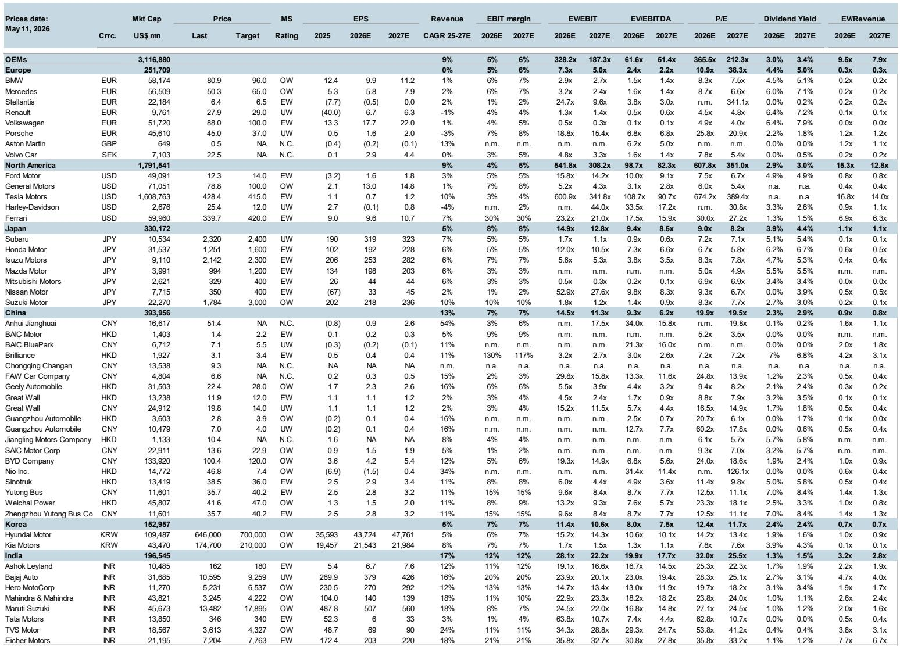
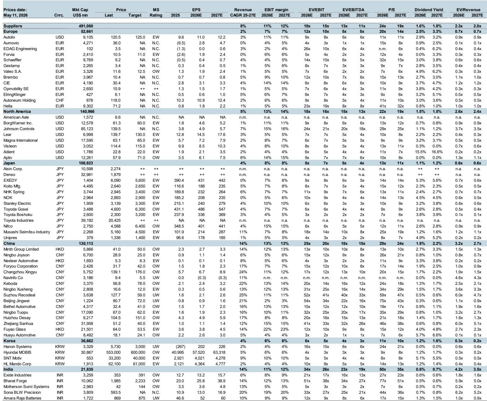
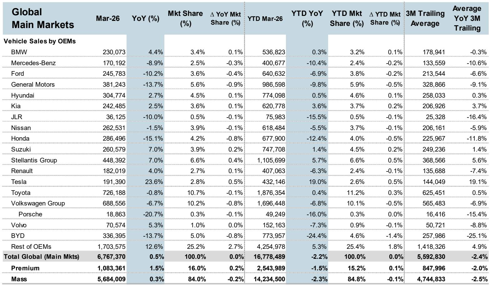

# European Autos Are Priced for a Crisis That Has Not Yet Fully Arrived

The European automotive sector has entered a phase of extreme relative underperformance that historically precedes a turning point, but the current risk-reward profile is not yet a clear buy signal. After years of outperformance during the post-pandemic recovery, European auto stocks have fallen sharply relative to the broader market, driven by collapsing margins, earnings downgrades, and structural fears about Chinese competition. The sector now trades at valuations that imply a margin trough deeper than anything seen in the past decade. Yet the fundamental catalysts for a sustained recovery remain uncertain, and the timing of the margin cycle bottom appears to be 2025-2026 at the earliest. Investors face a dilemma: the price already reflects significant bad news, but the news flow is likely to get worse before it gets better.

The underperformance is not uniform across the sector, and this divergence contains the most important strategic insight. Trucks have held up far better than original equipment manufacturers, while auto parts suppliers have suffered a dramatic collapse in relative valuation. Tyres sit somewhere in the middle, with no compelling reason to allocate capital. This dispersion tells a story about earnings power, cyclical exposure, and structural vulnerability. The market is not simply selling all European auto-related equities; it is making sharp distinctions based on business model resilience and end-market exposure. Understanding these distinctions is the key to positioning for the next cycle.

The report from a global investment bank makes clear that margins are the dominant driver of both absolute and relative performance in this sector. The correlation between EBIT margins and stock price performance is striking across all sUBSegments. This means that any investment thesis must be built on a view of where margins are heading, not on valuation multiples or historical averages. The current margin compression reflects both cyclical factors and structural shifts, and separating these two forces is the central analytical challenge.

The structural issue that looms largest is the accelerating share gain of Chinese automakers, both in their domestic market and increasingly in Europe. This is not a new concern, but the pace of disruption is intensifying. European OEMs are losing pricing power and volume in their most profitable segments, particularly in the premium electric vehicle space where Chinese competitors are advancing rapidly. The implications extend beyond OEMs to the entire supply chain, as parts suppliers face pressure from both their OEM customers and from the potential loss of business to Chinese suppliers.

For investors who have followed the sector through multiple cycles, the current setup is reminiscent of previous troughs, but with an important difference. In past downturns, the recovery was driven by a combination of cost restructuring, capacity rationalization, and a rebound in demand. Today, the demand outlook in Europe is constrained by weak macroeconomic conditions, while the competitive landscape is being reshaped by a new set of players with cost advantages and technological momentum. The recovery, when it comes, may be shallower and more selective than in previous cycles.

## The Margin Cycle Is Bottoming Later Than the Market Expects, Making Early Positioning Dangerous

The report identifies 2025-2026 as the likely trough for European auto margins, with a mild recovery beginning in 2027. This timeline is longer than what many investors have been pricing in, and it explains why the recent underperformance has been so persistent. The market has been anticipating a recovery that keeps getting pushed out, and each delay has led to further earnings downgrades and multiple compression.

The historical relationship between margins and stock performance is clear. When the SXAP index is indexed to 100 at the one-year mark, EBIT margins track almost perfectly with price movement. The same pattern holds for auto parts and for the relative performance of European autos versus the broader market. This means that as long as margins are declining, the sector will struggle to outperform, regardless of how cheap valuations appear.

The timing question is critical because it determines whether the current risk-reward is attractive or merely a value trap. If margins bottom in 2025, then the next twelve to eighteen months will see continued earnings pressure, and stocks could fall further even from already depressed levels. If the trough arrives earlier, then the current prices may represent a compelling entry point. The report tilts toward the later timeline, which suggests patience is required.

The implication for portfolio construction is that investors should not try to time the exact bottom. Instead, the focus should be on identifying companies that can defend their margins through the downturn, either through cost advantages, market positioning, or business model resilience. These companies will emerge from the cycle stronger relative to peers, and the market will reward them with multiple expansion as the recovery approaches.

## Structural China Competition Is Not Cyclical and Requires a Permanent Repricing of European Auto Assets

The most significant structural challenge facing European autos is the accelerating market share gains of Chinese manufacturers, both in China and in export markets. This is not a temporary disruption that will reverse when the cycle turns. It represents a permanent shift in the competitive landscape that requires a fundamental reassessment of the earnings power of European OEMs and their suppliers.

Chinese automakers have achieved cost advantages in battery electric vehicles that European incumbents cannot easily match. These advantages come from vertical integration, lower labor costs, and a domestic supply chain that has scaled rapidly. The result is that Chinese EVs can offer comparable or superior features at significantly lower price points, putting pressure on European margins in the most important growth segment of the market.

The report highlights that this share gain is accelerating, which means the problem is getting worse, not stabilizing. European OEMs are responding with their own EV launches and cost reduction programs, but the timing is challenging. They are investing heavily in new platforms and battery technology at the same time as their traditional internal combustion engine profits are declining. This creates a profit squeeze that will persist for several years.

For auto parts suppliers, the China challenge is more nuanced. Some suppliers have diversified customer bases and are less exposed to European OEMs. Others are heavily dependent on a few large customers and face significant risk if those customers lose market share. The report's preference for parts suppliers over OEMs reflects this differentiation, but it also acknowledges that the parts segment has already experienced severe relative underperformance.

The strategic question for investors is whether the current valuations adequately reflect this structural shift. If European auto assets need to be permanently revalued downward to reflect lower long-term earnings power, then even today's depressed prices may not be cheap. The report suggests that the risk-reward has improved, but this is a relative judgment, not an absolute one.

## Premium OEMs Offer Relative Safety, But Volume Players Face a Deeper Structural Crisis

The report expresses a preference for premium OEMs over volume manufacturers, and this distinction is crucial for understanding where value may be hiding. Premium brands have pricing power, loyal customer bases, and higher margins that provide a buffer during downturns. They also have more room to absorb the costs of electrification without destroying profitability.

Volume OEMs face a more difficult equation. They operate in segments where price competition is intense, and they lack the brand strength to pass on cost increases. The shift to EVs is particularly challenging for volume players because the battery cost represents a much larger share of total vehicle cost, compressing margins that were already thin. Some volume OEMs may need to consolidate or form partnerships to survive, and the report's analysis leaves open the question of which companies have the balance sheet strength to navigate the transition.

The premium versus volume distinction also applies to the supply chain. Suppliers that serve premium OEMs tend to have better margin profiles and more stable relationships. Those that are heavily exposed to volume customers face greater earnings volatility and higher risk of contract renegotiation. The report's framework suggests that investors should favor suppliers with a high proportion of premium OEM revenue.

However, the premium segment is not immune to structural pressures. Chinese competitors are increasingly targeting the premium market, and European premium brands will need to defend their positions through technology leadership and brand investment. The outcome of this competition is uncertain, and the report does not provide a definitive answer on which premium brands will succeed.

## The Parts Segment Offers a Better Risk-Reward Than OEMs, But Execution Risk Remains High

Auto parts suppliers have underperformed dramatically relative to the broader market, and the report suggests this creates an opportunity for selective investors. The relative performance chart shows that EU auto parts have fallen from index levels above 300 to around 100 over the past several years, reflecting a massive de-rating. This decline has been driven by margin compression and concerns about the transition to EVs, which changes the content per vehicle and the competitive dynamics of the supply chain.

The argument for parts suppliers is that they are less exposed to the volume risk of vehicle sales and more exposed to content per vehicle, which can increase even if total vehicle sales are flat. As EVs become more complex and feature-rich, the value of components and systems per vehicle may rise, benefiting suppliers that have the right technology portfolio. Additionally, parts suppliers are often more diversified across geographies and customers than OEMs, reducing single-point-of-failure risk.

The report's framework for evaluating parts suppliers focuses on execution capability. In a challenging margin environment, companies that can deliver on cost reduction programs, manage working capital effectively, and maintain pricing discipline will outperform. The report does not identify specific companies, but the implication is that investors should look for suppliers with strong balance sheets, high free cash flow conversion, and a track record of margin resilience.

The risk is that the parts segment faces its own structural challenges. As European OEMs lose market share, their suppliers will lose business. Chinese suppliers are also competing for contracts, offering lower prices and faster development cycles. The parts segment may need to consolidate to achieve scale and cost efficiency, and the winners will be those that can navigate this consolidation while maintaining customer relationships.

## What the Report Does Not Fully Answer: The Path to Margin Recovery Remains Unclear

The report makes a compelling case that margins will bottom in 2025-2026 and recover mildly from 2027, but it leaves several critical questions unanswered. The most important is what will drive the recovery. In previous cycles, margin improvement came from a combination of volume growth, cost restructuring, and pricing power. Today, volume growth in Europe is constrained by weak economic conditions and the shift to EVs, which have lower margins. Cost restructuring is ongoing, but it takes time to deliver results and may be offset by investment requirements.

The report does not provide a clear catalyst for margin improvement. It identifies the trough timing but does not explain what will change to make margins inflect upward. This is a significant gap because without a catalyst, the timing thesis is based on mean reversion rather than fundamental improvement. Mean reversion can take longer than expected, and the market may not reward investors who position for it too early.

Another unanswered question is how the China competition will evolve. The report notes that Chinese share gain is accelerating, but it does not model the endpoint. If Chinese automakers capture 20% of the European market, what does that mean for European OEM margins? If they capture 40%? The range of outcomes is wide, and the report's margin forecasts may be too optimistic if the disruption is more severe than expected.

Finally, the report does not fully address the regulatory and policy environment. European governments are implementing tariffs on Chinese EVs and providing sUBSidies for domestic production, but these policies are subject to change. A more protectionist environment could help European OEMs in the short term, but it could also lead to retaliation and higher costs. The interplay between policy and competitive dynamics is complex and uncertain.

## A Decision Framework for Positioning in European Autos

For investors who want to act on the report's analysis, the following framework can guide decision-making. The first question is time horizon. Investors with a three-to-five-year view can consider building positions in high-quality names at current depressed valuations, accepting that near-term volatility may be significant. Investors with a twelve-month view should be more cautious, as the margin cycle has not yet bottomed and earnings downgrades may continue.

The second question is sub-sector exposure. The report's hierarchy of preference is clear: trucks offer the best relative performance, followed by parts, then tyres, then OEMs. Within each sub-sector, the focus should be on companies with strong balance sheets, diversified revenue streams, and pricing power. Premium OEMs are preferred over volume OEMs, and parts suppliers with exposure to premium customers are preferred over those serving volume players.

The third question is risk management. The European auto sector is exposed to multiple tail risks, including a deeper recession in Europe, escalation of trade tensions with China, and faster-than-expected market share loss. Position sizes should reflect these risks, and investors should have a clear exit strategy if the thesis breaks down. The report's analysis suggests that the risk-reward has improved, but it does not guarantee that the bottom is in.

The final question is what to watch. The key leading indicators are margins, earnings revisions, and relative performance. If margins stabilize or improve, earnings revisions turn positive, and the sector begins to outperform, that would be a confirmation signal. Until then, the report's framework suggests that the sector is cheap for a reason, and investors should be selective and patient.

## Join the community to read the full report and review the original charts.

*This article is for learning and discussion only and does not constitute investment advice.*

Personal reading notes and learning share only. Not investment advice.

