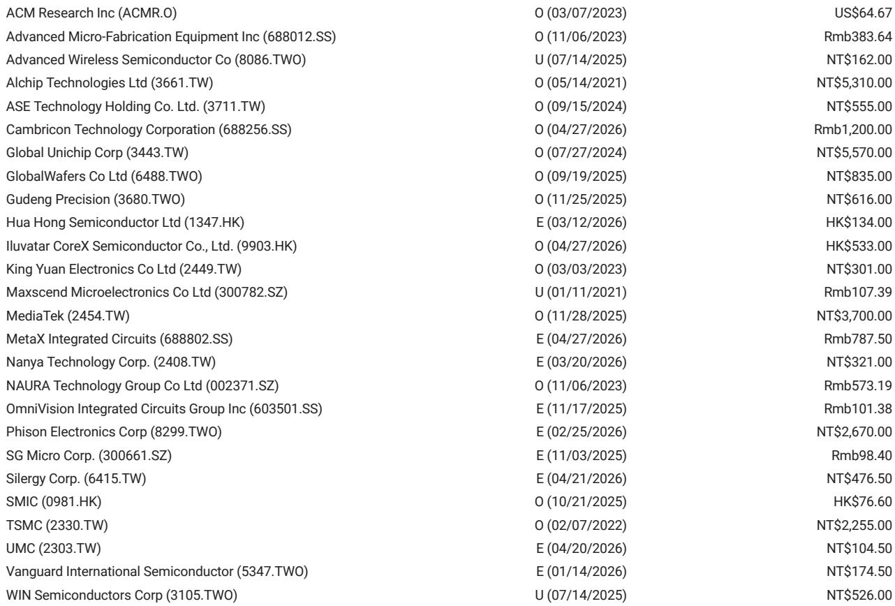
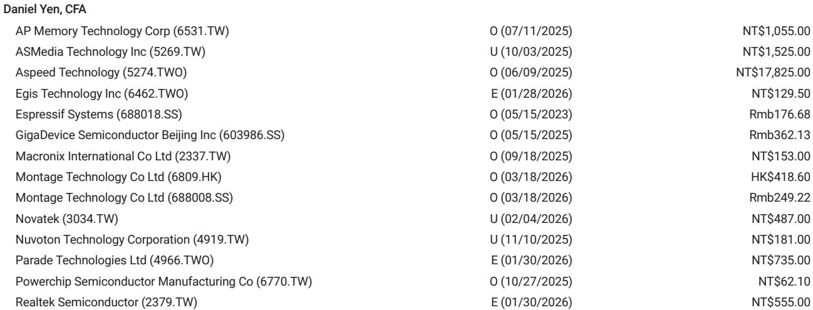
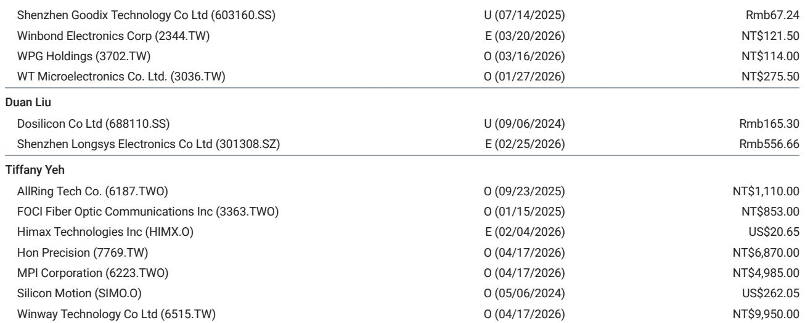

# The MCU Market Is Priced for a Recovery That Has Not Yet Arrived

The May spot price data for 32-bit microcontrollers in Greater China tells a story that the industry does not want to hear. STMicroelectronics' 32-bit MCU fell 7% month-over-month to RMB 12.8, and GigaDevice's 32-bit MCU dropped 11% month-over-month to RMB 8.5. These are not isolated data points. They represent a pattern that has persisted for over two years: every time the market expects a bottom, prices find a new one.

The conventional narrative holds that the semiconductor cycle is turning. Inventory destocking is largely complete. Lead times have normalized. Foundry utilization rates are rising. And yet, the spot market for MCUs continues to weaken. This divergence between expectation and reality is the single most important analytical tension in the sector today. Investors who fail to reconcile it will make expensive mistakes.

What makes the current situation particularly instructive is the behavior of the two dominant players. STMicroelectronics, the global leader in 32-bit MCUs, has seen its spot price decline by more than 60% from its January 2023 peak of RMB 30. GigaDevice, the leading Chinese domestic alternative, has followed a similar trajectory, falling from RMB 11 to RMB 8.5 over the same period. But the relationship between the two tells a more nuanced story about competitive dynamics, pricing power, and the limits of localization.

The argument of this article is straightforward: the MCU market is experiencing a structural repricing, not a cyclical trough. The implications for investors, procurement teams, and corporate strategists are profound. Those who treat this as a normal downturn will be caught off guard by its duration. Those who understand the underlying forces will be positioned to act decisively.

## The Spot Market Is Sending a Signal That Contract Prices Cannot Override

The most striking feature of the May data is the divergence between spot and contract pricing. GigaDevice implemented a price hike effective May 1, yet its spot price fell 11% month-over-month. This is not a contradiction. It is a revelation about the balance of power in the market.

Contract prices reflect negotiated agreements between suppliers and large customers, often with volume commitments and long lead times. They are backward-looking indicators, set weeks or months before delivery. Spot prices, by contrast, reflect the marginal cost of immediate supply. They are forward-looking. When spot prices fall while contract prices rise, it means that the incremental buyer is unwilling to pay the contract price. The market is telling us that demand at the margin is weaker than the official pricing suggests.

This dynamic has a clear historical precedent. During the 2018-2019 semiconductor downturn, spot prices led contract prices by roughly three to six months. The same pattern played out in the 2022 correction. The current data suggests we are in the early stages of another such repricing cycle, not the recovery that many analysts have been forecasting.

The implications for MCU design houses are direct and painful. Gross margins are already under pressure from rising foundry costs. Mature node foundries are likely to hike prices again in the coming quarters, as the report notes. If spot prices continue to decline, the gap between input costs and realized selling prices will widen. The companies that survive this cycle will be those with the lowest cost structures and the strongest relationships with end customers, not those with the most aggressive pricing strategies.

## GigaDevice's Price Hike Contradicts the Market Logic

GigaDevice's decision to raise prices in May is one of the most revealing data points in the entire report. At first glance, it appears to be a sign of confidence. A closer reading suggests it is a strategic gamble that may backfire.

The company occupies a unique position in the MCU ecosystem. As the leading Chinese domestic player, it benefits from the broader trend toward semiconductor localization. Government procurement policies, national security concerns, and supply chain diversification all favor domestic suppliers over foreign incumbents. This tailwind has allowed GigaDevice to gain market share even as the overall market contracts.

But the spot price data tells a different story. If demand were truly recovering, spot prices would be stable or rising. Instead, they are falling faster than the market leader's. This suggests that GigaDevice's price hike is not a response to demand but a response to cost pressure. The company is trying to pass through higher foundry costs to customers who may not be willing to accept them.

The risk is clear. If the price hike causes customers to delay orders or switch to alternative suppliers, GigaDevice could lose the market share gains it has worked so hard to achieve. The company is effectively betting that its localization advantage is strong enough to insulate it from market forces. That bet may prove correct in the long run, but the short-term data suggests it is a dangerous assumption.

For investors, the key question is whether GigaDevice's contract pricing can hold. If spot prices continue to decline, the gap between contract and spot will become unsustainable. Large customers will demand renegotiation. The company's gross margins, which have already been under pressure, will face further compression. The bull case for GigaDevice rests on the assumption that the market is in a temporary trough. The bear case is that the trough is deeper and longer than anyone expects.

## An 'L-Shaped' Recovery Is the Most Likely Outcome, and the Market Is Not Pricing It

The report explicitly states that an 'L-shaped' recovery is the base case unless memory prices decline meaningfully or edge AI adoption accelerates. This is a critical analytical judgment that deserves careful examination.

An L-shaped recovery means that demand stabilizes at a lower level and does not bounce back to previous peaks. This is fundamentally different from a V-shaped recovery, where demand snaps back quickly, or a U-shaped recovery, where demand gradually improves. In an L-shaped recovery, the industry must learn to operate with permanently lower volumes and prices.

What would cause such an outcome? The answer lies in the end-market structure. The two robust demand segments identified in the report are servers and drones. Everything else is lukewarm. Automotive, industrial, consumer electronics, and IoT applications are all showing weak or declining demand. These segments collectively account for the vast majority of MCU consumption.

The implications are stark. If the largest end markets are not recovering, the MCU market cannot recover. The server and drone segments are simply not large enough to absorb the excess capacity that was built during the pandemic-era boom. The industry is left with a structural oversupply that will take years to work through.

The report identifies two catalysts that could change this trajectory: a meaningful decline in memory prices or a pickup in edge AI. Both are plausible but uncertain. Memory prices have been declining, but not at a pace that would meaningfully reduce system costs for MCU customers. Edge AI adoption is accelerating in certain niche applications, but it has not yet reached the scale needed to move the needle for the broader market.

The analytical question that remains unanswered is whether any catalyst is strong enough to shift the trajectory within the next 12 to 18 months. The report's preference for large MCU players and WiFi MCU vendors reflects a bet on long-term structural trends, not near-term cyclical recovery. That is a defensible position, but it requires investors to have patience and a long time horizon.

## The Decision Framework Must Distinguish Between Structural and Cyclical Forces

For readers who need to make investment or procurement decisions based on this analysis, the key is to distinguish between structural and cyclical forces. The following framework is designed to help you do that.

First, assess the end-market exposure of any MCU supplier or customer. Companies with high exposure to servers and drones are better positioned than those with exposure to automotive or industrial. This is not a short-term call. It is a structural observation about where demand is likely to grow over the next several years.

Second, evaluate the cost structure. The companies that will survive this downturn are those with the lowest breakeven points. This means low operating leverage, minimal debt, and flexible supply chains. Companies that are heavily dependent on a single foundry or a single customer are at higher risk.

Third, consider the competitive dynamics within each segment. The MCU market is highly fragmented, with dozens of players competing for share. The consolidation that many analysts have predicted has not yet materialized. This means that pricing pressure will continue until weaker players exit the market or are acquired.

Fourth, monitor the spot-contract price divergence. If contract prices begin to converge toward spot prices, it will signal that the market is reaching a true equilibrium. If the divergence widens, it will signal that the pain is far from over.

Fifth, watch for signs of edge AI adoption. This is the most important potential catalyst for the market. If edge AI applications begin to scale, they will drive demand for higher-performance MCUs with integrated connectivity. The companies that are best positioned for this trend are the WiFi MCU vendors and the larger players with R&D resources.

The report's preference for GigaDevice and Espressif reflects this framework. GigaDevice benefits from localization and scale. Espressif benefits from edge AI exposure. Both are positioned for long-term growth. But the framework also explains why the report remains underweight on Nuvoton: the company's gross margin recovery is not yet visible, and its end-market exposure is less favorable.

## What the Report Does Not Fully Answer: The Timing and Magnitude of the Inflection Point

The report leaves several meaningful questions unanswered, and these are precisely the questions that investors should be asking.

First, when will the spot price decline bottom? The data shows that prices have been declining for over two years, but the rate of decline has not consistently slowed. This suggests that the market has not yet found a floor. The report does not provide a specific price target or timeline for stabilization.

Second, how will foundry pricing evolve? The report notes that mature node foundries are likely to hike prices again, but it does not specify the timing or magnitude. If foundry prices rise faster than MCU selling prices, the margin compression will be severe. If foundry prices stabilize, the pressure on MCU design houses will ease.

Third, what is the probability of an edge AI catalyst? The report identifies edge AI as a potential driver of recovery, but it does not quantify the likelihood or the expected impact. This is a judgment call that each investor must make based on their own research and conviction.

Fourth, what is the competitive response to GigaDevice's price hike? Will other domestic players follow suit, or will they try to gain market share by holding prices steady? The competitive dynamics within the Chinese MCU market are still evolving, and the outcome is uncertain.

Fifth, what is the impact of memory prices on MCU demand? The report suggests that a meaningful decline in memory prices could stimulate demand, but it does not specify what constitutes "meaningful" or how the transmission mechanism works.

These open questions are not weaknesses in the analysis. They are the natural result of a complex and uncertain market environment. The report provides a framework for thinking about these questions, but it cannot answer them definitively. That is the role of the investor.

## The Community That Reads the Full Report Will Be the First to See the Charts That Tell the Real Story

The spot price data presented in this article is only a fraction of what the full report contains. The original research includes detailed price trend charts for both STMicroelectronics and GigaDevice, covering the period from January 2023 through May 2026. These charts reveal the full arc of the downturn and provide the visual evidence that supports the analytical conclusions.

Seeing the charts in their original context changes the way you interpret the data. The month-to-month movements that seem significant in isolation become part of a larger pattern. The relationship between the two price series becomes clear. The inflection points become visible.

The full report also includes the valuation methodology and risk analysis for each of the covered companies. This is essential reading for anyone who wants to understand the assumptions behind the price targets and rating changes. The residual income models, the cost of equity assumptions, and the terminal growth rates are all laid out in detail.

Join the community to read the full report and review the original charts. The data and analysis in this article are a starting point, not an endpoint. The real insights are in the details.

*This article is for learning and discussion only and does not constitute investment advice.*

Personal reading notes and learning share only. Not investment advice.

