# Korea Economics Mid-Year Outlook

# Narrowing the K-shaped Recovery Gap

We now see the Korean economy recovering on a broader-based rebound. Unprecedented resilience in tech exports coupled with a faster-than-expected consumption recovery look set to close the negative output gap two quarters earlier than our previous forecast. We now see 3 hikes by the BoK from 4Q26.

# Key Takeaways

Korea set to move from K-shaped recovery to a broad-based rebound: Growth likely to jump 2.8% in 2026 vs 1.0% in 2025 before stabilizing to 2.2% in 2027.   
CPI inflation faces upward pressure to 2.5%Y, not only from elevated oil prices but from a faster-than-expected consumption recovery among households.   
With ample tax income amid strong corporate earnings, income and securities transaction taxes, the government could hand down an extra budget in 2H26.   
With an above-potential growth outlook through 2027, we see the BoK entering tightening territory above the neutral range; terminal rate at 3.25% by 1H27e.

Growth – broader-based resilience: We turn upbeat on Korea's growth resilience this year. Much-stronger-than-expected 1Q GDP print illustrated real exports are leading a major headline rebound along with faster-than-expected consumption growth, making it a balanced dynamic. We expect the growth divergence gap to narrow and close the K-shaped recovery gap. We nudge up our growth forecasts to 2.8% YoY for 2026 and 2.2% YoY for 2027.

Inflation – from supply to services: We raise our CPI inflation forecast to 2.5% for this year with the peak at 2.9% in 2Q26. After the first-round supply-side pressure takes effect via elevated energy prices, we see inflation staying sticky above 2% in 2H26 amid firmer services inflation. Along with our faster-than-expected consumption outlook, we now see core inflation at 2.3%, the highest level in 2 years.

Ample room for fiscal expansion: We expect favorable fiscal conditions ahead. Amid wages growth, strong corporate earnings, and increased asset transaction activities, we estimate annual tax receipts could rise to W430tn (vs MoFE W396tn). This would provide ample room for another supplementary budget in 3Q26 and another high-single digit budget expansion into next year without KTB issuance.

BoK – aiming for above neutral: On the monetary side, we raise our expectation for a terminal rate to 3.25% by mid-2027, starting from the first hike in 4Q26. Against a backdrop of growth print above the potential level, a likely positive output gap in 2H26 and a build-up of underlying price pressure through the rest of the year, we see the BoK waiting until after the first round energy price effects settle before entering into tightening territory.

MS ASIA LIMITED

# Kathleen Oh

Chief Korea/Taiwan Economist

Kathleen.Oh@morganstanley.com

+852 2848-7340

Exhibit 1: We expect a broad-based rebound in GDP growth to 2.8% YoY in 2026 vs. 1.0% in 2025

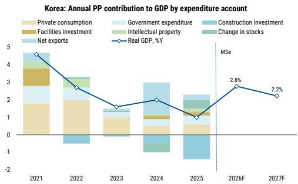

bar_line

Korea: Annual PP contribution to GDP by expenditure account
| Year | Net exports (%) | Net exports (MSe) | Facilities investment (%) | Government expenditure (%) | Real GDP, %Y |
| :--- | :--- | :--- | :--- | :--- | :--- |
| 2021 | 1.8 | -1.5 | 1.4 | 0.9 | 4.6 |
| 2022 | 1.8 | -1.5 | 0.3 | 0.3 | 2.7 |
| 2023 | 1.0 | -1.5 | 0.3 | 0.3 | 1.5 |
| 2024 | 1.0 | -1.5 | 0.3 | 0.3 | 2.0 |
| 2025 | 1.0 | -1.5 | 0.3 | 0.3 | 1.0 |
| 2026F | 1.0 | -1.5 | 0.3 | 0.3 | 2.8 |
| 2027F | 1.0 | -1.5 | 0.3 | 0.3 | 2.2 |

Source: BoK, MS forecasts

Exhibit 2 : Korea - forecast summary 

<table><tr><td></td><td>2024</td><td>2025</td><td>2026F</td><td>2027F</td></tr><tr><td>Real GDP, %Y</td><td>2.0</td><td>1.0</td><td>2.8</td><td>2.2</td></tr><tr><td>Private consumption</td><td>1.1</td><td>1.3</td><td>2.2</td><td>1.1</td></tr><tr><td>Gross fixed investment</td><td>-2.4</td><td>-1.8</td><td>0.1</td><td>2.0</td></tr><tr><td>Government expenditure</td><td>2.2</td><td>3.0</td><td>2.0</td><td>0.2</td></tr><tr><td>CPI inflation, %Y</td><td>2.3</td><td>2.0</td><td>2.5</td><td>2.2</td></tr><tr><td>Core CPI inflation, %Y</td><td>2.0</td><td>1.9</td><td>2.3</td><td>2.1</td></tr><tr><td>BoK Policy rate, %</td><td>3.00</td><td>2.50</td><td>2.75</td><td>3.25</td></tr><tr><td>Managed fiscal balance, % of GDP</td><td>-4.0</td><td>-4.0</td><td>-4.5</td><td>-4.3</td></tr><tr><td>Current account balance, % of GDP</td><td>4.4</td><td>6.5</td><td>10.6</td><td>5.6</td></tr></table>

Source: BoK, MS (F) forecasts

Exhibit 3: We now see the terminal rate by the BoK at 3.25% by mid-2027

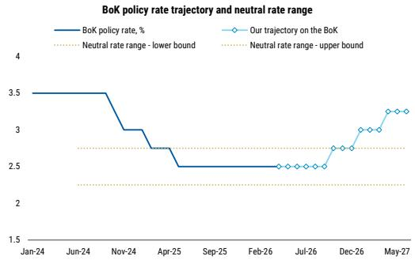

line

| Date    | BoK policy rate, % | Our trajectory on the BoK |
|---------|--------------------|----------------------------|
| Jan-24  | 3.5                | -                          |
| Jun-24  | 3.5                | -                          |
| Nov-24  | 3.0                | -                          |
| Apr-25  | 2.8                | -                          |
| Sep-25  | 2.5                | -                          |
| Feb-26  | 2.5                | -                          |
| Jul-26  | 2.5                | 2.5                        |
| Dec-26  | -                  | 3.0                        |
| May-27  | -                  | 3.3                        |

Source: BoK, MS forecasts

For important disclosures, refer to the Disclosure Section, located at the end of this report.

# 2026 Growth to See Broad-based Rebound to 2.8% YoY

# From K-shaped to balanced growth

We turn upbeat on Korea: We now expect growth to be more resilient and balanced than we had previously forecast. As a result, we lift our growth forecasts to 2.8% YoY for 2026 and 2.2% YoY for 2027 vs 1.0% in 2025 and 1.8% previously (see: South Korea: Reflecting Reset in Prices). While downward pressure from the tensions in the Middle East had us concerned about delays in non-tech demand and a consumption recovery, we now see larger-than-expected tech exports offsetting that downward pressure.

Much-stronger-than-expected 1Q GDP print: Korea's 1Q26 GDP surprised largely on the upside. It expanded 1.7% QoQ sa and by 3.6% YoY, largely above our forecast of 1.1% QoQ sa (2.9%) as well as consensus of 1.6% QoQ (2.8%). The sequential print in particular was notable as it illustrated the strongest expansion since 3Q20 at 2.2% QoQ sa (see: South Korea: 1Q26 Advance GDP: A Big Surprise to the Upside). Not only did headline growth expand (on a well-anticipated rebound in real exports) but it was significant that the growth appeared broader-based than we had expected. Domestic demand across private consumption (0.5% QoQ), construction investment (2.8%) and capex (4.8%) all rebounded visibly, which weakened the argument for sharp K-shaped growth.

Prior to this print, the imbalance in the tech export-led growth story for Korea left lingering concerns about the weak pulse of the domestic economy. Growth polarization between exports and domestic sectors as well as tech against non-tech sectors had kept us conservative on our growth outlook, which was below 2.0% for the year. This was reinforced by the added risk of an elevated oil price of US\$100/bbl for rest of this year, hence our further cut to 1.8% YoY.

We now expect growth of 2.8% YoY for 2026: We see the strength in the 1Q print partially benefiting from the base effect due to contraction in the prior quarter (4Q25: -0.2% QoQ sa). At the same time, the broad-based growth recovery, not just the rebound in real exports, demonstrates that the growth picture likely shows a healthier trend going forward.

Exhibit 4: Growth contribution from domestic and external demand to show a balanced dynamic   
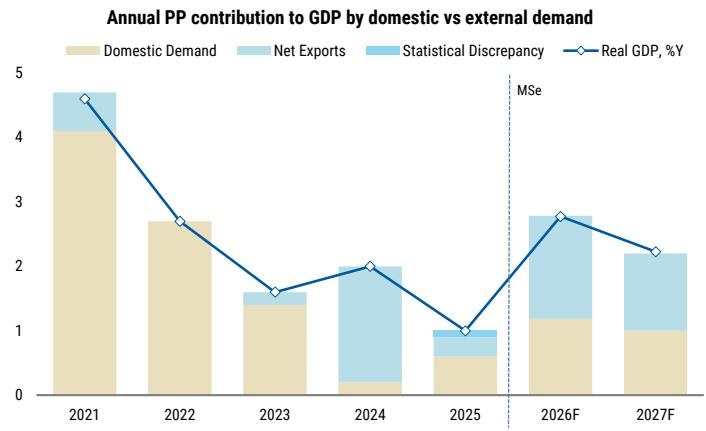

bar_line

Annual PP contribution to GDP by domestic vs external demand
| Year | Domestic Demand (%) | Net Exports (%) | Statistical Discrepancy (%) | Real GDP, %Y |
| :--- | :--- | :--- | :--- | :--- |
| 2021 | 4.0 | 0.5 | 0.3 | 4.6 |
| 2022 | 2.7 | 0.1 | 0.0 | 2.7 |
| 2023 | 1.4 | 0.1 | 0.0 | 1.6 |
| 2024 | 0.2 | 1.4 | 0.1 | 2.0 |
| 2025 | 0.6 | 0.3 | 0.1 | 1.0 |
| 2026F | 1.2 | 1.3 | 0.0 | 2.8 |
| 2027F | 1.0 | 1.3 | 0.0 | 2.2 |
MSe

Source: BoK, MS forecasts

Exhibit 5: Output gap to close the negative gap two quarters earlier than expected (2Q26 vs 4Q26 previously)   
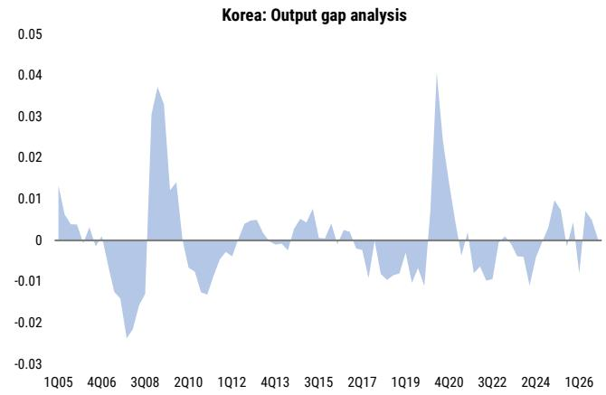

line

| Quarter | Output Gap |
| ------- | ---------- |
| 1Q05    | 0.01       |
| 4Q06    | -0.01      |
| 3Q08    | -0.02      |
| 2Q10    | 0.03       |
| 1Q12    | -0.01      |
| 4Q13    | 0.00       |
| 3Q15    | 0.01       |
| 2Q17    | -0.01      |
| 1Q19    | -0.02      |
| 4Q20    | 0.04       |
| 3Q22    | -0.01      |
| 2Q24    | -0.01      |
| 1Q26    | 0.01       |

Source: BoK, MS forecasts

# Output gap to turn positive earlier than expected

# This improved backdrop likely closes the negative output gap from 2Q26 onwards.

Our revised growth forecasts capture the positive outlook for tech exports and consumption. We expect sustained resilience in tech exports and positive tracking in the high frequency data for consumption, including credit card spending and leading indicators such as consumer sentiment data. This data implies that negative output will turn positive two quarters earlier than we previously forecast.

However, we also expect an unfavorable base to kick in from 2Q26. The strong print from 1Q26 and elevated oil prices are impacting domestic activities and industrial sectors, including the production activity of refineries and petrochemical plants, which could turn the sequential trend to a small contraction. By 2H26, we expect export growth to slow marginally, given the less favorable base, and stabilize below the accelerated level seen earlier in the year. The construction sector may contract again after rebounding in 1Q26 given some of the one-off factors (eg, delayed contracts for construction materials going through) could come under pressure again due to increased prices for raw materials.

That said, despite an overall slowdown in exports and investment activity for the rest of the year, household consumption and fiscal injection could support the above-2% growth for the second half. The wealth effect, combined with greater numbers of inbound visitors appears to be boosting high-end and tourism-related spending, which contributes to around 15% of total domestic consumption. We see a chance of a second supplementary budget in 3Q26 to the tune of around W10-15tn following the W26.2tn package passed in April.

Exhibit 6: Unfavorable base to kick-in from 2Q26 before a rebound in 2H26   

bar_line

GDP growth PP contribution by industry
| Quarter | Manufacturing (%) | Electricity, Gas & Water Supply (%) | Construction (%) | Services (%) | Others (%) | Real GDP, %Y |
| :--- | :--- | :--- | :--- | :--- | :--- | :--- |
| 1Q22 | 1.0 | 0.0 | 0.0 | 1.8 | -0.5 | 3.4 |
| 2Q22 | 1.0 | 0.0 | 0.0 | 1.7 | -0.5 | 3.0 |
| 3Q22 | 1.0 | 0.0 | 0.0 | 1.7 | -0.5 | 3.4 |
| 4Q22 | 1.0 | 0.0 | 0.0 | 1.7 | -0.5 | 3.4 |
| 1Q23 | -0.5 | -0.5 | -0.5 | 1.4 | -0.5 | 1.3 |
| 2Q23 | -0.5 | -0.5 | -0.5 | 1.4 | -0.5 | 1.3 |
| 3Q23 | 0.4 | 0.0 | -0.5 | 1.6 | -0.5 | 1.6 |
| 4Q23 | 1.8 | 0.0 | -0.5 | 1.9 | -0.5 | 2.6 |
| 1Q24 | 1.7 | 0.0 | -0.5 | 1.8 | -0.5 | 3.4 |
| 2Q24 | 1.4 | 0.0 | -0.5 | 1.6 | -0.5 | 2.3 |
| 3Q24 | 1.0 | 0.0 | -0.5 | 1.8 | -0.5 | 1.4 |
| 4Q24 | 0.6 | 0.0 | -0.5 | 1.4 | -0.5 | 1.1 |
| 1Q25 | -0.5 | -0.5 | -0.5 | 0.6 | -0.5 | 0.0 |
| 2Q25 | -0.5 | -0.5 | -0.5 | 1.3 | -0.5 | 0.6 |
| 3Q25 | 1.0 | 0.0 | -0.5 | 1.7 | -0.5 | 1.8 |
| 4Q25 | 1.0 | 0.0 | -0.5 | 1.7 | -0.5 | 1.6 |
| 1Q26 | 1.7 | 0.0 | -0.5 | 1.8 | -0.5 | 3.7 |
| 2Q26E (Last) | — | — | — | — | — | — |
| End: [Unlabeled] (Last) = [Unlabeled] (Last) + [Unlabeled] (Last) = [Unlabeled] (Last) (Last) (Last) (Last) (Last) (Last) (Last) (Last) (Last) (Last) (Last) (Last) (Last) (Last) (Last) (Last) (Last) (Last) (Last) (Last) (Last) (Last) (Last) (Last) (Last) (Last) (Last) (Last) (Last) (Last) (Last) (Last) (Last) (Last) = [Unlabeled] (Last) * [Unlabeled] (Last) * [Unlabeled] (Last) * [Unlabeled] (Last) * [Unlabeled] (Last) * [Unlabeled] (Last) * [Unlabeled] (Last) * [Unlabeled] (Last) * [Unlabeled] (Last) * [Unlabeled] (Last) * [Unlabeled] (Last) * [Unlabeled] (Last) * [-] * [-] * [-] * [-] * [-] * [-] * [-] * [-] * [-] * [-] * [-] * [-] * [-] * [-] * [-] * [-] * [-] * [-] * [-] * [-] * [-] * [-] * [-] * [-] * [-] * [-] * [-] * [-] * [-] * [-] * [-] * [-] * [-] * [-]* (-)[Unlabeled] (Last) * [Unlabeled] (Last) * [Unlabeled] (Last) * [Unlabeled] (Last) * [Unlabeled] (Last) * [Unlabeled] (Last) * [Unlabeled] (Last) * [Unlabeled] (Last) * [Unlabeled] (Last) * [Unlabeled] (Last)

Source: BoK, MS forecasts

# Unprecedented tech exports acceleration and capex recovery

We raise our real export growth forecast significantly to 10% YoY this year from 4.2% in 2025. We are witnessing an unprecedented super-cycle in tech, as seen by the rapid expansion of the DRAM market, resulting in a major rise in exports and capex activity in Korea. Amid AI infrastructure, service dispersion and a surge in data center investment, Korea – as a major memory supplier – is benefitting from rising global demand for HBM and generic DRAM (see: Technology: Rise of the AI Agent – Global Implications).

Against this favorable backdrop, semiconductor exports continue to benefit. Our tech analysts see bit growth across DRAM and NAND flash for Korea's two chipmakers jumping significantly by 20% in 2026 and 22% for 2027. Looking at the 1Q earnings of major US tech firms and their above-expectations guidance for AI capex, we see strength in Korea's semis exports sustained through next year. Despite the effective closure of the Strait of Hormuz and ongoing geopolitical tensions in the Middle East, we see minimal negative spillover onto the tech space. April exports showed a second consecutive month of high double-digit export growth (see: April Trade: Solid Tech Exports Offset Energy Imports).

At the same time, imports are also seeing support as capex activity picks up. We see a recovery in facilities investment as growth in the import of capital goods accelerates. We see imports rising 6.4% YoY this year from 3.8% in 2025, bringing the total net export contribution to growth to top 1.6pp, accounting for nearly 60% of headline growth for 2026.

Exhibit 7: Exports to jump significantly on AI-driven demand   
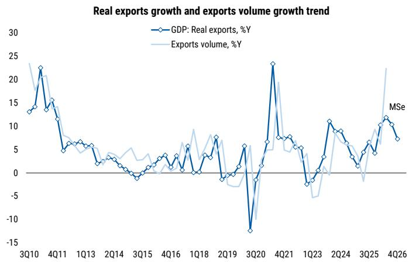

line

| Quarter | GDP: Real exports, %Y | Exports volume, %Y |
|---------|------------------------|---------------------|
| 3Q10    | ~13                    | ~24                 |
| 4Q10    | ~23                    | ~15                 |
| 1Q11    | ~15                    | ~10                 |
| 2Q11    | ~7                     | ~5                  |
| 3Q11    | ~5                     | ~3                  |
| 4Q11    | ~3                     | ~2                  |
| 1Q12    | ~2                     | ~1                  |
| 2Q12    | ~1                     | ~0                  |
| 3Q12    | ~0                     | ~-1                 |
| 4Q12    | ~1                     | ~0                  |
| 1Q13    | ~2                     | ~1                  |
| 2Q13    | ~3                     | ~2                  |
| 3Q13    | ~4                     | ~3                  |
| 4Q13    | ~5                     | ~4                  |
| 1Q14    | ~6                     | ~5                  |
| 2Q14    | ~7                     | ~6                  |
| 3Q14    | ~8                     | ~7                  |
| 4Q14    | ~9                     | ~8                  |
| 1Q15    | ~10                    | ~9                  |
| 2Q15    | ~11                    | ~10                 |
| 3Q15    | ~12                    | ~11                 |
| 4Q15    | ~13                    | ~12                 |
| 1Q16    | ~14                    | ~13                 |
| 2Q16    | ~15                    | ~14                 |
| 3Q16    | ~16                    | ~15                 |
| 4Q16    | ~17                    | ~16                 |
| 1Q17    | ~18                    | ~17                 |
| 2Q17    | ~19                    | ~18                 |
| 3Q17    | ~20                    | ~19                 |
| 4Q17    | ~21                    | ~20                 |
| 1Q18    | ~22                    | ~21                 |
| 2Q18    | ~23                    | ~22                 |
| 3Q18    | ~24                    | ~23                 |
| 4Q18    | ~25                    | ~24                 |
| 1Q19    | ~26                    | ~25                 |
| 2Q19    | ~27                    | ~26                 |
| 3Q19    | ~28                    | ~27                 |
| 4Q19    | ~29                    | ~28                 |
| 1Q20    | ~30                    | ~29                 |
| 2Q20    | ~31                    | ~30                 |
| 3Q20    | ~32                    | ~31                 |
| 4Q20    | ~33                    | ~32                 |
| 1Q21    | ~34                    | ~33                 |
| 2Q21    | ~35                    | ~34                 |
| 3Q21    | ~36                    | ~35                 |
| 4Q21    | ~37                    | ~36                 |
| 1Q22    | ~38                    | ~37                 |
| 2Q22    | ~39                    | ~38                 |
| 3Q22    | ~40                    | ~39                 |
| 4Q22    | ~41                    | ~40                 |
| 1Q23    | ~42                    | ~41                 |
| 2Q23    | ~43                    | ~42                 |
| 3Q23    | ~44                    | ~43                 |
| 4Q23    | ~45                    | ~44                 |
| 1Q24    | ~46                    | ~45                 |
| 2Q24    | ~47                    | ~46                 |
| 3Q24    | ~48                    | ~47                 |
| 4Q24    | ~49                    | ~48                 |
| 1Q25    | ~50                    | ~49                 |
| 2Q25    | ~51                    | ~50                 |
| 3Q25    | ~52                    | ~51                 |
| 4Q25    | ~53                    | ~52                 |
| MSe     | -                      | -                   |

Source: BoK, MS forecasts

Exhibit 8: Bit shipments expected to maintain two-digit growth   
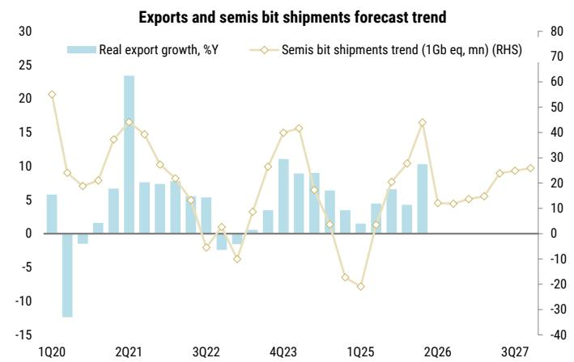

bar_line

Exports and semis bit shipments forecast trend
| Quarter | Real export growth, %Y (%) | Semis bit shipments trend (1Gb eq, mn) (RHS) |
| :--- | :--- | :--- |
| 1Q20 | 5.8 | 60 |
| 2Q20 | -13.4 | 9.5 |
| 3Q20 | -1.2 | 7.5 |
| 4Q20 | 1.6 | 14.5 |
| 1Q21 | 6.8 | 16.5 |
| 2Q21 | 23.5 | 45.0 |
| 3Q21 | 7.8 | 12.0 |
| 4Q21 | 7.8 | 8.5 |
| 1Q22 | 5.6 | -2.5 |
| 2Q22 | -2.0 | -4.0 |
| 3Q22 | -0.8 | 1.5 |
| 4Q22 | 3.5 | 10.0 |
| 1Q23 | 11.0 | 45.0 |
| 2Q23 | 9.0 | 45.0 |
| 3Q23 | 6.5 | 15.0 |
| 4Q23 | 3.5 | 5.0 |
| 1Q24 | 1.8 | -18.0 |
| 2Q24 | 6.5 | 20.0 |
| 3Q24 | 4.5 | 30.0 |
| 4Q24 | 10.5 | 45.0 |
| 1Q25 | - | -10.0 |
| 2Q25 | - | -18.0 |
| 3Q25 | - | - |
| 4Q25 | - | - |
| 1Q26 | - | - |
| 2Q26 | - | - |
| 3Q26 | - | - |
| 4Q26 | - | - |
| 1Q27 | - | - |
| 2Q27 | - | - |
| 3Q27 | - | - |
| End of Year (Last) | - | - |
The data is already in English. The last row is a duplicate of the first row to close the circle on the chart. There is no additional data series or comparisons available for the last three quarters of the year.

Source: BoK, MS forecasts

Exhibit 9: Unprecedented tech super-cycle benefits exports   
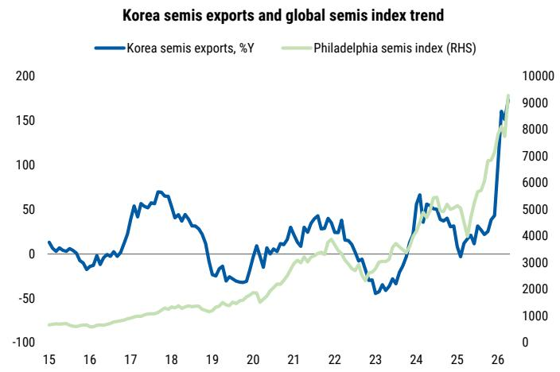

line

| Year | Korea semis exports, %Y | Philadelphia semis index (RHS) |
|------|------------------------|---------------------------------|
| 15   | ~10                    | ~-700                           |
| 16   | ~-10                   | ~-750                           |
| 17   | ~50                    | ~-600                           |
| 18   | ~70                    | ~-500                           |
| 19   | ~-20                   | ~-600                           |
| 20   | ~-30                   | ~-400                           |
| 21   | ~30                    | ~-200                           |
| 22   | ~40                    | ~200                            |
| 23   | ~-40                   | ~-100                           |
| 24   | ~60                    | ~500                            |
| 25   | ~-10                   | ~400                            |
| 26   | ~180                   | ~9000                           |

Source: Bloomberg, KITA, MS

Exhibit 10: Capex and capital goods imports ramped up by this   

line

| Year | Index of equipment investment estimation, %Y 6M-trailing | Capital goods imports, %Y (RHS) |
|------|----------------------------------------------------------|-------------------------------|
| 17   | ~5                                                       | ~10                           |
| 18   | ~18                                                      | ~25                           |
| 19   | ~-15                                                     | ~-20                          |
| 20   | ~5                                                       | ~10                           |
| 21   | ~10                                                      | ~30                           |
| 22   | ~5                                                       | ~15                           |
| 23   | ~0                                                       | ~5                            |
| 24   | ~-5                                                      | ~-15                          |
| 25   | ~5                                                       | ~25                           |
| 26   | ~0                                                       | ~20                           |

Source: Kosis, KITA, MS

# Faster-than-expected consumption recovery

We see a jump in private consumption to 2.2% YoY in 2026 from 1.1% last year and 1.7% previously. Despite elevated energy prices, we see: 1) fiscal policies supporting low-income households; 2) income levels improving for workers; and 3) the wealth effect driving

durable goods spending. Fiscal policy would likely provide some offset, with the first round of supplementary budget measures to provide direct transfers to the bottom 70% of households on an income-basis (package to be worth W10.1tn, or 0.4% of GDP). We also see the possibility of a second supplementary budget in 2H26 providing further targeted financial assistance to small business and lower-income households.

On the income side, while elevated oil prices have squeezed household real income, we see an improving income backdrop to offset the oil price shock. This year's early-year wage growth, including bonus compensation from last year, surged by 12% YoY in January-February, nearly triple the pace of the 5-year average of 4.45%. While the overall nominal annual wage growth trend continues to hover below-trend, this major rise in bonus level appears to be limited not just to the tech sector but to the wider manufacturing (+16.8%) and construction (22.4%) sectors, including food services and accommodation (30.3%), whose combined share accounts for 15% of total employment. This could benefit middle-income household spending capacity.

Moreover, we see evidence of the positive wealth effect on mid-to-upper-income households. This could help offset the constrained spending practices of mid- to lower-income households as a result of sUBStantial debt repayment obligations, which suggests to us that the recovery will remain gradual (see: Korea Economics/Consumer: Increasing Wealth, Concentrated Effect). By boosting durable goods spending and high-end and luxury goods sales activities, we see 15% of total consumption facing upward pressure.

Exhibit 11: We see a more stable consumption path   
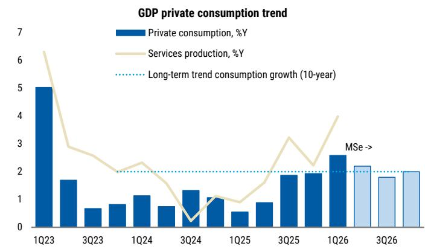

bar_line

GDP private consumption trend
| Period | Private consumption, %Y | Services production, %Y | Long-term trend consumption growth (10-year) |
|---|---|---|---|
| 1Q23 | 5.0 | 6.4 | |
| 3Q23 | 1.7 | 2.9 | |
| 1Q24 | 0.7 | 2.0 | |
| 3Q24 | 1.2 | 2.4 | |
| 1Q25 | 0.6 | 0.9 | |
| 3Q25 | 1.9 | 3.3 | |
| 1Q26 | 2.6 | 4.0 | MSe -> |
| 3Q26 | 1.8 | 2.2 | |
| 1Q27E | 1.8 | 2.0 | |

Source: BoK, MS forecasts

Exhibit 12: Both goods and services consumption to sustain   
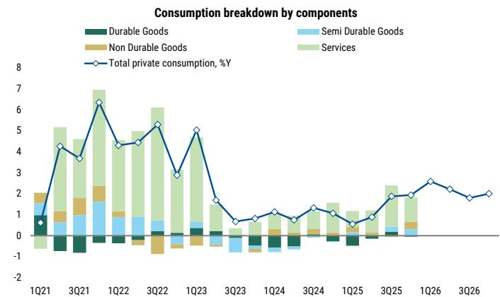

bar_line

Consumption breakdown by components
| Quarter | Durable Goods (%) | Semi Durable Goods (%) | Non Durable Goods (%) | Services (%) | Total private consumption, %Y |
| :--- | :--- | :--- | :--- | :--- | :--- |
| 1Q21 | 0.7 | 0.5 | 0.4 | 1.8 | 0.6 |
| 2Q21 | -0.3 | 0.9 | 0.6 | 2.1 | 3.7 |
| 3Q21 | -0.2 | 1.0 | 0.7 | 2.4 | 4.3 |
| 4Q21 | -0.1 | 1.1 | 0.5 | 2.8 | 6.4 |
| 1Q22 | -0.1 | 0.8 | 0.3 | 3.0 | 4.3 |
| 2Q22 | -0.1 | 0.8 | -0.3 | 3.0 | 4.4 |
| 3Q22 | -0.1 | 0.7 | -0.5 | 3.1 | 5.3 |
| 4Q22 | -0.1 | 0.6 | -0.6 | 3.1 | 5.5 |
| 1Q23 | -0.1 | 0.4 | -0.3 | 2.7 | 5.0 |
| 2Q23 | -0.1 | -0.2 | -0.4 | 1.5 | 1.7 |
| 3Q23 | -0.1 | -0.5 | -0.6 | 0.7 | 0.7 |
| 4Q23 | -0.1 | -0.6 | -0.7 | 0.8 | 0.8 |
| 1Q24 | -0.1 | -0.6 | -0.6 | 1.0 | 1.1 |
| 2Q24 | -0.1 | -0.6 | -0.6 | 1.0 | 0.8 |
| 3Q24 | -0.1 | -0.6 | -0.6 | 1.1 | 1.3 |
| 4Q24 | -0.1 | -0.6 | -0.6 | 1.1 | 1.3 |
| 1Q25 | -0.1 | -0.6 | -0.6 | 1.1 | 0.6 |
| 2Q25 | -0.1 | -0.6 | -0.6 | 1.1 | 1.8 |
| 3Q25 | -0.1 | -0.6 | -0.6 | 1.9 | 2.0 |
| 4Q25E | -0.1 | -0.6 | -0.6 | 2.3 | 2.5 |
| 1Q26E | -0.1 | -0.6 | -0.6 | 2.7 | 2.7 |
| 2Q26E | -0.1 | -0.6 | -0.6 | 2.3 | 2.1 |
| 3Q26E | -0.1 | -0.6 | -0.6 | 2.1 | 2.0 |
The chart displays a line graph representing the total private consumption as a percentage of year-over-year (%). The data is grouped by quarter (Q1–Q6), with each quarter's total consumption broken down into three components: Services, Non Durable Goods, and Semi Durable Goods, all measured on the Y-axis in percentage units.

Source: BoK, MS forecasts

Exhibit 13: Overall wage growth below the long-term trend...   
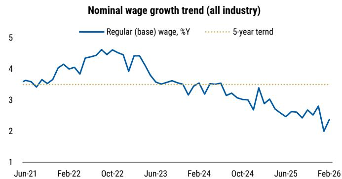

line

| Date    | Regular (base) wage, %Y |
|---------|--------------------------|
| Jun-21  | ~3.5                     |
| Feb-22  | ~4.0                     |
| Oct-22  | ~4.5                     |
| Jun-23  | ~3.5                     |
| Feb-24  | ~3.0                     |
| Oct-24  | ~2.5                     |
| Jun-25  | ~2.0                     |
| Feb-26  | ~1.5                     |

Source: Kosis, MS

Exhibit 14: ...But early year bonus has nearly tripled this year   
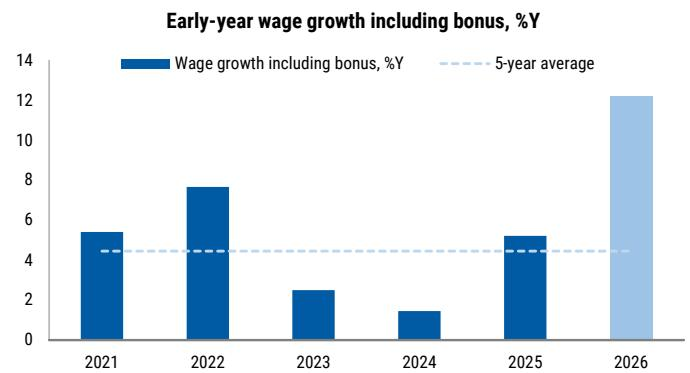

bar

| Year | Wage growth including bonus, %Y |
| ---- | ------------------------------ |
| 2021 | 5.3                            |
| 2022 | 7.7                            |
| 2023 | 2.4                            |
| 2024 | 1.4                            |
| 2025 | 5.2                            |
| 2026 | 12.3                           |

Source: Kosis, MS

# CPI Inflation: From Supply-side to Services Build-up

# We raise our CPI inflation forecast to 2.5% for this year with the peak at 2.9% in 2Q26.

Reflecting the elevated energy prices and faster-than-expected domestic recovery story, we forecast CPI inflation at 2.5% and core inflation at 2.3% for 2026. While higher oil prices are yet to have been fully passed through to domestic services inflation in 1Q26 as the administered price smoothing and retail oil price caps are in place, we forecast CPI inflation to rise to 2.9% YoY in 2Q26 before it stabilizes at 2.5% in 2H26.

After the first-round of supply-side pressure takes effect via elevated energy prices, we see inflation staying sticky above 2% in 2H26 amid firmer services inflation. While the administered price smoothing and retail oil price cap are in place, we see even a partial price pass-through rising visibly from 2Q26 before demand-driven services inflation rises to the mid-to-high 2% level in 2H26. Along with our faster-than-expected consumption outlook, we now see core inflation rising to 2.3% for 2026, the highest level in two years.

At the same time, inflation expectations are rising. After recording a sticky level of 2.6% for five months since October 2025, the inflation rate jumped to 2.9% in April 2026 amid rising energy prices. This has pushed the real inflation rate further into negative territory, and could prompt the BoK to shift toward a hiking cycle in 2H26, in our view.

Exhibit 15: We see an inflation trajectory above 2% through 2027; peaking in 2Q26   
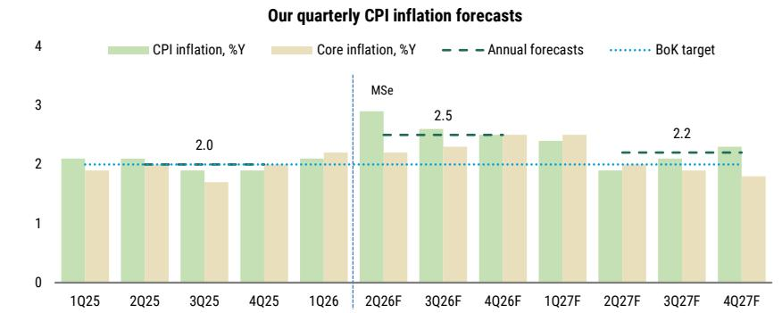

bar

| Quarter | CPI inflation, %Y | Core inflation, %Y |
|---------|-------------------|--------------------|
| 1Q25    | 2.1               | 1.9                |
| 2Q25    | 2.1               | 2.0                |
| 3Q25    | 1.9               | 1.7                |
| 4Q25    | 1.9               | 2.0                |
| 1Q26    | 2.1               | 2.2                |
| 2Q26F   | 2.9               | 2.2                |
| 3Q26F   | 2.6               | 2.3                |
| 4Q26F   | 2.5               | 2.5                |
| 1Q27F   | 2.4               | 2.5                |
| 2Q27F   | 1.9               | 2.0                |
| 3Q27F   | 2.1               | 1.9                |
| 4Q27F   | 2.3               | 1.8                |

Source: BoK, MS forecasts

Exhibit 16: Real rate extends further into negative territory as inflation expectations jump to 2.9% in April   
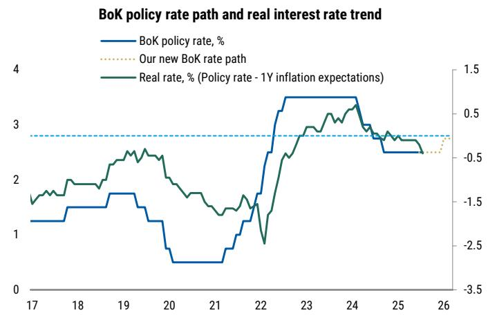

line

| Year | BoK policy rate, % | Our new BoK rate path | Real rate, % (Policy rate - 1Y inflation expectations) |
|------|---------------------|------------------------|--------------------------------------------------------|
| 17   | 1.5                 | -                      | 1.8                                                    |
| 18   | 1.5                 | -                      | 2.0                                                    |
| 19   | 1.5                 | -                      | 2.5                                                    |
| 20   | 0.5                 | -                      | 2.0                                                    |
| 21   | 0.5                 | -                      | 1.5                                                    |
| 22   | 1.5                 | -                      | 0.5                                                    |
| 23   | 3.5                 | -                      | 0.5                                                    |
| 24   | 3.5                 | -                      | 0.5                                                    |
| 25   | 2.5                 | -                      | 0.5                                                    |
| 26   | 2.5                 | -                      | 0.5                                                    |

Source: BoK, MS forecasts

Exhibit 17: Demand-driven services inflation looks set to climb to the 2% level by 2H26 vs 2.4% pre-Iran conflict   
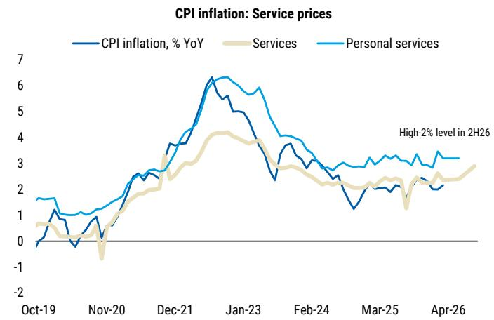

line

| Date   | CPI inflation, % YoY | Services | Personal services |
|--------|----------------------|----------|-------------------|
| High-2% | 3%                   | 3%       | 3%                |

Source: BoK, MS forecasts

# Policies: Fiscal – Ample Revenue for Expansion

We expect favorable fiscal conditions this year. Amid a rise in labor compensation, strong corporate earnings, and increased asset transaction activity, we estimate this year's tax receipts could rise 8% higher than the government's latest forecast (MSe: W430tn vs MoFE of W396tn excluding the supplementary budget).

Outlook for corporate tax receipts bodes well. Strong 1Q26 earnings announcements by local chipmakers is a guide to a significant jump in the corporate tax base for this year. Combined earnings for the two chipmakers during 1Q26 came to W94.8tn, up nearly 3x on the same quarter last year. The MoFE has accordingly revised the corporate tax receipt outlook to W101tn for 2026 from W89tn previously. Reflecting our tech analysts' bullish earnings outlook for the two firms - more than W700tn combined for 2026 - we think the corporate tax take could rise to W111tn this year as corporate taxes for 1H26 come in by early-September, and the rest by March 2027.

Other categories also suggest a favorable tax backdrop. As of 1Q26, tax receipts jumped 16% YoY to W108.8tn, with taxes increasing across the major categories. Notable increases came from income taxes and VAT, up 16% and 24%, respectively, from the same quarter last year. Driven by the jump in annual compensation, paid out mostly in February, both income and consumption-driven tax receipts improved.

Moreover, tax on securities transactions jumped 240% YoY on the back of equity market outperformance globally. With improving consumption activity and income across key sectors in manufacturing (tech) and services, we estimate the government could see an additional W20tn in tax receipts this year.

This implies another extra budget and expansionary fiscal onto 2027. Amid strong export performance and highly active asset markets, we expect tax revenue to double the Budget Office's original forecast of W25tn. This implies room for a second extra budget without KTB issuance in 2H26. We think a targeted W10-15tn of a package to help vulnerable income groups and small businesses could come forth. By August, we expect the draft for another high-single digit budget expansion for 2027. Following a 8% rise in budget for this year excluding the extra budget, we see a 7-8% expansion on the way.

Exhibit 18: We think tax income could rise 8% more than the government's forecast, mostly on corporate tax increase   
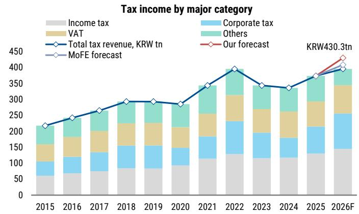

bar_stacked

Tax income by major category
| Year | Income tax (in trillions) | VAT (in trillions) | Corporate tax (in trillions) | Others (in trillions) | Total tax revenue, KRW tn (in trillions) | MoFE forecast (in trillions) | Our forecast (in trillions) |
| :--- | :--- | :--- | :--- | :--- | :--- | :--- | :--- |
| 2015 | 60 | 70 | 40 | 50 | 210 | 0 | 0 |
| 2016 | 65 | 75 | 45 | 55 | 230 | 0 | 0 |
| 2017 | 70 | 80 | 50 | 60 | 250 | 0 | 0 |
| 2018 | 75 | 85 | 55 | 65 | 290 | 0 | 0 |
| 2019 | 75 | 85 | 60 | 65 | 295 | 0 | 0 |
| 2020 | 90 | 80 | 55 | 65 | 285 | 0 | 0 |
| 2021 | 110 | 90 | 70 | 75 | 340 | 0 | 0 |
| 2022 | 130 | 95 | 85 | 80 | 395 | 0 | 0 |
| 2023 | 115 | 85 | 75 | 70 | 345 | 0 | 0 |
| 2024 | 115 | 85 | 65 | 65 | 335 | 0 | 0 |
| 2025E | 135 | 95 | 85 | 75 | 375 | 0 | 1 |
| KRW430.3tn (Year) | - | - | - | - | - | - | - |
| MoFE forecast (Year) (Year) (2026F) (Point to End) (Year) (Point to End) (Year) (Point to End) (Year) (Point to End) (Year) (Point to End) (Year) (Point to End) (Year) (Point to End) (Year) (Point to End) (Year) (Point to End) (Year) (Point to End) (Year) (Point to End) (Year) (Point to End) (Year) (Point to End) (Year) (Point for Year) (Year) (Point for Year) (Year) (Point for Year) (Year) (Point for Year) (Year) (Point for Year) (Year) (Point for Year) (Year) (Point for Year) (Year) (Point for Year) (Year) (Point for Year) (Year) (Point for Year) (Year) (Point for Year) (Year) (Point for Year) (Year) (Point for Year) (Year), MoFE forecast (Year) (Year) (Year) (Year) (Year) (Year) (Year) (Year) (Year) (Year) (Year) (Year) (Year) (Year) (Year) (Year) (Year) (Year) (Year) (Year) (Year) (Year) (Year) (Year) (Year) (Year) (Year) (Year) (Year) (Year) (Year) (Year) (Year) (Year) = MoFE forecast; MoFE forecast: Total tax revenue, KRW tn; Our forecast: Total tax revenue, KRW tn; MoFE forecast: Total tax revenue, KRW tn; MoFE forecast: Total tax revenue, KRW tn; MoFE forecast: Total tax revenue, KRW tn; MoFE forecast: Total tax revenue, KRW tn; MoFE forecast: Total tax revenue, KRW tn; MoFE forecast: Total tax revenue, KRW tn; MoFE forecast: Total tax revenue, KRW tn; MoFE forecast: Total tax revenue, KRW tn; MoFE forecast: Total Tax Revenue, KRW tn; MoFE forecast: Total Tax Revenue, KRW tn; MoFE forecast: Total Tax Revenue, KRW tn; MoFE forecast: Total Tax Revenue, KRW tn; MoFE forecast: Total Tax Revenue, KRW tn; MoFE forecast: Total Tax Revenue, KRW tn; MoFE forecast: Total Tax Revenue, KRW tn; MoFE forecast: Total Tax Revenue, KRW tn; MoFE forecast: Total Tax Revenue, KRWtn; MoFE forecast: Total Tax Revenue, KRWtn; MoFE forecast: Total Tax Revenue, KRWtn; MoFE forecast: Total Tax Revenue, KRWtn; MoFE forecast: Total Tax Revenue, KRWtn; MoFE forecast: Total Tax Revenue, KRWtn; MoFE forecast: Total Tax Revenue, KRWtn; MoFE forecast: Total Tax Revenue, KRWtn; MoFE forecast: Total Tax Revenue, KRWtn; MoFE Forecast: Total Tax Revenue, KRWtn; MoFE Forecast: Total Tax Revenue, KRWtn; MoFE Forecast: Total Tax Revenue, KRWtn; MoFE Forecast: Total Tax Revenue, KRWtn; MoFE Forecast: Total Tax Revenue, KRWtn; MoFE Forecast: Total Tax Revenue, KRWtn; MoFE Forecast: Total Tax Revenue, KRWtn; MoFE Forecast: Total Tax Revenue, KRWtn; MoFE Forecast: Total Tax Expense, KRWtn; MoFE Forecast: Total Tax Expense, KRWtn; MoFE Forecast: Total Tax Expense, KRWtn; MoFE Forecast: Total Tax Expense, KRWtn; MoFE Forecast: Total Tax Expense, KRWtn; MoFE Forecast: Total Tax Expense, KRWtn; MoFE Forecast: Total Tax Expense, KRWtn; MoFE Forecast: Total Tax Expense, KRWtn; MoFE Forecast: Total Tax Expense, KRWt; MoFE Forecast: Total Tax Expense, KRWt; MoFE Forecast: Total Tax Expense, KRWt; MoFE Forecast: Total Tax Expense, KRWt; MoFE Forecast: Total Tax Expense, KRWt; MoFE Forecast: Total Tax Expense, KRWt; MoFE Forecast: Total Tax Expense, KRWt; MoFE Forecast: Total Tax Expense, KRWt; MoFE Forecast: Total Tax Expense, KRWt; MoFEForecast: Total Tax Expense, KRWt; MoFEForecast: Total Tax Expense, KRWt; MoFEForecast: Total Tax Expense, KRWt; MoFEForecast: Total Tax Expense, KRWt; MoFEForecast: Total Tax Expense, KRWt; MoFEForecast: Total Tax Expense, KRWt; MoFEForecast: Total Tax Expense, KRWt; MoFEForecast: Total Tax Expense, KRWt; MoFEForecast: Total Tax Exp., KRWt; MoFEForecast: Total Tax Exp., KRWt; MoFEForecast: Total Tax Exp., KRWt; MoFEForecast: Total Tax Exp., KRWt; MoFEForecast: Total Tax Exp., KRWt; MoFEForecast: Total Tax Exp., KRWt; MoFEForecast: Total Tax Exp., KRWt; MoFEForecast: Total Tax Exp., KRWt; MoFEForecast: Total Tax Exp., KRWt<nl>

Source: NABO, MoFE, MS

Exhibit 19: Our tech team expects earnings to rise 7.8x for the two Korean chipmakers this year   
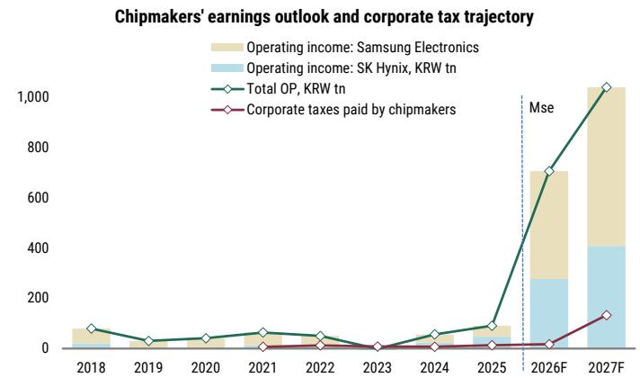

line

| Year   | Operating income: Samsung Electronics | Operating income: SK Hynix, KRW tn | Total OP, KRW tn | Corporate taxes paid by chipmakers |
|--------|----------------------------------------|--------------------------------------|------------------|-------------------------------------|
| 2018   | ~50                                    | ~10                                  | ~80              | ~0                                  |
| 2019   | ~30                                    | ~10                                  | ~40              | ~0                                  |
| 2020   | ~30                                    | ~10                                  | ~40              | ~0                                  |
| 2021   | ~30                                    | ~10                                  | ~60              | ~0                                  |
| 2022   | ~30                                    | ~10                                  | ~60              | ~0                                  |
| 2023   | ~30                                    | ~10                                  | ~60              | ~0                                  |
| 2024   | ~30                                    | ~10                                  | ~80              | ~0                                  |
| 2025   | ~30                                    | ~10                                  | ~100             | ~0                                  |
| 2026E  | ~400                                   | ~300                                 | ~700             | ~10                                 |
| 2027E  | ~500                                   | ~400                                 | ~1,100           | ~150                                |

Source: Company data, MS forecasts

# Monetary policy: BoK – aiming for above neutral

On the monetary side, we now see the terminal rate higher at 3.25%. We expect a reactive BoK rather than pre-emptive hikes in response to headline CPI surging on elevated energy prices but with tolerance for a higher terminal level. We anticipate the BoK will wait until the signs of second-round effects and demand-pull pressure build sufficiently before taking action. We expect these signs to be more visible by 3Q26, and forecast the first hike to start in 4Q26.

Against the backdrop of a growth print above the potential level, a likely positive output gap in 2H26 and underlying price pressure building through the rest of the year, we see the BoK being open to entering further into tightening territory by 1Q27, to a terminal rate of 3.25%.

Moving to price stability from financial stability concerns. With strength in tech exports and related investment activity expected to keep headline GDP growth buoyed, the output gap should turn and remain in positive territory in 2H26. This could give the BoK the resolve to prioritize inflation concerns over potential downside risks to growth, in our view. The BoK is likely to be closely monitoring uncertainties around downside risks to growth while upside risks to inflation materialize.

In the April meeting minutes, one member stated: "Last year the policy focus was on growth recovery, from the latter half of last year to early this year it was on financial stability, now is the time to focus on inflationary pressure". We see this captured by the BoK's policy focus shifting toward price stability, not only due to the increases in energy prices but also because it is the year when demand-pull pressures will start to build.

As Korea enters its second year of fiscal expansion, we see three factors potentially hastening this shift: 1) positive transmission effects from rate cuts kicking-in; 2) faster-than-expected consumption activity; and 3) the wealth effect leading to accelerated spending by the household sector.

Exhibit 20: We see three BoK hikes now, starting from 4Q26, to a terminal rate of 3.25% by mid-2027   
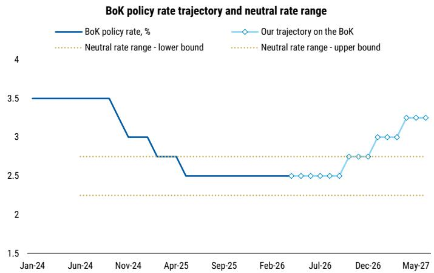

line

| Date    | BoK policy rate, % | Our trajectory on the BoK |
|---------|--------------------|----------------------------|
| Jan-24  | 3.5                | -                          |
| Jun-24  | 3.5                | -                          |
| Nov-24  | 3.0                | -                          |
| Apr-25  | 2.8                | -                          |
| Sep-25  | 2.5                | -                          |
| Feb-26  | 2.5                | -                          |
| Jul-26  | 2.5                | 2.5                        |
| Dec-26  | 2.8                | 3.0                        |
| May-27  | 3.3                | 3.3                        |

Source: BoK, MS forecasts

Exhibit 21: With our US Economics team expecting two Fed cuts in 1Q27, rate differential looks set to close   
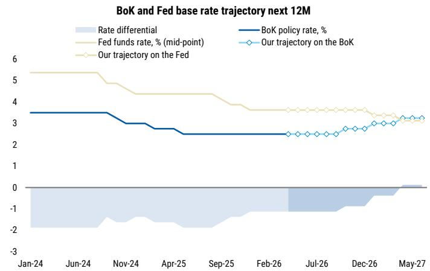

line

| Date   | BoK policy rate, % | Fed funds rate, % (mid-point) | Our trajectory on the Fed |
|--------|---------------------|----------------------------------|----------------------------|
| Jan-24 | 3.5                 | 5.5                              | 5.5                        |
| Jun-24 | 3.5                 | 5.5                              | 5.5                        |
| Nov-24 | 3.0                 | 4.5                              | 4.5                        |
| Apr-25 | 2.8                 | 4.5                              | 4.5                        |
| Sep-25 | 2.5                 | 4.0                              | 4.0                        |
| Feb-26 | 2.5                 | 3.5                              | 3.5                        |
| Jul-26 | 2.5                 | 3.5                              | 3.5                        |
| Dec-26 | 2.5                 | 3.0                              | 3.0                        |
| May-27 | 3.0                 | 3.0                              | 3.0                        |

Source: BoK, Fed, MS forecasts

Upcoming May meeting could be the starting point: In the May meeting, we expect to see a notable change in the BoK's macro forecasts for 2026-27. From a conservative growth forecast of 2.0% for 2026, we expect at least an upgrade to mid-to-high 2% vs our forecast of 2.8% on the back of strong semis exports and an improved outlook for consumption. The inflation forecast should also rise to mid 2%, in line with our forecast of 2.5% for the year, on the back of elevated energy prices.

Changes to Korea's MPC (monetary policy committee) dynamic are unlikely to influence the course of the rate path, in our view. The new Governor of the Bank of Korea, Hyun Song Shin, joined on 21 April and will host his first meeting in May. Incoming Governor Shin has demonstrated a willingness to take a more cautious and balanced approach to the supply-shock on inflation, and we expect the committee to take incremental steps towards moving to a rate hike cycle.

The current nominee to replace dovish Member Sung Hwan Shin, who left on on May 12, is Professor Jinil Kim, who is likely to join the Committee on May 13. So far the Professor's in-depth studies on monetary policies have shown a balanced view on the economy. We view him as highly data dependent, amid rising inflation and growth level likely fairly different from the previous dovish member Shin.

For the final change in membership will take place in August, when Deputy Governor Sangdai Rhoo will be replaced. We think the new member will likely take two to three meetings before indicating a strong policy bias, suggesting not appreciable divergence from the rest of the MPC.

# Risks to Our View

We think the risks to growth are skewed to the upside for both consumption and inflation. As strength in AI-driven semis demand continues, domestic trickle-down effects could come through the fiscal channel with larger corporate tax revenue and boosts to household income via improved compensation. Given our Korea Strategy team's positive outlook on the Korean equity market, household assets could also witness further increases, which could spill over onto consumption from the wealth effect.

Our expectation of a faster recovery in domestic demand could create further inflationary pressure from the demand side. Indeed, strong exports, coupled with a booming local equity market, which lifts domestic demand across investment and consumption, could see services inflation move beyond our base case expectation. This could see the BoK hike rates earlier by a quarter in 3Q26 in this case and in case of the GDP growth rising higher for next year, another hike could come into play, pushing the terminal rate to 3.50% by 3Q27 vs. our base case of 3.25% by 2Q27.

This report references jurisdictions which may be the subject of economic sanctions. Readers are solely responsible for ensuring that their investment activities are carried out in compliance with applicable laws.

# Disclosure Section

Information and opinions in MS were prepared or are disseminated by one or more of the following, which accept responsibility for its contents: MS Asia Limited, and/or MS Asia (Singapore) Pte. (Registration number 199206298Z) and/or MS Asia (Singapore) Securities Pte Ltd (Registration number 200008434H), regulated by the Monetary Authority of Singapore (which accepts legal responsibility for its contents and should be contacted with respect to any matters arising from, or in connection with, MS), and/or MS Taiwan Limited and/or MS & Co International plc, Seoul Branch, and/or MS Australia Limited (A.B.N. 67 003 734 576, holder of Australian financial services license No. 233742), and/or MS Wealth Management Australia Pty Ltd (A.B.N. 19 009 145 555, holder of Australian financial services license No. 240813, and/or MS India Company Private Limited having Corporate Identification No (CIN) U22990MH1998PTC115305, regulated by the Securities and Exchange Board of India ("SEBI") and holder of licenses as a Research Analyst (SEBI Registration No. INH000001105), Stock Broker (SEBI Stock Broker Registration No. INZ000244438), Merchant Banker (SEBI Registration No. INM000011203), and depository participant with National Securities Depository Limited (SEBI Registration No. IN-DP-NSDL-567-2021) having registered office at Altimus, Level 39 & 40, Pandurang Budhkar Marg, Worli, Mumbai 400018, India; Telephone no. +91-22-61181000; Compliance Officer Details: Mr. Tejarshi Hardas, Tel. No.: +91-22-61181000 or Email: tejarshi.hardas@morganstanley.com; Grievance officer details: Mr. Tejarshi Hardas, Tel. No.: +91-22-61181000 or Email: msic-compliance@morganstanley.com which accepts the responsibility for its contents and should be contacted with respect to any matters arising from, or in connection with, MS and their affiliates (collectively, "MS"). MS India Company Private Limited (MSICPL) may use AI tools in providing research services. All recommendations contained herein are made by the duly qualified research analysts; For important disclosures, stock price charts and equity rating histories regarding companies that are the subject of this report, please see the MS Disclosure Website at www.morganstanley.com/eqr/disclosures/webapp/generalresearch, or contact your investment representative or MS at 1585 Broadway, (Attention: Research Management), New York, NY, 10036 USA.

For valuation methodology and risks associated with any recommendation, rating or price target referenced in this research report, please contact the Client Support Team as follows: US/Canada +1 800 303-2495; Hong Kong +852 2848-5999; Latin America +1 718 754-5444 (U.S.); London +44 (0)20-7425-8169; Singapore +65 6834-6860; Sydney +61 (0)2-9770-1505; Tokyo +81 (0)3-6836-9000. Alternatively you may contact your investment representative or MS at 1585 Broadway, (Attention: Research Management), New York, NY 10036 USA.

# Global Research Conflict Management Policy

MS has been published in accordance with our conflict management policy, which is available at www.morganstanley.com/institutional/research/conflictpolicies. A Portuguese version of the policy can be found at www.morganstanley.com.br

# Important Disclosures

MS is not acting as a municipal advisor and the opinions or views contained herein are not intended to be, and do not constitute, advice within the meaning of Section 975 of the Dodd-Frank Wall Street Reform and Consumer Protection Act.

MS does not provide individually tailored investment advice. MS has been prepared without regard to the circumstances and objectives of those who receive it. MS recommends that investors independently evaluate particular investments and strategies, and encourages investors to seek the advice of a financial adviser. The appropriateness of an investment or strategy will depend on an investor's circumstances and objectives. The securities, instruments, or strategies discussed in MS may not be suitable for all investors, and certain investors may not be eligible to purchase or participate in some or all of them. MS is not an offer to buy or sell or the solicitation of an offer to buy or sell any security/instrument or to participate in any particular trading strategy. The value of and income from your investments may vary because of changes in interest rates, foreign exchange rates, default rates, prepayment rates, securities/instruments prices, market indexes, operational or financial conditions of companies or other factors. There may be time limitations on the exercise of options or other rights in securities/instruments transactions. Past performance is not necessarily a guide to future performance. Estimates of future performance are based on assumptions that may not be realized. If provided, and unless otherwise stated, the closing price on the cover page is that of the primary exchange for the subject company's securities/instruments.

The fixed income research analysts, strategists or economists principally responsible for the preparation of MS have received compensation based upon various factors, including quality, accuracy and value of research, firm profitability or revenues (which include fixed income trading and capital markets profitability or revenues), client feedback and competitive factors. Fixed Income Research analysts', strategists' or economists' compensation is not linked to investment banking or capital markets transactions performed by MS or the profitability or revenues of particular trading desks.

With the exception of information regarding MS, MS is based on public information. MS makes every effort to use reliable, comprehensive information, but we make no representation that it is accurate or complete. We have no obligation to tell you when opinions or information in MS change apart from when we intend to discontinue equity research coverage of a subject company. Facts and views presented in MS have not been reviewed by, and may not reflect information known to, professionals in other MS business areas, including investment banking personnel.

MS may make investment decisions that are inconsistent with the recommendations or views in this report.

To our readers based in Taiwan or trading in Taiwan securities/instruments: Information on securities/instruments that trade in Taiwan is distributed by MS Taiwan Limited ("MSTL"). Such information is for your reference only. The reader should independently evaluate the investment risks and is solely responsible for their investment decisions. MS may not be distributed to the public media or quoted or used by the public media without the express written consent of MS. Any non-customer reader within the scope of Article 7-1 of the Taiwan Stock Exchange Recommendation Regulations accessing and/or receiving MS is not permitted to provide MS to any third party (including but not limited to related parties, affiliated companies and any other third parties) or engage in any activities regarding MS which may create or give the appearance of creating a conflict of interest. Information on securities/instruments that do not trade in Taiwan is for informational purposes only and is not to be construed as a recommendation or a solicitation to trade in such securities/instruments. MSTL may not execute transactions for clients in these securities/instruments.

MS is not incorporated under PRC law and the research in relation to this report is conducted outside the PRC. MS does not constitute an offer to sell or the solicitation of an offer to buy any securities in the PRC. PRC investors shall have the relevant qualifications to invest in such securities and shall be responsible for obtaining all relevant approvals, licenses, verifications and/or registrations from the relevant governmental authorities themselves. Neither this report nor any part of it is intended as, or shall constitute, provision of any consultancy or advisory service of securities investment as defined under PRC law. Such information is provided for your reference only.

MS is disseminated in Brazil by MS C.T.V.M. S.A. located at Av. Brigadeiro Faria Lima, 3600, 6th floor, São Paulo - SP, Brazil; and is regulated by the Comissão de Valores Mobiliários; in Mexico by MS México, Casa de Bolsa, S.A. de C.V which is regulated by Comision Nacional Bancaria y de Valores. Paseo de los Tamarindos 90, Torre 1, Col. Bosques de las Lomas Floor 29, 05120 Mexico City; in Japan by MS MUFG Securities Co., Ltd. and, for Commodities related research reports only, MS Capital Group Japan Co., Ltd; in Hong Kong by MS Asia Limited (which accepts responsibility for its contents) and by MS Bank Asia Limited; in Singapore by MS Asia (Singapore) Pte. (Registration number 199206298Z) and/or MS Asia (Singapore) Securities Pte Ltd (Registration number 200008434H), regulated by the Monetary Authority of

Singapore (which accepts legal responsibility for its contents and should be contacted with respect to any matters arising from, or in connection with, MS) and by MS Bank Asia Limited, Singapore Branch (Registration number T14FC0118); in Australia to "wholesale clients" within the meaning of the Australian Corporations Act by MS Australia Limited A.B.N. 67 003 734 576, holder of Australian financial services license No. 233742, which accepts responsibility for its contents; in Australia to "wholesale clients" and "retail clients" within the meaning of the Australian Corporations Act by MS Wealth Management Australia Pty Ltd (A.B.N. 19 009 145 555, holder of Australian financial services license No. 240813, which accepts responsibility for its contents; in Korea by MS & Co International plc, Seoul Branch; in India by MS India Company Private Limited having Corporate Identification No (CIN) U22990MH1998PTC115305, regulated by the Securities and Exchange Board of India ("SEBI") and holder of licenses as a Research Analyst (SEBI Registration No. INH000001105); Stock Broker (SEBI Stock Broker Registration No. INZ000244438), Merchant Banker (SEBI Registration No. INM000011203), and depository participant with National Securities Depository Limited (SEBI Registration No. IN-DP-NSDL-567-2021) having registered office at Altimus, Level 39 & 40, Pandurang Budhkar Marg, Worli, Mumbai 400018, India; Telephone no. +91-22-61181000; Compliance Officer Details: Mr. Tejarshi Hardas, Tel. No.: +91-22-61181000 or Email: tejarshi.hardas@morganstanley.com; Grievance officer details: Mr. Tejarshi Hardas, Tel. No.: +91-22-61181000 or Email: msic-compliance@morganstanley.com. MS India Company Private Limited (MSICPL) may use AI tools in providing research services. All recommendations contained herein are made by the duly qualified research analysts; in Canada by MS Canada Limited; in Germany and the European Economic Area where required by MS Europe S.E., regulated by Bundesanstalt fuer Finanzdienstleistungsaufsicht (BaFin) under the reference number 149169; in the United States by MS & Co. LLC, which accepts responsibility for its contents. MS & Co. International plc, authorized by the Prudential Regulation Authority and regulated by the Financial Conduct Authority and the Prudential Regulation Authority, disseminates in the UK research that it has prepared, and research which has been prepared by any of its affiliates, only to persons who (i) are investment professionals falling within Article 19(5) of the Financial Services and Markets Act 2000 (Financial Promotion) Order 2005 (as amended, the "Order"); (ii) are persons who are high net worth entities falling within Article 49(2)(a) to (d) of the Order; or (iii) are persons to whom an invitation or inducement to engage in investment activity (within the meaning of section 21 of the Financial Services and Markets Act 2000, as amended) may otherwise lawfully be communicated or caused to be communicated. RMB MS Proprietary Limited is a member of the JSE Limited and A2X (Pty) Ltd. RMB MS Proprietary Limited is a joint venture owned equally by MS International Holdings Inc. and RMB Investment Advisory (Proprietary) Limited, which is wholly owned by FirstRand Limited. The information in MS is being disseminated by MS Saudi Arabia, regulated by the Capital Market Authority in the Kingdom of Saudi Arabia, and is directed at Sophisticated investors only.

The trademarks and service marks contained in MS are the property of their respective owners. Third-party data providers make no warranties or representations relating to the accuracy, completeness, or timeliness of the data they provide and shall not have liability for any damages relating to such data. The Global Industry Classification Standard (GICS) was developed by and is the exclusive property of MSCI and S&P.

MS, or any portion thereof may not be reprinted, sold or redistributed without the written consent of MS.

Indicators and trackers referenced in MS may not be used as, or treated as, a benchmark under Regulation EU 2016/1011, or any other similar framework.

The information in MS is being communicated by MS & Co. International plc (DIFC Branch), regulated by the Dubai Financial Services Authority (the DFSA) or by MS & Co. International plc (ADGM Branch), regulated by the Financial Services Regulatory Authority Abu Dhabi (the FSRA), and is directed at Professional Clients only, as defined by the DFSA or the FSRA, respectively. The financial products or financial services to which this research relates will only be made available to a customer who we are satisfied meets the regulatory criteria of a Professional Client. A distribution of the different MS Research ratings or recommendations, in percentage terms for Investments in each sector covered, is available upon request from your sales representative.

The information in MS is being communicated by MS & Co. International plc (QFC Branch), regulated by the Qatar Financial Centre Regulatory Authority (the QFCRA), and is directed at business customers and market counterparties only and is not intended for Retail Customers as defined by the QFCRA.

As required by the Capital Markets Board of Turkey, investment information, comments and recommendations stated here, are not within the scope of investment advisory activity. Investment advisory service is provided exclusively to persons based on their risk and income preferences by the authorized firms. Comments and recommendations stated here are general in nature. These opinions may not fit to your financial status, risk and return preferences. For this reason, to make an investment decision by relying solely to this information stated here may not bring about outcomes that fit your expectations.

Registration granted by SEBI and certification from the National Institute of Securities Markets (NISM) in no way guarantee performance of the intermediary or provide any assurance of returns to investors. Investment in securities market are subject to market risks. Read all the related documents carefully before investing.

© 2026 MS