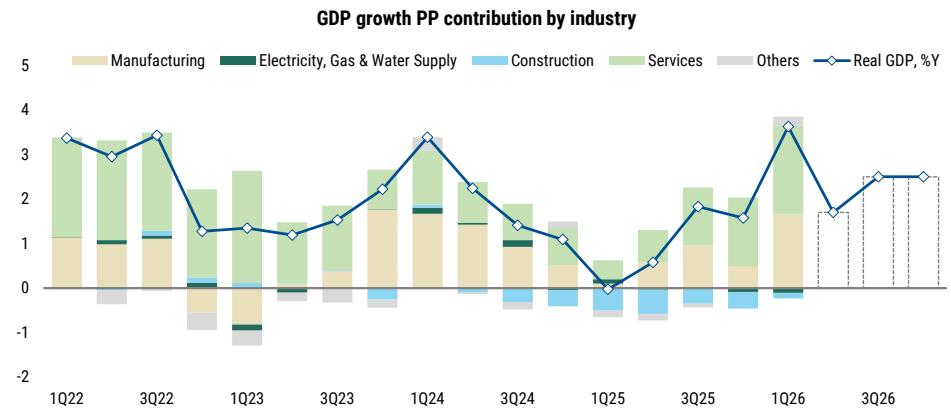
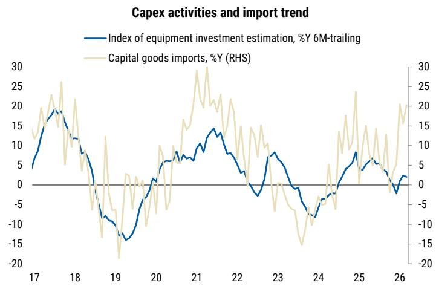

# Korea's K-Shaped Recovery Is Closing: Why the Broad-Based Rebound Demands a Rethink on Rates, Fiscal Policy, and Portfolio Strategy

The narrative around South Korea's economy has been dominated by one word for too long: divergence. The K-shaped recovery, where tech exports soared while domestic consumption and non-tech sectors languished, defined the post-pandemic period. That story is now ending. Based on a revised macroeconomic outlook from a leading global investment bank, the evidence is clear: Korea is transitioning from a lopsided, export-led recovery into a genuinely broad-based expansion. The first quarter of 2026 delivered a decisive signal. GDP grew at 1.7% quarter-on-quarter, the fastest pace since the third quarter of 2020, and the composition of that growth was as important as the headline number. Private consumption, construction investment, and capital expenditure all rebounded visibly. This is not a one-off base effect. It is a structural shift in the growth dynamic.

The implications are profound and they run directly counter to the consensus that has kept investors cautious on Korean assets. If growth is broadening, then the policy environment must adapt. The Bank of Korea, which has been in a cutting cycle, will now face an entirely different set of conditions. Inflation is no longer a transitory supply-side concern; it is becoming embedded in services and consumption. The output gap, which has been negative for an extended period, is set to turn positive two quarters earlier than previously forecast. This means the era of accommodative monetary policy is drawing to a close. The bank's next move will be a hike, not a cut, and the terminal rate could reach 3.25% by mid-2027.

This article will unpack the three critical shifts embedded in this outlook: the closing of the K-shaped gap, the transition from supply-driven to demand-driven inflation, and the fiscal space that strong corporate earnings have created. It will then address the most important unresolved question for investors and provide a decision framework for navigating the next 18 months. The argument is straightforward: the old playbook for Korea no longer applies. A new regime is forming, and those who recognize it early will have a strategic advantage.

## The K-Shaped Gap Is Closing Because Domestic Demand Has Finally Awakened

The defining feature of Korea's post-COVID economy was the stark divergence between its export sector, particularly semiconductors, and its domestic economy. For years, the narrative was that tech was booming while the rest of the country was treading water. This asymmetry created vulnerability. It meant that any shock to global tech demand would leave the entire economy exposed, and it kept domestic inflation and consumption expectations subdued. That structural weakness is now eroding.

The first quarter 2026 GDP print was the inflection point. While the headline growth of 3.6% year-on-year was impressive, the composition was the real story. Domestic demand contributed significantly to the sequential expansion. Private consumption grew 0.5% quarter-on-quarter, construction investment rebounded 2.8%, and capital expenditure surged 4.8%. This was not a repeat of the narrow, tech-driven growth that characterized previous quarters. It was a synchronized recovery across multiple sectors.

The mechanism behind this shift is twofold. First, the unprecedented resilience in tech exports has created a powerful wealth effect. Rising corporate earnings, particularly in the semiconductor sector, have boosted wages, dividends, and asset prices. This has translated into higher household spending power. Second, the labor market has tightened. With strong corporate profitability, hiring has remained robust, and wage growth has accelerated. The combination of higher asset prices and rising incomes is now feeding directly into consumption, particularly in high-end retail and tourism-related services, which account for roughly 15% of total domestic consumption.

The output gap data confirms this transition. The negative output gap, which has been a persistent drag on growth expectations, is now projected to close by the second quarter of 2026, two quarters earlier than previously anticipated. This is not a marginal improvement. It is a fundamental re-rating of Korea's growth trajectory. The economy is moving from operating below its potential to operating above it. This shift has direct implications for pricing power, corporate margins, and central bank policy.

## Inflation Is No Longer a Supply-Side Story; Services and Consumption Are the New Drivers

For much of the past two years, inflation in Korea was viewed through the lens of external supply shocks. Elevated energy prices, driven by geopolitical tensions in the Middle East, were the primary culprit. The policy response was to wait for these supply-side pressures to fade. That framework is now outdated. The inflation narrative is shifting from external supply to domestic demand.

The revised forecast places headline CPI inflation at 2.5% for 2026, with a peak of 2.9% in the second quarter. More importantly, core inflation is expected to reach 2.3%, its highest level in two years. This is not a temporary spike. It reflects a structural change in the composition of price pressures. The first round of inflation came from energy. The second round will come from services.

The mechanism is straightforward. As domestic demand strengthens, service providers gain pricing power. Labor costs are rising, and businesses are passing those costs on to consumers. The wealth effect from rising asset prices is also contributing to demand-pull inflation. Households are spending more, and that spending is putting upward pressure on prices in sectors that are less exposed to global competition, such as housing, dining, and personal services.

This shift has critical implications for the Bank of Korea. The central bank has been reluctant to tighten policy prematurely, preferring to let supply-side shocks work their way through the system. But services inflation is not transitory. It is persistent and self-reinforcing. Once it becomes embedded, it is much harder to extract without significant economic pain. The bank will need to act preemptively, and the report now expects three rate hikes starting in the fourth quarter of 2026, bringing the terminal rate to 3.25% by mid-2027.

The strategic question for investors is whether markets are pricing this shift correctly. The consensus has been that Korea would remain in a low-rate environment for an extended period. If the inflation dynamic is changing, then bond yields, currency expectations, and equity sector preferences will all need to adjust.

## Fiscal Policy Has More Room to Run Than the Market Expects

One of the most underappreciated elements of this outlook is the strength of Korea's fiscal position. The conventional wisdom is that the government has limited room for additional stimulus due to high debt levels and a large managed fiscal deficit. The data tells a different story.

The report estimates that annual tax receipts could reach 430 trillion won, significantly above the Ministry of Finance's estimate of 396 trillion won. This gap is driven by three factors: strong corporate earnings, rising wages, and increased asset transaction activity. As the economy broadens, income tax revenues, corporate tax receipts, and securities transaction taxes are all exceeding budget projections. This creates sUBStantial fiscal headroom.

The government has already passed a 26.2 trillion won supplementary budget in April. The report now sees room for an additional 10 to 15 trillion won supplementary budget in the third quarter of 2026. More importantly, the favorable revenue outlook means the government can pursue another high-single-digit budget expansion into 2027 without issuing additional Korea Treasury Bonds. This is a significant departure from the narrative of fiscal constraint.

The implications are twofold. First, fiscal policy will remain supportive of growth, providing a buffer against any external headwinds. Second, the combination of expansionary fiscal policy and tightening monetary policy creates a classic policy mix tension. The government is injecting demand while the central bank is withdrawing liquidity. This tension will likely keep the Korean won relatively strong and put upward pressure on long-term interest rates.

## The Unresolved Question: How Will the Consumption Recovery Interact with Higher Rates?

While the outlook is clearly more constructive, the report leaves one critical question unanswered. The consumption recovery is being driven by a wealth effect and rising wages. But the Bank of Korea is about to embark on a tightening cycle. How will these two forces interact?

The report assumes that consumption will remain resilient despite higher rates, but the evidence for this is not fully established. Korean households have high levels of debt, and the transmission mechanism of monetary policy in Korea is relatively fast. If the central bank raises rates aggressively, there is a risk that the consumption recovery stalls before it becomes self-sustaining.

This is the central tension in the outlook. The report projects private consumption growth of 2.2% in 2026, followed by a sharp deceleration to 1.1% in 2027. This deceleration is partly attributed to base effects and the fading of the wealth impulse. But it may also reflect the impact of tighter monetary policy. The question is whether the deceleration is orderly or disruptive.

Investors should watch high-frequency consumption data closely. Credit card spending and consumer sentiment indices will be the leading indicators. If consumption begins to weaken before the central bank has completed its tightening cycle, the policy trade-off becomes much more difficult. The Bank of Korea would face a choice between fighting inflation and supporting growth, a dilemma that would have significant implications for asset prices.

## A Decision Framework for the Next 18 Months

For investors and business leaders, the revised outlook demands a strategic reassessment. The old assumptions about Korea's low-growth, low-inflation, low-rate environment are no longer valid. The following framework can help navigate the transition.

First, reassess your exposure to domestic demand. The recovery is broadening, and sectors tied to consumption, construction, and services will benefit. This is a shift away from the narrow tech-led trade that has dominated for years. Companies with exposure to domestic retail, tourism, and real estate are likely to see improving fundamentals.

Second, prepare for a rate regime change. The Bank of Korea will begin hiking in the fourth quarter of 2026, and the terminal rate will be higher than current market pricing suggests. This has implications for bond portfolios, currency hedging strategies, and equity valuations, particularly for high-duration growth stocks. Financials, particularly banks, are likely to benefit from a steeper yield curve.

Third, monitor the fiscal-monetary policy mix. The government has room to expand fiscal policy, but it will do so against a backdrop of tightening monetary policy. This creates a unique dynamic where the currency may strengthen even as rates rise. Export-oriented companies should prepare for a stronger won, which will pressure margins in sectors that compete globally.

Fourth, watch for the inflation transition. The shift from supply-driven to demand-driven inflation means that pricing power is moving from commodity producers to service providers and consumer-facing companies. This has implications for sector allocation and earnings forecasts.

Finally, do not assume the consumption recovery is linear. The interaction between higher rates and household debt levels is the key risk. If consumption falters, the entire growth narrative will need to be revised downward.

## The Full Picture Requires Going Beyond the Headlines

This article has synthesized the core argument from a detailed macroeconomic report. The key insight is that Korea's economy is undergoing a structural transition. The K-shaped gap is closing. Inflation is becoming domestically driven. Fiscal policy has more room than expected. And the central bank is about to pivot from cutting to hiking.

But the full picture requires going beyond these headlines. The report contains detailed charts on output gap trajectories, sectoral contributions to growth, and the path of the policy rate. It also includes scenario analysis that examines how the outlook changes under different assumptions for oil prices, global demand, and the pace of the consumption recovery.

Join the community to read the full report and review the original charts.

*This article is for learning and discussion only and does not constitute investment advice.*

Personal reading notes and learning share only. Not investment advice.

