# US Equity Strategy

# US Equities Mid-Year Outlook: Déjà Vu All Over Again...with Some Twists

We raise our next twelve month S&P 500 price target to 8,300 driven by strong earnings—16% annualized EPS growth through our forecast horizon (2x the long-term median). Favor Industrials, the hyperscalers, Financials, and Discretionary Goods as the rolling recovery persists.

- Strong earnings facilitate a continuation of the rolling recovery: This mid-year outlook builds on three themes we have emphasized since last year: running the economy/earnings cycle hot, public to private rebalancing, and a broadening of earnings and performance. Our view dating back to last spring has been that Liberation Day marked the trough of the rolling recession and the start of the rolling recovery. Over the next 12 months, we see the rolling recovery continuing to progress, driven by a strong earnings environment as positive operating leverage persists and is further enhanced by AI adoption. Resiliency in earnings data despite geopolitical risk, private credit concerns and AI disruption is supportive of our view. Specifically, 1Q EPS surprise for the median S&P 500 stock is 6%, the strongest it has been in 4 years, and S&P 500 earnings revisions breadth has accelerated higher since reporting season started (back up to 22% from 5% at the beginning of earnings season).   
- Our mid-year 2027 S&P 500 price target is 8,300 (20.5x forward EPS of \$404): We see 2026 EPS of \$339 (23% growth), 2027 EPS of \$380 (12% growth), and 2028 EPS of \$429 (13% growth). Positive operating leverage, AI adoption/"run it lean", improving pricing power and an AI capex cycle that continues to show momentum are key drivers of our constructive view on earnings. We continue to diverge from consensus in our call for a broadening in earnings growth and market leadership this year. While strength in S&P 500 EPS growth has been more widely discussed recently, S&P 1500 median stock forward EPS growth has also accelerated—now 12%; up from 8% at the start of the year. With the prospect of near-term Fed cuts fading based on market pricing/our economists' forecast, and the rolling recovery entering a more mature phase over the next 12 months, we see modest multiple compression (to 20.5x) from current levels (21.2x). In short, our bullish index view is an earnings story, not a multiple expansion one. The primary risks to our constructive stance are that our "run it hot" thesis leads to an inflationary impulse the Fed can't ignore and/or they underestimate how much capital the economy is using for investment and the rolling recovery, and we see tighter liquidity. Our year-end 2026 S&P 500 price target also moves higher to 8,000 from 7,800 previously—a reflection of earnings

MS & CO. LLC

# Michael J Wilson

Equity Strategist

M.Wilson@morganstanley.com +1 212 761-2532

# Andrew B Pauker

Equity Strategist

Andrew.Pauker@morganstanley.com +1 212 761-1330

# Michelle M. Weaver, CFA

Equity Strategist

Michelle.M.Weaver@morganstanley.com +1 212 296-5254

# Diane Ding, Ph.D.

Quantitative Strategist

Qian.Ding@morganstanley.com +1 212 761-6758

# Nicholas Lentini, CFA

Equity Strategist

Nick.Lentini@morganstanley.com +1 212 761-5863

MS does and seeks to do business with companies covered in MS. As a result, investors should be aware that the firm may have a conflict of interest that could affect the objectivity of MS. Investors should consider MS as only a single factor in making their investment decision.

For analyst certification and other important disclosures, refer to the Disclosure Section, located at the end of this report.

durability.

\- Sector/style recommendations: We see cyclicals outperforming defensives, which is consistent with our rolling recovery/earnings acceleration thesis. Small cap earnings are inflecting higher (forward growth is 22%), but less accommodative than expected monetary policy in 2026 means small caps remain equal weight relative to large caps for the time being. In terms of sector preferences, we favor Industrials, Financials, and Consumer Discretionary Goods. We also continue to view the hyperscalers as an attractive relative value trade (strong forward earnings at undemanding valuation levels). We move Healthcare to equal weight as our sector positioning reflects a more economically-sensitive and less defensive posture. Screens in today's report include: cyclicals with strong EPS revisions, AI adopters with pricing power, stocks with high operational efficiency/MS Overweight ratings, among others.

# Déjà Vu All Over Again...with Some Twists

If the first half of this year feels familiar, it's because it is to some extent. In several respects, the path of equities over the past few months has followed a script we've seen many times—markets weakening under the surface well ahead of the headlines, many focusing on the “new” risk after prices have already adjusted, and sentiment deteriorating just as the forward setup is quietly improving. The main difference relative to last spring is where we are in the economic and earnings cycles.

Exhibit 1: Trade Policy Uncertainty Drove Volatility Early Last Year...   
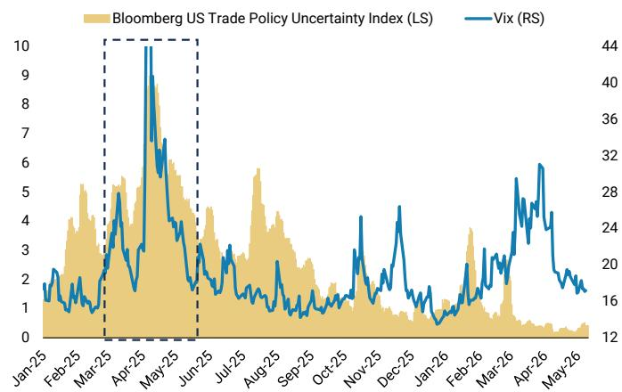

line

| Month   | Bloomberg US Trade Policy Uncertainty Index (LS) | Vix (RS) |
|---------|--------------------------------------------------|----------|
| Jan-25  | 1.5                                              | 18       |
| Feb-25  | 2.0                                              | 16       |
| Mar-25  | 3.0                                              | 20       |
| Apr-25  | 9.0                                              | 44       |
| May-25  | 6.0                                              | 36       |
| Jun-25  | 3.0                                              | 18       |
| Jul-25  | 5.0                                              | 20       |
| Aug-25  | 4.0                                              | 16       |
| Sep-25  | 3.0                                              | 14       |
| Oct-25  | 2.0                                              | 16       |
| Nov-25  | 4.0                                              | 28       |
| Dec-25  | 3.0                                              | 18       |
| Jan-26  | 1.0                                              | 16       |
| Feb-26  | 3.0                                              | 20       |
| Mar-26  | 4.0                                              | 32       |
| Apr-26  | 5.0                                              | 24       |
| May-26  | 1.0                                              | 16       |

Source: Bloomberg, MS.

Exhibit 2: ...While A Spike in Oil Prices Drove It Earlier This Year...Starting in January   
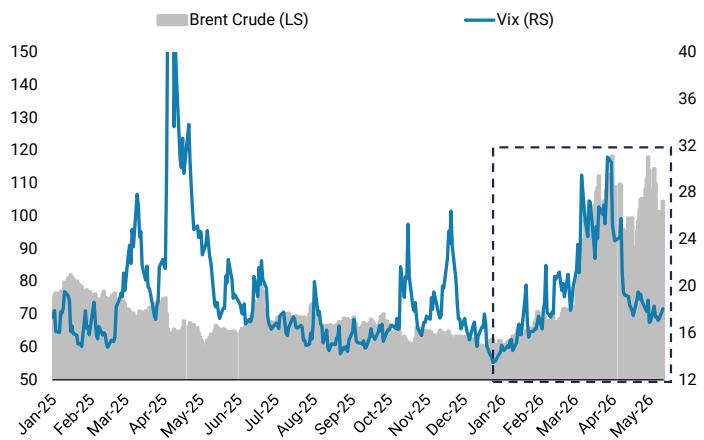

line

| Date   | Brent Crude (LS) | Vix (RS) |
|--------|------------------|----------|
| Jan-25 | ~70              | ~16      |
| Feb-25 | ~80              | ~20      |
| Mar-25 | ~90              | ~30      |
| Apr-25 | ~150             | ~40      |
| May-25 | ~110             | ~36      |
| Jun-25 | ~70              | ~24      |
| Jul-25 | ~80              | ~28      |
| Aug-25 | ~70              | ~20      |
| Sep-25 | ~60              | ~16      |
| Oct-25 | ~70              | ~20      |
| Nov-25 | ~80              | ~24      |
| Dec-25 | ~100             | ~32      |
| Jan-26 | ~50              | ~12      |
| Feb-26 | ~70              | ~20      |
| Mar-26 | ~110             | ~36      |
| Apr-26 | ~120             | ~32      |
| May-26 | ~110             | ~28      |

Source: Bloomberg, MS.

A year ago, we were coming out of the tail end of a rolling recession that was punctuated by a recession in the government sector (aka DOGE). Today, we are still in the early stages of a rolling recovery. That distinction is important when it comes to how one should interpret the correction we've just experienced and, more critically, how to position for what comes next. From our perspective, the key message at mid-year is straightforward and consistent with our messaging over the past several months: the correction we experienced was one within a well-established bull market.

First, it's worth revisiting what has actually taken place beneath the surface of the market over the last few months. Much has been made of the fact that the S&P 500 decline was less than $10\%$ on a price basis at the March lows. However, that view overlooks the more important adjustment that took place—namely, a significant reset on valuations and breadth. Roughly half of the stocks in the broader market (Russell 3000) experienced drawdowns of $20\%$ or more, and the forward P/E multiple for the S&P compressed by $18\%$ from its peak as forward earnings continued to surge even throughout the conflict (another hallmark of a bull market correction; Exhibit 5). That's not complacency, in our view, but a market that did a sUBStantial amount of work to price in the numerous risks that appeared over the past 6 months—Iran war/oil spike, AI disruption and private credit concerns being the most significant. In the areas of the market more directly affected by these risks, we witnessed $40\%+$ corrections in many instances.

Exhibit 3: The Correction in S&P 500 Valuation Was Severe in a Historical Context—The Market Isn't Simply Looking Through The Risks; It Discounted the Risks   
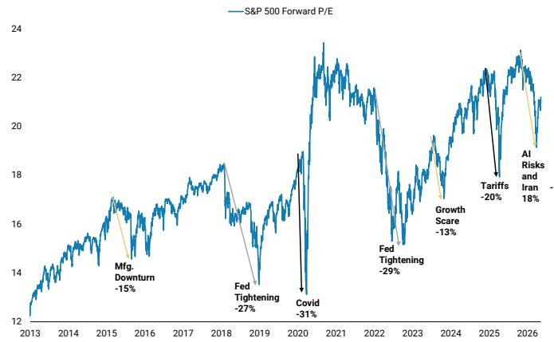

line

| Year | S&P 500 Forward P/E |
|------|---------------------|
| 2015 | -15%                |
| 2018 | -27%                |
| 2020 | -31%                |
| 2023 | -29%                |
| 2024 | -13%                |
| 2025 | -20%                |
| 2026 | 18%                 |

Source: FactSet, MS.

Exhibit 4: Breadth Was Also Poor, Further Suggesting Markets Were Quite Surgical in Pricing the Risks   
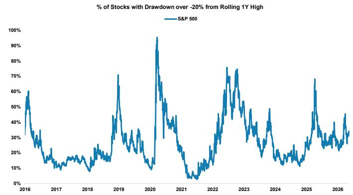

line

| Year | % of Stocks with Drawdown |
|------|---------------------------|
| 2016 | ~60%                      |
| 2017 | ~15%                      |
| 2018 | ~10%                      |
| 2019 | ~70%                      |
| 2020 | ~95%                      |
| 2021 | ~5%                       |
| 2022 | ~40%                      |
| 2023 | ~75%                      |
| 2024 | ~30%                      |
| 2025 | ~65%                      |
| 2026 | ~35%                      |

Source: Compustat, MS.

# Exhibit 5:

Earnings Have Been Resilient Amid Recent Risks   
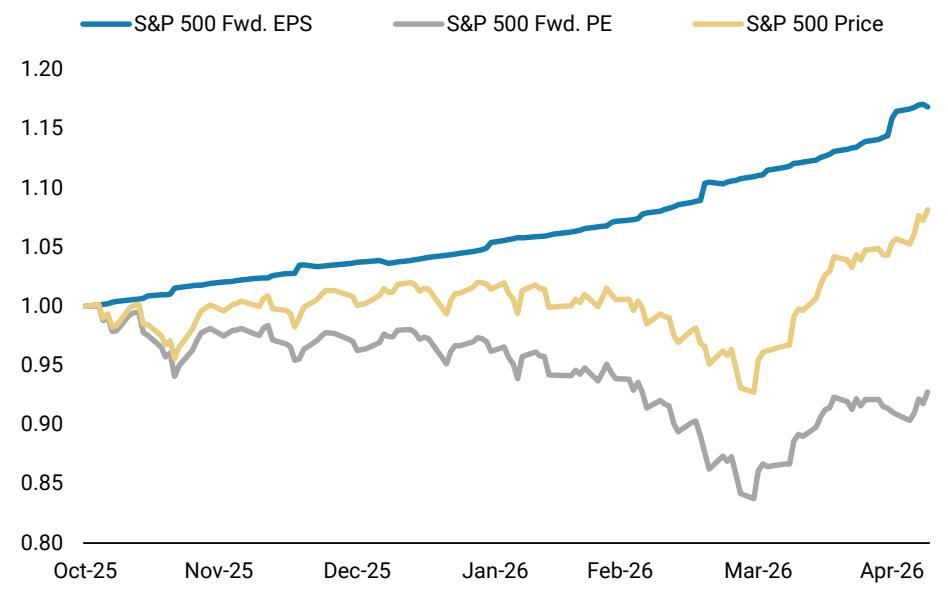

line

| Date   | S&P 500 Fwd. EPS | S&P 500 Fwd. PE | S&P 500 Price |
|--------|------------------|-----------------|---------------|
| Oct-25 | 1.00             | 1.00            | 1.00          |
| Nov-25 | 1.01             | 0.95            | 0.98          |
| Dec-25 | 1.03             | 0.97            | 1.01          |
| Jan-26 | 1.05             | 0.96            | 1.02          |
| Feb-26 | 1.07             | 0.94            | 1.01          |
| Mar-26 | 1.10             | 0.84            | 0.93          |
| Apr-26 | 1.17             | 0.93            | 1.08          |

Source: FactSet, MS.

This argument is even stronger in the case of the hyperscaler/Mag 7 stocks which we upgraded near the end of the correction in early April. The valuation drawdown was more significant than it was at the index level, while forward earnings remained robust.

Exhibit 6: The Recent Correction in Valuation for the Mag 7 Was Much More Significant Than It Was for the S&P 500, Indicating the Market Is Far from Complacent—We Remain Constructive   
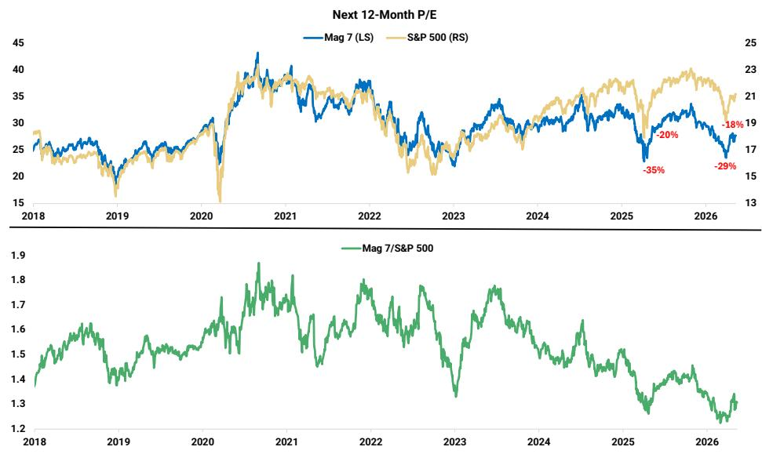

line

| Year | Mag 7 (LS) | S&P 500 (RS) | Mag 7/S&P 500 |
|------|------------|--------------|---------------|
| 2020 | ~30        | ~35          | ~1.4          |
| 2021 | ~40        | ~38          | ~1.8          |
| 2022 | ~35        | ~35          | ~1.6          |
| 2023 | ~25        | ~25          | ~1.3          |
| 2024 | ~30        | ~30          | ~1.5          |
| 2025 | ~35        | ~35          | ~1.3          |
| 2026 | ~25        | ~30          | ~1.2          |

Source: FactSet, MS

We think it's worth focusing on time, valuation and price when evaluating the extent to which uncertainty/risks have been discounted. In terms of the recent drawdown, all 3 conditions were met, in our view. The correction began last fall as liquidity tightened and funding markets showed signs of stress. It progressed through the winter as concerns around AI disruption, private credit, and policy uncertainty weighed on sentiment. It then culminated at the end of March as geopolitical tensions and the spike in oil prices provided the final catalyst for capitulation in the primary indices. The natural question at the time was whether the spike in oil prices represented the type of late-cycle shock that has historically ended business cycles and led to recessions? Our answer was, and remains, "no."

The main reason comes back to earnings and our rolling recession-to-recovery thesis. In prior cycles where oil shocks derailed growth, earnings were already decelerating or contracting before the shock occurred. Today, the opposite is true. Earnings growth is accelerating from already well above average levels, supported by a combination of operating leverage, improving demand, capital spending and structural tailwinds like AI-driven efficiency gains.

Exhibit 7: This Has Looked Very Different Than Prior Episodes Where An Oil Spike Ended the Business Cycle—Earnings Growth Accelerating Today vs. Decelerating/Negative in Historical Instances   
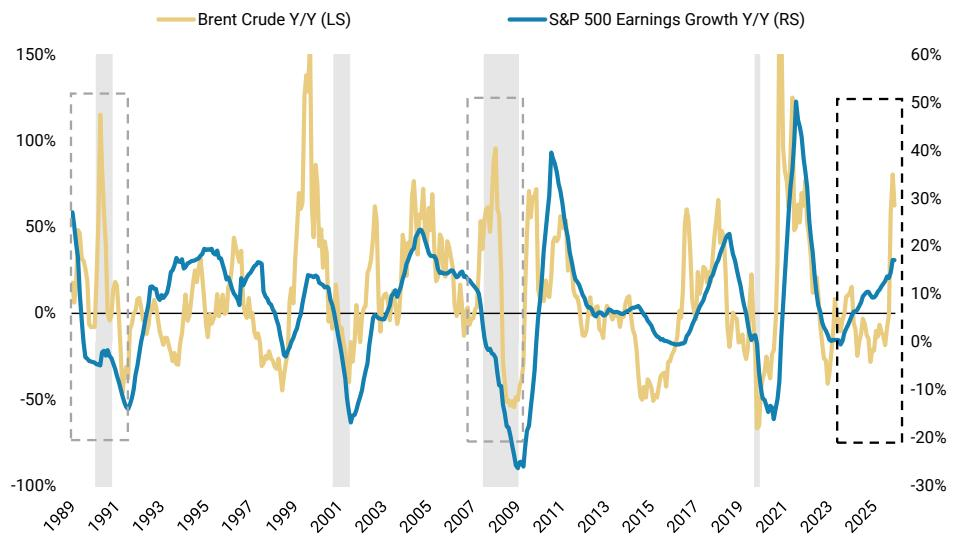

line

| Year | Brent Crude Y/Y (LS) | S&P 500 Earnings Growth Y/Y (RS) |
|------|----------------------|----------------------------------|
| 1989 | ~60%                 | ~30%                             |
| 1991 | ~120%                | ~-50%                            |
| 1993 | ~-20%                | ~-60%                            |
| 1995 | ~30%                 | ~20%                             |
| 1997 | ~40%                 | ~30%                             |
| 1999 | ~150%                | ~-20%                            |
| 2001 | ~-50%                | ~-70%                            |
| 2003 | ~60%                 | ~-50%                            |
| 2005 | ~70%                 | ~-20%                            |
| 2007 | ~-50%                | ~-10%                            |
| 2009 | ~90%                 | ~-80%                            |
| 2011 | ~70%                 | ~95%                             |
| 2013 | ~-5%                 | ~-10%                            |
| 2015 | ~-40%                | ~-15%                            |
| 2017 | ~60%                 | ~-5%                             |
| 2019 | ~70%                 | ~45%                             |
| 2021 | ~-60%                | ~-70%                            |
| 2023 | ~150%                | ~120%                            |
| 2025 | ~80%                 | ~30%                             |

Source: FactSet, MS.

The magnitude of the oil move itself is also less significant than in those historical episodes (which were 100%+ year-over-year), both in nominal and real terms. Adjusting for the CPI, US gasoline prices are materially lower than where they were after the Russia/Ukraine conflict started, and oil spiked to similar levels (Exhibit 10). Relative to the price of gold (another proxy for broad inflation), gasoline is even cheaper today and close to a 20-year low.

We would also argue that the global economy is more resilient than many assume, with a proven ability to navigate supply disruptions more effectively than expected. In our view, this situation is unlikely to be different, as market participants adjust logistics and identify alternative solutions and even sUBStitution. Recall that nearly 4 years ago, following the destruction of the Nord Stream pipeline, Germany was able to construct LNG facilities within months—an outcome widely considered unlikely at the time—reinforcing the idea that necessity drives innovation. We would not underestimate that same flexibility today. Finally, there is likely some demand destruction as well which will help to balance the market.

Cost impacts from the Iran conflict are likely to be felt idiosyncratically vs. at the index/sector level since: the higher-end consumer remains strong, the Energy sector is now a notable positive contributor to EPS growth/revisions this year (Exhibit 8) amid higher oil prices, and commodity hedging/inventory practices differ at the company level. Today's index composition (50% Tech; Exhibit 9) is also more insulated, contributing to this dynamic.

Exhibit 8: Consumer Earnings Expectations Have Not Been Impacted by the Iran War Overall, While Positive Energy Revisions Have Been A Notable Tailwind   
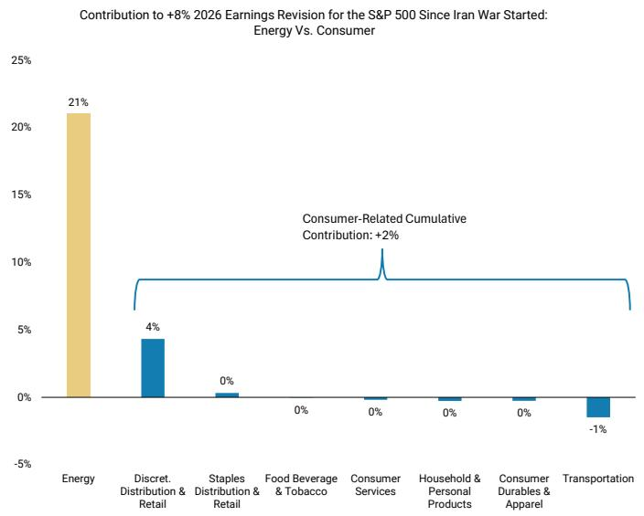

bar

| Category                     | Contribution |
| ---------------------------- | ------------ |
| Energy                       | 21%          |
| Discret. Distribution & Retail | 4%           |
| Staples Distribution & Retail | 0%           |
| Food Beverage & Tobacco      | 0%           |
| Consumer Services            | 0%           |
| Household & Personal Products | 0%           |
| Consumer Durables & Apparel   | 0%           |
| Transportation               | -1%          |

Source: FactSet, MS.

Exhibit 9: With a \~50% TMT Weight and Secular Growth Tailwinds, S&P Performance/Earnings Are More Insulated from Iran-Related Pressures   
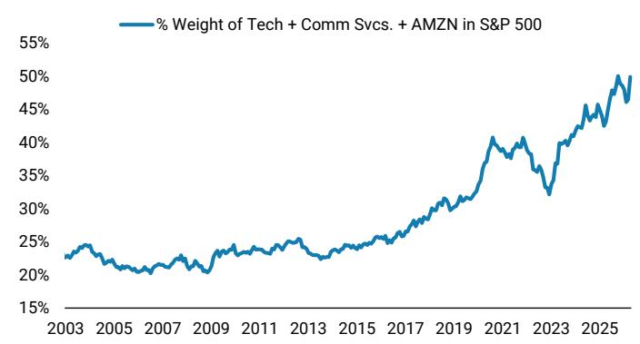

line

| Year | % Weight of Tech + Comm Svcs. + AMZN in S&P 500 |
| ---- | ----------------------------------------------- |
| 2003 | ~23%                                            |
| 2005 | ~21%                                            |
| 2007 | ~22%                                            |
| 2009 | ~24%                                            |
| 2011 | ~25%                                            |
| 2013 | ~26%                                            |
| 2015 | ~28%                                            |
| 2017 | ~32%                                            |
| 2019 | ~38%                                            |
| 2021 | ~40%                                            |
| 2023 | ~33%                                            |
| 2025 | ~50%                                            |

Source: Compustat, MS.

In short, the bar for an oil-driven recession/significant growth scare is much higher in the current environment than in prior oil price shocks. It would likely require not just a sustained move in crude above \$130-150 per barrel, but also a meaningful deterioration in earnings trends—neither of which we see as our base case.

Exhibit 10: Gasoline Prices in Real Terms Are Well Below the Levels Seen Post the Start of the Russia/Ukraine War and Pre-GFC   
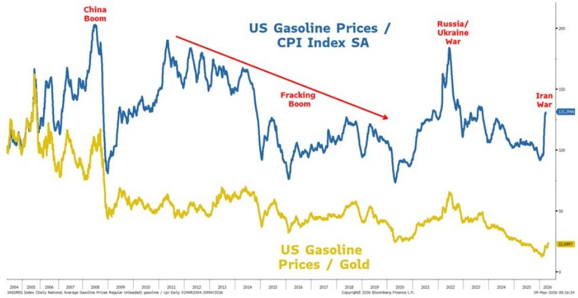

line

| Year | US Gasoline Prices / CPI Index SA | US Gasoline Prices / Gold |
|------|-----------------------------------|----------------------------|
| 2004 | ~100                              | ~50                        |
| 2005 | ~150                              | ~75                        |
| 2006 | ~130                              | ~60                        |
| 2007 | ~160                              | ~80                        |
| 2008 | ~200                              | ~100                       |
| 2009 | ~80                               | ~40                        |
| 2010 | ~140                              | ~60                        |
| 2011 | ~180                              | ~75                        |
| 2012 | ~160                              | ~65                        |
| 2013 | ~170                              | ~70                        |
| 2014 | ~150                              | ~65                        |
| 2015 | ~100                              | ~55                        |
| 2016 | ~80                               | ~45                        |
| 2017 | ~100                              | ~55                        |
| 2018 | ~120                              | ~65                        |
| 2019 | ~110                              | ~55                        |
| 2020 | ~90                               | ~45                        |
| 2021 | ~130                              | ~60                        |
| 2022 | ~180                              | ~75                        |
| 2023 | ~140                              | ~65                        |
| 2024 | ~120                              | ~55                        |
| 2025 | ~110                              | ~45                        |
| 2026 | 113.396                           | 22.6991                    |

Source: Bloomberg, MS.

As discussed for the past 12 months and dating back to our last mid-year outlook, the main driver of our constructive view on US equities is a rebound in earnings growth. We see this continuing throughout our forecast horizon as detailed in this report. Recent earnings results are supportive of our stance, and we're encouraged by the resiliency displayed this reporting season despite the geopolitical backdrop. Exhibit 11 shows the fairly unprecedented acceleration of current year EPS expectations relative to the typical seasonal/historical trend. Further, revenue surprise is robust at \~2% (versus a historical average of 1.3%). This, coupled with higher ISM Manufacturing Prices, indicates that pricing power continues to improve for corporates.

While hyperscaler and semiconductor revenue/earnings revisions have been major contributors to this durability, and recent results bolster that dynamic (hyperscalers seeing acceleration in cloud + solid backlogs), the strength is not limited to these cohorts. Specifically, 1Q EPS surprise for the median S&P 500 stock is 6%, the strongest it has been in 4 years (Exhibit 12), and S&P 1500 median stock forward EPS growth has also accelerated—now 12%; up from 8% at the start of the year. In addition, S&P 600 Small Cap Index forward EPS growth is 22%, up from 8% at the start of the year. Furthermore, S&P 500 earnings revisions breadth has accelerated higher since reporting season started (back up to 22% from 5% at the beginning of earnings season) driven by cyclical cohorts (Exhibit 13 and Exhibit 14).

Exhibit 11: Upward Revision to 2026 EPS Estimate Is Fairly Unprecedented   
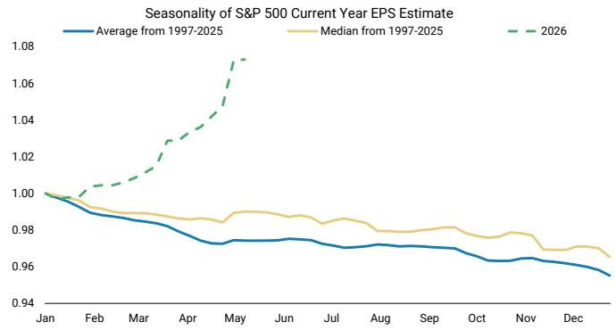

line

| Month | Average from 1997-2025 | Median from 1997-2025 | 2026 |
|-------|------------------------|------------------------|------|
| Jan   | 1.00                   | 1.00                   | 1.00 |
| Feb   | 0.99                   | 0.99                   | 1.00 |
| Mar   | 0.98                   | 0.98                   | 1.01 |
| Apr   | 0.97                   | 0.98                   | 1.03 |
| May   | 0.97                   | 0.98                   | 1.07 |
| Jun   | 0.97                   | 0.98                   | —    |
| Jul   | 0.97                   | 0.98                   | —    |
| Aug   | 0.97                   | 0.98                   | —    |
| Sep   | 0.97                   | 0.98                   | —    |
| Oct   | 0.96                   | 0.98                   | —    |
| Nov   | 0.96                   | 0.98                   | —    |
| Dec   | 0.95                   | 0.97                   | —    |

Source: FactSet, MS.

Exhibit 12: Median Stock EPS Surprise Is At a 4-Year High in 1Q Reporting Season   
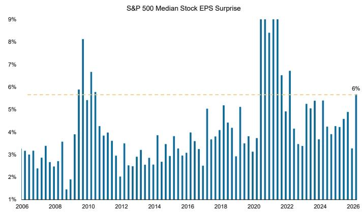

bar

| Year | Median Stock EPS Surprise |
|------|--------------------------|
| 2006 | 3.0%                     |
| 2007 | 3.2%                     |
| 2008 | 3.4%                     |
| 2009 | 1.5%                     |
| 2010 | 8.1%                     |
| 2011 | 5.8%                     |
| 2012 | 3.5%                     |
| 2013 | 2.8%                     |
| 2014 | 3.9%                     |
| 2015 | 3.4%                     |
| 2016 | 3.8%                     |
| 2017 | 5.0%                     |
| 2018 | 4.5%                     |
| 2019 | 5.1%                     |
| 2020 | 3.8%                     |
| 2021 | 9.0%                     |
| 2022 | 6.7%                     |
| 2023 | 5.3%                     |
| 2024 | 5.5%                     |
| 2025 | 4.3%                     |
| 2026 | 5.7%                     |

Source: FactSet, MS.

Exhibit 13: Earnings Revisions Breadth Re-Accelerating...   
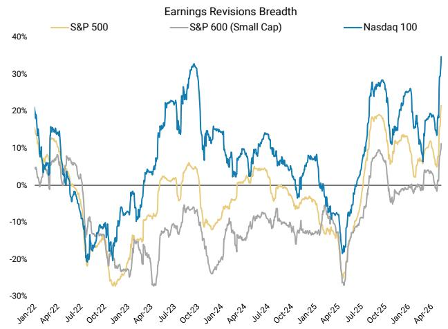

line

| Date   | S&P 500 | S&P 600 (Small Cap) | Nasdaq 100 |
|--------|---------|---------------------|------------|
| Jan-22 | ~15%    | ~5%                 | ~20%       |
| Apr-22 | ~10%    | ~0%                 | ~15%       |
| Jul-22 | ~-15%   | ~-10%               | ~-20%      |
| Oct-22 | ~-25%   | ~-20%               | ~-15%      |
| Jan-23 | ~-10%   | ~-15%               | ~-5%       |
| Apr-23 | ~-5%    | ~-10%               | ~5%        |
| Jul-23 | ~5%     | ~-5%                | ~20%       |
| Oct-23 | ~10%    | ~-10%               | ~30%       |
| Jan-24 | ~5%     | ~-5%                | ~15%       |
| Apr-24 | ~0%     | ~-10%               | ~10%       |
| Jul-24 | ~5%     | ~-5%                | ~15%       |
| Oct-24 | ~0%     | ~-10%               | ~5%        |
| Jan-25 | ~-5%    | ~-15%               | ~0%        |
| Apr-25 | ~-10%   | ~-20%               | ~-15%      |
| Jul-25 | ~10%    | ~-10%               | ~25%       |
| Oct-25 | ~15%    | ~-5%                | ~30%       |
| Jan-26 | ~10%    | ~0%                 | ~25%       |
| Apr-26 | ~20%    | ~5%                 | ~35%       |

Source: FactSet, MS.

Exhibit 14: ...With Broad Participation Under the Surface of the Market 

<table><tr><td colspan="2">Sector Drivers of Earnings Revisions Breadth</td></tr><tr><td>Sector</td><td>2-Week Change</td></tr><tr><td>Information Technology</td><td>24%</td></tr><tr><td>Industrials</td><td>19%</td></tr><tr><td>Consumer Staples</td><td>18%</td></tr><tr><td>Materials</td><td>18%</td></tr><tr><td>Communication Services</td><td>16%</td></tr><tr><td>Real Estate</td><td>13%</td></tr><tr><td>Consumer Discretionary</td><td>12%</td></tr><tr><td>Health Care</td><td>10%</td></tr><tr><td>Financials</td><td>8%</td></tr><tr><td>Energy</td><td>1%</td></tr><tr><td>Utilities</td><td>-2%</td></tr></table>

Source: FactSet, MS.

Exhibit 15:   
Forward Earnings Broadly Accelerating   
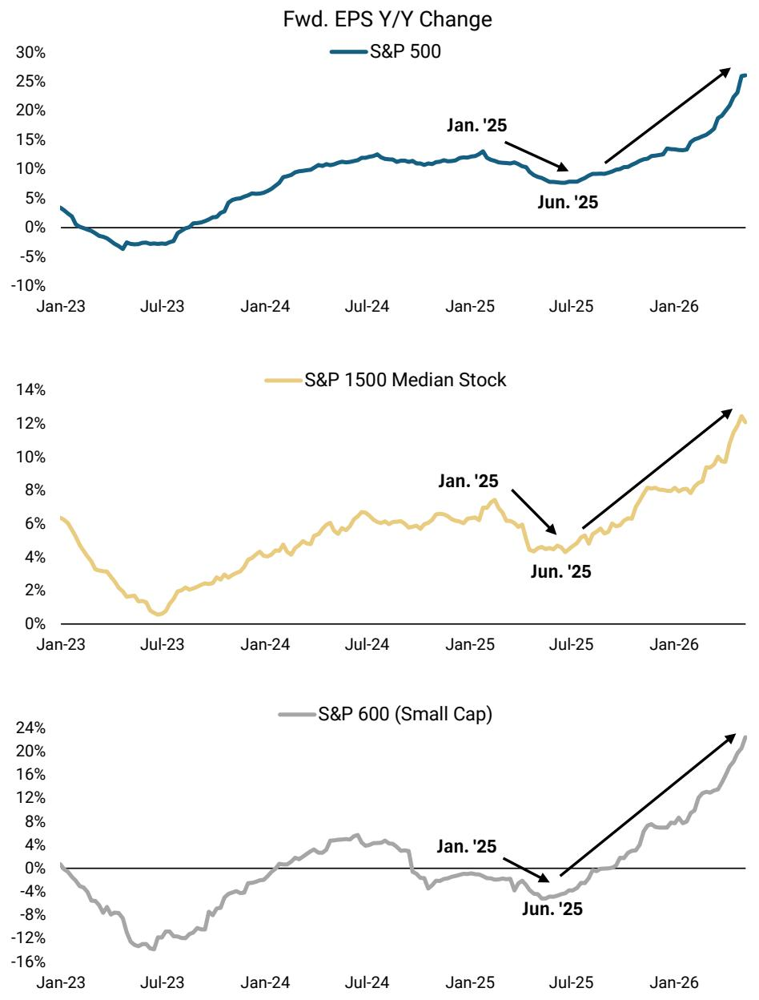

line

| Date    | S&P 500 | S&P 1500 Median Stock | S&P 600 (Small Cap) |
|---------|---------|------------------------|----------------------|
| Jan '23 | ~4%     | ~6%                    | ~0%                  |
| Jul '23 | ~-4%    | ~1%                    | ~-12%                |
| Jan '24 | ~8%     | ~4%                    | ~-8%                 |
| Jul '24 | ~12%    | ~7%                    | ~-4%                 |
| Jan '25 | ~13%    | ~8%                    | ~-2%                 |
| Jul '25 | ~9%     | ~5%                    | ~-4%                 |
| Jan '26 | ~25%    | ~12%                   | ~20%                 |

Source: FactSet, MS.

Operating leverage has and continues to play a major role in the earnings rebound we've been focused on for the last year. Much of this has been driven by compressed cost structures amid a deceleration in the second derivative on compensation expense since the end of 2021. This is a classic early cycle dynamic, and not surprising to us given our rolling recovery view. More recently, AI is helping to facilitate this operating leverage and efficiency dynamic, and we expect this to continue in a more material way over a structural time horizon. As our economists recently showed, output per employee is picking up in "high-AI exposure" industries (Exhibit 17). Further, our systematic transcript analysis shows that companies are increasingly quantifying the benefits they are seeing from AI Adoption. Among the S&P 500, 25% mentioned at least one quantitative impact in 1Q26, up from 13% in 1Q25 (Exhibit 18). While gains have been broad, Technology and Financials lead the pack. Another effect of AI is that companies know operational change/ efficiencies are coming and want to get leaner on labor even in advance of full implementation of AI applications. This is leading to less hiring rather than firing but is having a positive impact on the bottom line as revenue growth firms.

Exhibit 16: Positive Operating Leverage Is Driving A Rebound in Earnings Growth   
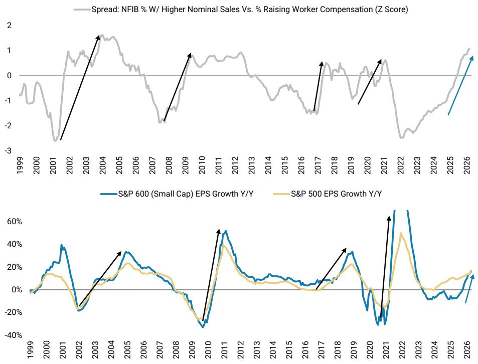

line

| Year | Spread: NFIB % W/ Higher Nominal Sales Vs. % Raising Worker Compensation (Z Score) | S&P 600 (Small Cap) EPS Growth Y/Y | S&P 500 EPS Growth Y/Y |
|------|------------------------------------------------------------------------|-------------------------------------|------------------------|
| 1999 | ~-0.5%                                                                 | ~0%                                                                 | ~0%                    |
| 2000 | ~-1.0%                                                                 | ~10%                                                                | ~5%                    |
| 2001 | ~-2.5%                                                                 | ~35%                                                                | ~15%                   |
| 2002 | ~-1.5%                                                                 | ~-20%                                                               | ~-10%                  |
| 2003 | ~1.5%                                                                  | ~10%                                                                | ~5%                    |
| 2004 | ~1.8%                                                                  | ~30%                                                                | ~10%                   |
| 2005 | ~1.5%                                                                  | ~35%                                                                | ~15%                   |
| 2006 | ~1.0%                                                                  | ~20%                                                                | ~10%                   |
| 2007 | ~-1.5%                                                                 | ~15%                                                                | ~5%                    |
| 2008 | ~-2.0%                                                                 | ~5%                                                                 | ~0%                    |
| 2009 | ~1.0%                                                                  | ~-30%                                                               | ~-20%                  |
| 2010 | ~1.5%                                                                  | ~-25%                                                               | ~-15%                  |
| 2011 | ~1.8%                                                                  | ~50%                                                                | ~40%                   |
| 2012 | ~1.5%                                                                  | ~35%                                                                | ~25%                   |
| 2013 | ~1.0%                                                                  | ~20%                                                                | ~15%                   |
| 2014 | ~-1.5%                                                                 | ~15%                                                                | ~10%                   |
| 2015 | ~-2.0%                                                                 | ~10%                                                                | ~5%                    |
| 2016 | ~-1.5%                                                                 | ~5%                                                                 | ~0%                    |
| 2017 | ~-1.0%                                                                 | ~10%                                                                | ~5%                    |
| 2018 | ~-1.5%                                                                 | ~15%                                                                | ~10%                   |
| 2019 | ~-1.0%                                                                 | ~35%                                                                | ~25%                   |
| 2020 | ~-1.5%                                                                 | ~-30%                                                               | ~-20%                  |
| 2021 | ~-1.0%                                                                 | ~-35%                                                               | ~-25%                  |
| 2022 | ~-2.5%                                                                 | ~70%                                                                | ~50%                   |
| 2023 | ~-2.0%                                                                 | ~-15%                                                               | ~-10%                  |
| 2024 | ~-1.5%                                                                 | ~-5%                                                                | ~-5%                   |
| 2025 | ~-1.0%                                                                 | ~-10%                                                               | ~-15%                  |
| 2026 | ~-0.5%                                                                 | ~-5%                                                                | ~-10%                  |

Source: FactSet, Haver Analytics, MS.

Exhibit 17: In Industries with High AI Exposure, Output Per Employee Rose Faster in 2025, and Accelerated More Than in Other Industries   
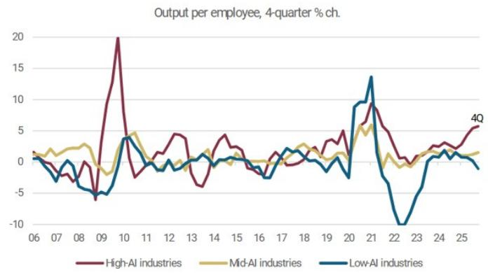

line

| Quarter | High-AI industries | Mid-AI industries | Low-AI industries |
| ------- | ------------------ | ----------------- | ----------------- |
| 06      | 0                  | 0                 | 0                 |
| 07      | -2                 | 1                 | -3                |
| 08      | -5                 | 2                 | -5                |
| 09      | 20                 | 4                 | -5                |
| 10      | -3                 | 5                 | 4                 |
| 11      | 0                  | 0                 | 0                 |
| 12      | 4                  | 0                 | 0                 |
| 13      | -4                 | 0                 | 0                 |
| 14      | 4                  | 0                 | 0                 |
| 15      | 0                  | 0                 | 0                 |
| 16      | -2                 | 0                 | -3                |
| 17      | 0                  | 0                 | 0                 |
| 18      | 2                  | 2                 | 0                 |
| 19      | 4                  | 2                 | 0                 |
| 20      | 5                  | 4                 | -3                |
| 21      | 10                 | 8                 | 14                |
| 22      | -10                | -2                | -10               |
| 23      | 0                  | 0                 | -5                |
| 24      | 2                  | 2                 | 0                 |
| 25      | 6                  | 2                 | -2                |

Source: BEA, BLS, MS Economics Research.

Exhibit 18: Discussions of Quantifiable Benefits from AI Are Rising   
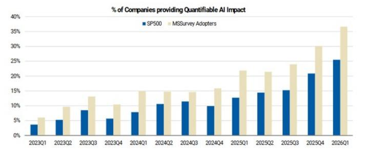

bar

% of Companies providing Quantifiable AI Impact
| Quarter | SP500 (%) | MSSurvey Adopters (%) |
|---|---|---|
| 2023Q1 | 3.5 | 6 |
| 2023Q2 | 4.8 | 9.5 |
| 2023Q3 | 8.5 | 13 |
| 2023Q4 | 5.2 | 10.5 |
| 2024Q1 | 7.8 | 14.8 |
| 2024Q2 | 10.5 | 14.8 |
| 2024Q3 | 11.5 | 14.5 |
| 2024Q4 | 9.8 | 16 |
| 2025Q1 | 12.8 | 22 |
| 2025Q2 | 14.5 | 21.8 |
| 2025Q3 | 15.2 | 24 |
| 2025Q4 | 20.8 | 30 |
| 2026Q1 | 25.5 | 36.5 |

Source: MS. Please note, companies mentioning multiple quantifiable benefits from AI are only counted once in this chart.

That's not to say there aren't any risks. The difference today is that many of them were surgically priced, and the ones that remain are increasingly centered on policy rather than fundamentals. If there has been a meaningful evolution in our thinking since the start of the year, it is the recognition that central bank policy has shifted in a less dovish direction. The surge in commodity prices and overall strength in economic activity (particularly capex) has understandably refocused policy makers on inflation rather than growth, leading to a repricing of rate expectations and a tightening of financial conditions in the rates channel. This, in turn, has driven the re-emergence of a negative correlation between

equities and bond yields.

Exhibit 19: Short-Term Stock/Yield Correlation Is Negative—Rate Sensitivity High for Stocks   
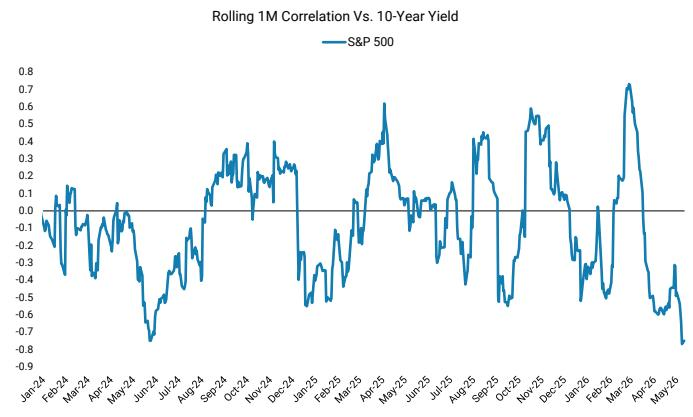

line

| Date    | S&P 500 |
|---------|---------|
| Jan-24  | -0.1    |
| Feb-24  | 0.1     |
| Mar-24  | -0.3    |
| Apr-24  | 0.0     |
| May-24  | -0.7    |
| Jun-24  | -0.2    |
| Jul-24  | -0.1    |
| Aug-24  | 0.2     |
| Sep-24  | 0.3     |
| Oct-24  | 0.4     |
| Nov-24  | 0.3     |
| Dec-24  | 0.2     |
| Jan-25  | -0.6    |
| Feb-25  | -0.3    |
| Mar-25  | -0.1    |
| Apr-25  | 0.6     |
| May-25  | 0.1     |
| Jun-25  | -0.1    |
| Jul-25  | 0.1     |
| Aug-25  | 0.4     |
| Sep-25  | -0.5    |
| Oct-25  | -0.6    |
| Nov-25  | 0.5     |
| Dec-25  | 0.1     |
| Jan-26  | -0.5    |
| Feb-26  | -0.3    |
| Mar-26  | 0.7     |
| Apr-26  | -0.6    |
| May-26  | -0.8    |

Source: Bloomberg, MS

Exhibit 20: 4.50% Has Been An Important Level As A Breach Above Has Led to Multiple Compression Historically—Worth Watching from a Risk Standpoint   
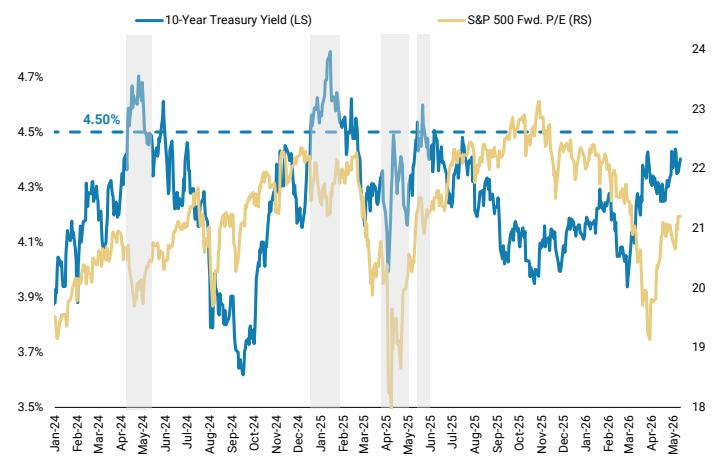

line

| Date    | 10-Year Treasury Yield (LS) | S&P 500 Fwd. P/E (RS) |
|---------|-----------------------------|------------------------|
| Jan-24  | 4.50%                       | -                      |
| May-26  | -                           | -                      |

Source: Bloomberg, MS

The market has had to grapple with the possibility that central banks may remain restrictive for longer than expected—i.e., the policy choices are currently skewed toward inflation, rather than growth risks. While the Fed is now in the transition period to a new Chair, Kevin Warsh also alluded to a patient approach around further rate cuts at his Senate confirmation hearing. The good news is that we don't need rate cuts to achieve our multiple target which is slightly below current levels. History is supportive in this sense as our backtest shows that multiple expansion in fairly uncommon in periods where the Fed is on hold and earnings growth is strong, but price returns are quite robust in this outcome, driven by resilient EPS growth—the historical median performance in these prior periods is 14%. Furthermore, revenue growth is positively correlated to goods inflation over time (Exhibit 23). Thus, rising pricing power (i.e., inflation) as a result of strengthening demand is a positive tailwind for equities as long as it's not a driver of a Fed hiking cycle, which isn't our view over the next 12 months.

Exhibit 21: S&P Tends to See Modest Multiple Compression When EPS Growth Is Strong and The Fed Is on Hold... 

<table><tr><td colspan="2">S&amp;P 500 Fwd. P/E 12M Rate of Chg. in &gt; Median EPS Growth + Neutral* Fed Policy Environments</td></tr><tr><td>Avg.</td><td>-1.8%</td></tr><tr><td>Median</td><td>-3.3%</td></tr><tr><td>Positive Hit Rate</td><td>31%</td></tr><tr><td>Max</td><td>36.3%</td></tr><tr><td>Min</td><td>-22.3%</td></tr></table>

Source: FactSet, Bloomberg, MS; excludes recessions and the 1 month before recessions. \*12M rate of change on fed funds is flat.

Exhibit 22: ...While Price Returns Are Very Strong Driven by Earnings Resiliency 

<table><tr><td colspan="2">S&amp;P 500 Price 12M Rate of Chg. in &gt; Median EPS Growth + Neutral* Fed Policy Environments</td></tr><tr><td>Avg.</td><td>16.3%</td></tr><tr><td>Median</td><td>14.0%</td></tr><tr><td>Positive Hit Rate</td><td>92%</td></tr><tr><td>Max</td><td>45.5%</td></tr><tr><td>Min</td><td>-2.6%</td></tr></table>

Source: FactSet, Bloomberg, MS; excludes recessions and the 1 month before recessions. \*12M rate of change on fed funds is flat.

Exhibit 23:   
Inflation Is Positively Correlated to Revenue Growth Over Time, Which Is Why Equities Are an Inflation Hedge in a Strong Growth Backdrop   
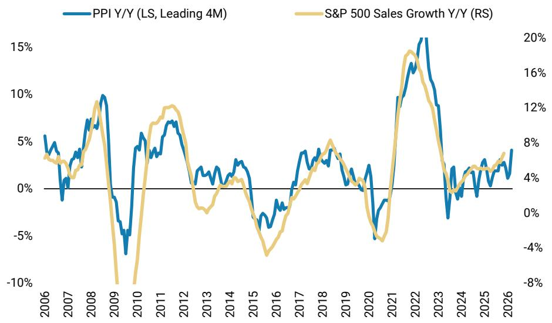

line

| Year | PPI Y/Y (LS, Leading 4M) | S&P 500 Sales Growth Y/Y (RS) |
|------|--------------------------|-------------------------------|
| 2006 | ~5%                      | ~3%                           |
| 2007 | ~-2%                     | ~2%                           |
| 2008 | ~10%                     | ~8%                           |
| 2009 | ~-5%                     | ~-10%                         |
| 2010 | ~-7%                     | ~-8%                          |
| 2011 | ~7%                      | ~9%                           |
| 2012 | ~6%                      | ~8%                           |
| 2013 | ~2%                      | ~-2%                          |
| 2014 | ~3%                      | ~1%                           |
| 2015 | ~-3%                     | ~-5%                          |
| 2016 | ~-1%                     | ~-4%                          |
| 2017 | ~4%                      | ~2%                           |
| 2018 | ~5%                      | ~5%                           |
| 2019 | ~3%                      | ~3%                           |
| 2020 | ~-5%                     | ~-4%                          |
| 2021 | ~10%                     | ~15%                          |
| 2022 | ~15%                     | ~18%                          |
| 2023 | ~8%                      | ~10%                          |
| 2024 | ~-3%                     | ~-2%                          |
| 2025 | ~3%                      | ~4%                           |
| 2026 | ~4%                      | ~5%                           |

Source: Bloomberg, MS.

It's also important to recognize that this risk around the Fed's reaction function is inherently self-correcting. Financial conditions can only tighten so much before they begin to impact the real economy and, ultimately, force a response from policy makers. Bond volatility, funding stress, and liquidity conditions are the variables to watch in this regard. We have already seen early signs of this dynamic at work, with the Fed and other central banks showing a strong willingness to adjust their balance sheet policies, when necessary. More specifically, when funding markets showed stress last fall, the Fed reacted by ending quantitative tightening earlier than expected and then restarting asset purchases in December. These asset purchases continue today even with funding market stress now absent. Second, when bond volatility increased in March with the spike in oil prices, the Treasury was quick to act with its bond repurchase program. More specifically, the Treasury has bought approximately \$100-125 in the last 2 months focusing its actions on the 10-30 year tenor relative to issuance. This has helped reduce bond volatility and had a positive impact on liquidity and equity multiples, in our view. There is nothing to suggest these activities (Fed's RMPs and Treasury buybacks) won't continue into the future, under the labeling of financial market stability.

Exhibit 24: Treasury Buybacks Since 2024 

<table><tr><td colspan="8">All Treasury Buyback Results from 5/29/24 to 5/1/26</td></tr><tr><td>Operation Type</td><td>Maturity Sector</td><td>Total Number of Operations</td><td>Total Par Amount Offered ($bn)</td><td>Total Purchase Maximum ($bn)</td><td>Total Par Amount Purchased ($bn)</td><td>Offer to Maximum (Min | Avg | Max)</td><td>Buyback Ratio (Min | Avg | Max)</td></tr><tr><td>Cash Management</td><td>1Mo to 2Y</td><td>23</td><td>604</td><td>222</td><td>212</td><td>1.4 | 2.8 | 5.2</td><td>0.3 | 0.9 | 1.0</td></tr><tr><td rowspan="9">Liquidity Support</td><td>1Mo to 2Y</td><td>7</td><td>241</td><td>26</td><td>26</td><td>6.9 | 9.2 | 17.3</td><td>1.0 | 1.0 | 1.0</td></tr><tr><td>2Y to 3Y</td><td>8</td><td>65</td><td>30</td><td>17</td><td>1.2 | 2.3 | 4.4</td><td>0.1 | 0.6 | 1.0</td></tr><tr><td>3Y to 5Y</td><td>8</td><td>92</td><td>30</td><td>26</td><td>2.4 | 3.0 | 3.7</td><td>0.4 | 0.8 | 1.0</td></tr><tr><td>5Y to 7Y</td><td>8</td><td>52</td><td>30</td><td>15</td><td>1.0 | 1.8 | 3.2</td><td>0.1 | 0.5 | 0.9</td></tr><tr><td>7Y to 10Y</td><td>8</td><td>39</td><td>30</td><td>3</td><td>0.8 | 1.3 | 2.6</td><td>0.0 | 0.1 | 0.3</td></tr><tr><td>10Y to 20Y</td><td>20</td><td>404</td><td>40</td><td>40</td><td>3.2 | 10.1 | 18.0</td><td>1.0 | 1.0 | 1.0</td></tr><tr><td>20Y to 30Y</td><td>21</td><td>414</td><td>42</td><td>39</td><td>1.9 | 9.9 | 18.2</td><td>0.1 | 0.9 | 1.0</td></tr><tr><td>TIPS 1Y to 7.5Y</td><td>14</td><td>47</td><td>8</td><td>7</td><td>1.7 | 5.6 | 8.7</td><td>0.3 | 0.9 | 1.0</td></tr><tr><td>TIPS 7.5Y to 30Y</td><td>12</td><td>16</td><td>6</td><td>3</td><td>1.5 | 2.6 | 4.1</td><td>0.1 | 0.6 | 1.0</td></tr><tr><td colspan="2">Total</td><td>129</td><td>1972</td><td>464</td><td>389</td><td></td><td></td></tr></table>

Source: US Treasury, MS.

Exhibit 25: Treasury Buybacks Have Kept Bond Vol Lower and P/Es Supported   
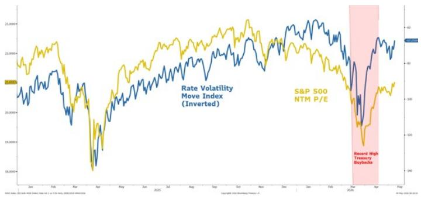

line

| Date       | Rate Volatility Move Index (Inverted) | S&P 500 NTM P/E |
| ---------- | -------------------------------------- | ---------------- |
| Mar 2005   | ~23,000                                | ~-120            |

Source: Bloomberg, MS.

It's also worth addressing the broader policy framework we laid out in our year-ahead outlook, which remains intact. In short, the Trump administration's policy objectives center on a simultaneous three-pronged rebalancing of the economy:

# The Triple Rebalancing:

- Current / Trade Accounts—The "International" Imbalance
  - Policy: Tariffs / Weaker USD

\- Over-Consumption and Under-Investment—The "Domestic" Imbalance
  - Policy: Tariffs / Weaker USD and OBBBA Tax Incentives for Capex/Reshoring

\- The K-Economy—The "Inequality" Imbalance
  - Policy: Immigration Policy and De-Regulation

In our view, the end goal is the same as the prior administration's—to grow out of the debt problem—but the approach is focused on companies making the capital allocation decisions, rather than the government, while increasing income through the wage channel rather than open borders and sUBSidies. The result is higher nominal GDP growth with a greater contribution from real GDP via higher productivity and earnings (both corporate and personal).

We believe there is now evidence that this rebalancing is happening. First, the trade deficit is down materially year-over-year, albeit against very easy comparisons from last year's stocking up ahead of Liberation Day. Nevertheless, as a percentage of GDP the trade deficit has improved over the past 18 months. Second, fixed investment is up sharply since the Big Beautiful Bill was passed last year, and March saw another upside surprise to factory orders in spite of all of the concerns cited above. US businesses are moving forward with capital spending plans as if war-related concerns are temporary or immaterial to their capital allocation decisions that are likely being driven more by the new policies in place and a need to adapt to a new world order of Multi-polarity / "Don"roe Doctrine and De-globalization.

Exhibit 26: US Trade Deficit Has Started to Normalize with A Long Way to Go   
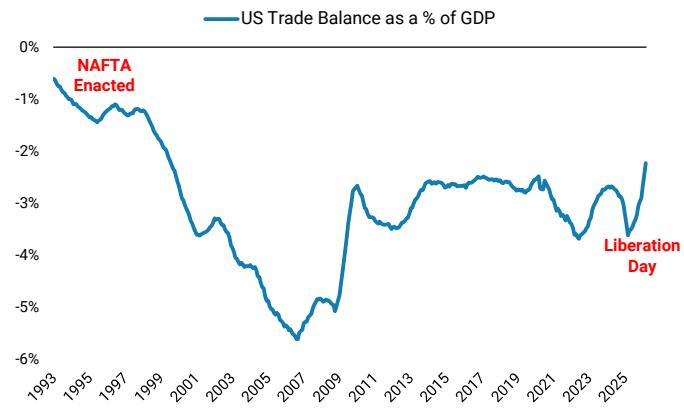

line

| Year | US Trade Balance as a % of GDP |
| ---- | ------------------------------ |
| 1993 | -0.5%                          |
| 1995 | -1.0%                          |
| 1997 | -1.5%                          |
| 1999 | -2.0%                          |
| 2001 | -3.0%                          |
| 2003 | -4.0%                          |
| 2005 | -5.0%                          |
| 2007 | -6.0%                          |
| 2009 | -5.0%                          |
| 2011 | -3.0%                          |
| 2013 | -2.5%                          |
| 2015 | -2.0%                          |
| 2017 | -2.5%                          |
| 2019 | -2.0%                          |
| 2021 | -2.5%                          |
| 2023 | -3.5%                          |
| 2025 | -2.0%                          |

Source: Bloomberg, MS. Trailing 12M sum as a percent of annualized GDP. 4Q GDP used for Jan and Feb data points.

Exhibit 27: Mfg/Factory Orders are Strengthening   
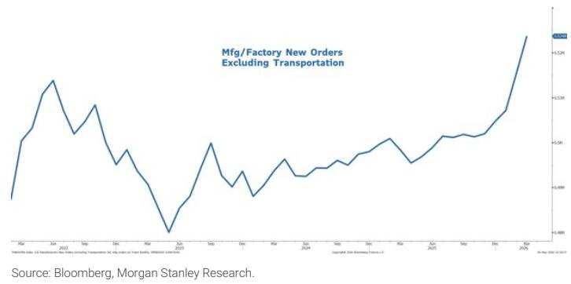

While the K-economy is still plagued by the affordability crisis, we are starting to see subtle shifts in the wage channel with real wage growth stabilizing/improving at the low end for services jobs or work that requires real physical skills. While there is still a long way to go here for the average American to feel like they are getting ahead, the policy changes provide a more productive path as wage increases are preferable to sUBSidies from an economic standpoint. Meanwhile, AI is likely to weigh on wages in the white-collar world, which is arguably necessary to rebalance the inequality imbalance. While the recent University of Michigan consumer confidence data continues to show a consumer under pressure, we would submit that forward returns in equities from such low levels are typically strong. Secondarily, when one looks at the y/y change in the current conditions metric, it lines up with the y/y change in the real price of the S&P 500. Both appear to be stabilizing and may look very different by the end of the year, which is what stocks may be contemplating.

Exhibit 28: "Real" SPX Appears to Have Made a Cyclical Bottom on Iran War   
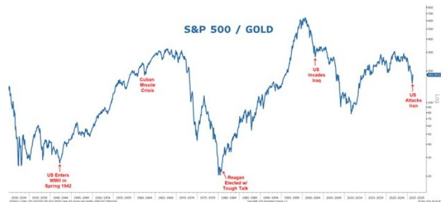

line

| Date       | Value |
| ---------- | ----- |
| 2020-1934  | ~30   |
| 1935-1939  | ~40   |
| 1940-1944  | ~20   |
| 1945-1949  | ~35   |
| 1950-1954  | ~45   |
| 1955-1959  | ~55   |
| 1960-1964  | ~65   |
| 1965-1969  | ~70   |
| 1970-1974  | ~50   |
| 1975-1979  | ~30   |
| 1980-1984  | ~20   |
| 1985-1989  | ~35   |
| 1990-1994  | ~50   |
| 1995-1999  | ~65   |
| 2000-2004  | ~70   |
| 2005-2009  | ~60   |
| 2010-2014  | ~55   |
| 2015-2019  | ~65   |
| 2020-2024  | ~60   |
| 2025-2029  | ~50   |

Source: Bloomberg, MS

Exhibit 29: Y/Y Change in Consumer Confidence Is Closely Aligned with Real SPX   
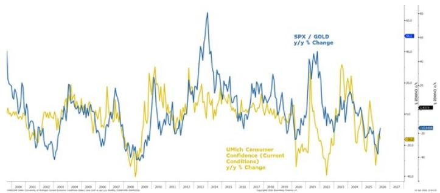

line

| Year | SPX / GOLD y/y % Change | UMLH Consumer Confidence (Current Conditions) y/y % Change |
|------|--------------------------|---------------------------------------------------------------|
| 2000 | ~-15%                    | ~-10%                                                         |
| 2001 | ~-20%                    | ~-15%                                                         |
| 2002 | ~-10%                    | ~-5%                                                          |
| 2003 | ~-5%                     | ~0%                                                           |
| 2004 | ~10%                     | ~5%                                                           |
| 2005 | ~-5%                     | ~0%                                                           |
| 2006 | ~-10%                    | ~-5%                                                          |
| 2007 | ~-5%                     | ~0%                                                           |
| 2008 | ~-15%                    | ~-5%                                                          |
| 2009 | ~-10%                    | ~-10%                                                         |
| 2010 | ~-5%                     | ~-5%                                                          |
| 2011 | ~10%                     | ~10%                                                          |
| 2012 | ~-5%                     | ~-5%                                                          |
| 2013 | ~+15%                    | ~+10%                                                         |
| 2014 | ~+45%                    | ~+30%                                                         |
| 2015 | ~+10%                    | ~+5%                                                          |
| 2016 | ~+5%                     | ~+0%                                                          |
| 2017 | ~+10%                    | ~+5%                                                          |
| 2018 | ~+5%                     | ~+0%                                                          |
| 2019 | ~+10%                    | ~+5%                                                          |
| 2020 | ~+5%                     | ~+0%                                                          |
| 2021 | ~+45%                    | ~+30%                                                         |
| 2022 | ~+10%                    | ~+5%                                                          |
| 2023 | ~+5%                     | ~+0%                                                          |
| 2024 | ~+10%                    | ~+5%                                                          |
| 2025 | ~+5%                     | ~+0%                                                          |
| 2026 | ~+10%                    | ~+5%                                                          |
| 2027 | ~+5%                     | ~+0%                                                          |

Source: Bloomberg, MS

Finally, we would like to re-introduce a 4th pillar to our rebalancing thesis: more economic growth via the private economy, rather than the government. On this front, we would note that DOGE did have a major impact on the number of federal government employees, which saw a sharp 10% fall y/y, taking Federal government payrolls to its lowest level in several decades. Second, the non-farm payroll data for March and April showed a 190k and 123k increase in private payrolls, respectively. Meanwhile, non-private jobs continued to decrease in both months. This may be an early indicator that this rebalancing back toward the private economy is beginning in earnest. Immigration changes may also raise real income growth for types of work not likely to be replaced by AI anytime soon—i.e., service workers in hotels, restaurants and workers in agriculture, landscaping and construction. While some might lament this dynamic as inflationary, we would argue this is the kind of inflation we need to rebalance many of the inequities over the past several decades. It could also help to alleviate some of the heightened concern we hear about how labor is going to be completely marginalized by AI.

Our rebalancing thesis is starting to play out and underlies our more bullish view than most on where the economy will be in 6 months. We think the market understands this dynamic, which is another reason why the rally has been so powerful over the past 6 weeks.

Exhibit 30: DOGE's Impact on Government Payrolls   
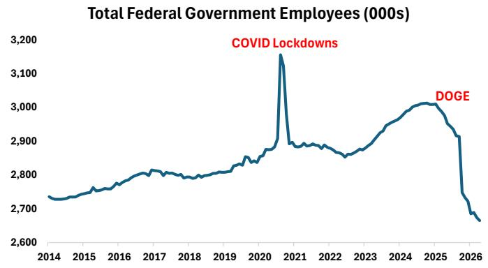

line

| Year | Total Federal Government Employees (000s) |
| ---- | ---------------------------------------- |
| 2014 | 2,750                                    |
| 2015 | 2,760                                    |
| 2016 | 2,780                                    |
| 2017 | 2,800                                    |
| 2018 | 2,810                                    |
| 2019 | 2,830                                    |
| 2020 | 2,850                                    |
| 2021 | 3,150                                    |
| 2022 | 2,880                                    |
| 2023 | 2,860                                    |
| 2024 | 3,000                                    |
| 2025 | 3,050                                    |
| 2026 | 2,700                                    |

Source: Bloomberg, MS.

Exhibit 31: Recent Labor Data Suggest Private Economy Is Driving the Growth Now   
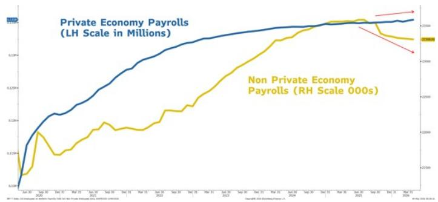

line

| Date       | Private Economy Payrolls (LH Scale in Millions) | Non Private Economy Payrolls (RH Scale 000s) |
| ---------- | ----------------------------------------------- | ------------------------------------------- |
| Mar 26     | 0.23M                                           | 0.23M                                       |

Source: Bloomberg, MS.

Bottom line, as we look out over the next 6–12 months, we remain constructive on US equities, with our base case calling for the S&P 500 to reach 8,300 assuming a continuation of the current earnings strength as the main driver of index level upside. The path to that target may not be smooth, but the direction of travel, in our view, is higher. In other words, investors should be prepared to take advantage of pullbacks/choppiness along the way as opportunities to add length not only in the index but to areas of the market that have not yet reflected the strength in earnings (i.e., Industrials, Financials, the hyperscalers, Consumer Cyclicals).

# Forecast Update

Strong earnings facilitate a continuation of the rolling recovery. This mid-year outlook builds on three themes we have emphasized since last year: running the economy/earnings cycle hot, public to private rebalancing, and a broadening of earnings and performance. Our view dating back to last spring has been that Liberation Day marked the trough of the rolling recession and the start of the rolling recovery. Over the next 12 months, we see the rolling recovery continuing to progress, driven by a strong earnings environment as positive operating leverage persists and is further enhanced by AI adoption. Resiliency in earnings data despite geopolitical risk, private credit concerns and AI disruption is supportive of our view. Specifically, 1Q EPS surprise for the median S&P 500 stock is 6%, the strongest it has been in 4 years, and S&P 500 earnings revisions breadth has accelerated higher since reporting season started (back up to 22% from 5% at the beginning of earnings season).

Our mid-year 2027 S&P 500 price target is 8,300 (20.5x forward EPS of \$404). We see 2026 EPS of \$339 (23% growth), 2027 EPS of \$380 (12% growth), and 2028 EPS of \$429 (13% growth). Positive operating leverage, AI adoption/"run it lean", improving pricing power and an AI capex cycle that continues to show momentum are key drivers of our constructive view on earnings. We continue to diverge from consensus in our call for a broadening in earnings growth and market leadership this year. While strength in S&P 500 EPS growth has been more widely discussed recently, S&P 1500 median stock forward EPS growth has also accelerated—now 12%; up from 8% at the start of the year. With the prospect of near-term Fed cuts fading based on market pricing/our economists' forecast, and the rolling recovery entering a more mature phase over the next 12 months, we see modest multiple compression (to 20.5x) from current levels (21.2x). In short, our bullish index view is an earnings story, not a multiple expansion one. The primary risks to our constructive stance are that our "run it hot" thesis leads to an inflationary impulse the Fed can't ignore and/or they underestimate how much capital the economy is using for investment and the rolling recovery, and we see tighter liquidity. Our year-end 2026 S&P 500 price target also moves higher to 8,000 from 7,800 previously—a reflection of earnings durability.

Sector/style recommendations: We see cyclicals outperforming defensives, which is consistent with our rolling recovery/earnings acceleration thesis. Small cap earnings are inflecting higher (forward growth is 22%), but less accommodative than expected monetary policy in 2026 means small caps remain equal weight relative to large caps for the time being. In terms of sector preferences, we favor Industrials, Financials, and Consumer Discretionary Goods. We also continue to view the hyperscalers as an attractive relative value trade (strong forward earnings at undemanding valuation levels). We move Healthcare to equal weight as our sector positioning reflects a more economically-sensitive and less defensive posture.

Exhibit 32: S&P 500 Forecasts 

<table><tr><td rowspan="2"></td><td colspan="9">MS Top Down EPS Estimates</td><td colspan="4">Bottom Up Consensus EPS Estimates</td></tr><tr><td>Current Price</td><td>MS Next 12M Price Target</td><td>MS Next 12M Price Target % to Current</td><td>Current P/E</td><td>MS Next 12M P/E Target</td><td>2026</td><td>2027</td><td>June 2028</td><td>2028</td><td>2026</td><td>2027</td><td>June 2028</td><td>2028</td></tr><tr><td rowspan="2">Bear Growth</td><td rowspan="2">7,399</td><td rowspan="2">5,900</td><td rowspan="2">-20%</td><td rowspan="2">21.2x</td><td rowspan="2">19.0x</td><td>$299</td><td>$300</td><td>$311</td><td>$322</td><td>$333</td><td>$383</td><td>$405</td><td>$427</td></tr><tr><td>9%</td><td>0%</td><td>4%</td><td>7%</td><td>21%</td><td>15%</td><td>13%</td><td>12%</td></tr><tr><td rowspan="2">Base Growth</td><td rowspan="2">7,399</td><td rowspan="2">8,300</td><td rowspan="2">12%</td><td rowspan="2">21.2x</td><td rowspan="2">20.5x</td><td>$339</td><td>$380</td><td>$404</td><td>$429</td><td>$333</td><td>$383</td><td>$405</td><td>$427</td></tr><tr><td>23%</td><td>12%</td><td>13%</td><td>13%</td><td>21%</td><td>15%</td><td>13%</td><td>12%</td></tr><tr><td rowspan="2">Bull Growth</td><td rowspan="2">7,399</td><td rowspan="2">9,400</td><td rowspan="2">27%</td><td rowspan="2">21.2x</td><td rowspan="2">21.0x</td><td>$352</td><td>$416</td><td>$448</td><td>$480</td><td>$333</td><td>$383</td><td>$405</td><td>$427</td></tr><tr><td>28%</td><td>18%</td><td>17%</td><td>16%</td><td>21%</td><td>15%</td><td>13%</td><td>12%</td></tr></table>

Source: FactSet, MS.

# Bull Case Scenario

In our bull case scenario (9,400 price target), earnings expansion exceeds what we assume in the base case. We model EPS growth of 28% in 2026, 18% in 2027, and 16% in 2028. The upside is driven by a more pronounced operating leverage story. This is supported by AI-driven productivity gains achieved by companies running it hot, too. In some cases, the productivity is driven by AI directly and indirectly as companies hire less in advance of the technology being fully implemented. This drives margin expansion alongside stronger revenue growth, which is underpinned by resilient demand across AI infrastructure plays and more pro-cyclical areas (i.e., transports, chemicals, consumer, etc.). A resolution to the Iran conflict is reached in the near-term, allowing oil prices to fall back to pre-war levels, and cost risks related to fertilizer, petrochemicals, and other key commodities (i.e., sulphur) are mitigated quickly. The associated relief in gasoline prices plus improvement in real wage growth for lower income consumers leads to a shift in the bifurcated nature of the k-shaped economy as lower income consumers catch up and drive overall consumption. Corporates have no issue passing through higher prices to end markets/consumer, yet this inflation does not show up in core CPI/PCE in a way that causes the Fed to hike rates. Importantly, our bull case is also an earnings story, not a multiple expansion story (multiple remains flat at 21x in our bull case); the differentiation between the 2 scenarios comes down to degree of earnings growth upside driven by the aforementioned factors.

From a policy perspective, the Fed refrains from hiking rates at least through mid-year next year even as growth runs hotter as lagging services and housing inflation keep a lid on core CPI/PCE. New Fed Chair Kevin Warsh does not wind up being hawkish on the balance sheet through mid-2027, and the Fed/Treasury even provide additional liquidity through RMPs and buybacks. Back-end rates and bond volatility stay contained via a lack of back-end issuance. On the fiscal policy front, bonus depreciation and immediate R&D expensing further catalyze a broad-based capex rebound, benefiting industrials, technology, and commodities. Loan growth and capital markets activity exceeds expectations and private credit risks remain contained/limited. International demand for U.S. equities is strong amid superior earnings growth and structural advantages, while retail participation remains robust as capital rotates out of money market funds and into equities. The U.S. dollar weakens more than in our base outlook, as narrower front-end rate differentials outweigh demand for dollar assets, providing an additional tailwind for multinational earnings.

# Bear Case Scenario

Our bear case scenario (5,900) assumes that the Fed has to lean in a more hawkish direction on rates as a result of inflationary pressures that return. Inflation in this scenario would be driven by a combination of strong, preceding demand, the fiscal impulse, lagging tariff impacts, and energy price pass through—running it hot has negative repercussions. In addition to rate hikes, the Fed under new leadership from Kevin Warsh also gets more hawkish on asset holdings, laying out plans to shrink the size of the balance sheet. Valuation de-rates by \~2-turns as bond volatility and funding market stress rises. Earnings growth also slows materially as back-end yields rise toward/through 5% without Treasury buybacks and RMP action, and act as a headwind for demand/top line and capex into 2027. In other words, this setup shares similarities with 2022: while the economy avoids a formal recession, earnings come under pressure due to higher rates—aka, Fire and Ice as the hotter but shorter cycle ends. In this backdrop, higher-beta and longer-duration equities are likely to lag. This scenario is very unlikely to play out before year end but ironically its probability increases if our bull case plays out in the 2H of this year and an inflation impulse lags a historic demand recovery.

# A Broadening Capex Cycle Remains Underappreciated

We entered 2026 with a view that the capex cycle was gaining momentum as a result of 3 tailwinds—(1) a strong EPS backdrop from the rolling recovery (earnings/capex cycles are positively correlated), (2) tax incentives from the OBBBA and (3) the structural support from the AI data center build-out and manufacturing renaissance (reshoring / "Don"roe Doctrine). Early indications on this front are supportive with median stock capex growth running 5-10%, and our factor work continuing to show that the market is rewarding high capex/sales on an equal weighted basis. These tailwinds are likely to stay with us in 2026. We believe Multi-Industry remains the best pure-play across these themes, while Regional Banks are an underappreciated winner amid a C&I loan growth inflection. See our Trade Ideas section for more.

In tandem with this theme, there has been a lot of focus on "hard/heavy asset, low obsolescence" (HALO) areas of the market recently as these stocks have been seen as relatively insulated from AI disruption. While these cohorts indeed outperformed while the market was focused on AI disruption earlier this year, their relative strength is not new. In fact a number of these groups like Multi-Industry and Materials/Metals showed outperformance dating back to 2025. In our view, this outperformance has more to do with the broadening of the capex cycle in an early cycle backdrop than anything else, though rotation away from areas perceived to be AI-disrupted has played a role more recently.

Exhibit 33: Capex Growth Accelerating   
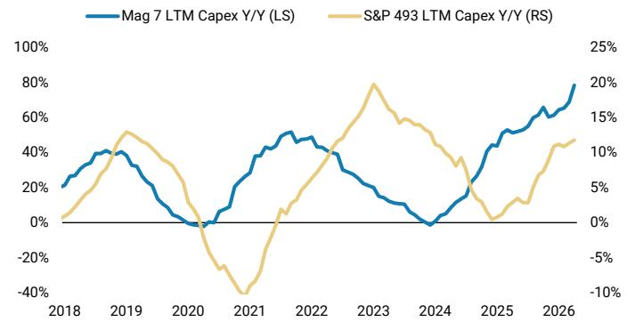

line

| Year | Mag 7 LTM Capex Y/Y (LS) | S&P 493 LTM Capex Y/Y (RS) |
|------|--------------------------|----------------------------|
| 2018 | ~20%                     | ~0%                        |
| 2019 | ~40%                     | ~50%                       |
| 2020 | ~0%                      | ~-10%                      |
| 2021 | ~40%                     | ~-40%                      |
| 2022 | ~50%                     | ~10%                       |
| 2023 | ~30%                     | ~80%                       |
| 2024 | ~0%                      | ~15%                       |
| 2025 | ~50%                     | ~10%                       |
| 2026 | ~80%                     | ~40%                       |

Source: FactSet, MS.

Exhibit 34: And High Capex/Sales Is Being Rewarded Across the Market   
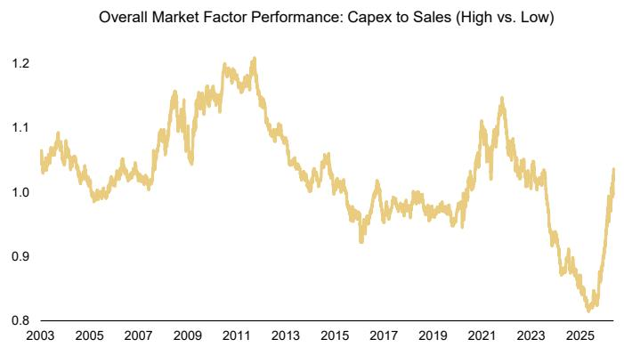

line

| Year | Market Factor |
|------|---------------|
| 2003 | 1.05          |
| 2005 | 1.00          |
| 2007 | 1.05          |
| 2009 | 1.15          |
| 2011 | 1.20          |
| 2013 | 1.10          |
| 2015 | 1.05          |
| 2017 | 0.95          |
| 2019 | 1.00          |
| 2021 | 1.15          |
| 2023 | 1.05          |
| 2025 | 0.80          |

Source: Compustat, MS.

Exhibit 35: ISM Manufacturing Is At Its Highest Level Since 2022   
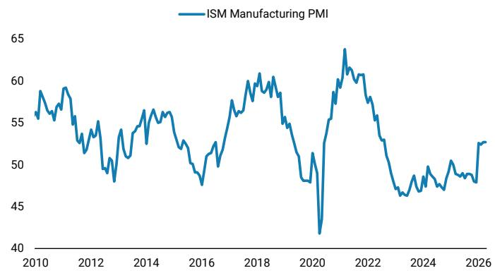

line

| Year | ISM Manufacturing PMI |
| ---- | --------------------- |
| 2010 | ~58                   |
| 2011 | ~59                   |
| 2012 | ~53                   |
| 2013 | ~50                   |
| 2014 | ~56                   |
| 2015 | ~57                   |
| 2016 | ~50                   |
| 2017 | ~58                   |
| 2018 | ~60                   |
| 2019 | ~55                   |
| 2020 | ~42                   |
| 2021 | ~64                   |
| 2022 | ~58                   |
| 2023 | ~47                   |
| 2024 | ~49                   |
| 2025 | ~50                   |
| 2026 | ~53                   |

Source: Bloomberg, MS.

Exhibit 36: Industrial Production Also Remains in an Uptrend   
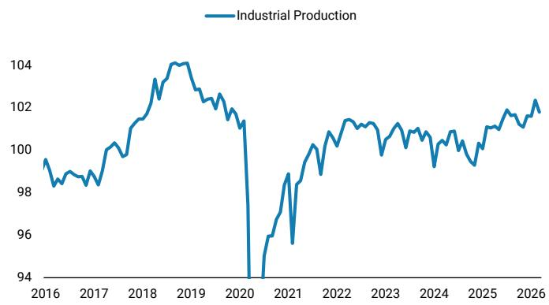

line

| Year | Industrial Production |
| ---- | --------------------- |
| 2016 | 99.5                  |
| 2017 | 98.8                  |
| 2018 | 103.2                 |
| 2019 | 104.1                 |
| 2020 | 94.0                  |
| 2021 | 98.5                  |
| 2022 | 101.3                 |
| 2023 | 100.8                 |
| 2024 | 100.5                 |
| 2025 | 101.7                 |
| 2026 | 102.3                 |

Source: Bloomberg, MS.

# The AI Capex, Disruption and Labor Debate

AI-related uncertainty like we saw earlier this year is not uncommon in major investment cycles where volatility bands can widen and dispersion is higher at times. That said, fundamental tailwinds remain in place for the AI enabler complex, and the AI adopter trade remains underappreciated, in our view. The current status of (1) the affiliated credit cycle (relatively early innings), (2) the cost of capital (benign so far/the Fed's not hiking), (3) the cost of compute (still elevated) and (4) valuation (still undemanding for many of the AI leaders) does not indicate a market environment that's ready to structurally impose capex discipline on the major AI infrastructure providers. While this has been an out of consensus view at times this year amid anecdotal examples of capex discipline, our

systematic factor work continues to show that the market is actually rewarding higher capital spending on an equal weighted basis. Until the four variables noted above shift to a more adverse posture, we continue to think mega cap tech stocks/Mag 7/hyperscalers are likely to trade more off revenue revisions versus capex/FCF expectations.

On AI disruption, the narrative has moved faster than actual implementation. The enterprise application layer is still in early days, and in the near term, AI looks more likely to support, rather than compress, margins, particularly for early adopters. It also gives companies an excuse and an incentive to keep hiring low, as this new economic cycle continues to lead to operating leverage surprises on the upside. This positive operating leverage is surfacing in earnings growth and breadth as the median company is growing EPS in the double digits—the fastest pace since 2021. Furthermore, to get realization of efficiencies, don’t we first need the broader buildout of the agentic application layer and the sUBSequent workflow integration to occur at the enterprise level?

In our view, the investment case for owning AI adopters continues to strengthen, helping to counter disruption fears. This is particularly relevant because many of the areas perceived to be disrupted are also well-positioned as adopters based on our thematic research team's AI mapping work and our industry-level work (i.e., Transports, Software & Services, Professional Services). In fact, forward net margin expectations continue to accelerate for adopters with significant/core to thesis materiality and neutral/high pricing power (Exhibit 37). At the index level, we continue to expect 100bps of net margin expansion cumulatively through 2027 as a result of AI adoption.

Exhibit 37: Profit Margin Expectations for AI Adopters Have Been Strong   
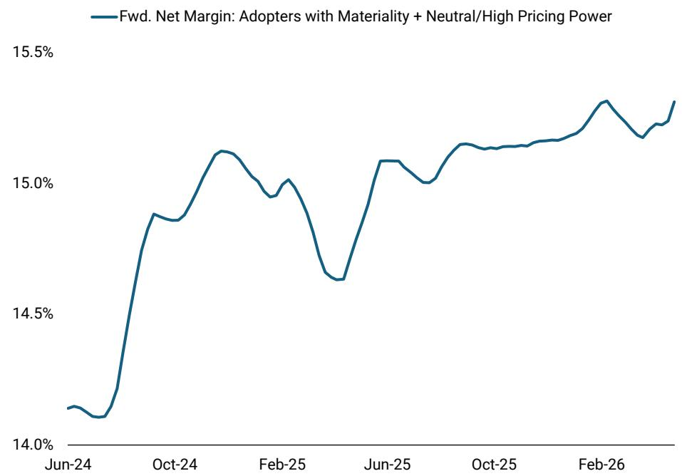

line

| Date   | Fwd. Net Margin |
|--------|-----------------|
| Jun-24 | 14.1%           |
| Oct-24 | 14.9%           |
| Feb-25 | 15.0%           |
| Jun-25 | 14.7%           |
| Oct-25 | 15.1%           |
| Feb-26 | 15.3%           |

Source: MS. Based on our Thematic team's mapping work. Significant or Core to Thesis Materiality. Neutral or High Pricing. Based on median stock. Smoothed 6 weeks.

In addition, our proprietary analysis shows that momentum continues to build around AI adoption. The share of companies Citing quantifiable benefits from AI adoption has been steadily increasing based on our analysis. In 1Q26, 37% of companies identified as "adopters" by our analysts mentioned at least one quantitative impact, up from 30% in

4Q25 and 22% in 1Q25. For the broader S&P 500, 25% of members mentioned at least one measurable benefit, up from 21% in 4Q25 and 13% in 1Q25. We expect this trend to continue as models become more powerful and as companies further ramp up their AI adoption efforts giving employees access to more AI tools.

Exhibit 38: Discussions of Quantifiable Benefits from AI Are Rising   
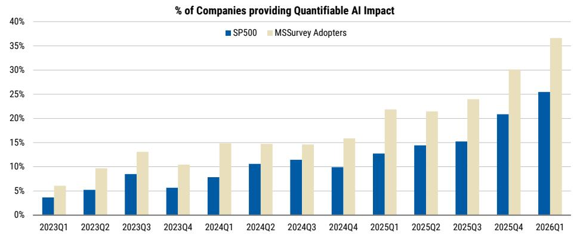

bar

% of Companies providing Quantifiable AI Impact
| Quarter | SP500 (%) | MSSurvey Adopters (%) |
| :--- | :--- | :--- |
| 2023Q1 | 3.5 | 6.0 |
| 2023Q2 | 5.0 | 9.5 |
| 2023Q3 | 8.5 | 13.0 |
| 2023Q4 | 5.5 | 10.5 |
| 2024Q1 | 7.5 | 14.5 |
| 2024Q2 | 10.5 | 14.5 |
| 2024Q3 | 11.0 | 14.5 |
| 2024Q4 | 9.5 | 15.5 |
| 2025Q1 | 12.5 | 21.5 |
| 2025Q2 | 14.0 | 21.0 |
| 2025Q3 | 15.0 | 24.0 |
| 2025Q4 | 20.5 | 30.0 |
| 2026Q1 | 25.5 | 36.5 |

Source: MS. Please note, companies mentioning multiple quantifiable benefits from AI are only counted once in this chart.

Today, the majority of discussions of quantifiable benefits are tied to "financial impact" (revenue growth/generation, cost savings, or investment & capital impacts). "Productivity gain" remains the second-most prevalent type of AI adoption.

Exhibit 39: Category Level Mentions of AI Benefits   
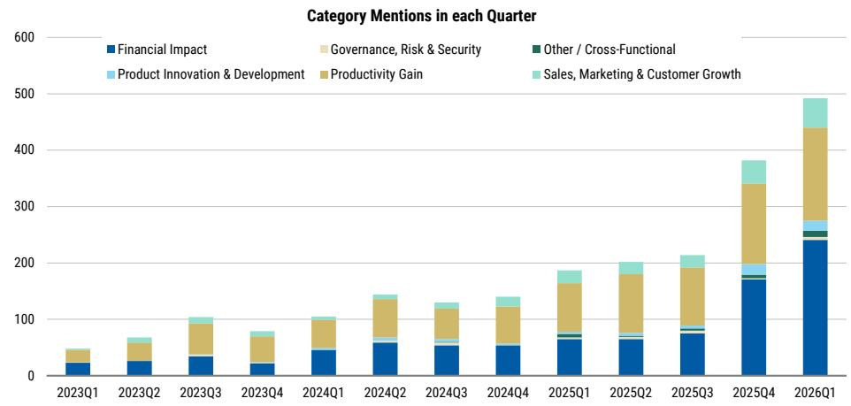

bar_stacked

| Quarter   | Financial Impact | Governance, Risk & Security | Other / Cross-Functional | Product Innovation & Development | Productivity Gain | Sales, Marketing & Customer Growth |
| --------- | ---------------- | -------------------------- | ------------------------ | -------------------------------- | ----------------- | ---------------------------------- |
| 2023Q1    | 20               | 10                         | 0                        | 0                                | 0                 | 0                                  |
| 2023Q2    | 25               | 15                         | 0                        | 0                                | 0                 | 0                                  |
| 2023Q3    | 35               | 25                         | 0                        | 0                                | 0                 | 0                                  |
| 2023Q4    | 25               | 35                         | 0                        | 0                                | 0                 | 0                                  |
| 2024Q1    | 45               | 45                         | 0                        | 0                                | 0                 | 0                                  |
| 2024Q2    | 60               | 75                         | 0                        | 0                                | 0                 | 0                                  |
| 2024Q3    | 55               | 70                         | 0                        | 0                                | 0                 | 0                                  |
| 2024Q4    | 55               | 75                         | 0                        | 0                                | 0                 | 0                                  |
| 2025Q1    | 65               | 95                         | 0                        | 0                                | 0                 | 0                                  |
| 2025Q2    | 65               | 115                        | 0                        | 0                                | 0                 | 0                                  |
| 2025Q3    | 75               | 135                        | 0                        | 0                                | 0                 | 0                                  |
| 2025Q4    | 175              | 185                        | 10                       | 5                                | 135               | 35                                 |
| 2026Q1    | 245              | 275                        | 15                       | 15                               | 195               | 65                                 |

Source: MS.

Lastly, labor market impacts from AI are in focus and have likely driven price action more than disruption fears in certain industries like Consumer Finance this year at times. In our view, jumping to the potential conclusion that AI disruption will structurally impact the jobs market in an adverse way skips over the near/intermediate term adoption of agentic AI which is likely to be margin accretive to an extent that is not currently priced. We think this period of adoption is likely to coincide with some natural attrition not being replaced (i.e., job openings stay low, but the unemployment rate doesn't surge higher) as the agentic application layer is integrated into enterprise workflow. This is likely to take time as noted above. Further, several other governors (power, compute shortages/prices, and regulatory/data governance considerations) could elongate this period of work flow

integration relative to current expectations. In short, history tells us that non-linear increases in unemployment happen as a result of demand shocks, not positive productivity shocks. Finally, while we're respectful of longer term risks on this front, economically sensitive areas of the market like Consumer Cyclicals and Financials that have struggled at times this year amid this overhang are generally shorter duration assets, not longer duration ones which would trade more off terminal value concerns.

# Mapping the Midterms

Given that Midterm elections coincide with our forecast horizon, we highlight recent work on US equity markets around midterm elections. For more cross-asset views, see the full note here: US Public Policy: Mapping the Midterms: A First Look.

# US Equity Strategy: Stay the Course

- Election outcomes may drive short term rotation, but we think the business cycle path ultimately outweighs the policy agenda.   
- We agree with our policy strategists that the policy vectors likely most important for markets through the end of President Trump's term will remain under his control.   
- Historical seasonality is a modest headwind from May through September. Seasonality improves at the start of October and US equities historically see +22% returns in the 12 months following the midterms (early November).

While history shows lower annualized returns for equities in the second year of Presidential cycles relative to the other three years, we'd point out that returns are still solid in absolute terms (+9%). Furthermore, earnings growth today far surpasses the historical precedent in second year periods of Presidential cycles (Exhibit 41). This speaks to a point we've long been partial to, which is that the path of the business cycle ultimately outweighs the policy agenda. With forward 12-month earnings growth north of 20%, the business cycle inflecting and our expectation for the Fed to cut rates later this year, we think returns in 2026 are likely to be stronger than the historical precedent suggests. The other variable to consider is that we've just experienced a 10% correction (18% in P/E terms) due to a host of risk variables. History suggests it's rare to see more than one 10% correction over the course of a year (just 5 instances in the last 55 years). So in this sense, we've likely pulled forward some of the volatility often seen into midterm elections.

We agree with our policy strategists' view discussed above that the policy vectors likely most important for markets through the end of President Trump's term will remain under his control—i.e., foreign policy (US-Iran, Venezuela, US-China, etc.), tariffs (USMCA, US-China, EU, etc.), de-regulation, and immigration controls. While there could be some rotational dynamics in a divided Congress outcome as discussed in the industry sections (i.e., within Healthcare and Industrials), we don't see a divided outcome as a material, market-moving event if it does play out via a Democrat win of the House and a Republican win of the Senate. As noted above, if Democrats secure both the House and Senate but remain internally fragmented or unable to converge around a particular policy agenda, it could have a similar gridlock-type result as a Democratic House and a Republican Senate—likely not a major, market-moving result. In that case, the current policy trajectory would remain the same for the next 2-3 years, a trajectory we believe is equity bullish.

The remaining scenario involves a Democratic win of both chambers where the party is able to build a clear consensus around a political agenda. While the President retains veto power in this outcome, the Democrats could extract concessions (see above). Perhaps more importantly for markets, investors may then look ahead to 2028 in this outcome with the assumption that the odds of a Democrat sweep (including the Presidency) appear likely to rise. This could lead the market to question the durability of the current policy path – specifically, de-regulation (which aids the Banks and small/mid caps), the full scope of the One Big Beautiful Bill (which has helped Industrials and Technology), and the rebalancing from government to the private sector that we have been focused on (see here and here). In our view, this could lead to an initial risk-off reaction function either before mid-terms if polling/prediction markets convincingly point in this direction or post midterms. Why not a more sustained risk-off move? The President has veto power and the 2028 Presidential election would still be 2 years away.

In terms of the historical performance precedent in midterm election years, defensives have typically outperformed in the months leading up to midterms with broad markets gaining 10% in 1Q but giving back half of these returns during Q2 and Q3 before bottoming at the start of Q4. Relative leadership during this period comes from Health Care, Staples, Utilities, and Telecom.

Seasonally, index returns bottom one month before the midterms (start of October) as markets digest political uncertainty in advance and then favor a more risk-on posture following the event. US equities see a +22% return in the 12 months following midterm elections and +19% in year three of the presidential cycle. Relative outperformance is driven by growth, cyclicals ex Energy, and small-cap factors after the midterm election while defensives are the relative laggards. On a sector level, nearly all sectors see strong absolute returns and relative winners are Technology and Consumer Discretionary while laggards are Energy, REITs and Utilities.

Our tracking of markets today versus historical seasonality shows a mixed picture depending if you look at the average stock (Russell 1000 equal weighted) or the S&P 500 (Exhibit 42). The average stock is up 14% year-to-date while the S&P 500 is up 5% after a strong recovery in April. While we remain respectful of Presidential cycle seasonality, we continue to believe that 2026 will be an above average market return year with strong EPS returns being driven by both strong top-line revenue growth and by margin expansion (Exhibit 43). More importantly, we continue to believe the recent rolling correction is occurring within a new bull market and economic cycle that began in April of last year, suggesting the expansion still has significant room to run.

Exhibit 40: Year Two of the Presidential Cycle Sees High Single Digit Returns   
Presidential Cycle Seasonality   
Top 1000 Equal Weight - Median Monthly Returns, Annualized since 1980   
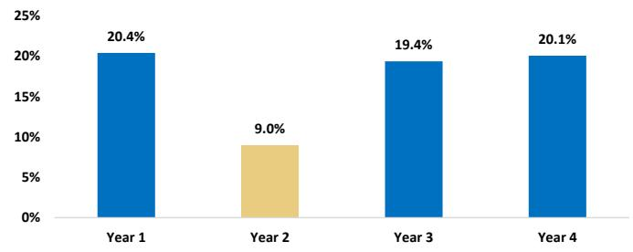

bar

| Year | Value (%) |
| :--- | :--- |
| Year 1 | 20.4 |
| Year 2 | 9.0 |
| Year 3 | 19.4 |
| Year 4 | 20.1 |

Source: Compustat, MS

Exhibit 42: Midterm Seasonality Is Weaker into October and then Rallies in 4Q & 2027   
Midterm Seasonality   
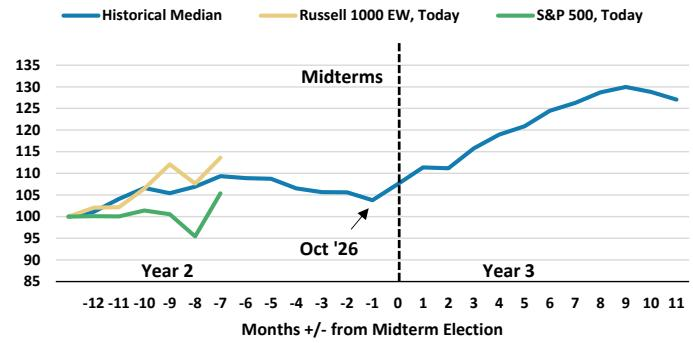

line

| Months +/- from Midterm Election | Historical Median | Russell 1000 EW, Today | S&P 500, Today |
| --------------------------------- | ----------------- | ---------------------- | -------------- |
| -12                               | 100               | 100                    | 100            |
| -11                               | 102               | 102                    | 100            |
| -10                               | 104               | 104                    | 100            |
| -9                                | 106               | 108                    | 100            |
| -8                                | 108               | 112                    | 95             |
| -7                                | 110               | 114                    | 105            |
| -6                                | 110               | 112                    | 108            |
| -5                                | 108               | 110                    | 105            |
| -4                                | 106               | 108                    | 103            |
| -3                                | 104               | 106                    | 102            |
| -2                                | 102               | 104                    | 101            |
| -1                                | 104               | 102                    | 100            |
| 0                                 | 106               | 104                    | 102            |
| 1                                 | 110               | 108                    | 105            |
| 2                                 | 112               | 110                    | 108            |
| 3                                 | 116               | 114                    | 112            |
| 4                                 | 120               | 118                    | 116            |
| 5                                 | 124               | 122                    | 120            |
| 6                                 | 128               | 126                    | 124            |
| 7                                 | 130               | 128                    | 126            |
| 8                                 | 132               | 130                    | 128            |
| 9                                 | 134               | 132                    | 130            |
| 10                                | 132               | 130                    | 128            |
| 11                                | 130               | 128                    | 126            |

Note: Historical median returns are annualized median monthly returns back to 1980 on Top 1000 Equal Weight (Russell 1000 Equal Weight proxy) universe to avoid cap size bias. Seasonality troughs at the end of September/start of October. Source: Compustat, MS

Exhibit 41: EPS Growth Is Triple Today versus the Historical Median Ahead of Midterms   
Historical EPS vs Today's Environment   
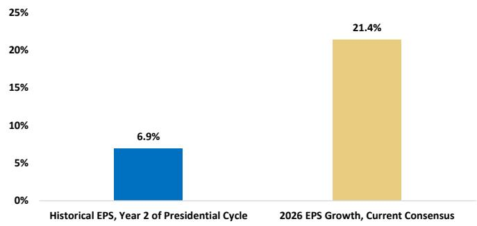

bar

| Category | Value (%) |
|---|---|
| Historical EPS, Year 2 of Presidential Cycle | 6.9 |
| 2026 EPS Growth, Current Consensus | 21.4 |

Source: FactSet, MS

Exhibit 43: 2026 Sees Strong Earnings Contribution from Both Top-Line Growth and Margin Expansion   
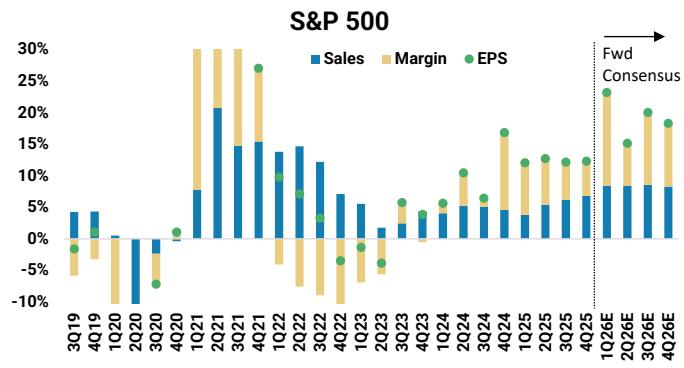

bar

| Quarter | Sales | Margin | EPS |
|---------|-------|--------|-----|
| 3Q19    | 4%    | -5%    | -1% |
| 4Q19    | 4%    | -5%    | -1% |
| 1Q20    | 0%    | -10%   | 0%  |
| 2Q20    | -10%  | -5%    | -5% |
| 3Q20    | -1%   | -5%    | -5% |
| 4Q20    | 0%    | 0%     | 0%  |
| 1Q21    | 8%    | 15%    | 0%  |
| 2Q21    | 20%   | 15%    | 0%  |
| 3Q21    | 15%   | 15%    | 0%  |
| 4Q21    | 14%   | 10%    | 0%  |
| 1Q22    | 14%   | -5%    | 0%  |
| 2Q22    | 14%   | -5%    | 0%  |
| 3Q22    | 12%   | -5%    | 0%  |
| 4Q22    | 7%    | -5%    | -5% |
| 1Q23    | 5%    | -5%    | -5% |
| 2Q23    | 2%    | -5%    | -5% |
| 3Q23    | 2%    | -5%    | -5% |
| 4Q23    | 2%    | -5%    | -5% |
| 1Q24    | 4%    | -5%    | -5% |
| 2Q24    | 4%    | -5%    | -5% |
| 3Q24    | 4%    | -5%    | -5% |
| 4Q24    | 4%    | -5%    | -5% |
| 1Q25    | 4%    | -5%    | -5% |
| 2Q25    | 4%    | -5%    | -5% |
| 3Q25    | 4%    | -5%    | -5% |
| 4Q25    | 4%    | -5%    | -5% |
| 1Q26E   | 8%    | 10%    | 0%  |
| 2Q26E   | 8%    | 10%    | 0%  |
| 3Q26E   | 8%    | 10%    | 0%  |
| 4Q26E   | 8%    | 10%    | 0%  |

Source: FactSet, MS

# Exhibit 44:

# Midterm Seasonality

Average Top 1000 Equal Weighted Performance (Relative) around Midterm Election Year by Industry Group since 1982 

<table><tr><td></td><td>Prior 9M</td><td>Prior 6M</td><td>Prior 3M</td><td>Next 1M</td><td>Next 3M</td><td>Next 6M</td><td>Next 9M</td><td>Next 12M</td></tr><tr><td>Energy</td><td>1.5%</td><td>2.4%</td><td>-0.3%</td><td>-0.5%</td><td>-7.8%</td><td>-8.2%</td><td>-9.2%</td><td>-10.7%</td></tr><tr><td>Materials</td><td>-0.5%</td><td>-1.8%</td><td>0.0%</td><td>-1.2%</td><td>-0.1%</td><td>0.7%</td><td>0.7%</td><td>0.1%</td></tr><tr><td>Capital Goods</td><td>-1.2%</td><td>-2.7%</td><td>-0.5%</td><td>0.1%</td><td>0.6%</td><td>0.7%</td><td>4.2%</td><td>2.8%</td></tr><tr><td>Commercial &amp; Professional Services</td><td>0.1%</td><td>1.2%</td><td>-0.2%</td><td>-0.4%</td><td>-0.6%</td><td>-1.3%</td><td>-3.3%</td><td>-3.4%</td></tr><tr><td>Transportation</td><td>-3.7%</td><td>-4.2%</td><td>-2.9%</td><td>1.1%</td><td>0.9%</td><td>0.7%</td><td>1.0%</td><td>-1.2%</td></tr><tr><td>Automobiles &amp; Components</td><td>-3.0%</td><td>-4.2%</td><td>-2.7%</td><td>1.0%</td><td>1.9%</td><td>0.1%</td><td>4.0%</td><td>-0.3%</td></tr><tr><td>Consumer Durables &amp; Apparel</td><td>-2.9%</td><td>-3.6%</td><td>-3.0%</td><td>0.1%</td><td>2.3%</td><td>2.6%</td><td>2.5%</td><td>-0.1%</td></tr><tr><td>Consumer Services</td><td>-1.9%</td><td>-3.5%</td><td>-2.2%</td><td>0.3%</td><td>1.3%</td><td>5.2%</td><td>7.0%</td><td>5.1%</td></tr><tr><td>Consumer Discretionary Distribution &amp; Retail</td><td>3.6%</td><td>1.6%</td><td>0.2%</td><td>0.9%</td><td>2.9%</td><td>6.5%</td><td>7.3%</td><td>4.4%</td></tr><tr><td>Consumer Staples Distribution &amp; Retail</td><td>9.5%</td><td>6.7%</td><td>2.5%</td><td>1.3%</td><td>2.1%</td><td>0.7%</td><td>-0.5%</td><td>-0.7%</td></tr><tr><td>Food, Beverage &amp; Tobacco</td><td>8.7%</td><td>7.0%</td><td>1.3%</td><td>1.3%</td><td>-0.4%</td><td>-3.5%</td><td>-5.2%</td><td>-2.6%</td></tr><tr><td>Household &amp; Personal Products</td><td>3.1%</td><td>3.2%</td><td>-0.4%</td><td>1.5%</td><td>2.2%</td><td>4.3%</td><td>0.8%</td><td>1.1%</td></tr><tr><td>Health Care Equipment &amp; Services</td><td>7.0%</td><td>6.2%</td><td>3.0%</td><td>-1.0%</td><td>-0.2%</td><td>2.9%</td><td>0.6%</td><td>-3.1%</td></tr><tr><td>Pharmaceuticals, Biotechnology &amp; Life Sciences</td><td>8.5%</td><td>7.9%</td><td>5.0%</td><td>0.8%</td><td>0.8%</td><td>3.9%</td><td>2.7%</td><td>3.9%</td></tr><tr><td>Banks</td><td>-0.7%</td><td>-1.8%</td><td>-2.4%</td><td>-1.7%</td><td>-3.5%</td><td>-8.3%</td><td>-9.7%</td><td>-8.8%</td></tr><tr><td>Financial Services</td><td>-1.5%</td><td>-2.1%</td><td>-0.6%</td><td>2.2%</td><td>2.4%</td><td>6.2%</td><td>7.2%</td><td>5.7%</td></tr><tr><td>Insurance</td><td>1.2%</td><td>0.1%</td><td>0.0%</td><td>-1.1%</td><td>-0.9%</td><td>-4.2%</td><td>-7.7%</td><td>-6.6%</td></tr><tr><td>Software &amp; Services</td><td>-2.6%</td><td>-1.7%</td><td>-0.2%</td><td>2.4%</td><td>6.0%</td><td>11.3%</td><td>14.7%</td><td>17.4%</td></tr><tr><td>Technology Hardware &amp; Equipment</td><td>-5.9%</td><td>-3.9%</td><td>-0.7%</td><td>2.6%</td><td>6.6%</td><td>10.9%</td><td>14.6%</td><td>16.8%</td></tr><tr><td>Semiconductors &amp; Semiconductor Equipment</td><td>-5.5%</td><td>-9.3%</td><td>-4.1%</td><td>3.7%</td><td>8.4%</td><td>21.7%</td><td>32.6%</td><td>39.5%</td></tr><tr><td>Telecommunication Services</td><td>1.7%</td><td>3.6%</td><td>2.3%</td><td>2.3%</td><td>2.2%</td><td>-2.1%</td><td>-2.1%</td><td>-1.5%</td></tr><tr><td>Media &amp; Entertainment</td><td>-1.2%</td><td>-0.1%</td><td>0.2%</td><td>-0.2%</td><td>0.2%</td><td>1.6%</td><td>3.7%</td><td>2.7%</td></tr><tr><td>Utilities</td><td>5.1%</td><td>5.2%</td><td>2.8%</td><td>-0.3%</td><td>-0.9%</td><td>-7.2%</td><td>-10.9%</td><td>-7.3%</td></tr><tr><td>Equity Real Estate Investment Trusts (REITs)</td><td>3.2%</td><td>2.8%</td><td>0.5%</td><td>-1.7%</td><td>-2.3%</td><td>-4.2%</td><td>-8.4%</td><td>-8.1%</td></tr><tr><td>Real Estate Management &amp; Development</td><td>-5.7%</td><td>-8.3%</td><td>2.3%</td><td>-3.7%</td><td>-3.9%</td><td>3.3%</td><td>-4.0%</td><td>-21.9%</td></tr><tr><td>Top 1000 (Cap Weighted)</td><td>-1.4%</td><td>-3.0%</td><td>-1.1%</td><td>4.0%</td><td>7.0%</td><td>15.3%</td><td>22.2%</td><td>21.9%</td></tr><tr><td>Top 1000 (Equal Weighted)</td><td>-2.8%</td><td>-5.1%</td><td>-2.6%</td><td>3.6%</td><td>7.2%</td><td>16.4%</td><td>23.8%</td><td>22.4%</td></tr><tr><td>Value vs Growth</td><td>4.1%</td><td>1.6%</td><td>0.5%</td><td>-0.8%</td><td>-1.9%</td><td>-6.0%</td><td>-6.7%</td><td>-6.7%</td></tr><tr><td>Quality vs Junk</td><td>6.7%</td><td>7.1%</td><td>2.4%</td><td>0.5%</td><td>0.2%</td><td>-4.7%</td><td>-6.4%</td><td>-5.7%</td></tr><tr><td>Cyclical vs Defensive</td><td>-5.2%</td><td>-6.2%</td><td>-3.0%</td><td>0.5%</td><td>1.1%</td><td>4.1%</td><td>7.4%</td><td>5.7%</td></tr><tr><td>Small vs Large</td><td>-3.2%</td><td>-4.9%</td><td>-4.1%</td><td>-1.0%</td><td>0.0%</td><td>2.7%</td><td>3.6%</td><td>2.1%</td></tr></table>

Source: Compustat, MS

Given the potential for Congress to flip from a unified Republican Congress to a divided Congress or a unified Democratic Congress, we also looked at comps for these two scenarios.

# - Scenario 1: Unified to Divided Congress

• Comps are 2010 (Obama), 2018 (Trump), and 2022 (Biden) midterms   
• Strong absolute returns (+12% in +6M)   
• Outperformance from Semis, Consumer Discretionary, Materials, Capital Goods

# - Scenario 2: Party Flip

• Comps are 1994 (Clinton) and 2004 (G.W. Bush)   
• Strong absolute returns (+10% in +6M)   
• Outperformance from Tech, Real Estate, and Materials

# - Scenario 1 vs 2 Comparison

• Overall, returns are similar but the full party flip scenario (scenario 2) sees stronger +12 month forward absolute returns.   
• The full party flip scenario (scenario 2) historically favors a more pro-cyclical outcome with performance led by junk, cyclical and small cap stocks relative to a divided Congress (scenario 1).

Exhibit 45: Midterm Seasonality - Unified Congress to Divided Congress (Scenario 1)   
Average Top 1000 Equal Weighted Performance (Relative) around Midterm Election Year - Unified to Split Congress (2010, 2018, 2022) 

<table><tr><td></td><td>Prior 9M</td><td>Prior 6M</td><td>Prior 3M</td><td>Next 1M</td><td>Next 3M</td><td>Next 6M</td><td>Next 9M</td><td>Next 12M</td></tr><tr><td>Energy</td><td>17.9%</td><td>6.7%</td><td>1.2%</td><td>2.6%</td><td>-0.7%</td><td>-0.5%</td><td>-6.8%</td><td>-7.5%</td></tr><tr><td>Materials</td><td>-2.9%</td><td>-4.4%</td><td>-1.7%</td><td>0.1%</td><td>3.0%</td><td>2.8%</td><td>0.3%</td><td>-3.0%</td></tr><tr><td>Capital Goods</td><td>-0.4%</td><td>1.0%</td><td>4.2%</td><td>-0.4%</td><td>1.7%</td><td>4.0%</td><td>6.2%</td><td>2.1%</td></tr><tr><td>Commercial &amp; Professional Services</td><td>0.4%</td><td>2.2%</td><td>-0.7%</td><td>-0.5%</td><td>-2.5%</td><td>-3.8%</td><td>-2.6%</td><td>-0.4%</td></tr><tr><td>Transportation</td><td>-3.2%</td><td>-2.9%</td><td>0.3%</td><td>0.9%</td><td>-0.3%</td><td>-2.1%</td><td>1.8%</td><td>-1.0%</td></tr><tr><td>Automobiles &amp; Components</td><td>-14.2%</td><td>-9.7%</td><td>-0.9%</td><td>4.3%</td><td>-0.5%</td><td>-0.1%</td><td>-0.9%</td><td>-7.2%</td></tr><tr><td>Consumer Durables &amp; Apparel</td><td>-5.2%</td><td>-3.5%</td><td>-3.4%</td><td>-2.2%</td><td>1.4%</td><td>3.9%</td><td>5.5%</td><td>5.8%</td></tr><tr><td>Consumer Services</td><td>-0.8%</td><td>-3.5%</td><td>0.6%</td><td>1.3%</td><td>2.1%</td><td>3.8%</td><td>7.8%</td><td>5.7%</td></tr><tr><td>Consumer Discretionary Distribution &amp; Retail</td><td>3.4%</td><td>3.9%</td><td>4.0%</td><td>0.2%</td><td>2.2%</td><td>0.4%</td><td>-0.5%</td><td>1.3%</td></tr><tr><td>Consumer Staples Distribution &amp; Retail</td><td>5.6%</td><td>2.7%</td><td>0.1%</td><td>3.2%</td><td>2.4%</td><td>-1.9%</td><td>-2.9%</td><td>5.8%</td></tr><tr><td>Food, Beverage &amp; Tobacco</td><td>3.1%</td><td>2.0%</td><td>-3.2%</td><td>3.9%</td><td>2.5%</td><td>0.0%</td><td>0.7%</td><td>6.3%</td></tr><tr><td>Household &amp; Personal Products</td><td>-1.4%</td><td>0.6%</td><td>-2.0%</td><td>-2.4%</td><td>-0.2%</td><td>-1.4%</td><td>-0.6%</td><td>4.2%</td></tr><tr><td>Health Care Equipment &amp; Services</td><td>6.0%</td><td>3.0%</td><td>0.8%</td><td>-2.0%</td><td>-0.7%</td><td>-0.5%</td><td>1.9%</td><td>-2.5%</td></tr><tr><td>Pharmaceuticals, Biotechnology &amp; Life Sciences</td><td>3.0%</td><td>3.4%</td><td>0.0%</td><td>-1.8%</td><td>-2.0%</td><td>-3.3%</td><td>-4.4%</td><td>-5.1%</td></tr><tr><td>Banks</td><td>-1.0%</td><td>-5.1%</td><td>-4.7%</td><td>-2.2%</td><td>-4.2%</td><td>-18.3%</td><td>-22.7%</td><td>-22.6%</td></tr><tr><td>Financial Services</td><td>-6.9%</td><td>-5.8%</td><td>-1.2%</td><td>1.7%</td><td>0.6%</td><td>-0.7%</td><td>-1.8%</td><td>-0.8%</td></tr><tr><td>Insurance</td><td>5.9%</td><td>0.4%</td><td>-0.2%</td><td>1.8%</td><td>1.9%</td><td>-3.8%</td><td>-2.9%</td><td>3.9%</td></tr><tr><td>Software &amp; Services</td><td>7.8%</td><td>6.3%</td><td>6.2%</td><td>-2.4%</td><td>-4.8%</td><td>0.7%</td><td>2.7%</td><td>4.2%</td></tr><tr><td>Technology Hardware &amp; Equipment</td><td>-2.4%</td><td>-1.6%</td><td>0.2%</td><td>0.4%</td><td>-0.5%</td><td>3.8%</td><td>2.1%</td><td>0.4%</td></tr><tr><td>Semiconductors &amp; Semiconductor Equipment</td><td>-8.0%</td><td>-6.7%</td><td>-1.8%</td><td>-1.1%</td><td>3.7%</td><td>15.2%</td><td>15.1%</td><td>13.6%</td></tr><tr><td>Telecommunication Services</td><td>3.2%</td><td>6.1%</td><td>-1.2%</td><td>0.1%</td><td>-2.8%</td><td>-12.3%</td><td>-14.5%</td><td>-16.1%</td></tr><tr><td>Media &amp; Entertainment</td><td>-0.4%</td><td>-2.5%</td><td>-1.6%</td><td>0.2%</td><td>-3.4%</td><td>-0.2%</td><td>2.0%</td><td>-0.6%</td></tr><tr><td>Utilities</td><td>4.0%</td><td>5.1%</td><td>-1.7%</td><td>0.6%</td><td>1.9%</td><td>-1.8%</td><td>-3.6%</td><td>3.9%</td></tr><tr><td>Equity Real Estate Investment Trusts (REITs)</td><td>-0.4%</td><td>1.4%</td><td>-2.7%</td><td>0.3%</td><td>-0.5%</td><td>-1.5%</td><td>-2.9%</td><td>0.3%</td></tr><tr><td>Real Estate Management &amp; Development</td><td>-11.3%</td><td>-15.2%</td><td>-4.2%</td><td>-3.6%</td><td>-0.9%</td><td>6.6%</td><td>5.0%</td><td>-5.2%</td></tr><tr><td>Top 1000 (Cap Weighted)</td><td>-3.4%</td><td>-3.6%</td><td>4.8%</td><td>1.5%</td><td>1.5%</td><td>10.5%</td><td>15.1%</td><td>8.5%</td></tr><tr><td>Top 1000 (Equal Weighted)</td><td>-2.2%</td><td>-3.1%</td><td>4.8%</td><td>1.4%</td><td>2.1%</td><td>11.5%</td><td>15.0%</td><td>5.8%</td></tr><tr><td>Value vs Growth</td><td>2.7%</td><td>-1.6%</td><td>-3.5%</td><td>1.9%</td><td>1.7%</td><td>-3.6%</td><td>-6.1%</td><td>-4.1%</td></tr><tr><td>Quality vs Junk</td><td>2.9%</td><td>1.1%</td><td>-1.3%</td><td>2.6%</td><td>6.4%</td><td>0.2%</td><td>-1.1%</td><td>1.1%</td></tr><tr><td>Cyclical vs Defensive</td><td>-4.8%</td><td>-3.9%</td><td>3.3%</td><td>2.6%</td><td>-1.2%</td><td>1.8%</td><td>6.1%</td><td>6.6%</td></tr><tr><td>Small vs Large</td><td>2.1%</td><td>0.7%</td><td>-0.9%</td><td>-1.2%</td><td>-0.8%</td><td>1.8%</td><td>1.2%</td><td>-2.4%</td></tr></table>

Source: Compustat, MS

Exhibit 46: Midterm Seasonality - Party Flip in Congress (Scenario 2)   
Average Top 1000 Equal Weighted Performance (Relative) around Midterm Election Year - Congressional Party Flip (1994, 2006) 

<table><tr><td></td><td>Prior 9M</td><td>Prior 6M</td><td>Prior 3M</td><td>Next 1M</td><td>Next 3M</td><td>Next 6M</td><td>Next 9M</td><td>Next 12M</td></tr><tr><td>Energy</td><td>-4.2%</td><td>-3.9%</td><td>-11.5%</td><td>3.8%</td><td>-0.8%</td><td>1.6%</td><td>4.5%</td><td>3.6%</td></tr><tr><td>Materials</td><td>7.7%</td><td>3.4%</td><td>2.0%</td><td>-1.0%</td><td>0.4%</td><td>3.6%</td><td>5.4%</td><td>5.1%</td></tr><tr><td>Capital Goods</td><td>1.8%</td><td>-4.5%</td><td>-3.2%</td><td>1.3%</td><td>0.7%</td><td>2.5%</td><td>10.2%</td><td>10.3%</td></tr><tr><td>Commercial &amp; Professional Services</td><td>1.8%</td><td>0.8%</td><td>-0.5%</td><td>-0.9%</td><td>-0.2%</td><td>-0.9%</td><td>-3.4%</td><td>-5.3%</td></tr><tr><td>Transportation</td><td>-12.8%</td><td>-10.6%</td><td>-12.4%</td><td>2.6%</td><td>-0.3%</td><td>3.3%</td><td>-0.4%</td><td>-1.3%</td></tr><tr><td>Automobiles &amp; Components</td><td>-8.0%</td><td>-3.0%</td><td>-3.2%</td><td>1.9%</td><td>2.2%</td><td>0.6%</td><td>4.9%</td><td>-1.2%</td></tr><tr><td>Consumer Durables &amp; Apparel</td><td>-10.1%</td><td>-7.7%</td><td>-0.4%</td><td>0.4%</td><td>1.4%</td><td>-2.8%</td><td>-7.8%</td><td>-16.0%</td></tr><tr><td>Consumer Services</td><td>-6.0%</td><td>-5.8%</td><td>1.3%</td><td>-0.1%</td><td>0.2%</td><td>1.6%</td><td>1.4%</td><td>2.0%</td></tr><tr><td>Consumer Discretionary Distribution &amp; Retail</td><td>-4.0%</td><td>-3.2%</td><td>2.1%</td><td>0.5%</td><td>-3.1%</td><td>-6.0%</td><td>-9.1%</td><td>-15.8%</td></tr><tr><td>Consumer Staples Distribution &amp; Retail</td><td>4.3%</td><td>3.4%</td><td>1.3%</td><td>1.1%</td><td>-0.2%</td><td>-0.2%</td><td>-2.0%</td><td>-4.1%</td></tr><tr><td>Food, Beverage &amp; Tobacco</td><td>4.2%</td><td>7.2%</td><td>1.7%</td><td>-1.5%</td><td>-1.3%</td><td>-1.1%</td><td>-2.7%</td><td>-1.8%</td></tr><tr><td>Household &amp; Personal Products</td><td>1.4%</td><td>3.4%</td><td>0.9%</td><td>1.0%</td><td>2.1%</td><td>5.7%</td><td>0.2%</td><td>-0.8%</td></tr><tr><td>Health Care Equipment &amp; Services</td><td>6.9%</td><td>6.8%</td><td>6.2%</td><td>-4.1%</td><td>-2.9%</td><td>1.0%</td><td>-8.2%</td><td>-3.7%</td></tr><tr><td>Pharmaceuticals, Biotechnology &amp; Life Sciences</td><td>1.4%</td><td>11.6%</td><td>9.9%</td><td>-0.1%</td><td>-0.2%</td><td>-1.8%</td><td>-2.8%</td><td>1.8%</td></tr><tr><td>Banks</td><td>3.1%</td><td>3.1%</td><td>-3.0%</td><td>-2.9%</td><td>-4.8%</td><td>-7.2%</td><td>-9.0%</td><td>-9.4%</td></tr><tr><td>Financial Services</td><td>3.5%</td><td>1.7%</td><td>0.5%</td><td>0.1%</td><td>0.0%</td><td>1.3%</td><td>4.6%</td><td>7.9%</td></tr><tr><td>Insurance</td><td>-4.3%</td><td>0.7%</td><td>-0.9%</td><td>-2.7%</td><td>-0.1%</td><td>-1.3%</td><td>-4.0%</td><td>-4.5%</td></tr><tr><td>Software &amp; Services</td><td>5.4%</td><td>0.5%</td><td>5.3%</td><td>3.7%</td><td>6.3%</td><td>8.0%</td><td>13.5%</td><td>17.8%</td></tr><tr><td>Technology Hardware &amp; Equipment</td><td>0.8%</td><td>-1.2%</td><td>8.7%</td><td>3.0%</td><td>4.7%</td><td>1.1%</td><td>13.2%</td><td>16.8%</td></tr><tr><td>Semiconductors &amp; Semiconductor Equipment</td><td>13.9%</td><td>-1.6%</td><td>3.0%</td><td>2.8%</td><td>0.2%</td><td>5.9%</td><td>26.5%</td><td>35.5%</td></tr><tr><td>Telecommunication Services</td><td>10.1%</td><td>7.8%</td><td>4.0%</td><td>0.7%</td><td>0.3%</td><td>-1.5%</td><td>-1.2%</td><td>2.0%</td></tr><tr><td>Media &amp; Entertainment</td><td>-8.5%</td><td>-1.0%</td><td>0.1%</td><td>0.3%</td><td>1.8%</td><td>-0.8%</td><td>-4.7%</td><td>-6.1%</td></tr><tr><td>Utilities</td><td>-3.9%</td><td>1.8%</td><td>0.0%</td><td>1.4%</td><td>3.3%</td><td>4.1%</td><td>-0.3%</td><td>-0.6%</td></tr><tr><td>Equity Real Estate Investment Trusts (REITs)</td><td>9.2%</td><td>3.1%</td><td>0.9%</td><td>-2.6%</td><td>0.7%</td><td>-3.7%</td><td>-12.2%</td><td>-11.9%</td></tr><tr><td>Real Estate Management &amp; Development</td><td>-3.0%</td><td>-0.8%</td><td>1.9%</td><td>6.0%</td><td>13.3%</td><td>12.3%</td><td>3.4%</td><td>-22.2%</td></tr><tr><td>Top 1000 (Cap Weighted)</td><td>4.5%</td><td>4.1%</td><td>5.0%</td><td>2.7%</td><td>3.2%</td><td>8.8%</td><td>17.1%</td><td>23.4%</td></tr><tr><td>Top 1000 (Equal Weighted)</td><td>3.8%</td><td>1.6%</td><td>3.9%</td><td>2.5%</td><td>2.9%</td><td>10.0%</td><td>17.9%</td><td>22.6%</td></tr><tr><td>Value vs Growth</td><td>4.5%</td><td>6.0%</td><td>0.1%</td><td>-1.1%</td><td>0.0%</td><td>-0.5%</td><td>-2.3%</td><td>-6.8%</td></tr><tr><td>Quality vs Junk</td><td>2.8%</td><td>6.2%</td><td>3.4%</td><td>-2.0%</td><td>-3.4%</td><td>-7.6%</td><td>-11.8%</td><td>-12.7%</td></tr><tr><td>Cyclical vs Defensive</td><td>0.8%</td><td>-1.5%</td><td>-1.1%</td><td>0.8%</td><td>-0.2%</td><td>1.2%</td><td>7.0%</td><td>7.4%</td></tr><tr><td>Small vs Large</td><td>-1.0%</td><td>-5.6%</td><td>-2.7%</td><td>0.1%</td><td>0.6%</td><td>3.6%</td><td>2.9%</td><td>-0.9%</td></tr></table>

Source: Compustat, MS

# How Are Companies Discussing Benefits from AI Adoption?

Given the importance of AI adoption to the path of forward margins (we see \~100bps of net margin expansion cumulatively through 2027 in our baseline), we thought it was important to highlight our recent work around the momentum that's building around AI adoption. One question we frequently receive from investors is: "to what extent are companies seeing quantifiable efficiency gains from AI adoption?" Last fall, in collaboration with the QuantWise team, we leveraged the GPT model to analyze approximately >15,000 conference transcripts and track how management teams are communicating the quantifiable benefits of AI adoption to investors. We updated that analysis for earnings calls and conference transcripts for events that took place during 1Q (note, earnings calls taking place during 1Q were largely those covering 4Q results).

We identified 6 broad categories where companies are making statements about the quantifiable benefits seen from AI adoption: (1) Financial Impact, (2) Productivity Gain, (3) Sales, Marketing, & Customer Growth, (4) Product Innovation & Development, (5) Governance, Risk, & Security, and (6) Other/Cross Functional Benefits.

Exhibit 47: AI Benefit Classifications   
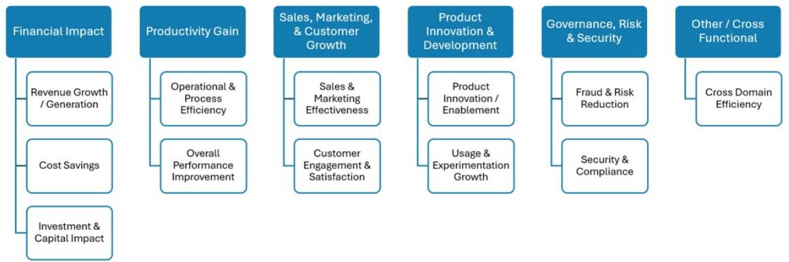

flowchart

```mermaid
graph TD
    A["Financial Impact"] --> B["Revenue Growth / Generation"]
    A --> C["Cost Savings"]
    A --> D["Investment & Capital Impact"]
    
    E["Productivity Gain"] --> F["Operational & Process Efficiency"]
    E --> G["Overall Performance Improvement"]
    
    H["Sales, Marketing, & Customer Growth"] --> I["Sales & Marketing Effectiveness"]
    H --> J["Customer Engagement & Satisfaction"]
    
    K["Product Innovation & Development"] --> L["Product Innovation / Enablement"]
    K --> M["Usage & Experimentation Growth"]
    
    N["Governance, Risk & Security"] --> O["Fraud & Risk Reduction"]
    N --> P["Security & Compliance"]
    
    Q["Other / Cross Functional"] --> R["Cross Domain Efficiency"]
```

Source: MS.

The share of companies Citing quantifiable benefits from AI adoption has been steadily increasing based on our analysis. In 1Q26, 37% of companies identified as "adopters" by our analysts mentioned at least one quantitative impact, up from 30% in 4Q25 and 22% in 1Q25. For the broader S&P 500, 25% of members mentioned at least one measurable benefit, up from 21% in 4Q25 and 13% in 1Q25. We expect this trend to continue as models become more powerful and as companies further ramp up their AI adoption efforts giving employees access to more AI tools.

Exhibit 48: Discussions of Quantifiable Benefits from AI Are Rising   
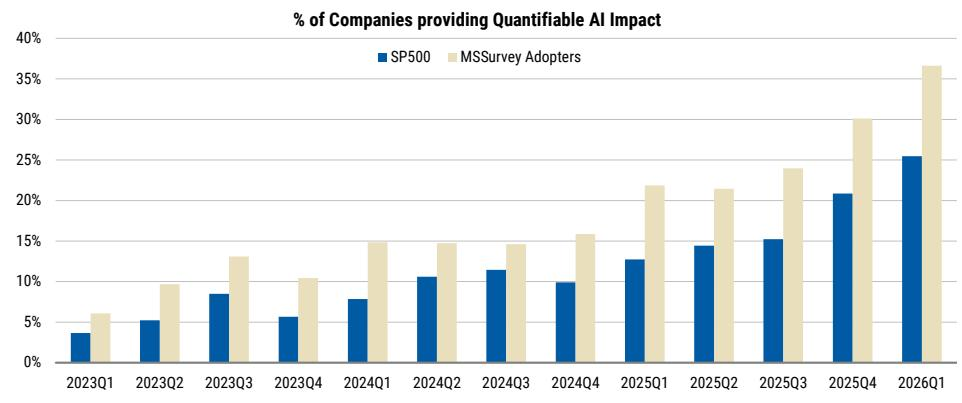

bar

| Quarter   | SP500 | MSSurvey Adopters |
| --------- | ----- | ----------------- |
| 2023Q1    | 3.5%  | 6.0%              |
| 2023Q2    | 5.0%  | 9.5%              |
| 2023Q3    | 8.5%  | 13.0%             |
| 2023Q4    | 5.5%  | 10.5%             |
| 2024Q1    | 7.5%  | 15.0%             |
| 2024Q2    | 10.5% | 14.5%             |
| 2024Q3    | 11.5% | 14.5%             |
| 2024Q4    | 9.5%  | 15.5%             |
| 2025Q1    | 12.5% | 21.5%             |
| 2025Q2    | 14.5% | 21.5%             |
| 2025Q3    | 15.0% | 24.0%             |
| 2025Q4    | 20.5% | 30.0%             |
| 2026Q1    | 25.5% | 36.5%             |

Source: MS. Please note, companies mentioning multiple quantifiable benefits from AI are only counted once in this chart.

Today, the majority of discussions of quantifiable benefits are tied to "financial impact" (revenue growth/generation, cost savings, or investment & capital impacts).

"Productivity gain" remains the second-most prevalent type of AI adoption.

Exhibit 49: Category Level Mentions of AI Benefits   
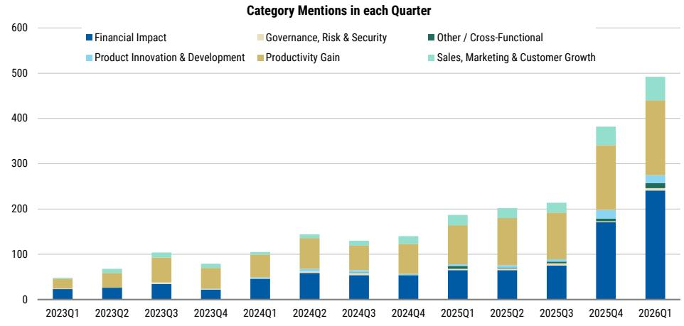

bar_stacked

| Quarter   | Financial Impact | Governance, Risk & Security | Other / Cross-Functional | Product Innovation & Development | Productivity Gain | Sales, Marketing & Customer Growth |
| --------- | ---------------- | --------------------------- | ------------------------- | ---------------------------------- | ----------------- | ----------------------------------- |
| 2023Q1    | 20               | 10                          | 0                         | 0                                  | 0                 | 0                                   |
| 2023Q2    | 25               | 15                          | 0                         | 0                                  | 0                 | 0                                   |
| 2023Q3    | 30               | 20                          | 0                         | 0                                  | 0                 | 0                                   |
| 2023Q4    | 25               | 25                          | 0                         | 0                                  | 0                 | 0                                   |
| 2024Q1    | 45               | 35                          | 0                         | 0                                  | 0                 | 0                                   |
| 2024Q2    | 55               | 50                          | 0                         | 0                                  | 0                 | 0                                   |
| 2024Q3    | 55               | 55                          | 0                         | 0                                  | 0                 | 0                                   |
| 2024Q4    | 55               | 60                          | 0                         | 0                                  | 0                 | 0                                   |
| 2025Q1    | 70               | 80                          | 0                         | 0                                  | 0                 | 10                                  |
| 2025Q2    | 75               | 90                          | 0                         | 0                                  | 0                 | 15                                  |
| 2025Q3    | 85               | 105                         | 0                         | 0                                  | 0                 | 15                                  |
| 2025Q4    | 175              | 185                         | 5                         | 5                                  | 15                | 35                                  |
| 2026Q1    | 240              | 260                         | 10                        | 10                                 | 185               | 45                                  |

Source: MS

To better understand sector-level adoption, we analyzed the percentage of companies within each S&P 500 sector that referenced tangible AI-driven improvements.

Technology holds its spot at the top, with 42% of companies highlighting quantifiable benefits. Financials follow at 40%, while Communication Services rank third with 29%. On a year over year basis, Financials saw the largest increase in mentions (from 15% of the sector in 1Q25 to 40% today), followed by Tech (from 22% of the sector in 1Q25 to 42% today). Since 4Q25, an additional 17% of Communication Services companies and 15% of Financials companies mentioned quantifiable benefits.

Exhibit 50: Percent of Companies within S&P 500 Sectors Mentioning Quantifiable AI-Related Impacts   
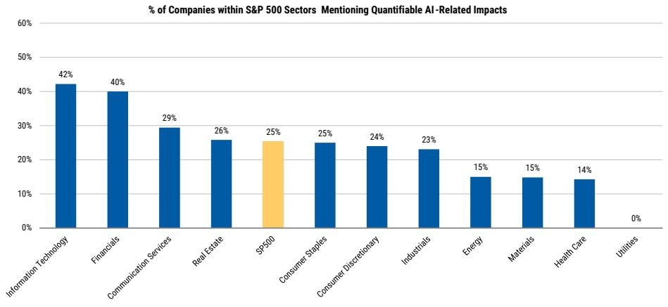

bar

% of Companies within S&P 500 Sectors Mentioning Quantifiable AI-Related Impacts. <|caption_end|>
<|content_start|>% of Companies within S&P 500 Sectors Mentioning Quantifiable AI-Related Impacts
| Sector | Percentage (%) |
| :--- | :--- |
| Information Technology | 42 |
| Financials | 40 |
| Communication Services | 29 |
| Real Estate | 26 |
| SP500 | 25 |
| Consumer Staples | 25 |
| Consumer Discretionary | 24 |
| Industrials | 23 |
| Energy | 15 |
| Materials | 15 |
| Health Care | 14 |
| Utilities | 0 |

Source: MS.

Exhibit 51: Sectors within the S&P 500 Mentioning Quantifiable AI-Related Impacts   
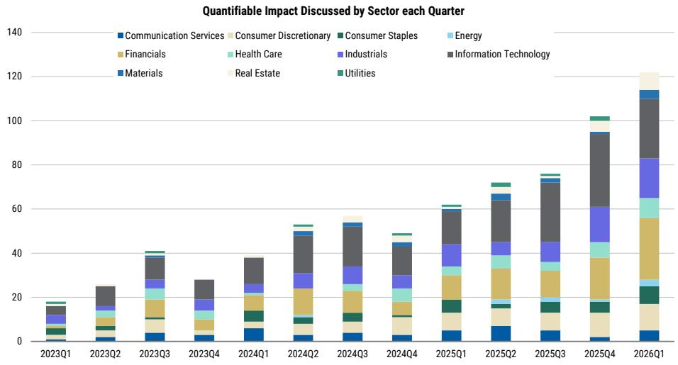

bar_stacked

| Quarter   | Communication Services | Consumer Discretionary | Consumer Staples | Energy | Financials | Health Care | Industrials | Information Technology | Materials | Real Estate | Utilities |
|-----------|------------------------|------------------------|------------------|--------|------------|-------------|-------------|------------------------|-----------|-------------|-----------|
| 2023Q1    | 1                      | 0                      | 0                | 0      | 0          | 0           | 0           | 0                      | 0         | 0           | 0         |
| 2023Q2    | 1                      | 0                      | 0                | 0      | 0          | 0           | 0           | 0                      | 0         | 0           | 0         |
| 2023Q3    | 1                      | 0                      | 0                | 0      | 0          | 0           | 0           | 0                      | 0         | 0           | 0         |
| 2023Q4    | 1                      | 0                      | 0                | 0      | 0          | 0           | 0           | 0                      | 0         | 0           | 0         |
| 2024Q1    | 1                      | 0                      | 0                | 0      | 0          | 0           | 0           | 0                      | 0         | 0           | 0         |
| 2024Q2    | 1                      | 0                      | 0                | 0      | 0          | 0           | 0           | 0                      | 0         | 0           | 0         |
| 2024Q3    | 1                      | 0                      | 0                | 0      | 0          | 0           | 0           | 0                      | 0         | 0           | 0         |
| 2024Q4    | 1                      | 0                      | 0                | 0      | 0          | 0           | 0           | 0                      | 0         | 0           | 0         |
| 2025Q1    | 1                      | 0                      | 0                | 0      | 0          | 0           | 0           | 0                      | 0         | 0           | 0         |
| 2025Q2    | 1                      | 0                      | 0                | 0      | 0          | 0           | 0           | 0                      | 0         | 0           | 0         |
| 2025Q3    | 1                      | 0                      | 0                | 0      | 0          | 0           | 0           | 0                      | 0         | 0           | 0         |
| 2025Q4    | 1                      | 0                      | 0                | 0      | 0          | 0           | 0           | 0                      | 0         | 0           | 0         |
| 2026Q1    | 1                      | 0                      | 0                | 0      | 0          | 0           | 0           | 0                      | 0         | 0           | 0         |

Source: MS

# Financial Impact Examples:

Exhibit 52: Financial Impact Examples 

<table><tr><td>Ticker</td><td>Name</td><td>Sector</td><td>Quote</td></tr><tr><td>CL.N</td><td>Colgate-Palmolive Co.</td><td>Consumer Staples</td><td>Our Promo AI tool is a terrific proprietary tool that we collaborate with our key retailers on around the world. We&#x27;ve generated over $4 million of incremental margin just with that tool alone.</td></tr><tr><td>BXP.N</td><td>BXP Inc</td><td>Real Estate</td><td>And so at the moment, what we are doing is we are looking at ways and we&#x27;ve actually - we have an experiment that&#x27;s going to go live at the end of the first quarter where we are using AI bot to do a series of accounting processes that are currently being done by individuals not at BXP, but under a contract with a center in another part of the country or in another part of the world.... And so we&#x27;re going to be eliminating somewhere between six and eight FTE s(full-time-equivalents) and there&#x27;s a cost associated with that. But the payback is, basically a year plus.</td></tr><tr><td>FTV.N</td><td>Fortive Corp</td><td>Industrials</td><td>In the back half of 2025, we took a lot of cost out, particularly corporate costs, our IR team is half the size. A lot of the work that, you know, we&#x27;re doing right now used to be done by analysts or is now being done by AI. Just summarization of all of the notes, key messages spreading financials, it&#x27;s just so much easier. Our M&amp;A team is probably a third the size that it was. It&#x27;s you know, we see it, you know, across the board. And we&#x27;ve definitely taken out cost, you know, as a result of it.</td></tr><tr><td>FTNT.O</td><td>Fortinet Inc</td><td>Information Technology</td><td>Finally, our AI-enabled solutions. This involves using AI to automate the detection investigation or mediation of threats, our AI-driven SecOps pillar or opportunity is currently probably the largest near-term AI revenue driver with billings for AI-driven SecOps pillar growing 22% for the full year 2025.</td></tr><tr><td>NOW.N</td><td>ServiceNow, Inc.</td><td>Information Technology</td><td>We expect an operating margin of 32%, up 100 basis points year-over-year driven by OpEx savings enabled by AI efficiencies.</td></tr><tr><td>BCE.TO</td><td>BCE Inc</td><td>Communication Services</td><td>The three AI-powered solutions businesses we launched in 2025; Ateko, Bell Cyber and Bell AI Fabric were key contributors, collectively growing approximately 60% year-over-year to around $700 million in revenue.... Importantly, this represents largely net new revenue and EBITDA for Bell, which complements rather than replaces our core connectivity and communication services.</td></tr><tr><td>EFX.N</td><td>Equifax Inc</td><td>Industrials</td><td>Equifax expects a 75 basis points margin expansion due to operating leverage and cost actions driven by AI inside of Equifax.</td></tr><tr><td>UNH.N</td><td>UnitedHealth Group Inc</td><td>Healthcare</td><td>We anticipate operating cost reductions of nearly $1 billion in 2026, many AI-enabled, and importantly resulting in higher customer experience and satisfaction at a lower cost.</td></tr><tr><td>GBTG.N</td><td>Global Business Travel Group, Inc.</td><td>Consumer Discretionary</td><td>AI-driven efficiency gains aren&#x27;t just an idea. They&#x27;re having real-time, meaningful effects on our P&amp;L. And AI is a primary driver for long-term operating leverage and margin expansion. We expect adjusted gross profit margin to increase by 150 basis points to 200 basis points per annum over the next five years, reaching the high 60s by 2030, which represents material margin expansion versus where we are today.</td></tr><tr><td>RYAN.N</td><td>Ryan Specialty Holdings, Inc.</td><td>Financials</td><td>The Empower program, which includes AI as a key enabler, is expected to deliver approximately $80 million of annual savings in 2029.</td></tr></table>

Source: MS

For the full note and additional examples please see Thematic Alpha: Momentum Around AI Adoption Is Building as Companies Cite More Quantifiable Benefits.

# AI Disruption Debate

Recent dislocation tied to AI disruption risk presents opportunities in well-positioned incumbents, strong growers and high quality names. Below, our analysts provide stock picks and broader views across impacted groups.

- Banks: We view banks as net AI beneficiaries. AI is already driving some operating leverage and should materially lift productivity and earnings over time. Core businesses remain resilient with strong investment banking pipelines, trading tailwinds from volatility, low disruption risk across deposits and custody, and healthy credit trends with normalization in losses already reflected in estimates.   
- Business Services: We have seen broad selling across the space, which we believe has impacted names that have a strong defensible position to AI threats given their proprietary data, strong brands, and regulatory barriers.   
- Consumer Finance: We view Consumer Finance stocks as net beneficiaries of AI. These stocks are highly sensitive to consumer health – any acceleration in AI-driven jobs losses would be a net negative. However, in our view, any short-term disruption can be offset by long-term efficiency gains in the underlying business of lending/payments. The core activities of card payments, fraud detection, underwriting, marketing, and loan servicing are data-rich and rules-based, and thus well-suited for AI. Within credit card, we are skeptical that agentic AI can disintermediate credit card interchange, given trust in the system/fraud protections, credit extension, and rewards.   
- Insurance: We believe AI should gradually improve insurance brokering, but complex contracts, tower construction, market access, regulatory review, compliance, and other factors still need expertise, and are unlikely to face near-term disruption.   
- Internet: We believe agentic commerce – in effect, the ability to have a personal digital interactive shopper – is set to be the best next sUBStantial GenAI-enabled unlock for internet. We see the consumer "e-commerce funnel" evolving to be more conversational, personalized, interactive.   
- Payments & Fintech: We see the payments ecosystem, and especially MA and V, as net beneficiaries of AI and agentic commerce. In particular, we expect that MA's and V's respective value-added services segments (44% of rev growing 22% in 4Q25 and 27% of revenue growing 28% in 4Q25, respectively) will see incremental demand. The emergence of AI-driven and AI-based transactions are very similar in nature to existing bot-based fraud attacks, which will increase the opportunity for both companies to provide incremental high-value fraud detection remediation. Further, MA and V feature transaction facets that are nearly unsurpassable, including cost, reliability, accuracy, speed, trust, and legality. We are watching if these payment network moats can be narrowed by fast growth by agentic networks (including the rapidly developing OpenClaw) which may opt for other schemes even if those alternative schemes (e.g., Ether) don't initially offer all the advantages of those of MA and V.   
- REITs and CRE Services: We think AI disintermediation risk in the CRE services space is low in the near and medium term. In our view, both the ability of an AI-

enabled tool to provide highly complex advice related to CRE transactions, and the willingness of enterprises to seek out such a tool for some of the most consequential CRE decisions they make, are high hurdles to jump in the near and medium term.

\- Software: The question is not whether Software will ultimately monetize in this innovation cycle, but rather who will participate in building out these additional capabilities.

• AI IS Software—GenAI fundamentally expands the capabilities of enterprise software – presenting opportunities along with risks, with the pullback giving attractive entry points in well positioned incumbents. The average software multiple is back into the range last seen during the peak uncertainty around Public Cloud (2014-2016). The bear case arguments around GenAI appear to give too little credence to the ability of incumbent software vendors to participate in this innovation cycle. Exhibiting an ability to participate in GenAI, with ramping product cycles, likely proves a necessary catalyst in addition to the attractive valuations.

\- Transportation: Net-net, we believe most Freight Transportation sUBSectors are more likely to be beneficiaries of AI adoption vs. outright victims of disruption, but the balance differs meaningfully by business model.

Exhibit 53: Key Takeaways on Industry Dynamics & Defensible Stock Picks 

<table><tr><td>Industry</td><td>Most Defensible Stocks: Analyst Picks</td><td>Key Takeaways</td></tr><tr><td>Banks</td><td>Citi, BAC, STT, TFC</td><td>Regulatory intensity, balance sheet requirements, and relationship-driven models limit disintermediation. AI drives productivity gains across operations, risk, and client service, supporting sustained operating leverage. This is true across the banks industry, and we highlight our key Large Cap Bank Overweights here</td></tr><tr><td>Business Services</td><td>SPGI, MCO, EFX, TRU, MSCI, VRSK, WCN, RSG, WM, ROL, BV, CTAS</td><td>Proprietary data, regulatory barriers, and decision-grade accuracy protect leading information services franchises. AI increases demand for trusted data and analytics while improving operating leverage and product depth.</td></tr><tr><td>Consumer Finance</td><td>COF, AXP</td><td>We see the space as a net beneficiary of AI, with long-term efficiency gains in lending and payments outweighing near-term risks tied to consumer health. Core functions such as payments, fraud detection, underwriting, marketing, and servicing are data-rich and well suited to AI, and we are skeptical that agentic AI can meaningfully disintermediate credit card interchange given the importance of trust, fraud protection, credit extension, and rewards.</td></tr><tr><td>Insurance</td><td>AON, MRSH, NP, AIG, CB, WTW, RYAN</td><td>Complex commercial insurance requires expertise, market access, and regulatory oversight that AI cannot replace. Adoption improves underwriting speed, claims handling, and expense ratios, lifting margins for brokers and carriers.</td></tr><tr><td>Internet</td><td>AMZN, EBAY, DASH, RVLV, META, GOOGL, APP</td><td>Agentic commerce increases personalization, conversion, and online wallet share, expanding e-commerce and digital advertising. Platforms with scale, logistics, and data are positioned to capture incremental demand.</td></tr><tr><td>Payments &amp; Fintech</td><td>MA, V</td><td>We see the payments ecosystem as a net beneficiary of AI and agentic commerce, with rising demand for value-added services such as fraud detection as AI-driven transactions proliferate. Network moats around cost, speed, reliability, trust, and legality remain strong, though fast-growing agentic payment schemes bear watching over time.</td></tr><tr><td>REITs and CRE Services</td><td>CBRE, CWK</td><td>AI risk is largely second-order through tenant demand, while adoption drives material labor productivity gains. Complex, bespoke transactions favor augmentation over replacement, supporting incumbents.</td></tr><tr><td>Software</td><td>MSFT, INTU, CRM, NOW, TEAM, SNOW, FROG, NET, SHOP, PANW</td><td>AI expands enterprise software&#x27;s addressable market by automating unstructured work rather than replacing applications. Incumbents with distribution, data, and workflow control are positioned to capture monetization as adoption deepens.</td></tr><tr><td>Transportation</td><td>KNX, SNDR, WERN, SAIA, XPO, ODFL, JBHT, GXO, AUR</td><td>AI improves routing, pricing, maintenance, and asset utilization across freight networks. Durable benefits accrue to asset-heavy operators while the disruption risk is concentrated in asset-light intermediaries rather than the industry overall.</td></tr></table>

Source: MS.

# The Mobile Era disruption analog also suggests a stock-specific approach. Areas

thought to be disrupted following the launch of the iPhone in 2007 included gaming, PC, printer/camera, GPS, and desktop software/engagement. From a data perspective, we think there are a few takeaways worth noting:

\- Median relative performance of related stocks was quite choppy in the years following the iPhone launch. The max drawdown of the series shown in Exhibit 54 was \~30%, though this period also included a \~40% rally.

- Relative valuation for the group compressed directionally over this period, while forward earnings showed more resilience.   
- Dispersion among stocks perceived to be disrupted in this time period was extremely high across performance, revenue, earnings and valuation. For example, the strongest performance came from Google/Alphabet (+28%), while the weakest came from Nokia (-73%).   
- We tested a number of fundamental variables and found the following explained forward performance post the iPhone announcement/launch with strong significance: change in forward earnings, change in forward sales, consistently strong operating margins (i.e., strong in 2007 and 5 years later), change in revenue share.   
- The strongest variable in terms of explaining forward returns post the iPhone announcement/launch was forward earnings (0.9 Spearman rank order correlation).

Exhibit 54: Aggregate Relative Performance Was Choppy for Mobile Era Stocks Perceived to be Disrupted Post the iPhone Launch...   
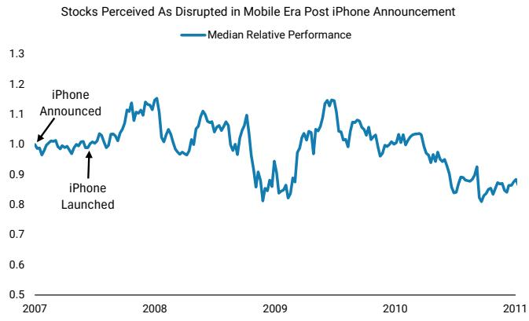

line

| Year | Median Relative Performance |
| ---- | -------------------------- |
| 2007 | 1.0                        |
| 2008 | 1.1                        |
| 2009 | 0.8                        |
| 2010 | 1.0                        |
| 2011 | 0.9                        |

Source: FactSet, MS.

Exhibit 55: ...Though Dispersion Was High Driven by Degree of Earnings Resiliency   
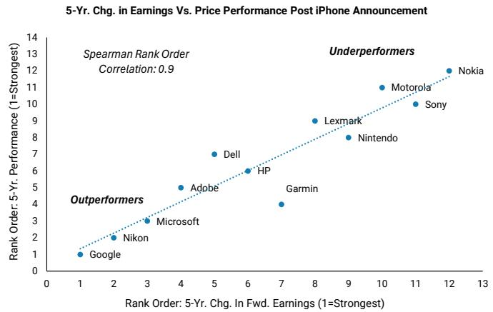

scatter

5-Yr. Chg. in Earnings Vs. Price Performance Post iPhone Announcement
| Company | Rank Order: 5-Yr. Chg. In Fwd. Earnings (1=Strongest) | Rank Order: 5-Yr. Performance (1=Strongest) |
| :--- | :--- | :--- |
| Google | 1 | 1 |
| Nikon | 2 | 2 |
| Microsoft | 3 | 3 |
| Adobe | 4 | 5 |
| Dell | 5 | 7 |
| HP | 6 | 6 |
| Garmin | 7 | 4 |
| Nintendo | 9 | 8 |
| Lexmark | 8 | 9 |
| Motorola | 10 | 11 |
| Sony | 11 | 10 |
| Nokia | 12 | 12 |
Spearman Rank Order Correlation: 0.9

Source: FactSet, MS.

In our view, what's going on now is typical of a major investment cycle. Volatility bands tend to widen at times and there are intermittent periods along the way where markets question both the pace of capital spending and which areas of the market could be disrupted. Dispersion is also elevated, which is typical as the market contemplates relative leaders/laggards. What's somewhat unique about this capex boom, particularly relative to the late 1990s (for instance), is that today we're in an early cycle backdrop—specifically in terms of earnings as we've come off the rolling recession of 2022-2025. Thus, as capital is rotating out of certain areas, it's not just finding its way into structural leaders, it's also finding its way into cyclical leaders.

# Sectors and Screens

# Long Industrials

We're encouraged by the resiliency of earnings revisions and macro data points for both Capital Goods and Transportation despite risks from the Iran conflict. Specifically, earnings revisions breadth for both cohorts has inflected higher over the past several weeks. On the macro front, manufacturers' new orders data has continued its ascent as inventory/sales ratios remain benign/have declined. The ISM Manufacturing Index has held up quite well (remaining around 52-53) despite risks from the war, and manufacturing backlogs have increased materially over the past several months based on data from the survey. On the transports side, the Cass Freight Expenditure Index has risen significantly in growth rate terms since the rolling recession that transpired post-2022. While shipment growth has not seen the same inflection, it does look to be stabilizing around current levels. At the same time, we're seeing C&I loan growth improve, which is a leading indicator for industrial activity, and short-cycle organic revenue growth is also stabilizing. Lastly, the capex cycle is very much in gear and is a function of 3 distinct variables in our view: (1) a rebound in the earnings/business cycle as capex is correlated to EPS, (2) fiscal tailwinds from the OBBBA, and (3) the data center buildout. These developments are contributing to the strongest capex growth we have seen in years (see exhibits below); this is evident both for the AI-related complex and for the S&P 493.

1Q earnings season reinforced a more resilient industrial backdrop than many feared just a few months ago. Early reporters have generally exceeded expectations, with solid order growth, suggesting underlying demand is holding up despite geopolitical noise and cost pressures. At the same time, companies had set a relatively low bar for the quarter, which helped drive beats, but forward commentary has been more measured—particularly as margin expansion through the balance of the year is questioned and cost inflation begins to build into the outlook. This has left investors debating how much of the strong first-half performance reflects true end-market strength versus timing effects. We're more in the former camp versus the latter camp given our constructive views on the broader earnings/capex cycles and our Multi-Industry analyst Chris Snyder's long-standing reshoring thesis, but we acknowledge risks from pull-forward potential, the 232 tariff update and downstream cost impacts from the Iran conflict.

Chris Snyder's reshoring thesis resonates with us. In effect, reshoring is shifting the drivers of growth away from pure end-demand and toward supply-chain realignment, helping sustain industrial momentum even amid macro uncertainty. The best positioned pockets in the sector to benefit from this themes are those with relatively inelastic volumes, pricing power, and domestic exposure. The team is overweight: AYI, ROK, TT, ETN, VRT, RAL, JCI.

Exhibit 56: Capital Goods Earnings Revisions Breadth Rising...   
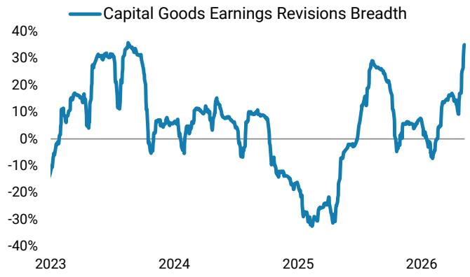

line

| Year | Capital Goods Earnings Revisions Breadth |
| ---- | ---------------------------------------- |
| 2023 | -10%                                     |
| 2024 | 10%                                      |
| 2025 | -30%                                     |
| 2026 | 30%                                      |

Source: FactSet, MS.

Exhibit 57: ...As Is Revisions Breadth for Transportation   
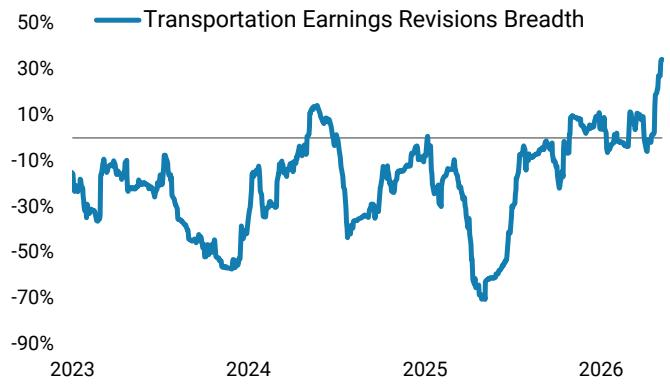

line

| Year | Transportation Earnings Revisions Breadth |
| ---- | ---------------------------------------- |
| 2023 | -10%                                     |
| 2024 | -50%                                     |
| 2025 | -70%                                     |
| 2026 | 30%                                      |

Source: FactSet, MS.

Exhibit 58: Manufacturing Inventory/Sales Ratio Has Fallen...   
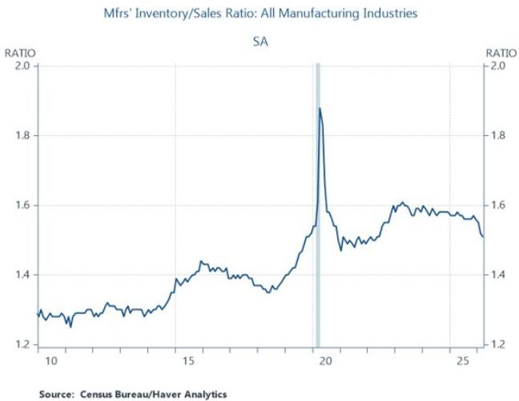

line

| Year | Mfrs' Inventory/Sales Ratio |
| ---- | --------------------------- |
| 10   | 1.3                         |
| 15   | 1.4                         |
| 20   | 1.9                         |
| 25   | 1.5                         |

Source: Haver Analytics, MS.

Exhibit 59: ...As New Orders Are Picking Up   
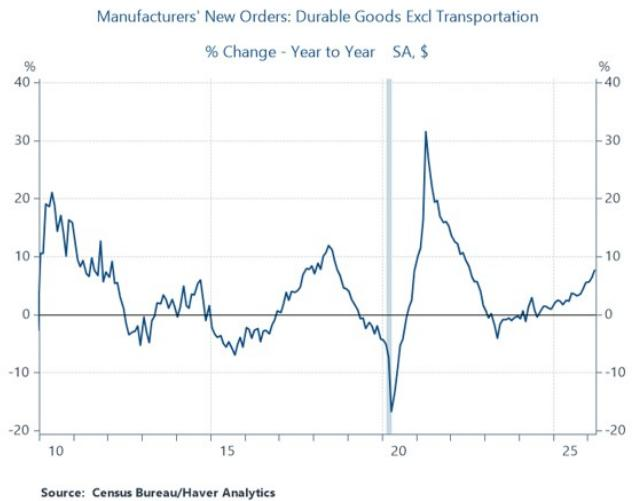

line

| Year | % Change (Year to Year) |
|------|--------------------------|
| 10   | ~20%                     |
| 15   | ~-5%                     |
| 20   | ~-15%                    |
| 25   | ~5%                      |

Source: Haver Analytics, MS.

Exhibit 60: ISM Manufacturing Index Has Held Up Quite Well Despite the Geopolitical Risks...   
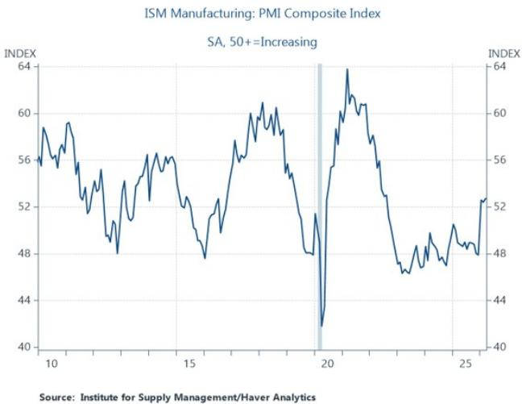

line

| Year | Index |
| ---- | ----- |
| 10   | 56    |
| 15   | 52    |
| 20   | 43    |
| 25   | 52    |

Source: Haver Analytics, MS.

Exhibit 61: ...With Backlogs Strengthening   
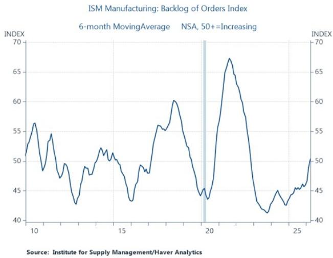

line

| Year | Index |
|------|-------|
| 10   | 56    |
| 11   | 54    |
| 12   | 48    |
| 13   | 50    |
| 14   | 52    |
| 15   | 49    |
| 16   | 43    |
| 17   | 48    |
| 18   | 56    |
| 19   | 60    |
| 20   | 44    |
| 21   | 67    |
| 22   | 60    |
| 23   | 42    |
| 24   | 45    |
| 25   | 50    |

Source: Haver Analytics, MS.

Exhibit 62: Cass Freight Total Spending Rising Driven by Pricing...   
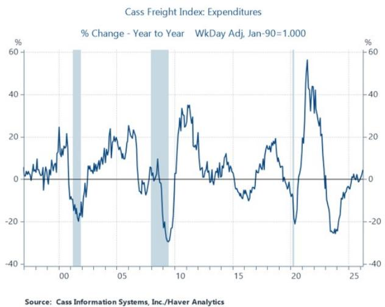

line

| Time | % Change |
|------|----------|
| 0    | 0        |
| 1    | 10       |
| 2    | -10      |
| 3    | 20       |
| 4    | 15       |
| 5    | 25       |
| 6    | 10       |
| 7    | -5       |
| 8    | -30      |
| 9    | -20      |
| 10   | 30       |
| 11   | 20       |
| 12   | 10       |
| 13   | 5        |
| 14   | 0        |
| 15   | -5       |
| 16   | -10      |
| 17   | -5       |
| 18   | 10       |
| 19   | -10      |
| 20   | -20      |
| 21   | 60       |
| 22   | 40       |
| 23   | -25      |
| 24   | -30      |
| 25   | 0        |

Source: Haver Analytics, MS.

Exhibit 63: ...While Shipments Haven't Yet Accelerated, They Look to be Stabilizing   
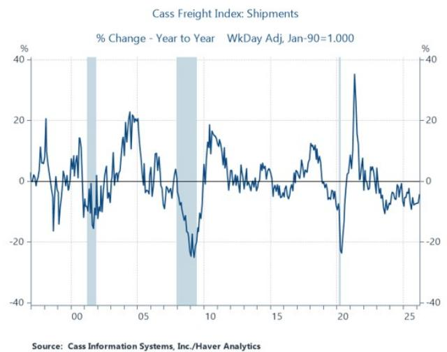

line

| Date | % Change |
|------|----------|
| 0    | 0        |
| 5    | 20       |
| 10   | -20      |
| 15   | 0        |
| 20   | -20      |
| 25   | 0        |

Source: Haver Analytics, MS.

Exhibit 64: Industrial Loan Growth on the Rise   
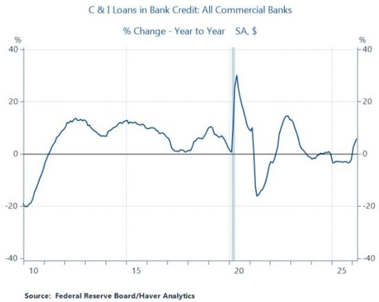

line

| Year | % Change |
|------|----------|
| 10   | -20      |
| 15   | 10       |
| 20   | 30       |
| 25   | 0        |

Source: Haver Analytics, MS.

Exhibit 65: Organic Revenue Growth for Short-Cycle Stocks Also Stabilizing   
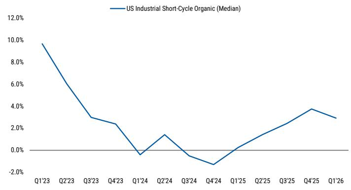

line

| Quarter | US Industrial Short-Cycle Organic (Median) |
| ------- | ------------------------------------------ |
| Q1'23   | 10.0%                                      |
| Q2'23   | 6.0%                                       |
| Q3'23   | 3.0%                                       |
| Q4'23   | 2.5%                                       |
| Q1'24   | -1.0%                                      |
| Q2'24   | 1.5%                                       |
| Q3'24   | -1.0%                                      |
| Q4'24   | -2.0%                                      |
| Q1'25   | 0.0%                                       |
| Q2'25   | 1.5%                                       |
| Q3'25   | 2.5%                                       |
| Q4'25   | 4.0%                                       |
| Q1'26   | 3.0%                                       |

Source: MS, FactSet (Includes DOV, EMR, FAST, HUBB, IR, ROK, GTES).

Exhibit 66: Capex Growth Picking Up for Both the Mag 7 and S&P 493   
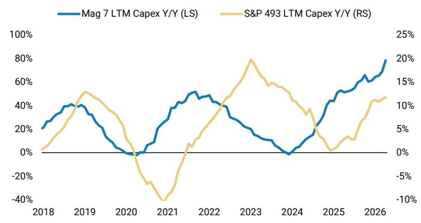

line

| Year | Mag 7 LTM Capex Y/Y (LS) | S&P 493 LTM Capex Y/Y (RS) |
|------|--------------------------|----------------------------|
| 2018 | ~20%                     | ~0%                        |
| 2019 | ~40%                     | ~50%                       |
| 2020 | ~0%                      | ~-5%                       |
| 2021 | ~40%                     | ~-40%                      |
| 2022 | ~50%                     | ~10%                       |
| 2023 | ~30%                     | ~80%                       |
| 2024 | ~0%                      | ~15%                       |
| 2025 | ~50%                     | ~10%                       |
| 2026 | ~80%                     | ~40%                       |

Source: FactSet, MS.

Exhibit 67: Median Stock Capex Growth Lags the Earnings Cycle; We Should See A Further Acceleration over the Next 12 Months   
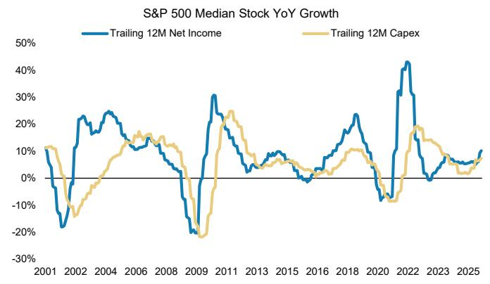

line

| Year | Trailing 12M Net Income | Trailing 12M Capex |
|------|--------------------------|---------------------|
| 2001 | ~10%                     | ~10%                |
| 2002 | ~-20%                    | ~-10%               |
| 2004 | ~25%                     | ~15%                |
| 2006 | ~15%                     | ~15%                |
| 2008 | ~5%                      | ~10%                |
| 2009 | ~-25%                    | ~-20%               |
| 2011 | ~30%                     | ~25%                |
| 2013 | ~5%                      | ~5%                 |
| 2015 | ~10%                     | ~5%                 |
| 2016 | ~5%                      | ~5%                 |
| 2018 | ~25%                     | ~10%                |
| 2020 | ~-10%                    | ~-10%               |
| 2022 | ~45%                     | ~15%                |
| 2023 | ~5%                      | ~5%                 |
| 2025 | ~10%                     | ~10%                |

Source: FactSet, MS.

# Long Financials

Our Banks team led by Manan Gosalia has argued that the backdrop for his coverage is attractive given a significant release of excess capital alongside improving underlying business conditions. Currently, banks in the MS Large Cap Banks coverage hold roughly \$137B of excess capital which could rise to \$179B, pending upcoming regulatory changes such as Basel III Endgame and GSIB surcharge revisions. These changes are expected to expand balance sheet capacity meaningfully, allowing banks to support stronger lending, higher capital markets activity, and increased shareholder returns. Importantly, their work suggests that consensus estimates underestimate both the scale and pace at which banks will deploy this capital.

Our work shows that Banks forward earnings growth continues to rise (now 14%), while valuation is still attractive at 12x forward earnings for the overall group. For Financial Services more broadly, earnings revisions breadth has inflected higher once again post-reporting season, an incremental positive development. At the same time, loan growth is picking up and the Senior Loan Officer Survey points to continued upside momentum this year, benefitting the mid-size/regional banks (Exhibit 70). Capital markets/M&A beneficiaries within the sector should benefit from a pick-up in deal activity (Exhibit 71). Lastly, positioning is light in the sector based on our prime brokerage data (0 percentile) a sign that the excess capital release/positive earnings revisions story for the space remains out of consensus.

Exhibit 68: Banks Earnings Expectations Continue to Rise As Valuation Looks More Attractive   
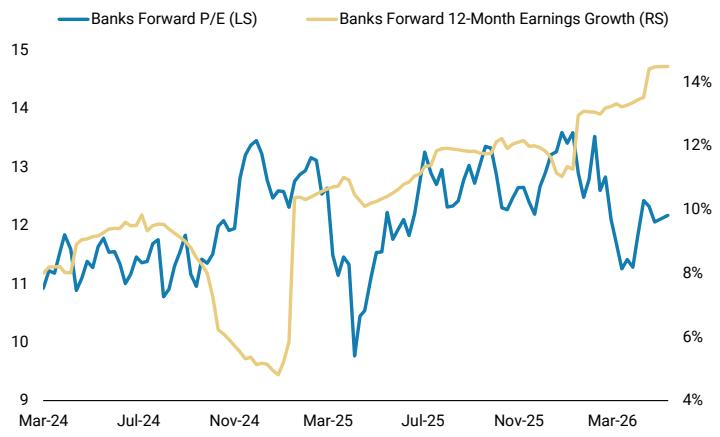

line

| Date   | Banks Forward P/E (LS) | Banks Forward 12-Month Earnings Growth (RS) |
|--------|------------------------|---------------------------------------------|
| Mar-24 | ~11.5                  | ~8%                                         |
| Jul-24 | ~11.8                  | ~10%                                        |
| Nov-24 | ~13.5                  | ~6%                                         |
| Mar-25 | ~10.0                  | ~12%                                        |
| Jul-25 | ~13.0                  | ~12%                                        |
| Nov-25 | ~13.5                  | ~12%                                        |
| Mar-26 | ~12.0                  | ~14%                                        |

Source: FactSet, MS.

Exhibit 70: An Easing in Credit Conditions As Measured by the Senior Loan Officer Survey Indicate That Loan Growth Is Likely to Continue to Improve   
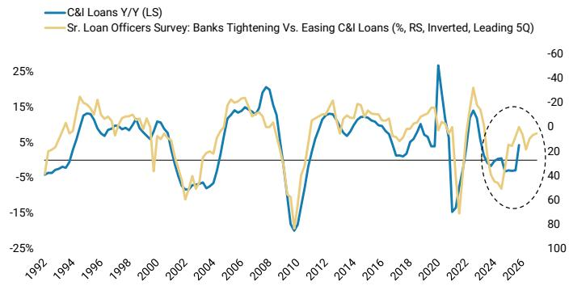

line

| Year | C&I Loans Y/Y (LS) | Sr. Loan Officers Survey: Banks Tightening Vs. Easing C&I Loans (% , RS, Inverted, Leading 5Q) |
|------|---------------------|----------------------------------------------------------------------------------|
| 1992 | -5%                 | 0                                                                                  |
| 1994 | 15%                 | 10                                                                                 |
| 1996 | 10%                 | 50                                                                                 |
| 1998 | 5%                  | 0                                                                                  |
| 2000 | -5%                 | -50                                                                                |
| 2002 | -15%                | -100                                                                               |
| 2004 | -10%                | -50                                                                                |
| 2006 | 15%                 | 0                                                                                  |
| 2008 | 25%                 | 50                                                                                 |
| 2010 | -25%                | -100                                                                               |
| 2012 | 15%                 | 0                                                                                  |
| 2014 | 10%                 | -50                                                                                |
| 2016 | 5%                  | 0                                                                                  |
| 2018 | -5%                 | -50                                                                                |
| 2020 | 25%                 | 0                                                                                  |
| 2022 | -15%                | -100                                                                               |
| 2024 | 15%                 | 0                                                                                  |
| 2026 | 5%                  | -50                                                                                |

Source: Haver Analytics, MS.

Exhibit 72: Financials Relative Forward P/E...   
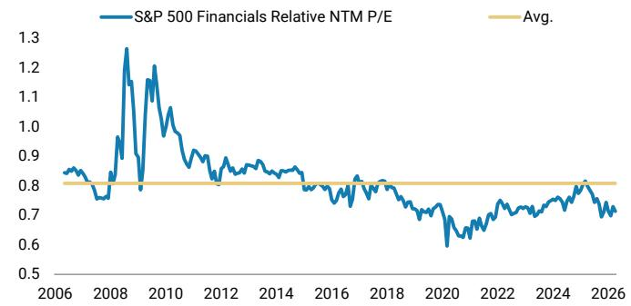

line

| Year | S&P 500 Financials Relative NTM P/E |
|------|--------------------------------------|
| 2006 | ~0.85                                |
| 2008 | ~1.25                                |
| 2010 | ~1.15                                |
| 2012 | ~0.85                                |
| 2014 | ~0.85                                |
| 2016 | ~0.8                                 |
| 2018 | ~0.8                                 |
| 2020 | ~0.7                                 |
| 2022 | ~0.75                                |
| 2024 | ~0.8                                 |
| 2026 | ~0.75                                |

Source: FactSet, MS.

Exhibit 69: Financial Services Earnings Revisions Breadth Picking Up Again   
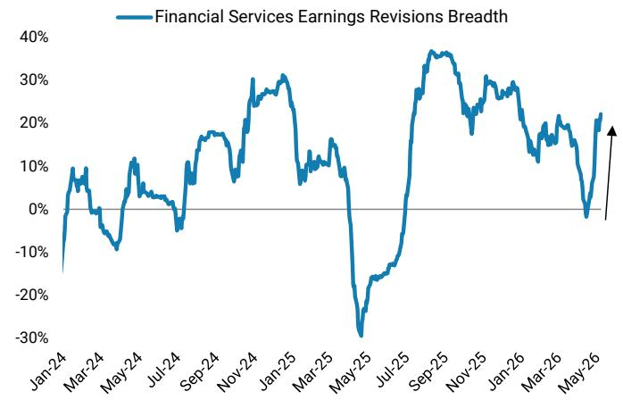

line

| Date    | Financial Services Earnings Revisions Breadth |
|---------|---------------------------------------------|
| Jan-24  | -15%                                        |
| Mar-24  | 10%                                         |
| May-24  | -10%                                        |
| Jul-24  | 5%                                          |
| Sep-24  | 15%                                         |
| Nov-24  | 30%                                         |
| Jan-25  | 30%                                         |
| Mar-25  | 10%                                         |
| May-25  | -30%                                        |
| Jul-25  | -10%                                        |
| Sep-25  | 35%                                         |
| Nov-25  | 20%                                         |
| Jan-26  | 30%                                         |
| Mar-26  | 15%                                         |
| May-26  | 20%                                         |

Source: FactSet, MS.

Exhibit 71: We See a Sustained M&A Rebound Ahead   
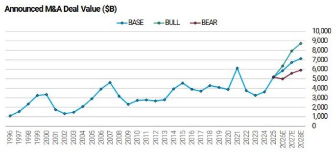

line

| Year | BASE  | BULL  | BEAR  |
|------|-------|-------|-------|
| 1996 | 1,000 | -     | -     |
| 1997 | 1,500 | -     | -     |
| 1998 | 2,000 | -     | -     |
| 1999 | 3,000 | -     | -     |
| 2000 | 3,500 | -     | -     |
| 2001 | 2,000 | -     | -     |
| 2002 | 1,500 | -     | -     |
| 2003 | 1,500 | -     | -     |
| 2004 | 2,000 | -     | -     |
| 2005 | 3,000 | -     | -     |
| 2006 | 4,500 | -     | -     |
| 2007 | 5,000 | -     | -     |
| 2008 | 3,500 | -     | -     |
| 2009 | 2,500 | -     | -     |
| 2010 | 3,000 | -     | -     |
| 2011 | 3,000 | -     | -     |
| 2012 | 3,000 | -     | -     |
| 2013 | 3,500 | -     | -     |
| 2014 | 4,500 | -     | -     |
| 2015 | 4,500 | -     | -     |
| 2016 | 4,500 | -     | -     |
| 2017 | 4,500 | -     | -     |
| 2018 | 4,500 | -     | -     |
| 2019 | 4,500 | -     | -     |
| 2020 | 4,500 | -     | -     |
| 2021 | 6,500 | -     | -     |
| 2022 | 3,500 | -     | -     |
| 2023 | 3,500 | -     | -     |
| 2024E| 5,500 | 5,500 | 5,500 |
| 2025E| 6,500 | 6,500 | 6,500 |
| 2026E| 7,500 | 7,500 | 7,500 |
| 2027E| 8,500 | 8,500 | 8,500 |
| 2028E| 9,500 | 9,500 | 9,500 |

Source: Dealogic, MS estimates.

Exhibit 73: ...and Price/Book Ratios Are Attractive Vs. History   
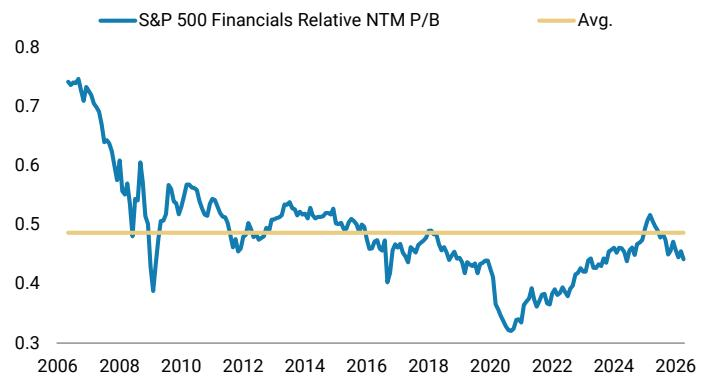

line

| Year | S&P 500 Financials Relative NTM P/B |
|------|--------------------------------------|
| 2006 | 0.75                                 |
| 2008 | 0.50                                 |
| 2010 | 0.55                                 |
| 2012 | 0.48                                 |
| 2014 | 0.52                                 |
| 2016 | 0.48                                 |
| 2018 | 0.49                                 |
| 2020 | 0.32                                 |
| 2022 | 0.40                                 |
| 2024 | 0.48                                 |
| 2026 | 0.45                                 |

Source: FactSet, MS.

Exhibit 74: On an Aggregate Basis, Our Banks Team Estimates Excess Capital Will Increase from an Aggregate 8% of Market Cap to 10%...   
Excess Binding Capital Above Regulatory Minimums 

<table><tr><td rowspan="2" colspan="2"></td><td colspan="6">Binding Constraint % of Market Cap</td></tr><tr><td>Market Cap</td><td>1Q26 Constraint</td><td>Post RWA Changes</td><td>GSIB</td><td>SCB</td><td>Include Full AOCI in Capital</td></tr><tr><td colspan="8">$B</td></tr><tr><td rowspan="7">Cat I</td><td>BAC</td><td>370.4</td><td>5%</td><td>4%</td><td>5%</td><td>5%</td><td>5%</td></tr><tr><td>BK</td><td>90.5</td><td>5%</td><td>6%</td><td>7%</td><td>7%</td><td>7%</td></tr><tr><td>C</td><td>215.4</td><td>6%</td><td>5%</td><td>8%</td><td>9%</td><td>9%</td></tr><tr><td>GS</td><td>266.5</td><td>3%</td><td>2%</td><td>5%</td><td>5%</td><td>5%</td></tr><tr><td>JPM</td><td>824.4</td><td>3%</td><td>3%</td><td>4%</td><td>4%</td><td>4%</td></tr><tr><td>STT</td><td>41.0</td><td>9%</td><td>9%</td><td>9%</td><td>9%</td><td>9%</td></tr><tr><td>WFC</td><td>242.3</td><td>8%</td><td>11%</td><td>12%</td><td>12%</td><td>12%</td></tr><tr><td>Cat II</td><td>NTRS</td><td>29.8</td><td>14%</td><td>14%</td><td>14%</td><td>14%</td><td>14%</td></tr><tr><td rowspan="5">Cat III</td><td>AXP</td><td>217.8</td><td>3%</td><td>3%</td><td>3%</td><td>3%</td><td>3%</td></tr><tr><td>COF</td><td>117.6</td><td>21%</td><td>25%</td><td>25%</td><td>25%</td><td>21%</td></tr><tr><td>PNC</td><td>88.0</td><td>14%</td><td>20%</td><td>20%</td><td>20%</td><td>12%</td></tr><tr><td>TFC</td><td>61.6</td><td>23%</td><td>30%</td><td>30%</td><td>30%</td><td>19%</td></tr><tr><td>USB</td><td>85.7</td><td>12%</td><td>15%</td><td>15%</td><td>15%</td><td>15%</td></tr><tr><td rowspan="8">Cat IV</td><td>ALLY</td><td>13.2</td><td>33%</td><td>42%</td><td>42%</td><td>42%</td><td>21%</td></tr><tr><td>CFG</td><td>27.0</td><td>8%</td><td>14%</td><td>14%</td><td>17%</td><td>10%</td></tr><tr><td>FITB</td><td>44.7</td><td>7%</td><td>13%</td><td>13%</td><td>14%</td><td>8%</td></tr><tr><td>HBAN</td><td>32.8</td><td>20%</td><td>24%</td><td>24%</td><td>24%</td><td>17%</td></tr><tr><td>KEY</td><td>23.2</td><td>24%</td><td>28%</td><td>28%</td><td>29%</td><td>20%</td></tr><tr><td>MTB</td><td>31.9</td><td>15%</td><td>19%</td><td>19%</td><td>19%</td><td>19%</td></tr><tr><td>RF</td><td>23.6</td><td>17%</td><td>22%</td><td>22%</td><td>22%</td><td>15%</td></tr><tr><td>SYF</td><td>25.0</td><td>22%</td><td>25%</td><td>25%</td><td>25%</td><td>25%</td></tr><tr><td rowspan="16">Smaller Banks</td><td>AUB</td><td>5.3</td><td>13%</td><td>16%</td><td>16%</td><td>16%</td><td>16%</td></tr><tr><td>BFH</td><td>3.4</td><td>28%</td><td>31%</td><td>31%</td><td>31%</td><td>31%</td></tr><tr><td>CBC</td><td>6.5</td><td>37%</td><td>38%</td><td>38%</td><td>38%</td><td>38%</td></tr><tr><td>CBSH</td><td>7.6</td><td>28%</td><td>31%</td><td>31%</td><td>31%</td><td>31%</td></tr><tr><td>CFR</td><td>8.7</td><td>20%</td><td>23%</td><td>23%</td><td>23%</td><td>23%</td></tr><tr><td>CUBI</td><td>2.6</td><td>28%</td><td>33%</td><td>33%</td><td>33%</td><td>33%</td></tr><tr><td>EWBC</td><td>16.9</td><td>21%</td><td>25%</td><td>25%</td><td>25%</td><td>25%</td></tr><tr><td>FLG</td><td>5.8</td><td>59%</td><td>63%</td><td>63%</td><td>63%</td><td>63%</td></tr><tr><td>MBIN</td><td>2.1</td><td>20%</td><td>26%</td><td>26%</td><td>26%</td><td>26%</td></tr><tr><td>OZK</td><td>5.4</td><td>32%</td><td>37%</td><td>37%</td><td>37%</td><td>37%</td></tr><tr><td>PB</td><td>6.9</td><td>24%</td><td>25%</td><td>25%</td><td>25%</td><td>25%</td></tr><tr><td>SFNC</td><td>3.1</td><td>21%</td><td>25%</td><td>25%</td><td>25%</td><td>25%</td></tr><tr><td>UMBFL</td><td>9.8</td><td>16%</td><td>20%</td><td>20%</td><td>20%</td><td>20%</td></tr><tr><td>VLY</td><td>7.5</td><td>21%</td><td>26%</td><td>26%</td><td>26%</td><td>26%</td></tr><tr><td>WBS</td><td>11.5</td><td>17%</td><td>21%</td><td>21%</td><td>21%</td><td>21%</td></tr><tr><td>ZION</td><td>9.1</td><td>24%</td><td>30%</td><td>30%</td><td>30%</td><td>30%</td></tr><tr><td colspan="2">Covered Cat I/II (Ex MS)</td><td>2,080</td><td>5%</td><td>5%</td><td>6%</td><td>6%</td><td>6%</td></tr><tr><td colspan="2">Covered Cat III/IV</td><td>792</td><td>13%</td><td>17%</td><td>17%</td><td>17%</td><td>13%</td></tr><tr><td colspan="2">Covered Other Banks</td><td>112</td><td>24%</td><td>28%</td><td>28%</td><td>28%</td><td>28%</td></tr><tr><td colspan="2">Aggregate Total</td><td>2,985</td><td>8%</td><td>9%</td><td>10%</td><td>10%</td><td>9%</td></tr></table>

Note: Pricing as of 5/5/2026. Source: Company data, FactSet, MS estimates

Exhibit 75: ...And They Model \~\$140/160B of Buybacks in Aggregate Across Their Large Cap Bank Coverage in Both 2027/28, Which Is Also Significantly Above Consensus Estimates   
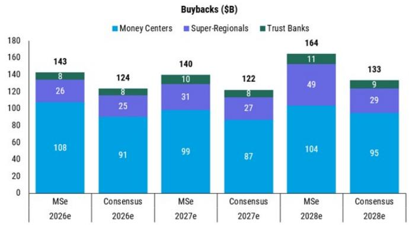

bar_stacked

Buybacks ($B)
| Period | Money Centers ($B) | Super-Regionals ($B) | Trust Banks ($B) |
| :--- | :--- | :--- | :--- |
| MSe 2026e | 108 | 26 | 8 |
| Consensus 2026e | 91 | 25 | 8 |
| MSe 2027e | 99 | 31 | 10 |
| Consensus 2027e | 87 | 27 | 8 |
| MSe 2028e | 104 | 49 | 11 |
| Consensus 2028e | 95 | 29 | 9 |
| Total | 143 | | |
MSe 2026e + Consensus 2026e = 124
MSe 2027e + Consensus 2027e = 122
MSe 2028e + Consensus 2028e = 164

Source: Company data, Visible Alpha, MS.

# Consumer Discretionary Goods Over Consumer Staples

The consumer backdrop in the US remains resilient despite higher gasoline prices given the large share of consumption driven by higher income households (top 20% of earners make up 40% of consumption) as well as the \~\$65B real personal income tailwind hitting this year from the OBBBA. As the exhibits below show, household liabilities as a share of household assets continue to fall, and households' corporate equity and real estate holdings continue to grow. Further, despite falling job openings, the labor market remains on solid footing and there are signs that wage growth at the low end is stabilizing. Clearly higher gas prices are having an adverse impact on lower income consumption trends; however, given the higher income wallet share, aggregate consumer earnings expectations are actually up 3% since the Iran war started (Exhibit 80).

Interestingly, we find that Consumer Staples is more sensitive to changes in energy prices than Consumer Discretionary (Exhibit 81); this is a result of lower income households having a larger share of staples spend vs. discretionary categories. Our relative preference for Discretionary over Staples also fits with our bullish view on the earnings cycle/business cycle, and the fact that Discretionary earnings revisions breadth is re-accelerating (Exhibit 83).

Why a preference for Discretionary Goods, in particular? For one, we're seeing signs of wallet share reversion from services to goods after multiple years of dominance the other way. In addition, consumer goods pricing is improving off of low levels, while pricing for services is decelerating. For consumer goods, this likely started as a response to tariffs, but we would argue many pockets within Discretionary needed a push to raise pricing after seeing persistent discounting for much of the past several years. Lastly, from a technical standpoint, Discretionary Goods relative performance looks to be stabilizing around 20-year+ support levels (Exhibit 85).

Exhibit 76: Household Liabilities As A Share of Household Assets Continue to Fall   
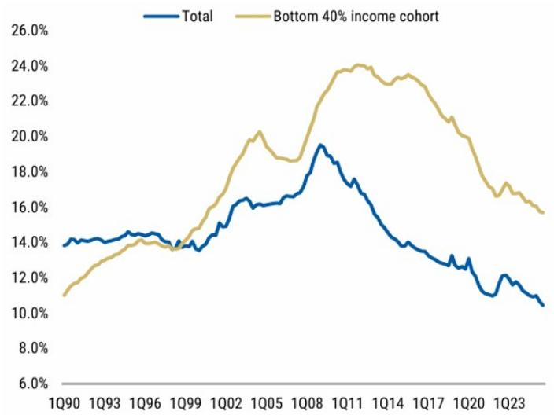

line

| Quarter | Total  | Bottom 40% income cohort |
|---------|--------|--------------------------|
| 1Q90    | 14.0%  | 11.0%                    |
| 1Q93    | 14.5%  | 13.0%                    |
| 1Q96    | 14.2%  | 13.5%                    |
| 1Q99    | 13.8%  | 14.0%                    |
| 1Q02    | 15.5%  | 17.0%                    |
| 1Q05    | 16.5%  | 20.0%                    |
| 1Q08    | 19.5%  | 23.5%                    |
| 1Q11    | 17.5%  | 24.0%                    |
| 1Q14    | 15.0%  | 23.5%                    |
| 1Q17    | 13.5%  | 22.0%                    |
| 1Q20    | 12.5%  | 19.0%                    |
| 1Q23    | 10.5%  | 16.0%                    |

Source: BEA, Federal Reserve Board, Haver Analytics, MS.

Exhibit 77: Households' Corporate Equity and Real Estate Holdings Continue to Grow   
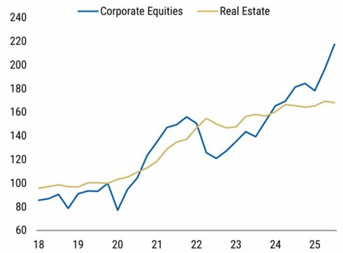

line

| Year | Corporate Equities | Real Estate |
|------|---------------------|-------------|
| 18   | 85                  | 95          |
| 19   | 90                  | 98          |
| 20   | 78                  | 100         |
| 21   | 145                 | 130         |
| 22   | 155                 | 150         |
| 23   | 140                 | 155         |
| 24   | 170                 | 165         |
| 25   | 220                 | 170         |

Source: Federal Reserve, Cooper and Dynan (Journal of Economic Surveys, 2016), MS.

Exhibit 78: Excess Savings Remains Elevated   
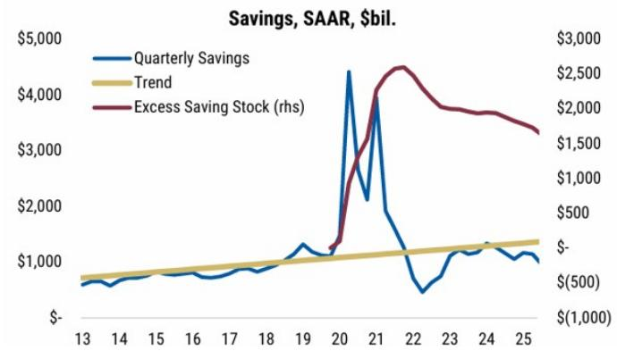

line

| Year | Quarterly Savings ($) | Trend ($) | Excess Saving Stock (rhs) ($) |
|------|------------------------|-----------|-------------------------------|
| 13   | ~$800                  | ~$500     | -                             |
| 14   | ~$700                  | ~$550     | -                             |
| 15   | ~$750                  | ~$600     | -                             |
| 16   | ~$800                  | ~$650     | -                             |
| 17   | ~$850                  | ~$700     | -                             |
| 18   | ~$900                  | ~$750     | -                             |
| 19   | ~$1,000                | ~$800     | -                             |
| 20   | ~$4,500                | ~$850     | ~$1,500                       |
| 21   | ~$2,500                | ~$900     | ~$2,500                       |
| 22   | ~$500                  | ~$950     | ~$2,500                       |
| 23   | ~$1,000                | ~$1,000   | ~$2,000                       |
| 24   | ~$1,200                | ~$1,050   | ~$1,800                       |
| 25   | ~$1,100                | ~$1,100   | ~$1,600                       |

Source: Bureau of Economic Analysis, Federal Reserve, MS.

Exhibit 79: Higher Income Consumer Drives Large Share of Personal Consumption...   
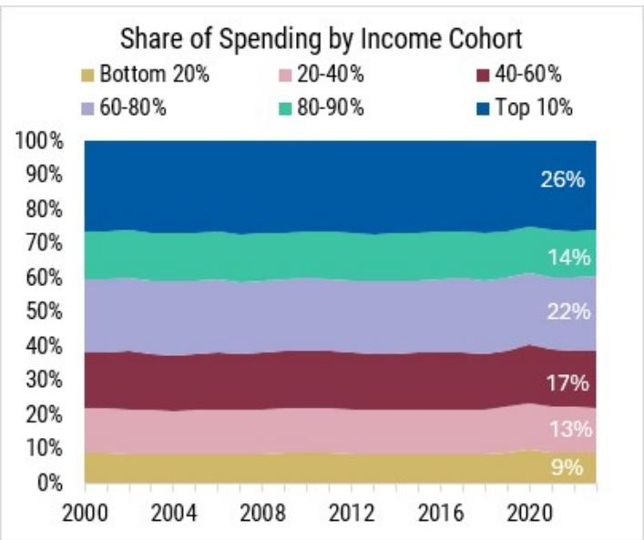

area_stacked

| Year | Bottom 20% | 20-40% | 40-60% | 60-80% | 80-90% | Top 10% |
|------|------------|--------|--------|--------|--------|---------|
| 2000 | 9%         | 13%    | 17%    | 22%    | 14%    | 26%     |
| 2020 | 9%         | 13%    | 17%    | 22%    | 14%    | 26%     |

Source: BEA, BLS, MS Economics Research.

Exhibit 80: ...Which Is One Reason Why Consumer Earnings Have Held Up Despite the War   
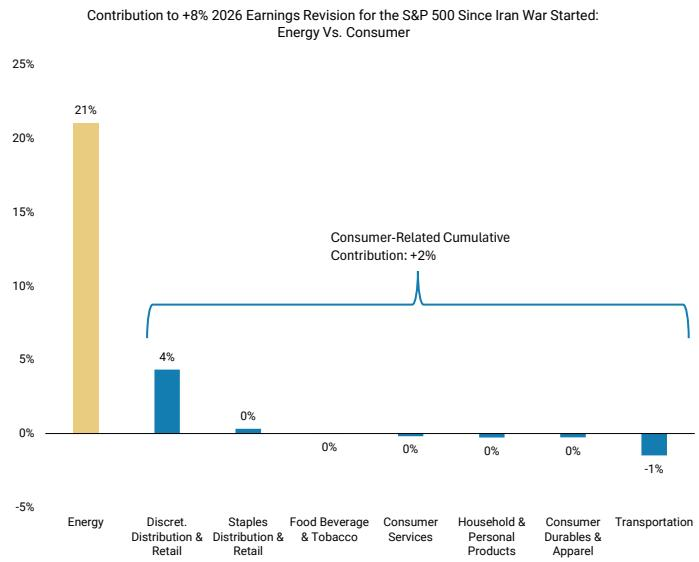

bar

| Category                     | Contribution |
| ---------------------------- | ------------ |
| Energy                       | 21%          |
| Discret. Distribution & Retail | 4%           |
| Staples Distribution & Retail | 0%           |
| Food Beverage & Tobacco      | 0%           |
| Consumer Services            | 0%           |
| Household & Personal Products | 0%           |
| Consumer Durables & Apparel   | 0%           |
| Transportation               | -1%          |

Source: FactSet, MS.

Exhibit 81: Staples Is Actually More Sensitive to Higher Gas Prices than Discretionary 

<table><tr><td colspan="2">Correlation: Relative Sector Returns Vs. Change in Crude</td></tr><tr><td>Energy</td><td>0.58</td></tr><tr><td>Information Technology</td><td>0.19</td></tr><tr><td>Materials</td><td>0.19</td></tr><tr><td>Communication Services</td><td>0.03</td></tr><tr><td>Real Estate</td><td>-0.09</td></tr><tr><td>Industrials</td><td>-0.11</td></tr><tr><td>Consumer Discretionary</td><td>-0.14</td></tr><tr><td>Health Care</td><td>-0.17</td></tr><tr><td>Financials</td><td>-0.31</td></tr><tr><td>Utilities</td><td>-0.32</td></tr><tr><td>Consumer Staples</td><td>-0.36</td></tr></table>

Source: Compustat, MS.

Exhibit 82: Consumer Goods Pricing Is Improving While Consumer Services Pricing Is Decelerating   
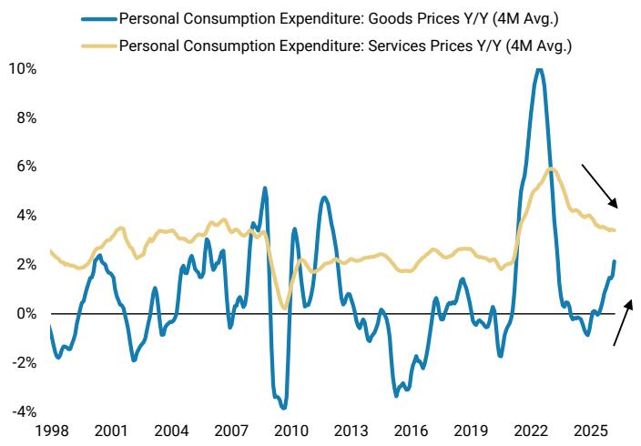

line

| Year | Personal Consumption Expenditure: Goods Prices Y/Y (4M Avg.) | Personal Consumption Expenditure: Services Prices Y/Y (4M Avg.) |
|------|---------------------------------------------------------------|------------------------------------------------------------------|
| 1998 | -2%                                                           | 2%                                                               |
| 2001 | 2%                                                            | 3%                                                               |
| 2004 | -1%                                                           | 3%                                                               |
| 2007 | 3%                                                            | 3%                                                               |
| 2010 | -4%                                                           | 1%                                                               |
| 2013 | 4%                                                            | 2%                                                               |
| 2016 | -3%                                                           | 2%                                                               |
| 2019 | 1%                                                            | 2%                                                               |
| 2022 | 10%                                                           | 6%                                                               |
| 2025 | 2%                                                            | 3%                                                               |

Source: Haver Analytics, MS.

Exhibit 84: Average Months of Household Savings at Highest Level Over Past Few Years Based on Our Consumer Survey   
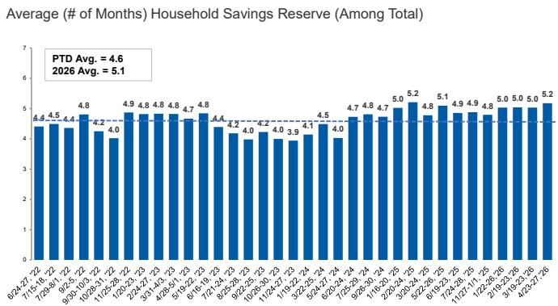

bar

| Date       | Average (Months) |
| ---------- | ---------------- |
| 6/24-27-22 | 4.4              |
| 7/15-18-22 | 4.5              |
| 7/26-34-22 | 4.4              |
| 9/30-10-22 | 4.8              |
| 10/31-22   | 4.2              |
| 11/25-28-22 | 4.0              |
| 1/26-29-22 | 4.9              |
| 2/24-31-23 | 4.8              |
| 3/31-34-23 | 4.8              |
| 4/28-37-23 | 4.8              |
| 5/19-39-23 | 4.7              |
| 6/16-41-23 | 4.8              |
| 7/21-44-23 | 4.4              |
| 8/25-46-23 | 4.3              |
| 9/22-48-23 | 4.0              |
| 10/26-50-23 | 4.2              |
| 11/24-53-23 | 4.0              |
| 11/19-55-23 | 3.9              |
| 1/26-57-23 | 4.1              |
| 2/24-59-23 | 4.5              |
| 3/22-61-23 | 4.0              |
| 4/20-63-23 | 4.7              |
| 5/19-65-23 | 4.8              |
| 6/16-67-23 | 4.7              |
| 7/15-70-23 | 5.0              |
| 8/13-73-23 | 5.2              |
| 9/10-75-23 | 4.8              |
| 10/9-77-23 | 5.1              |
| 11/8-80-23 | 4.9              |
| 1/7-83-83-23 | 4.9              |
| 2/6-85-85-23 | 4.8              |
| 3/15-87-85 | 5.0              |
| 4/13-89-85 | 5.0              |
| 5/10-91-85 | 5.0              |
| 6/18-93-85 | 5.0              |
| 7/16-95-85 | 5.0              |
| 8/14-97-85 | 5.0              |
| 9/11-99-85 | 5.0              |
| 10/9-101-85 | 5.0              |
| 11/8-103-85 | 5.0              |
| 1/7-105-105 | 5.0             |
| 2/6-107-105 | 5.0             |
| 3/15-109-105 | 5.0             |
| 4/13-110-105 | 5.0             |
| 5/10-112-105 | 5.0             |
| 6/9-114-105 | 5.0             |
| 7/7-116-105 | 5.0             |
| 8/6-118-105 | 5.0             |
| 9/5-120-105 | 5.0             |
| 10/3-122-105 | 5.0             |
| 11/26-123-105 | 5.0            |
| 1/9-125-123 | 5.0             |
| 2/7-127-123 | 5.0             |
| 3/16-129-123 | 5.0            |
| 4/14-131-123 | 5.0            |
| 5/9-133-123 | 5.0             |
| 6/7-135-123 | 5.0             |
| 7/6-137-123 | 5.0             |
| 8/5-139-123 | 5.0             |
| 9/4-141-123 | 5.0             |
| 10/3-143-123 | 5.0             |
| 11/26-143 | 5.0             |
| 1/9-145-143 | 5.0             |
| 2/7-147-143 | 5.0             |
| 3/8-149-143 | 5.0             |
| 4/7-151-143 | 5.0             |
| 5/6-153-143 | 5.0             |
| 6/4-155-143 | 5.0             |
| 7/3-157-143 | 5.0             |
| 8/2-159-143 | 5.0             |
| 9/1-161-143 | 5.0             |
| 10/9-163-143 | 5.0             |
| 11/8-165-143 | 5.0             |
| 1/7-167-143 | 5.0             |
| ...        | ...              |
| ...        | ...              |
| ...        | ...              |
| ...        | ...              |
| ...        | ...              |
| ...        | ...              |
| ...        | ...              |
| ...        | ...              |
| ...        | ...              |
| ...        | ...              |
| ...        | ...              |
| ...        | ...              |
| ...        | ...              |
| ...        | ...              |
| ...        | ...              |
|
| ...        | ...              |
| ...        | ...              |
| ...        | ...              |
| ...        | ...              |
| ...        | ...              |
|
| ...        | ...              |
|
| ...        | ...              |
|
| ...        | ...              |
|
| ...        | ...              |
|
| ...        | ...              |
|
| ...        | ...              |
|
| ...        | ...              |
|
| ...        | ...              |
|
| ...        | ...              |
|
| ...        | ...              |
|
| ...        | ...              |
|
| ...        | ...              |
|
| ...        (PTD Avg.) | -            |
| Average (PTD Avg.) | -            |
| Average (PTD Avg.) | -            |
| Average (PTD Avg.) | -            |
| Average (PTD Avg.) | -            |
| Average (PTD Avg.) | -            |
| Average (PTD Avg.) | -            |
| Average (PTD Avg.) | -            |
| Average (PTD Avg.) | -            |
| Average (PTD Avg.) | -            |
| Average (PTD avg.) | -            |
| Average (PTD avg.) | -            |
| Average (PTD avg.) | -            |
| Average (PTD avg.) | -            |
| Average (PTD avg.) | -            |
| Average (PTD avg.) | -            |
| Average (PTD avg.) | -            |
| Average (PTD avg.) | -            |
| Average (PTD avg.) | -            |
| Average (PTD avg) | -            |
| Average (PTD avg) | -            |
| Average (PTD avg) | -            |
| Average (PTD avg) | -            |
| Average (PTD avg) | -            |
| Average (PTD avg) | -            |
| Average (PTD avg) | -            |
| Average (PTD avg) | -            |
| Average (PTD avg) | -            |
| Average (PTD avg) >* * * * * * * * * * * * * * * * * * * * * * * * * * * * * * * * * * * * * * * * * * * * * * * * * * * * * * * * * * * * * * * * * * * * * * * * * * * * * * * * * * * * * * * * * * * * * * * * * * * * *<nl>

Source: Alphawise, MS.

Exhibit 83: Discretionary Earnings Revisions Breadth Inflecting   
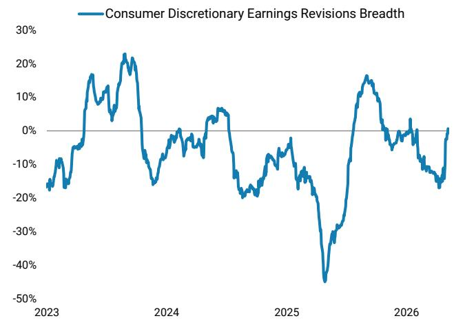

line

| Year | Consumer Discretionary Earnings Revisions Breadth |
| ---- | -------------------------------------------------- |
| 2023 | -15%                                               |
| 2024 | 20%                                                |
| 2025 | -45%                                               |
| 2026 | 0%                                                 |

Source: FactSet, MS.

Exhibit 85: S&P Retail Select Index Has Durable Support at Current Relative Performance Levels   
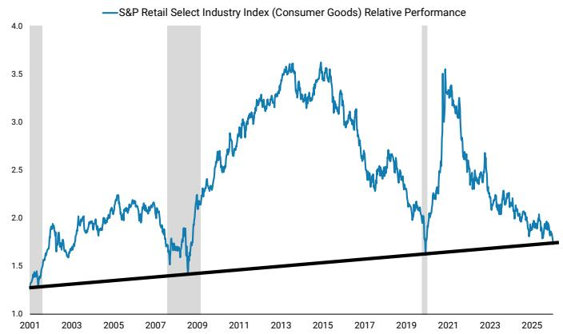

line

| Year | S&P Retail Select Industry Index (Consumer Goods) Relative Performance |
|------|------------------------------------------------------------------------|
| 2001 | 1.3                                                                    |
| 2003 | 1.8                                                                    |
| 2005 | 2.1                                                                    |
| 2007 | 1.9                                                                    |
| 2009 | 1.4                                                                    |
| 2011 | 2.8                                                                    |
| 2013 | 3.6                                                                    |
| 2015 | 3.5                                                                    |
| 2017 | 2.5                                                                    |
| 2019 | 1.7                                                                    |
| 2021 | 3.5                                                                    |
| 2023 | 2.0                                                                    |
| 2025 | 1.8                                                                    |

Source: Bloomberg, MS.

# Stock Screens

# Cyclicals + High Earnings Revisions + MS Overweight

We used the following screening criteria:

• Stock is a member of top 1000 US stocks by market cap universe.   
• Stock is classified as cyclical based on our proprietary classification model.   
• Stock is in top tercile of 1M NTM EPS revision.   
• Overweight by MS Analyst

Exhibit 86: Cyclicals + High Earnings Revisions + MS Overweight 

<table><tr><td>Ticker</td><td>Company Name</td><td>Sector</td><td>Industry Group</td><td>Market Cap ($MM)</td><td>Price</td></tr><tr><td>LYV</td><td>LIVE NATION ENTMT IN</td><td>Communication Services</td><td>Media &amp; Entertainment</td><td>37,932</td><td>163.00</td></tr><tr><td>NFLX</td><td>NETFLIX INC</td><td>Communication Services</td><td>Media &amp; Entertainment</td><td>359,813</td><td>85.45</td></tr><tr><td>RDDT</td><td>REDDIT INC-CL A</td><td>Communication Services</td><td>Media &amp; Entertainment</td><td>22,645</td><td>159.51</td></tr><tr><td>RBLX</td><td>ROBLOX CORP -CLASS A</td><td>Communication Services</td><td>Media &amp; Entertainment</td><td>27,744</td><td>41.31</td></tr><tr><td>ROKU</td><td>ROKU INC</td><td>Communication Services</td><td>Media &amp; Entertainment</td><td>16,781</td><td>128.07</td></tr><tr><td>CVNA</td><td>CARVANA CO</td><td>Consumer Discretionary</td><td>Consumer Discretionary Distribution &amp; Retail</td><td>54,603</td><td>76.23</td></tr><tr><td>DKNG</td><td>DRAFTKINGS INC</td><td>Consumer Discretionary</td><td>Consumer Services</td><td>12,151</td><td>24.51</td></tr><tr><td>BROS</td><td>DUTCH BROS INC-CLASS</td><td>Consumer Discretionary</td><td>Consumer Services</td><td>6,508</td><td>51.13</td></tr><tr><td>SBUX</td><td>STARBUCKS CORP</td><td>Consumer Discretionary</td><td>Consumer Services</td><td>120,512</td><td>105.74</td></tr><tr><td>PFGC</td><td>PERFORMANCE FOOD GRO</td><td>Consumer Staples</td><td>Consumer Staples Distribution &amp; Retail</td><td>14,777</td><td>94.07</td></tr><tr><td>BG</td><td>BUNGE GLOBAL SA</td><td>Consumer Staples</td><td>Food, Beverage &amp; Tobacco</td><td>24,473</td><td>126.14</td></tr><tr><td>COP</td><td>CONOCOPHILLIPS</td><td>Energy</td><td>Energy</td><td>140,774</td><td>115.55</td></tr><tr><td>DVN</td><td>DEVON ENERGY</td><td>Energy</td><td>Energy</td><td>53,877</td><td>46.73</td></tr><tr><td>FANG</td><td>DIAMONDBACK ENERGY I</td><td>Energy</td><td>Energy</td><td>55,180</td><td>196.15</td></tr><tr><td>XOM</td><td>EXXON MOBIL CORP</td><td>Energy</td><td>Energy</td><td>620,416</td><td>149.68</td></tr><tr><td>PR</td><td>PERMIAN RESOURCES CO</td><td>Energy</td><td>Energy</td><td>16,974</td><td>20.15</td></tr><tr><td>BAC</td><td>BofA</td><td>Financials</td><td>Banks</td><td>358,733</td><td>50.55</td></tr><tr><td>C</td><td>Citi INC</td><td>Financials</td><td>Banks</td><td>215,821</td><td>125.85</td></tr><tr><td>CFG</td><td>CitiZENS FINANL</td><td>Financials</td><td>Banks</td><td>26,286</td><td>62.16</td></tr><tr><td>UMBFL</td><td>UMB FINANCIAL CORP</td><td>Financials</td><td>Banks</td><td>9,902</td><td>130.32</td></tr><tr><td>ALLY</td><td>ALLY FINANCIAL INC</td><td>Financials</td><td>Financial Services</td><td>13,101</td><td>42.74</td></tr><tr><td>SCHW</td><td>CHARLES SCHWAB</td><td>Financials</td><td>Financial Services</td><td>152,748</td><td>87.83</td></tr><tr><td>CPAY</td><td>CORPAY INC</td><td>Financials</td><td>Financial Services</td><td>22,326</td><td>341.58</td></tr><tr><td>MA</td><td>MASTERCARD INCORPORAL</td><td>Financials</td><td>Financial Services</td><td>436,597</td><td>497.81</td></tr><tr><td>V</td><td>VISA INC-CLASS A SHA</td><td>Financials</td><td>Financial Services</td><td>537,514</td><td>323.86</td></tr><tr><td>HALO</td><td>HALOZYME THERAPEUTIC</td><td>Health Care</td><td>Pharmaceuticals, Biotechnology &amp; Life Sciences</td><td>7,868</td><td>66.41</td></tr><tr><td>BE</td><td>BLOOM ENERGY CORP-A</td><td>Industrials</td><td>Capital Goods</td><td>80,759</td><td>283.92</td></tr><tr><td>CNH</td><td>CNH INDUSTRIAL NV</td><td>Industrials</td><td>Capital Goods</td><td>13,602</td><td>10.97</td></tr><tr><td>CMI</td><td>CUMMINS INC</td><td>Industrials</td><td>Capital Goods</td><td>96,959</td><td>702.66</td></tr><tr><td>RKLB</td><td>ROCKET LAB CORP</td><td>Industrials</td><td>Capital Goods</td><td>67,916</td><td>117.35</td></tr><tr><td>TKR</td><td>TIMKEN CO</td><td>Industrials</td><td>Capital Goods</td><td>8,158</td><td>117.39</td></tr><tr><td>VRT</td><td>VERTIV HOLDINGS LLC</td><td>Industrials</td><td>Capital Goods</td><td>141,321</td><td>367.92</td></tr><tr><td>KNX</td><td>KNIGHT-SWIFT TRANSPO</td><td>Industrials</td><td>Transportation</td><td>10,062</td><td>61.92</td></tr><tr><td>ODFL</td><td>OLD DOMINION</td><td>Industrials</td><td>Transportation</td><td>40,579</td><td>195.12</td></tr><tr><td>R</td><td>RYDER SYSTEM INC</td><td>Industrials</td><td>Transportation</td><td>8,995</td><td>232.47</td></tr><tr><td>UBER</td><td>UBER TECHNOLOGIES IN</td><td>Industrials</td><td>Transportation</td><td>155,011</td><td>76.15</td></tr><tr><td>ALGM</td><td>ALLEGRO MICROSYSTEMS</td><td>Information Technology</td><td>Semiconductors &amp; Semiconductor Equipment</td><td>8,966</td><td>48.39</td></tr><tr><td>AMAT</td><td>APPLIED MATERIALS</td><td>Information Technology</td><td>Semiconductors &amp; Semiconductor Equipment</td><td>352,061</td><td>443.62</td></tr><tr><td>ALAB</td><td>ASTERA LABS INC</td><td>Information Technology</td><td>Semiconductors &amp; Semiconductor Equipment</td><td>35,541</td><td>207.35</td></tr><tr><td>AVGO</td><td>BROADCOM INC</td><td>Information Technology</td><td>Semiconductors &amp; Semiconductor Equipment</td><td>2,028,474</td><td>428.43</td></tr><tr><td>KLAC</td><td>KLA CORP</td><td>Information Technology</td><td>Semiconductors &amp; Semiconductor Equipment</td><td>241,033</td><td>1845.19</td></tr><tr><td>MU</td><td>MICRON TECHNOLOGY IN</td><td>Information Technology</td><td>Semiconductors &amp; Semiconductor Equipment</td><td>896,921</td><td>795.33</td></tr><tr><td>MKSI</td><td>MKSI INC</td><td>Information Technology</td><td>Semiconductors &amp; Semiconductor Equipment</td><td>21,595</td><td>319.71</td></tr><tr><td>NVDA</td><td>NVIDIA CORP</td><td>Information Technology</td><td>Semiconductors &amp; Semiconductor Equipment</td><td>5,332,392</td><td>219.44</td></tr><tr><td>DOCN</td><td>DIGITALOCEAN HOLDING</td><td>Information Technology</td><td>Software &amp; Services</td><td>16,982</td><td>162.72</td></tr><tr><td>SNDK</td><td>SANDISK CORP</td><td>Information Technology</td><td>Technology Hardware &amp; Equipment</td><td>229,178</td><td>1547.56</td></tr><tr><td>STX</td><td>SEAGATE TECHNOLOGY H</td><td>Information Technology</td><td>Technology Hardware &amp; Equipment</td><td>187,009</td><td>834.01</td></tr><tr><td>WDC</td><td>WESTERN DIGITAL</td><td>Information Technology</td><td>Technology Hardware &amp; Equipment</td><td>177,797</td><td>515.83</td></tr><tr><td>AA</td><td>ALCOA CORP</td><td>Materials</td><td>Materials</td><td>17,243</td><td>65.34</td></tr><tr><td>LYB</td><td>LYONDELLBASELL INDUS</td><td>Materials</td><td>Materials</td><td>23,734</td><td>73.53</td></tr><tr><td>CBRE</td><td>CBRE GROUP INC -A</td><td>Real Estate</td><td>Real Estate Management &amp; Development</td><td>42,783</td><td>146.11</td></tr></table>

Source: Compustat, Factset, MS

# Small Caps: High Earnings Revisions Breadth + High Earnings Revisions + MS Overweight / Equal Weight

We used the following screening criteria:

• Stock is a member of bottom 500 US stocks by market cap universe.   
• Stock is above median in terms of up/down earnings revisions breadth.   
• Stock is above median in terms of NTM EPS revision.   
• Overweight or Equal Weight by MS Analyst.

Exhibit 87: Small Caps: High Earnings Revisions Breadth + High Earnings Revisions + MS Overweight / Equal Weight 

<table><tr><td>Ticker</td><td>Company Name</td><td>Sector</td><td>Industry Group</td><td>Market Cap ($MM)</td><td>Price</td></tr><tr><td>BATRK</td><td>ATLANTA BRAVES HOLDI</td><td>Communication Services</td><td>Media &amp; Entertainment</td><td>2,654</td><td>50.22</td></tr><tr><td>SPHR</td><td>SPHERE ENTERTAINMENT</td><td>Communication Services</td><td>Media &amp; Entertainment</td><td>3,671</td><td>126.91</td></tr><tr><td>AAP</td><td>ADVANCE AUTO PARTS I</td><td>Consumer Discretionary</td><td>Consumer Discretionary Distribution &amp; Retail</td><td>3,127</td><td>51.83</td></tr><tr><td>VVV</td><td>VALVOLINE INC</td><td>Consumer Discretionary</td><td>Consumer Discretionary Distribution &amp; Retail</td><td>4,400</td><td>34.50</td></tr><tr><td>BC</td><td>BRUNSWICK CORP</td><td>Consumer Discretionary</td><td>Consumer Durables &amp; Apparel</td><td>5,167</td><td>79.53</td></tr><tr><td>PII</td><td>POLARIS INC</td><td>Consumer Discretionary</td><td>Consumer Durables &amp; Apparel</td><td>3,770</td><td>66.28</td></tr><tr><td>HGV</td><td>HILTON GRAND VACATIO</td><td>Consumer Discretionary</td><td>Consumer Services</td><td>3,672</td><td>46.04</td></tr><tr><td>LAUR</td><td>LAUREATE EDUCATION I</td><td>Consumer Discretionary</td><td>Consumer Services</td><td>4,577</td><td>32.70</td></tr><tr><td>SHAK</td><td>SHAKE SHACK IN-A</td><td>Consumer Discretionary</td><td>Consumer Services</td><td>2,597</td><td>64.50</td></tr><tr><td>TNL</td><td>TRAVEL + LEISURE CO</td><td>Consumer Discretionary</td><td>Consumer Services</td><td>3,971</td><td>63.61</td></tr><tr><td>MTN</td><td>VAIL RESORTS</td><td>Consumer Discretionary</td><td>Consumer Services</td><td>4,408</td><td>123.70</td></tr><tr><td>DK</td><td>DELEK US HOLDINGS IN</td><td>Energy</td><td>Energy</td><td>2,869</td><td>46.82</td></tr><tr><td>LBRT</td><td>LIBERTY ENERGY INC</td><td>Energy</td><td>Energy</td><td>5,449</td><td>33.39</td></tr><tr><td>BFH</td><td>BREAD FINANCIAL HOLD</td><td>Financials</td><td>Financial Services</td><td>3,432</td><td>84.93</td></tr><tr><td>HASI</td><td>HA SUSTAINABLE INFRA</td><td>Financials</td><td>Financial Services</td><td>5,237</td><td>40.98</td></tr><tr><td>MIAX</td><td>MIAMI INTERNATIONAL</td><td>Financials</td><td>Financial Services</td><td>4,953</td><td>52.19</td></tr><tr><td>SLM</td><td>SLM CORP</td><td>Financials</td><td>Financial Services</td><td>4,104</td><td>21.76</td></tr><tr><td>UPST</td><td>UPSTART HOLDINGS INC</td><td>Financials</td><td>Financial Services</td><td>2,746</td><td>28.69</td></tr><tr><td>WEX</td><td>WEX Inc</td><td>Financials</td><td>Financial Services</td><td>4,871</td><td>140.50</td></tr><tr><td>LMND</td><td>LEMONADE INC</td><td>Financials</td><td>Insurance</td><td>4,229</td><td>55.05</td></tr><tr><td>LFST</td><td>LIFESTANCE HEALTH GR</td><td>Health Care</td><td>Health Care Equipment &amp; Services</td><td>2,975</td><td>7.67</td></tr><tr><td>ALMS</td><td>ALUMIS INC</td><td>Health Care</td><td>Pharmaceuticals, Biotechnology &amp; Life Sciences</td><td>2,913</td><td>23.66</td></tr><tr><td>APLS</td><td>APELLIS PHARMACEUTIC</td><td>Health Care</td><td>Pharmaceuticals, Biotechnology &amp; Life Sciences</td><td>5,251</td><td>41.02</td></tr><tr><td>RCUS</td><td>ARCUS BIOSCIENCES IN</td><td>Health Care</td><td>Pharmaceuticals, Biotechnology &amp; Life Sciences</td><td>3,127</td><td>24.86</td></tr><tr><td>DNLI</td><td>DENALI THERAPEUTICS</td><td>Health Care</td><td>Pharmaceuticals, Biotechnology &amp; Life Sciences</td><td>3,122</td><td>19.67</td></tr><tr><td>ALH</td><td>ALLIANCE LAUNDRY HOL</td><td>Industrials</td><td>Capital Goods</td><td>5,028</td><td>25.40</td></tr><tr><td>KMT</td><td>KENNAMETAL INC</td><td>Industrials</td><td>Capital Goods</td><td>2,825</td><td>37.07</td></tr><tr><td>LSTR</td><td>LANDSTAR SYS</td><td>Industrials</td><td>Transportation</td><td>6,070</td><td>178.92</td></tr><tr><td>BOX</td><td>BOX INC CLASS -A</td><td>Information Technology</td><td>Software &amp; Services</td><td>3,392</td><td>24.50</td></tr><tr><td>GTLB</td><td>GITLAB INC-CL A</td><td>Information Technology</td><td>Software &amp; Services</td><td>3,933</td><td>25.64</td></tr><tr><td>QTWO</td><td>Q2 HOLDINGS INC</td><td>Information Technology</td><td>Software &amp; Services</td><td>2,961</td><td>47.30</td></tr><tr><td>S</td><td>SENTINELONE INC -CLA</td><td>Information Technology</td><td>Software &amp; Services</td><td>5,454</td><td>16.33</td></tr><tr><td>CC</td><td>CHEMOURS COMPANY</td><td>Materials</td><td>Materials</td><td>3,799</td><td>25.26</td></tr><tr><td>PRM</td><td>PERIMETER SOLUTIONS</td><td>Materials</td><td>Materials</td><td>5,246</td><td>32.16</td></tr><tr><td>PECO</td><td>PHILLIPS EDISON &amp; CO</td><td>Real Estate</td><td>Equity Real Estate Investment Trusts (REITs)</td><td>5,003</td><td>39.71</td></tr><tr><td>UE</td><td>Urban Edge Prop</td><td>Real Estate</td><td>Equity Real Estate Investment Trusts (REITs)</td><td>2,743</td><td>21.77</td></tr><tr><td>VNO</td><td>VORNADO REALTY</td><td>Real Estate</td><td>Equity Real Estate Investment Trusts (REITs)</td><td>5,839</td><td>31.04</td></tr><tr><td>CWK</td><td>CUSHMAN &amp; WAKEFIELD</td><td>Real Estate</td><td>Real Estate Management &amp; Development</td><td>3,224</td><td>13.76</td></tr><tr><td>OPEN</td><td>OPENDOOR TECHNOLOGIE</td><td>Real Estate</td><td>Real Estate Management &amp; Development</td><td>4,679</td><td>4.85</td></tr><tr><td>OGS</td><td>ONE GAS INC</td><td>Utilities</td><td>Utilities</td><td>5,332</td><td>84.96</td></tr></table>

Source: Compustat, Factset, MS

# Large Caps: High Earnings Revisions Breadth + High Earnings Revisions + MS Overweight

We used the following screening criteria:

• Stock is a member of top 1000 US stocks by market cap universe.   
- Top tercile of up/down earnings revisions breadth.   
- Top tercile of 1M NTM EPS revision.   
• Overweight by MS Analyst.

Exhibit 88: Large Cap Stocks: High Earnings Revisions Breadth + High Earnings Revisions + MS Overweight 

<table><tr><td>Ticker</td><td>Company Name</td><td>Sector</td><td>Industry Group</td><td>Market Cap ($MM)</td><td>Price</td></tr><tr><td>NFLX</td><td>NETFLIX INC</td><td>Communication Services</td><td>Media &amp; Entertainment</td><td>359,813</td><td>85.45</td></tr><tr><td>RBLX</td><td>ROBLOX CORP -CLASS A</td><td>Communication Services</td><td>Media &amp; Entertainment</td><td>27,744</td><td>41.31</td></tr><tr><td>ROKU</td><td>ROKU INC</td><td>Communication Services</td><td>Media &amp; Entertainment</td><td>16,781</td><td>128.07</td></tr><tr><td>CVNA</td><td>CARVANA CO</td><td>Consumer Discretionary</td><td>Consumer Discretionary Distribution &amp; Retail</td><td>54,603</td><td>76.23</td></tr><tr><td>CHWY</td><td>CHEWY INC -CLASS A</td><td>Consumer Discretionary</td><td>Consumer Discretionary Distribution &amp; Retail</td><td>5,402</td><td>22.49</td></tr><tr><td>BKNG</td><td>BOOKING HOLDINGS INC</td><td>Consumer Discretionary</td><td>Consumer Services</td><td>122,276</td><td>157.80</td></tr><tr><td>SBUX</td><td>STARBUCKS CORP</td><td>Consumer Discretionary</td><td>Consumer Services</td><td>120,512</td><td>105.74</td></tr><tr><td>TXRH</td><td>TEXAS ROADHOUSE</td><td>Consumer Discretionary</td><td>Consumer Services</td><td>12,064</td><td>183.54</td></tr><tr><td>COST</td><td>COSTCO WHOLESALE</td><td>Consumer Staples</td><td>Consumer Staples Distribution &amp; Retail</td><td>443,417</td><td>999.47</td></tr><tr><td>BG</td><td>BUNGE GLOBAL SA</td><td>Consumer Staples</td><td>Food, Beverage &amp; Tobacco</td><td>24,473</td><td>126.14</td></tr><tr><td>SFD</td><td>SMITHFIELD FOODS INC</td><td>Consumer Staples</td><td>Food, Beverage &amp; Tobacco</td><td>10,010</td><td>25.44</td></tr><tr><td>HSY</td><td>THE HERSHEY COMPANY</td><td>Consumer Staples</td><td>Food, Beverage &amp; Tobacco</td><td>28,050</td><td>189.23</td></tr><tr><td>CHRD</td><td>CHORD ENERGY CORP</td><td>Energy</td><td>Energy</td><td>7,886</td><td>140.07</td></tr><tr><td>XOM</td><td>EXXON MOBIL CORP</td><td>Energy</td><td>Energy</td><td>620,416</td><td>149.68</td></tr><tr><td>PR</td><td>PERMIAN RESOURCES CO</td><td>Energy</td><td>Energy</td><td>16,974</td><td>20.15</td></tr><tr><td>BAC</td><td>BofA</td><td>Financials</td><td>Banks</td><td>358,733</td><td>50.55</td></tr><tr><td>C</td><td>Citi INC</td><td>Financials</td><td>Banks</td><td>215,821</td><td>125.85</td></tr><tr><td>CFG</td><td>CitiZENS FINANL</td><td>Financials</td><td>Banks</td><td>26,286</td><td>62.16</td></tr><tr><td>UMBF</td><td>UMB FINANCIAL CORP</td><td>Financials</td><td>Banks</td><td>9,902</td><td>130.32</td></tr><tr><td>XYZ</td><td>BLOCK INC</td><td>Financials</td><td>Financial Services</td><td>39,195</td><td>73.17</td></tr><tr><td>SCHW</td><td>CHARLES SCHWAB</td><td>Financials</td><td>Financial Services</td><td>152,748</td><td>87.83</td></tr><tr><td>CME</td><td>CME GROUP INC</td><td>Financials</td><td>Financial Services</td><td>102,395</td><td>282.58</td></tr><tr><td>STT</td><td>STATE STREET CORP</td><td>Financials</td><td>Financial Services</td><td>41,562</td><td>150.17</td></tr><tr><td>TOST</td><td>TOAST INC-CLASS A</td><td>Financials</td><td>Financial Services</td><td>12,676</td><td>24.19</td></tr><tr><td>V</td><td>VISA INC-CLASS A SHA</td><td>Financials</td><td>Financial Services</td><td>537,514</td><td>323.86</td></tr><tr><td>BTSG</td><td>BRIGHTSPRING HEALTH</td><td>Health Care</td><td>Health Care Equipment &amp; Services</td><td>10,679</td><td>55.07</td></tr><tr><td>HALO</td><td>HALOZYME THERAPEUTIC</td><td>Health Care</td><td>Pharmaceuticals, Biotechnology &amp; Life Sciences</td><td>7,868</td><td>66.41</td></tr><tr><td>INSM</td><td>INSMED INC</td><td>Health Care</td><td>Pharmaceuticals, Biotechnology &amp; Life Sciences</td><td>22,518</td><td>103.89</td></tr><tr><td>NTRA</td><td>NATERA INC</td><td>Health Care</td><td>Pharmaceuticals, Biotechnology &amp; Life Sciences</td><td>28,520</td><td>199.14</td></tr><tr><td>RYTM</td><td>RHYTHM PHARMACEUTICA</td><td>Health Care</td><td>Pharmaceuticals, Biotechnology &amp; Life Sciences</td><td>5,989</td><td>87.39</td></tr><tr><td>BE</td><td>BLOOM ENERGY CORP-A</td><td>Industrials</td><td>Capital Goods</td><td>80,759</td><td>283.92</td></tr><tr><td>CMI</td><td>CUMMINS INC</td><td>Industrials</td><td>Capital Goods</td><td>96,959</td><td>702.66</td></tr><tr><td>FTAI</td><td>FTAI AVIATION LTD</td><td>Industrials</td><td>Capital Goods</td><td>28,760</td><td>280.36</td></tr><tr><td>GEV</td><td>GE VERNOVA LLC</td><td>Industrials</td><td>Capital Goods</td><td>288,358</td><td>1073.08</td></tr><tr><td>HWM</td><td>HOWMET AEROSPACE INC</td><td>Industrials</td><td>Capital Goods</td><td>109,461</td><td>273.58</td></tr><tr><td>RKLB</td><td>ROCKET LAB CORP</td><td>Industrials</td><td>Capital Goods</td><td>67,916</td><td>117.35</td></tr><tr><td>TKR</td><td>TIMKEN CO</td><td>Industrials</td><td>Capital Goods</td><td>8,158</td><td>117.39</td></tr><tr><td>VRT</td><td>VERTIV HOLDINGS LLC</td><td>Industrials</td><td>Capital Goods</td><td>141,321</td><td>367.92</td></tr><tr><td>WAB</td><td>WABTEC</td><td>Industrials</td><td>Capital Goods</td><td>45,496</td><td>268.13</td></tr><tr><td>ODFL</td><td>OLD DOMINION</td><td>Industrials</td><td>Transportation</td><td>40,579</td><td>195.12</td></tr><tr><td>AVGO</td><td>BROADCOM INC</td><td>Information Technology</td><td>Semiconductors &amp; Semiconductor Equipment</td><td>2,028,474</td><td>428.43</td></tr><tr><td>MU</td><td>MICRON TECHNOLOGY IN</td><td>Information Technology</td><td>Semiconductors &amp; Semiconductor Equipment</td><td>896,921</td><td>795.33</td></tr><tr><td>MKSI</td><td>MKS INC</td><td>Information Technology</td><td>Semiconductors &amp; Semiconductor Equipment</td><td>21,595</td><td>319.71</td></tr><tr><td>U</td><td>UNITY SOFTWARE INC</td><td>Information Technology</td><td>Software &amp; Services</td><td>11,730</td><td>26.87</td></tr><tr><td>SNDK</td><td>SANDISK CORP</td><td>Information Technology</td><td>Technology Hardware &amp; Equipment</td><td>229,178</td><td>1547.56</td></tr><tr><td>SNX</td><td>TD SYNNEX CORP</td><td>Information Technology</td><td>Technology Hardware &amp; Equipment</td><td>19,054</td><td>237.02</td></tr><tr><td>WDC</td><td>WESTERN DIGITAL</td><td>Information Technology</td><td>Technology Hardware &amp; Equipment</td><td>177,797</td><td>515.83</td></tr><tr><td>AA</td><td>ALCOA CORP</td><td>Materials</td><td>Materials</td><td>17,243</td><td>65.34</td></tr><tr><td>LYB</td><td>LYONDELLBASELL INDUS</td><td>Materials</td><td>Materials</td><td>23,734</td><td>73.53</td></tr><tr><td>EQIX</td><td>EQUINIX INC</td><td>Real Estate</td><td>Equity Real Estate Investment Trusts (REITs)</td><td>107,128</td><td>1086.22</td></tr><tr><td>AEP</td><td>AMERICAN ELECTRIC PO</td><td>Utilities</td><td>Utilities</td><td>71,115</td><td>130.70</td></tr><tr><td>CEG</td><td>CONSTELLATION ENERGY</td><td>Utilities</td><td>Utilities</td><td>108,576</td><td>299.69</td></tr><tr><td>SRE</td><td>SEMPRA</td><td>Utilities</td><td>Utilities</td><td>60,682</td><td>92.83</td></tr></table>

Source: Compustat, Factset, MS

# AI Adopters

AI High Materiality + High Pricing Power:

• AI Exposure: Adopter or Enabler & Adopter.   
• AI Materiality: Core to Thesis or Significant.   
- Pricing Power: High.   
• Overweight by MS Analyst.

Exhibit 89: AI Adopter Screen 

<table><tr><td>Ticker</td><td>Company</td><td>GICS Sector</td><td>GICS Industry</td><td>New Exposure</td><td>New Materiality</td><td>Rating</td><td>Market Cap ($MM)</td><td>Price</td></tr><tr><td>AXON-US</td><td>Axon Enterprise Inc</td><td>Industrials</td><td>Capital Goods</td><td>Adopter</td><td>Core to Thesis</td><td>Overweight</td><td>31,786</td><td>394.36</td></tr><tr><td>TTAN-US</td><td>ServiceTitan Inc</td><td>Information Technology</td><td>Software &amp; Services</td><td>Enabler/Adopter</td><td>Significant</td><td>Overweight</td><td>4,981</td><td>60.29</td></tr><tr><td>CCC-US</td><td>CCC Intelligent Solutions Holding</td><td>Information Technology</td><td>Software &amp; Services</td><td>Enabler/Adopter</td><td>Significant</td><td>Overweight</td><td>2,864</td><td>4.88</td></tr><tr><td>SLB-US</td><td>Schlumberger NV</td><td>Energy</td><td>Energy</td><td>Adopter</td><td>Significant</td><td>Overweight</td><td>82,124</td><td>54.93</td></tr><tr><td>HAL-US</td><td>Halliburton Co</td><td>Energy</td><td>Energy</td><td>Adopter</td><td>Significant</td><td>Overweight</td><td>33,633</td><td>40.26</td></tr><tr><td>SEIC-US</td><td>SEI Investments Company</td><td>Financials</td><td>Financial Services</td><td>Adopter</td><td>Significant</td><td>Overweight</td><td>11,016</td><td>91.59</td></tr><tr><td>NVDA-US</td><td>NVIDIA Corp.</td><td>Information Technology</td><td>Semiconductors &amp; S</td><td>Enabler/Adopter</td><td>Core to Thesis</td><td>Overweight</td><td>5,332,392</td><td>219.44</td></tr><tr><td>TT-US</td><td>Trane Technologies PLC</td><td>Industrials</td><td>Capital Goods</td><td>Enabler/Adopter</td><td>Core to Thesis</td><td>Overweight</td><td>105,333</td><td>476.50</td></tr><tr><td>CEG-US</td><td>Constellation Energy Corporation</td><td>Utilities</td><td>Utilities</td><td>Enabler/Adopter</td><td>Core to Thesis</td><td>Overweight</td><td>108,576</td><td>299.69</td></tr><tr><td>JCI-US</td><td>Johnson Controls International P</td><td>Industrials</td><td>Capital Goods</td><td>Enabler/Adopter</td><td>Core to Thesis</td><td>Overweight</td><td>86,502</td><td>141.78</td></tr><tr><td>VST-US</td><td>Vista Corp.</td><td>Utilities</td><td>Utilities</td><td>Enabler/Adopter</td><td>Core to Thesis</td><td>Overweight</td><td>51,269</td><td>152.05</td></tr><tr><td>TLN-US</td><td>Talen Energy Corp</td><td>Utilities</td><td>Utilities</td><td>Enabler/Adopter</td><td>Core to Thesis</td><td>Overweight</td><td>17,406</td><td>383.44</td></tr><tr><td>AAPL-US</td><td>Apple, Inc.</td><td>Information Technology</td><td>Technology Hardware</td><td>Enabler/Adopter</td><td>Significant</td><td>Overweight</td><td>4,298,695</td><td>292.68</td></tr><tr><td>MSFT-US</td><td>Microsoft</td><td>Information Technology</td><td>Software &amp; Services</td><td>Enabler/Adopter</td><td>Core to Thesis</td><td>Overweight</td><td>3,065,418</td><td>412.66</td></tr><tr><td>NEE-US</td><td>NextEra Energy Inc</td><td>Utilities</td><td>Utilities</td><td>Enabler/Adopter</td><td>Core to Thesis</td><td>Overweight</td><td>197,774</td><td>94.84</td></tr><tr><td>WIX-US</td><td>Wix.Com Ltd</td><td>Information Technology</td><td>Software &amp; Services</td><td>Enabler/Adopter</td><td>Core to Thesis</td><td>Overweight</td><td>4,366</td><td>79.31</td></tr><tr><td>NDAQ-US</td><td>Nasdaq, Inc.</td><td>Financials</td><td>Financial Services</td><td>Enabler/Adopter</td><td>Significant</td><td>Overweight</td><td>50,039</td><td>88.48</td></tr><tr><td>GEV-US</td><td>GE Vernova</td><td>Industrials</td><td>Capital Goods</td><td>Enabler/Adopter</td><td>Significant</td><td>Overweight</td><td>288,358</td><td>1073.08</td></tr><tr><td>SHOP-CA</td><td>Shopify Inc</td><td>Information Technology</td><td>Software &amp; Services</td><td>Enabler/Adopter</td><td>Significant</td><td>Overweight</td><td>125,267</td><td>140.28</td></tr><tr><td>VERX-US</td><td>Vertex Inc.</td><td>Information Technology</td><td>Software &amp; Services</td><td>Enabler/Adopter</td><td>Significant</td><td>Overweight</td><td>1,062</td><td>13.91</td></tr><tr><td>BE-US</td><td>Bioenergy Corp.</td><td>Industrials</td><td>Capital Goods</td><td>Enabler/Adopter</td><td>Significant</td><td>Overweight</td><td>80,759</td><td>283.92</td></tr><tr><td>SPGI-US</td><td>S&amp;P Global Inc</td><td>Financials</td><td>Financial Services</td><td>Enabler/Adopter</td><td>Significant</td><td>Overweight</td><td>124,616</td><td>421.00</td></tr><tr><td>CRM-US</td><td>Salesforce, Inc.</td><td>Information Technology</td><td>Software &amp; Services</td><td>Enabler/Adopter</td><td>Core to Thesis</td><td>Overweight</td><td>145,196</td><td>177.49</td></tr><tr><td>NOW-US</td><td>ServiceNow Inc</td><td>Information Technology</td><td>Software &amp; Services</td><td>Enabler/Adopter</td><td>Core to Thesis</td><td>Overweight</td><td>94,354</td><td>91.49</td></tr><tr><td>TEAM-US</td><td>Atlassian Corporation PLC</td><td>Information Technology</td><td>Software &amp; Services</td><td>Enabler/Adopter</td><td>Significant</td><td>Overweight</td><td>13,938</td><td>87.31</td></tr></table>

Source: Factset, MS

# Operational Efficiency + MS Overweight

We used the following screening criteria:

• Stock is a member of top 1000 US stocks by market cap universe.   
- Top quintile of Operational Efficiency Score.   
• Overweight by MS Analyst.

Exhibit 90: Operational Efficiency + MS Overweight 

<table><tr><td>Ticker</td><td>Company Name</td><td>Sector</td><td>Industry Group</td><td>Market Cap ($MM)</td><td>Price</td></tr><tr><td>PSKY</td><td>PARAMOUNT SKYDANCE C</td><td>Communication Services</td><td>Media &amp; Entertainment</td><td>11,856</td><td>10.90</td></tr><tr><td>ROKU</td><td>ROKU INC</td><td>Communication Services</td><td>Media &amp; Entertainment</td><td>16,781</td><td>128.07</td></tr><tr><td>WMG</td><td>WARNER MUSIC GROUP C</td><td>Communication Services</td><td>Media &amp; Entertainment</td><td>4,841</td><td>32.94</td></tr><tr><td>CHWY</td><td>CHEWY INC - CLASS A</td><td>Consumer Discretionary</td><td>Consumer Discretionary Distribution &amp; Retail</td><td>5,402</td><td>22.49</td></tr><tr><td>PAG</td><td>PENSKE AUTO GRP</td><td>Consumer Discretionary</td><td>Consumer Discretionary Distribution &amp; Retail</td><td>11,392</td><td>173.26</td></tr><tr><td>W</td><td>WAYFAIR INC</td><td>Consumer Discretionary</td><td>Consumer Discretionary Distribution &amp; Retail</td><td>6,814</td><td>61.38</td></tr><tr><td>HAS</td><td>HASBRO</td><td>Consumer Discretionary</td><td>Consumer Durables &amp; Apparel</td><td>13,471</td><td>95.19</td></tr><tr><td>HLT</td><td>HILTON INC</td><td>Consumer Discretionary</td><td>Consumer Services</td><td>71,830</td><td>315.53</td></tr><tr><td>MAR</td><td>MARRIOTT INTL</td><td>Consumer Discretionary</td><td>Consumer Services</td><td>93,166</td><td>353.32</td></tr><tr><td>WH</td><td>WYNDHAM HOTELS &amp; RES</td><td>Consumer Discretionary</td><td>Consumer Services</td><td>6,143</td><td>82.06</td></tr><tr><td>SFD</td><td>SMITHFIELD FOODS INC</td><td>Consumer Staples</td><td>Food, Beverage &amp; Tobacco</td><td>10,010</td><td>25.44</td></tr><tr><td>HAL</td><td>HALLIBURTON CO</td><td>Energy</td><td>Energy</td><td>33,633</td><td>40.26</td></tr><tr><td>DINO</td><td>HF SINCLAIR CORP</td><td>Energy</td><td>Energy</td><td>13,126</td><td>72.81</td></tr><tr><td>PSX</td><td>PHILLIPS 66</td><td>Energy</td><td>Energy</td><td>70,308</td><td>175.36</td></tr><tr><td>ZION</td><td>ZIONS BANCORP NA</td><td>Financials</td><td>Banks</td><td>8,943</td><td>60.80</td></tr><tr><td>ALLY</td><td>ALLY FINANCIAL INC</td><td>Financials</td><td>Financial Services</td><td>13,101</td><td>42.74</td></tr><tr><td>XYZ</td><td>BLOCK INC</td><td>Financials</td><td>Financial Services</td><td>39,195</td><td>73.17</td></tr><tr><td>STT</td><td>STATE STREET CORP</td><td>Financials</td><td>Financial Services</td><td>41,562</td><td>150.17</td></tr><tr><td>LNC</td><td>LINCOLN NATL CP</td><td>Financials</td><td>Insurance</td><td>6,648</td><td>34.77</td></tr><tr><td>BTSG</td><td>BRIGHTSPRING HEALTH</td><td>Health Care</td><td>Health Care Equipment &amp; Services</td><td>10,679</td><td>55.07</td></tr><tr><td>CI</td><td>CIGNA GROUP/THE</td><td>Health Care</td><td>Health Care Equipment &amp; Services</td><td>76,468</td><td>289.07</td></tr><tr><td>CVS</td><td>CVS HEALTH CORP</td><td>Health Care</td><td>Health Care Equipment &amp; Services</td><td>117,666</td><td>92.22</td></tr><tr><td>IDXX</td><td>IDEXX LABS</td><td>Health Care</td><td>Health Care Equipment &amp; Services</td><td>41,966</td><td>532.00</td></tr><tr><td>MCK</td><td>MCKESSON CORP</td><td>Health Care</td><td>Health Care Equipment &amp; Services</td><td>87,168</td><td>725.17</td></tr><tr><td>UNH</td><td>UNITEDHEALTH GRP</td><td>Health Care</td><td>Health Care Equipment &amp; Services</td><td>349,127</td><td>384.44</td></tr><tr><td>ABBV</td><td>ABBVIE INC</td><td>Health Care</td><td>Pharmaceuticals, Biotechnology &amp; Life Sciences</td><td>358,270</td><td>202.78</td></tr><tr><td>GILD</td><td>GILEAD SCIENCES INC</td><td>Health Care</td><td>Pharmaceuticals, Biotechnology &amp; Life Sciences</td><td>165,774</td><td>133.52</td></tr><tr><td>JAZZ</td><td>JAZZ PHARMACEUTICALS</td><td>Health Care</td><td>Pharmaceuticals, Biotechnology &amp; Life Sciences</td><td>14,030</td><td>223.61</td></tr><tr><td>BE</td><td>BLOOM ENERGY CORP- A</td><td>Industrials</td><td>Capital Goods</td><td>80,759</td><td>283.92</td></tr><tr><td>GD</td><td>GENERAL DYNAMICS COR</td><td>Industrials</td><td>Capital Goods</td><td>93,036</td><td>344.03</td></tr><tr><td>HWM</td><td>HOWMET AEROSPACE INC</td><td>Industrials</td><td>Capital Goods</td><td>109,461</td><td>273.58</td></tr><tr><td>ROK</td><td>ROCKWELL AUTOMATION</td><td>Industrials</td><td>Capital Goods</td><td>50,814</td><td>456.66</td></tr><tr><td>RTX</td><td>RTX CORP</td><td>Industrials</td><td>Capital Goods</td><td>240,531</td><td>178.61</td></tr><tr><td>TEX</td><td>TEREX CORP</td><td>Industrials</td><td>Capital Goods</td><td>7,324</td><td>64.13</td></tr><tr><td>ALGM</td><td>ALLEGRO MICROSYSTEMS</td><td>Information Technology</td><td>Semiconductors &amp; Semiconductor Equipment</td><td>8,966</td><td>48.39</td></tr><tr><td>FSLR</td><td>FIRST SOLAR INC</td><td>Information Technology</td><td>Semiconductors &amp; Semiconductor Equipment</td><td>25,066</td><td>233.27</td></tr><tr><td>KLAC</td><td>KLA CORP</td><td>Information Technology</td><td>Semiconductors &amp; Semiconductor Equipment</td><td>241,033</td><td>1845.19</td></tr><tr><td>MU</td><td>MICRON TECHNOLOGY IN</td><td>Information Technology</td><td>Semiconductors &amp; Semiconductor Equipment</td><td>896,921</td><td>795.33</td></tr><tr><td>MKSI</td><td>MKS INC</td><td>Information Technology</td><td>Semiconductors &amp; Semiconductor Equipment</td><td>21,595</td><td>319.71</td></tr><tr><td>APP</td><td>APPLOVIN CORP-CLASS</td><td>Information Technology</td><td>Software &amp; Services</td><td>146,422</td><td>478.42</td></tr><tr><td>SNDK</td><td>SANDISK CORP</td><td>Information Technology</td><td>Technology Hardware &amp; Equipment</td><td>229,178</td><td>1547.56</td></tr><tr><td>STX</td><td>SEAGATE TECHNOLOGY H</td><td>Information Technology</td><td>Technology Hardware &amp; Equipment</td><td>187,009</td><td>834.01</td></tr><tr><td>WDC</td><td>WESTERN DIGITAL</td><td>Information Technology</td><td>Technology Hardware &amp; Equipment</td><td>177,797</td><td>515.83</td></tr><tr><td>LYB</td><td>LYONDELLBASELL INDUS</td><td>Materials</td><td>Materials</td><td>23,734</td><td>73.53</td></tr><tr><td>SW</td><td>SMURFIT WESTROCK PLC</td><td>Materials</td><td>Materials</td><td>21,451</td><td>40.90</td></tr><tr><td>AMH</td><td>AMERICAN HOMES 4 REN</td><td>Real Estate</td><td>Equity Real Estate Investment Trusts (REITs)</td><td>11,639</td><td>32.05</td></tr><tr><td>EQR</td><td>EQUITY RESIDENTIAL</td><td>Real Estate</td><td>Equity Real Estate Investment Trusts (REITs)</td><td>24,796</td><td>66.18</td></tr><tr><td>RHP</td><td>RYMAN HOSPITALITY PR</td><td>Real Estate</td><td>Equity Real Estate Investment Trusts (REITs)</td><td>6,860</td><td>108.70</td></tr><tr><td>DTE</td><td>DTE ENERGY</td><td>Utilities</td><td>Utilities</td><td>29,629</td><td>142.43</td></tr><tr><td>PEG</td><td>PUBLIC SERVICE ENTER</td><td>Utilities</td><td>Utilities</td><td>38,710</td><td>77.68</td></tr><tr><td>TLN</td><td>TALEN ENERGY CORP</td><td>Utilities</td><td>Utilities</td><td>17,406</td><td>383.44</td></tr></table>

Source: Compustat, Factset, MS

# High Quality Growth + MS Overweight

We used the following screening criteria:

• Stock is a member of top 1000 US stocks by market cap universe.   
- Above median Quality Composite Score.   
- Classified as Growth based on our proprietary classification model.   
• Overweight by MS Analyst.

Exhibit 91: High Quality Growth + MS Overweight 

<table><tr><td>Ticker</td><td>Company Name</td><td>Sector</td><td>Industry Group</td><td>Market Cap ($MM)</td><td>Price</td></tr><tr><td>GOOGL</td><td>ALPHABET INC CLASS A</td><td>Communication Services</td><td>Media &amp; Entertainment</td><td>2,263,439</td><td>388.64</td></tr><tr><td>META</td><td>META PLATFORMS INC</td><td>Communication Services</td><td>Media &amp; Entertainment</td><td>1,315,124</td><td>598.86</td></tr><tr><td>NFLX</td><td>NETFLIX INC</td><td>Communication Services</td><td>Media &amp; Entertainment</td><td>359,813</td><td>85.45</td></tr><tr><td>RDDT</td><td>REDDIT INC-CL A</td><td>Communication Services</td><td>Media &amp; Entertainment</td><td>22,645</td><td>159.51</td></tr><tr><td>TTWO</td><td>TAKE TWO</td><td>Communication Services</td><td>Media &amp; Entertainment</td><td>41,011</td><td>221.47</td></tr><tr><td>AMZN</td><td>AMAZON.COM INC</td><td>Consumer Discretionary</td><td>Consumer Discretionary Distribution &amp; Retail</td><td>2,893,555</td><td>268.99</td></tr><tr><td>CHWY</td><td>CHEWY INC - CLASS A</td><td>Consumer Discretionary</td><td>Consumer Discretionary Distribution &amp; Retail</td><td>5,402</td><td>22.49</td></tr><tr><td>EBAY</td><td>EBAY INC</td><td>Consumer Discretionary</td><td>Consumer Discretionary Distribution &amp; Retail</td><td>48,010</td><td>108.13</td></tr><tr><td>ULTA</td><td>ULTA BEAUTY INC</td><td>Consumer Discretionary</td><td>Consumer Discretionary Distribution &amp; Retail</td><td>22,392</td><td>511.98</td></tr><tr><td>W</td><td>WAYFAIR INC</td><td>Consumer Discretionary</td><td>Consumer Discretionary Distribution &amp; Retail</td><td>6,814</td><td>61.38</td></tr><tr><td>BKNG</td><td>BOOKING HOLDINGS INC</td><td>Consumer Discretionary</td><td>Consumer Services</td><td>122,276</td><td>157.80</td></tr><tr><td>CMG</td><td>CHIPOTLE MEXICAN GRI</td><td>Consumer Discretionary</td><td>Consumer Services</td><td>40,945</td><td>31.92</td></tr><tr><td>DKNG</td><td>DRAFTKINGS INC</td><td>Consumer Discretionary</td><td>Consumer Services</td><td>12,151</td><td>24.51</td></tr><tr><td>COST</td><td>COSTCO WHOLESALE</td><td>Consumer Staples</td><td>Consumer Staples Distribution &amp; Retail</td><td>443,417</td><td>999.47</td></tr><tr><td>MNST</td><td>MONSTER BEVERAGE COR</td><td>Consumer Staples</td><td>Food, Beverage &amp; Tobacco</td><td>84,510</td><td>86.41</td></tr><tr><td>TRGP</td><td>TARGA RESOURCES CORP</td><td>Energy</td><td>Energy</td><td>54,344</td><td>253.18</td></tr><tr><td>WMB</td><td>WILLIAMS COS INC</td><td>Energy</td><td>Energy</td><td>90,722</td><td>74.18</td></tr><tr><td>MA</td><td>MASTERCARD INCORPORA</td><td>Financials</td><td>Financial Services</td><td>436,597</td><td>497.81</td></tr><tr><td>V</td><td>VISA INC-CLASS A SHA</td><td>Financials</td><td>Financial Services</td><td>537,514</td><td>323.86</td></tr><tr><td>AON</td><td>AON PLC</td><td>Financials</td><td>Insurance</td><td>66,651</td><td>312.07</td></tr><tr><td>GH</td><td>GUARDANT HEALTH INC</td><td>Health Care</td><td>Health Care Equipment &amp; Services</td><td>12,824</td><td>96.71</td></tr><tr><td>IDXX</td><td>IDEXX LABS</td><td>Health Care</td><td>Health Care Equipment &amp; Services</td><td>41,966</td><td>532.00</td></tr><tr><td>MCK</td><td>MCKESSON CORP</td><td>Health Care</td><td>Health Care Equipment &amp; Services</td><td>87,168</td><td>725.17</td></tr><tr><td>ABBV</td><td>ABBVIE INC</td><td>Health Care</td><td>Pharmaceuticals, Biotechnology &amp; Life Sciences</td><td>358,270</td><td>202.78</td></tr><tr><td>HALO</td><td>HALOZYME THERAPEUTIC</td><td>Health Care</td><td>Pharmaceuticals, Biotechnology &amp; Life Sciences</td><td>7,868</td><td>66.41</td></tr><tr><td>MIRM</td><td>MIRUM PHARMACEUTICAL</td><td>Health Care</td><td>Pharmaceuticals, Biotechnology &amp; Life Sciences</td><td>6,474</td><td>106.17</td></tr><tr><td>BE</td><td>BLOOM ENERGY CORP- A</td><td>Industrials</td><td>Capital Goods</td><td>80,759</td><td>283.92</td></tr><tr><td>CMI</td><td>CUMMINS INC</td><td>Industrials</td><td>Capital Goods</td><td>96,959</td><td>702.66</td></tr><tr><td>CW</td><td>CURTISS-WRIGHT</td><td>Industrials</td><td>Capital Goods</td><td>26,915</td><td>728.58</td></tr><tr><td>ETN</td><td>EATON CORP PLC</td><td>Industrials</td><td>Capital Goods</td><td>162,698</td><td>419.00</td></tr><tr><td>HWM</td><td>HOWMET AEROSPACE INC</td><td>Industrials</td><td>Capital Goods</td><td>109,461</td><td>273.58</td></tr><tr><td>JCI</td><td>JOHNSON CONTROLS INT</td><td>Industrials</td><td>Capital Goods</td><td>86,502</td><td>141.78</td></tr><tr><td>ROK</td><td>ROCKWELL AUTOMATION</td><td>Industrials</td><td>Capital Goods</td><td>50,814</td><td>456.66</td></tr><tr><td>TT</td><td>TRANE TECHNOLOGIES P</td><td>Industrials</td><td>Capital Goods</td><td>105,333</td><td>476.50</td></tr><tr><td>VRT</td><td>VERTIV HOLDINGS LLC</td><td>Industrials</td><td>Capital Goods</td><td>141,321</td><td>367.92</td></tr><tr><td>EFX</td><td>EQUIFAX INC</td><td>Industrials</td><td>Commercial &amp; Professional Services</td><td>19,983</td><td>167.82</td></tr><tr><td>ROL</td><td>ROLLINS INC</td><td>Industrials</td><td>Commercial &amp; Professional Services</td><td>25,460</td><td>52.88</td></tr><tr><td>ODFL</td><td>OLD DOMINION</td><td>Industrials</td><td>Transportation</td><td>40,579</td><td>195.12</td></tr><tr><td>ALGM</td><td>ALLEGRO MICROSYSTEMS</td><td>Information Technology</td><td>Semiconductors &amp; Semiconductor Equipment</td><td>8,966</td><td>48.39</td></tr><tr><td>ALAB</td><td>ASTERA LABS INC</td><td>Information Technology</td><td>Semiconductors &amp; Semiconductor Equipment</td><td>35,541</td><td>207.35</td></tr><tr><td>AVGO</td><td>BROADCOM INC</td><td>Information Technology</td><td>Semiconductors &amp; Semiconductor Equipment</td><td>2,028,474</td><td>428.43</td></tr><tr><td>KLAC</td><td>KLA CORP</td><td>Information Technology</td><td>Semiconductors &amp; Semiconductor Equipment</td><td>241,033</td><td>1845.19</td></tr><tr><td>MU</td><td>MICRON TECHNOLOGY IN</td><td>Information Technology</td><td>Semiconductors &amp; Semiconductor Equipment</td><td>896,921</td><td>795.33</td></tr><tr><td>NVDA</td><td>NVIDIA CORP</td><td>Information Technology</td><td>Semiconductors &amp; Semiconductor Equipment</td><td>5,332,392</td><td>219.44</td></tr><tr><td>APP</td><td>APPLOVIN CORP-CLASS</td><td>Information Technology</td><td>Software &amp; Services</td><td>146,422</td><td>478.42</td></tr><tr><td>TEAM</td><td>ATLASSIAN CORP</td><td>Information Technology</td><td>Software &amp; Services</td><td>13,938</td><td>87.31</td></tr><tr><td>ADSK</td><td>AUTODESK INC</td><td>Information Technology</td><td>Software &amp; Services</td><td>49,845</td><td>236.07</td></tr><tr><td>HUBS</td><td>HUBSPOT INC</td><td>Information Technology</td><td>Software &amp; Services</td><td>9,800</td><td>191.34</td></tr><tr><td>FROG</td><td>JFROG LTD</td><td>Information Technology</td><td>Software &amp; Services</td><td>8,358</td><td>69.01</td></tr><tr><td>MDB</td><td>MONGODB INC</td><td>Information Technology</td><td>Software &amp; Services</td><td>23,681</td><td>294.65</td></tr><tr><td>PANW</td><td>PALO ALTO NETWORK IN</td><td>Information Technology</td><td>Software &amp; Services</td><td>174,347</td><td>213.66</td></tr><tr><td>NOW</td><td>SERVICENOW</td><td>Information Technology</td><td>Software &amp; Services</td><td>94,354</td><td>91.49</td></tr><tr><td>SHOP</td><td>SHOPIFY INC - CLASS</td><td>Information Technology</td><td>Software &amp; Services</td><td>125,718</td><td>102.54</td></tr><tr><td>AAPL</td><td>APPLE INC</td><td>Information Technology</td><td>Technology Hardware &amp; Equipment</td><td>4,298,695</td><td>292.68</td></tr><tr><td>ANET</td><td>ARISTA NETWORKS</td><td>Information Technology</td><td>Technology Hardware &amp; Equipment</td><td>171,793</td><td>136.43</td></tr><tr><td>SNDK</td><td>SANDISK CORP</td><td>Information Technology</td><td>Technology Hardware &amp; Equipment</td><td>229,178</td><td>1547.56</td></tr><tr><td>STX</td><td>SEAGATE TECHNOLOGY H</td><td>Information Technology</td><td>Technology Hardware &amp; Equipment</td><td>187,009</td><td>834.01</td></tr><tr><td>WDC</td><td>WESTERN DIGITAL</td><td>Information Technology</td><td>Technology Hardware &amp; Equipment</td><td>177,797</td><td>515.83</td></tr><tr><td>ECL</td><td>ECOLAB INC</td><td>Materials</td><td>Materials</td><td>70,669</td><td>251.10</td></tr><tr><td>LIN</td><td>LINDE PLC</td><td>Materials</td><td>Materials</td><td>233,335</td><td>504.40</td></tr><tr><td>SHW</td><td>The Sherwin-Williams</td><td>Materials</td><td>Materials</td><td>77,123</td><td>312.70</td></tr><tr><td>TLN</td><td>TALEN ENERGY CORP</td><td>Utilities</td><td>Utilities</td><td>17,406</td><td>383.44</td></tr></table>

Source: Compustat, Factset, MS

# High Alpha + MS Overweight

We used the following screening criteria:

• Stock is a member of top 1000 US stocks by market cap universe.   
- Stock is in top quintile of alpha- defined as the residual after removing the effect of market (equal weighted top 1000) beta from a cross sectional regression over a rolling 5Y window. Stocks are ranked across the market.   
• Overweight by MS Analyst

Exhibit 92: High Alpha + MS Overweight 

<table><tr><td>Ticker</td><td>Company Name</td><td>Sector</td><td>Industry Group</td><td>Market Cap ($MM)</td><td>Price</td></tr><tr><td>GOOGL</td><td>ALPHABET INC CLASS A</td><td>Communication Services</td><td>Media &amp; Entertainment</td><td>2,263,439</td><td>388.64</td></tr><tr><td>TKO</td><td>TKO GROUP HOLDINGS I</td><td>Communication Services</td><td>Media &amp; Entertainment</td><td>13,832</td><td>184.50</td></tr><tr><td>AZO</td><td>AUTOZONE INC</td><td>Consumer Discretionary</td><td>Consumer Discretionary Distribution &amp; Retail</td><td>56,479</td><td>3427.80</td></tr><tr><td>DKS</td><td>DICKS SPORTING GOODS</td><td>Consumer Discretionary</td><td>Consumer Discretionary Distribution &amp; Retail</td><td>14,421</td><td>220.25</td></tr><tr><td>ORLY</td><td>O REILLY AUTOMOTIVE</td><td>Consumer Discretionary</td><td>Consumer Discretionary Distribution &amp; Retail</td><td>75,703</td><td>91.35</td></tr><tr><td>COST</td><td>COSTCO WHOLESALE</td><td>Consumer Staples</td><td>Consumer Staples Distribution &amp; Retail</td><td>443,417</td><td>999.47</td></tr><tr><td>CELH</td><td>CELSIUS HOLDINGS INC</td><td>Consumer Staples</td><td>Food, Beverage &amp; Tobacco</td><td>7,833</td><td>30.64</td></tr><tr><td>AR</td><td>ANTERO RSRCs CRP</td><td>Energy</td><td>Energy</td><td>11,337</td><td>36.59</td></tr><tr><td>LNG</td><td>CHENIERE ENERGY</td><td>Energy</td><td>Energy</td><td>50,439</td><td>240.70</td></tr><tr><td>COP</td><td>CONOCOPHILLIPS</td><td>Energy</td><td>Energy</td><td>140,774</td><td>115.55</td></tr><tr><td>DVN</td><td>DEVON ENERGY</td><td>Energy</td><td>Energy</td><td>53,877</td><td>46.73</td></tr><tr><td>FANG</td><td>DIAMONDBACK ENERGY I</td><td>Energy</td><td>Energy</td><td>55,180</td><td>196.15</td></tr><tr><td>EQT</td><td>EQT CORP</td><td>Energy</td><td>Energy</td><td>35,308</td><td>56.45</td></tr><tr><td>XOM</td><td>EXXON MOBIL CORP</td><td>Energy</td><td>Energy</td><td>620,416</td><td>149.68</td></tr><tr><td>HAL</td><td>HALLIBURTON CO</td><td>Energy</td><td>Energy</td><td>33,633</td><td>40.26</td></tr><tr><td>DINO</td><td>HF SINCLAIR CORP</td><td>Energy</td><td>Energy</td><td>13,126</td><td>72.81</td></tr><tr><td>MPC</td><td>MARATHON PETROLEUM C</td><td>Energy</td><td>Energy</td><td>73,708</td><td>252.48</td></tr><tr><td>PSX</td><td>PHILLIPS 66</td><td>Energy</td><td>Energy</td><td>70,308</td><td>175.36</td></tr><tr><td>SLB</td><td>SLB LTD</td><td>Energy</td><td>Energy</td><td>82,124</td><td>54.93</td></tr><tr><td>TRGP</td><td>TARGA RESOURCES CORP</td><td>Energy</td><td>Energy</td><td>54,344</td><td>253.18</td></tr><tr><td>WMB</td><td>WILLIAMS COS INC</td><td>Energy</td><td>Energy</td><td>90,722</td><td>74.18</td></tr><tr><td>LPLA</td><td>LPL FINANCIAL HOLDIN</td><td>Financials</td><td>Financial Services</td><td>23,118</td><td>289.04</td></tr><tr><td>CAH</td><td>CARDINAL HEALTH</td><td>Health Care</td><td>Health Care Equipment &amp; Services</td><td>42,743</td><td>182.50</td></tr><tr><td>COR</td><td>CENCORA INC</td><td>Health Care</td><td>Health Care Equipment &amp; Services</td><td>50,528</td><td>259.70</td></tr><tr><td>MCK</td><td>MCKESSON CORP</td><td>Health Care</td><td>Health Care Equipment &amp; Services</td><td>87,168</td><td>725.17</td></tr><tr><td>THC</td><td>TENET HEALTHCARE</td><td>Health Care</td><td>Health Care Equipment &amp; Services</td><td>16,511</td><td>191.68</td></tr><tr><td>ABBV</td><td>ABBVIE INC</td><td>Health Care</td><td>Pharmaceuticals, Biotechnology &amp; Life Sciences</td><td>358,270</td><td>202.78</td></tr><tr><td>ARWR</td><td>ARROWHEAD PHARMACEUT</td><td>Health Care</td><td>Pharmaceuticals, Biotechnology &amp; Life Sciences</td><td>10,950</td><td>77.74</td></tr><tr><td>LLY</td><td>ELI LILLY &amp; CO</td><td>Health Care</td><td>Pharmaceuticals, Biotechnology &amp; Life Sciences</td><td>910,655</td><td>966.99</td></tr><tr><td>GILD</td><td>GILEAD SCIENCES INC</td><td>Health Care</td><td>Pharmaceuticals, Biotechnology &amp; Life Sciences</td><td>165,774</td><td>133.52</td></tr><tr><td>INSM</td><td>INSMED INC</td><td>Health Care</td><td>Pharmaceuticals, Biotechnology &amp; Life Sciences</td><td>22,518</td><td>103.89</td></tr><tr><td>IONS</td><td>IONIS PHARMACEUTICAL</td><td>Health Care</td><td>Pharmaceuticals, Biotechnology &amp; Life Sciences</td><td>12,457</td><td>75.38</td></tr><tr><td>PTCT</td><td>PTC THERAPEUTICS</td><td>Health Care</td><td>Pharmaceuticals, Biotechnology &amp; Life Sciences</td><td>6,375</td><td>76.85</td></tr><tr><td>AXON</td><td>AXON ENTERPRISE INC.</td><td>Industrials</td><td>Capital Goods</td><td>31,786</td><td>394.36</td></tr><tr><td>BE</td><td>BLOOM ENERGY CORP- A</td><td>Industrials</td><td>Capital Goods</td><td>80,759</td><td>283.92</td></tr><tr><td>CW</td><td>CURTISS-WRIGHT</td><td>Industrials</td><td>Capital Goods</td><td>26,915</td><td>728.58</td></tr><tr><td>ETN</td><td>EATON CORP PLC</td><td>Industrials</td><td>Capital Goods</td><td>162,698</td><td>419.00</td></tr><tr><td>HWM</td><td>HOWMET AEROSPACE INC</td><td>Industrials</td><td>Capital Goods</td><td>109,461</td><td>273.58</td></tr><tr><td>RTX</td><td>RTX CORP</td><td>Industrials</td><td>Capital Goods</td><td>240,531</td><td>178.61</td></tr><tr><td>TT</td><td>TRANE TECHNOLOGIES P</td><td>Industrials</td><td>Capital Goods</td><td>105,333</td><td>476.50</td></tr><tr><td>VRT</td><td>VERTIV HOLDINGS LLC</td><td>Industrials</td><td>Capital Goods</td><td>141,321</td><td>367.92</td></tr><tr><td>WAB</td><td>WABTEC</td><td>Industrials</td><td>Capital Goods</td><td>45,496</td><td>268.13</td></tr><tr><td>R</td><td>RYDER SYSTEM INC</td><td>Industrials</td><td>Transportation</td><td>8,995</td><td>232.47</td></tr><tr><td>ADI</td><td>ANALOG DEVICES</td><td>Information Technology</td><td>Semiconductors &amp; Semiconductor Equipment</td><td>206,379</td><td>422.73</td></tr><tr><td>AMAT</td><td>APPLIED MATERIALS</td><td>Information Technology</td><td>Semiconductors &amp; Semiconductor Equipment</td><td>352,061</td><td>443.62</td></tr><tr><td>AVGO</td><td>BROADCOM INC</td><td>Information Technology</td><td>Semiconductors &amp; Semiconductor Equipment</td><td>2,028,474</td><td>428.43</td></tr><tr><td>FSLR</td><td>FIRST SOLAR INC</td><td>Information Technology</td><td>Semiconductors &amp; Semiconductor Equipment</td><td>25,066</td><td>233.27</td></tr><tr><td>KLAC</td><td>KLA CORP</td><td>Information Technology</td><td>Semiconductors &amp; Semiconductor Equipment</td><td>241,033</td><td>1845.19</td></tr><tr><td>MU</td><td>MICRON TECHNOLOGY IN</td><td>Information Technology</td><td>Semiconductors &amp; Semiconductor Equipment</td><td>896,921</td><td>795.33</td></tr><tr><td>NVDA</td><td>NVIDIA CORP</td><td>Information Technology</td><td>Semiconductors &amp; Semiconductor Equipment</td><td>5,332,392</td><td>219.44</td></tr><tr><td>CDNS</td><td>CADENCE DESIGN SYSTE</td><td>Information Technology</td><td>Software &amp; Services</td><td>100,452</td><td>364.20</td></tr><tr><td>NET</td><td>CLOUDFLARE INC - CLA</td><td>Information Technology</td><td>Software &amp; Services</td><td>61,457</td><td>193.52</td></tr><tr><td>CRWD</td><td>CROWDSTRIKE HOLDINGS</td><td>Information Technology</td><td>Software &amp; Services</td><td>137,525</td><td>542.26</td></tr><tr><td>PANW</td><td>PALO ALTO NETWORK IN</td><td>Information Technology</td><td>Software &amp; Services</td><td>174,347</td><td>213.66</td></tr><tr><td>ANET</td><td>ARISTA NETWORKS</td><td>Information Technology</td><td>Technology Hardware &amp; Equipment</td><td>171,793</td><td>136.43</td></tr><tr><td>STX</td><td>SEAGATE TECHNOLOGY H</td><td>Information Technology</td><td>Technology Hardware &amp; Equipment</td><td>187,009</td><td>834.01</td></tr><tr><td>WDC</td><td>WESTERN DIGITAL</td><td>Information Technology</td><td>Technology Hardware &amp; Equipment</td><td>177,797</td><td>515.83</td></tr><tr><td>WELL</td><td>WELLTOWER INC</td><td>Real Estate</td><td>Equity Real Estate Investment Trusts (REITs)</td><td>151,659</td><td>214.84</td></tr><tr><td>VST</td><td>VISTRA CORP</td><td>Utilities</td><td>Utilities</td><td>51,269</td><td>152.05</td></tr></table>

Source: Compustat, Factset, MS

# Financials, Industrials, Consumer Discretionary Goods + MS Overweight

We used the following screening criteria:

• Stock is a member of Top 1000.   
- Stock is within Consumer Discretionary (excluding Consumer Services), Financials, and Industrials sectors.   
• Stock is rated as Overweight by MS analyst.

Exhibit 93: Financials, Industrials, Consumer Discretionary Goods + MS Overweight 

<table><tr><td>Ticker</td><td>Company Name</td><td>Sector</td><td>Industry Group</td><td>Market Cap ($MM)</td><td>Price</td></tr><tr><td>APTV</td><td>APTIV HOLDINGS LTD</td><td>Consumer Discretionary</td><td>Automobiles &amp; Components</td><td>11,726</td><td>55.41</td></tr><tr><td>GM</td><td>GENERAL MOTORS</td><td>Consumer Discretionary</td><td>Automobiles &amp; Components</td><td>67,886</td><td>75.29</td></tr><tr><td>AMZN</td><td>AMAZON.COM INC</td><td>Consumer Discretionary</td><td>Consumer Discretionary Distribution &amp; Retail</td><td>2,893,555</td><td>268.99</td></tr><tr><td>AN</td><td>AUTONATION</td><td>Consumer Discretionary</td><td>Consumer Discretionary Distribution &amp; Retail</td><td>6,708</td><td>200.48</td></tr><tr><td>AZO</td><td>AUTOZONE INC</td><td>Consumer Discretionary</td><td>Consumer Discretionary Distribution &amp; Retail</td><td>56,479</td><td>3427.80</td></tr><tr><td>CVNA</td><td>CARVANA CO</td><td>Consumer Discretionary</td><td>Consumer Discretionary Distribution &amp; Retail</td><td>54,603</td><td>76.23</td></tr><tr><td>CHWY</td><td>CHEWY INC - CLASS A</td><td>Consumer Discretionary</td><td>Consumer Discretionary Distribution &amp; Retail</td><td>5,402</td><td>22.49</td></tr><tr><td>DKS</td><td>DICKS SPORTING GOODS</td><td>Consumer Discretionary</td><td>Consumer Discretionary Distribution &amp; Retail</td><td>14,421</td><td>220.25</td></tr><tr><td>EBAY</td><td>EBAY INC</td><td>Consumer Discretionary</td><td>Consumer Discretionary Distribution &amp; Retail</td><td>48,010</td><td>108.13</td></tr><tr><td>HD</td><td>HOME DEPOT</td><td>Consumer Discretionary</td><td>Consumer Discretionary Distribution &amp; Retail</td><td>310,163</td><td>311.40</td></tr><tr><td>LOW</td><td>LOWES COMPANIES</td><td>Consumer Discretionary</td><td>Consumer Discretionary Distribution &amp; Retail</td><td>126,608</td><td>226.06</td></tr><tr><td>ORLY</td><td>O REILLY AUTOMOTIVE</td><td>Consumer Discretionary</td><td>Consumer Discretionary Distribution &amp; Retail</td><td>75,703</td><td>91.35</td></tr><tr><td>PAG</td><td>PENSKE AUTO GRP</td><td>Consumer Discretionary</td><td>Consumer Discretionary Distribution &amp; Retail</td><td>11,392</td><td>173.26</td></tr><tr><td>ULTA</td><td>ULTA BEAUTY INC</td><td>Consumer Discretionary</td><td>Consumer Discretionary Distribution &amp; Retail</td><td>22,392</td><td>511.98</td></tr><tr><td>W</td><td>WAYFAIR INC</td><td>Consumer Discretionary</td><td>Consumer Discretionary Distribution &amp; Retail</td><td>6,814</td><td>61.38</td></tr><tr><td>HAS</td><td>HASBRO</td><td>Consumer Discretionary</td><td>Consumer Durables &amp; Apparel</td><td>13,471</td><td>95.19</td></tr><tr><td>BAC</td><td>BofA</td><td>Financials</td><td>Banks</td><td>358,733</td><td>50.55</td></tr><tr><td>C</td><td>Citi INC</td><td>Financials</td><td>Banks</td><td>215,821</td><td>125.85</td></tr><tr><td>CFG</td><td>CitiZENS FINANL</td><td>Financials</td><td>Banks</td><td>26,286</td><td>62.16</td></tr><tr><td>FITB</td><td>FIFTH THR BNCP</td><td>Financials</td><td>Banks</td><td>44,092</td><td>48.65</td></tr><tr><td>HBAN</td><td>HUNTGTN BKSHR</td><td>Financials</td><td>Banks</td><td>32,353</td><td>15.96</td></tr><tr><td>PB</td><td>PRSPRTY BNCSHRS</td><td>Financials</td><td>Banks</td><td>6,902</td><td>68.45</td></tr><tr><td>TFC</td><td>TRUIST FINANCIAL COR</td><td>Financials</td><td>Banks</td><td>59,765</td><td>47.97</td></tr><tr><td>UMBF</td><td>UMB FINANCIAL CORP</td><td>Financials</td><td>Banks</td><td>9,902</td><td>130.32</td></tr><tr><td>ZION</td><td>ZIONS BANCORP NA</td><td>Financials</td><td>Banks</td><td>8,943</td><td>60.80</td></tr><tr><td>AFRM</td><td>AFFIRM HOLDINGS INC</td><td>Financials</td><td>Financial Services</td><td>19,431</td><td>66.45</td></tr><tr><td>ALLY</td><td>ALLY FINANCIAL INC</td><td>Financials</td><td>Financial Services</td><td>13,101</td><td>42.74</td></tr><tr><td>APO</td><td>APOLLO GLOBAL MANAGE</td><td>Financials</td><td>Financial Services</td><td>75,212</td><td>130.46</td></tr><tr><td>BLK</td><td>BLACKROCK FUNDING IN</td><td>Financials</td><td>Financial Services</td><td>167,999</td><td>1081.32</td></tr><tr><td>BX</td><td>BLACKSTONE INC</td><td>Financials</td><td>Financial Services</td><td>90,186</td><td>121.40</td></tr><tr><td>XYZ</td><td>BLOCK INC</td><td>Financials</td><td>Financial Services</td><td>39,195</td><td>73.17</td></tr><tr><td>COF</td><td>CAPITAL ONE FINANCIA</td><td>Financials</td><td>Financial Services</td><td>114,458</td><td>183.93</td></tr><tr><td>SCHW</td><td>CHARLES SCHWAB</td><td>Financials</td><td>Financial Services</td><td>152,748</td><td>87.83</td></tr><tr><td>CME</td><td>CME GROUP INC</td><td>Financials</td><td>Financial Services</td><td>102,395</td><td>282.58</td></tr><tr><td>CPAY</td><td>CORPAY INC</td><td>Financials</td><td>Financial Services</td><td>22,326</td><td>341.58</td></tr><tr><td>HLI</td><td>HOULIHAN LOKEY</td><td>Financials</td><td>Financial Services</td><td>8,105</td><td>148.85</td></tr><tr><td>KKR</td><td>KKR &amp; CO INC</td><td>Financials</td><td>Financial Services</td><td>89,302</td><td>99.46</td></tr><tr><td>LPLA</td><td>LPL FINANCIAL HOLDIN</td><td>Financials</td><td>Financial Services</td><td>23,118</td><td>289.04</td></tr><tr><td>MA</td><td>MASTERCARD INCORPORA</td><td>Financials</td><td>Financial Services</td><td>436,597</td><td>497.81</td></tr><tr><td>MSCI</td><td>MSCI CLASS A</td><td>Financials</td><td>Financial Services</td><td>42,561</td><td>584.63</td></tr><tr><td>NDAQ</td><td>NASDAQ INC</td><td>Financials</td><td>Financial Services</td><td>50,039</td><td>88.48</td></tr><tr><td>SPGI</td><td>S&amp;P GLOBAL INC</td><td>Financials</td><td>Financial Services</td><td>124,616</td><td>421.00</td></tr><tr><td>SEIC</td><td>SEI INVEST CO</td><td>Financials</td><td>Financial Services</td><td>11,016</td><td>91.59</td></tr><tr><td>STT</td><td>STATE STREET CORP</td><td>Financials</td><td>Financial Services</td><td>41,562</td><td>150.17</td></tr><tr><td>TOST</td><td>TOAST INC-CLASS A</td><td>Financials</td><td>Financial Services</td><td>12,676</td><td>24.19</td></tr><tr><td>V</td><td>VISA INC-CLASS A SHA</td><td>Financials</td><td>Financial Services</td><td>537,514</td><td>323.86</td></tr><tr><td>VOYA</td><td>VOYA FINANCIAL INC</td><td>Financials</td><td>Financial Services</td><td>7,265</td><td>80.13</td></tr><tr><td>AON</td><td>AON PLC</td><td>Financials</td><td>Insurance</td><td>66,651</td><td>312.07</td></tr><tr><td>GL</td><td>GLOBE LIFE INC</td><td>Financials</td><td>Insurance</td><td>11,946</td><td>153.86</td></tr><tr><td>LNC</td><td>LINCOLN NATL CP</td><td>Financials</td><td>Insurance</td><td>6,648</td><td>34.77</td></tr><tr><td>MET</td><td>METLIFE INC</td><td>Financials</td><td>Insurance</td><td>50,175</td><td>77.98</td></tr><tr><td>AYI</td><td>ACUITY INC</td><td>Industrials</td><td>Capital Goods</td><td>8,780</td><td>289.62</td></tr><tr><td>AXON</td><td>AXON ENTERPRISE INC.</td><td>Industrials</td><td>Capital Goods</td><td>31,786</td><td>394.36</td></tr><tr><td>BE</td><td>BLOOM ENERGY CORP- A</td><td>Industrials</td><td>Capital Goods</td><td>80,759</td><td>283.92</td></tr><tr><td>CNH</td><td>CNH INDUSTRIAL NV</td><td>Industrials</td><td>Capital Goods</td><td>13,602</td><td>10.97</td></tr><tr><td>CMI</td><td>CUMMINS INC</td><td>Industrials</td><td>Capital Goods</td><td>96,959</td><td>702.66</td></tr><tr><td>CW</td><td>CURTISS-WRIGHT</td><td>Industrials</td><td>Capital Goods</td><td>26,915</td><td>728.58</td></tr><tr><td>DE</td><td>DEERE &amp; CO</td><td>Industrials</td><td>Capital Goods</td><td>159,023</td><td>588.74</td></tr><tr><td>ETN</td><td>EATON CORP PLC</td><td>Industrials</td><td>Capital Goods</td><td>162,698</td><td>419.00</td></tr><tr><td>FTAI</td><td>FTAI AVIATION LTD</td><td>Industrials</td><td>Capital Goods</td><td>28,760</td><td>280.36</td></tr><tr><td>GEV</td><td>GE VERNOVA LLC</td><td>Industrials</td><td>Capital Goods</td><td>288,358</td><td>1073.08</td></tr><tr><td>GD</td><td>GENERAL DYNAMICS COR</td><td>Industrials</td><td>Capital Goods</td><td>93,036</td><td>344.03</td></tr><tr><td>HWM</td><td>HOWMET AEROSPACE INC</td><td>Industrials</td><td>Capital Goods</td><td>109,461</td><td>273.58</td></tr><tr><td>JCI</td><td>JOHNSON CONTROLS INT</td><td>Industrials</td><td>Capital Goods</td><td>86,502</td><td>141.78</td></tr><tr><td>LHX</td><td>L3HARRIS TECHNOLOGIE</td><td>Industrials</td><td>Capital Goods</td><td>56,326</td><td>302.35</td></tr><tr><td>NOC</td><td>NORTHROP GRUMMAN COR</td><td>Industrials</td><td>Capital Goods</td><td>77,864</td><td>548.21</td></tr><tr><td>RBC</td><td>RBC BEARINGS INC</td><td>Industrials</td><td>Capital Goods</td><td>19,401</td><td>613.59</td></tr><tr><td>RKLB</td><td>ROCKET LAB CORP</td><td>Industrials</td><td>Capital Goods</td><td>67,916</td><td>117.35</td></tr><tr><td>ROK</td><td>ROCKWELL AUTOMATION</td><td>Industrials</td><td>Capital Goods</td><td>50,814</td><td>456.66</td></tr><tr><td>RTX</td><td>RTX CORP</td><td>Industrials</td><td>Capital Goods</td><td>240,531</td><td>178.61</td></tr><tr><td>TEX</td><td>TEREX CORP</td><td>Industrials</td><td>Capital Goods</td><td>7,324</td><td>64.13</td></tr><tr><td>TKR</td><td>TIMKEN CO</td><td>Industrials</td><td>Capital Goods</td><td>8,158</td><td>117.39</td></tr><tr><td>TT</td><td>TRANE TECHNOLOGIES P</td><td>Industrials</td><td>Capital Goods</td><td>105,333</td><td>476.50</td></tr><tr><td>TDG</td><td>TRANSDIGM GROUP INC</td><td>Industrials</td><td>Capital Goods</td><td>67,046</td><td>1198.67</td></tr><tr><td>URI</td><td>UNITED RENTAL</td><td>Industrials</td><td>Capital Goods</td><td>58,772</td><td>938.15</td></tr><tr><td>VRT</td><td>VERTIV HOLDINGS LLC</td><td>Industrials</td><td>Capital Goods</td><td>141,321</td><td>367.92</td></tr><tr><td>WAB</td><td>WABTEC</td><td>Industrials</td><td>Capital Goods</td><td>45,496</td><td>268.13</td></tr><tr><td>EFX</td><td>EQUIFAX INC</td><td>Industrials</td><td>Commercial &amp; Professional Services</td><td>19,983</td><td>167.82</td></tr><tr><td>ROL</td><td>ROLLINS INC</td><td>Industrials</td><td>Commercial &amp; Professional Services</td><td>25,460</td><td>52.88</td></tr><tr><td>TRU</td><td>TRANSUNION</td><td>Industrials</td><td>Commercial &amp; Professional Services</td><td>13,494</td><td>69.99</td></tr><tr><td>WCN</td><td>WASTE CONNECTIONS IN</td><td>Industrials</td><td>Commercial &amp; Professional Services</td><td>38,361</td><td>150.98</td></tr><tr><td>AAL</td><td>AMERICAN AIRLINES GR</td><td>Industrials</td><td>Transportation</td><td>8,459</td><td>12.79</td></tr><tr><td>DAL</td><td>DELTA AIRLINES INC</td><td>Industrials</td><td>Transportation</td><td>46,778</td><td>71.20</td></tr><tr><td>GXO</td><td>GXO LOGISTICS INC</td><td>Industrials</td><td>Transportation</td><td>5,847</td><td>50.82</td></tr><tr><td>KNX</td><td>KNIGHT-SWIFT TRANSPO</td><td>Industrials</td><td>Transportation</td><td>10,062</td><td>61.92</td></tr><tr><td>ODFL</td><td>OLD DOMINION</td><td>Industrials</td><td>Transportation</td><td>40,579</td><td>195.12</td></tr><tr><td>R</td><td>RYDER SYSTEM INC</td><td>Industrials</td><td>Transportation</td><td>8,995</td><td>232.47</td></tr><tr><td>LUV</td><td>SOUTHWEST AIRLINES</td><td>Industrials</td><td>Transportation</td><td>19,546</td><td>39.99</td></tr><tr><td>UBER</td><td>UBER TECHNOLOGIES IN</td><td>Industrials</td><td>Transportation</td><td>155,011</td><td>76.15</td></tr><tr><td>UAL</td><td>UNITED AIRLINES HOLD</td><td>Industrials</td><td>Transportation</td><td>31,360</td><td>96.62</td></tr></table>

Source: Compustat, Factset, MS

# Appendix: Sector Preferences Summary

Exhibit 94: Sector Recommendations 

<table><tr><td colspan="4">MS Sector Recommendations</td></tr><tr><td>Overweight</td><td>Financials</td><td>Industrials</td><td>Consumer Discretionary Goods</td></tr><tr><td rowspan="3">Equal Weight</td><td>Tech</td><td>Comm. Services</td><td>Health Care</td></tr><tr><td>Materials</td><td>Utilities</td><td>Consumer Services</td></tr><tr><td>Energy</td><td></td><td></td></tr><tr><td>Underweight</td><td>Staples</td><td>Real Estate</td><td></td></tr></table>

Source: MS

Important note regarding economic sanctions. This report references jurisdictions which may be the subject of economic sanctions. Readers are solely responsible for ensuring that their investment activities are carried out in compliance with applicable laws.

# Disclosure Section

The information and opinions in MS were prepared by MS & Co. LLC, and/or MS C.T.V.M. S.A., and/or MS Mexico, Casa de Bolsa, S.A. de C.V., and/or MS Canada Limited. As used in this disclosure section, "MS" includes MS & Co. LLC, MS C.T.V.M. S.A., MS Mexico, Casa de Bolsa, S.A. de C.V., MS Canada Limited and their affiliates as necessary.

For important disclosures, stock price charts and equity rating histories regarding companies that are the subject of this report, please see the MS Disclosure Website at www.morganstanley.com/eqr/disclosures/webapp/generalresearch, or contact your investment representative or MS at 1585 Broadway, (Attention: Research Management), New York, NY, 10036 USA.

For valuation methodology and risks associated with any recommendation, rating or price target referenced in this research report, please contact the Client Support Team as follows: US/Canada +1 800 303-2495; Hong Kong +852 2848-5999; Latin America +1 718 754-5444 (U.S.); London +44 (0)20-7425-8169; Singapore +65 6834-6860; Sydney +61 (0)2-9770-1505; Tokyo +81 (0)3-6836-9000. Alternatively you may contact your investment representative or MS at 1585 Broadway, (Attention: Research Management), New York, NY 10036 USA.

# Analyst Certification

The following analysts hereby certify that their views about the companies and their securities discussed in this report are accurately expressed and that they have not received and will not receive direct or indirect compensation in exchange for expressing specific recommendations or views in this report: Diane Ding, Ph.D.; Nicholas Lentini, CFA; Andrew B Pauker; Michelle M. Weaver, CFA; Michael J Wilson.

# Global Research Conflict Management Policy

MS has been published in accordance with our conflict management policy, which is available at www.morganstanley.com/institutional/research/conflictpolicies. A Portuguese version of the policy can be found at www.morganstanley.com.br

# Important Regulatory Disclosures on Subject Companies

The equity research analysts or strategists principally responsible for the preparation of MS have received compensation based upon various factors, including quality of research, investor client feedback, stock picking, competitive factors, firm revenues and overall investment banking revenues. Equity Research analysts' or strategists' compensation is not linked to investment banking or capital markets transactions performed by MS or the profitability or revenues of particular trading desks.

MS and its affiliates do business that relates to companies/instruments covered in MS, including market making, providing liquidity, fund management, commercial banking, extension of credit, investment services and investment banking. MS sells to and buys from customers the securities/instruments of companies covered in MS on a principal basis. MS may have a position in the debt of the Company or instruments discussed in this report. MS trades or may trade as principal in the debt securities (or in related derivatives) that are the subject of the debt research report.

Certain disclosures listed above are also for compliance with applicable regulations in non-US jurisdictions.

# STOCK RATINGS

MS uses a relative rating system using terms such as Overweight, Equal-weight, Not-Rated or Underweight (see definitions below). MS does not assign ratings of Buy, Hold or Sell to the stocks we cover. Overweight, Equal-weight, Not-Rated and Underweight are not the equivalent of buy, hold and sell. Investors should carefully read the definitions of all ratings used in MS. In addition, since MS contains more complete information concerning the analyst's views, investors should carefully read MS, in its entirety, and not infer the contents from the rating alone. In any case, ratings (or research) should not be used or relied upon as investment advice. An investor's decision to buy or sell a stock should depend on individual circumstances (such as the investor's existing holdings) and other considerations.

# Global Stock Ratings Distribution

(as of April 30, 2026)

The Stock Ratings described below apply to MS's Fundamental Equity Research and do not apply to Debt Research produced by the Firm.

For disclosure purposes only (in accordance with FINRA requirements), we include the category headings of Buy, Hold, and Sell alongside our ratings of Overweight, Equal-weight, Not-Rated and Underweight. MS does not assign ratings of Buy, Hold or Sell to the stocks we cover. Overweight, Equal-weight, Not-Rated and Underweight are not the equivalent of buy, hold, and sell but represent recommended relative weightings (see definitions below). To satisfy regulatory requirements, we correspond Overweight, our most positive stock rating, with a buy recommendation; we correspond Equal-weight and Not-Rated to hold and Underweight to sell recommendations, respectively.

<table><tr><td></td><td colspan="2">Coverage Universe</td><td colspan="3">Investment Banking Clients (IBC)</td><td colspan="2">Other Material Investment ServicesClients (MISC)</td></tr><tr><td>Stock RatingCategory</td><td>Count</td><td>% of Total</td><td>Count</td><td>% of Total IBC</td><td>% of RatingCategory</td><td>Count</td><td>% of Total OtherMISC</td></tr><tr><td>Overweight/Buy</td><td>1546</td><td>42%</td><td>467</td><td>51%</td><td>30%</td><td>709</td><td>44%</td></tr><tr><td>Equal-weight/Hold</td><td>1568</td><td>43%</td><td>358</td><td>39%</td><td>23%</td><td>715</td><td>44%</td></tr><tr><td>Not-Rated/Hold</td><td>4</td><td>0%</td><td>0</td><td>0%</td><td>0%</td><td>1</td><td>0%</td></tr><tr><td>Underweight/Sell</td><td>555</td><td>15%</td><td>84</td><td>9%</td><td>15%</td><td>202</td><td>12%</td></tr><tr><td>Total</td><td>3,673</td><td></td><td>909</td><td></td><td></td><td>1627</td><td></td></tr></table>

Data include common stock and ADRs currently assigned ratings. Investment Banking Clients are companies from whom MS received investment banking compensation in the last 12 months. Due to rounding off of decimals, the percentages provided in the "% of total" column may not add up to exactly 100 percent.

# Analyst Stock Ratings

Overweight (O). The stock's total return is expected to exceed the average total return of the analyst's industry (or industry team's) coverage universe, on a risk-adjusted basis, over the next 12-18 months.

Equal-weight (E). The stock's total return is expected to be in line with the average total return of the analyst's industry (or industry team's) coverage universe, on a risk-adjusted basis, over the next 12-18 months.

Not-Rated (NR). Currently the analyst does not have adequate conviction about the stock's total return relative to the average total return of the analyst's industry (or industry team's) coverage universe, on a risk-adjusted basis, over the next 12-18 months.

Underweight (U). The stock's total return is expected to be below the average total return of the analyst's industry (or industry team's) coverage universe, on a risk-adjusted basis, over the next 12-18 months.

Unless otherwise specified, the time frame for price targets included in MS is 12 to 18 months.

# Analyst Industry Views

Attractive (A): The analyst expects the performance of his or her industry coverage universe over the next 12-18 months to be attractive vs. the relevant broad market benchmark, as indicated below.

In-Line (I): The analyst expects the performance of his or her industry coverage universe over the next 12-18 months to be in line with the relevant broad market benchmark, as indicated below. Cautious (C): The analyst views the performance of his or her industry coverage universe over the next 12-18 months with caution vs. the relevant broad market benchmark, as indicated below. Benchmarks for each region are as follows: North America - S&P 500; Latin America - relevant MSCI country index or MSCI Latin America Index; Europe - MSCI Europe; Japan - TOPIX; Asia - relevant MSCI country index or MSCI sub-regional index or MSCI AC Asia Pacific ex Japan Index.

# Important Disclosures for MS Smith Barney LLC Customers

Important disclosures regarding any material conflict of interest that can reasonably be expected to have influenced MS Smith Barney LLC's choice of a third-party research provider or the subject company of a third-party research report, are available on the MS Wealth Management disclosure website at www.morganstanley.com/online/researchdisclosures. For MS specific disclosures, you may refer to https://www.morganstanley.com/eqr/disclosures/webapp/generalresearch.

Each MS report is reviewed and approved on behalf of MS Smith Barney LLC. This review and approval is conducted by the same person who reviews the research report on behalf of MS. This could create a conflict of interest.

# Other Important Disclosures

MS policy is to update research reports as and when the Research Analyst and Research Management deem appropriate, based on developments with the issuer, the sector, or the market that may have a material impact on the research views or opinions stated therein. In addition, certain Research publications are intended to be updated on a regular periodic basis (weekly/monthly/quarterly/annual) and will ordinarily be updated with that frequency, unless the Research Analyst and Research Management determine that a different publication schedule is appropriate based on current conditions.

MS is not acting as a municipal advisor and the opinions or views contained herein are not intended to be, and do not constitute, advice within the meaning of Section 975 of the Dodd-Frank Wall Street Reform and Consumer Protection Act.

MS produces an equity research product called a "Tactical Idea." Views contained in a "Tactical Idea" on a particular stock may be contrary to the recommendations or views expressed in research on the same stock. This may be the result of differing time horizons, methodologies, market events, or other factors. For all research available on a particular stock, please contact your sales representative or go to Matrix at http://www.morganstanley.com/matrix.

MS is provided to our clients through our proprietary research portal on Matrix and also distributed electronically by MS to clients. Certain, but not all, MS products are also made available to clients through third-party vendors or redistributed to clients through alternate electronic means as a convenience. For access to all available MS, please contact your sales representative or go to Matrix at http://www.morganstanley.com/matrix.

Any access and/or use of MS is subject to MS's Terms of Use (http://www.morganstanley.com/terms.html). By accessing and/or using MS, you are indicating that you have read and agree to be bound by our Terms of Use (http://www.morganstanley.com/terms.html). In addition you consent to MS processing your personal data and using cookies in accordance with our Privacy Policy and our Global Cookies Policy (http://www.morganstanley.com/privacy\_pledge.html), including for the purposes of setting your preferences and to collect readership data so that we can deliver better and more personalized service and products to you. To find out more information about how MS processes personal data, how we use cookies and how to reject cookies see our Privacy Policy and our Global Cookies Policy (http://www.morganstanley.com/privacy\_pledge.html). Please use the provided link to review the Terms and Conditions and Most Important Terms and Conditions for MS India Company Private Limited (https://www.morganstanley.com/assets/pdfs/about-us-global-offices/india/Terms\_and\_conditions.pdf) and the following link to review the audit report (https://ny.matrix.ms.com/eqr/research/webapp/researchdocs/MSICPL\_Morgan\_Stanley\_Research\_Audit\_Report.pdf).

If you do not agree to our Terms of Use and/or if you do not wish to provide your consent to MS processing your personal data or using cookies please do not access our research. MS does not provide individually tailored investment advice. MS has been prepared without regard to the circumstances and objectives of those who receive it. MS recommends that investors independently evaluate particular investments and strategies, and encourages investors to seek the advice of a financial adviser. The appropriateness of an investment or strategy will depend on an investor's circumstances and objectives. The securities, instruments, or strategies discussed in MS may not be suitable for all investors, and certain investors may not be eligible to purchase or participate in some or all of them. MS is not an offer to buy or sell or the solicitation of an offer to buy or sell any security/instrument or to participate in any particular trading strategy. The value of and income from your investments may vary because of changes in interest rates, foreign exchange rates, default rates, prepayment rates, securities/instruments prices, market indexes, operational or financial conditions of companies or other factors. There may be time limitations on the exercise of options or other rights in securities/instruments transactions. Past performance is not necessarily a guide to future performance. Estimates of future performance are based on assumptions that may not be realized. If provided, and unless otherwise stated, the closing price on the cover page is that of the primary exchange for the subject company's securities/instruments.

The fixed income research analysts, strategists or economists principally responsible for the preparation of MS have received compensation based upon various factors, including quality, accuracy and value of research, firm profitability or revenues (which include fixed income trading and capital markets profitability or revenues), client feedback and competitive factors. Fixed Income Research analysts', strategists' or economists' compensation is not linked to investment banking or capital markets transactions performed by MS or the profitability or revenues of particular trading desks.

The "Important Regulatory Disclosures on Subject Companies" section in MS lists all companies mentioned where MS owns 1% or more of a class of common equity securities of the companies. For all other companies mentioned in MS, MS may have an investment of less than 1% in securities/instruments or derivatives of securities/instruments of companies and may trade them in ways different from those discussed in MS. Employees of MS not involved in the preparation of MS may have investments in securities/instruments or derivatives of securities/instruments of companies mentioned and may trade them in ways different from those discussed in MS. Derivatives may be issued by MS or associated persons.

With the exception of information regarding MS, MS is based on public information. MS makes every effort to use reliable, comprehensive information, but we make no representation that it is accurate or complete. We have no obligation to tell you when opinions or information in MS change apart from when we intend to discontinue equity research coverage of a subject company. Facts and views presented in MS have not been reviewed by, and may not reflect information known to, professionals in other MS business areas, including investment banking personnel.

MS personnel may participate in company events such as site visits and are generally prohibited from accepting payment by the company of associated expenses unless pre-approved by authorized members of Research management.

MS may make investment decisions that are inconsistent with the recommendations or views in this report.

To our readers based in Taiwan or trading in Taiwan securities/instruments: Information on securities/instruments that trade in Taiwan is distributed by MS Taiwan Limited ("MSTL"). Such information is for your reference only. The reader should independently evaluate the investment risks and is solely responsible for their investment decisions. MS may not be distributed to the public media or quoted or used by the public media without the express written consent of MS. Any non-customer reader within the scope of Article 7-1 of the Taiwan Stock Exchange Recommendation Regulations accessing and/or receiving MS is not permitted to provide MS to any third party (including but not limited to related parties, affiliated companies and any other third parties) or engage in any activities regarding MS which may create or give the appearance of creating a conflict of interest. Information on securities/instruments that do not trade in Taiwan is for informational purposes only and is not to be construed as a recommendation or a solicitation to trade in such securities/instruments. MSTL may not execute transactions for clients in these securities/instruments.

MS is not incorporated under PRC law and the research in relation to this report is conducted outside the PRC. MS does not constitute an offer to sell or the solicitation of an offer to buy any securities in the PRC. PRC investors shall have the relevant qualifications to invest in such securities and shall be responsible for obtaining all relevant approvals, licenses, verifications and/or registrations from the relevant governmental authorities themselves. Neither this report nor any part of it is intended as, or shall constitute, provision of any consultancy or advisory service of securities investment as defined under PRC law. Such information is provided for your reference only.

MS is disseminated in Brazil by MS C.T.V.M. S.A. located at Av. Brigadeiro Faria Lima, 3600, 6th floor, São Paulo - SP, Brazil; and is regulated by the Comissão de Valores Mobiliários; in Mexico by MS México, Casa de Bolsa, S.A. de C.V which is regulated by Comision Nacional Bancaria y de Valores. Paseo de los Tamarindos 90, Torre 1, Col. Bosques de las Lomas Floor 29, 05120 Mexico City; in Japan by MS MUFG Securities Co., Ltd. and, for Commodities related research reports only, MS Capital Group Japan Co., Ltd; in Hong Kong by MS Asia Limited (which accepts responsibility for its contents) and by MS Bank Asia Limited; in Singapore by MS Asia (Singapore) Pte. (Registration number 199206298Z) and/or MS Asia (Singapore) Securities Pte Ltd (Registration number 200008434H), regulated by the Monetary Authority of Singapore (which accepts legal responsibility for its contents and should be contacted with respect to any matters arising from, or in connection with, MS) and by MS Bank Asia Limited, Singapore Branch (Registration number T14FC0118J); in Australia to "wholesale clients" within the meaning of the Australian Corporations Act by MS Australia Limited A.B.N. 67 003 734 576, holder of Australian financial services license No. 233742, which accepts responsibility for its contents; in Australia to "wholesale clients" and "retail clients" within the meaning of the Australian Corporations Act by MS Wealth Management Australia Pty Ltd (A.B.N. 19 009 145 555, holder of Australian financial services license No. 240813, which accepts responsibility for its contents; in Korea by MS & Co International plc, Seoul Branch; in India by MS India Company Private Limited having Corporate Identification No (CIN) U22990MH1998PTC115305, regulated by the Securities and Exchange Board of India ("SEBI") and holder of licenses as a Research Analyst (SEBI Registration No. INH000001105); Stock Broker (SEBI Stock Broker Registration No. INZ000244438), Merchant Banker (SEBI Registration No. INM000011203), and depository participant with National Securities Depository Limited (SEBI Registration No. IN-DP-NSDL-567-2021) having registered office at Altimus, Level 39 & 40, Pandurang Budhkar Marg, Worli, Mumbai 400018, India; Telephone no. +91-22-61181000; Compliance Officer Details: Mr. Tejarshi Hardas, Tel. No.: +91-22-61181000 or Email: tejarshi.hardas@morganstanley.com; Grievance officer details: Mr. Tejarshi Hardas, Tel. No.: +91-22-61181000 or Email: msic-compliance@morganstanley.com. MS India Company Private Limited (MSICPL) may use AI tools in providing research services. All recommendations contained herein are made by the duly qualified research analysts; in Canada by MS Canada Limited; in Germany and the European Economic Area where required by MS Europe S.E., authorised and regulated by Bundesanstalt fuer Finanzdienstleistungsaufsicht (BaFin) under the reference number 149169; in the US by MS & Co. LLC, which accepts responsibility for its contents. MS & Co. International plc, authorized by the Prudential Regulation Authority and regulated by the Financial Conduct Authority and the Prudential Regulation Authority, disseminates in the UK research that it has prepared, and research which has been prepared by any of its affiliates, only to persons who (i) are investment professionals falling within Article 19(5) of the Financial Services and Markets Act 2000 (Financial Promotion) Order 2005 (as amended, the "Order"); (ii) are persons who are high net worth entities falling within Article 49(2)(a) to (d) of the Order; or (iii) are persons to whom an invitation or inducement to engage in investment activity (within the meaning of section 21 of the Financial Services and Markets Act 2000, as amended) may otherwise lawfully be communicated or caused to be communicated. RMB MS Proprietary Limited is a member of the JSE Limited and A2X (Pty) Ltd. RMB MS Proprietary Limited is a joint venture owned equally by MS International Holdings Inc. and RMB Investment Advisory (Proprietary) Limited, which is wholly owned by FirstRand Limited. The information in MS is being disseminated by MS Saudi Arabia, regulated by the Capital Market Authority in the Kingdom of Saudi Arabia, and is directed at Sophisticated investors only.

The information in MS is being communicated by MS & Co. International plc (DIFC Branch), regulated by the Dubai Financial Services Authority (the DFSA) or by MS & Co. International plc (ADGM Branch), regulated by the Financial Services Regulatory Authority Abu Dhabi (the FSRA), and is directed at Professional Clients only, as defined by the DFSA or the FSRA, respectively. The financial products or financial services to which this research relates will only be made available to a customer who we are satisfied meets the regulatory criteria of a Professional Client. A distribution of the different MS Research ratings or recommendations, in percentage terms for Investments in each sector covered, is available upon request from your sales representative.

The information in MS is being communicated by MS & Co. International plc (QFC Branch), regulated by the Qatar Financial Centre Regulatory Authority (the QFCRA), and is directed at business customers and market counterparties only and is not intended for Retail Customers as defined by the QFCRA.

As required by the Capital Markets Board of Turkey, investment information, comments and recommendations stated here, are not within the scope of investment advisory activity. Investment advisory service is provided exclusively to persons based on their risk and income preferences by the authorized firms. Comments and recommendations stated here are general in nature. These opinions may not fit to your financial status, risk and return preferences. For this reason, to make an investment decision by relying solely to this information stated here may not bring about outcomes that fit your expectations.

The trademarks and service marks contained in MS are the property of their respective owners. Third-party data providers make no warranties or representations relating to the accuracy, completeness, or timeliness of the data they provide and shall not have liability for any damages relating to such data. The Global Industry Classification Standard (GICS) was developed by and is the exclusive property of MSCI and S&P.

MS, or any portion thereof may not be reprinted, sold or redistributed without the written consent of MS.

Indicators and trackers referenced in MS may not be used as, or treated as, a benchmark under Regulation EU 2016/1011, or any other similar framework.

The issuers and/or fixed income products recommended or discussed in certain fixed income research reports may not be continuously followed. Accordingly, investors should regard those fixed income research reports as providing stand-alone analysis and should not expect continuing analysis or additional reports relating to such issuers and/or individual fixed income products. MS may hold, from time to time, material financial and commercial interests regarding the company subject to the Research report.

Registration granted by SEBI and certification from the National Institute of Securities Markets (NISM) in no way guarantee performance of the intermediary or provide any assurance of returns to investors. Investment in securities market are subject to market risks. Read all the related documents carefully before investing.

© 2026 MS