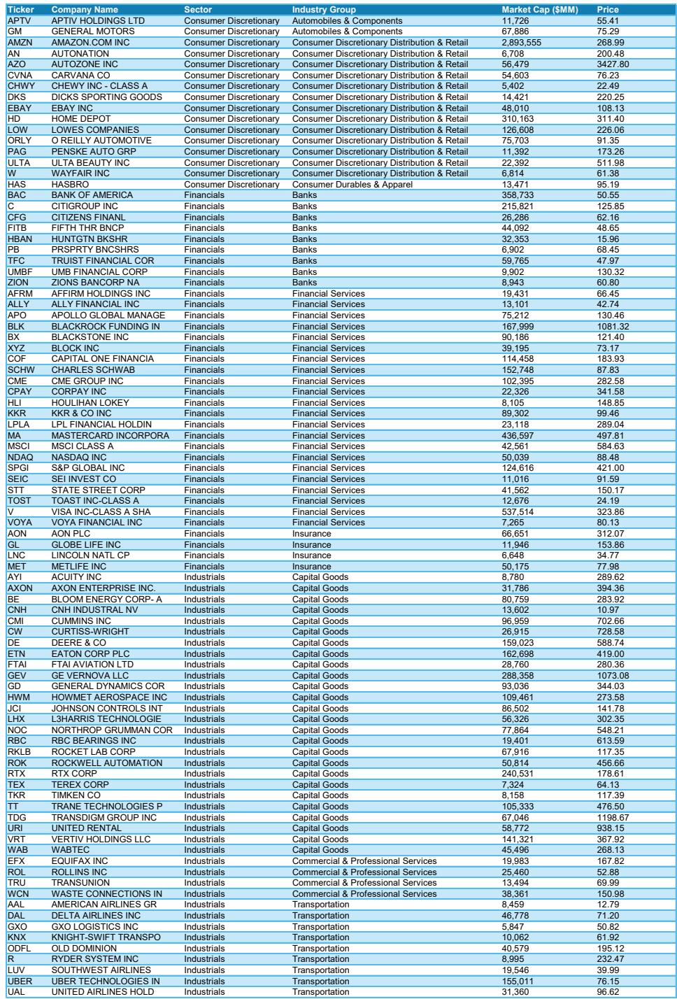
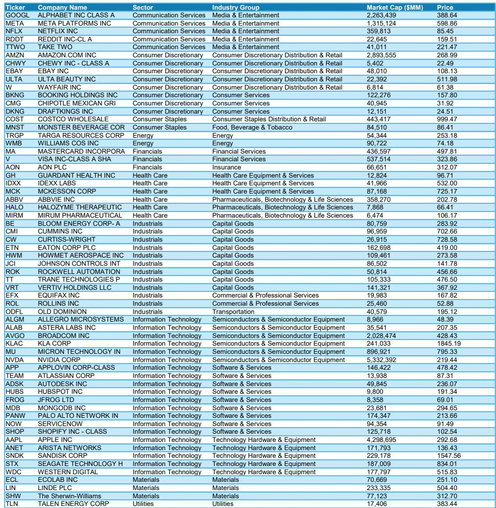
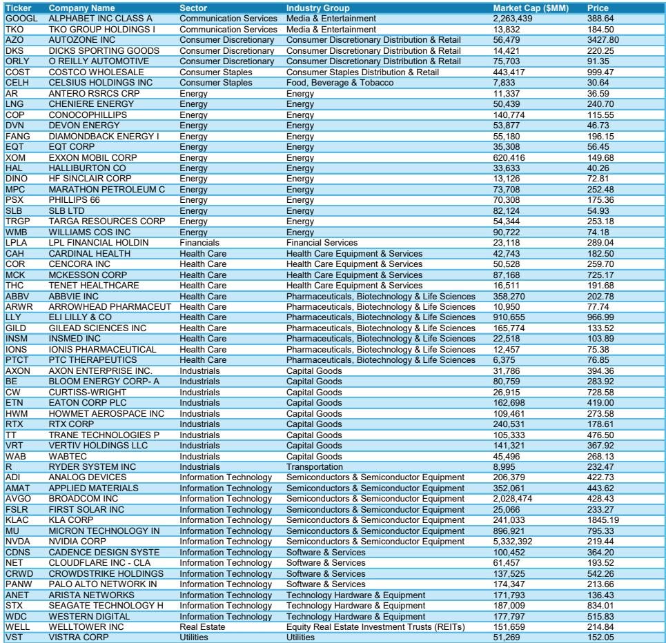

# The Bull Market Correction Has Already Happened: Why the S&P 500 Is Now an Earnings Story, Not a Multiple Expansion One

The most important question for equity investors at mid-year 2026 is not whether the market is expensive. It is whether the correction we just experienced was the beginning of something worse, or a healthy reset within a still-intact bull market. The evidence points decisively to the latter. The S&P 500's forward price-to-earnings multiple compressed by 18% from its peak, nearly half the stocks in the Russell 3000 suffered drawdowns of 20% or more, and yet forward earnings continued to surge throughout the turmoil. That is not a market ignoring risk. That is a market that priced risk. The result is a fundamentally different setup for the next twelve months: a market driven by earnings acceleration, not valuation expansion, with a price target of 8,300 on the S&P 500.

This conclusion runs counter to the prevailing narrative that equities have been complacent. A global investment bank report argues the opposite, and the data is compelling. The correction began last autumn as liquidity tightened, progressed through winter on AI disruption and private credit fears, and culminated in March with the Iran conflict and oil spike. By the time the headlines reached peak alarm, the market had already done its work. The question now is whether the underlying earnings cycle supports a recovery. The answer is yes, and the reasoning has strategic implications for sector allocation, factor exposure, and the very nature of what will drive returns from here.

This article synthesizes the core argument of that report, extends its logic into second-order implications, and identifies the unresolved questions that make the full document essential reading for serious investors.

## The Rolling Recovery Is Still in Its Early Innings, and Earnings Acceleration Is the Engine

The single most important structural insight from the report is that the US economy and corporate earnings are in the early stages of a rolling recovery, not the late stages of an expansion. This distinction matters enormously for how investors should interpret risks and position portfolios. A rolling recovery is characterized by uneven but broadening strength across sectors, with positive operating leverage, improving pricing power, and structural tailwinds from AI adoption creating a self-reinforcing cycle of earnings growth.

The numbers are striking. The report projects 2026 S&P 500 EPS of $339, representing 23% growth, followed by $380 in 2027 and $429 in 2028. That is 16% annualized growth through the forecast horizon, roughly double the long-term median. This is not a consensus view. Most market participants still expect a moderation. But the evidence for acceleration is mounting. First-quarter EPS surprises for the median S&P 500 stock came in at 6%, the strongest in four years. Earnings revisions breadth has surged from 5% at the start of earnings season to 22% today. And critically, the S&P 1500 median stock forward EPS growth has accelerated to 12%, up from 8% at the beginning of the year. The broadening is real.

What makes this earnings story durable is its foundation in operating leverage and structural change, not cyclical tailwinds that could reverse. Companies have been running lean, adopting AI to improve margins, and regaining pricing power after years of margin compression. The AI capex cycle continues to show momentum, and the report explicitly identifies hyperscalers as an attractive relative value trade: strong forward earnings at undemanding valuation levels. This is not a market that needs multiple expansion to deliver returns. It is a market where earnings growth alone can do the heavy lifting.

## The Oil Shock Was a Stress Test, Not a Recession Signal, and the Market Passed

The Iran conflict and the spike in oil prices to over $100 per barrel in March was the catalyst for the final leg of the correction. The natural historical comparison is to previous oil shocks that ended business cycles and triggered recessions. But the report makes a compelling case that this episode is fundamentally different, and the reason goes back to earnings.

In every prior cycle where an oil shock derailed growth, earnings were already decelerating or contracting before the shock occurred. In 1990, 2001, and 2008, the earnings trajectory was negative before the oil spike. Today, the opposite is true. Earnings growth is accelerating from already well-above-average levels. The report illustrates this with a chart showing Brent crude year-over-year changes alongside S&P 500 earnings growth, and the pattern is unmistakable: in prior recession-inducing oil shocks, the earnings line was declining. Today, it is rising sharply.

There are three additional reasons why this oil shock is unlikely to trigger a recession. First, the magnitude of the move is smaller than historical episodes, both in nominal terms and when adjusted for inflation. US gasoline prices are materially lower than they were after the Russia-Ukraine conflict began, and relative to the price of gold, gasoline is near a 20-year low. Second, the global economy has demonstrated a remarkable ability to adapt to supply disruptions. The report notes that after the destruction of the Nord Stream pipeline, Germany constructed LNG facilities within months, an outcome widely considered impossible at the time. Necessity drives innovation, and that flexibility should not be underestimated. Third, the composition of the S&P 500 is more insulated today, with technology, communication services, and Amazon comprising roughly 50% of the index. The higher-end consumer remains strong, the Energy sector is now a positive contributor to EPS growth and revisions, and commodity hedging practices differ at the company level. Cost impacts will be felt idiosyncratically, not at the index level.

The implication is clear: the oil spike was a stress test for the bull market, and the market passed. The correction it triggered was severe in valuation terms, but it did not break the earnings cycle. That is the hallmark of a correction within a bull market, not the beginning of a bear market.

## The Correction Was More Severe Than Headlines Suggest, Which Makes the Setup More Attractive

One of the most counterintuitive arguments in the report is that the market did not look through the risks. It discounted them. The evidence is in the valuation compression and breadth data. The S&P 500 forward P/E compressed by 18% from its peak, which is severe by historical standards. In the areas of the market most directly affected by the Iran conflict, AI disruption, and private credit concerns, drawdowns exceeded 40% in many cases. The Mag 7 stocks, which the report upgraded near the end of the correction in early April, experienced an even more significant valuation drawdown than the index, while their forward earnings remained robust.

This matters because it changes the risk-reward calculation. A market that has already adjusted valuations to reflect a pessimistic scenario has less downside if the scenario does not materialize and more upside if conditions improve. The report's price target of 8,300 implies a forward P/E of 20.5x, modest compression from the current 21.2x. The bull case is not predicated on multiple expansion. It is predicated on earnings continuing to grow at an above-trend pace. If the earnings trajectory is intact, the multiple compression is manageable. If the earnings trajectory accelerates, the upside could be significant.

The report also highlights that the correction began well before the headlines caught up. Liquidity started tightening last fall, and funding markets showed signs of stress. The market was already adjusting to a less accommodative monetary policy environment before the Iran conflict provided the final catalyst for capitulation. This is a pattern that experienced investors recognize: the market prices risk before the news confirms it, and by the time the headlines are alarming, the opportunity is often already forming.

## The Sector Implications Are Clear: Cyclicals Over Defensives, but Small Caps Remain a Watch-and-Wait

The report's sector recommendations flow directly from the rolling recovery thesis. Cyclicals should outperform defensives because the earnings acceleration is broad-based and the economic cycle is still in its early stages. The specific preferences are Industrials, Financials, and Consumer Discretionary Goods. These sectors benefit from improving demand, positive operating leverage, and the structural tailwinds from AI adoption and capital spending. Healthcare is moved to equal weight, reflecting a more economically sensitive and less defensive posture.

The hyperscalers receive a dedicated recommendation as an attractive relative value trade. The logic is that these companies have strong forward earnings growth at valuation levels that are undemanding relative to history and relative to the broader market. The correction in their valuations was more severe than for the index, and their earnings trajectories remain robust. For investors who believe in the AI capex cycle and the structural shift toward cloud computing and digital infrastructure, this is a compelling entry point.

The one area where the report is more cautious is small caps. Small cap earnings are inflecting higher, with forward growth of 22%. That is a positive signal. However, the monetary policy environment is less accommodative than expected, and the report maintains an equal weight on small caps relative to large caps for the time being. The implication is that the earnings acceleration is real, but the valuation and liquidity headwinds are still present. Small caps may become a more attractive opportunity if the Fed signals a more dovish path, but for now, the risk-reward is not compelling enough to overweight.

## What the Report Does Not Fully Answer: The Liquidity Paradox and the Fed's Reaction Function

For all its analytical rigor, the report leaves several important questions unresolved, and these are precisely the questions that investors need to grapple with to form their own views. The most significant is what the report calls the primary risk to its constructive stance: the possibility that running the economy hot leads to an inflationary impulse that the Fed cannot ignore. If the rolling recovery accelerates too quickly, if wage pressures re-emerge, or if the AI capex cycle creates demand-side inflation, the Fed could be forced to tighten policy more aggressively than currently priced. The report acknowledges this risk but does not fully resolve it.

The second unresolved question is about the interaction between fiscal policy and monetary policy. The report notes that the Fed may underestimate how much capital the economy is using for investment and the rolling recovery. If that is the case, the liquidity environment could tighten more than expected, even if the Fed does not raise rates. The private credit market, the shadow banking system, and the funding markets are all areas where liquidity conditions can shift rapidly and unpredictably. The report discusses these risks but does not provide a clear framework for monitoring them.

The third open question is about the sustainability of the earnings acceleration. The report projects 23% EPS growth in 2026, followed by 12% in 2027 and 13% in 2028. That is a deceleration, but from a very high base. The question is whether the structural tailwinds from AI adoption and operating leverage are sufficient to sustain above-trend growth, or whether the earnings cycle will revert to the mean more quickly than expected. The report's answer is that it will not, but the evidence for that view is still accumulating. Investors who want to make their own assessment will need to track the earnings revisions breadth, the margin data, and the capex plans of the hyperscalers and industrial companies.

## A Decision Framework for Investors: Three Questions to Determine Your Positioning

The report provides a wealth of data and analysis, but the ultimate value for investors is in translating that information into a decision framework. Based on the logic of the report, there are three questions that should determine your equity positioning for the next twelve months.

First, do you believe the earnings acceleration is sustainable? If the answer is yes, then the bull case is intact, and the appropriate positioning is to be overweight cyclicals, especially Industrials, Financials, and Consumer Discretionary Goods, with a dedicated allocation to hyperscalers as a relative value trade. If the answer is no, then the market is vulnerable to a re-rating lower, and a more defensive posture is warranted.

Second, do you believe the Fed will be able to navigate the tension between supporting growth and controlling inflation? If the answer is yes, then the liquidity environment should remain supportive, and small caps could become a more attractive opportunity as the earnings acceleration broadens. If the answer is no, then the risk of tighter liquidity is real, and large caps with strong balance sheets and pricing power should be preferred.

Third, do you believe the oil shock and geopolitical risks are idiosyncratic and manageable, or systemic and destabilizing? If the answer is the former, then the correction was a buying opportunity, and the market should recover as earnings continue to grow. If the answer is the latter, then the risks are not fully priced, and a more cautious approach is warranted.

The report's answer to all three questions is unequivocally optimistic. But the value of the framework is that it forces investors to make their own assessment, based on their own time horizon, risk tolerance, and conviction. The report provides the data and the logic. The decision is yours.

## The Full Report Contains the Charts and Data That Support This Argument, and the Open Questions Are Where the Real Insight Lies

This article has synthesized the core argument of a comprehensive mid-year outlook from a leading global investment bank. But the full report contains the charts, the data, and the detailed sector analysis that make the argument concrete and actionable. The exhibits on valuation compression, earnings revisions breadth, the oil shock comparison, and the sector-level earnings contributions are essential for any investor who wants to form their own view.

The report also contains screens and stock-level recommendations that are not discussed here. The cyclicals with strong EPS revisions, the AI adopters with pricing power, and the stocks with high operational efficiency that carry an overweight rating are all identified and analyzed. For investors who want to move from the macro thesis to the portfolio implementation, the full report is indispensable.

The unresolved questions about the liquidity paradox, the Fed's reaction function, and the sustainability of earnings growth are not weaknesses of the report. They are the areas where the most interesting analytical work remains to be done. The report provides a framework for thinking about these questions, but the answers will emerge only as the data evolves. Investors who engage with these questions will be better positioned to adapt their portfolios as conditions change.

Join the community to read the full report and review the original charts.

*This article is for learning and discussion only and does not constitute investment advice.*

Personal reading notes and learning share only. Not investment advice.

