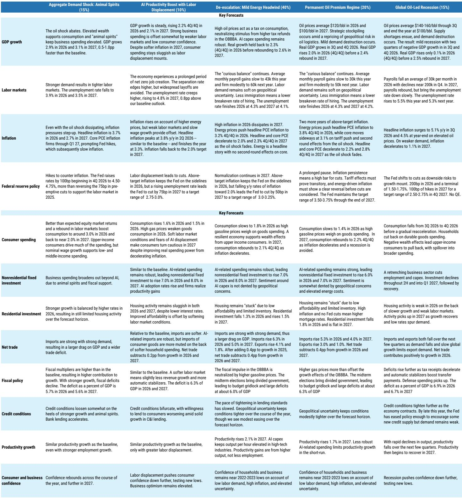
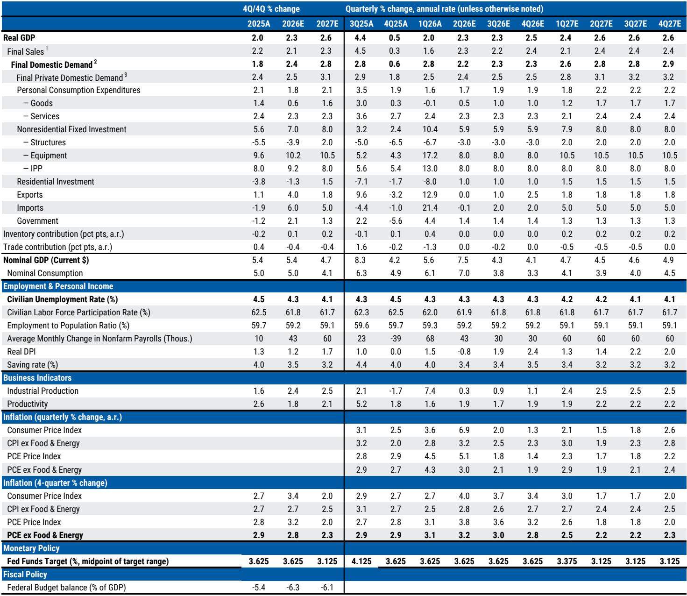
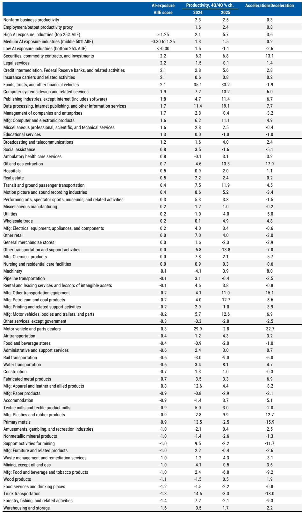

# 市场真正低估的不是消费，而是AI资本开支的结构性替代效应

当全球投资者还在争论美国消费者能否扛住油价冲击时，一份来自某外资投行的最新美国经济年中展望给出了一个反直觉的核心判断：**消费的拖累将被AI主导的资本开支所抵消，而真正决定未来两年美国经济走向的，不是需求端的韧性，而是供给侧的再定价。**

这份报告的价值不在于它预测了2.3%还是2.6%的GDP增速，而在于它揭示了美国经济正在经历一个深层的“范式切换”——从效率优先转向韧性优先。在这个切换过程中，AI资本开支不再只是科技行业的内部故事，而是正在成为宏观经济的结构性支撑力量，其影响力甚至足以对冲掉一次地缘政治驱动的能源冲击。

以下是我们从这份报告中提炼出的五个关键洞察，以及一个报告尚未完全回答的关键问题。

## 1. 第四次供给冲击正在重塑增长结构，消费与投资的角色正在互换

报告开篇就点明了当前宏观环境的特殊性：美国经济在短短几年内经历了四次供给冲击——新冠疫情、俄乌冲突、2025年的关税冲击，以及当前的中东冲突导致的油价飙升。布伦特原油从2月的70美元/桶区间跃升至90-120美元/桶，这本身就是一次典型的供给端扰动。

但真正值得关注的，是这次冲击下美国经济内部的结构性变化。报告明确指出，油价上涨将通过三个渠道传导至美国经济：实际购买力下降、负财富效应、以及不确定性对企业投资和雇佣的压制。然而，截至目前，美国经济只感受到了第一个渠道的影响，后两个渠道尚未显著显现。

这意味着什么？意味着当前的油价水平“足够高到推升通胀，但还没有高到让叙事转向增长故事”。这个微妙的平衡点，正是理解报告全部分析的起点。

报告预测，美国实际消费增速将从2025年的2.1%降至2026年的1.8%，然后在2027年反弹至2.1%。与此同时，非住宅固定投资将从2025年的5.6%加速至2026年的7.0%和2027年的8.0%。如果剔除进口因素，到预测期末，商业投资和私人消费对GDP增长的贡献将趋于接近。

**So what：** 过去十年“消费驱动美国经济”的叙事正在被改写。AI资本开支正在成为新的增长引擎，而消费的角色正在相对弱化。对于依赖美国终端需求的全球供应链而言，这意味着需求结构正在发生根本性变化——从消费品转向资本品，从终端需求转向中间投入。

## 2. AI资本开支正在从“周期性”变成“结构性”，超大规模云厂商支出2027年将突破1万亿美元

报告中最引人注目的数字之一，是超大规模云厂商（hyperscaler）的资本开支将在2027年超过1万亿美元。这个数字本身已经足够震撼，但更重要的是报告对其性质的判断：AI相关支出“更多地是结构性而非周期性”，并且在地缘政治不确定性中提供了韧性。

这一判断的逻辑基础是：AI资本开支并非简单的产能扩张，而是对下一代计算基础设施的战略性投入。这种投入的决策周期更长、回报预期更远，因此对短期利率波动和地缘政治风险的敏感度较低。报告预测，设备投资将从2025年的9.6%进一步加速至2026年的10.2%和2027年的10.5%，知识产权产品投资也将保持在8%以上的增速。

值得注意的是，报告在讨论AI对通胀的影响时，提出了一个重要的两难：AI的建设和部署阶段会推高对电力、基础设施和商品的需求，从而产生短期的通胀效应；但长期来看，AI有望提升生产率，具有通缩潜力。这个“近端通胀、远端通缩”的时间错配，正是美联储当前面临的核心困境。

**So what：** 对于投资者而言，1万亿美元的资本开支意味着什么？它意味着AI产业链上的设备制造商、数据中心建设商、电力基础设施供应商将迎来持续的需求支撑。更重要的是，这种支出正在从“可选”变成“必选”——对于超大规模云厂商而言，不投资AI的风险远大于投资过度的风险。

## 3. 美联储2026年按兵不动，2027年才开始降息——但真正的变数在“范式转换”

报告对货币政策的预测相当清晰：美联储在2026年全年维持利率不变，直到2027年3月和6月各降息25个基点，将终端利率降至3.0-3.25%。核心逻辑是，油价冲击将导致核心PCE通胀在2026年维持在2.8%的高位，直到2027年才回落至2.3%。

但比利率路径更重要的，是报告提出的一个更深层的问题：美联储是否正在经历一场“范式转换”？报告指出，如果其预测准确，这将进一步佐证美国经济已经退出后金融危机时代的“低通胀、低利率、宽松货币政策、紧缩财政”格局。新的范式是从“效率优先”转向“韧性优先”。

更值得关注的是，报告专门讨论了新任美联储主席Kevin Warsh可能带来的政策变化。报告认为，Warsh领导下的美联储可能会在沟通政策上“说得更少”，从而增加短期政策的不确定性。同时，资产负债表政策将成为争论焦点，但这些变化需要共识、监管改革和时间。

**So what：** 市场当前定价的降息路径可能过于乐观。如果美联储确实在进行范式转换——即中性利率（r*）可能已经上升——那么当前的利率水平可能远没有市场想象的那么“紧缩”。对于债券投资者而言，这意味着长端利率的下行空间可能比预期的更有限。

## 4. 财政政策陷入僵局，但关税风险可能在2026年下半年重新浮出水面

报告对美国财政政策的判断相当悲观：2026年中期选举前不会有财政刺激，之后将是分裂的政府，导致预算僵局。财政赤字将维持在GDP的6%左右。这意味着，短期内财政政策不会成为经济的额外推动力。

但真正需要警惕的是关税风险。报告指出，川普政府已经开始进行232条款和301条款的贸易审查，这些审查将在5月和6月完成。与此同时，7月24日是10%全面关税（根据122条款）到期的截止日期。虽然报告认为中期选举前不太可能强力推动关税，但232和301条款下的关税权限非常强大，关税政策的不确定性可能在2026年下半年重新显现。

此外，USMCA（美墨加协定）的审查截止日期也在2026年7月。报告认为，随着截止日期的临近，在现有协议中增加实质性新章节的难度越来越大。虽然长期来看美墨加贸易协调的方向是建设性的，但短期内取得重大进展的可能性有限。

**So what：** 市场可能低估了2026年下半年关税风险重新升温的可能性。如果关税再次升级，将给通胀下行路径带来新的不确定性，从而进一步推迟美联储的降息时间表。对于依赖北美供应链的企业而言，现在就应该开始为各种关税情景做预案。

## 5. AI对劳动力市场的影响“尚未成为宏观故事，但已不再隐形”

报告的两个专题研究值得单独讨论。第一个专题是AI与劳动力市场。报告的核心判断是：劳动力市场数据显示AI的替代效应目前是“早期、狭窄”的，总体扰动仍然很小，但已经出现整体任务重新分配的迹象。

第二个专题更具启发性：AI正在推动产出增长而非削减就业。报告发现，在MS识别为“高AI暴露度”的行业中，生产率提升速度明显快于中低AI暴露度的行业。更重要的是，这种生产率提升主要来自更快的产出增长和资本深化，而非劳动力替代。

**So what：** 这意味着市场对AI“替代就业”的担忧可能被夸大了，而对AI“提升产出”的潜力可能被低估了。如果这一趋势持续，AI将不仅是一个成本削减工具，更是一个增长创造器。对于投资者而言，这意味着应该更加关注那些能够利用AI提升产出和市场份额的公司，而非仅仅关注那些可能被AI替代的行业。

## 报告尚未完全回答的关键问题：范式转换的临界点在哪里？

报告提出了“范式转换”这一概念，但没有完全回答一个关键问题：这个转换的临界点在哪里？或者说，需要什么样的数据或事件才能让市场确信旧范式已经结束？

目前，市场仍在用旧范式的框架来定价——即认为通胀最终会回落，利率最终会下降，经济最终会回归“正常”。但如果新范式的特征是更高的中性利率、更频繁的供给冲击、以及更大的政策不确定性，那么当前的资产定价可能存在系统性偏差。

报告提供了四个替代情景，但每个情景都假设了不同的触发条件：需求超预期、AI生产率爆发、油价永久性溢价、全球衰退。这些情景本身就是在试图回答“临界点”问题，但报告没有给出哪个情景概率更高的判断。

**So what：** 这里的未解问题恰恰是投资者最需要持续跟踪的。范式转换不是一蹴而就的，它需要通过一系列数据点来验证。关键观察指标包括：核心PCE能否在2027年回落至2.3%、AI资本开支是否继续加速、以及美联储沟通风格的变化是否导致市场波动率上升。

---

这份报告的价值不仅在于其预测，更在于它提供了一个重新审视美国经济的分析框架。当市场还在争论“软着陆还是硬着陆”时，报告已经将问题升级为“旧范式还是新范式”。这种视角的转换，本身就是一种重要的投资洞察。

如果你对报告的完整内容——包括四个替代情景的详细推演、AI生产率提升的行业分布、以及美联储范式转换的历史对标——感兴趣，欢迎来我们的社群继续讨论。我们会定期分享海外顶级投行的研报解读，并围绕这些未解问题展开深度对话。

Personal reading notes and learning share only. Not investment advice.

