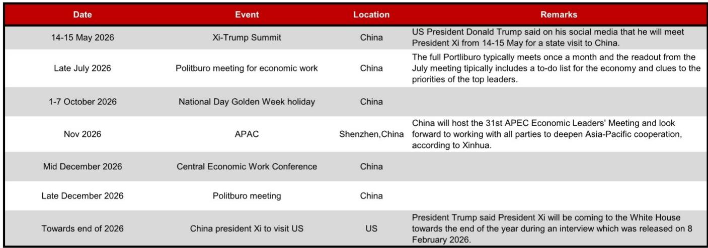
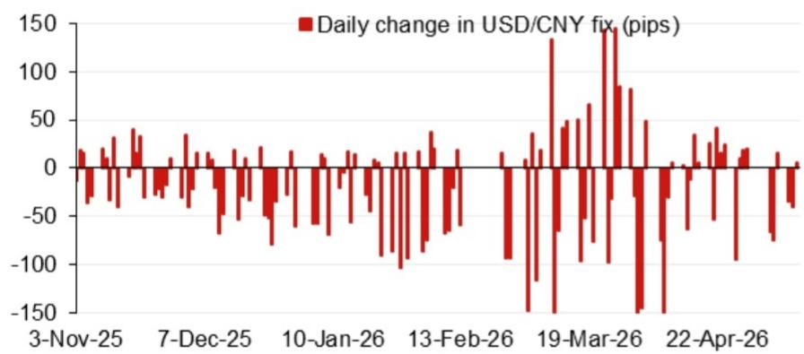
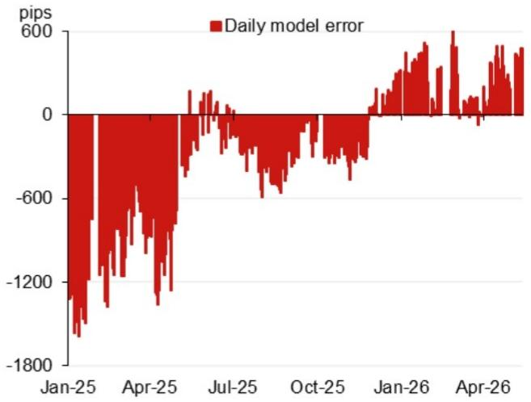

# The Dollar-Yuan Fix Model Is Sending a Signal That Markets Should Not Ignore

The daily fixing of the USD/CNY central parity rate is not a mechanical calculation. It is a policy transmission mechanism, a signal of intent, and often the first observable move in a broader strategic shift. The latest model projection from a leading Asia FX strategy team places the fix at 6.7902, a dramatic 529 pips lower than the previous projection of 6.8431. This is not a routine adjustment. It is a compression of the band within which the People's Bank of China is willing to let the yuan trade, and it carries implications for every portfolio with exposure to emerging market currencies, Asian supply chains, or US-China financial relations.

The key number to understand is the model projection without the counter-cyclical factor: 6.7902. The previous projection was 6.8431. That is a 529-pip drop from one model run to the next. Even after incorporating the counter-cyclical factor, which the PBOC uses to smooth volatility and lean against speculative flows, the projection stands at 6.8132, still 299 pips lower than the previous fix. This is a sUBStantial downward revision, and it occurs against a backdrop of escalating diplomatic and trade tensions, with a Xi-Trump summit scheduled for May 2026 and a series of high-stakes political events through the end of the year.

Why now matters is straightforward. The yuan fix is not merely a technical input for FX traders. It is the anchor for the entire Asian FX complex. A lower fix signals a deliberate willingness to let the yuan appreciate, or at least to resist depreciation pressures, at a time when many market participants have been betting on a weaker renminbi due to tariff risks and a strong dollar. If the PBOC is signaling a tighter grip on the fix, the implications for cross-border capital flows, export competitiveness, and regional currency correlations are profound. This article unpacks what the fix model is actually saying, what it leaves unsaid, and how strategic investors should interpret the signal.

## The Model Projection Collapse Is Not a Forecast Error; It Is a Policy Signal Embedded in Data

The first thing to recognize is that the model projection of 6.7902 is not a prediction of where the spot rate will trade. It is the output of a quantitative framework that weights overnight currency movements to estimate where the fix should land if the PBOC were to follow a purely rules-based approach. The top four weighted contributors to the projected change are instructive: the Russian ruble contributed a positive 19.5 pips, while the Mexican peso, euro, and Australian dollar contributed negative 4.5, 6.0, and 7.5 pips respectively. This is not a random assortment. The ruble's positive contribution reflects the ongoing realignment of energy trade flows and the growing role of non-dollar settlement mechanisms in Russia-China commerce. The negative contributions from the euro, peso, and Australian dollar reflect broad dollar strength and risk-off sentiment in commodity-linked and emerging market currencies.

The so-what here is that the model is capturing a shift in the global FX landscape that is not purely driven by US-China bilateral dynamics. The yuan fix is increasingly sensitive to a basket of currencies that includes the ruble, which is itself subject to sanctions and capital controls. This means that the fix is becoming a conduit for geopolitical spillovers that are not fully captured by traditional trade-weighted indices. Investors who focus only on the USD/CNY pair miss the fact that the fix model is now absorbing volatility from multiple axes simultaneously.

Furthermore, the model error history reveals a pattern that demands attention. Over the past year, daily model errors have ranged from negative 1,800 pips to positive 600 pips. The most recent data points show errors oscillating between negative 600 and positive 600 pips, suggesting that the PBOC has been actively intervening to keep the fix within a tighter band than the model would imply. This is consistent with a central bank that is managing expectations rather than letting the fix drift passively. The large negative error in January 2025, a full 1,800 pips below the model, was likely a deliberate intervention to prevent excessive yuan weakness at a time of market stress. The recent narrowing of errors indicates that the PBOC is now more comfortable letting the model guide the fix, which in turn means the model's output carries greater signal value.

## The Counter-Cyclical Factor Is the PBOC's Silent Policy Lever, and Its Current Usage Reveals a Shift in Tolerance

The counter-cyclical factor is the mechanism through which the PBOC can deviate from the model's output without publicly announcing a policy change. It is a discretionary adjustment that allows the central bank to lean against one-sided market expectations. In the current projection, the counter-cyclical factor adds 230 pips to the model output, bringing the projected fix from 6.7902 to 6.8132. This is a relatively modest adjustment compared to historical episodes of extreme stress, when the factor has been used to add hundreds of pips to resist depreciation.

The action title for this section is deliberate: the counter-cyclical factor is not being used aggressively, and that itself is a signal. If the PBOC were deeply concerned about yuan weakness, it would have added a much larger counter-cyclical adjustment to push the fix higher and signal a defense of the currency. Instead, the factor is being applied at a level that merely smooths the transition from the previous fix to the new model projection. This suggests that the PBOC is comfortable with a stronger yuan, or at least with a fix that is lower than what the market might have expected.

Why this matters for investors is that the counter-cyclical factor is the canary in the coal mine for policy shifts. When the factor is increased significantly, it signals that the PBOC is actively resisting market forces. When it is reduced or held steady, it signals acceptance. The current configuration points to acceptance of a lower fix, which in turn implies that the PBOC sees strategic value in a stronger yuan. This could be a preemptive move to reduce import costs ahead of a potential escalation in trade tensions, or it could be a signal to domestic and international markets that China is not going to engage in a competitive devaluation. Either way, the direction of travel is clear.

## The Calendar of High-Stakes Political Events Creates a Sequence of Decision Points for the Fix

The report includes a calendar of events that spans from May 2026 through the end of the year. The Xi-Trump summit on 14-15 May is the immediate focal point. But the calendar also includes the Politburo meeting for economic work in late July, the APEC summit in Shenzhen in November, the Central Economic Work Conference in mid-December, and a scheduled visit by President Xi to the US towards the end of 2026. Each of these events is a potential catalyst for a shift in the fix regime.

The analytical challenge is that the fix is not set in a vacuum. It is a policy instrument that can be adjusted ahead of diplomatic meetings to create negotiating leverage, or held steady to avoid signaling weakness. The current model projection of 6.7902, if realized, would represent a significant appreciation from previous levels. That could be interpreted as a goodwill gesture ahead of the May summit, signaling that China is willing to address US concerns about currency manipulation. Alternatively, it could be a strategic move to strengthen the yuan before a period of heightened uncertainty, giving the PBOC more room to ease policy later if needed.

The so-what for investors is that the fix should not be viewed as a static input. It is a dynamic policy variable that will be recalibrated at each of these decision points. The model provides a baseline, but the actual fix will reflect the PBOC's assessment of the political and economic environment at the time. Investors need to map the calendar of events onto the fix trajectory and ask themselves: at each inflection point, what would the PBOC be trying to achieve? The answer will determine whether the fix moves higher or lower, and by how much.

## What the Report Does Not Fully Answer: The Disconnect Between the Fix Model and Capital Flow Dynamics

The report provides a rigorous framework for projecting the fix, but it leaves a critical question unanswered: what is the relationship between the fix and actual capital flows? The model is based on overnight currency movements and a basket weighting, but it does not incorporate data on cross-border portfolio flows, trade settlement currency shifts, or the accumulation of foreign exchange reserves. These are the real-world variables that determine whether the fix is sustainable or whether it will be overwhelmed by market forces.

The gap is significant. If the fix is set at 6.7902 but capital outflows accelerate due to geopolitical uncertainty or domestic economic weakness, the PBOC will face a choice: defend the fix by draining reserves and tightening liquidity, or let the fix adjust. The model cannot predict which path the PBOC will choose, because that decision depends on a broader set of policy objectives that include financial stability, export competitiveness, and diplomatic relations.

This is the unresolved analytical question that makes the full report worth reading. The model tells you where the fix should be based on a set of inputs. It does not tell you whether the PBOC has the willingness or the capacity to maintain that fix in the face of adverse flows. Investors who rely solely on the model risk being caught off guard by a sudden policy shift that the model did not anticipate. The full report likely contains additional analysis on reserve adequacy, intervention history, and the PBOC's communication strategy that would help bridge this gap.

## A Decision Framework for Interpreting the Fix in Real Time

For investors who need to act on the fix signal, the following framework translates the model output into actionable questions. This is not a trading recommendation. It is a structured way to think about what the fix means and when to adjust positioning.

First, assess the direction and magnitude of the model projection relative to the previous fix. A change of more than 300 pips is significant. A change of more than 500 pips, as we see in the current projection, is extraordinary. It signals that the PBOC is either responding to a major shift in the external environment or preparing for one. Do not treat a large projection change as a forecast of the spot rate. Treat it as a signal of policy intent.

Second, examine the counter-cyclical factor. If the factor is large and moving in the same direction as the model, the PBOC is reinforcing the signal. If the factor is small or moving in the opposite direction, the PBOC is hedging its bets. In the current case, the factor is modest and in the same direction, which suggests a moderate degree of conviction.

Third, map the fix trajectory against the calendar of political events. If the fix is moving lower ahead of a summit, it may be a negotiating tactic. If it is moving higher, it may be a defensive measure. The current lower projection ahead of the May summit is consistent with a strategy of offering concessions on currency policy to gain leverage on trade issues.

Fourth, monitor actual capital flows. If the fix is lower but portfolio inflows are strong, the signal is validated. If the fix is lower but outflows are accelerating, the signal is under threat. The model cannot tell you which scenario is unfolding. You need to look at real-time data on reserve changes, bond market flows, and the offshore yuan market.

Fifth, consider the second-order implications for other Asian currencies. A lower yuan fix reduces the competitive pressure on other Asian exporters, which could lead to a broad appreciation of Asian FX. But it also increases the risk of capital flight from economies with weaker fundamentals. The fix is not just a China story. It is a regional story.

## Join the Community to Read the Full Report and Review the Original Charts

The analysis above extracts the strategic signal from the fix model, but the full report contains the underlying data, the historical error analysis, and the detailed breakdown of the basket weights that make the signal actionable. The charts on model errors and daily fix changes reveal patterns that are not visible in the text alone. The calendar of events provides a timeline that every Asia-focused investor should have on their desk.

To see the original data and the complete analytical framework, join the community to read the full report and review the original charts. The model output is a starting point. The real insight comes from understanding how the PBOC has used the fix in past cycles, and how the current configuration fits into a longer-term strategic pattern. The full report provides that context.

*This article is for learning and discussion only and does not constitute investment advice.*

Personal reading notes and learning share only. Not investment advice.

