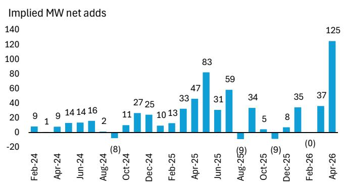
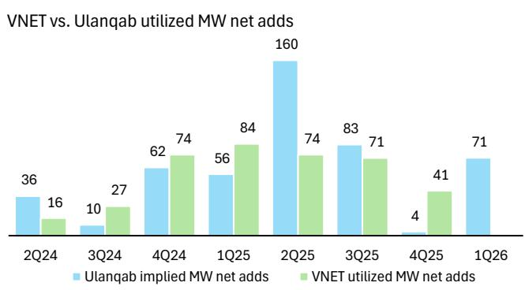

# China’s Data Center Build-Out Has Entered a New Phase: The Supply Constraint Is Breaking, and the Real Test of Demand Is Beginning

The most important signal from China’s data center market this month is not a number. It is a pattern break. For over two years, the Ulanqab data center cluster, one of the country’s most important hUBS for hyperscale computing, has delivered a steady but unspectacular cadence of capacity additions. Month after month, net new power utilization rarely exceeded 50 megawatts. Then came April 2026. The implied net addition of 125 megawatts in a single month is not just a new high. It is more than the entire first quarter of 2026 combined. It is nearly double the previous monthly record. And it comes after a period of pronounced supply-side friction that had many investors questioning whether the much-hyped AI infrastructure cycle could actually deliver.

The conventional narrative around Chinese data centers has been one of relentless demand growth constrained by chip availability. That narrative is now shifting. The question is no longer whether capacity will come online, but whether the pace of customer absorption can keep up with the accelerating supply. The answer to that question will determine which companies in the ecosystem create value and which destroy it.

This is not a story about a single region. Ulanqab is a bellwether for the entire Chinese hyperscale data center market. Its power usage data, published by the local government, provides one of the few high-frequency, objective windows into the real operating activity of the sector. When Ulanqab utilization jumps by 125 megawatts in a month, it signals that the bottlenecks that constrained the industry through late 2025 are loosening. The large-scale hyperscaler tenders that were awarded in early January are now translating into physical infrastructure. The domestic chip ramp-up, which many analysts had dismissed as aspirational, is showing tangible results.

For investors and strategists tracking the AI infrastructure theme, the implications are profound. The industry is moving from a phase of planning and procurement into a phase of execution and occupancy. That transition brings new risks and new opportunities that the market has not yet fully priced.

## The Record-Breaking April Data Proves That Chip Supply Constraints Are Finally Easing, But It Also Raises a New Question About Demand Sustainability

The raw numbers demand attention. Ulanqab data center power usage in April 2026 reached 574 gigawatt-hours, representing 99.3 percent year-on-year growth. This is not a one-off spike. Growth has been accelerating from 90.1 percent in March and averaged 116.6 percent for the full year 2025. The implied net capacity addition of 125 megawatts in April alone is a step-change from the 37 megawatts added in March and the 71 megawatts added in the entire first quarter.

To understand why this matters, consider the context of late 2025. In the fourth quarter of 2025, Ulanqab added only 4 megawatts of net new capacity. The industry was widely believed to be stuck, unable to deploy the servers and networking equipment needed to fill the shells that had been constructed. Chip supply constraints, particularly for advanced AI accelerators, were the primary culprit. The narrative was one of excess capacity waiting for silicon.

The April data says that narrative is outdated. The 125-megawatt addition implies that the chips are arriving. The hyperscaler tenders from early 2026 are being fulfilled. Domestic semiconductor production is ramping faster than many expected. The supply chain is healing.

But here is the analytical tension. A 125-megawatt monthly addition is so far above the historical run-rate that it forces a reassessment of the demand side. In the past, capacity additions in Ulanqab were roughly in line with, or slightly ahead of, customer move-ins. The utilization data captures actual power draw, not construction completions. So the 125 megawatts represents real customer activity, real servers running real workloads. That is a powerful validation of AI demand.

Yet it also means that the absorption rate has suddenly tripled relative to the quarterly average. The question is whether this pace is sustainable. If chip supply continues to improve, the industry could see several more months of 80-to-100 megawatt additions. That would imply an annualized capacity growth rate that far exceeds any reasonable forecast for AI workload expansion. The risk is not demand destruction. The risk is demand saturation, at least in the near term, as hyperscalers digest the massive capacity they are now deploying.

The report’s data does not answer this question. It simply shows that the inflection point has arrived. The next three months of data from Ulanqab will be far more informative than any analyst forecast.

## The Correlation Between Ulanqab Utilization and Public Operator Results Is Breaking Down, Suggesting That Market Share Dynamics Are Shifting Beneath the Surface

One of the most useful features of the Ulanqab tracker has been its ability to serve as a leading indicator for publicly listed data center operators. Historically, changes in Ulanqab implied net adds have correlated reasonably well with reported utilized megawatt additions from major players such as VNET. When Ulanqab accelerated, operators tended to report strong customer move-ins. When Ulanqab slowed, operators struggled.

The April data challenges that relationship. The report includes a comparison showing that in the fourth quarter of 2025, when Ulanqab added only 4 megawatts, VNET reported 41 megawatts of utilized net adds. In the first quarter of 2026, Ulanqab added 71 megawatts, but VNET has not yet reported its quarterly figure. The divergence in the prior quarter is striking. How could VNET add 41 megawatts when the entire Ulanqab cluster added only 4?

There are several possible explanations, and each has different investment implications. One possibility is that VNET is gaining market share, winning business that is going into its facilities outside Ulanqab. Another is that VNET’s reported utilization includes capacity that was contracted but not yet drawing full power, creating a timing mismatch with the government’s actual power usage data. A third, more concerning possibility is that the reported figures are not directly comparable due to differences in measurement methodology.

The report does not resolve this ambiguity. But it raises an important analytical point. As the market shifts from a supply-constrained to a demand-driven regime, the relationship between aggregate utilization and individual operator performance will become less predictable. Companies with strong customer relationships and flexible capacity will outperform. Those that built speculative capacity without committed offtake will face growing pressure to fill their space at lower prices.

Investors should watch for divergence in operator disclosures over the next two quarters. If VNET and other major players continue to report strong additions while Ulanqab utilization plateaus, it would suggest that the market is fragmenting. If Ulanqab continues to surge and operator reports follow, it would confirm that the entire ecosystem is accelerating.

## The Report Raises a Critical Question It Does Not Fully Answer: Whether This Capacity Is Being Absorbed by AI Training, AI Inference, or Traditional Cloud Workloads

The most important missing piece in the Ulanqab data is workload composition. The report provides a high-quality, high-frequency read on total power consumption. It does not provide any breakdown of what is driving that consumption. In a market where AI training, AI inference, and traditional cloud computing have very different economics, capacity requirements, and growth trajectories, this distinction matters enormously.

Consider the implications of each scenario. If the 125-megawatt addition is primarily AI training, it suggests that hyperscalers are building out massive GPU clusters for model development. This would be consistent with the chip supply improvement thesis and would imply a continued need for high-density, high-power infrastructure. The economics would favor operators that can deliver the most power per square foot.

If the addition is primarily AI inference, it suggests that deployed models are generating real traffic and that the industry is moving from building to serving. This would be a more sustainable demand driver, as inference workloads tend to grow with user adoption rather than with model size. It would also favor operators with geographic diversity and low latency connectivity.

If the addition is primarily traditional cloud workloads, it would be the most surprising outcome. Traditional cloud growth in China has been steady but not explosive. A sudden surge in cloud capacity consumption would imply either a major enterprise migration cycle or a shift in how hyperscalers are deploying their resources.

The report does not provide this breakdown. No public data source does. But the question is too important to ignore. Investors who assume that all data center demand is AI demand are making a bet on workload composition that could prove wrong. The most sophisticated operators and hyperscalers are already thinking in terms of workload segmentation. The market will eventually reward those who get the composition right.

## A Decision Framework for Navigating the Post-Constraint Data Center Market

For strategists and investors trying to position for the next phase of the cycle, the Ulanqab data provides a useful starting point for a structured decision framework. The framework has three dimensions: supply trajectory, demand composition, and operator positioning.

On supply trajectory, the key question is whether the April spike is a one-time catch-up or the beginning of a sustained acceleration. The answer depends on chip supply trends, which are notoriously difficult to forecast. A conservative approach is to assume that monthly additions will average 60 to 80 megawatts for the next two quarters, above the historical average but below the April peak. An aggressive approach is to assume that April is the new normal. The data over the next three months will tell you which view is correct.

On demand composition, the key question is workload mix. Since public data does not provide this, the best proxy is to watch hyperscaler capital expenditure guidance and commentary. If hyperscalers are increasing their 2026 capex forecasts and Citing AI inference as a driver, it supports the sustainable demand thesis. If they are maintaining guidance or Citing one-time training buildouts, it suggests that the current wave may be front-loaded.

On operator positioning, the key question is which companies have the most exposure to the most attractive segments. Operators with high-density facilities near major internet exchanges are best positioned for AI workloads. Operators with large existing footprints in tier-one Cities are best positioned for latency-sensitive inference and cloud workloads. Operators with speculative capacity in remote regions are most at risk of price compression if demand does not keep pace with supply.

This framework does not provide easy answers. It provides a structure for updating your view as new data arrives. The Ulanqab tracker will be a critical input, but it must be combined with operator disclosures, hyperscaler commentary, and semiconductor supply chain data to form a complete picture.

## Join the Community to Read the Full Report and Review the Original Charts

The data and analysis presented here are drawn from a detailed research report that includes month-by-month capacity tracking, historical comparisons, and valuation frameworks for the major Chinese data center operators. The original report contains charts that visualize the trend in implied net additions, the correlation with operator results, and the broader market context. These charts are essential for understanding the magnitude of the April inflection and its implications for the quarters ahead.

To access the full report and the underlying data, join the community. The discussion around this sector is moving fast, and the best insights come from engaging with the data directly and debating its implications with other professionals who are tracking the same signals.

*This article is for learning and discussion only and does not constitute investment advice.*

Personal reading notes and learning share only. Not investment advice.

