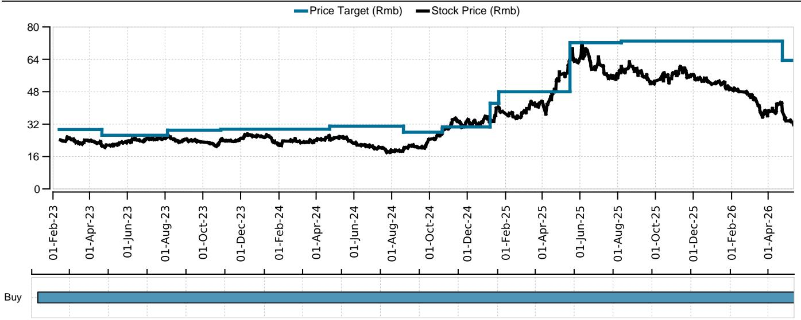
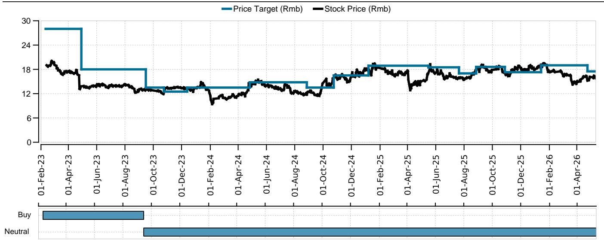
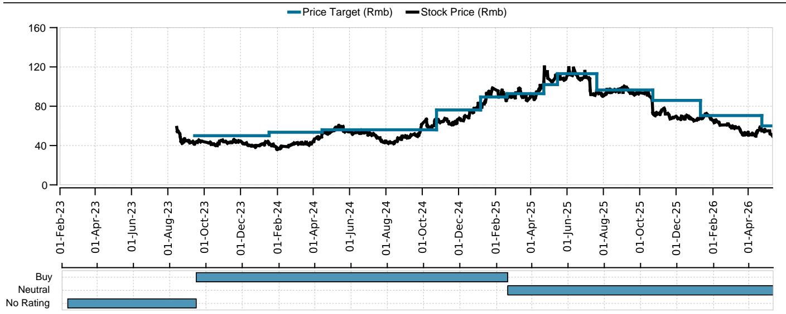

# China’s Pet Food Market Is Splitting Into Two Speeds — And Only One Is Investable

The narrative that China’s pet food sector is a uniformly growing consumer theme is no longer tenable. In April 2026, total online GMV across Tmall, JD, and Douyin rose just 1.1% year-on-year to RMB 2,388 million. That is a sharp deceleration from the 8% year-to-date growth rate and a far cry from the double-digit expansion rates the industry enjoyed as recently as 2023. The headline number, however, masks a structural divergence that is far more consequential than any single month’s growth rate. Volume grew 10.7% year-on-year, but average selling prices fell 8.7%. Consumers are buying more bags but paying less per bag. That is not a healthy market; it is a market undergoing a forced repositioning.

The real story is not the slowdown itself but the widening gap between winners and losers. China Pet Foods (CPF) delivered 29.2% online sales growth in April and 45% year-to-date. Its brands Wanpy and Toptrees are gaining share decisively. Meanwhile, Gambol’s online sales declined 2.2% in April, and Petpal’s core brand Meatyway fell 4.5%. The industry’s top four players now control 23.5% of online sales, up slightly from a year ago, but that aggregate stability conceals a brutal zero-sum battle beneath the surface.

The question every investor in this space must answer is no longer whether the Chinese pet food market will grow. It will, but at a slower, more contested pace. The question is which companies have the brand strength, channel strategy, and cost structure to extract value from a market where volume growth is being offset by price compression, export channels are under structural pressure, and raw material costs are trending in conflicting directions.

## The Online Channel War Is Shifting From Tmall to a JD-Douyin Duel, and Tmall’s Decline Is a Structural Signal

For years, Tmall was the default channel for premium pet food in China. That assumption is now under threat. In April, Tmall’s pet food GMV fell 8.9% year-on-year, while JD grew 15.5% and Douyin grew 11.9%. Year-to-date, Tmall is flat, while JD and Douyin are both up 18%. This is not a one-month anomaly. Tmall’s relative weakness has been building for over a year, and the data now suggests a structural shift in where pet owners are choosing to shop.

The implications are twofold. First, brands that built their online presence primarily through Tmall are facing an erosion of their most important distribution channel. Tmall’s decline is particularly damaging for brands that rely on its platform for premium positioning, because Tmall has historically commanded higher ASPs than Douyin. As volume migrates to JD and Douyin, the overall market ASP is being dragged down — which is exactly what we see in the aggregate data.

Second, the divergence between JD and Douyin is not yet resolved. JD’s strength suggests that pet owners are increasingly treating pet food as a routine replenishment category, which favors JD’s logistics and sUBScription models. Douyin’s growth, while still strong, is decelerating from the explosive rates of 2023 and 2024. The battle for the next phase of online pet food distribution will likely be fought between JD’s reliability and Douyin’s discovery-driven impulse buying. Brands that can win on both platforms will have a structural advantage. Those tied to a single channel are taking on significant concentration risk.

## CPF’s Outperformance Is Not Just About Brands — It Reflects a Strategy That Combines Multi-Brand Portfolio Management With Channel Agility

CPF’s 45% year-to-date online growth demands a deeper explanation than “good brands.” Wanpy grew 30.7% in April, Toptrees grew 43%, but Zeal declined 17.8%. The portfolio is not uniformly strong. Yet the aggregate result is the best in the sector by a wide margin. This suggests that CPF has mastered something its competitors have not: the ability to allocate marketing spend and channel resources dynamically across brands and platforms.

Wanpy and Toptrees are gaining share in the mid-premium and super-premium segments respectively, and both are performing well on JD and Douyin. Zeal, a higher-end imported brand, is underperforming, possibly because its price point is less suited to the current ASP-sensitive environment. The key insight is that CPF is not betting on a single brand to carry the company. It is running a portfolio where underperformers are contained and winners are scaled aggressively. This is a more sophisticated approach than Gambol’s reliance on Myfoodie and Fregate, both of which are losing share.

The contrast with Petpal is even starker. Meatyway’s online sales fell 4.5% in April and 17.5% year-to-date. Market share dropped to 0.5%. Petpal appears to be losing relevance in the domestic online channel at a time when the entire market is shifting online. The company’s inability to stabilize its core brand raises serious questions about its go-to-market strategy and brand equity.

For investors, CPF’s performance is not just a data point; it is a template. The winning strategy in China’s pet food market is no longer about having the best product alone. It is about having a portfolio that can absorb channel shifts, price pressure, and changing consumer preferences without losing momentum.

## Export Markets Are Under Structural Pressure From the U.S. Trade Environment, and Domestic Growth Must Compensate

China’s pet food exports fell 12.7% year-on-year in March 2026 to USD 111 million. Exports to the U.S. dropped 32.7% year-on-year. For the first quarter of 2026, total exports grew only 6% year-on-year, while U.S.-bound exports fell 35%. This is not a cyclical blip. The U.S. market, which was once a meaningful growth driver for Chinese pet food manufacturers, is becoming a headwind that will likely persist given the broader trade and tariff environment.

The implication for the sector is clear: companies that relied on export revenue to offset domestic margin pressure are losing that buffer. CPF, which has significant export exposure, is managing this through its strong domestic performance. But for companies like Gambol and Petpal, where domestic growth is already weak, the export drag compounds the problem.

The raw material cost picture adds another layer of complexity. Pet treat input costs were flat year-on-year in April, but pet staple food costs rose 4.8% year-on-year. Within that, soybean meal prices fell 11.2%, but corn rose 7.4% and beef rose 8.7%. The cost structure is diverging by product category. Companies with a heavier mix of staple foods — which includes most of the premium brands — are facing higher input costs at a time when ASPs are falling. That is a direct margin squeeze.

This combination — falling export revenue, rising staple food input costs, and declining ASPs — creates a challenging environment for all players. The winners will be those that can either pass through costs to consumers (unlikely in the current price-sensitive environment) or achieve sufficient scale and operational efficiency to absorb the pressure. CPF’s valuation, with a 2026E P/E of 25.4x and a Buy rating, reflects the market’s view that it can navigate these crosscurrents. Gambol and Petpal, rated Neutral, are seen as more vulnerable.

## What the Report Does Not Fully Answer: The Sustainability of Volume-Led Growth and the Risk of a Value Trap

The report’s data raises a question that it does not fully resolve: is the volume growth sustainable, or is it being pulled forward by discounting? Online pet food volume grew 10.7% year-on-year in April, but ASP fell 8.7%. That is the largest ASP decline in recent memory. It suggests that brands are competing aggressively on price to maintain or grow market share. If this is a temporary promotional cycle, then volume may normalize once discounts are withdrawn. If it is a structural shift in consumer behavior — pet owners trading down to cheaper products — then the industry faces a prolonged period of margin compression.

The report also does not clarify the profitability of CPF’s domestic online growth. Rapid share gains often come at a cost. CPF may be spending heavily on marketing and platform fees to achieve its 45% year-to-date growth. The valuation of 25.4x 2026E P/E implies that investors expect this growth to translate into earnings. If the cost of acquiring that growth is higher than expected, the stock could re-rate downward.

Another open question is the role of Douyin. The platform’s growth is decelerating, and its economics for brands are notoriously poor due to high fulfillment and advertising costs. If Douyin’s growth continues to slow, brands that have invested heavily in Douyin-specific content and supply chains may face a difficult adjustment. The report shows Douyin’s year-on-year growth rate declining from over 100% in early 2023 to roughly 12% in April 2026. The platform is maturing, and the easy gains are gone.

Finally, the export data raises a question about timing. U.S. trade policy is unpredictable. If tariffs escalate further, Chinese pet food exports to the U.S. could deteriorate even more. Companies with high U.S. exposure may need to reallocate capacity to domestic or other international markets, which takes time and capital. The report does not model these scenarios.

## A Decision Framework for Investors: Four Questions to Determine Which Pet Food Stocks Can Survive the Squeeze

Rather than relying on a single growth metric or valuation multiple, investors should evaluate pet food companies using a four-question framework derived from the report’s data.

First, does the company have a multi-brand portfolio that can absorb channel and category shifts? The data shows that single-brand companies or those with concentrated brand exposure are losing share. CPF’s three-brand strategy is working because Wanpy and Toptrees are growing while Zeal’s decline is contained. Gambol’s Myfoodie and Fregate are both underperforming, leaving no growth engine. Petpal’s reliance on Meatyway is a structural vulnerability.

Second, is the company gaining or losing share on JD and Douyin simultaneously? Tmall’s decline means that brands cannot afford to be strong on only one platform. The winners are those that are winning on both JD and Douyin. CPF’s brands are performing well on both. Gambol and Petpal are not showing the same breadth.

Third, can the company maintain or improve margins despite rising staple food input costs and falling ASPs? This is the hardest question to answer from public data alone. Investors should look for companies with high gross margins, low customer acquisition costs, and the ability to pass through raw material inflation. CPF’s valuation implies confidence in its margin resilience. Gambol and Petpal’s Neutral ratings suggest the market sees margin risk.

Fourth, what is the company’s export exposure, and can domestic growth offset it? Companies with high U.S. export exposure and weak domestic growth face a double hit. The report’s data on CPF suggests it is managing this trade-off well. For others, the export drag may become a material headwind in 2026 and 2027.

This framework does not replace detailed financial modeling, but it provides a structured way to interpret the signals in the report. Companies that pass all four tests are likely to outperform. Those that fail multiple tests face significant downside risk, regardless of their current valuation.

## The Market Is Rewriting the Rules, and Only a Few Players Are Keeping Up

The Chinese pet food market is not broken. It is evolving. The era of easy online growth, rising ASPs, and expanding export markets is over. What is replacing it is a more demanding environment where brand portfolios, channel strategy, cost management, and trade exposure all matter more than top-line growth alone.

CPF has emerged as the clear leader in this new regime. Its 45% year-to-date growth, market share gains, and Buy rating reflect a strategy that aligns with the market’s new realities. Gambol and Petpal, with their Neutral ratings and weakening momentum, are struggling to adapt.

For investors who want to understand the full data set behind this analysis — including the detailed online GMV trends by brand, channel, and category, as well as the raw material cost projections and export forecasts — the original report contains charts and tables that cannot be fully reproduced here.

Join the community to read the full report and review the original charts.

*This article is for learning and discussion only and does not constitute investment advice.*

Personal reading notes and learning share only. Not investment advice.

