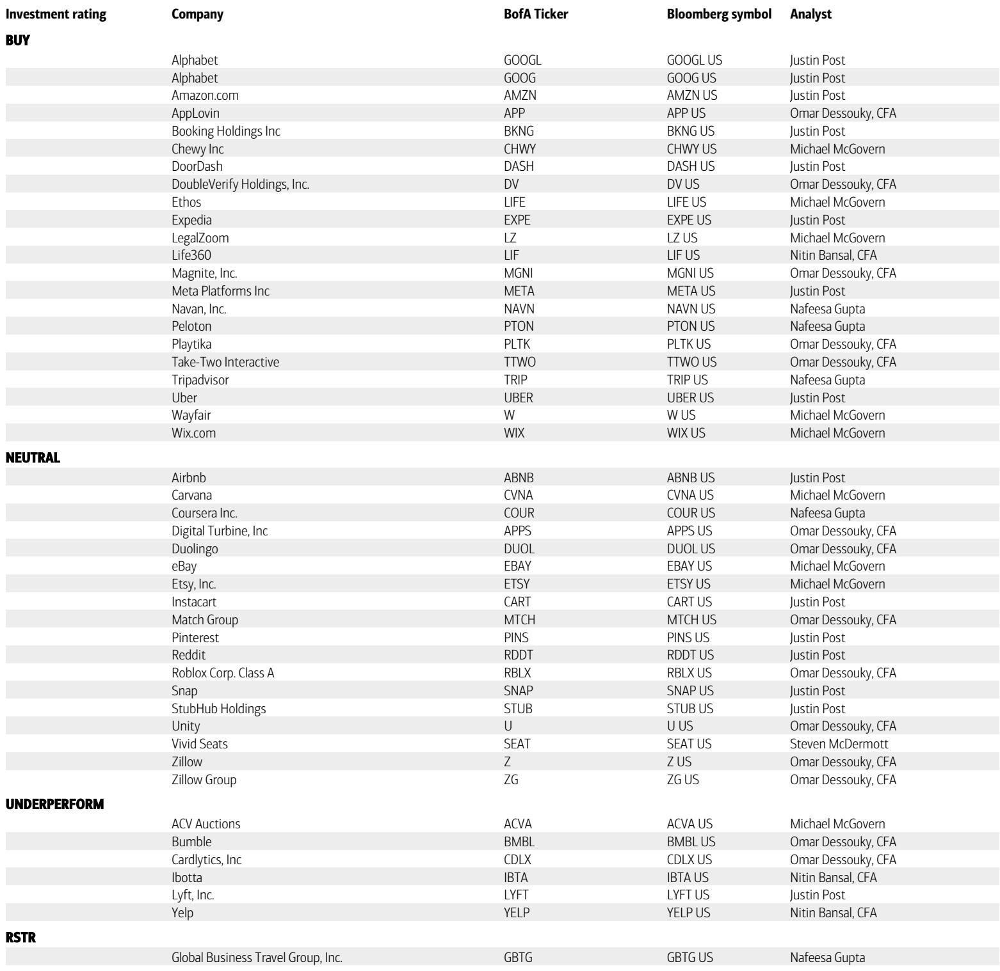
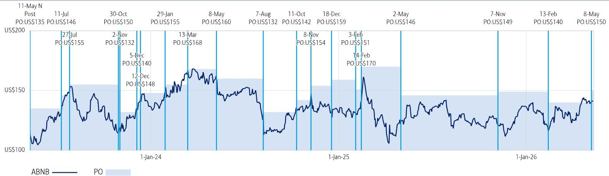
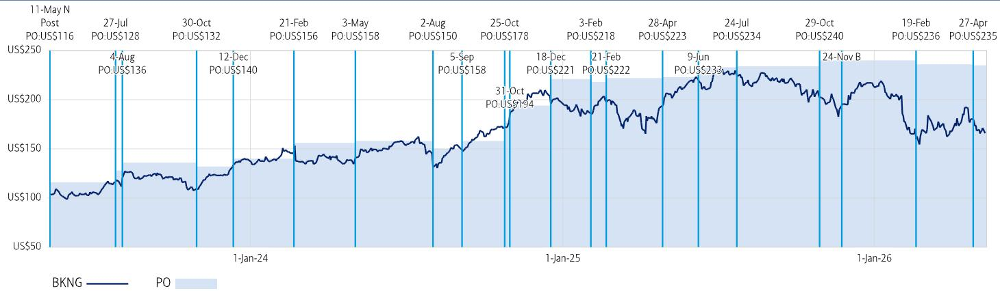

# 美国夏季旅游意愿的强劲背后，真正被低估的是AI对预订行为的重塑

这份在2026年4月对1000多名美国消费者进行的年度旅游调查，释放了一个比表面数据更值得关注的信号。尽管中东地缘政治冲突贯穿调查周期，美国消费者的夏季出行意愿不仅没有消退，反而显著增强：47%的受访者预期未来12个月内将增加出行，这一比例高于去年的43%；计划在2026年夏季“显著增加”出行的人次达到30%，而去年仅为20%。表面上看，这是需求韧性的又一次证明。但深入拆解调查中关于搜索行为、AI采用率和忠诚度迁移的数据后，一个更关键的判断浮现出来：市场可能低估了供给侧结构性变量的再定价效应——OTA正在借助AI工具和忠诚度体系，从Google手中夺取用户搜索入口的控制权，而这一变化将深刻重塑在线旅游的竞争格局和资产定价逻辑。

这份报告的核心价值，不在于验证“旅游需求依然旺盛”这一多数人已经接受的结论，而在于揭示了支撑这一需求的底层行为正在发生不可逆的迁移。当用户从“去Google搜、去OTA订”转向“在OTA内部搜、在OTA内部订”，整个价值链的价值分配方式将随之改变。以下是我们从这份研报中提炼出的四个关键洞察，以及一个尚未被完全解答的悬念。

## 1. 用户搜索入口正在从Google向OTA迁移，Expedia和Booking.com成为最大赢家

调查中最具战略意义的变化出现在“最常用来搜索酒店或住宿的网站”这一问题上。自2022年以来，Google一直占据这个搜索入口的领先地位，但2026年的调查显示，Expedia以19%的比例首次超越Google的18%，成为最受欢迎的住宿搜索起点。Booking.com的搜索份额也从12%跃升至15%，而直接预订酒店网站的比例仅从12%微增至13%。

这意味着什么？长期以来，Google在旅游搜索中扮演着“漏斗顶部”的角色，OTA需要向Google支付高昂的搜索广告费用来获取流量。但调查数据表明，越来越多的用户开始跳过Google，直接在OTA平台上完成从搜索到预订的全流程。这种“去中介化”的逆向趋势，实际上是在弱化Google的流量分发权，强化OTA的独立用户触达能力。对于Expedia和Booking.com而言，这意味着单位用户获取成本的下降和用户生命周期价值的提升，而这恰恰是市场定价模型中容易被忽视的“结构性成本改善”。

## 2. AI工具正在从“尝鲜”走向“主流”，但OTA自有AI与通用AI的竞争格局尚未定型

AI对旅游规划的影响在本次调查中出现了跳跃式增长。44%的受访者表示已经使用过ChatGPT、Gemini或Claude进行旅行规划，这一比例是去年18%的两倍多。与此同时，40%的受访者使用过Booking.com或Expedia的AI聊天机器人，高于去年的26%。更值得关注的是，38%的受访者表示愿意让AI代理自动预订旅行，另有30%表示感兴趣但不放心——这意味着近七成用户对AI预订持开放态度。

然而，两个数字之间的差距揭示了关键竞争格局：通用AI（如ChatGPT）的“已使用”比例（44%）高于OTA自有AI（40%），但“计划使用”的比例则相反（16%对20%）。这表明，通用AI在触达和认知上领先，但OTA自有AI在转化意愿上更占优势。原因不难理解：通用AI擅长规划，但无法完成交易闭环；OTA自有AI则可以直接连接库存和支付。未来的关键问题是：哪一类AI能更快地解决“规划到预订”的无缝衔接？如果通用AI通过API接入OTA库存，它可能成为新的流量入口，反过来威胁OTA的独立地位。如果OTA自有AI在体验上足够出色，它将成为锁定用户、降低流失率的护城河。目前来看，OTA自有AI在交易闭环上拥有天然优势，但通用AI的生态扩展能力不可小觑。

## 3. 忠诚度计划正在成为OTA竞争的新战场，Booking Genius的爆发式增长值得警惕

调查数据显示，忠诚度计划的渗透率正在快速提升。Booking的Genius会员比例从去年的13%跃升至28%，翻了一倍有余；Expedia的One Key会员比例从21%微增至22%；酒店直营忠诚度计划从40%升至44%。更重要的是，未加入任何忠诚度计划的受访者比例从36%下降至26%，下降了10个百分点。

Booking Genius的爆发式增长，不能简单归因于促销活动。它反映了Booking.com在用户粘性建设上的系统性投入：通过积分、折扣、升级权益等手段，将一次性交易用户转化为长期会员。当用户成为Genius会员后，他们在下次出行时更倾向于在Booking.com内部完成搜索和预订，而不是回到Google横向比价。这形成了一个正向循环：忠诚度计划降低用户比价意愿，提升OTA内部转化率，进而减少对Google流量的依赖，最终降低获客成本。

对于Expedia而言，One Key的增长相对温和，这可能意味着其忠诚度体系的吸引力或推广力度不如Booking。对于酒店集团，虽然直营忠诚度计划仍然是最受欢迎的，但OTA忠诚度的快速追赶正在侵蚀酒店直营渠道的差异化优势。如果OTA能够提供与酒店直营相当甚至更好的会员权益，用户将没有动力绕开OTA直接预订。

## 4. 价格敏感度下降、便利性上升，用户决策逻辑正在发生根本性转变

调查中一个常被忽略但意义深远的信号是：在“在线旅游预订的最重要因素”这一问题上，选择“价格”的受访者比例从去年的51%大幅下降至42%，而选择“便利性/易用性”的比例从18%跃升至30%，首次超过“评分与评论”成为仅次于价格的第二大因素。

这个变化不能简单解读为“用户不再在乎价格”。更准确的解释是：当OTA通过AI推荐、忠诚度积分和一站式服务大幅提升了便利性之后，用户愿意为这种便利性支付一定的价格溢价。换句话说，OTA正在从“比价工具”升级为“决策助手”，其价值主张不再仅仅是“找到最便宜的房间”，而是“在最短时间内帮你做出最合适的决定”。

这对竞争格局的影响是深远的。如果用户愿意为便利性支付溢价，OTA就可以在不牺牲利润率的前提下维持或提升佣金率。反之，如果用户仍然高度价格敏感，OTA之间的竞争将不可避免地陷入价格战。调查数据表明，行业正在向前者倾斜。这对于拥有更强AI能力和更优用户体验的OTA而言，是一个结构性利好。

## 报告尚未完全回答的关键问题：AI预订的安全感鸿沟如何跨越？

尽管38%的受访者表示愿意使用AI代理自动预订旅行，但仍有32%明确表示“不会使用”，30%表示“感兴趣但不放心”。这意味着超过六成的用户对AI预订存在顾虑。报告没有深入探讨这些顾虑的具体来源——是担心数据隐私，是担心AI订错行程后的追责问题，还是单纯的不信任感？

这个安全感的鸿沟，决定了AI对旅游行业渗透率的上限。如果AI代理只能在规划阶段发挥作用，而预订环节仍需人工确认，那么AI对效率的提升是有限的。只有当用户愿意将预订权限完全交给AI时，OTA的运营模式才可能发生根本性变革。目前来看，这个临界点尚未到来，但通用AI与OTA自有AI之间的竞争，可能会加速或延缓这一进程。谁先建立起用户对AI预订的信任，谁就掌握了下一阶段竞争的主导权。

---

以上四个洞察，只是这份研报中大量交叉验证数据的一部分。报告中还包含了按年龄、收入分层的详细数据，以及各OTA平台在“使用率变化”“预订意愿”等维度上的逐年对比图表，这些数据对于判断具体公司的相对竞争优势至关重要。

例如，虽然整体OTA使用率在上升，但Airbnb在替代住宿领域的份额相比去年出现了小幅下降，而Booking.com则在这一领域实现了份额增长。这种结构性迁移背后的原因是什么？是Genius忠诚度计划的跨品类拓展，还是Airbnb在用户体验上遇到了瓶颈？这些问题的答案，需要结合报告中的原始图表和细分数据才能得出更完整的判断。

欢迎来星球微信群里继续讨论这些未解问题，我们可以一起拆解报告中的原始图表，探讨AI预订的安全感鸿沟如何被填补，以及忠诚度计划竞争对Expedia和Booking两家公司估值模型的二阶影响。这些讨论的深度，远超一篇公众号文章所能承载。

Personal reading notes and learning share only. Not investment advice.

