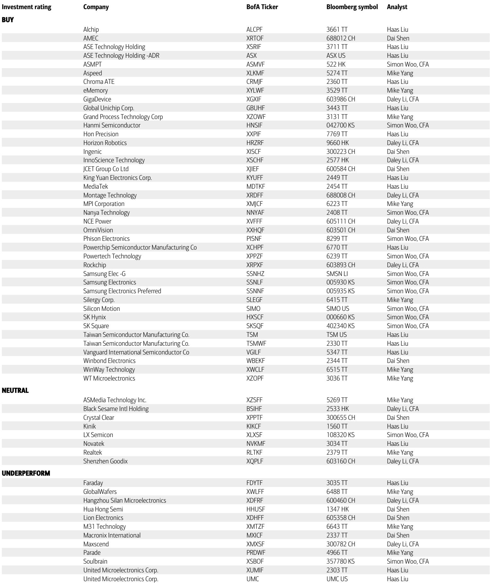
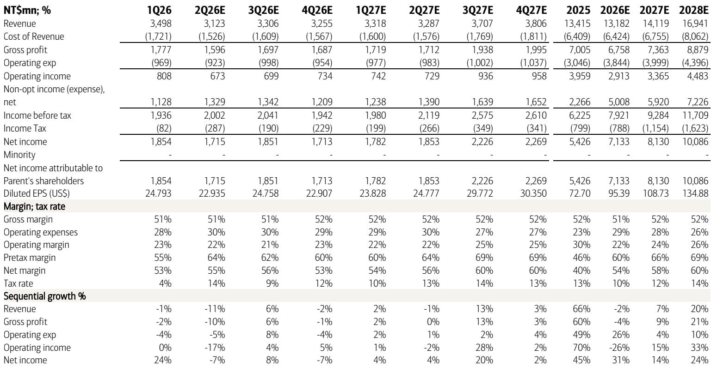
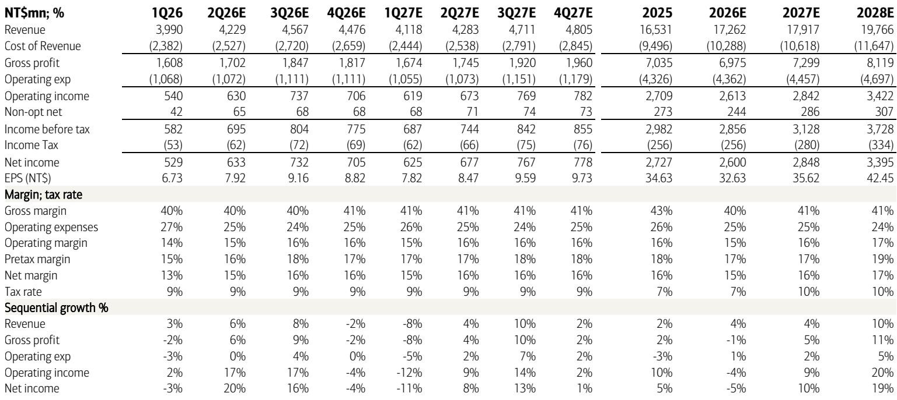

# The PC Fabless Margin Squeeze Is Not Cyclical: It Signals a Structural Shift in Semiconductor Value Capture

The first-quarter 2026 earnings calls from Asia-Pacific's PC-focused fabless semiconductor companies have delivered a clear and uncomfortable message: the demand outlook is softening toward the end of 2026, and gross margins are under pressure from rising production costs that show no sign of reversing. This is not merely a mid-cycle trough. The combination of inflationary OSAT costs, surging memory prices that suppress DIY demand, and a PC replacement cycle that appears to be losing momentum creates a structurally challenging environment for fabless companies that lack pricing power or product differentiation. For investors who have treated PC fabless names as steady compounders, the earnings calls from ASMedia and Parade serve as a warning that the business model itself is being stress-tested.

The conventional narrative has been that PC fabless companies benefit from secular content growth and a stable end-market. That narrative is breaking down. What we are seeing is a two-front war: on the cost side, outsourced assembly and test suppliers are passing through inflationary pressures that fabless firms cannot fully absorb; on the demand side, memory price inflation is crushing the DIY motherboard and chipset market, which has historically been a high-margin revenue driver. The result is that even as some product lines show promise, the core earnings engine is sputtering. The market has been slow to price this in, as reflected in consensus estimates that remain meaningfully above the revised forecasts from a major investment bank.

This article argues that the margin compression in PC fabless is not a temporary headwind to be waited out. It is a structural shift in how value is captured along the semiconductor supply chain. The fabless model, long celebrated for its asset-light efficiency, is now facing a cost structure that is increasingly dictated by upstream suppliers and a demand environment that is becoming more fragmented and price-sensitive. The implications extend beyond ASMedia and Parade to the broader universe of fabless companies that lack proprietary manufacturing or captive OSAT relationships. The key question for investors is not whether margins will recover in 2027, but whether these companies can reposition their business models fast enough to defend profitability in a higher-cost, lower-growth equilibrium.

## Rising OSAT Costs Are Not a Passing Inflationary Spike; They Represent a Permanent Repricing of the Assembly and Test Value Chain

The most significant structural threat to PC fabless margins is the rising cost of outsourced semiconductor assembly and testing. During the 1Q26 earnings calls, management at both ASMedia and Parade explicitly cited inflationary manufacturing costs from OSAT suppliers as a primary driver of gross margin compression. This is not a one-time shock. The OSAT industry has been investing heavily in advanced packaging capacity, particularly for fan-out wafer-level packaging and system-in-package technologies. These investments require higher utilization rates and higher pricing to generate acceptable returns. The era of commoditized, low-cost assembly and test is ending.

For fabless companies that rely on a handful of OSAT partners, the pricing dynamic is asymmetric. OSAT suppliers have consolidated in recent years, giving them greater bargaining power. They are also facing their own cost inflation in labor, energy, and materials. The result is a pass-through of cost increases that fabless firms, which lack the scale or vertical integration of a major IDM, cannot easily push back against. ASMedia's gross margin guidance for 2H26 reflects this pressure, and Parade's expectation that gross margins will trough in 1H26 implies that the recovery will be gradual and incomplete.

The strategic implication is clear: fabless companies that compete primarily on price or that serve high-volume, low-margin end-markets will see their profitability structurally impaired. The only way to offset OSAT cost inflation is through product mix shift toward higher-value solutions, which is exactly what ASMedia is attempting with its PCIe switch business. But that transition takes time, and in the interim, the core business absorbs the cost hit. Investors need to reassess their margin assumptions for the entire PC fabless sector, not just for the two companies covered in the report.

## Memory Price Inflation Is Crushing the DIY Motherboard Market, and the Recovery Will Take Longer Than Expected

The second structural headwind comes from the demand side. Surging memory prices, particularly for DRAM and NAND, are having a pronounced negative effect on the DIY PC market. ASMedia's management cited a 15-20% year-over-year decline in 2026 demand from motherboard-related business, including AMD chipsets, and explicitly stated that the impact on the DIY market from memory prices is expected to persist through at least 1H27. This is not a transient inventory correction. It is a demand destruction event driven by a component cost that has risen faster than end-users are willing to absorb.

The DIY segment has historically been a reliable source of high-margin revenue for fabless companies that supply chipsets, interface controllers, and other motherboard components. Enthusiast builders are price-sensitive, but they are also willing to pay a premium for performance. However, when the cost of memory alone rises by 50% or more, the total system cost becomes prohibitive, and demand simply falls off a cliff. The recovery requires memory prices to stabilize or decline, which depends on supply-demand dynamics in the memory industry that are outside the control of any fabless company.

This creates a second-order problem. The PC OEM market is also sluggish, as enterprise and consumer replacement cycles have been extended. The combination of a weak OEM market and a collapsing DIY segment means that the total addressable market for PC-related chips is shrinking in 2026. Even if a fabless company gains share within that shrinking pie, the absolute revenue opportunity is diminished. The investment bank's forecasts for ASMedia show a 2% revenue decline in 2026, followed by only a 7% recovery in 2027. That is not a V-shaped recovery. It is a slow grind.

For investors, the critical question is whether memory prices will revert to pre-inflation levels within the next 12-18 months. The evidence from the earnings calls suggests that management does not expect that to happen. The DIY market may not fully recover until 2028, if at all, as some demand may permanently shift to pre-built systems or to alternative computing form factors. This demand destruction is structural, not cyclical.

## The Bright Spot of PCIe Switch Does Not Compensate for Core Business Weakness, and the Valuation Debate Misses the Point

Amid the gloom, ASMedia has identified PCIe switch as a growth driver, targeting revenue contribution of 10% in 2026 and 20% in 2027. PCIe switches are used in data center, networking, and storage applications, and they represent a genuine content upside story. The company's key customer, AMD, continues to gain share in server CPUs, and the PCIe switch content per server is increasing with each new generation. This is a legitimate secular growth opportunity.

However, the math does not work in the near term. Even if ASMedia hits its 20% target for PCIe switch revenue in 2027, that implies roughly NT$2.8 billion in revenue from this product line. The company's total revenue in 2027 is forecast at NT$14.1 billion. That means 80% of revenue still comes from PC-related businesses that are facing headwinds. The PCIe switch business is not large enough to offset the margin compression and revenue decline in the core. It is a long-term story that does not change the 2026-2027 earnings trajectory.

The investment bank's price objective adjustments reflect this tension. ASMedia's price objective was raised to NT$1,750 from NT$1,500, but the rating remains Neutral. Parade's price objective was raised to NT$520 from NT$440, but the rating is Underperform. These are not bullish signals. They are mechanical adjustments for valuation roll-forward and modest estimate changes. The market may interpret the higher price targets as positive, but the ratings tell the real story: the analysts see insufficient upside to justify a buy recommendation.

The valuation debate is also missing a deeper point. The market is applying a P/E multiple to earnings that are being supported by non-operating investment gains. ASMedia's pretax margin is forecast at 60% in 2026, but its operating margin is only 22%. The difference is non-operating income, which is largely investment gains. If you strip those out, the core operating earnings are much lower, and the implied P/E on operating earnings is far higher than the headline multiple suggests. Investors who are buying these stocks on a P/E basis need to understand what earnings they are paying for. The report shows that the investment bank's estimates are 8% and 6% ahead of consensus for 2026 and 2027 EPS, but that is driven by non-op assumptions, not operating leverage.

## What the Report Does Not Fully Answer: The Sustainability of Non-Operating Income and the Risk of a Multi-Contraction

The report provides detailed financial forecasts, but it leaves two critical questions unanswered. First, how sustainable is the non-operating income that is propping up ASMedia's earnings? The company's pretax margin jumps from 46% in 2025 to 60% in 2026, driven entirely by a doubling of non-operating income from NT$2.3 billion to NT$5.0 billion. This is not explained in the report. It could be from realized gains on equity investments, dividend income, or foreign exchange gains. Whatever the source, it is inherently less predictable and repeatable than operating income. If this income stream normalizes or declines, the earnings picture deteriorates sharply.

Second, the report does not address the risk of multiple compression. Parade is being valued at 15x forward P/E, and ASMedia on a sum-of-the-parts basis. But if the market begins to view PC fabless companies as structurally lower-growth and lower-margin, the multiples could contract. A 15x multiple on a company with sub-10% earnings growth and declining gross margins is not obviously cheap. The report's price objectives are based on rolling forward the valuation period, not on a fundamental reassessment of the risk premium. This is a mechanical exercise, not a strategic one.

Investors need to do their own work on these two issues. Without clarity on the sustainability of non-operating income and the appropriate multiple for a structurally challenged business model, the price targets are of limited use. The full report contains the detailed income statements and estimate changes that can help readers build their own scenarios.

## A Decision Framework for Evaluating PC Fabless Investments in a Structural Margin Squeeze

For investors who are considering positions in PC fabless companies, the following framework may help distinguish between names that can navigate the structural shift and those that cannot.

First, assess the company's exposure to OSAT cost pass-through. Companies that have long-term contracts with OSAT suppliers, or that have the ability to qualify alternative assembly partners quickly, are better positioned. Companies that rely on a single OSAT supplier or that lack engineering resources to redesign packages are at risk of sustained margin compression.

Second, evaluate the company's product mix and its ability to shift toward higher-value, lower-volume applications. PCIe switch is a good example of a product that commands higher margins and has secular demand. Companies that have a clear roadmap for moving into data center, automotive, or industrial markets are more resilient than those that are dependent on PC motherboards and consumer DIY.

Third, analyze the quality of earnings. Separate operating income from non-operating income. If a significant portion of net income comes from investment gains, tax benefits, or one-time items, the headline P/E is misleading. Look at operating margin trends and ask whether the company can generate sustainable free cash flow from its core business.

Fourth, stress-test the demand assumptions. The report assumes mild revenue growth for Parade and a modest recovery for ASMedia in 2027. Build a scenario where memory prices remain elevated through 2028 and the DIY market does not recover. What does revenue and margin look like in that scenario? If the downside case shows a material earnings decline, the current valuation may not offer a sufficient margin of safety.

Finally, compare the company's gross margin trajectory to that of its OSAT suppliers. If OSAT margins are rising while fabless margins are falling, the value is being transferred upstream. This is a structural shift that will persist until the fabless companies find a way to differentiate their products or integrate backward. Neither is easy or quick.

## The Unresolved Questions That Demand a Deeper Dive

The report raises several analytical questions that it does not fully resolve. Why is consensus so far above the investment bank's estimates for operating income at both companies? For ASMedia, consensus expects operating income of NT$4.4 billion in 2026, while the bank forecasts NT$2.9 billion. That is a 33% gap. For Parade, the gap is 13% in 2028. The market is clearly more optimistic about operating leverage than the analysts are. Who is right, and what would have to happen for the consensus view to materialize?

What is the specific nature of the OSAT cost increases? Are they across-the-board price hikes, or are they concentrated in advanced packaging for specific product types? If they are broad-based, then every fabless company in the region is affected. If they are product-specific, then some names may be unfairly punished by association.

How do the competitive dynamics change if AMD continues to gain share in servers? ASMedia benefits from AMD's success, but Parade's exposure to the PC market means it may not capture the same upside. The divergence between the two stocks is a microcosm of the broader challenge: even within the same sector, the winners and losers are being determined by end-market exposure and product positioning.

These are not idle questions. They are the analytical gaps that separate a superficial reading of the report from a genuine investment thesis. The full report contains the quarterly income statements and estimate change tables that allow readers to build their own scenarios and test their own assumptions.

## Why the Full Report Matters Now

The margin pressure on PC fabless companies is not a footnote in the semiconductor story. It is a leading indicator of a broader repricing of risk in the fabless ecosystem. The OSAT cost pass-through, the memory-driven demand destruction, and the reliance on non-operating income are not unique to ASMedia and Parade. They are themes that will play out across the sector in the coming quarters.

The report from the global investment bank provides the data, the estimates, and the analytical framework to understand these dynamics. But the real value lies in the charts and the detailed financials that show the quarterly trajectory of margins, revenue, and earnings. These are the tools that allow investors to move beyond the headline price targets and build their own conviction.

Join the community to read the full report and review the original charts.

*This article is for learning and discussion only and does not constitute investment advice.*

Personal reading notes and learning share only. Not investment advice.

