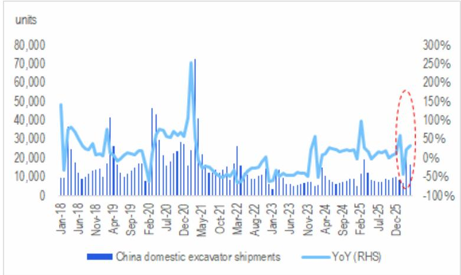
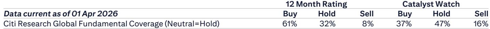
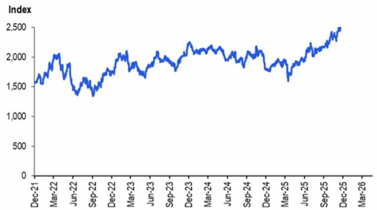

# 挖掘机涨价不是成本驱动，而是价格战终结的信号

工程机械行业正在发生一个值得关注的变化。2026年5月，徐工、三一、柳工几乎在同一时间宣布上调挖掘机出厂价，幅度在3%至5%之间。这不是一次普通的成本转嫁，而是持续数年的价格战出现拐点的第一个明确信号。

某外资投行在最新发布的研报中，基于与多家工程机械龙头企业的直接交流，给出了一个判断：挖掘机的涨价不会完全传导给终端客户，但其意义不在于涨价本身，而在于它宣告了行业竞争逻辑的转变。与此同时，其他品类如高空作业平台、叉车、注塑机等，并没有跟进涨价的意愿。

这意味着什么？市场对工程机械板块的定价，可能需要重新校准。

## 1. 挖机涨价的真正推手不是成本，而是竞争格局的自我修复

市场最容易犯的错误，是把涨价理解为成本推动。原材料价格确实在上涨，铜价从2025年中的每吨约10000美元攀升至2026年初的13500美元，钢价指数也从2025年中的1600回升至2500。但这些成本压力并非刚刚出现，产业链上的龙头企业此前一直有能力消化。

真正让涨价成为可能的，是行业集中度提升后龙头企业对定价权的重新掌控。过去几年，中联重科率先发起价格战，迫使徐工、三一、柳工跟进，行业利润被大幅压缩。现在，三一和柳工率先在5月中旬提价，徐工则在6月1日跟进，三家合计占据了国内挖掘机市场超过60%的份额。当头部玩家同时行动，涨价就不再是孤立的公司行为，而是行业共识的形成。

更重要的是，管理层自己也承认，这次涨价不太可能完全传导给终端客户。它的真实作用是“收回今年早些时候因价格战而额外给出的折扣”。换句话说，涨价不是为了让客户多付钱，而是让行业回到一个正常的定价水平。这本质上是一次竞争格局的修复，而不是通胀的传递。

## 2. 挖机需求的结构性改善正在为涨价提供支撑

涨价能够落地，离不开需求端的配合。研报中引用的一组数据值得关注：国内挖掘机出货量在最近几个月出现了同比增速的明显回升。虽然绝对量仍然低于2021年的峰值，但增速改善的方向是确定的。

这种改善来自两个不同的驱动力。大型挖掘机的需求与矿业活动高度相关，随着全球资源品价格维持高位，国内矿山开采活跃度提升，对大型设备的需求在增加。小型挖掘机则受益于一个更长期的结构性趋势——建筑工人短缺和人工成本上升，促使施工方用机器替代人力。这两种力量的叠加，使得挖掘机成为当前工程机械品类中需求韧性最强的子类。

相比之下，塔吊、混凝土机械、高空作业平台、叉车等其他品类，需求端缺乏类似的支撑。固定资产投资增速仍然温和，国内消费也未见明显复苏，这些品类的下游客户并没有强烈的采购意愿。因此，这些品类不仅没有涨价的条件，连涨价的意图都没有。

## 3. 原材料成本压力仍在，但龙头企业拥有不对称的议价权

原材料价格上涨是客观存在的压力，但研报中一个容易被忽略的细节是：龙头企业对上游供应商拥有不对称的议价权。徐工和三一的管理层都表示，目前原材料成本压力“仍在可控范围内”，尽管压力在上升。

原因在于，这些工程机械巨头是电池、发动机等关键零部件的最大采购方之一。当铜、钢、碳酸锂等大宗商品价格上涨时，上游供应商很难把全部涨幅转嫁给这些大客户。碳酸锂价格从2025年底的约160反弹至2026年初的350，涨幅超过一倍，但三一、徐工这样的客户完全有能力要求供应商分担一部分压力。

这意味着，市场的定价逻辑可能需要调整。投资者习惯于用原材料价格走势来线性推导工程机械公司的毛利率变化，但在这个行业，规模本身就是护城河。龙头公司的利润率波动幅度，可能远小于大宗商品价格的波动幅度。

## 4. 海外增长才是真正的增量，但“伊朗重建”只是一个故事

研报中有一个有趣的细节：徐工和三一的管理层都提到，有国内卖方在渲染“伊朗重建”带来的巨大机会。但两家公司的管理层对此非常冷静，认为这个逻辑短期内不会兑现。理由很直接——中国工程机械企业在伊朗几乎没有历史布局，渠道没有建立，政治不确定性高，员工安全是问题，回款也难以保障。

真正值得关注的是海外市场的结构性增长。几乎所有接受调研的公司——徐工、三一、中联重科、鼎力、杭叉、合力、海天——都预计未来几年海外增速将快于国内。这不是一个短期的判断，而是基于一个长期逻辑：中国工程机械企业在欧美、中东、非洲等市场的份额仍然较低，竞争格局比国内更健康，利润率也更高。

海外增长是未来几年行业最重要的增量来源，但它的兑现方式不会是爆发式的，而是渐进式的。研报没有完全展开的是，不同公司的海外战略和渠道能力差异很大，这将是未来竞争格局分化的关键变量。

## 5. 报告尚未完全回答的关键问题：涨价能否持续，以及谁会跟进

这次挖机涨价是一个重要的信号，但有几个关键问题仍然悬而未决。

第一，涨价能否在需求端被接受？当前的需求改善是结构性的，但绝对量并不大。如果下半年国内经济增速放缓，或者矿山投资出现波动，涨价可能会面临阻力。研报中的判断是涨价可能不会完全传导，但“不完全传导”到什么程度，仍然需要观察。

第二，其他品类是否会跟进？目前鼎力、杭叉、合力、海天都表示没有提价计划。但如果原材料成本继续上升，或者挖机涨价后行业利润率改善被市场验证，不排除其他品类在某个时点跟进。这个时点何时到来，取决于需求恢复的速度和竞争格局的变化。

第三，价格战真的结束了吗？研报认为挖机涨价“可能意味着价格战的终结”。但“可能”二字本身就意味着不确定性。如果中联重科选择不跟进，或者以其他方式变相降价，价格战仍有反复的可能。这次涨价能否真正成为行业的转折点，还需要至少一个季度的数据来验证。

这些问题，研报给出了方向性的判断，但并没有也无力给出确定的答案。它们恰恰是投资者在未来几个月最需要跟踪的变量。

---

以上内容基于某外资投行2026年5月发布的研报《China Industrial Equipment: What's New from Citi's 2026 China Elite Corporate Day》的核心逻辑提炼。完整的研报包含更多细节数据、各公司的具体反馈、以及分析师对每只股票的评级和估值框架。如果你希望获取原始研报全文和配套图表，欢迎来我们的星球微信群继续讨论，群内会定期分享关键报告的原文和深度解读。

Personal reading notes and learning share only. Not investment advice.

