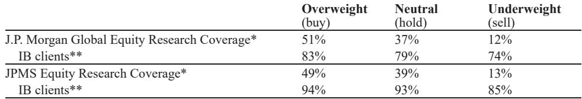

# 半导体设备股的真正信号不在利润，而在订单的结构性重置

市场正在错误地聚焦Ulvac的利润下修，却忽略了这份财报中一个更具长期含义的信号：订单指引的上调幅度远超预期。当一家设备商愿意在利润大幅缩水的同时，将全年订单目标从增长24%上调至增长37%，这意味着它看到的不是短期波动，而是需求端正在发生某种结构性变化。对于关注日本半导体设备板块的投资者而言，真正需要追问的问题不是“利润为什么下调”，而是“这批订单从何而来，又将如何重塑2027年的收入格局”。

某外资投行在5月12日发布的Ulvac财报解读中，清晰地揭示了这一矛盾。3Q销售额环比下降5%，营业利润仅环比增长1%，全年利润指引从285亿日元大幅下调至190亿日元，其中包括约58亿日元的一次性因素，主要与电动汽车相关成本有关。表面上看，这是一份令人失望的财报。但订单数据讲述了一个完全不同的故事：3Q订单环比增长29%，同比增长108%，全年订单指引从2800亿日元上调至3100亿日元，这意味着Ulvac预计本财年订单将创历史新高。

这组数据合在一起，指向一个不常被讨论的结论：半导体设备行业的景气判断，正在从“利润驱动”转向“订单驱动”。利润反映的是过去和当下的经营效率，订单反映的则是未来12至18个月的收入确定性。当订单增速与利润增速出现如此明显的背离，市场需要重新思考，究竟哪个指标更能代表这个周期的真实方向。

## 1. 利润下修主要来自非核心业务的一次性冲击，而非半导体设备基本面的恶化

Ulvac将全年利润指引下调了约95亿日元，其中58亿日元被明确归因于一次性因素，主要是电动汽车相关业务的成本。这意味着，如果剔除这部分非核心业务的拖累，半导体设备业务的利润表现并未出现同等幅度的恶化。某外资投行在分析中也指出，下修幅度虽然“有些大”，但主要来自这些一次性项目。

这一判断的关键含义在于：市场如果简单地将Ulvac的利润下修解读为“半导体设备需求转弱”，就可能误判整个板块的景气位置。实际上，Ulvac的核心业务——半导体制造设备——的订单仍在加速增长。利润端的压力更多来自公司对非核心业务的主动清理，而非需求端的系统性收缩。

对于投资者而言，这意味着需要将Ulvac的财报拆解为两个独立的部分来观察：半导体设备业务的订单与收入趋势，以及非核心业务的一次性拖累。前者决定中长期增长路径，后者只是短期噪音。

## 2. 订单创历史新高的背后，是存储器、显示面板和稀土三条需求线的同步发力

Ulvac将全年订单指引上调至3100亿日元，创历史新高。某外资投行指出，增长主要来自三个方面：与AI应用相关的存储器订单大幅增长；显示面板订单因OLED尺寸扩大而持续强劲；工业设备订单则受益于稀土需求的急剧上升。

这三条需求线并非孤立存在。存储器订单的增长与AI基础设施建设的加速直接相关，HBM和高带宽DRAM的扩产需求正在拉动相关设备采购。显示面板订单的增长则反映了OLED在IT和电视领域的渗透率提升，这同样是一个结构性趋势。稀土需求的上升则与新能源和国防应用相关，是一个独立的增长引擎。

这三条线同时发力，意味着Ulvac的订单增长并非依赖单一客户或单一应用，而是建立在多个结构性需求叠加的基础之上。这种多元化的订单结构，通常意味着更高的收入可见度和更低的周期波动风险。

## 3. 2026年的WFE市场共识是增长20%-30%，但二阶效应才是最值得关注的变量

某外资投行在报告中指出，许多设备相关公司预计2026年WFE（晶圆厂设备）市场将同比增长20%-30%。这一共识本身并不令人意外，市场对此已有充分预期。但真正值得关注的，是这一增长背后的二阶效应——即设备公司的利润率能否同步改善。

报告提到，许多SPE（半导体设备）相关公司预计，随着AI相关先进逻辑和DRAM应用的需求上升，利润率将有所改善。这一判断的逻辑在于：先进制程设备通常具有更高的单价和毛利率，当产品组合向先进制程倾斜时，即使收入增速不变，利润率也会自然提升。

但这里存在一个尚未被充分验证的假设：利润率改善的前提是，设备公司能够将规模增长转化为定价权和成本优势，而不是被客户压价或成本上升所抵消。Ulvac的案例表明，即使订单强劲，利润也可能因一次性因素和成本结构而承压。因此，2026年真正需要观察的，不是WFE市场能否增长20%-30%，而是设备公司能否在这一增长中实现利润率的实质性改善。

## 4. 报告尚未完全回答的关键问题：这批订单能否在2027年顺利转化为收入

Ulvac的订单指引上调意味着，公司预计本财年订单将达到历史新高。但订单转化为收入通常需要6至12个月，甚至更长。这意味着，这批订单的收入确认高峰将在2027财年。某外资投行也明确指出，这“可能提升对FY6/27增长的预期，届时这些订单将转化为销售额”。

然而，这里存在一个尚未被完全回答的问题：订单的转化率是否会受到客户产能规划变化、技术路线调整或地缘政治因素的干扰？2025年至2026年，全球半导体产能扩张的节奏仍存在不确定性，尤其是在中国市场的DRAM相关需求可能从2025财年推迟至2026财年，这一因素已经在Screen Holdings的预期中被提及。

因此，订单创历史新高固然是一个积极信号，但投资者需要关注的是，这些订单的交付时间表是否稳定，以及是否存在被推迟或取消的风险。这一问题在完整报告中可能有更详细的讨论，包括各主要客户的产能规划和时间节点。

## 5. 未来几周的其他设备股财报，将提供关键的交叉验证

某外资投行在报告中列出了未来几天即将发布财报的几家公司：Screen Holdings、Rigaku Holdings、Kioxia Holdings，以及材料相关的Sumitomo Osaka Cement。这些公司的财报将提供重要的交叉验证信息，帮助判断Ulvac的订单趋势是否具有行业普遍性。

具体来看，Screen Holdings的清洗设备预计将在先进应用的支持下实现超越市场的增长，但其成本增长幅度也需要关注。Rigaku的1Q通常是淡季，市场焦点在于2Q起多个量产项目的启动进展，包括Si/SiGe超晶格分析、高k/金属栅极超薄膜测量等。这些项目的进展将直接反映先进制程设备需求的真实强度。

对于投资者而言，未来几周的关键任务不是孤立地解读Ulvac的财报，而是将它与这些公司的财报放在一起，观察订单趋势、利润率变化和客户资本开支节奏是否一致。如果多家公司都出现订单加速增长但利润承压的模式，那么这个模式就具有行业层面的含义，而非个别公司的特例。

## 6. 一个更实用的观察框架：从“利润增速”转向“订单-收入转化效率”

基于Ulvac财报所揭示的矛盾，投资者可能需要调整对半导体设备股的观察框架。传统的估值方法往往以利润增速为核心，但在这个周期中，利润数据可能被一次性因素、汇率波动和成本结构变化所扭曲，反而失去信号价值。

一个更实用的框架是：关注订单增速与收入增速之间的差距，以及这一差距的收窄速度。如果订单增速持续高于收入增速，意味着未来收入增长的确定性在提升。如果这一差距开始收窄，则意味着订单正在顺利转化为收入，利润改善的条件开始成熟。

这一框架的另一个优势是，它能够帮助投资者区分“好周期”和“坏周期”。在好周期中，订单增长会同步带动利润率提升；在坏周期中，订单增长可能只是价格竞争的结果，利润率反而承压。Ulvac目前的情况处于两者之间——订单强劲，但利润因非核心因素承压。真正的拐点，将在订单转化为收入且利润率开始改善时出现。

---

Ulvac的财报揭示了一个正在发生的结构性变化：半导体设备行业的景气驱动因素，正在从“利润表现”转向“订单质量”。利润下修不是需求转弱的信号，而是非核心业务清理的代价。订单创历史新高，才是这个周期最值得关注的方向。

但正如前文所述，订单能否顺利转化为收入，以及利润率能否在2027年实现改善，仍是两个尚未完全回答的问题。这些问题的答案，可能隐藏在完整报告中对各主要客户产能规划、技术路线图和交付时间表的详细分析中。欢迎来星球微信群里继续讨论，我们将结合完整报告和后续财报数据，持续追踪这一判断的验证过程。

Personal reading notes and learning share only. Not investment advice.

