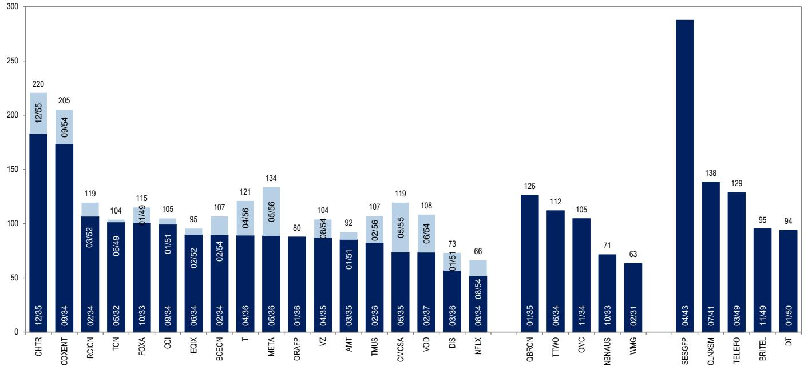
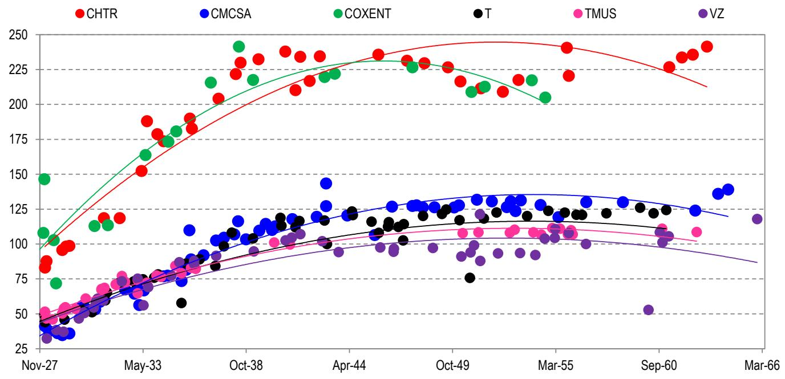

# The Great Broadband Bake Off

# U.S. Cable & Telecom Results & Reflections

- 1Q26 earnings across the Telecom & Cable sectors told a familiar but increasingly divergent story. The wireless carriers continued to execute well, with healthy sUBScriber trends, improving churn, and convergence strategies gaining traction, even as balance sheets remain in transition following a wave of acquisitions and elevated network investment. Cable operators, by contrast, continued to lose broadband sUBScribers at an uncomfortable pace, with top-of-funnel pressures showing few signs of structural relief.   
- Against this backdrop, we maintain a preference for Telecom over Cable. The wireless carriers offer more predictable cash flow profiles, credible delevering roadmaps, and demand tailwinds tied to mobility and fiber that we view as more durable than the pricing and bundling levers Cable is increasingly relying on to stabilize results.   
- Within Telecom, we continue to rate all three of the major carriers at Neutral. Fundamentals are generally moving in the right direction across AT&T, Verizon, and T-Mobile, but spreads across the group have compressed to the point where differentiation is limited and the risk-reward for adding exposure looks less compelling than it once did.   
- Charter is the one name in Cable where we see near-term value, though our Overweight rating on the IG Secured notes is a relative value call rather than a view that the fundamental picture has improved. The pending Cox acquisition adds footprint and synergy potential, and a more conservative capital allocation posture during integration should provide some near-term credit support.   
- Comcast screens as a more difficult name to own at current levels. Despite its higher ratings, spreads already reflect a best-case stabilization scenario that the underlying financials have not yet validated, and the company faces simultaneous pressures across broadband, streaming investment, and sports rights costs that limit near-term earnings visibility.   
- Longer-term, Cable sector consolidation remains an open question. This quarter, T-Mobile closed the door on any Cable transaction, at least for now, and the more plausible endgame in our view involves Comcast eventually separating its Media and Connectivity assets and combining the latter with Charter, though regulatory and leverage hurdles make that a multi-year rather than near-term conversation in our view.

Table 1: U.S. Cable & Telecom Comps 

<table><tr><td rowspan="2">Ticker</td><td rowspan="2">Issuer</td><td colspan="2">Reported Leverage</td><td rowspan="2">EV$ mns</td><td colspan="3">Ratings</td><td colspan="3">G-Spread (mid)</td></tr><tr><td>Gross</td><td>Net</td><td>Moody&#x27;s</td><td>S&amp;P</td><td>Fitch</td><td>5yr</td><td>10yr</td><td>30yr</td></tr><tr><td>CHTR</td><td>Charter Communications Inc</td><td>4.2x</td><td>4.2x</td><td>114,638</td><td>Ba1</td><td>BBB-</td><td>BBB- *+</td><td>97</td><td>181</td><td>221</td></tr><tr><td>CMCSA</td><td>Comcast Corp</td><td>2.6x</td><td>2.4x</td><td>174,876</td><td>A3</td><td>A-</td><td>A-</td><td>68</td><td>72</td><td>119</td></tr><tr><td>COXENT</td><td>Cox Communications Inc</td><td>5.0x</td><td>5.0x</td><td>N/A</td><td>Baa2 *-</td><td>BBB *-</td><td>BBB+ *-</td><td>112</td><td>173</td><td>203</td></tr><tr><td>TMUS</td><td>T-Mobile US Inc</td><td>2.5x</td><td>2.4x</td><td>324,517</td><td>Baa1</td><td>BBB+</td><td>BBB+</td><td>73</td><td>82</td><td>109</td></tr><tr><td>T</td><td>AT&amp;T Inc</td><td>3.0x</td><td>2.7x</td><td>335,353</td><td>Baa2</td><td>BBB</td><td>BBB+ *-</td><td>59</td><td>89</td><td>123</td></tr><tr><td>VZ</td><td>Verizon Communications Inc</td><td>3.4x</td><td>3.2x</td><td>385,550</td><td>Baa1</td><td>BBB+</td><td>A-</td><td>58</td><td>92</td><td>112</td></tr></table>

Source: Company reports & Bloomberg Finance L.P.

North American Corporate Credit – Tech, Media, & Telecom (IG)

Erica R Spear AC

(1-212) 834-4143

erica.spear@jpmchase.com

JPM Securities LLC

Table 2: IG Cable & Telco Ratings 

<table><tr><td>T</td><td>AT&amp;T</td><td>N</td></tr><tr><td>CHTR</td><td>Charter Communications (IG)</td><td>OW</td></tr><tr><td>CMCSA</td><td>Comcast</td><td>UW</td></tr><tr><td>TMUS</td><td>T-Mobile US Inc.</td><td>N</td></tr><tr><td>VZ</td><td>Verizon Communications</td><td>N</td></tr></table>

Source: JPM.

# Sector & Relative Value Views

1Q results across U.S. Telecom were mostly constructive, with operators delivering steady wireless performance, improving customer metrics, and stable to slightly better cash generation, even as elevated capex and near-term leverage remain part of the story. Management commentary across the group pointed to continued strength in mobility, disciplined promotions, and growing benefits from convergence strategies that are supporting churn and ARPU stability and long-term customer value, alongside clearer visibility into de-levering paths despite ongoing investment and selective M&A. In contrast, Cable results were more mixed to weaker, with broadband sUBScriber trends continuing to deteriorate amid intense competition from fixed wireless and fiber, and a still-muted housing backdrop weighing on gross additions. While underlying churn and ARPU dynamics remain relatively stable and wireless bundling is providing some offset, near-term EBITDA and growth visibility remains pressured by pricing actions, promotional intensity, and ongoing investment, leaving the sector more reliant on execution and future stabilization to support the credit story.

As such, we continue to prefer U.S. Telecom over Cable as the sector offers a more stable and visible credit trajectory supported by resilient wireless fundamentals, clearer paths to de-levering, and improving convergence-driven economics, while Cable faces more structural and execution-driven headwinds that limit confidence in forward cash flow durability. Across the Telecom cohort, operators are demonstrating steady service revenue growth, improving churn, and tangible benefits from bundling wireless with fiber and fixed wireless, which is supporting lifetime customer value and driving a more predictable FCF profile alongside defined leverage targets and disciplined capital allocation frameworks. Cable operators continue to face persistent broadband sUBScriber losses driven by fixed wireless sUBStitution, fiber overbuild, and a muted housing backdrop, with growth increasingly reliant on pricing and bundling strategies that pressure ARPU and near-term EBITDA. At the same time, Cable balance sheets remain more levered and more sensitive to execution, particularly as capital allocation remains skewed toward shareholder returns, raising the risk of slower de-levering in a declining or uncertain top-line environment. While select near-term catalysts such as M&A synergies and capex normalization may support FCF, we view these as less durable than the structural demand tailwinds in Telecom tied to mobility, fiber expansion, and convergence, leading us to favor Telecom as offering a more balanced risk-reward with stronger visibility.

At a high level, our ratings across AT&T, Verizon, and T-Mobile reflect that more constructive view on the Telecom sector's underlying credit stability, though tempered by valuations that largely capture improving fundamentals, while our stance on Charter and Comcast reflects a more cautious view on Cable given weaker growth visibility and greater execution risk. Within Telecom, we remain Neutral on the Big Three as steady wireless performance, convergence benefits, and defined de-levering paths support the credit story, but spreads across the group have traded broadly flat and leave limited room for meaningful outperformance without a clearer inflection in leverage or growth. On Cable, our views diverge based on valuation and structure, with a more constructive stance on Charter's secured debt driven by relative value and near-term catalysts, despite structural headwinds, while Comcast remains an Underweight given tight spreads relative to both Cable and Telecom peers alongside ongoing transition risk in its operating model.

The steady decline of the Cable sector over the past \~five years has led many to speculate about the future of the industry and the potential pathways toward consolidation. The early phases have already begun, as demonstrated by Charter's pending acquisition of Cox, though the belief has been that there will eventually be more significant consolidation among the bigger players. T-Mobile acquiring Charter is one idea that has been pushed for years, though this quarter T-Mobile definitively stated that it has no interest in acquiring any Cable assets, noting that it will not pursue scale for the sake of scale. In our view, a more likely answer is that Comcast will eventually split its Cable and Media assets and combine its Cable business with Charter's. On the merits, a combined Comcast/Charter entity would create a true national broadband incumbent, consolidating overlapping capex programs, eliminating duplicate network investments, and generating meaningful scale efficiencies across programming, wireless, and equipment procurement. The structure would likely mirror what Comcast has already telegraphed comfort with through Versant, spinning the NBCU media assets into a separately traded entity and leaving a pure-play connectivity business. In fact, Comcast recently explored an alternative version of this strategy when it participated in the bidding process for the WBD streaming and studio assets, and it is our belief that Comcast would need to have at least one transaction lined up for either side of the business in order to justify a split. The challenge is where to begin with regulatory hurdles, as a combined Comcast/Charter entity would serve a majority of the U.S. broadband footprint, and while the two systems are largely non-overlapping geographically, antitrust scrutiny in a broadband-consolidation context would likely be intense regardless of administration. Leverage is a secondary but real constraint, with Charter already carrying elevated leverage, a transaction of this scale would likely require either a stock-heavy structure or meaningful asset sales. Recent commentary from Charter has suggested that the firm is willing to explore all potential consolidation opportunities, and Comcast's management team has signaled a similar willingness, though they did say that the firm is focused on itself for now. While we do not necessarily expect this to be a near-term priority, we do expect Cable consolidation chatter to get even louder as we near the end of the decade.

Figure 1: Telecommunications & Media Benchmark 10s30s G-Spreads   

bar_stacked

| Category | Value 1 | Value 2 |
| :--- | :--- | :--- |
| CHTR | 180 | 1255 |
| COXENT | 173 | 954 |
| RCICN | 106 | 52 |
| TCN | 101 | 49 |
| FOXA | 100 | 49 |
| OCI | 99 | 51 |
| EQIX | 92 | 52 |
| BCECN | 106 | 54 |
| T | 117 | 56 |
| META | 134 | 56 |
| ORAFP | 87 | 36 |
| VZ | 104 | 54 |
| AMT | 83 | 51 |
| TMUS | 107 | 56 |
| CMCSA | 119 | 55 |
| VOD | 108 | 54 |
| DIS | 73 | 51 |
| NFLX | 66 | 54 |
| QBRCN | 126 | 35 |
| TTWO | 112 | 34 |
| OMC | 105 | 34 |
| NBNAUS | 71 | 33 |
| WMG | 63 | 31 |
| SESGFP | 287 | 43 |
| CLNXSM | 138 | 41 |
| TELEFO | 129 | 49 |
| BRITEL | 95 | 49 |
| DT | 94 | 50 |

Spreads as of 11 May 2026. Cash prices adjusted by 0.17bp per cash point.   
Source: JPM & Bloomberg Finance L.P.

Figure 2: U.S. Telco & Cable G-Spread Curves   

scatter

| Date    | CHTR | CMCSA | COXENT | T   | TMUS | VZ  |
|---------|------|-------|--------|-----|------|-----|
| Nov-27  | 85   | 35    | 145    | 40  | 50   | 30  |
| May-33  | 185  | 60    | 175    | 70  | 75   | 60  |
| Oct-38  | 230  | 110   | 240    | 100 | 100  | 90  |
| Apr-44  | 235  | 125   | 225    | 110 | 110  | 100 |
| Oct-49  | 225  | 130   | 210    | 120 | 115  | 110 |
| Mar-55  | 240  | 135   | 205    | 125 | 115  | 105 |
| Sep-60  | 230  | 130   | -      | 120 | 110  | 55  |
| Mar-66  | -    | -     | -      | -   | -    | 115 |

Spreads as of 11 May 2026. Cash prices adjusted by 0.17bp per cash point.   
Source: JPM & Bloomberg Finance L.P.

# AT&T

- AT&T posted strong 1Q results, with modest upside versus estimates for key headline metrics, while reaffirming prior FY26 guidance and signaling improving momentum throughout the balance of the year. Results reflected continued resilience in wireless, steady fiber execution, and early benefits from pricing and cost actions, offset by still-elevated investment levels tied to network expansion. Management maintained a constructive tone on convergence, broadband growth, and balance sheet repair, though leverage is set to rise near-term as strategic transactions close.   
- We remain Neutral on AT&T as current spreads already reflect improving execution, including steady wireless net adds, fiber growth, cost actions, and solid FCF generation. While management has outlined a credible de-levering path, leverage remains higher than that of Verizon or T-Mobile, with Lumen and EchoStar funding needs likely to keep issuance elevated and balance sheet progress gradual. With spreads essentially flat to Verizon and T-Mobile for months now, we see limited room for meaningful outperformance absent a clearer leverage inflection. Within the group, AT&T's long end offers the best relative value, though still not enough to drive a more constructive stance. Risks to our rating include faster-than-expected de-levering or spread widening that creates relative value upside, or, conversely, heavier-than-expected spectrum acquisition and issuance, or weaker competitive trends.   
- Financials. Headline results broadly exceeded Street estimates, with revenue (\$31.51bn vs. \$31.25bn), adj. EBITDA (\$11.98bn vs. \$11.79bn), and EPS (\$0.54/share vs. \$0.55/share) outperforming. Capex of \$4.88bn (vs. \$5.08bn) came in below consensus, supporting FCF of \$2.51bn (vs. \$2.43bn). However, FCF still fell \$600mn y/y due to higher capex from accelerated fiber deployment. Under the new reporting structure, Advanced Connectivity generated over 90% of revenue and EBITDA, while Advanced Home Internet grew 27% y/y.   
- Guidance. Management reaffirmed prior FY26 guidance and expressed confidence in a stronger cadence through the year, driven by improving service revenue and EBITDA trends as pricing actions flow through, convergence scales, and cost initiatives advance. The company continues to expect low-single-digit service revenue growth and 3-4% adj. EBITDA growth, with EBITDA growth improving in 2Q as comparisons normalize and incremental cost actions are implemented. On cash generation, the firm guided to \$4.0-4.5bn of 2Q FCF and reiterated \$18bn+ for the year.   
- Capital Allocation & Balance Sheet. AT&T ended 1Q with \$138bn of long-term debt and \$12bn of cash. Net leverage rose to 2.7x from 2.5x at 4Q and is expected to increase to \~3.2x after the EchoStar transaction, before declining to \~3.0x by YE26 and returning to the 2.5x target over the next three years. The firm also expects to close a minority stake sale of its Lumen fiber assets in 2H. Management emphasized continued network investment in fiber and 5G alongside shareholder returns and a defined leverage path. The firm repurchased \$2.3bn shares and paid \~\$2bn of dividends in 1Q, reiterated its \$8bn buyback plan for this year, and signaled a steady pace through 2028 as part of its \$45bn return target. Following results, AT&T issued \$6bn of senior notes, bringing YTD issuance to \$12.5bn and chipping away at what could be nearly \$20bn of supply tied to the Lumen and EchoStar transactions and refinancing needs.

\- Mobility. Wireless service revenue grew 1.7% y/y and postpaid phone net adds (+294k vs. +269k) beat expectations, while postpaid phone churn improved q/q to 0.89% from 0.98% in 4Q. Postpaid phone ARPU of \$56.51 was flat y/y as the company targeted underpenetrated value segments and expanded converged accounts that carry discounts but offer stronger retention. Management reiterated expectations for 2-3% MSR growth in FY26 and said 2Q should improve q/q, supported by refreshed unlimited and converged plans and April pricing actions. Churn normalization was framed as a function of the base shifting toward converged relationships. Management also signaled a rebalancing of the wireless model away from being over-indexed to device sUBSidies and toward network value, with added spectrum viewed as a catalyst for growth, retention, and broader FWA access.

\- Broadband & Fiber. Fiber net adds of +292k were modestly below expectations of +293k, while Internet Air net adds of +239k trailed expectations of +242k. Management nevertheless continued to frame broadband as a core growth engine, led by fiber build and FWA, Citing 27% y/y growth in Advanced Home Internet service revenue. The acquisition of Lumen's fiber business closed in 1Q, adding \~650bps to revenue growth, 1.1mn fiber customers, and 4mn+ fiber locations. The company reiterated plans to expand fiber reach by \~8mn locations this year, remain on track for 60mn+ locations by 2030, and improve fiber net adds throughout the year. Management also highlighted attractive fiber economics that support more value-oriented go-to-market moves and deeper wireless-broadband convergence. On Cable MVNOs, the company said it remains selective and does not intend to provide wholesale access without commercial and operating discipline.

\- Broadband Network Maturation. Management highlighted maturation dynamics, arguing that moving penetration from 40% to 50% will require more value-segmented offers and could rationally dilute ARPU in exchange for accretive sUBScriber growth. DSL feedstock is diminishing, while recent fiber growth is increasingly driven by new customer acquisition. Longer term, leadership tied upside to copper retirement as a path to lower costs and higher profitability, noting approvals to discontinue legacy services in 30%+ of wire centers. Additional shutdowns are expected, and related savings are already embedded in guidance.

\- Convergence. Management continued to emphasize convergence between Wireless and Broadband as the best lever to improve churn and customer economics. The thesis is that bundled fixed and mobile offerings drive account growth, lower churn, and stronger long-term value. Churn normalization was again framed as a mathematical outcome as the base shifts toward asset-based relationships anchored on fiber where available and Internet Air where appropriate. AT&T's convergence rate reached 45% in 1Q, and management highlighted OneConnect as a platform to simplify multi-device connectivity under one sUBScription, require fiber broadband, and shift competition toward network value rather than sUBSidies. The Lumen fiber acquisition was also framed as an accelerant by expanding fiber reach and improving returns as availability scales.

\- Satellite & Spectrum. Leadership discussed spectrum mainly through the planned EchoStar transaction, Citing early benefits in markets where leased spectrum has already been deployed, including better network perception that should support wireless growth and retention over time. Added capacity was also tied to convergence by enabling Internet Air distribution, supporting enterprise bids outside the fiber footprint, and establishing relationships in markets expected to receive fiber later. The firm did not comment on the upcoming AWS-III auction given the quiet period. Management portrayed satellite, particularly LEO direct-to-device, as an

innovation that can expand the connectivity market through always-on coverage while posing limited near-term risk to the core broadband franchise. Leadership reiterated plans to integrate satellite through wholesale partnerships, highlighted work with AST Space Mobile, and expects multiple constellations to ultimately provide robust direct-to-device service in the U.S.

# T-Mobile

\- T-Mobile delivered a solid 1Q print that reinforced the company's position as the current operating leader in U.S. wireless, with upside across profitability, FCF, and FY26 guidance supported by continued postpaid account growth, healthy ARPA trends, and expanding broadband scale. Management's commentary pointed to sustained commercial growth, disciplined promotional activity, and improving economics across both FWA and fiber. The firm also inked two new fiber JVs and indicated that it might pursue that strategy further going forward, though management notably poured cold water on a potential Cable merger down the road.

\- We remain Neutral on T-Mobile as the company continues to execute well operationally, with healthy wireless momentum, improving broadband scale, modestly higher guidance, and a shareholder-friendly but still manageable capital allocation framework. That said, much of the credit story now appears reflected in valuations, with spreads across the Big Three trading broadly flat for months despite meaningfully different business mixes, leverage profiles, and capital return priorities. While T-Mobile arguably deserves a premium for growth and execution, investors are also underwriting a more aggressive buyback posture, expanding fiber ambitions, and a capital structure with less natural de-levering urgency than peers. In that context, we see limited relative value opportunity at current levels. Risks to our rating include sustained premium wireless growth or faster-than-expected broadband monetization, leading to tighter spreads; or, conversely, more aggressive buybacks or re-levering M&A than we presently expect.

\- Financials. T-Mobile reported a modestly better 1Q print, with revenue (\$18.83bn vs. \$18.82bn) in line, while core EBITDA (\$9.24bn vs. \$9.05bn), EPS (\$2.27/share vs. \$2.01/share), and FCF (\$4.60bn vs. \$4.31bn) all exceeding consensus. Capex (\$2.62bn vs. \$2.49bn) was above expectations as network investment continued. The company also stopped reporting sUBScriber net additions this quarter, so postpaid phone and 5G broadband net adds were not disclosed.

\- Guidance. T-Mobile raised FY26 guidance across several metrics, Citing strong momentum and increasing differentiation. Management increased total postpaid net account additions to 975k at the midpoint from 950k and reiterated service revenue of \~\$77bn, implying \~8% growth. The company maintained FY postpaid ARPA growth of 2.5-3.0% and raised core EBITDA guidance to \$37.30bn at the midpoint from \$37.25bn, with 2Q core EBITDA expected to grow \~10% y/y. Cash capex guidance was unchanged at \~\$10bn, while FCF guidance increased to \$18.40bn at the midpoint from \$18.35bn.

\- Capital Allocation & Balance Sheet. T-Mobile ended 1Q with \$86bn of long-term debt and \$3.5bn of cash. Management reiterated a disciplined capital allocation framework focused on core investments, selective value-accretive M&A, and shareholder returns, while maintaining a returns-driven approach in adjacent areas such as fiber. The company repurchased \$4.9bn shares in 1Q, paid \~\$1.1bn of dividends, and increased its 2026 buyback authorization by up to \$3.6bn to a total of \$18.2bn. Management said future repurchases will be driven by discounts to intrinsic value rather than near-term trading levels. It also maintained its cash capex guidance and described the recently-announced fiber JVs as capital efficient.

\- M&A Headlines. Management was asked about reports that controlling shareholder Deutsche Telekom is discussing a potential combination with T-Mobile to create a simplified structure controlling both T and TMUS operations. CEO Srini Gopalan said the company does not comment on rumors, but noted that any such transaction would require approval from disinterested shareholders, suggesting a deal is unlikely in the near-term. CFO Peter Osvaldik also said the company remains pleased with its capital-light fiber JV strategy and would only pursue highly value-accretive broadband M&A. Regarding potential Cable M&A, Gopalan chimed in to note, "We're not going to do scale for scale's sake. Specifically, Cable is not something we're interested in. We see our strength as attacking incumbents rather than becoming an incumbent. We see a huge opportunity to attack incumbents across fiber and FWA, and that will be our key play." Lastly, reports from TMT Finance recently indicated that T-Mobile was exploring a buyout of Uniti with TPG Group, though this was not mentioned on the call.

\- Wireless. T-Mobile reported continued strength in wireless, with management Citing network quality, value, and customer experience as drivers of growth and monetization. The company reported postpaid net account additions of 217k, up 6% y/y, alongside postpaid ARPA growth of 3.9% and postpaid service revenue growth of 15% y/y. Management said promotions were heavy in January but eased in February and March, while maintaining a disciplined approach tied to customer lifetime value and premium plans, with over 60% of new account lines taking premium tiers. Postpaid phone churn was stable and up \~3bps, while higher account churn was attributed to a mix shift toward faster-growing broadband-only accounts and newer customers with structurally higher churn and fewer lines per account.

\- Broadband. Results were also strong, with management positioning the company as the fastest-growing ISP in the U.S. with more than 500k broadband net adds in 1Q and accelerating y/y 5G broadband net adds. Management reiterated a path to 15mn customers by 2030 based on capacity planning that assumes no additional spectrum purchases, no 6G, and no further spectral efficiency gains. The company also highlighted improving FWA metrics, including rising customer NPS, faster average speeds, and stronger router performance while serving materially more customers over the past three years. In fiber, management said existing JVs are performing to plan and reaffirmed a returns-focused approach centered on double-digit IRRs.

\- New Fiber JVs. On Wednesday, T-Mobile announced definitive agreements for two fiber JVs. The first is a 50/50 partnership with Oak Hill Capital to acquire and combine GoNetspeed and Greenlight Networks. The combined platform will expand T-Fiber across the Northeast, currently operates in eight states, and is expected to pass over 1.3mn households by YE26. The deal is expected to close in 1H27, with T-Mobile investing \~\$2bn for its 50% stake. The second is a 50/50 JV with Wren House to acquire i3 Broadband, which is expected to pass \~500k households across three states by YE26. The deal is expected to close in 2H26, with T-Mobile investing \~\$700mn for its 50% stake.

# Verizon

\- Verizon offered an improved 1Q print, particularly in the Wireless business, as the firm posted positive 1Q postpaid phone net adds for the first time in 13 years. Financial results, however, were more mixed as headline metrics met or fell slightly below consensus, though FCF did modestly outperform expectations. Within the broadband segment, sUBScriber metrics for Fios materially beat estimates, though FWA net adds were weaker than estimates. Management continued to emphasize a focus on returning to wireless sUBScriber growth in the near-term, and said that the integration of Frontier is well underway.

\- We remain Neutral on Verizon as improving operational execution and a clearer path to more durable cash generation are increasingly balanced by a still-elevated leverage profile and a competitive backdrop that limits near-term spread compression. The company is showing tangible progress in customer metrics, with better churn, more disciplined acquisition spend, and early benefits from bundling wireless with fiber and fixed wireless driving higher lifetime value. At the same time, the Frontier acquisition has pushed leverage higher in the near-term, and although management is committed to returning to its 2.0-2.25x target by 2027, that de-levering path relies on sustained execution and continued strong cash generation. Current spreads reflect fair value in our view, and we see little room for upside in a steep curve that has been trading roughly flat to peers AT&T and Verizon for months now. Risks to our rating include faster-than-expected churn improvement, convergence-driven ARPA growth, and sustained FCF enabling quicker de-levering and, conversely, renewed competitive intensity from cable and wireless peers, weaker-than-expected broadband or FWA execution, or slower de-levering progress than we presently expect.

\- Financials. 1Q financial results were broadly in-line, if not slightly below, estimates for revenue (\$34.44bn vs. \$34.82bn), adj. EBITDA (\$13.40bn vs. \$13.12bn), and EPS (\$1.21/share vs. \$1.21/share). Capex (\$4.20bn vs. \$4.03bn) came in slightly ahead of consensus, though FCF (\$3.78bn vs. \$3.66bn) slightly outperformed.

\- Guidance. Verizon raised select elements of its FY26 outlook on the back of what it described as strong 1Q execution and improving leading indicators, increasing adj. EPS growth guidance to 5-6% (from prior 4-5%) and indicating postpaid phone net adds should land in the upper half of its stated 750k-1mn range, while reaffirming Mobility and Broadband service revenue growth of 2-3%. Management also reiterated its prior FY26 \$16.25bn capex guidance, and its expectation for FCF of \$21.5bn+.

\- Capital Allocation & Balance Sheet. Verizon ended 1Q with \$172bn of long-term debt and \$8.4bn of cash and equivalents. Net leverage increased to 2.6x in 1Q following the close of the Frontier transaction, and management said that it has paid down about half of the Frontier debt since the acquisition closed, and it expects to repay sUBStantially all Frontier debt by YE. The company also affirmed its goal of returning net leverage to its 2.0-2.25x target range in the 2027 timeframe, supported by ongoing debt reduction. Management reiterated its capital allocation priorities, which include prioritizing investment in the business and network, maintaining a strong and growing dividend, strengthening the balance sheet, and share repurchases. The firm completed \$1.5bn share repurchases during 1Q and maintained its current plan to repurchase at least \$3bn shares this year.

\- Wireless. Verizon reported a constructive inflection in its wireless business in 1Q, highlighted by outperformance in postpaid phone net adds (+55k vs. -89k), marking the first time in 13 years that the firm has shown positive postpaid phone net adds in 1Q. This came alongside improving consumer postpaid phone churn of 0.90% (vs. 0.95% at 4Q), and the firm exited March below 0.85%, which management framed as evidence that recent customer experience actions are tightening the bottom of the funnel and supporting healthier growth quality. Wireless service revenue declined \~1% y/y, with management attributing \~80bps of pressure to customer credits tied to a January network outage and reiterating expectations that 1Q represented the low point for Mobility and Broadband service revenue growth in 2026 as promotional amortization headwinds fade with reduced reliance on expensive promotions. Management emphasized a shift toward account-based growth and higher value, including not giving away lines for free, using convergence and perks to support ARPA over time, and applying micro segmentation to be more surgical on retention and device sUBSidies, which it believes is structurally lowering cost of acquisition and retention and improving customer lifetime value, while noting upgrade volumes were up \~6% y/y but the growth rate has slowed in 2Q as customers hold onto phones longer and Verizon remains disciplined.

\- Broadband. Verizon reported strong broadband momentum in 1Q with Fios net adds (+127k vs. +51k) outperforming estimates significantly, though FWA net adds (+214k vs. +266k) came in below expectations. Strategically, management reiterated broadband and convergence as key growth vectors, maintained expectations to exceed 32mn fiber passings by year-end, and referenced a medium-term ambition to drive the fiber footprint to 40-50mn passings, positioning it as a priority where available given superior economics versus FWA while still expecting to push FWA aggressively with increased network capacity entering 2026. Verizon emphasized meaningful cross-sell headroom with only \~20% of its base taking broadband and noted that converged offers reduce wireless churn by \~30% while increasing lifetime value and ARPA, supporting management's expectation that broadband net adds will accelerate through 2026 as the Frontier integration progresses and go-to-market ramps, with leadership indicating that the prior 8-9mn FWA sUBS by 2028 frame should not be materially impacted even if the mix shifts towards fiber.

\- AI & Hyperscalers. A new narrative emerged as management framed AI as central to Verizon's competitive reset, stating an ambition to be an AI-native company and highlighting a multi-layer AI stack spanning data and intelligence, an agent development layer, runtime engines, and a control plan, with sUBStantial completion targeted by July and full completion by November, alongside partnerships with leading AI providers to accelerate deployment rather than building everything in-house. The company pointed to tangible operational use cases already in motion, including voice agents in customer service with a reported 1,280bp y/y improvement in customer SAT scores, AI enabled improvements across the software development lifecycle that it believes can lift delivery by more than $40\%$ and reduce vendor support costs by $70\%+$ , and broad network automation with $85\%$ of issues resolved autonomously plus more than \$200mn in energy savings and material simplification of network deployment kits. On the revenue side, management said it is in deep discussions with hyperscalers, alternative cloud providers, and large enterprises to integrate Verizon fiber and 5G assets to support AI infrastructure needs such as data center connectivity and training and inference, characterizing the opportunity as potentially multi-billions in revenue with more specifics expected over the next 3-6 months as AI workloads drive greater demand for edge computing and connectivity.

# Charter Communications

\- Charter posted a weak 1Q report as residential broadband net losses were materially higher than expected, alongside soft wireless net adds, leading shares to close down 26% at an all-time low following the print. Management cited pressure on broadband volumes and EBITDA as drivers of the miss, as the firm faces a backdrop characterized by intense competition, a muted housing backdrop, and convergence efforts across both Cable and Telecom. However, underlying trends were more stable than the headline results suggest, as low churn and steady ARPU helped offset topline softness, and the integration of Cox, coupled with a step-down in capex, underpin a more constructive medium-term FCF outlook, even if broadband sUBScriber metrics have entered an era of largely permanent decline.

\- We recently reinstated our rating on Charter's IG Secured notes at Overweight following a period of restriction, driven by relative value rather than fundamentals. Our view on Cable has turned more negative, and we have limited conviction in Charter's long-term trajectory given cord-cutting, elevated leverage, and rising fixed wireless competition. That said, near-term catalysts support spread compression. The pending Cox transaction expands the footprint, adds synergy potential, and increases the secured collateral base, while a lower leverage target and reduced buybacks during integration should support near-term credit metrics. Cable has also tended to act as a relative safe haven in periods of macro stress given its domestic, recurring revenue base, providing some downside protection. At current spreads, we believe investors are compensated for the uncertainty, and in a TMT market with limited carry, Charter remains one of the few names offering value. Risks to our rating include a weaker-than-expected Cox integration, faster broadband service declines, and a return to prioritizing buybacks over de-levering post-close.

\- Financials. Charter's 1Q revenue (\$13.60bn vs. \$13.55bn) and adj. EBITDA (\$5.64bn vs. \$5.63bn) both edged out Street consensus estimates, while capex (\$2.86bn vs. \$2.65bn) was slightly elevated, leading to weaker FCF (\$1.37bn vs. \$1.65bn).

\- Guidance. Charter's outlook reflects a cautious near-term operating environment balanced against confidence in longer-term cash flow expansion, with management expecting modest EBITDA growth in 2026 excluding transaction costs, supported in part by political advertising and ongoing cost discipline, though the trajectory remains sensitive to pricing and promotional decisions across broadband. Broadband ARPU is expected to remain roughly stable on a full year basis as the company continues to trade off near-term pricing versus customer lifetime value, while sUBScriber trends will depend on improvements in top-of-funnel activity amid persistent competitive and housing-related headwinds. Capital expenditures are expected to remain elevated in 2026 before stepping down meaningfully in sUBSequent years as network investment cycles roll off, positioning the business for a step change in FCF. Management reiterated that execution against its convergence strategy, including mobile bundling and pricing migrations, alongside eventual normalization in the operating backdrop, should support a return to broadband growth over time, though we remain more skeptical.

\- Capital Allocation & Balance Sheet. Charter ended 1Q with \$517mn of cash and equivalents and \$94bn of long-term debt, reporting consolidated net leverage of 4.15x and secured net leverage of 2.95x. The firm's balance sheet and capital

allocation framework remain anchored in a levered equity model with a stated path to de-levering alongside continued shareholder returns. Management continues to prioritize share repurchases as its primary use of capital, demonstrated by nearly \$1bn of buybacks in 1Q, while also funding temporarily elevated capex tied to network evolution that is expected to step down meaningfully over time, supporting improved FCF generation. The company remains constructive on M&A, particularly within cable, viewing consolidation as strategically and financially attractive given increasing competition from national and global players, though the near-term focus is on closing and integrating the Cox transaction. Importantly, Charter emphasized that its operating model and scale can drive both cost and revenue synergies in acquired assets, reinforcing its willingness to pursue additional transactions opportunistically.

\- Capital Allocation & Balance Sheet Going Forward. Charter's high debt load is manageable in a stable or growing business, but sUBScriber losses create ongoing pressure on revenue and EBITDA, weakening the leverage base. Reported net leverage sits at \~4.15x (2.95x secured), above market averages, and FCF strength partly reflects elevated capex rather than normalized earnings. As capex normalizes post-buildout and the Cox synergies are realized, the FCF expansion story is credible, but it is also highly sensitive to assumptions about broadband ARPU stability and sUBScriber trajectory that are genuinely difficult to underwrite with confidence. As such, the firm's capital allocation choices will matter enormously. A management team that directs FCF toward debt reduction in a declining top-line environment builds covenant headroom and extends the runway for credit stability. One that prioritizes buybacks, as Charter has historically done, concentrates risk at the bondholder level precisely when the fundamental backdrop warrants more conservatism. As such, we expect that Charter will need to further lower its leverage target in the near- or medium-term, and also scale back share repurchases in favor of maintaining a more conservative capital structure amid continued EBITDA declines.

\- Broadband. Residential broadband net adds materially missed expectations, as the firm reported -117k residential broadband net adds, versus consensus estimates of -94k. Charter's 1Q broadband results reflected continued pressure on sUBScriber growth despite stable underlying customer dynamics, with the company losing 120k internet customers as elevated competition from FWA, fiber overbuild, and mobile sUBStitution weighed on gross additions, partially offset by modest improvements in churn, which remains at historically low levels. Management characterized the environment as a top-of-funnel issue rather than a retention problem, noting that sales activity has been constrained by a muted housing backdrop and competitive intensity, while in-footprint share remains resilient even in mature fiber markets. Residential connectivity revenue still grew modestly y/y, supported by pricing actions and mobile bundling, though overall broadband ARPU was roughly flat as the company balanced customer lifetime value against near-term pricing and promotional decisions. Strategically, Charter continues to lead into convergence through bundled mobile and video offerings, pricing and packaging migrations, and product enhancements such as improved WiFi and service tools, with the goal of stabilizing broadband growth ovwer time despite near-term volume headwinds.

\- Wireless. The firm's wireless net adds also missed consensus, reporting +368k new sUBScribers versus a +436k estimate. The wireless business remained a relative bright spot in 1Q, with Spectrum Mobile continuing to scale but showing signs of moderating momentum as competitive intensity increased, adding \~370k lines in the quarter and maintaining double-digit y/y growth over the past year. Growth was driven by strong gross additions tied to the company's value proposition and

bundling strategy, though higher disconnect and aggressive device sUBSidy activity from the national carriers tempered net additions. Management continues to position mobile as a core component of its convergence strategy, using it to drive broadband acquisition, improve customer retention, and enhance overall household economics with bundled offerings and pricing guarantees designed to highlight savings versus incumbent telcos. The company emphasized ongoing product enhancements, including flexible upgrade programs, international plans, and seamless connectivity leveraging its hybrid network approach, while acknowledging that near-term growth will remain sensitive to promotional dynamics and competitive sUBSidy behavior across the broader wireless market.

\- Cox Merger. The pending Cox transaction remains central to Charter's strategic and financial outlook, with management highlighting a clear path to both operating and revenue synergies while reinforcing its long-term convergence strategy, as the deal has now received all required approvals aside from California and is tracking towards a summer close. The company expects \~\$800mn of run-rate opex synergies, driven by procurement efficiencies and cost alignment, with additional upside from applying Charter's pricing, packaging, and go-to-market model across the Cox footprint. Strategically, the transaction is framed as a growth opportunity rather than a consolidation exercise, with low mobile and video penetration at Cox providing a meaningful runway to drive higher customer ARPU and improve churn through bundled offerings, even as broadband pricing is reset lower. Management also pointed to incremental benefits from Cox's complementary B2B capabilities and well-maintained network, while reiterating that near-term leverage will remain around current levels before trending toward a targeted 3.5-3.75x range over time, supporting continued capital returns alongside integration execution.

# Comcast

\- Comcast reported a stronger-than-expected 1Q result, headlined by a meaningful inflection in broadband trends as the firm posted its first y/y broadband sUBScriber improvement since 2020 and meaningfully outperformed on wireless net adds. Growth was also driven by major live events like the Super Bowl and the Olympics, as well as continued momentum in parks, though the underlying performance reflects a business still in transition. Connectivity & Platforms showed early signs of stabilization as broadband losses improved and wireless growth accelerated, though pricing actions and bundling continue to pressure ARPU and EBITDA in the near-term. Overall, the results support management's view that strategic changes are gaining traction, but the company remains in an investment phase with a clearer earnings inflection not expected until later in the year.

\- We remain Underweight on Comcast given spreads that screen tight not only versus cable peers but also inside issuers like Meta and the Big Three Telecoms, which we view as difficult to justify in the context of Comcast's current earnings profile and execution risk. While management is showing early signs of stabilization in Connectivity & Platforms, the business remains in a transition phase with ongoing broadband sUBScriber pressure, ARPU dilution from pricing actions and wireless bundling, and near-term EBITDA headwinds tied to the go-to-market pivot. At the same time, Content & Experiences faces elevated investment and cost volatility, particularly from sports rights and streaming profitability ramp, which limits near term margin visibility. Against this backdrop, we see limited catalysts for material spread tightening from already tight levels, especially relative to peers with clear

growth trajectories, more stable margins, or stronger balance sheet narratives, leaving risk-reward skewed to the downside. Risks to our rating include faster-than-expected broadband stabilization and wireless monetization driving a quicker inflection in EBITDA and FCF.

- Financials. Headline metrics including revenue (\$31.46bn vs. \$30.41bn), adj. EBITDA (\$7.93bn vs. \$7.72bn), and EPS (\$0.79/share vs. \$0.72/share) all beat Street estimates, and lower-than-expected capex (\$2.40bn vs. \$2.62bn) enabled a FCF beat as well (\$3.90bn vs. \$3.04bn).   
- Guidance. Management framed the outlook as a transition year with continued investment and near-term pressure offset by improving trends as the year progresses, particularly within Connectivity & Platforms where the broadband repositioning and wireless bundling strategy is expected to drive stabilization before returning the business to revenue and EBITDA growth over time. Broadband ARPU and profitability are expected to remain under pressure in the near term due to pricing actions and free line dynamics, with some incremental pressure in 2Q before easing in 2H as customer cohorts begin to monetize. In Content & Experiences, 1Q marked the peak of NBA-related cost dilution, with profitability expected to improve q/q and Peacock approaching profitability in 2Q, supporting a more durable earnings profile going forward. More broadly, management highlighted confidence in converting free wireless lines to paid relationships, continued growth in convergence revenue over time, and sustained investment behind network, customer experience, and content, with the overall trajectory pointing to improved financial performance as execution gains traction through the year.   
- Capital Allocation & Balance Sheet. Comcast ended 1Q with \$94.61bn of total debt and \$9.5bn of cash and equivalents, leaving net leverage at 2.3x, within the firm's target range. Management reiterated its commitment to maintain leverage at this level over time, even as the Versant spin temporarily creates some upward pressure in the calculation. FCF generation remained strong during the quarter, supporting a balanced capital allocation framework that prioritizes organic investment across growth drivers while continuing to return capital to shareholders through dividends and share repurchases. The company returned a meaningful amount of capital in the quarter and over the past year, reflecting confidence in underlying cash generation despite ongoing investment in broadband repositioning, network upgrades, and content commitments. On M&A, management maintained a high bar for transformative transactions, emphasizing a focus on execution and organic improvement as the primary value driver, while remaining open to partnerships and selective opportunities that enhance scale or strategic positioning across connectivity, media, or mobile. This approach reflects a disciplined posture with flexibility to pursue value creation while preserving balance sheet strength and ratings stability.   
- Connectivity & Platforms. Segment revenue of \$19.96bn (vs. \$19.81bn) and adj. EBITDA of \$7.91bn (vs. \$7.86bn) edged out estimates, and sUBScriber metrics notably outperformed expectations as total broadband net adds of +10k beat estimates for -169k losses, marking the first y/y sUBS improvement since 2020, and the firm added 435k wireless sUBScribers (vs. +357k), its best quarter ever. The Connectivity & Platforms business delivered early signs of stabilization despite a still-intense competitive backdrop, with broadband trends improving meaningfully y/y as sUBScriber losses narrowed and connect activity, churn, and customer satisfaction all moved in the right direction. Management attributed the improvement to traction in its go-to-market pivot, including simpler pricing,

stronger marketing tied to large-scale events, and increased wireless bundling, with \~40% of the broadband base now on new packaging. Wireless remained a clear bright spot with record net additions, strong uptake of premium plans, and rising penetration, reinforcing its role in driving engagement and reducing churn, although the mix of free line offers and pricing changes pressured broadband ARPU and weighed on near-term EBITDA. Overall, convergence trends remain negative in the near-term but are supported by double-digit wireless service revenue growth and a sizable monetization opportunity as free lines convert to paid relationships in 2H, underpinning management's confidence in returning the business to revenue and EBITDA growth over time.

\- Content & Experiences. Segment revenue of \$11.94bn (vs. \$11.16bn) and adj. EBITDA of \$331mn (vs. \$109mn) also exceeded expectations, as Content & Experiences delivered strong top line growth driven by the outsized contribution from major live events, with the Olympics and Super Bowl generating significant incremental revenue and supporting elevated advertising demand, while underlying performance remained solid across media, parks, and studios. Media benefited from continued momentum at Peacock with sUBScriber growth and improving monetization, although profitability remains pressured in the near term by the first year of NBA rights costs, which are expected to moderate as the year progresses. Studios posted a strong quarter supported by content licensing and a successful film slate, reinforcing the importance of franchise driven earnings within the segment. Parks continued to perform well, led by strength in Orlando with higher attendance and per capita spending tied to Epic, partially offset by softer trends internationally amid macro and travel-related pressures. The segment reflects a mix of event-driven upside and ongoing investment, with management focused on leveraging scale across platforms and driving improved profitability, particularly in streaming, over time.

Analyst Certification: The Research Analyst(s) denoted by an “AC” on the cover of this report certifies (or, where multiple Research Analysts are primarily responsible for this report, the Research Analyst denoted by an “AC” on the cover or within the document individually certifies, with respect to each security or issuer that the Research Analyst covers in this research) that: (1) all of the views expressed in this report accurately reflect the Research Analyst’s personal views about any and all of the subject securities or issuers; and (2) no part of any of the Research Analyst's compensation was, is, or will be directly or indirectly related to the specific recommendations or views expressed by the Research Analyst(s) in this report. For all Korea-based Research Analysts listed on the front cover, if applicable, they also certify, as per KOFIA requirements, that the Research Analyst’s analysis was made in good faith and that the views reflect the Research Analyst’s own opinion, without undue influence or intervention.

All authors named within this report are Research Analysts who produce independent research unless otherwise specified. In Europe, Sector Specialists (Sales and Trading) may be shown on this report as contacts but are not authors of the report or part of the Research Department.

# Important Disclosures

• Market Maker/ Liquidity Provider: JPM is a market maker and/or liquidity provider in the financial instruments of/related to AT&T, Charter Communications, Comcast, T-Mobile US Inc., Verizon Communications or related entities.   
- Manager or Co-manager: JPM acted as manager or co-manager in a public offering of securities or financial instruments (as such term is defined in Directive 2014/65/EU) of/for AT&T, Charter Communications, Comcast, T-Mobile US Inc., Verizon Communications or related entities within the past 12 months.   
- Director: An employee of JPM or an executive officer or director of JPM Chase & Co. is an officer, director or advisory board member of Comcast or related entities.   
- Beneficial Ownership (1% or more): JPM beneficially owns 1% or more of a class of common equity securities of Charter Communications or related entities.   
- Client: JPM currently has, or had within the past 12 months, the following entity(ies) as clients: AT&T, Charter Communications, Comcast, T-Mobile US Inc., Verizon Communications or related entities.   
- Client/Investment Banking: JPM currently has, or had within the past 12 months, the following entity(ies) as investment banking clients: AT&T, Charter Communications, Comcast, T-Mobile US Inc., Verizon Communications or related entities.   
- Client/Non-Investment Banking, Securities-Related: JPM currently has, or had within the past 12 months, the following entity(ies) as clients, and the services provided were non-investment-banking, securities-related: AT&T, Charter Communications, Comcast, T-Mobile US Inc., Verizon Communications or related entities.   
- Client/Non-Securities-Related: JPM currently has, or had within the past 12 months, the following entity(ies) as clients, and the services provided were non-securities-related: AT&T, Charter Communications, Comcast, T-Mobile US Inc., Verizon Communications or related entities.   
- Investment Banking Compensation Received: JPM has received in the past 12 months compensation for investment banking services from AT&T, Charter Communications, Comcast, T-Mobile US Inc., Verizon Communications or related entities.   
- Potential Investment Banking Compensation: JPM expects to receive, or intends to seek, compensation for investment banking services in the next three months from AT&T, Charter Communications, Comcast, T-Mobile US Inc., Verizon Communications or related entities.   
• Non-Investment Banking Compensation Received: JPM has received compensation in the past 12 months for products or services other than investment banking from AT&T, Charter Communications, Comcast, T-Mobile US Inc., Verizon Communications or related entities.   
- Debt Position: JPM may hold a position in the debt securities of AT&T, Charter Communications, Comcast, T-Mobile US Inc., Verizon Communications or related entities, if any.   
- JPM Securities LLC and/or its affiliates is acting as financial advisor to Liberty Broadband Corp in connection with the acquisition by Charter Communications Corp as announced on 11/13/2024. The transaction is subject to regulatory approvals, approval of the stock issuance by holders of a majority of the votes cast by holders of Charter's outstanding stock, and stockholder approvals of: (i) majority of non-Liberty Broadband Charter stockholders; (ii) majority of voting power of Liberty Broadband; and (iii) majority of voting power of Liberty Broadband, excluding John C. Malone and certain others. This research report and the information contained herein is not intended to provide voting advice, serve as an endorsement of the proposed transaction or result in procurement, withholding or revocation of a proxy or any other action by a security holder.   
Company-Specific Disclosures: JPM does and seeks to do business with companies covered in its research reports. As a result, investors should be aware that the firm may have a conflict of interest that could affect the objectivity of this report. Investors should consider this report as only a single factor in making their investment decision. Important disclosures, including price charts and credit opinion history tables (if applicable), are available for compendium reports and all JPM-covered companies, and certain non-covered companies, by visiting https://www.jpmm.com/research/disclosures, calling 1-800-477-0406, or e-mailing research.disclosure.inquiries@JPM.com with your request.

# History of Investment Recommendations:

A history of JPM investment recommendations disseminated during the preceding 12 months can be accessed on the Research & Commentary page of http://www.JPMmarkets.com where you can also search by analyst name, sector or financial instrument.

AT&T - JPM Credit Opinion History 

<table><tr><td></td><td>Date</td><td>Action</td><td>Rating/Designation</td><td>Ticker/ISIN</td></tr><tr><td>Issuer</td><td>25 Mar 24</td><td>Downgrade</td><td>Neutral</td><td>T</td></tr><tr><td>Issuer</td><td>31 Jul 24</td><td>Upgrade</td><td>Overweight</td><td>T</td></tr><tr><td>Issuer</td><td>10 Jul 25</td><td>Downgrade</td><td>Neutral</td><td>T</td></tr><tr><td>4.350% &#x27;29 *</td><td>25 Mar 24</td><td>Downgrade</td><td>Neutral</td><td>US00206RHJ41</td></tr><tr><td>4.350% &#x27;29 *</td><td>31 Jul 24</td><td>Upgrade</td><td>Overweight</td><td>US00206RHJ41</td></tr><tr><td>4.350% &#x27;29 *</td><td>10 Jul 25</td><td>Downgrade</td><td>Neutral</td><td>US00206RHJ41</td></tr><tr><td>2.625% &#x27;22</td><td>22 Oct 16</td><td>—</td><td>Not Rated</td><td>US00206RBN17</td></tr><tr><td>3.900% &#x27;24</td><td>19 Aug 19</td><td>Terminate</td><td>Not Covered</td><td>US00206RCE09</td></tr></table>

Charter Communications - JPM Credit Opinion History 

<table><tr><td></td><td>Date</td><td>Action</td><td>Rating/Designation</td><td>Ticker/ISIN</td></tr><tr><td>Issuer</td><td>17 May 24</td><td>Upgrade</td><td>Overweight</td><td>CHTR</td></tr><tr><td>Issuer</td><td>13 Nov 24</td><td>Withdrawn</td><td>Not Rated</td><td>CHTR</td></tr><tr><td>Issuer</td><td>20 Apr 26</td><td>Restored</td><td>Overweight</td><td>CHTR</td></tr><tr><td>5.050% '29 (IG) *</td><td>17 May 24</td><td>Upgrade</td><td>Overweight</td><td>US161175BR49</td></tr><tr><td>5.050% '29 (IG) *</td><td>13 Nov 24</td><td>Withdrawn</td><td>Not Rated</td><td>US161175BR49</td></tr><tr><td>5.050% '29 (IG) *</td><td>20 Apr 26</td><td>Restored</td><td>Overweight</td><td>US161175BR49</td></tr><tr><td>3.750% 1st Lien due 2028 (IG)</td><td>07 Dec 17</td><td>Terminate</td><td>Not Covered</td><td>US161175BE36</td></tr><tr><td>4.000% Sr Unec due 2023</td><td>05 Apr 24</td><td>Terminate</td><td>Not Covered</td><td>US1248EPBZ52</td></tr><tr><td>4.200% '28 (IG)</td><td>01 Oct 19</td><td>Terminate</td><td>Not Covered</td><td>US161175BK95</td></tr><tr><td>4.250% Sr Unsec due 2031</td><td>13 Nov 24</td><td>Withdrawn</td><td>Not Rated</td><td>US1248EPCK74</td></tr><tr><td>4.250% Sr Unsec due 2031</td><td>20 Apr 26</td><td>Restored</td><td>Underweight</td><td>US1248EPCK74</td></tr><tr><td>4.2500% Sr Unsec due 2034</td><td>13 Nov 24</td><td>Withdrawn</td><td>Not Rated</td><td>US1248EPCP61</td></tr><tr><td>4.2500% Sr Unsec due 2034</td><td>20 Apr 26</td><td>Restored</td><td>Underweight</td><td>US1248EPCP61</td></tr><tr><td>4.5% Sr Unsec Nts due 2030</td><td>13 Nov 24</td><td>Withdrawn</td><td>Not Rated</td><td>US1248EPCE15</td></tr><tr><td>4.5% Sr Unsec Nts due 2030</td><td>20 Apr 26</td><td>Restored</td><td>Underweight</td><td>US1248EPCE15</td></tr><tr><td>4.500% Sr Unsec due 2032</td><td>13 Nov 24</td><td>Withdrawn</td><td>Not Rated</td><td>US1248EPCJ02</td></tr><tr><td>4.500% Sr Unsec due 2032</td><td>20 Apr 26</td><td>Restored</td><td>Underweight</td><td>US1248EPCJ02</td></tr><tr><td>4.500% Sr Unsec due 2033</td><td>13 Nov 24</td><td>Withdrawn</td><td>Not Rated</td><td>US1248EPCL57</td></tr><tr><td>4.500% Sr Unsec due 2033</td><td>20 Apr 26</td><td>Restored</td><td>Underweight</td><td>US1248EPCL57</td></tr><tr><td>4.750% Sr Unec due 2030</td><td>13 Nov 24</td><td>Withdrawn</td><td>Not Rated</td><td>US1248EPCD32</td></tr><tr><td>4.750% Sr Unec due 2030</td><td>20 Apr 26</td><td>Restored</td><td>Underweight</td><td>US1248EPCD32</td></tr><tr><td>4.750% Sr Unsec due 2032</td><td>24 Apr 26</td><td>Initiate</td><td>Underweight</td><td>US1248EPCQ45</td></tr><tr><td>4.908% 1st Lien due 2025 (IG)</td><td>22 Aug 17</td><td>Terminate</td><td>Not Covered</td><td>US161175AT14</td></tr><tr><td>5.000% Sr Unec due 2028</td><td>13 Nov 24</td><td>Withdrawn</td><td>Not Rated</td><td>US1248EPBX05</td></tr><tr><td>5.000% Sr Unec due 2028</td><td>20 Apr 26</td><td>Restored</td><td>Underweight</td><td>US1248EPBX05</td></tr><tr><td>5.125% Sr Unsec due 2023</td><td>29 May 20</td><td>Terminate</td><td>Not Covered</td><td>US1248EPAZ61</td></tr><tr><td>5.125% Sr Unsec due 2027</td><td>13 Nov 24</td><td>Withdrawn</td><td>Not Rated</td><td>US1248EPBT92</td></tr><tr><td>5.125% Sr Unsec due 2027</td><td>20 Apr 26</td><td>Restored</td><td>Underweight</td><td>US1248EPBT92</td></tr><tr><td>5.25% Sr Unsec due 2021</td><td>29 May 20</td><td>Terminate</td><td>Not Covered</td><td>US1248EPBB84</td></tr><tr><td>5.25% Sr Unsec due 2022</td><td>29 May 20</td><td>Terminate</td><td>Not Covered</td><td>US1248EPAY96</td></tr><tr><td>5.375% Sr Unec due 2029</td><td>13 Nov 24</td><td>Withdrawn</td><td>Not Rated</td><td>US1248EPCB75</td></tr><tr><td>5.375% Sr Unec due 2029</td><td>20 Apr 26</td><td>Restored</td><td>Underweight</td><td>US1248EPCB75</td></tr><tr><td>5.375% Sr Unsec due 2025</td><td>13 Nov 20</td><td>Terminate</td><td>Not Covered</td><td>US1248EPBG71</td></tr><tr><td>5.500% Sr Unsec due 2026</td><td>13 Nov 24</td><td>Withdrawn</td><td>Not Rated</td><td>US1248EPBR37</td></tr><tr><td>5.500% Sr Unsec due 2026</td><td>10 Apr 26</td><td>—</td><td>Not Covered</td><td>US1248EPBR37</td></tr><tr><td>5.75% Sr Unsec due 2023</td><td>29 May 20</td><td>Terminate</td><td>Not Covered</td><td>USU12501AJ84</td></tr><tr><td>5.75% Sr Unsec due 2024</td><td>29 May 20</td><td>Terminate</td><td>Not Covered</td><td>US1248EPBE24</td></tr><tr><td>5.750% Sr Unsec due 2026</td><td>20 Oct 21</td><td>Terminate</td><td>Not Covered</td><td>US1248EPBM40</td></tr><tr><td>5.875% Sr Unsec due 2024</td><td>13 Nov 20</td><td>Terminate</td><td>Not Covered</td><td>US1248EPBP70</td></tr><tr><td>5.875% Sr Unsec due 2027</td><td>01 Jul 21</td><td>Terminate</td><td>Not Covered</td><td>US1248EPBK83</td></tr><tr><td>6.375% Sr Unsec Nts due 2029</td><td>13 Nov 24</td><td>Withdrawn</td><td>Not Rated</td><td>US1248EPCS01</td></tr><tr><td>6.375% Sr Unsec Nts due 2029</td><td>20 Apr 26</td><td>Restored</td><td>Underweight</td><td>US1248EPCS01</td></tr><tr><td>6.484% 1st Lien due 2045</td><td>26 Jan 18</td><td>Terminate</td><td>Not Covered</td><td>US161175AP91</td></tr><tr><td>6.5% Sr Unsec due 2021</td><td>25 Jan 18</td><td>Terminate</td><td>Not Covered</td><td>US1248EPAU74</td></tr><tr><td>6.625% Sr Unsec due 2022</td><td>25 Jan 18</td><td>Terminate</td><td>Not Covered</td><td>US1248EPAX14</td></tr><tr><td>7% Sr Unsec due 2019</td><td>25 Jan 18</td><td>Terminate</td><td>Not Covered</td><td>US1248EPAS29</td></tr><tr><td>7.000% Sr Unsec due 2033</td><td>24 Apr 26</td><td>Initiate</td><td>Underweight</td><td>US1248EPCU56</td></tr><tr><td>7.25% Sr Unsec due 2017</td><td>25 Jan 18</td><td>Terminate</td><td>Not Covered</td><td>US1248EPAQ62</td></tr><tr><td>7.375% Sr Unsec due 2020</td><td>25 Jan 18</td><td>Terminate</td><td>Not Covered</td><td>US1248EPAW31</td></tr><tr><td>7.375% Sr Unsec due 2031</td><td>01 Jun 23</td><td>Initiate</td><td>Neutral</td><td>US1248EPCT83</td></tr><tr><td>7.375% Sr Unsec due 2031</td><td>13 Nov 24</td><td>Withdrawn</td><td>Not Rated</td><td>US1248EPCT83</td></tr><tr><td>7.375% Sr Unsec due 2031</td><td>20 Apr 26</td><td>Restored</td><td>Underweight</td><td>US1248EPCT83</td></tr><tr><td>7.375% Sr Unsec due 2036</td><td>24 Apr 26</td><td>Initiate</td><td>Underweight</td><td>US1248EPCV30</td></tr><tr><td>8.125% Sr Unsec due 2020</td><td>25 Jan 18</td><td>Terminate</td><td>Not Covered</td><td>US1248EPAP89</td></tr><tr><td>CDS</td><td>25 Jan 18</td><td>Terminate</td><td>Not Covered</td><td>—</td></tr></table>

Comcast - JPM Credit Opinion History 

<table><tr><td></td><td>Date</td><td>Action</td><td>Rating/Designation</td><td>Ticker/ISIN</td></tr><tr><td>Issuer</td><td>16 Jan 24</td><td>Downgrade</td><td>Underweight</td><td>CMCSA</td></tr><tr><td>Issuer</td><td>03 Jun 24</td><td>Upgrade</td><td>Neutral</td><td>CMCSA</td></tr><tr><td>Issuer</td><td>18 Nov 24</td><td>Downgrade</td><td>Underweight</td><td>CMCSA</td></tr><tr><td>1.5% &#x27;31 *</td><td>16 Jan 24</td><td>Downgrade</td><td>Underweight</td><td>US20030NDN84</td></tr><tr><td>1.5% &#x27;31 *</td><td>03 Jun 24</td><td>Upgrade</td><td>Neutral</td><td>US20030NDN84</td></tr><tr><td>1.5% &#x27;31 *</td><td>18 Nov 24</td><td>Downgrade</td><td>Underweight</td><td>US20030NDN84</td></tr><tr><td>2.350% &#x27;27</td><td>06 Apr 17</td><td>Terminate</td><td>Not Covered</td><td>US20030NBW02</td></tr><tr><td>2.85% Sr Unsec due 2023</td><td>21 Sep 16</td><td>Terminate</td><td>Not Covered</td><td>US20030NBF78</td></tr><tr><td>3.150% &#x27;26</td><td>19 May 17</td><td>Terminate</td><td>Not Covered</td><td>US20030NBS99</td></tr><tr><td>3.150% &#x27;28</td><td>22 Aug 19</td><td>Terminate</td><td>Not Covered</td><td>US20030NCA72</td></tr><tr><td>3.300% &#x27;27</td><td>07 Dec 17</td><td>Terminate</td><td>Not Covered</td><td>US20030NBY67</td></tr><tr><td>3.600% Sr Nts due 2024</td><td>21 Sep 16</td><td>Terminate</td><td>Not Covered</td><td>US20030NBJ90</td></tr><tr><td>4.150% &#x27;28</td><td>02 Dec 20</td><td>Terminate</td><td>Not Covered</td><td>US20030NCT63</td></tr><tr><td>4.5% Sr Unsec due 2043</td><td>21 Sep 16</td><td>Terminate</td><td>Not Covered</td><td>US20030NBG51</td></tr><tr><td>4.750% Sr Nts due 2044</td><td>21 Sep 16</td><td>Terminate</td><td>Not Covered</td><td>US20030NBK63</td></tr></table>

T-Mobile US Inc. - JPM Credit Opinion History 

<table><tr><td></td><td>Date</td><td>Action</td><td>Rating/Designation</td><td>Ticker/ISIN</td></tr><tr><td>Issuer</td><td>10 Jul 23</td><td>Downgrade</td><td>Neutral</td><td>TMUS</td></tr><tr><td>Issuer</td><td>29 Nov 23</td><td>Upgrade</td><td>Overweight</td><td>TMUS</td></tr><tr><td>Issuer</td><td>31 Jul 24</td><td>Downgrade</td><td>Neutral</td><td>TMUS</td></tr><tr><td>Issuer</td><td>10 Jul 25</td><td>Upgrade</td><td>Overweight</td><td>TMUS</td></tr><tr><td>Issuer</td><td>24 Mar 26</td><td>Downgrade</td><td>Neutral</td><td>TMUS</td></tr><tr><td>3.500% Sr Nts due 2031 *</td><td>10 Jul 23</td><td>Downgrade</td><td>Neutral</td><td>US87264ABW45</td></tr><tr><td>3.500% Sr Nts due 2031 *</td><td>29 Nov 23</td><td>Upgrade</td><td>Overweight</td><td>US87264ABW45</td></tr><tr><td>3.500% Sr Nts due 2031 *</td><td>31 Jul 24</td><td>Downgrade</td><td>Neutral</td><td>US87264ABW45</td></tr><tr><td>3.500% Sr Nts due 2031 *</td><td>10 Jul 25</td><td>Upgrade</td><td>Overweight</td><td>US87264ABW45</td></tr><tr><td>3.500% Sr Nts due 2031 *</td><td>24 Mar 26</td><td>Downgrade</td><td>Neutral</td><td>US87264ABW45</td></tr><tr><td>1.500% Sr Sec Nts due 2026 (IG)</td><td>25 Jul 22</td><td>Terminate</td><td>Not Covered</td><td>US87264ABG94</td></tr><tr><td>2.050% Sr Sec Nts due 2028 (IG)</td><td>25 Jul 22</td><td>Terminate</td><td>Not Covered</td><td>US87264ABH77</td></tr><tr><td>2.250% Sr Notes due 2026</td><td>25 Jul 22</td><td>Terminate</td><td>Not Covered</td><td>US87264ABR59</td></tr><tr><td>2.250% Sr Sec Nts due 2031 (IG)</td><td>25 Jul 22</td><td>Terminate</td><td>Not Covered</td><td>US87264ABP93</td></tr><tr><td>2.550% Sr Sec Nts due 2031 (IG)</td><td>25 Jul 22</td><td>Terminate</td><td>Not Covered</td><td>US87264ABJ34</td></tr><tr><td>2.625% Sr Notes due 2029</td><td>25 Jul 22</td><td>Terminate</td><td>Not Covered</td><td>US87264ABS33</td></tr><tr><td>2.625% Sr Nts due 2026</td><td>25 Jul 22</td><td>Terminate</td><td>Not Covered</td><td>US87264ABU88</td></tr><tr><td>2.875% Sr Notes due 2031</td><td>25 Jul 22</td><td>Terminate</td><td>Not Covered</td><td>US87264ABT16</td></tr><tr><td>3.000% Sr Sec Nts due 2041 (IG)</td><td>14 Dec 21</td><td>Terminate</td><td>Not Covered</td><td>US87264ABK07</td></tr><tr><td>3.300% Sr Sec Nts due 2051 (IG)</td><td>14 Dec 21</td><td>Terminate</td><td>Not Covered</td><td>US87264ABM62</td></tr><tr><td>3.375% Sr Nts due 2029</td><td>25 Jul 22</td><td>Terminate</td><td>Not Covered</td><td>US87264ABV61</td></tr><tr><td>3.500% Sr Sec Nts due 2025 (IG)</td><td>25 Jul 22</td><td>Terminate</td><td>Not Covered</td><td>US87264ABA25</td></tr><tr><td>3.600% Sr Sec Nts due 2060 (IG)</td><td>25 Jul 22</td><td>Terminate</td><td>Not Covered</td><td>US87264ABQ76</td></tr><tr><td>3.750% Sr Sec Nts due 2027 (IG)</td><td>25 Jul 22</td><td>Terminate</td><td>Not Covered</td><td>US87264ABC80</td></tr><tr><td>3.875% Sr Sec Nts due 2030 (IG)</td><td>25 Jul 22</td><td>Terminate</td><td>Not Covered</td><td>US87264ABE47</td></tr><tr><td>4.000% '22</td><td>19 Jul 22</td><td>Terminate</td><td>Not Covered</td><td>US87264AAR68</td></tr><tr><td>4.375% Sr Sec Nts due 2040 (IG)</td><td>25 Jul 22</td><td>Terminate</td><td>Not Covered</td><td>US87264AAX37</td></tr><tr><td>4.500% Sr Notes due 2026</td><td>14 Dec 21</td><td>Terminate</td><td>Not Covered</td><td>US87264AAU97</td></tr><tr><td>4.500% Sr Sec Nts due 2050 (IG)</td><td>25 Jul 22</td><td>Terminate</td><td>Not Covered</td><td>US87264AAY10</td></tr><tr><td>4.750% Sr Notes due 2028</td><td>25 Jul 22</td><td>Terminate</td><td>Not Covered</td><td>US87264AAV70</td></tr><tr><td>5.125% '25</td><td>04 Jun 21</td><td>Terminate</td><td>Not Covered</td><td>US87264AAS42</td></tr><tr><td>5.250% Sr Nts due 2018</td><td>02 Oct 17</td><td>Terminate</td><td>Not Covered</td><td>US87264AAA34</td></tr><tr><td>5.375% '27</td><td>25 Jul 22</td><td>Terminate</td><td>Not Covered</td><td>US87264AAT25</td></tr><tr><td>6.000% Sr Nts due 2023</td><td>04 Jun 21</td><td>Terminate</td><td>Not Covered</td><td>US87264AAM71</td></tr><tr><td>6.000% Sr Nts due 2024</td><td>04 Jun 21</td><td>Terminate</td><td>Not Covered</td><td>US87264AAQ85</td></tr><tr><td>6.125% Sr Nts due 2022</td><td>22 Jan 18</td><td>Terminate</td><td>Not Covered</td><td>US87264AAH86</td></tr><tr><td>6.250% Sr Nts due 2021</td><td>02 Oct 17</td><td>Terminate</td><td>Not Covered</td><td>US87264AAK16</td></tr><tr><td>6.375% Sr Nts due 2025</td><td>30 Sep 20</td><td>Terminate</td><td>Not Covered</td><td>US87264AAN54</td></tr><tr><td>6.464% Sr Nts due 2019</td><td>02 Oct 17</td><td>Terminate</td><td>Not Covered</td><td>US87264AAC99</td></tr><tr><td>6.5% Sr Nts due 2026</td><td>22 Apr 21</td><td>Terminate</td><td>Not Covered</td><td>US87264AAP03</td></tr><tr><td>6.500% Sr Nts due 2024</td><td>20 Aug 20</td><td>Terminate</td><td>Not Covered</td><td>US87264AAJ43</td></tr><tr><td>6.542% Sr Nts due 2020</td><td>02 Oct 17</td><td>Terminate</td><td>Not Covered</td><td>US87264AAF21</td></tr><tr><td>6.625% Sr Nts due 2020</td><td>02 Oct 17</td><td>Terminate</td><td>Not Covered</td><td>US591709AL49</td></tr><tr><td>6.625% Sr Nts due 2023</td><td>29 Apr 20</td><td>—</td><td>Not Covered</td><td>US591709AP52</td></tr><tr><td>6.633% Sr Nts due 2021</td><td>02 Oct 17</td><td>Terminate</td><td>Not Covered</td><td>US87264AAD72</td></tr><tr><td>6.731% Sr Nts due 2022</td><td>02 Oct 17</td><td>Terminate</td><td>Not Covered</td><td>US87264AAG04</td></tr><tr><td>6.836% Sr Nts due 2023</td><td>29 Apr 20</td><td>—</td><td>Not Covered</td><td>US87264AAE55</td></tr><tr><td>7.875% Sr Nts due 2018</td><td>02 Oct 17</td><td>Terminate</td><td>Not Covered</td><td>US591709AK65</td></tr><tr><td>L+300bp TLB due 2027</td><td>08 Jan 21</td><td>Terminate</td><td>Not Covered</td><td>—</td></tr><tr><td>S 11.500% Sr Nts due 2021</td><td>20 Dec 21</td><td>Terminate</td><td>Not Covered</td><td>US852061AM20</td></tr><tr><td>S 6.000% Sr Nts due 2022</td><td>25 Jul 22</td><td>Terminate</td><td>Not Covered</td><td>US852061AS99</td></tr><tr><td>S 6.875% Sr Nts due 2028</td><td>25 Jul 22</td><td>Terminate</td><td>Not Covered</td><td>US852060AD48</td></tr><tr><td>S 7.000% Sr Nts due 2020</td><td>04 Sep 20</td><td>Terminate</td><td>Not Covered</td><td>US852061AR17</td></tr><tr><td>S 7.125% Sr Nts due 2024</td><td>25 Jul 22</td><td>Terminate</td><td>Not Covered</td><td>US85207UAH86</td></tr><tr><td>S 7.250% Sr Nts due 2021</td><td>20 Dec 21</td><td>Terminate</td><td>Not Covered</td><td>US85207UAE55</td></tr><tr><td>S 7.625% Sr Notes due 2026</td><td>25 Jul 22</td><td>Terminate</td><td>Not Covered</td><td>US85207UAK16</td></tr><tr><td>S 7.625% SrNts due 2025</td><td>25 Jul 22</td><td>Terminate</td><td>Not Covered</td><td>US85207UAJ43</td></tr><tr><td>S 7.875% Sr Nts due 2023</td><td>14 Dec 21</td><td>Terminate</td><td>Not Covered</td><td>US85207UAB17</td></tr><tr><td>S 7.875% due 2023</td><td>25 Jul 22</td><td>Terminate</td><td>Not Covered</td><td>US85207UAF21</td></tr><tr><td>S 8.750% Sr Nts due 2032</td><td>25 Jul 22</td><td>Terminate</td><td>Not Covered</td><td>US852060AQ50</td></tr><tr><td>S 9.250% Sr Nts due 2022</td><td>19 Jul 22</td><td>Terminate</td><td>Not Covered</td><td>US852061AA81</td></tr><tr><td>SPRNTS 3.360% Spectrum Notes due</td><td>14 Dec 21</td><td>Terminate</td><td>Not Covered</td><td>US85208NAA81</td></tr><tr><td>SPRNTS 4.738% Spectrum Notes due</td><td>25 Jul 22</td><td>Terminate</td><td>Not Covered</td><td>US85208NAD21</td></tr><tr><td>SPRNTS 5.152% Spectrum Notes due</td><td>25 Jul 22</td><td>Terminate</td><td>Not Covered</td><td>US85208NAE04</td></tr></table>

Verizon Communications - JPM Credit Opinion History 

<table><tr><td></td><td>Date</td><td>Action</td><td>Rating/Designation</td><td>Ticker/ISIN</td></tr><tr><td>Issuer</td><td>25 Mar 24</td><td>Upgrade</td><td>Overweight</td><td>VZ</td></tr><tr><td>Issuer</td><td>08 Oct 25</td><td>Downgrade</td><td>Neutral</td><td>VZ</td></tr><tr><td>3.875% &#x27;29 *</td><td>25 Mar 24</td><td>Upgrade</td><td>Overweight</td><td>US92343VES97</td></tr><tr><td>3.875% &#x27;29 *</td><td>08 Oct 25</td><td>Downgrade</td><td>Neutral</td><td>US92343VES97</td></tr><tr><td>2.450% &#x27;22</td><td>15 Sep 16</td><td>Terminate</td><td>Not Covered</td><td>US92343VBJ26</td></tr><tr><td>2.625% &#x27;26</td><td>19 May 17</td><td>Terminate</td><td>Not Covered</td><td>US92343VDD38</td></tr><tr><td>4.125% &#x27;27</td><td>19 Aug 19</td><td>Terminate</td><td>Not Covered</td><td>US92343VDY74</td></tr><tr><td>4.150% &#x27;24</td><td>22 Nov 16</td><td>Terminate</td><td>Not Covered</td><td>US92343VBY92</td></tr></table>

# \*Indicates representative/primary bond/instrument.

The table(s) above show the recommendation changes made by JPM Credit Research Analysts in the subject company and/or instruments over the past three years (or, if no recommendation changes were made during that period, the most recent change). Notes: Effective April 11, 2016, JPM changed its Credit Research Ratings System. Please see the Explanation of Credit Research Ratings below for the new definitions. The previous rating system no longer should be relied upon. For the history prior to April 11, 2016, please call 1-800-447-0406 or e-mail research.disclosure.inquiries@JPM.com.

# Explanation of Credit Research Valuation Methodology, Ratings and Risk to Ratings:

JPM uses a bond-level rating system that incorporates valuations (relative value) and our fundamental view on the security. Our fundamental credit view of an issuer is based on the company's underlying credit trends, overall creditworthiness and our opinion on whether the issuer will be able to service its debt obligations when they become due and payable. We analyze, among other things, the company's cash flow capacity and trends and standard credit ratios, such as gross and net leverage, interest coverage and liquidity ratios. We also analyze profitability, capitalization and asset quality, among other variables, when assessing financials. Analysts also rate the issuer, based on the rating of the benchmark or representative security. Unless we specify a different recommendation for the company's individual securities, an issuer recommendation applies to all of the bonds at the same level of the issuer's capital structure. We may also rate certain loans and preferred securities, as applicable. This report also sets out within it the material underlying assumptions used. We use the following ratings for bonds (issues), issuers, loans, and preferred securities: Overweight (over the next three months, the recommended risk position is expected to outperform the relevant index, sector, or benchmark); Neutral (over the next three months, the recommended risk position is expected to perform in line with the relevant index, sector, or benchmark); and Underweight (over the next three months, the recommended risk position is expected to underperform the relevant index, sector, or benchmark). For CDS, we use the following rating system: Long Risk (over the next three months, the credit return on the recommended position is expected to exceed the relevant index, sector or benchmark); Neutral (over the next three months, the credit return on the recommended position is expected to match the relevant index, sector or benchmark); and Short Risk (over the next three months, the credit return on the recommended position is expected to underperform the relevant index, sector or benchmark).

# JPM Credit Research Ratings Distribution, as of April 04, 2026

<table><tr><td></td><td>Overweight (buy)</td><td>Neutral (hold)</td><td>Underweight (sell)</td></tr><tr><td>Global Credit Research Universe*</td><td>27%</td><td>57%</td><td>16%</td></tr><tr><td>IB clients**</td><td>84%</td><td>84%</td><td>89%</td></tr></table>

\*Please note that the percentages may not add to 100% because of rounding.

\*\*Percentage of subject companies within each of the "Overweight," "Neutral" and "Underweight" categories for which JPM has provided investment banking services within the previous 12 months.

For purposes of FINRA ratings distribution rules only, our Overweight rating falls into a buy rating category; our Neutral rating falls into a hold rating category; and our Underweight rating falls into a sell rating category. The Credit Research Rating Distribution is at the issuer level. Issuers with an NR or an NC designation are not included in the table above. This information is current as of the end of the most recent calendar quarter.

Analysts' Compensation: The research analysts responsible for the preparation of this report receive compensation based upon various factors, including the quality and accuracy of research, client feedback, competitive factors, and overall firm revenues.

# Other Disclosures

JPM is a marketing name for investment banking businesses of JPM Chase & Co. and its sUBSidiaries and affiliates worldwide.

UK MIFID FICC research unbundling exemption: UK clients should refer to UK MIFID Research Unbundling exemption for details of JPM's implementation of the FICC research exemption and guidance on relevant FICC research categorisation.

Any long form nomenclature for references to China; Hong Kong; Taiwan; and Macau within this research material are Mainland China; Hong Kong SAR (China); Taiwan (China); and Macau SAR (China).

JPM may, from time to time, write on issuers or securities targeted by economic or financial sanctions imposed or administered by the governmental authorities of the U.S., EU, UK or other relevant jurisdictions (Sanctioned Securities). Nothing in this report is intended to be read or construed as encouraging, facilitating, promoting or otherwise approving investment or dealing in such Sanctioned Securities. Clients should be aware of their own legal and compliance obligations when making investment decisions.

Any digital or crypto assets discussed in this research report are subject to a rapidly changing regulatory landscape. For relevant regulatory advisories on crypto assets, including bitcoin and ether, please see https://www.JPM.com/disclosures/cryptoasset-disclosure.

The author(s) of this research report may not be licensed to carry on regulated activities in your jurisdiction and, if not licensed, do not hold themselves out as being able to do so.

Exchange-Traded Funds (ETFs): JPM Securities LLC (“JPMS”) acts as authorized participant for sUBStantially all U.S.-listed ETFs. To the extent that any ETFs are mentioned in this report, JPMS may earn commissions and transaction-based compensation in connection with the distribution of those ETF shares and may earn fees for performing other trade-related services, such as securities lending to short sellers of the ETF shares. JPMS may also perform services for the ETFs themselves, including acting as a broker or dealer to the ETFs. In addition, affiliates of JPMS may perform services for the ETFs, including trust, custodial, administration, lending, index calculation and/or maintenance and other services.

Options and Futures related research: If the information contained herein regards options- or futures-related research, such information is available only to persons who have received the proper options or futures risk disclosure documents. Please contact your JPM Representative or visit https://www.theocc.com/components/docs/riskstoc.pdf for a copy of the Option Clearing Corporation's Characteristics and Risks of Standardized Options or https://www.finra.org/sites/default/files/2020-08/Security\_Futures\_Risk\_Disclosure\_Statement\_2020.pdf for a copy of the Security Futures Risk Disclosure Statement.

Changes to Interbank Offered Rates (IBORs) and other benchmark rates: Certain interest rate benchmarks are, or may in the future become, subject to ongoing international, national and other regulatory guidance, reform and proposals for reform. For more information, please consult: https://www.JPM.com/global/disclosures/interbank\_offered\_rates

Private Bank Clients: Where you are receiving research as a client of the private banking businesses offered by JPM Chase & Co. and its sUBSidiaries (“JPM Private Bank”), research is provided to you by JPM Private Bank and not by any other division of JPM, including, but not limited to, the JPM Corporate and Investment Bank and its Global Research division.

Legal entity responsible for the production and distribution of research: The legal entity identified below the name of the Reg AC Research Analyst who authored this material is the legal entity responsible for the production of this research. Where multiple Reg AC Research Analysts authored this material with different legal entities identified below their names, these legal entities are jointly responsible for the production of this research. Where more than one legal entity is listed under an analyst's name, the first legal entity is responsible for the production unless stated otherwise. Research Analysts from various JPM affiliates may have contributed to the production of this material but may not be licensed to carry out regulated activities in your jurisdiction (and do not hold themselves out as being able to do so). Unless otherwise stated

below in the legal entity disclosures, this material has been distributed by the legal entity responsible for production, or where more than one legal entity is listed under the analyst's name, the first legal entity will be responsible for distribution. If you have any queries, please contact the relevant Research Analyst in your jurisdiction or the entity in your jurisdiction that has distributed this research material.

# Legal Entities Disclosures and Country-/Region-Specific Disclosures:

Argentina: JPM Chase Bank N.A Sucursal Buenos Aires is regulated by Banco Central de la República Argentina (“BCRA”- Central Bank of Argentina) and Comisión Nacional de Valores (“CNV”- Argentinian Securities Commission - ALYC y AN Integral N°51).

Australia: JPM Securities Australia Limited (“JPMSAL”) (ABN 61 003 245 234/AFS Licence No: 238066) is regulated by the Australian Securities and Investments Commission and is a Market Participant of ASX Limited, a Clearing and Settlement Participant of ASX Clear Pty Limited and a Clearing Participant of ASX Clear (Futures) Pty Limited. This material is issued and distributed in Australia by or on behalf of JPMSAL only to "wholesale clients" (as defined in section 761G of the Corporations Act 2001). A list of all financial products covered can be found by visiting https://www.jpmm.com/research/disclosures. JPM seeks to cover companies of relevance to the domestic and international investor base across all Global Industry Classification Standard (GICS) sectors, as well as across a range of market capitalisation sizes. If applicable, in the course of conducting public side due diligence on the subject company(ies), the Research Analyst team may at times perform such diligence through corporate engagements such as site visits, discussions with company representatives, management presentations, etc. Research issued by JPMSAL has been prepared in accordance with JPM Australia’s Research Independence Policy which can be found at the following link: JPM Australia - Research Independence Policy.

Brazil: Banco JPM S.A. is regulated by the Comissao de Valores Mobiliarios (CVM) and by the Central Bank of Brazil. Ombudsman JPM: 0800-7700847 / 0800-7700810 (For Hearing Impaired) / ouvidoria.jp.morgan@jpmchase.com.

Canada: JPM Securities Canada Inc. is a registered investment dealer, regulated by the Canadian Investment Regulatory Organization and the Ontario Securities Commission and is the participating member on Canadian exchanges. This material is distributed in Canada by or on behalf of JPM Securities Canada Inc.

Chile: Inversiones JPM Limitada is an unregulated entity incorporated in Chile.

China: JPM Securities (China) Company Limited has been approved by CSRC to conduct the securities investment consultancy business.

Colombia: Banco JPM Colombia S.A. is supervised by the Superintendencia Financiera de Colombia (SFC).

Dubai International Financial Centre (DIFC): JPM Chase Bank, N.A., Dubai Branch is regulated by the Dubai Financial Services Authority (DFSA) and its registered address is Dubai International Financial Centre - The Gate, West Wing, Level 3 and 9 PO Box 506551, Dubai, UAE. This material has been distributed by JPM Chase Bank, N.A., Dubai Branch to persons regarded as professional clients or market counterparties as defined under the DFSA rules.

European Economic Area (EEA): Unless specified to the contrary, research is distributed in the EEA by JPM SE (“JPM SE”), which is authorised as a credit institution by the Federal Financial Supervisory Authority (Bundesanstalt für Finanzdienstleistungsaufsicht, BaFin) and jointly supervised by the BaFin, the German Central Bank (Deutsche Bundesbank) and the European Central Bank (ECB). JPM SE is a company headquartered in Frankfurt with registered address at TaunusTurm, Taunustor 1, Frankfurt am Main, 60310, Germany. The material has been distributed in the EEA to persons regarded as professional investors (or equivalent) pursuant to Art. 4 para. 1 no. 10 and Annex II of MiFID II and its respective implementation in their home jurisdictions (“EEA professional investors”). This material must not be acted on or relied on by persons who are not EEA professional investors. Any investment or investment activity to which this material relates is only available to EEA relevant persons and will be engaged in only with EEA relevant persons.

Hong Kong: JPM Securities (Asia Pacific) Limited (CE number AAJ321) is regulated by the Hong Kong Monetary Authority and the Securities and Futures Commission in Hong Kong, and JPM Broking (Hong Kong) Limited (CE number AAB027) is regulated by the Securities and Futures Commission in Hong Kong. JPM Chase Bank, N.A., Hong Kong Branch (CE Number AAL996) is regulated by the Hong Kong Monetary Authority and the Securities and Futures Commission, is organized under the laws of the United States with limited liability. Where the distribution of this material is a regulated activity in Hong Kong, the material is distributed in Hong Kong by or through JPM Securities (Asia Pacific) Limited and/or JPM Broking (Hong Kong) Limited.

India: JPM India Private Limited (Corporate Identity Number - U67120MH1992FTC068724), having its registered office at JPM Tower, Off. C.S.T. Road, Kalina, Santacruz - East, Mumbai – 400098, is registered with the Securities and Exchange Board of India (SEBI) as a 'Research Analyst' having registration number INH000001873. JPM India Private Limited is also registered with SEBI as a member of the National Stock Exchange of India Limited and the Bombay Stock Exchange Limited (SEBI Registration Number – INZ000239730) and as a Merchant Banker (SEBI Registration Number - MB/INM000002970). Telephone: 91-22-6157 3000, Facsimile: 91-22-6157 3990 and Website: http://www.jpmipl.com. JPM Chase Bank, N.A. - Mumbai Branch is licensed by the Reserve Bank of India (RBI) (Licence No. 53/Licence No. BY.4/94; SEBI - IN/CUS/014/ CDSL : IN-DP-CDSL-444-2008/ IN-DP-NSDL-285-2008/ INBI00000984/ INE231311239) as a Scheduled Commercial Bank in India, which is its primary license allowing it to carry on Banking business in India and other activities, which a Bank branch in India are permitted to undertake. For non-local research material, this material is not distributed in India by JPM India Private Limited. Compliance Officer: Prasanna Bandal; prasanna.bandal@jpmchase.com; +912261575159. Grievance Officer: Ramprasadh K, jpmipl.research.feedback@JPM.com; +912261573000. Registration granted by SEBI and certification from NISM in no way guarantee performance of the intermediary or provide any assurance of returns to investors. Please visit Terms and Conditions and Most Important Terms and Conditions (MITC). The annual Compliance audit report is available at http://www.jpmipl.com/#research.

Indonesia: PT JPM Sekuritas Indonesia is a member of the Indonesia Stock Exchange and is registered and supervised by the Otoritas Jasa Keuangan (OJK).

Korea: JPM Securities (Far East) Limited, Seoul Branch, is a member of the Korea Exchange (KRX). JPM Chase Bank, N.A., Seoul Branch, is licensed as a branch office of foreign bank (JPM Chase Bank, N.A.) in Korea. Both entities are regulated by the Financial Services Commission (FSC) and the Financial Supervisory Service (FSS). For non-macro research material, the material is distributed in Korea by or through JPM Securities (Far East) Limited, Seoul Branch.

Japan: JPM Securities Japan Co., Ltd. and JPM Chase Bank, N.A., Tokyo Branch are regulated by the Financial Services Agency in Japan.

Malaysia: This material is issued and distributed in Malaysia by JPM Securities (Malaysia) Sdn Bhd (18146-X), which is a Participating Organization of Bursa Malaysia Berhad and holds a Capital Markets Services License issued by the Securities Commission in Malaysia.

Mexico: JPM Casa de Bolsa, S.A. de C.V. and JPM Grupo Financiero are members of the Mexican Stock Exchange and are authorized to act as a broker dealer by the National Banking and Securities Exchange Commission.

New Zealand: This material is issued and distributed by JPMSAL in New Zealand only to "wholesale clients" (as defined in the Financial Markets Conduct Act 2013). JPMSAL is registered as a Financial Service Provider under the Financial Service providers (Registration and Dispute Resolution) Act of 2008.

Philippines: JPM Securities Philippines Inc. is a Trading Participant of the Philippine Stock Exchange and a member of the Securities Clearing Corporation of the Philippines and the Securities Investor Protection Fund. It is regulated by the Securities and Exchange Commission.

Singapore: This material is issued and distributed in Singapore by or through JPM Securities Singapore Private Limited (JPMSS) [MDDI (P) 057/08/2025 and Co. Reg. No.: 199405335R], which is a member of the Singapore Exchange Securities Trading Limited, and/or JPM Chase Bank, N.A., Singapore branch (JPMCB Singapore), both of which are regulated by the Monetary Authority of Singapore. This material is issued and distributed in Singapore only to accredited investors, expert investors and institutional investors, as defined in Section 4A of the Securities and Futures Act, Cap. 289 (SFA). This material is not intended to be issued or distributed to any retail investors or any other investors that do not fall into the classes of “accredited investors,” “expert investors” or “institutional investors,” as defined under Section 4A of the SFA. Recipients of this material in Singapore are to contact JPMSS or JPMCB Singapore in respect of any matters arising from, or in connection with, the material.

South Africa: JPM Equities South Africa Proprietary Limited and JPM Chase Bank, N.A., Johannesburg Branch are members of the Johannesburg Securities Exchange and are regulated by the Financial Services Conduct Authority (FSCA).

Taiwan: JPM Securities (Taiwan) Limited is a participant of the Taiwan Stock Exchange (company-type) and regulated by the Taiwan Securities and Futures Bureau. Material relating to equity securities is issued and distributed in Taiwan by JPM Securities (Taiwan) Limited, subject to the license scope and the applicable laws and the regulations in Taiwan. To the extent that JPM Securities (Taiwan) Limited produces research materials on securities not listed on the Taiwan Stock Exchange or Taipei Exchange (“Non-Taiwan Listed Securities”), these materials shall not constitute securities recommendations for the purpose of applicable Taiwan regulations, and, for the avoidance of doubt, JPM Securities (Taiwan) Limited does not act as broker for Non-Taiwan Listed Securities. According to Paragraph 2, Article 7-1 of Operational Regulations Governing Securities Firms Recommending Trades in Securities to Customers (as amended or supplemented) and/or other applicable laws or regulations, please note that the recipient of this material is not permitted to engage in any activities in connection with the material that may give rise to conflicts of interests, unless otherwise disclosed in the “Important Disclosures” in this material.

Thailand: This material is issued and distributed in Thailand by JPM Securities (Thailand) Ltd., which is a member of the Stock Exchange of Thailand and is regulated by the Ministry of Finance and the Securities and Exchange Commission, and its registered address is 3rd Floor, 20 North Sathorn Road, Silom, Bangrak, Bangkok 10500.

UK: Research is produced in the UK by JPM Securities plc (“JPMS plc”) which is a member of the London Stock Exchange and is authorised by the Prudential Regulation Authority and regulated by the Financial Conduct Authority and the Prudential Regulation Authority or JPM Markets Limited (“JPMML Ltd”) which is authorised and regulated by the Financial Conduct Authority. Unless specified to the contrary, this material is distributed in the UK by JPMS plc and is directed in the UK only to: (a) persons having professional experience in matters relating to investments falling within article 19(5) of the Financial Services and Markets Act 2000 (Financial Promotion) (Order) 2005 (“the FPO”); (b) persons outlined in article 49 of the FPO (high net worth companies, unincorporated associations or partnerships, the trustees of high value trusts, etc.); or (c) any persons to whom this communication may otherwise lawfully be made; all such persons being referred to as "UK relevant persons". This material must not be acted on or relied on by persons who are not UK relevant persons. Any investment or investment activity to which this material relates is only available to UK relevant persons and will be engaged in only with UK relevant persons. A description of JPM EMEA’s policy for prevention and avoidance of conflicts of interest related to the production of Research can be found at the following link: JPM EMEA - Research Independence Policy.

U.S.: JPM Securities LLC (“JPMS”) is a member of the NYSE, FINRA, SIPC, and the NFA. JPM Chase Bank, N.A. is a member of the FDIC. Material published by non-U.S. affiliates is distributed in the U.S. by JPMS who accepts responsibility for its content.

General: Additional information is available upon request. The information in this material has been obtained from sources believed to be reliable. While all reasonable care has been taken to ensure that the facts stated in this material are accurate and that the forecasts, opinions and expectations contained herein are fair and reasonable, JPM Chase & Co. or its affiliates and/or sUBSidiaries (collectively JPM) make no representations or warranties whatsoever to the completeness or accuracy of the material provided, except with respect to any disclosures relative to JPM and the Research Analyst's involvement with the issuer that is the subject of the material. Accordingly, no reliance should be placed on the accuracy, fairness or completeness of the information contained in this material. There may be certain discrepancies with data and/or limited content in this material as a result of calculations, adjustments, translations to different languages, and/or local regulatory restrictions, as applicable. These discrepancies should not impact the overall investment analysis, views and/or recommendations of the subject company(ies) that may be discussed in the material. Artificial intelligence tools may have been used in the preparation of this material, including assisting in data analysis, pattern recognition, and content drafting for research material. JPM accepts no liability whatsoever for any loss arising from any use of this material or its contents, and neither JPM nor any of its respective directors, officers or employees, shall be in any way responsible for the contents hereof, apart from the liabilities and responsibilities that may be imposed on them by the relevant regulatory authority in the jurisdiction in question, or the regulatory regime thereunder. Opinions, forecasts or projections contained in this material represent JPM's current opinions or judgment as of the date of the material only and are therefore subject to change without notice. Periodic updates may be provided on companies/industries based on company-specific developments or announcements, market conditions or any other publicly available information. There can be no assurance that future results or events will be consistent with any such opinions, forecasts or projections, which represent only one possible outcome. Furthermore, such opinions, forecasts or projections are subject to certain risks, uncertainties and assumptions that have not been verified, and future actual results or events could differ materially. The value of, or income from, any investments referred to in this material may fluctuate and/or be affected by changes in exchange rates. All pricing is indicative as of the close of market for the securities discussed, unless otherwise stated. Past performance is not indicative of future results. Accordingly, investors may receive back less than originally invested. This material is not intended as an offer or solicitation for the purchase or sale of any financial instrument. The opinions and recommendations herein do not take into account individual client circumstances, objectives, or needs and are not intended as recommendations of particular securities, financial instruments or strategies to particular clients. This material may include views on structured securities, options, futures and other derivatives. These are complex instruments, may involve a high degree of risk and may be appropriate investments only for sophisticated investors who are capable of understanding and assuming the risks involved. The recipients of this material must make their own independent decisions regarding any securities or financial instruments mentioned herein and should seek advice from such independent financial, legal, tax or other adviser as they deem necessary. JPM may trade as a principal on the basis of the Research Analysts' views and research, and it may also engage in transactions for its own account or for its clients' accounts in a manner inconsistent with the views taken in this material, and JPM is under no obligation to ensure that such other communication is brought to the attention of any recipient of this material. Others within JPM, including Strategists, Sales staff and other Research Analysts, may take views that are inconsistent with those taken in this material. Employees of JPM not involved in the preparation of this material may have investments in the securities (or derivatives of such securities) mentioned in this material and may trade them in ways different from those discussed in this material. This material is not an advertisement for or marketing of any issuer, its products or services, or its securities in any jurisdiction.

Confidentiality and Security Notice: This transmission may contain information that is privileged, confidential, legally privileged, and/or exempt from disclosure under applicable law. If you are not the intended recipient, you are hereby notified that any disclosure, copying, distribution, or use of the information contained herein (including any reliance thereon) is STRICTLY PROHIBITED. Although this transmission and any attachments are believed to be free of any virus or other defect that might affect any computer system into which it is received and opened, it is the responsibility of the recipient to ensure that it is virus free and no responsibility is accepted by JPM Chase & Co., its sUBSidiaries and affiliates, as applicable, for any loss or damage arising in any way from its use. If you received this transmission in error, please immediately contact the sender and destroy the material in its entirety, whether in electronic or hard copy format. This message is subject to electronic monitoring: https://www.JPM.com/disclosures/email

MSCI: Certain information herein (“Information”) is reproduced by permission of MSCI Inc., its affiliates and information providers (“MSCI”) ©2026. No reproduction or dissemination of the Information is permitted without an appropriate license. MSCI MAKES NO EXPRESS OR IMPLIED WARRANTIES (INCLUDING MERCHANTABILITY OR FITNESS) AS TO THE INFORMATION AND DISCLAIMS ALL LIABILITY TO THE EXTENT PERMITTED BY LAW. No Information constitutes investment advice, except for any applicable Information from MSCI ESG. Subject also to msci.com/disclaimer

Sustainalytics: Certain information, data, analyses and opinions contained herein are reproduced by permission of Sustainalytics and: (1) includes the proprietary information of Sustainalytics; (2) may not be copied or redistributed except as specifically authorized; (3) do not constitute investment advice nor an endorsement of any product or project; (4) are provided solely for informational purposes; and (5) are not warranted to be complete, accurate or timely. Sustainalytics is not responsible for any trading decisions, damages or other losses related to it or its use. The use of the data is subject to conditions available at https://www.sustainalytics.com/legal-disclaimers. ©2026 Sustainalytics. All Rights Reserved.

"Other Disclosures" last revised April 04, 2026.

Copyright 2026 JPM Chase & Co. All rights reserved. This material or any portion hereof may not be reprinted, sold or redistributed without the written consent of JPM. It is strictly prohibited to use or share without prior written consent from JPM any research material received from JPM or an authorized third-party (“JPM Data”) in any third-party artificial intelligence (“AI”) systems or models when such JPM Data is accessible by a third-party.

Completed 11 May 2026 11:54 PM EDT

Disseminated 12 May 2026 06:45 AM EDT