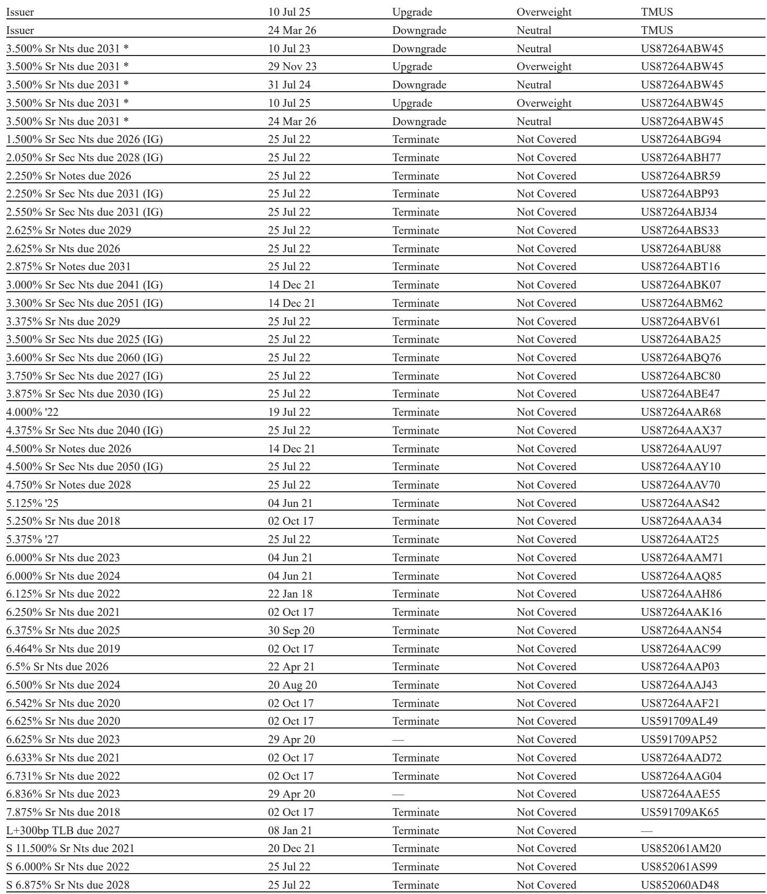
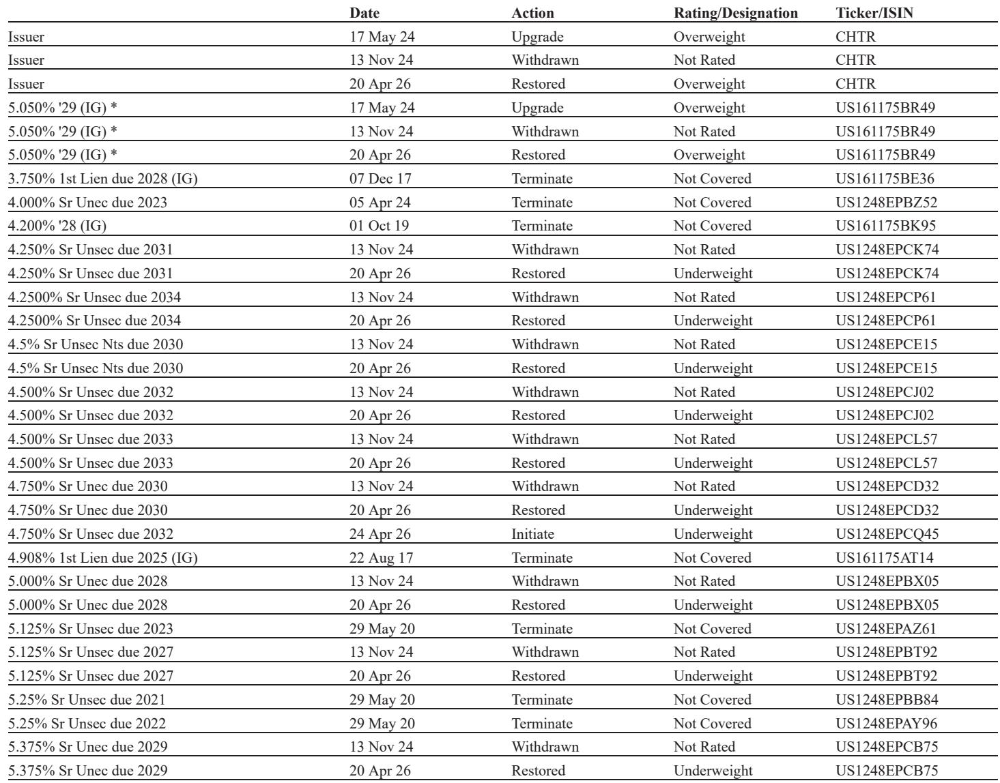
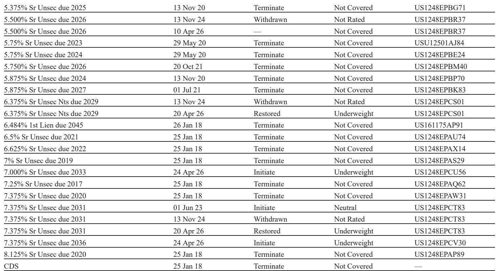

# 美国电信与有线电视的真正分野：不是增长，是现金流的可预测性

这份来自某外资投行的最新研报，在1Q26财报季之后给出了一个看似熟悉但实则更为尖锐的判断：电信运营商与有线电视运营商正在走向两条截然不同的信用轨迹。表面上看，两者都面临竞争、投资和杠杆压力，但研报的核心洞察在于，真正让投资者需要重新定价的，不是谁增长更快，而是谁的现金流更可预测。

报告开篇就给出了一个值得产业决策者和固定收益投资者深思的框架：电信运营商正在展现“更可预测的自由现金流轮廓”，而有线电视运营商则越来越依赖“定价和捆绑策略”来支撑业绩——这两种路径的信用含金量完全不同。前者意味着你可以对未来的偿债能力和股东回报做出合理预期，后者则意味着每一季度的业绩都需要靠执行层面的“超常发挥”来维持。

## 1. 电信的稳定性不是周期性的，而是结构性的

报告指出，三大电信运营商——AT&T、Verizon和T-Mobile——在1Q26交出了“大体积极”的成绩单。无线业务服务收入稳步增长，客户流失率改善，融合策略（无线+光纤/固定无线）正在产生可量化的效益。但真正值得关注的不是这些数字本身，而是它们背后的结构性变化。

研报特别强调了一个容易被忽视的细节：电信运营商的客户流失率改善，并非单纯因为促销力度加大，而是因为融合账户的占比在提升。当一个客户同时使用同一运营商的无线和宽带服务时，其更换供应商的意愿显著下降。这意味着，电信运营商正在从“获取客户”转向“锁定客户”，而后者带来的现金流可预测性远高于前者。

更关键的是，三大运营商都有明确的去杠杆路径。AT&T虽然近期杠杆率会因EchoStar交易而上升至约3.2倍，但管理层给出了清晰的三年回归2.5倍目标的路线图。Verizon和T-Mobile的杠杆水平更低，且资本配置纪律更为严格。在研报看来，这种“定义明确的去杠杆路径”本身就是一种信用溢价——投资者不需要猜测管理层下一步会做什么。

**所以呢**：电信运营商的信用故事已经从“能否改善”转向“何时改善”，市场对此已经基本定价。这意味着，除非出现超预期的杠杆下降或增长加速，否则这些名字的利差进一步压缩的空间有限。

## 2. 有线电视的困境不是周期性的，而是结构性的

与电信形成鲜明对比的是，有线电视运营商正在经历一场“结构性而非周期性”的宽带用户流失。研报明确指出了三个不可逆的压力来源：固定无线接入（FWA）的替代效应、光纤过建、以及疲弱的住房市场背景。

这里有一个关键洞察：有线电视运营商过去五年一直在用“定价和捆绑策略”来应对用户流失，但这些策略正在侵蚀ARPU和EBITDA。当你的核心产品——宽带——正在被替代品蚕食时，降价和捆绑只是延缓了问题的爆发，并没有解决根本问题。

报告特别指出，Cable运营商“越来越依赖定价和捆绑策略来稳定业绩”，而电信运营商则受益于“与移动性和光纤相关的结构性需求顺风”。这两种路径的差异，在信用分析中意味着完全不同的风险溢价。有线电视的现金流更多依赖于管理层的“执行能力”，而电信的现金流则更多基于“结构性需求”。

**所以呢**：在信用分析框架下，有线电视的风险溢价应该高于电信，因为其现金流的可预测性更低。当前市场中，Comcast的利差已经反映了“最佳情景下的稳定化”，但基本面尚未验证这一假设。

## 3. 估值已充分反映改善，电信三大运营商缺乏超额收益空间

研报对AT&T、Verizon和T-Mobile均给予“中性”评级，核心逻辑不是基本面不好，而是“利差已经压缩到差异化有限的程度”。这是一个典型的“好公司、贵价格”判断。

具体来看，三大运营商的5年期G-Spread都在58-73个基点之间，10年期在82-92个基点之间。这些水平已经反映了市场对电信行业改善的广泛预期。研报认为，利差异化的空间已经很小——也就是说，即便你判断AT&T的去杠杆速度会快于Verizon，当前利差也不足以让你为此获得超额回报。

但报告也留下了一个伏笔：AT&T的长期端（30年期）提供了相对更好的价值。这暗示，对于期限偏好较长的投资者，AT&T的长期债券可能仍有吸引力——但前提是你要相信其去杠杆路径能够兑现。

**所以呢**：对于寻求相对价值alpha的投资者，电信板块当前缺乏清晰的催化剂。除非出现利差扩大带来的买入机会，或者公司层面的超预期事件，否则持有中性的头寸可能是更理性的选择。

## 4. Charter的“超配”是一个相对价值判断，而非基本面反转

报告对Charter的IG Secured债券给予“超配”评级，但特别强调这是一个“相对价值判断”，而非对基本面改善的认可。这是一个非常重要的区分。

Charter的利差在Cable板块中是最宽的——5年期97个基点、10年期181个基点、30年期221个基点。相比之下，Comcast的5年期只有68个基点。这种利差差异本身就提供了安全边际。再加上Charter正在收购Cox Communications，这一交易将带来协同效应和更保守的资本配置姿态（整合期通常意味着更少的股票回购和更谨慎的资本支出），这些因素共同构成了短期支撑。

但报告也明确指出了结构性风险：Charter的杠杆率为4.2倍（净杠杆率同样为4.2倍），在Cable板块中是最高的。即便考虑Cox的协同效应，去杠杆也需要时间。而且，宽带用户流失的基本面问题并未因收购而改变。

**所以呢**：Charter的“超配”更像是一个战术性交易，而非战略性配置。它适合那些相信短期催化剂能够抵消结构性风险的投资者，但需要密切监控基本面变化。

## 5. 报告尚未完全回答的关键问题：有线电视整合的终局在哪里？

研报最有洞察力的部分，可能是关于Cable行业整合的讨论。报告明确排除了T-Mobile收购Cable资产的可能性——T-Mobile在1Q26电话会上“明确表示没有兴趣收购任何Cable资产”，并强调“不会为了规模而追求规模”。

那么，Cable行业的终局是什么？报告提出了一个大胆但逻辑清晰的判断：Comcast最终会将其Cable和Media资产分拆，并将Cable业务与Charter合并。理由是，一个合并后的Comcast/Charter实体将成为一个真正的全国性宽带巨头，可以消除重复的网络投资，并在节目制作、无线和设备采购方面实现规模效益。

但这里有两个巨大的障碍。第一是监管：合并后的实体将覆盖美国大部分宽带市场，即便地域重叠有限，反垄断审查也将极为严格。第二是杠杆：Charter已经杠杆较高，这样的交易需要大量股权融资或资产出售。

研报坦承，这是一个“多年而非短期”的对话。但问题在于，如果整合是唯一的出路，那么在整合真正发生之前，Cable板块的信用风险如何定价？当前的利差是否已经充分反映了这种不确定性？

**这里仍需验证**：报告没有详细讨论监管环境变化的可能性，也没有量化整合对信用质量的潜在影响。这些是投资者在做决策前需要自行判断的变量。

## 6. 一个观察框架：如何判断Cable板块的拐点

基于研报的分析，我们可以提炼出一个判断Cable板块信用拐点的框架，包含三个先行指标：

第一，宽带用户流失是否触底。报告指出，Cable板块的用户流失主要来自FWA和光纤的替代。如果FWA的增速放缓（比如T-Mobile和Verizon的FWA用户增长放缓），或者光纤过建的节奏放缓，那么Cable的用户流失可能接近底部。目前来看，这个拐点尚未出现。

第二，资本配置是否转向保守。当前Cable板块的资本配置仍偏向股东回报（股票回购和分红），而不是去杠杆。如果管理层开始优先考虑降低杠杆而非回购，那将是一个积极的信用信号。Charter在收购Cox期间的“更保守的资本配置姿态”可能是一个值得关注的先行案例。

第三，整合交易是否开始实质性推进。如果Comcast真的启动分拆，或者Charter找到其他整合伙伴，那将改变整个板块的信用逻辑。但正如报告所说，这需要时间和监管配合。

**所以呢**：当前阶段，Cable板块的信用故事仍处于“等待验证”的状态。投资者需要关注的是这些先行指标的变化，而不是季度业绩的短期波动。

---

这篇研报的核心价值，在于它清晰地划出了一条分界线：电信和Cable的差异不是增长率的差异，而是现金流可预测性的差异。对于固定收益投资者来说，后者的定价权重远高于前者。当前市场对电信的定价已经较为充分，对Cable的定价则存在分化——Charter的利差反映了风险，Comcast的利差则可能尚未完全反映结构性压力。

但研报也留下了一个悬而未决的问题：如果Cable整合是唯一的出路，那么当前的利差水平是否已经为这种可能性定价？如果整合迟迟无法推进，利差又需要多大幅度地扩大才能反映这种“僵局”风险？这些问题的答案，可能需要更深入的行业研究和监管分析才能得出。

我们欢迎对这些问题有自己判断的读者，来我们的星球微信群里继续讨论。在这里，你可以获取完整的研报原文和图表，并与同样关注TMT信用市场的同行交流观点。

Personal reading notes and learning share only. Not investment advice.

