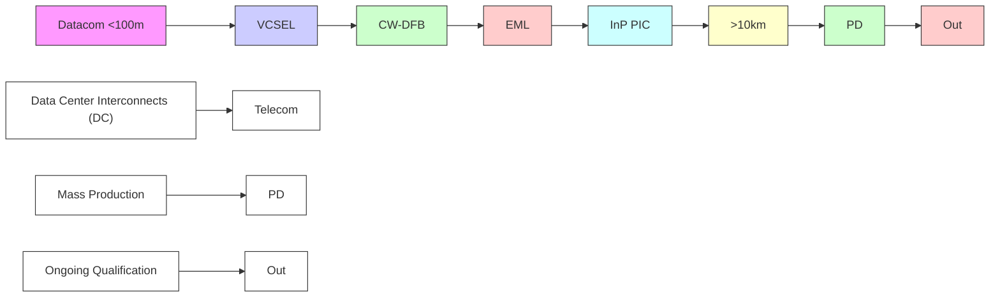

你是闲鱼资料类商品文案编辑，擅长把一份投研/行业/公司研报改写成适合闲鱼发布的商品说明。

【目标】
- 基于下面研报解析内容，生成一份可以复制到闲鱼商品详情里的中文文案。
- 风格参考用户提供的闲鱼对标笔记：标题直给、信息密度高、用途明确、适合人群明确、交付方式清楚。
- 语言要自然，像真实卖家发布，不要像公众号文章、小红书笔记或 AI 摘要。
- 不要使用太夸张的营销词，不要承诺收益，不要说“稳赚”“内幕”“必涨”。
- 可以适度口语化，但不要低俗。

【必须输出结构】
1. `闲鱼标题：` 一行，控制在 30 字以内，适合商品标题。
2. `建议价格：` 一行，给一个资料类商品常见价格区间，例如 `8-20 元`，不要承诺成交价。
3. `商品描述：` 正文，适合直接粘贴到闲鱼详情页。
4. `搜索关键词：` 一行，给 8-15 个关键词，用空格分隔。

【商品描述写法】
- 第一段：直接说明这是什么报告，页数/语言/主题/公司或行业。如果页数、日期、语言不确定，就不要编。
- 第二段：说明适合谁，比如投研、券商面试、PE/VC、行业研究、学习参考、写报告等。
- 第三段：用 3-5 个亮点 bullet，风格参考：
  ✅ 三大情景框架：DCF、P/ARR、EV/Sales
  ✅ 关键变量分析
  ✅ 估值逻辑、假设、终值占比等核心内容覆盖
  ✅ 适合准备 AI 相关面试、研究 AI 估值的同学
- 第四段：交付说明，参考：`资料为电子版 PDF，拍下后 24 小时内发网盘链接或邮箱。`
- 第五段：虚拟商品说明，参考：`电子类资料一经发货不退不换，有问题可以提前咨询。`
- 可以补一句：`需要其他报告也可以私聊，支持一站式咨询。`

【合规与避坑】
- 默认避免出现具体投行品牌名，比如“GS”“GS”“MS”，统一写作“投行研报”或“投行研报”。
- 不要写“原版/内部/独家/无水印/全网最低”等容易违规或夸张的词。
- 不要承诺投资收益。
- 不要伪造页数、日期、作者、公司覆盖范围。研报未给出时就不写。
- 不要输出解释说明，只输出闲鱼文案本身。

【研报解析内容】
"""
# Greater China Semiconductors | Asia Pacific

# Raising RF semi PTs on new business, share gains

We see stronger-than-smartphone industry revenue growth in 2Q26 for both WIN Semi and AWSC. However, we remain UW due to relatively limited growth vs. purer AI proxies.

WIN Semi sees revenue growth from newer businesses such as AI datacenter and satellite... China smartphone demand weakened into 2Q26, but WIN Semi is growing faster than the industry (2Q26 revenue could rise by teens % Q/Q), driven by AI datacenter and satellite, vs. smartphone weakness seen at MediaTek and OmniVision. These drivers lift UTR to \~60–70% for 1H26. Against this, we raise our estimates and PT for WIN Semi, and expect the company to expand both capacity and UTR in 2026-28.

...but we remain cautious on WIN Semi amid high expectations from investors; stay UW: We believe investor expectations are overly bullish on WIN Semi's InP (Indium Phosphide) business, as AI datacenter still only accounts for mid-single digits of 2026 revenue. Key InP updates:

- PD (photodiodes) for major customer (Broadcom, covered by Joe Moore): Management plans to start small production by 2Q26 and ramp strongly in 2H26 with added capacity. However, we believe InP sUBStrate could cap 2H26 PD shipments due to China export controls. As our Greater China Tech analyst, Sharon Shih, noted in her 1 May 2026 VPEC report, the InP sUBStrate export ban in China remains the swing factor.   
- LD (laser diode) not seeing meaningful revenue until 2027/28: On its earnings call, WIN Semi said it doesn't see meaningful near-term LD revenue due to longer reliability testing. This echoes our view that Lumentum (covered by Meta Marshall) won't outsource CW (continuous wave) lasers or EML (electro-absorption modulated laser) to WIN Semi soon, contrary to Street expectations of mass production by 2027.   
- We also don't expect significant 6-inch InP production sooner than 2028 or 2029: The company has been vocal about its 6-inch InP development, but we don't expect significant production sooner than 2028 or 2029 due to technology difficulties and a lack of 6-inch InP sUBStrate supply.

AWSC also see stronger 2Q26/2026 revenue growth from smartphone market share gains: We expect AWSC 2Q26 revenue to grow 10–15% Q/Q on continued smartphone share gains vs. WIN Semi and Sanan (non-covered). We now forecast AWSC 2026 revenue will grow >20% Y/Y with UTR at 75% or above, leading us to raise our earnings estimates and PT. However, compared to purer AI proxies within our coverage, we see a limited revenue CAGR in the coming years for AWSC, reflecting already high smartphone share, less optical/AI exposure, and a lack of engineers to push UTR to 80% or above. We therefore remain UW.

MS TAIWAN LIMITED+

# Charlie Chan

Equity Analyst

Charlie.Chan@morganstanley.com +886 2 2730-1725

# Daniel Yen, CFA

Equity Analyst

Daniel.Yen@morganstanley.com +886 2 2730-2863

MS ASIA LIMITED+

# Daisy Dai, CFA

Equity Analyst

Daisy.Dai@morganstanley.com +852 2848-7310

MS TAIWAN LIMITED+

# Tiffany Yeh

Equity Analyst

Tiffany.Yeh@morganstanley.com +886 2 7712-3032

# Lucas Wang

Research Associate

Lucas.Wang@morganstanley.com +886 2 2730-2875

MS ASIA LIMITED+

# Ethan Jia

Research Associate

Ethan.Jia@morganstanley.com +852 3963-2287

GREATER CHINA TECHNOLOGY SEMICONDUCTORS 

<table><tr><td colspan="2">Asia Pacific Industry View</td><td>Attractive</td></tr><tr><td colspan="3">WHAT&#x27;S CHANGED</td></tr><tr><td>WIN Semiconductors Corp(3105.TWO)Price Target</td><td>FromNT$130.00</td><td>ToNT$300.00</td></tr><tr><td>Advanced Wireless Semiconductor Co(8086.TWO)Price Target</td><td>FromNT$85.00</td><td>ToNT$130.00</td></tr></table>

MS does and seeks to do business with companies covered in MS. As a result, investors should be aware that the firm may have a conflict of interest that could affect the objectivity of MS. Investors should consider MS as only a single factor in making their investment decision.

# For analyst certification and other important disclosures, refer to the Disclosure Section, located at the end of this report.

+= Analysts employed by non-U.S. affiliates are not registered with FINRA, may not be associated persons of the member and may not be subject to FINRA restrictions on communications with a subject company, public appearances and trading securities held by a research analyst account.

# WIN Semi and AWSC seeing better-than-smartphone industry growth; AI/datacenter revenue still limited

WIN Semi should benefit from newer businesses such as AI datacenter and satellite, but expectations for InP business are excessive, in our view.

# We are seeing stronger demand and development for WIN Semi from newer

businesses such as AI datacenter, optical, and satellite, leading to 60-70% UTR in 1H26 vs. half a year ago, better than our initial expectation. Against this backdrop, we raise our earnings estimates and PT for WIN Semi and expect the company to expand both capacity and UTR in the coming years to fulfill potentially fast-growing demand. The company has also guided 2026 capex to be above NT\$2bn for InP and GaN capacity expansion.

# However, we remain cautious on WIN Semi amid high expectations from investors;

stay UW: We believe expectations for WIN Semi's InP (Indium Phosphide) business are too bullish, as AI datacenter still only accounts for mid-single digits % of revenue.

# WIN Semi's satellite-related business could account for mid teens % of 2026 revenue:

We expect WIN Semi's satellite-related business to emerge as the company's primary growth driver in 2026, supported by increasing demand for satellite communications infrastructure and continued expansion of low-earth-orbit (LEO) satellite deployments. As global satellite operators accelerate network rollouts, WIN Semi appears well positioned to benefit from rising RF front-end content and higher GaAs wafer demand, particularly in power amplifiers and related high-frequency applications. We believe satellite will contribute a meaningfully larger portion of revenue in 2026 (around mid-teens %) and serve as a key offset to the more mature smartphone market.

Exhibit 1: Satellite should be the major growth driver for WIN Semi in 2026   

bar_line

| Year | LEO (Units) | GEO (Units) | MEO (Units) |
|---|---|---|---|
| 2021 | 18.00 | 2000 | 2300 |
| 2022 | 22.00 | 1900 | 3000 |
| 2023 | 25.00 | 1850 | 3100 |
| 2024 | 26.00 | 1750 | 2900 |
| 2025 | 4,468 | 1750 | 2850 |
| 2026 | 83.00 | 1650 | 2750 |
| 2027 | 84.00 | 1600 | 2700 |
| 2028 | 83.50 | 1550 | 2650 |
| 2029 | 84.50 | 1500 | 2600 |
| 2030 | 86.00 | 1450 | 2550 |

Source: WIN Semi

Exhibit 2: WIN Semi opportunity from Datacom to Telecom   

flowchart

Exhibit 3: We expect GaAs foundry players' overall UTR to improve in 2026-27   
  
Source: Company data, MS (e) estimates

Exhibit 4: We expect WIN Semi to show margin improvement, but with some ups and downs   

line

| Quarter | WIN Semi GM (LHS) | WIN Semi OpM |
|---------|-------------------|--------------|
| 1Q17    | ~35%              | ~25%         |
| 3Q17    | ~38%              | ~28%         |
| 1Q18    | ~36%              | ~26%         |
| 3Q18    | ~34%              | ~24%         |
| 1Q19    | ~30%              | ~10%         |
| 3Q19    | ~45%              | ~30%         |
| 1Q20    | ~48%              | ~32%         |
| 3Q20    | ~45%              | ~30%         |
| 1Q21    | ~40%              | ~25%         |
| 3Q21    | ~45%              | ~28%         |
| 1Q22    | ~40%              | ~20%         |
| 3Q22    | ~30%              | ~-5%         |
| 1Q23    | ~15%              | ~-20%        |
| 3Q23    | ~25%              | ~-10%        |
| 1Q24    | ~30%              | ~10%         |
| 3Q24    | ~25%              | ~5%          |
| 1Q25    | ~20%              | ~-5%         |
| 3Q25    | ~30%              | ~10%         |
| 1Q26    | ~35%              | ~15%         |
| 3Q26e   | ~38%              | ~18%         |
| 1Q27e   | ~40%              | ~20%         |
| 3Q27e   | ~35%              | ~15%         |

Source: Company data, MS (e) estimates

# AWSC is gaining share in Android smartphones, but we expect limited growth in the coming years vs. other AI or ASIC proxies within our coverage.

Although China smartphone demand weakened into 2Q26, AWSC is growing faster than the industry and 2Q26 revenue could grow 10-15% Q/Q, unlike the Q/Q smartphone declines expected at MediaTek and OmniVision. We think such growth would be driven mostly by market share gains in Android smartphones, including Samsung, due to its perceived better quality than Sanan and its lower pricing than WIN Semi. We now forecast AWSC 2026 revenue will grow >20% Y/Y with UTR at 75% or above, leading us to raise our earnings estimates and PT. However, compared to other purer AI proxies within our coverage, we see a limited revenue CAGR in the coming years for AWSC, reflecting already high smartphone share, less optical/AI exposure, and a lack of engineers to push UTR to 80% or above. We therefore stay UW on the stock now.

Exhibit 5: We expect revenue growth for both WIN Semi and AWSC to decelerate in 2H26 from higher base   

line

| Quarter | Win Semi revenue Y/Y | AWSC revenue Y/Y |
| ------- | -------------------- | ---------------- |
| 1Q23    | -40%                 | -40%             |
| 2Q23    | -20%                 | -20%             |
| 3Q23    | 0%                   | 0%               |
| 4Q23    | 50%                  | 110%             |
| 1Q24    | 50%                  | 110%             |
| 2Q24    | 20%                  | 110%             |
| 3Q24    | -10%                 | -10%             |
| 4Q24    | -30%                 | -30%             |
| 1Q25    | -30%                 | -30%             |
| 2Q25    | -20%                 | -20%             |
| 3Q25    | -10%                 | -10%             |
| 4Q25    | 0%                   | 0%               |
| 1Q26    | 20%                  | 70%              |
| 2Q26e   | 20%                  | 50%              |
| 3Q26e   | 10%                  | 20%              |
| 4Q26e   | 10%                  | 10%              |
| 1Q27e   | 10%                  | 10%              |
| 2Q27e   | 10%                  | 10%              |
| 3Q27e   | 10%                  | 10%              |
| 4Q27e   | 10%                  | 10%              |

Source: Company data, MS (e) estimates

Exhibit 6: AWSC GM may hold better in 2026-27 due to higher UTR   

line

| Quarter | Win Semi GM | AWSC GM |
|---------|-------------|---------|
| 2Q23    | ~20%        | ~15%    |
| 3Q23    | ~25%        | ~25%    |
| 4Q23    | ~30%        | ~25%    |
| 1Q24    | ~25%        | ~25%    |
| 2Q24    | ~28%        | ~25%    |
| 3Q24    | ~20%        | ~10%    |
| 4Q24    | ~15%        | ~5%     |
| 1Q25    | ~18%        | ~20%    |
| 2Q25    | ~20%        | ~25%    |
| 3Q25    | ~25%        | ~30%    |
| 4Q25    | ~30%        | ~35%    |
| 1Q26    | ~28%        | ~35%    |
| 2Q26e   | ~28%        | ~35%    |
| 3Q26e   | ~28%        | ~35%    |
| 4Q26e   | ~30%        | ~35%    |
| 1Q27e   | ~32%        | ~35%    |
| 2Q27e   | ~34%        | ~35%    |
| 3Q27e   | ~34%        | ~35%    |
| 4Q27e   | ~33%        | ~35%    |

Source: Company data, MS (e) estimates

# Where could there be upside? Where could we be wrong?

We believe WIN Semi is working to qualify with Lumentum or major Japanese IDM customers on CW laser and EML. We could turn more positive once it secures qualification and meaningful orders. If WIN Semi can secure more InP sUBStrate supply, we wouldn't rule out potential for its PD shipment to grow robustly in the coming years amid strong demand, but this remains in our bull case assumptions, not base case.

For AWSC, although its smartphones still account for $>70\%$ of total revenue, it has also been developing non-PA business such LEO satellite and 400G/800G datacom. If these non-PA business could grow stronger than we expect with capacity expansion (company UTR is likely to be capped at 75-80%), we could turn more positive on the stock.

Additionally, we also don't rule out the possibility of a smartphone replacement cycle in 2027 and beyond given increasing Agentic AI/inferencing demand, as AWSC could be at a good position by then due to high market share in China Android smartphones.

# WIN Semi: Estimate Revisions And Quarterly Financials

We raise our 2026, 2027, and 2028 EPS estimates by 60%, 60%, and 55%,

respectively: We increase our revenue forecasts for 2026-28 due to stronger non-

smartphone business contribution. Our margin assumptions rise slightly owing to ramping optical business and infrastructure.

Exhibit 7: WIN Semi: Estimate revisions 

<table><tr><td>(NT$ mn)</td><td>New 2026e</td><td>Old 2026e</td><td>Diff.%</td><td>New 2027e</td><td>Old 2027e</td><td>Diff.%</td><td>New 2028e</td><td>Old 2028e</td><td>Diff.%</td></tr><tr><td>Net sales</td><td>20,285</td><td>18,145</td><td>12%</td><td>24,345</td><td>20,573</td><td>18%</td><td>28,758</td><td>23,331</td><td>23%</td></tr><tr><td>Gross profit</td><td>5,521</td><td>5,138</td><td>7%</td><td>8,166</td><td>6,387</td><td>28%</td><td>10,387</td><td>7,932</td><td>31%</td></tr><tr><td>Operating profit</td><td>2,266</td><td>1,581</td><td>43%</td><td>4,195</td><td>2,598</td><td>62%</td><td>6,308</td><td>4,056</td><td>56%</td></tr><tr><td>Pretax income</td><td>2,678</td><td>1,364</td><td>96%</td><td>3,977</td><td>2,200</td><td>81%</td><td>6,091</td><td>3,658</td><td>66%</td></tr><tr><td>Net income</td><td>2,700</td><td>1,691</td><td>60%</td><td>3,782</td><td>2,360</td><td>60%</td><td>5,473</td><td>3,526</td><td>55%</td></tr><tr><td>EPS for consensus</td><td>6.35</td><td>3.98</td><td>60%</td><td>8.89</td><td>5.55</td><td>60%</td><td>12.87</td><td>8.29</td><td>55%</td></tr><tr><td colspan="10">Margins</td></tr><tr><td>Gross margin</td><td>27.2%</td><td>28.3%</td><td></td><td>33.5%</td><td>31.0%</td><td></td><td>36.1%</td><td>34.0%</td><td></td></tr><tr><td>Operating margin</td><td>11.2%</td><td>8.7%</td><td></td><td>17.2%</td><td>12.6%</td><td></td><td>21.9%</td><td>17.4%</td><td></td></tr><tr><td>Pretax margin</td><td>13.2%</td><td>7.5%</td><td></td><td>16.3%</td><td>10.7%</td><td></td><td>21.2%</td><td>15.7%</td><td></td></tr><tr><td>Net margin</td><td>13.3%</td><td>9.3%</td><td></td><td>15.5

[中间内容因长度限制已省略]

d>OmniVision Integrated Circuits Group Inc (603501.SS)</td><td>E (11/17/2025)</td><td>Rmb101.38</td></tr><tr><td>Phison Electronics Corp (8299.TWO)</td><td>E (02/25/2026)</td><td>NT$2,670.00</td></tr><tr><td>SG Micro Corp. (300661.SZ)</td><td>E (11/03/2025)</td><td>Rmb98.40</td></tr><tr><td>Silergy Corp. (6415.TW)</td><td>E (04/21/2026)</td><td>NT$476.50</td></tr><tr><td>SMIC (0981.HK)</td><td>O (10/21/2025)</td><td>HK$76.60</td></tr><tr><td>TSMC (2330.TW)</td><td>O (02/07/2022)</td><td>NT$2,255.00</td></tr><tr><td>UMC (2303.TW)</td><td>E (04/20/2026)</td><td>NT$104.50</td></tr><tr><td>Vanguard International Semiconductor (5347.TWO)</td><td>E (01/14/2026)</td><td>NT$174.50</td></tr><tr><td>WIN Semiconductors Corp (3105.TWO)</td><td>U (07/14/2025)</td><td>NT$526.00</td></tr><tr><td colspan="3">Daisy Dai, CFA</td></tr><tr><td>ASMPT Ltd (0522.HK)</td><td>O (07/24/2025)</td><td>HK$173.40</td></tr><tr><td>China Resources Microelectronics Limited (688396.SS)</td><td>U (03/02/2026)</td><td>Rmb59.70</td></tr><tr><td>Elan Microelectronics Corp (2458.TW)</td><td>O (10/03/2025)</td><td>NT$145.50</td></tr><tr><td>Empyrean Technology Co Ltd (301269.SZ)</td><td>E (01/17/2025)</td><td>Rmb94.42</td></tr><tr><td>Hangzhou Silan Microelectronics Co. Ltd. (600460.SS)</td><td>U (08/25/2025)</td><td>Rmb30.47</td></tr><tr><td>Innoscience (2577.HK)</td><td>E (10/13/2025)</td><td>HK$68.15</td></tr><tr><td>JCET Group Co Ltd (600584.SS)</td><td>E (01/16/2026)</td><td>Rmb55.83</td></tr><tr><td>Shanghai Fudan Microelectronics (1385.HK)</td><td>O (03/07/2025)</td><td>HK$44.80</td></tr><tr><td>SICC Co Ltd (688234.SS)</td><td>O (03/20/2026)</td><td>Rmb125.25</td></tr><tr><td>StarPower Semiconductor Ltd (603290.SS)</td><td>O (03/01/2022)</td><td>Rmb111.15</td></tr><tr><td>Unigroup Guoxin Microelectronics Co Ltd (002049.SZ)</td><td>U (01/10/2023)</td><td>Rmb81.94</td></tr><tr><td>Universal Scientific Ind. (Shanghai) (601231.SS)</td><td>O (11/05/2025)</td><td>Rmb41.18</td></tr><tr><td>Yangjie Technology (300373.SZ)</td><td>O (06/10/2022)</td><td>Rmb77.73</td></tr><tr><td colspan="3">Daniel Yen, CFA</td></tr><tr><td>AP Memory Technology Corp (6531.TW)</td><td>O (07/11/2025)</td><td>NT$1,055.00</td></tr><tr><td>ASMedia Technology Inc (5269.TW)</td><td>U (10/03/2025)</td><td>NT$1,525.00</td></tr><tr><td>Aspeed Technology (5274.TWO)</td><td>O (06/09/2025)</td><td>NT$17,825.00</td></tr><tr><td>Egis Technology Inc (6462.TWO)</td><td>E (01/28/2026)</td><td>NT$129.50</td></tr><tr><td>Espressif Systems (688018.SS)</td><td>O (05/15/2023)</td><td>Rmb176.68</td></tr><tr><td>GigaDevice Semiconductor Beijing Inc (603986.SS)</td><td>O (05/15/2025)</td><td>Rmb362.13</td></tr><tr><td>Macronix International Co Ltd (2337.TW)</td><td>O (09/18/2025)</td><td>NT$153.00</td></tr><tr><td>Montage Technology Co Ltd (6809.HK)</td><td>O (03/18/2026)</td><td>HK$418.60</td></tr><tr><td>Montage Technology Co Ltd (688008.SS)</td><td>O (03/18/2026)</td><td>Rmb249.22</td></tr><tr><td>Novatek (3034.TW)</td><td>U (02/04/2026)</td><td>NT$487.00</td></tr><tr><td>Nuvoton Technology Corporation (4919.TW)</td><td>U (11/10/2025)</td><td>NT$181.00</td></tr><tr><td>Parade Technologies Ltd (4966.TWO)</td><td>E (01/30/2026)</td><td>NT$735.00</td></tr><tr><td>Powerchip Semiconductor Manufacturing Co (6770.TW)</td><td>O (10/27/2025)</td><td>NT$62.10</td></tr><tr><td>Realtek Semiconductor (2379.TW)</td><td>E (01/30/2026)</td><td>NT$555.00</td></tr><tr><td>Shenzhen Goodix Technology Co Ltd (603160.SS)</td><td>U (07/14/2025)</td><td>Rmb67.24</td></tr><tr><td>Winbond Electronics Corp (2344.TW)</td><td>E (03/20/2026)</td><td>NT$121.50</td></tr><tr><td>WPG Holdings (3702.TW)</td><td>O (03/16/2026)</td><td>NT$114.00</td></tr><tr><td>WT Microelectronics Co. Ltd. (3036.TW)</td><td>O (01/27/2026)</td><td>NT$275.50</td></tr><tr><td colspan="3">Duan Liu</td></tr><tr><td>Dosilicon Co Ltd (688110.SS)</td><td>U (09/06/2024)</td><td>Rmb165.30</td></tr><tr><td>Shenzhen Longsys Electronics Co Ltd (301308.SZ)</td><td>E (02/25/2026)</td><td>Rmb556.66</td></tr><tr><td colspan="3">Tiffany Yeh</td></tr><tr><td>AllRing Tech Co. (6187.TWO)</td><td>O (09/23/2025)</td><td>NT$1,110.00</td></tr><tr><td>FOCI Fiber Optic Communications Inc (3363.TWO)</td><td>O (01/15/2025)</td><td>NT$853.00</td></tr><tr><td>Himax Technologies Inc (HIMX.O)</td><td>E (02/04/2026)</td><td>US$20.65</td></tr><tr><td>Hon Precision (7769.TW)</td><td>O (04/17/2026)</td><td>NT$6,870.00</td></tr><tr><td>MPI Corporation (6223.TWO)</td><td>O (04/17/2026)</td><td>NT$4,985.00</td></tr><tr><td>Silicon Motion (SIMO.O)</td><td>O (05/06/2024)</td><td>US$262.05</td></tr><tr><td>Winway Technology Co Ltd (6515.TW)</td><td>O (04/17/2026)</td><td>NT$9,950.00</td></tr></table>

Stock Ratings are subject to change. Please see latest research for each company.

\* Historical prices are not split adjusted.
"""
