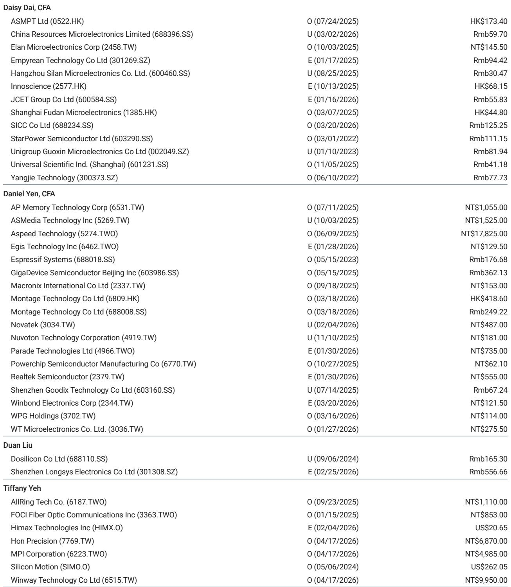
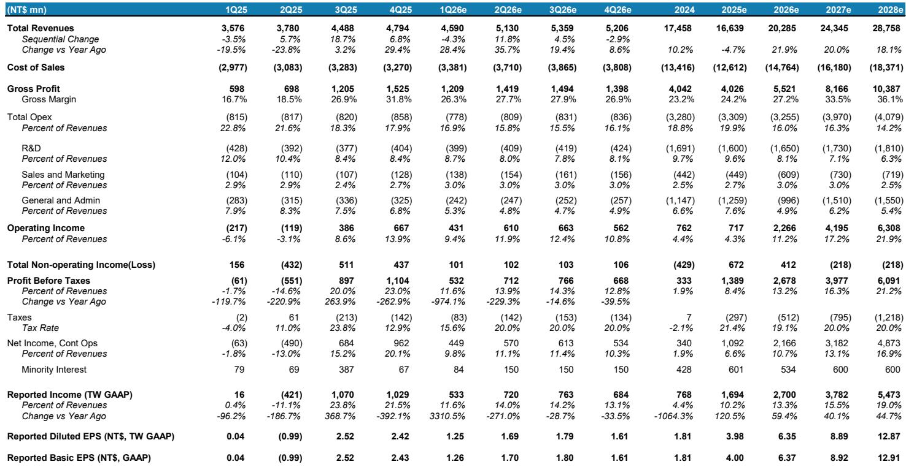
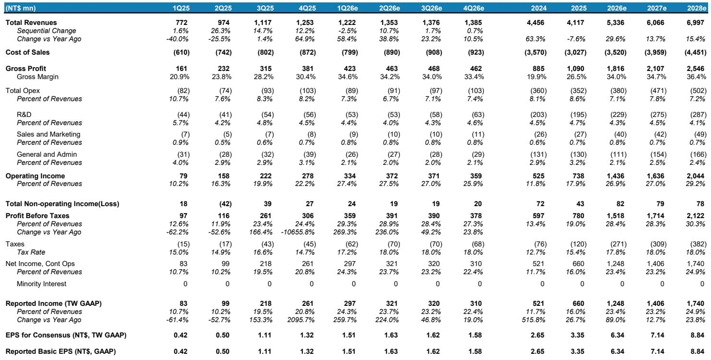

# The Semiconductor Foundry Trade is Not an AI Proxy Play: Why Revenue Diversification Alone Does Not Justify Premium Valuations

The most dangerous investment narrative in Greater China semiconductors today conflates genuine business diversification with structural AI exposure. Two leading GaAs foundries, WIN Semi and AWSC, are demonstrating stronger-than-industry revenue growth in the first half of 2026, driven by satellite communications, datacenter optical components, and smartphone market share gains. Yet a careful reading of the underlying revenue composition reveals a sobering reality: AI datacenter revenue accounts for only mid-single digits of WIN Semi's 2026 sales, and AWSC's exposure to optical and AI-adjacent markets remains marginal. The market appears to be pricing these companies as if they are pure AI infrastructure beneficiaries, when in fact they remain fundamentally tied to legacy smartphone and communications end markets.

This disconnect between investor expectations and revenue reality creates a strategic dilemma. The price targets for both companies have been raised sUBStantially, reflecting genuine operational improvements and capacity expansion plans. But the investment ratings remain underweight, signaling a conviction that the current valuation already discounts years of successful execution that may not materialize. The question for serious investors is not whether these companies are growing, but whether the growth trajectory justifies the premium the market is assigning relative to purer AI proxies.

The timing of this analysis is critical. We are entering a period where the smartphone replacement cycle remains uncertain, China demand continues to show weakness, and the much-hyped Indium Phosphide (InP) optical opportunity faces structural supply constraints that could delay revenue recognition by years. Investors who treat the recent price target upgrades as a buy signal risk overlooking the fundamental gap between what these companies are becoming and what the market believes they already are.

## The Satellite and Optical Growth Story Is Real, But It Does Not Transform the Revenue Base

WIN Semi's revenue growth trajectory in 2026 is genuinely impressive by historical standards. Second-quarter 2026 revenue is expected to rise by teens percentage quarter-over-quarter, driven by new businesses including AI datacenter and satellite communications, even as smartphone demand in China weakens. The company's utilization rate is projected to reach 60 to 70 percent in the first half of 2026, a significant improvement from levels seen just six months prior. Satellite-related business alone could account for mid-teens percent of 2026 revenue, emerging as the primary growth driver as low-earth-orbit satellite deployments accelerate globally.

This is not a marginal story. The satellite opportunity represents a genuine structural demand shift, driven by rising RF front-end content and higher GaAs wafer requirements for power amplifiers and high-frequency applications. WIN Semi is well positioned to capture this demand, and the company has guided 2026 capital expenditure above NT$2 billion specifically for InP and GaN capacity expansion. The operational improvements are real, and the margin trajectory supports the thesis that the company is moving beyond its historical dependence on smartphone cyclicality.

However, the critical analytical question is one of magnitude and composition. AI datacenter revenue, which is the primary driver of investor enthusiasm and valuation expansion, still accounts for only mid-single digits of 2026 revenue. The satellite business, while meaningful, serves communications infrastructure rather than AI compute. The optical opportunity, which represents the most direct linkage to AI datacenter growth, remains years away from meaningful revenue contribution. The company's own guidance indicates that laser diode revenue will not materialize until 2027 or 2028 at the earliest, and significant 6-inch InP production is unlikely before 2028 or 2029 due to technology difficulties and sUBStrate supply constraints.

The pattern is clear: WIN Semi is diversifying into higher-growth end markets, but the pace of transformation is measured in years, not quarters. The revenue base in 2026 remains predominantly tied to smartphone and communications applications that face mature growth profiles and competitive pressures. The market appears to be discounting a transformation that has not yet occurred.

## The InP Optical Opportunity Faces Structural Supply Constraints That the Market Underappreciates

The most contentious element of the WIN Semi investment thesis revolves around its Indium Phosphide optical business, specifically photodiode production for a major customer. Management plans to commence small production by the second quarter of 2026 and ramp strongly in the second half of the year with added capacity. This timeline has fueled significant investor optimism, reflected in the sUBStantial price target upgrade.

Yet the supply chain reality introduces a critical variable that most investors are not fully accounting for: China export controls on InP sUBStrates. The InP sUBStrate export ban in China remains the swing factor that could cap second-half 2026 photodiode shipments. This is not a speculative risk but a documented regulatory constraint that has been explicitly flagged by analysts covering the Greater China technology supply chain. The sUBStrate supply issue is structural, not cyclical, and its resolution depends on geopolitical factors that are outside the control of any individual company.

Furthermore, the laser diode opportunity, which represents the larger and more valuable portion of the InP optical market, is not expected to generate meaningful revenue until 2027 or 2028. The company explicitly stated on its earnings call that it does not see near-term laser diode revenue due to longer reliability testing requirements. This aligns with the view that major optical component customers will not outsource continuous wave lasers or electro-absorption modulated lasers to WIN Semi in the near term, contrary to street expectations of mass production by 2027.

The implication for investors is straightforward: the InP optical thesis, which is the primary driver of the valuation re-rating, depends on a sequence of events that must all align perfectly. SUBStrate supply must be secured, customer qualification must be completed, production ramps must execute without delays, and competitive dynamics must remain favorable. Any single failure point in this chain could push meaningful revenue contribution out by years. The current valuation appears to discount a smooth execution path that historical precedent suggests is unlikely.

## AWSC's Smartphone Share Gains Are Impressive but Face a Structural Ceiling

AWSC presents a different but equally important analytical challenge. The company is executing exceptionally well within its addressable market, gaining share in Android smartphones including Samsung by offering a competitive positioning between Sanan's perceived quality issues and WIN Semi's higher pricing. Second-quarter 2026 revenue is expected to grow 10 to 15 percent quarter-over-quarter, and full-year 2026 revenue is forecast to grow more than 20 percent year-over-year with utilization rates at 75 percent or above.

This is a textbook share gain story, and the margin improvement trajectory supports the operational thesis. AWSC's gross margin is expected to hold relatively stable in the 35 percent range through 2026 and 2027, reflecting the benefits of higher utilization rates and improved cost structure. The company has demonstrated an ability to capture market share in a challenging smartphone environment, which speaks to its competitive positioning and execution capabilities.

However, the strategic question is whether this share gain trajectory can sustain the current valuation premium. Smartphones still account for more than 70 percent of AWSC's total revenue, and the company's addressable market within smartphones is approaching a natural ceiling. With already high market share in China Android smartphones, the incremental gains from further share capture become increasingly difficult and less impactful on overall revenue growth.

The comparison to purer AI proxies within the coverage universe is instructive. AWSC lacks meaningful optical and AI exposure, and its non-PA businesses, including LEO satellite and 400G or 800G datacom, remain early stage. The company also faces a structural constraint in the form of engineer availability, which limits its ability to push utilization rates above 80 percent. This is not a temporary bottleneck but a reflection of the talent scarcity that characterizes the Taiwan semiconductor foundry ecosystem. Without the ability to materially expand capacity or utilization, revenue growth becomes increasingly dependent on end-market expansion rather than share gains, and the smartphone end market is not growing at a rate that supports premium valuations.

## The Report Does Not Fully Resolve the Tension Between Near-Term Momentum and Structural Limitations

A careful reading of the analysis reveals an unresolved tension that should give investors pause. The price targets have been raised sUBStantially, with WIN Semi's target more than doubling and AWSC's target increasing by more than 50 percent. These revisions are supported by genuine operational improvements, capacity expansion plans, and revenue diversification into higher-growth end markets. The near-term momentum is real, and the second-quarter 2026 revenue outlook is stronger than the smartphone industry baseline.

Yet the investment ratings remain underweight, and the analytical narrative consistently emphasizes the limitations of the growth story. AI datacenter revenue is too small to justify the current valuation. InP optical revenue faces supply constraints and timeline risks. Smartphone share gains are approaching structural ceilings. The revenue CAGR for both companies is expected to be limited relative to purer AI proxies within the coverage universe.

The report does not fully resolve what this means for investors who are trying to position for the next twelve to twenty-four months. If the operational improvements are real and the price targets are being raised, why should an investor not buy the stock? The answer appears to be that the current price already discounts a level of success that may take years to materialize, if it materializes at all. But this is a timing argument as much as a valuation argument, and timing arguments are notoriously difficult to execute.

What the report does not fully address is the scenario where investor expectations reset lower, creating an attractive entry point for patient capital. If the InP optical thesis faces the supply constraints that the analysis suggests, and if the stock corrects on that news, the risk-reward profile could become significantly more attractive. Conversely, if the supply constraints are resolved faster than expected, the current underweight positioning could prove costly. The report identifies the swing factors but does not provide a clear framework for how investors should position for these outcomes.

## A Decision Framework for Investors Evaluating GaAs Foundry Exposure

For investors who are considering exposure to WIN Semi or AWSC, the analytical challenge is to separate the genuine operational improvement story from the AI proxy narrative that is driving valuation. The following decision framework can help clarify the strategic choices.

First, assess the AI exposure premium that is embedded in the current valuation. Compare the revenue contribution from AI datacenter and optical end markets to the valuation multiple relative to pure AI proxies. If the AI-related revenue accounts for mid-single digits of total revenue but the valuation implies a much higher contribution, the stock is pricing in future success that may not materialize. Investors should demand a margin of safety commensurate with the execution risk.

Second, evaluate the InP sUBStrate supply chain risk independently of the company's execution capabilities. The export control issue is not a company-specific risk but a structural constraint that affects the entire Taiwan GaAs foundry ecosystem. Investors should stress-test their assumptions about photodiode revenue timing under scenarios where sUBStrate supply remains constrained for six to twelve months longer than currently expected. The difference between the base case and the stress case is material enough to change the investment thesis.

Third, for AWSC specifically, assess the smartphone share gain trajectory against the structural ceiling. The company's current market share in China Android smartphones limits the incremental opportunity from further share capture. Revenue growth beyond the next twelve to eighteen months will increasingly depend on end-market expansion or successful diversification into non-PA businesses. Investors should evaluate whether the current valuation already discounts successful diversification into satellite and datacom markets that remain early stage.

Fourth, consider the opportunity cost relative to purer AI proxies within the broader semiconductor coverage universe. The report explicitly flags that both companies face limited revenue CAGR compared to AI and ASIC proxies. This is not a criticism of the companies' execution but a reflection of their end-market exposure. Investors who are bullish on AI infrastructure should consider whether direct exposure to AI beneficiaries offers a better risk-reward profile than indirect exposure through GaAs foundries where AI remains a small portion of revenue.

Join the community to read the full report and review the original charts that provide detailed quarterly financial projections, margin trajectories, and capacity expansion timelines for both WIN Semi and AWSC. The complete analysis includes the estimate revision tables and utilization rate forecasts that are essential for constructing your own base case and stress case scenarios.

*This article is for learning and discussion only and does not constitute investment advice.*

Personal reading notes and learning share only. Not investment advice.

