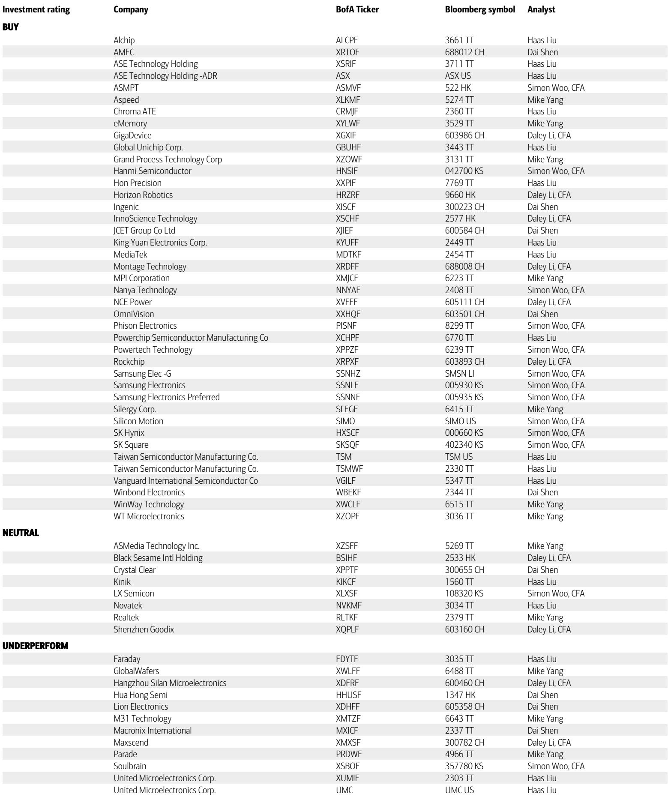
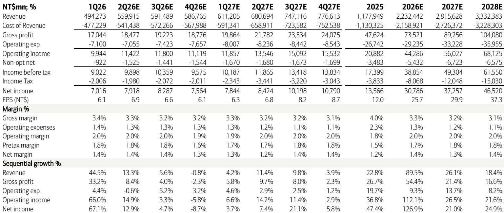
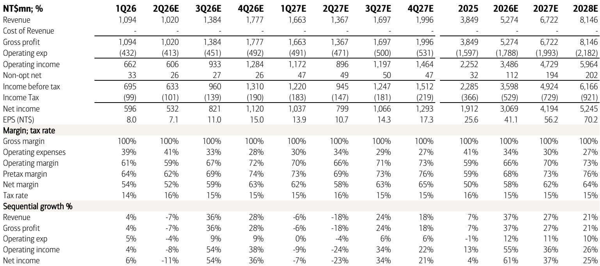

# 市场低估了制程迁移带来的IP价值重估，而非仅仅AI需求

半导体投资圈正在形成一种共识：AI是唯一值得下注的方向。但这个共识可能正在掩盖一个更根本的结构性变化——制程迁移本身正在重塑IP公司的价值曲线，而这一变化的持续性可能比AI主题本身更长。

某外资投行在2026年5月发布的一份研报中，同时上调了两家台湾半导体公司的目标价：eMemory从4950新台币上调至5500新台币，WT Micro从270新台币上调至320新台币。这两家公司业务截然不同——一家是嵌入式非易失性存储IP供应商，一家是半导体分销商——但上调的逻辑却指向同一个底层判断：AI带来的需求增量只是表层，真正驱动盈利预期上修的力量，是制程迁移带来的IP内容量提升和非AI领域的复苏信号。

这份报告最值得关注的判断，不是AI服务器继续增长——这已经是共识——而是：**在3nm向更先进节点迁移的过程中，IP公司的单位价值正在被重新定价，而分销商的数据中心业务正在经历从“量增”到“质变”的ROWC改善。** 这两个信号叠加，意味着市场对半导体产业链中游的定价框架可能需要调整。

## 1. 制程迁移不是一次性事件，而是IP内容量的阶梯式跃迁

eMemory的核心业务是嵌入式非易失性存储IP。这类IP的特点是：每颗芯片都需要，但每颗芯片付的版税不高。真正让IP公司实现盈利跃升的，不是单颗芯片价格提升，而是制程迁移带来的“内容量倍增”。

报告明确指出，eMemory在2026年的增长动力来自两大迁移路径：OLED显示驱动芯片从旧制程迁移至16nm，电源管理芯片从8英寸晶圆工艺迁移至55nm。这两条路径都不是AI相关，而是传统消费电子和车用芯片的常规升级。

这里需要理解一个关键机制：当芯片从较老制程迁移到更先进制程时，IP供应商的版税收入并非线性增长，而是呈现阶梯式跃升。原因在于，先进制程对IP的可靠性、功耗和面积要求更高，IP的授权费和版税率都会相应上修。eMemory的毛利率长期维持在100%（纯IP授权模式），这意味着每一元新增收入几乎全部转化为利润。

研报显示，eMemory的2027年和2028年EPS预期被分别上修4%和5%，而收入上修幅度为3%和4%。更值得关注的是，eMemory的2026年EPS预期与旧版本持平，但2027年之后的上修幅度明显扩大。这表明，分析师认为制程迁移带来的收入增量将在2027年后集中释放，而非均匀分布在每年。

对于投资者而言，这意味着eMemory的估值框架不应简单套用“AI概念股”的PE倍数，而应更接近“IP内容量复利”的DCF模型。研报正是采用DCF估值，目标价对应2027年PE约98倍——这个倍数看似不低，但考虑到2026-2028年EPS复合增长率约30%，PEG仍在合理区间。

## 2. 分销商的数据中心业务正在经历“量增到质变”的ROWC改善

WT Micro的业务逻辑与eMemory完全不同。作为半导体分销商，它赚的是进销差价，毛利率天然很低——报告显示其毛利率仅在3.1%至3.3%之间。但研报对其2026-2028年净利润预期分别上修20.7%、14.6%和7.4%，幅度远高于收入上修幅度（10.3%、12.2%、8.4%）。

这个差异背后有一个关键指标：ROWC（营运资本回报率）。报告特别提到，尽管AI相关业务的毛利率偏软，但ROWC显著提高。这一点容易被忽视，但对分销商而言，ROWC比毛利率更能反映真实盈利能力。

解释一下这个逻辑：分销商的本质是资金周转生意。毛利率低不是问题，只要资金周转快、营运资本占用少，ROE依然可以很高。WT Micro通过增加Broadcom TPU等AI产品的分销，虽然单品毛利率不高，但这些产品的付款周期更短、库存周转更快，导致整体ROWC上升。研报预计其2026年营业利润率从1.8%提升至2.0%，看似只有0.2个百分点的改善，但考虑到其超过2万亿新台币的收入体量，这对应着超过40亿新台币的营业利润增量。

这里有一个值得追问的问题：ROWC改善是可持续的结构性变化，还是AI需求爆发期的阶段性现象？报告没有明确回答，但给出了一个线索——Future Electronics的持续复苏正在为非AI业务提供“绿色萌芽”。这意味着，WT Micro的盈利改善并非完全依赖AI，传统业务的复苏也在贡献增量。

## 3. 市场对非AI复苏的定价可能不足

WT Micro的另一个看点，是其非AI业务的复苏。报告提到“green shoots from non-AI-related businesses”，这一表述值得细读。在AI投资热潮中，市场对非AI领域的关注度明显下降，但半导体行业是一个高度周期性的行业，非AI领域（如汽车、工业、消费电子）的库存调整已经持续了数个季度，底部复苏的信号正在出现。

研报对WT Micro的2026年EPS预期为24.70新台币，比市场共识高26.6%；2027年EPS预期为29.86新台币，比共识高20.2%。如此大的差距，除了对AI业务的乐观预期外，很大程度上来自对非AI复苏的判断。如果市场共识低估了非AI复苏的速度和幅度，那么WT Micro的盈利预期存在系统性上修空间。

但这里需要保持谨慎。非AI复苏的可持续性仍待验证。报告没有给出具体的终端需求数据，而是基于公司管理层在业绩电话会上的指引。管理层指引通常偏乐观，而分销商的收入受终端需求、库存周期和汇率等多重因素影响，预测误差较大。研报对WT Micro 2028年的净利润预期上修幅度已降至7.4%，说明分析师自己也认为远期不确定性在增加。

## 4. 报告尚未完全回答的关键问题：IP公司的竞争壁垒能否抵御制程放缓

eMemory的核心壁垒在于其eNVM IP在先进制程上的先发优势和生态绑定。但报告没有深入讨论一个潜在风险：如果台积电等代工厂的制程推进速度放缓，eMemory的制程迁移红利是否会提前耗尽？

目前eMemory的增长预期高度依赖3nm向更先进节点的迁移，以及成熟制程向16nm/55nm的升级。但半导体行业正在面临物理极限，先进制程的研发成本和周期都在增加。如果代工厂推迟下一代节点的量产时间表，eMemory的授权和版税收入节奏都会受到影响。

研报给出的DCF目标价5500新台币，隐含了对未来数年收入复合增长约20%-25%的假设。这个假设是否过于乐观，取决于制程迁移的节奏能否维持。报告没有提供压力测试场景，这可能是读者需要自行判断的关键变量。

## 5. 读者可以建立的观察框架：两个信号、三个时间窗口

基于上述分析，读者可以建立一个更系统的观察框架，而非简单跟踪股价走势。

**两个需要持续跟踪的信号：**

第一，eMemory的季度授权收入是否持续加速。授权收入是版税收入的先行指标，如果授权项目数量连续两个季度环比增长，则制程迁移的逻辑得到验证；反之则需警惕。

第二，WT Micro的ROWC是否持续改善且伴随非AI业务收入占比回升。如果ROWC改善仅来自AI业务，而传统业务仍在萎缩，则盈利改善的可持续性存疑。

**三个需要区分的时间窗口：**

短期（6-12个月）：市场对AI的定价已经相当充分，但eMemory和WT Micro的估值仍有上行空间，因为它们被归入“AI受益股”但尚未被充分重估。关键在于，它们的增长逻辑不完全依赖AI，这意味着当AI概念出现回调时，它们可能表现出更强的防御性。

中期（12-24个月）：制程迁移带来的IP内容量提升进入高峰，eMemory的盈利增速可能超出当前预期。但WT Micro面临的分销业务周期性风险会逐渐显现，需要关注库存周期的拐点。

长期（24个月以上）：最大的不确定性来自制程推进的物理极限和地缘政治对供应链的影响。如果先进制程的推进速度低于预期，eMemory的长期增长假设需要下调；如果地缘政治导致供应链重组，WT Micro的业务结构可能面临调整。

---

上述分析中，有几个关键假设尚未被研报充分验证：非AI复苏的具体驱动因素是什么？eMemory的授权收入是否有明确的客户项目支撑？WT Micro的ROWC改善能否在非AI业务中复制？这些问题的答案，往往隐藏在报告的完整图表和脚注中。

欢迎来星球微信群里继续讨论这些未解问题，我们会分享完整的研报原文、财务模型细节以及我们对两家公司的竞争格局拆解。

Personal reading notes and learning share only. Not investment advice.

