Energy Perspectives

# The Power of the Pump: Politics, Inflation and Muni Credit

The scale of the oil disruption this year has far surpassed that of 2022, implying gas prices may not remain below the Biden-era peak for long. Recent polling, inflation, and toll and airport credit spreads all seem to be discounting the opposite.

Oil market more stressed in 2026 than 2022... Gasoline prices are higher today than at same date in 2022 (+\$0.18/gal), and have risen more since the start of the Iran war than in 2022 (+30%). And for good reason, 13% of global oil supply is offline, versus 3% in 2022, albeit this is offset by lower demand from China.

...While inflation and credit spreads remain more benign. Inflation expectations have not risen as much as in 2022. Neither have toll road and airport credit spreads. Were the 2022 analogy to unfold, inflation from one to two years out (ie, 1y1y CPI swaps) would be well over 3%, while tight spreads of lower-rated toll roads and small and medium-sized airports, especially in tourist-heavy markets, might be vulnerable, given higher fuel prices and the Spirit liquidation.

Persistence matters most. Voters' perceptions of gas price changes may converge to reflect actual price movements, rather than simply correlating with political views. It is the duration of higher gas prices, not the spike, that matters most for the midterm elections and inflation, in our view. National average gas prices last reached \$5/gallon in 2022, after Russia invaded Ukraine in February of that year, but they were not the dominant issue in the midterms, as

This document is intended for institutional investors and is not subject to all of the independence and disclosure standards applicable to debt research reports prepared for retail investors under U.S. FINRA Rule 2242. BARC trades the securities covered in this report for its own account and on a discretionary basis on behalf of certain clients. Such trading interests may be contrary to the recommendations offered in this report.

BARC Capital Inc. and/or one of its affiliates does and seeks to do business with companies covered in its research reports. As a result, investors should be aware that the firm may have a conflict of interest that could affect the objectivity of this report. Investors should consider this report as only a single factor in making their investment decision.

(i) This author is a debt research analyst in the Fixed Income, Currencies and Commodities Research department and is neither an equity research analyst nor subject to all of the independence and disclosure standards applicable to analysts who produce debt research reports under U.S. FINRA Rule 2242.   
(ii) This author is a member of the Fixed Income, Currencies and Commodities Research department and is not an equity or debt research analyst.   
(v) This author is a registered US equity research analyst who is subject to US FINRA Rule 2241 and who may write debt research under FINRA Rule 2242.

FOR ANALYST CERTIFICATION(S) PLEASE SEE PAGE 17.

FOR IMPORTANT EQUITY RESEARCH DISCLOSURES, PLEASE SEE PAGE 17.

FOR IMPORTANT FIXED INCOME RESEARCH DISCLOSURES, PLEASE SEE PAGE 18.

Completed: 14-May-26, 14:06 GMT Released: 14-May-26, 14:10 GMT Restricted - External

SIGNATURE

# Public Policy

Michael McLean $^{(v)}$

+1 212 526 9393

michael.mclean@BARC.com

BCI, US

# Commodities

Amarpreet Singh $^{(ii)}$

+1 212 526 1672

amarpreet.x.singh@BARC.com

BCI, US

# US Rates Research

Jonathan Hill, CFA $^{(i)}$

+1 212 526 3497

jonathan.hill@BARC.com

BCI, US

# Municipal Credit Research

Mikhail Foux $^{(ii)}$

+1 212 526 7849

mikhail.foux@BARC.com

BCI, US

Grace Cen $^{(ii)}$

+1 212 526 3571

grace.cen@BARC.com

BCI, US

# Francisco San Emeterio $^{(ii)}$

+1 212 526 7113

francisco.sanemeterio@BARC.com

BCI, US

# Data Science & Applied AI

Josh Grasso $^{(v)}$

+1 212 526 0141

joshua.grasso@BARC.com

BCI, US

prices had started falling by end-June. For inflation, a 10% persistent increase in gas prices tends to boost headline CPI by 0.2pp within one to two months, while feed-through to core is smaller and takes longer.

Implications. Various policy levers—SPR release, sanctions waivers, the Jones Act waiver, EPA waiver to sell E15, a federal or state gas tax holiday, or export restrictions—could help close the \$1/gal spread between AAA retail gas and Rbob, and help to contain what we believe is a \$5/gal red line for the administration. However, time may have run out for an opening of the Strait Hormuz to prevent 2026 from being worse than 2022.

# The politics of gas prices

Michael McLean $^{(v)}$ BCI, US

# Gas prices have become a political Rorschach test

Recent polling indicates that perceptions of gas price changes track political views more closely than actual movements in price. Americans who say that gas prices have increased "a lot" are much less likely to support President Trump and, by extension, the war in Iran. There is high correlation between support for the war and approval of President Trump. In a recent Economist/YouGov survey, 61% of US adult Citizens said gas prices had gone up a lot, but the partisan divide was stark. Only 49% of Trump voters said gas prices had increased a lot, compared with 82% of respondents who said they voted for Kamala Harris in 2024. The divide is even starker when looking at only Republican voters (46% said gas prices had increased a lot) and starkest when you look at only self-identified MAGA supporters (39% said gas prices had increased a lot).

Furthermore, polling has found little correlation between a state's actual gas price increase and how many of its residents say that prices are going up a lot. Average gas prices have increased in every state, yet respondents in states with the smallest increases were nearly as likely to say prices were going up as respondents in states with the largest increases. Rather, in states with higher and lower price increases, Republicans were significantly less likely than independents and Democrats to say that gas prices had increase a lot.

In our view, the partisan split in how people perceive gas prices may be more important than actual pump prices when it comes to the politics of the issue and its midterm election ramifications.

FIGURE 1. By 2024 vote: Are gas prices where you live going up or going down?   
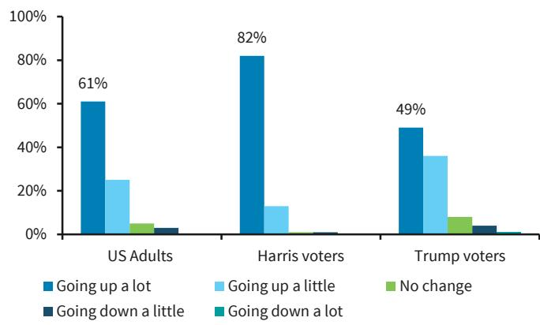

bar

| Group | Going up a lot (%) | Going up a little (%) | No change (%) | Going down a little (%) | Going down a lot (%) |
|---|---|---|---|---|---|
| US Adults | 61 | 25 | 4 | 2 | 0 |
| Harris voters | 82 | 13 | 1 | 1 | 0 |
| Trump voters | 49 | 36 | 7 | 3 | 1 |

Source: BARC, The Economist/YouGov Poll, May 1-4, 2026

FIGURE 2. By political party ID: Are gas prices where you live going up or going down?   
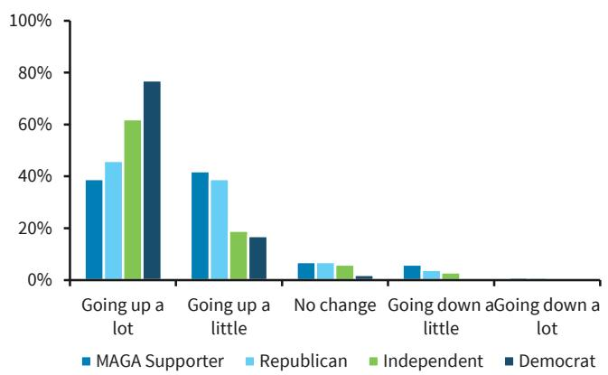

bar

| Category           | MAGA Supporter | Republican | Independent | Democrat |
| ------------------ | -------------- | ---------- | ----------- | -------- |
| Going up a lot     | 38%            | 45%        | 62%         | 78%      |
| Going up a little  | 42%            | 39%        | 19%         | 17%      |
| No change          | 6%             | 7%         | 6%          | 2%       |
| Going down a little| 6%             | 4%         | 3%          | 0%       |
| Going down a lot   | 0%             | 0%         | 0%          | 0%       |

Source: BARC, The Economist/YouGov Poll, May 1-4, 2026

# The spike may matter more than the price

After the Iran war began, our view was (Public Policy: What could end the Iran war?) that a \$5/gallon national average gas price could be a catalyst to end the war because, politically, Republicans might need to keep the price of gas lower than the Biden-era peak. The price peaked in June 2022 at \$5.01/gallon during the Biden administration. On an inflation-adjusted basis, that would translate into \$5.58/gallon today (using CPI-U). Today, the AAA daily national average price per gallon for regular unleaded is approximately \$4.50.

While gas prices reached \$5/gallon in 2022, they were not the dominant issue in the midterm elections, likely because prices had started falling by end-June and by the midterms were only 20 cents higher than before Russia had invaded Ukraine (Figure 3). The price spike lasted about 16 weeks. In the midterms, Democrats outperformed expectations by only narrowly losing control of the House and gaining one Senate seat, as other issues were more important for voters. Exit polls showed the top issues were inflation broadly (31%) and abortion (27%).

We struggle to see how Republicans can let gas prices get to \$5/gallon and stay there for any prolonged period of time without it being a political headwind going into the midterms. We think gas prices could become a bigger political issue during the summer driving season. Congressional Republicans likely will feel this political pressure most acutely because they are up for election this fall, and President Trump is not. At least at this point, our sense is that Republicans hope the spike ends before voters start to really focus on the midterm elections around Labor Day (similar to the trajectory of the 2022 spike). To date, congressional Republicans have remained supportive of the president's position on the war, as evidenced by the very few Republican defections on the six War Powers Act resolution votes to end the war.

FIGURE 3. Average gas prices before 2022 midterms (\$/gallon)   
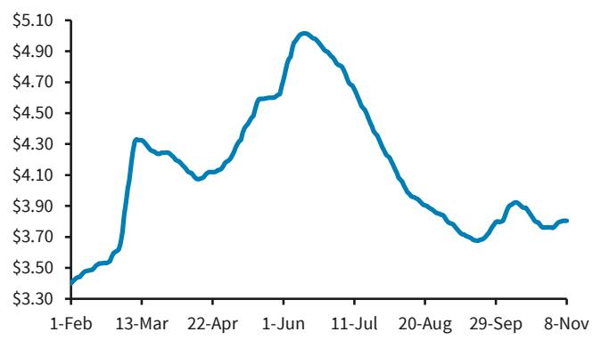

line

| Date     | Value  |
| -------- | ------ |
| 1-Feb    | $3.30  |
| 13-Mar   | $4.30  |
| 22-Apr   | $4.10  |
| 1-Jun    | $4.90  |
| 11-Jul   | $4.70  |
| 20-Aug   | $3.90  |
| 29-Sep   | $3.70  |
| 8-Nov    | $3.80  |

Daily National Average Gasoline Prices Regular Unleaded. Midterm election was November 8, 2022.   
Source: BARC, AAA

FIGURE 4. Average gas prices since Feb 2026 (\$/gallon)   
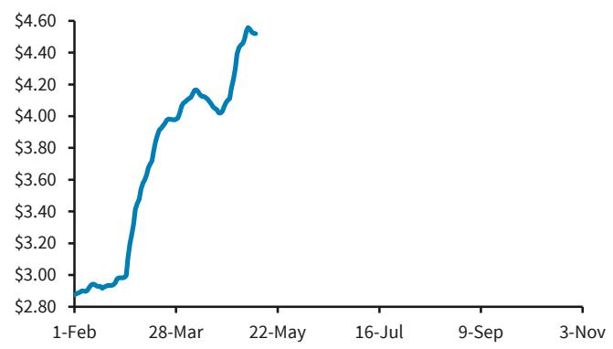

line

| Date     | Value  |
| -------- | ------ |
| 1-Feb    | $2.80  |
| 28-Mar   | $4.00  |
| 22-May   | $4.60  |
| 16-Jul   | -      |
| 9-Sep    | -      |
| 3-Nov    | -      |

Daily National Average Gasoline Prices Regular Unleaded. Midterm election will be November 3, 2026.   
Source: BARC, AAA

# If it hits \$5/gallon, the president's tools to bring down gas prices are limited

The administration already has taken several actions in an effort to mitigate the effect of the war on the price of oil, including releases from the SPR (in coordination with largest-ever IEA release), sanction waivers, $^{1}$ a Jones Act waiver, and an EPA waiver to sell E15 (a fuel blend of 15% ethanol and 85% gasoline) during the summer driving season (June 1 to September 15). E15 can be tens of cents less per gallon than E0 or E10. In our view, the administration may have few additional tools to put a ceiling on gas prices in the near to medium term, absent reopening the Strait of Hormuz militarily or reaching a deal with Iran. We think the president could jawbone markets and oil companies that report large earnings, similar to his approach with defense companies, to try to actively manage investors' expectations.

We do not think a federal gas tax holiday is likely because relief from it would be modest and it would complicate federal transportation funding (the highway trust fund already runs annual deficits). President Trump has said he supports a suspension of the 18.4 cents/gallon federal gas tax (24.3 cents/gallon for diesel), but this would require congressional action. Trump is not the first president to propose a federal gas tax holiday. President Biden most recently proposed suspending the federal gas tax for 90 days after Russia invaded Ukraine. Congress has never suspended the gas tax. An analysis in 2022 found that the three-month federal gas tax holiday proposed by the Biden administration would have lowered average gasoline spending per capita by only \$5-14 over three months. On average across all states, taxes currently comprise just over 10% of the gas price, but the majority of the taxes are state and local, and as crude oil input prices increase, taxes become a smaller percentage of the price. $^{2}$

The Highway Trust Fund, which finances most US surface transportation programs—mainly highways and public transit—is funded primarily via the above-mentioned federal gas. As it stands, the CBO expects $^{3}$ the fund to be exhausted in FY28 by the CBO. Given that the federal gas tax brings in \$36-38bn annually, if the holiday lasted for six months or longer, the Highway Trust Fund will likely run out of money in 1H27. This is another reason why it might not be easy to suspend the federal gas tax.

Another option would be to restrict crude oil exports. The law authorizes the president to impose restrictions on the export of US crude oil for a period of not more than one year. President Trump and other administration officials repeatedly have said this is not under consideration. $^{4}$ Export controls are not flawless. US gasoline consumption is not self-sufficient because US production is primarily light crude, while many US refineries are configured for heavy crude. The US also lacks the infrastructure to move crude domestically in a cost-effective manner.

There is some movement at the state level. To help their residents and address surging gas prices, a number of states have already introduced, or at least have started to consider, gas-tax holidays. Three states—Georgia, Indiana and Utah—have fully or partially implemented gas-tax holidays, while about ten others are considering them with legislative proposals at various stages. California has already voted against a gas tax holiday, an instead is focused on targeted income-based one-time payments and EV incentives (Figure 5).

FIGURE 5. State Tax Holiday Proposals 

<table><tr><td>State</td><td>Action</td><td>Current State</td></tr><tr><td>Georgia</td><td>Active</td><td>State motor fuel excise tax suspended (03/20 - 05/01).</td></tr><tr><td>Indiana</td><td>Active</td><td>Suspension of the SUT gas tax (04/08-05/08).</td></tr><tr><td>Utah</td><td>Active</td><td>15% reduction of the state ga tax (04/01-12/31).</td></tr><tr><td>Arizona</td><td>Proposal</td><td>State gas holiday.</td></tr><tr><td>Pennsylvania</td><td>Proposal</td><td>State gas holiday for 2-6mo.</td></tr><tr><td>Ohio</td><td>Proposal</td><td>Draft legislation introduced. Governor opposed.</td></tr><tr><td>Florida</td><td>Proposal</td><td>Legislative discussions. Governor opposed.</td></tr><tr><td>New York</td><td>Proposal</td><td>Legislative discussions. Governor opposed.</td></tr><tr><td>Maryland</td><td>Proposal</td><td>Legislative discussions. Governor opposed.</td></tr><tr><td>Alabama</td><td>Proposal</td><td>State gas holiday introduced.</td></tr><tr><td>South Carolina</td><td>Proposal</td><td>State gas holiday introduced.</td></tr><tr><td>California</td><td>Failed</td><td>A gas tax holiday proposal.</td></tr></table>

Source: State legislatures, BARC

# Oil and gasoline price outlook

Amarpreet Singh BCI, US

Since the Iran war began, the AAA retail gas price has risen 51%, largely in line with the 51% increase in prompt-month WTI futures, but prompt-month Rbob futures have risen 74% over the same period. This is because SPR, spare capacity and even the potential US supply response are all skewed toward addressing the crude supply issue, but refining capacity has emerged as a bigger constraint.

The sharper increase in wholesale gasoline prices is also an indication that demand has not yet adjusted to the supply situation. US gasoline inventory in days of demand has fallen close to the low end of the seasonal range of late (Figure 6). As inventories continue to draw (Figure 7), we would expect further increase in prices, led by refined products, until either the supply situation resolves or demand adjusts with a lag in a more meaningful way.

Our analysis of historical trends in US gasoline demand suggests the roughly 50% increase in retail prices so far will likely lead to a 3-4% reduction in demand over time, which is far from the scale of supply disruption. As things stand right now, we therefore think risks to our \$100/b forecast for Brent in 2026 are skewed higher.

FIGURE 6. US gasoline demand cover has been shrinking (days of demand)   
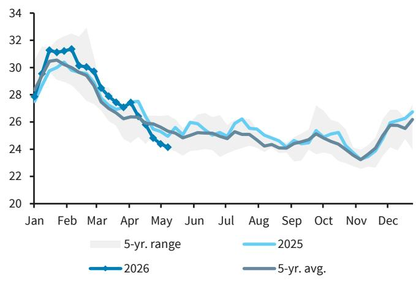

line

| Month | 2026 | 2025 | 5-yr. avg. | 5-yr. range |
|-------|------|------|------------|-------------|
| Jan   | 28.0 | 27.8 | 27.9       | 27.8 - 31.0 |
| Feb   | 31.5 | 30.5 | 30.8       | 31.0 - 32.5 |
| Mar   | 30.0 | 29.5 | 29.8       | 29.5 - 31.5 |
| Apr   | 27.5 | 27.0 | 27.3       | 27.0 - 28.5 |
| May   | 24.5 | 25.0 | 25.5       | 25.0 - 26.5 |
| Jun   | 25.0 | 25.5 | 25.8       | 25.5 - 26.5 |
| Jul   | 25.5 | 26.0 | 26.3       | 26.0 - 27.0 |
| Aug   | 24.5 | 25.0 | 25.3       | 24.8 - 26.3 |
| Sep   | 24.0 | 24.5 | 24.8       | 24.3 - 26.0 |
| Oct   | 24.5 | 25.0 | 25.3       | 24.8 - 26.3 |
| Nov   | 23.0 | 23.5 | 23.8       | 23.3 - 25.0 |
| Dec   | 26.0 | 26.5 | 26.8       | 26.3 - 27.5 |

Note: Weekly stocks/four-week average demand  
Source: EIA, BARC

FIGURE 7. US total oil inventories are also drawing fast   
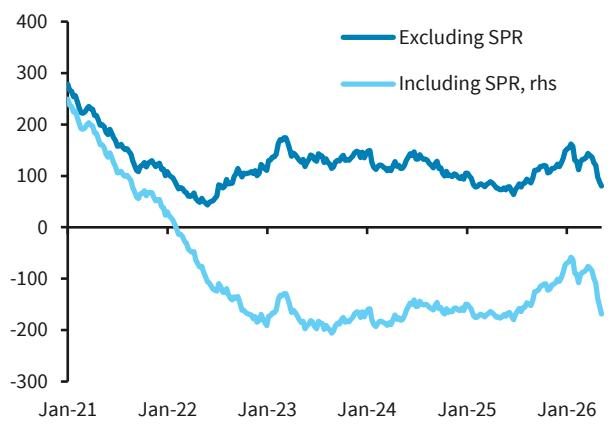

line

| Date   | Excluding SPR | Including SPR, rhs |
|--------|---------------|---------------------|
| Jan-21 | 300           | 250                 |
| Jan-22 | 100           | 50                  |
| Jan-23 | 150           | -150                |
| Jan-24 | 120           | -180                |
| Jan-25 | 100           | -170                |
| Jan-26 | 150           | -100                |

Note: US total oil inventories minus the rolling 20 year seasonal average, mb  
Source: EIA, BARC

Retail gas prices in the US seem closer to reaching \$5/gal than they might appear. They are lagging prompt Rbob futures by a couple of weeks, and the spread between the two has been growing over the past few years (Figure 8). In 2025, the AAA average retail gas price exceeded average prompt Rbob futures by \$1.08/gal. During the first four months of this year, the spread has averaged \$1.09/gal. In 2022, it averaged \$0.99/gal, and in 2019, it averaged \$0.89/gal. Considering the trends in components driving the retail gas-Rbob futures spread, we think current Rbob prices (\$3.62/gal at the time of writing) would be consistent with retail gas prices in the US rising to \$4.70/gal in the next couple of weeks.

Our breakdown of the \$1.08/gal spread between AAA retail gas and Rbob last year shows that taxes made up \$0.52/gal, with federal taxes at \$0.18/gal and state and local taxes at \$0.34/gal. Renewable volume obligations, or the cost of compliance with the EPA's biofuel mandate, contributed \$0.14/gal to the spread, and the rest was distribution and marketing costs, along with retail mark-up (Figure 9). The federal gas tax has been unchanged for more than three decades, but notwithstanding the recent announcements by a few states, state and local taxes on gasoline have been rising over the past few years.

FIGURE 8. Rbob accounted for 70% of AAA retail gas price between 2021 and 2025, compared with 80% between 2010 and 2014   
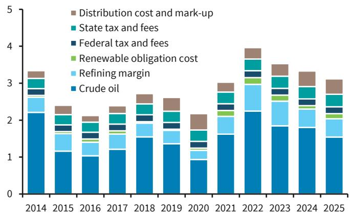

bar_stacked

| Year | Crude oil | Refining margin | Renewable obligation cost | Federal tax and fees | State tax and fees | Distribution cost and mark-up |
|---|---|---|---|---|---|---|
| 2014 | 2.2 | 0.6 | 0.3 | 0.3 | 0.3 | 0.3 |
| 2015 | 1.1 | 0.5 | 0.2 | 0.3 | 0.3 | 0.3 |
| 2016 | 1.0 | 0.4 | 0.2 | 0.3 | 0.3 | 0.3 |
| 2017 | 1.2 | 0.5 | 0.2 | 0.3 | 0.3 | 0.3 |
| 2018 | 1.5 | 0.5 | 0.2 | 0.3 | 0.3 | 0.3 |
| 2019 | 1.3 | 0.4 | 0.2 | 0.3 | 0.3 | 0.3 |
| 2020 | 0.9 | 0.3 | 0.1 | 0.3 | 0.3 | 0.3 |
| 2021 | 1.6 | 0.5 | 0.2 | 0.3 | 0.3 | 0.3 |
| 2022 | 2.2 | 1.1 | 0.3 | 0.3 | 0.3 | 0.3 |
| 2023 | 1.8 | 1.1 | 0.3 | 0.3 | 0.3 | 0.3 |
| 2024 | 1.8 | 1.1 | 0.3 | 0.3 | 0.3 | 0.3 |
| 2025 | 1.5 | 1.1 | 0.3 | 0.3 | 0.3 | 0.3 |

Note: Breakdown of AAA retail gasoline price in the US, \$/gal  
Source: EIA, Argus, Bloomberg, BARC

FIGURE 9. The AAA retail gas and Rbob spread has grown over the years due to higher taxes, rising RVO and distribution and marketing costs   
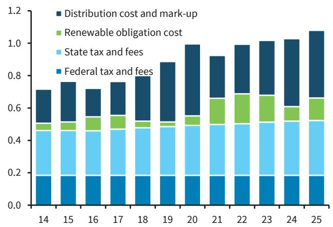

bar_stacked

| Year | Federal tax and fees | State tax and fees | Renewable obligation cost | Distribution cost and mark-up |
| :--- | :--- | :--- | :--- | :--- |
| 14 | 0.18 | 0.30 | 0.06 | 0.27 |
| 15 | 0.18 | 0.30 | 0.07 | 0.32 |
| 16 | 0.18 | 0.30 | 0.10 | 0.24 |
| 17 | 0.18 | 0.30 | 0.12 | 0.29 |
| 18 | 0.18 | 0.30 | 0.06 | 0.35 |
| 19 | 0.18 | 0.30 | 0.04 | 0.45 |
| 20 | 0.18 | 0.30 | 0.08 | 0.55 |
| 21 | 0.18 | 0.30 | 0.25 | 0.35 |
| 22 | 0.18 | 0.30 | 0.29 | 0.42 |
| 23 | 0.18 | 0.30 | 0.27 | 0.45 |
| 24 | 0.18 | 0.30 | 0.12 | 0.55 |
| 25 | 0.18 | 0.30 | 0.19 | 0.55 |
The chart displays stacked bars representing the total cost and mark-up for each year from year 14 to year 25. The values are estimated based on the provided data.

Note: Breakdown of AAA retail gas and Rbob spread  
Source: EIA, Argus, Bloomberg, BARC

The renewable obligation cost has also been rising over the past few years and averaged \$0.24/gal during the first four months of 2026 because of the EPA's recent increase in RFS mandates, the ethanol blending wall due to largely stagnant gasoline demand and the convergence between D6 and D4 RIN (Renewable Identification Number) prices (Figure 10).

The distribution and marketing component is primarily a function of seasonality in demand, refinery maintenance, mandatory grade switching before the summer driving season and unplanned refinery outages caused by the hurricane season. Historical seasonal patterns suggest it troughs in April, right before the mandatory grade switching for summer, and peaks in late autumn/early winter, coinciding with the peak in the hurricane season (Figure 11).

FIGURE 10. Increase in EPA's RFS mandates has led to a sharp increase in RIN prices of late   
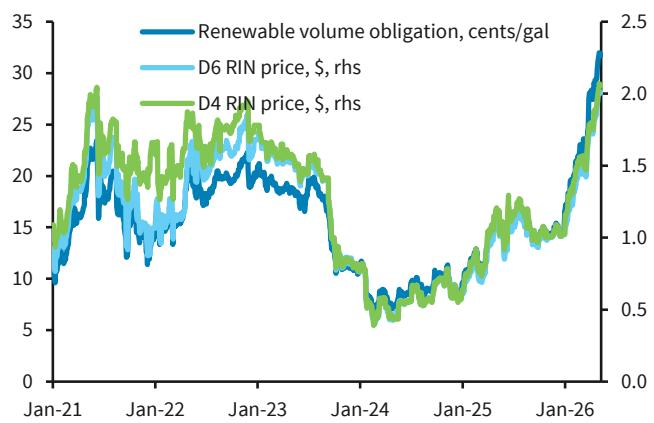

line

| Date   | Renewable volume obligation, cents/gal | D6 RIN price, $, rhs | D4 RIN price, $, rhs |
|--------|----------------------------------------|----------------------|----------------------|
| Jan-21 | ~10                                    | ~10                  | ~10                  |
| Jan-22 | ~20                                    | ~18                  | ~22                  |
| Jan-23 | ~18                                    | ~16                  | ~20                  |
| Jan-24 | ~8                                     | ~7                   | ~9                   |
| Jan-25 | ~10                                    | ~9                   | ~11                  |
| Jan-26 | ~32                                    | ~28                  | ~30                  |

Note: Renewable volume obligation is the estimated cost importers and refiners bear for complying with the EPA's RFS mandates.
Source: Argus, Bloomberg, BARC

FIGURE 11. Historical trend suggests distribution and marketing costs generally trough in April   
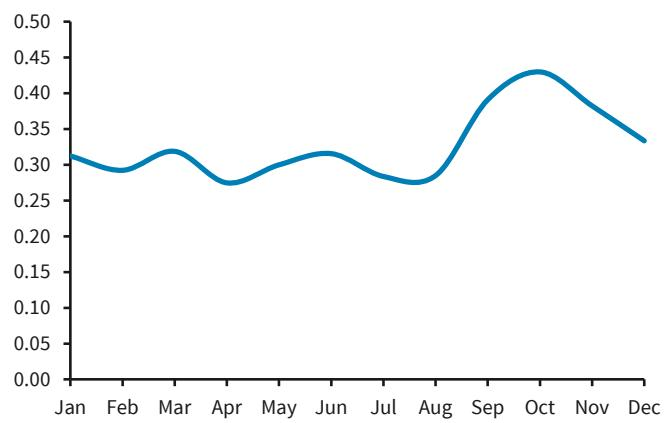

line

| Month | Value |
|-------|-------|
| Jan   | 0.31  |
| Feb   | 0.29  |
| Mar   | 0.32  |
| Apr   | 0.27  |
| May   | 0.29  |
| Jun   | 0.31  |
| Jul   | 0.28  |
| Aug   | 0.27  |
| Sep   | 0.38  |
| Oct   | 0.43  |
| Nov   | 0.38  |
| Dec   | 0.33  |

Note: Long-term (2016-25) seasonal average estimated gasoline distribution and marketing cost and retail mark up, \$/gal
Source: BARC

The onshore leg of the WTI-Brent spread suggests that expectations of a potential crude exports ban have come off recently. The WTI MEH minus WTI Cushing spread, which should ideally reflect the cost of moving crude from the pricing hub at Cushing to the US Gulf coast, averaged \$1.1/b last year, but widened to as much as \$8/b at one point last month (Figure 12). At \$2.5/b at the time of writing, the spread might compress a bit more if things normalize quickly and the expectations of a potential export ban reduce further. On the other hand, potential federal tax relief could prove counter-productive by delaying the demand response and fuel a further rally in the Rbob crack (Figure 13), in our view.

FIGURE 12. Onshore leg of the Brent-WTI spread suggests expectations of a crude oil export ban have declined of late   
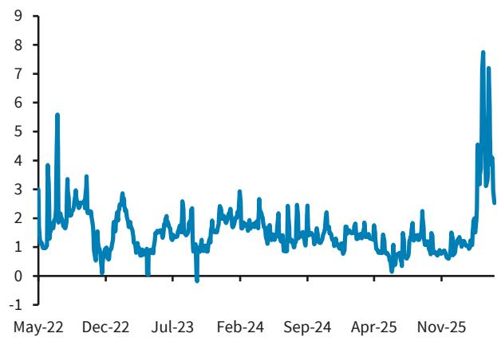

line

| Date    | Value |
|---------|-------|
| May-22  | 3.8   |
| Dec-22  | 5.6   |
| Jul-23  | 0.0   |
| Feb-24  | 2.8   |
| Sep-24  | 1.8   |
| Apr-25  | 1.5   |
| Nov-25  | 7.8   |

Note: WTI Houston minus WTI Cushing, \$/b, 3dma  
Source: Argus, BARC

FIGURE 13. Refining constraints have been harder to address so far, leading to a sharp increase in refining margins   
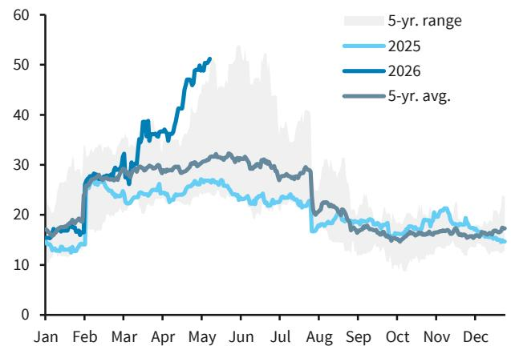

line

| Month | 2025 | 2026 | 5-yr. avg. |
|-------|------|------|------------|
| Jan   | ~14  | ~16  | ~17        |
| Feb   | ~18  | ~28  | ~27        |
| Mar   | ~24  | ~38  | ~30        |
| Apr   | ~26  | ~45  | ~32        |
| May   | ~27  | ~51  | ~33        |
| Jun   | ~25  | ~48  | ~31        |
| Jul   | ~23  | ~45  | ~30        |
| Aug   | ~18  | ~30  | ~28        |
| Sep   | ~17  | ~20  | ~20        |
| Oct   | ~16  | ~18  | ~18        |
| Nov   | ~17  | ~19  | ~17        |
| Dec   | ~15  | ~17  | ~16        |

Note: NYH RBOB minus NYMEX WTI  
Source: Bloomberg, BARC

# Gas prices and inflation risks: What are the channels?

Jonathan Hill, CFA BCI, US

In terms of the risks to US inflation from higher gas prices, there are a few key channels to watch. The first is straightforward, via high gasoline prices into CPI motor fuels, which represents 3.68% of the headline CPI basket (and rising). This is a rapid, predictable and intuitive pass-through the market knows how to track and price, as national average gasoline prices are published daily.

FIGURE 14. AAA gasoline prices vs. CPI motor fuel   
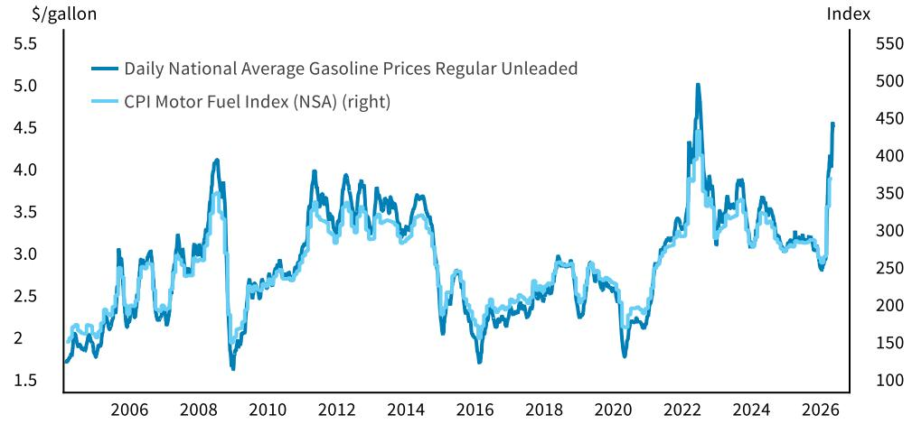

line

| Year | Daily National Average Gasoline Prices Regular Unleaded ($/gallon) | CPI Motor Fuel Index (NSA) (right) |
|------|---------------------------------------------------------------|-------------------------------------|
| 2006 | ~2.5                                                          | ~200                                |
| 2008 | ~4.0                                                          | ~350                                |
| 2010 | ~2.8                                                          | ~250                                |
| 2012 | ~3.8                                                          | ~300                                |
| 2014 | ~3.5                                                          | ~280                                |
| 2016 | ~2.0                                                          | ~220                                |
| 2018 | ~2.8                                                          | ~250                                |
| 2020 | ~1.8                                                          | ~200                                |
| 2022 | ~5.0                                                          | ~450                                |
| 2024 | ~3.5                                                          | ~300                                |
| 2026 | ~4.5                                                          | ~400                                |

Source: AAA, BLS, Macrobond, BARC

To give a sense of scale, mechanically, were retail gasoline prices to rise from \$4.5/gallon to \$5.0/gallon and stay there, at a high that would be an 11.1% increase on 3.68% of the basket, implying a +41bp impulse to the CPI price index, all else equal (if anything, this is likely an understatement, given that the weight in the basket would likely rise).

To go one step further, the inflation and rates markets can take their cue from commodity markets, specifically gasoline futures (ie, Rbob futures), which have informational content as to the forward path for gasoline, and have a more natural correlation to retail gasoline prices than crude oil. After all, consumers buy gallons of gas, not barrels of oil.

The second channel is what is broadly referred to as second-order effects, which capture not only potential spillovers into core inflation (eg, via jet fuel into airline fares, discussed in more detail here), but also potential pass-through into food via higher fertilizer prices and/or diesel (which matters for shipping and transportation, as discussed here). The second-order channel is much more sensitive to how long prices stay elevated, whether inflation expectations begin to shift due to higher energy prices, and whether wages begin to accelerate. After all, it is hard to get a wage price spiral without wage growth. Indeed, the importance of persistence, and generally modest pass-through to core inflation, is consistent with canonical economic models and BARC' research. As a rule of thumb, a 10% persistent increase boosts headline CPI by 0.2pp within one to two months, while feed-through to core is smaller and takes longer (see Oil at \$100/bbl: Peak matters less than persistence, March 6, 2026).

Beyond the near-term price consequence in the next few months, however, the message from rates markets it telling. The richening in forwards has been modest, all things considered, and pales in comparison to that seen in 2022. Indeed, four years ago, the market was signaling that headline inflation from one to two years out (ie, 1y1y CPI swaps) would be well over 3%. By contrast, in 2026, that same metric has certainly risen, but even now, at c.2.7%, is not far off pricing from August-September 2025, right before the FOMC restarted rate cuts.

FIGURE 15. 1y CPI swaps have closely tracked forward gasoline futures   

line

| Date       | 1y    | 1y1y  | 2yfwd1y | 3yfwd1y | 4yfwd1y | 5y5y  | Mar27 RBOB (right) |
| ---------- | ----- | ----- | ------- | ------- | ------- | ----- | ------------------ |
| 2026 Jan   | ~2.30 | ~2.40 | ~2.45   | ~2.45   | ~2.45   | ~2.45 | ~2.15              |
| 2026 Feb   | ~2.50 | ~2.45 | ~2.40   | ~2.40   | ~2.40   | ~2.40 | ~2.45              |
| 2026 Mar   | ~3.30 | ~2.50 | ~2.45   | ~2.45   | ~2.45   | ~2.45 | ~3.00              |
| 2026 Apr   | ~3.20 | ~2.55 | ~2.50   | ~2.50   | ~2.50   | ~2.50 | ~3.30              |
| 2026 May   | ~3.25 | ~2.60 | ~2.55   | ~2.55   | ~2.55   | ~2.55 | ~3.70              |

Source: BARC

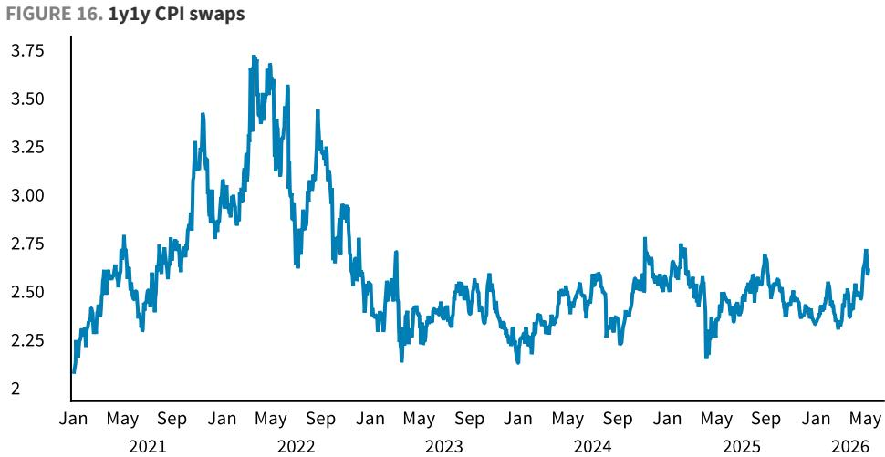

line

| Month-Year | Value |
| ---------- | ----- |
| Jan 2021   | 2.10  |
| May 2021   | 2.75  |
| Sep 2021   | 2.80  |
| Jan 2022   | 3.40  |
| May 2022   | 3.75  |
| Sep 2022   | 3.50  |
| Jan 2023   | 2.90  |
| May 2023   | 2.40  |
| Sep 2023   | 2.50  |
| Jan 2024   | 2.30  |
| May 2024   | 2.60  |
| Sep 2024   | 2.75  |
| Jan 2025   | 2.50  |
| May 2025   | 2.70  |
| Sep 2025   | 2.60  |
| Jan 2026   | 2.40  |
| May 2026   | 2.70  |

Source: BARC

The shape of the Rbob, WTI and Brent futures curves implies near-term inflation, but forward deflation in energy prices. At the time of writing, the WTI futures curve implied crude back below \$80/b (a \~20% decline from spot) as early as Q1 27, and back below \$70/b by 2029. If taken literally, this backwardation implies the opposite of sustained energy price inflation and runs counter to fears of a more sustained and renewed inflation process (we discussed this topic in more detail in Seriously, but not literally, April 30, 2026).

Put together, there is a clear argument for a meaningful inflation impulse resulting from higher near-term energy prices, but uncertainty is pervasive and the dynamics get more complicated, as investors need to the weigh the combination of persistence risks, backwardation in commodity curves and the possibility of demand destruction weighing on consumer spending. Indeed, even as BARC' economists recently raised their near-term inflation forecast and pushed back their rate cut call to March 2027 amid a higher inflation profile, they now forecast sub-2% headline inflation in H2 27 for both CPI and PCE.

# Fuel prices and muni credits

Mikhail Foux BCI, US | Grace Cen BCI, US | Francisco San Emeterio BCI, US | Josh Grasso $^{(v)}$ BCI, US

High energy fuel prices have been affecting municipalities in various ways, but largely the net result has been negative for state residents, as well as some municipal sectors, particularly transportation.

# State oil revenues and gas consumption

Higher oil prices are not entirely negative and should increase hiring. Oil-producing state and local municipalities should benefit if prices remain elevated long enough for them to start revising budgets and increasing employment. However, oil price increases now result in much smaller job gains than in the past, as producers have been striving for higher productivity or higher output with fewer rigs/workers. The main beneficiaries will likely be the largest oilfield services companies, where even a small uptick could result in large job increases for states such as Texas, Louisiana, Oklahoma and New Mexico. Smaller operations should benefit as well, given that even a marginal absolute increase in jobs should result in a large percentage increase, especially in New Mexico, North Dakota, Wyoming and Alaska.

Contrary to common belief, most states will not benefit from higher gas prices, as they implement excise taxes that rely on fixed cents/gallon levies, rather than ad valorem taxes on total sales volumes. Yet there are several states that have either implemented state taxes on gasoline or index fuel prices to inflation/wholesale fuel costs, thus benefiting from higher gasoline and diesel prices. These states, including California, Illinois, Indiana, Michigan and Hawaii, should see their fuel tax revenues increase sUBStantially as a result.

Analyzing our proprietary Barclaycard credit card data, we continue to find evidence of fuel demand destruction amid higher prices this year. Total gallons of fuel purchased is down 9% y/y on a rolling 30-day basis across our US consumer panel as a whole. Underlying this decline, total dollar spending is up 21% y/y, with average fuel costs up 34%, while the number of fill-ups (per month) is down slightly and the number of gallons per fill-up is down 8%. On a state-by-state basis, there is pretty wide dispersion, with California, Montana, Washington, DC, and North Dakota down 15% y/y or more, and New Hampshire and Rhode Island up more than 10%. For more, see the Appendix below on our Credit Card Methodology and our ongoing updates on consumer spending changes in our publication series Tales from the Pump.

FIGURE 17. Barclaycard US consumer implied fuel consumption change (y/y) by state   
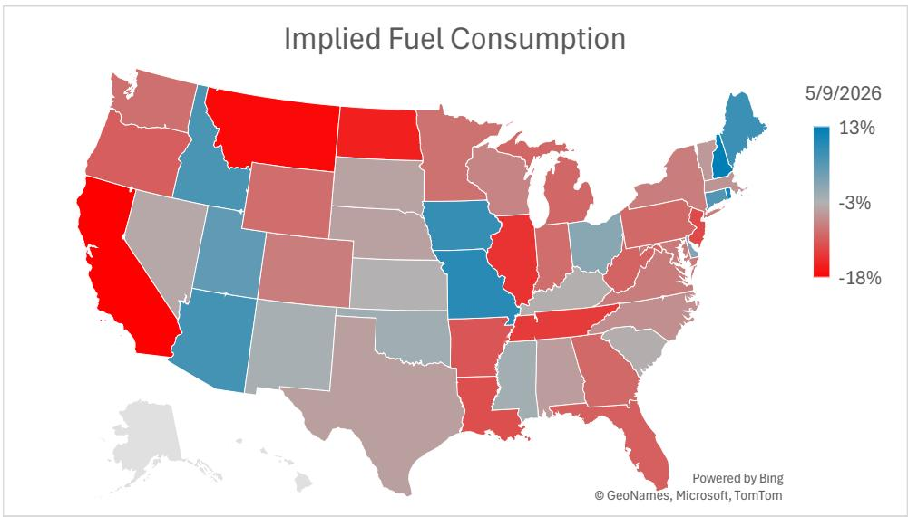  
Source: AAA, Bloomberg, BARC

FIGURE 18. Continuing evidence of fuel demand destruction in our credit card data   
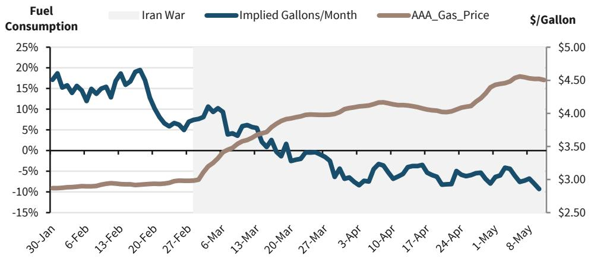

line

| Date     | Implied Gallons/Month | AAA_Gas_Price ($/gallon) |
|----------|------------------------|---------------------------|
| 30-Jan   | ~18%                   | ~$2.75                    |
| 6-Feb    | ~15%                   | ~$2.80                    |
| 13-Feb   | ~19%                   | ~$2.85                    |
| 20-Feb   | ~10%                   | ~$2.90                    |
| 27-Feb   | ~5%                    | ~$2.95                    |
| 6-Mar    | ~10%                   | ~$3.00                    |
| 13-Mar   | ~5%                    | ~$3.25                    |
| 20-Mar   | ~-5%                   | ~$3.50                    |
| 27-Mar   | ~-10%                  | ~$3.75                    |
| 3-Apr    | ~-15%                  | ~$4.00                    |
| 10-Apr   | ~-10%                  | ~$4.25                    |
| 17-Apr   | ~-5%                   | ~$4.30                    |
| 24-Apr   | ~-10%                  | ~$4.40                    |
| 1-May    | ~-5%                   | ~$4.50                    |
| 8-May    | ~-10%                  | ~$4.55                    |

Source: AAA, Bloomberg, BARC

# Toll roads: Dangerous turns

Toll roads, including bridges and tunnels, are among the municipal sectors most sensitive to gas prices.

Outside of freight and business traffic, our credit card data give us a lens into consumer driving trends as it relates to toll roads. We use the Merchant Category Codes (MCCs) for "Tolls and Bridge Fees" (#4754), and count the number of transactions, as an approximation of trips and traffic volume, as opposed to spending, which is influenced by pricing changes. The largest merchants include the multi-states EZ Pass in the Northeast, the Florida SunPass, California's FasTrak, and the North Texas Tollway Authority (NTTA).

Overall, toll transactions are up double digits y/y, and have even accelerated since the onset of the Iran war, contrary to what we may have expected, given the decline in implied fuel demand we are seeing from consumers. However, the largest state contributor is New York, which implemented congestion pricing last year and was hit by an outage in the EZ Pass system, effecting comps. Likewise, new roads in other states have either launched service or have transitioned to an entirely electronic toll system. We believe these fundamental changes are overwhelming any signal that higher fuel prices may be having a negative effect on consumer spending at toll facilities.

FIGURE 19. Transactions (approximating trips) are up double digits y/y despite higher prices...   
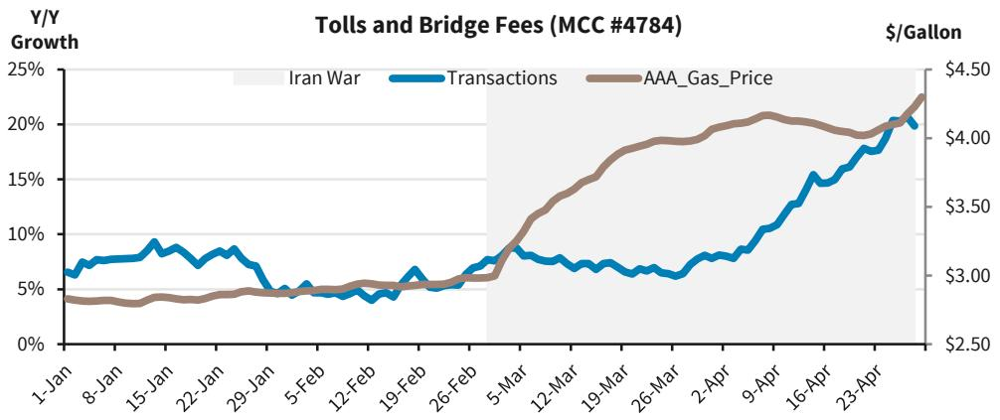

line

| Date     | Iran War | Transactions | AAA_Gas_Price |
|----------|----------|---------------|---------------|
| 1-Jan    |          |               | $3.00         |
| 8-Jan    |          |               | $3.00         |
| 15-Jan   |          |               | $3.00         |
| 22-Jan   |          |               | $3.00         |
| 29-Jan   |          |               | $3.00         |
| 5-Feb    |          |               | $3.00         |
| 12-Feb   |          |               | $3.00         |
| 19-Feb   |          |               | $3.00         |
| 26-Feb   |          |               | $3.00         |
| 5-Mar    |          |               | $3.50         |
| 12-Mar   |          |               | $4.00         |
| 19-Mar   |          |               | $4.00         |
| 26-Mar   |          |               | $4.00         |
| 2-Apr    |          |               | $4.00         |
| 9-Apr    |          |               | $4.00         |
| 16-Apr   |          |               | $4.00         |
| 23-Apr   |          |               | $4.00         |
| 24-Apr   |          |               | $4.50         |

Source: BARC

FIGURE 20. ...Due largely to surging transactions in NY (NYC congestion tolls) and Florida...   
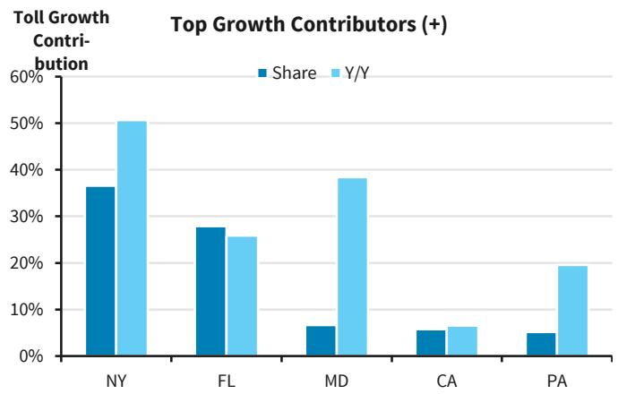

bar

Top Growth Contributors (+)
| State | Share (%) | Y/Y (%) |
| :--- | :--- | :--- |
| NY | 36 | 50 |
| FL | 27 | 25 |
| MD | 6 | 38 |
| CA | 5 | 6 |
| PA | 4 | 19 |

Source: BARC

FIGURE 21. ...While Texas is a notable detractor for nationwide toll transaction volumes   
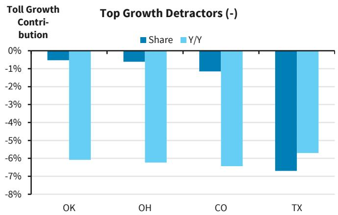

bar

| Ticker | Share  | Y/Y    |
|--------|--------|--------|
| OK     | -0.5%  | -6.0%  |
| OH     | -0.8%  | -6.2%  |
| CO     | -1.2%  | -6.5%  |
| TX     | -7.0%  | -5.8%  |

Source: BARC

Our credit card data set that we discussed above does not include freight traffic. In early 2025, shippers pulled forward imports ahead of tariffs, resulting in a sizable increase in traffic (especially for long-haul trucking), which was followed by a sharp drop in Q3-Q4 25. A surge in traffic in H1 25 makes y/y comps rather difficult, even without taking into account higher diesel prices, which also had a negative effect, as well as cargo disruption through ports due to the US-Iran war; freight traffic in California has been underperforming to the largest degree, while the South (including Texas) has been a relative beneficiary and volumes in the Midwest remained relatively stable.

We also need to take into account the fact that toll roads, bridges and tunnels have been steadily growing toll revenue, and automatic increases—either fixed escalators or indexed to CPI—have become standard across the country. Revenue growth has been outpacing traffic growth by a wide margin, which has helped partially offset potential revenue losses due to moderating traffic volumes.

By region, toll revenue in the Northeast has been growing faster than in other areas. This is partially skewed by large toll increases implemented by the MTA (up 7.5% in 2026), even excluding its congestion fee. But other toll road systems have also been posting solid 3-4% y/y increases, including Port Authority, NJ Turnpike, Delaware River Joint Toll Bridges and Pennsylvania Turnpike. Sun Belt toll revenue (including Florida, Georgia, Texas, etc.) has been increasing rapidly, but due mostly to higher volume growth and steady CPI increases, rather than aggressive toll hikes (ie, for the NTTA and Florida Turnpike). The Midwest has been the slowest-growing region, as states are trying to keep tolls relatively low, especially compared with the Northeast, and the revenue model is much more truck-dependent than other parts of the country (ie, Illinois Tollway). The West is transitioning to dynamic, congestion-based and managed-lane pricing.

Credit spreads of single-A and BBB toll roads, which represent a large portion of the sector, have barely since the US-Iran war began (Figure 22).Toll road spreads widened significantly in 2022 after the start of the Russia-Ukraine war, but this sector underperformance was also partially caused by the onset of the rate hiking cycle. In any case, we think that if gasoline prices remain elevated, we could see more spread widening for toll roads and other related credits.

FIGURE 22. Credit spreads of tax-exempt toll road indices   
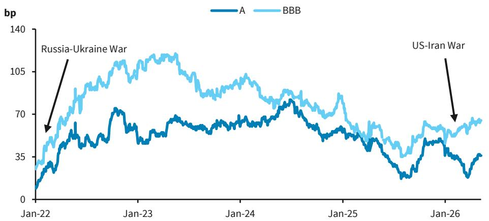

line

| Date     | A    | BBB  |
| -------- | ---- | ---- |
| Jan-22   | ~10  | ~35  |
| Jan-23   | ~70  | ~105 |
| Jan-24   | ~65  | ~100 |
| Jan-25   | ~60  | ~80  |
| Jan-26   | ~35  | ~70  |

Source: BARC FI Indices

# Airlines and airports: The friendly skies get expensive

Another municipal sector that has felt the effects of elevated energy prices is airlines and airports. Airports have remained resilient during the conflict, with spreads compressing relative to other transportation sectors despite their exposure to fuel costs. This has come at a time when airlines are facing mounting pressure, including Spirit's recent liquidation and requests from budget carriers for \$2.5bn in federal support to offset rising jet fuel prices.

International airlines pass the cost of fuel directly to their customers. Cathay Pacific, Air France-KLM and Air India have already added sUBStantial jet fuel surcharges to their long-haul flights this year. US airlines do not simply pass through fuel cost increases; instead, they recover them opportunistically through higher fares and tighter capacity, with the degree and timing of pass-through governed primarily by underlying demand. However, these gradual price increases are also inflationary, and they negatively affect consumers.

During the 2022 oil shock on the back of the Russia-Ukraine war, average fare prices increased for all major airlines, although their capacity also continued to rise. This time, we have seen a sUBStantial increase in fares, but airline capacity has declined (Figure 23 and Figure 24).

FIGURE 23. Average fare price   
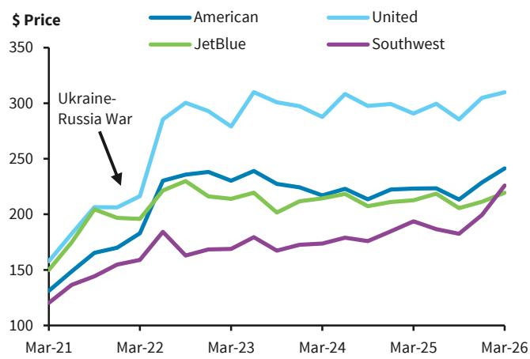

line

| Date   | American | United | JetBlue | Southwest |
|--------|----------|--------|---------|-----------|
| Mar-21 | 130      | 150    | 140     | 120       |
| Mar-22 | 180      | 210    | 190     | 160       |
| Mar-23 | 240      | 310    | 230     | 170       |
| Mar-24 | 220      | 290    | 210     | 180       |
| Mar-25 | 220      | 300    | 210     | 190       |
| Mar-26 | 240      | 310    | 220     | 230       |

Source: Bloomberg

FIGURE 24. Airline capacity (seat miles)   
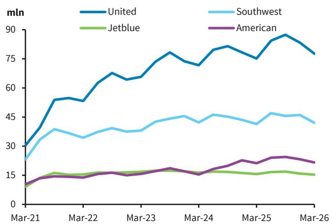

line

| Date   | United | Southwest | Jetblue | American |
|--------|--------|-----------|---------|----------|
| Mar-21 | 30     | 25        | 10      | 10       |
| Mar-22 | 55     | 35        | 15      | 15       |
| Mar-23 | 65     | 40        | 15      | 15       |
| Mar-24 | 75     | 45        | 15      | 15       |
| Mar-25 | 85     | 45        | 15      | 20       |
| Mar-26 | 75     | 40        | 15      | 20       |

Source: Bloomberg

Assuming fuel prices remain elevated and airlines raise ticket prices and cut capacity, small and medium-sized airports, especially in tourist-heavy markets, would be most affected, particularly those that have greater exposure to low-cost airlines. Airports have very strong cost-recovery mechanisms, so we do not expect widespread credit stress, but rather a retreat in more discretionary travel. Our analysis of most major US airports found that Toledo, Fort Lauderdale, Myrtle Beach, Asheville and Orlando have the highest exposure to low-cost carriers (which include JetBlue, Allegiant, Frontier, the now bankrupt Spirit and several smaller airlines).

When we plot airport spreads going back to 2022, we see that both small and large airport spreads have barely widened, as investors continue to overweight the sector (Figure 25). The richness of smaller airports is especially surprising, as they trade just slightly wider than large airports at the moment. In our view, investors should be a bit more cautious on the sector's prospects, given its rich valuations.

FIGURE 25. Credit spreads of tax-exempt airport Indices   
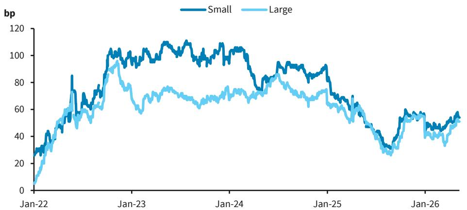

line

| Date   | Small | Large |
|--------|-------|-------|
| Jan-22 | ~30   | ~10   |
| Jan-23 | ~105  | ~95   |
| Jan-24 | ~100  | ~75   |
| Jan-25 | ~85   | ~65   |
| Jan-26 | ~55   | ~45   |

Source: BARC FI Indices

Taking a closer look at Spirit Airlines' recent closure has led to questions about which airlines and airports are most exposed to its routes. A revenue spill analysis from BARC' Equity Research discussed Frontier and JetBlue as the airlines most likely to benefit, although most airlines will pick up additional revenue. These airlines are estimated to have a 16.5% and 13.1% overlap with Spirit, respectively, with the next closest being American, at 5.6%. They estimate that this could lead to 5.5% incremental revenue for Frontier and 2.4% for JetBlue. In Figure 26, we highlight airports that are likely to be most affected by the Spirit shutdown. Myrtle Beach (MYR) and Fort Lauderdale (FLL) are by far the airports with the heaviest concentration, with over 30% of enplanements attributable to the airline. The table also shows the lease structure and the expiration year of the current airline agreement.

Airlines mainly consist of Jetblue, Spirit, Allegiant, and Frontier.   
Source: FAA   
FIGURE 26. Top 10 airports by ultra- & low-cost carrier enplanements 

<table><tr><td>Airport</td><td>Exposure To LCCs and ULCCs</td></tr><tr><td>Toledo Express Airport</td><td>92.0%</td></tr><tr><td>Fort Lauderdale-Hollywood International Airport</td><td>57.2%</td></tr><tr><td>Myrtle Beach International Airport</td><td>49.9%</td></tr><tr><td>Asheville Regional Airport</td><td>43.2%</td></tr><tr><td>Orlando International Airport</td><td>36.5%</td></tr><tr><td>Palm Beach International Airport</td><td>34.5%</td></tr><tr><td>Bradley International Airport</td><td>31.6%</td></tr><tr><td>Boston Logan International Airport</td><td>31.5%</td></tr><tr><td>Southwest Florida International Airport</td><td>30.2%</td></tr><tr><td>Ogdensburg International Airport</td><td>30.0%</td></tr></table>

# Appendix

Josh Grasso $^{(v)}$ BCI, US

# Credit card methodology: Sanity check

Our proprietary Barclaycard credit card data has millions of active users and billions of transactions, going back a decade. We analyze credit card transactions tagged with the Merchant Category Codes (MCCs) for Automated Fuel Dispensers (5542) and for Service Stations (5541), essentially pay at the pump or pay inside. While in-store purchases at service stations include other items besides gas, we also performed this analysis using only Automated Fuel Dispensers and the major conclusion of lower fuel consumption remains the same.

We have access to transaction-level data from our credit credit card panel, but this is restricted to the total dollar transaction amount; we do not explicitly have data on the number of gallons of fuel purchased, or whether it was gasoline or diesel. Therefore, we derive our volume estimates using total spend and average gasoline prices from AAA. Last, we analyze fuel consumption on a y/y basis, given the strong seasonality, especially from February to March, during the transition from the winter to the summer driving season (Figure 6).

# Analyst(s) Certification(s):

We, Mikhail Foux, Amarpreet Singh, Jonathan Hill, CFA, Josh Grasso, Michael McLean, Grace Cen and Francisco San Emeterio, hereby certify (1) that the views expressed in this research report accurately reflect our personal views about any or all of the subject securities or issuers referred to in this research report and (2) no part of our compensation was, is or will be directly or indirectly related to the specific recommendations or views expressed in this research report.

# EQUITY: IMPORTANT DISCLOSURES

BARC is produced by the Investment Bank of BARC Bank PLC and its affiliates (collectively and each individually, "BARC"). All authors contributing to this research report are Research Analysts unless otherwise indicated. The publication date at the top of the report reflects the local time where the report was produced and may differ from the release date provided in GMT.

# Availability of Disclosures:

Where any companies are the subject of this research report, for current important disclosures regarding those companies please refer to https://publicresearch.BARC.com or alternatively send a written request to: BARC Compliance, 745 Seventh Avenue, 13th Floor, New York, NY 10019 or call +1-212-526-1072.

The analysts responsible for preparing this research report have received compensation based upon various factors including the firm's total revenues, a portion of which is generated by investment banking activities, the profitability and revenues of the Markets business and the potential interest of the firm's investing clients in research with respect to the asset class covered by the analyst.

Analysts regularly conduct site visits to view the material operations of covered companies, but BARC policy prohibits them from accepting payment or reimbursement by any covered company of their travel expenses for such visits.

BARC Department produces various types of research including, but not limited to, fundamental analysis, equity-linked analysis, quantitative analysis, and trade ideas. Recommendations contained in one type of BARC may differ from those contained in other types of BARC, whether as a result of differing time horizons, methodologies, or otherwise.

In order to access BARC Statement regarding Research Dissemination Policies and Procedures, please refer to https://

publicresearch.BARC.com/S/RD.htm. In order to access BARC Conflict Management Policy Statement, please refer to: https://publicresearch.BARC.com/S/CM.htm.

# Risk Disclosure(s)

Master limited partnerships (MLPs) are pass-through entities structured as publicly listed partnerships. For tax purposes, distributions to MLP unit holders may be treated as a return of principal. Investors should consult their own tax advisors before investing in MLP units.

# Disclosure(s) regarding Information Sources

Bloomberg® is a trademark and service mark of Bloomberg Finance L.P. and its affiliates (collectively “Bloomberg”) and the Bloomberg Indices are trademarks of Bloomberg. Bloomberg or Bloomberg’s licensors own all proprietary rights in the Bloomberg Indices. Bloomberg does not approve or endorse this material, or guarantee the accuracy or completeness of any information herein, or make any warranty, express or implied, as to the results to be obtained therefrom and, to the maximum extent allowed by law, Bloomberg shall have no liability or responsibility for injury or damages arising in connection therewith.

# Types of investment recommendations produced by BARC Equity Research:

In addition to any ratings assigned under BARC' formal rating systems, this publication may contain investment recommendations in the form of trade ideas, thematic screens, scorecards or portfolio recommendations that have been produced by analysts within Equity Research. Any such investment recommendations shall remain open until they are sUBSequently amended, rebalanced or closed in a future research report.

BARC may also re-distribute equity research reports produced by third-party research providers that contain recommendations that differ from and/or conflict with those published by BARC' Equity Research Department.

# Disclosure of other investment recommendations produced by BARC Equity Research:

BARC Equity Research may have published other investment recommendations in respect of the same securities/instruments recommended in this research report during the preceding 12 months. To view all investment recommendations published by BARC Equity Research in the preceding 12 months please refer to https://live.barcap.com/go/research/Recommendations.

# Legal entities involved in producing BARC:

BARC Bank PLC (BARC, UK)

BARC Capital Inc. (BCI, US)

BARC Bank Ireland PLC, Frankfurt Branch (BBI, Frankfurt)

BARC Bank Ireland PLC, Paris Branch (BBI, Paris)

BARC Bank Ireland PLC, Milan Branch (BBI, Milan)

BARC Securities Japan Limited (BSJL, Japan)

BARC Bank PLC, Hong Kong Branch (BARC Bank, Hong Kong)

BARC Bank Mexico, S.A. (BBMX, Mexico)

BARC Capital Casa de Bolsa, S.A. de C.V. (BCCB, Mexico)

BARC Securities (India) Private Limited (BSIPL, India)

BARC Bank PLC, Singapore Branch (BARC Bank, Singapore)

BARC Bank PLC, DIFC Branch (BARC Bank, DIFC)

# FICC: IMPORTANT DISCLOSURES

BARC is produced by the Investment Bank of BARC Bank PLC and its affiliates (collectively and each individually, "BARC").

All authors contributing to this research report are Research Analysts unless otherwise indicated. The publication date at the top of the report reflects the local time where the report was produced and may differ from the release date provided in GMT.

# Availability of Disclosures:

For current important disclosures regarding any issuers which are the subject of this research report please refer to https://publicresearch.BARC.com or alternatively send a written request to: BARC Compliance, 745 Seventh Avenue, 13th Floor, New York, NY 10019 or call +1-212-526-1072.

BARC Capital Inc. and/or one of its affiliates does and seeks to do business with companies covered in its research reports. As a result, investors should be aware that BARC may have a conflict of interest that could affect the objectivity of this report. BARC Capital Inc. and/or one of its affiliates regularly trades, generally deals as principal and generally provides liquidity (as market maker or otherwise) in the debt securities that are the subject of this research report (and related derivatives thereof). BARC trading desks may have either a long and / or short position in such securities, other financial instruments and / or derivatives, which may pose a conflict with the interests of investing customers. Where permitted and subject to appropriate information barrier restrictions, BARC fixed income research analysts regularly interact with its trading desk personnel regarding current market conditions and prices. BARC fixed income research analysts receive compensation based on various factors including, but not limited to, the quality of their work, the overall performance of the firm (including the profitability of the Investment Banking Department), the profitability and revenues of the Markets business and the potential interest of the firm's investing clients in research with respect to the asset class covered by the analyst. To the extent that any historical pricing information was obtained from BARC trading desks, the firm makes no representation that it is accurate or complete. All levels, prices and spreads are historical and do not necessarily represent current market levels, prices or spreads, some or all of which may have changed since the publication of this document. BARC Department produces various types of research including, but not limited to, fundamental analysis, equity-linked analysis, quantitative analysis, and trade ideas. Recommendations and trade ideas contained in one type of BARC may differ from those contained in other types of BARC, whether as a result of differing time horizons, methodologies, or otherwise.

In order to access BARC Statement regarding Research Dissemination Policies and Procedures, please refer to https://publicresearch.BARC.com/S/RD.htm. In order to access BARC Conflict Management Policy Statement, please refer to: https://publicresearch.BARC.com/S/CM.htm.

# Disclosure(s) regarding Information Sources

Bloomberg $^{\textregistered}$ is a trademark and service mark of Bloomberg Finance L.P. and its affiliates (collectively “Bloomberg”) and the Bloomberg Indices are trademarks of Bloomberg. Bloomberg or Bloomberg’s licensors own all proprietary rights in the Bloomberg Indices. Bloomberg does not approve or endorse this material, or guarantee the accuracy or completeness of any information herein, or make any warranty, express or implied, as to the results to be obtained therefrom and, to the maximum extent allowed by law, Bloomberg shall have no liability or responsibility for injury or damages arising in connection therewith.

# Types of investment recommendations produced by BARC FICC Research:

In addition to any ratings assigned under BARC' formal rating systems, this publication may contain investment recommendations in the form of trade ideas, thematic screens, scorecards or portfolio recommendations that have been produced by analysts in FICC Research. Any such investment recommendations produced by non-Credit Research teams shall remain open until they are sUBSequently amended, rebalanced or closed in a future research report. Any such investment recommendations produced by the Credit Research teams are valid at current market conditions and may not be otherwise relied upon.

# Disclosure of other investment recommendations produced by BARC FICC Research:

BARC FICC Research may have published other investment recommendations in respect of the same securities/instruments recommended in this research report during the preceding 12 months. To view all investment recommendations published by BARC FICC Research in the preceding 12 months please refer to https://live.barcap.com/go/research/Recommendations.

BARC does not assign ratings to municipal securities. BARC may have acted as an underwriter for public offerings of securities of the municipal issuers that are otherwise recommended in trade ideas contained within its municipal research reports.

BARC does not assign ratings to asset backed securities. BARC Capital Inc. and/or one of its affiliates may have acted as an underwriter for public offerings of any asset backed securities that are otherwise recommended in trade ideas contained within its securitised research reports.

# Legal entities involved in producing BARC:

BARC Bank PLC (BARC, UK)

BARC Capital Inc. (BCI, US)

BARC Bank Ireland PLC, Frankfurt Branch (BBI, Frankfurt)

BARC Bank Ireland PLC, Paris Branch (BBI, Paris)

BARC Bank Ireland PLC, Milan Branch (BBI, Milan)

BARC Securities Japan Limited (BSJL, Japan)

BARC Bank PLC, Hong Kong Branch (BARC Bank, Hong Kong)

BARC Bank Mexico, S.A. (BBMX, Mexico)

BARC Capital Casa de Bolsa, S.A. de C.V. (BCCB, Mexico)

BARC Securities (India) Private Limited (BSIPL, India)

BARC Bank PLC, Singapore Branch (BARC Bank, Singapore)

BARC Bank PLC, DIFC Branch (BARC Bank, DIFC)

# Disclaimer:

This publication has been produced by BARC Department in the Investment Bank of BARC Bank PLC and/or one or more of its affiliates (collectively and each individually, "BARC").

It has been prepared for institutional investors and not for retail investors. It has been distributed by one or more BARC affiliated legal entities listed below or by an independent and non-affiliated third-party entity (as may be communicated to you by such third-party entity in its communications with you). It is provided for information purposes only, and BARC makes no express or implied warranties, and expressly disclaims all warranties of merchantability or fitness for a particular purpose or use with respect to any data included in this publication. To the extent that this publication states on the front page that it is intended for institutional investors and is not subject to all of the independence and disclosure standards applicable to debt research reports prepared for retail investors under U.S. FINRA Rule 2242, it is an “institutional debt research report” and distribution to retail investors is strictly prohibited. BARC also distributes such institutional debt research reports to various issuers, media, regulatory and academic organisations for their own internal informational news gathering, regulatory or academic purposes and not for the purpose of making investment decisions regarding any debt securities. Media organisations are prohibited from re-publishing any opinion or recommendation concerning a debt issuer or debt security contained in any BARC institutional debt research report. Any such recipients that do not want to continue receiving BARC institutional debt research reports should contact debtresearch@BARC.com. Unless clients have agreed to receive “institutional debt research reports” as required by US FINRA Rule 2242, they will not receive any such reports that may be co-authored by non-debt research analysts. Eligible clients may get access to such cross asset reports by contacting debtresearch@BARC.com. BARC will not treat unauthorized recipients of this report as its clients and accepts no liability for use by them of the contents which may not be suitable for their personal use. Prices shown are indicative and BARC is not offering to buy or sell or soliCiting offers to buy or sell any financial instrument.

Without limiting any of the foregoing and to the extent permitted by law, in no event shall BARC, nor any affiliate, nor any of their respective officers, directors, partners, or employees have any liability for (a) any special, punitive, indirect, or consequential damages; or (b) any lost profits, lost revenue, loss of anticipated savings or loss of opportunity or other financial loss, even if notified of the possibility of such damages, arising from any use of this publication or its contents.

Other than disclosures relating to BARC, the information contained in this publication (including third-party data) has been obtained from sources that BARC believes to be reliable, but BARC does not represent or warrant that it is accurate or complete. Third-party data, including third-party forecasts and predictions, is provided for information purposes only, has not been adopted or endorsed by BARC, and does not represent the views or opinions of BARC. Presentations by Third-Party Speakers: Any views or opinions expressed by third-party speakers during a BARC-hosted event are solely those of the speaker and do not represent the views or opinions of BARC. BARC is not responsible for, and makes no warranties whatsoever as to, the information or opinions contained in any written, electronic, audio or video presentations by any third-party speakers, and such presentations have not been adopted or endorsed by BARC and do not represent the views or opinions of BARC. Content from third-party presentations is provided for information purposes only and has not been independently verified by BARC for its accuracy or completeness.

The views in this publication are solely and exclusively those of the authoring analyst(s) and are subject to change, and BARC has no obligation to update its opinions or the information in this publication. Unless otherwise disclosed herein, the analysts who authored this report have not received any compensation from the subject companies in the past 12 months. If this publication contains recommendations, they are general recommendations that were prepared independently of any other interests, including those of BARC and/or its affiliates, and/or the subject companies. This publication does not contain personal investment recommendations or investment advice or take into account the individual financial circumstances or investment objectives of the clients who receive it. BARC is not a fiduciary to any recipient of this publication. The securities and other investments discussed herein may not be suitable for all investors and may not be available for purchase in all jurisdictions. The United States imposed sanctions on certain Chinese companies (https://ofac.treasury.gov/sanctions-programs-and-country-information/chinese-military-companies-sanctions), which may restrict U.S. persons from purchasing securities issued by those companies. Investors must independently evaluate the merits and risks of the investments discussed herein, including any sanctions restrictions that may apply, consult any independent advisors they believe necessary, and exercise independent judgment with regard to any investment decision. The value of and income from any investment may fluctuate from day to day as a result of changes in relevant economic markets (including changes in market liquidity). The information herein is not intended to predict actual results, which may differ sUBStantially from those reflected. Past performance is not necessarily indicative of future results. The information provided does not constitute a financial benchmark and should not be used as a submission or contribution of input data for the purposes of determining a financial benchmark.

This publication is not investment company sales literature as defined by Section 270.24(b) of the US Investment Company Act of 1940, nor is it intended to constitute an offer, promotion or recommendation of, and should not be viewed as marketing (including, without limitation, for the purposes of the UK Alternative Investment Fund Managers Regulations 2013 (SI 2013/1773) or AIFMD (Directive 2011/61)) or pre-marketing (including, without limitation, for the purposes of Directive (EU) 2019/1160) of the securities, products or issuers that are the subject of this report.

Third Party Distribution: Any views expressed in this communication are solely those of BARC and have not been adopted or endorsed by any third party distributor.

United Kingdom: This document is being distributed (1) only by or with the approval of an authorised person (BARC Bank PLC) or (2) to, and is directed at (a) persons in the United Kingdom having professional experience in matters relating to investments and who fall within the definition of "investment professionals" in Article 19(5) of the Financial Services and Markets Act 2000 (Financial Promotion) Order 2005 (the "Order"); or (b) high net worth companies, unincorporated associations and partnerships and trustees of high value trusts as described in Article 49(2) of the Order; or (c) other persons to whom it may otherwise lawfully be communicated (all such persons being "Relevant Persons"). Any investment or investment activity to which this communication relates is only available to and will only be engaged in with Relevant Persons. Any other persons who receive this communication should not rely on or act upon it. BARC Bank PLC is authorised by the Prudential Regulation Authority and regulated by the Financial Conduct Authority and the Prudential Regulation Authority and is a member of the London Stock Exchange.

European Economic Area (“EEA”): This material is being distributed to any “Authorised User” located in a Restricted EEA Country by BARC Bank Ireland PLC. The Restricted EEA Countries are Austria, Bulgaria, Estonia, Finland, Hungary, Iceland, Liechtenstein, Lithuania, Luxembourg, Malta,

Portugal, Romania, Slovakia and Slovenia. For any other “Authorised User” located in a country of the European Economic Area, this material is being distributed by BARC Bank PLC. BARC Bank Ireland PLC is a bank authorised by the Central Bank of Ireland whose registered office is at 1 Molesworth Street, Dublin 2, Ireland. BARC Bank PLC is not registered in France with the Autorité des marchés financiers or the Autorité de contrôle prudentiel. Authorised User means each individual associated with the Client who is notified by the Client to BARC and authorised to use the Research Services. The Restricted EEA Countries will be amended if required.

Finland: Notwithstanding Finland's status as a Restricted EEA Country, Research Services may also be provided by BARC Bank PLC where permitted by the terms of its cross-border license.

Americas: The Investment Bank of BARC Bank PLC undertakes U.S. securities business in the name of its wholly owned sUBSidiary BARC Capital Inc., a FINRA and SIPC member. BARC Capital Inc., a U.S. registered broker/dealer, is distributing this material in the United States and, in connection therewith accepts responsibility for its contents. Any U.S. person wishing to effect a transaction in any security discussed herein should do so only by contacting a representative of BARC Capital Inc. in the U.S. at 745 Seventh Avenue, New York, New York 10019.

Non-U.S. persons should contact and execute transactions through a BARC Bank PLC branch or affiliate in their home jurisdiction unless local regulations permit otherwise.

This material is distributed in Canada by BARC Capital Canada Inc., a registered investment dealer, a Dealer Member of Canadian Investment Regulatory Organization (www.ciro.ca), and a Member of the Canadian Investor Protection Fund (CIPF).

This material is distributed in Mexico by BARC Bank Mexico, S.A. and/or BARC Capital Casa de Bolsa, S.A. de C.V. This material is distributed in the Cayman Islands and in the Bahamas by BARC Capital Inc., which it is not licensed or registered to conduct and does not conduct business in, from or within those jurisdictions and has not filed this material with any regulatory body in those jurisdictions.

Japan: This material is being distributed to institutional investors in Japan by BARC Securities Japan Limited. BARC Securities Japan Limited is a joint-stock company incorporated in Japan with registered office of 6-10-1 Roppongi, Minato-ku, Tokyo 106-6131, Japan. It is a sUBSidiary of BARC Bank PLC and a registered financial instruments firm regulated by the Financial Services Agency of Japan. Registered Number: Kanto Zaimukyokucho (kinsho) No. 143.

Asia Pacific (excluding Japan): BARC Bank PLC, Hong Kong Branch is distributing this material in Hong Kong as an authorised institution regulated by the Hong Kong Monetary Authority. Registered Office: 41/F, Cheung Kong Center, 2 Queen's Road Central, Hong Kong.

All Indian securities-related research and other equity research produced by BARC' Investment Bank are distributed in India by BARC Securities (India) Private Limited (BSIPL). BSIPL is a company incorporated under the Companies Act, 1956 having CIN U67120MH2006PTC161063. BSIPL is registered and regulated by the Securities and Exchange Board of India (SEBI) as a Research Analyst: INH000001519; Portfolio Manager INP000002585; Stock Broker INZ000269539 (member of NSE and BSE); Depository Participant with the National Securities & Depositories Limited (NSDL): DP ID: IN-DP-NSDL-478-2020; Investment Adviser: INA000000391. BSIPL is also registered as a Mutual Fund Advisor having AMFI ARN No. 53308. The registered office of BSIPL is at Nirlon Knowledge Park, 9th floor, Block B-6, Off. Western Express Highway, Goregaon (East), Mumbai – 400063, India. Telephone No: +91 22 61754000 Fax number: +91 22 61754099. Any other reports produced by BARC' Investment Bank are distributed in India by BARC Bank PLC, India Branch, an associate of BSIPL in India that is registered with Reserve Bank of India (RBI) as a Banking Company under the provisions of The Banking Regulation Act, 1949 (Regn No BOM43) and registered with SEBI as Merchant Banker (Regn No INM000002129) and also as Banker to the Issue (Regn No INBI00000950). BARC Investments and Loans (India) Limited, registered with RBI as Non Banking Financial Company (Regn No RBI CoR-07-00258), and BARC Wealth Trustees (India) Private Limited, registered with Registrar of Companies (CIN U93000MH2008PTC188438), are associates of BSIPL in India that are not authorised to distribute any reports produced by BARC' Investment Bank.

This material is distributed in Singapore by the Singapore Branch of BARC Bank PLC, a bank licensed in Singapore by the Monetary Authority of Singapore. For matters in connection with this material, recipients in Singapore may contact the Singapore branch of BARC Bank PLC, whose registered address is 10 Marina Boulevard, #23-01 Marina Bay Financial Centre Tower 2, Singapore 018983.

This material, where distributed to persons in Australia, is produced or provided by BARC Bank PLC.

This communication is directed at persons who are a “Wholesale Client” as defined by the Australian Corporations Act 2001.

Please note that the Australian Securities and Investments Commission (ASIC) has provided certain exemptions to BARC Bank PLC (BBPLC) under paragraph 911A(2)(I) of the Corporations Act 2001 from the requirement to hold an Australian financial services licence (AFSL) in respect of financial services provided to Australian Wholesale Clients, on the basis that BBPLC is authorised by the Prudential Regulation Authority of the United Kingdom (PRA) and regulated by the Financial Conduct Authority (FCA) of the United Kingdom and the PRA under United Kingdom laws. The United Kingdom has laws which differ from Australian laws. To the extent that this communication involves the provision of financial services by BBPLC to Australian Wholesale Clients, BBPLC relies on the relevant exemption from the requirement to hold an AFSL. Accordingly, BBPLC does not hold an AFSL.

This communication may be distributed to you by either: (i) BARC Bank PLC directly, (ii) Barrenjoey Markets Pty Limited (ACN 636 976 059, "Barrenjoey"), the holder of Australian Financial Services Licence (AFSL) 521800, a non-affiliated third party distributor, where clearly identified to you by Barrenjoey. Barrenjoey is not an agent of BARC Bank PLC or (iii) such other non-affiliated third-party distributor(s) as may be clearly identified to you. Such non-affiliated third-party distributor(s) are not agents of BARC Bank PLC.

This material, where distributed in New Zealand, is produced or provided by BARC Bank PLC. BARC Bank PLC is not registered, filed with or approved by any New Zealand regulatory authority. This material is not provided under or in accordance with the Financial Markets Conduct Act of 2013 (“FMCA”), and is not a disclosure document or “financial advice” under the FMCA. This material is distributed to you by either: (i) BARC Bank PLC directly or (ii) Barrenjoey Markets Pty Limited (“Barrenjoey”), a non-affiliated third party distributor, where clearly identified to you by Barrenjoey. Barrenjoey is not an agent of BARC Bank PLC. This material may only be distributed to “wholesale investors” that meet the “investment business”, “investment activity”, “large”, or “government agency” criteria specified in Schedule 1 of the FMCA.

Middle East: Nothing herein should be considered investment advice as defined in the Israeli Regulation of Investment Advisory, Investment Marketing and Portfolio Management Law, 1995 (“Advisory Law”). This document is being made to eligible clients (as defined under the Advisory Law) only. BARC Israeli branch previously held an investment marketing license with the Israel Securities Authority but it cancelled such license on 30/11/2014 as it solely provides its services to eligible clients pursuant to available exemptions under the Advisory Law, therefore a license with the Israel Securities Authority is not required. Accordingly, BARC does not maintain an insurance coverage pursuant to the Advisory Law.

This material is distributed in the United Arab Emirates (including the Dubai International Financial Centre) and Qatar by BARC Bank PLC. BARC Bank PLC in the Dubai International Financial Centre (Registered No. 0060) is regulated by the Dubai Financial Services Authority (DFSA). Principal place of business in the Dubai International Financial Centre: The Gate Village, Building 4, Level 4, PO Box 506504, Dubai, United Arab Emirates. BARC Bank PLC-DIFC Branch, may only undertake the financial services activities that fall within the scope of its existing DFSA licence. Related financial products or services are only available to Professional Clients, as defined by the Dubai Financial Services Authority. BARC Bank PLC in the UAE is regulated by the Central Bank of the UAE and is licensed to conduct business activities as a branch of a commercial bank incorporated outside the UAE in Dubai (Licence No.: 13/1844/2008, Registered Office: Building No. 6, Burj Dubai Business Hub, Sheikh Zayed Road, Dubai City) and Abu Dhabi (Licence No.: 13/952/2008, Registered Office: Al Jazira Towers, Hamdan Street, PO Box 2734, Abu Dhabi). This material does not constitute or form part of any offer to issue or sell, or any solicitation of any offer to sUBScribe for or purchase, any securities or investment products in the UAE (including the Dubai International Financial Centre) and accordingly should not be construed as such. Furthermore, this information is being made available on the basis that the recipient acknowledges and understands that the entities and securities to which it may relate have not been approved, licensed by or registered with the UAE Central Bank, the Dubai Financial Services Authority or any other relevant licensing authority or governmental agency in the UAE. The content of this report has not been approved by or filed with the UAE Central Bank or Dubai Financial Services Authority. BARC Bank PLC in the Qatar Financial Centre (Registered No. 00018) is authorised by the Qatar Financial Centre Regulatory Authority (QFCRA). BARC Bank PLC-QFC Branch may only undertake the regulated activities that fall within the scope of its existing QFCRA licence. Principal place of business in Qatar: Qatar Financial Centre, Office 1002, 10th Floor, QFC Tower, Diplomatic Area, West Bay, PO Box 15891, Doha, Qatar. Related financial products or services are only available to Business Customers as defined by the Qatar Financial Centre Regulatory Authority.

Russia: This material is not intended for investors who are not Qualified Investors according to the laws of the Russian Federation as it might contain information about or description of the features of financial instruments not admitted for public offering and/or circulation in the Russian Federation and thus not eligible for non-Qualified Investors. If you are not a Qualified Investor according to the laws of the Russian Federation, please dispose of any copy of this material in your possession.

Sustainable Investing Related Research: There is currently no globally accepted framework or definition (legal, regulatory or otherwise) of, nor market consensus as to what constitutes a ‘sustainable’, ‘ESG’, ‘green’, ‘climate-friendly’ or an equivalent company, investment, strategy or consideration or what precise attributes are required to be eligible to be categorised by such terms. This means there are different ways to evaluate a company or an investment and so different values may be placed on certain sustainability credentials as well as adverse ESG-related impacts of companies and ESG controversies. The evolving nature of sustainable investing considerations, models and methodologies means it can be challenging to definitively and universally classify a company or investment under a sustainable investing label and there may be areas where such companies and investments could improve or where adverse ESG-related impacts or ESG controversies exist. The evolving nature of sustainable finance related regulations and the development of jurisdiction-specific regulatory criteria also means that there is likely to be a degree of divergence as to the interpretation of such terms in the market. We expect industry guidance, market practice, and regulations in this field to continue to evolve.

Any information, data, image, or other content including from a third party source contained, referred to herein or used for whatsoever purpose by BARC or a third party (“Information”), in relation to any actual or potential ‘ESG’, ‘sustainable’ or equivalent objective, issue, factor or consideration is not intended to be relied upon for ESG or sustainability classification, regulatory regime or industry initiative purposes (“ESG Regimes”), unless otherwise stated. Nothing in these materials, including any images included therein, is intended to convey, suggest or indicate that BARC considers or represents any product, service, person or body mentioned in these materials as meeting or qualifying for any ESG or sustainability classification, label or similar standards that may exist under ESG Regimes. BARC has not conducted any assessment of compliance with ESG Regimes. Parties are reminded to make their own assessments for these purposes.

IRS Circular 230 Prepared Materials Disclaimer: BARC does not provide tax advice and nothing contained herein should be construed to be tax advice. Please be advised that any discussion of U.S. tax matters contained herein (including any attachments) (i) is not intended or written to be used, and cannot be used, by you for the purpose of avoiding U.S. tax-related penalties; and (ii) was written to support the promotion or marketing of the transactions or other matters addressed herein. Accordingly, you should seek advice based on your particular circumstances from an independent tax advisor.

© Copyright BARC Bank PLC (2026). All rights reserved. No part of this publication may be reproduced or redistributed in any manner without the prior written permission of BARC. BARC Bank PLC is registered in England No. 1026167. Registered office 1 Churchill Place, London, E14 5HP. Additional information regarding this publication will be furnished upon request.

BRCF2242