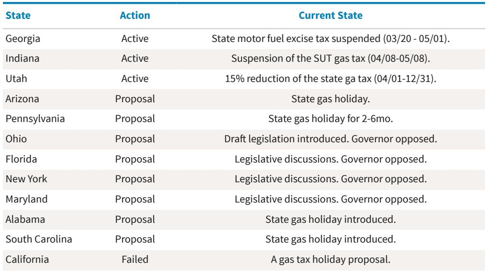

# 市场真正低估的不是油价，而是高油价持续的时间长度

当前全球石油市场面临的供应中断规模已远超2022年，但通胀预期和信用利差却显得异常平静。这种脱节背后隐藏着一个关键判断：市场正在用2022年的剧本定价2026年，但这一次的变量完全不同。

某外资投行最新发布的研报提出一个值得深思的观点——真正影响中期选举、通胀预期和市政信用风险的，不是油价是否触及5美元/加仑的峰值，而是这个价格能持续多久。报告明确指出，13%的全球石油供应目前处于离线状态，而2022年这一数字仅为3%。尽管中国需求有所下降，但供应侧的冲击烈度已经不可同日而语。

然而，与2022年形成鲜明对比的是，通胀预期并未同步飙升，收费公路和机场信用利差也保持相对稳定。如果2022年的逻辑完全重演，一年至两年期的通胀互换利率应该远高于3%，而评级较低的收费公路和中小型机场（尤其是旅游密集市场）的信用利差将面临显著压力。

这种脱节意味着什么？市场可能正在犯一个系统性错误。

## 1. 供应中断的规模已经超过2022年，但需求调整尚未到位

从数据上看，当前的市场紧张程度远超2022年。全球约13%的石油供应因各种原因离线，而2022年俄乌冲突爆发时的比例仅为3%。报告特别指出，虽然中国需求有所回落，但这一缓冲远不足以抵消供应侧的收缩。

更值得关注的是，美国零售汽油价格目前比2022年同期高出0.18美元/加仑，且自伊朗冲突爆发以来的涨幅（30%）也超过了2022年同期的涨幅。这意味着，即使不考虑通胀调整，当前的价格压力已经逼近甚至超过了2022年的水平。

但需求侧的反应明显滞后。报告分析显示，美国汽油库存按需求天数计算已接近季节性区间的低端。随着库存继续下降，成品油价格可能进一步攀升，直到供应问题得到解决或需求出现更显著的下调。历史数据表明，零售价格50%的涨幅通常只会导致3-4%的需求下降，这与当前供应中断的规模完全不成比例。

这里的关键洞察是：供应冲击的烈度正在超越市场的线性预期，而需求对高油价的反应存在明显时滞。这意味着，价格上行的风险可能被系统性低估。

## 2. 真正影响政治和通胀的，是油价在高位停留的时间，而非峰值

2022年的经验提供了一个重要参照。当年6月，美国全国平均汽油价格触及5.01美元/加仑的峰值，但到11月中期选举时，价格已回落至仅比俄乌冲突前高出0.2美元的水平。那次价格飙升持续了大约16周。最终，汽油价格并未成为中期选举的主导议题——出口民调显示，选民最关心的是广义通胀（31%）和堕胎权（27%）。

报告的核心判断是：决定政治后果的并非价格峰值，而是高价格持续的时间。如果5美元/加仑的价格持续数周甚至数月，其政治影响将完全不同于2022年的短暂飙升。对于即将面临中期选举的共和党议员而言，这是一个不容忽视的风险。

从通胀传导机制看，报告指出，汽油价格持续上涨10%，通常会在1-2个月内推动整体CPI上升0.2个百分点，而对核心通胀的传导更慢且幅度更小。但关键在于，如果高油价持续的时间足够长，这种传导效应会逐步累积，最终可能改变通胀预期。

这一点对投资者的含义是：不要只盯着油价是否突破某个心理关口，而要关注它在高位停留的周数。后者才是决定政策反应、消费者行为和资产定价的核心变量。

## 3. 政策工具箱已经接近极限，战略储备释放的空间有限

报告详细梳理了当前政府可用的政策工具，结论并不乐观。政府已经采取了多项措施，包括战略石油储备（SPR）释放、制裁豁免、琼斯法案豁免、EPA豁免允许夏季销售E15燃料等。但报告认为，在短期内，除非通过军事手段重新开放霍尔木兹海峡或与伊朗达成协议，政府几乎没有其他有效工具来为油价设定上限。

联邦汽油税假期虽然被提及，但可行性存疑。报告指出，即使实施，三个月的联邦汽油税假期平均每人仅能节省5-14美元。更重要的是，联邦汽油税是高速公路信托基金的主要资金来源，该基金预计在2028财年耗尽。如果汽油税假期持续六个月以上，高速公路信托基金可能在2027年上半年就面临资金枯竭。

出口限制虽然法律上可行，但政府已多次表示不在考虑范围内。而且，美国的汽油消费并非自给自足——国内生产以轻质原油为主，而许多炼油厂配置为加工重质原油。此外，国内原油运输基础设施也不足以高效替代出口。

州层面的行动则更为分散。佐治亚、印第安纳和犹他州已实施或部分实施汽油税假期，另有约十个州正在考虑类似提案。但加州已经否决了汽油税假期，转而聚焦于针对性的收入补贴和电动汽车激励。

这一分析揭示了一个重要结论：政策缓冲空间远小于市场预期。如果油价持续高位，政策反应可能滞后且效果有限，这意味着市场不能依赖政策干预作为价格上限的保障。

## 4. 信用市场可能低估了高油价对市政债的尾部风险

报告在信用市场部分提出了一个尚未充分展开但值得深思的线索。当前收费公路和机场信用利差保持相对稳定，与2022年形成对比。但如果高油价持续，这一逻辑可能面临挑战。

具体而言，高油价会直接影响出行成本，进而降低收费公路的交通流量和机场的旅客吞吐量。对于评级较低的收费公路和中小型机场，尤其是那些依赖旅游市场的标的，这种影响可能更为显著。报告提到，精神航空（Spirit Airlines）的清算已经是一个警示信号。

更值得关注的是，如果通胀预期因高油价持续而重新上行，利率环境可能进一步收紧，这将加大市政债发行人的再融资压力。高油价、高通胀、高利率三者叠加，可能形成对市政信用的三重打击。

这一节的核心洞察是：当前信用利差的平静可能是一种假象。市场尚未充分定价高油价持续对市政债基本面的二阶影响，尤其是对旅游相关基础设施和评级较低发行人的冲击。

## 5. 报告尚未完全回答的关键问题：需求破坏的临界点在哪里

报告在分析中承认，当前需求对高油价的反应远未达到供应冲击的程度。但一个关键问题没有被充分回答：需求破坏的临界点在哪里？换言之，油价需要涨到什么水平、持续多久，才会引发显著的需求下降？

历史数据提供了一些参考。2022年，当汽油价格在5美元/加仑附近持续约16周后，需求确实出现了下降。但这一次的初始条件不同——消费者在经历了2022年的高油价后，可能已经调整了行为模式，也可能因为通胀累积而更加脆弱。

另一个未解的问题是战略石油储备的释放空间。2022年的大规模释放已经大幅消耗了储备库存，当前可动用的战略储备远少于当时。报告虽然提到了SPR释放，但没有详细测算当前剩余的战略储备能在多大程度上缓解供应压力。

这些未解问题恰恰是投资者需要持续跟踪的核心变量。它们决定了高油价持续时间的上限，进而决定了其对政治、通胀和信用的实际影响。

## 6. 一个需要持续跟踪的观察框架

基于上述分析，我们可以提炼出一个三层观察框架，用于评估高油价的持续性和影响：

第一层：供给侧的演变。霍尔木兹海峡的通行状况、伊朗谈判的进展、美国国内原油产量的变化。这些是决定供应中断能否缓解的根本变量。

第二层：需求侧的反应。汽油零售价格与出行需求之间的弹性关系，尤其是夏季驾驶高峰期的需求数据。如果需求在价格持续高位时仍保持韧性，意味着价格上行的空间可能超出预期。

第三层：政策响应的时滞。从州级的汽油税假期到联邦层面的战略储备释放，再到可能的出口限制，政策工具的实施速度和效果将决定高油价持续的时间长度。

这三个层面的相互作用，将最终决定2026年的高油价是否会重演2022年的剧本——还是走向一个更持久、影响更深远的情景。

---

报告中对市政信用市场的分析远不止于此，包括不同评级、不同地区的收费公路和机场信用利差如何对油价敏感，以及高油价与高利率叠加下的尾部风险情景。这些内容在本文中受限于篇幅无法展开。

如果您希望获取完整的研报解读与原始图表，欢迎来星球微信群里继续讨论。我们会在群内分享更详细的数据拆解和情景分析，包括报告中对各类政策工具效果的量化测算，以及对市政债投资组合的启示。

Personal reading notes and learning share only. Not investment advice.

