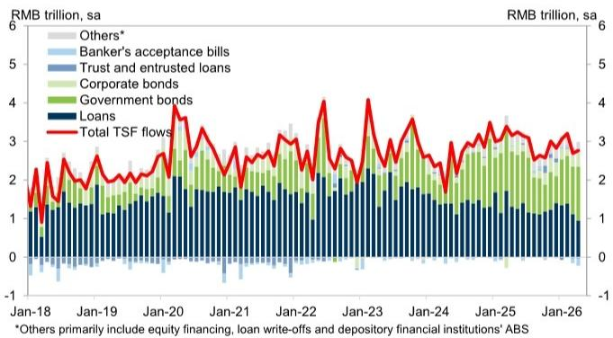
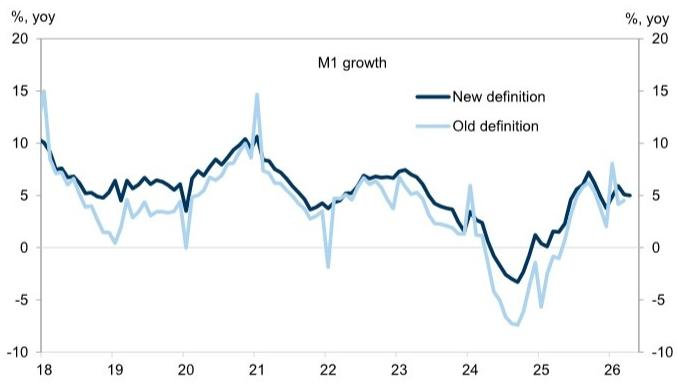

# China's April Credit Collapse Is Not a Liquidity Problem — It Is a Demand Problem

The April credit data from China was not merely a miss. It was a structural signal that the economy's borrowing machinery is no longer responding to standard policy levers. New RMB loans to the real economy turned negative for the first time since July 2025, printing at negative RMB 400 billion against a consensus expectation of positive RMB 300 billion. Total social financing flows came in at roughly half of what the market anticipated. This is not a seasonal blip or a technical adjustment. It is a confirmation that the transmission mechanism from policy easing to real-economy credit creation has become impaired.

The market's immediate reaction will be to focus on the headline disappointment. The more important question is why this happened and what it means for the trajectory of Chinese economic growth over the next twelve months. The answer lies not in bank balance sheets or regulatory constraints, but in the behavior of borrowers themselves. When mid-to-long-term corporate loans decline by RMB 410 billion in a single month while bill financing surges by over RMB 1.2 trillion, the pattern is unmistakable: companies are borrowing to fill quota, not to invest. They are managing liquidity, not building capacity.

This distinction matters because it changes the policy calculus. If credit weakness were a supply-side issue — banks unwilling to lend — the remedy would be straightforward: cut reserve requirements, lower interest rates, or relax regulatory oversight. But when the problem is demand-side — borrowers unwilling to take on long-term commitments — the toolkit becomes far more limited. The April data suggests China has entered a phase where monetary accommodation is hitting diminishing returns, and the burden of stimulus must shift to fiscal channels and structural reforms.

The timing of this shift is critical. With the full-year total social financing growth forecast now revised down to 8.0% year-on-year from a prior 8.5%, the implied deceleration is not trivial. It represents hundreds of billions of renminbi in foregone credit intermediation. For investors, the question is no longer whether policy will ease further. It is whether further easing can achieve its intended effect, and if not, what the second-order consequences will be for asset prices, corporate earnings, and the renminbi.

## The Decline in Loan Stock Was Broad-Based, but the Surge in Bill Financing Reveals the True Nature of the Weakness

A surface-level reading of the April data might suggest that the credit contraction was concentrated in specific sectors. That would be misleading. The decline in outstanding RMB loan stock was broad-based across household and corporate lending, with one glaring exception: bill financing. This is the tell.

Bill financing is a short-term form of bank lending that carries minimal credit risk and serves primarily as a quota-filling mechanism. When banks have unused loan quotas at month-end or quarter-end, they extend bill financing to meet regulatory or internal targets. The fact that bill financing surged to RMB 1,243 billion in April — nearly 50% higher than the same month a year ago — while mid-to-long-term corporate loans contracted by RMB 410 billion tells a precise story. Banks are willing to lend, but they cannot find creditworthy borrowers willing to take on term debt for investment purposes.

Household behavior reinforces this interpretation. Household loan stock declined by RMB 787 billion in April, significantly worse than the RMB 522 billion decline a year earlier. This is not a mortgage market under temporary stress. It is a household sector that is actively deleveraging — paying down existing debt rather than taking on new obligations. In an economy where consumption has been touted as the next growth engine, a household sector that is shrinking its balance sheet is a warning that cannot be ignored.

The official media explanation — that stronger corporate bond issuance has sUBStituted for bank lending — is partially true but incomplete. Corporate and government bond issuance did rise to RMB 1,741 billion in April from RMB 1,429 billion in March. Lower financing costs in the bond market have made debt capital markets more attractive relative to bank loans. But sUBStitution effects of this magnitude do not explain the entirety of the shortfall. If bond issuance were merely replacing bank loans, total social financing would have remained stable. It did not. The TSF stock growth edged down to 7.8% year-on-year from 7.9%, and the absolute flow was barely half of consensus expectations.

The implication is clear: the sUBStitution narrative is a partial explanation at best. The deeper issue is that aggregate credit demand — whether through banks or bonds — is structurally weaker than the consensus had assumed.

## The Divergence Between M1 and M2 Growth Points to a Fiscal Transmission Problem, Not a Monetary One

One of the more subtle but revealing signals in the April data is the divergence between M1 and M2 growth. M1 growth edged down to 5.0% year-on-year from 5.1%, while M2 growth edged up to 8.6% from 8.5%. On the surface, this looks like a modest divergence. In practice, it reveals a critical weakness in how policy stimulus is reaching the real economy.

M1 measures money in circulation that is readily available for spending — cash and demand deposits held by households and businesses. M2 includes M1 plus savings deposits, time deposits, and other near-money instruments. When M2 is growing faster than M1, it typically indicates that money is being created but not spent. It is sitting in savings accounts, money market funds, or time deposits rather than circulating through the economy.

The driver of this divergence in April was fiscal deposits. Fiscal deposits increased by RMB 739 billion in April, which was RMB 368 billion higher than the increase a year earlier. This implies that government spending is not keeping pace with revenue or borrowing. The government is accumulating cash rather than deploying it. This is the opposite of what a stimulus program is supposed to do.

The mechanism matters. When the government borrows and spends, it injects liquidity directly into the real economy — paying contractors, funding infrastructure projects, or transferring funds to local governments. Those recipients then spend the money, creating a multiplier effect. But when the government borrows and holds the proceeds as fiscal deposits, the liquidity is effectively sterilized. The money exists in the banking system but does not circulate. M2 rises because the deposits exist. M1 stagnates because no one is spending them.

This is not a monetary policy failure. The People's Bank of China has been accommodative. The problem is fiscal execution. The government has the borrowing capacity and the mandate to stimulate, but the spending is not flowing through to the real economy at the required pace. For investors, this raises a critical question: can the fiscal authorities accelerate spending quickly enough to offset the drag from weak private-sector credit demand, or will the economy remain trapped in a low-velocity liquidity environment?

## The Report Raises an Unanswered Question About Whether Bond Market SUBStitution Is a Structural Shift or a Temporary Arbitrage

One of the most analytically challenging aspects of the April data is the role of the bond market. The report notes that corporate and government bond issuance rose to RMB 1,741 billion in April from RMB 1,429 billion in March, and that official media attributed the decline in loan extension partly to stronger corporate bond issuance sUBStituting for bank lending. This explanation is plausible on its face, but it leaves a critical question unresolved: is this sUBStitution a structural shift in how Chinese corporations finance themselves, or is it a temporary arbitrage driven by a narrow window of low bond yields?

If the sUBStitution is structural, it has significant implications for the banking sector. Chinese banks have long been the dominant source of corporate credit, and their profitability depends on maintaining loan volumes and net interest margins. A permanent shift toward bond financing would compress bank earnings and force consolidation in the banking industry. It would also change the risk profile of the financial system, shifting credit risk from regulated banks to bondholders who may be less equipped to conduct credit analysis.

If the sUBStitution is temporary — driven by a fleeting period of low bond yields that will reverse when rates normalize — then the April data is less concerning. Banks would regain their lending share once bond yields rise, and the credit contraction would prove to be a one-off adjustment rather than a trend.

The report does not provide enough data to resolve this question definitively. It notes that lower financing costs in the bond market supported the sUBStitution, but it does not model the interest rate sensitivity of the sUBStitution effect or estimate the duration of the arbitrage window. For a strategist, this is the most important open question in the data. The answer determines whether the April credit collapse is a warning of structural change or a temporary anomaly.

## A Decision Framework for Interpreting Future Chinese Credit Data

For investors who need to make portfolio decisions based on Chinese credit data, the April release offers a useful framework for distinguishing signal from noise in future months. The framework has three components.

First, monitor the composition of loan growth more closely than the aggregate. The headline TSF number will continue to be volatile due to seasonal factors and bond market fluctuations. The more reliable signal is the split between bill financing and mid-to-long-term corporate loans. If bill financing remains elevated while term lending stagnates, the demand problem is persisting. If term lending recovers even as bill financing normalizes, the credit mechanism is healing.

Second, track fiscal deposits as a leading indicator of stimulus effectiveness. The fiscal deposit data is released monthly and provides a near-real-time read on whether government spending is accelerating or lagging. If fiscal deposits continue to grow faster than historical averages, it implies that stimulus is being borrowed but not deployed. Investors should treat that as a bearish signal for growth-sensitive assets. If fiscal deposits begin to decline, it suggests that spending is finally flowing through, which would be supportive for cyclical sectors.

Third, watch the M1-M2 spread as a measure of money velocity. A widening spread in favor of M2 indicates that liquidity is being created but not circulated. This is a deflationary signal. A narrowing spread — M1 growing faster than M2 — indicates that money is moving from savings into spending, which is inflationary and supportive for growth. The April data showed a slight widening of the spread in favor of M2, which is consistent with the weak credit demand narrative. A reversal of this trend would be the first sign that policy stimulus is gaining traction.

## The Full Report Contains the Charts That Make These Trends Visible

The analysis above draws on the key data points and interpretative framework from the original research report, but the full report includes the charts that make these trends immediately visible. Exhibit 1 in the report shows the decomposition of TSF flows on a seasonally adjusted basis, making it clear that the decline in loan extension was not offset by bond issuance in aggregate terms. Exhibit 2 shows the trajectory of M1 growth under both the old and new definitions, illustrating the persistent weakness in money circulation.

These charts are not decorative. They are analytical tools that allow a reader to see the pattern at a glance rather than reconstructing it from tables. For anyone making investment decisions based on Chinese macro data, seeing the original charts is materially different from reading the summary.

Join the community to read the full report and review the original charts.

*This article is for learning and discussion only and does not constitute investment advice.*

Personal reading notes and learning share only. Not investment advice.

