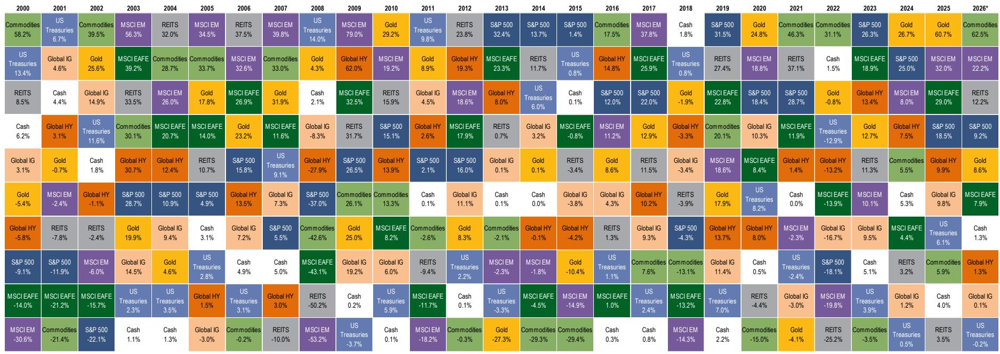
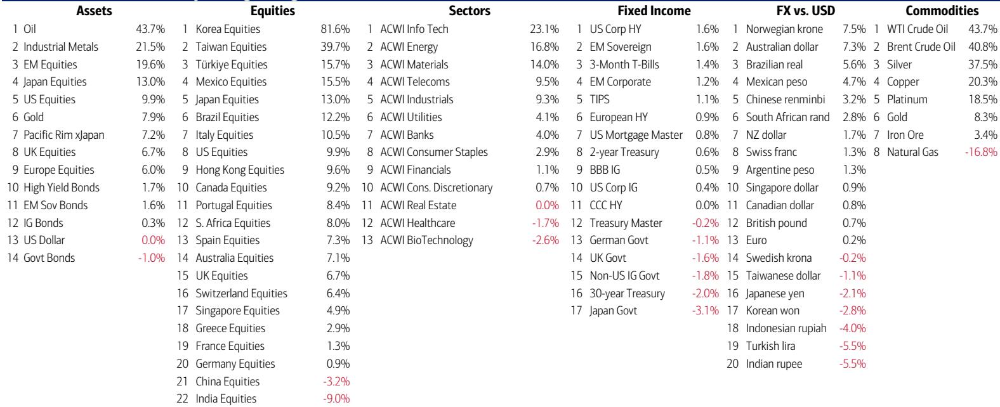

# 市场真正低估的不是通胀，而是“繁荣循环”的自我强化与政治脆弱性

这份来自某外资投行策略团队的周度资金流报告，表面看是一组最新仓位数据，但其核心判断远比“股票还在涨”要深刻：美国正在运行一个由家庭财富效应驱动的“繁荣循环”，而这一循环的唯一终结者，不是经济基本面，而是政治与债券市场。报告用图表和数据揭示了一个正在逼近临界点的资产定价环境——半导体指数偏离200日均线的幅度已超越历史上几乎所有著名泡沫的峰值。但真正值得关注的不只是泡沫本身，而是支撑泡沫的资金结构正在发生怎样的质变，以及这种质变将如何影响2026年下半年到2027年的资产轮动格局。

报告提供的最新信号是：美国家庭股票财富在2026年迄今又增加了4万亿美元，延续了此前三年分别增长10万亿、9万亿和8万亿美元的惊人轨迹。与此同时，美国银行私人客户的股票配置比例已升至65.7%的历史最高水平，现金配置比例降至9.8%的历史最低水平。这组数据合在一起意味着什么？意味着本轮牛市的核心驱动力已经从“机构定价”转向“家庭财富效应定价”，而家庭财富效应的可持续性，取决于两个变量：政治容忍度和债券市场的定价权。

以下是我们从这份报告中提炼出的五个核心洞察，以及一个报告尚未完全回答的关键问题。

## 1. 资金流向揭示的并非单纯乐观，而是“别无选择”的被迫配置

报告显示，在过去一周，有281亿美元流入债券，205亿美元流入股票，58亿美元流入现金，20亿美元流入黄金，13亿美元流出加密货币。从总量看，股债双流入似乎表明市场风险偏好均衡。但真正值得关注的是结构：投资级债券录得140亿美元流入，创下自2026年3月以来最大的四周流入量（422亿美元）；而美国大盘股流入244亿美元，为五周最大；科技板块流入54亿美元，为2026年2月以来最大。

这组数据的含义不是“投资者看好股债”，而是“投资者在被迫配置”。债券端的巨量流入集中在投资级而非高收益，说明资金在追逐信用质量而非收益率；股票端的流入集中在科技和大盘，说明资金在追逐流动性最深的资产而非价值洼地。现金配置比例降至历史最低，进一步印证了“别无选择”的心态——持有现金的惩罚（通胀侵蚀）已经大到让投资者不得不把所有闲置资金推向风险资产。

这种被迫配置的后果是什么？一旦出现任何触发因素导致投资者重新评估“持有现金的成本”，资金从风险资产中流出的速度可能比历史上任何一次都快。当前的低现金水平本身就是最大的脆弱性。

## 2. “繁荣循环”的自我强化正在把资产价格推向历史极端区间

报告中最引人注目的图表之一是半导体指数（SOX）与200日均线的偏离程度。当前SOX交易在200日均线上方62%，这一幅度超过了历史上几乎所有著名泡沫的峰值：密西西比泡沫（73%）、纳斯达克科网泡沫（55%）、中国A股泡沫（37%）、日本泡沫（12%）、沙特泡沫（28%）。历史上这些泡沫在峰值时偏离200日均线的平均幅度为35%，而当前SOX的偏离幅度几乎是这个平均值的两倍。

报告没有直接说“泡沫即将破裂”，而是给出了一个更微妙的判断：这种指数级的价格行为、市场集中度的不断上升、波动率的持续压缩，以及股票收益率“压制”债券收益率的现象，正在让“融涨”（melt-up）成为所有人的新基准情景。换句话说，市场参与者已经不再讨论“会不会涨”，而是在讨论“涨到什么时候”。

但这里有一个关键矛盾：纳斯达克指数年化涨幅约45%，10年期美债收益率年化上升约80个基点。这种“股债双涨”在历史上往往出现在周期的早期或晚期。报告引用了2009年和1999年的类比——这两个年份分别对应了金融危机后的反弹和科网泡沫的顶点。当前的情景更接近哪一个？报告没有给出明确答案，但暗示了“周期的终点”特征正在增多。

## 3. 通胀路径正在从“数据问题”变成“政治问题”，这是市场尚未充分定价的风险

报告指出，美国PPI已运行在6%，CPI接近4%，能源、电力、运输、商品价格和租金都在上涨。如果未来六个月月度环比涨幅维持在0.4%，到2026年中期选举时，CPI将超过5%。这是一个极具政治敏感性的数字。报告引用了一项历史统计：过去100年，一旦CPI突破4%，标普500指数在未来三个月平均下跌4%，未来六个月平均下跌7%。

但真正重要的不是通胀本身，而是政治对通胀的反应。报告提到，特朗普对通胀的满意度已接近拜登时期的低点（30%）。这意味着，无论哪个政党执政，高通胀都是选民最敏感的问题。报告提出了一个有待验证但极具洞察力的判断：政治可能在未来某个时点转向“鞭打通胀”，从而引发从“芯片和商品”向“消费”的大规模轮动。

这个判断的关键在于时间点。报告认为这是一个“慢燃”的过程，但2027年可能成为转折年。如果这一判断成立，那么当前市场对科技和商品的极端偏好，将在未来12-18个月内面临根本性的逻辑挑战。

## 4. 政治极端化正在重塑资产定价的底层逻辑，但市场尚未建立分析框架

报告提供了一组令人震惊的数据：在英国地方选举中，反建制政党（改革党与绿党）的得票率从3%飙升至41%，而建制政党（工党与保守党）的得票率从92%降至54%。报告用一句话概括了这种趋势：“2020年代，你无法从中间地带执政。”

这一政治现象对资产定价的含意是什么？报告认为，极端政治带来极端的华尔街价格行为。但更值得深思的是：当政治光谱向两端移动时，政策可预测性下降，资产价格的波动率中枢将系统性上升。当前市场波动率处于极低水平，这一现象本身可能就是不可持续的。

报告还指出了一个有趣的对比：“习近平拥有的、特朗普想要的东西，是低利率。”这暗示了全球两大经济体在货币政策哲学上的根本分歧。中国的低利率环境支撑了资产价格和经济增长的稳定性，而美国正在经历利率上升与资产价格膨胀并存的矛盾局面。这种分歧意味着，全球资本流动的格局可能正在发生结构性变化——资金从美国流向中国的逻辑，可能比市场预期的更早出现。

## 5. 报告尚未完全回答的关键问题：家庭财富效应何时会自我逆转？

报告的整个分析框架建立在“家庭财富效应驱动繁荣循环”这一核心假设上。美国家庭股票财富在四年内增加了超过30万亿美元，这一财富效应支撑了消费、就业和经济信心，进而又支撑了企业盈利和股价。这是一个典型的正反馈循环。

但报告没有充分展开的是：这一正反馈循环何时会变成负反馈？历史上，财富效应逆转的触发因素往往是外部冲击（如2008年的次贷危机）或政策突变（如2022年的激进加息）。当前，报告提到了两个可能的触发因素：政治（中期选举后的政策转向）和债券市场（收益率突破关键阈值后引发资产重新定价）。但报告没有给出明确的触发阈值或时间线。

另一个未解问题是：家庭财富效应的分布是否足够广泛？如果大部分财富增长集中在最富有的10%家庭，那么财富效应对整体消费的拉动作用可能被高估。报告没有提供这方面的数据，这是一个值得进一步深挖的方向。

## 6. 一个被忽视的观察框架：金融股相对表现可能是周期转换的先行指标

报告提到，金融股相对于标普500指数的表现，现在已低于2000年科网泡沫底部、2009年金融危机底部和2020年疫情底部。这是一个令人震惊的数据点。金融股通常被视为经济周期和利率周期的受益者——利率上升理应扩大银行的净息差，经济扩张理应增加贷款需求。但金融股的相对表现却在持续恶化，说明市场认为当前的利率环境和经济结构对金融业并不友好。

这一现象可能意味着两种情景之一：要么市场对金融业的定价是错误的，金融股存在巨大的价值修复空间；要么市场正在提前反映一个更深刻的趋势——在AI和科技主导的经济结构中，传统金融的中介功能正在被系统性削弱。无论哪种情景，金融股的相对表现都值得作为周期转换的先行指标来跟踪。如果金融股开始相对走强，可能意味着市场正在从“增长稀缺”转向“价值回归”。

---

这份报告的核心价值不在于给出了一个明确的交易建议，而在于提供了一个理解当前市场矛盾的分析框架。繁荣循环仍在自我强化，但支撑它的基础——低现金配置、极端价格偏离、政治脆弱性——正在变得越来越不稳固。报告没有回答的问题是：当循环逆转时，哪些资产会最先受到影响？哪些资产反而会受益？

我们将在社群的完整报告解读中，继续拆解这些未解问题，并讨论资金流向数据背后更细微的结构性变化。欢迎来星球微信群里继续讨论。

Personal reading notes and learning share only. Not investment advice.

