# Japan Economic Flash: March Data Roundup: Raising Our Final 2026Q1 Real GDP Tracking Estimate to +1.3% QoQ Annualized

We raise our final 2026Q1 (January-March) real GDP final tracking estimate to $+1.3\%$ qoq annualized, from our previous forecast of $+0.7\%$ . This mainly reflects an upward revision to net exports, as the Middle East disruption has not materially appeared in exports or imports in Q1. Our forecast remains unchanged for private consumption and capex; we expect that they will maintain modest positive growth, albeit slowing from 2025Q4. The upward revision to our Q1 GDP forecast takes our CY2026 growth forecast to $+0.5\%$ (previously: $+0.3\%$ ).

Looking at economic activity in March, industrial production declined, led by chemicals and petroleum products, as the impact of the disruption in the Middle East has begun to appear. Real exports also declined slightly in March but accelerated on a Q1 basis. On consumption, spending on durable goods declined, but services spending is underpinning overall activity.

The Takaichi administration is responding to crude oil shortages and high prices against the backdrop of the situation in the Middle East, mainly by (1) releasing oil reserves, (2) securing supplies of crude oil and oil-derived products, and (3) resuming price control measures for gasoline and other fuels. The current budget for price control measures is about ¥2 tn (0.3% of GDP), including reserve funds from the FY2025 budget. Discussions are ongoing in a cross-party National Council regarding a consumption tax cut, but the outcome remains fluid at this point. In addition, specific details of growth strategy investments as part of the proactive fiscal policy are scheduled to be presented in the Basic Policies for Economic and Fiscal Management and Reform (Honebuto no Hoshin), which the government will compile in June.

The Bank of Japan (BOJ) decided to keep its policy rate on hold at $0.75\%$ at its April Monetary Policy Meeting (MPM), but three of the nine board members dissented, proposing a rate hike to $1.0\%$ . The Summary of Opinions from the April MPM shows that while most board members pointed to the need for a rate hike, their views on the urgency of the hike were divided amid high uncertainty over the situation in the Middle East. It will take time for the impact of the Middle East disruption and higher crude oil prices on the domestic economy and supply chains to become apparent. We continue to expect a rate hike in July as our base case, on the premise that the BOJ will be able to confirm from sources such as corporate surveys and other survey data that the Japanese economy will not enter a major adjustment phase.

# Yuriko Tanaka

+81(3)4587-9964

yuriko.tanaka@gs.com

GS Japan Co., Ltd.

# Akira Otani

+81(3)4587-9960 | akira.otani@gs.com

GS Japan Co., Ltd.

# Tomohiro Ota

+81(3)4587-9984

tomohiro.ota@gs.com

GS Japan Co., Ltd.

# Industrial Production Declines in March Due to Middle East Impact; Services Spending Continues to Underpin Overall Consumption

Consumption: Nominal retail sales in March rose +1.7% mom (on a seasonally adjusted basis), from -2.0% in February, coming in well above the market forecast. Retail sales also accelerated +1.7% qoq in Q1 (2025Q4: +0.5%). Q1 sales rose for food & beverages, textiles, apparel & accessories, and auto retailers. The BOJ's Consumption Activity Index (real), a comprehensive consumption indicator including both goods and services, declined by -0.2% mom in both February and March, but Q1 as a whole ended with a +0.3% qoq increase. While spending on durable goods declined sharply, services consumption remained high. The CTI Macro Index (real), created by the Ministry of Internal Affairs and Communications for the purpose of tracking GDP consumption, was flat mom in March, and rose +0.1% qoq in Q1 (2025Q4: +0.0%).

Foreign Visitors and Inbound Spending: The number of foreign visitors rose $+1.4\%$ yoy in Q1, but decelerated sharply from $+10.4\%$ yoy in Q4. That said, while visitors from mainland China halved yoy, visitors from South Korea, Taiwan, the United States, and Europe increased, keeping overall visitor numbers on a positive growth trajectory. Foreign visitors' inbound spending rose $+5\%$ yoy in Q1.

Production/Exports: Industrial production fell by $-0.5\%$ mom in March, declining for a second consecutive month following the sharp drop in February $(-2.0\%)$ , and was well below the market forecast for a $+1.1\%$ increase. Particularly large declines were seen in chemicals and petroleum products, reflecting the impact of the Middle East disruption. For Q1 as a whole, however, industrial production rose $+2.4\%$ qoq (Q4: $+0.3\%$ ). The Ministry of Economy, Trade and Industry's (METI) bias-adjusted production outlook for April calls for a decline of $-0.7\%$ mom, but considering that passage through the Strait of Hormuz remains disrupted, actual April production could decline by more than forecast.

Real exports in March declined by a modest $-0.5\%$ mom, but rose $+3.0\%$ qoq for Q1, accelerating from $+0.6\%$ in Q4. Real exports to the US rose for the second straight quarter, and those to mainland China turned to a quarterly increase for the first time in a year. Real imports also turned up, by $+1.0\%$ qoq in Q1, for the first time in three quarters.

Labor Market: The unemployment rate in March was 2.7%, up +0.1 pp from February, but it has remained at a low level in a narrow range between 2.6% and 2.7% since August 2025. While nominal cash wage growth slowed to +2.7% yoy in March, from +3.4% yoy in February, basic wage growth remained over +3%. Real wages also rose yoy for the third consecutive month. The agreed base pay rise in the FY2026 shunto spring wage negotiations is coming in lower than last year, but is still solid at around the mid-3% range.

Inflation: The March national new core CPI (excludes fresh food and energy) came in at $+2.4\%$ yoy, decelerating by -0.1 pp from February, in line with the market forecast. The continued deceleration in food prices, particularly rice prices, was the main factor. The global core CPI (excludes food other than alcohol and energy) was unchanged from February at $+1.4\%$ yoy. The April Tokyo new core CPI slowed -0.4 pp from March to

+1.9% yoy, printing well below the market forecast, which had anticipated a -0.1 pp decline. The main driver was the negative contribution from the free childcare system that began in April, which was significantly larger than we had forecast, as the Tokyo Metropolitan Government offered a more expansive program on its own. Meanwhile, energy price inflation rose because the positive contribution from the scaling back of price control measures for electricity and gas charges outweighed the negative contribution from the introduction of price control measures for gasoline. As a result, the April Tokyo core CPI slowed by only -0.2 pp from March to +1.5% yoy.

CAI: Our Current Activity Tracker, which tracks underlying trends in 17 indicators, was +2.0% qoq annualized in Q1 (+0.7% in 2025Q4).

# Raising Our Final 2026Q1 Real GDP Tracking Estimate to $+1.3\%$ QoQ Annualized

We raise our final 2026Q1 (January-March) real GDP tracking estimate to $+1.3\%$ qoq annualized (from $+0.7\%$ previously), mainly due to an upward revision to net exports. We maintain our previous forecasts for private consumption and capex, the main components of domestic final private demand.

Overall, we look for Q1 private consumption to maintain modest growth of $+0.8\%$ qoq annualized, supported by an increase in services consumption. We expect capex (also $+0.8\%$ ) to slow from its strong growth in 2025Q4, but remain modestly in positive territory. We see exports ( $+3.0\%$ ) turning positive in Q1 for the first time in three quarters, after having declined from 2025Q3 partly due to the impact of tariff imposition. We forecast imports ( $+0.8\%$ ) will also turn up for the first time in three quarters, but with export growth outpacing them, we look for the contribution from external demand to be a positive factor of $+0.4$ pp for the first time in three quarters. The impact of the situation in the Middle East on the real economy has not become meaningfully apparent in Q1.

The upward revision to our Q1 GDP forecast takes our CY2026 real GDP growth forecast to $+0.5\%$ (previously: $+0.3\%$ ).

# Expecting Growth to Slow From Q2 Due to Higher Prices and Supply Disruptions From Middle East Situation, but Negative Growth Unlikely

Since the Middle East crisis began at the end of February, we have cumulatively lowered our CY2026 Japan real GDP growth forecast by -0.5 pp. However, our basic assessment remains unchanged: even with a further deterioration in the terms of trade, the Japanese economy should continue to post positive growth, as domestic demand should be underpinned by continued growth in corporate profits and wages as labor shortages intensify structurally. We have also raised our core CPI inflation forecasts for 2026 and 2027 by +0.4 pp each.

Below, we summarize our outlook for the main demand components from Q2 onward.

Private consumption: Consumer sentiment has deteriorated significantly since March, due to concerns of a slowdown in real income from higher prices and the prolonged conflict in the Middle East. We expect this to suppress private consumption growth. Although the BOJ's Consumption Activity Index was positive for Q1, it already showed slight mom declines in February and March. We forecast GDP private consumption to slow from +0.8% qoq annualized in Q1 (our forecast) to +0.3% to +0.4% in Q2-Q3.

Meanwhile, base pay raise agreements in the mid- $3 \%$ range have been seen in the 2026 shunto negotiations. As such, we expect wages to continue to increase firmly amid intensifying structural labor shortages (Exhibit 1). In addition, with equity prices setting all-time highs, we believe the wealth effect from higher equity prices will support private consumption, particularly for high-value durable goods and services. The sharp increase in Shinkansen passenger numbers during the Golden Week holidays (Exhibit 2) also suggests that even with sentiment deteriorating, consumers will still spend for special occasions, and we therefore do not expect consumption to stall. Once the energy supply shock normalizes, we believe that continued wage and equity price increases will serve as drivers supporting a sUBSequent recovery and growth in consumption.

Exhibit 1: High Base Pay Rise Being Agreed in 2026 Shunto Shunto Wage Hike Settlement Rate   
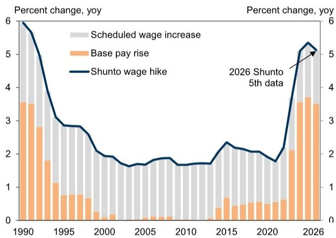

bar_line

| Year | Scheduled wage increase (yoy) | Base pay rise (yoy) | Shunto wage hike (yoy) |
| :--- | :--- | :--- | :--- |
| 1990 | 3.5 | 3.5 | 6.0 |
| 1991 | 3.4 | 2.8 | 5.5 |
| 1992 | 3.3 | 1.8 | 4.5 |
| 1993 | 3.2 | 1.1 | 3.5 |
| 1994 | 3.1 | 0.7 | 3.0 |
| 1995 | 3.0 | 0.7 | 2.8 |
| 1996 | 2.9 | 0.6 | 2.7 |
| 1997 | 2.8 | 0.5 | 2.6 |
| 1998 | 2.7 | 0.4 | 2.5 |
| 1999 | 2.6 | 0.3 | 2.4 |
| 2000 | 2.5 | 0.2 | 2.3 |
| 2001 | 2.4 | 0.1 | 2.2 |
| 2002 | 2.3 | 0.1 | 2.1 |
| 2003 | 2.2 | 0.1 | 2.0 |
| 2004 | 2.1 | 0.1 | 1.9 |
| 2005 | 2.0 | 0.1 | 1.8 |
| 2006 | 1.9 | 0.1 | 1.7 |
| 2007 | 1.8 | 0.1 | 1.6 |
| 2008 | 1.7 | 0.1 | 1.5 |
| 2009 | 1.6 | 0.1 | 1.4 |
| 2010 | 1.5 | 0.1 | 1.3 |
| 2011 | 1.4 | 0.1 | 1.2 |
| 2012 | 1.3 | 0.1 | 1.1 |
| 2013 | 1.2 | 0.1 | 1.0 |
| 2014 | 1.1 | 0.3 | 0.9 |
| 2015 | 1.0 | 0.6 | 0.8 |
| 2016 | 0.9 | 0.5 | 0.7 |
| 2017 | 0.8 | 0.5 | 0.6 |
| 2018 | 0.7 | 0.5 | 0.5 |
| 2019 | 0.6 | 0.5 | 0.4 |
| 2020 | 0.5 | 0.5 | 0.3 |
| 2021 | 0.4 | 0.6 | 0.4 |
| 2022 | 0.3 | 0.7 | 0.5 |
| 2023e-03 | - | - | - |
| Shunto (2026) - Baseline (Shunto) - Baseline (5th data) - Shunto wage hike (Figure: Shunto wage hike) - Baseline (Figure: Shunto wage hike) - Baseline (Figure: Shunto wage hike) - Baseline (Figure: Shunto wage hike) - Baseline (Figure: Shunto wage hike) - Baseline (Figure: Shunto wage hike) - Baseline (Figure: Shunto wage hike) - Baseline (Figure: Shunto wage hike) - Baseline (Figure: Shunto wage hike) - Baseline (Figure: Shunto wage hike) - Baseline(Figure: Shunto wage hike) - Baseline(Figure: Shunto wage hike) - Baseline(Figure: Shunto wage hike) - Baseline(Figure: Shunto wage hike) - Baseline(Figure: Shunto wage hike) - Baseline(Figure: Shunto wage hike) - Baseline(Figure: Shunto wage hike) - Baseline(Figure: Shunto wage hike) - Baseline(Figure: Shunto wage hike) - Baseline(Level: Shunto wage hike) - Baseline(Level: Shunto wage hike) - Baseline(Level: Shunto wage hike) - Baseline(Level: Shunto wage hike) - Baseline(Level: Shunto wage hike) - Baseline(Level: Shunto wage hike) - Baseline(Level: Shunto wage hike) - Baseline(Level: Shunto wage hike) - Baseline(Level: Shunto wage hike) - Baseline(Level/Level: Shunto wage hike) - Baseline(Level/Level: Shunto wage hike) - Baseline(Level/Level: Shunto wage hike) - Baseline(Level/Level: Shunto wage hike) - Baseline(Level/Level: Shunto wage hike) - Baseline(Level/Level: Shunto wage hike) - Baseline(Level/Level: Shunto wage hike) - Baseline(Level/Level: Shunto wage hike) - Standard Deviation Rate (Baseline Deviation Rate) - Baseline (Level/Level: Shunto wage hike; Baseline (Level/Level: Shunto wage hike; Baseline (Level/Level: Shunto wage hike; Baseline (Level/Level: Shunto wage hike; Baseline (Level/Level: Shunto wage hike; Baseline (Level/Level: Shunto wage hike; Baseline (Level/Level: Shunto wage hike; Baseline (Level/Level: Shunto wage hike; Baseline (Level/Level: Shunto wage hike; Baseline (Year): Standard Deviation Rate; Baseline (Year): Standard Deviation Rate; Baseline (Year): Standard Deviation Rate; Baseline (Year): Standard Deviation Rate; Baseline (Year): Standard Deviation Rate; Baseline (Year): Standard Deviation Rate; Baseline (Year): Standard Deviation Rate; Baseline (Year): Standard Deviation Rate; Baseline (Year): Standard Deviation Rate; Baseline (Year): Standard Deviation Rate; Baseline (Year): Standard DeviationRate; Baseline (Year): Standard DeviationRate; Baseline (Year): Standard DeviationRate; Baseline (Year): Standard DeviationRate; Baseline (Year): Standard DeviationRate; Baseline (Year): Standard DeviationRate; Baseline (Year): Standard DeviationRate; Baseline (Year): Standard DeviationRate; Baseline (Year): Standard DeviationRate; Baseline (Year): Standard DeviationRate; Baseline (Year): Standard DeviationPrice; Baseline (Year): $5.5, $5.4, $5.3, $5.2, $5.1, $5.0, $4.9, $4.8, $4.7, $4.6, $4.5, $4.4, $4.3, $4.2, $4.1, $4.0, $3.9, $3.8, $3.7, $3.6, $3.5, $3.4, $3.3, $3.2, $3.1, $3.0, $2.9, $2.8, $2.7, $2.6, $2.5, $2.4, $2.3, $2.2, $2.1, $2.0, $1.9, $1.8, $1.7, $1.6, $1.5, $1.4, $1.3, $1.2, $1.1, $1.0, $0.9, $0.8, $0.7, $0.6, $0.5, $0.4, $0.3, $0.2, $0.1, $-0.1, $-0.2, $-0.3, $-0.4, $-0.5, $-0.6, $-0.7, $-0.8, $-0.9, $-1.0, $-1.1, $-1.2, $-1.3, $-1.4, $-1.5, $-1.6, $-1.7, $-1.8, $-1.9, $-2.0, $-2.1, $-2.2, $-2.3, $-2.4, $-2.5, $-2.6, $-2.7, $-2.8, $-2.9, $-3.0, $-3.1, $-3.2, $-3.3, $-3.4, $-3.5, $-3.6, $-3.7, $-3.8, $-3.9, $-4.0, $-4.1, $-4.2, $-4.3, $-4.4, $-4.5, $-4.6, $-4.7, $-4.8, $-4.9, $-5.0, $-5.1, $-5.2, $-5.3, $-5.4, $-5.5, $-5.6, $-5.7, $-5.8, $-5.9, $-6.0, $-6.1, $-6.2, $-6.3, $-6.4, $-6.5, $-6.6, $-6.7, $-6.8, $-6.9, $-7.0, $-7.1, $-7.2, $-7.3, $-7.4, $-7.5, $-7.6, $-7.7, $-7.8, $-7.9, $-8.0, $-8.1, $-8.2, $-8.3, $-8.4, $-8.5, $-8.6, $-8.7, $-8.8, $-8.9, $-9.0, $-9 .$

Source: JTUC-Rengo, Keidanren, Data compiled by GS Global Investment Research   
Tokaido Shinkansen Passenger Traffic

Exhibit 2: Shinkansen Passenger Numbers Had Been Sluggish Since the Start of 2026, but Surged During the May Holidays

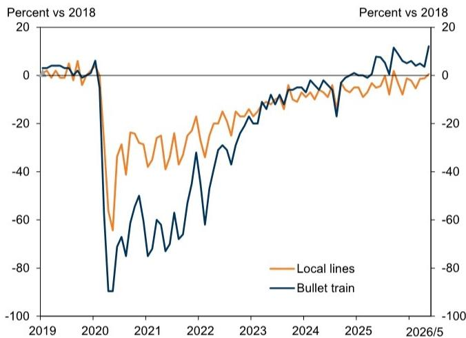

line

| Year | Local lines | Bullet train |
|------|-------------|--------------|
| 2019 | ~0          | ~0           |
| 2020 | ~-60        | ~-90         |
| 2021 | ~-30        | ~-70         |
| 2022 | ~-20        | ~-60         |
| 2023 | ~-10        | ~-40         |
| 2024 | ~-5         | ~-20         |
| 2025 | ~-10        | ~-10         |
| 2026/5 | ~-5       | ~10          |

Source: Central Japan Railway Company, Data compiled by GS Global Investment Research

Capex: Due to uncertainty about the outlook for domestic and external demand and high costs, capex plans could be postponed. Also, investment projects could be delayed due to the reduced supply of petroleum-derived materials. We expect GDP capex to lack momentum, slowing from $+0.8\%$ qoq annualized in Q1 (our forecast) to $+0.6\%$ to $+0.7\%$ in Q2-Q3.

At this stage, corporate capex plans for FY2026 are off to a good start, similar to last year. In addition, backlogs for construction and machinery orders have accumulated. It is thus unlikely that capex would turn negative due to the execution of outstanding orders even if companies temporarily were to hold off on new orders. Furthermore, Japan has a track record of improving its energy efficiency during past periods of rising crude oil prices. Amid the shift from a deflationary to a reflationary economy, Japanese companies have historically high corporate profits and an aggressive capex stance. Against this backdrop, many companies cite “decarbonization” as one of the drivers of capex, and it is likely that capex aimed at improving energy efficiency will continue to increase.

Exhibit 3: Capex Plans for FY2026 Off to a Good Start, Similar to Last Year  
BOJ Tankan Capex Plans   
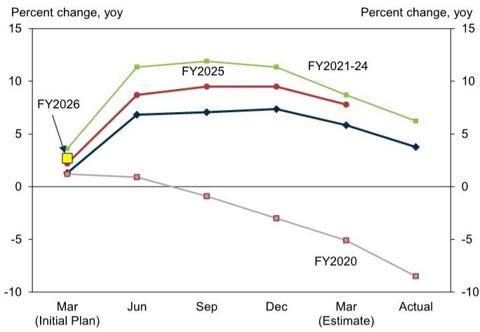

line

| Period | FY2020 (%) | FY2021-24 (%) | FY2025 (%) | FY2026 (%) |
|---|---|---|---|---|
| Mar (Initial Plan) | 1.0 | 3.5 | 3.0 | 1.5 |
| Jun | 0.8 | 11.5 | 8.8 | 7.0 |
| Sep | -0.5 | 12.0 | 9.5 | 7.0 |
| Dec | -3.0 | 11.5 | 9.5 | 7.2 |
| Mar (Estimate) | -5.0 | 8.5 | 7.8 | 5.8 |
| Actual | -8.5 | 6.2 | 3.8 | 3.8 |

Source: BoJ, Data compiled by GS Global Investment Research

Exhibit 4: High Order Backlogs for Machinery and Construction Investment  
Work Backlog (in Months) for Construction and Machinery Orders   
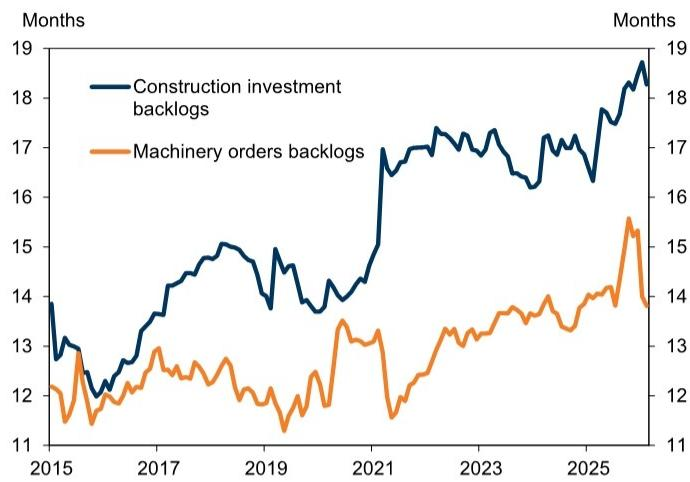

line

| Year | Construction investment backlogs | Machinery orders backlogs |
|------|----------------------------------|---------------------------|
| 2015 | 13.8                             | 12.0                      |
| 2016 | 12.5                             | 11.8                      |
| 2017 | 14.0                             | 12.5                      |
| 2018 | 14.8                             | 12.8                      |
| 2019 | 13.5                             | 11.5                      |
| 2020 | 14.5                             | 13.0                      |
| 2021 | 17.0                             | 13.5                      |
| 2022 | 17.5                             | 13.8                      |
| 2023 | 17.0                             | 14.0                      |
| 2024 | 16.5                             | 14.2                      |
| 2025 | 17.5                             | 14.5                      |
| 2026 | 18.5                             | 15.5                      |

Months of work backlog for construction orders (based on the top 50 companies) is calculated as end-of-month backlog / average construction work performed in the past 12 months. Months of backlog for machinery orders is calculated as end-of-month backlog / average sales in the past three months.   
Source: Cabinet Office, Ministry of Land, Infrastructure, Transport and Tourism, Data compiled by GS Global Investment Research

External demand: The impact of the situation in the Middle East had not become prominent as of 2026Q1. We forecast that GDP exports, which had been negative since 2025Q3 due to the imposition of US tariffs, will turn positive in Q1 for the first time in three quarters, at $+3.0\%$ qoq annualized.

However, we expect exports to turn negative from Q2 to Q3. We assume that passage through the Strait of Hormuz will remain challenging until the end of June and normalize toward the end of July. Although the Japanese government has indicated that it has secured crude oil supplies beyond the end of the year, Japan is dependent on imports for many chemical products, such as various resins. Even if crude oil and other reserves are maintained in Japan, if Asian countries experience a crude oil shortage, a supply shortage of petroleum-related materials would be unavoidable in Japan as well, which would likely lead to a decrease in production and exports. The contribution of external demand to GDP growth will likely be a positive +0.4 pp (qoq annualized basis) in Q1, but we expect it to become a small negative contribution from Q2 through 2027Q1.

Housing investment: We expect housing investment to remain positive through Q1, but to turn negative from 2026Q2 onward, with a decline of $-1.5\%$ to $-2.5\%$ qoq annualized, due to supply shortages and price increases for petroleum-derived materials.

# Economic Policies

Political Developments/Fiscal Policy: In response to crude oil shortages and high prices against the backdrop of the situation in the Middle East, the Takaichi administration is mainly (1) releasing petroleum reserves, (2) securing the supply of crude oil and oil-derived products, and (3) implementing price control measures for gasoline and other fuels. The price control measures, which began on March 19, provide sUBSidies to oil wholesalers to keep the retail price of regular gasoline from exceeding ¥170/liter, and similar price control measures have been introduced for other fuels such as diesel oil. The budget for the price control measures stands at around ¥2 tn (0.3% of GDP), combining the fund balance during FY2025, ¥800 bn from the FY2025 budget's reserve funds, and a portion of the ¥1 tn in the FY2026 reserve budget. We estimate that the cumulative amount of sUBSidies for gasoline and other fuels had exceeded ¥600 bn as of May 13. In addition, the government is considering providing sUBSidies for electricity and gas charges for July-September usage, with a reported required expense of up to around ¥500 bn. In case crude oil prices remain elevated at current levels, the above budget could be exhausted before September. Under such circumstance, we think the government would need to compile a supplementary budget in the summer, before the current parliament session ends (July 17).

Discussions on a consumption tax cut, which was a campaign pledge of the Takaichi administration and many opposition parties in the February Lower House election, have begun in a cross-party National Council. Prime Minister Takaichi has indicated her intention to submit related bills to the autumn Extraordinary Diet Session if an agreement is reached, including on funding and scheduling. Discussions in the National Council are expected to be based on the ruling coalition's proposal to reduce the tax rate on food items only to zero for two years, which is estimated to result in a potential annual tax revenue loss of about ¥5 tn (0.8% of GDP). However, much remains fluid, with reports of proposals to apply a low tax rate other than zero to food items subject to the tax cut, $^{1}$ as well as calls to forgo the tax cut and instead make efforts toward an early introduction of a tax credit (Jiji Press; April 27). Furthermore, Prime Minister Takaichi has stated that she will not issue deficit-financing bonds to fund the consumption tax cut, which means that an annual ¥5 tn in funding would need to be secured through tax increases or spending cuts. As such, it is likely to take time to reach a consensus on funding within the National Council.

From mid-2026 onward, in addition to the debate on a consumption tax cut, the implementation of growth-strategy investments as a part of the Prime Minister's proactive fiscal policy (expected to be announced along with the Basic Policies for Economic and Fiscal Management and Reform around June) and discussions toward increasing defense spending are likely to proceed, increasing the likelihood that the scale of government spending will expand from FY2027 onward.

Monetary Policy: The BOJ decided to keep its policy rate on hold at $0.75\%$ at its April MPM, but three of the nine board members dissented, proposing a rate hike to $1.0\%$ . The Summary of Opinions from the April MPM shows that while most board members pointed to the need for a rate hike, their views on the urgency of the hike were divided amid high uncertainty over the situation in the Middle East.

At the press conference following the April MPM, Governor Kazuo Ueda noted that higher crude oil prices from the disruption in the Middle East pose both downside risks to growth and upside risks to inflation. In that context, he reiterated the BOJ's stance on future policy rate hikes, emphasizing the need to pay attention especially to the upside risks to inflation. He also stated that the BOJ will continue to consider the timing and the pace of rate hikes by examining both the bank's conviction and the risks toward realizing its forecast. However, he remarked that a rate hike is possible even with a growth slowdown in sight, if the economy is likely to avoid a severe adjustment and price developments are in line with the BOJ's forecast, or if the risk of overshooting the trajectory rises.

It will take time for the effects of the Middle East conflict and higher crude oil prices on the domestic economy and supply chains to become apparent. We expect the BOJ to emphasize corporate surveys and other survey data to grasp these impacts, and we believe the June BOJ Tankan (scheduled for release on July 1) and the July BOJ Quarterly Branch Managers' Meeting will be of great significance. Therefore, on the premise that these data and information confirm that the Japanese economy will not enter a major adjustment phase, we continue to forecast a July rate hike as our base-case scenario.

Exhibit 5: Consumption-related Indices   
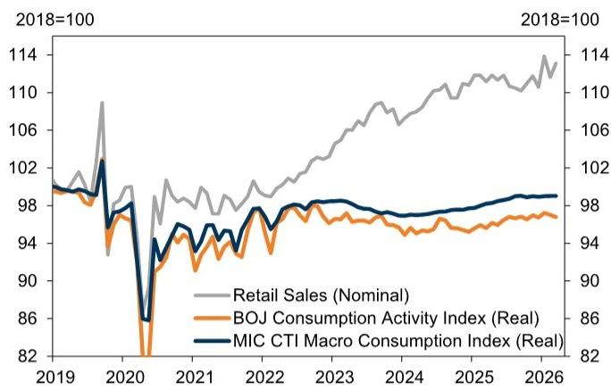

line

| Year | Retail Sales (Nominal) | BOJ Consumption Activity Index (Real) | MIC CTI Macro Consumption Index (Real) |
|------|------------------------|--------------------------------------|----------------------------------------|
| 2019 | 100                    | 100                                  | 100                                    |
| 2020 | 108                    | 82                                   | 86                                     |
| 2021 | 98                     | 94                                   | 96                                     |
| 2022 | 100                    | 96                                   | 98                                     |
| 2023 | 106                    | 98                                   | 98                                     |
| 2024 | 110                    | 98                                   | 98                                     |
| 2025 | 112                    | 98                                   | 98                                     |
| 2026 | 114                    | 98                                   | 98                                     |

Source: Cabinet Office, Ministry of Economy, Trade and Industry, BoJ, Ministry of Internal Affairs and Communications

Exhibit 6: BOJ Consumption Activity Index and Breakdown   
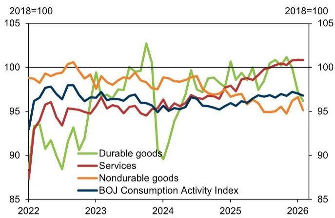

line

| Year | Durable goods | Services | Nondurable goods | BOJ Consumption Activity Index |
|------|----------------|----------|------------------|-------------------------------|
| 2022 | 93             | 88       | 99               | 94                            |
| 2023 | 98             | 95       | 100              | 97                            |
| 2024 | 90             | 96       | 98               | 95                            |
| 2025 | 101            | 98       | 97               | 96                            |
| 2026 | 101            | 101      | 95               | 97                            |

Source: BoJ

Exhibit 7: Foreign Visitors to Japan and Inbound Spending   

bar_line

| Year | Mainland (Millions per month) | China (Millions per month) | Korea (Millions per month) | Taiwan (Millions per month) | Hong Kong (Millions per month) | Thailand (Millions per month) |
|---|---|---|---|---|---|---|
| 2018 | 0.7 | 1.3 | 0.5 | 0.1 | 0.1 | 0.0 |
| 2019 | 0.8 | 1.4 | 0.5 | 0.1 | 0.1 | 0.0 |
| 2020 | 0.1 | 0.1 | 0.1 | 0.1 | 0.1 | 0.0 |
| 2021 | 0.1 | 0.1 | 0.1 | 0.1 | 0.1 | 0.0 |
| 2022 | 0.1 | 0.1 | 0.1 | 0.1 | 0.1 | 0.0 |
| 2023 | 0.3 | 0.5 | 0.3 | 0.2 | 0.2 | 0.1 |
| 2024 | 0.5 | 0.7 | 0.5 | 0.3 | 0.3 | 0.2 |
| 2025 | 0.6 | 0.8 | 0.6 | 0.4 | 0.4 | 0.3 |
| 2026 | 0.7 | 0.9 | 0.7 | 0.5 | 0.5 | 0.4 |

Source: JNTO, BoJ

Exhibit 8: Production and Imports/Exports   
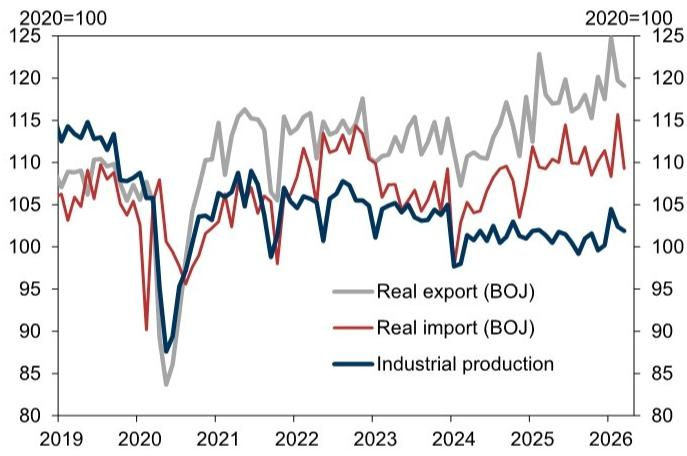

line

| Year | Real export (BOJ) | Real import (BOJ) | Industrial production |
|---|---|---|---|
| 2019 | 108 | 105 | 114 |
| 2020 | 85 | 90 | 88 |
| 2021 | 116 | 103 | 107 |
| 2022 | 115 | 108 | 105 |
| 2023 | 118 | 113 | 106 |
| 2024 | 110 | 107 | 101 |
| 2025 | 122 | 112 | 103 |
| 2026 | 125 | 115 | 104 |
2020=100; 2020=100; 2020=100;

Source: Ministry of Economy, Trade and Industry, BoJ

Exhibit 9: Capex-Related Indices   
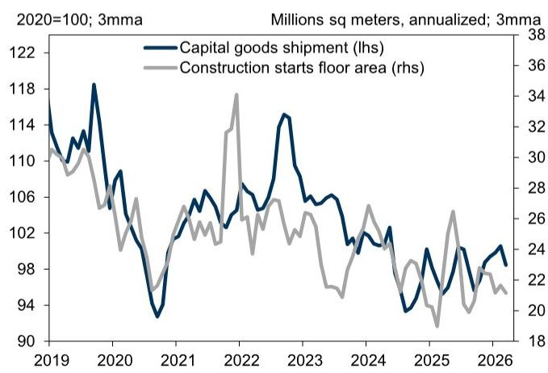

line

| Year | Capital goods shipment (lhs) | Construction starts floor area (rhs) |
|------|------------------------------|--------------------------------------|
| 2019 | 114                          | 30                                   |
| 2020 | 118                          | 28                                   |
| 2021 | 106                          | 26                                   |
| 2022 | 106                          | 34                                   |
| 2023 | 114                          | 28                                   |
| 2024 | 106                          | 26                                   |
| 2025 | 104                          | 24                                   |
| 2026 | 108                          | 22                                   |

Source: Ministry of Economy, Trade and Industry, Ministry of Land, Infrastructure, Transport and Tourism

Exhibit 10: Wage Indices   
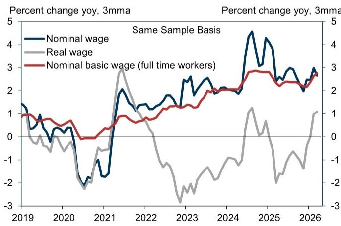

line

| Year | Nominal wage | Real wage | Nominal basic wage (full time workers) |
|------|--------------|---------|----------------------------------------|
| 2019 | 1.5          | 0.5     | 1.0                                    |
| 2020 | 0.0          | -1.0    | 0.5                                    |
| 2021 | -2.0         | 3.0     | 1.0                                    |
| 2022 | 1.5          | 0.0     | 1.5                                    |
| 2023 | 2.5          | -2.5    | 2.0                                    |
| 2024 | 2.0          | 1.0     | 2.5                                    |
| 2025 | 4.5          | -1.5    | 3.0                                    |
| 2026 | 3.0          | 1.0     | 2.5                                    |

Source: Ministry of Health, Labour and Welfare, Data compiled by GS Global Investment Research

Exhibit 11: Consumer Price Index   
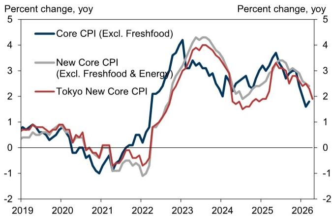

line

| Year | Core CPI (Excl. Freshfood) (%) | New Core CPI (Excl. Freshfood & Energy) (%) | Tokyo New Core CPI (%) |
|---|---|---|---|
| 2019 | 0.8 | 0.5 | 0.9 |
| 2020 | 0.3 | 0.4 | 0.8 |
| 2021 | -0.8 | -0.7 | -0.5 |
| 2022 | 0.5 | -0.9 | -0.6 |
| 2023 | 4.2 | 4.3 | 3.8 |
| 2024 | 2.5 | 3.0 | 2.8 |
| 2025 | 3.7 | 3.2 | 3.1 |
| 2026 | 1.7 | 2.1 | 1.9 |

Source: Ministry of Internal Affairs and Communications

Exhibit 12: Monthly CAI and GDP   
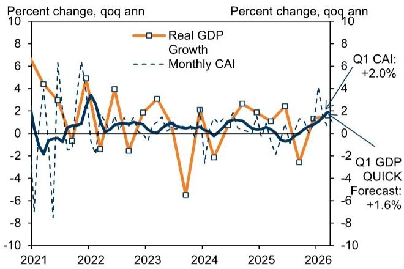

line

| Year | Real GDP Growth | Monthly CAI |
|------|-----------------|-------------|
| 2021 | 6.0             | -8.0        |
| 2022 | 5.0             | 6.0         |
| 2023 | 3.0             | 1.0         |
| 2024 | -6.0            | 0.0         |
| 2025 | 2.0             | 1.0         |
| 2026 | 2.0             | 2.0         |

Source: Cabinet Office, GS Global Investment Research, QUICK

Exhibit 13: Main Economic Forecasts 

<table><tr><td rowspan="2"></td><td colspan="3">Calendar Year</td><td colspan="4">2025</td><td colspan="4">2026</td></tr><tr><td>2025</td><td>2026E</td><td>2027E</td><td>1Q</td><td>2Q</td><td>3Q</td><td>4Q</td><td>1QE</td><td>2QE</td><td>3QE</td><td>4QE</td></tr><tr><td>Real GDP (QOQ Annualized %)</td><td>1.2</td><td>0.5</td><td>1.0</td><td>1.1</td><td>2.4</td><td>-2.6</td><td>1.3</td><td>1.3</td><td>0.1</td><td>0.2</td><td>0.7</td></tr><tr><td>Consumption</td><td>1.5</td><td>0.9</td><td>0.7</td><td>3.0</td><td>1.0</td><td>1.9</td><td>1.1</td><td>0.8</td><td>0.3</td><td>0.4</td><td>0.6</td></tr><tr><td>Capex</td><td>1.9</td><td>1.7</td><td>2.0</td><td>2.1</td><td>4.8</td><td>0.0</td><td>5.4</td><td>0.8</td><td>0.6</td><td>0.7</td><td>0.8</td></tr><tr><td>Housing Investment</td><td>-2.5</td><td>-0.5</td><td>-1.0</td><td>-0.7</td><td>0.2</td><td>-29.7</td><td>21.0</td><td>4.5</td><td>-1.5</td><td>-2.5</td><td>-1.5</td></tr><tr><td>Private Inventories (contribution)</td><td>0.2</td><td>-0.3</td><td>0.0</td><td>1.8</td><td>0.1</td><td>-0.9</td><td>-1.0</td><td>-0.1</td><td>-0.1</td><td>0.0</td><td>0.0</td></tr><tr><td>Export</td><td>2.9</td><td>-0.3</td><td>1.0</td><td>-1.0</td><td>7.9</td><td>-5.5</td><td>-1.4</td><td>3.0</td><td>-2.0</td><td>-1.8</td><td>0.5</td></tr><tr><td>Import</td><td>4.0</td><td>0.3</td><td>1.7</td><td>10.3</td><td>5.7</td><td>-0.5</td><td>-1.3</td><td>0.8</td><td>-0.4</td><td>0.5</td><td>1.5</td></tr><tr><td>Government Spending</td><td>1.0</td><td>1.1</td><td>1.0</td><td>-1.0</td><td>2.8</td><td>0.3</td><td>1.5</td><td>0.9</td><td>1.0</td><td>1.0</td><td>1.0</td></tr><tr><td>Public Fixed Investment</td><td>-0.4</td><td>1.3</td><td>4.8</td><td>-0.4</td><td>0.8</td><td>-5.2</td><td>-2.0</td><td>3.0</td><td>3.5</td><td>4.5</td><td>5.0</td></tr><tr><td>Net Exports (cont.)</td><td>-0.2</td><td>-0.1</td><td>-0.1</td><td>-1.8</td><td>0.4</td><td>-0.9</td><td>0.0</td><td>0.4</td><td>-0.3</td><td>-0.4</td><td>-0.2</td></tr><tr><td>Private Domestic Demand (cont.)</td><td>1.2</td><td>0.4</td><td>0.7</td><td>3.4</td><td>1.4</td><td>-1.1</td><td>1.2</td><td>0.6</td><td>0.1</td><td>0.2</td><td>0.4</td></tr><tr><td>Public Demand (cont.)</td><td>0.2</td><td>0.3</td><td>0.5</td><td>-0.2</td><td>0.6</td><td>-0.1</td><td>0.2</td><td>0.3</td><td>0.4</td><td>0.4</td><td>0.4</td></tr><tr><td>Real GDP (YOY %)</td><td>1.2</td><td>0.5</td><td>1.0</td><td>1.6</td><td>2.1</td><td>0.7</td><td>0.4</td><td>0.6</td><td>0.0</td><td>0.8</td><td>0.6</td></tr><tr><td>Nominal GDP (YOY %)</td><td>4.7</td><td>0.7</td><td>2.6</td><td>5.3</td><td>5.4</td><td>4.1</td><td>3.9</td><td>2.8</td><td>-1.1</td><td>-0.3</td><td>1.3</td></tr><tr><td>Industrial Production (YOY %)</td><td>-0.3</td><td>0.3</td><td>0.9</td><td>0.7</td><td>0.0</td><td>-0.8</td><td>-1.0</td><td>1.1</td><td>-2.8</td><td>1.4</td><td>1.4</td></tr><tr><td>Core CPI (YOY %)</td><td>3.1</td><td>2.0</td><td>2.3</td><td>3.1</td><td>3.5</td><td>2.9</td><td>2.8</td><td>1.8</td><td>1.7</td><td>2.1</td><td>2.6</td></tr><tr><td>New Core CPI (YOY %)</td><td>3.0</td><td>2.2</td><td>2.1</td><td>2.7</td><td>3.2</td><td>3.2</td><td>3.0</td><td>2.5</td><td>2.0</td><td>2.1</td><td>2.1</td></tr><tr><td>Global Core CPI (YOY %)</td><td>1.6</td><td>1.4</td><td>1.8</td><td>1.5</td><td>1.6</td><td>1.5</td><td>1.6</td><td>1.4</td><td>1.2</td><td>1.5</td><td>1.6</td></tr><tr><td>Unemployment Rate (%)</td><td>2.5</td><td>2.6</td><td>2.4</td><td>2.5</td><td>2.5</td><td>2.5</td><td>2.6</td><td>2.7</td><td>2.7</td><td>2.6</td><td>2.6</td></tr><tr><td>Trade balance (¥ tn)</td><td>-0.8</td><td>-10.9</td><td>-5.7</td><td>-1.7</td><td>-0.1</td><td>0.1</td><td>0.9</td><td>-1.8</td><td>-3.9</td><td>-3.9</td><td>-1.3</td></tr><tr><td>Current Account (¥ tn)</td><td>31.9</td><td>23.3</td><td>26.5</td><td>7.3</td><td>6.7</td><td>10.6</td><td>7.2</td><td>6.8</td><td>4.6</td><td>4.7</td><td>7.2</td></tr><tr><td>BOJ Policy Rate (End of Period; %)</td><td>0.75</td><td>1.00</td><td>1.50</td><td>0.50</td><td>0.50</td><td>0.50</td><td>0.75</td><td>0.75</td><td>0.75</td><td>1.00</td><td>1.00</td></tr><tr><td>2-year JGB yield (End of Period)</td><td>1.17</td><td>1.40</td><td>1.50</td><td>0.83</td><td>0.75</td><td>0.94</td><td>1.17</td><td>1.34</td><td>1.40</td><td>1.40</td><td>1.40</td></tr><tr><td>10-year JGB yield (End of Period)</td><td>2.06</td><td>2.50</td><td>2.25</td><td>1.49</td><td>1.43</td><td>1.64</td><td>2.06</td><td>2.35</td><td>2.50</td><td>2.50</td><td>2.50</td></tr><tr><td>USD/JPY (End of Period)</td><td>156.8</td><td>155.0</td><td>141.0</td><td>149.9</td><td>144.2</td><td>148.0</td><td>156.8</td><td>160.0</td><td>158.0</td><td>156.0</td><td>155.0</td></tr><tr><td>EUR/JPY (End of Period)</td><td>184.5</td><td>186.0</td><td>169.2</td><td>161.8</td><td>169.7</td><td>173.6</td><td>184.5</td><td>188.8</td><td>180.1</td><td>184.1</td><td>186.0</td></tr></table>

Source: GS Global Investment Research

# Disclosure Appendix

# Reg AC

We, Yuriko Tanaka, Akira Otani and Tomohiro Ota, hereby certify that all of the views expressed in this report accurately reflect our personal views, which have not been influenced by considerations of the firm's business or client relationships.

Unless otherwise stated, the individuals listed on the cover page of this report are analysts in GS' Global Investment Research division.

Contributing Authors: Yuriko Tanaka GS Japan Co., Ltd., Akira Otani GS Japan Co., Ltd., Tomohiro Ota GS Japan Co., Ltd..

Unless otherwise stated, the individuals listed in the Contributing Authors disclosure of this report are analysts in GS' Global Investment Research division.

# Disclosures

# Regulatory disclosures

# Disclosures required by United States laws and regulations

See company-specific regulatory disclosures above for any of the following disclosures required as to companies referred to in this report: manager or co-manager in a pending transaction; $1\%$ or other ownership; compensation for certain services; types of client relationships; managed/co-managed public offerings in prior periods; directorships; for equity securities, market making and/or specialist role. GS trades or may trade as a principal in debt securities (or in related derivatives) of issuers discussed in this report.

The following are additional required disclosures: Ownership and material conflicts of interest: GS policy prohibits its analysts, professionals reporting to analysts and members of their households from owning securities of any company in the analyst's area of coverage. Analyst compensation: Analysts are paid in part based on the profitability of GS, which includes investment banking revenues. Analyst as officer or director: GS policy generally prohibits its analysts, persons reporting to analysts or members of their households from serving as an officer, director or advisor of any company in the analyst's area of coverage. Non-U.S. Analysts: Non-U.S. analysts may not be associated persons of GS & Co. LLC and therefore may not be subject to FINRA Rule 2241 or FINRA Rule 2242 restrictions on communications with a subject company, public appearances and trading in securities covered by the analysts.

# Additional disclosures required under the laws and regulations of jurisdictions other than the United States

The following disclosures are those required by the jurisdiction indicated, except to the extent already made above pursuant to United States laws and regulations. Australia: GS Australia Pty Ltd and its affiliates are not authorised deposit-taking institutions (as that term is defined in the Banking Act 1959 (Cth)) in Australia and do not provide banking services, nor carry on a banking business, in Australia. This research, and any access to it, is intended only for “wholesale clients” within the meaning of the Australian Corporations Act, unless otherwise agreed by GS. In producing research reports, members of Global Investment Research of GS Australia may attend site visits and other meetings hosted by the companies and other entities which are the subject of its research reports. In some instances the costs of such site visits or meetings may be met in part or in whole by the issuers concerned if GS Australia considers it is appropriate and reasonable in the specific circumstances relating to the site visit or meeting. To the extent that the contents of this document contains any financial product advice, it is general advice only and has been prepared by GS without taking into account a client’s objectives, financial situation or needs. A client should, before acting on any such advice, consider the appropriateness of the advice having regard to the client’s own objectives, financial situation and needs. A copy of certain GS Australia and New Zealand disclosure of interests and a copy of GS’ Australian Sell-Side Research Independence Policy Statement are available at: https://www.goldmansachs.com/disclosures/australia-new-zealand/index.html. Brazil: Disclosure information in relation to CVM Resolution n. 20 is available at https://www.gs.com/worldwide/brazil/area/gir/index.html. Where applicable, the Brazil-registered analyst primarily responsible for the content of this research report, as defined in Article 20 of CVM Resolution n. 20, is the first author named at the beginning of this report, unless indicated otherwise at the end of the text. Canada: This information is being provided to you for information purposes only and is not, and under no circumstances should be construed as, an advertisement, offering or solicitation by GS & Co. LLC for purchasers of securities in Canada to trade in any Canadian security. GS & Co. LLC is not registered as a dealer in any jurisdiction in Canada under applicable Canadian securities laws and generally is not permitted to trade in Canadian securities and may be prohibited from selling certain securities and products in certain jurisdictions in Canada. If you wish to trade in any Canadian securities or other products in Canada please contact GS Canada Inc., an affiliate of The GS Group Inc., or another registered Canadian dealer. Hong Kong: Further information on the securities of covered companies referred to in this research may be obtained on request from GS (Asia) L.L.C. India: Further information on the subject company or companies referred to in this research may be obtained from GS (India) Securities Private Limited, Research Analyst - SEBI Registration Number INH000001493, 10th Floor, Ascent-Worli, Sudam Kalu Ahire Marg, Worli, Mumbai-400 025, India, Corporate Identity Number U74140MH2006FTC160634, Phone +91 22 6616 9000, Fax +91 22 6616 9001. GS may beneficially own 1% or more of the securities (as such term is defined in clause 2 (h) the Indian Securities Contracts (Regulation) Act, 1956) of the subject company or companies referred to in this research report. Investment in securities market are subject to market risks. Read all the related documents carefully before investing. Registration granted by SEBI and certification from NISM in no way guarantee performance of the intermediary or provide any assurance of returns to investors. GS (India) Securities Private Limited compliance officer and investor grievance contact details can be found at: https://www.goldmansachs.com/worldwide/india/documents/Grievance-Redressal-and-Escalation-Matrix.pdf, and a copy of the annual audit compliance report can be found at this link: https://publishing.gs.com/content/site/india-annual-compliance-report.html. Japan: See below. Korea: This research, and any access to it, is intended only for “professional investors” within the meaning of the Financial Services and Capital Markets Act, unless otherwise agreed by GS. Further information on the subject company or companies referred to in this research may be obtained from GS (Asia) L.L.C., Seoul Branch. New Zealand: GS New Zealand Limited and its affiliates are neither “registered banks” nor “deposit takers” (as defined in the Reserve Bank of New Zealand Act 1989) in New Zealand. This research, and any access to it, is intended for “wholesale clients” (as defined in the Financial Advisers Act 2008) unless otherwise agreed by GS. A copy of certain GS Australia and New Zealand disclosure of interests is available at: https://www.goldmansachs.com/disclosures/australia-new-zealand/index.html. Russia: Research reports distributed in the Russian Federation are not advertising as defined in the Russian legislation, but are information and analysis not having product promotion as their main purpose and do not provide appraisal within the meaning of the Russian legislation on appraisal activity. Research reports do not constitute a personalized investment recommendation as defined in Russian laws and regulations, are not addressed to a specific client, and are prepared without analyzing the financial circumstances, investment profiles or risk profiles of clients. GS assumes no responsibility for any investment decisions that may be taken by a client or any other person based on this research report. Singapore: GS (Singapore) Pte. (Company Number: 198602165W), which is regulated by the Monetary Authority of Singapore, accepts legal responsibility for this research, and should be contacted with respect to any matters arising from, or in connection with, this research. Taiwan: This material is for reference only and must not be reprinted without permission. Investors should carefully consider their own investment risk. Investment results are the responsibility of the individual investor. United Kingdom: Persons who would be categorized as retail clients in the United Kingdom, as such term is

defined in the rules of the Financial Conduct Authority, should read this research in conjunction with prior GS on the covered companies referred to herein and should refer to the risk warnings that have been sent to them by GS International. A copy of these risks warnings, and a glossary of certain financial terms used in this report, are available from GS International on request.

European Union and United Kingdom: Disclosure information in relation to Article 6 (2) of the European Commission Delegated Regulation (EU) (2016/958) supplementing Regulation (EU) No 596/2014 of the European Parliament and of the Council (including as that Delegated Regulation is implemented into United Kingdom domestic law and regulation following the United Kingdom's departure from the European Union and the European Economic Area) with regard to regulatory technical standards for the technical arrangements for objective presentation of investment recommendations or other information recommending or suggesting an investment strategy and for disclosure of particular interests or indications of conflicts of interest is available at https://www.gs.com/disclosures/europeanpolicy.html which states the European Policy for Managing Conflicts of Interest in Connection with Investment Research.

Japan: GS Japan Co., Ltd. is a Financial Instrument Dealer registered with the Kanto Financial Bureau under registration number Kinsho 69, and a member of Japan Securities Dealers Association, Financial Futures Association of Japan Type II Financial Instruments Firms Association, and Investment Management Association of Japan. Sales and purchase of equities are subject to commission pre-determined with clients plus consumption tax. See company-specific disclosures as to any applicable disclosures required by Japanese stock exchanges, the Japanese Securities Dealers Association or the Japanese Securities Finance Company.

# Global product; distributing entities

GS Global Investment Research produces and distributes research products for clients of GS on a global basis. Analysts based in GS offices around the world produce research on industries and companies, and research on macroeconomics, currencies, commodities and portfolio strategy. This research is disseminated in Australia by GS Australia Pty Ltd (ABN 21 006 797 897); in Brazil by GS do Brasil Corretora de Títulos e Valores Mobiliários S.A.; Public Communication Channel GS Brazil: 0800 727 5764 and / or contatogoldmanbrasil@gs.com. Available Weekdays (except holidays), from 9am to 6pm. Canal de Comunicação com o Público GS Brasil: 0800 727 5764 e/ou contatogoldmanbrasil@gs.com. Horário de funcionamento: segunda-feira à sexta-feira (exceto feriados), das 9h às 18h; in Canada by GS & Co. LLC; in Hong Kong by GS (Asia) L.L.C.; in India by GS (India) Securities Private Ltd.; in Japan by GS Japan Co., Ltd.; in the Republic of Korea by GS (Asia) L.L.C., Seoul Branch; in New Zealand by GS New Zealand Limited; in Russia by OOO GS; in Singapore by GS (Singapore) Pte. (Company Number: 198602165W); and in the United States of America by GS & Co. LLC. GS International has approved this research in connection with its distribution in the United Kingdom.

GS International (“GSI”), authorised by the Prudential Regulation Authority (“PRA”) and regulated by the Financial Conduct Authority (“FCA”) and the PRA, has approved this research in connection with its distribution in the United Kingdom.

European Economic Area: GS Bank Europe SE (“GSBE”) is a credit institution incorporated in Germany and, within the Single Supervisory Mechanism, subject to direct prudential supervision by the European Central Bank and in other respects supervised by German Federal Financial Supervisory Authority (Bundesanstalt für Finanzdienstleistungsaufsicht, BaFin) and Deutsche Bundesbank and disseminates research within the European Economic Area.

# General disclosures

This research is for our clients only. Other than disclosures relating to GS, this research is based on current public information that we consider reliable, but we do not represent it is accurate or complete, and it should not be relied on as such. The information, opinions, estimates and forecasts contained herein are as of the date hereof and are subject to change without prior notification. We seek to update our research as appropriate, but various regulations may prevent us from doing so. Other than certain industry reports published on a periodic basis, the large majority of reports are published at irregular intervals as appropriate in the analyst's judgment.

GS conducts a global full-service, integrated investment banking, investment management, and brokerage business. We have investment banking and other business relationships with a sUBStantial percentage of the companies covered by Global Investment Research. GS & Co. LLC, the United States broker dealer, is a member of SIPC (https://www.sipc.org).

Our salespeople, traders, and other professionals may provide oral or written market commentary or trading strategies to our clients and principal trading desks that reflect opinions that are contrary to the opinions expressed in this research. Our asset management area, principal trading desks and investing businesses may make investment decisions that are inconsistent with the recommendations or views expressed in this research.

We and our affiliates, officers, directors, and employees will from time to time have long or short positions in, act as principal in, and buy or sell, the securities or derivatives, if any, referred to in this research, unless otherwise prohibited by regulation or GS policy.

The views attributed to third party presenters at GS arranged conferences, including individuals from other parts of GS, do not necessarily reflect those of Global Investment Research and are not an official view of GS.

Any third party referenced herein, including any salespeople, traders and other professionals or members of their household, may have positions in the products mentioned that are inconsistent with the views expressed by analysts named in this report.

This research is focused on investment themes across markets, industries and sectors. It does not attempt to distinguish between the prospects or performance of, or provide analysis of, individual companies within any industry or sector we describe.

Any trading recommendation in this research relating to an equity or credit security or securities within an industry or sector is reflective of the investment theme being discussed and is not a recommendation of any such security in isolation.

This research is not an offer to sell or the solicitation of an offer to buy any security in any jurisdiction where such an offer or solicitation would be illegal. It does not constitute a personal recommendation or take into account the particular investment objectives, financial situations, or needs of individual clients. Clients should consider whether any advice or recommendation in this research is suitable for their particular circumstances and, if appropriate, seek professional advice, including tax advice. The price and value of investments referred to in this research and the income from them may fluctuate. Past performance is not a guide to future performance, future returns are not guaranteed, and a loss of original capital may occur. Fluctuations in exchange rates could have adverse effects on the value or price of, or income derived from, certain investments.

Certain transactions, including those involving futures, options, and other derivatives, give rise to sUBStantial risk and are not suitable for all investors. Investors should review current options and futures disclosure documents which are available from GS sales representatives or at https://www.theocc.com/about/publications/character-risks.jsp and https://www.goldmansachs.com/disclosures/cftc\_fcm\_disclosures. Transaction costs may be significant in option strategies calling for multiple purchase and sales of options such as spreads. Supporting documentation will be supplied upon request.

Differing Levels of Service provided by Global Investment Research: The level and types of services provided to you by GS Global Investment Research may vary as compared to that provided to internal and other external clients of GS, depending on various factors including your individual preferences as to the frequency and manner of receiving communication, your risk profile and investment focus and perspective (e.g., marketwide, sector specific, long term, short term), the size and scope of your overall client relationship with GS, and legal and regulatory constraints. As an example, certain clients may request to receive notifications when research on specific securities is published, and certain clients may request that specific data underlying analysts' fundamental analysis available on our internal client websites be delivered to them electronically through data feeds or otherwise. No change to an analyst's fundamental research views (e.g., ratings, price targets, or material changes to earnings estimates for equity securities), will be communicated to any client prior to inclusion of such information in a research report broadly disseminated through electronic publication to our internal client websites or through other means, as necessary, to all clients who are entitled to receive such reports.

All research reports are disseminated and available to all clients simultaneously through electronic publication to our internal client websites. Not all research content is redistributed to our clients or available to third-party aggregators, nor is GS responsible for the redistribution of our research by third party aggregators. For research, models or other data related to one or more securities, markets or asset classes (including related services) that may be available to you, please contact your GS representative or go to https://research.gs.com.

Disclosure information is also available at https://www.gs.com/research/hedge.html or from Research Compliance, 200 West Street, New York, NY 10282.

# © 2026 GS.

You are permitted to store, display, analyze, modify, reformat, and print the information made available to you via this service only for your own use. You may not resell or reverse engineer this information to calculate or develop any index for disclosure and/or marketing or create any other derivative works or commercial product(s), data or offering(s) without the express written consent of GS. You are not permitted to publish, transmit, or otherwise reproduce this information, in whole or in part, in any format to any third party without the express written consent of GS. This foregoing restriction includes, without limitation, using, extracting, downloading or retrieving this information, in whole or in part, to train or finetune a machine learning or artificial intelligence system, or to provide or reproduce this information, in whole or in part, as a prompt or input to any such system.