# GLOBAL CREDIT TRADER

# State of Play for Leveraged Finance Defaults

As we highlighted recently, absent a sharp deterioration in the growth backdrop, we believe the peak in aggregate default activity in the syndicated credit market (leveraged loans and HY bonds) is likely behind us. That said, under the surface, there are several key default-related themes for corporate credit investors to monitor—consistent with the broader theme of market dispersion.

In this week's Global Credit Trader, we examine the state of play for defaults in the US and European leveraged finance markets and highlight several key themes.

1. The direction: The absolute level of defaults has been trending higher from the very low levels that persisted in 2022/23 but remains near historical median levels. The one exception is the floating rate broadly syndicated loan (BSL) market, where defaults peaked in late 2024 and have been declining.   
2. Structures: Distressed exchanges, or liability management exercises (LMEs), remain the vehicle of choice for reorganizing the liability side of a firm's balance sheet. However, these are increasingly leading to a ‘repeat defaulter’ phenomenon.   
3. Ultimate losses: Recovery rates have continued to trend lower—extending the longer-term pattern. We partially attribute this dynamic to the rise of repeat defaults and ‘loan-only’ capital structures.   
4. Sector patterns: In contrast to the prevailing market narrative related to potential disruption of Software-focused firms, the sector composition mix still skews heavily towards capital industries and consumer-facing businesses.   
5. The view ahead: The growth backdrop is the key signpost to watch, in our view. Looking ahead, none of the metrics we monitor signal a near-term uptick in expected defaults in the US. In Europe, we still envision a modest increase in defaults through year-end, owing to a more challenging growth, inflation, monetary policy mix. That said, we still expect defaults to remain below the local peak. The loan market is more vulnerable than HY, in our view.

# Amanda Lynam, CPA

+1(212)934-1895

amanda.lynam@gs.com

GS & Co. LLC

# Spencer Rogers, CFA

+1(801)884-1104

spencer.rogers@gs.com

GS & Co. LLC

# Sara Grut

+44(20)7774-8622 | sara.grut@gs.com

GS International

# Shamshad Ali

+1(212)902-6712

shamshad.ali@gs.com

GS & Co. LLC

# State of Play for Leveraged Finance Defaults

Over the past several years, defaults have exhibited divergent trends across regions and asset classes. Exhibits 1 and 2 illustrate the 12-month trailing, issuer-weighted default rates in the US and European HY and leveraged loan markets (inclusive of distressed exchanges). While US HY defaults have been oscillating in a narrow band between 3% and 4% for the last couple of years, the US BSL market has demonstrated a discernible deceleration from the funding-cost-driven spike of 2023 and 2024, with the default rate falling to 5.1% from a peak of 7.4%. In Europe, both HY bond and BSL defaults show signs of trending higher, consistent with a more challenging growth, inflation, and monetary policy mix related to the ongoing commodity market disruptions.

Exhibit 1: US HY defaults have oscillated in a narrow band while US BSL defaults are still decelerating from their recent peak   
12-month trailing issuer-weighted default rates in the US HY bond and leveraged loan markets   
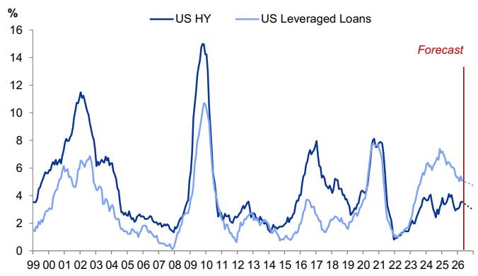

line

| Year | US HY | US Leveraged Loans |
|------|-------|---------------------|
| 99   | ~3.5  | ~1.5                |
| 00   | ~4.5  | ~2.5                |
| 01   | ~6.0  | ~4.0                |
| 02   | ~11.5 | ~6.5                |
| 03   | ~7.0  | ~5.0                |
| 04   | ~6.5  | ~4.5                |
| 05   | ~3.0  | ~2.5                |
| 06   | ~2.5  | ~2.0                |
| 07   | ~2.0  | ~1.5                |
| 08   | ~1.5  | ~1.0                |
| 09   | ~3.0  | ~2.5                |
| 10   | ~15.0 | ~11.0               |
| 11   | ~2.5  | ~1.5                |
| 12   | ~3.0  | ~2.0                |
| 13   | ~2.5  | ~1.5                |
| 14   | ~2.0  | ~1.0                |
| 15   | ~2.5  | ~1.5                |
| 16   | ~4.0  | ~3.0                |
| 17   | ~8.0  | ~4.0                |
| 18   | ~6.0  | ~3.5                |
| 19   | ~4.0  | ~3.0                |
| 20   | ~8.0  | ~4.5                |
| 21   | ~8.5  | ~6.0                |
| 22   | ~1.0  | ~1.5                |
| 23   | ~3.0  | ~3.5                |
| 24   | ~4.0  | ~5.0                |
| 25   | ~3.5  | ~4.5                |
| 26   | ~3.0  | ~4.0                |

Note: As of April 2026 (most recent as of May 14, 2026).   
Source: Moody's, GS Global investment Research

Exhibit 2: The path of European defaults is likely higher owing to a challenging growth, inflation and policy mix 12-month trailing issuer-weighted default rates in the European HY bond and leveraged loan markets   
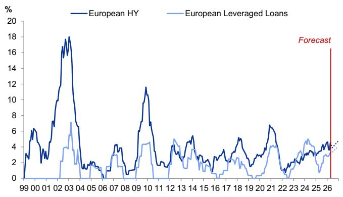

line

| Year | European HY | European Leveraged Loans |
|------|-------------|--------------------------|
| 99   | 0           | 0                        |
| 00   | 6           | 0                        |
| 01   | 4           | 0                        |
| 02   | 18          | 4                        |
| 03   | 18          | 7                        |
| 04   | 2           | 0                        |
| 05   | 2           | 0                        |
| 06   | 2           | 0                        |
| 07   | 4           | 2                        |
| 08   | 4           | 2                        |
| 09   | 12          | 4                        |
| 10   | 12          | 4                        |
| 11   | 4           | 2                        |
| 12   | 4           | 2                        |
| 13   | 5           | 4                        |
| 14   | 5           | 4                        |
| 15   | 5           | 4                        |
| 16   | 5           | 4                        |
| 17   | 5           | 4                        |
| 18   | 5           | 4                        |
| 19   | 5           | 4                        |
| 20   | 5           | 4                        |
| 21   | 7           | 4                        |
| 22   | 7           | 4                        |
| 23   | 5           | 4                        |
| 24   | 5           | 4                        |
| 25   | 5           | 4                        |
| 26   | 5           | 4                        |

Note: As of April 2026 (most recent as of May 14, 2026).   
Source: Moody's, GS Global Investment Research

A defining theme of the current cycle is the structural shift away from traditional in-court restructurings and towards distressed exchanges and, to a lesser extent, pre-packaged Chapter 11s. As Exhibits 3 and 4 highlight, the shares of defaults that were classified as distressed exchanges or pre-packaged Chapter 11 filings have surged in recent years and are currently hovering in the 70-80% range, depending on the market. On average, we find that LMEs tend to preserve recovery values better than in-court restructurings initially—which often makes such transactions the preferred path for private equity sponsors. For example, in 2025, US HY senior unsecured recovery rates for distressed exchanges averaged around 60% vs. roughly 10% for the handful of ‘hard’ defaults that occurred.

Exhibit 3: The LME share of US defaults continues to rise
Annual share of defaults in the US HY and BSL markets classified as distressed exchanges or ‘pre-pack’ Chapter 11 filings   
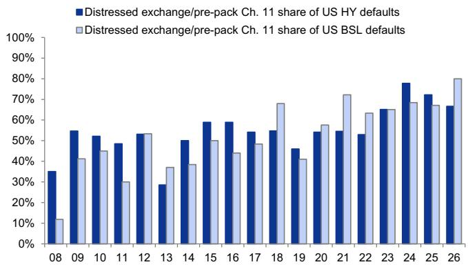

bar

| Year | Distressed exchange/pre-pack Ch. 11 share of US HY defaults (%) | Distressed exchange/pre-pack Ch. 11 share of US BSL defaults (%) |
|---|---|---|
| 08 | 35 | 11 |
| 09 | 54 | 41 |
| 10 | 52 | 45 |
| 11 | 49 | 30 |
| 12 | 53 | 53 |
| 13 | 29 | 37 |
| 14 | 50 | 38 |
| 15 | 59 | 50 |
| 16 | 59 | 44 |
| 17 | 54 | 48 |
| 18 | 55 | 68 |
| 19 | 46 | 41 |
| 20 | 54 | 57 |
| 21 | 54 | 72 |
| 22 | 53 | 63 |
| 23 | 65 | 65 |
| 24 | 78 | 68 |
| 25 | 72 | 67 |
| 26 | 67 | 80 |

Note: As of April 2026 (most recent as of May 14, 2026).   
Source: Moody's, GS Global Investment Research

Exhibit 4: The distressed exchange share of European defaults is also elevated   
Annual share of defaults in the European HY and BSL markets classified as distressed exchanges or ‘pre-pack’ Chapter 11 filings   
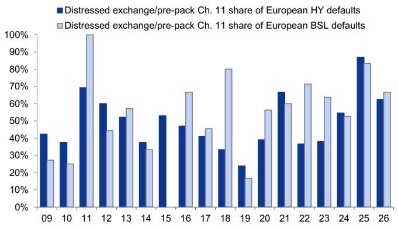

bar

| Year | Distressed exchange/pre-pack Ch. 11 share of European HY defaults (%) | Distressed exchange/pre-pack Ch. 11 share of European BSL defaults (%) |
| :--- | :--- | :--- |
| 09 | 42 | 27 |
| 10 | 38 | 25 |
| 11 | 70 | 100 |
| 12 | 60 | 44 |
| 13 | 52 | 57 |
| 14 | 38 | 33 |
| 15 | 53 | 0 |
| 16 | 47 | 67 |
| 17 | 41 | 45 |
| 18 | 33 | 80 |
| 19 | 24 | 16 |
| 20 | 39 | 56 |
| 21 | 67 | 60 |
| 22 | 37 | 71 |
| 23 | 38 | 64 |
| 24 | 54 | 52 |
| 25 | 87 | 83 |
| 26 | 62 | 67 |

Note: As of April 2026 (most recent as of May 14, 2026).   
Source: Moody's, GS Global Investment Research

The dominance of LMEs comes with an important caveat: they are often an iterative process, and for many corporate borrowers a single distressed exchange fails to place their debt burden on a sustainable path. This ‘incomplete’ balance sheet relief results in a visible trend of ‘repeat defaults.’

Exhibits 5 through 8 show the annual share of repeat defaults (across various markets) involving distressed exchanges vs. in-court restructurings, using a three-year window to define a repeat default. The main takeaway is that in-court restructurings are rarely followed by a repeat default, while distressed exchanges lead to repeat defaults roughly 50% of the time. As we have documented in previous research, these iterative defaults systematically erode recovery outcomes with each successive restructuring.

Exhibit 5: LMEs are often iterative and lead to ‘repeat defaults’ much more often than in-court restructurings...   
Share of US HY distressed exchanges (left panel) and in-court restructurings (right panel) in each year that defaulted again within three years   
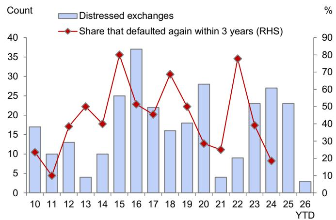

bar_line

| YTD | Count | Share that defaulted again within 3 years (RHS) |
| --- | --- | --- |
| 10 | 17 | 20 |
| 11 | 10 | 10 |
| 12 | 13 | 40 |
| 13 | 4 | 50 |
| 14 | 10 | 40 |
| 15 | 25 | 80 |
| 16 | 37 | 50 |
| 17 | 22 | 40 |
| 18 | 16 | 70 |
| 19 | 18 | 50 |
| 20 | 28 | 30 |
| 21 | 4 | 20 |
| 22 | 9 | 80 |
| 23 | 23 | 40 |
| 24 | 27 | 20 |
| 25 | 23 | - |
| 26 | 3 | - |

Note: As of April 2026 (most recent as of May 14, 2026).

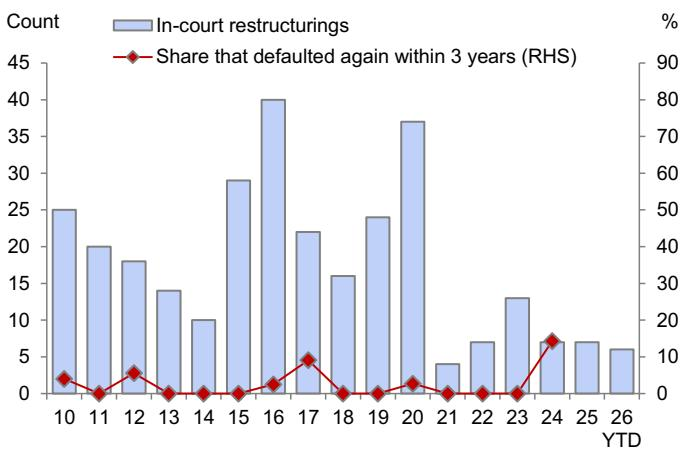

bar_line

| YTD | Count | Share that defaulted again within 3 years (RHS) (%) |
|---|---|---|
| 10 | 25 | 2 |
| 11 | 20 | 0 |
| 12 | 18 | 3 |
| 13 | 14 | 0 |
| 14 | 10 | 0 |
| 15 | 29 | 0 |
| 16 | 40 | 2 |
| 17 | 22 | 5 |
| 18 | 16 | 0 |
| 19 | 24 | 0 |
| 20 | 37 | 2 |
| 21 | 4 | 0 |
| 22 | 7 | 0 |
| 23 | 13 | 0 |
| 24 | 7 | 15 |
| 25 | 7 | 0 |
| 26 | 6 | 0 |

Source: Moody's, GS Global Investment Research

Exhibit 6: ...the same is true in the broadly syndicated loan market   
Share of US leveraged loan distressed exchanges (left panel) and in-court restructurings (right panel) in each year that defaulted again within three years   
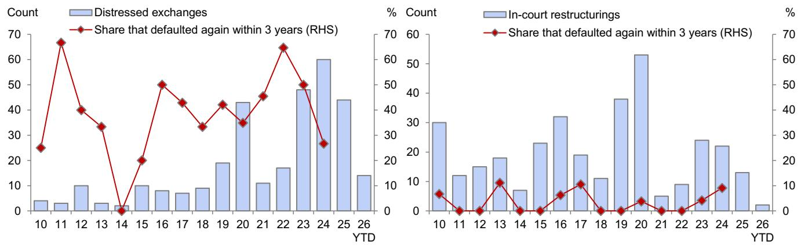  
Note: As of April 2026 (most recent as of May 14, 2026).   
Source: Moody's, GS Global Investment Research

Exhibit 7: The same pattern holds in European HY...   
Share of European HY distressed exchanges (left panel) and in-court restructurings (right panel) in each year that defaulted again within three years   
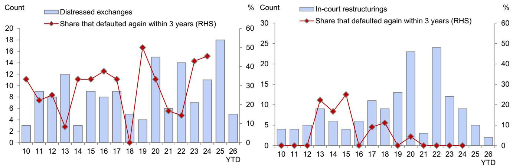

bar_line

| YTD | Count | Share that defaulted again within 3 years (RHS) (%) |
|-----|-------|------------------------------------------------------|
| 10  | 3     | 11                                                   |
| 11  | 9     | 7                                                    |
| 12  | 8     | 8                                                    |
| 13  | 12    | 3                                                    |
| 14  | 3     | 11                                                   |
| 15  | 9     | 11                                                   |
| 16  | 8     | 13                                                   |
| 17  | 9     | 11                                                   |
| 18  | 5     | 0                                                    |
| 19  | 4     | 50                                                   |
| 20  | 15    | 11                                                   |
| 21  | 6     | 6                                                    |
| 22  | 14    | 5                                                    |
| 23  | 7     | 4                                                    |
| 24  | 11    | 44                                                   |
| 25  | 18    | 46                                                   |
| 26  | 5     | -                                                    |

| YTD | Count | Share that defaulted again within 3 years (RHS) (%) |
|-----|-------|--------------------------------------------------------|
| 10  | -     | -                                                      |
| 11  | -     | -                                                      |
| 12  | -     | -                                                      |
| 13  | -     | -                                                      |
| 14  | -     | -                                                      |
| 15  | -     | -                                                      |
| 16  | -     | -                                                      |
| 17  | -     | -                                                      |
| 18  | -     | -                                                      |
| 19  | -     | -                                                      |
| 20  | -     | -                                                      |
| 21  | -     | -                                                      |
| 22  | -     | -                                                      |
| 23  | -     | -                                                      |
| 24  | -     | -                                                      |
| 25  | -     | -                                                      |
| 26  | -     | -                                                      |

| YTD | Count | Share that defaulted again within 3 years (RHS) (%) |
|-----|-------|--------------------------------------------------------|
| 10  | -     | -                                                      |
| 11  | -     | -                                                      |
| 12  | -     | -                                                      |
| 13  | -     | -                                                      |
| 14  | -     | -                                                      |
| 15  | -     | -                                      |
| 16  | -     | -                                                      |
| 17  | -     | -                                                      |
| 18  | -     | -                                                      |
| 19  | -     | -                                                      |
| 20  | -     | -                                                      |
| 21  | -     | -                                                      |
| 22  | -     | -                                                      |
| 23  | -     | -                                                      |
| 1    | -     | -                                                      |
| 2    | -     | -                                                      |
| 3    | -     | -                                                      |
| ... | ...   | ...                                                    |
| YTD : Count (Distressed exchanges) / In-court restructurings (RHS) / Share that defaulted again within 3 years (RHS) (%) (Count) / Share that defaulted again within 3 years (RHS) (%) (Share) (Count) / Share that defaulted again within 3 years (RHS) (%) (Share) (Count) (Share) (Count) (Share) (Count) (Share) (Count) (Share) (Count) (Share) (Count) (Share) (Count) (Share) (Count) (Share) (Count) (Share) (Count) (Share) (Count) (Share) (Count) (Share) (Count) (Share) (Count) (Share) (Count) (Count) (Share) (Count) (Count) (Share) (Count) (Count) (Share) (Count) (Count) (Share) (Count) (Count) (Share) (Count) (Count) (Share) (Count) (Count) (Share) (Count) (Count) (Share) (Count) (Count) (Share) (Count) (Count) (Share) (Count) (Count) (Share) (Count)

Note: As of April 2026 (most recent as of May 14, 2026).   
Source: Moody's, GS Global Investment Research

Exhibit 8: ...and in the European leveraged loan market   
Share of European leveraged loan distressed exchanges (left panel) and in-court restructurings (right panel) in each year that defaulted again within three years   
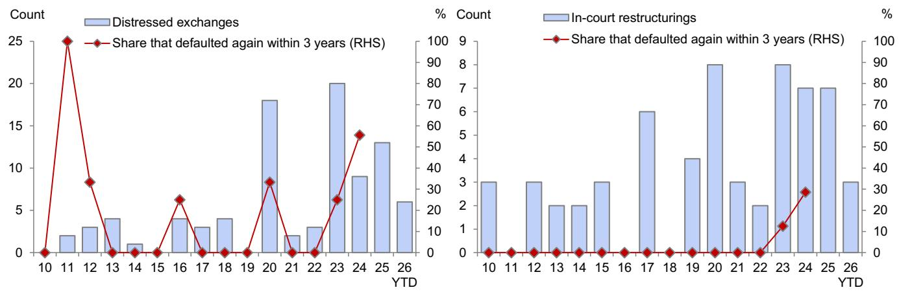  
Note: As of April 2026 (most recent as of May 14, 2026).   
Source: Moody's, GS Global Investment Research

The rise of repeat default activity has coincided somewhat with a broader aggregate decline in recovery values in the USD market (in Europe, where the data is more sparse, we have not observed a similar trend). Exhibit 9 tracks the 12-month trailing recovery rate for US senior unsecured bonds vs. $1^{\text{st}}$ lien loans over the past 20 years. While the acceleration in repeat defaults is likely one contributing factor to this erosion in average recovery values, we would also point to two other drivers.

First, the proliferation of ‘loan-only’ capital structures has reduced the subordination cushion that HY bonds used to provide in ‘mixed’ capital structures that had both loans and bonds outstanding. We estimate that over 70% of loans are now issued by loan-only capital structures, up from just 45% in 2010. Second, as shown in Exhibit 10, the US economy has structurally transitioned from asset-heavy industries (e.g., manufacturing) toward an asset-light, information and services-based economy. In this regime, there are fewer tangible assets available for liquidation in the case of bankruptcy—which leads to lower recovery values.

Exhibit 9: Recovery values have been steadily eroding, in aggregate   
12-month trailing recovery given default for US senior unsecured bonds and 1st lien loans   
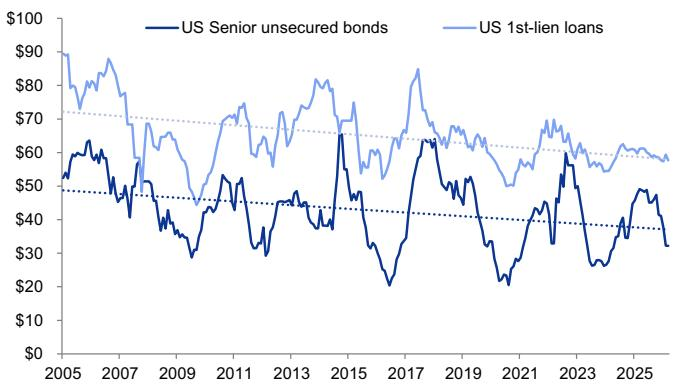

line

| Year | US Senior unsecured bonds | US 1st-lien loans |
|------|---------------------------|-------------------|
| 2005 | ~$55                      | ~$90              |
| 2006 | ~$60                      | ~$85              |
| 2007 | ~$55                      | ~$80              |
| 2008 | ~$45                      | ~$70              |
| 2009 | ~$35                      | ~$65              |
| 2010 | ~$40                      | ~$70              |
| 2011 | ~$50                      | ~$75              |
| 2012 | ~$45                      | ~$70              |
| 2013 | ~$45                      | ~$75              |
| 2014 | ~$45                      | ~$80              |
| 2015 | ~$65                      | ~$85              |
| 2016 | ~$25                      | ~$70              |
| 2017 | ~$65                      | ~$85              |
| 2018 | ~$60                      | ~$75              |
| 2019 | ~$55                      | ~$70              |
| 2020 | ~$45                      | ~$65              |
| 2021 | ~$35                      | ~$60              |
| 2022 | ~$45                      | ~$65              |
| 2023 | ~$55                      | ~$70              |
| 2024 | ~$45                      | ~$65              |
| 2025 | ~$40                      | ~$60              |

Note: As of March 2026 (most recent as of May 14, 2026).   
Source: Moody's, GS Global Investment Research

Exhibit 10: Asset-light sectors have grown to dominate the US economy compared to asset-heavy sectors such as Manufacturing   
Individuals employed (in millions) in the US economy, for select sectors   
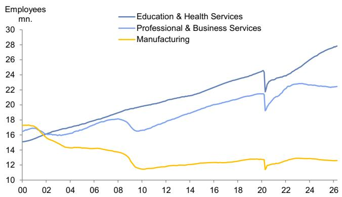

line

| Year | Education & Health Services | Professional & Business Services | Manufacturing |
|------|-----------------------------|-----------------------------------|---------------|
| 00   | 15.5                        | 17.0                              | 17.5          |
| 02   | 16.0                        | 16.5                              | 16.0          |
| 04   | 17.0                        | 16.0                              | 14.5          |
| 06   | 18.0                        | 17.5                              | 14.0          |
| 08   | 19.0                        | 18.0                              | 13.5          |
| 10   | 20.0                        | 16.5                              | 11.5          |
| 12   | 21.0                        | 17.5                              | 12.0          |
| 14   | 22.0                        | 18.5                              | 12.5          |
| 16   | 23.0                        | 19.5                              | 12.5          |
| 18   | 24.0                        | 20.5                              | 12.5          |
| 20   | 25.0                        | 21.5                              | 12.0          |
| 22   | 26.0                        | 23.0                              | 13.0          |
| 24   | 27.0                        | 23.5                              | 13.0          |
| 26   | 28.0                        | 23.0                              | 12.5          |

Note: As of April 2026 (most recent available as of May 14, 2026).   
Source: Bureau of Labor Statistics, Haver Analytics, GS Global Investment Research

Many market participants are focused on the magnitude and timing of the potential disruption to Software business models from innovation in artificial intelligence (AI). So far, however, it has not yet become evident in the underlying default data. Exhibits 11 and 12 categorize defaults over the last 12 months by industry across the US and European HY and loan markets.

The clear theme, in our view, is that defaults have mostly been concentrated among Capital Industries (Chemicals, Packaging, Automotive, Equipment, etc.) and Consumer Industries (Healthcare, Food & Beverage, Lodging/Leisure, etc.). In our view, this pattern has been driven by a mix of factors, including structurally higher debt servicing costs (at least relative to much of the post-financial crisis era), shifts in consumer purchasing preferences, and cost input pressures.

Notably, however, we have not yet observed a significant uptick in Software-related defaults. Our Software equity research team has outlined that many software firms still have competitive moats and that the narrative around disruption in the sector is nuanced, depending on a range of factors. That said, we expect this to nonetheless remain an overhang on the sector, as uncertainty around the pace and scope of AI-related innovation will make it difficult to ‘disprove’ a thesis of disruption. Should significant, near-term disruption to the Software sector materialize, it would present upside risk to our loan default forecasts in the US and Europe given the large weight of the sector in both regions.

Exhibit 11: Recent defaults have been concentrated in capital industries and consumer-facing sectors...   
Share of US HY (left panel) and leveraged loan (right panel) defaults over the last 12-months, by broad sector   
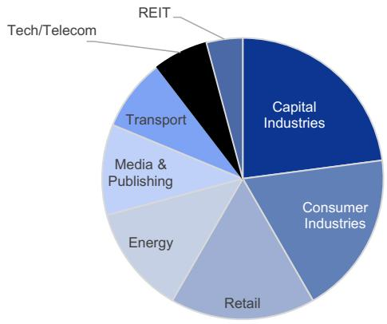

pie

| Category | Value |
|---|---|
| Capital Industries | 35 |
| Consumer Industries | 28 |
| Retail | 25 |
| Energy | 18 |
| Media & Publishing | 15 |
| Transport | 12 |
| Tech/Telecom | 8 |
| REIT | 6 |

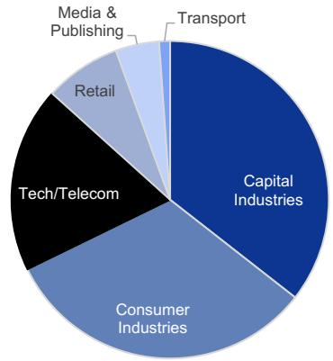

pie

| Category | Value |
|---|---|
| Capital Industries | 100 |
| Consumer Industries | 85 |
| Tech/Telecom | 45 |
| Retail | 25 |
| Media & Publishing | 15 |
| Transport | 5 |

Note: As of April 2026 (most recent as of May 14, 2026).   
Source: Moody's, GS Global Investment Research

Exhibit 12: ...and the same has been true in European defaults   
Share of European HY (left panel) and leveraged loan (right panel) defaults over the last 12-months, by broad sector   
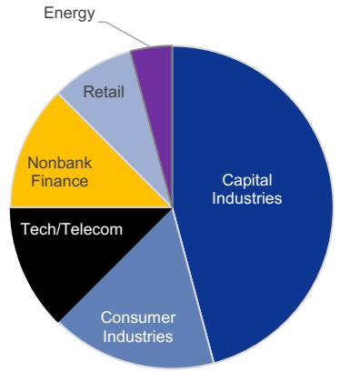

pie

| Category | Value |
|---|---|
| Capital Industries | 50% |
| Consumer Industries | 20% |
| Tech/Telecom | 15% |
| Nonbank Finance | 15% |
| Retail | 10% |
| Energy | 5% |

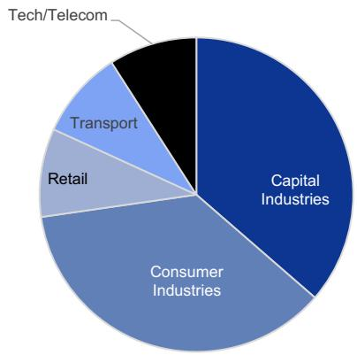

pie

| Category | Value |
|---|---|
| Capital Industries | 35.0 |
| Consumer Industries | 42.0 |
| Retail | 10.0 |
| Transport | 8.0 |
| Tech/Telecom | 7.0 |

Note: As of April 2026 (most recent as of May 14, 2026).   
Source: Moody's, GS Global Investment Research

Looking ahead, three key factors inform our default expectations in the US and Europe: (1) the combination of a weaker (yet non-recessionary) growth backdrop—with particular softness in Europe, (2) scope for profit margin deterioration in commodity-reliant sectors, and (3) headwinds to borrowing costs for floating rate issuers (or as in the case of the US, little scope for further near-term improvement).

We expect US HY and BSL defaults to modestly decelerate into year-end from 3.6% and 5.1% currently, to 3.0% and 4.75%, respectively. In Europe, given the weaker growth backdrop and greater disruption from higher oil and gas prices, we expect HY and loan default rates to continue to rise modestly into year-end, from 4.5% and 3.3% currently, to 4.7% and 4.0%, respectively. While increases in defaults are unwelcome by investors, the context around these figures is important: across all forecasts, defaults are well-within a normal range compared to the historical long-term averages.

We see three risks to our baseline default outlook. First and foremost is the growth backdrop. Modestly below-trend growth is generally a ‘good enough’ environment for credit—especially given the solid starting point for corporate fundamentals. A sharp deterioration in growth, however, would unquestionably place upward pressure on default rates (and, by extension, realized losses). Second, both geopolitical and policy risk remain elevated, which could lead to an increase in defaults across affected sectors. That said, in this scenario, we would expect more dispersion, as opposed to widespread market disruption. Third, as noted above, AI-driven disruption and structural headwinds in the Software sector pose a distinct upside risk to our default projections. However, this is likely to provide headwinds to some sectors while potentially offering tailwinds to other industries (underscoring our focus on dispersion).

While many market participants are focused on near-term maturity walls, as we recently highlighted, they are generally not outsized for the US and European HY bond markets. Moreover, a large portion of the upcoming maturities is represented by the higher-rated cohorts of the HY universes. We believe this reflects a choice by management teams to keep older, lower-cost debt on the balance sheet as long as possible before refinancing into a higher cost of debt—as opposed to an ‘inability’ to refinance.

That said, the dynamics in the leveraged loan market are different, as borrowers have encountered higher debt service costs in tandem with the rate hikes over the course of 2022-2023. As a result, the growth in scheduled maturities over the next two years (Exhibits 13 and 14) warrants close monitoring—especially given the loan market's weight toward Software and dependence on the demand from CLOs.

Exhibit 13: The near-term USD leveraged loan scheduled maturity wall is elevated...   
USD leveraged loans notional maturing by sector   
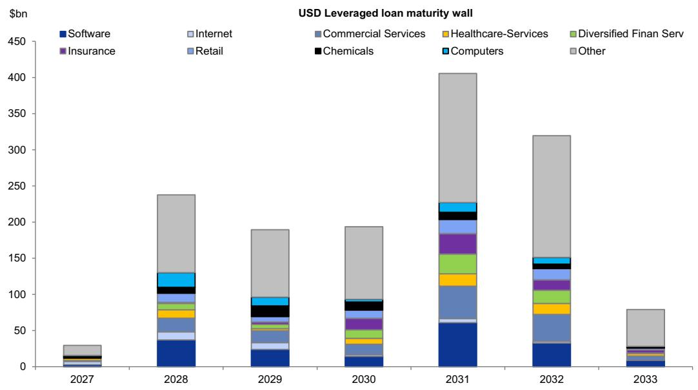

bar_stacked

| Year | Software | Internet | Commercial Services | Healthcare-Services | Diversified Finan Serv | Insurance | Retail | Chemicals | Computers | Other |
|------|----------|----------|---------------------|---------------------|------------------------|-----------|--------|-----------|-----------|-------|
| 2027 |          |          |                     |                   |                        |           |        |           |           |       |
| 2028 |          |          |                     |                   |                        |           |        |           |           |       |
| 2029 |          |          |                     |                   |                        |           |        |           |           |       |
| 2030 |          |          |                     |                   |                        |           |        |           |           |       |
| 2031 |          |          |                     |                   |                        |           |        |           |           |       |
| 2032 |          |          |                     |                   |                        |           |        |           |           |       |
| 2033 |          |          |                     |                   |                        |           |        |           |           |       |

Source: Bloomberg, GS Global Investment Research

Exhibit 14: ...as is the near-term EUR leveraged loan maturity wall   
EUR leveraged loans notional maturing by sector   
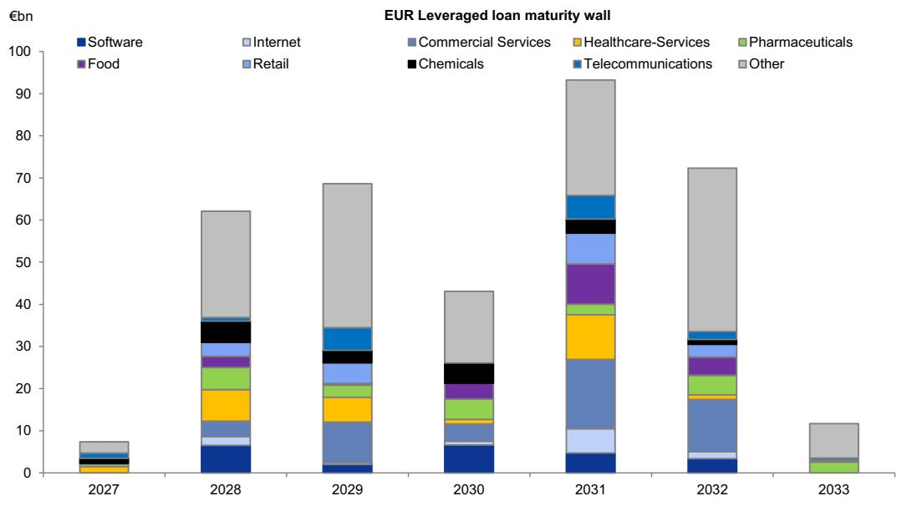

bar_stacked

| Year | Software | Internet | Commercial Services | Healthcare-Services | Pharmaceuticals | Food | Retail | Chemicals | Telecommunications | Other |
|------|----------|----------|---------------------|---------------------|-----------------|------|--------|-----------|---------------------|-------|
| 2027 | 0        | 0        | 0                   | 0                   | 0               | 0    | 0      | 0         | 0                   | 5     |
| 2028 | 6        | 4        | 3                   | 7                   | 4               | 2    | 2      | 4         | 1                   | 25    |
| 2029 | 2        | 0        | 10                  | 5                   | 1               | 0    | 4      | 4         | 5                   | 35    |
| 2030 | 6        | 3        | 4                   | 2                   | 3               | 3    | 1      | 4         | 1                   | 18    |
| 2031 | 4        | 6        | 15                  | 10                  | 2               | 8    | 6      | 3         | 4                   | 35    |
| 2032 | 3        | 1        | 15                  | 4                   | 4               | 4    | 2      | 2         | 1                   | 35    |
| 2033 | 0        | 1        | 0                   | 0                   | 1               | 0    | 0      | 0         | 0                   | 6     |

Source: Bloomberg, GS Global Investment Research

Thank you to Patricia Pacheco for her contribution to this publication.

# Forecast dashboard: Spreads, returns, issuance, defaults, and ratings migrations

Exhibit 15: USD and EUR spread forecasts 

<table><tr><td rowspan="2">Index</td><td colspan="4">Updated as of May. 13, 2026</td></tr><tr><td>Current</td><td>2026Q2</td><td>2026Q3</td><td>2026Q4</td></tr><tr><td colspan="5">USD spreads</td></tr><tr><td>USD IG</td><td>78</td><td>95</td><td>92</td><td>90</td></tr><tr><td>USD Fin</td><td>81</td><td>103</td><td>98</td><td>94</td></tr><tr><td>USD Non-Fin</td><td>75</td><td>92</td><td>89</td><td>86</td></tr><tr><td>USD HY</td><td>264</td><td>335</td><td>325</td><td>315</td></tr><tr><td colspan="5">EUR spreads</td></tr><tr><td>EUR IG</td><td>91</td><td>120</td><td>117</td><td>114</td></tr><tr><td>EUR Fin</td><td>96</td><td>127</td><td>122</td><td>118</td></tr><tr><td>EUR Non-Fin</td><td>88</td><td>116</td><td>113</td><td>111</td></tr><tr><td>EUR HY</td><td>273</td><td>375</td><td>368</td><td>360</td></tr></table>

Source: Bloomberg, ICE-BAML, iBoxx, GS Global Investment Research

Exhibit 17: Issuance forecasts 

<table><tr><td>Market</td><td>2026 YTD (bn)</td><td>2026 full-year forecast (bn)</td></tr><tr><td colspan="3">USD market</td></tr><tr><td colspan="3">Gross issuance</td></tr><tr><td>IG</td><td>$975</td><td>$2,100</td></tr><tr><td>HY</td><td>$136</td><td>$400</td></tr><tr><td>Leveraged loans</td><td>$148</td><td>--</td></tr><tr><td colspan="3">Net issuance</td></tr><tr><td>IG</td><td>$440</td><td>$850</td></tr><tr><td>HY</td><td>$61</td><td>$160</td></tr><tr><td colspan="3">EUR market</td></tr><tr><td colspan="3">Gross issuance</td></tr><tr><td>IG</td><td>€ 360</td><td>€ 850</td></tr><tr><td>HY</td><td>€ 43</td><td>€ 125</td></tr><tr><td colspan="3">Net issuance</td></tr><tr><td>IG</td><td>€ 82</td><td>€ 265</td></tr><tr><td>HY</td><td>€ 24</td><td>€ 60</td></tr></table>

Source: Dealogic, Bloomberg, GS Global Investment Research

Exhibit 16: USD and EUR excess returns forecast 

<table><tr><td rowspan="2">Index</td><td colspan="3">Updated as of May. 13, 2026</td></tr><tr><td>Current duration</td><td>2026</td><td>2026 full-year forecast (%)</td></tr><tr><td colspan="4">USD excess returns</td></tr><tr><td>USD IG</td><td>6.8</td><td>0.4%</td><td>0.0%</td></tr><tr><td>USD HY</td><td>2.9</td><td>1.0%</td><td>1.3%</td></tr><tr><td colspan="4">EUR excess returns</td></tr><tr><td>EUR IG</td><td>4.6</td><td>0.3%</td><td>0.0%</td></tr><tr><td>EUR HY</td><td>2.7</td><td>0.2%</td><td>-0.4%</td></tr></table>

Source: Bloomberg, ICE-BAML, iBoxx, , GS Global Investment Research

Exhibit 18: Ratings migration and default forecasts   
Default rates are issuer-weighted and 12-month trailing 

<table><tr><td rowspan="2">Market</td><td colspan="2">Updated as of May. 13, 2026</td></tr><tr><td>2026 YTD</td><td>2026 full-year forecast</td></tr><tr><td colspan="3">USD market</td></tr><tr><td>Rising stars</td><td>$36bn</td><td>$40bn</td></tr><tr><td>Fallen angels</td><td>$31bn</td><td>$60bn</td></tr><tr><td>HY defaults (12-month trailing)</td><td>3.5%</td><td>3.0%</td></tr><tr><td>Leveraged loan defaults (12-month trailing)</td><td>5.4%</td><td>4.75%</td></tr><tr><td colspan="3">EUR market</td></tr><tr><td>Rising stars</td><td>€ 5bn</td><td>€20bn</td></tr><tr><td>Fallen angels</td><td>€ 4bn</td><td>€30bn</td></tr><tr><td>HY defaults (12-month trailing)</td><td>3.6%</td><td>4.7%</td></tr><tr><td>Leveraged loan defaults (12-month trailing)</td><td>3.0%</td><td>4.0%</td></tr></table>

Source: Bloomberg, Moody's, GS Global Investment Research

# Forecast dashboard: Relative value views

Exhibit 19: Relative value views 

<table><tr><td colspan="3">Relative value views</td></tr><tr><td colspan="3">Corporate Credit</td></tr><tr><td>Regional</td><td>Overweight USD vs. EUR</td><td>The growth, inflation and monetary policy mix is somewhat more favorable in the US, relative to Europe. As a result, and relative to the USD market, we forecast a wider peak (and a slower recovery in 2H2026) in EUR credit spreads.</td></tr><tr><td rowspan="6">USD market</td><td>Overweight IG vs. HY</td><td>We have a slight preference for IG vs. HY in the USD market, owing to valuations and our economists&#x27; forecasts for below-potential growth.</td></tr><tr><td>Overweight BBBs vs. higher-rated cohorts</td><td>We prefer owning BBBs over the higher-rated segments of USD IG (As and AAs), as a way to capture additional spread. We also see scope for balance sheet deterioration at the highest end of the rating spectrum in IG.</td></tr><tr><td>Overweight BBs, Neutral CCCs, Underweight Bs</td><td>Current spread levels indicate that single-Bs offer the lowest credit risk premium relative to expected losses among all HY rating buckets.</td></tr><tr><td>Overweight HY bonds vs. loans</td><td>HY bonds still provide a superior trade-off between carry and duration compared to leveraged loans. In addition, loans&#x27; sUBStantial software sector exposure is likely to present a sentiment overhang, at least in the near-term.</td></tr><tr><td>Overweight CLO mezz tranches vs. leveraged loansNeutral CLO vs. USD IGNeutral CLO vs. CMOs</td><td>For floating rate investors, we prefer CLO mezzanine tranches vs. leveraged loans.Historical data points to low impairment rates for BB and BBB CLO tranches, and current valuations offer attractive carry and a cushion against moderate to elevated default outcomes. Elsewhere, we are neutral between senior CLO tranches and USD IG; we would use spread widening to add exposure in CLOs. We are also neutral between CLO AAA and CMO floaters.</td></tr><tr><td>Prefer Agency MBS vs. IG</td><td>Agency MBS offers an attractive diversification benefit vs. a portfolio of IG corporate bonds.</td></tr><tr><td rowspan="6">EUR market</td><td>Overweight IG vs. HY</td><td>We prefer IG over HY given the more challenging growth, inflation, and monetary policy mix in the Euro Area.</td></tr><tr><td>Overweight BBBs vs. As</td><td>In the EUR market, we prefer As over BBBs, as the weaker growth backdrop warrants more of an up-in-quality stance. That said, we would not move too far up the quality spectrum, as we expect supply technicals will be a headwind in the EUR AA market.</td></tr><tr><td>Overweight HY bonds vs. loans</td><td>Similar to the US, we prefer HY bonds given the loan market&#x27;s weighting toward software (and the potential negative sentiment overhang). The reaction function of the ECB may also favor floating rate credit, given the central bank&#x27;s focus on inflationary pressures.</td></tr><tr><td>Overweight IG 10s vs. 2s</td><td>We have a slight preference for extending duration in EUR IG to optimize carry, but have scaled back this approach.</td></tr><tr><td>Overweight BBs, Neutral Bs, Underweight CCCs</td><td>At current valuations and given our expectation for heightened dispersion, we prefer moving up in quality within EUR HY.</td></tr><tr><td>Underweight AT1s vs. EUR HY</td><td>Given downside tail risks and a limited valuation cushion, we recommend an underweight on AT1s vs. EUR HY.</td></tr></table>

Source: GS Global Investment Research

# Earnings calendar

# Exhibit 20: USD IG earnings report dates

Upcoming earnings report dates for the Bloomberg USD IG Index (LUACTRUU). Minimum \$1 billion notional value and including up to the top 20 capital structures in the index reporting that day.

<table><tr><td>Ticker</td><td>Name</td><td>Notional ($bn)</td><td>Ticker</td><td>Name</td><td>Notional ($bn)</td><td>Ticker</td><td>Name</td><td>Notional ($bn)</td><td>Ticker</td><td>Name</td><td>Notional ($bn)</td></tr><tr><td>5/15/2026</td><td></td><td></td><td>5/18/2026</td><td></td><td></td><td>5/19/2026</td><td></td><td></td><td>5/20/2026</td><td></td><td></td></tr><tr><td>MUFG</td><td>Mitsubishi UFJ Financial Group</td><td>41.8</td><td>BIDU</td><td>Baidu Inc</td><td>2.9</td><td>KEYS</td><td>Keysight Technologies Inc</td><td>1.9</td><td>NVDA</td><td>NVIDIA Corp</td><td>7.5</td></tr><tr><td>Mizuho</td><td>Mizuho Financial Group Inc</td><td>24.7</td><td></td><td></td><td></td><td>EXP</td><td>Eagle Materials Inc</td><td>1.5</td><td>ADI</td><td>Analog Devices Inc</td><td>7.2</td></tr><tr><td></td><td></td><td></td><td></td><td></td><td></td><td>TOL</td><td>Toll Brothers Inc</td><td>1.3</td><td>INTU</td><td>Intuit Inc</td><td>4.3</td></tr><tr><td></td><td></td><td></td><td></td><td></td><td></td><td></td><td></td><td></td><td>TJX</td><td>TJX Cos Inc/The</td><td>1.9</td></tr><tr><td></td><td></td><td></td><td></td><td></td><td></td><td></td><td></td><td></td><td>NDSN</td><td>Nordson Corp</td><td>1.5</td></tr><tr><td>5/21/2026</td><td></td><td></td><td>5/22/2026</td><td></td><td></td><td>5/25/2026</td><td></td><td></td><td>5/26/2026</td><td></td><td></td></tr><tr><td>WMT</td><td>Walmart Inc</td><td>31.5</td><td>BAH</td><td>Booz Allen Hamilton Holding Co</td><td>1.3</td><td></td><td></td><td></td><td>AZO</td><td>AutoZone Inc</td><td>7.3</td></tr><tr><td>DE</td><td>Deere &amp; Co</td><td>31.2</td><td></td><td></td><td></td><td></td><td></td><td></td><td></td><td></td><td></td></tr><tr><td>BRITEL</td><td>BT Group PLC</td><td>3.4</td><td></td><td></td><td></td><td></td><td></td><td></td><td></td><td></td><td></td></tr><tr><td>TTWO</td><td>Take-Two Interactive Software</td><td>1.9</td><td></td><td></td><td></td><td></td><td></td><td></td><td></td><td></td><td></td></tr><tr><td>FLO</td><td>Flowers Foods Inc</td><td>1.3</td><td></td><td></td><td></td><td></td><td></td><td></td><td></td><td></td><td></td></tr><tr><td>RL</td><td>Ralph Lauren Corp</td><td>1.3</td><td></td><td></td><td></td><td></td><td></td><td></td><td></td><td></td><td></td></tr></table>

Source: Bloomberg, GS Global Investment Research

# Exhibit 21: USD HY earnings report dates

Upcoming earnings report dates for the Bloomberg USD HY index (LF98TRUU). Minimum \$500 million notional value and including up to the top 20 capital structures in the index reporting that day.

<table><tr><td>Ticker</td><td>Name</td><td>Notional ($bn)</td><td>Ticker</td><td>Name</td><td>Notional ($bn)</td><td>Ticker</td><td>Name</td><td>Notional ($bn)</td><td>Ticker</td><td>Name</td><td>Notional ($bn)</td></tr><tr><td>5/15/2026</td><td></td><td></td><td>5/18/2026</td><td></td><td></td><td>5/19/2026</td><td></td><td></td><td>5/20/2026</td><td></td><td></td></tr><tr><td>KIOXIA</td><td>Kioxia Holdings Corp</td><td>2.2</td><td></td><td></td><td></td><td></td><td></td><td></td><td>VFC</td><td>VF Corp</td><td>1.3</td></tr><tr><td>GOLF</td><td>Misto Holdings Corp</td><td>0.5</td><td></td><td></td><td></td><td></td><td></td><td></td><td>ENS</td><td>EnerSys</td><td>0.6</td></tr><tr><td>RBC</td><td>RBC Bearings Inc</td><td>0.5</td><td></td><td></td><td></td><td></td><td></td><td></td><td></td><td></td><td></td></tr><tr><td>5/21/2026</td><td></td><td></td><td>5/22/2026</td><td></td><td></td><td>5/25/2026</td><td></td><td></td><td>5/26/2026</td><td></td><td></td></tr><tr><td>AAP</td><td>Advance Auto Parts Inc</td><td>3.4</td><td>HNDLIN</td><td>Hindalco Industries Ltd</td><td>3.9</td><td></td><td></td><td></td><td></td><td></td><td></td></tr><tr><td>WMS</td><td>Advanced Drainage Systems In</td><td>1.0</td><td></td><td></td><td></td><td></td><td></td><td></td><td></td><td></td><td></td></tr><tr><td>HOV</td><td>Hovnanian Enterprises Inc</td><td>0.9</td><td></td><td></td><td></td><td></td><td></td><td></td><td></td><td></td><td></td></tr><tr><td>BRITEL</td><td>BT Group PLC</td><td>0.5</td><td></td><td></td><td></td><td></td><td></td><td></td><td></td><td></td><td></td></tr></table>

Source: Bloomberg, GS Global Investment Research

# Exhibit 22: EUR IG earnings report dates

Upcoming earnings report dates for the Bloomberg EUR IG Index (LECPTREU). Minimum €1 billion notional value and including up to the top 20 capital structures in the index reporting that day.

<table><tr><td>Ticker</td><td>Name</td><td>Notional(€bn)</td><td>Ticker</td><td>Name</td><td>Notional(€bn)</td><td>Ticker</td><td>Name</td><td>Notional(€bn)</td><td>Ticker</td><td>Name</td><td>Notional(€bn)</td></tr><tr><td>5/15/2026</td><td></td><td></td><td>5/18/2026</td><td></td><td></td><td>5/19/2026</td><td></td><td></td><td>5/20/2026</td><td></td><td></td></tr><tr><td>Mizuho</td><td>Mizuho Financial Group Inc</td><td>13.2</td><td></td><td></td><td></td><td>ENXFP</td><td>Euronext NV</td><td>2.6</td><td>SVTLN</td><td>Severn Trent PLC</td><td>3.1</td></tr><tr><td>MUFG</td><td>Mitsubishi UFJ Financial Group</td><td>4.9</td><td></td><td></td><td></td><td></td><td></td><td></td><td>EXPNLN</td><td>Experian PLC</td><td>1.7</td></tr><tr><td>OTPHB</td><td>OTP Bank Nyrt</td><td>2.3</td><td></td><td></td><td></td><td></td><td></td><td></td><td>MSINS</td><td>MS&amp;AD Insurance Group Holdi</td><td>1.4</td></tr><tr><td>SYENS</td><td>Syensqo SA</td><td>1.2</td><td></td><td></td><td></td><td></td><td></td><td></td><td></td><td></td><td></td></tr><tr><td>MITHCC</td><td>Mitsubishi HC Capital Inc</td><td>1.0</td><td></td><td></td><td></td><td></td><td></td><td></td><td></td><td></td><td></td></tr><tr><td>5/21/2026</td><td></td><td></td><td>5/22/2026</td><td></td><td></td><td>5/25/2026</td><td></td><td></td><td>5/26/2026</td><td></td><td></td></tr><tr><td>GIM</td><td>Generali</td><td>10.1</td><td>CFRVX</td><td>Cie Financiere Richemont SA</td><td>4.5</td><td></td><td></td><td></td><td></td><td></td><td></td></tr><tr><td>BRITEL</td><td>BT Group PLC</td><td>7.8</td><td>TVLRO</td><td>Banca Transilvania SA</td><td>1.5</td><td></td><td></td><td></td><td></td><td></td><td></td></tr><tr><td>DE</td><td>Deere &amp; Co</td><td>3.9</td><td></td><td></td><td></td><td></td><td></td><td></td><td></td><td></td><td></td></tr><tr><td>EZJLN</td><td>easyJet PLC</td><td>2.1</td><td></td><td></td><td></td><td></td><td></td><td></td><td></td><td></td><td></td></tr><tr><td>INVPLN</td><td>Investec PLC</td><td>1.0</td><td></td><td></td><td></td><td></td><td></td><td></td><td></td><td></td><td></td></tr><tr><td>SGELN</td><td>Sage Group PLC/The</td><td>1.0</td><td></td><td></td><td></td><td></td><td></td><td></td><td></td><td></td><td></td></tr><tr><td>WMT</td><td>Walmart Inc</td><td>1.0</td><td></td><td></td><td></td><td></td><td></td><td></td><td></td><td></td><td></td></tr></table>

Source: Bloomberg, GS Global Investment Research

# Exhibit 23: EUR HY earnings report dates

Upcoming earnings report dates for the Bloomberg Pan-Euro HY index (LP01TREU). Minimum €100 million notional value and including up to the top 20 capital structures in the index reporting that day.

<table><tr><td>Ticker</td><td>Name</td><td>Notional(€bn)</td><td>Ticker</td><td>Name</td><td>Notional(€bn)</td><td>Ticker</td><td>Name</td><td>Notional(€bn)</td><td>Ticker</td><td>Name</td><td>Notional(€bn)</td></tr><tr><td>5/20/2026</td><td></td><td></td><td>5/21/2026</td><td></td><td></td><td>5/22/2026</td><td></td><td></td><td>5/25/2026</td><td></td><td></td></tr><tr><td>VFC</td><td>VF Corp</td><td>1.5</td><td>BRITEL</td><td>BT Group PLC</td><td>2.0</td><td>HNDLIN</td><td>Hindalco Industries Ltd</td><td>0.5</td><td></td><td></td><td></td></tr><tr><td>ELIOR</td><td>Elior Group SA</td><td>0.7</td><td>ASMDEE</td><td>Asmodee Group AB</td><td>0.6</td><td></td><td></td><td></td><td></td><td></td><td></td></tr><tr><td></td><td></td><td></td><td>TATTGA</td><td>CrediaBank SA</td><td>0.2</td><td></td><td></td><td></td><td></td><td></td><td></td></tr><tr><td>5/26/2026</td><td></td><td></td><td>5/27/2026</td><td></td><td></td><td>5/28/2026</td><td></td><td></td><td>5/29/2026</td><td></td><td></td></tr><tr><td></td><td></td><td></td><td>ARNDTN</td><td>Aroundtown SA</td><td>2.1</td><td>ALPHA</td><td>Alpha Bank SA</td><td>1.0</td><td></td><td></td><td></td></tr><tr><td></td><td></td><td></td><td>GYCGR</td><td>Aroundtown SA</td><td>1.2</td><td></td><td></td><td></td><td></td><td></td><td></td></tr></table>

Source: Bloomberg, GS Global Investment Research

# Performance dashboard: Cash and synthetic markets

Exhibit 24: Performance of USD and EUR markets 

<table><tr><td rowspan="2">Market</td><td colspan="2">Current*</td><td colspan="3">Total return</td><td rowspan="2">Spread change (YTD,bp)</td><td rowspan="2">Yield change (YTD, %)</td></tr><tr><td>Spread</td><td>Yield</td><td>MTD</td><td>QTD</td><td>YTD</td></tr><tr><td colspan="8">USD Corporate bonds</td></tr><tr><td>IG</td><td>75</td><td>5.2</td><td>0.11</td><td>0.56</td><td>0.02</td><td>-3</td><td>0.36</td></tr><tr><td>AA</td><td>49</td><td>4.9</td><td>-0.09</td><td>0.14</td><td>-0.17</td><td>0</td><td>0.33</td></tr><tr><td>A</td><td>63</td><td>5.0</td><td>0.04</td><td>0.53</td><td>0.13</td><td>-2</td><td>0.31</td></tr><tr><td>BBB</td><td>96</td><td>5.4</td><td>0.13</td><td>0.85</td><td>0.37</td><td>-5</td><td>0.30</td></tr><tr><td>HY</td><td>267</td><td>7.1</td><td>-0.05</td><td>1.65</td><td>1.14</td><td>1</td><td>0.52</td></tr><tr><td>BB</td><td>171</td><td>6.3</td><td>0.02</td><td>1.49</td><td>1.10</td><td>2</td><td>0.31</td></tr><tr><td>B</td><td>310</td><td>7.8</td><td>0.00</td><td>1.82</td><td>1.43</td><td>9</td><td>0.44</td></tr><tr><td>CCC</td><td>931</td><td>13.7</td><td>-0.71</td><td>2.03</td><td>-0.22</td><td>46</td><td>0.72</td></tr><tr><td colspan="8">USD Leveraged Loans</td></tr><tr><td>Leveraged loan index</td><td>437</td><td>8.2</td><td>0.00</td><td>0.09</td><td>-0.46</td><td>42</td><td>0.4</td></tr><tr><td>BB</td><td>257</td><td>6.3</td><td>0.00</td><td>0.00</td><td>0.70</td><td>2</td><td>-0.1</td></tr><tr><td>B</td><td>448</td><td>8.3</td><td>0.00</td><td>0.00</td><td>-0.93</td><td>57</td><td>0.5</td></tr><tr><td>CCC</td><td>1877</td><td>23.9</td><td>0.00</td><td>0.00</td><td>-5.09</td><td>314</td><td>3.3</td></tr><tr><td colspan="8">USD Securitized products</td></tr><tr><td>Agency MBS</td><td>21</td><td>5.0</td><td>-0.11</td><td>-0.04</td><td>0.36</td><td>-1</td><td>0.3</td></tr><tr><td>ABS (Autos)</td><td>63</td><td>4.5</td><td>0.07</td><td>0.40</td><td>1.07</td><td>-3</td><td>0.3</td></tr><tr><td>ABS (Credit cards)</td><td>32</td><td>4.2</td><td>0.02</td><td>0.31</td><td>0.83</td><td>-1</td><td>0.3</td></tr><tr><td>ABS (Student loans)</td><td>100</td><td>4.9</td><td>0.16</td><td>0.43</td><td>1.52</td><td>127</td><td>-0.1</td></tr><tr><td colspan="8">USD Macro indices</td></tr><tr><td>CDX IG</td><td>53</td><td>--</td><td>0.07</td><td>0.52</td><td>0.29</td><td>3</td><td>--</td></tr><tr><td>CDX HY</td><td>329</td><td>--</td><td>0.20</td><td>2.92</td><td>1.06</td><td>13</td><td>--</td></tr><tr><td colspan="8">EUR Corporate bonds</td></tr><tr><td>IG</td><td>93</td><td>3.8</td><td>-0.10</td><td>0.85</td><td>-0.17</td><td>3</td><td>0.4</td></tr><tr><td>AA</td><td>66</td><td>3.7</td><td>-0.22</td><td>0.62</td><td>-0.32</td><td>5</td><td>0.4</td></tr><tr><td>A</td><td>85</td><td>3.8</td><td>-0.11</td><td>0.82</td><td>-0.17</td><td>1</td><td>0.3</td></tr><tr><td>BBB</td><td>106</td><td>4.0</td><td>-0.07</td><td>0.92</td><td>-0.13</td><td>5</td><td>0.4</td></tr><tr><td>HY</td><td>262</td><td>5.9</td><td>0.49</td><td>2.44</td><td>0.68</td><td>-8</td><td>0.3</td></tr><tr><td>AT1</td><td>274</td><td>5.6</td><td>0.42</td><td>2.82</td><td>1.43</td><td>-12</td><td>0.3</td></tr><tr><td colspan="8">EUR Leveraged loans</td></tr><tr><td>Leveraged loan index</td><td>497</td><td>7.2</td><td>0.00</td><td>0.18</td><td>-0.87</td><td>47</td><td>0.6</td></tr><tr><td>BB</td><td>282</td><td>5.0</td><td>0.00</td><td>0.00</td><td>0.75</td><td>-70</td><td>-0.6</td></tr><tr><td>B</td><td>471</td><td>6.9</td><td>0.00</td><td>0.00</td><td>-1.30</td><td>56</td><td>0.7</td></tr><tr><td colspan="8">EUR Macro indices</td></tr><tr><td>iTraxx Main</td><td>57</td><td>--</td><td>0.12</td><td>0.77</td><td>0.2</td><td>6</td><td>--</td></tr><tr><td>iTraxx Xover</td><td>279</td><td>--</td><td>0.76</td><td>3.85</td><td>1.2</td><td>34</td><td>--</td></tr><tr><td>iTraxx SenFin</td><td>60</td><td>--</td><td>0.15</td><td>0.95</td><td>0.4</td><td>6</td><td>--</td></tr><tr><td>iTraxx SubFin</td><td>97</td><td>--</td><td>0.31</td><td>1.85</td><td>0.9</td><td>4</td><td>--</td></tr></table>

\*Data as of previous day close.   
For USD IG and HY we use the Bloomberg indices with history back to Jun-89 and Jan-94, respectively. Corp rating level, Agency MBS and ABS we use ICE-BAML indices with history back to Dec-96, EUR IG we use the iBoxx QW5A index with history back to Jan-99, EUR HY we use the ICE-BAML index with history back to Dec-97, and USD and EUR leveraged loans we use the Morningstar LSTA LLI and ELLI indices with data going back to Jan-97 and Jan-02, respectively.

# Performance dashboard: Sectors

Exhibit 25: Sector performance: USD IG 

<table><tr><td rowspan="2">Sector</td><td colspan="7">Metrics</td><td colspan="4">Spread change</td><td colspan="4">Total return</td></tr><tr><td>Index weight</td><td>Mkt val ($bn)</td><td>OAS</td><td>Percentile rank (2010-today)</td><td>YTW</td><td>Dur</td><td>Rating</td><td>1-week</td><td>MTD</td><td>QTD</td><td>YTD</td><td>1-week</td><td>MTD</td><td>QTD</td><td>YTD</td></tr><tr><td>Basic Industry</td><td>2%</td><td>175.3</td><td>77</td><td>●----</td><td>5.3</td><td>7.4</td><td>BAA1/BAA2</td><td>-4</td><td>-5</td><td>-19</td><td>-12</td><td>-0.1</td><td>0.2</td><td>1.0</td><td>0.6</td></tr><tr><td>Chemicals</td><td>1%</td><td>77.3</td><td>84</td><td>●----</td><td>5.4</td><td>7.7</td><td>BAA1/BAA2</td><td>-5</td><td>-6</td><td>-18</td><td>-14</td><td>0.0</td><td>0.3</td><td>1.0</td><td>1.0</td></tr><tr><td>Metals &amp; Mining</td><td>1%</td><td>71.6</td><td>67</td><td>●----</td><td>5.2</td><td>7.7</td><td>A3/BAA1</td><td>-3</td><td>-4</td><td>-22</td><td>-11</td><td>-0.2</td><td>0.1</td><td>1.1</td><td>0.4</td></tr><tr><td>Paper</td><td>0%</td><td>26.4</td><td>87</td><td>●----</td><td>5.2</td><td>6.0</td><td>BAA2/BAA3</td><td>-2</td><td>-5</td><td>-19</td><td>-9</td><td>-0.1</td><td>0.2</td><td>0.9</td><td>0.1</td></tr><tr><td>Capital Goods</td><td>5%</td><td>409.5</td><td>58</td><td>●----</td><td>5.0</td><td>6.8</td><td>A3/BAA1</td><td>-4</td><td>-5</td><td>-18</td><td>-9</td><td>-0.2</td><td>0.1</td><td>0.5</td><td>0.1</td></tr><tr><td>Aerospace &amp; Defense</td><td>2%</td><td>150.7</td><td>65</td><td>●----</td><td>5.2</td><td>8.3</td><td>BAA1/BAA2</td><td>-3</td><td>-5</td><td>-17</td><td>-9</td><td>-0.2</td><td>0.1</td><td>0.5</td><td>0.1</td></tr><tr><td>Building Materials</td><td>1%</td><td>40.0</td><td>72</td><td>●----</td><td>5.1</td><td>6.6</td><td>BAA1/BAA2</td><td>-3</td><td>-5</td><td>-16</td><td>-5</td><td>-0.2</td><td>0.1</td><td>0.6</td><td>0.0</td></tr><tr><td>Diversified Manufacturing</td><td>2%</td><td>115.1</td><td>58</td><td>●----</td><td>5.0</td><td>6.6</td><td>A3/BAA1</td><td>-4</td><td>-5</td><td>-17</td><td>-6</td><td>-0.2</td><td>0.1</td><td>0.4</td><td>0.1</td></tr><tr><td>Construction Machinery</td><td>1%</td><td>58.4</td><td>35</td><td>●----</td><td>4.6</td><td>4.7</td><td>A1/A2</td><td>-4</td><td>-5</td><td>-22</td><td>-15</td><td>-0.2</td><td>0.0</td><td>0.3</td><td>0.3</td></tr><tr><td>Packaging</td><td>0%</td><td>14.3</td><td>73</td><td>●----</td><td>4.9</td><td>4.6</td><td>BAA2/BAA3</td><td>-4</td><td>-5</td><td>-18</td><td>-7</td><td>-0.1</td><td>0.0</td><td>0.5</td><td>0.3</td></tr><tr><td>Environmental</td><td>0%</td><td>31.1</td><td>43</td><td>●----</td><td>4.7</td><td>5.8</td><td>A3/A3</td><td>-4</td><td>-6</td><td>-19</td><td>-13</td><td>-0.2</td><td>0.0</td><td>0.2</td><td>0.1</td></tr><tr><td>Communications</td><td>8%</td><td>567.0</td><td>92</td><td>●----</td><td>5.5</td><td>8.6</td><td>A3/BAA1</td><td>-3</td><td>-2</td><td>-8</td><td>-2</td><td>-0.2</td><td>0.0</td><td>0.1</td><td>-0.5</td></tr><tr><td>Cable &amp; Satellite</td><td>1%</td><td>107.9</td><td>134</td><td>●----</td><td>6.0</td><td>9.3</td><td>BAA1/BAA2</td><td>-1</td><td>0</td><td>-4</td><td>2</td><td>-0.5</td><td>-0.3</td><td>-0.2</td><td>-0.5</td></tr><tr><td>Media &amp; Entertainment</td><td>2%</td><td>137.7</td><td>81</td><td>●----</td><td>5.4</td><td>8.6</td><td>A1/A2</td><td>-5</td><td>5</td><td>-1</td><td>-4</td><td>-0.2</td><td>-0.2</td><td>-0.3</td><td>-1.9</td></tr><tr><td>Wireless</td><td>2%</td><td>125.0</td><td>78</td><td>●----</td><td>5.2</td><td>7.3</td><td>BAA1/BAA2</td><td>-3</td><td>-5</td><td>-14</td><td>-4</td><td>-0.2</td><td>0.1</td><td>0.5</td><td>0.1</td></tr><tr><td>Wirelines</td><td>3%</td><td>196.4</td><td>87</td><td>●----</td><td>5.5</td><td>9.0</td><td>BAA1/BAA2</td><td>-2</td><td>-3</td><td>-9</td><td>-3</td><td>-0.2</td><td>0.2</td><td>0.2</td><td>-0.2</td></tr><tr><td>Consumer Cyclical</td><td>7%</td><td>549.1</td><td>67</td><td>●----</td><td>5.0</td><td>6.2</td><td>A2/A3</td><td>-4</td><td>-5</td><td>-18</td><td>-5</td><td>-0.1</td><td>0.1</td><td>0.5</td><td>0.0</td></tr><tr><td>Automotive</td><td>2%</td><td>169.5</td><td>85</td><td>●----</td><td>5.0</td><td>4.3</td><td>A3/BAA1</td><td>-4</td><td>-6</td><td>-19</td><td>-4</td><td>-0.1</td><td>0.1</td><td>0.8</td><td>0.5</td></tr><tr><td>Leisure</td><td>0%</td><td>4.7</td><td>106</td><td>●----</td><td>5.4</td><td>6.4</td><td>BAA2/BAA2</td><td>1</td><td>-2</td><td>-11</td><td>4</td><td>-0.5</td><td>-0.1</td><td>0.5</td><td>-0.9</td></tr><tr><td>Gaming</td><td>0%</td><td>23.6</td><td>105</td><td>●----</td><td>5.3</td><td>4.7</td><td>BAA2/BAA3</td><td>-3</td><td>-6</td><td>-19</td><td>-5</td><td>0.0</td><td>0.2</td><td>1.1</td><td>0.5</td></tr><tr><td>Home Construction</td><td>0%</td><td>10.4</td><td>83</td><td>●----</td><td>5.1</td><td>4.9</td><td>BAA1/BAA2</td><td>-2</td><td>-2</td><td>-15</td><td>-1</td><td>-0.2</td><td>0.0</td><td>0.6</td><td>0.2</td></tr><tr><td>Lodging</td><td>0%</td><td>20.0</td><td>72</td><td>●----</td><td>4.9</td><td>4.8</td><td>BAA2/BAA3</td><td>-3</td><td>-6</td><td>-18</td><td>-2</td><td>-0.1</td><td>0.1</td><td>0.6</td><td>0.1</td></tr><tr><td>Retailers</td><td>3%</td><td>256.2</td><td>51</td><td>●----</td><td>5.0</td><td>7.7</td><td>A1/A2</td><td>-5</td><td>-5</td><td>-17</td><td>-3</td><td>-0.2</td><td>0.0</td><td>0.2</td><td>-0.3</td></tr><tr><td>Restaurants</td><td>0%</td><td>35.0</td><td>57</td><td>●----</td><td>5.1</td><td>7.5</td><td>BAA1/BAA2</td><td>-4</td><td>-7</td><td>-20</td><td>-10</td><td>-0.3</td><td>0.1</td><td>0.5</td><td>0.1</td></tr><tr><td>Consumer Cyc Services</td><td>0%</td><td>29.6</td><td>74</td><td>●----</td><td>5.1</td><td>6.1</td><td>A3/BAA1</td><td>-6</td><td>-5</td><td>-13</td><td>4</td><td>-0.1</td><td>0.1</td><td>0.5</td><td>-0.2</td></tr><tr><td>Consumer Non-Cyclical</td><td>15%</td><td>1125.4</td><td>63</td><td>●----</td><td>5.1</td><td>7.8</td><td>A2/A3</td><td>-3</td><td>-5</td><td>-16</td><td>-6</td><td>-0.2</td><td>0.1</td><td>0.4</td><td>-0.1</td></tr><tr><td>Consumer Products</td><td>1%</td><td>59.8</td><td>45</td><td>●----</td><td>4.8</td><td>6.0</td><td>A2/A3</td><td>-3</td><td>-3</td><td>-18</td><td>-10</td><td>-0.2</td><td>0.0</td><td>0.4</td><td>0.2</td></tr><tr><td>Food &amp; Beverage</td><td>3%</td><td>235.0</td><td>68</td><td>●----</td><td>5.2</td><td>7.6</td><td>A3/BAA1</td><td>-3</td><td>-6</td><td>-18</td><td>-2</td><td>-0.3</td><td>0.2</td><td>0.7</td><td>-0.2</td></tr><tr><td>Healthcare</td><td>4%</td><td>331.2</td><td>72</td><td>●----</td><td>5.2</td><td>7.8</td><td>A3/BAA1</td><td>-3</td><td>-5</td><td>-15</td><td>-6</td><td>-0.2</td><td>0.1</td><td>0.4</td><td>-0.1</td></tr><tr><td>Pharmaceuticals</td><td>5%</td><td>400.5</td><td>54</td><td>●----</td><td>5.1</td><td>8.5</td><td>A1/A2</td><td>-4</td><td>-6</td><td>-16</td><td>-8</td><td>-0.2</td><td>0.1</td><td>0.3</td><td>-0.1</td></tr><tr><td>Supermarkets</td><td>0%</td><td>13.4</td><td>83</td><td>●----</td><td>5.5</td><td>9.6</td><td>BAA1/BAA2</td><td>-2</td><td>-5</td><td>-13</td><td>-4</td><td>-0.4</td><td>0.2</td><td>0.5</td><td>-0.4</td></tr><tr><td>Tobacco</td><td>1%</td><td>85.5</td><td>70</td><td>●----</td><td>5.1</td><td>6.6</td><td>A3/BAA1</td><td>-4</td><td>-6</td><td>-17</td><td>-10</td><td>-0.2</td><td>0.1</td><td>0.6</td><td>0.2</td></tr><tr><td>Energy</td><td>7%</td><td>534.1</td><td>76</td><td>●----</td><td>5.3</td><td>7.6</td><td>A3/BAA1</td><td>-4</td><td>-6</td><td>-17</td><td>-15</td><td>-0.2</td><td>0.2</td><td>0.7</td><td>0.9</td></tr><tr><td>Independent Energy</td><td>1%</td><td>93.9</td><td>77</td><td>●----</td><td>5.3</td><td>7.4</td><td>BAA1/BAA2</td><td>-5</td><td>-7</td><td>-18</td><td>-19</td><td>-0.1</td><td>0.2</td><td>0.9</td><td>1.5</td></tr><tr><td>Integrated Energy</td><td>1%</td><td>103.2</td><td>50</td><td>●----</td><td>5.0</td><td>8.3</td><td>AA3/A1</td><td>-5</td><td>-5</td><td>-18</td><td>-15</td><td>-0.3</td><td>0.0</td><td>0.4</td><td>0.3</td></tr><tr><td>Oil Field Services</td><td>0%</td><td>25.2</td><td>73</td><td>●----</td><td>5.2</td><td>7.6</td><td>A3/BAA1</td><td>-3</td><td>-7</td><td>-21</td><td>-24</td><td>-0.2</td><td>0.2</td><td>1.0</td><td>1.2</td></tr><tr><td>Refining</td><td>0%</td><td>30.3</td><td>86</td><td>●----</td><td>5.3</td><td>7.2</td><td>BAA1/BAA2</td><td>-4</td><td>-5</td><td>-16</td><td>-19</td><td>-0.1</td><td>0.2</td><td>0.8</td><td>1.2</td></tr><tr><td>Midstream</td><td>4%</td><td>281.4</td><td>84</td><td>●----</td><td>5.3</td><td>7.4</td><td>BAA1/BAA2</td><td>-4</td><td>-6</td><td>-16</td><td>-13</td><td>-0.1</td><td>0.2</td><td>0.8</td><td>0.8</td></tr><tr><td>Technology</td><td>10%</td><td>762.2</td><td>79</td><td>●----</td><td>5.2</td><td>7.3</td><td>A2/A3</td><td>-4</td><td>-5</td><td>-14</td><td>4</td><td>-0.1</td><td>0.2</td><td>0.5</td><td>-0.2</td></tr><tr><td>Transportation</td><td>2%</td><td>150.5</td><td>68</td><td>●----</td><td>5.3</td><td>9.0</td><td>A3/BAA1</td><td>-3</td><td>-4</td><td>-16</td><td>-6</td><td>-0.3</td><td>0.0</td><td>0.5</td><td>0.0</td></tr><tr><td>Airlines</td><td>0%</td><td>18.3</td><td>87</td><td>●----</td><td>5.0</td><td>3.5</td><td>A3/BAA1</td><td>-3</td><td>-4</td><td>-15</td><td>-4</td><td>-0.1</td><td>0.0</td><td>0.6</td><td>0.5</td></tr><tr><td>Railroads</td><td>1%</td><td>90.2</td><td>62</td><td>●----</td><td>5.4</td><td>10.8</td><td>A3/BAA1</td><td>-3</td><td>-4</td><td>-18</td><td>-8</td><td>-0.4</td><td>0.0</td><td>0.5</td><td>-0.2</td></tr><tr><td>Transportation Services</td><td>1%</td><td>42.0</td><td>72</td><td>●----</td><td>5.2</td><td>7.8</td><td>A3/BAA1</td><td>-3</td><td>-1</td><td>-14</td><td>-3</td><td>-0.2</td><td>-0.1</td><td>0.4</td><td>0.1</td></tr><tr><td>Other Industrial</td><td>1%</td><td>38.7</td><td>61</td><td>●----</td><td>5.3</td><td>10.3</td><td>AA3/A1</td><td>-3</td><td>-3</td><td>-13</td><td>-4</td><td>-0.4</td><td>-0.1</td><td>0.0</td><td>-0.3</td></tr><tr><td>Utility</td><td>10%</td><td>750.0</td><td>79</td><td>●----</td><td>5.3</td><td>8.1</td><td>A3/BAA1</td><td>-3</td><td>-5</td><td>-15</td><td>-7</td><td>-0.2</td><td>0.1</td><td>0.5</td><td>0.0</td></tr><tr><td>Electric</td><td>9%</td><td>675.0</td><td>78</td><td>●----</td><td>5.3</td><td>8.1</td><td>A3/BAA1</td><td>-3</td><td>-5</td><td>-15</td><td>-7</td><td>-0.2</td><td>0.1</td><td>0.5</td><td>0.0</td></tr><tr><td>Natural Gas</td><td>1%</td><td>58.7</td><td>88</td><td>●----</td><td>5.4</td><td>7.8</td><td>A3/BAA1</td><td>-3</td><td>-4</td><td>-17</td><td>-9</td><td>-0.2</td><td>0.1</td><td>0.7</td><td>0.2</td></tr><tr><td>Other Utility</td><td>0%</td><td>16.3</td><td>67</td><td>●----</td><td>5.2</td><td>8.2</td><td>BAA1/BAA2</td><td>-3</td><td>-5</td><td>-16</td><td>-4</td><td>-0.3</td><td>0.0</td><td>0.4</td><td>-0.3</td></tr><tr><td>Financial Institutions</td><td>32%</td><td>2394.5</td><td>78</td><td>●----</td><td>5.1</td><td>5.4</td><td>A2/A3</td><td>-4</td><td>-5</td><td>-17</td><td>0</td><td>-0.1</td><td>0.1</td><td>0.7</td><td>0.0</td></tr><tr><td>Banking</td><td>22%</td><td>1636.0</td><td>72</td><td>●----</td><td>5.0</td><td>4.9</td><td>A2/A3</td><td>-4</td><td>-5</td><td>-16</td><td>2</td><td>-0.1</td><td>0.1</td><td>0.6</td><td>0.0</td></tr><tr><td>Brokerage Asset Managers Exchanges</td><td>2%</td><td>117.4</td><td>77</td><td>●----</td><td>5.1</td><td>6.2</td><td>A3/BAA1</td><td>-3</td><td>-7</td><td>-18</td><td>5</td><td>-0.2</td><td>0.2</td><td>0.9</td><td>-0.1</td></tr><tr><td>Finance Companies</td><td>1%</td><td>106.7</td><td>153</td><td>●----</td><td>5.7</td><td>3.6</td><td>BAA2/BAA3</td><td>-1</td><td>-4</td><td>-16</td><td>8</td><td>-0.1</td><td>0.1</td><td>1.2</td><td>0.2</td></tr><tr><td>Insurance</td><td>4%</td><td>330.4</td><td>84</td><td>●----</td><td>5.4</td><td>8.2</td><td>A3/BAA1</td><td>-4</td><td>-6</td><td>-21</td><td>-6</td><td>-0.1</td><td>0.2</td><td>1.0</td><td>-0.1</td></tr><tr><td>REITS</td><td>3%</td><td>196.5</td><td>72</td><td>●----</td><td>5.0</td><td>5.4</td><td>A3/BAA1</td><td>-3</td><td>-6</td><td>-18</td><td>-5</td><td>-0.1</td><td>0.1</td><td>0.6</td><td>0.2</td></tr><tr><td>Other Financial</td><td>0%</td><td>7.5</td><td>92</td><td>●----</td><td>5.1</td><td>4.7</td><td>A3/BAA1</td><td>-1</td><td>-4</td><td>-18</td><td>-9</td><td>-0.1</td><td>0.1</td><td>1.1</td><td>1.0</td></tr><tr><td>US Corporate IG</td><td></td><td>7456.3</td><td>75</td><td></td><td></td><td></td><td></td><td></td><td></td><td></td><td></td><td></td><td></td><td></td><td></td></tr></table>

Source: Bloomberg, GS Global Investment Research

Exhibit 26: Sector performance: USD HY 

<table><tr><td rowspan="2">Sector</td><td colspan="7">Metrics</td><td colspan="4">Spread change</td><td colspan="4">Total return</td></tr><tr><td>Index weight</td><td>Mkt val ($bn)</td><td>OAS</td><td>Percentile rank (2010-today)</td><td>YTW</td><td>Dur</td><td>Rating</td><td>1-week</td><td>MTD</td><td>QTD</td><td>YTD</td><td>1-week</td><td>MTD</td><td>QTD</td><td>YTD</td></tr><tr><td>Basic Industry</td><td>6%</td><td>92.6</td><td>262</td><td>●----</td><td>7.0</td><td>3.4</td><td>BA3/B1</td><td>-2</td><td>-3</td><td>-19</td><td>-10</td><td>-0.1</td><td>0.1</td><td>2.0</td><td>1.8</td></tr><tr><td>Chemicals</td><td>3%</td><td>47.5</td><td>237</td><td>●----</td><td>6.8</td><td>3.4</td><td>BA3/B1</td><td>-2</td><td>-3</td><td>-21</td><td>-26</td><td>-0.2</td><td>0.0</td><td>2.0</td><td>3.4</td></tr><tr><td>Metals &amp; Mining</td><td>3%</td><td>37.9</td><td>208</td><td>●----</td><td>6.5</td><td>3.4</td><td>BA3/B1</td><td>-4</td><td>-6</td><td>-25</td><td>0</td><td>-0.1</td><td>0.2</td><td>2.3</td><td>1.0</td></tr><tr><td>Paper</td><td>0%</td><td>7.2</td><td>705</td><td>----●</td><td>11.3</td><td>2.6</td><td>B1/B2</td><td>0</td><td>2</td><td>-1</td><td>41</td><td>0.1</td><td>0.3</td><td>0.9</td><td>-3.6</td></tr><tr><td>Capital Goods</td><td>10%</td><td>151.3</td><td>232</td><td>●----</td><td>6.7</td><td>3.1</td><td>BA3/B1</td><td>1</td><td>1</td><td>-10</td><td>9</td><td>-0.2</td><td>-0.2</td><td>1.2</td><td>-0.6</td></tr><tr><td>Aerospace &amp; Defense</td><td>2%</td><td>31.7</td><td>108</td><td>●----</td><td>5.6</td><td>2.9</td><td>BA3/B1</td><td>-2</td><td>-2</td><td>-22</td><td>8</td><td>-0.1</td><td>0.1</td><td>1.2</td><td>1.0</td></tr><tr><td>Building Materials</td><td>2%</td><td>36.2</td><td>390</td><td>----●</td><td>8.4</td><td>3.4</td><td>BA3/B1</td><td>3</td><td>4</td><td>-7</td><td>37</td><td>-0.5</td><td>-0.8</td><td>1.0</td><td>-2.5</td></tr><tr><td>Diversified Manufacturing</td><td>2%</td><td>27.9</td><td>171</td><td>●----</td><td>6.1</td><td>2.5</td><td>BA2/BA3</td><td>5</td><td>2</td><td>-13</td><td>63</td><td>-0.1</td><td>-0.1</td><td>1.0</td><td>0.8</td></tr><tr><td>Construction Machinery</td><td>1%</td><td>21.7</td><td>128</td><td>●----</td><td>5.7</td><td>3.0</td><td>BA3/B1</td><td>-3</td><td>-1</td><td>-30</td><td>-3</td><td>-0.1</td><td>0.0</td><td>1.7</td><td>1.4</td></tr><tr><td>Packaging</td><td>2%</td><td>25.1</td><td>349</td><td>----●</td><td>7.9</td><td>3.5</td><td>B1/B2</td><td>-2</td><td>1</td><td>3</td><td>-16</td><td>-0.2</td><td>0.1</td><td>1.3</td><td>-3.5</td></tr><tr><td>Environmental</td><td>1%</td><td>8.8</td><td>146</td><td>●----</td><td>5.9</td><td>3.1</td><td>BA3/B1</td><td>-1</td><td>0</td><td>-15</td><td>-1</td><td>-0.1</td><td>0.0</td><td>1.0</td><td>1.1</td></tr><tr><td>Communications</td><td>15%</td><td>219.2</td><td>402</td><td>----●</td><td>8.4</td><td>3.7</td><td>B1/B2</td><td>2</td><td>5</td><td>-7</td><td>16</td><td>-0.5</td><td>-0.7</td><td>1.2</td><td>1.1</td></tr><tr><td>Cable &amp; Satellite</td><td>5%</td><td>81.2</td><td>536</td><td>----●</td><td>9.6</td><td>2.9</td><td>B1/B2</td><td>4</td><td>7</td><td>-1</td><td>34</td><td>-0.7</td><td>-1.4</td><td>-0.7</td><td>-0.2</td></tr><tr><td>Media &amp; Entertainment</td><td>5%</td><td>80.1</td><td>321</td><td>●----</td><td>7.6</td><td>4.2</td><td>B1/B2</td><td>3</td><td>5</td><td>-9</td><td>-4</td><td>-0.5</td><td>-0.5</td><td>2.3</td><td>1.1</td></tr><tr><td>Wireless</td><td>1%</td><td>19.9</td><td>259</td><td>●----</td><td>7.0</td><td>4.1</td><td>BA3/B1</td><td>1</td><td>6</td><td>-19</td><td>3</td><td>-0.2</td><td>-0.4</td><td>2.2</td><td>0.9</td></tr><tr><td>Wirelines</td><td>3%</td><td>38.0</td><td>360</td><td>●----</td><td>8.1</td><td>4.2</td><td>B1/B2</td><td>-1</td><td>-2</td><td>-13</td><td>15</td><td>0.0</td><td>0.2</td><td>2.4</td><td>3.5</td></tr><tr><td>Consumer Cyclical</td><td>18%</td><td>275.7</td><td>239</td><td>●----</td><td>6.7</td><td>3.2</td><td>BA3/B1</td><td>2</td><td>0</td><td>-20</td><td>-5</td><td>-0.3</td><td>0.0</td><td>1.8</td><td>1.0</td></tr><tr><td>Automotive</td><td>3%</td><td>45.9</td><td>253</td><td>●----</td><td>6.8</td><td>3.0</td><td>BA3/B1</td><td>1</td><td>0</td><td>-27</td><td>-8</td><td>-0.3</td><td>0.2</td><td>2.3</td><td>1.2</td></tr><tr><td>Leisure</td><td>2%</td><td>29.1</td><td>209</td><td>●----</td><td>6.4</td><td>3.4</td><td>BA3/B1</td><td>5</td><td>4</td><td>-10</td><td>16</td><td>-0.6</td><td>-0.3</td><td>0.8</td><td>0.2</td></tr><tr><td>Gaming</td><td>3%</td><td>45.7</td><td>248</td><td>●----</td><td>6.9</td><td>2.9</td><td>BA3/B1</td><td>0</td><td>-4</td><td>-19</td><td>2</td><td>-0.1</td><td>0.3</td><td>2.0</td><td>1.2</td></tr><tr><td>Home Construction</td><td>1%</td><td>18.9</td><td>200</td><td>●----</td><td>6.3</td><td>3.0</td><td>BA3/B1</td><td>0</td><td>-3</td><td>-21</td><td>-1</td><td>0.0</td><td>0.1</td><td>1.8</td><td>1.2</td></tr><tr><td>Lodging</td><td>1%</td><td>16.4</td><td>134</td><td>●----</td><td>5.7</td><td>3.9</td><td>BA2/BA3</td><td>6</td><td>2</td><td>-19</td><td>1</td><td>-0.3</td><td>-0.1</td><td>1.3</td><td>0.6</td></tr><tr><td>Retailers</td><td>4%</td><td>60.6</td><td>256</td><td>●----</td><td>6.8</td><td>3.4</td><td>BA3/B1</td><td>6</td><td>4</td><td>-24</td><td>-22</td><td>-0.4</td><td>0.0</td><td>2.0</td><td>1.1</td></tr><tr><td>Restaurants</td><td>1%</td><td>16.5</td><td>149</td><td>●----</td><td>5.7</td><td>3.3</td><td>BA3/B1</td><td>1</td><td>-3</td><td>-21</td><td>-9</td><td>-0.1</td><td>0.2</td><td>1.4</td><td>1.1</td></tr><tr><td>Consumer Cyc Services</td><td>3%</td><td>42.7</td><td>301</td><td>●----</td><td>7.4</td><td>2.7</td><td>B1/B2</td><td>2</td><td>0</td><td>-14</td><td>9</td><td>-0.3</td><td>-0.1</td><td>1.9</td><td>0.9</td></tr><tr><td>Consumer Non-Cyclical</td><td>11%</td><td>158.2</td><td>247</td><td>●----</td><td>6.8</td><td>3.3</td><td>B1/B2</td><td>-1</td><td>-1</td><td>-12</td><td>0</td><td>-0.2</td><td>0.0</td><td>1.6</td><td>1.5</td></tr><tr><td>Consumer Products</td><td>2%</td><td>22.8</td><td>332</td><td>●----</td><td>7.6</td><td>4.0</td><td>BA3/B1</td><td>3</td><td>7</td><td>-7</td><td>2</td><td>-0.9</td><td>-1.2</td><td>0.7</td><td>-0.4</td></tr><tr><td>Food &amp; Beverage</td><td>2%</td><td>28.9</td><td>173</td><td>●----</td><td>6.1</td><td>3.4</td><td>B1/B2</td><td>3</td><td>2</td><td>-5</td><td>1</td><td>-0.3</td><td>-0.1</td><td>1.1</td><td>1.1</td></tr><tr><td>Healthcare</td><td>5%</td><td>70.9</td><td>220</td><td>●----</td><td>6.6</td><td>2.9</td><td>B1/B2</td><td>-5</td><td>-5</td><td>-12</td><td>6</td><td>0.0</td><td>0.3</td><td>1.5</td><td>1.8</td></tr><tr><td>Pharmaceuticals</td><td>2%</td><td>25.4</td><td>365</td><td>●----</td><td>8.0</td><td>3.1</td><td>B2/B3</td><td>-2</td><td>-2</td><td>-21</td><td>-17</td><td>0.0</td><td>0.2</td><td>3.8</td><td>3.7</td></tr><tr><td>Supermarkets</td><td>1%</td><td>9.8</td><td>160</td><td>●----</td><td>5.9</td><td>3.6</td><td>BA2/BA3</td><td>2</td><td>4</td><td>-4</td><td>132</td><td>-0.2</td><td>-0.3</td><td>0.3</td><td>0.3</td></tr><tr><td>Tobacco</td><td>0%</td><td>0.3</td><td>197</td><td>●----</td><td>6.5</td><td>3.4</td><td>BA3/BA3</td><td>-8</td><td>-13</td><td>-20</td><td>15</td><td>0.3</td><td>0.9</td><td>1.9</td><td>0.0</td></tr><tr><td>Energy</td><td>11%</td><td>165.6</td><td>150</td><td>●----</td><td>6.0</td><td>3.0</td><td>BA2/BA3</td><td>-5</td><td>-1</td><td>-24</td><td>-44</td><td>0.1</td><td>0.1</td><td>1.4</td><td>4.0</td></tr><tr><td>Independent Energy</td><td>3%</td><td>45.1</td><td>163</td><td>●----</td><td>6.1</td><td>2.6</td><td>BA3/B1</td><td>-5</td><td>6</td><td>-20</td><td>-35</td><td>0.1</td><td>-0.1</td><td>1.5</td><td>4.2</td></tr><tr><td>Oil Field Services</td><td>2%</td><td>26.7</td><td>151</td><td>●----</td><td>6.3</td><td>2.7</td><td>BA3/B1</td><td>-4</td><td>7</td><td>-27</td><td>-50</td><td>0.0</td><td>-0.1</td><td>1.2</td><td>3.8</td></tr><tr><td>Refining</td><td>0%</td><td>5.6</td><td>228</td><td>●----</td><td>6.9</td><td>2.3</td><td>BA3/B1</td><td>-4</td><td>-1</td><td>-8</td><td>-37</td><td>0.2</td><td>0.3</td><td>1.1</td><td>5.4</td></tr><tr><td>Midstream</td><td>6%</td><td>88.2</td><td>139</td><td>●----</td><td>5.8</td><td>3.3</td><td>BA2/BA3</td><td>-6</td><td>-7</td><td>-26</td><td>-48</td><td>0.0</td><td>0.2</td><td>1.5</td><td>3.8</td></tr><tr><td>Technology</td><td>9%</td><td>140.6</td><td>344</td><td>●----</td><td>7.8</td><td>3.1</td><td>BA3/B1</td><td>-1</td><td>-7</td><td>-16</td><td>9</td><td>0.0</td><td>0.7</td><td>1.9</td><td>0.2</td></tr><tr><td>Transportation</td><td>2%</td><td>31.6</td><td>444</td><td>●----</td><td>8.8</td><td>2.8</td><td>BA3/B1</td><td>1</td><td>3</td><td>-12</td><td>23</td><td>-0.6</td><td>-0.2</td><td>1.5</td><td>-0.9</td></tr><tr><td>Airlines</td><td>1%</td><td>13.4</td><td>390</td><td>●----</td><td>8.1</td><td>2.6</td><td>BA3/B1</td><td>3</td><td>2</td><td>-13</td><td>41</td><td>-0.8</td><td>-0.4</td><td>1.4</td><td>-1.0</td></tr><tr><td>Railroads</td><td>0%</td><td>1.9</td><td>1180</td><td>----●</td><td>16.4</td><td>2.7</td><td>B2/B3</td><td>0</td><td>3</td><td>7</td><td>23</td><td>0.8</td><td>0.4</td><td>-6.6</td><td>-6.8</td></tr><tr><td>Transportation Services</td><td>1%</td><td>16.3</td><td>404</td><td>●----</td><td>8.5</td><td>2.9</td><td>B1/B2</td><td>0</td><td>3</td><td>-15</td><td>15</td><td>-0.5</td><td>-0.2</td><td>2.7</td><td>0.0</td></tr><tr><td>Other Industrial</td><td>1%</td><td>15.3</td><td>216</td><td>●----</td><td>6.6</td><td>3.1</td><td>BA3/B1</td><td>17</td><td>1</td><td>-17</td><td>-17</td><td>-0.6</td><td>-0.2</td><td>1.7</td><td>0.8</td></tr><tr><td>Utility</td><td>3%</td><td>44.7</td><td>172</td><td>●----</td><td>6.1</td><td>4.2</td><td>BA2/BA3</td><td>4</td><td>3</td><td>-16</td><td>17</td><td>-0.3</td><td>0.0</td><td>1.6</td><td>1.7</td></tr><tr><td>Financial Institutions</td><td>13%</td><td>196.1</td><td>246</td><td>●----</td><td>6.8</td><td>3.2</td><td>BA3/B1</td><td>0</td><td>-1</td><td>-24</td><td>10</td><td>-0.1</td><td>0.0</td><td>2.2</td><td>0.4</td></tr><tr><td>Banking</td><td>0%</td><td>3.1</td><td>187</td><td>●----</td><td>6.2</td><td>4.4</td><td>BA1/BA2</td><td>-1</td><td>-1</td><td>-31</td><td>-13</td><td>-0.3</td><td>-0.1</td><td>2.6</td><td>-0.2</td></tr><tr><td>Brokerage Asset Managers Exchanges</td><td>1%</td><td>18.1</td><td>181</td><td>●----</td><td>6.3</td><td>2.9</td><td>BA3/B1</td><td>0</td><td>-7</td><td>-32</td><td>-4</td><td>0.0</td><td>0.4</td><td>2.8</td><td>1.5</td></tr><tr><td>Finance Companies</td><td>4%</td><td>63.0</td><td>271</td><td>●----</td><td>7.1</td><td>3.2</td><td>BA2/BA3</td><td>0</td><td>-1</td><td>-21</td><td>30</td><td>0.0</td><td>0.0</td><td>2.4</td><td>-0.6</td></tr><tr><td>Insurance</td><td>4%</td><td>64.4</td><td>222</td><td>●----</td><td>6.6</td><td>3.5</td><td>BA3/B1</td><td>1</td><td>1</td><td>-24</td><td>16</td><td>-0.2</td><td>-0.2</td><td>1.7</td><td>0.1</td></tr><tr><td>REITS</td><td>2%</td><td>29.5</td><td>249</td><td>●----</td><td>6.8</td><td>2.9</td><td>B1/B2</td><td>2</td><td>-2</td><td>-25</td><td>-8</td><td>-0.1</td><td>0.1</td><td>2.6</td><td>1.9</td></tr><tr><td>Other Financial</td><td>1%</td><td>18.0</td><td>308</td><td>●----</td><td>7.4</td><td>2.9</td><td>BA3/B1</td><td>-4</td><td>-1</td><td>-17</td><td>-3</td><td>0.1</td><td>0.1</td><td>2.2</td><td>1.4</td></tr><tr><td>US Corp High Yield</td><td></td><td>1490.9</td><td>267</td><td></td><td></td><td></td><td></td><td></td><td></td><td></td><td></td><td></td><td></td><td></td><td></td></tr></table>

Source: Bloomberg, GS Global Investment Research

Exhibit 27: Sector performance: EUR IG 

<table><tr><td rowspan="2">Sector</td><td colspan="7">Metrics</td><td colspan="4">Spread Change</td><td colspan="4">Total Return</td></tr><tr><td>%Mkt</td><td>MktVal(€bn)</td><td>OAS</td><td>Percentile</td><td>YTM</td><td>Dur</td><td>Rating</td><td>1-Wk</td><td>MTD</td><td>QTD</td><td>YTD</td><td>1-Wk</td><td>MTD</td><td>QTD</td><td>YTD</td></tr><tr><td>Consumer Goods</td><td>12.5</td><td>€ 386.4</td><td>88.1</td><td>-</td><td>3.8</td><td>4.6</td><td>A</td><td>-1</td><td>-1</td><td>-15</td><td>4</td><td>-0.43</td><td>-0.11</td><td>0.84</td><td>-0.25</td></tr><tr><td>Automobiles &amp; Parts</td><td>5.1</td><td>€ 157.6</td><td>106.4</td><td>-</td><td>3.9</td><td>3.7</td><td>A</td><td>-1</td><td>-2</td><td>-20</td><td>5</td><td>-0.32</td><td>-0.02</td><td>0.97</td><td>-0.13</td></tr><tr><td>Beverages</td><td>2.9</td><td>€ 90.4</td><td>83.9</td><td>-</td><td>3.9</td><td>5.9</td><td>A</td><td>0</td><td>-1</td><td>-11</td><td>3</td><td>-0.55</td><td>-0.21</td><td>0.78</td><td>-0.37</td></tr><tr><td>Food Producers</td><td>1.9</td><td>€ 59.7</td><td>71.9</td><td>-</td><td>3.7</td><td>5.2</td><td>A</td><td>0</td><td>1</td><td>-11</td><td>2</td><td>-0.50</td><td>-0.16</td><td>0.70</td><td>-0.33</td></tr><tr><td>Household Goods</td><td>0.2</td><td>€ 7.2</td><td>53.6</td><td>-</td><td>3.6</td><td>5.4</td><td>AA</td><td>0</td><td>-2</td><td>-14</td><td>2</td><td>-0.52</td><td>-0.21</td><td>0.64</td><td>-0.35</td></tr><tr><td>Personal Goods</td><td>1.7</td><td>€ 51.7</td><td>68.1</td><td>-</td><td>3.6</td><td>4.4</td><td>A</td><td>0</td><td>0</td><td>-15</td><td>5</td><td>-0.44</td><td>-0.12</td><td>0.76</td><td>-0.39</td></tr><tr><td>Tobacco</td><td>0.6</td><td>€ 19.9</td><td>114.0</td><td>-</td><td>4.0</td><td>4.8</td><td>BBB</td><td>-2</td><td>-1</td><td>-14</td><td>2</td><td>-0.38</td><td>-0.05</td><td>0.85</td><td>-0.12</td></tr><tr><td>Consumer Services</td><td>4.6</td><td>€ 142.0</td><td>89.6</td><td>-</td><td>3.9</td><td>5.2</td><td>A</td><td>-1</td><td>0</td><td>-10</td><td>7</td><td>-0.47</td><td>-0.14</td><td>0.64</td><td>-0.41</td></tr><tr><td>Food &amp; Drug Retailers</td><td>0.7</td><td>€ 20.2</td><td>88.5</td><td>-</td><td>3.8</td><td>4.3</td><td>BBB</td><td>0</td><td>0</td><td>-14</td><td>3</td><td>-0.41</td><td>-0.09</td><td>0.81</td><td>-0.16</td></tr><tr><td>General Retailers</td><td>0.6</td><td>€ 18.6</td><td>94.6</td><td>-</td><td>4.1</td><td>6.9</td><td>AA</td><td>-1</td><td>1</td><td>-7</td><td>16</td><td>-0.57</td><td>-0.26</td><td>0.43</td><td>-0.67</td></tr><tr><td>Media</td><td>1.2</td><td>€ 35.8</td><td>94.5</td><td>-</td><td>3.8</td><td>4.0</td><td>BBB</td><td>0</td><td>-1</td><td>-16</td><td>11</td><td>-0.40</td><td>-0.09</td><td>0.85</td><td>-0.31</td></tr><tr><td>Travel &amp; Leisure</td><td>2.2</td><td>€ 67.4</td><td>86.4</td><td>-</td><td>3.9</td><td>5.6</td><td>A</td><td>-1</td><td>-1</td><td>-9</td><td>5</td><td>-0.50</td><td>-0.15</td><td>0.54</td><td>-0.47</td></tr><tr><td>Energy</td><td>3.2</td><td>€ 97.4</td><td>96.4</td><td>-</td><td>3.9</td><td>4.9</td><td>A</td><td>-2</td><td>-2</td><td>-15</td><td>-1</td><td>-0.40</td><td>-0.03</td><td>0.93</td><td>0.15</td></tr><tr><td>Oil &amp; Gas Producers</td><td>2.8</td><td>€ 87.2</td><td>96.7</td><td>-</td><td>3.9</td><td>4.8</td><td>A</td><td>-2</td><td>-3</td><td>-16</td><td>-2</td><td>-0.38</td><td>-0.02</td><td>0.94</td><td>0.15</td></tr><tr><td>Oil Equipment / Services &amp; Distribution</td><td>0.2</td><td>€ 7.7</td><td>93.6</td><td>-</td><td>4.0</td><td>5.7</td><td>A</td><td>0</td><td>3</td><td>5</td><td>17</td><td>-0.54</td><td>-0.21</td><td>0.78</td><td>0.13</td></tr><tr><td>Renewable Energy</td><td>0.1</td><td>€ 2.5</td><td>95.3</td><td>-</td><td>3.8</td><td>5.0</td><td>BBB</td><td>1</td><td>1</td><td>-11</td><td>-6</td><td>-0.54</td><td>-0.11</td><td>0.72</td><td>0.30</td></tr><tr><td>Industrials</td><td>9.7</td><td>€ 298.0</td><td>83.3</td><td>-</td><td>3.7</td><td>4.5</td><td>A</td><td>0</td><td>0</td><td>-15</td><td>3</td><td>-0.46</td><td>-0.13</td><td>0.81</td><td>-0.24</td></tr><tr><td>Aerospace &amp; Defense</td><td>0.4</td><td>€ 13.5</td><td>72.6</td><td>-</td><td>3.7</td><td>4.4</td><td>A</td><td>0</td><td>0</td><td>-13</td><td>8</td><td>-0.45</td><td>-0.21</td><td>0.69</td><td>-0.45</td></tr><tr><td>Construction &amp; Materials</td><td>1.6</td><td>€ 49.9</td><td>85.7</td><td>-</td><td>3.8</td><td>4.3</td><td>BBB</td><td>0</td><td>0</td><td>-16</td><td>2</td><td>-0.43</td><td>-0.13</td><td>0.88</td><td>-0.14</td></tr><tr><td>Electronic &amp; Electrical Equipment</td><td>0.9</td><td>€ 28.2</td><td>72.4</td><td>-</td><td>3.6</td><td>4.9</td><td>A</td><td>0</td><td>0</td><td>-15</td><td>2</td><td>-0.48</td><td>-0.12</td><td>0.82</td><td>-0.28</td></tr><tr><td>General Industrials</td><td>1.3</td><td>€ 39.2</td><td>74.4</td><td>-</td><td>3.7</td><td>5.3</td><td>A</td><td>0</td><td>0</td><td>-17</td><td>0</td><td>-0.53</td><td>-0.19</td><td>0.86</td><td>-0.32</td></tr><tr><td>Industrial Engineering</td><td>1.1</td><td>€ 34.8</td><td>80.4</td><td>-</td><td>3.6</td><td>3.4</td><td>A</td><td>0</td><td>-2</td><td>-17</td><td>3</td><td>-0.33</td><td>-0.04</td><td>0.86</td><td>-0.04</td></tr><tr><td>Industrial Transportation</td><td>3.3</td><td>€ 102.4</td><td>87.3</td><td>-</td><td>3.8</td><td>4.8</td><td>BBB</td><td>0</td><td>0</td><td>-13</td><td>3</td><td>-0.49</td><td>-0.15</td><td>0.73</td><td>-0.35</td></tr><tr><td>Support Services</td><td>1.0</td><td>€ 30.0</td><td>98.3</td><td>-</td><td>3.8</td><td>4.1</td><td>BBB</td><td>0</td><td>-1</td><td>-18</td><td>3</td><td>-0.41</td><td>-0.09</td><td>0.90</td><td>-0.05</td></tr><tr><td>Health Care</td><td>5.5</td><td>€ 169.3</td><td>80.4</td><td>-</td><td>3.9</td><td>5.8</td><td>A</td><td>0</td><td>0</td><td>-13</td><td>1</td><td>-0.56</td><td>-0.24</td><td>0.72</td><td>-0.25</td></tr><tr><td>Health Care Equipment &amp; Services</td><td>2.4</td><td>€ 74.7</td><td>84.7</td><td>-</td><td>3.9</td><td>5.7</td><td>A</td><td>0</td><td>-2</td><td>-13</td><td>1</td><td>-0.55</td><td>-0.23</td><td>0.71</td><td>-0.30</td></tr><tr><td>Pharmaceuticals &amp; Biotechnology</td><td>3.1</td><td>€ 94.5</td><td>77.1</td><td>-</td><td>3.8</td><td>5.9</td><td>A</td><td>0</td><td>1</td><td>-13</td><td>1</td><td>-0.56</td><td>-0.24</td><td>0.73</td><td>-0.20</td></tr><tr><td>Basic Materials</td><td>2.7</td><td>€ 84.0</td><td>86.9</td><td>-</td><td>3.8</td><td>4.8</td><td>A</td><td>0</td><td>0</td><td>-17</td><td>1</td><td>-0.47</td><td>-0.13</td><td>0.91</td><td>-0.15</td></tr><tr><td>Chemicals</td><td>2.0</td><td>€ 63.2</td><td>85.6</td><td>-</td><td>3.8</td><td>5.0</td><td>A</td><td>0</td><td>0</td><td>-17</td><td>2</td><td>-0.48</td><td>-0.13</td><td>0.90</td><td>-0.18</td></tr><tr><td>Forestry &amp; Paper</td><td>0.2</td><td>€ 5.6</td><td>94.9</td><td>-</td><td>3.8</td><td>4.2</td><td>BBB</td><td>-1</td><td>0</td><td>-21</td><td>8</td><td>-0.38</td><td>-0.04</td><td>1.06</td><td>-0.35</td></tr><tr><td>Industrial Metals</td><td>0.1</td><td>€ 3.7</td><td>91.0</td><td>-</td><td>3.8</td><td>5.1</td><td>BBB</td><td>1</td><td>1</td><td>-18</td><td>-1</td><td>-0.56</td><td>-0.20</td><td>0.98</td><td>0.00</td></tr><tr><td>Mining</td><td>0.4</td><td>€ 11.5</td><td>90.2</td><td>-</td><td>3.8</td><td>4.1</td><td>BBB</td><td>1</td><td>0</td><td>-19</td><td>-6</td><td>-0.44</td><td>-0.12</td><td>0.90</td><td>0.10</td></tr><tr><td>Technology</td><td>2.5</td><td>€ 76.5</td><td>96.7</td><td>-</td><td>4.0</td><td>5.3</td><td>A</td><td>0</td><td>2</td><td>-13</td><td>10</td><td>-0.49</td><td>-0.28</td><td>0.77</td><td>-0.61</td></tr><tr><td>Software &amp; Computer Services</td><td>2.0</td><td>€ 63.1</td><td>100.6</td><td>-</td><td>4.1</td><td>5.7</td><td>A</td><td>0</td><td>3</td><td>-12</td><td>11</td><td>-0.53</td><td>-0.33</td><td>0.73</td><td>-0.67</td></tr><tr><td>Technology Hardware &amp; Equipment</td><td>0.4</td><td>€ 13.4</td><td>67.1</td><td>-</td><td>3.5</td><td>3.5</td><td>A</td><td>-1</td><td>-1</td><td>-21</td><td>7</td><td>-0.33</td><td>-0.04</td><td>0.94</td><td>-0.32</td></tr><tr><td>Telecommunications</td><td>5.5</td><td>€ 169.6</td><td>94.5</td><td>-</td><td>3.9</td><td>5.5</td><td>BBB</td><td>0</td><td>0</td><td>-13</td><td>3</td><td>-0.51</td><td>-0.19</td><td>0.76</td><td>-0.30</td></tr><tr><td>Fixed Line Telecommunications</td><td>4.4</td><td>€ 135.5</td><td>92.8</td><td>-</td><td>3.9</td><td>5.6</td><td>BBB</td><td>0</td><td>-1</td><td>-13</td><td>2</td><td>-0.51</td><td>-0.18</td><td>0.73</td><td>-0.30</td></tr><tr><td>Mobile Telecommunications</td><td>1.1</td><td>€ 34.0</td><td>101.5</td><td>-</td><td>4.0</td><td>5.4</td><td>BBB</td><td>0</td><td>4</td><td>-13</td><td>6</td><td>-0.50</td><td>-0.22</td><td>0.86</td><td>-0.31</td></tr><tr><td>Financials</td><td>42.5</td><td>€ 1,310.8</td><td>96.6</td><td>-</td><td>3.8</td><td>4.0</td><td>A</td><td>0</td><td>-2</td><td>-19</td><td>2</td><td>-0.40</td><td>-0.04</td><td>0.95</td><td>-0.06</td></tr><tr><td>Banks Sen</td><td>26.5</td><td>€ 819.5</td><td>85.7</td><td>-</td><td>3.7</td><td>3.9</td><td>A</td><td>0</td><td>-2</td><td>-17</td><td>2</td><td>-0.39</td><td>-0.03</td><td>0.85</td><td>-0.06</td></tr><tr><td>Banks Sub</td><td>4.1</td><td>€ 126.1</td><td>129.4</td><td>-</td><td>4.1</td><td>3.5</td><td>BBB</td><td>0</td><td>-4</td><td>-25</td><td>3</td><td>-0.36</td><td>0.05</td><td>1.13</td><td>0.14</td></tr><tr><td>Financial Services Sen</td><td>2.9</td><td>€ 89.0</td><td>85.0</td><td>-</td><td>3.8</td><td>4.6</td><td>A</td><td>0</td><td>0</td><td>-15</td><td>2</td><td>-0.44</td><td>-0.09</td><td>0.88</td><td>-0.04</td></tr><tr><td>Financial Services Sub</td><td>0.0</td><td>€ 1.0</td><td>117.3</td><td>-</td><td>3.8</td><td>2.1</td><td>A</td><td>-10</td><td>-11</td><td>-31</td><td>-21</td><td>0.00</td><td>0.27</td><td>0.98</td><td>0.84</td></tr><tr><td>Insurance Sen</td><td>1.5</td><td>€ 44.9</td><td>78.4</td><td>-</td><td>3.7</td><td>4.2</td><td>A</td><td>1</td><td>-1</td><td>-21</td><td>3</td><td>-0.46</td><td>-0.10</td><td>0.98</td><td>-0.21</td></tr><tr><td>Insurance Sub</td><td>2.6</td><td>€ 81.0</td><td>136.1</td><td>-</td><td>4.3</td><td>4.8</td><td>BBB</td><td>1</td><td>-3</td><td>-20</td><td>2</td><td>-0.51</td><td>-0.03</td><td>1.09</td><td>-0.09</td></tr><tr><td>Real Estate Sen</td><td>4.8</td><td>€ 148.9</td><td>114.7</td><td>-</td><td>4.1</td><td>4.7</td><td>BBB</td><td>0</td><td>0</td><td>-25</td><td>6</td><td>-0.44</td><td>-0.12</td><td>1.30</td><td>-0.26</td></tr><tr><td>Real Estate Sub</td><td>0.0</td><td>€ 0.5</td><td>156.1</td><td>-</td><td>4.5</td><td>5.8</td><td>A</td><td>-13</td><td>-25</td><td>-50</td><td>0</td><td>0.19</td><td>0.91</td><td>3.02</td><td>0.00</td></tr><tr><td>Utilities</td><td>11.4</td><td>€ 353.3</td><td>97.9</td><td>-</td><td>4.0</td><td>5.3</td><td>BBB</td><td>0</td><td>0</td><td>-11</td><td>4</td><td>-0.48</td><td>-0.15</td><td>0.74</td><td>-0.18</td></tr><tr><td>Electricity</td><td>6.9</td><td>€ 212.2</td><td>100.8</td><td>-</td><td>4.0</td><td>5.3</td><td>BBB</td><td>-1</td><td>-1</td><td>-12</td><td>4</td><td>-0.48</td><td>-0.13</td><td>0.75</td><td>-0.17</td></tr><tr><td>Gas / Water &amp; Multiutilities</td><td>4.6</td><td>€ 141.2</td><td>93.5</td><td>-</td><td>3.9</td><td>5.2</td><td>BBB</td><td>0</td><td>1</td><td>-11</td><td>3</td><td>-0.50</td><td>-0.17</td><td>0.72</td><td>-0.18</td></tr><tr><td>Index</td><td>100.0</td><td>€ 3,087.3</td><td>92.5</td><td></td><td></td><td></td><td></td><td></td><td></td><td></td><td></td><td></td><td></td><td></td><td></td></tr></table>

Source: iBoxx, GS Global Investment Research

Exhibit 28: Sector performance: EUR HY 

<table><tr><td>Sector</td><td colspan="7">Metrics</td><td colspan="4">Spread Change</td><td colspan="4">Total Return</td></tr><tr><td></td><td>%Mkt</td><td>MktVal (€bn)</td><td>OAS</td><td>Percentile</td><td>YTM</td><td>Dur</td><td>Rating</td><td>1-Wk</td><td>MTD</td><td>QTD</td><td>YTD</td><td>1-Wk</td><td>MTD</td><td>QTD</td><td>YTD</td></tr><tr><td>Consumers</td><td>27.9</td><td>€ 123.7</td><td>294</td><td>- - - - - - - - - - - - - - - - - - - - - - - - - - - - - - - - - - - - - - - - - - - - - - - - - - - - - - - - - - - - - - - - - - - - - - - - - - - - - - - - - - - - - - - - - - - - - - - - - - - - -</td><td>5.7</td><td>2.7</td><td>BB</td><td>-14</td><td>-25</td><td>-63</td><td>18</td><td>0.14</td><td>0.63</td><td>2.46</td><td>0.71</td></tr><tr><td>Consumer Goods</td><td>15.6</td><td>€ 68.9</td><td>264</td><td>- - - - - - - - - - - - - - - - - - - - - - - - - - - - - - - - - - - - - - - - - - - - - - - - - - - - - - - - - - - - - - - - - - - - - - - - - - - - - - - - - - - - - - - - - - - - - - - - -</td><td>5.4</td><td>2.7</td><td>BB</td><td>-12</td><td>-23</td><td>-56</td><td>28</td><td>0.09</td><td>0.54</td><td>2.44</td><td>0.86</td></tr><tr><td>Consumer Services</td><td>12.4</td><td>€ 54.8</td><td>332</td><td>- - - - - - - - - - - - - - - - - - - - - - - - - - - - - - - - - - - - - - - - - - - - - - - - - - - - - - - - - - - - - - - - - - - - - - - - - - - - - - - - - - - - - - - - - - - - - - - - - -</td><td>6.1</td><td>2.7</td><td>BB</td><td>-15</td><td>-23</td><td>-61</td><td>13</td><td>0.20</td><td>0.74</td><td>2.48</td><td>0.54</td></tr><tr><td>Energy</td><td>9.9</td><td>€ 44.0</td><td>243</td><td>- - - - - - - - - - - - - - - - - - - - - - - - - - - - - - - - - - - - - - - - - - - - - - - - - - - - - - - - - - - - - - - - - - - - - - - - - - - - - - - - - - - - - - - - - - - - - - - - - -</td><td></td><td></td><td></td><td></td><td></td><td></td><td></td><td></td><td></td><td></td><td></td></tr><tr><td>Energy</td><td>2.3</td><td>€ 10.3</td><td>250</td><td>- - - - - - - - - - - - - - - - - - - - - - - - - - - - - - - - - - - - - - - - - - - - - - - - - - - - - - - - - - - - - - - - - - - - - - - - - - - - - - - - - - - - - - - - - - - - - - - - - - 0.24</td><td>5.2</td><td>2.7</td><td>BB</td><td>-20</td><td>-21</td><td>-60</td><td>-51</td><td>0.24</td><td>0.46</td><td>1.88</td><td>1.96</td></tr><tr><td>Utilities</td><td>7.6</td><td>€ 33.8</td><td>241</td><td>- - - - - - - - - - - - - - - - - - - - - - - - - - - - - - - - - - - - - - - - - - - - - - - - - - - - - - - - - - - - - - - - - - - - - - - - - - - - - - - - - - - - - - - - - - - - - 0.04</td><td>5.2</td><td>3.2</td><td>BB</td><td>-11</td><td>-24</td><td>-43</td><td>-6</td><td>0.04</td><td>0.33</td><td>1.40</td><td>0.25</td></tr><tr><td>Industrials</td><td>30.5</td><td>€ 135.1</td><td>323</td><td>- - - - - - - - - - - - - - - - - - - - - - - - - - - - - - - - - - - - - - - - - - - - - - - - - - - - - - - - - - - - - - - - - - - - - - - - - 0.32</td><td>6.0</td><td>2.7</td><td>BB</td><td>-16</td><td>-24</td><td>-70</td><td>-21</td><td>0.32</td><td>0.85</td><td>2.72</td><td>1.45</td></tr><tr><td>Basic Materials</td><td>5.8</td><td>€ 25.7</td><td>404</td><td>- - - - - - - - - - - - - - - - - - - - - - - - - - - - - - - - - - - - - - - - - - - - - - - - - - - - - - - - - - - - - - - - - - 0.76</td><td>6.8</td><td>2.7</td><td>B</td><td>-23</td><td>-54</td><td>-169</td><td>-159</td><td>0.76</td><td>1.72</td><td>5.62</td><td>5.45</td></tr><tr><td>Construction &amp; Materials</td><td>1.2</td><td>€ 5.5</td><td>661</td><td>- - - - - - - - - - - - - - - - - - - - - - - - - - - - - - - - - - - - - - - - - - - - - - - - - - - - - - 0.74</td><td>9.3</td><td>2.6</td><td>BB</td><td>-24</td><td>-28</td><td>-53</td><td>53</td><td>0.74</td><td>1.32</td><td>2.74</td><td>-0.71</td></tr><tr><td>Health Care</td><td>8.8</td><td>€ 38.8</td><td>282</td><td>- - - - - - - - - - - - - - - - - - - - - - - - - - - - - - - - - - - - - - - - - - - - - - - - - - 0.14</td><td>5.6</td><td>2.4</td><td>B</td><td>-11</td><td>-16</td><td>-59</td><td>16</td><td>0.14</td><td>0.50</td><td>2.10</td><td>1.14</td></tr><tr><td>Industrials</td><td>14.7</td><td>€ 65.1</td><td>287</td><td>- - - - - - - - - - - - - - - - - - - - - - - - - - - - - - - - - - - - - - - - - - - - 0.23</td><td>5.6</td><td>2.8</td><td>BB</td><td>-15</td><td>-20</td><td>-53</td><td>1</td><td>0.23</td><td>0.67</td><td>2.03</td><td>0.41</td></tr><tr><td>TMT</td><td>20.1</td><td>€ 88.9</td><td>314</td><td>- - - - - - - - - - - - - - - - - - - - - - - - - - - - - - - - - - - - - - 0.19</td><td>6.0</td><td>3.4</td><td>BB</td><td>-13</td><td>-14</td><td>-52</td><td>28</td><td>0.19</td><td>0.57</td><td>2.30</td><td>0.23</td></tr><tr><td>Technology</td><td>3.9</td><td>€ 17.4</td><td>424</td><td>- - - - - - - - - - - - - - - - - - - - - - - - - - - - - - - - 0.38</td><td>7.1</td><td>3.7</td><td>B</td><td>-17</td><td>-34</td><td>-62</td><td>46</td><td>0.38</td><td>0.68</td><td>2.27</td><td>-1.81</td></tr><tr><td>Telecommunications</td><td>16.1</td><td>€ 71.5</td><td>284</td><td>- - - - - - - - - - - - - - - - - - - - - - - - - - 0.14</td><td>5.7</td><td>3.3</td><td>BB</td><td>-13</td><td>-11</td><td>-52</td><td>11</td><td>0.14</td><td>0.54</td><td>2.31</td><td>0.68</td></tr><tr><td>Financials</td><td>11.6</td><td>€ 51.3</td><td>361</td><td>- - - - - - - - - - - - - - - - - - - - - - - - 0.24</td><td>6.4</td><td>3.2</td><td>BB</td><td>-2</td><td>-2</td><td>-51</td><td>34</td><td>-0.24</td><td>0.00</td><td>1.89</td><td>-0.25</td></tr><tr><td>Core Financials</td><td>4.3</td><td>€ 18.9</td><td>191</td><td>- - - - - - - - - - - - - - - - 4.6</td><td>3.1</td><td>BB</td><td>-6</td><td>-15</td><td>-48</td><td>12</td><td>-0.11</td><td>0.25</td><td>1.59</td><td>0.11</td><td></td></tr><tr><td>Financial Services</td><td>1.6</td><td>€ 7.1</td><td>802</td><td>- - - - - - - - - 10.8</td><td>2.5</td><td>B</td><td>74</td><td>90</td><td>121</td><td>200</td><td>-1.95</td><td>-2.14</td><td>-1.31</td><td>-2.67</td><td></td></tr><tr><td>Real Estate</td><td>5.7</td><td>€ 25.3</td><td>386</td><td>- 0.0000000000000000000000000000000000000000000000000000000000000000000000000000000000000000000000000000</td><td></td><td></td><td></td><td></td><td></td><td></td><td></td><td></td><td></td><td></td><td></td></tr><tr><td>Index</td><td>100.0</td><td>€ 443.0</td><td>310</td><td>- 0.0000000000000000000000000000000000000000000000000000000000000000000000000000000000000000000000</td><td></td><td></td><td></td><td></td><td></td><td>-12</td><td>-19</td><td>-60</td><td>7</td><td>0.16</td><td>0.58</td></tr></table>

Source: iBoxx, GS Global Investment Research

# Performance dashboard: USD Credit ETFs

Exhibit 29: USD ETF performance 

<table><tr><td>Sector</td><td>ETF Ticker</td><td>AUM</td><td>Weekly Flow ($Mn.)</td><td>YTD cum flow (% of AUM)</td><td>Shares Outstanding (Mn.)</td><td>Short Interest (%)</td><td>Price</td><td>% NAV Premium</td><td>YTD Total Return</td><td>QTD Total Return</td><td>MTD Total Return</td><td>Benchmark Index</td></tr><tr><td rowspan="9">Investment Grade</td><td>LQD</td><td>$29.57B</td><td>358</td><td>0.6%</td><td>272</td><td>15.25</td><td>108.55</td><td>0.07%</td><td>0.0</td><td>0.4</td><td>0.1</td><td>iBoxx USD Liquid Investment Grade Index</td></tr><tr><td>VCSH</td><td>$42.7B</td><td>126</td><td>22.0%</td><td>541</td><td>1.24</td><td>78.96</td><td>0.05%</td><td>0.5</td><td>0.4</td><td>0.0</td><td>Bloomberg BARC US Corporate 1-5 Yrs Total Return Index Value Unhedged</td></tr><tr><td>VCIT</td><td>$65.86B</td><td>264</td><td>32.7%</td><td>798</td><td>2.34</td><td>82.46</td><td>0.08%</td><td>0.0</td><td>0.5</td><td>-0.1</td><td>Bloomberg BARC US Credit Corporate 5-10 Yrs Total Return Index Value Unhedged</td></tr><tr><td>FLOT</td><td>$9.29B</td><td>31</td><td>22.5%</td><td>183</td><td>--</td><td>50.95</td><td>0.06%</td><td>1.6</td><td>0.7</td><td>0.2</td><td>Bloomberg BARC US FRN &lt; 5 yr Total Return Index Value Unhedged</td></tr><tr><td>IGSB</td><td>$22.06B</td><td>10</td><td>4.5%</td><td>421</td><td>0.63</td><td>52.36</td><td>0.00%</td><td>0.5</td><td>0.4</td><td>-0.1</td><td>ICE BofAML 1-5 Year US Corporate Bond Index</td></tr><tr><td>IGIB</td><td>$18.03B</td><td>98</td><td>19.7%</td><td>340</td><td>2.22</td><td>53.04</td><td>0.04%</td><td>0.0</td><td>0.5</td><td>-0.1</td><td>Bloomberg BARC U.S. Interm</td></tr><tr><td>SPSB</td><td>$10.19B</td><td>84</td><td>22.5%</td><td>340</td><td>1.58</td><td>29.98</td><td>0.04%</td><td>0.7</td><td>0.4</td><td>0.0</td><td>Bloomberg BARC US Corporate 1-3 Yrs Total Return Index Value Unhedged</td></tr><tr><td>SPIB</td><td>$11.28B</td><td>13</td><td>12.7%</td><td>338</td><td>2.24</td><td>33.41</td><td>0.02%</td><td>0.3</td><td>0.3</td><td>-0.1</td><td>Bloomberg BARC Intermediate Corporate Total Return Index Value Unhedged</td></tr><tr><td>VCLT</td><td>$8.35B</td><td>-90</td><td>-38.5%</td><td>112</td><td>25.22</td><td>74.53</td><td>0.17%</td><td>0.0</td><td>0.7</td><td>0.3</td><td>Bloomberg BARC Long U.S. Corporate Total Return Index Value Unhedged</td></tr><tr><td rowspan="8">High Yield</td><td>HYG</td><td>$16.88B</td><td>95</td><td>13.4%</td><td>212</td><td>40.19</td><td>79.86</td><td>0.15%</td><td>1.0</td><td>1.4</td><td>-0.1</td><td>iBoxx USD Liquid High Yield Index</td></tr><tr><td>JNK</td><td>$7.69B</td><td>346</td><td>0.4%</td><td>80</td><td>9.98</td><td>96.12</td><td>0.11%</td><td>1.1</td><td>1.5</td><td>-0.2</td><td>Bloomberg BARC VLI: High Yield Total Return Index Value Unhedged USD</td></tr><tr><td>SJNK</td><td>$4.76B</td><td>-37</td><td>2.7%</td><td>190</td><td>2.46</td><td>25.02</td><td>0.15%</td><td>1.1</td><td>1.3</td><td>-0.2</td><td>Bloomberg BARC US High Yield 350M Cash 0-5yr 2% Cap Total Return Index</td></tr><tr><td>SHYG</td><td>$7.55B</td><td>30</td><td>22.9%</td><td>178</td><td>0.39</td><td>42.40</td><td>0.20%</td><td>1.2</td><td>1.4</td><td>-0.1</td><td>Markit iBoxx USD Liquid High Yield 0-5 Total Return Index</td></tr><tr><td>HYS</td><td>$1.72B</td><td>28</td><td>31.9%</td><td>18</td><td>0.06</td><td>93.29</td><td>-0.09%</td><td>0.8</td><td>1.2</td><td>-0.1</td><td>ICE BofAML 0-5 Year US High Yield Constrained Index</td></tr><tr><td>HYLS</td><td>$1.64B</td><td>2</td><td>0.7%</td><td>40</td><td>0.07</td><td>40.94</td><td>0.05%</td><td>0.0</td><td>1.5</td><td>0.0</td><td>ICE BofAML US High Yield Constrained Index</td></tr><tr><td>ANGL</td><td>$3.08B</td><td>0</td><td>-0.4%</td><td>106</td><td>0.42</td><td>29.01</td><td>0.00%</td><td>0.9</td><td>2.2</td><td>-0.3</td><td>ICE BofAML US Fallen Angel High Yield Index</td></tr><tr><td>BKLN</td><td>$7.15B</td><td>178</td><td>-20.8%</td><td>346</td><td>23.34</td><td>20.66</td><td>0.00%</td><td>0.4</td><td>1.7</td><td>0.4</td><td>S&amp;P/LSTA U.S. Leveraged Loan 100 Index</td></tr><tr><td rowspan="4">Loans</td><td>SRLN</td><td>$5.28B</td><td>0</td><td>-30.4%</td><td>130</td><td>7.91</td><td>40.59</td><td>-0.06%</td><td>0.7</td><td>2.3</td><td>0.5</td><td>Markit iBoxx USD Liquid Leverage Loans Total Return Index</td></tr><tr><td>FTSL</td><td>$2.3B</td><td>9</td><td>6.3%</td><td>51</td><td>0.87</td><td>45.20</td><td>0.10%</td><td>0.6</td><td>1.4</td><td>0.3</td><td>S&amp;P/LSTA US Leveraged Loan 100 Market Value Index</td></tr><tr><td>EMB</td><td>$14.08B</td><td>-76</td><td>-4.4%</td><td>148</td><td>9.65</td><td>95.53</td><td>0.13%</td><td>1.0</td><td>2.6</td><td>0.1</td><td>JPM EMBI Global Core Index</td></tr><tr><td>EMLC</td><td>$4.86B</td><td>0</td><td>78.0%</td><td>191</td><td>1.62</td><td>25.47</td><td>-0.01%</td><td>0.6</td><td>2.5</td><td>0.2</td><td>JPM Government Bond Index Emerging Markets Global Core Index</td></tr><tr><td rowspan="5">CLOs</td><td>JAAA</td><td>$27.12B</td><td>-127</td><td>63.8%</td><td>536</td><td>21.76</td><td>50.64</td><td>0.02%</td><td>1.7</td><td>0.9</td><td>0.2</td><td rowspan="5"></td></tr><tr><td>PAAA</td><td>$9.3B</td><td>123</td><td>447.6%</td><td>181</td><td>--</td><td>51.42</td><td>-0.01%</td><td>1.8</td><td>0.8</td><td>0.2</td></tr><tr><td>JBBB</td><td>$1.18B</td><td>33</td><td>-13.1%</td><td>25</td><td>--</td><td>47.42</td><td>0.23%</td><td>1.4</td><td>2.3</td><td>0.1</td></tr><tr><td>CLOI</td><td>$1.32B</td><td>0</td><td>66.8%</td><td>25</td><td>13.03</td><td>52.83</td><td>0.05%</td><td>1.7</td><td>1.1</td><td>0.4</td></tr><tr><td>CLOA</td><td>$2.14B</td><td>47</td><td>228.3%</td><td>41</td><td>--</td><td>51.90</td><td>-0.04%</td><td>1.8</td><td>0.9</td><td>0.2</td></tr></table>

Source: Bloomberg, data compiled by GS Global Investment Research

# Performance dashboard: Bond-level dispersion

Note: Spread dispersion is the inter-decile range divided by the median across the bond index constituents and return dispersion is the inter-decile range of 10-day returns divided by the median across the bond index constituents.

Exhibit 30: USD spread dispersion   
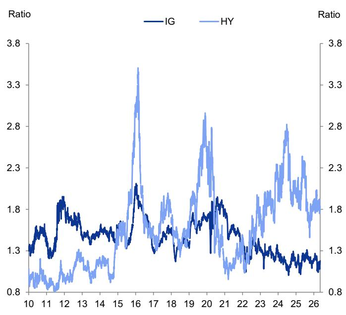

line

| Year | IG    | HY    |
|------|-------|-------|
| 10   | 1.3   | 1.0   |
| 11   | 1.4   | 0.9   |
| 12   | 1.5   | 1.0   |
| 13   | 1.4   | 1.1   |
| 14   | 1.3   | 1.0   |
| 15   | 1.4   | 1.2   |
| 16   | 1.8   | 3.4   |
| 17   | 1.5   | 1.6   |
| 18   | 1.4   | 1.7   |
| 19   | 1.5   | 2.0   |
| 20   | 1.6   | 2.8   |
| 21   | 1.5   | 2.0   |
| 22   | 1.4   | 1.8   |
| 23   | 1.3   | 2.0   |
| 24   | 1.2   | 2.8   |
| 25   | 1.1   | 2.6   |
| 26   | 1.0   | 1.8   |

Source: iBoxx, GS Global Investment Research

Exhibit 31: EUR spread dispersion   
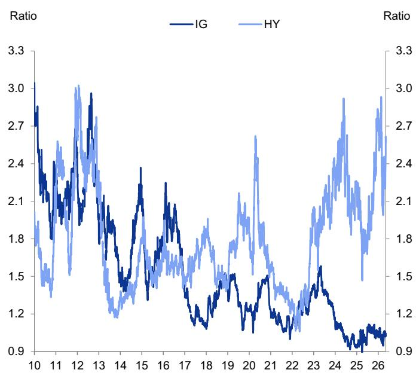

line

| Year | IG    | HY    |
|------|-------|-------|
| 10   | 3.0   | 1.8   |
| 11   | 2.4   | 1.5   |
| 12   | 3.0   | 2.7   |
| 13   | 2.7   | 2.4   |
| 14   | 1.5   | 1.2   |
| 15   | 2.4   | 1.8   |
| 16   | 2.1   | 1.6   |
| 17   | 1.8   | 1.4   |
| 18   | 1.5   | 1.6   |
| 19   | 1.6   | 1.8   |
| 20   | 1.5   | 2.7   |
| 21   | 1.4   | 2.1   |
| 22   | 1.3   | 1.9   |
| 23   | 1.5   | 2.3   |
| 24   | 1.4   | 2.9   |
| 25   | 0.9   | 2.5   |
| 26   | 0.9   | 3.0   |

Source: iBoxx, GS Global Investment Research

Exhibit 32: USD return dispersion   
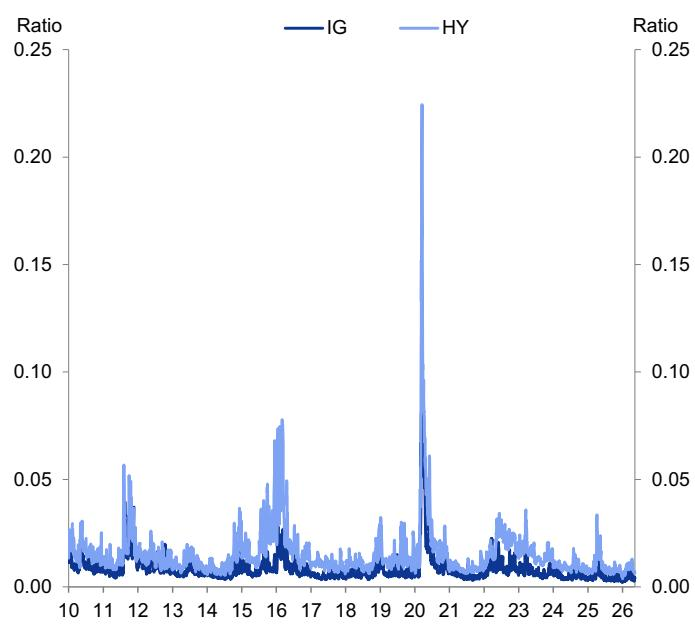

line

| X  | IG    | HY    |
|----|-------|-------|
| 10 | 0.01  | 0.03  |
| 11 | 0.01  | 0.05  |
| 12 | 0.01  | 0.07  |
| 13 | 0.01  | 0.04  |
| 14 | 0.01  | 0.03  |
| 15 | 0.01  | 0.05  |
| 16 | 0.01  | 0.08  |
| 17 | 0.01  | 0.04  |
| 18 | 0.01  | 0.03  |
| 19 | 0.01  | 0.05  |
| 20 | 0.01  | 0.23  |
| 21 | 0.01  | 0.06  |
| 22 | 0.01  | 0.04  |
| 23 | 0.01  | 0.03  |
| 24 | 0.01  | 0.04  |
| 25 | 0.01  | 0.03  |
| 26 | 0.01  | 0.02  |

Source: iBoxx, GS Global Investment Research

Exhibit 33: EUR return dispersion   
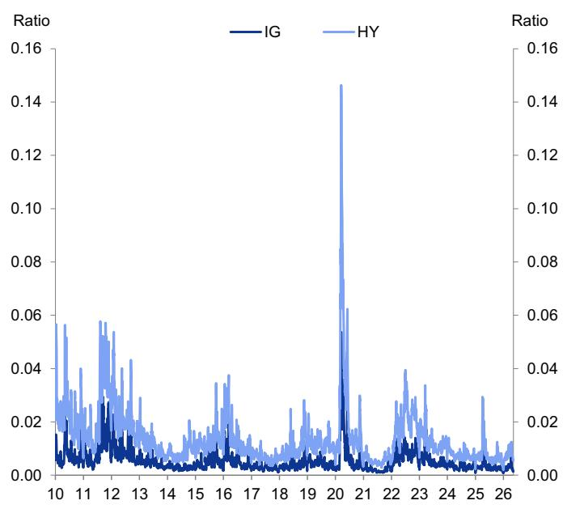

line

| X  | IG    | HY    |
|----|-------|-------|
| 10 | 0.01  | 0.06  |
| 11 | 0.01  | 0.04  |
| 12 | 0.02  | 0.05  |
| 13 | 0.01  | 0.03  |
| 14 | 0.01  | 0.02  |
| 15 | 0.01  | 0.02  |
| 16 | 0.01  | 0.03  |
| 17 | 0.01  | 0.02  |
| 18 | 0.01  | 0.02  |
| 19 | 0.01  | 0.03  |
| 20 | 0.01  | 0.15  |
| 21 | 0.01  | 0.06  |
| 22 | 0.01  | 0.04  |
| 23 | 0.01  | 0.03  |
| 24 | 0.01  | 0.02  |
| 25 | 0.01  | 0.03  |
| 26 | 0.01  | 0.02  |

Source: iBoxx, GS Global Investment Research

# Relative value dashboard: Excess spreads in the USD and EUR markets

Exhibit 34: USD/EUR IG and HY spread differential   
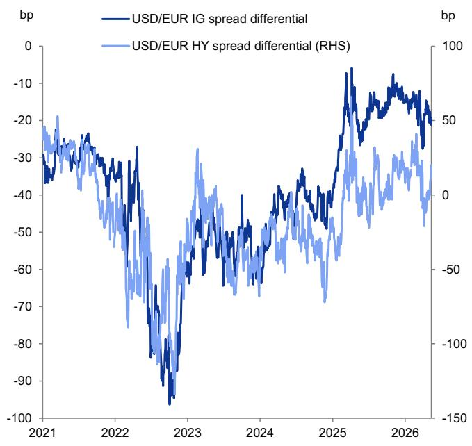

line

| Year | USD/EUR IG spread differential (bp) | USD/EUR HY spread differential (RHS) |
|------|-------------------------------------|--------------------------------------|
| 2021 | -30                                 | -25                                  |
| 2022 | -40                                 | -35                                  |
| 2023 | -90                                 | -85                                  |
| 2024 | -50                                 | -45                                  |
| 2025 | -10                                 | -5                                   |
| 2026 | -15                                 | 0                                    |

Source: iBoxx, GS Global Investment Research

Exhibit 35: CDX IG/iTraxx Main and CDX HY/iTraxx Xover spread differential   
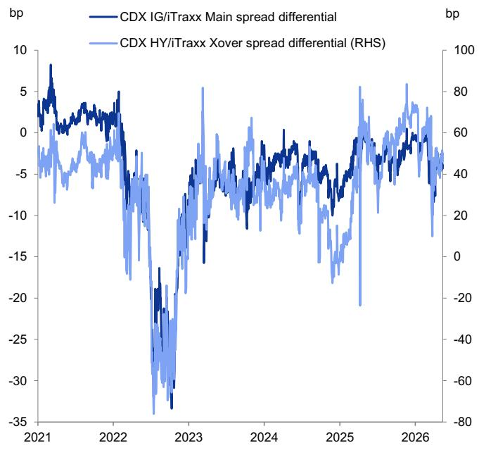

line

| Year | CDX IG/iTraxx Main spread differential | CDX HY/iTraxx Xover spread differential (RHS) |
|------|----------------------------------------|-----------------------------------------------|
| 2021 | ~8                                     | ~-5                                           |
| 2022 | ~5                                     | ~-10                                          |
| 2023 | ~-15                                   | ~-30                                          |
| 2024 | ~-5                                    | ~-10                                          |
| 2025 | ~-10                                   | ~-20                                          |
| 2026 | ~-5                                    | ~-10                                          |

Source: Bloomberg, GS Global Investment Research

Exhibit 36: IG OAS/Agency MBS spread differential   
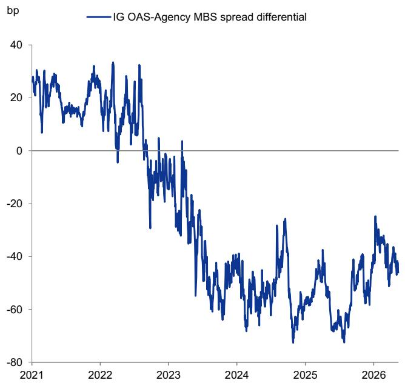

line

| Year | IG OAS-Agency MBS spread differential (bp) |
| ---- | ------------------------------------------ |
| 2021 | ~30                                        |
| 2022 | ~35                                        |
| 2023 | ~-10                                       |
| 2024 | ~-40                                       |
| 2025 | ~-70                                       |
| 2026 | ~-45                                       |

Source: Bloomberg, GS Global Investment Research

Exhibit 37: Leveraged loans/HY spread differential   
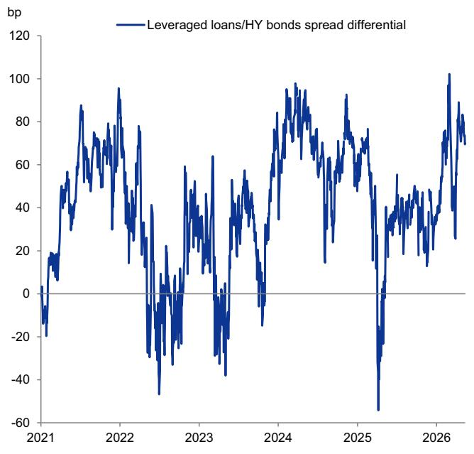

line

| Year | Leveraged loans/HY bonds spread differential (bp) |
| ---- | ----------------------------------------------- |
| 2021 | -10                                             |
| 2022 | 95                                              |
| 2023 | -40                                             |
| 2024 | 85                                              |
| 2025 | -50                                             |
| 2026 | 100                                             |

Source: Bloomberg, Morningstar LCD, GS Global Investment Research

# Performance dashboard: Biggest movers in the USD bond market

Exhibit 38: Top and bottom 20 performers in the USD IG market 

<table><tr><td>Issuer</td><td>Sector</td><td>Security</td><td>Amount outstanding ($mn)</td><td>Ratings (Moody&#x27;s/S&amp;P/Fitch)</td><td>1-week price return (%)</td><td>1-week price change (pts)</td><td>Current price</td></tr><tr><td colspan="8">Top 20 performers</td></tr><tr><td>Meta Platforms Inc</td><td>Internet</td><td>META 5 3/4 11/15/65</td><td>4,500</td><td>Aa3/AA-/--</td><td>1.6%</td><td>1.5</td><td>92.00</td></tr><tr><td>Old Natl Bancorp</td><td>Banks</td><td>ONB 5.768 02/15/36</td><td>450</td><td>Baa1/--/--</td><td>1.6%</td><td>1.6</td><td>100.11</td></tr><tr><td>Boeing Co</td><td>Aerospace/Defense</td><td>BA 3.6 05/01/34</td><td>850</td><td>Baa3/BBB-/BBB-</td><td>1.6%</td><td>1.4</td><td>90.29</td></tr><tr><td>State Street Corp</td><td>Banks</td><td>STT 5.159 05/18/34</td><td>1,000</td><td>Aa3/A/AA-</td><td>1.5%</td><td>1.5</td><td>101.67</td></tr><tr><td>American International</td><td>Insurance</td><td>AIG 5 1/8 03/27/33</td><td>750</td><td>Baa1/A-/A-</td><td>1.5%</td><td>1.5</td><td>101.61</td></tr><tr><td>Campbells Company/The</td><td>Food</td><td>CPB 5.4 03/21/34</td><td>1,000</td><td>Baa2/BBB-/BBB-</td><td>1.4%</td><td>1.4</td><td>98.09</td></tr><tr><td>Salesforce Inc</td><td>Software</td><td>CRM 6.55 03/15/56</td><td>3,750</td><td>A2/A+/-</td><td>1.4%</td><td>1.4</td><td>100.10</td></tr><tr><td>Mondelez International</td><td>Food</td><td>MDLZ 5 1/8 05/06/35</td><td>400</td><td>Baa1/BBB/--</td><td>1.4%</td><td>1.4</td><td>101.18</td></tr><tr><td>Kraft Heinz Foods Co</td><td>Food</td><td>KHC 5.4 03/15/35</td><td>500</td><td>Baa2/BBB/BBB</td><td>1.3%</td><td>1.4</td><td>101.48</td></tr><tr><td>Polaris Inc</td><td>Leisure Time</td><td>PII 5.6 03/01/31</td><td>500</td><td>Baa3/BBB-/BBB-</td><td>1.3%</td><td>1.3</td><td>99.89</td></tr><tr><td>Oracle Corp</td><td>Software</td><td>ORCL 5 1/2 08/03/35</td><td>1,750</td><td>Baa2/BBB/BBB</td><td>1.3%</td><td>1.2</td><td>96.34</td></tr><tr><td>American Express Co</td><td>Diversified Finan Serv</td><td>AXP 5.043 05/01/34</td><td>1,250</td><td>A2/A-/A</td><td>1.3%</td><td>1.3</td><td>100.86</td></tr><tr><td>Estee Lauder Co Inc</td><td>Cosmetics/Personal Care</td><td>EL 5 02/14/34</td><td>650</td><td>A3/A-/--</td><td>1.2%</td><td>1.2</td><td>100.43</td></tr><tr><td>Cigna Group/The</td><td>Healthcare-Services</td><td>CI 5 1/4 02/15/34</td><td>1,250</td><td>Baa1/A-/BBB+</td><td>1.2%</td><td>1.2</td><td>101.84</td></tr><tr><td>At&amp;T Inc</td><td>Telecommunications</td><td>T 5.7 11/01/54</td><td>1,500</td><td>Baa2/BBB/BBB+</td><td>1.2%</td><td>1.1</td><td>93.73</td></tr><tr><td>Comcast Corp</td><td>Media</td><td>CMCSA 6.05 05/15/55</td><td>1,000</td><td>A3/A-/A-</td><td>1.1%</td><td>1.1</td><td>98.75</td></tr><tr><td>Ebay Inc</td><td>Internet</td><td>EBAY 4 07/15/42</td><td>750</td><td>Baa1/BBB+/-</td><td>1.1%</td><td>0.9</td><td>79.32</td></tr><tr><td>American Honda Finance</td><td>Auto Manufacturers</td><td>HNDA 4.9 01/10/34</td><td>750</td><td>A3/BBB+/A-</td><td>1.0%</td><td>1.0</td><td>98.48</td></tr><tr><td>Bristol-Myers Squibb Co</td><td>Pharmaceuticals</td><td>BMY 5.9 11/15/33</td><td>750</td><td>A2/A--</td><td>1.0%</td><td>1.1</td><td>107.45</td></tr><tr><td>Union Pacific Corp</td><td>Transportation</td><td>UNP 3.6 09/15/37</td><td>500</td><td>A3/A-/A-</td><td>1.0%</td><td>0.9</td><td>88.29</td></tr><tr><td colspan="8">Bottom 20 performers</td></tr><tr><td>HSBC Holdings Plc</td><td>Banks</td><td>HSBC 6 1/2 09/15/37</td><td>985</td><td>Baa1/BBB+/A-</td><td>-2.7%</td><td>-3.0</td><td>108.80</td></tr><tr><td>Oracle Corp</td><td>Software</td><td>ORCL 6 1/8 07/08/39</td><td>1,250</td><td>Baa2/BBB/BBB</td><td>-2.7%</td><td>-2.6</td><td>99.38</td></tr><tr><td>Wells Fargo &amp; Company</td><td>Banks</td><td>WFC 5 3/8 02/07/35</td><td>470</td><td>A1/BBB+/A+</td><td>-2.7%</td><td>-2.8</td><td>105.17</td></tr><tr><td>Altria Group Inc</td><td>Agriculture</td><td>MO 4 1/4 08/09/42</td><td>900</td><td>A3/BBB+/BBB+</td><td>-2.5%</td><td>-2.1</td><td>83.93</td></tr><tr><td>Ibm Internat Capital</td><td>Computers</td><td>IBM 5 1/4 02/05/44</td><td>1,000</td><td>A3/A-/A-</td><td>-2.4%</td><td>-2.2</td><td>93.80</td></tr><tr><td>Abbvie Inc</td><td>Pharmaceuticals</td><td>ABBV 4.55 03/15/35</td><td>1,681</td><td>A2/A-/--</td><td>-2.3%</td><td>-2.3</td><td>99.19</td></tr><tr><td>T-Mobile Usa Inc</td><td>Telecommunications</td><td>TMUS 5 7/8 11/15/55</td><td>1,250</td><td>Baa1/BBB+/BBB+</td><td>-2.2%</td><td>-2.2</td><td>98.91</td></tr><tr><td>Phillips 66 Co</td><td>Oil&amp;Gas</td><td>PSX 5 7/8 03/15/56</td><td>1,000</td><td>Baa2/BBB-/--</td><td>-2.0%</td><td>-2.0</td><td>99.63</td></tr><tr><td>Charter Comm Opt Llc/Cap</td><td>Media</td><td>CHTR 4.8 03/01/50</td><td>2,800</td><td>Ba1/BBB-/BBB-</td><td>-2.0%</td><td>-1.5</td><td>73.89</td></tr><tr><td>Brighthouse Financial In</td><td>Insurance</td><td>BHF 4.7 06/22/47</td><td>1,014</td><td>Baa3/BBB/BBB-</td><td>-2.0%</td><td>-1.4</td><td>72.45</td></tr><tr><td>Oracle Corp</td><td>Software</td><td>ORCL 6 1/2 04/15/38</td><td>1,250</td><td>Baa2/BBB/BBB</td><td>-1.9%</td><td>-2.0</td><td>103.20</td></tr><tr><td>Campbells Company/The</td><td>Food</td><td>CPB 4 3/4 03/23/35</td><td>800</td><td>Baa2/BBB-/BBB-</td><td>-1.9%</td><td>-1.8</td><td>94.43</td></tr><tr><td>Rtx Corp</td><td>Aerospace/Defense</td><td>RTX 3.03 03/15/52</td><td>1,100</td><td>Baa1/BBB+/-</td><td>-1.8%</td><td>-1.2</td><td>64.43</td></tr><tr><td>Home Depot Inc</td><td>Retail</td><td>HD 5 7/8 12/16/36</td><td>3,000</td><td>A2/A/A</td><td>-1.8%</td><td>-1.9</td><td>108.05</td></tr><tr><td>Johnson &amp; Johnson</td><td>Pharmaceuticals</td><td>JNJ 4.9 06/01/31</td><td>1,150</td><td>Aaa/AAA/--</td><td>-1.8%</td><td>-1.8</td><td>104.69</td></tr><tr><td>Intel Corp</td><td>Semiconductors</td><td>INTC 4 1/4 12/15/42</td><td>567</td><td>Baa2/BBB/BBB</td><td>-1.7%</td><td>-1.4</td><td>83.50</td></tr><tr><td>Citi Inc</td><td>Banks</td><td>C 5.316 03/26/41</td><td>1,300</td><td>A3/BBB+/A</td><td>-1.7%</td><td>-1.7</td><td>98.37</td></tr><tr><td>General Dynamics Corp</td><td>Aerospace/Defense</td><td>GD 2.85 06/01/41</td><td>500</td><td>A1/A--</td><td>-1.7%</td><td>-1.3</td><td>75.03</td></tr><tr><td>Paypal Holdings Inc</td><td>Commercial Services</td><td>PYPL 5.05 06/01/52</td><td>1,000</td><td>A3/A-/A-</td><td>-1.7%</td><td>-1.5</td><td>86.32</td></tr><tr><td>Charter Comm Opt Llc/Cap</td><td>Media</td><td>CHTR 5 1/4 04/01/53</td><td>1,500</td><td>Ba1/BBB-/BBB-</td><td>-1.7%</td><td>-1.3</td><td>77.90</td></tr></table>

Note: Only Bloomberg index-eligible bonds.   
Source: Bloomberg, TRACE, data compiled by GS Global Investment Research

Exhibit 39: Top and bottom 20 performers in the USD HY market 

<table><tr><td>Issuer</td><td>Sector</td><td>Security</td><td>Amount outstanding ($mn)</td><td>Ratings (Moody&#x27;s/S&amp;P/Fitch)</td><td>1-week price return (%)</td><td>1-week price change (pts)</td><td>Current price</td></tr><tr><td colspan="8">Top 20 performers</td></tr><tr><td>Liberty Interactive Llc</td><td>Retail</td><td>LINTA 8 1/4 02/01/30</td><td>504</td><td>WR/D/C</td><td>20.7%</td><td>1.1</td><td>5.18</td></tr><tr><td>Csc Holdings Llc</td><td>Media</td><td>CSCHLD 4 1/2 11/15/31</td><td>1,500</td><td>Caa2/CCC+/-</td><td>3.2%</td><td>1.8</td><td>54.25</td></tr><tr><td>Csc Holdings Llc</td><td>Media</td><td>CSCHLD 4 1/8 12/01/30</td><td>1,100</td><td>Caa2/CCC+/-</td><td>3.1%</td><td>1.7</td><td>54.63</td></tr><tr><td>Goeasy Ltd</td><td>Diversified Finan Serv</td><td>GSYCN 6 7/8 05/15/30</td><td>400</td><td>B2/B-/-</td><td>3.0%</td><td>2.5</td><td>84.50</td></tr><tr><td>Csc Holdings Llc</td><td>Media</td><td>CSCHLD 6 1/2 02/01/29</td><td>1,750</td><td>Caa2/CCC+/-</td><td>2.6%</td><td>1.5</td><td>58.50</td></tr><tr><td>Clydesdale Acquisition</td><td>Packaging&amp;Containers</td><td>NOVHOL 8 3/4 04/15/30</td><td>1,110</td><td>Caa1/B-/BB</td><td>2.5%</td><td>2.3</td><td>91.47</td></tr><tr><td>Dye &amp; Durham Limited</td><td>Software</td><td>DNDCN 8 5/8 04/15/29</td><td>509</td><td>B2/B-/-</td><td>2.3%</td><td>1.8</td><td>81.19</td></tr><tr><td>Cntrl Parent/Cdk Glb Inc</td><td>Software</td><td>CDK 7 1/4 06/15/29</td><td>750</td><td>B3/B-/-</td><td>2.1%</td><td>1.1</td><td>50.01</td></tr><tr><td>Embecta Corp</td><td>Healthcare-Products</td><td>EMBC 6 3/4 02/15/30</td><td>200</td><td>B3/B-/-</td><td>1.9%</td><td>1.6</td><td>80.70</td></tr><tr><td>Mcafee Corp</td><td>Computers</td><td>MCFE 7 3/8 02/15/30</td><td>1,733</td><td>Caa1/CCC+/-</td><td>1.8%</td><td>1.5</td><td>81.50</td></tr><tr><td>Planet Financial Group</td><td>Diversified Finan Serv</td><td>PLNFIN 10 1/2 12/15/29</td><td>600</td><td>Caa1/B-/B-</td><td>1.8%</td><td>1.8</td><td>96.75</td></tr><tr><td>Cd&amp;R Smokey / Radio Sys</td><td>Housewares</td><td>PETSAF 9 1/2 10/15/29</td><td>775</td><td>B3/B-/-</td><td>1.8%</td><td>1.2</td><td>67.06</td></tr><tr><td>Ziprecruiter Inc</td><td>Internet</td><td>ZIP 5 01/15/30</td><td>550</td><td>B3/B/CCC+</td><td>1.6%</td><td>1.1</td><td>70.00</td></tr><tr><td>Alta Equipment Group</td><td>Commercial Services</td><td>ALTG 9 06/01/29</td><td>500</td><td>Caa1/B-/-</td><td>1.6%</td><td>1.5</td><td>93.50</td></tr><tr><td>Clue Opco Llc</td><td>Holding Companies-Divers</td><td>FWRD 9 1/2 10/15/31</td><td>725</td><td>B2/B/B+</td><td>1.5%</td><td>1.4</td><td>90.75</td></tr><tr><td>Kennedy-Wilson Inc</td><td>Real Estate</td><td>KW 4 3/4 02/01/30</td><td>600</td><td>B2/B-/-</td><td>1.3%</td><td>1.3</td><td>99.60</td></tr><tr><td>Clydesdale Acquisition</td><td>Packaging&amp;Containers</td><td>NOVHOL 6 3/4 04/15/32</td><td>1,415</td><td>B2/B+/BB+</td><td>1.1%</td><td>1.0</td><td>93.50</td></tr><tr><td>Kingpin Intermediate Ho</td><td>Leisure Time</td><td>LUCK 7 1/4 10/15/32</td><td>500</td><td>B3/B-/-</td><td>1.1%</td><td>0.9</td><td>84.23</td></tr><tr><td>Burford Capital Glbl Fin</td><td>Diversified Finan Serv</td><td>BURLN 9 1/4 07/01/31</td><td>675</td><td>Ba1/BB-/-</td><td>1.0%</td><td>1.0</td><td>93.25</td></tr><tr><td>Cp Atlas Buyer Inc</td><td>Building Materials</td><td>AMBATH 9 3/4 07/15/30</td><td>500</td><td>B2/CCC+/-</td><td>0.9%</td><td>0.8</td><td>92.25</td></tr><tr><td colspan="8">Bottom 20 performers</td></tr><tr><td>Csc Holdings Llc</td><td>Media</td><td>CSCHLD 7 1/2 04/01/28</td><td>1,046</td><td>Ca/CCC-/-</td><td>-13.7%</td><td>-6.2</td><td>45.05</td></tr><tr><td>Lbm Acquisition Llc</td><td>Retail</td><td>USLBMH 6 1/4 01/15/29</td><td>726</td><td>Caa3/CCC/CCC</td><td>-10.8%</td><td>-7.3</td><td>67.25</td></tr><tr><td>Wabash National Corp</td><td>Auto Manufacturers</td><td>WNC 4 1/2 10/15/28</td><td>400</td><td>Caa1/B-/-</td><td>-7.3%</td><td>-6.2</td><td>84.66</td></tr><tr><td>Jeldwen Holding</td><td>Building Materials</td><td>JELD 7 09/01/32</td><td>350</td><td>Caa2/CCC+/-</td><td>-6.7%</td><td>-4.0</td><td>59.50</td></tr><tr><td>Getty Images Inc</td><td>Internet</td><td>ABEGET 10 1/2 11/15/30</td><td>628</td><td>B3/BB-/-</td><td>-6.0%</td><td>-5.0</td><td>83.75</td></tr><tr><td>Lbm Acquisition Llc</td><td>Retail</td><td>USLBMH 9 1/2 06/15/31</td><td>950</td><td>Caa1/B-/B-</td><td>-5.6%</td><td>-4.8</td><td>85.50</td></tr><tr><td>Brand Industrial Service</td><td>Engineering&amp;Construction</td><td>BRANDI 10 3/8 08/01/30</td><td>1,435</td><td>Caa1/CCC+/-</td><td>-4.9%</td><td>-4.5</td><td>92.00</td></tr><tr><td>Gray Media Inc</td><td>Media</td><td>GTN 5 3/8 11/15/31</td><td>1,220</td><td>Caa1/CCC/-</td><td>-4.9%</td><td>-3.8</td><td>76.25</td></tr><tr><td>Goodyear Tire &amp; Rubber</td><td>Auto Parts&amp;Equipment</td><td>GT 5 5/8 04/30/33</td><td>450</td><td>B2/B+/BB-</td><td>-4.4%</td><td>-3.9</td><td>89.25</td></tr><tr><td>Iheartcommunications Inc</td><td>Media</td><td>IHRT 10 7/8 05/01/30</td><td>675</td><td>Caa3/CCC-/-</td><td>-4.2%</td><td>-4.0</td><td>94.50</td></tr><tr><td>Gray Media Inc</td><td>Media</td><td>GTN 4 3/4 10/15/30</td><td>790</td><td>Caa1/CCC/-</td><td>-4.1%</td><td>-3.3</td><td>79.00</td></tr><tr><td>Goodyear Tire &amp; Rubber</td><td>Auto Parts&amp;Equipment</td><td>GT 5 1/4 07/15/31</td><td>600</td><td>B2/B+/BB-</td><td>-4.1%</td><td>-3.7</td><td>90.00</td></tr><tr><td>Whirlpool Corp</td><td>Home Furnishings</td><td>WHR 5 3/4 03/01/34</td><td>300</td><td>B1/BB/BB</td><td>-4.0%</td><td>-3.5</td><td>87.78</td></tr><tr><td>Cable One Inc</td><td>Media</td><td>CABO 4 11/15/30</td><td>548</td><td>B3/B-/-</td><td>-3.7%</td><td>-2.4</td><td>63.35</td></tr><tr><td>Angi Group Llc</td><td>Internet</td><td>ANGI 3 7/8 08/15/28</td><td>400</td><td>B2/B-/-</td><td>-3.6%</td><td>-3.2</td><td>89.20</td></tr><tr><td>Chc Group Llc</td><td>Oil&amp;Gas Services</td><td>CHHCF 11 3/4 09/01/30</td><td>550</td><td>--/--/-</td><td>-3.5%</td><td>-3.0</td><td>84.99</td></tr><tr><td>Goodyear Tire &amp; Rubber</td><td>Auto Parts&amp;Equipment</td><td>GT 5 1/4 04/30/31</td><td>550</td><td>B2/B+/BB-</td><td>-3.5%</td><td>-3.1</td><td>90.89</td></tr><tr><td>Kohl&#x27;S Corporation</td><td>Retail</td><td>KSS 3 3/8 05/01/31</td><td>425</td><td>B3/BB-/BB-</td><td>-3.5%</td><td>-2.9</td><td>83.72</td></tr><tr><td>Whirlpool Corp</td><td>Home Furnishings</td><td>WHR 6 1/2 06/15/33</td><td>600</td><td>B1/BB/BB</td><td>-3.3%</td><td>-3.1</td><td>93.60</td></tr><tr><td>Cerdia Finanz Gmbh</td><td>Chemicals</td><td>PLATIN 9 3/8 10/03/31</td><td>900</td><td>B2/B-/-</td><td>-3.2%</td><td>-3.0</td><td>93.25</td></tr></table>

Note: Only Bloomberg index-eligible bonds.   
Source: Bloomberg, TRACE, data compiled by GS Global Investment Research

# Valuation dashboard: Percentile ranks for spreads and yields

Exhibit 40: Percentile ranks for spreads across markets (2000-current)   
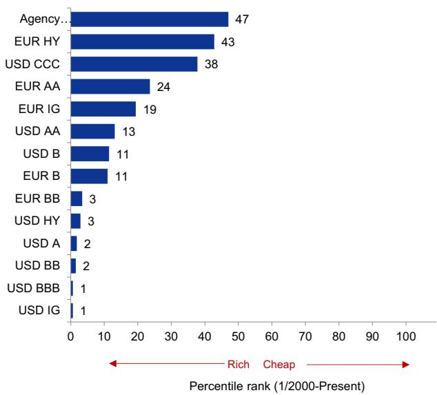

bar

| Currency Pair | Percentile Rank (1/2000-Present) |
|---|---|
| Agency... | 47 |
| EUR HY | 43 |
| USD CCC | 38 |
| EUR AA | 24 |
| EUR IG | 19 |
| USD AA | 13 |
| USD B | 11 |
| EUR B | 11 |
| EUR BB | 3 |
| USD HY | 3 |
| USD A | 2 |
| USD BB | 2 |
| USD BBB | 1 |
| USD IG | 1 |

Source: Bloomberg, GS Global Investment Research

Exhibit 41: Percentile ranks for spreads across markets (2010-current)   
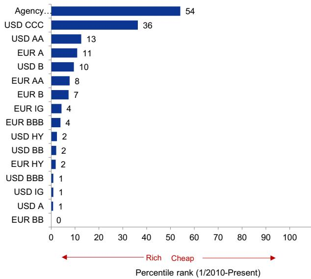

bar

| Currency | Percentile Rank (1/2010-Present) |
| :--- | :--- |
| Agency... | 54 |
| USD CCC | 36 |
| USD AA | 13 |
| EUR A | 11 |
| USD B | 10 |
| EUR AA | 8 |
| EUR B | 7 |
| EUR IG | 4 |
| EUR BBB | 4 |
| USD HY | 2 |
| USD BB | 2 |
| EUR HY | 2 |
| USD BBB | 1 |
| USD IG | 1 |
| USD A | 1 |
| EUR BB | 0 |
Rich Cheap

Source: Bloomberg, GS Global Investment Research

Exhibit 42: Percentile ranks for yields across markets (2000-current)   
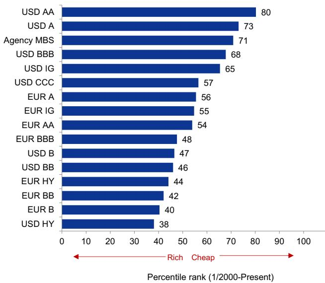

bar

| Currency Pair | Percentile Rank (1/2000-Present) |
|---|---|
| USD AA | 80 |
| USD A | 73 |
| Agency MBS | 71 |
| USD BBB | 68 |
| USD IG | 65 |
| USD CCC | 57 |
| EUR A | 56 |
| EUR IG | 55 |
| EUR AA | 54 |
| EUR BBB | 48 |
| USD B | 47 |
| USD BB | 46 |
| EUR HY | 44 |
| EUR BB | 42 |
| EUR B | 40 |
| USD HY | 38 |
Rich Cheap indicated between USD AA and USD BB; EUR BB is also listed below the chart.

Source: Bloomberg, GS Global Investment Research

Exhibit 43: Percentile ranks for yields across markets (2010-current)   
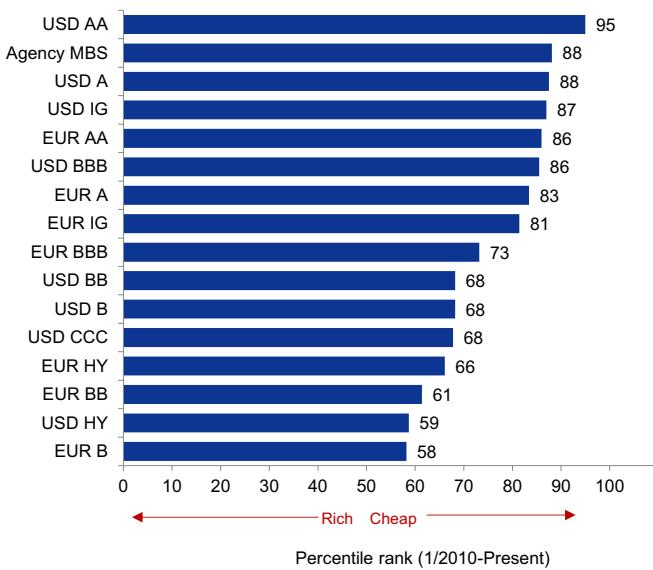

bar

| Currency Pair | Percentile Rank (1/2010-Present) |
|---|---|
| USD AA | 95 |
| Agency MBS | 88 |
| USD A | 88 |
| USD IG | 87 |
| EUR AA | 86 |
| USD BBB | 86 |
| EUR A | 83 |
| EUR IG | 81 |
| EUR BBB | 73 |
| USD BB | 68 |
| USD B | 68 |
| USD CCC | 68 |
| EUR HY | 66 |
| EUR BB | 61 |
| USD HY | 59 |
| EUR B | 58 |
Rich Cheap indicated between USD AA and EUR BB.

Source: Bloomberg, GS Global Investment Research

# Valuation dashboard: Sizing the carry in USD and EUR fixed income markets

Exhibit 44: Average yield vs. total market value outstanding across the USD fixed income complex   
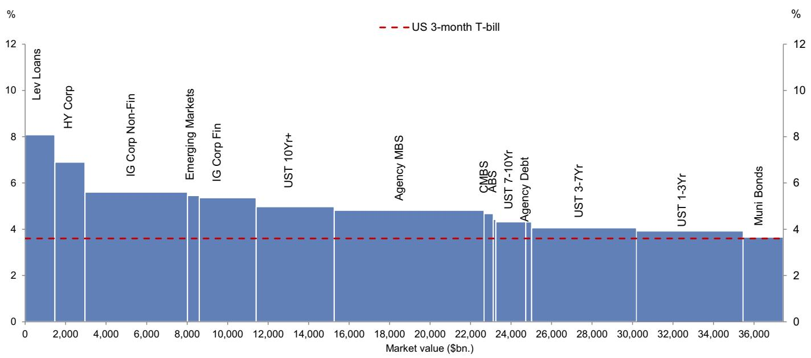

bar

| Category | Market value ($bn.) |
| :--- | :--- |
| Lev Loans | 8.0 |
| HY Corp | 6.9 |
| IG Corp Non-Fin | 5.6 |
| Emerging Markets | 5.5 |
| IG Corp Fin | 5.4 |
| UST 10Yr+ | 4.9 |
| Agency MBS | 4.8 |
| CMBS ABS | 4.7 |
| UST 7-10Yr | 4.3 |
| Agency Debt | 4.1 |
| UST 3-7Yr | 4.0 |
| UST 1-3Yr | 3.9 |
| Muni Bonds | 3.7 |

Note: We use the iBoxx indices for the IG corporate credit and US Treasury markets, the Bloomberg indices for the HY, MBS, CMBS and ABS markets, and the Morningstar LSTA index for the leveraged loan market.   
Source: iBoxx, Bloomberg, Pitchbook LCD, GS Global Investment Research

Exhibit 45: Average yield vs. total market value outstanding for the EUR fixed income markets   
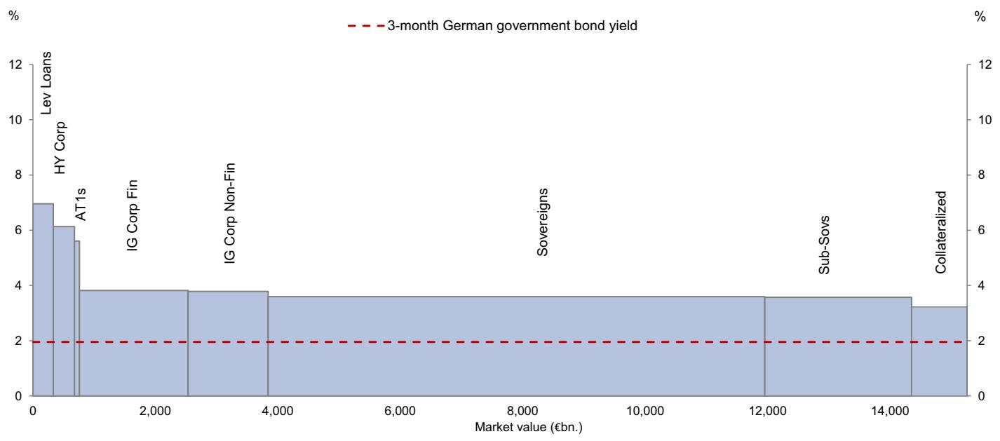

bar

| Category         | Market value (€bn.) |
| ---------------- | ------------------- |
| Lev Loans        | 7                   |
| HY Corp          | 6                   |
| AT1s             | 5.5                 |
| IG Corp Fin      | 3.8                 |
| IG Corp Non-Fin  | 3.8                 |
| Sovereigns       | 3.7                 |
| Sub-Sovs         | 3.6                 |
| Collateralized   | 3.3                 |

Source: iBoxx, GS Global Investment Research

# Valuation dashboard: Macro index volatility

Note: Skew is calculated using difference in 3m implied volatility between 25-delta payers and receivers, divided by 3m ATM implied volatility.

Exhibit 46: CDX IG and iTraxx Main vol 3m ATM implied volatility   
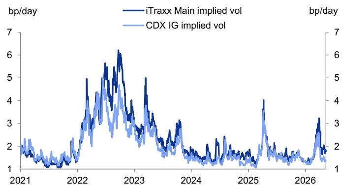

line

| Year | iTraxx Main implied vol (bp/day) | CDX IG implied vol (bp/day) |
|------|----------------------------------|-----------------------------|
| 2021 | ~1.5                             | ~1.8                        |
| 2022 | ~3.0                             | ~2.5                        |
| 2023 | ~6.0                             | ~4.5                        |
| 2024 | ~2.0                             | ~1.5                        |
| 2025 | ~4.0                             | ~3.5                        |
| 2026 | ~3.0                             | ~2.5                        |

Source: GS, GS Global Investment Research

Exhibit 47: CDX HY and iTraxx Xover vol 3m ATM implied volatility   
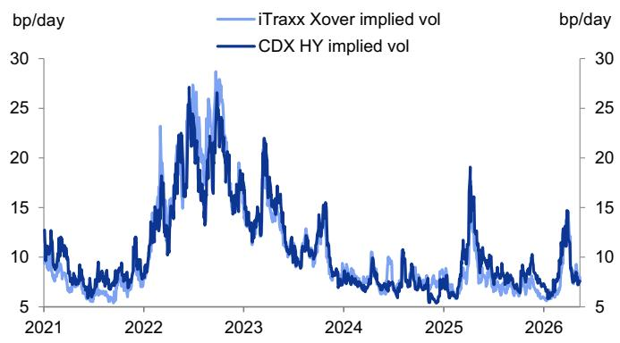

line

| Year | iTraxx Xover implied vol | CDX HY implied vol |
|------|--------------------------|--------------------|
| 2021 | ~10                      | ~12                |
| 2022 | ~15                      | ~18                |
| 2023 | ~28                      | ~25                |
| 2024 | ~10                      | ~15                |
| 2025 | ~8                       | ~10                |
| 2026 | ~7                       | ~15                |

Source: GS, GS Global Investment Research

Exhibit 48: CDX IG and iTraxx Main skew   
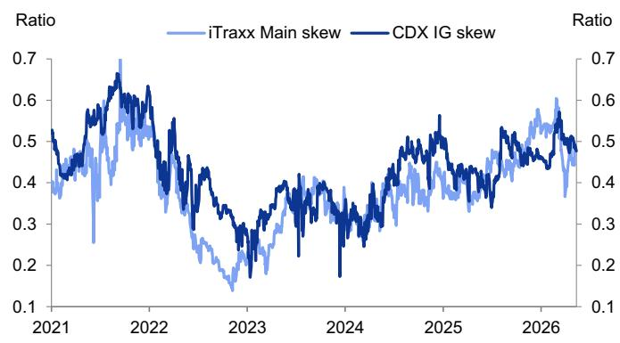

line

| Year | iTraxx Main skew | CDX IG skew |
|------|------------------|-------------|
| 2021 | ~0.4             | ~0.5        |
| 2022 | ~0.5             | ~0.6        |
| 2023 | ~0.1             | ~0.3        |
| 2024 | ~0.3             | ~0.4        |
| 2025 | ~0.4             | ~0.5        |
| 2026 | ~0.5             | ~0.5        |

Source: GS, GS Global Investment Research

Exhibit 49: CDX HY and iTraxx Xover skew   
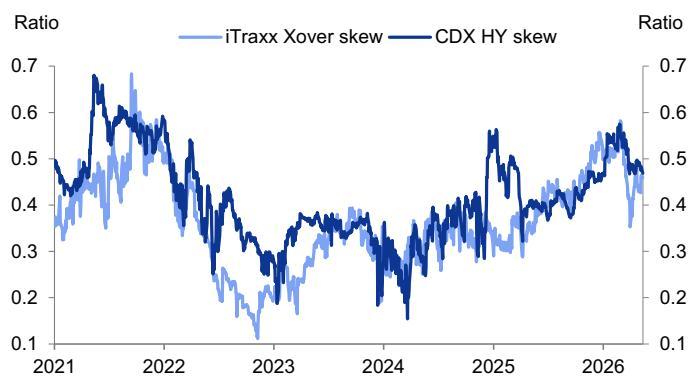

line

| Year | iTraxx Xover skew | CDX HY skew |
|------|-------------------|-------------|
| 2021 | ~0.45             | ~0.5        |
| 2022 | ~0.35             | ~0.55       |
| 2023 | ~0.1              | ~0.3        |
| 2024 | ~0.3              | ~0.2        |
| 2025 | ~0.4              | ~0.55       |
| 2026 | ~0.5              | ~0.6        |

Source: GS, GS Global Investment Research

Exhibit 50: CDX IG and iTraxx Main ATM implied volatility term structure   
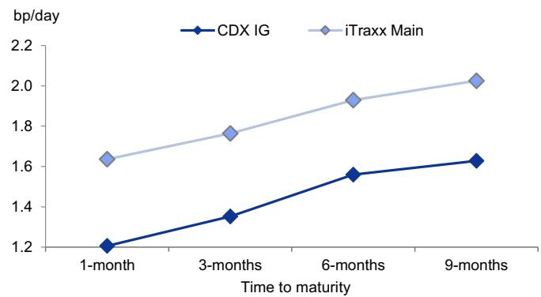

line

| Time to maturity | CDX IG | iTraxx Main |
| ---------------- | ------ | ----------- |
| 1-month          | 1.2    | 1.65        |
| 3-months         | 1.35   | 1.75        |
| 6-months         | 1.55   | 1.9         |
| 9-months         | 1.6    | 2.0         |

Source: GS, GS Global Investment Research

Exhibit 51: CDX HY and iTraxx Xover ATM implied volatility term structure   
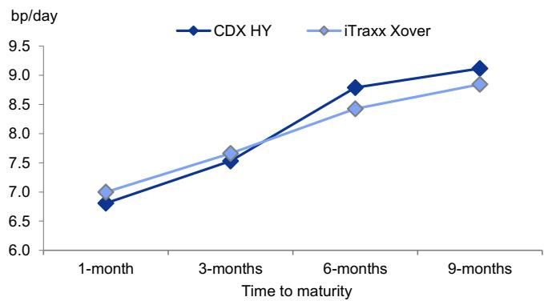

line

| Time to maturity | CDX HY | iTraxx Xover |
| ---------------- | ------ | ------------ |
| 1-month          | 6.8    | 7.0          |
| 3-months         | 7.5    | 7.7          |
| 6-months         | 8.8    | 8.4          |
| 9-months         | 9.1    | 8.9          |

Source: GS, GS Global Investment Research

# Valuation dashboard: CLOs

Exhibit 52: CLO spread percentile ranks 

<table><tr><td rowspan="2">USD</td><td rowspan="2">Current spread (bp)</td><td colspan="3">Percentile rank</td></tr><tr><td>3-year</td><td>5-year</td><td>10-year</td></tr><tr><td>AAA</td><td>104</td><td>5%</td><td>3%</td><td>2%</td></tr><tr><td>AA</td><td>144</td><td>5%</td><td>3%</td><td>2%</td></tr><tr><td>A</td><td>164</td><td>0%</td><td>0%</td><td>0%</td></tr><tr><td>BBB</td><td>281</td><td>30%</td><td>18%</td><td>12%</td></tr><tr><td>BB</td><td>754</td><td>62%</td><td>57%</td><td>63%</td></tr></table>

Source: Bloomberg, GS Global Investment Research

# Exhibit 54: CLO new issue arbitrage spread

New issue CLO arbitrage spread, i.e., the difference between new issue loan spreads and new issue CLO spreads (across the capital stack)

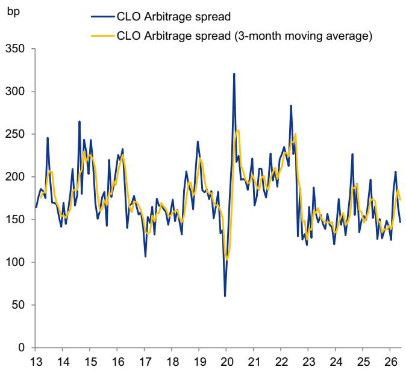

line

| Year | CLO Arbitrage spread | CLO Arbitrage spread (3-month moving average) |
|------|----------------------|-----------------------------------------------|
| 13   | ~180                 | ~175                                          |
| 14   | ~240                 | ~200                                          |
| 15   | ~260                 | ~220                                          |
| 16   | ~230                 | ~225                                          |
| 17   | ~170                 | ~160                                          |
| 18   | ~180                 | ~170                                          |
| 19   | ~240                 | ~210                                          |
| 20   | ~60                  | ~100                                          |
| 21   | ~220                 | ~250                                          |
| 22   | ~280                 | ~240                                          |
| 23   | ~180                 | ~160                                          |
| 24   | ~170                 | ~150                                          |
| 25   | ~230                 | ~190                                          |
| 26   | ~200                 | ~180                                          |

Source: Pitchbook LCD, GS Global Investment Research

Exhibit 53: CLO equity vs. CLO BB yield   
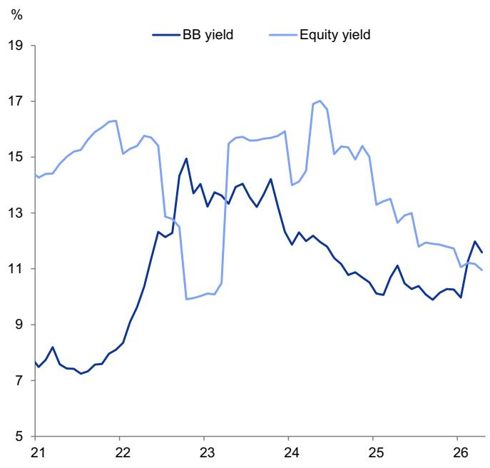

line

| Year | BB yield | Equity yield |
|------|----------|--------------|
| 21   | 7.5      | 14.5         |
| 22   | 8.5      | 15.5         |
| 23   | 13.5     | 9.5          |
| 24   | 12.5     | 17.0         |
| 25   | 10.5     | 13.0         |
| 26   | 11.5     | 11.0         |

Source: Intex, Bloomberg, GS Global Investment Research

# Exhibit 55: CLO vs. USD IG spread differential

CLO by rating and USD IG bond by rating spread differential

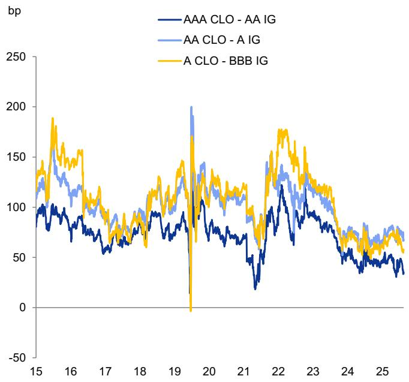

line

| Year | AAA CLO - AA IG | AA CLO - A IG | A CLO - BBB IG |
|------|-----------------|---------------|----------------|
| 15   | ~100            | ~120          | ~140           |
| 16   | ~90             | ~110          | ~180           |
| 17   | ~70             | ~90           | ~120           |
| 18   | ~80             | ~100          | ~130           |
| 19   | ~90             | ~140          | ~150           |
| 20   | ~100            | ~140          | ~170           |
| 21   | ~20             | ~80           | ~100           |
| 22   | ~120            | ~130          | ~180           |
| 23   | ~90             | ~110          | ~160           |
| 24   | ~60             | ~80           | ~120           |
| 25   | ~40             | ~70           | ~80            |

Source: Bloomberg, GS Global Investment Research

# USD IG and HY Sentiment indicators

Exhibit 56: IG Weekly sentiment indicator   
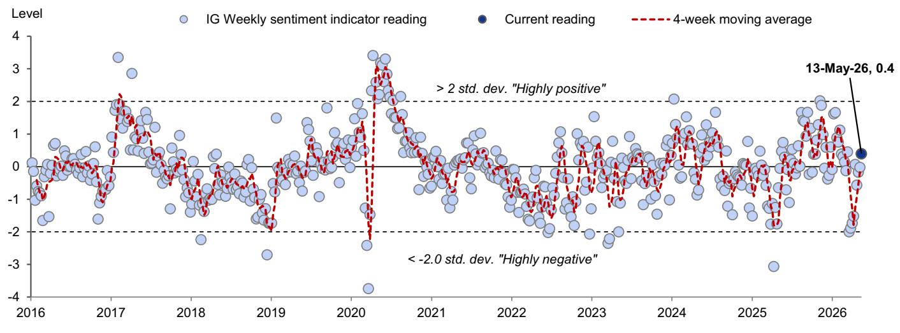

scatter

| Year | IG Weekly sentiment indicator reading | Current reading | 4-week moving average |
|------|----------------------------------------|-----------------|------------------------|
| 2026 | 0.4                                    | -               | 0.4                    |

Source: See table below.

Exhibit 57: HY Weekly sentiment indicator   
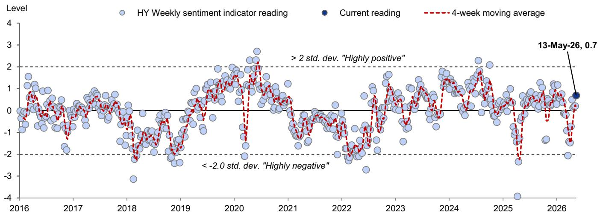

line

| Date       | HY Weekly sentiment indicator reading | Current reading | 4-week moving average |
| ---------- | -------------------------------------- | --------------- | --------------------- |
| 13-May-26  | 0.7                                    | 0.7             | 0.7                   |

Source: See table below.

Exhibit 58: Variables included in the USD IG and HY weekly sentiment indicators 

<table><tr><td>Measure</td><td>Frequency</td><td>Data Source</td></tr><tr><td>Synthetic index Positioning</td><td>Weekly</td><td>DTCC</td></tr><tr><td>Net Dealer Positioning</td><td>Weekly</td><td>FRBNY</td></tr><tr><td>Net Dealer Lift</td><td>Weekly</td><td>TRACE</td></tr><tr><td>Active US Credit Fund flows</td><td>Weekly</td><td>EPFR</td></tr><tr><td>Passive US Credit Fund flows</td><td>Weekly</td><td>EPFR</td></tr><tr><td>US Money Market Fund flows</td><td>Weekly</td><td>EPFR</td></tr><tr><td>Short interest on the largest credit ETFs</td><td>Semimonthly</td><td>GS FICC &amp; Equities</td></tr><tr><td>Credit Mutual Fund cash positions</td><td>Monthly</td><td>ICI</td></tr></table>

Source: GS Global Investment Research

# Microstructure dashboard: Top 20 most traded capital structures in the USD IG and HY markets

Exhibit 59: Top 20 most liquid issuers by weekly turnover in the USD IG market 

<table><tr><td>Ticker</td><td>Issuer</td><td>Notional bonds outstanding ($bn)</td><td>Notional volume traded on the week ($mn)</td><td>Weekly turnover ratio (Wed. to Wed. %)</td><td>Median rating</td><td>Average age of bonds outstanding (Years)</td><td>Average duration of bonds outstanding (Years)</td></tr><tr><td>CRM</td><td>Salesforce Inc</td><td>33.5</td><td>691.0</td><td>2.1</td><td>A</td><td>1.5</td><td>7.3</td></tr><tr><td>HUM</td><td>Humana Inc</td><td>10.9</td><td>218.1</td><td>2.0</td><td>BBB</td><td>3.9</td><td>7.2</td></tr><tr><td>GOOGL</td><td>Alphabet Inc</td><td>51.0</td><td>1015.3</td><td>2.0</td><td>AA</td><td>1.4</td><td>9.9</td></tr><tr><td>ZTS</td><td>Zoetis Inc</td><td>6.8</td><td>119.3</td><td>1.8</td><td>BBB+</td><td>6.0</td><td>6.7</td></tr><tr><td>EXPE</td><td>Expedia Group Inc</td><td>5.5</td><td>96.5</td><td>1.8</td><td>BBB</td><td>4.2</td><td>4.3</td></tr><tr><td>CPB</td><td>The Campbell&#x27;s Company</td><td>5.7</td><td>97.8</td><td>1.7</td><td>BBB-</td><td>4.4</td><td>6.4</td></tr><tr><td>LYB</td><td>LYB International Finance III LLC</td><td>10.8</td><td>178.8</td><td>1.7</td><td>BBB-</td><td>6.1</td><td>10.5</td></tr><tr><td>PYPL</td><td>PayPal Holdings Inc</td><td>8.0</td><td>128.0</td><td>1.6</td><td>A-</td><td>4.5</td><td>7.5</td></tr><tr><td>AMZN</td><td>Amazon.com Inc</td><td>97.5</td><td>1502.8</td><td>1.5</td><td>AA-</td><td>3.0</td><td>8.9</td></tr><tr><td>KHC</td><td>Kraft Heinz Foods Co</td><td>13.7</td><td>208.4</td><td>1.5</td><td>BBB</td><td>8.5</td><td>9.5</td></tr><tr><td>ABT</td><td>Abbott Laboratories</td><td>27.6</td><td>410.5</td><td>1.5</td><td>A+</td><td>3.4</td><td>9.0</td></tr><tr><td>ARE</td><td>Alexandria Real Estate Equities Inc</td><td>7.1</td><td>104.4</td><td>1.5</td><td>BBB+</td><td>4.0</td><td>7.4</td></tr><tr><td>BCRED</td><td>Blackstone Private Credit Fund</td><td>6.5</td><td>95.6</td><td>1.5</td><td>BBB-</td><td>1.2</td><td>4.1</td></tr><tr><td>SOLV</td><td>Solventum Corp</td><td>5.1</td><td>73.9</td><td>1.5</td><td>BBB</td><td>1.3</td><td>7.0</td></tr><tr><td>BBVASM</td><td>Banco Bilbao Vizcaya Argentaria SA</td><td>6.1</td><td>88.3</td><td>1.4</td><td>A-</td><td>1.7</td><td>4.3</td></tr><tr><td>ETN</td><td>Eaton Corp</td><td>13.9</td><td>196.5</td><td>1.4</td><td>A-</td><td>2.7</td><td>6.2</td></tr><tr><td>COR</td><td>Cencora Inc</td><td>8.6</td><td>119.1</td><td>1.4</td><td>BBB+</td><td>3.3</td><td>6.1</td></tr><tr><td>ARCC</td><td>Ares Capital Corp</td><td>7.5</td><td>101.9</td><td>1.4</td><td>BBB</td><td>2.4</td><td>3.4</td></tr><tr><td>FANG</td><td>Diamondback Energy Inc</td><td>9.3</td><td>125.5</td><td>1.4</td><td>BBB</td><td>2.9</td><td>8.3</td></tr><tr><td>JEF</td><td>JEF Financial Group Inc</td><td>8.1</td><td>108.0</td><td>1.3</td><td>BBB</td><td>4.0</td><td>5.2</td></tr></table>

Source: TRACE, iBoxx, data compiled by GS Global Investment Research

Exhibit 60: Top 20 most liquid issuers by weekly turnover in the USD HY market 

<table><tr><td>Ticker</td><td>Issuer</td><td>Notional bonds outstanding ($bn)</td><td>Notional volume traded on the week ($mn)</td><td>Weekly turnover ratio (Wed. to Wed. %)</td><td>Median rating</td><td>Average age of bonds outstanding (Years)</td><td>Average duration of bonds outstanding (Years)</td></tr><tr><td>JBLU</td><td>JetBlue Airways Corp / JetBlue Loyalty LP</td><td>2.0</td><td>145.1</td><td>7.3</td><td>B</td><td>1.7</td><td>4.1</td></tr><tr><td>AXL</td><td>American Axle &amp; Manufacturing Inc</td><td>2.7</td><td>107.9</td><td>4.0</td><td>B+</td><td>1.5</td><td>4.6</td></tr><tr><td>IHRT</td><td>iHeartCommunications Inc</td><td>2.1</td><td>61.6</td><td>3.0</td><td>CCC+</td><td>1.4</td><td>3.1</td></tr><tr><td>FUN</td><td>Six Flags Entertainment Corp/Canada&#x27;s Wonderland Co/Millen</td><td>3.1</td><td>83.2</td><td>2.6</td><td>CCC+</td><td>2.3</td><td>3.4</td></tr><tr><td>CRWV</td><td>CoreWeave Inc</td><td>6.5</td><td>160.0</td><td>2.5</td><td>B+</td><td>0.5</td><td>3.2</td></tr><tr><td>BURLN</td><td>Burford Capital Global Finance LLC</td><td>2.1</td><td>48.8</td><td>2.4</td><td>BB-</td><td>2.2</td><td>4.3</td></tr><tr><td>SABHLD</td><td>Sabre GLBL Inc</td><td>3.2</td><td>75.4</td><td>2.3</td><td>B-</td><td>0.7</td><td>2.7</td></tr><tr><td>GT</td><td>The Goodyear Tire &amp; Rubber Company</td><td>3.0</td><td>68.1</td><td>2.3</td><td>B+</td><td>3.8</td><td>4.1</td></tr><tr><td>GTN</td><td>Gray Media Inc</td><td>4.8</td><td>109.4</td><td>2.3</td><td>CCC</td><td>2.8</td><td>3.3</td></tr><tr><td>NOVHOL</td><td>Clydesdale Acquisition Holdings Inc</td><td>3.5</td><td>77.2</td><td>2.2</td><td>B+</td><td>2.5</td><td>3.9</td></tr><tr><td>NWL</td><td>Newell Brands Inc</td><td>3.5</td><td>69.1</td><td>2.0</td><td>B</td><td>1.9</td><td>2.6</td></tr><tr><td>UAL</td><td>United Airlines Holdings Inc</td><td>2.0</td><td>38.5</td><td>1.9</td><td>BB+</td><td>0.2</td><td>3.4</td></tr><tr><td>W</td><td>Wayfair LLC</td><td>2.2</td><td>41.8</td><td>1.9</td><td>BB-</td><td>1.1</td><td>3.4</td></tr><tr><td>MINAU</td><td>Mineral Resources Ltd</td><td>3.7</td><td>66.1</td><td>1.8</td><td>BB-</td><td>1.5</td><td>2.9</td></tr><tr><td>FSK</td><td>FS KKR Capital Corp</td><td>2.9</td><td>48.5</td><td>1.7</td><td>BB+</td><td>2.4</td><td>2.9</td></tr><tr><td>GSYCN</td><td>goeasy Ltd</td><td>2.4</td><td>37.4</td><td>1.6</td><td>B-</td><td>1.7</td><td>3.1</td></tr><tr><td>NCLH</td><td>NCL Corp Ltd</td><td>5.0</td><td>74.4</td><td>1.5</td><td>B-</td><td>1.8</td><td>4.1</td></tr><tr><td>NAVI</td><td>Navient Corp</td><td>2.8</td><td>39.3</td><td>1.4</td><td>BB-</td><td>3.3</td><td>2.9</td></tr><tr><td>CC</td><td>The Chemours Company</td><td>2.5</td><td>33.8</td><td>1.3</td><td>B+</td><td>2.8</td><td>3.2</td></tr><tr><td>SVC</td><td>Service Properties Trust</td><td>2.7</td><td>35.3</td><td>1.3</td><td>B-</td><td>4.7</td><td>2.5</td></tr></table>

Source: TRACE, iBoxx, data compiled by GS Global Investment Research

# Microstructure dashboard: Liquidity conditions in the USD secondary bond market

Exhibit 61: Seasonally adjusted daily average turnover (trading volume/amount outstanding)   
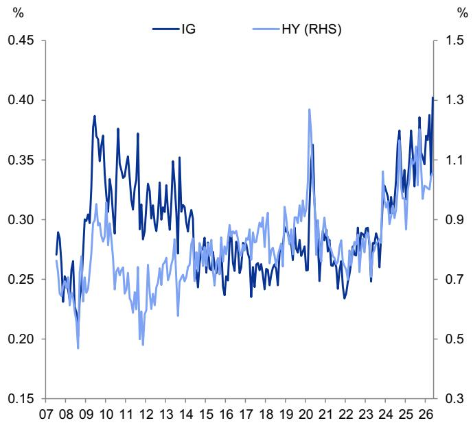

line

| Year | IG    | HY (RHS) |
|------|-------|----------|
| 07   | 0.28  | 0.7      |
| 08   | 0.25  | 0.6      |
| 09   | 0.38  | 0.9      |
| 10   | 0.35  | 0.8      |
| 11   | 0.37  | 0.7      |
| 12   | 0.30  | 0.6      |
| 13   | 0.35  | 0.7      |
| 14   | 0.32  | 0.8      |
| 15   | 0.28  | 0.9      |
| 16   | 0.26  | 0.8      |
| 17   | 0.27  | 0.9      |
| 18   | 0.29  | 1.0      |
| 19   | 0.30  | 1.1      |
| 20   | 0.36  | 1.3      |
| 21   | 0.28  | 1.1      |
| 22   | 0.24  | 1.0      |
| 23   | 0.29  | 1.1      |
| 24   | 0.34  | 1.2      |
| 25   | 0.37  | 1.3      |
| 26   | 0.40  | 1.4      |

Source: TRACE, Bloomberg, GS Global Investment Research

Exhibit 62: Primary dealer net positioning in USD corporate bonds   
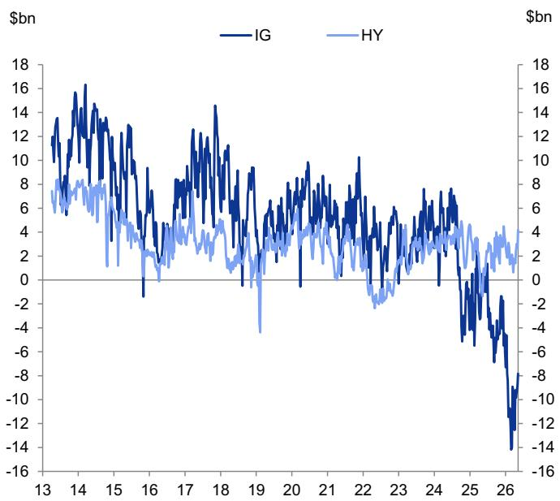

line

| Year | IG ($bn) | HY ($bn) |
|------|----------|----------|
| 13   | ~12      | ~7       |
| 14   | ~16      | ~8       |
| 15   | ~14      | ~6       |
| 16   | ~10      | ~4       |
| 17   | ~12      | ~3       |
| 18   | ~14      | ~2       |
| 19   | ~8       | ~-5      |
| 20   | ~6       | ~2       |
| 21   | ~8       | ~3       |
| 22   | ~10      | ~2       |
| 23   | ~6       | ~1       |
| 24   | ~8       | ~3       |
| 25   | ~4       | ~4       |
| 26   | ~-14     | ~-8      |

Source: FRBNY, GS Global Investment Research

Exhibit 63: Average IG bid-ask spread   
5-day moving average   
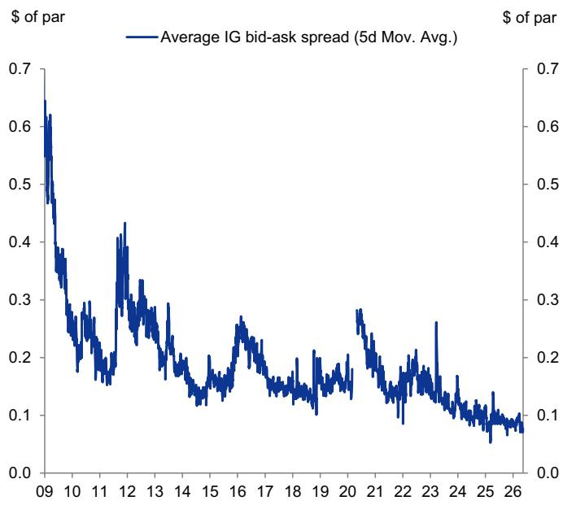

line

| Year | Average IG bid-ask spread ($ of par) |
| ---- | ------------------------------------ |
| 09   | 0.65                                 |
| 10   | 0.35                                 |
| 11   | 0.25                                 |
| 12   | 0.40                                 |
| 13   | 0.30                                 |
| 14   | 0.20                                 |
| 15   | 0.15                                 |
| 16   | 0.25                                 |
| 17   | 0.20                                 |
| 18   | 0.15                                 |
| 19   | 0.20                                 |
| 20   | 0.25                                 |
| 21   | 0.20                                 |
| 22   | 0.15                                 |
| 23   | 0.25                                 |
| 24   | 0.15                                 |
| 25   | 0.10                                 |
| 26   | 0.08                                 |

Note: March and April 2020 are omitted.

Exhibit 64: Amihud IG illiquidity measure   
5-day moving average   
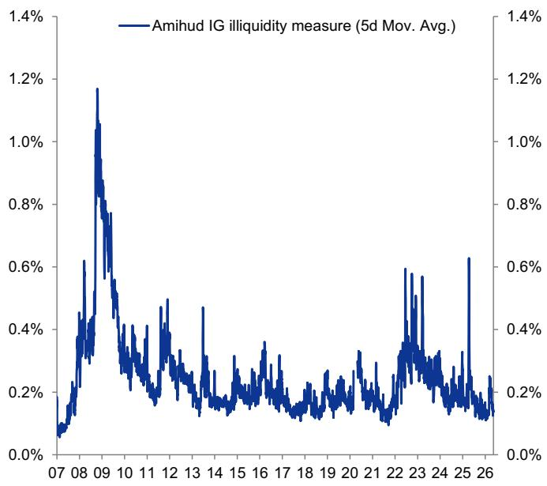

line

| Year | Amihud IG illiquidity measure (5d Mov. Avg.) |
|------|-----------------------------------------------|
| 07   | ~0.1%                                         |
| 08   | ~0.6%                                         |
| 09   | ~1.2%                                         |
| 10   | ~0.4%                                         |
| 11   | ~0.3%                                         |
| 12   | ~0.5%                                         |
| 13   | ~0.3%                                         |
| 14   | ~0.2%                                         |
| 15   | ~0.3%                                         |
| 16   | ~0.4%                                         |
| 17   | ~0.2%                                         |
| 18   | ~0.2%                                         |
| 19   | ~0.3%                                         |
| 20   | ~0.2%                                         |
| 21   | ~0.3%                                         |
| 22   | ~0.6%                                         |
| 23   | ~0.5%                                         |
| 24   | ~0.3%                                         |
| 25   | ~0.6%                                         |
| 26   | ~0.2%                                         |

Note: March and April 2020 are omitted.   
Source: Trace, Bloomberg, GS Global Investment Research   
Source: TRACE, Bloomberg, GS Global Investment Research

# Flow dashboard: Mutual fund and ETF AUM

Exhibit 65: AUM in USD IG-focused Mutual Funds and ETFs   
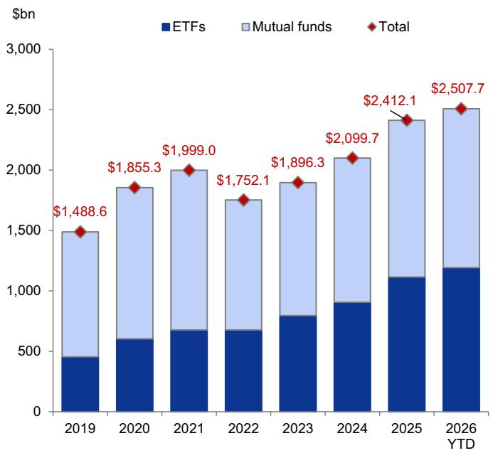

bar_stacked

| Year | ETFs ($bn) | Mutual funds ($bn) | Total ($bn) |
| :--- | :--- | :--- | :--- |
| 2019 | 450 | 850 | 1,488.6 |
| 2020 | 580 | 1070 | 1,855.3 |
| 2021 | 660 | 1130 | 1,999.0 |
| 2022 | 660 | 870 | 1,752.1 |
| 2023 | 770 | 930 | 1,896.3 |
| 2024 | 890 | 1030 | 2,099.7 |
| 2025 | 1110 | 1140 | 2,412.1 |
| 2026 YTD | 1180 | 1150 | 2,507.7 |

Source: EPFR, GS Global Investment Research

Exhibit 66: AUM in USD HY-focused Mutual Funds and ETFs   
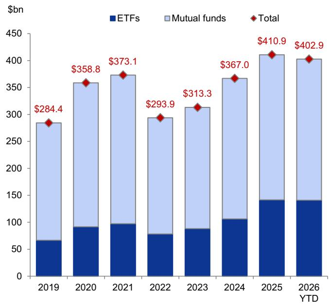

bar_stacked

| Year | ETFs ($bn) | Mutual funds ($bn) | Total ($bn) |
| :--- | :--- | :--- | :--- |
| 2019 | 65.0 | 200.0 | 284.4 |
| 2020 | 90.0 | 230.0 | 358.8 |
| 2021 | 95.0 | 240.0 | 373.1 |
| 2022 | 75.0 | 190.0 | 293.9 |
| 2023 | 85.0 | 210.0 | 313.3 |
| 2024 | 105.0 | 235.0 | 367.0 |
| 2025 | 140.0 | 270.0 | 410.9 |
| 2026 YTD | 140.0 | 265.0 | 402.9 |

Source: EPFR, GS Global Investment Research

Exhibit 67: AUM in EUR IG-focused Mutual Funds and ETFs   
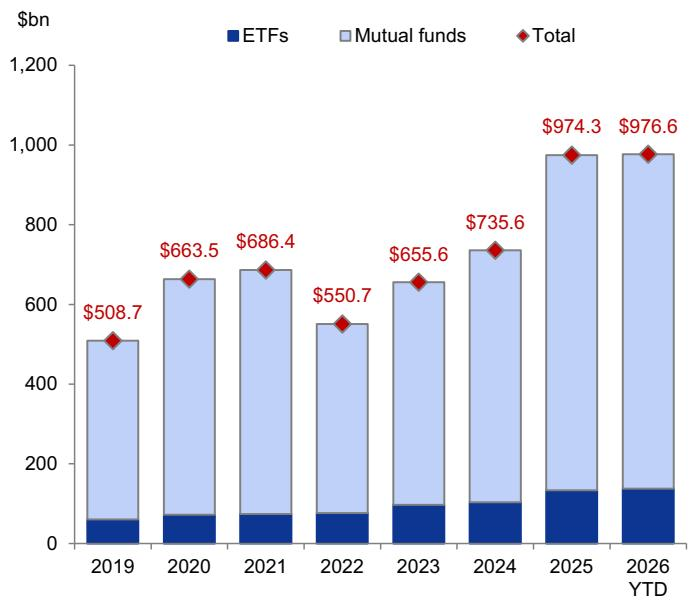

bar_stacked

| Year | ETFs ($bn) | Mutual funds ($bn) | Total ($bn) |
| :--- | :--- | :--- | :--- |
| 2019 | 60 | 480 | 508.7 |
| 2020 | 70 | 580 | 663.5 |
| 2021 | 70 | 610 | 686.4 |
| 2022 | 70 | 540 | 550.7 |
| 2023 | 90 | 580 | 655.6 |
| 2024 | 100 | 650 | 735.6 |
| 2025 | 130 | 880 | 974.3 |
| 2026 YTD | 135 | 890 | 976.6 |

Source: EPFR, GS Global Investment Research

Exhibit 68: AUM in EUR HY-focused Mutual Funds and ETFs   
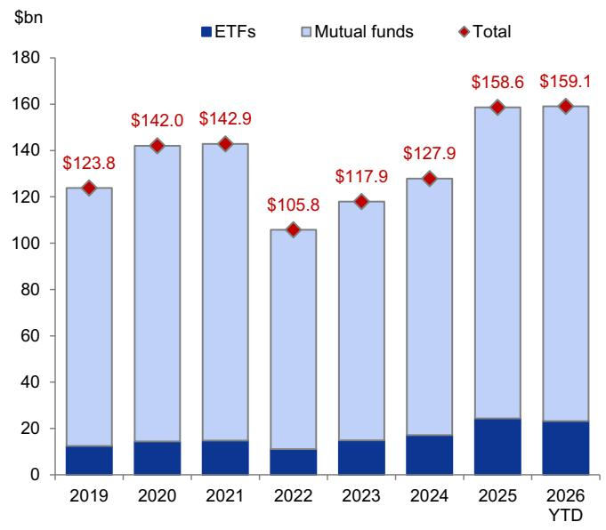

bar_stacked

| Year | ETFs ($bn) | Mutual funds ($bn) | Total ($bn) |
| :--- | :--- | :--- | :--- |
| 2019 | 12.0 | 84.5 | 123.8 |
| 2020 | 14.0 | 97.0 | 142.0 |
| 2021 | 14.0 | 97.0 | 142.9 |
| 2022 | 10.0 | 73.0 | 105.8 |
| 2023 | 15.0 | 83.0 | 117.9 |
| 2024 | 17.0 | 88.0 | 127.9 |
| 2025 | 24.0 | 113.0 | 158.6 |
| 2026 YTD | 23.0 | 115.0 | 159.1 |

Source: EPFR, GS Global Investment Research

# Flow dashboard: Mutual fund and ETF flows

Exhibit 69: Weekly mutual fund flows into US fixed income and equity markets   
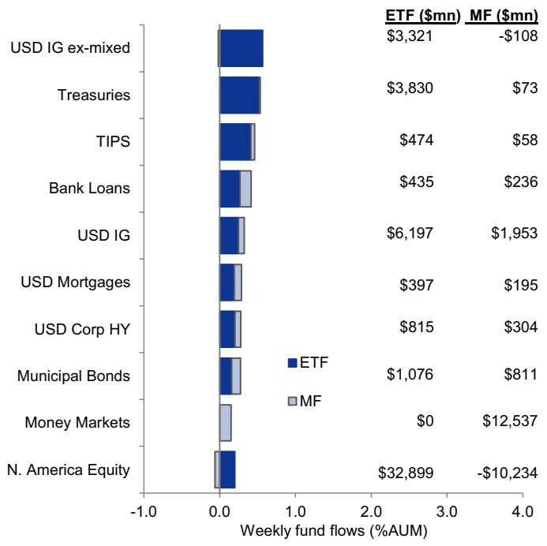

bar

| Category | ETF ($mn) | MF ($mn) |
| :--- | :--- | :--- |
| USD IG ex-mixed | 3,321 | -108 |
| Treasuries | 3,830 | 73 |
| TIPS | 474 | 58 |
| Bank Loans | 435 | 236 |
| USD IG | 6,197 | 1,953 |
| USD Mortgages | 397 | 195 |
| USD Corp HY | 815 | 304 |
| Municipal Bonds | 1,076 | 811 |
| Money Markets | 0 | 12,537 |
| N. America Equity | 32,899 | -10,234 |

Source: EPFR, GS Global Investment Research

Exhibit 70: Weekly mutual fund flows into European fixed income and equity markets   
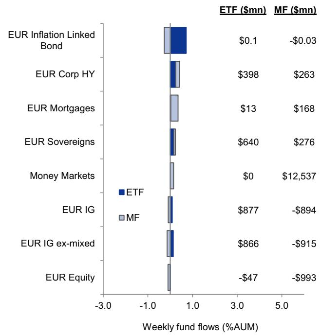

bar

| Category | ETF ($mn) | MF ($mn) |
| :--- | :--- | :--- |
| EUR Inflation Linked Bond | 0.1 | -0.03 |
| EUR Corp HY | 398 | 263 |
| EUR Mortgages | 13 | 168 |
| EUR Sovereigns | 640 | 276 |
| Money Markets | 0 | 12,537 |
| EUR IG | 877 | -894 |
| EUR IG ex-mixed | 866 | -915 |
| EUR Equity | -47 | -993 |

Source: EPFR, GS Global Investment Research

Exhibit 71: Year-to-date cumulative flows as a percentage of beginning of the year AUM for US credit funds   
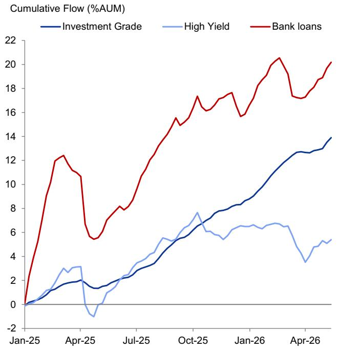

line

| Date   | Investment Grade | High Yield | Bank loans |
|--------|------------------|----------|------------|
| Jan-25 | 0.0              | 0.0      | 0.0        |
| Apr-25 | 2.0              | -1.0     | 12.0       |
| Jul-25 | 3.0              | 4.0      | 8.0        |
| Oct-25 | 6.0              | 7.0      | 17.0       |
| Jan-26 | 9.0              | 6.0      | 16.0       |
| Apr-26 | 13.0             | 5.0      | 20.0       |

Source: EPFR, GS Global Investment Research

Exhibit 72: Year-to-date cumulative flows as a percentage of beginning of the year AUM for European credit funds   
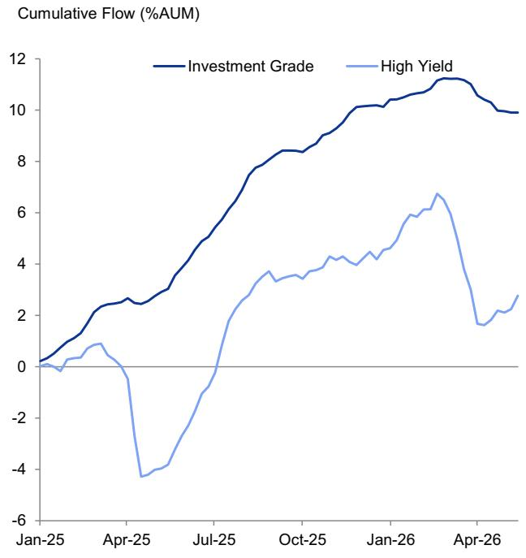

line

| Date   | Investment Grade | High Yield |
|--------|------------------|----------|
| Jan-25 | 0.0              | 0.0      |
| Apr-25 | 2.5              | -4.5     |
| Jul-25 | 5.0              | -1.0     |
| Oct-25 | 8.0              | 3.5      |
| Jan-26 | 10.0             | 5.0      |
| Apr-26 | 11.0             | 1.5      |

Source: EPFR, GS Global Investment Research

# Flow dashboard: Upcoming coupon and principal payments

Exhibit 73: Our estimates of upcoming coupon and principal payments in the USD IG market   
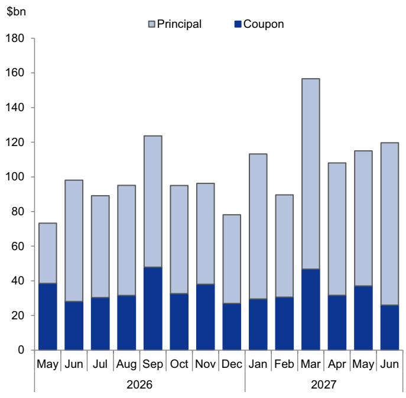

bar_stacked

| Month | 2026 ($bn) | 2027 ($bn) |
| :--- | :--- | :--- |
| May | 73 | 113 |
| Jun | 98 | 90 |
| Jul | 89 | 108 |
| Aug | 95 | 115 |
| Sep | 124 | 156 |
| Oct | 95 | 108 |
| Nov | 96 | 115 |
| Dec | 78 | 120 |
| Jan | 0 | 113 |
| Feb | 0 | 90 |
| Mar | 0 | 156 |
| Apr | 0 | 108 |
| May | 0 | 115 |
| Jun | 0 | 120 |
The chart displays stacked bars for 'Principal' and 'Coupon' categories, likely representing total revenue or sales for each month. The values are in $bn. There is no explicit label provided in the image.

Source: Bloomberg, GS Global Investment Research

Exhibit 74: Our estimates of upcoming coupon and principal payments in the USD HY market   
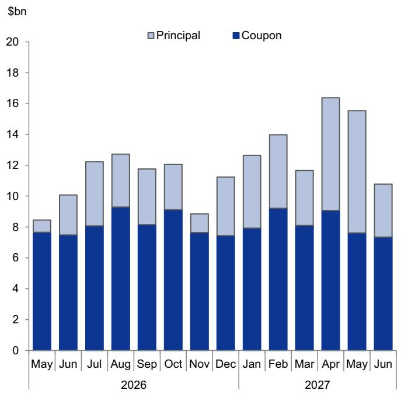

bar_stacked

| Month   | Principal | Coupon |
|---------|-----------|--------|
| May     | 0.5       | 7.5    |
| Jun     | 1.0       | 7.5    |
| Jul     | 3.0       | 8.0    |
| Aug     | 3.0       | 9.0    |
| Sep     | 3.0       | 8.0    |
| Oct     | 2.5       | 9.0    |
| Nov     | 1.0       | 7.5    |
| Dec     | 4.0       | 7.5    |
| Jan     | 4.5       | 8.0    |
| Feb     | 4.5       | 9.0    |
| Mar     | 3.5       | 8.0    |
| Apr     | 8.0       | 9.0    |
| May     | 7.5       | 7.5    |
| Jun     | 3.5       | 7.5    |

Source: Bloomberg, GS Global Investment Research

Exhibit 75: Our estimates of upcoming coupon and principal payments in the EUR IG market   
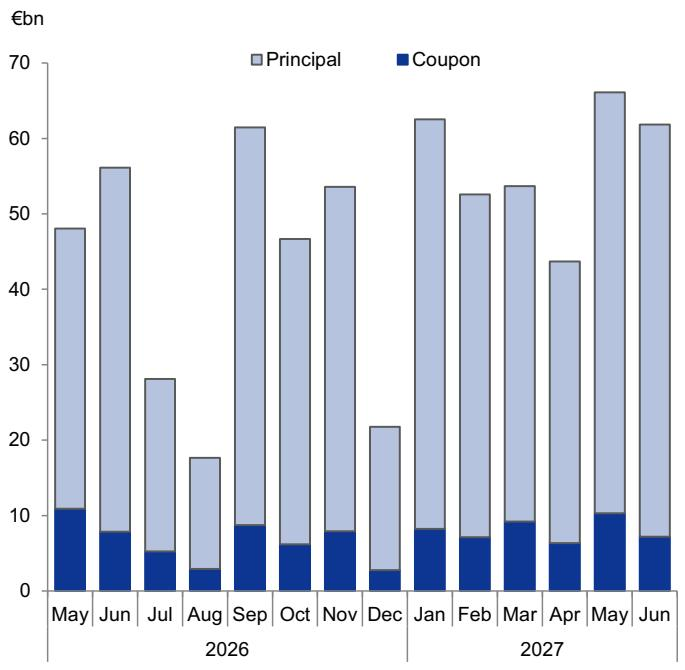  
Source: Bloomberg, GS Global Investment Research

Exhibit 76: Our estimates of upcoming coupon and principal payments in the EUR HY market   
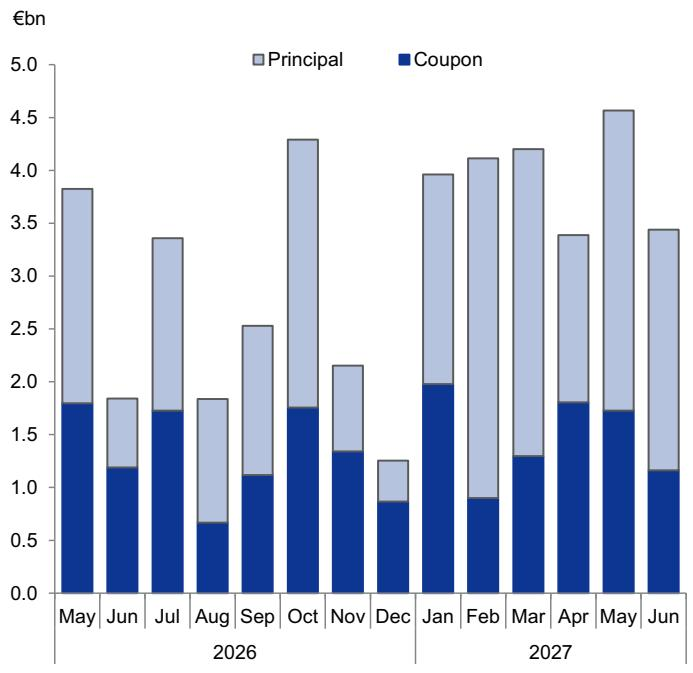

bar_stacked

| Month   | Principal | Coupon |
|---------|-----------|--------|
| May     | 3.8       | 1.8    |
| Jun     | 1.8       | 1.2    |
| Jul     | 3.4       | 1.7    |
| Aug     | 1.8       | 0.7    |
| Sep     | 2.5       | 1.1    |
| Oct     | 4.3       | 1.7    |
| Nov     | 2.1       | 1.3    |
| Dec     | 1.2       | 0.9    |
| Jan     | 3.9       | 2.0    |
| Feb     | 4.1       | 0.9    |
| Mar     | 4.2       | 1.3    |
| Apr     | 3.4       | 1.8    |
| May     | 4.6       | 1.7    |
| Jun     | 3.4       | 1.2    |

Source: Bloomberg, GS Global Investment Research

# Flow dashboard: Positioning in macro indices

Exhibit 77: Net notional positioning in the CDX IG 5-year on-the-run contract   
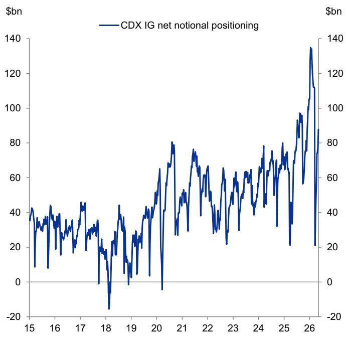

line

| Year | CDX IG net notional positioning ($bn) |
| ---- | ------------------------------------- |
| 15   | ~40                                   |
| 16   | ~35                                   |
| 17   | ~45                                   |
| 18   | ~-15                                  |
| 19   | ~30                                   |
| 20   | ~60                                   |
| 21   | ~80                                   |
| 22   | ~65                                   |
| 23   | ~50                                   |
| 24   | ~70                                   |
| 25   | ~90                                   |
| 26   | ~135                                  |

Source: DTCC, GS Global Investment Research

Exhibit 78: Net notional positioning in the CDX HY 5-year on-the-run contract   
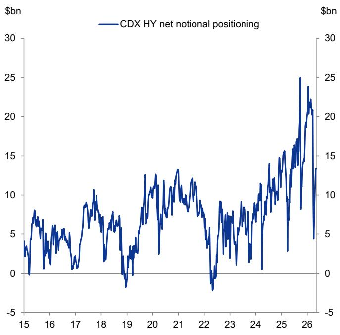

line

| Year | CDX HY net notional positioning ($bn) |
|------|----------------------------------------|
| 15   | ~3                                     |
| 16   | ~7                                     |
| 17   | ~4                                     |
| 18   | ~9                                     |
| 19   | ~2                                     |
| 20   | ~12                                    |
| 21   | ~13                                    |
| 22   | ~-2                                    |
| 23   | ~8                                     |
| 24   | ~10                                    |
| 25   | ~15                                    |
| 26   | ~25                                    |

Source: DTCC, GS Global Investment Research

Exhibit 79: Net notional positioning in the iTraxx Main 5-year on-the-run contract   
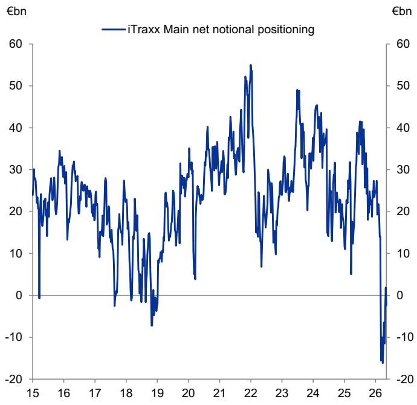

line

| Year | iTraxx Main net notional positioning (€bn) |
| ---- | ------------------------------------------ |
| 15   | 30                                         |
| 16   | 35                                         |
| 17   | 25                                         |
| 18   | 20                                         |
| 19   | -5                                         |
| 20   | 30                                         |
| 21   | 40                                         |
| 22   | 55                                         |
| 23   | 45                                         |
| 24   | 40                                         |
| 25   | 30                                         |
| 26   | -15                                        |

Source: DTCC, GS Global Investment Research

Exhibit 80: Net notional positioning in iTraxx over 5-year on-the-run contract   
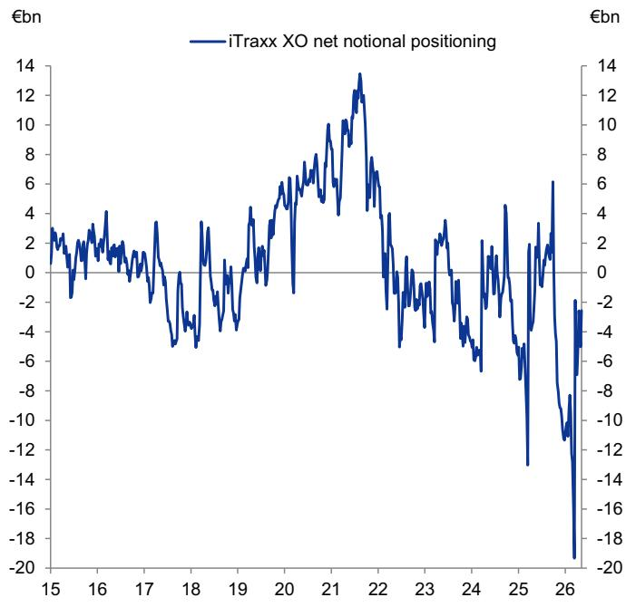

line

| Year | iTraxx XO net notional positioning (€bn) |
| ---- | ---------------------------------------- |
| 15   | ~2.5                                     |
| 16   | ~3.0                                     |
| 17   | ~1.5                                     |
| 18   | ~-4.0                                    |
| 19   | ~3.5                                     |
| 20   | ~6.0                                     |
| 21   | ~10.0                                    |
| 22   | ~13.0                                    |
| 23   | ~-2.0                                    |
| 24   | ~-6.0                                    |
| 25   | ~-12.0                                   |
| 26   | ~-18.0                                   |

Source: DTCC, GS Global Investment Research

# Flow dashboard: ECB QT

Exhibit 81: Ownership share of the ECB in the EUR IG market   

bar_stacked

| Year | CSPP Ineligible (€bn) | CSPP Eligible not held by ECB (€bn) | ECB CSPP and PEPP corporate holdings (€bn) |
|------|------------------------|-------------------------------------|---------------------------------------------|
| 2016 | ~2,500                 | ~700                                | ~0                                          |
| 2017 | ~2,600                 | ~750                                | ~100                                        |
| 2018 | ~2,700                 | ~800                                | ~150                                        |
| 2019 | ~2,900                 | ~850                                | ~150                                        |
| 2020 | ~3,100                 | ~900                                | ~200                                        |
| 2021 | ~3,200                 | ~950                                | ~250                                        |
| 2022 | ~3,300                 | ~1,000                              | ~300                                        |
| 2023 | ~3,400                 | ~1,050                              | ~350                                        |
| 2024 | ~3,500                 | ~1,100                              | ~350                                        |
| 2025 | ~3,600                 | ~1,150                              | ~350                                        |

Source: ECB, Bloomberg, GS Global Investment Research

Exhibit 82: Run-off projections for the ECB corporate bond holdings   
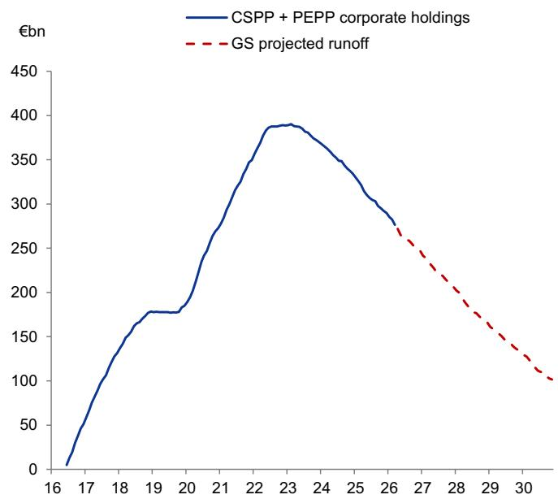

line

| Year | CSPP + PEPP corporate holdings (€bn) | GS projected runoff (€bn) |
|------|----------------------------------------|---------------------------|
| 16   | 0                                      | -                         |
| 17   | ~50                                    | -                         |
| 18   | ~120                                   | -                         |
| 19   | ~180                                   | -                         |
| 20   | ~180                                   | -                         |
| 21   | ~280                                   | -                         |
| 22   | ~380                                   | -                         |
| 23   | ~390                                   | -                         |
| 24   | ~370                                   | -                         |
| 25   | ~340                                   | -                         |
| 26   | ~280                                   | ~270                      |
| 27   | -                                      | ~240                      |
| 28   | -                                      | ~210                      |
| 29   | -                                      | ~180                      |
| 30   | -                                      | ~140                      |

Source: ECB, Bloomberg, GS Global Investment Research

Exhibit 83: CSPP monthly run-off pace   
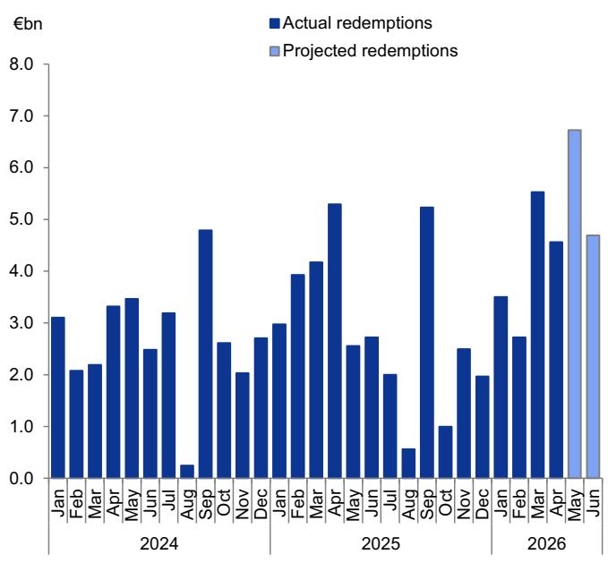

bar

| Month | Actual redemptions (€bn) | Projected redemptions (€bn) |
|---|---|---|
| Jan | 3.1 | |
| Feb | 2.1 | |
| Mar | 2.2 | |
| Apr | 3.3 | |
| May | 3.5 | |
| Jun | 2.5 | |
| Jul | 3.2 | |
| Aug | 0.3 | |
| Sep | 4.8 | |
| Oct | 2.6 | |
| Nov | 2.0 | |
| Dec | 2.7 | |
| Jan | 3.0 | |
| Feb | 3.9 | |
| Mar | 4.2 | |
| Apr | 5.3 | |
| May | 2.5 | |
| Jun | 2.7 | |
| Jul | 2.0 | |
| Aug | 0.6 | |
| Sep | 5.2 | |
| Oct | 1.0 | |
| Nov | 2.5 | |
| Dec | 2.0 | |
| Jan | 3.5 | |
| Feb | 2.7 | |
| Mar | 5.5 | |
| Apr | 4.6 | |
| May | 6.7 | |
| Jun | 4.7 | |

Source: ECB, GS Global Investment Research

Exhibit 84: Performance of CSPP-eligible bonds vs. non-eligible bonds   
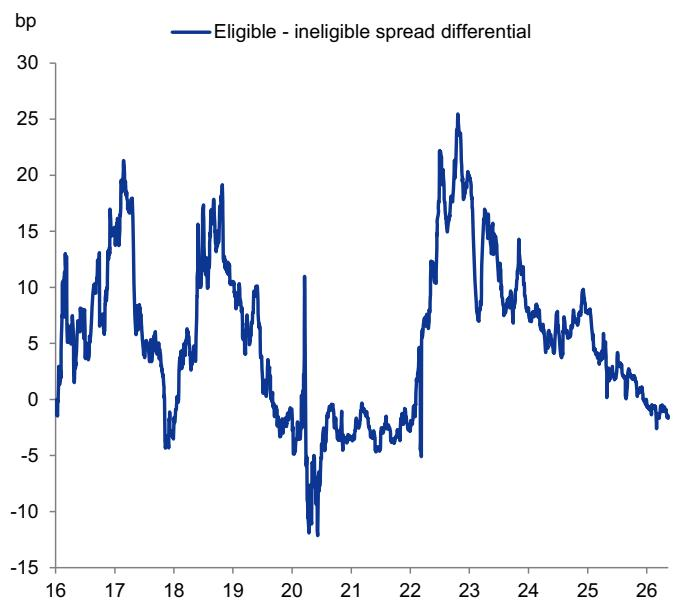

line

| Year | Eligible - ineligible spread differential (bp) |
| ---- | --------------------------------------------- |
| 16   | -1.0                                          |
| 17   | 21.0                                          |
| 18   | -4.0                                          |
| 19   | 19.0                                          |
| 20   | -12.0                                         |
| 21   | -3.0                                          |
| 22   | 25.0                                          |
| 23   | 10.0                                          |
| 24   | 8.0                                           |
| 25   | 10.0                                          |
| 26   | -2.0                                          |

Source: iBoxx, GS Global Investment Research

# Foreign demand and hedging cost

Exhibit 85: Net purchases of USD corporate bonds by foreign investors   
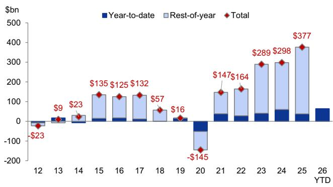

bar

| Year | Year-to-date | Rest-of-year | Total |
|------|--------------|--------------|-------|
| 12   | -            | -            | -$23  |
| 13   | -            | -            | $9    |
| 14   | -            | -            | $23   |
| 15   | -            | -            | $135  |
| 16   | -            | -            | $125  |
| 17   | -            | -            | $132  |
| 18   | -            | -            | $57   |
| 19   | -            | -            | $16   |
| 20   | -$145        | -            | -$145 |
| 21   | -            | -            | $147  |
| 22   | -            | -            | $164  |
| 23   | -            | -            | $289  |
| 24   | -            | -            | $298  |
| 25   | -            | -            | $377  |
| 26   | -            | -            | -     |

Note: As of February 2026.   
Source: Department of Treasury, GS Global Investment Research

Exhibit 86: Cumulative net foreign purchases of USD and EUR bonds by Japanese investors   
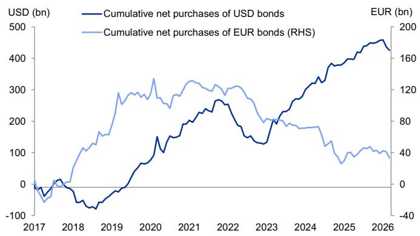

line

| Year | Cumulative net purchases of USD bonds (USD bn) | Cumulative net purchases of EUR bonds (EUR bn) |
|------|--------------------------------------------------|--------------------------------------------------|
| 2017 | -50                                              | -30                                              |
| 2018 | -100                                             | 100                                              |
| 2019 | 0                                                | 300                                              |
| 2020 | 150                                              | 120                                              |
| 2021 | 250                                              | 130                                              |
| 2022 | 200                                              | 110                                              |
| 2023 | 150                                              | 80                                               |
| 2024 | 300                                              | 60                                               |
| 2025 | 400                                              | 40                                               |
| 2026 | 450                                              | 30                                               |

Note: As of February 2026.   
Source: Bank of Japan, Haver Analytics, GS Global Investment Research

Exhibit 87: Annualized 3-month rolling cost of USD hedging against EUR, GBP and JPY   
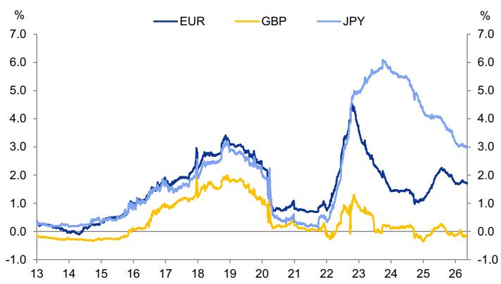

line

| Year | EUR  | GBP  | JPY  |
|------|------|------|------|
| 13   | 0.0  | -0.5 | 0.0  |
| 14   | 0.0  | -0.5 | 0.0  |
| 15   | 0.0  | -0.5 | 0.0  |
| 16   | 0.0  | -0.5 | 0.0  |
| 17   | 1.0  | 0.0  | 1.0  |
| 18   | 2.0  | 1.0  | 2.0  |
| 19   | 3.0  | 1.5  | 3.0  |
| 20   | 2.0  | 0.5  | 2.0  |
| 21   | 1.0  | 0.0  | 1.0  |
| 22   | 1.5  | -0.5 | 1.5  |
| 23   | 4.5  | 1.0  | 5.0  |
| 24   | 2.0  | -0.5 | 6.0  |
| 25   | 1.5  | -0.5 | 4.0  |
| 26   | 2.0  | -0.5 | 3.0  |

Source: GS FICC and Equities, GS Global Investment Research

# Primary market dashboard: USD gross issuance

# Exhibit 88: USD IG gross issuance

Historical investment grade issuance: Same period year to date vs. rest of the year

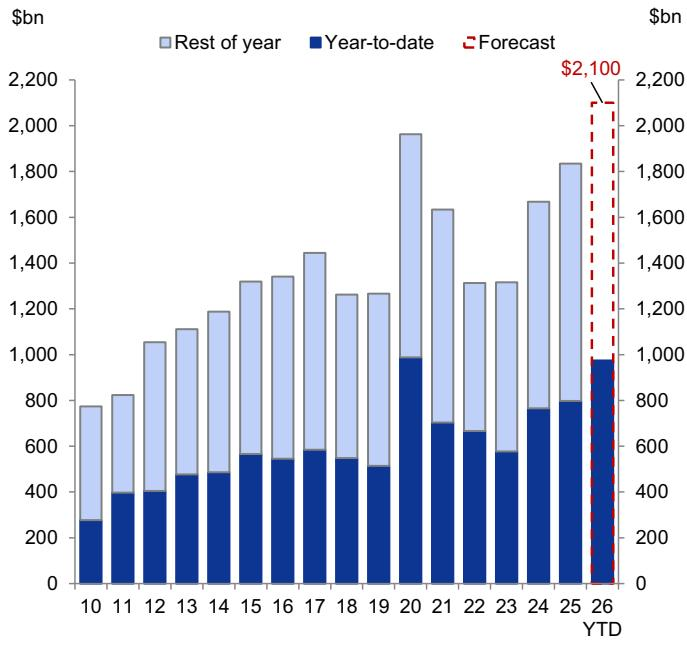

bar

| Year | Rest of year ($bn) | Year-to-date ($bn) | Forecast ($bn) |
|------|---------------------|--------------------|----------------|
| 10   | 750                 | 250                | -              |
| 11   | 800                 | 350                | -              |
| 12   | 900                 | 400                | -              |
| 13   | 950                 | 450                | -              |
| 14   | 1000                | 450                | -              |
| 15   | 1100                | 550                | -              |
| 16   | 1150                | 550                | -              |
| 17   | 1200                | 550                | -              |
| 18   | 1150                | 550                | -              |
| 19   | 1150                | 500                | -              |
| 20   | 1300                | 700                | -              |
| 21   | 1250                | 650                | -              |
| 22   | 1200                | 600                | -              |
| 23   | 1200                | 550                | -              |
| 24   | 1250                | 750                | -              |
| 25   | 1300                | 800                | -              |
| 26   | -                   | 950                | $2,100         |

Source: Dealogic, GS Global Investment Research

# Exhibit 89: USD HY gross issuance

Historical USD high yield issuance: Same period year to date vs. rest of the year

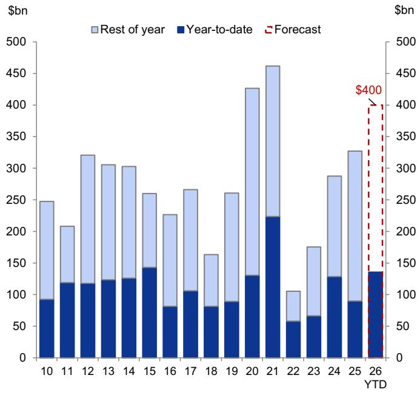

bar

| Year | Rest of year ($bn) | Year-to-date ($bn) | Forecast ($bn) |
|------|---------------------|---------------------|----------------|
| 10   | 180                 | 90                  | -              |
| 11   | 130                 | 115                 | -              |
| 12   | 270                 | 115                 | -              |
| 13   | 220                 | 120                 | -              |
| 14   | 210                 | 125                 | -              |
| 15   | 160                 | 145                 | -              |
| 16   | 180                 | 80                  | -              |
| 17   | 200                 | 105                 | -              |
| 18   | 160                 | 80                  | -              |
| 19   | 220                 | 90                  | -              |
| 20   | 300                 | 130                 | -              |
| 21   | 250                 | 225                 | -              |
| 22   | 100                 | 55                  | -              |
| 23   | 160                 | 65                  | -              |
| 24   | 200                 | 125                 | -              |
| 25   | 230                 | 90                  | -              |
| 26   | -                   | 135                 | $400           |

Source: Dealogic, GS Global Investment Research

Exhibit 90: USD institutional leveraged loan gross issuance
Historical leveraged loan issuance: Same period year to date vs. rest of the year   
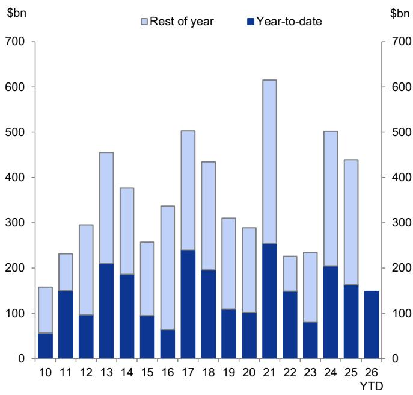

bar_stacked

| Year | Rest of year ($bn) | Year-to-date ($bn) |
| :--- | :--- | :--- |
| 10 | 155 | 55 |
| 11 | 230 | 148 |
| 12 | 295 | 97 |
| 13 | 355 | 208 |
| 14 | 378 | 184 |
| 15 | 257 | 94 |
| 16 | 336 | 63 |
| 17 | 498 | 236 |
| 18 | 433 | 194 |
| 19 | 309 | 109 |
| 20 | 289 | 102 |
| 21 | 615 | 252 |
| 22 | 224 | 147 |
| 23 | 234 | 79 |
| 24 | 499 | 203 |
| 25 | 438 | 163 |
| 26 | - | 149 |

Source: Pitchbook LCD, GS Global Investment Research

# Exhibit 91: USD CLO creation

Historical USD CLO creation: Same period year to date vs. rest of the year

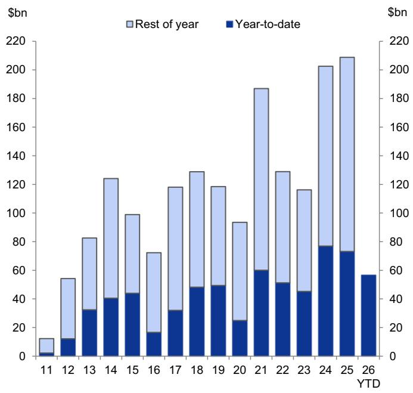

bar_stacked

| Year | Rest of year ($bn) | Year-to-date ($bn) |
| :--- | :--- | :--- |
| 11 | 10 | 5 |
| 12 | 48 | 13 |
| 13 | 57 | 33 |
| 14 | 90 | 41 |
| 15 | 64 | 44 |
| 16 | 50 | 17 |
| 17 | 98 | 32 |
| 18 | 99 | 48 |
| 19 | 87 | 49 |
| 20 | 73 | 25 |
| 21 | 135 | 60 |
| 22 | 80 | 52 |
| 23 | 76 | 45 |
| 24 | 108 | 77 |
| 25 | 120 | 73 |
| 26 | 0 | 57 |

Source: Pitchbook LCD, GS Global Investment Research

# Primary market dashboard: EUR gross issuance

# Exhibit 92: EUR IG gross issuance

Historical EUR investment grade issuance: Same period year to date vs. rest of the year

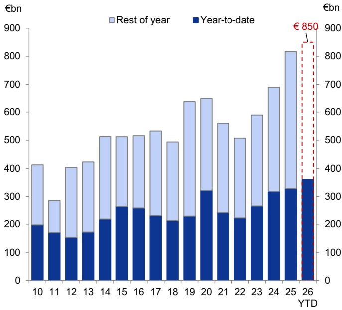

bar_stacked

| Year | Rest of year (€bn) | Year-to-date (€bn) |
| :--- | :--- | :--- |
| 10 | 270 | 195 |
| 11 | 160 | 170 |
| 12 | 300 | 150 |
| 13 | 340 | 170 |
| 14 | 350 | 215 |
| 15 | 320 | 265 |
| 16 | 320 | 255 |
| 17 | 340 | 225 |
| 18 | 320 | 210 |
| 19 | 440 | 225 |
| 20 | 380 | 320 |
| 21 | 360 | 240 |
| 22 | 320 | 215 |
| 23 | 380 | 265 |
| 24 | 440 | 315 |
| 25 | 540 | 325 |
| YTD | - | - |
€ 850

Source: Dealogic, GS Global Investment Research

# Exhibit 94: EUR Leveraged loan gross issuance

Historical EUR leveraged loan issuance: Same period year to date vs. rest of the year

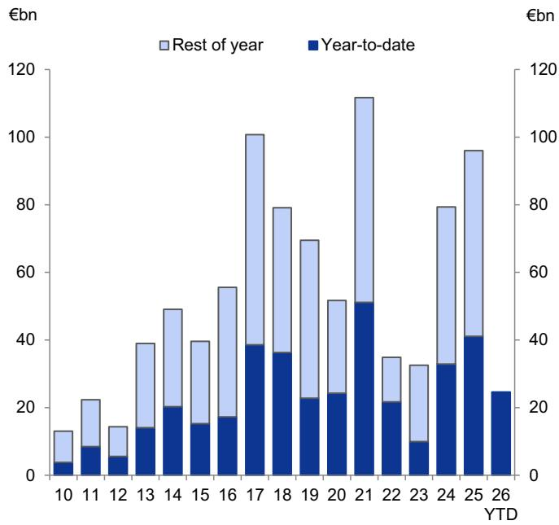

bar_stacked

| Year | Rest of year (€bn) | Year-to-date (€bn) |
| :--- | :--- | :--- |
| 10 | 12 | 4 |
| 11 | 18 | 8 |
| 12 | 13 | 5 |
| 13 | 30 | 14 |
| 14 | 35 | 20 |
| 15 | 39 | 15 |
| 16 | 47 | 17 |
| 17 | 72 | 39 |
| 18 | 55 | 36 |
| 19 | 65 | 23 |
| 20 | 38 | 24 |
| 21 | 65 | 51 |
| 22 | 20 | 21 |
| 23 | 28 | 9 |
| 24 | 55 | 33 |
| 25 | 50 | 41 |
| 26 | 0 | 24 |

Source: Pitchbook LCD, GS Global Investment Research

# Exhibit 93: EUR HY gross issuance

Historical EUR high yield issuance: Same period year to date vs. rest of the year

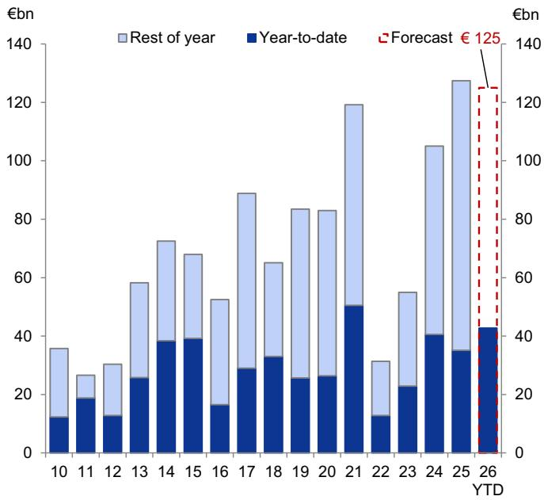

bar

| YTD | Rest of year (€bn) | Year-to-date (€bn) | Forecast (€bn) |
|-----|---------------------|--------------------|----------------|
| 10  | 35                  | 12                 | -              |
| 11  | 25                  | 18                 | -              |
| 12  | 30                  | 13                 | -              |
| 13  | 40                  | 25                 | -              |
| 14  | 45                  | 38                 | -              |
| 15  | 40                  | 39                 | -              |
| 16  | 45                  | 17                 | -              |
| 17  | 60                  | 28                 | -              |
| 18  | 45                  | 33                 | -              |
| 19  | 65                  | 25                 | -              |
| 20  | 60                  | 26                 | -              |
| 21  | 70                  | 50                 | -              |
| 22  | 30                  | 13                 | -              |
| 23  | 40                  | 22                 | -              |
| 24  | 60                  | 40                 | -              |
| 25  | 80                  | 35                 | -              |
| 26  | -                   | 43                 | €125           |

Source: Dealogic, GS Global Investment Research

# Exhibit 95: EUR CLO creation

Historical EUR CLO creation broken: Same period year to date vs. rest of the year

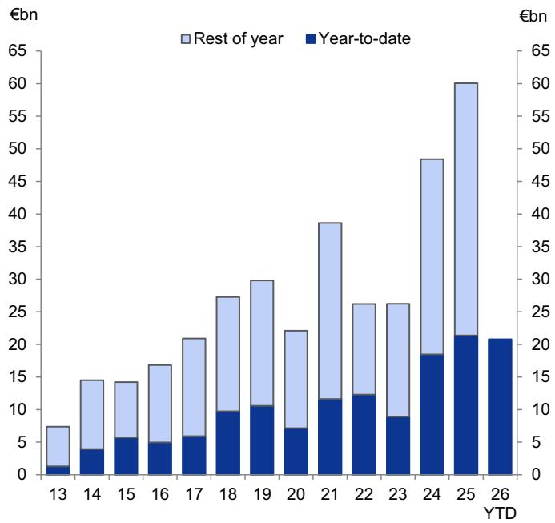

bar_stacked

| Year | Rest of year (€bn) | Year-to-date (€bn) |
| :--- | :--- | :--- |
| 13 | 7 | 1 |
| 14 | 14 | 4 |
| 15 | 14 | 6 |
| 16 | 17 | 5 |
| 17 | 21 | 6 |
| 18 | 27 | 10 |
| 19 | 30 | 11 |
| 20 | 22 | 7 |
| 21 | 39 | 12 |
| 22 | 26 | 12 |
| 23 | 26 | 9 |
| 24 | 48 | 18 |
| 25 | 60 | 21 |
| 26 | - | 21 |

Source: Pitchbook LCD, GS Global Investment Research

# Primary market dashboard: Use of proceeds

Exhibit 96: Annual USD IG issuance volumes by use of proceeds   
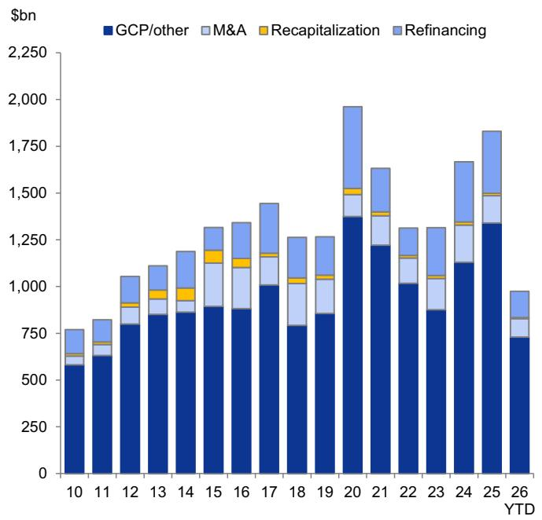

bar_stacked

| Year | GCP/other ($bn) | M&A ($bn) | Recapitalization ($bn) | Refinancing ($bn) |
| :--- | :--- | :--- | :--- | :--- |
| 10 | 570 | 40 | 30 | 180 |
| 11 | 620 | 45 | 35 | 190 |
| 12 | 780 | 80 | 40 | 200 |
| 13 | 840 | 85 | 60 | 220 |
| 14 | 860 | 85 | 70 | 250 |
| 15 | 890 | 110 | 80 | 230 |
| 16 | 880 | 230 | 70 | 260 |
| 17 | 1000 | 130 | 40 | 350 |
| 18 | 780 | 230 | 50 | 350 |
| 19 | 860 | 230 | 40 | 350 |
| 20 | 1380 | 130 | 60 | 490 |
| 21 | 1230 | 150 | 60 | 370 |
| 22 | 1010 | 130 | 40 | 220 |
| 23 | 870 | 210 | 30 | 350 |
| 24 | 1130 | 190 | 40 | 390 |
| 25 | 1350 | 150 | 40 | 360 |
| 26 | 730 | 85 | 25 | 220 |

Source: Dealogic, GS Global Investment Research

Exhibit 97: USD HY issuance volumes by use of proceeds   
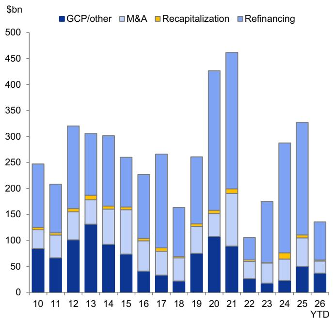

bar_stacked

| Year | GCP/other ($bn) | M&A ($bn) | Recapitalization ($bn) | Refinancing ($bn) |
| :--- | :--- | :--- | :--- | :--- |
| 10 | 83 | 27 | 5 | 149 |
| 11 | 65 | 42 | 5 | 115 |
| 12 | 100 | 48 | 5 | 173 |
| 13 | 130 | 45 | 10 | 145 |
| 14 | 92 | 60 | 5 | 153 |
| 15 | 73 | 78 | 5 | 129 |
| 16 | 42 | 60 | 5 | 138 |
| 17 | 33 | 48 | 5 | 168 |
| 18 | 21 | 40 | 5 | 139 |
| 19 | 74 | 43 | 5 | 150 |
| 20 | 107 | 38 | 5 | 272 |
| 21 | 89 | 84 | 10 | 299 |
| 22 | 26 | 38 | 5 | 47 |
| 23 | 17 | 38 | 0 | 173 |
| 24 | 23 | 38 | 10 | 239 |
| 25 | 50 | 50 | 5 | 269 |
| 26 | 38 | 15 | 0 | 96 |

Source: Dealogic, GS Global Investment Research

Exhibit 98: EUR IG issuance volumes by use of proceeds   
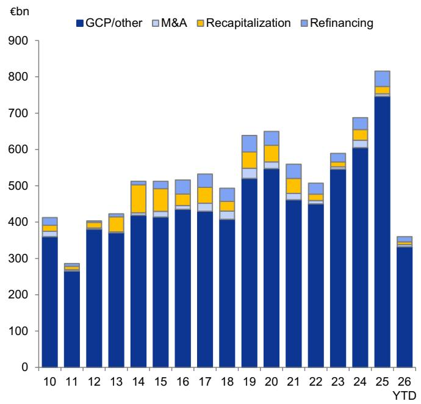

bar_stacked

| Year | GCP/other (€bn) | M&A (€bn) | Recapitalization (€bn) | Refinancing (€bn) |
| :--- | :--- | :--- | :--- | :--- |
| 10 | 358 | 14 | 30 | 20 |
| 11 | 260 | 10 | 20 | 0 |
| 12 | 378 | 10 | 30 | 0 |
| 13 | 368 | 10 | 50 | 10 |
| 14 | 415 | 10 | 90 | 10 |
| 15 | 410 | 10 | 85 | 20 |
| 16 | 435 | 15 | 50 | 30 |
| 17 | 425 | 20 | 60 | 35 |
| 18 | 405 | 20 | 40 | 45 |
| 19 | 515 | 30 | 65 | 50 |
| 20 | 550 | 20 | 65 | 45 |
| 21 | 460 | 15 | 55 | 45 |
| 22 | 445 | 10 | 35 | 35 |
| 23 | 545 | 10 | 25 | 30 |
| 24 | 600 | 20 | 40 | 35 |
| 25 | 740 | 10 | 35 | 45 |
| 26 | 325 | 10 | 15 | 15 |

Source: Dealogic, GS Global Investment Research

Exhibit 99: EUR HY issuance volumes by use of proceeds   
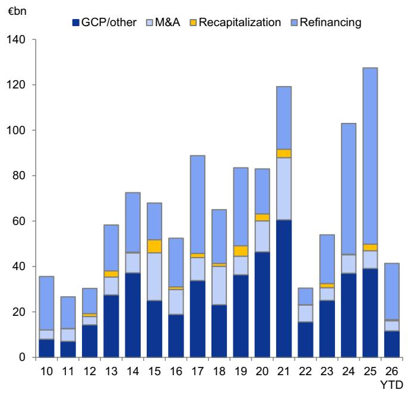

bar_stacked

| Year | GCP/other (€bn) | M&A (€bn) | Recapitalization (€bn) | Refinancing (€bn) |
| :--- | :--- | :--- | :--- | :--- |
| 10 | 8 | 5 | 0 | 34 |
| 11 | 7 | 7 | 0 | 26 |
| 12 | 14 | 3 | 2 | 19 |
| 13 | 27 | 10 | 5 | 28 |
| 14 | 37 | 10 | 0 | 33 |
| 15 | 25 | 25 | 8 | 23 |
| 16 | 19 | 13 | 5 | 33 |
| 17 | 33 | 12 | 4 | 54 |
| 18 | 23 | 25 | 2 | 37 |
| 19 | 36 | 10 | 7 | 44 |
| 20 | 46 | 15 | 5 | 30 |
| 21 | 60 | 28 | 6 | 38 |
| 22 | 16 | 10 | 0 | 14 |
| 23 | 25 | 6 | 3 | 30 |
| 24 | 37 | 8 | 0 | 60 |
| 25 | 39 | 8 | 5 | 75 |
| 26 | 12 | 5 | 0 | 39 |

Source: Dealogic, GS Global Investment Research

# Primary market dashboard: Net issuance

Note: Decomposition of the change in par value outstanding into net ratings migration vs. "organic" net issuance (gross issuance minus redemptions/matured bonds)

Exhibit 100: Annual USD IG net issuance   
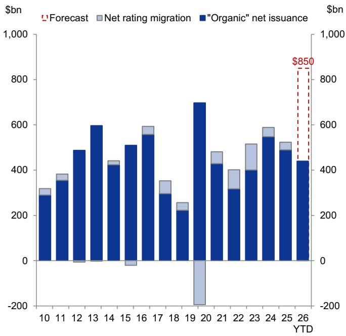

bar

| Year | Organic | Net rating migration | Forecast |
|------|---------|----------------------|----------|
| 10   | 300     | 50                   |          |
| 11   | 350     | 50                   |          |
| 12   | 480     | 0                    |          |
| 13   | 600     | 0                    |          |
| 14   | 420     | 20                   |          |
| 15   | 500     | -50                  |          |
| 16   | 550     | 50                   |          |
| 17   | 300     | 50                   |          |
| 18   | 220     | 50                   |          |
| 19   | 700     | -150                 |          |
| 20   | 420     | 50                   |          |
| 21   | 320     | 50                   |          |
| 22   | 400     | 50                   |          |
| 23   | 400     | 100                  |          |
| 24   | 550     | 50                   |          |
| 25   | 480     | 50                   |          |
| 26   | 430     | 0                    | $850     |

Source: Bloomberg, GS Global Investment Research

Exhibit 101: Annual USD HY net issuance   
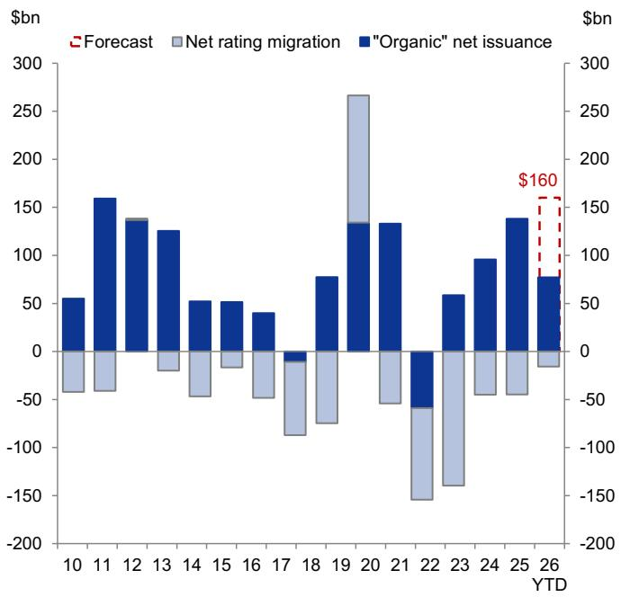

bar

| YTD | Forecast | Net rating migration | "Organic" net issuance |
| --- | --- | --- | --- |
| 10 | - | -40 | 55 |
| 11 | - | -45 | 160 |
| 12 | - | - | 135 |
| 13 | - | -25 | 125 |
| 14 | - | -45 | 50 |
| 15 | - | -20 | 50 |
| 16 | - | -45 | 40 |
| 17 | - | -80 | -10 |
| 18 | - | -70 | 75 |
| 19 | - | 270 | 130 |
| 20 | - | 20 | 130 |
| 21 | - | -50 | 0 |
| 22 | - | -150 | -50 |
| 23 | - | -130 | 55 |
| 24 | - | -40 | 95 |
| 25 | - | -40 | 140 |
| 26 | $160 | -10 | 75 |

Source: Bloomberg, GS Global Investment Research

Exhibit 102: Annual EUR IG net issuance   
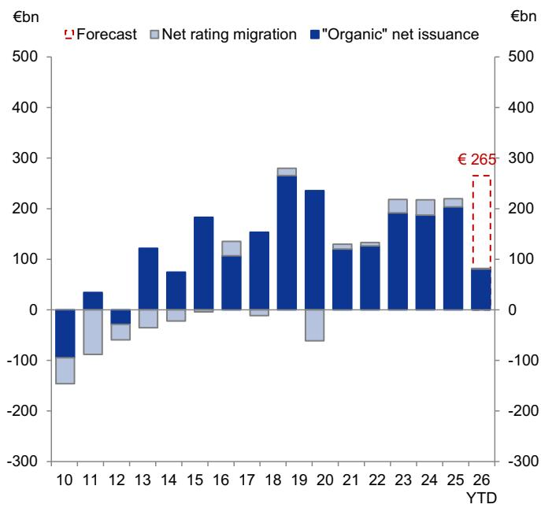

bar

| YTD | Forecast (€bn) | Net rating migration (€bn) | "Organic" net issuance (€bn) |
|-----|-----------------|----------------------------|------------------------------|
| 10  | -               | -150                       | -100                         |
| 11  | -               | -80                        | 30                           |
| 12  | -               | -40                        | -20                          |
| 13  | -               | -20                        | 120                          |
| 14  | -               | -10                        | 70                           |
| 15  | -               | -5                         | 180                          |
| 16  | -               | 0                          | 100                          |
| 17  | -               | -10                        | 150                          |
| 18  | -               | -5                         | 270                          |
| 19  | -               | -50                        | 230                          |
| 20  | -               | -50                        | 120                          |
| 21  | -               | -5                         | 120                          |
| 22  | -               | -5                         | 130                          |
| 23  | -               | 0                          | 190                          |
| 24  | -               | 0                          | 190                          |
| 25  | -               | 0                          | 200                          |
| 26  | €265            | -                          | 80                           |

Source: Bloomberg, GS Global Investment Research

Exhibit 103: Annual EUR HY net issuance   
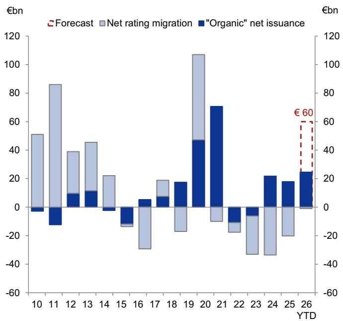

bar

| YTD | Forecast (€bn) | Net rating migration (€bn) | "Organic" net issuance (€bn) |
|-----|-----------------|----------------------------|------------------------------|
| 10  | -               | 50                         | -                            |
| 11  | -               | 85                         | -10                          |
| 12  | -               | 38                         | 10                           |
| 13  | -               | 45                         | 12                           |
| 14  | -               | 22                         | -                            |
| 15  | -               | -15                        | -10                          |
| 16  | -               | -28                        | 5                            |
| 17  | -               | 18                         | 8                            |
| 18  | -               | -18                        | 18                           |
| 19  | -               | -                          | 45                           |
| 20  | -               | -                          | 70                           |
| 21  | -               | -                          | -                            |
| 22  | -               | -20                        | -10                          |
| 23  | -               | -30                        | -10                          |
| 24  | -               | -30                        | 20                           |
| 25  | -               | -20                        | 18                           |
| 26  | €60             | -                          | 25                           |

Source: Bloomberg, GS Global Investment Research

# M&A volume

Exhibit 104: Annual US M&A deal volume   
Includes strategic and sponsored deals   
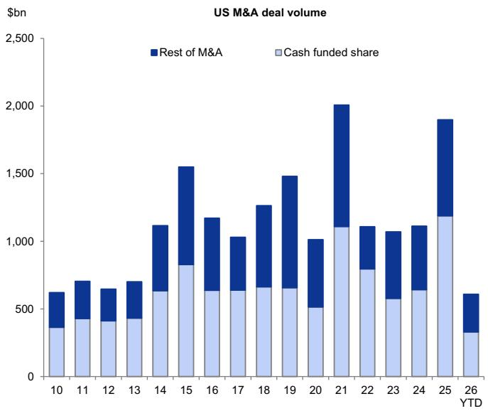

bar_stacked

US M&A deal volume
| Year | Cash funded share ($bn) | Rest of M&A ($bn) |
| :--- | :--- | :--- |
| 10 | 350 | 400 |
| 11 | 420 | 480 |
| 12 | 400 | 450 |
| 13 | 430 | 470 |
| 14 | 620 | 680 |
| 15 | 820 | 980 |
| 16 | 630 | 850 |
| 17 | 630 | 650 |
| 18 | 650 | 880 |
| 19 | 650 | 1050 |
| 20 | 500 | 750 |
| 21 | 1100 | 1150 |
| 22 | 780 | 520 |
| 23 | 570 | 720 |
| 24 | 630 | 750 |
| 25 | 1180 | 980 |
| 26 YTD | 320 | 450 |

Source: Dealogic, GS Global Investment Research

Exhibit 105: Annual European M&A deal volume   
Includes strategic and sponsored deals   
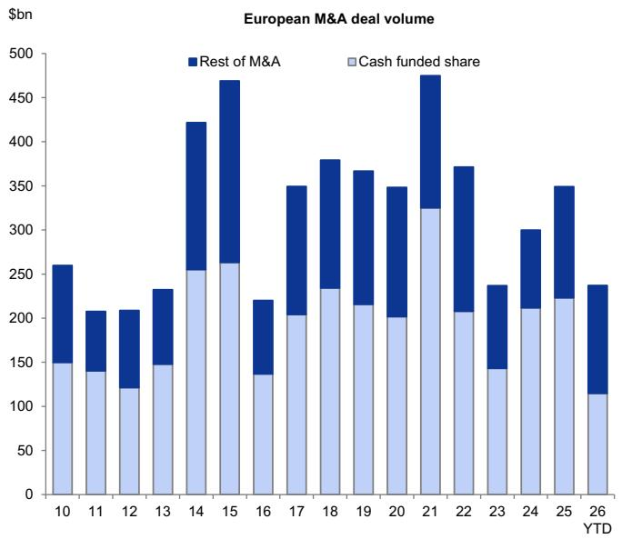

bar_stacked

European M&A deal volume
| Year | Cash funded share ($bn) | Rest of M&A ($bn) |
| :--- | :--- | :--- |
| 10 | 148 | 157 |
| 11 | 139 | 109 |
| 12 | 118 | 113 |
| 13 | 146 | 132 |
| 14 | 254 | 229 |
| 15 | 262 | 260 |
| 16 | 135 | 123 |
| 17 | 202 | 230 |
| 18 | 234 | 245 |
| 19 | 213 | 245 |
| 20 | 200 | 235 |
| 21 | 323 | 274 |
| 22 | 206 | 245 |
| 23 | 142 | 140 |
| 24 | 210 | 145 |
| 25 | 223 | 170 |
| 26 | 112 | 170 |

Source: Pitchbook LCD, GS Global Investment Research

Exhibit 106: Year-to-date US M&A volume by sector   
Includes strategic and sponsored deals   
US year-to-date M&A volume by industry (\$bn)   
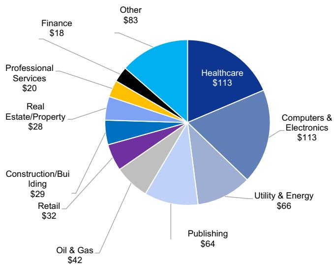

pie

| Category | Value ($) |
|---|---|
| Healthcare | 113 |
| Computers & Electronics | 113 |
| Utility & Energy | 66 |
| Publishing | 64 |
| Oil & Gas | 42 |
| Retail | 32 |
| Construction/Building | 29 |
| Real Estate/Property | 28 |
| Professional Services | 20 |
| Finance | 18 |
| Other | 83 |

Source: Dealogic, GS Global Investment Research

Exhibit 107: Year-to-date European M&A volume by sector   
Includes strategic and sponsored deals   
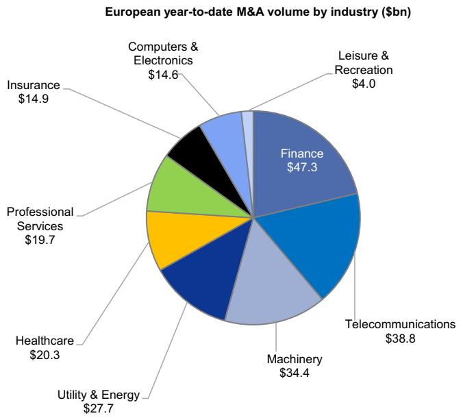

pie

European year-to-date M&A volume by industry ($bn)
| Industry | M&A Volume ($bn) |
| :--- | :--- |
| Finance | 47.3 |
| Telecommunications | 38.8 |
| Machinery | 34.4 |
| Utility & Energy | 27.7 |
| Healthcare | 20.3 |
| Professional Services | 19.7 |
| Insurance | 14.9 |
| Computers & Electronics | 14.6 |
| Leisure & Recreation | 4.0 |

Source: Dealogic, GS Global Investment Research

# M&A volume (Strategic deals only)

Exhibit 108: Annual US strategic M&A volumes   
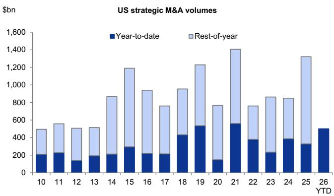

bar_stacked

US strategic M&A volumes
| Year | Year-to-date ($bn) | Rest-of-year ($bn) |
| :--- | :--- | :--- |
| 10 | 200 | 350 |
| 11 | 220 | 400 |
| 12 | 150 | 450 |
| 13 | 190 | 380 |
| 14 | 210 | 750 |
| 15 | 290 | 950 |
| 16 | 220 | 850 |
| 17 | 210 | 550 |
| 18 | 420 | 550 |
| 19 | 530 | 650 |
| 20 | 150 | 650 |
| 21 | 560 | 850 |
| 22 | 370 | 400 |
| 23 | 230 | 650 |
| 24 | 380 | 480 |
| 25 | 320 | 950 |
| 26 YTD | 500 | - |
The chart displays stacked bars for each year's total volume ($bn). The legend indicates 'Year-to-date' (dark blue) and 'Rest-of-year' (light blue).

Source: Dealogic, GS Global Investment Research

Exhibit 109: Annual European strategic M&A volumes   
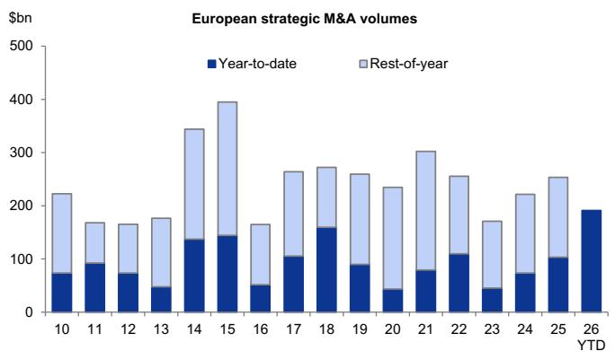

bar_stacked

European strategic M&A volumes
| Year | Year-to-date ($bn) | Rest-of-year ($bn) |
| :--- | :--- | :--- |
| 10 | 75 | 145 |
| 11 | 95 | 70 |
| 12 | 75 | 85 |
| 13 | 45 | 135 |
| 14 | 135 | 205 |
| 15 | 145 | 245 |
| 16 | 50 | 105 |
| 17 | 105 | 145 |
| 18 | 155 | 85 |
| 19 | 90 | 145 |
| 20 | 40 | 185 |
| 21 | 80 | 195 |
| 22 | 110 | 135 |
| 23 | 45 | 120 |
| 24 | 75 | 135 |
| 25 | 105 | 135 |
| 26 YTD | 195 | - |
The chart displays stacked bars for each year from year 10 to year 26. The values are in billions of dollars. The legend indicates 'Year-to-date' and 'Rest-of-year'.

Source: Dealogic, GS Global Investment Research

Exhibit 110: Annual US strategic M&A deal count   
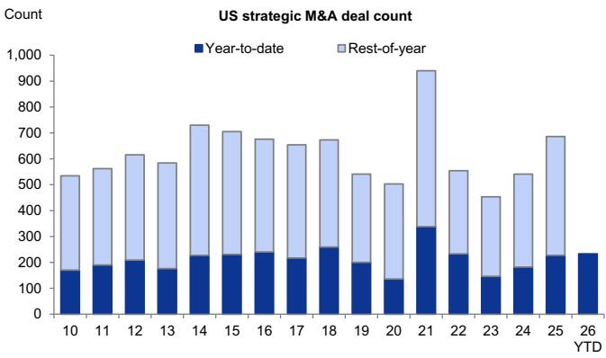

bar_stacked

US strategic M&A deal count
| Year | Year-to-date Count | Rest-of-year Count |
| :--- | :--- | :--- |
| 10 | 170 | 430 |
| 11 | 190 | 450 |
| 12 | 200 | 480 |
| 13 | 180 | 490 |
| 14 | 220 | 580 |
| 15 | 230 | 510 |
| 16 | 240 | 490 |
| 17 | 210 | 480 |
| 18 | 260 | 450 |
| 19 | 200 | 420 |
| 20 | 130 | 430 |
| 21 | 330 | 650 |
| 22 | 230 | 370 |
| 23 | 140 | 430 |
| 24 | 180 | 430 |
| 25 | 220 | 510 |
| YTD | 230 | - |
The chart displays a stacked bar chart representing the total number of strategic M&A deals across years from year 10 to year 26. The 'Year-to-date' and 'Rest-of-year' values are labeled on each bar. There is no additional data series or categories present in the chart.

Source: Dealogic, GS Global Investment Research

Exhibit 111: Annual European strategic M&A deal count   
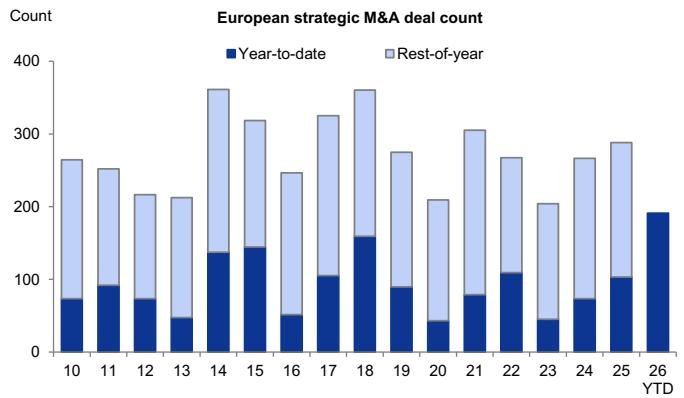

bar_stacked

European strategic M&A deal count
| Year | Year-to-date | Rest-of-year |
| :--- | :--- | :--- |
| 10 | 75 | 235 |
| 11 | 95 | 185 |
| 12 | 75 | 185 |
| 13 | 45 | 185 |
| 14 | 135 | 225 |
| 15 | 145 | 185 |
| 16 | 50 | 205 |
| 17 | 105 | 225 |
| 18 | 155 | 205 |
| 19 | 90 | 205 |
| 20 | 40 | 185 |
| 21 | 80 | 225 |
| 22 | 110 | 185 |
| 23 | 45 | 185 |
| 24 | 70 | 205 |
| 25 | 100 | 205 |
| YTD | 190 | 0 |
The chart displays a stacked bar chart comparing the total deal count for each year from year 10 to year 26. The bars are labeled 'Year-to-date' and 'Rest-of-year'.

Source: Pitchbook LCD, GS Global Investment Research

Exhibit 112: Annual US strategic M&A deal size   
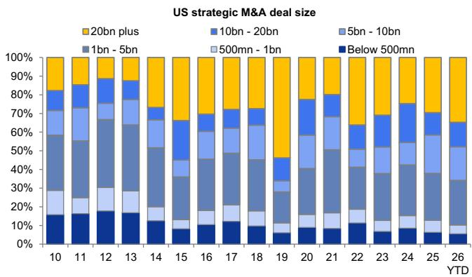

bar_stacked

| Year | Below 500mn | 500mn - 1bn | 1bn - 5bn | 10bn - 20bn | 20bn plus |
|------|-------------|-------------|-----------|-------------|-----------|
| 10   | 15%         | 15%         | 30%       | 15%         | 20%       |
| 11   | 15%         | 15%         | 30%       | 20%         | 20%       |
| 12   | 15%         | 15%         | 30%       | 20%         | 20%       |
| 13   | 15%         | 15%         | 30%       | 20%         | 20%       |
| 14   | 15%         | 15%         | 30%       | 20%         | 20%       |
| 15   | 15%         | 15%         | 30%       | 20%         | 20%       |
| 16   | 15%         | 15%         | 30%       | 20%         | 20%       |
| 17   | 15%         | 15%         | 30%       | 20%         | 20%       |
| 18   | 15%         | 15%         | 30%       | 20%         | 20%       |
| 19   | 15%         | 15%         | 30%       | 20%         | 20%       |
| 20   | 15%         | 15%         | 30%       | 20%         | 20%       |
| 21   | 15%         | 15%         | 30%       | 20%         | 20%       |
| 22   | 15%         | 15%         | 30%       | 20%         | 20%       |
| 23   | 15%         | 15%         | 30%       | 20%         | 20%       |
| 24   | 15%         | 15%         | 30%       | 20%         | 20%       |
| 25   | 15%         | 15%         | 30%       | 20%         | 20%       |
| 26   | 15%         | 15%         | 30%       | 20%         | 20%       |

Source: Dealogic, GS Global Investment Research

Exhibit 113: Annual European strategic M&A deal size   
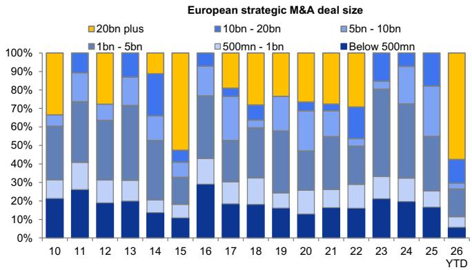

bar_stacked

| Year | Below 500mn | 500mn - 1bn | 1bn - 5bn | 5bn - 10bn | 10bn - 20bn | 20bn plus |
|------|-------------|-------------|-----------|------------|-------------|-----------|
| 10   | 20%         | 10%         | 20%       | 10%        | 20%         | 40%       |
| 11   | 25%         | 15%         | 30%       | 15%        | 25%         | 35%       |
| 12   | 20%         | 15%         | 35%       | 15%        | 25%         | 35%       |
| 13   | 20%         | 15%         | 40%       | 15%        | 25%         | 30%       |
| 14   | 15%         | 10%         | 45%       | 20%        | 30%         | 20%       |
| 15   | 10%         | 10%         | 45%       | 20%        | 30%         | 60%       |
| 16   | 25%         | 15%         | 40%       | 20%        | 35%         | 45%       |
| 17   | 20%         | 15%         | 35%       | 25%        | 35%         | 35%       |
| 18   | 20%         | 15%         | 35%       | 25%        | 35%         | 35%       |
| 19   | 20%         | 15%         | 35%       | 25%        | 35%         | 35%       |
| 20   | 20%         | 15%         | 35%       | 25%        | 35%         | 35%       |
| 21   | 20%         | 15%         | 35%       | 25%        | 35%         | 35%       |
| 22   | 20%         | 15%         | 35%       | 25%        | 35%         | 35%       |
| 23   | 20%         | 15%         | 40%       | 25%        | 35%         | 30%       |
| 24   | 20%         | 15%         | 40%       | 25%        | 35%         | 30%       |
| 25   | 20%         | 15%         | 40%       | 25%        | 35%         | 30%       |
| 26 YTD | 10%        | 10%         | 30%       | 20%        | 30%         | 60%       |

Source: Dealogic, GS Global Investment Research

# Primary market dashboard: CLO creation and refinancing

Exhibit 114: Annual USD Broadly syndicated loan CLO creation   
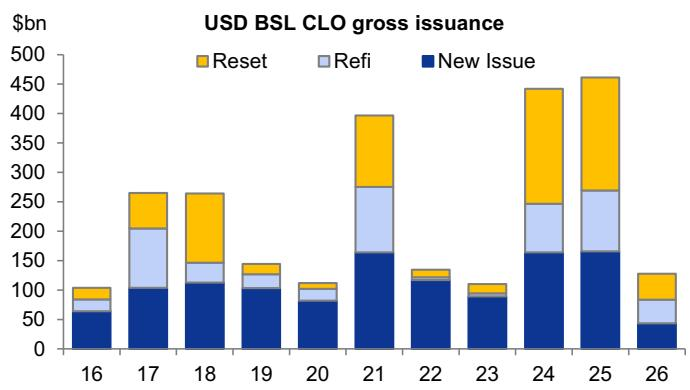

bar_stacked

| Year | Reset | Refi | New Issue |
|------|-------|------|-----------|
| 16   | 20    | 10   | 60        |
| 17   | 80    | 100  | 100       |
| 18   | 150   | 40   | 110       |
| 19   | 20    | 30   | 100       |
| 20   | 20    | 20   | 80        |
| 21   | 120   | 100  | 160       |
| 22   | 20    | 10   | 110       |
| 23   | 20    | 10   | 80        |
| 24   | 200   | 80   | 160       |
| 25   | 180   | 100  | 160       |
| 26   | 60    | 40   | 40        |

Source: Pitchbook LCD, GS Global Investment Research

Exhibit 115: Annual USD Middle market CLO creation   
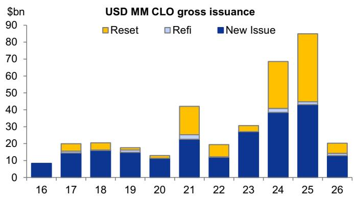

bar_stacked

| Year | Reset | Refi | New Issue |
|------|-------|------|-----------|
| 16   | 0     | 0    | 8         |
| 17   | 5     | 0    | 14        |
| 18   | 5     | 0    | 15        |
| 19   | 0     | 3    | 14        |
| 20   | 2     | 0    | 10        |
| 21   | 18    | 3    | 22        |
| 22   | 7     | 0    | 11        |
| 23   | 3     | 0    | 26        |
| 24   | 25    | 2    | 38        |
| 25   | 35    | 2    | 43        |
| 26   | 7     | 0    | 13        |

Source: Pitchbook LCD, GS Global Investment Research

Exhibit 116: Annual USD leveraged loan net issuance   
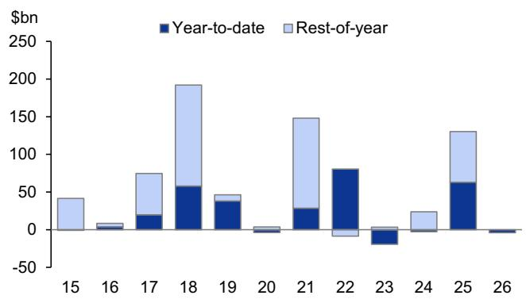

bar_stacked

| Year | Year-to-date ($bn) | Rest-of-year ($bn) |
| :--- | :--- | :--- |
| 15 | 0 | 40 |
| 16 | 5 | 8 |
| 17 | 20 | 60 |
| 18 | 55 | 130 |
| 19 | 35 | 10 |
| 20 | -5 | 5 |
| 21 | 25 | 110 |
| 22 | 80 | -5 |
| 23 | -20 | 5 |
| 24 | 0 | 20 |
| 25 | 60 | 70 |
| 26 | -5 | 0 |

Source: Pitchbook LCD, GS Global Investment Research   
Upcoming notional above prevailing WACD

Exhibit 117: USD CLO refinance monitor

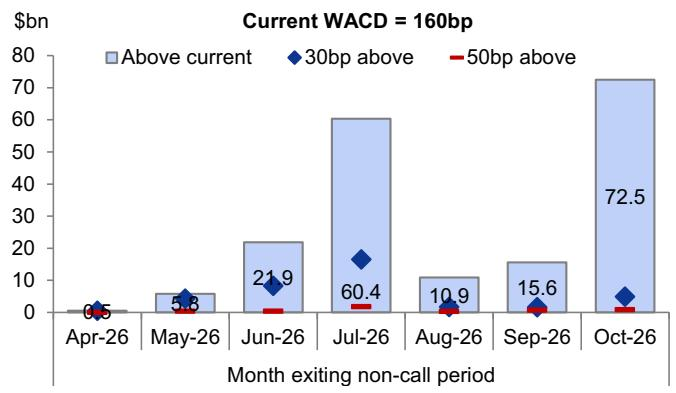

bar

| Month exiting non-call period | Above current | 30bp above | 50bp above |
| ----------------------------- | ------------- | ---------- | ---------- |
| Apr-26                        | 0.5           | 0.5        | 0.5        |
| May-26                        | 5.8           | 5.8        | 0.5        |
| Jun-26                        | 21.9          | 21.9       | 0.5        |
| Jul-26                        | 60.4          | 60.4       | 0.5        |
| Aug-26                        | 10.9          | 10.9       | 0.5        |
| Sep-26                        | 15.6          | 15.6       | 0.5        |
| Oct-26                        | 72.5          | 72.5       | 0.5        |

Source: Pitchbook LCD, GS Global Investment Research   
Notional above prevailing WACD by origination quarter

Exhibit 118: USD CLO refinance monitor

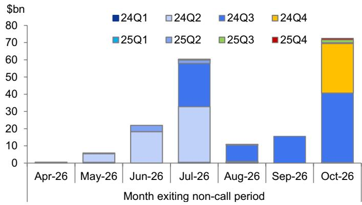

bar_stacked

| Month exiting non-call period | 24Q1 ($bn) | 24Q2 ($bn) | 24Q3 ($bn) | 24Q4 ($bn) | 25Q1 ($bn) | 25Q2 ($bn) | 25Q3 ($bn) | 25Q4 ($bn) |
|---|---|---|---|---|---|---|---|---|
| Apr-26 | 0.5 | 0.1 | 0.0 | 0.0 | 0.0 | 0.0 | 0.0 | 0.0 |
| May-26 | 0.0 | 0.0 | 5.0 | 0.0 | 0.0 | 0.0 | 0.0 | 0.0 |
| Jun-26 | 0.0 | 0.0 | 18.0 | 2.0 | 1.0 | 1.0 | 0.0 | 0.0 |
| Jul-26 | 0.0 | 32.0 | 27.0 | 1.0 | 1.0 | 1.0 | 0.5 | 0.5 |
| Aug-26 | 10.0 | 1.0 | 1.0 | 0.5 | 0.5 | 0.5 | 0.5 | 0.5 |
| Sep-26 | 15.0 | 0.5 | 0.5 | 0.5 | 0.5 | 0.5 | 1.0 | 1.0 |
| Oct-26 | 40.0 | 0.5 | 39.0 | 27.0 | 1.5 | 1.5 | 1.5 | 1.5 |
The chart displays a stacked bar chart with each quarter's total summing to the sum of all four quarters and the sum of the other quarters and the sum of the two quarters and the sum of the two quarters and the sum of the two quarters and the sum of the two quarters and the sum of the two quarters and the sum of the two quarters and the sum of the two quarters and the sum of the two quarters and the sum of the two quarters and the sum of the two quarters and the sum of the two quarters and the sum of the two quarters and the sum of the two quarters and the sum of the two quarters and the sum of the two quarters, respectively.

Source: Pitchbook LCD, GS Global Investment Research

# Primary market dashboard: Maturity walls

Exhibit 119: USD IG bond market maturity wall   
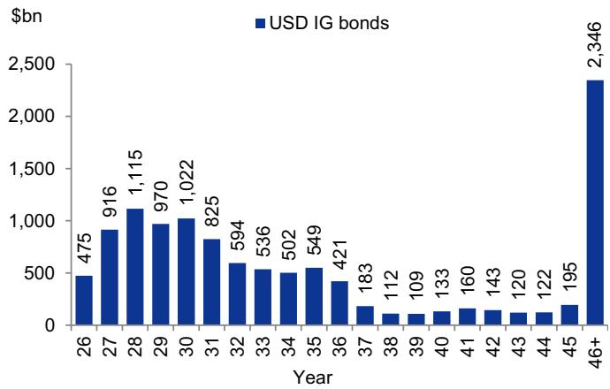

bar

| Year | USD IG bonds ($bn) |
| :--- | :--- |
| 26 | 475 |
| 27 | 916 |
| 28 | 1,115 |
| 29 | 970 |
| 30 | 1,022 |
| 31 | 825 |
| 32 | 594 |
| 33 | 536 |
| 34 | 502 |
| 35 | 549 |
| 36 | 421 |
| 37 | 183 |
| 38 | 112 |
| 39 | 109 |
| 40 | 133 |
| 41 | 160 |
| 42 | 143 |
| 43 | 120 |
| 44 | 122 |
| 45 | 195 |
| 46+ | 2,346 |

Source: Bloomberg, GS Global Investment Research

Exhibit 120: EUR IG bond market maturity wall   
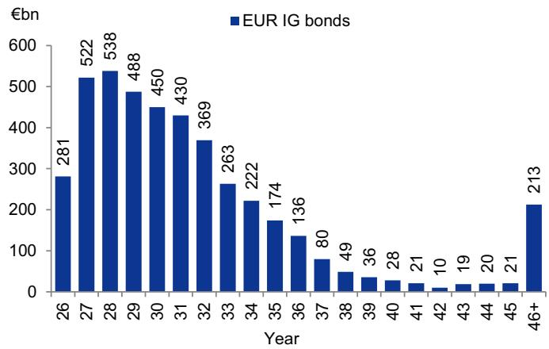

bar

| Year | EUR IG bonds (€bn) |
| :--- | :--- |
| 26 | 281 |
| 27 | 522 |
| 28 | 538 |
| 29 | 488 |
| 30 | 450 |
| 31 | 430 |
| 32 | 369 |
| 33 | 263 |
| 34 | 222 |
| 35 | 174 |
| 36 | 136 |
| 37 | 80 |
| 38 | 49 |
| 39 | 36 |
| 40 | 28 |
| 41 | 21 |
| 42 | 10 |
| 43 | 19 |
| 44 | 20 |
| 45 | 21 |
| 46+ | 213 |

Source: Bloomberg, GS Global Investment Research

Exhibit 121: USD HY bond market maturity wall   
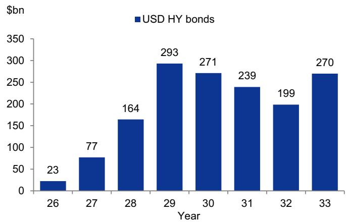

bar

USD HY bonds
| Year | USD HY bonds ($bn) |
| :--- | :--- |
| 26 | 23 |
| 27 | 77 |
| 28 | 164 |
| 29 | 293 |
| 30 | 271 |
| 31 | 239 |
| 32 | 199 |
| 33 | 270 |

Source: Bloomberg, GS Global Investment Research

Exhibit 122: EUR HY bond market maturity wall   
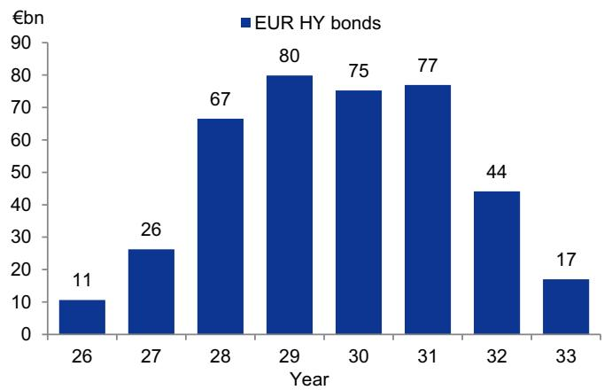

bar

EUR HY bonds
| Year | EUR HY bonds (€bn) |
| :--- | :--- |
| 26 | 11 |
| 27 | 26 |
| 28 | 67 |
| 29 | 80 |
| 30 | 75 |
| 31 | 77 |
| 32 | 44 |
| 33 | 17 |

Source: Bloomberg, GS Global Investment Research

Exhibit 123: USD leveraged loan market maturity wall   
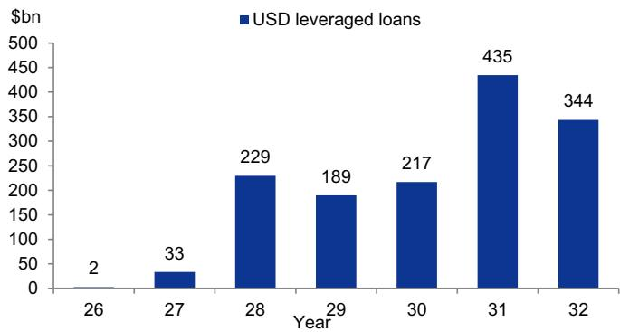

bar

USD leveraged loans
| Year | USD leveraged loans ($bn) |
| :--- | :--- |
| 26 | 2 |
| 27 | 33 |
| 28 | 229 |
| 29 | 189 |
| 30 | 217 |
| 31 | 435 |
| 32 | 344 |

Source: Pitchbook LCD, GS Global Investment Research

Exhibit 124: EUR leveraged loan market maturity wall   

bar

EUR leveraged loans
| Year | EUR leveraged loans (€bn) |
| :--- | :--- |
| 27 | 7 |
| 28 | 57 |
| 29 | 61 |
| 30 | 40 |
| 31 | 96 |
| 32 | 76 |
| 33 | 10 |

Source: Pitchbook LCD, GS Global Investment Research

# Default and ratings migration dashboard: Default trends

# Exhibit 125: Default rates for US HY bond and leveraged loan issuers

12-month trailing issuer-weighted default rate in the US HY bond and leveraged loan markets

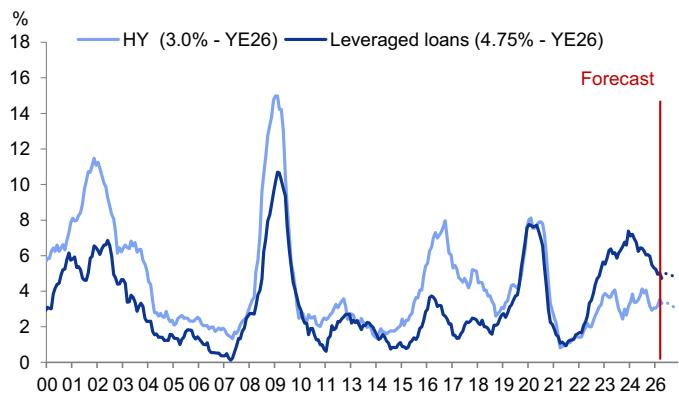

line

| Year | HY (3.0% - YE26) | Leveraged loans (4.75% - YE26) |
|------|------------------|-------------------------------|
| 00   | ~6               | ~3                            |
| 01   | ~8               | ~5                            |
| 02   | ~11              | ~6                            |
| 03   | ~7               | ~4                            |
| 04   | ~5               | ~3                            |
| 05   | ~3               | ~2                            |
| 06   | ~2               | ~1                            |
| 07   | ~1               | ~0.5                          |
| 08   | ~3               | ~1                            |
| 09   | ~15              | ~11                           |
| 10   | ~2               | ~0.5                          |
| 11   | ~3               | ~1                            |
| 12   | ~4               | ~2                            |
| 13   | ~5               | ~3                            |
| 14   | ~6               | ~4                            |
| 15   | ~7               | ~5                            |
| 16   | ~8               | ~6                            |
| 17   | ~7               | ~5                            |
| 18   | ~6               | ~4                            |
| 19   | ~5               | ~3                            |
| 20   | ~8               | ~7                            |
| 21   | ~7               | ~5                            |
| 22   | ~6               | ~4                            |
| 23   | ~5               | ~3                            |
| 24   | ~4               | ~2                            |
| 25   | ~3               | ~1                            |
| 26   | ~2               | ~0.5                          |

Source: Moody's, GS Global Investment Research

# Exhibit 127: High frequency default rates for US HY bond and leveraged loan issuers

3-month trailing issuer-weighted default rate in the US HY bond and leveraged loan markets

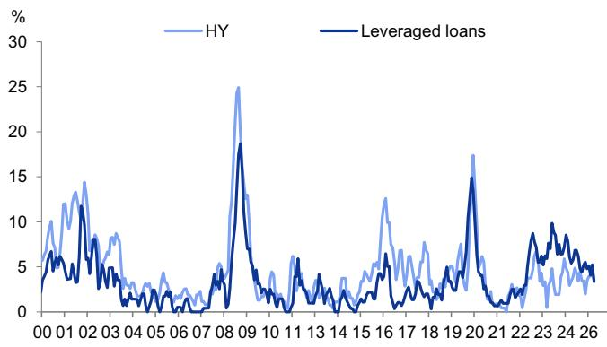

line

| Date | HY  | Leveraged loans |
|------|-----|-----------------|
| 00   | ~10 | ~5              |
| 01   | ~12 | ~7              |
| 02   | ~14 | ~8              |
| 03   | ~8  | ~4              |
| 04   | ~6  | ~3              |
| 05   | ~4  | ~2              |
| 06   | ~3  | ~1              |
| 07   | ~2  | ~1              |
| 08   | ~5  | ~3              |
| 09   | ~25 | ~18             |
| 10   | ~3  | ~2              |
| 11   | ~4  | ~3              |
| 12   | ~5  | ~4              |
| 13   | ~6  | ~5              |
| 14   | ~7  | ~6              |
| 15   | ~8  | ~7              |
| 16   | ~12 | ~6              |
| 17   | ~7  | ~5              |
| 18   | ~6  | ~4              |
| 19   | ~8  | ~5              |
| 20   | ~17 | ~15             |
| 21   | ~6  | ~4              |
| 22   | ~5  | ~3              |
| 23   | ~7  | ~6              |
| 24   | ~8  | ~7              |
| 25   | ~6  | ~5              |
| 26   | ~5  | ~4              |

Source: Moody's, GS Global Investment Research

Exhibit 129: Annual par value amounts of defaulted USD HY bonds and leveraged loans   
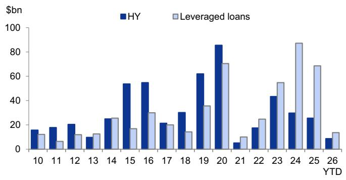

bar

| Year | HY ($bn) | Leveraged loans ($bn) |
| :--- | :--- | :--- |
| 10 | 16 | 12 |
| 11 | 18 | 6 |
| 12 | 21 | 12 |
| 13 | 10 | 12 |
| 14 | 25 | 25 |
| 15 | 54 | 17 |
| 16 | 55 | 30 |
| 17 | 22 | 20 |
| 18 | 30 | 14 |
| 19 | 62 | 36 |
| 20 | 85 | 70 |
| 21 | 5 | 10 |
| 22 | 18 | 24 |
| 23 | 43 | 55 |
| 24 | 30 | 87 |
| 25 | 25 | 68 |
| 26 | 8 | 13 |

Source: Moody's, GS Global Investment Research

# Exhibit 126: Default rates for European bond and leveraged loan issuers

12-month trailing issuer-weighted default rate in the European HY bond and leveraged loan markets

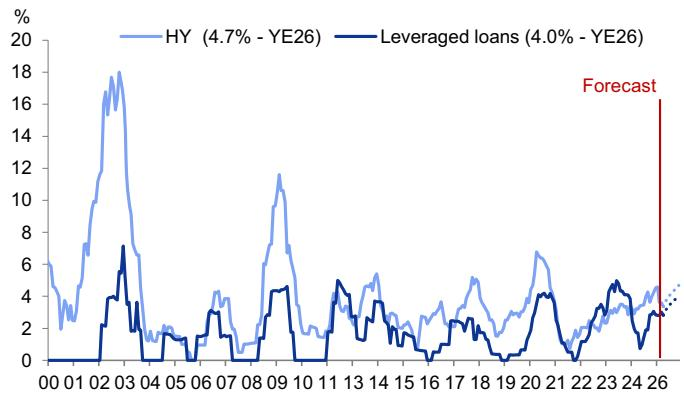

line

| Year | HY (4.7% - YE26) | Leveraged loans (4.0% - YE26) |
|------|------------------|-------------------------------|
| 00   | ~6               | ~0                            |
| 01   | ~8               | ~0                            |
| 02   | ~18              | ~4                            |
| 03   | ~18              | ~7                            |
| 04   | ~2               | ~2                            |
| 05   | ~4               | ~2                            |
| 06   | ~4               | ~2                            |
| 07   | ~4               | ~2                            |
| 08   | ~4               | ~2                            |
| 09   | ~12              | ~4                            |
| 10   | ~2               | ~2                            |
| 11   | ~4               | ~4                            |
| 12   | ~4               | ~4                            |
| 13   | ~4               | ~4                            |
| 14   | ~4               | ~4                            |
| 15   | ~4               | ~4                            |
| 16   | ~4               | ~4                            |
| 17   | ~4               | ~4                            |
| 18   | ~4               | ~4                            |
| 19   | ~4               | ~4                            |
| 20   | ~6               | ~4                            |
| 21   | ~6               | ~4                            |
| 22   | ~4               | ~2                            |
| 23   | ~4               | ~4                            |
| 24   | ~4               | ~4                            |
| 25   | ~4               | ~4                            |
| 26   | ~4               | ~4                            |

Source: Moody's, GS Global Investment Research

# Exhibit 128: High frequency default rates for European HY bond and leveraged loan issuers

3-month trailing issuer-weighted default rate in the European HY bond and leveraged loan markets

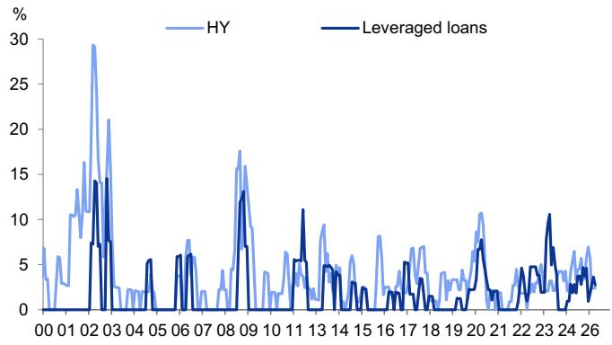

line

| Date | HY  | Leveraged loans |
|------|-----|-----------------|
| 00   | 7   | 0               |
| 01   | 10  | 0               |
| 02   | 29  | 14              |
| 03   | 21  | 15              |
| 04   | 2   | 0               |
| 05   | 8   | 6               |
| 06   | 7   | 6               |
| 07   | 8   | 6               |
| 08   | 17  | 12              |
| 09   | 16  | 13              |
| 10   | 5   | 5               |
| 11   | 6   | 11              |
| 12   | 5   | 5               |
| 13   | 9   | 5               |
| 14   | 6   | 5               |
| 15   | 8   | 5               |
| 16   | 7   | 5               |
| 17   | 6   | 5               |
| 18   | 7   | 5               |
| 19   | 5   | 5               |
| 20   | 11  | 8               |
| 21   | 7   | 5               |
| 22   | 5   | 5               |
| 23   | 6   | 10              |
| 24   | 7   | 5               |
| 25   | 6   | 3               |
| 26   | 7   | 3               |

Source: Moody's, GS Global Investment Research

Exhibit 130: Par value amounts of defaulted EUR HY bonds and leveraged loans   
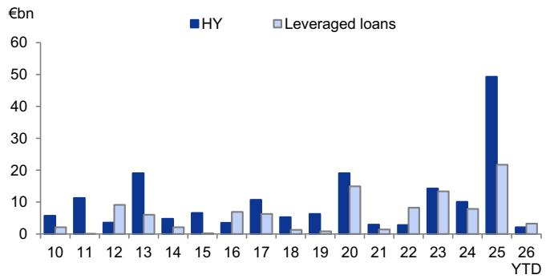

bar

| Year | HY (€bn) | Leveraged loans (€bn) |
| :--- | :--- | :--- |
| 10 | 5.5 | 2.5 |
| 11 | 11.5 | 0.0 |
| 12 | 3.5 | 9.0 |
| 13 | 19.5 | 5.5 |
| 14 | 4.5 | 2.0 |
| 15 | 6.5 | 0.5 |
| 16 | 3.5 | 7.0 |
| 17 | 11.0 | 6.0 |
| 18 | 5.0 | 1.5 |
| 19 | 6.0 | 1.0 |
| 20 | 19.0 | 15.0 |
| 21 | 3.0 | 1.0 |
| 22 | 2.5 | 8.0 |
| 23 | 14.5 | 13.0 |
| 24 | 10.5 | 7.5 |
| 25 | 49.5 | 22.0 |
| 26 | 2.0 | 3.0 |

Source: Moody's, GS Global Investment Research

Exhibit 131: Top 5 largest defaults in the USD HY bond and leveraged loan markets in the past 12 months 

<table><tr><td></td><td>Default date</td><td>Issuer</td><td>Industry</td><td>Default type</td><td>Notional amount ($bn)</td></tr><tr><td rowspan="5">HY</td><td>1/29/2026</td><td>LABL, Inc.</td><td>Containers, Packaging, &amp; Glass</td><td>Prepackaged Chapter 11</td><td>2.9</td></tr><tr><td>11/20/2025</td><td>New Fortress Energy Inc.</td><td>Energy: Oil &amp; Gas</td><td>Missed interest payment</td><td>2.7</td></tr><tr><td>1/14/2026</td><td>Saks Global Enterprises LLC</td><td>Retail</td><td>Chapter 11</td><td>2.7</td></tr><tr><td>8/8/2025</td><td>Saks Global Enterprises LLC</td><td>Retail</td><td>Distressed exchange</td><td>2.1</td></tr><tr><td>6/30/2025</td><td>Radiate HoldCo, LLC</td><td>Telecommunications</td><td>Distressed exchange</td><td>1.9</td></tr><tr><td rowspan="5">Loans</td><td>9/28/2025</td><td>First Brands Group, LLC</td><td>Automotive</td><td>Chapter 11</td><td>4.7</td></tr><tr><td>6/30/2025</td><td>Radiate HoldCo, LLC</td><td>Telecommunications</td><td>Distressed exchange</td><td>3.8</td></tr><tr><td>5/30/2025</td><td>Quest Identity Intermediate Limited</td><td>High Tech Industries</td><td>Distressed exchange</td><td>3.2</td></tr><tr><td>5/2/2025</td><td>Ivanti Software, Inc.</td><td>High Tech Industries</td><td>Distressed exchange</td><td>2.8</td></tr><tr><td>2/17/2026</td><td>Vibrantz Technologies Inc.</td><td>Chemicals, Plastics, &amp; Rubber</td><td>Distressed exchange</td><td>2.6</td></tr></table>

Source: Moody's, data compiled by GS Global Investment Research

Exhibit 132: Top 5 largest defaults in the EUR HY bond and leveraged loan markets in the past 12 months 

<table><tr><td></td><td>Default date</td><td>Issuer</td><td>Industry</td><td>Default type</td><td>Notional amount (€bn)</td></tr><tr><td rowspan="5">HY</td><td>6/10/2025</td><td>Altice France SAS</td><td>Telecommunications</td><td>Suspension of payments</td><td>6.0</td></tr><tr><td>6/16/2025</td><td>Altice France Holding S.A.</td><td>Telecommunications</td><td>Missed interest payment</td><td>2.1</td></tr><tr><td>2/19/2026</td><td>Garfunkelux Holdco 3 S.A.</td><td>Finance</td><td>Distressed exchange</td><td>1.7</td></tr><tr><td>6/25/2025</td><td>Garfunkelux Holdco 3 S.A.</td><td>Finance</td><td>Distressed exchange</td><td>1.7</td></tr><tr><td>11/12/2025</td><td>Ardagh Group S.A.</td><td>Containers, Packaging, &amp; Glass</td><td>Distressed exchange</td><td>1.4</td></tr><tr><td rowspan="5">Loans</td><td>6/10/2025</td><td>Altice France SAS</td><td>Telecommunications</td><td>Suspension of payments</td><td>3.5</td></tr><tr><td>6/3/2025</td><td>Colisee Group</td><td>Healthcare &amp; Pharmaceuticals</td><td>Missed interest payment</td><td>1.3</td></tr><tr><td>1/29/2026</td><td>Eos Finco S.a.r.l.</td><td>Wholesale</td><td>Distressed exchange</td><td>1.3</td></tr><tr><td>5/9/2025</td><td>Eos Finco S.a.r.l.</td><td>Wholesale</td><td>Distressed exchange</td><td>1.0</td></tr><tr><td>11/4/2025</td><td>Klockner Pentaplast of America, Inc</td><td>Containers, Packaging, &amp; Glass</td><td>Prepackaged Chapter 11</td><td>0.8</td></tr></table>

Source: Moody's, data compiled by GS Global Investment Research

Exhibit 133: Industry default count in the US   
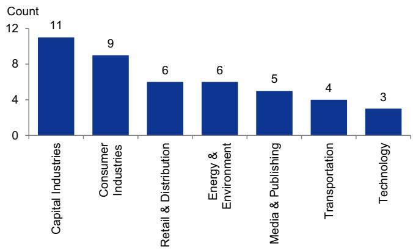

bar

| Industry | Count |
| :--- | :--- |
| Capital Industries | 11 |
| Consumer Industries | 9 |
| Retail & Distribution | 6 |
| Energy & Environment | 6 |
| Media & Publishing | 5 |
| Transportation | 4 |
| Technology | 3 |

Source: Moody's, GS Global Investment Research

Exhibit 134: Industry default count in Europe   
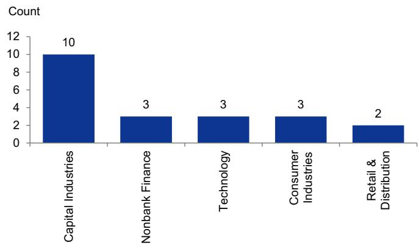

bar

| Category | Count |
| :--- | :--- |
| Capital Industries | 10 |
| Nonbank Finance | 3 |
| Technology | 3 |
| Consumer Industries | 3 |
| Retail & Distribution | 2 |

Source: Moody's, GS Global Investment Research

Exhibit 135: Composition of defaults in the USD HY bond market by type   
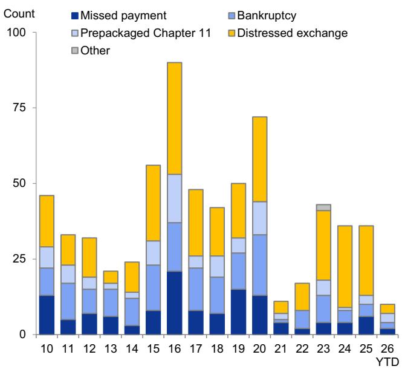

bar_stacked

| YTD | Missed payment | Bankruptcy | Prepackaged Chapter 11 | Distressed exchange | Other |
| --- | --- | --- | --- | --- | --- |
| 10 | 12 | 10 | 8 | 25 | 0 |
| 11 | 6 | 14 | 7 | 15 | 0 |
| 12 | 7 | 9 | 4 | 18 | 0 |
| 13 | 6 | 10 | 3 | 5 | 0 |
| 14 | 4 | 12 | 4 | 15 | 0 |
| 15 | 8 | 15 | 9 | 30 | 0 |
| 16 | 20 | 18 | 15 | 45 | 0 |
| 17 | 8 | 16 | 6 | 25 | 0 |
| 18 | 7 | 14 | 8 | 20 | 0 |
| 19 | 15 | 16 | 7 | 22 | 0 |
| 20 | 13 | 25 | 12 | 35 | 0 |
| 21 | 4 | 3 | 2 | 5 | 0 |
| 22 | 3 | 6 | 3 | 12 | 0 |
| 23 | 5 | 9 | 5 | 30 | 2 |
| 24 | 6 | 5 | 4 | 35 | 0 |
| 25 | 7 | 4 | 5 | 30 | 0 |
| 26 | 3 | 3 | 2 | 4 | 0 |

Source: Moody's, GS Global Investment Research

Exhibit 136: Composition of defaults in the EUR HY bond market by type   
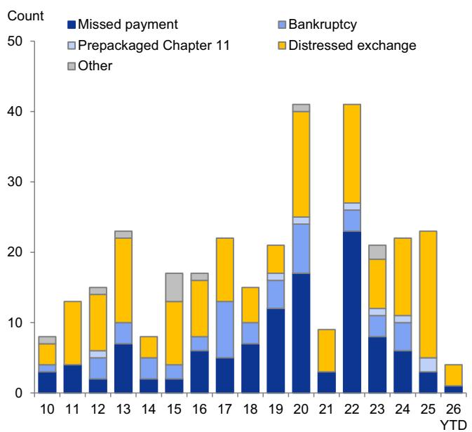

bar_stacked

| YTD | Missed payment | Bankruptcy | Prepackaged Chapter 11 | Distressed exchange | Other |
|---|---|---|---|---|---|
| 10 | 3 | 1 | 0 | 3 | 1 |
| 11 | 4 | 0 | 0 | 9 | 0 |
| 12 | 2 | 3 | 2 | 10 | 1 |
| 13 | 7 | 3 | 0 | 18 | 1 |
| 14 | 2 | 3 | 0 | 4 | 0 |
| 15 | 2 | 2 | 0 | 10 | 4 |
| 16 | 6 | 1 | 0 | 9 | 1 |
| 17 | 5 | 8 | 0 | 10 | 0 |
| 18 | 7 | 3 | 0 | 6 | 0 |
| 19 | 12 | 4 | 1 | 4 | 0 |
| 20 | 17 | 6 | 1 | 20 | 1 |
| 21 | 3 | 0 | 0 | 7 | 0 |
| 22 | 23 | 3 | 1 | 18 | 0 |
| 23 | 8 | 3 | 1 | 9 | 2 |
| 24 | 6 | 3 | 1 | 13 | 0 |
| 25 | 3 | 1 | 1 | 25 | 0 |
| 26 | 1 | 0 | 0 | 3 | 0 |

Source: Moody's, GS Global Investment Research

Exhibit 137: Annual average recovery rates by seniority for US issuers   
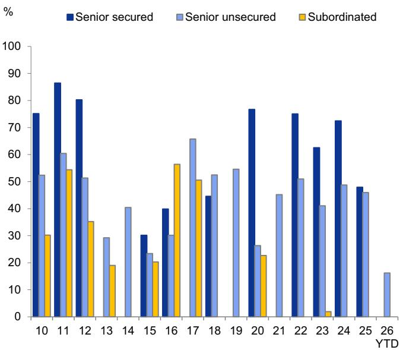

bar

| YTD | Senior secured (%) | Senior unsecured (%) | Subordinated (%) |
|---|---|---|---|
| 10 | 75 | 52 | 30 |
| 11 | 86 | 60 | 54 |
| 12 | 80 | 51 | 35 |
| 13 | - | 29 | 19 |
| 14 | - | 40 | - |
| 15 | 30 | 23 | 20 |
| 16 | 40 | 30 | 56 |
| 17 | - | 65 | 50 |
| 18 | 44 | 52 | - |
| 19 | - | 54 | - |
| 20 | 76 | 26 | 22 |
| 21 | - | 45 | - |
| 22 | 74 | 51 | - |
| 23 | 62 | 41 | 2 |
| 24 | 72 | 49 | - |
| 25 | 48 | 46 | - |
| 26 | - | 16 | - |

Source: Moody's, GS Global Investment Research

Exhibit 138: Annual average recovery rates by seniority for European issuers   

bar

| YTD | Senior secured (%) | Senior unsecured (%) | Subordinated (%) |
|---|---|---|---|
| 10 | 30 | 0 | 51 |
| 11 | 26 | 0 | 32 |
| 12 | 0 | 0 | 51 |
| 13 | 0 | 26 | 23 |
| 14 | 0 | 24 | 0 |
| 15 | 0 | 43 | 51 |
| 16 | 0 | 24 | 0 |
| 17 | 0 | 34 | 50 |
| 18 | 0 | 32 | 0 |
| 19 | 0 | 22 | 0 |
| 20 | 0 | 18 | 0 |
| 21 | 0 | 76 | 0 |
| 22 | 72 | 12 | 0 |
| 23 | 45 | 15 | 0 |
| 24 | 56 | 55 | 0 |
| 25 | 83 | 36 | 0 |
| 26 | 0 | 0 | 0 |

Source: Moody's, GS Global Investment Research

# Default and ratings migration dashboard: Upgrades and downgrades

Exhibit 139: Fallen angels vs. rising stars in the USD market   
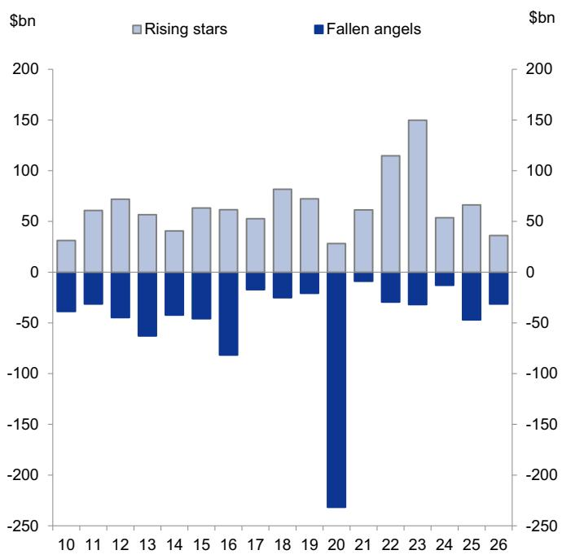

bar

| Year | Rising stars ($bn) | Fallen angels ($bn) |
| :--- | :--- | :--- |
| 10 | 30 | -40 |
| 11 | 60 | -35 |
| 12 | 70 | -45 |
| 13 | 55 | -65 |
| 14 | 40 | -45 |
| 15 | 65 | -45 |
| 16 | 60 | -85 |
| 17 | 50 | -20 |
| 18 | 80 | -25 |
| 19 | 70 | -25 |
| 20 | 25 | -225 |
| 21 | 60 | -10 |
| 22 | 115 | -30 |
| 23 | 150 | -35 |
| 24 | 50 | -15 |
| 25 | 65 | -45 |
| 26 | 35 | -30 |

Source: Bloomberg, GS Global Investment Research

Exhibit 140: Fallen angels vs. rising stars in the EUR market   
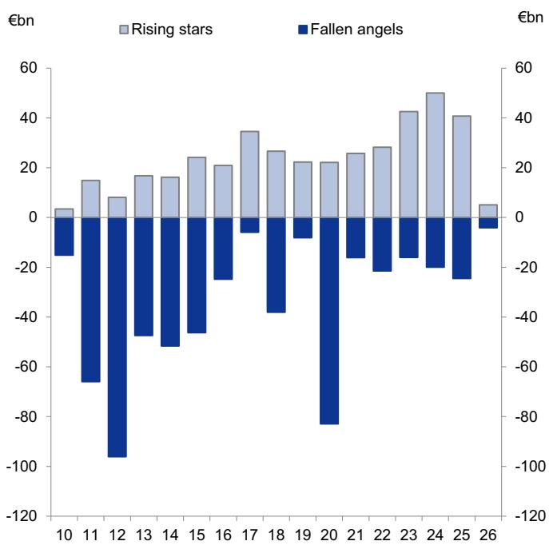

bar

| Year | Rising stars (€bn) | Fallen angels (€bn) |
| :--- | :--- | :--- |
| 10 | 3 | -15 |
| 11 | 15 | -65 |
| 12 | 8 | -95 |
| 13 | 17 | -45 |
| 14 | 16 | -48 |
| 15 | 24 | -45 |
| 16 | 20 | -25 |
| 17 | 35 | -5 |
| 18 | 27 | -38 |
| 19 | 22 | -8 |
| 20 | 22 | -85 |
| 21 | 25 | -15 |
| 22 | 28 | -20 |
| 23 | 42 | -15 |
| 24 | 50 | -20 |
| 25 | 40 | -25 |
| 26 | 5 | -5 |

Source: Bloomberg, GS Global Investment Research

Exhibit 141: BB-rated bonds on upgrade watch (upgrade candidates) vs. BBB-rated bonds on downgrade watch (downgrade candidates) in the USD market   

bar

| Year | Rising star candidates ($bn) | Fallen angel candidates ($bn) |
|------|-------------------------------|--------------------------------|
| 10   | 10                            | -30                            |
| 11   | 5                             | -35                            |
| 12   | 0                             | -40                            |
| 13   | 0                             | -20                            |
| 14   | 5                             | -130                           |
| 15   | 20                            | -170                           |
| 16   | 10                            | -50                            |
| 17   | 10                            | -40                            |
| 18   | 5                             | -45                            |
| 19   | 0                             | -20                            |
| 20   | 15                            | -10                            |
| 21   | 10                            | -30                            |
| 22   | 0                             | -40                            |
| 23   | 5                             | -35                            |
| 24   | 5                             | -90                            |
| 25   | 15                            | -55                            |
| 26   | 5                             | -60                            |

Source: Bloomberg, GS Global Investment Research

Exhibit 142: BB-rated bonds on upgrade watch (upgrade candidates) vs. BBB-rated bonds on downgrade watch (downgrade candidates) in the EUR market   
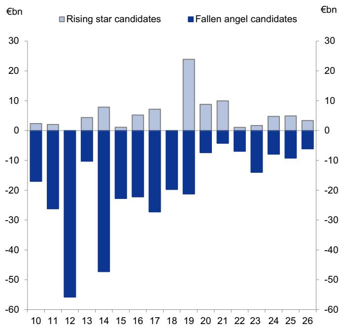

bar

| Year | Rising star candidates (€bn) | Fallen angel candidates (€bn) |
|------|-------------------------------|--------------------------------|
| 10   | 2                             | -18                            |
| 11   | 2                             | -25                            |
| 12   | 0                             | -55                            |
| 13   | 4                             | -10                            |
| 14   | 8                             | -45                            |
| 15   | 1                             | -22                            |
| 16   | 5                             | -20                            |
| 17   | 7                             | -28                            |
| 18   | 0                             | -20                            |
| 19   | 24                            | -20                            |
| 20   | 9                             | -8                             |
| 21   | 10                            | -5                             |
| 22   | 1                             | -7                             |
| 23   | 2                             | -15                            |
| 24   | 5                             | -8                             |
| 25   | 5                             | -9                             |
| 26   | 3                             | -6                             |

Source: Bloomberg, GS Global Investment Research

Exhibit 143: BB-rated bonds on outlook positive vs. BBB-rated bonds on outlook negative in the USD market   
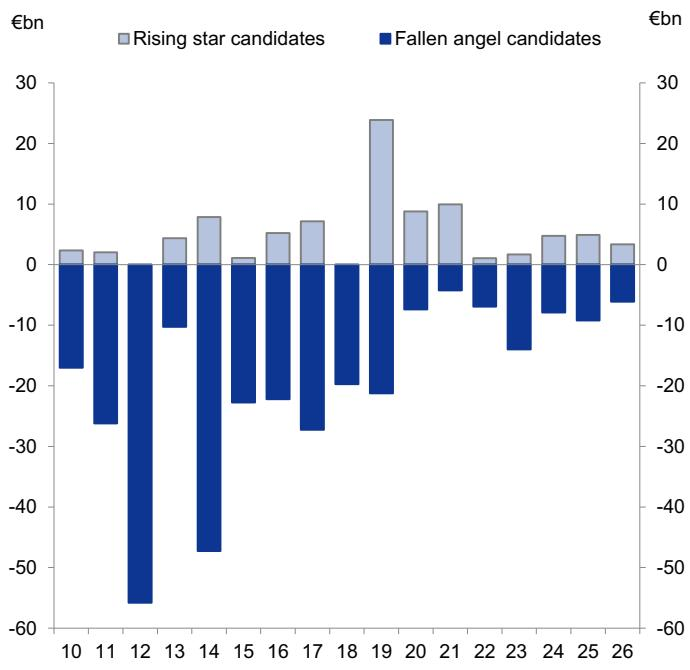

bar

| Year | Rising star candidates (€bn) | Fallen angel candidates (€bn) |
|------|-------------------------------|--------------------------------|
| 10   | 2                             | -18                            |
| 11   | 2                             | -27                            |
| 12   | 0                             | -57                            |
| 13   | 4                             | -10                            |
| 14   | 8                             | -47                            |
| 15   | 1                             | -23                            |
| 16   | 5                             | -23                            |
| 17   | 7                             | -28                            |
| 18   | 0                             | -20                            |
| 19   | 24                            | -22                            |
| 20   | 9                             | -8                             |
| 21   | 10                            | -5                             |
| 22   | 1                             | -7                             |
| 23   | 2                             | -15                            |
| 24   | 5                             | -8                             |
| 25   | 5                             | -9                             |
| 26   | 3                             | -6                             |

Source: Moody's, GS Global Investment Research

Exhibit 145: Top 10 USD fallen angel issuers in the last 12 months 

<table><tr><td>Company</td><td>Notional downgraded ($bn)</td></tr><tr><td>Centene Corp</td><td>14.7</td></tr><tr><td>Paramount Global</td><td>13.0</td></tr><tr><td>Fs Kkr Capital Corp</td><td>3.8</td></tr><tr><td>Fmc Corp</td><td>2.5</td></tr><tr><td>Huntsman International L</td><td>1.5</td></tr><tr><td>Banco Santander Mexico</td><td>1.3</td></tr><tr><td>Pacificorp</td><td>0.9</td></tr><tr><td>Blackrock Tcp Cap Corp</td><td>0.7</td></tr><tr><td>Horizon Mutual Holdings</td><td>0.6</td></tr><tr><td>Ses Americom Inc</td><td>0.5</td></tr></table>

Source: Bloomberg, data compiled by GS Global Investment Research

Exhibit 147: Top 10 EUR Fallen angel issues 

<table><tr><td>Company</td><td>Notional downgraded (€bn)</td></tr><tr><td>Ses Sa</td><td>3.4</td></tr><tr><td>Lanxess Ag</td><td>2.2</td></tr><tr><td>Worldline Sa/France</td><td>2.2</td></tr><tr><td>Citycon Treasury Bv</td><td>1.7</td></tr><tr><td>Verallia Sa</td><td>1.6</td></tr><tr><td>Mediobanca Di Cred Fin</td><td>1.5</td></tr><tr><td>Unibail-Rodamco-Westfld</td><td>1.1</td></tr><tr><td>Adecco Int Financial Svs</td><td>0.5</td></tr><tr><td>Illimity Bank Spa</td><td>0.3</td></tr><tr><td>Solaben Luxembourg</td><td>0.1</td></tr></table>

Source: Bloomberg, data compiled by GS Global Investment Research

Exhibit 144: BB-rated bonds on outlook positive vs. BBB-rated bonds on outlook negative in the EUR market   
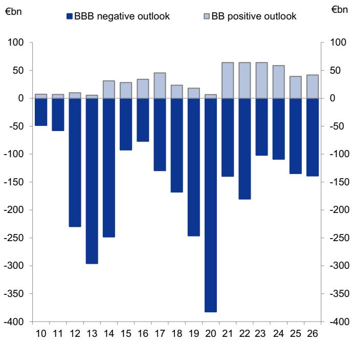

bar

| Year | BBB negative outlook (€bn) | BB positive outlook (€bn) |
|------|-----------------------------|----------------------------|
| 10   | -50                         | 5                          |
| 11   | -75                         | 5                          |
| 12   | -225                        | 10                         |
| 13   | -300                        | 5                          |
| 14   | -250                        | 25                         |
| 15   | -100                        | 25                         |
| 16   | -80                         | 30                         |
| 17   | -125                        | 40                         |
| 18   | -175                        | 20                         |
| 19   | -250                        | 15                         |
| 20   | -380                        | 5                          |
| 21   | -150                        | 60                         |
| 22   | -180                        | 60                         |
| 23   | -100                        | 60                         |
| 24   | -125                        | 50                         |
| 25   | -150                        | 35                         |
| 26   | -175                        | 40                         |

Source: Moody's, GS Global Investment Research

Exhibit 146: Top 10 USD rising star issuers in the last 12 months 

<table><tr><td>Company</td><td>Notional upgraded ($bn)</td></tr><tr><td>Vistra Operations Co Llc</td><td>6.3</td></tr><tr><td>Medline Borrower Lp</td><td>4.5</td></tr><tr><td>Permian Resourc Optg Llc</td><td>3.6</td></tr><tr><td>Unicredit Spa</td><td>3.5</td></tr><tr><td>Frontier Communications</td><td>2.8</td></tr><tr><td>Frontier Communications</td><td>2.8</td></tr><tr><td>Constellation En Gen Llc</td><td>2.3</td></tr><tr><td>Standard Chartered Plc</td><td>1.5</td></tr><tr><td>Medline Borrower/Medl Co</td><td>1.5</td></tr><tr><td>Midcap Financial Issr Tr</td><td>1.0</td></tr></table>

Source: Bloomberg, data compiled by GS Global Investment Research

Exhibit 148: Top 10 EUR rising star issuers in the last 12 months 

<table><tr><td>Company</td><td>Notional upgraded (€bn)</td></tr><tr><td>Banca Monte Dei Paschi S</td><td>3.0</td></tr><tr><td>Terna Rete Elettrica</td><td>1.9</td></tr><tr><td>Aib Group Plc</td><td>1.7</td></tr><tr><td>Asr Nederland Nv</td><td>1.5</td></tr><tr><td>Unipol Assicurazioni Spa</td><td>1.3</td></tr><tr><td>Intesa Sanpaolo Assicura</td><td>1.1</td></tr><tr><td>Bper Banca</td><td>1.0</td></tr><tr><td>Piraeus Bank Sa</td><td>1.0</td></tr><tr><td>Czechoslovak Group</td><td>1.0</td></tr><tr><td>Abanca Corp Bancaria Sa</td><td>1.0</td></tr></table>

Source: Bloomberg, data compiled by GS Global Investment Research

# Disclosure Appendix

# Reg AC

We, Amanda Lynam, CPA, Spencer Rogers, CFA, Sara Grut and Shamshad Ali, hereby certify that all of the views expressed in this report accurately reflect our personal views, which have not been influenced by considerations of the firm's business or client relationships.

Unless otherwise stated, the individuals listed on the cover page of this report are analysts in GS' Global Investment Research division.

Contributing Authors: Amanda Lynam, CPA GS & Co. LLC, Spencer Rogers, CFA GS & Co. LLC, Sara Grut GS International, Shamshad Ali GS & Co. LLC.

Unless otherwise stated, the individuals listed in the Contributing Authors disclosure of this report are analysts in GS' Global Investment Research division.

# Disclosures

# Regulatory disclosures

# Disclosures required by United States laws and regulations

See company-specific regulatory disclosures above for any of the following disclosures required as to companies referred to in this report: manager or co-manager in a pending transaction; 1% or other ownership; compensation for certain services; types of client relationships; managed/co-managed public offerings in prior periods; directorships; for equity securities, market making and/or specialist role. GS trades or may trade as a principal in debt securities (or in related derivatives) of issuers discussed in this report.

The following are additional required disclosures: Ownership and material conflicts of interest: GS policy prohibits its analysts, professionals reporting to analysts and members of their households from owning securities of any company in the analyst's area of coverage. Analyst compensation: Analysts are paid in part based on the profitability of GS, which includes investment banking revenues. Analyst as officer or director: GS policy generally prohibits its analysts, persons reporting to analysts or members of their households from serving as an officer, director or advisor of any company in the analyst's area of coverage. Non-U.S. Analysts: Non-U.S. analysts may not be associated persons of GS & Co. LLC and therefore may not be subject to FINRA Rule 2241 or FINRA Rule 2242 restrictions on communications with a subject company, public appearances and trading in securities covered by the analysts.

# Additional disclosures required under the laws and regulations of jurisdictions other than the United States

The following disclosures are those required by the jurisdiction indicated, except to the extent already made above pursuant to United States laws and regulations. Australia: GS Australia Pty Ltd and its affiliates are not authorised deposit-taking institutions (as that term is defined in the Banking Act 1959 (Cth)) in Australia and do not provide banking services, nor carry on a banking business, in Australia. This research, and any access to it, is intended only for “wholesale clients” within the meaning of the Australian Corporations Act, unless otherwise agreed by GS. In producing research reports, members of Global Investment Research of GS Australia may attend site visits and other meetings hosted by the companies and other entities which are the subject of its research reports. In some instances the costs of such site visits or meetings may be met in part or in whole by the issuers concerned if GS Australia considers it is appropriate and reasonable in the specific circumstances relating to the site visit or meeting. To the extent that the contents of this document contains any financial product advice, it is general advice only and has been prepared by GS without taking into account a client’s objectives, financial situation or needs. A client should, before acting on any such advice, consider the appropriateness of the advice having regard to the client’s own objectives, financial situation and needs. A copy of certain GS Australia and New Zealand disclosure of interests and a copy of GS’ Australian Sell-Side Research Independence Policy Statement are available at: https://www.goldmansachs.com/disclosures/australia-new-zealand/index.html. Brazil: Disclosure information in relation to CVM Resolution n. 20 is available at https://www.gs.com/worldwide/brazil/area/gir/index.html. Where applicable, the Brazil-registered analyst primarily responsible for the content of this research report, as defined in Article 20 of CVM Resolution n. 20, is the first author named at the beginning of this report, unless indicated otherwise at the end of the text. Canada: This information is being provided to you for information purposes only and is not, and under no circumstances should be construed as, an advertisement, offering or solicitation by GS & Co. LLC for purchasers of securities in Canada to trade in any Canadian security. GS & Co. LLC is not registered as a dealer in any jurisdiction in Canada under applicable Canadian securities laws and generally is not permitted to trade in Canadian securities and may be prohibited from selling certain securities and products in certain jurisdictions in Canada. If you wish to trade in any Canadian securities or other products in Canada please contact GS Canada Inc., an affiliate of The GS Group Inc., or another registered Canadian dealer. Hong Kong: Further information on the securities of covered companies referred to in this research may be obtained on request from GS (Asia) L.L.C. India: Further information on the subject company or companies referred to in this research may be obtained from GS (India) Securities Private Limited, Research Analyst - SEBI Registration Number INH000001493, 10th Floor, Ascent-Worli, Sudam Kalu Ahire Marg, Worli, Mumbai-400 025, India, Corporate Identity Number U74140MH2006FTC160634, Phone +91 22 6616 9000, Fax +91 22 6616 9001. GS may beneficially own 1% or more of the securities (as such term is defined in clause 2 (h) the Indian Securities Contracts (Regulation) Act, 1956) of the subject company or companies referred to in this research report. Investment in securities market are subject to market risks. Read all the related documents carefully before investing. Registration granted by SEBI and certification from NISM in no way guarantee performance of the intermediary or provide any assurance of returns to investors. GS (India) Securities Private Limited compliance officer and investor grievance contact details can be found at: https://www.goldmansachs.com/worldwide/india/documents/Grievance-Redressal-and-Escalation-Matrix.pdf, and a copy of the annual audit compliance report can be found at this link: https://publishing.gs.com/content/site/india-annual-compliance-report.html. Japan: See below. Korea: This research, and any access to it, is intended only for “professional investors” within the meaning of the Financial Services and Capital Markets Act, unless otherwise agreed by GS. Further information on the subject company or companies referred to in this research may be obtained from GS (Asia) L.L.C., Seoul Branch. New Zealand: GS New Zealand Limited and its affiliates are neither “registered banks” nor “deposit takers” (as defined in the Reserve Bank of New Zealand Act 1989) in New Zealand. This research, and any access to it, is intended for “wholesale clients” (as defined in the Financial Advisers Act 2008) unless otherwise agreed by GS. A copy of certain GS Australia and New Zealand disclosure of interests is available at: https://www.goldmansachs.com/disclosures/australia-new-zealand/index.html. Russia: Research reports distributed in the Russian Federation are not advertising as defined in the Russian legislation, but are information and analysis not having product promotion as their main purpose and do not provide appraisal within the meaning of the Russian legislation on appraisal activity. Research reports do not constitute a personalized investment recommendation as defined in Russian laws and regulations, are not addressed to a specific client, and are prepared without analyzing the financial circumstances, investment profiles or risk profiles of clients. GS assumes no responsibility for any investment decisions that may be taken by a client or any other person based on this research report. Singapore: GS (Singapore) Pte. (Company Number: 198602165W), which is regulated by the Monetary Authority of Singapore, accepts legal responsibility for this research, and should be contacted with respect to any matters arising from, or in connection with, this research. Taiwan: This material is for reference only and must not be reprinted without permission. Investors should carefully consider their own investment risk. Investment results are the responsibility of the individual investor. United Kingdom: Persons who would be categorized as retail clients in the United Kingdom, as such term is

defined in the rules of the Financial Conduct Authority, should read this research in conjunction with prior GS on the covered companies referred to herein and should refer to the risk warnings that have been sent to them by GS International. A copy of these risks warnings, and a glossary of certain financial terms used in this report, are available from GS International on request.

European Union and United Kingdom: Disclosure information in relation to Article 6 (2) of the European Commission Delegated Regulation (EU) (2016/958) supplementing Regulation (EU) No 596/2014 of the European Parliament and of the Council (including as that Delegated Regulation is implemented into United Kingdom domestic law and regulation following the United Kingdom's departure from the European Union and the European Economic Area) with regard to regulatory technical standards for the technical arrangements for objective presentation of investment recommendations or other information recommending or suggesting an investment strategy and for disclosure of particular interests or indications of conflicts of interest is available at https://www.gs.com/disclosures/europeanpolicy.html which states the European Policy for Managing Conflicts of Interest in Connection with Investment Research.

Japan: GS Japan Co., Ltd. is a Financial Instrument Dealer registered with the Kanto Financial Bureau under registration number Kinsho 69, and a member of Japan Securities Dealers Association, Financial Futures Association of Japan Type II Financial Instruments Firms Association, and Investment Management Association of Japan. Sales and purchase of equities are subject to commission pre-determined with clients plus consumption tax. See company-specific disclosures as to any applicable disclosures required by Japanese stock exchanges, the Japanese Securities Dealers Association or the Japanese Securities Finance Company.

# Global product; distributing entities

GS Global Investment Research produces and distributes research products for clients of GS on a global basis. Analysts based in GS offices around the world produce research on industries and companies, and research on macroeconomics, currencies, commodities and portfolio strategy. This research is disseminated in Australia by GS Australia Pty Ltd (ABN 21 006 797 897); in Brazil by GS do Brasil Corretora de Títulos e Valores Mobiliários S.A.; Public Communication Channel GS Brazil: 0800 727 5764 and / or contatogoldmanbrasil@gs.com. Available Weekdays (except holidays), from 9am to 6pm. Canal de Comunicação com o Público GS Brasil: 0800 727 5764 e/ou contatogoldmanbrasil@gs.com. Horário de funcionamento: segunda-feira à sexta-feira (exceto feriados), das 9h às 18h; in Canada by GS & Co. LLC; in Hong Kong by GS (Asia) L.L.C.; in India by GS (India) Securities Private Ltd.; in Japan by GS Japan Co., Ltd.; in the Republic of Korea by GS (Asia) L.L.C., Seoul Branch; in New Zealand by GS New Zealand Limited; in Russia by OOO GS; in Singapore by GS (Singapore) Pte. (Company Number: 198602165W); and in the United States of America by GS & Co. LLC. GS International has approved this research in connection with its distribution in the United Kingdom.

GS International (“GSI”), authorised by the Prudential Regulation Authority (“PRA”) and regulated by the Financial Conduct Authority (“FCA”) and the PRA, has approved this research in connection with its distribution in the United Kingdom.

European Economic Area: GS Bank Europe SE (“GSBE”) is a credit institution incorporated in Germany and, within the Single Supervisory Mechanism, subject to direct prudential supervision by the European Central Bank and in other respects supervised by German Federal Financial Supervisory Authority (Bundesanstalt für Finanzdienstleistungsaufsicht, BaFin) and Deutsche Bundesbank and disseminates research within the European Economic Area.

# General disclosures

This research is for our clients only. Other than disclosures relating to GS, this research is based on current public information that we consider reliable, but we do not represent it is accurate or complete, and it should not be relied on as such. The information, opinions, estimates and forecasts contained herein are as of the date hereof and are subject to change without prior notification. We seek to update our research as appropriate, but various regulations may prevent us from doing so. Other than certain industry reports published on a periodic basis, the large majority of reports are published at irregular intervals as appropriate in the analyst's judgment.

GS conducts a global full-service, integrated investment banking, investment management, and brokerage business. We have investment banking and other business relationships with a sUBStantial percentage of the companies covered by Global Investment Research. GS & Co. LLC, the United States broker dealer, is a member of SIPC (https://www.sipc.org).

Our salespeople, traders, and other professionals may provide oral or written market commentary or trading strategies to our clients and principal trading desks that reflect opinions that are contrary to the opinions expressed in this research. Our asset management area, principal trading desks and investing businesses may make investment decisions that are inconsistent with the recommendations or views expressed in this research.

We and our affiliates, officers, directors, and employees will from time to time have long or short positions in, act as principal in, and buy or sell, the securities or derivatives, if any, referred to in this research, unless otherwise prohibited by regulation or GS policy.

The views attributed to third party presenters at GS arranged conferences, including individuals from other parts of GS, do not necessarily reflect those of Global Investment Research and are not an official view of GS.

Any third party referenced herein, including any salespeople, traders and other professionals or members of their household, may have positions in the products mentioned that are inconsistent with the views expressed by analysts named in this report.

This research is focused on investment themes across markets, industries and sectors. It does not attempt to distinguish between the prospects or performance of, or provide analysis of, individual companies within any industry or sector we describe.

Any trading recommendation in this research relating to an equity or credit security or securities within an industry or sector is reflective of the investment theme being discussed and is not a recommendation of any such security in isolation.

This research is not an offer to sell or the solicitation of an offer to buy any security in any jurisdiction where such an offer or solicitation would be illegal. It does not constitute a personal recommendation or take into account the particular investment objectives, financial situations, or needs of individual clients. Clients should consider whether any advice or recommendation in this research is suitable for their particular circumstances and, if appropriate, seek professional advice, including tax advice. The price and value of investments referred to in this research and the income from them may fluctuate. Past performance is not a guide to future performance, future returns are not guaranteed, and a loss of original capital may occur. Fluctuations in exchange rates could have adverse effects on the value or price of, or income derived from, certain investments.

Certain transactions, including those involving futures, options, and other derivatives, give rise to sUBStantial risk and are not suitable for all investors. Investors should review current options and futures disclosure documents which are available from GS sales representatives or at https://www.theocc.com/about/publications/character-risks.jsp and https://www.goldmansachs.com/disclosures/cftc\_fcm\_disclosures. Transaction costs may be significant in option strategies calling for multiple purchase and sales of options such as spreads. Supporting documentation will be supplied upon request.

Differing Levels of Service provided by Global Investment Research: The level and types of services provided to you by GS Global Investment Research may vary as compared to that provided to internal and other external clients of GS, depending on various factors including your individual preferences as to the frequency and manner of receiving communication, your risk profile and investment focus and perspective (e.g., marketwide, sector specific, long term, short term), the size and scope of your overall client relationship with GS, and legal and regulatory constraints. As an example, certain clients may request to receive notifications when research on specific securities is published, and certain clients may request that specific data underlying analysts' fundamental analysis available on our internal client websites be delivered to them electronically through data feeds or otherwise. No change to an analyst's fundamental research views (e.g., ratings, price targets, or material changes to earnings estimates for equity securities), will be communicated to any client prior to inclusion of such information in a research report broadly disseminated through electronic publication to our internal client websites or through other means, as necessary, to all clients who are entitled to receive such reports.

All research reports are disseminated and available to all clients simultaneously through electronic publication to our internal client websites. Not all research content is redistributed to our clients or available to third-party aggregators, nor is GS responsible for the redistribution of our research by third party aggregators. For research, models or other data related to one or more securities, markets or asset classes (including related services) that may be available to you, please contact your GS representative or go to https://research.gs.com.

Disclosure information is also available at https://www.gs.com/research/hedge.html or from Research Compliance, 200 West Street, New York, NY 10282.

# © 2026 GS.

You are permitted to store, display, analyze, modify, reformat, and print the information made available to you via this service only for your own use. You may not resell or reverse engineer this information to calculate or develop any index for disclosure and/or marketing or create any other derivative works or commercial product(s), data or offering(s) without the express written consent of GS. You are not permitted to publish, transmit, or otherwise reproduce this information, in whole or in part, in any format to any third party without the express written consent of GS. This foregoing restriction includes, without limitation, using, extracting, downloading or retrieving this information, in whole or in part, to train or finetune a machine learning or artificial intelligence system, or to provide or reproduce this information, in whole or in part, as a prompt or input to any such system.