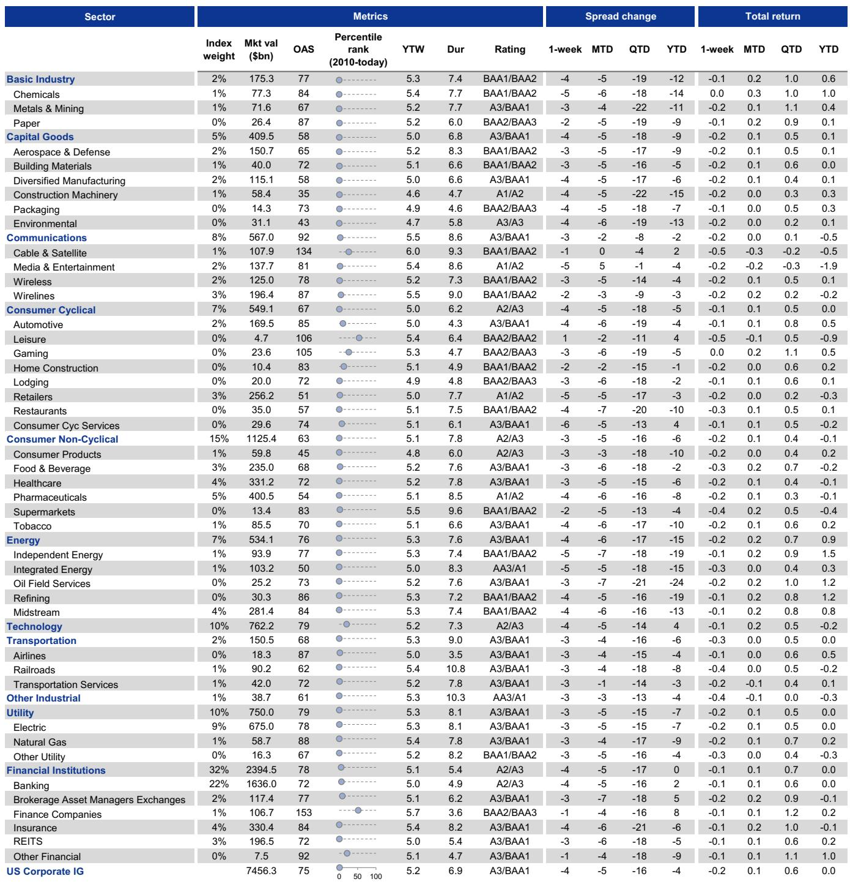

# 杠杆融资违约的真正风险不在于违约率本身，而在于违约形态的结构性侵蚀

过去几年，市场对信用风险的讨论主要集中在违约率的绝对水平上。2023年至2024年间，美国杠杆贷款市场的违约率从7.4%的峰值回落至5.1%，欧洲市场虽然仍在攀升，但整体仍处于历史中位数附近。这些数字让不少投资者松了一口气。

然而，某外资投行最新发布的《全球信用交易员》报告揭示了一个更值得警惕的判断：违约率的绝对水平已经不再是衡量信用风险的核心指标。真正改变游戏规则的，是违约形态的结构性转变——以“困境交换”为代表的负债管理操作正在成为主流，而这一趋势正在系统性地侵蚀回收率、催生“重复违约”现象，并最终改变整个杠杆融资市场的风险定价逻辑。

这份报告的核心洞察在于：市场当前的低违约率环境具有欺骗性。违约率没有飙升，但违约的质量在恶化。对于持有杠杆贷款和高收益债券的投资者而言，真正需要关注的不是“会不会违约”，而是“违约后能收回多少”。

## 1. 美国市场违约率已见顶，但欧洲仍在攀升，区域分化背后是增长与政策组合的差异

报告给出的第一个明确信号是：美国杠杆融资市场的违约峰值大概率已经过去。除非经济增长前景急剧恶化，否则美国高收益债券市场过去两年间一直在3%至4%的狭窄区间内波动，而杠杆贷款市场的违约率则从2024年末的高点持续回落。

这一判断与市场的普遍认知一致——美国经济在利率高位运行中展现出的韧性，为高杠杆企业提供了喘息空间。但关键在于，这份韧性并非全球性现象。

欧洲的情况截然不同。报告明确指出，欧洲高收益债券和杠杆贷款市场的违约率仍处于上升通道。背后的驱动因素并不复杂：欧洲面临的增长、通胀和货币政策组合更为棘手，大宗商品市场的中断仍在持续发酵。这种区域分化意味着，全球信用投资者不能简单用“违约率处于低位”来统一评估风险敞口。

对于跨市场配置的机构而言，这一分化带来的含义是：美国市场的信用风险定价可能已经趋于合理，但欧洲市场的风险溢价仍需要更充分的补偿。当前欧洲违约率的上升尚未触及历史峰值，但方向是明确的——继续走高。

## 2. 困境交换取代法庭重组成为主流，但“不彻底的资产负债表修复”正在制造重复违约

报告中最具洞察力的部分，是对违约形态变化的系统分析。传统的企业违约通常走向法庭主导的重组程序——Chapter 11或类似的法律框架。但当前周期中，这一模式正在被边缘化。

数据显示，困境交换或预包装Chapter 11在违约事件中的占比已经飙升至70%至80%，具体取决于不同的市场。在美国高收益市场，这一比例从2023年的65%升至2024年的78%，虽然2025年略有回落至72%，但2026年到目前为止仍维持在67%。欧洲市场的趋势同样显著：2025年欧洲高收益市场中困境交换的占比达到87%，杠杆贷款市场为83%。

困境交换之所以成为私募股权发起人的首选路径，原因在于它通常能在初始阶段更好地保全回收价值。报告提供了一个关键数据点：2025年，美国高收益优先无担保债券在困境交换中的平均回收率约为60%，而“硬违约”的回收率仅为10%左右。

但问题在于，困境交换往往不是一劳永逸的解决方案。报告将其描述为“不完整的资产负债表修复”——许多企业在完成一次困境交换后，债务负担仍然不可持续。这直接导致了“重复违约”现象的显著上升。

数据显示，通过困境交换完成重组的美国高收益发行人，在三年内再次违约的比例约为50%。而通过法庭重组完成的企业，这一比例接近于零。同样的模式在杠杆贷款市场和欧洲市场均得到验证。

这一发现对投资者的含义是深刻的：当违约事件从“一次性事件”转变为“多轮迭代过程”时，每一次后续的违约都会进一步侵蚀回收价值。报告指出，这种迭代违约正在系统性地恶化回收结果。对于持有这些债券的投资者而言，第一次违约后的回收率可能尚可接受，但第二次、第三次违约后的回收率将急剧下降。

## 3. 回收率持续走低并非偶然，而是“纯贷款资本结构”与“重复违约”共同作用的结果

回收率下降是近年来杠杆融资市场最令人不安的趋势之一。报告通过20年的历史数据追踪了美国优先无担保债券和第一留置权贷款的回收率走势，结论是明确的：回收率在持续走低，且这一趋势正在加速。

报告将这一现象归因于两个结构性因素。第一个是“重复违约”的上升——正如前文所述，每一次迭代违约都会进一步压缩回收空间。但第二个因素可能更为根本：资本结构的演变。

报告估算，目前超过70%的杠杆贷款是由“纯贷款资本结构”发行的，而这一比例在十年前仅为45%。所谓纯贷款资本结构，是指企业的融资完全依赖贷款，没有高收益债券作为次级资本。在过去，当企业同时发行贷款和债券时，债券作为次级资本为贷款提供了“次级缓冲”——债券持有人在回收顺序中排在贷款持有人之后，贷款因此获得了额外的保护。当这一缓冲消失，贷款持有人面临的风险敞口实际上大幅增加。

这一结构性变化意味着，即使违约率保持不变，贷款持有人的预期损失也在上升。因为一旦发生违约，回收率将低于历史平均水平。对于当前定价基于历史回收率假设的贷款产品而言，这一变化可能意味着风险定价的系统性低估。

报告同时指出，欧洲市场由于数据更为稀疏，尚未观察到类似的回收率下降趋势。但这并不意味着欧洲市场可以免疫——随着纯贷款资本结构在欧洲的普及，这一趋势很可能将跨越大西洋。

## 4. 违约的行业分布与市场叙事存在显著偏差：软件行业并非当前风险焦点

市场叙事中，软件行业经常被视为杠杆融资市场的潜在风险点——高估值、低盈利、依赖持续融资的商业模式，在利率上升环境中尤为脆弱。但报告的数据揭示了一个不同的现实。

当前违约的行业组成仍然严重偏向资本密集型行业和面向消费者的业务。这意味着，市场对软件行业风险的担忧可能被夸大了，至少在当前阶段如此。报告没有提供具体的行业违约占比数据，但这一判断本身已经足够重要：当投资者的注意力集中在某一特定行业时，真正的风险可能正在其他领域积累。

对于行业配置决策而言，这一发现意味着需要重新审视风险敞口的分布。如果市场普遍预期软件行业将出现违约潮，而实际违约仍集中在传统行业，那么基于这一预期进行的风险对冲或仓位调整可能并不必要，甚至可能是错误的。

## 5. 报告尚未完全回答的关键问题：困境交换对二级市场定价的长期影响究竟有多大

尽管报告对困境交换的机制和后果进行了深入分析，但有一个关键问题尚未得到充分解答：困境交换的普及对二级市场定价的长期影响如何评估？

困境交换本质上是一种“软性违约”——它避免了正式违约的法律程序，但同样改变了债券的条款、期限和回收预期。对于二级市场交易者而言，困境交换的债券如何定价？它们是否应该被视同违约债券？当前的信用利差是否充分反映了困境交换带来的回收率不确定性？

报告指出，困境交换在初始阶段能够保全更高的回收价值，但这只是第一次交换的情况。当市场预期某家企业可能需要进行多轮困境交换时，其债券的定价逻辑将变得极为复杂。传统的信用定价模型——基于违约概率和给定违约损失率——可能无法准确捕捉这种迭代风险。

另一个未解的问题是：困境交换对信用衍生品市场的影响。CDS合约对困境交换的定义和处理机制是否足够清晰？当困境交换成为主流违约形态时，CDS作为信用风险对冲工具的有效性是否会受到挑战？

这些问题报告没有完全展开，但对于深度参与杠杆融资市场的投资者而言，这恰恰是需要进一步探讨的核心议题。

## 6. 投资者的观察框架：从“违约率”转向“回收率预期”和“资本结构复杂度”

基于报告的洞察，投资者需要调整自己的分析框架。传统的信用风险评估以违约率为核心指标，但在当前环境下，这一指标的信号价值正在下降。

更有效的框架应该包含三个维度。第一，回收率预期。当超过70%的违约事件以困境交换形式发生时，历史回收率数据可能不再适用。投资者需要基于具体的资本结构和重组路径，对每笔持仓的预期回收率进行独立评估。纯贷款资本结构的债券，其回收率可能系统性低于历史均值。

第二，资本结构复杂度。企业是否具有混合资本结构（贷款加债券）？债券提供的次级缓冲是否仍然存在？如果企业已经通过困境交换消除了债券层，那么贷款持有人的风险敞口实际上已经扩大。这一信息在发行时的法律文件中可能并不显眼，但在当前环境下，它可能是决定风险回报比的关键变量。

第三，重复违约风险。对于已经经历过一次困境交换的企业，其三年内再次违约的概率约为50%。这意味着，任何持有此类企业债券的投资者，都需要将第二次违约的预期损失纳入定价。如果市场尚未充分定价这一风险，那么这些债券的信用利差可能被系统性低估。

对于欧洲市场的投资者，还需要额外关注增长和货币政策的分化。欧洲违约率的上升尚未结束，且回收率数据可能比美国市场更不透明。这意味着欧洲杠杆融资市场的信用风险溢价可能需要更高的补偿。

---

报告的核心价值在于，它揭示了市场正在经历一场表面平静下的结构性转变。违约率没有飙升，但违约的质量、回收的预期、以及风险定价的基础都在发生变化。对于投资者而言，最危险的信号往往不是数字的剧烈波动，而是衡量数字的标尺在悄然改变。

如果您对报告中的具体数据图表——包括美国与欧洲违约率的历史对比、困境交换占比的年度变化、以及回收率趋势的详细分析——感兴趣，欢迎加入我们的星球微信群继续讨论。我们会在群内分享完整的研报原文和原始数据图表，并围绕这些未解问题展开更深入的探讨。

Personal reading notes and learning share only. Not investment advice.

