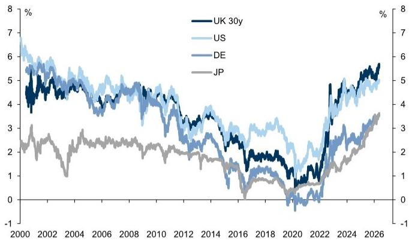
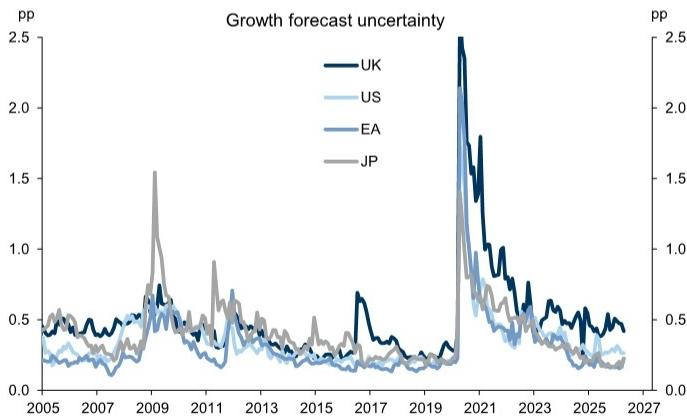
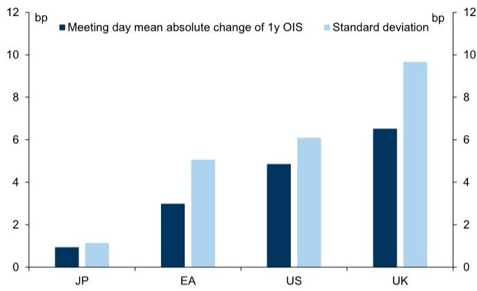
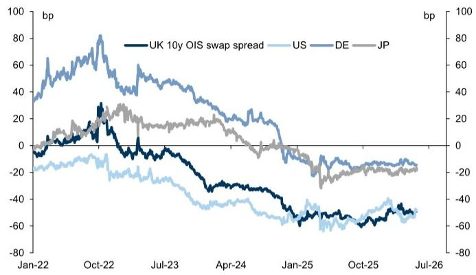
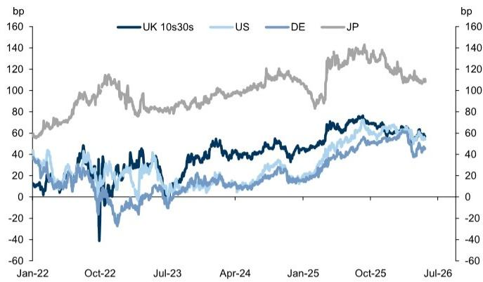
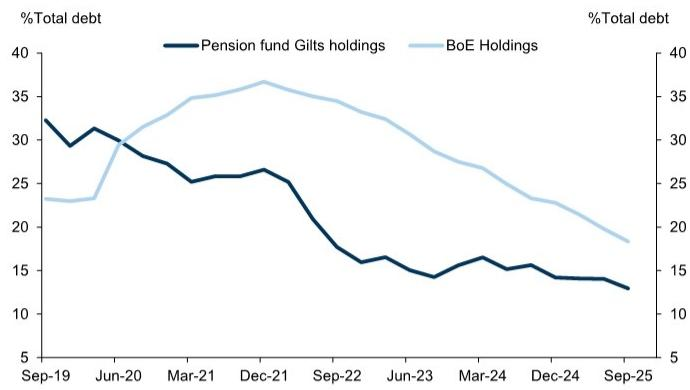
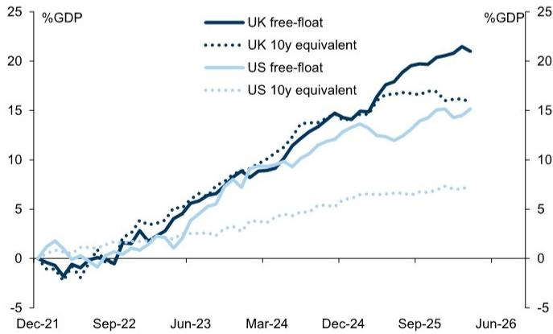
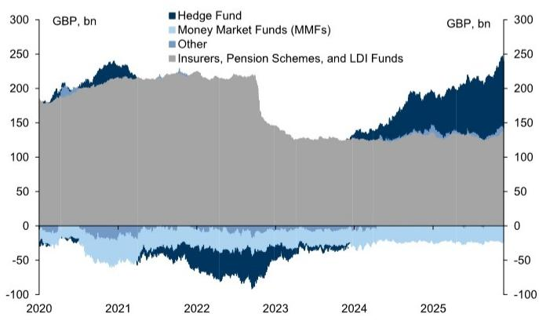

# Global Markets Daily: Why Always Gilts?

Gilt underperformance in recent years has been driven by a large increase in term premium. We argue that this is consistent with the macro performance of the UK economy — growth has been weak, inflation high, and survey measures of uncertainty are the highest among major economies.

■ Additionally, the rise in Gilt yields has occurred alongside a significant increase in global term premium. On various measures of long-end premium, Gilts have actually shown some improvement vs peer bond markets in recent quarters, suggesting Gilts are not always the source of bond bearish news. The evidence suggests that the underperformance in recent months is related to the repricing of the BoE policy path rather than a higher risk premium.

By our analysis, the underperformance of Gilts since 2022 has also been driven by the changes in supply and demand dynamics in the Gilt market. Large fiscal deficits and BoE QT have contributed to high supply, while the domestic pension system is no longer as significant as a source of demand.

■ Shifting expectations around forward bond supply could be a source of upside risk to our Gilt forecasts, and ongoing fiscal pressure from higher rates will likely result in relatively sticky Gilt risk premium in the near term. However, we continue to think that the macro outlook will be the main driver of Gilt yields — while uncertainty remains high, macro data consistent with the BoE on hold in 2026, and potentially cutting in 2027 (as per our economists' forecasts), would be a source of lasting relief for Gilts.

# Why Always Gilts?

The 30y Gilt yield traded above $5.8\%$ this week, a level last seen in 1998 (Exhibit 1). Gilt yields are high vs other developed economies, with the underperformance in recent years driven by a significant rise in UK term premium (Exhibit 2).

# George Cole

+44(20)7552-1214

george.cole@gs.com

GS International

# Loic Mathys

+44(20)7051-1664

loic.mathys@gs.com

GS International

Exhibit 1: Gilt yields are the highest among major DM bond markets   
G4 30y yields, GS fitted yields   

line

| Year | UK 30y | US  | DE  | JP  |
|------|--------|-----|-----|-----|
| 2000 | 5.5    | 7.0 | 5.8 | 2.5 |
| 2002 | 5.2    | 6.5 | 5.5 | 2.3 |
| 2004 | 4.8    | 6.0 | 5.2 | 2.1 |
| 2006 | 4.5    | 5.5 | 4.9 | 1.9 |
| 2008 | 4.2    | 5.0 | 4.6 | 1.7 |
| 2010 | 3.8    | 4.5 | 4.2 | 1.5 |
| 2012 | 3.5    | 4.0 | 3.8 | 1.3 |
| 2014 | 3.0    | 3.5 | 3.3 | 1.1 |
| 2016 | 2.5    | 3.0 | 2.8 | 0.9 |
| 2018 | 2.0    | 2.5 | 2.3 | 0.7 |
| 2020 | 1.5    | 2.0 | 1.8 | 0.5 |
| 2022 | 1.0    | 1.5 | 1.3 | 0.3 |
| 2024 | 1.5    | 2.0 | 1.8 | 0.5 |
| 2026 | 2.0    | 2.5 | 2.3 | 1.0 |

Source: GS Global Investment Research, GS FICC and Equities

Exhibit 2: UK term premium has increased most since 2022 Changes in G4 term premium, GS estimates   

line

| Date   | UK 10y term premium | US  | EA  | JP  |
|--------|---------------------|-----|-----|-----|
| Jan-22 | -50                 | -50 | -50 | -50 |
| Oct-22 | 180                 | 100 | 100 | 50  |
| Jul-23 | 50                  | 150 | 150 | 75  |
| Apr-24 | 100                 | 175 | 175 | 100 |
| Jan-25 | 200                 | 200 | 200 | 150 |
| Oct-25 | 250                 | 225 | 225 | 175 |
| Jul-26 | 275                 | 250 | 250 | 200 |

Source: GS Global Investment Research

With renewed focus on the Gilt market given ongoing policy uncertainty, the key question is whether these levels of yields and risk premium are justified. The first place to look for an explanation is the macro performance of the UK economy. Over recent years, UK growth has been weak relative to other economies, but inflation has been the highest. This combination of low growth and high inflation justifies an elevated risk premium as this attenuates the correlation of bonds with growth and weakens their hedge value for risk asset portfolios. In addition, Exhibit 3 and Exhibit 4 show that while macro uncertainty is well off its peak, the UK still exhibits the highest surveyed macro uncertainty among major economies. This has deeper roots in the structure of the UK economy and the nature of recent shocks — for example, a high dependence on gas in the UK energy mix, coupled with a relatively high level of inflation indexation across wages and prices.

Exhibit 3: UK growth forecast uncertainty highest in G4... Cross-sectional standard deviation of forecast panel   

line

| Year | UK    | US    | EA    | JP    |
|------|-------|-------|-------|-------|
| 2005 | 0.4   | 0.3   | 0.3   | 0.4   |
| 2006 | 0.5   | 0.4   | 0.4   | 0.5   |
| 2007 | 0.6   | 0.5   | 0.5   | 0.6   |
| 2008 | 0.7   | 0.6   | 0.6   | 0.7   |
| 2009 | 0.8   | 0.7   | 0.7   | 0.8   |
| 2010 | 0.9   | 0.8   | 0.8   | 0.9   |
| 2011 | 1.0   | 0.9   | 0.9   | 1.0   |
| 2012 | 1.1   | 1.0   | 1.0   | 1.1   |
| 2013 | 1.2   | 1.1   | 1.1   | 1.2   |
| 2014 | 1.3   | 1.2   | 1.2   | 1.3   |
| 2015 | 1.4   | 1.3   | 1.3   | 1.4   |
| 2016 | 1.5   | 1.4   | 1.4   | 1.5   |
| 2017 | 1.6   | 1.5   | 1.5   | 1.6   |
| 2018 | 1.7   | 1.6   | 1.6   | 1.7   |
| 2019 | 1.8   | 1.7   | 1.7   | 1.8   |
| 2020 | 2.5   | 2.4   | 2.4   | 2.5   |
| 2021 | 1.8   | 1.7   | 1.7   | 1.8   |
| 2022 | 1.5   | 1.4   | 1.4   | 1.5   |
| 2023 | 1.3   | 1.2   | 1.2   | 1.3   |
| 2024 | 1.1   | 1.0   | 1.0   | 1.1   |
| 2025 | 0.9   | 0.8   | 0.8   | 0.9   |
| 2026 | 0.7   | 0.6   | 0.6   | 0.7   |
| 2027 | 0.5   | 0.4   | 0.4   | 0.5   |

Source: GS Global Investment Research, Consensus Economics

Exhibit 4: ...and also highest inflation uncertainty in G4 Cross-sectional standard deviation of forecast panel   

line

| Year | UK    | US    | EA    | JP    |
|------|-------|-------|-------|-------|
| 2005 | 0.15  | 0.25  | 0.18  | 0.22  |
| 2006 | 0.18  | 0.28  | 0.20  | 0.25  |
| 2007 | 0.20  | 0.30  | 0.22  | 0.28  |
| 2008 | 0.25  | 0.35  | 0.25  | 0.32  |
| 2009 | 0.80  | 1.00  | 0.40  | 0.50  |
| 2010 | 0.55  | 0.60  | 0.35  | 0.45  |
| 2011 | 0.45  | 0.50  | 0.30  | 0.40  |
| 2012 | 0.40  | 0.45  | 0.28  | 0.35  |
| 2013 | 0.35  | 0.40  | 0.25  | 0.32  |
| 2014 | 0.38  | 0.42  | 0.27  | 0.33  |
| 2015 | 0.42  | 0.48  | 0.30  | 0.38  |
| 2016 | 0.38  | 0.45  | 0.28  | 0.35  |
| 2017 | 0.35  | 0.42  | 0.25  | 0.32  |
| 2018 | 0.38  | 0.45  | 0.27  | 0.33  |
| 2019 | 0.42  | 0.48  | 0.30  | 0.35  |
| 2020 | 0.48  | 0.55  | 0.35  | 0.42  |
| 2021 | 0.65  | 0.75  | 0.55  | 0.68  |
| 2022 | 1.20  | 1.15  | 1.18  | 1.17  |
| 2023 | 1.15  | 1.18  | 1.15  | 1.16  |
| 2024 | 1.18  | 1.15  | 1.18  | 1.17  |
| 2025 | 1.15  | 1.18  | 1.15  | 1.16  |
| 2026 | 1.18  | 1.15  | 1.18  | 1.17  |
| 2027 | 1.20  | 1.18  | 1.15  | 1.16  |

Source: GS Global Investment Research, Consensus Economics

Risk premium is related to this macro uncertainty and volatility. Realised volatility in UK rates has also been much higher than other economies, and although GBP implied rates vol had fallen ahead of the war in Iran, it is now back to being the highest in major markets. This volatility is also visible from a policy point of view — Exhibit 5 shows the realised volatility of movements in front-end rates on G4 central bank meeting days

since 2022. The market prices larger and more volatile moves in front-end rates, suggesting that it is not just elevated levels of macro uncertainty affecting the UK curve, but reaction function uncertainty as well.

Exhibit 5: Front-end rates have highest vol on BoE meeting days   
G4 mean (absolute change) and standard deviation of rate change on meeting days   

bar

| Country | Meeting day mean absolute change of 1y OIS (bp) | Standard deviation (bp) |
| :--- | :--- | :--- |
| JP | 0.9 | 1.1 |
| EA | 3.0 | 5.0 |
| US | 4.8 | 6.0 |
| UK | 6.5 | 9.7 |

Source: GS Global Investment Research, GS FICC and Equities, Haver Analytics

Exhibit 6: Gilts have cheapened vs swaps, but so have all G4 bonds   
10y OIS - 10y CMT G4 yields   

line

| Date   | UK 10y OIS swap spread | US  | DE  | JP  |
|--------|------------------------|-----|-----|-----|
| Jan-22 | ~30 bp                | ~-20 bp | ~40 bp | ~0 bp |
| Oct-22 | ~80 bp                | ~-10 bp | ~70 bp | ~20 bp |
| Jul-23 | ~40 bp                | ~-30 bp | ~50 bp | ~10 bp |
| Apr-24 | ~20 bp                | ~-40 bp | ~30 bp | ~0 bp |
| Jan-25 | ~-40 bp               | ~-60 bp | ~-20 bp | ~-20 bp |
| Oct-25 | ~-60 bp               | ~-50 bp | ~-30 bp | ~-10 bp |
| Jul-26 | ~-70 bp               | ~-60 bp | ~-40 bp | ~-20 bp |

Source: GS Global Investment Research, GS FICC and Equities

Given the UK has the highest growth, inflation and policy uncertainty, this — alongside higher levels of inflation and policy rates (UK policy rates were among the highest in the 2022-2024 cycle among the G10) — goes some way to explain the relative underperformance of Gilts in recent years. But the focus on elevated Gilt yields needs to be put in the context of a global repricing of long-end yields and risk premium. 30y JGB yields are at multi-decade highs, 30y Bund yields are at the highest levels post-sovereign crisis, and 30y UST yields are near the highs of the cycle. On other measures of relative bond pricing, such as swap spreads (Exhibit 6) and the 10s30s curve (Exhibit 7), Gilts are currently comparable to other curves, and have actually shown improvement in recent quarters on a relative basis. But, as we have shown (see here and here), the risk premium in Gilts has not increased much in recent months, despite Gilt yields rising more than in other bond markets. This is because the drivers of Gilt yields in recent months have been the shift in the fundamental outlook for inflation and central bank policy.

Exhibit 7: Gilt 10s30s steep, but not an outlier  
G4 10s30s curve spread   

line

| Date   | UK 10s30s | US  | DE  | JP  |
|--------|-----------|-----|-----|-----|
| Jan-22 | ~40       | ~40 | ~40 | ~60 |
| Oct-22 | ~-40      | ~-20| ~-20| ~100|
| Jul-23 | ~40       | ~20 | ~20 | ~80 |
| Apr-24 | ~60       | ~40 | ~40 | ~100|
| Jan-25 | ~60       | ~60 | ~60 | ~120|
| Oct-25 | ~70       | ~60 | ~60 | ~140|
| Jul-26 | ~60       | ~60 | ~60 | ~110|

Source: GS Global Investment Research, GS FICC and Equities

Exhibit 8: Gilts have seen a reduction in pension and BoE bond holdings   
Pension fund and BoE holdings as share of debt   

line

| Date | Pension fund Gilts holdings (%) | BoE Holdings (%) |
|---|---|---|
| Sep-19 | 32.5 | 23.5 |
| Jun-20 | 31.0 | 24.0 |
| Mar-21 | 26.0 | 35.0 |
| Dec-21 | 26.5 | 37.0 |
| Sep-22 | 18.0 | 34.0 |
| Jun-23 | 16.0 | 31.0 |
| Mar-24 | 16.5 | 27.0 |
| Dec-24 | 15.0 | 23.0 |
| Sep-25 | 13.0 | 18.0 |

Source: GS Global Investment Research, ONS, Haver Analytics, BoE

The global repricing of long-end yields is consistent with the features of the post-pandemic hiking cycles, namely a significant repricing higher of inflation risk, tighter monetary policy both via higher policy rates and smaller balance sheets, together with loose fiscal policy and high bond supply. Supply-demand imbalances have affected all curves but are also a contributor to Gilt underperformance through 2022-2025, as the BoE swung from a buyer of duration to a seller, and demand from UK pension funds fell structurally in the wake of the 2022 Gilt crisis (Exhibit 8). The rise in duration-adjusted bond free-float (Exhibit 9) — the stock of bonds available to the private sector — and the change of ownership to more price-sensitive bond holders (Exhibit 10) have likely also affected the behaviour and level of Gilt risk premium. However, it is less clear that these factors are worsening and so they are unlikely to be a clear reason for elevated risk in the near term.

Exhibit 9: Gilt free-float has increased sUBStantially, especially duration-weighted   
US vs UK pp change in free float and 10y-equivalent free float   

line

| Date | UK free-float (%) | UK 10y equivalent (%) | US free-float (%) | US 10y equivalent (%) |
|---|---|---|---|---|
| Dec-21 | -0.5 | -0.8 | 1.5 | 0.3 |
| Sep-22 | 2.0 | 3.5 | 1.0 | 1.5 |
| Jun-23 | 7.0 | 8.0 | 4.0 | 3.0 |
| Mar-24 | 10.0 | 11.0 | 8.0 | 5.0 |
| Dec-24 | 14.0 | 15.0 | 12.0 | 6.0 |
| Sep-25 | 19.0 | 16.0 | 14.0 | 7.0 |
| Jun-26 | 21.0 | 15.5 | 15.0 | 7.5 |

Source: GS Global Investment Research, DMO, BoE, Federal Reserve, US Treasury, Haver Analytics

Exhibit 10: Repo financing has decreased in pension funds  
Net repo positioning (borrowing)   

area

| Year | Hedge Fund (GBP bn) | Money Market Funds (MMFs) (GBP bn) | Insurers, Pension Schemes, and LDI Funds (GBP bn) | Other (GBP bn) |
|---|---|---|---|---|
| 2020 | -10 | -30 | 180 | 0 |
| 2021 | 240 | -20 | 210 | 0 |
| 2022 | -60 | -10 | 210 | 0 |
| 2023 | -90 | -10 | 130 | 0 |
| 2024 | 130 | -10 | 130 | 0 |
| 2025 | 190 | -10 | 140 | 0 |
| 2026 | 250 | -10 | 150 | 0 |

Source: GS Global Investment Research, BoE

To look at the drivers of Gilt risk premium in more detail, we expand on the term premium valuation framework outlined here. We estimate a model with various drivers of term premium. We use the free-float (the share of Gilts available to the private sector), a policy uncertainty measure, the unemployment gap, BoE Gilt holdings and the

G3 term premium, orthogonalised to BoE Gilt holdings $^{1}$ . Exhibit 11 shows the decomposition of Gilt term premium into those various drivers. Our model has a good fit by design, due in part to the inclusion of the (orthogonalised) global term premium. Our European economics team showed that, based on fiscal fundamentals, UK risk premium was high vs peers, but in this exercise we use this good fit to quantify the drivers of Gilt term premium rather than longer-run macro valuation $^{2}$ . We find that supply factors, including from BoE QT, as well as the broader increase in bond supply alongside the repricing in G3 term premium, explain the bulk of the repricing. We do find a modest role for policy uncertainty in boosting the UK term premium in previous years, but by nature of the index used (which remains low at the current period) it has had little impact recently.

Exhibit 11: QT, supply and global factors have driven UK term premium higher 10y UK term premium vs model fit and contributions to fit   

bar_line

| Date | Unemployment Gap (bp) | G3 Term Premium (% GDP) (bp) | Gilt Free Float (% GDP) (bp) | Policy Uncertainty (EPU) (bp) | BoE Gilt Holdings (%GDP) (bp) | Residual (bp) |
|---|---|---|---|---|---|---|
| Jan-22 | -5 | -10 | -5 | -5 | -10 | 0 |
| May-22 | -10 | 10 | 5 | 5 | 10 | 10 |
| Sep-22 | -5 | 15 | 10 | 10 | 40 | 30 |
| Jan-23 | 0 | 10 | 5 | 5 | 80 | 40 |
| May-23 | 5 | 15 | 10 | 10 | 60 | -30 |
| Sep-23 | 10 | 30 | 20 | 15 | 90 | -70 |
| Jan-24 | 15 | 35 | 25 | 20 | 100 | -75 |
| May-24 | 20 | 40 | 30 | 25 | 110 | -80 |
| Sep-24 | 25 | 45 | 35 | 30 | 120 | -85 |
| Jan-25 | 30 | 50 | 40 | 35 | 130 | -90 |
| May-25 | 35 | 55 | 45 | 40 | 140 | -95 |
| Sep-25 | 40 | 60 | 50 | 45 | 150 | -100 |
| Jan-26 | 45 | 65 | 55 | 50 | 160 | -105 |
| May-26 | 50 | 70 | 60 | 55 | 170 | -110 |

| Δ Fitted (bp) / Change in UK 10y term premium (bp) |
|---

| Unemployment Gap (bp) |
|---|
|---|
|---|
|---|
|---|
|---|
|---|
|---|
|---|
|---|
|---|
|---|
|---|
|---|
|---|
|---|
|---|
|---|
|---|
|---|
|---|
|---|
|---|
|---|
|---|
|---|
|---|
|---|
|---|
|---|
|---|
|---|
|---|
|---|
<fcel>G3 Term Premium (orth. to QE) (bp) |
|---|
|---|
|---|
|---|
|---|
|---|
|---|
|---|
|---|
|---|
|---|
|---|
|---|
|---|
|---|
|---|
|---|
|---|
|---|
|---|
|---|
|---|
|---|
|---|
|---|
|---|
|---|
|---|
|---|
|---|
|---|
|---|

Source: GS Global Investment Research, GS FICC and Equities, Haver Analytics, FRED, AMECO, BoE

This analysis helps show why Gilt yields and the Gilt term premium are at historical highs. First, all major bond markets have seen significant weakness in long-end bonds among a generalised repricing of growth and inflation risk. Second, the UK has experienced the highest levels of inflation, the greatest macro and policy uncertainty (by a range of measures). And finally, the model above shows the largest duration-adjusted increase in supply amid a shifting composition of demand.

In the near term political and fiscal risks may re-emerge, and the analysis above would suggest that any pressure on supply expectations could exacerbate the already-elevated Gilt risk premium. This is most likely to come from a loosening of fiscal policy — for example, debates about higher defence spending commitments and the challenge of

incorporating this into existing fiscal rules could be a source of this risk. We estimate that a 1pp increase in the medium-term deficit is worth around 30-40bp higher Gilt yields. The pressure on fiscal policy via high interest rates and ongoing policy uncertainty make it difficult for Gilt risk premium to compress.

However, some of the factors that have driven higher yields over recent years should ultimately fade. Quantitative tightening will eventually slow as the BoE's balance sheet shrinks, and fiscal deficits under current policy settings are due to narrow gradually. As discussed above, relative measures of Gilt performance, such as swap spreads and long-end curve shape, indicate these factors are already improving. And while global dynamics are contributing to higher Gilt yields, we expect to see lower yields in most major markets over time. As our European economists have argued, Gilt yields are high relative to the UK's fiscal fundamentals and rates remain well above equilibrium levels. This points to lower Gilt yields over time.

For 2026, we continue to think that macro outcomes on inflation and BoE policy will remain the key drivers for Gilt yields. Our baseline remains that the BoE will be on hold through 2026, before cutting in 2027, and as a result we continue to see 10y Gilt yields at $4.40\%$ at end-2026. But the ongoing disruption to global energy and commodity markets skew inflation and yield risks to the upside. We think front-end longs and belly underweights make sense in the near term.

# TRADE IDEAS

# Best Trade Ideas Across Assets

For pricing, charts, and a list of previous recommendations, please visit our Trade Ideas page.

1. Stay short SGD/MYR, opened January 24, 2026, at 3.13, with a target at 2.90 and a stop at 3.30, currently trading at 3.09.   
2. Stay long TRY, NGN and KZT against the USD, as an equally weighted basket, opened February 18, 2026, at $0\%$ , with a total return target of $7.5\%$ , and a revised stop of $0\%$ , currently trading at $2.3\%$ .   
3. Buy 3-month (May $21^{\text{st}}$ ) 11.45/12.00 EUR/NOK call spreads, opened February 20, 2026, at a spot level of 11.22, currently trading at a spot level of 10.75.   
4. Stay long USD/SEK, opened March 20, 2026, at 9.3443, with a target at 9.65 and a stop at 9.00, currently trading at 9.3277.   
5. Stay long 3y France, Spain, Italy vs OIS (equally weighted), opened April 10, 2026, at 0.33, with a target at 0.23 and a stop at 0.40, currently trading at 0.31.   
6. Stay long MSCI Korea and Taiwan (equal weight) vs. short MSCI India, Philippines, Thailand (equal weight), opened April 16, 2026, at 100, with a revised target of 135 and a revised stop of 115, currently trading at 126.   
7. Stay short EUR/HUF, opened 17 April 2026, at 361, with a target of 350 and a stop of 372, currently trading at 358.   
8. Stay long 3y SOFR swap spread, opened 17 April 2026, at -22.6bp, with a target at

-18bp inclusive of carry; and a stop at -25.5bp, currently trading at -20.9bp.

9. 2s5s CAD steepener, opened 24 April 2026, at 20bp, with a target at 35bp and a stop at 10bp, current trading at 21bp.   
10. Stay short USD/EGP, opened 24 April 2026, at 0%, with a total return target at 6% and a stop at -3%, currently trading at 0.2%.   
11. Stay long 5y5y EUR OIS – HICP, opened 01 May 2026, at 1.09%, with a target at 0.88% and a stop at 1.22%, currently trading at 1.07%.   
12. Stay long 5y Receivers on 3m 2s5s10s Receiver Fly (bp running), opened 09 May 2026, at 1bp, with a target at 10bp and a stop at -5bp, currently trading at 0bp.

# Global Interest Rates Strategy

# George Cole

+44(20)7552-1214

george.cole@gs.com

GS International

# William Marshall

+1(212)357-0413

william.c.marshall@gs.com

GS & Co. LLC

# Simon Freycenet

+44(20)7774-5017

simon.freycenet@gs.com

GS Bank Europe SE - Paris

Branch

# Isabella Rosenberg

+1(212)357-7628

isabella.rosenberg@gs.com

GS & Co. LLC

# Friedrich Schaper

+1(917)343-3214

friedrich.schaper@gs.com

GS & Co. LLC

# Loic Mathys

+44(20)7051-1664

loic.mathys@gs.com

GS International

# Disclosure Appendix

# Reg AC

We, George Cole and Loic Mathys, hereby certify that all of the views expressed in this report accurately reflect our personal views, which have not been influenced by considerations of the firm's business or client relationships.

Unless otherwise stated, the individuals listed on the cover page of this report are analysts in GS' Global Investment Research division.

Contributing Authors: George Cole GS International, Loic Mathys GS International.

Unless otherwise stated, the individuals listed in the Contributing Authors disclosure of this report are analysts in GS' Global Investment Research division.

# Disclosures

# Regulatory disclosures

# Disclosures required by United States laws and regulations

See company-specific regulatory disclosures above for any of the following disclosures required as to companies referred to in this report: manager or co-manager in a pending transaction; $1\%$ or other ownership; compensation for certain services; types of client relationships; managed/co-managed public offerings in prior periods; directorships; for equity securities, market making and/or specialist role. GS trades or may trade as a principal in debt securities (or in related derivatives) of issuers discussed in this report.

The following are additional required disclosures: Ownership and material conflicts of interest: GS policy prohibits its analysts, professionals reporting to analysts and members of their households from owning securities of any company in the analyst's area of coverage. Analyst compensation: Analysts are paid in part based on the profitability of GS, which includes investment banking revenues. Analyst as officer or director: GS policy generally prohibits its analysts, persons reporting to analysts or members of their households from serving as an officer, director or advisor of any company in the analyst's area of coverage. Non-U.S. Analysts: Non-U.S. analysts may not be associated persons of GS & Co. LLC and therefore may not be subject to FINRA Rule 2241 or FINRA Rule 2242 restrictions on communications with a subject company, public appearances and trading in securities covered by the analysts.

# Additional disclosures required under the laws and regulations of jurisdictions other than the United States

The following disclosures are those required by the jurisdiction indicated, except to the extent already made above pursuant to United States laws and regulations. Australia: GS Australia Pty Ltd and its affiliates are not authorised deposit-taking institutions (as that term is defined in the Banking Act 1959 (Cth)) in Australia and do not provide banking services, nor carry on a banking business, in Australia. This research, and any access to it, is intended only for “wholesale clients” within the meaning of the Australian Corporations Act, unless otherwise agreed by GS. In producing research reports, members of Global Investment Research of GS Australia may attend site visits and other meetings hosted by the companies and other entities which are the subject of its research reports. In some instances the costs of such site visits or meetings may be met in part or in whole by the issuers concerned if GS Australia considers it is appropriate and reasonable in the specific circumstances relating to the site visit or meeting. To the extent that the contents of this document contains any financial product advice, it is general advice only and has been prepared by GS without taking into account a client’s objectives, financial situation or needs. A client should, before acting on any such advice, consider the appropriateness of the advice having regard to the client’s own objectives, financial situation and needs. A copy of certain GS Australia and New Zealand disclosure of interests and a copy of GS’ Australian Sell-Side Research Independence Policy Statement are available at: https://www.goldmansachs.com/disclosures/australia-new-zealand/index.html. Brazil: Disclosure information in relation to CVM Resolution n. 20 is available at https://www.gs.com/worldwide/brazil/area/gir/index.html. Where applicable, the Brazil-registered analyst primarily responsible for the content of this research report, as defined in Article 20 of CVM Resolution n. 20, is the first author named at the beginning of this report, unless indicated otherwise at the end of the text. Canada: This information is being provided to you for information purposes only and is not, and under no circumstances should be construed as, an advertisement, offering or solicitation by GS & Co. LLC for purchasers of securities in Canada to trade in any Canadian security. GS & Co. LLC is not registered as a dealer in any jurisdiction in Canada under applicable Canadian securities laws and generally is not permitted to trade in Canadian securities and may be prohibited from selling certain securities and products in certain jurisdictions in Canada. If you wish to trade in any Canadian securities or other products in Canada please contact GS Canada Inc., an affiliate of The GS Group Inc., or another registered Canadian dealer. Hong Kong: Further information on the securities of covered companies referred to in this research may be obtained on request from GS (Asia) L.L.C. India: Further information on the subject company or companies referred to in this research may be obtained from GS (India) Securities Private Limited, Research Analyst - SEBI Registration Number INH000001493, 10th Floor, Ascent-Worli, Sudam Kalu Ahire Marg, Worli, Mumbai-400 025, India, Corporate Identity Number U74140MH2006FTC160634, Phone +91 22 6616 9000, Fax +91 22 6616 9001. GS may beneficially own 1% or more of the securities (as such term is defined in clause 2 (h) the Indian Securities Contracts (Regulation) Act, 1956) of the subject company or companies referred to in this research report. Investment in securities market are subject to market risks. Read all the related documents carefully before investing. Registration granted by SEBI and certification from NISM in no way guarantee performance of the intermediary or provide any assurance of returns to investors. GS (India) Securities Private Limited compliance officer and investor grievance contact details can be found at: https://www.goldmansachs.com/worldwide/india/documents/Grievance-Redressal-and-Escalation-Matrix.pdf, and a copy of the annual audit compliance report can be found at this link: https://publishing.gs.com/content/site/india-annual-compliance-report.html. Japan: See below. Korea: This research, and any access to it, is intended only for “professional investors” within the meaning of the Financial Services and Capital Markets Act, unless otherwise agreed by GS. Further information on the subject company or companies referred to in this research may be obtained from GS (Asia) L.L.C., Seoul Branch. New Zealand: GS New Zealand Limited and its affiliates are neither “registered banks” nor “deposit takers” (as defined in the Reserve Bank of New Zealand Act 1989) in New Zealand. This research, and any access to it, is intended for “wholesale clients” (as defined in the Financial Advisers Act 2008) unless otherwise agreed by GS. A copy of certain GS Australia and New Zealand disclosure of interests is available at: https://www.goldmansachs.com/disclosures/australia-new-zealand/index.html. Russia: Research reports distributed in the Russian Federation are not advertising as defined in the Russian legislation, but are information and analysis not having product promotion as their main purpose and do not provide appraisal within the meaning of the Russian legislation on appraisal activity. Research reports do not constitute a personalized investment recommendation as defined in Russian laws and regulations, are not addressed to a specific client, and are prepared without analyzing the financial circumstances, investment profiles or risk profiles of clients. GS assumes no responsibility for any investment decisions that may be taken by a client or any other person based on this research report. Singapore: GS (Singapore) Pte. (Company Number: 198602165W), which is regulated by the Monetary Authority of Singapore, accepts legal responsibility for this research, and should be contacted with respect to any matters arising from, or in connection with, this research. Taiwan: This material is for reference only and must not be reprinted without permission. Investors should carefully consider their own investment risk. Investment results are the responsibility of the individual investor. United Kingdom: Persons who would be categorized as retail clients in the United Kingdom, as such term is defined in the rules of the Financial Conduct Authority, should read this research in conjunction with prior GS on the covered

companies referred to herein and should refer to the risk warnings that have been sent to them by GS International. A copy of these risks warnings, and a glossary of certain financial terms used in this report, are available from GS International on request.

European Union and United Kingdom: Disclosure information in relation to Article 6 (2) of the European Commission Delegated Regulation (EU) (2016/958) supplementing Regulation (EU) No 596/2014 of the European Parliament and of the Council (including as that Delegated Regulation is implemented into United Kingdom domestic law and regulation following the United Kingdom's departure from the European Union and the European Economic Area) with regard to regulatory technical standards for the technical arrangements for objective presentation of investment recommendations or other information recommending or suggesting an investment strategy and for disclosure of particular interests or indications of conflicts of interest is available at https://www.gs.com/disclosures/europeanpolicy.html which states the European Policy for Managing Conflicts of Interest in Connection with Investment Research.

Japan: GS Japan Co., Ltd. is a Financial Instrument Dealer registered with the Kanto Financial Bureau under registration number Kinsho 69, and a member of Japan Securities Dealers Association, Financial Futures Association of Japan Type II Financial Instruments Firms Association, and Investment Management Association of Japan. Sales and purchase of equities are subject to commission pre-determined with clients plus consumption tax. See company-specific disclosures as to any applicable disclosures required by Japanese stock exchanges, the Japanese Securities Dealers Association or the Japanese Securities Finance Company.

# Global product; distributing entities

GS Global Investment Research produces and distributes research products for clients of GS on a global basis. Analysts based in GS offices around the world produce research on industries and companies, and research on macroeconomics, currencies, commodities and portfolio strategy. This research is disseminated in Australia by GS Australia Pty Ltd (ABN 21 006 797 897); in Brazil by GS do Brasil Corretora de Títulos e Valores Mobiliários S.A.; Public Communication Channel GS Brazil: 0800 727 5764 and / or contatogoldmanbrasil@gs.com. Available Weekdays (except holidays), from 9am to 6pm. Canal de Comunicação com o Público GS Brasil: 0800 727 5764 e/ou contatogoldmanbrasil@gs.com. Horário de funcionamento: segunda-feira à sexta-feira (exceto feriados), das 9h às 18h; in Canada by GS & Co. LLC; in Hong Kong by GS (Asia) L.L.C.; in India by GS (India) Securities Private Ltd.; in Japan by GS Japan Co., Ltd.; in the Republic of Korea by GS (Asia) L.L.C., Seoul Branch; in New Zealand by GS New Zealand Limited; in Russia by OOO GS; in Singapore by GS (Singapore) Pte. (Company Number: 198602165W); and in the United States of America by GS & Co. LLC. GS International has approved this research in connection with its distribution in the United Kingdom.

GS International (“GSI”), authorised by the Prudential Regulation Authority (“PRA”) and regulated by the Financial Conduct Authority (“FCA”) and the PRA, has approved this research in connection with its distribution in the United Kingdom.

European Economic Area: GS Bank Europe SE ("GSBE") is a credit institution incorporated in Germany and, within the Single Supervisory Mechanism, subject to direct prudential supervision by the European Central Bank and in other respects supervised by German Federal Financial Supervisory Authority (Bundesanstalt für Finanzdienstleistungsaufsicht, BaFin) and Deutsche Bundesbank and disseminates research within the European Economic Area.

# General disclosures

This research is for our clients only. Other than disclosures relating to GS, this research is based on current public information that we consider reliable, but we do not represent it is accurate or complete, and it should not be relied on as such. The information, opinions, estimates and forecasts contained herein are as of the date hereof and are subject to change without prior notification. We seek to update our research as appropriate, but various regulations may prevent us from doing so. Other than certain industry reports published on a periodic basis, the large majority of reports are published at irregular intervals as appropriate in the analyst's judgment.

GS conducts a global full-service, integrated investment banking, investment management, and brokerage business. We have investment banking and other business relationships with a sUBStantial percentage of the companies covered by Global Investment Research. GS & Co. LLC, the United States broker dealer, is a member of SIPC (https://www.sipc.org).

Our salespeople, traders, and other professionals may provide oral or written market commentary or trading strategies to our clients and principal trading desks that reflect opinions that are contrary to the opinions expressed in this research. Our asset management area, principal trading desks and investing businesses may make investment decisions that are inconsistent with the recommendations or views expressed in this research.

We and our affiliates, officers, directors, and employees will from time to time have long or short positions in, act as principal in, and buy or sell, the securities or derivatives, if any, referred to in this research, unless otherwise prohibited by regulation or GS policy.

The views attributed to third party presenters at GS arranged conferences, including individuals from other parts of GS, do not necessarily reflect those of Global Investment Research and are not an official view of GS.

Any third party referenced herein, including any salespeople, traders and other professionals or members of their household, may have positions in the products mentioned that are inconsistent with the views expressed by analysts named in this report.

This research is focused on investment themes across markets, industries and sectors. It does not attempt to distinguish between the prospects or performance of, or provide analysis of, individual companies within any industry or sector we describe.

Any trading recommendation in this research relating to an equity or credit security or securities within an industry or sector is reflective of the investment theme being discussed and is not a recommendation of any such security in isolation.

This research is not an offer to sell or the solicitation of an offer to buy any security in any jurisdiction where such an offer or solicitation would be illegal. It does not constitute a personal recommendation or take into account the particular investment objectives, financial situations, or needs of individual clients. Clients should consider whether any advice or recommendation in this research is suitable for their particular circumstances and, if appropriate, seek professional advice, including tax advice. The price and value of investments referred to in this research and the income from them may fluctuate. Past performance is not a guide to future performance, future returns are not guaranteed, and a loss of original capital may occur. Fluctuations in exchange rates could have adverse effects on the value or price of, or income derived from, certain investments.

Certain transactions, including those involving futures, options, and other derivatives, give rise to sUBStantial risk and are not suitable for all investors. Investors should review current options and futures disclosure documents which are available from GS sales representatives or at https://www.theocc.com/about/publications/character-risks.jsp and https://www.goldmansachs.com/disclosures/cftc\_fcm\_disclosures. Transaction costs may be significant in option strategies calling for multiple purchase and sales of options such as spreads. Supporting documentation will be supplied upon request.

Differing Levels of Service provided by Global Investment Research: The level and types of services provided to you by GS Global Investment Research may vary as compared to that provided to internal and other external clients of GS, depending on various factors including your individual preferences as to the frequency and manner of receiving communication, your risk profile and investment focus and perspective (e.g.,

marketwide, sector specific, long term, short term), the size and scope of your overall client relationship with GS, and legal and regulatory constraints. As an example, certain clients may request to receive notifications when research on specific securities is published, and certain clients may request that specific data underlying analysts' fundamental analysis available on our internal client websites be delivered to them electronically through data feeds or otherwise. No change to an analyst's fundamental research views (e.g., ratings, price targets, or material changes to earnings estimates for equity securities), will be communicated to any client prior to inclusion of such information in a research report broadly disseminated through electronic publication to our internal client websites or through other means, as necessary, to all clients who are entitled to receive such reports.

All research reports are disseminated and available to all clients simultaneously through electronic publication to our internal client websites. Not all research content is redistributed to our clients or available to third-party aggregators, nor is GS responsible for the redistribution of our research by third party aggregators. For research, models or other data related to one or more securities, markets or asset classes (including related services) that may be available to you, please contact your GS representative or go to https://research.gs.com.

Disclosure information is also available at https://www.gs.com/research/hedge.html or from Research Compliance, 200 West Street, New York, NY 10282.

# © 2026 GS.

You are permitted to store, display, analyze, modify, reformat, and print the information made available to you via this service only for your own use. You may not resell or reverse engineer this information to calculate or develop any index for disclosure and/or marketing or create any other derivative works or commercial product(s), data or offering(s) without the express written consent of GS. You are not permitted to publish, transmit, or otherwise reproduce this information, in whole or in part, in any format to any third party without the express written consent of GS. This foregoing restriction includes, without limitation, using, extracting, downloading or retrieving this information, in whole or in part, to train or finetune a machine learning or artificial intelligence system, or to provide or reproduce this information, in whole or in part, as a prompt or input to any such system.