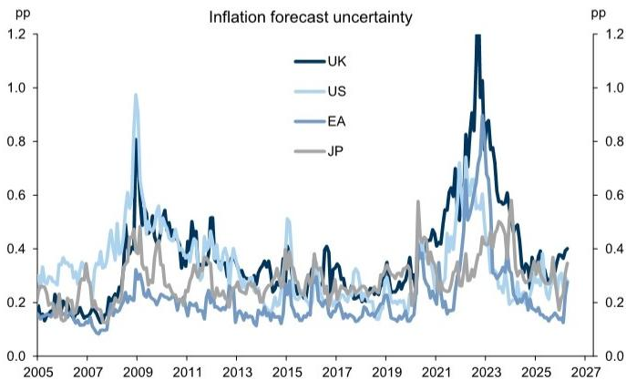
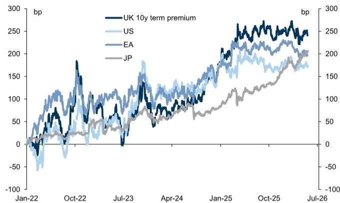

# UK Gilts Are Not Always the Problem: Why the Bond Market's Underperformance Is a Global Story with Local Amplifiers

The 30-year Gilt yield recently breached 5.8%, a level not seen since 1998. For investors watching UK government bonds, the instinct is to reach for a familiar narrative: fiscal irresponsibility, political dysfunction, a structural loss of credibility. But that story, while convenient, misses the deeper pattern. The underperformance of Gilts since 2022 is real, but it is not uniquely a UK failure. It is a global repricing of term premium, amplified by specific UK vulnerabilities that are now better understood than they were two years ago.

The critical insight from recent analysis is that Gilt yields have risen alongside a significant increase in global term premium. On several measures of relative bond pricing, Gilts have actually shown improvement versus peer bond markets in recent quarters. This is not a market that has lost its mind about UK fiscal credibility. It is a market that has repriced inflation risk, monetary policy uncertainty, and supply-demand imbalances across all developed economies, with the UK experiencing the most acute version of each.

The question is not whether Gilts are cheap. They are. The question is whether they will stay cheap, and what catalysts could change that. The answer depends on understanding why term premium has risen, which factors are temporary, and which are structural.

## The UK's Macro Performance Explains the Term Premium, Not a Credibility Crisis

The most direct explanation for elevated Gilt yields is the macroeconomic record of the UK economy since 2022. Growth has been weak relative to other major economies, inflation has been the highest, and survey measures of macro uncertainty are the highest among the G4. This combination is toxic for bond markets because it weakens the hedge value of government bonds in risk-asset portfolios. When growth is low and inflation is high, the correlation between bonds and equities rises, reducing the diversification benefit that institutional investors rely on.

But this is not a story about a loss of confidence in UK institutions. It is a story about the structure of the UK economy and the nature of the shocks it has faced. The UK has a high dependence on gas in its energy mix, which made it particularly vulnerable to the energy price shock. It also has a relatively high level of inflation indexation across wages and prices, which means that inflation shocks feed through more persistently. These are structural features, not governance failures.

The data on policy uncertainty is revealing. Cross-sectional standard deviation of growth forecasts for the UK is the highest in the G4. Inflation forecast uncertainty is also the highest. And realised volatility of front-end rates on Bank of England meeting days is significantly higher than for the Federal Reserve, the ECB, or the Bank of Japan. The market is pricing not just higher levels of macro uncertainty, but higher reaction function uncertainty. The BoE's policy path has been harder to predict than its peers', and that uncertainty is priced into the curve.

## The Global Context Matters More Than the UK-Specific Narrative

It would be a mistake to analyse Gilt underperformance in isolation. The 30-year JGB yield is at multi-decade highs. The 30-year Bund yield is at the highest levels since the sovereign crisis. The 30-year UST yield is near the highs of the cycle. All major bond markets have seen a significant repricing of long-end yields and risk premium.

On measures of relative bond pricing, the Gilt market looks less exceptional than the headline yield figures suggest. Swap spreads for Gilts are comparable to those in other markets. The 10s30s curve steepness is not an outlier. And on some measures, Gilts have actually shown improvement on a relative basis in recent quarters. The underperformance in recent months is more closely related to the repricing of the BoE policy path than to a rising risk premium.

This matters for investors because it changes the diagnosis. If Gilt underperformance were primarily a UK-specific crisis of confidence, the remedy would be domestic: fiscal consolidation, institutional reform, political stability. But if the underperformance is largely a function of global factors that happen to be more acute in the UK, then the remedy is patience and macro convergence. The global repricing of term premium may have further to run, but it is not a UK problem to solve alone.

## Supply and Demand Dynamics Have Changed Permanently, but Not Uniformly

The rise in Gilt yields since 2022 has been amplified by significant shifts in supply and demand dynamics. Large fiscal deficits and the Bank of England's quantitative tightening programme have contributed to high supply, while the domestic pension system is no longer as significant a source of demand.

The data on pension fund holdings is striking. Pension funds and the BoE together have seen their combined share of Gilt holdings decline sUBStantially since 2021. The pension fund sector, which was a stable source of demand through the post-GFC period, has retreated in the wake of the 2022 Gilt crisis. The duration-adjusted free-float of Gilts has increased sUBStantially, and the ownership structure has shifted toward more price-sensitive holders.

But these factors are not necessarily worsening. The free-float increase has been large, but it is not accelerating. The shift in ownership is already priced in. The question is whether these structural changes will continue to exert upward pressure on yields, or whether they represent a one-time adjustment that the market has already absorbed.

The model decomposition of UK term premium is instructive. Supply factors, including from BoE QT, and the broader increase in bond supply alongside the repricing in G3 term premium, explain the bulk of the repricing. Policy uncertainty plays a modest role, but the index used for policy uncertainty has declined recently, suggesting that this factor is not the primary driver of current elevated yields.

## The Report Does Not Fully Resolve Whether the Term Premium Has Further to Rise

The analysis provides a robust framework for understanding what has driven Gilt term premium higher, but it leaves several open questions that are material for investors.

First, the model's good fit is partly a function of including the orthogonalised global term premium. This means that the model is in some sense circular: UK term premium is explained partly by global term premium, which itself has risen for reasons that may or may not be related to UK factors. The question of whether global term premium will compress, and what would cause that compression, is not fully addressed.

Second, the role of fiscal policy is treated primarily through the lens of supply expectations. The report estimates that a 1 percentage point increase in the medium-term deficit is worth around 30-40 basis points of higher Gilt yields. But the political economy of UK fiscal policy is highly uncertain. Debates about higher defence spending commitments and how to incorporate them into existing fiscal rules could be a source of significant upward pressure on yields. The report acknowledges this risk but does not model it in detail.

Third, the interaction between the BoE's balance sheet normalisation and the pension system's restructuring is not fully explored. QT will eventually slow, but the pension system's demand for Gilts may not return to previous levels. The market may need to find new sources of demand, and it is not clear where those will come from.

## A Decision Framework for Investors Evaluating Gilt Exposure

For investors trying to decide how to position in Gilts, the analysis suggests a framework with three dimensions.

The first dimension is macro convergence. If UK growth improves, inflation falls, and macro uncertainty declines, the case for Gilt yields to fall is strong. The report's economists forecast that the BoE will remain on hold in 2026 and potentially cut in 2027, which would be a source of lasting relief for Gilts. Investors need to assess whether they share that macro view.

The second dimension is supply expectations. Fiscal deficits under current policy settings are due to narrow gradually, but the political process could easily produce larger deficits. The risk of a loosening of fiscal policy is real, and the sensitivity of yields to deficit changes is material. Investors who believe fiscal discipline will hold should be more comfortable with Gilts. Those who expect further fiscal loosening should demand a higher risk premium.

The third dimension is relative value. On several measures, Gilts are not as cheap relative to peers as the headline yield suggests. Swap spreads and curve shape have improved. But the absolute level of yields is high by historical standards, and the term premium is elevated. The question is whether the term premium is justified by the macro environment or whether it reflects temporary factors that will fade.

The framework suggests that the most important variable to watch is not the next fiscal announcement or the next BoE decision, but the path of macro uncertainty. If uncertainty declines, the term premium should compress, and Gilts will rally. If uncertainty remains elevated, the term premium will stay high, and yields will remain under pressure.

## The Unresolved Analytical Questions That Deserve Further Study

The analysis raises several questions that the full report may address more completely.

How much of the UK term premium is driven by factors that are reversible versus structural? The report suggests that QT and supply factors have been important, but these are policy choices that can change. The structural shift in pension demand may be more permanent.

What is the correct benchmark for evaluating whether Gilts are cheap? Comparing yields to history is one approach, but comparing yields to a model-implied fair value that accounts for macro uncertainty and supply dynamics is more informative. The report's model suggests that the term premium is largely explained by observable factors, which implies that there is not a large unexplained residual that would indicate mispricing.

How should investors think about the tail risk of a fiscal crisis? The report acknowledges that political and fiscal risks may re-emerge, but it does not model a crisis scenario. The 2022 Gilt crisis showed that the market can move violently when confidence breaks, and the current elevated level of yields means that the margin for error is smaller.

These are not weaknesses of the analysis. They are the natural boundaries of any research report. The value of the analysis is that it provides a clear framework for thinking about these questions, not that it provides definitive answers.

Join the community to read the full report and review the original charts.

*This article is for learning and discussion only and does not constitute investment advice.*

Personal reading notes and learning share only. Not investment advice.

