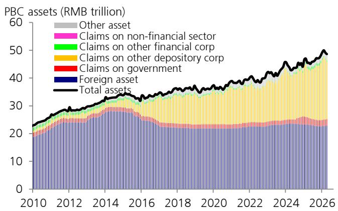
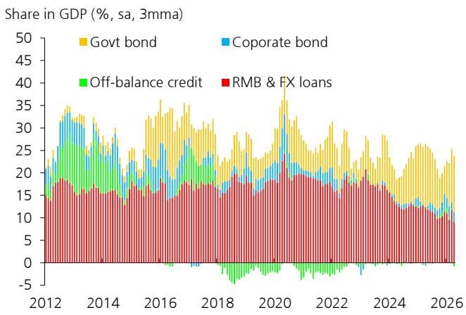

# China’s Credit Contraction Is Not a Liquidity Problem—It Is a Demand Problem That Policy Cannot Easily Solve

April’s credit data should silence any remaining optimism that China’s economy is on a self-sustaining recovery path. New RMB loans turned negative for the first time in recent memory, contracting by RMB 10 billion. Total social financing missed market expectations by nearly half, coming in at RMB 625 billion against a consensus estimate of RMB 1.25 trillion. These are not seasonal noise or technical adjustments. They are signals of a structural breakdown in the transmission mechanism between policy intent and private-sector behavior.

The conventional narrative has been that China’s authorities can always flood the system with liquidity and credit will follow. That narrative is breaking down. The People’s Bank of China has kept interbank conditions extraordinarily loose—the 7-day repo rate has been hovering around 1.3 percent, below the policy operation rate of 1.4 percent, and daily reverse repo volumes have fallen to negligible levels of RMB 0.5 to 1 billion. Banks are not borrowing because they do not need to. And they do not need to because they cannot find enough creditworthy borrowers.

What we are witnessing is a demand-driven credit contraction in an environment of ample liquidity. This is a fundamentally different challenge from the supply-driven tightening episodes of the past. Policy tools designed to stimulate lending are becoming ineffective because the constraint is no longer on the banking system’s ability to lend—it is on the private sector’s willingness and ability to borrow. The implications for investors, corporate strategists, and policymakers are profound. The standard playbook of rate cuts, reserve requirement reductions, and open market operations will not work unless accompanied by measures that directly address the structural weaknesses in credit demand.

## The Collapse in Household and Corporate Borrowing Reveals a Confidence Problem That Monetary Easing Cannot Fix

The composition of April’s credit data is more troubling than the headline numbers alone suggest. Household loans contracted by RMB 341 billion, a deterioration of RMB 218 billion year-on-year. Corporate loans declined by RMB 410 billion, a swing of RMB 660 billion below the prior year. These are not marginal softness. They represent a broad-based withdrawal from credit markets by both consumers and businesses.

For households, the ongoing contraction in mortgage and consumer lending points to a sustained weakness in property market confidence and income expectations. Chinese households have historically been among the most willing borrowers in the world, using leverage to fund real estate purchases and durable consumption. That behavior has reversed. The property sector’s prolonged downturn has destroyed the wealth effect that previously supported household balance sheets, while labor market uncertainty has reduced the appetite for new debt. No amount of liquidity injection can restore confidence in an asset class that continues to decline or in a labor market that remains fragile.

For corporations, the picture is equally stark. The decline in corporate lending is not concentrated in any single sector. It reflects a generalized reluctance to invest in capacity expansion, inventory building, or working capital financing when the economic outlook remains uncertain and profit margins are under pressure. Local government financing vehicle debt swaps have also continued to depress reported loan figures, but this is a mechanical effect that masks a deeper problem: even after accounting for debt restructuring, the underlying demand for new credit is weak.

The pickup in bill financing to RMB 1.2 trillion—RMB 409 billion year-on-year—is the exception that proves the rule. Bill financing is a short-term, low-risk instrument that banks use to meet lending targets without taking on meaningful credit risk. Its surge suggests that policy pressure is pushing banks to expand their loan books, but banks are responding by allocating credit to the safest, most liquid instruments rather than to productive investment. This is not credit creation; it is window dressing.

## The Credit Impulse Has Turned Sharply Negative, and the Sequential Momentum Is Deteriorating Faster Than Headline Growth Rates Suggest

The official year-on-year measure of total social financing growth slowed by only 0.1 percentage point to 7.8 percent in April. On its own, this looks like a modest deceleration. But the sequential growth momentum tells a very different story. On a month-on-month seasonally adjusted annualized rate basis, total TSF growth decelerated to 4.3 percent in April from 12.3 percent in the prior month. That is a collapse in the pace of new credit creation.

The credit impulse—a measure of the change in new credit flows as a share of GDP—turned more negative to minus 1.9 percent of GDP in April from minus 0.4 percent in March. This is not merely a slowdown. It is an acceleration in the rate of credit contraction relative to economic activity. The credit impulse has been a reliable leading indicator for economic growth in China over the past decade, and its current trajectory points to further downside pressure on GDP in the coming quarters.

Seasonally adjusted new credit flows softened to 23 percent of GDP on a three-month moving average basis, down from 25 percent in March. This metric captures the intensity of credit provision relative to the size of the economy. A reading of 23 percent is not catastrophic, but the direction of change is concerning. If the trend continues, China could be looking at credit flows that are insufficient to sustain even the current modest pace of economic expansion.

The divergence between the official year-on-year growth rate and the sequential momentum is a classic warning sign. Year-on-year comparisons are backward-looking and can be distorted by base effects. The sequential data, which captures what is happening at the margin, is the more relevant metric for assessing the near-term outlook. By that measure, the credit cycle is turning down faster than most market participants realize.

## The PBC Has Withdrawn Liquidity Even as Interbank Conditions Remain Loose, Revealing the Limits of Conventional Monetary Policy

In April, the PBC withdrew net liquidity through multiple channels: open market operations reduced liquidity by RMB 732 billion, medium-term lending facility operations reduced it by RMB 200 billion, and pledged supplementary lending reduced it by another RMB 200 billion. These withdrawals were only partially offset by structural tools, government bond purchases, and treasury cash management. The net effect was a reduction in central bank liquidity provision.

At first glance, this seems paradoxical. Why would the central bank withdraw liquidity when credit growth is weakening? The answer lies in the distinction between the interbank market and the real economy. Interbank liquidity has been so abundant that the 7-day repo rate has been trading below the policy rate, and primary dealers have been submitting minimal bids at reverse repo operations. The PBC is not tightening policy in the traditional sense. It is simply reducing the supply of liquidity that the banking system does not need.

The source of this ample liquidity is instructive. Part of it comes from weak credit demand—when banks cannot lend, their excess reserves accumulate. Part of it comes from foreign exchange conversion by exporters, who have been selling dollars in anticipation of further RMB appreciation. The PBC’s foreign exchange reserves have been on an upward trend over the past four months, reflecting this inflow. The central bank is absorbing liquidity not because it wants to tighten, but because the private sector is generating excess liquidity that it cannot deploy.

This dynamic has important implications for the effectiveness of future policy actions. If the PBC cuts interest rates or reserve requirements, the additional liquidity will likely remain trapped in the interbank market rather than flowing to the real economy. The transmission mechanism is broken not because banks are unwilling to lend, but because borrowers are unwilling to borrow. Monetary policy cannot solve a confidence problem. It can only set the conditions for recovery; it cannot force it.

## What the Report Does Not Fully Answer: The Role of Fiscal Policy and Structural Reform in Restoring Credit Demand

The report provides a detailed and accurate diagnosis of the problem, but it leaves several critical questions unanswered. The most important of these is whether fiscal policy can fill the gap that monetary policy cannot. Government bond issuance in April was modestly lower than a year ago, suggesting that fiscal expansion has not yet accelerated to compensate for private-sector weakness. But the report does not explore whether a larger fiscal stimulus—particularly one focused on direct transfers to households or infrastructure investment that generates private-sector spillovers—could revive credit demand.

A second unanswered question concerns the role of structural reforms. The current credit contraction is not purely cyclical. It reflects deep-seated issues in China’s economic model: an overleveraged property sector, a demographic transition that is reducing long-term growth potential, and a policy environment that has created uncertainty for private entrepreneurs. The report notes that financial regulators could use administrative measures to urge banks to increase lending, but it does not address whether such measures would be effective without complementary reforms to improve the investment climate.

A third open question is the trajectory of the RMB. The report highlights that foreign exchange conversion by exporters has contributed to ample liquidity, but it does not explore the implications of sustained RMB appreciation for export competitiveness and, by extension, for corporate earnings and investment. If the RMB continues to strengthen, the drag on export-oriented sectors could further weaken credit demand.

These are not gaps in the report’s analysis. They are natural boundaries of a research note focused on the immediate data. But for strategic decision-makers, these questions are the most important ones to answer. The credit data tells us where we are. It does not tell us where we are going, and it does not tell us what policy response will be most effective.

## A Decision Framework for Investors: Distinguishing Between Liquidity-Driven and Demand-Driven Credit Cycles

For investors and corporate strategists trying to navigate this environment, the critical analytical task is to distinguish between a liquidity-driven credit cycle and a demand-driven one. The two require fundamentally different responses.

In a liquidity-driven credit cycle, the constraint is on the supply of credit. Banks are constrained by regulatory capital requirements, reserve requirements, or funding costs. In such an environment, policy easing is effective because it directly addresses the bottleneck. Investors can position for a recovery by buying cyclical assets, extending duration, and increasing exposure to sectors that benefit from lower financing costs.

In a demand-driven credit cycle, the constraint is on the willingness of borrowers to take on new debt. The banking system has ample capacity to lend, but potential borrowers are either unable to generate sufficient returns to service new debt or are unwilling to take on additional leverage given the uncertain outlook. In such an environment, policy easing is ineffective because it does not address the root cause. Investors should focus on defensive positioning, high-quality balance sheets, and sectors with structural demand that is independent of the credit cycle.

The current environment in China is unambiguously demand-driven. The evidence is overwhelming: interbank rates below policy rates, negligible reverse repo volumes, rising foreign exchange reserves, and a collapse in household and corporate borrowing despite ample bank liquidity. The policy response that would be appropriate for a liquidity-driven cycle—rate cuts, reserve requirement reductions, and increased central bank lending—will not work in this environment.

What would work is a combination of fiscal expansion that puts money directly into the hands of households and businesses, structural reforms that restore confidence in the investment climate, and a stabilization of the property market that reverses the destruction of household wealth. None of these are easy to implement, and none are within the direct control of the central bank. Investors should therefore assume that the credit contraction will persist until there is clear evidence of a policy shift that addresses the demand side of the equation.

Join the community to read the full report and review the original charts.

*This article is for learning and discussion only and does not constitute investment advice.*

Personal reading notes and learning share only. Not investment advice.

