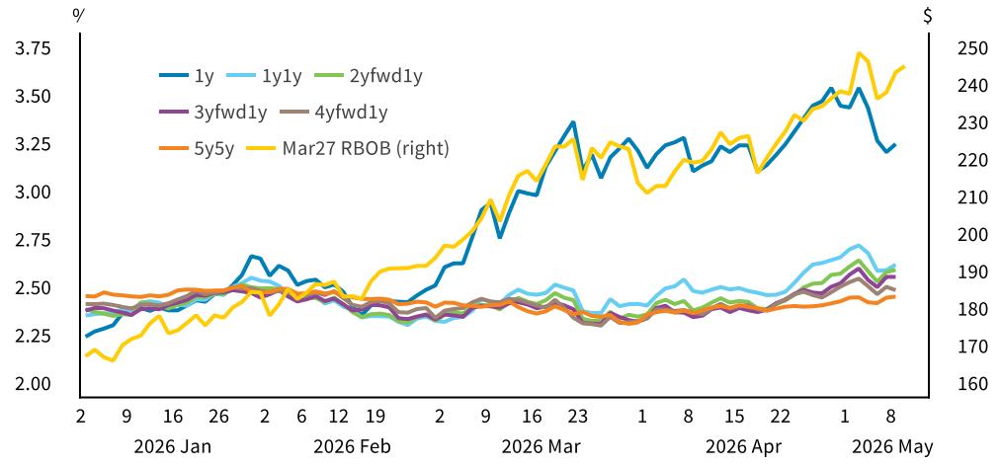

# The 2026 Oil Shock Is Structurally Worse Than 2022, But Markets Are Pricing the Wrong Risk

The scale of global oil supply disruption in 2026 has already surpassed the 2022 Russia-Ukraine shock by a wide margin, yet inflation expectations and credit spreads have not repriced to reflect that reality. Thirteen percent of global oil supply is currently offline, compared to just three percent in 2022. Gasoline prices today are eighteen cents higher than on the same date in 2022, and the rate of increase since the start of the Iran conflict has been thirty percent, matching the 2022 trajectory. This is not a temporary spike. It is a deeper, more structurally entrenched supply crisis that the market has not fully absorbed.

The disconnect between the physical oil market and financial market pricing creates a strategic vulnerability for investors. Inflation expectations have remained relatively benign. Toll road and airport credit spreads have not widened meaningfully. The implied message from these markets is that the current disruption will be short-lived, or that demand destruction will arrive quickly enough to cap the damage. Both assumptions are questionable. The persistence of high gasoline prices, not the peak itself, will determine the economic and political consequences. And on that metric, 2026 is tracking worse than 2022.

The political dimension adds another layer of complexity. Gas prices have become a deeply partisan issue, with perceptions of price changes diverging sharply along political lines regardless of actual local price movements. This means that the political threshold for action may not be a simple price level, but rather how long prices remain elevated enough to shift voter sentiment among key constituencies. The administration's toolbox for addressing gasoline prices is surprisingly limited, and the options that remain carry significant fiscal and political trade-offs.

For institutional investors, the critical question is not whether gasoline prices will reach five dollars per gallon, but what happens if they stay there. The answer involves a cascading set of implications for inflation, municipal credit, transportation infrastructure, and midterm election dynamics that the current market pricing does not fully reflect.

## The Physical Oil Market Is More Stressed Than in 2022, But Demand Has Not Yet Adjusted

The most important structural difference between 2022 and 2026 is the magnitude of supply loss. In 2022, roughly three percent of global oil supply was disrupted following the Russian invasion of Ukraine. Today, that figure stands at thirteen percent, driven primarily by the Iran conflict and related geopolitical disruptions. While lower demand from China has partially offset the supply loss, the net effect remains a market that is significantly tighter than it was four years ago.

The price transmission mechanism has also changed. Since the Iran war began, prompt-month WTI crude futures have risen fifty-one percent, in line with the increase in AAA retail gasoline prices. But prompt-month RBOB gasoline futures have risen seventy-four percent over the same period. This divergence is critical. The sharper increase in wholesale gasoline prices signals that refining capacity, not just crude supply, has emerged as the binding constraint. Strategic Petroleum Reserve releases, spare capacity, and potential US supply increases are all skewed toward addressing the crude side of the equation. They do little to solve the refining bottleneck.

US gasoline inventories in days of demand have fallen close to the low end of the seasonal range. As inventories continue to draw, the pressure on refined product prices will intensify until either the supply situation resolves or demand adjusts in a more meaningful way. Historical analysis suggests that a fifty percent increase in retail prices typically leads to a three to four percent reduction in demand over time. That is far from sufficient to rebalance a market facing a thirteen percent supply loss. The implication is clear: the risk to the 2026 Brent crude forecast of one hundred dollars per barrel is skewed to the upside.

## The Persistence of High Gasoline Prices, Not the Peak, Will Determine the Inflation and Political Consequences

The 2022 experience provides a misleading template for 2026. In 2022, national average gasoline prices reached five dollars per gallon in June, but they had already begun falling by the end of that month. By the time of the midterm elections in November, prices were only twenty cents higher than before the Russian invasion. The spike lasted approximately sixteen weeks. As a result, gasoline prices were not the dominant issue in the 2022 midterms. Exit polls showed that inflation broadly and abortion were the top concerns for voters.

The 2026 trajectory looks different. Gasoline prices have risen more rapidly since the start of the Iran conflict, and the supply disruption shows no signs of near-term resolution. If prices reach five dollars per gallon and remain there through the summer driving season and into the fall, the duration of elevated prices will far exceed the 2022 experience. That duration matters more than the peak for two reasons.

First, for inflation. A ten percent persistent increase in gasoline prices tends to boost headline CPI by approximately 0.2 percentage points within one to two months. The feed-through to core inflation is smaller and takes longer, but the cumulative effect of sustained high gasoline prices compounds over time. If the current price level persists for three to six months, the inflation impulse will be materially larger than what markets are currently pricing.

Second, for politics. Voter perceptions of gasoline price changes may eventually converge to reflect actual price movements, rather than simply correlating with political views. The partisan split in how people perceive gasoline prices is stark. In a recent survey, eighty-two percent of Harris voters said gasoline prices had gone up a lot, compared to forty-nine percent of Trump voters. Among self-identified MAGA supporters, the figure was just thirty-nine percent. This gap cannot persist indefinitely if prices remain elevated. At some point, the actual experience of paying higher prices at the pump will begin to shift perceptions among Republican voters, particularly those in swing districts.

Congressional Republicans face the most acute political pressure because they are up for election in November, while President Trump is not. The hope within the party appears to be that the price spike ends before voters begin to focus on the midterm elections around Labor Day, mirroring the 2022 timeline. But the structural conditions that would enable a rapid price decline are not present.

## The Administration Has Few Effective Tools to Cap Gasoline Prices, and Most Carry Significant Trade-Offs

The administration has already deployed several policy levers in an effort to mitigate the impact of the war on gasoline prices. These include releases from the Strategic Petroleum Reserve, sanction waivers, a Jones Act waiver, and an EPA waiver to allow the sale of E15 fuel during the summer driving season. Each of these measures has provided some relief at the margin, but none addresses the core supply disruption.

The remaining options are limited and carry significant costs. A federal gasoline tax holiday would provide only modest relief to consumers. Analysis of the 2022 proposal found that a three-month suspension of the 18.4 cents per gallon federal tax would have lowered average gasoline spending per capita by only five to fourteen dollars over the entire period. Moreover, the Highway Trust Fund, which finances most US surface transportation programs, relies on federal gasoline tax revenues of approximately thirty-six to thirty-eight billion dollars annually. If a tax holiday lasted six months or longer, the fund would likely run out of money in the first half of 2027.

Export restrictions on crude oil are another option, but they are not a simple solution. US gasoline consumption is not self-sufficient because domestic production is primarily light crude, while many US refineries are configured for heavy crude. The US also lacks the infrastructure to move crude domestically in a cost-effective manner. President Trump and administration officials have repeatedly stated that export restrictions are not under consideration.

State-level action has been uneven. Three states have implemented gasoline tax holidays, while approximately ten others are considering proposals at various stages. But several governors, including those in large states like Florida, New York, and Ohio, have opposed such measures. The patchwork nature of state responses means that the overall impact on national average gasoline prices will be limited.

The most effective tool for bringing down gasoline prices would be a resolution to the conflict that allows for the reopening of the Strait of Hormuz. But that outcome is not imminent, and time may have run out to prevent 2026 from being worse than 2022.

## The Market Is Not Pricing a Key Risk: The Feedback Loop Between Sustained Gasoline Prices and Municipal Credit

One of the most overlooked implications of the current oil shock is its potential impact on municipal credit, particularly for toll roads and airports. The 2022 experience provides a useful baseline. During that period, toll road and airport credit spreads remained relatively stable, in part because the gasoline price spike was short-lived. But the logic changes if prices remain elevated for an extended period.

Higher gasoline prices directly affect transportation demand. For toll roads, sustained high fuel costs reduce discretionary travel and shift consumer behavior toward shorter trips or alternative modes of transport. For airports, the impact is compounded by the fact that fuel costs are a significant input for airlines, and higher costs can lead to reduced capacity, higher ticket prices, and lower passenger volumes. The Spirit Airlines liquidation has already demonstrated the vulnerability of certain carriers and the ripple effects on airport credit.

The credit risk is most acute for lower-rated toll roads and small to medium-sized airports, particularly those in tourist-heavy markets. These entities have less pricing power, thinner revenue buffers, and higher exposure to discretionary travel demand. If gasoline prices remain at or above five dollars per gallon through the summer and into the fall, the revenue pressure on these credits will intensify.

Were the 2022 analogy to fully unfold, inflation expectations one to two years out would be well above three percent, and credit spreads for vulnerable municipal issuers would widen. The fact that these measures have not yet repriced suggests that the market is discounting a rapid resolution. That assumption may prove incorrect.

## What the Report Does Not Fully Answer: The Threshold for Political Action and the Second-Order Effects on Consumer Behavior

The report provides a detailed analysis of the oil market, inflation dynamics, and political implications, but it leaves several important questions open. The most critical is the precise threshold at which sustained high gasoline prices become a dominant political issue. In 2022, prices peaked at five dollars per gallon but fell quickly, and the midterm elections were decided on other issues. In 2026, the trajectory is different, but the political impact depends on how long prices stay elevated and how that duration interacts with the partisan perception gap.

A related question concerns the second-order effects on consumer behavior beyond the immediate reduction in gasoline demand. If households spend more on fuel, they have less to spend on other goods and services. The magnitude of this sUBStitution effect depends on the persistence of high prices and the extent to which consumers view them as temporary or permanent. If consumers begin to adjust their long-term expectations, the impact on aggregate demand could be more significant than the direct inflation channel alone would suggest.

The report also does not fully address the implications for the broader fixed income market. If inflation expectations do eventually adjust upward, the repricing of risk across credit, rates, and currencies could be abrupt. The current benign pricing in inflation swaps and credit spreads may reflect a consensus view that is vulnerable to a sudden shift in narrative.

## A Decision Framework for Investors: Three Scenarios and the Signals to Watch

Investors should approach the current environment not as a single forecast but as a set of scenarios, each with distinct implications for portfolio positioning. The key variable is the duration of elevated gasoline prices.

Scenario one: prices decline rapidly. This requires a geopolitical resolution that brings disrupted supply back online within weeks. In this scenario, the 2022 analogy holds, and current market pricing proves broadly correct. Inflation expectations remain contained, credit spreads stay tight, and the political impact is muted. The signal to watch for is a credible diplomatic breakthrough or a ceasefire that allows for the reopening of key shipping lanes.

Scenario two: prices remain elevated through the summer but decline before the midterms. This is the outcome that congressional Republicans are hoping for. It would require a combination of demand destruction, policy intervention, and gradual supply recovery. The inflation impulse would be modest but persistent, and the political impact would depend on whether prices begin falling before voters focus on the election. The signal to watch for is a sustained drawdown in gasoline inventories that indicates demand is adjusting.

Scenario three: prices remain elevated through the election and beyond. This is the tail risk that the market is not pricing. It would require a prolonged supply disruption and limited demand response. In this scenario, inflation expectations would eventually adjust upward, credit spreads for vulnerable municipal issuers would widen, and gasoline prices would become a dominant political issue. The signal to watch for is a failure of inventories to rebuild during the typical seasonal patterns.

Each scenario implies a different set of portfolio actions. In scenario one, the current positioning is appropriate. In scenario two, selective hedging against inflation and credit risk in vulnerable sectors makes sense. In scenario three, a more aggressive repositioning toward inflation protection and away from credit exposure in transportation-linked municipal bonds would be warranted.

## The Full Report Contains the Data and Charts That Support This Analysis

The analysis presented here draws on proprietary data and original research that cannot be fully reproduced in a summary format. The full report includes detailed charts on gasoline price trajectories, inventory levels, credit spread movements, and polling data that provide the empirical foundation for the arguments made above.

Join the community to read the full report and review the original charts.

*This article is for learning and discussion only and does not constitute investment advice.*

Personal reading notes and learning share only. Not investment advice.

