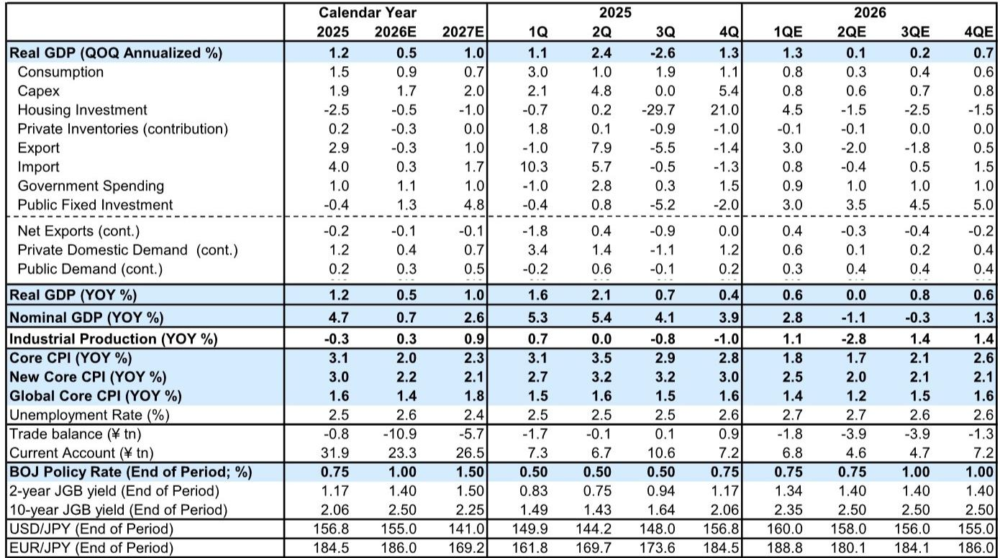
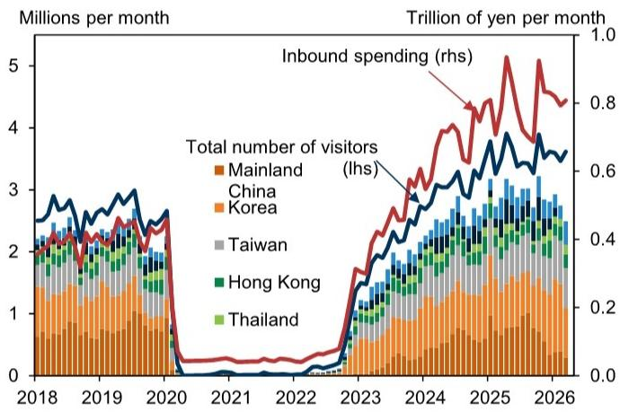

# Japan’s Economy Will Not Stagnate in 2026: The Structural Forces That Outweigh the Middle East Shock

Japan’s economy is facing a genuine test in 2026, but the narrative of inevitable slowdown misses the deeper story. The March data roundup, compiled from a major global investment bank’s tracking estimates, reveals a paradox: while the Middle East disruption is real and industrial production has already felt its sting, the underlying drivers of Japanese growth remain surprisingly resilient. The first quarter delivered an upward revision to real GDP tracking, from +0.7% to +1.3% quarter-on-quarter annualized, not because the shock was absent, but because the domestic economy’s structural momentum absorbed it better than anticipated. The question is not whether Japan will suffer a downturn, but whether the forces that have been building for years—tight labor markets, rising wages, accumulated corporate profits, and a structural shift in capital expenditure—are strong enough to carry the economy through the coming quarters. The evidence suggests they are, but only if policymakers and investors understand where the true risks lie.

This is not a story of blind optimism. The Middle East crisis, which began in late February, has already prompted cumulative downward revisions of 0.5 percentage points to Japan’s full-year 2026 growth forecast. The April Tokyo core CPI surprised to the downside, largely due to an unexpectedly large drag from free childcare programs. Consumer sentiment has deteriorated markedly since March. Yet the economy grew faster than expected in Q1, exports accelerated on a quarterly basis, services spending held up, and the labor market remains historically tight. The pattern is not one of collapse, but of deceleration within a fundamentally stronger baseline. The real analytical challenge is to separate the cyclical noise from the structural signal, and to identify which components of demand will bend and which will hold.

The following sections unpack this logic. They examine why Q1 outperformed, how the shock will propagate through Q2 and Q3, what the Bank of Japan’s divided board signals about the policy path, and where the report’s own analysis leaves important questions unanswered. The conclusion offers a decision framework for investors and executives who need to position for the next six to twelve months.

## Q1 Outperformance Was Not a Fluke: Net Exports and Services Consumption Masked the Shock Before It Arrived

The upward revision to Q1 GDP was driven primarily by net exports, not by domestic demand acceleration. This is a critical distinction. Private consumption and capital expenditure forecasts were left unchanged at modestly positive levels, but the external sector surprised to the upside because the Middle East disruption had not yet materially affected trade flows. Real exports rose 3.0% quarter-on-quarter in Q1, accelerating sharply from +0.6% in Q4, and imports also turned positive for the first time in three quarters. The net effect was a positive contribution from external demand of 0.4 percentage points for the first time in three quarters.

This is not a sign of underlying strength in global demand. Rather, it reflects timing. The disruption to shipping through the Strait of Hormuz began only in late February, and its impact on customs-cleared trade data takes weeks to appear. The Q1 numbers are therefore a backward-looking snapshot of a world that no longer exists. The more important insight is that domestic demand held up even without the external tailwind. Private consumption grew at an annualized 0.8% in Q1, supported entirely by services spending. Durable goods declined sharply, but the services sector—tourism, dining, transport, personal services—continued to expand. The number of foreign visitors rose 1.4% year-on-year in Q1, and inbound spending increased 5% year-on-year, even as Chinese visitors halved. The composition of demand is shifting toward categories that are less sensitive to short-term price shocks and more tied to structural trends like labor scarcity and demographic-driven service consumption.

The implication is straightforward: the Q1 beat does not change the outlook for Q2, but it does raise the baseline. The economy entered the shock period with more momentum than previously estimated. The full-year 2026 growth forecast has been raised to +0.5% from +0.3%, a modest but meaningful upgrade. This is not a boom, but it is also not the stagnation that some observers have predicted.

## The Middle East Shock Will Slow Growth From Q2, But the Domestic Demand Floor Is Higher Than in Previous Crises

The report’s central forecast for Q2 and Q3 is one of deceleration, not contraction. Private consumption is expected to slow from +0.8% annualized in Q1 to +0.3-0.4% in the middle quarters. Capital expenditure is projected to ease from +0.8% to +0.6-0.7%. These are not recessionary numbers. They are the kind of modest cooling that a well-functioning economy should be able to absorb without triggering a negative feedback loop.

Why is the floor higher this time? Three structural factors stand out. First, the labor market is historically tight, with the unemployment rate stuck in a narrow 2.6-2.7% range since August 2025. Nominal cash wage growth slowed to +2.7% year-on-year in March, but basic wage growth remained above 3%, and the 2026 shunto spring wage negotiations have delivered base pay increases in the mid-3% range. Real wages have now risen year-on-year for three consecutive months. This is not the kind of labor market that collapses on a modest demand shock. Workers have bargaining power, and that power translates into spending capacity.

Second, corporate profits are at record levels, and capital expenditure plans for fiscal 2026 are off to a strong start. The Bank of Japan’s Tankan survey shows that initial capex plans for the new fiscal year are similar to last year’s robust levels. More importantly, backlogs for construction and machinery orders have accumulated to high levels. Even if companies temporarily postpone new orders, they will continue to execute existing commitments. This creates a buffer that did not exist in previous downturns, when companies slashed capex immediately at the first sign of trouble. The shift from a deflationary to a reflationary mindset has changed corporate behavior. Companies are now investing in energy efficiency, decarbonization, and automation—structural themes that are not easily abandoned because of a temporary oil price spike.

Third, the wealth effect from equity markets is real. Japanese equities have reached all-time highs, and while the relationship between stock prices and consumption is never mechanical, the report notes that high-value durable goods and services spending are likely to benefit. The Golden Week holiday data is instructive: Shinkansen passenger numbers surged during the May holidays, suggesting that even as sentiment deteriorates, consumers are still willing to spend on special occasions. This is not a population that is hoarding cash in fear. It is a population that is adjusting its spending mix, not its overall propensity to consume.

The risk, of course, is that the shock proves larger or more prolonged than assumed. The report’s own production data shows that industrial output fell 0.5% month-on-month in March, driven by chemicals and petroleum products, and that the METI’s bias-adjusted outlook for April calls for a further decline. If the Strait of Hormuz disruption continues, actual April production could fall by more than forecast. But even in this scenario, the report’s basic assessment remains unchanged: negative growth is unlikely. The domestic demand floor is simply too high.

## The Bank of Japan Is Divided, But the July Rate Hike Remains the Base Case—And That Is a Signal of Confidence

The April Monetary Policy Meeting produced a decision that was superficially dovish—the policy rate was kept at 0.75%—but the internal debate tells a different story. Three of nine board members dissented, proposing a hike to 1.0%. The Summary of Opinions reveals that most members see the need for a rate hike, but disagree on the urgency given the uncertainty surrounding the Middle East situation. This is not a central bank that is paralyzed by doubt. It is a central bank that is waiting for confirmation that the economy will not enter a major adjustment phase.

The report’s base case is a July rate hike, conditional on the BOJ being able to confirm from corporate surveys and other data that the economy is on solid footing. This is a reasonable assumption. By July, the BOJ will have Q1 GDP data, the June Tankan survey, and several months of trade and production data that reflect the full impact of the Middle East disruption. If the economy has indeed slowed but not contracted, the case for a hike will be strong. Inflation remains above target, with the March new core CPI (excluding fresh food and energy) at +2.4% year-on-year, and the report has raised its 2026 and 2027 core CPI forecasts by 0.4 percentage points each.

The more interesting question is what a July hike would signal to markets. If the BOJ raises rates while the Middle East crisis is still ongoing, it will be sending a powerful message: that the structural improvements in the Japanese economy are durable enough to withstand an external shock. This would be a vote of confidence in the wage-price spiral, in the labor market, and in the corporate sector’s ability to pass on costs. It would also narrow the interest rate differential with the United States, potentially supporting the yen and reducing imported inflation. The market implications are significant, but they depend on the BOJ’s ability to communicate that the hike is a sign of strength, not a mistake.

## What the Report Does Not Fully Answer: The Consumption Tax Debate, the Shape of Fiscal Response, and the Threshold for Negative Growth

For all its analytical rigor, the report leaves several critical questions unresolved. The first is the consumption tax debate. The Takaichi administration is discussing a potential tax cut within a cross-party National Council, but the outcome remains fluid. A consumption tax cut would be a powerful stimulus, directly boosting household disposable income at a time when real incomes are under pressure from higher energy prices. But it would also complicate the fiscal consolidation narrative and raise questions about the sustainability of Japan’s debt trajectory. The report acknowledges the discussion but does not model its impact, leaving readers to wonder how much of the consumption resilience is predicated on fiscal support that may or may not materialize.

The second unresolved question is the shape and scale of the government’s proactive fiscal policy. The report notes that specific details of growth strategy investments will be presented in the Basic Policies for Economic and Fiscal Management and Reform, scheduled for June. But it does not speculate on what those details might contain. Will the government double down on energy efficiency sUBSidies? Will it accelerate digital infrastructure spending? Will it provide direct support to households? The answers matter enormously for the Q3 and Q4 outlook, particularly if the Middle East disruption persists.

The third question is the most fundamental: what is the threshold at which the economy would tip into negative growth? The report argues that negative growth is unlikely, but it does not specify the conditions under which that judgment would change. A prolonged disruption that cuts off oil supplies for six months? A sharp deterioration in consumer confidence that triggers a precautionary savings spike? A collapse in equity prices that reverses the wealth effect? The report’s confidence is based on structural factors, but structural factors can be overwhelmed by sufficiently large shocks. Investors and policymakers need to know where the red lines are, and the report does not draw them.

These gaps are not weaknesses. They are invitations for deeper analysis. The full report likely contains more granular data on sectoral exposure, scenario analysis, and historical comparisons that would help answer these questions. The reader who wants to understand the full picture should go beyond the summary.

## A Decision Framework for Investors and Executives: Three Questions to Guide Positioning Through the Next Two Quarters

The report’s insights can be distilled into a simple decision framework. Any investor or corporate strategist looking at Japan in mid-2026 should ask three questions.

First, how long will the Middle East disruption last? If it resolves within the next two months, the Q2 slowdown will be mild and the recovery in H2 will be strong. If it persists through the end of the year, the drag on industrial production and net exports will be more significant, but domestic demand should still keep the economy in positive territory. The key leading indicator is not oil prices, but shipping data through the Strait of Hormuz. Watch that data monthly.

Second, are wages continuing to grow? The 2026 shunto results are already known, but the transmission from base pay to actual take-home pay depends on hours worked, bonus payments, and the composition of employment. The BOJ’s Consumption Activity Index and the monthly labor survey will provide real-time signals. If real wages continue to rise year-on-year, the consumption floor will hold. If they stall, the risks shift to the downside.

Third, what is the BOJ signaling? The July meeting is the next major event. If the BOJ hikes, it will confirm the structural narrative and likely support the yen. If it holds, it will signal that the bank sees more risk than it is letting on. The Summary of Opinions from the June meeting will be particularly important, as it will reflect the board’s assessment of Q1 GDP and the early Q2 data.

For equity investors, the implication is to favor domestic-demand-oriented sectors over export-oriented ones. Services, construction, and energy-efficiency-related capital goods are likely to outperform. For fixed-income investors, the path of the BOJ is the dominant variable. A July hike would steepen the yield curve and create opportunities in the front end. For corporate executives, the message is to maintain capex plans but build in flexibility for supply chain disruptions. The structural case for investing in Japan remains intact, but the tactical execution requires caution.

## The Full Report Contains the Charts and Data That Make the Argument Actionable

The analysis above is based on a parsing of the March data roundup, but the full report contains the exhibits that bring the argument to life. The charts on shunto wage settlement rates, Shinkansen passenger traffic, Tankan capex plans, and construction order backlogs are not decorative. They are the empirical foundation for the claim that Japan’s economy is structurally stronger than it appears. Without them, the argument risks sounding like an opinion. With them, it becomes a testable hypothesis.

Join the community to read the full report and review the original charts.

*This article is for learning and discussion only and does not constitute investment advice.*

Personal reading notes and learning share only. Not investment advice.

