# Asia Tech Hardware

# Asia Tech Hardware: 1Q26 PCB market update & Unimicron model update

Alex Wang, CFA

+852 2123 2613

alex.wang@Bernsteinsg.com

David Dai, CFA

+852 2918 5704

david.dai@Bernsteinsg.com

Euan McLeish

+81 3 5962 9611

euan.mcleish@Bernsteinsg.com

Shirley Yang, CFA

+852 2123 2660

shirley.yang@Bernsteinsg.com

Ethan Xu

+852 2123 2634

ethan.xu@Bernsteinsg.com

Hao Wang, CFA

+852 2123 2627

hao.wang@Bernsteinsg.com

Mufei Gao

+81 3 6777 6995

mufei.gao@Bernsteinsg.com

Jack Lin

+852 2123 2683

jack.lin@Bernsteinsg.com

Juho Hwang

+852 2123 2632

juho.hwang@Bernsteinsg.com

PCB/sUBStrate stocks have rallied sharply YTD 2026, driven by rising content in AI servers and expectations of ASP hikes this year. Following our primer Artificial Intelligence: Inside the War for AI Data Center Connectivity, we update 1Q26 PCB market view and Unimicron model.

In 1Q26, sampled AI PCB companies combined delivered +38% YoY and +8% QoQ revenue growth. Key AI-exposed players (Unimicron, Ibiden, VGT, WUS, GCE) saw decent revenue expansion. With a lower base compared to peers, gross margin of Unimicron and Nan Ya PCB continued improving thanks to strong ABF pricing environment and better product mix. New suppliers in AI PCB market including Delton (focusing on CPU motherboard) and Zhen Ding (focusing on consumer electronics) are also scaling AI exposure this year. ABF sUBStrate revenue growth accelerated to 40% YoY in 1Q26, and is about to surpass the previous peak in 4Q22 peak. We anticipate strong growth ahead as driven by the volume and price increases.

Raw material tightness should persist through 2026, supporting strong pricing environment for the overall PCB market. Following the price hikes of T-glass, CCL and copper foil, ABF film cost are also reported to rise in 2H26. Some CPUs are adopting T-glass from second-source suppliers, per our channel check, but we assume limited GPU/ASIC adoption of tier-2 suppliers by end-2026. ABF sUBStrate capacity additions are accelerating as AI demand visibility improves over the next two years.

For Unimicron (OP), we revise 2027 estimates and roll forward to 2028. We estimate ABF sUBStrate ASP increased 5% QoQ in 1Q26 and will accelerate to 7-10% QoQ through 2026 driven by a \~30% raw material cost hike from 2Q and a richer high-end ABF mix. AI ABF +HDI should reach half of company revenue going forward, supporting a 30% revenue CAGR in 2025-28E. We model EPS to more than triple to NT\$14 in 2026, then grow \~80% in 2027 and \~45% in 2028 to NT\$36.6. We assume a more gradual margin recovery vs. consensus, with GM reaching \~35% by end-2028, and do not factor in a “shortage-driven” margin spike next year. Lower 2027–28 EPS than the Street, we see sequential profitability improvement on growing AI and CPU demand. We maintain a 32x P/E on 2027–28 avg. EPS of NT\$30.8 (vs. old 2027 EPS of NT\$19.1), raising PT to NT\$990 (from NT\$610). Outperform.

For Ibiden (OP), while we are reviewing model updates post a strong quarter guidance, we continue to believe the strong position in AI accelerator, server CPU, and EMIB-T will generate strong revenue and profit growth.

For Ajinomoto (MP), both revenue and business profit growth beat our expectation in the Mar-Q, at +42% & 56% respectively. While operational leverage remained depressed at 1.3x, we expect this to bounce back to c. 1.7x from Q1 onward, and we expect revenues to maintain their c. 30% growth run rate. They have also announced a new capacity expansion plan to build a $3^{rd}$ ABF film factory by 2032.

Bernstein TICKER TABLE 

<table><tr><td rowspan="2" colspan="3"></td><td colspan="2">14 May2026</td><td colspan="2">TTM</td><td colspan="4">Reported EPS</td><td colspan="3">Reported P/E (x)</td></tr><tr><td rowspan="2">ClosingPrice</td><td rowspan="2">PriceTarget</td><td rowspan="2">Rel.Perf.</td><td rowspan="2">Cur</td><td rowspan="2">2025A</td><td rowspan="2">2026E</td><td rowspan="2">2027E</td><td rowspan="2">2025A</td><td rowspan="2">2026E</td><td rowspan="2">2027E</td><td></td></tr><tr><td>Ticker</td><td>Rating</td><td>Cur</td><td></td></tr><tr><td>3037.TT (Unimicron)</td><td>O</td><td>TWD</td><td>881.00</td><td>990.00</td><td>724.0%</td><td>TWD</td><td>4.36</td><td>14.06</td><td>25.10</td><td>202.0</td><td>62.7</td><td>35.1</td><td></td></tr><tr><td>OLD</td><td></td><td></td><td></td><td>610.00</td><td></td><td></td><td></td><td>11.78</td><td>19.13</td><td></td><td></td><td></td><td></td></tr><tr><td>2802.JP (Ajinomoto)</td><td>M</td><td>JPY</td><td>5,542.00</td><td>5,100.00</td><td>25.1%</td><td>JPY</td><td>270,077</td><td>323,727</td><td>366,031</td><td>21.5</td><td>17.9</td><td>15.9</td><td></td></tr><tr><td>4062.JP (Ibiden)</td><td>O</td><td>JPY</td><td>16,960</td><td>9,200.00</td><td>522.1%</td><td>JPY</td><td>151.51</td><td>238.90</td><td>330.73</td><td>111.9</td><td>71.0</td><td>51.3</td><td></td></tr><tr><td>ASIAX</td><td></td><td></td><td>1,965.26</td><td></td><td></td><td></td><td></td><td></td><td></td><td></td><td></td><td></td><td></td></tr><tr><td>JPL</td><td></td><td></td><td>2,548.77</td><td></td><td></td><td></td><td></td><td></td><td></td><td></td><td></td><td></td><td></td></tr></table>

# PRICE TARGET CHANGE / ESTIMATE CHANGE IN BOLD

O - Outperform, M - Market-Perform, U - Underperform, NR - Not Rated, CS - Coverage Suspended

2802.JP estimate is EBITDA (M); 2802.JP valuation is EV/EBITDA (x); 2802.JP base year is 2026;

Source: Bloomberg, Bernstein estimates and analysis.

# INVESTMENT IMPLICATIONS

We rate Unimicron Outperform, with PT = NT\$990.00 (model).

We rate Ibiden Outperform, with PT = ¥9,200.00.

We rate Ajinomoto Market-Perform with PT at JPY5,100 (model).

# DETAILS

# PCB MARKET UPDATE

The AI PCB and ABF sUBStrate market continues the strong momentum in 1Q26, driven by accelerating AI server shipments. Strong demand from data center and networking segments continues to offset weakness in legacy automotive and industrial markets. Leading suppliers with high exposure to AI theme (e.g., Unimicron, Ibiden, Victory Giant, Gold Circuit etc.) saw rapid revenue growth and QoQ margin improvement; Others players like Kinsus and Nan Ya PCB, though with less AI PCB exposure, are also riding upcycle driven by AI's spillover effect and surging CPU demand. Delton Tech, a key supplier for CPU motherboard, is also expanding its exposure to AI server starting from China market. Further upside is expected as long-term pricing agreements take effect. Zhen Ding, the largest PCB supplier globally focusing on consumer electronics, also saw its IC sUBStrate & networking PCB revenue exposure rose to 20% in 1Q26, from 11% in 1Q25. (All stocks mentioned are not covered except for Unimicron and Ibiden.)

Looking ahead, the industry is entering an aggressive capex cycle focused on high-end capacity expansion and geographic diversification. Chinese MLPCB and HDI companies including VGT, WUS, Delton are scaling advanced production in China while accelerating overseas capacity in Southeast Asia to mitigate geopolitical risks. Taiwanese suppliers are also accelerating capacity expansion on ABF sUBStrate and PCB for AI use. Unimicron has guided NT\$34bn of capex (+33% YoY) in 2026; Kinsus has guided 31%/25% of YoY capex growth, reaching NT\$8bn/NT\$10bn in 2026/2027; Gold Circuit has guided NT17bn+ capex in 2026 (up 100%+ YoY).

Tight supply of raw materials including T-glass, high-end CCL and copper foil is likely to remain till the end of this year, which indirectly supports a strong pricing environment for the overall PCB market. Notably, the upstream CCL has experienced multiple price adjustments since 2025, and it is reported that ABF film will likely initiate price hikes in 2H2026.

For more discussion on PCB market, please find details in Artificial Intelligence: Inside the War for AI Data Center Connectivity

EXHIBIT 1: Summary of major PCB/HDI/sUBStrate suppliers with AI exposure 

<table><tr><td colspan="5">PCB</td></tr><tr><td></td><td>RPCB</td><td>HDI</td><td>IC SUBStrate</td><td>FPC+SMA</td></tr><tr><td>As % of total PCB market (2026E)</td><td>49%</td><td>19%</td><td>19%</td><td>14%</td></tr><tr><td>Delton</td><td>★</td><td></td><td></td><td></td></tr><tr><td>Dongshan Precision</td><td>★</td><td>○</td><td></td><td>○</td></tr><tr><td>Gold Circuit</td><td>★</td><td></td><td></td><td>○</td></tr><tr><td>Ibiden</td><td>○</td><td></td><td>★</td><td>○</td></tr><tr><td>ISU</td><td>★</td><td></td><td></td><td></td></tr><tr><td>Kinsus</td><td></td><td></td><td>★</td><td></td></tr><tr><td>Nan Ya PCB</td><td>○</td><td></td><td>★</td><td></td></tr><tr><td>SEMCO</td><td></td><td></td><td>★</td><td></td></tr><tr><td>Shengyi Electronics</td><td>★</td><td></td><td></td><td></td></tr><tr><td>TTM</td><td>★</td><td></td><td></td><td></td></tr><tr><td>Unimicron</td><td>○</td><td>★</td><td>★</td><td>○</td></tr><tr><td>Victory Giant</td><td>○</td><td>★</td><td></td><td></td></tr><tr><td>WUS Group</td><td>★</td><td></td><td></td><td></td></tr><tr><td>Zhen Ding</td><td>○</td><td></td><td>○</td><td>★</td></tr></table>

○ Industry exposure; ★ Major business

Source: Company reports, Prismark estimates of PCB market %, Bernstein analysis

EXHIBIT 2: PCB revenue of major companies and AI PCB mix (2026E)   
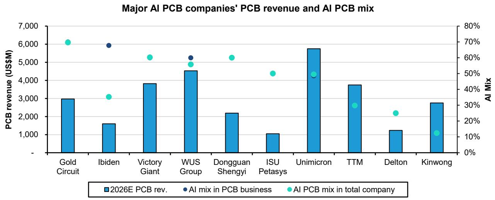

bar_line

Major AI PCB companies' PCB revenue and AI PCB mix
| Company | 2026E PCB rev. (US$M) | AI mix in PCB business (%) | AI PCB mix in total company (%) |
| :--- | :--- | :--- | :--- |
| Gold Circuit | 3000 | 70 | 61 |
| Ibiden | 1600 | 69 | 32 |
| Victory Giant | 3800 | 52 | 53 |
| WUS Group | 4500 | 52 | 49 |
| Dongguan Shengyi | 2200 | 52 | 53 |
| ISU Petasys | 1000 | 44 | 44 |
| Unimicron | 5700 | 43 | 51 |
| TTM | 3700 | 30 | 30 |
| Delton | 1200 | 24 | 24 |
| Kinwong | 2700 | 12 | 12 |

Source: Source: Prismark, Bernstein analysis and estimates

EXHIBIT 3: Bloomberg consensus revenue ranking for PCB companies (2026E)   
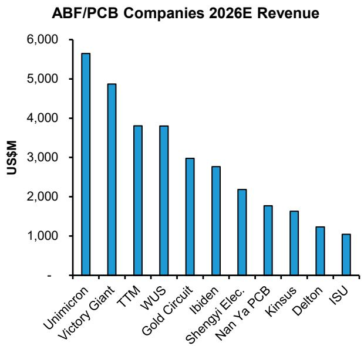

bar

ABF/PCB Companies 2026E Revenue
| Company | Revenue (US$M) |
| :--- | :--- |
| Unimicron | 5650 |
| Victory Giant | 4850 |
| TTM | 3800 |
| WUS | 3800 |
| Gold Circuit | 3000 |
| Ibiden | 2750 |
| Shengyi Elec. | 2150 |
| Nan Ya PCB | 1750 |
| Kinsus | 1600 |
| Delton | 1200 |
| ISU | 1050 |

Source: Bloomberg, Bernstein analysis

EXHIBIT 4: Quarterly revenue of PCB companies has been trending up since 2H 2024   
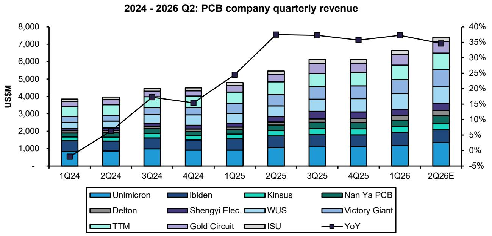  
Delton is incl. in YoY calculation starting from 1Q25, as it did not disclose financials for 2023   
Source: Bloomberg and Bernstein analysis

EXHIBIT 5: Taiwan PCB companies' monthly sales are trending higher in recent months   
  
Source: Company disclosure, Bloomberg, Bernstein analysis

EXHIBIT 6: Consensus forecasts all PCB companies' GM to see sequential growth in 2026   
PCB companies gross margin   
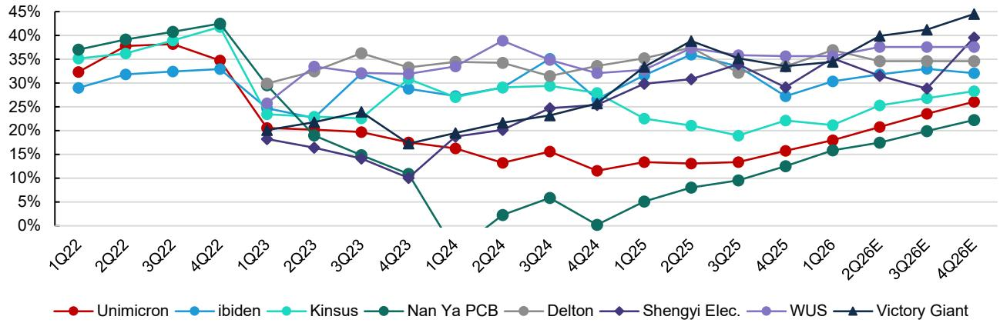  
All forecasts are from Bloomberg consensus; Delton data starts from 2024   
Source: Bloomberg, Bernstein analysis

EXHIBIT 7: ...same for OPM   
PCB companies operating margin   
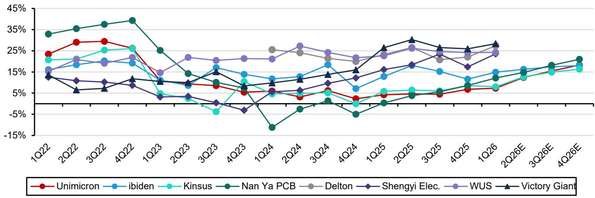

line

| Quarter | Unimicron | ibiden | Kinsus | Nan Ya PCB | Delton | Shengyi Elec. | WUS | Victory Giant |
|---------|-----------|--------|--------|------------|--------|---------------|-----|---------------|
| 1Q22    | 20%       | 15%    | 18%    | 35%        | 15%    | 15%           | 15% | 10%           |
| 2Q22    | 25%       | 15%    | 20%    | 35%        | 15%    | 15%           | 15% | 5%            |
| 3Q22    | 25%       | 15%    | 20%    | 35%        | 15%    | 15%           | 15% | 5%            |
| 4Q22    | 25%       | 15%    | 20%    | 35%        | 15%    | 15%           | 15% | 5%            |
| 1Q23    | 10%       | 10%    | 5%     | 20%        | 10%    | 10%           | 10% | 5%            |
| 2Q23    | 10%       | 10%    | 5%     | 10%        | 10%    | 10%           | 10% | 5%            |
| 3Q23    | 10%       | 10%    | -5%    | 10%        | 10%    | 10%           | 10% | 5%            |
| 4Q23    | 5%        | 10%    | 5%     | 5%         | 10%    | 10%           | 10% | 5%            |
| 1Q24    | 5%        | 10%    | 5%     | -10%       | 10%    | 10%           | 10% | 5%            |
| 2Q24    | 5%        | 10%    | 5%     | -5%        | 10%    | 10%           | 10% | 5%            |
| 3Q24    | 5%        | 10%    | 5%     | -5%        | 10%    | 10%           | 10% | 5%            |
| 4Q24    | 5%        | 10%    | -5%    | -5%        | 10%    | 10%           | 10% | 5%            |
| 1Q25    | 5%        | 10%    | -5%    | -5%        | 10%    | 10%           | 10% | 5%            |
| 2Q25    | 5%        | 10%    | -5%    | -5%        | 10%    | 10%           | 10% | 5%            |
| 3Q25    | 5%        | 10%    | -5%    | -5%        | 10%    | 10%           | 10% | 5%            |
| 4Q25    | 5%        | 10%    | -5%    | -5%        | 10%    | 10%           | 10% | 5%            |
| 1Q26    | 5%        | 10%    | -5%    | -5%        | 10%    | 10%           | 10% | 5%            |
| 2Q26E   | 5%        | 10%    | -5%    | -5%        | 10%    | 10%           | 10% | 5%            |
| 3Q26E   | 5%        | 10%    | -5%    | -5%        | 10%    | 10%           | 10% | 5%            |
| 4Q26E   | 5%        | 10%    | -5%    | -5%        | 10%    | 10%           | 10% | 5%            |
| End     | ~10%      | ~10%   | ~10%   | ~20%       | ~10%   | ~10%          | ~10%| ~10%          |
| Next     | ~10%      | ~10%   | ~10%   | ~20%       | ~10%   | ~10%          | ~10%| ~10%          |
| Next     (Last) from next日起 to next year (Next) to next year (Last) to next year (Last) (Last) (Last) (Last) (Last) (Last) (Last) (Last) (Last) (Last) (Last) (Last) (Last) (Last) (Last) (Last) (Last) (Last) (Last) (Last) (Last) (Last) (Last) (Last) (Last) (Last) (Last) (Last) (Last) (Last) (Last) (Last) (Last) (Last) = Next(Last) / Next(Last) / Next(Last) / Next(Last) / Next(Last) / Next(Last) / Next(Last) / Next(Last) / Next(Last) / Next(Last) / Next(Last) / Next(Last) / Next(Last) / Next(Last) / Next(Last) / Next(Last) / Next(Last) / Next(Last)

All forecasts are from Bloomberg consensus; Delton data starts from 2024   
Source: Bloomberg, Bernstein analysis

EXHIBIT 8: All PCB/ABF companies are expected to see high revenue growth in 2026-27   
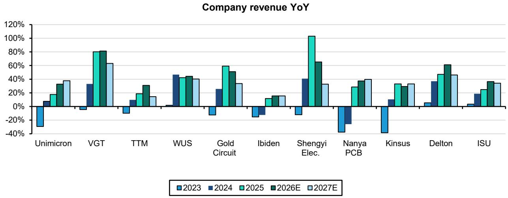

bar

Company revenue YoY
| Company | 2023 (%) | 2024 (%) | 2025 (%) | 2026E (%) | 2027E (%) |
| :--- | :--- | :--- | :--- | :--- | :--- |
| Unimicron | -28 | 8 | 18 | 34 | 38 |
| VGT | -5 | 33 | 81 | 82 | 64 |
| TTM | -10 | 10 | 19 | 31 | 15 |
| WUS | 1 | 47 | 43 | 45 | 40 |
| Gold Circuit | -15 | 25 | 61 | 53 | 34 |
| Ibiden | -15 | -10 | 13 | 16 | 16 |
| Shengyi Elec. | -10 | 41 | 102 | 66 | 33 |
| Nanya PCB | -35 | -25 | 29 | 38 | 40 |
| Kinsus | -35 | 10 | 33 | 31 | 34 |
| Delton | 5 | 37 | 47 | 62 | 46 |
| ISU | 3 | 18 | 24 | 37 | 35 |

All forecasts are from Bloomberg consensus, adjusted to calendar year   
Source: Bloomberg, Bernstein analysis

EXHIBIT 9: Most AI PCB companies saw meaningful gross margin expansion last year, and consensus expects most of them to see sequential growth in 2026-27E...   
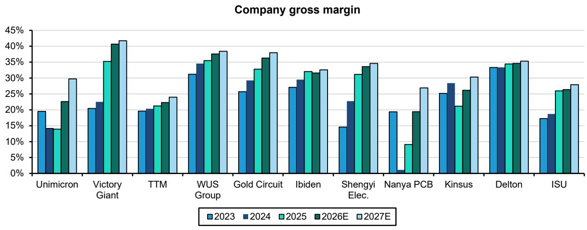

bar

Company gross margin
| Company | 2023 (%) | 2024 (%) | 2025 (%) | 2026E (%) | 2027E (%) |
| :--- | :--- | :--- | :--- | :--- | :--- |
| Unimicron | 19.5 | 14.0 | 13.8 | 22.5 | 29.8 |
| Victory Giant | 20.3 | 22.3 | 35.1 | 40.7 | 41.6 |
| TTM | 19.6 | 19.8 | 21.1 | 22.5 | 24.1 |
| WUS Group | 31.1 | 34.3 | 35.3 | 37.5 | 38.4 |
| Gold Circuit | 25.4 | 29.1 | 32.8 | 36.3 | 37.8 |
| Ibiden | 27.3 | 29.4 | 31.9 | 31.6 | 32.4 |
| Shengyi Elec. | 14.4 | 22.5 | 31.0 | 33.6 | 34.5 |
| Nanya PCB | 19.3 | 1.0 | 9.1 | 19.4 | 27.0 |
| Kinsus | 25.1 | 28.3 | 21.0 | 26.1 | 30.3 |
| Delton | 33.3 | 33.4 | 34.4 | 34.6 | 35.1 |
| ISU | 17.1 | 18.4 | 25.9 | 26.4 | 27.9 |

All forecasts are from Bloomberg consensus, adjusted to calendar year   
Source: Bloomberg, Bernstein analysis

FIGURE 1: ...similarly for operating margin   
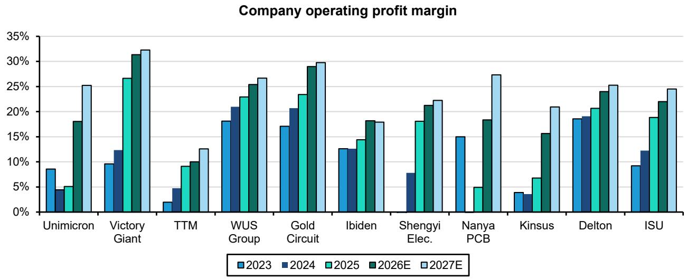

bar

Company operating profit margin
| Company | 2023 (%) | 2024 (%) | 2025 (%) | 2026E (%) | 2027E (%) |
| :--- | :--- | :--- | :--- | :--- | :--- |
| Unimicron | 8.5 | 4.5 | 5 | 18 | 25 |
| Victory Giant | 9.5 | 12.5 | 26.5 | 31.5 | 32.5 |
| TTM | 1.8 | 4.5 | 9 | 10 | 12.5 |
| WUS Group | 18 | 21 | 23 | 25.5 | 26.5 |
| Gold Circuit | 17 | 20.5 | 23.5 | 29 | 30 |
| Ibiden | 12.5 | 12.5 | 14.5 | 18.5 | 17.8 |
| Shengyi Elec. | - | 7.8 | 18 | 21.5 | 22.3 |
| Nanya PCB | 14.8 | - | 4.8 | 18.5 | 27.3 |
| Kinsus | 3.8 | 3.5 | 6.5 | 15.5 | 20.8 |
| Delton | 18.7 | 19.2 | 20.5 | 24 | 25 |
| ISU | 9.3 | 12 | 18.8 | 22 | 24.5 |

All forecasts are from Bloomberg consensus, adjusted to calendar year   
Source: Bloomberg, Bernstein analysis

EXHIBIT 10: Multiple PCB companies have adjusted up their capex in 2026-27E to meet booming AI demand   
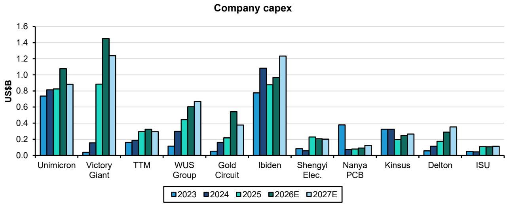

bar

Company capex
| Company | 2023 (US$B) | 2024 (US$B) | 2025 (US$B) | 2026E (US$B) | 2027E (US$B) |
| :--- | :--- | :--- | :--- | :--- | :--- |
| Unimicron | 0.73 | 0.81 | 0.83 | 1.08 | 0.88 |
| Victory Giant | 0.04 | 0.16 | 0.89 | 1.45 | 1.24 |
| TTM | 0.16 | 0.19 | 0.30 | 0.33 | 0.30 |
| WUS Group | 0.12 | 0.30 | 0.44 | 0.61 | 0.66 |
| Gold Circuit | 0.05 | 0.16 | 0.22 | 0.55 | 0.37 |
| Ibiden | 0.77 | 1.09 | 0.88 | 0.97 | 1.24 |
| Shengyi Elec. | 0.08 | 0.06 | 0.23 | 0.21 | 0.20 |
| Nanya PCB | 0.38 | 0.07 | 0.08 | 0.09 | 0.13 |
| Kinsus | 0.33 | 0.33 | 0.21 | 0.25 | 0.26 |
| Delton | 0.05 | 0.12 | 0.18 | 0.29 | 0.36 |
| ISU | 0.05 | 0.06 | 0.11 | 0.12 | 0.12 |

All forecasts are from Bloomberg consensus, adjusted to calendar year   
Source: Bloomberg, Bernstein analysis

Capex as % of sales (2023-25 avg.)   
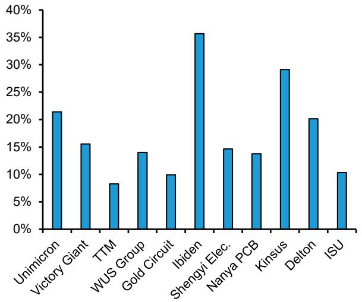

bar

| Company | Value (%) |
| :--- | :--- |
| Unimicron | 21.5 |
| Victory Giant | 15.5 |
| TTM | 8.3 |
| WUS Group | 14.0 |
| Gold Circuit | 9.8 |
| Ibiden | 35.7 |
| Shengyi Elec. | 14.6 |
| Nanya PCB | 13.8 |
| Kinsus | 29.1 |
| Delton | 20.2 |
| ISU | 10.3 |

All forecasts are from Bloomberg consensus, adjusted to calendar year Source: Bloomberg, Bernstein analysis

Price of PCB/ABF raw materials (indexed, Jan 2025=100)   
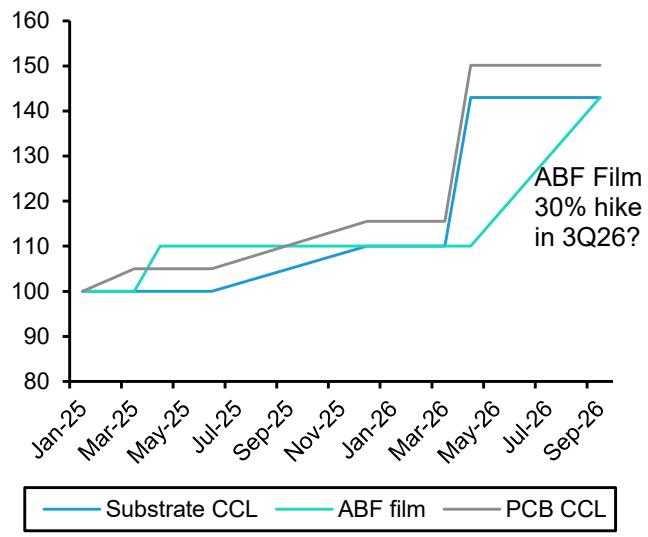

line

| Date   | SUBStrate CCL | ABF film | PCB CCL |
|--------|---------------|----------|---------|
| Jan-25 | 100           | 100      | 100     |
| Mar-25 | 100           | 100      | 105     |
| May-25 | 100           | 110      | 105     |
| Jul-25 | 100           | 110      | 105     |
| Sep-25 | 105           | 110      | 110     |
| Nov-25 | 110           | 110      | 115     |
| Jan-26 | 110           | 110      | 115     |
| Mar-26 | 110           | 110      | 115     |
| May-26 | 145           | 145      | 150     |
| Jul-26 | 145           | 145      | 150     |
| Sep-26 | 145           | 145      | 150     |

Source: Digitimes, Bernstein analysis

EXHIBIT 12: ABF/PCB companies' stock prices soared amid the rising AI demand   
Stock Price for ABF/PCB companies (Indexed, Jan 2021=100)   
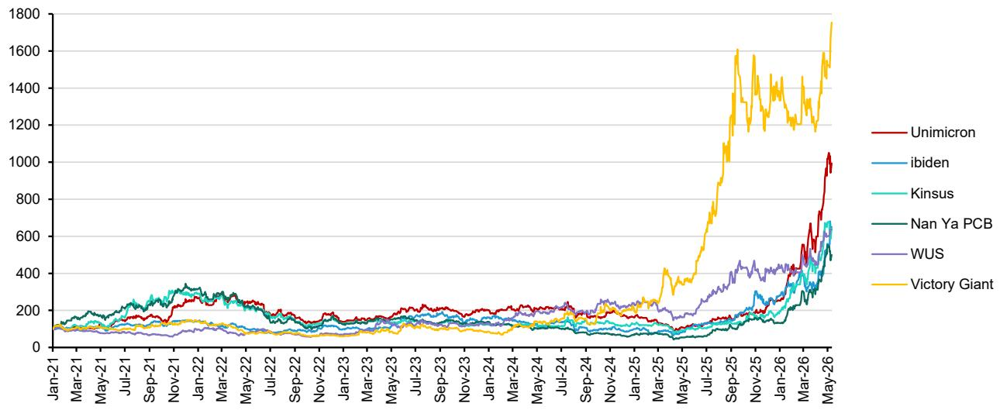

line

| Date   | Unimicron | ibiden | Kinsus | Nan Ya PCB | WUS  | Victory Giant |
|--------|-----------|--------|--------|------------|------|---------------|
| May-26 | 1050      | 650    | 680    | 550        | 600  | 1750          |

Source: Bloomberg, Bernstein analysis

# ABF SUBSTRATE

ABF sUBStrate revenue is about to surpass 2022 peak. Top 6 companies ABF revenue in 1Q26 is now at 2Q/3Q22 level, and is very close to 4Q22 peak. Growth rate has reached 40% YoY (Exhibit 13, Exhibit 14). We anticipate strong growth ahead as driven by the volume and price increases.

ABF sUBStrate players are accelerating capacity expansion as AI demand visibility improves. Unimicron guided NT\$34bn capex for 2026, with long-term equipment purchase order of NT\$14.1bn. Management has guided to increase ABF sUBStrate capacity by 40% Yoy in end-2026 though across different sites, and ramp up 2 $^{nd}$ site in KF and 2 $^{nd}$ site in Yangmei in 2H27 and 2028 respectively. Ibiden guided FY27/3E capex of ¥210bn, representing 40%+ of its ¥500bn three-year capex plan for the sUBStrates business over FY27/3E-FY29/3E. Kinsus plans to invest \~NT\$23.5bn over 2026-28 to expand ABF sUBStrate capacity, and 2026 capex is set at \~NT7-8bn. The $1^{st}$ phase of Yangmei K6 site will help company's AI revenue mix up from 5-10% last year to 10-15% this year. The $2^{nd}$ phase will come online in 2027, increasing monthly capacity by \~25% to 50m units. The site also retains room for a potential phase-3 expansion post-2028, subject to AI chip demand. SEMCO expects its ABF capacity to reach full utilization in 2H26 and has reportedly registered a \~KRW1.8tn (\~US\$1.4bn) second-phase investment targeting ABF sUBStrates for robotics, autonomous driving, and AI in Vietnam plant. In parallel, it is preparing new ABF production in Busan from 2H26 to support NVIDIA-related demand (reportedly for Nvidia switches).

Our channel check suggests that some CPU products have adopted T-glass from second-source suppliers such as Taiwan Glass (1802 TT, not covered) and Taishan Fiberglass (Sinoma sUBSidiary, 002080 CH, not covered). But we assume only a limited amount of GPU and ASIC will adopt tier-2 suppliers products by the end of this year.

EXHIBIT 13: Top 6 sUBStrate companies ABF sUBStrate revenue is back to 2Q22 level and is close to the previous peak of 4Q22   
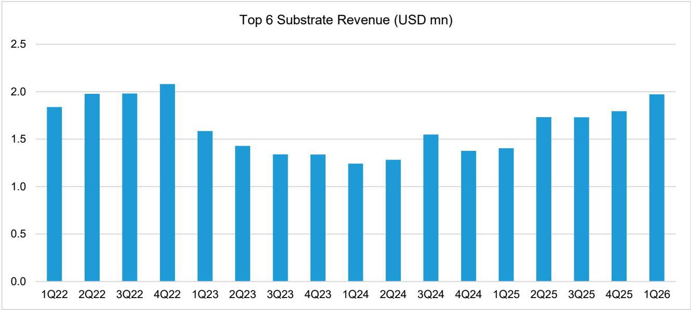

bar

Top 6 SUBStrate Revenue (USD mn)
| Quarter | Revenue (USD mn) |
| :--- | :--- |
| 1Q22 | 1.85 |
| 2Q22 | 1.98 |
| 3Q22 | 1.98 |
| 4Q22 | 2.08 |
| 1Q23 | 1.58 |
| 2Q23 | 1.43 |
| 3Q23 | 1.34 |
| 4Q23 | 1.34 |
| 1Q24 | 1.24 |
| 2Q24 | 1.28 |
| 3Q24 | 1.54 |
| 4Q24 | 1.38 |
| 1Q25 | 1.40 |
| 2Q25 | 1.73 |
| 3Q25 | 1.72 |
| 4Q25 | 1.79 |
| 1Q26 | 1.97 |

Companies included: Ibiden (OP), Unimicron (OP), Zhen Ding, Nanya PCB, Kinsus, SEMCO (all not covered)
Source: Visible Alpha, Bernstein analysis

EXHIBIT 14: Top 6 companies ABF sUBStrate YoY reached 40%   
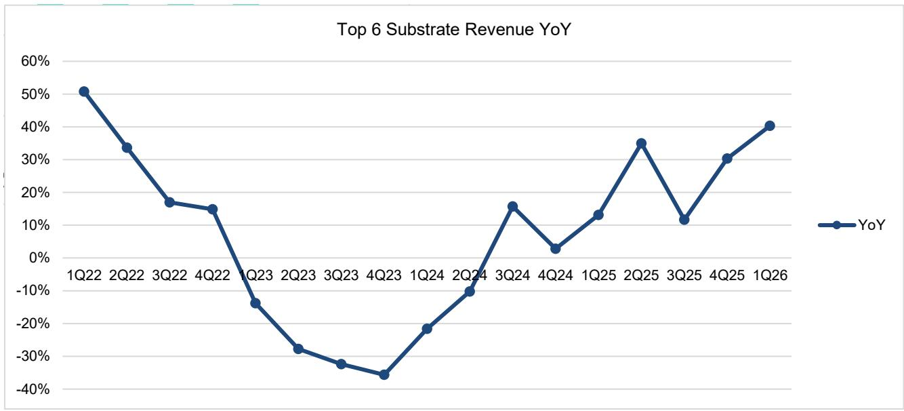

line

Top 6 SUBStrate Revenue YoY
| Quarter | YoY (%) |
|---|---|
| 1Q22 | 51 |
| 2Q22 | 34 |
| 3Q22 | 17 |
| 4Q22 | 15 |
| 1Q23 | -15 |
| 2Q23 | -28 |
| 3Q23 | -32 |
| 4Q23 | -36 |
| 1Q24 | -22 |
| 2Q24 | -10 |
| 3Q24 | 16 |
| 4Q24 | 3 |
| 1Q25 | 13 |
| 2Q25 | 35 |
| 3Q25 | 11 |
| 4Q25 | 30 |
| 1Q26 | 40 |

Companies included: Ibiden (OP), Unimicron (OP), Zhen Ding, Nanya PCB, Kinsus, SEMCO (all not covered)   
Source: Visible Alpha

EXHIBIT 15: SUBStrate Capacity Expansion Plan 

<table><tr><td>Company</td><td>Site</td><td>Product</td><td>Capacity</td><td>Production Start (Calendar Year)</td></tr><tr><td rowspan="2">Unimicron</td><td>Yangmei site, TW</td><td>ABF (Server)</td><td rowspan="2">Phase 1 for both YM/GF is 35% of total capacity; phase 2 of both sites will add another 30% of capacity from 2026-2028</td><td>2021 (1st phase fully ramp in 2024; 2nd phase starts in 2028)</td></tr><tr><td>Guangfu site, TW</td><td>ABF (Server)</td><td>End-2024 (1st phase fully ramp in 2025, 2nd phase starts in 2H27)</td></tr><tr><td rowspan="3">Ibiden</td><td>Ogaki</td><td>ABF</td><td rowspan="3">Will almost double ibiden&#x27;s capacity with these investments</td><td>Expansion in 2023</td></tr><tr><td>Ono Plant, JP</td><td>ABF (Server)</td><td>2H25</td></tr><tr><td>Gama Plant, JP</td><td>ABF (Server)</td><td>2027</td></tr><tr><td rowspan="4">Nanya</td><td>Shulin, TW (1st Phase)</td><td>ABF</td><td rowspan="4">Total ABF production capacity: 50M Units/M by End-2023</td><td>3Q22</td></tr><tr><td>Shulin, TW (2nd Phase)</td><td>ABF (HPC)</td><td>3Q23</td></tr><tr><td>Kunshan, CN (2nd Phase)</td><td>ABF</td><td>3Q22</td></tr><tr><td>Jinxing, TW</td><td>ABF</td><td>Upgrade in 2Q23-1Q24</td></tr><tr><td rowspan="3">Shinko</td><td>Chikuma Plant (New)</td><td>Flip Chip</td><td rowspan="3">Increase capacity by c.50% by 1H25, compared to 2H21</td><td>4Q24-1Q25</td></tr><tr><td>Kohoku Plant</td><td>Flip Chip</td><td>By 1Q24</td></tr><tr><td>Wakaho Plant</td><td>Flip Chip</td><td>By 1Q24</td></tr><tr><td rowspan="2">SEMCO</td><td>Vietnam Plant</td><td>Flip Chip</td><td rowspan="2"></td><td>Expansion in 2022</td></tr><tr><td>TBD</td><td>Flip Chip</td><td>Under consideration</td></tr><tr><td>Kinsus</td><td>Yangmei K6 site, TW</td><td>ABF</td><td>Increase capacity by c.25% with 2nd phase</td><td>1st phase fully ramped, 2nd phase mass production starts in 2027</td></tr></table>

Source: Company reports, Bernstein analysis

# UNIMICRON MODEL UPDATE (OUTPERFORM, PT=NT\$990)

We revise up 2027 revenue and EPS estimates significantly on a favorable product mix, and roll over the model to 2028. Versus our Mar-2026 model, we project 2027 and 2028 revenue growth of 34%/19% YoY respectively, driven by robust demand for AI-related ABF sUBStrates and HDI, and aggressive capacity expansion plan. Near-term, we estimate Unimicron's ABF sUBStrate ASP only risen by 5% in 1Q26, but will accelerate to rise 7-10% every quarter in the remainder of the year (vs. previous forecast of 5–7% every quarter). This is driven by a 30% raw material cost increase starting in 2Q, as well as increasing mix from high-end ABF sUBStrate.

We model AI to represent half of company's revenue in the next few years. Management has guided to increase ABF sUBStrate capacity by 40% Yoy in end-2026 though across different sites, and ramp up $2^{nd}$ site in KF and $2^{nd}$ site in Yangmei in 2H27 and 2028 respectively. This supports Unimicron to captures c.35% ABF market share in Nvidia high-end GPUs in this year, along with a 50%+ share for ASIC chips including Google TPU and AWS Trainium. The resurgence of CPU demand will also maintain a high utilization rate in its Yangmei and older ABF sites after capacity expansion in year-end. Yield improvements at Taiwan HDI sites in 2Q-3Q26 should lift AI HDI/PCB revenue by \~50% in 2026 and high-teens in 2027-28.

We forecast a 30% and c.100% revenue and EPS CAGR respectively in 2025-28E. We model EPS to more than triple to NT\$14 in 2026, then grow \~80% in 2027 and \~45% in 2028 to NT\$36.6 on continued strong AI demand and margin recovery. We maintain our GM estimates c.25% by 4Q26, but lift 2027 GM to 28.6% (reaching 30% by 4Q27). Depreciation will increase every year, but with strong top line growth and better pricing environment, D&A as % of sales is set to maintain <20%. AI ABF GM will improve to c.40% and HDI GM recover to high-teens by the end of this year, and reach 45% & 30% respectively in longer term. Our 2026 estimates are in line with consensus, but 2027-28 EPS is below cons. due to more conservative revenue and margin assumptions.

With better demand visibility and strong market position in next-generation of IC sUBStrate (Vera Rubin GPU, CPO, EMIB-T, etc.), we expect Unimicron's GM will approach 2022 peak level by end 2028. We keep our target P/E of 32x P/E and apply that to 2027-28 avg. EPS of NT\$30.8 (vs. old 2027 EPS of NT\$19.1), setting PT at NT\$990 (vs. old NT\$610).

EXHIBIT 16: We expect Unimicron's sUBStrate ASP increase to be driven by tight supply in 2026 & favorable product mix in 2027-28   
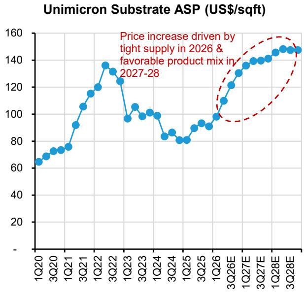

line

| Quarter | ASP (US$/sqft) |
| ------- | ------------- |
| 1Q20    | 65            |
| 3Q20    | 70            |
| 1Q21    | 75            |
| 3Q21    | 90            |
| 1Q22    | 115           |
| 3Q22    | 135           |
| 1Q23    | 95            |
| 3Q23    | 105           |
| 1Q24    | 100           |
| 3Q24    | 85            |
| 1Q25    | 80            |
| 3Q25    | 90            |
| 1Q26    | 95            |
| 3Q26E   | 110           |
| 1Q27E   | 130           |
| 3Q27E   | 140           |
| 1Q28E   | 145           |
| 3Q28E   | 150           |

Source: Company disclosures, Bernstein analysis and estimates

EXHIBIT 17: We expect 62% of Unimircon's 2026E revenue to be from IC sUBState (ABF+BT)   
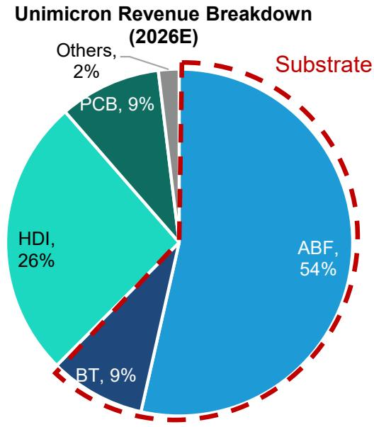

pie

Unimicron Revenue Breakdown (2026E)
| SUBStrate | Revenue (%) |
| :--- | :--- |
| ABF | 54 |
| HDI | 26 |
| BT | 9 |
| PCB | 9 |
| Others | 2 |
SUBStrate (dashed red line) (2026E)

Source: Company reports, Bernstein analysis and estimates

EXHIBIT 18: We expect sUBStrate ASP to increase amid T-glass shortage   
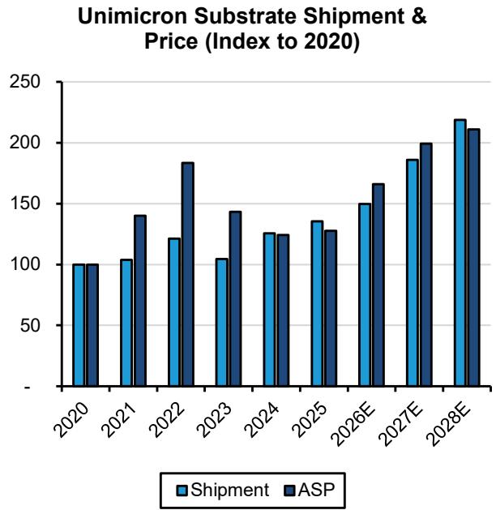

bar

Unimicron SUBStrate Shipment & Price (Index to 2020)
| Year | Shipment | ASP |
| :--- | :--- | :--- |
| 2020 | 100 | 100 |
| 2021 | 103 | 140 |
| 2022 | 120 | 183 |
| 2023 | 103 | 144 |
| 2024 | 125 | 124 |
| 2025 | 135 | 128 |
| 2026E | 150 | 166 |
| 2027E | 186 | 199 |
| 2028E | 218 | 211 |

Source: Company disclosure, Bernstein estimates and analysis

EXHIBIT 19: We expect Unimicron's GM can return above $30\%$ as in the 2022 cycle in 2028   
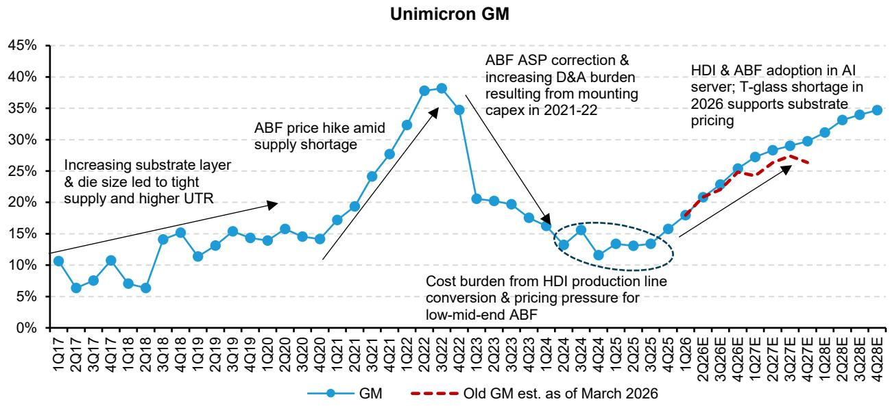

line

| Quarter | GM   | Old GM est. as of March 2026 |
|---------|------|------------------------------|
| 1Q17    | 10%  | -                            |
| 2Q17    | 6%   | -                            |
| 3Q17    | 8%   | -                            |
| 4Q17    | 10%  | -                            |
| 1Q18    | 7%   | -                            |
| 2Q18    | 6%   | -                            |
| 3Q18    | 14%  | -                            |
| 4Q18    | 15%  | -                            |
| 1Q19    | 11%  | -                            |
| 2Q19    | 13%  | -                            |
| 3Q19    | 15%  | -                            |
| 4Q19    | 14%  | -                            |
| 1Q20    | 14%  | -                            |
| 2Q20    | 15%  | -                            |
| 3Q20    | 14%  | -                            |
| 4Q20    | 14%  | -                            |
| 1Q21    | 17%  | -                            |
| 2Q21    | 19%  | -                            |
| 3Q21    | 24%  | -                            |
| 4Q21    | 27%  | -                            |
| 1Q22    | 32%  | -                            |
| 2Q22    | 38%  | -                            |
| 3Q22    | 38%  | -                            |
| 4Q22    | 35%  | -                            |
| 1Q23    | 20%  | -                            |
| 2Q23    | 20%  | -                            |
| 3Q23    | 19%  | -                            |
| 4Q23    | 17%  | -                            |
| 1Q24    | 15%  | -                            |
| 2Q24    | 13%  | -                            |
| 3Q24    | 15%  | -                            |
| 4Q24    | 12%  | -                            |
| 1Q25    | 13%  | -                            |
| 2Q25    | 13%  | -                            |
| 3Q25    | 13%  | -                            |
| 4Q25    | 15%  | -                            |
| 1Q26    | 18%  | -                            |
| 2Q26E   | -    | -                            |
| 3Q26E   | -    | -                            |
| 4Q26E   | -    | -                            |
| 1Q27E   | -    | -                            |
| 2Q27E   | -    | -                            |
| 3Q27E   | -    | -                            |
| 4Q27E   | -    | -                            |
| 1Q28E   | -    | -                            |
| 2Q28E   | -    | -                            |
| 3Q28E   | -    | -                            |
| 4Q28E   | -    | -                            |

Source: Company disclosure, Bernstein estimates and analysis

EXHIBIT 20: We expect non-depreciation COGS to decrease in 2026-28   
Non-Depreciation COGS as % of Sales   
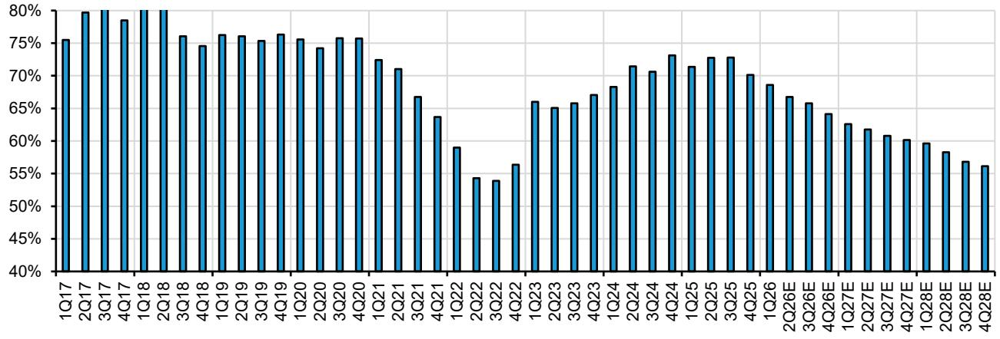

bar

| Quarter | Value (%) |
|---|---|
| 1Q17 | 75.5 |
| 2Q17 | 79.5 |
| 3Q17 | 79.5 |
| 4Q17 | 78.0 |
| 1Q18 | 79.5 |
| 2Q18 | 79.5 |
| 3Q18 | 76.0 |
| 4Q18 | 74.5 |
| 1Q19 | 76.0 |
| 2Q19 | 76.0 |
| 3Q19 | 75.0 |
| 4Q19 | 76.0 |
| 1Q20 | 75.5 |
| 2Q20 | 74.0 |
| 3Q20 | 75.5 |
| 4Q20 | 75.5 |
| 1Q21 | 72.5 |
| 2Q21 | 71.0 |
| 3Q21 | 66.5 |
| 4Q21 | 63.5 |
| 1Q22 | 59.0 |
| 2Q22 | 54.5 |
| 3Q22 | 54.0 |
| 4Q22 | 56.0 |
| 1Q23 | 66.0 |
| 2Q23 | 65.0 |
| 3Q23 | 66.0 |
| 4Q23 | 67.0 |
| 1Q24 | 68.0 |
| 2Q24 | 71.5 |
| 3Q24 | 70.5 |
| 4Q24 | 73.0 |
| 1Q25 | 71.5 |
| 2Q25 | 72.5 |
| 3Q25 | 72.5 |
| 4Q25 | 70.0 |
| 1Q26 | 68.5 |
| 2Q26E | 66.5 |
| 3Q26E | 65.5 |
| 4Q26E | 64.0 |
| 1Q27E | 62.5 |
| 2Q27E | 61.5 |
| 3Q27E | 60.5 |
| 4Q27E | 60.0 |
| 1Q28E | 59.5 |
| 2Q28E | 58.0 |
| 3Q28E | 56.5 |
| 4Q28E | 56.0 |

Source: Company disclosure, Bernstein estimates and analysis

EXHIBIT 21: We project Unimicron's revenue to grow at $30\%$ CAGR in 2025-28E   
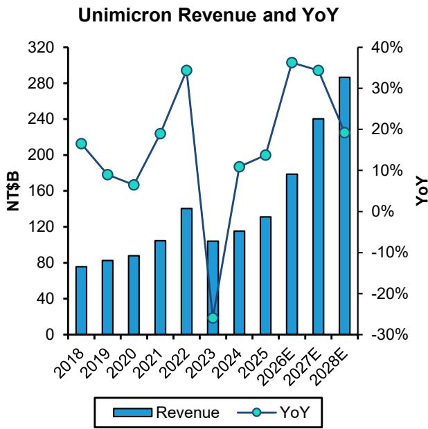

bar_line

Unimicron Revenue and YoY
| Year | Revenue (NT$B) | YoY (%) |
| :--- | :--- | :--- |
| 2018 | 78 | 20 |
| 2019 | 81 | 10 |
| 2020 | 84 | 5 |
| 2021 | 112 | 15 |
| 2022 | 130 | 35 |
| 2023 | 112 | -25 |
| 2024 | 117 | 10 |
| 2025 | 126 | 15 |
| 2026E | 170 | 35 |
| 2027E | 240 | 33 |
| 2028E | 285 | 20 |

Source: Company disclosure, Bernstein estimates and analysis

EXHIBIT 22: Our 2026 estimates are in line with consensus, but 2027-28 EPS is below cons. due to more conservative revenue and margin assumptions 

<table><tr><td>Unimicron Comparison Table</td><td>2025</td><td>2026E</td><td>2027E</td><td>2028E</td></tr><tr><td colspan="5">Revenue (NT$ B)</td></tr><tr><td>Bernstein Old</td><td></td><td>167</td><td>205</td><td></td></tr><tr><td>YoY</td><td></td><td></td><td>23%</td><td></td></tr><tr><td>Bernstein</td><td>131</td><td>179</td><td>240</td><td>287</td></tr><tr><td>YoY</td><td>14%</td><td>36%</td><td>34%</td><td>19%</td></tr><tr><td>Consensus</td><td></td><td>178</td><td>245</td><td>319</td></tr><tr><td>YoY</td><td></td><td>36%</td><td>37%</td><td>30%</td></tr><tr><td>New vs. old</td><td></td><td>7%</td><td>17%</td><td></td></tr><tr><td>BERN vs. consensus</td><td></td><td>0%</td><td>-2%</td><td>-10%</td></tr><tr><td colspan="5">GM</td></tr><tr><td>Bernstein Old</td><td></td><td>21.7%</td><td>26.1%</td><td></td></tr><tr><td>Bernstein</td><td>13.9%</td><td>22.1%</td><td>28.6%</td><td>33.3%</td></tr><tr><td>Consensus</td><td></td><td>22.6%</td><td>30.0%</td><td>36.0%</td></tr><tr><td>New vs. old</td><td></td><td>0.4%</td><td>2.5%</td><td>33.3%</td></tr><tr><td>BERN vs. consensus</td><td></td><td>-0.5%</td><td>-1.3%</td><td>-2.8%</td></tr><tr><td colspan="5">OPM</td></tr><tr><td>Bernstein Old</td><td></td><td>13.2%</td><td>17.7%</td><td></td></tr><tr><td>Bernstein</td><td>5.1%</td><td>13.3%</td><td>20.3%</td><td>24.8%</td></tr><tr><td>Consensus</td><td></td><td>14.0%</td><td>22.4%</td><td>27.2%</td></tr><tr><td>New vs. old</td><td></td><td>0.1%</td><td>2.5%</td><td>24.8%</td></tr><tr><td>BERN vs. consensus</td><td></td><td>-0.7%</td><td>-2.2%</td><td>-2.4%</td></tr><tr><td colspan="5">Diluted EPS (NT$)</td></tr><tr><td>Bernstein Old</td><td></td><td>11.8</td><td>19.1</td><td></td></tr><tr><td>YoY</td><td></td><td></td><td>62%</td><td></td></tr><tr><td>Bernstein</td><td>4.4</td><td>14.1</td><td>25.1</td><td>36.6</td></tr><tr><td>YoY</td><td>31%</td><td>222%</td><td>79%</td><td>46%</td></tr><tr><td>Consensus</td><td></td><td>14.0</td><td>28.0</td><td>45.6</td></tr><tr><td>YoY</td><td></td><td>302%</td><td>101%</td><td>63%</td></tr><tr><td>New vs. old</td><td></td><td>19%</td><td>31%</td><td></td></tr><tr><td>BERN vs. consensus</td><td></td><td>1%</td><td>-10%</td><td>-20%</td></tr></table>

Source: Bloomberg, Company disclosure, Bernstein estimates and analysis

# AJINOMOTO

Ajinomoto reported a 42% revenue growth in 4QFY3/26 which beat our estimates by 7%. While operational leverage remained depressed at 1.3x, we expect this to bounce back to \~1.7x from Q1 onward, with revenue growth to maintain at a \~30% run rate (Exhibit 23). Their guidance for FY3/27 Functional Materials division is conservative (at +11% for both revenue and profit lines) but they have always been conservative at the beginning of fiscal year (FY3/26 initial guidance is +11/8% for revenue and business profit, raised to +28/31% at H1 and arrived at +32/36% for the full year).

With the results release Ajinomoto also announced a capacity expansion plan for ABF film, building a $3^{rd}$ factory in Japan, as they expect the increases in sUBStrate area size and layers to continue into 2031 onward. Also the new location is 330km away from their current Gunma plant (Exhibit 25), as they continue to pursue Business Continuity Planning.

EXHIBIT 23: Ajinomoto reported a 42% revenue growth in 4QFY3/26 while operational leverage remained depressed at 1.3x. We expect this to bounce back to \~1.7x from Q1 onward, with revenue growth to maintain at a \~30% run rate   
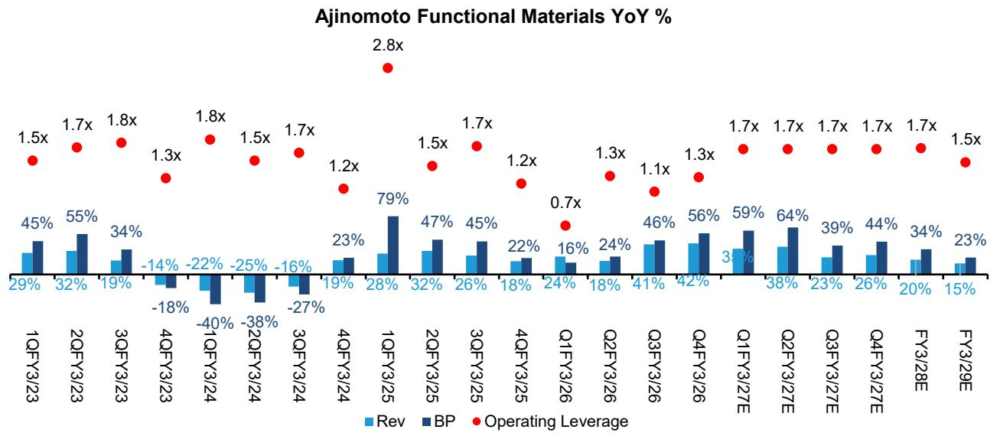

bar_line

Ajinomoto Functional Materials YoY %
| Quarter | Rev (%) | BP (%) | Operating Leverage (x) |
| :--- | :--- | :--- | :--- |
| 1QFY3/23 | 29 | 45 | 1.5 |
| 2QFY3/23 | 32 | 55 | 1.7 |
| 3QFY3/23 | 19 | 34 | 1.8 |
| 4QFY3/23 | -14 | -18 | 1.3 |
| 1QFY3/24 | -22 | -40 | 1.8 |
| 2QFY3/24 | -25 | -38 | 1.5 |
| 3QFY3/24 | -16 | -27 | 1.7 |
| 4QFY3/24 | 19 | 23 | 1.2 |
| 1QFY3/25 | 28 | 79 | 2.8 |
| 2QFY3/25 | 32 | 47 | 1.5 |
| 3QFY3/25 | 26 | 45 | 1.7 |
| 4QFY3/25 | 18 | 22 | 1.2 |
| Q1FY3/26 | 24 | 16 | 0.7 |
| Q2FY3/26 | 18 | 24 | 1.3 |
| Q3FY3/26 | 41 | 46 | 1.1 |
| Q4FY3/26 | 42 | 56 | 1.3 |
| Q1FY3/27E | 31 | 59 | 1.7 |
| Q2FY3/27E | 38 | 64 | 1.7 |
| Q3FY3/27E | 23 | 39 | 1.7 |
| Q4FY3/27E | 26 | 44 | 1.7 |
| FY3/28E | 20 | 34 | 1.7 |
| FY3/29E | 15 | 23 | 1.5 |
The chart displays a series of three data series: 'Rev', 'BP', and 'Operating Leverage' plotted against time periods on the x-axis. The y-axis values are explicitly labeled on each data point, with 'Operating Leverage' marked by red dots above the bars.

Source: company reports, Bernstein analysis and estimates

EXHIBIT 24: Ajinomoto expects another wave of sUBStrate area expansion to arrive around 2031 with incremental layers added as well   
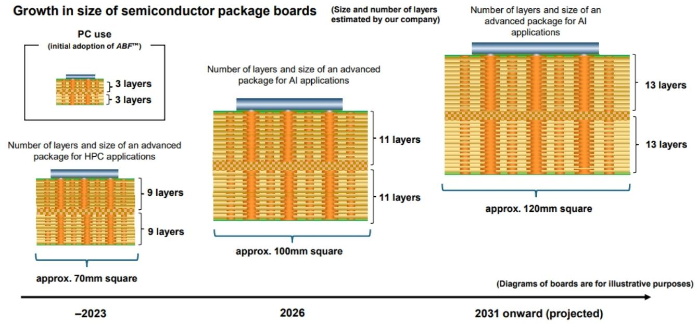

bar_stacked

| Year | PC Use (Initial Adoption of ABFT™) | Number of layers and size of an Advanced Package for HPC applications | Number of layers and size of an Advanced Package for AI applications | Number of layers and size of an Advanced Package for AI applications |
|------|-------------------------------------|------------------------------------------------------------------|---------------------------------------------------------------|--------------------------------------------------------------------|
| -2023 | 3 layers | 9 layers | 9 layers | 11 layers |
| 2026 | 3 layers | 9 layers | 11 layers | 13 layers |
| 2031 onward (projected) | 3 layers | approx. 70mm square | approx. 100mm square | approx. 120mm square |
(Diagram: Boards are for illustrative purposes)

Source: company presentation

EXHIBIT 25: As a result Ajinomoto is planning their 3rd ABF film factory with construction to start in 2 years' time   
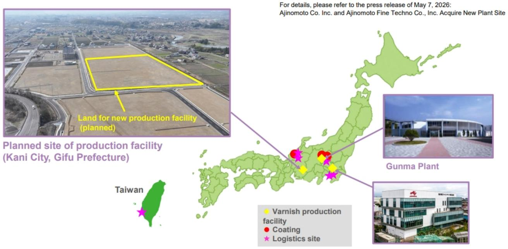

text_image

For details, please refer to the press release of May 7, 2026:
Ajinomoto Co. Inc. and Ajinomoto Fine Techno Co., Inc. Acquire New Plant Site
Land for new production facility (planned)
Planned site of production facility (Kani City, Gifu Prefecture)
Gunma Plant
Taiwan
● Varnish production facility
● Coating
★ Logistics site

Source: company presentation

See Ajinomoto Q4: Solid print, but disappointing guidance asks more questions than it answers for more details. Click here to register for our fireside chat with CEO Nakamura on May 27 $^{th}$ .

APPENDIX - FINANCIAL FORECASTS 

<table><tr><td>TWD in Millions</td><td>2022</td><td>2023</td><td>2024</td><td>2025</td><td>2026E</td><td>2027E</td><td>2028E</td></tr><tr><td colspan="8">Income Statement</td></tr><tr><td>Net Sales</td><td>140,489</td><td>104,036</td><td>115,373</td><td>131,241</td><td>178,858</td><td>240,371</td><td>286,508</td></tr><tr><td>Gross Profit</td><td>50,433</td><td>20,302</td><td>16,315</td><td>18,292</td><td>39,540</td><td>68,763</td><td>95,290</td></tr><tr><td>SG&amp;A Expense</td><td>6,478</td><td>6,554</td><td>6,222</td><td>6,783</td><td>9,027</td><td>11,030</td><td>12,893</td></tr><tr><td>R&amp;D Expense</td><td>5,887</td><td>4,923</td><td>5,043</td><td>4,999</td><td>6,855</td><td>9,145</td><td>11,460</td></tr><tr><td>EBIT</td><td>38,172</td><td>8,920</td><td>5,117</td><td>6,674</td><td>23,754</td><td>48,684</td><td>71,033</td></tr><tr><td>EBITDA</td><td>49,899</td><td>24,017</td><td>22,347</td><td>25,447</td><td>44,820</td><td>72,954</td><td>97,012</td></tr><tr><td>Non-operating Income</td><td>1,703</td><td>6,655</td><td>2,204</td><td>2,153</td><td>4,509</td><td>1,610</td><td>2,291</td></tr><tr><td>Pretax Income</td><td>39,875</td><td>15,575</td><td>7,321</td><td>8,827</td><td>28,264</td><td>50,294</td><td>73,324</td></tr><tr><td>Tax</td><td>8,649</td><td>3,350</td><td>1,765</td><td>1,277</td><td>5,531</td><td>10,562</td><td>15,398</td></tr><tr><td>Net Income</td><td>29,619</td><td>11,980</td><td>5,082</td><td>6,673</td><td>21,701</td><td>38,739</td><td>56,477</td></tr><tr><td>Earnings Per Share (TWD) (Diluted)</td><td>19.7</td><td>7.8</td><td>3.3</td><td>4.4</td><td>14.1</td><td>25.1</td><td>36.6</td></tr><tr><td colspan="8">Margin Analysis</td></tr><tr><td>Gross Profit</td><td>35.9%</td><td>19.5%</td><td>14.1%</td><td>13.9%</td><td>22.1%</td><td>28.6%</td><td>33.3%</td></tr><tr><td>EBIT</td><td>27.2%</td><td>8.6%</td><td>4.4%</td><td>5.1%</td><td>13.3%</td><td>20.3%</td><td>24.8%</td></tr><tr><td>Net Income</td><td>21.1%</td><td>11.5%</td><td>4.4%</td><td>5.1%</td><td>12.1%</td><td>16.1%</td><td>19.7%</td></tr><tr><td colspan="8">Sequential Growth</td></tr><tr><td>Net Sales</td><td>34.4%</td><td>-25.9%</td><td>10.9%</td><td>13.8%</td><td>36.3%</td><td>34.4%</td><td>19.2%</td></tr><tr><td>EBIT</td><td>189.8%</td><td>-76.6%</td><td>-42.6%</td><td>30.4%</td><td>255.9%</td><td>104.9%</td><td>45.9%</td></tr><tr><td>Net Income</td><td>124.0%</td><td>-59.6%</td><td>-57.6%</td><td>31.3%</td><td>225.2%</td><td>78.5%</td><td>45.8%</td></tr><tr><td>Earnings Per Share</td><td>120.0%</td><td>-60.2%</td><td>-57.5%</td><td>31.2%</td><td>222.4%</td><td>78.5%</td><td>45.8%</td></tr><tr><td colspan="8">Balance Sheet</td></tr><tr><td>Cash and Cash Equivalents</td><td>61,459</td><td>52,859</td><td>43,753</td><td>54,872</td><td>67,627</td><td>91,441</td><td>132,689</td></tr><tr><td>Accounts Receivable</td><td>28,750</td><td>18,567</td><td>23,617</td><td>27,570</td><td>34,901</td><td>41,055</td><td>47,767</td></tr><tr><td>Inventory</td><td>12,835</td><td>10,927</td><td>14,863</td><td>17,802</td><td>22,474</td><td>24,890</td><td>26,914</td></tr><tr><td>Net Fixed Assets</td><td>94,122</td><td>109,483</td><td>120,536</td><td>125,866</td><td>137,459</td><td>144,016</td><td>140,547</td></tr><tr><td>Total Assets</td><td>218,663</td><td>216,006</td><td>230,847</td><td>255,792</td><td>296,146</td><td>335,261</td><td>382,160</td></tr><tr><td>Accounts Payable</td><td>5,552</td><td>5,726</td><td>11,019</td><td>10,562</td><td>17,306</td><td>20,357</td><td>23,686</td></tr><tr><td>Total Debt</td><td>23,629</td><td>19,388</td><td>32,780</td><td>46,225</td><td>49,825</td><td>53,464</td><td>54,481</td></tr><tr><td>Total Equity</td><td>92,658</td><td>96,284</td><td>99,587</td><td>107,007</td><td>131,154</td><td>161,121</td><td>201,614</td></tr><tr><td></td><td></td><td></td><td></td><td>42%</td><td></td><td></td><td></td></tr><tr><td colspan="8">Cash Flow</td></tr><tr><td>Cash Flow From Operations</td><td>61,082</td><td>30,900</td><td>10,294</td><td>14,967</td><td>34,932</td><td>58,029</td><td>77,256</td></tr><tr><td>Cash Flow From Investments</td><td>(33,396)</td><td>(21,099)</td><td>(29,230)</td><td>(23,018)</td><td>(27,808)</td><td>(28,088)</td><td>(19,592)</td></tr><tr><td>Cash Flow From Financing</td><td>(4,831)</td><td>(18,060)</td><td>8,336</td><td>19,073</td><td>4,879</td><td>(6,127)</td><td>(16,416)</td></tr><tr><td>Capex</td><td>(32,073)</td><td>(22,938)</td><td>(26,128)</td><td>(25,617)</td><td>(33,757)</td><td>(31,139)</td><td>(22,921)</td></tr><tr><td>FCF</td><td>26,353</td><td>4,577</td><td>(20,609)</td><td>(9,892)</td><td>3,496</td><td>11,761</td><td>12,574</td></tr><tr><td>As % of EBITDA</td><td>53%</td><td>19%</td><td>-92%</td><td>-39%</td><td>8%</td><td>16%</td><td>13%</td></tr><tr><td colspan="8">Key Financial Metrics</td></tr><tr><td>ROE</td><td>40.4%</td><td>13.6%</td><td>5.5%</td><td>6.9%</td><td>19.1%</td><td>27.4%</td><td>32.2%</td></tr><tr><td>ROA</td><td>16.1%</td><td>5.6%</td><td>2.5%</td><td>3.1%</td><td>8.2%</td><td>12.6%</td><td>16.1%</td></tr><tr><td>Debt / Equity</td><td>25.5%</td><td>20.1%</td><td>32.9%</td><td>43.2%</td><td>38.0%</td><td>33.2%</td><td>27.0%</td></tr><tr><td>Net Debt / Equity</td><td>-47.8%</td><td>-35.4%</td><td>-11.2%</td><td>-8.4%</td><td>-14.9%</td><td>-26.0%</td><td>-43.1%</td></tr><tr><td>Debt / Capital</td><td>20.3%</td><td>16.8%</td><td>24.8%</td><td>30.2%</td><td>27.5%</td><td>24.9%</td><td>21.3%</td></tr><tr><td>Dividend Per Share (TWD)</td><td>3.4</td><td>8.0</td><td>3.0</td><td>1.5</td><td>2.1</td><td>6.4</td><td>11.3</td></tr><tr><td>Dividend Payout Ratio</td><td>37.9%</td><td>41.2%</td><td>38.2%</td><td>45.2%</td><td>47.2%</td><td>45.0%</td><td>45.0%</td></tr></table>

Source: Company reports, Bernstein analysis and estimates

# I. REQUIRED DISCLOSURES

References to "Bernstein" or the "Firm" in these disclosures relate to the following entities: Bernstein Institutional Services LLC (April 1, 2024 onwards), Bernstein & Co., LLC (pre April 1, 2024), Bernstein Autonomous LLP, BSG France S.A. (April 1, 2024 onwards), Bernstein (Hong Kong) Limited 盛博香港有限公司, Bernstein (Canada) Limited, Bernstein (India) Private Limited (SEBI registration no. INH000006378), Bernstein (Singapore) Private Limited, Bernstein Japan KK (サンフォード・C・バーンスタイン株式会社) and analysts employed by SG Africa Technologies & Services to produce Bernstein under a Global Services Agreement in place between Bernstein and SG.

Bernstein is part of a joint venture between SG (SG) and AllianceBernstein, L.P. (AB). Unless specifically noted otherwise, for purposes of these disclosures, references to Bernstein's “affiliates” relate to both SG and AB and their respective affiliates.

# VALUATION METHODOLOGY

# Unimicron Technology Corp

We set a NT\$990 target price using a P/E multiple of 32X against our 2027-28 avg. EPS of NT\$30.8.

# Ajinomoto Co Inc

We set a JPY5,100 price target for Ajinomoto using an EV/EBITDA multiple of 14.5x against our forward NTM+1 EBITDA estimate of JPY366b.

# Ibiden Co Ltd

We set a ¥9,200 target price using a P/E multiple of 30x against our forward Q5-Q8 EPS estimate of ¥308.

# RISKS

# Unimicron Technology Corp

Downside risks to our price target for Unimicron include:

- Aggressive ABF capacity expansion among competitors that slow down the ABF market recovery   
- Slower-than-expected recovery of HDI yield and gross margin

\- Macroeconomic pressure and tariff issue could delay the recovery of smartphones and PCs, impacting the utilization of multiple products at Unimicron

# Ajinomoto Co Inc

Potential downside risks to our Price Target for Ajinomoto:

- Natural disaster results in supply chain disruption at single Functional Materials production site   
- Entry of a new Build Up Film competitor / near term significant capacity expansion by existing competitor Sekisui   
- IC packaging sUBStrate technology advances reduce requirement for thermal barriers like ABF   
- Competition from Chinese MSG producers spreads from B2B to branded products   
• Value destructive M&A in Healthcare

Potential upside risks to our Price Target for Ajinomoto:

• AI-related ABF demand and / of pricing materially accelerates   
- Widespread commercial adoption of ABF-RCC for mobile phone board composition and / or Aftinova magnetic materials adoption in chip cathode construction   
• Acceleration in ASEA economic growth and middle class spending drives accelerated Asian S&F mix enhancement   
- CDMO revenue growth accelerates and margins return to previous DD levels and   
- Improved pipeline of structural reforms across divisions which materially enhance margin and ROIC

# Ibiden Co Ltd

There are a number of downside risks to our Ibiden target price. (1) Potential continuation of overall pricing pressure with industry level oversupply, (2) Potential expedited share loss in Nvidia's products, (3) More than expected capex burden and hence higher depreciation drag.

# RATINGS DEFINITIONS, BENCHMARKS AND DISTRIBUTION

# EQUITY RATINGS DEFINITIONS

# Bernstein brand

The Bernstein brand rates stocks based on forecasts of relative performance for the next 12 months versus the S&P 500 for stocks listed on the U.S. and Canadian exchanges, versus the Bloomberg Europe Developed Markets Large and Mid Cap Price Return Index EUR (EDME) for stocks listed on the European exchanges and emerging markets exchanges outside of the Asia Pacific region, versus the Bloomberg Japan Large and Mid Cap Price Return Index USD (JPL) for stocks listed on the Japanese exchanges, and versus the Bloomberg Asia ex-Japan Large and Mid Cap Price Return Index (ASIAX) for stocks listed on the Asian (ex-Japan) exchanges -unless otherwise specified.

The Bernstein brand has three categories of ratings:

- Outperform: Stock will outpace the market index by more than 15 pp   
• Market-Perform: Stock will perform in line with the market index to within +/-15 pp   
• Underperform: Stock will trail the performance of the market index by more than 15 pp

Coverage Suspended: Coverage of a company under the Bernstein brand has been suspended. Ratings and price targets are suspended temporarily, are no longer current, and should therefore not be relied upon.

Not Rated: A rating assigned when the stock cannot be accurately valued, or the performance of the company accurately predicted, at the present time. The covering analyst may continue to publish research reports on the company to update investors on events and developments.

Not Covered (NC) denotes companies that are not under coverage.

Bernstein brand stock ratings are based on a 12-month time horizon.

# Autonomous brand – common stocks

The Autonomous brand rates common stocks as indicated below. As our benchmarks we use the Bloomberg Europe 500 Banks And Financial Services Index (BEBANKS) and Bloomberg Europe Dev Mkt Financials Large and Mid Cap Price Ret Index EUR (EDMFI) index for developed European banks and Payments, the Bloomberg Europe 500 Insurance Index (BEINSUR) for European insurers, the S&P 500 and S&P Financials for US banks and Payments coverage, S5LIFE for US Insurance, the S&P Insurance Select Industry (SPSIINS) for US Non-Life Insurers coverage, and the Bloomberg Emerging Markets Financials Large, Mid and Small Cap Price Return Index (EMLSF) for emerging market banks and insurers and Payments. Ratings are stated relative to the sector (not the market).

The Autonomous brand has three categories of common stock ratings:

- Outperform (OP): Stock will outpace the relevant index by more than 10 pp   
- Neutral (N): Stock will perform in line with the market index to within +/-10 pp   
• Underperform (UP): Stock will trail the performance of the relevant index by more than 10 pp

Coverage Suspended: Coverage of a company under the Autonomous research brand has been suspended. Ratings and price targets are suspended temporarily, are no longer current, and should therefore not be relied upon.

Not Rated: A rating assigned when the stock cannot be accurately valued, or the performance of the company accurately predicted, at the present time. The covering analyst may continue to publish research reports on the company to update investors on events and developments.

Those denoted as ‘Feature’ (e.g., Feature Outperform FOP, Feature Under Outperform FUP) are our core ideas.

Not Covered (NC) denotes companies that are not under coverage.

Autonomous brand common stock ratings are based on a 12-month time horizon.

# Autonomous brand – preferred stocks

The Autonomous brand has three categories of preferred stock ratings:

- Outperform (OP): The total return of the preferred instrument is expected to outperform preferred securities of other issuers operating in similar sectors or rating categories over the next six months.   
- Neutral (N): The total return of the preferred instrument is expected to perform in line with preferred securities of other issuers operating in similar sectors or rating categories over the next six months.   
- Underperform (UP): The total return of the preferred instrument is expected to underperform preferred securities of other issuers operating in similar sectors or rating categories over the next six months.

Autonomous preferred stock ratings are based on a 6-month time horizon.

# AUTONOMOUS CREDIT RESEARCH

Where this report contains investment recommendations for credit instruments, as defined in article 3(1)(35) of the Market Abuse Regulation, the information below is presented to comply with its disclosure requirements.

The report may also include reference(s) to published opinions by other Autonomous or Bernstein analysts covering the equity securities of the issuer(s) referenced herein. Please note an investment recommendation for credit instruments published by the author(s) of this report may differ from the published view of the analyst covering equity securities for the issuer(s) contained in this report and vice versa.

# CREDIT RATINGS DEFINITIONS

The Autonomous brand has three categories of credit ratings:

- Credit Outperform (C-OP): The total return of the Reference Credit Instrument is expected to outperform the credit spread of bonds of other issuers operating in similar sectors or rating categories over the next six months.   
- Credit Neutral (C-N): The total return of the Reference Credit Instrument is expected to perform in line with the credit spread of bonds of other issuers operating in similar sectors or rating categories over the next six months.   
- Credit Underperform (C-UP): The total return of the Reference Credit Instrument is expected to underperform the credit spread of bonds of other issuers operating in similar sectors or rating categories over the next six months.

Autonomous credit ratings are based on a 6-month time horizon.

A list of all investment recommendations produced by the author(s) of this report alongside credit ratings history are available upon request.

It is at the sole discretion of the Firm as to when to initiate, update and cease research coverage. The Firm has established, maintains and relies on information barriers to control the flow of information contained in one or more areas (i.e. the private side) within the Firm, and into other areas, units, groups or affiliates (i.e. public side) of the Firm

DISTRIBUTION OF EQUITY RATINGS/INVESTMENT BANKING SERVICES 

<table><tr><td>Equity Rating</td><td>Market Abuse Regulation (MAR) and FINRA Rating Category</td><td>Global Rating Distribution</td><td>Investment Banking Relationships*</td></tr><tr><td>Outperform</td><td>BUY</td><td>51.1%</td><td>16.5%</td></tr><tr><td>Market-Perform (Bernstein Brand) Neutral (Autonomous Brand)</td><td>HOLD</td><td>36.3%</td><td>17.8%</td></tr><tr><td>Underperform</td><td>SELL</td><td>12.6%</td><td>14.9%</td></tr></table>

\* These figures represent the percentage of companies within each equity rating category for which affiliates of Bernstein have provided investment banking services within the previous 12 months.   
As of March 31, 2026. All figures are updated quarterly.

# PRICE CHARTS / RATINGS AND PRICE TARGET HISTORY

Unimicron Technology Corp (3037.TT) Rating History for Bernstein as of 05/13/2026   
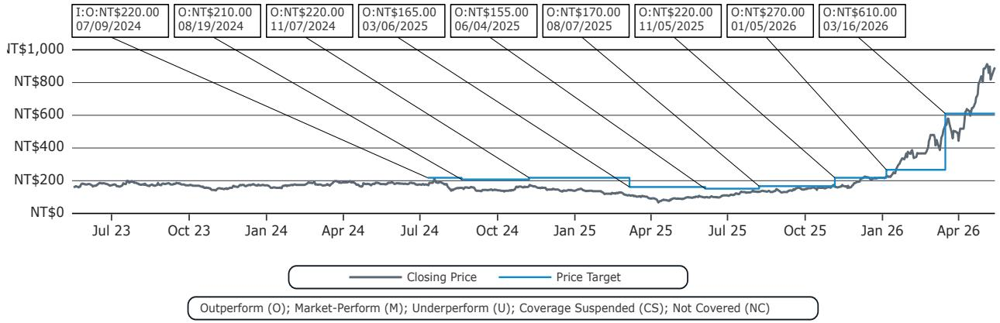

line

| Date       | Closing Price | Price Target |
| ---------- | ------------- | ------------ |
| 07/09/2024 | NT$220.00     | NT$220.00    |
| 08/19/2024 | NT$210.00     | NT$210.00    |
| 11/07/2024 | NT$220.00     | NT$220.00    |
| 03/06/2025 | NT$165.00     | NT$165.00    |
| 06/04/2025 | NT$155.00     | NT$155.00    |
| 08/07/2025 | NT$170.00     | NT$170.00    |
| 11/05/2025 | NT$220.00     | NT$220.00    |
| 01/05/2026 | NT$270.00     | NT$270.00    |
| 03/16/2026 | NT$610.00     | NT$610.00    |

Ajinomoto Co Inc (2802.JP) Rating History for Bernstein as of 05/13/2026   
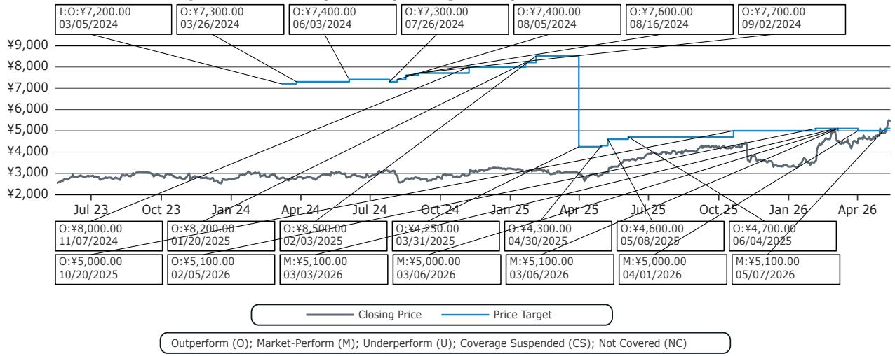

line

| Date       | Closing Price | Price Target |
|------------|---------------|--------------|
| 03/05/2024 | $7,200.00     | -            |
| 03/26/2024 | $7,300.00     | -            |
| 06/03/2024 | $7,400.00     | -            |
| 07/26/2024 | $7,300.00     | -            |
| 08/05/2024 | $7,400.00     | -            |
| 08/16/2024 | $7,600.00     | -            |
| 09/02/2024 | $7,700.00     | -            |
| 11/07/2024 | $8,000.00     | -            |
| 01/20/2025 | $8,200.00     | -            |
| 02/03/2025 | $8,500.00     | -            |
| 03/31/2025 | $4,250.00     | -            |
| 04/30/2025 | $4,300.00     | -            |
| 05/08/2025 | $4,600.00     | -            |
| 06/04/2025 | $4,700.00     | -            |
| 10/20/2025 | $5,000.00     | -            |
| 02/05/2026 | $5,100.00     | -            |
| 03/03/2026 | $5,100.00     | -            |
| 03/06/2026 | $5,000.00     | -            |
| 03/06/2026 | $5,100.00     | -            |
| 04/01/2026 | $5,000.00     | -            |
| 05/07/2026 | $5,100.00     | -            |

Ibiden Co Ltd (4062.JP) Rating History for Bernstein as of 05/13/2026   
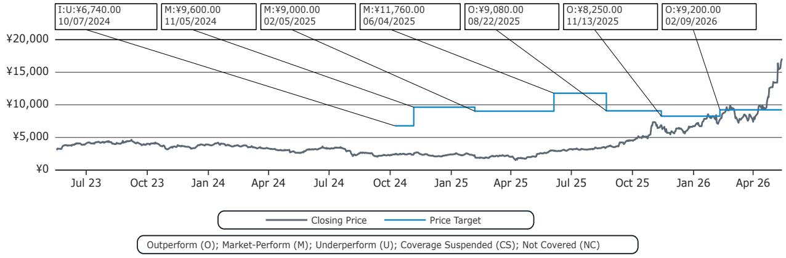

line

| Date       | Closing Price | Price Target |
| ---------- | ------------- | ------------ |
| 10/07/2024 | ¥6,740.00     | -            |
| 11/05/2024 | -             | ¥9,600.00    |
| 02/05/2025 | -             | ¥9,000.00    |
| 06/04/2025 | -             | ¥11,760.00   |
| 08/22/2025 | -             | ¥9,080.00    |
| 11/13/2025 | -             | ¥8,250.00    |
| 02/09/2026 | -             | ¥9,200.00    |

All price target and closing price data in the chart(s) above are denominated in the currency noted in the Ticker Table of this report.

# CONFLICTS OF INTEREST

SG and/or its affiliates beneficially own 1% or more of a class of common equity securities of the following company: Ibiden Co Ltd.

Bernstein and/or affiliates have received compensation for non-investment banking securities-related products or services in the previous twelve months from the following clients: Ajinomoto Co Inc.

# OTHER MATTERS

The legal entity(ies) employing the analyst(s) listed in this report, and their location, can be determined by the country code of their phone number, as follows:

+1 Bernstein Institutional Services LLC; New York, New York, USA   
+44 Bernstein Autonomous LLP; London UK   
+212 SG Africa Technologies & Services; Casablanca, Morocco   
+33 BSG France S.A.; Paris, France   
+34 BSG France S.A.; Madrid, Spain   
+41 Bernstein Autonomous LLP; Geneva, Switzerland   
+49 BSG France S.A.; Frankfurt, Germany   
+91 Bernstein (India) Private Limited; Mumbai, India   
+852 Bernstein (Hong Kong) Limited 盛博香港有限公司; Hong Kong, China   
+65 Bernstein (Singapore) Private Limited; Singapore   
+81 Bernstein Japan KK; Tokyo, Japan

Where this report has been prepared by research analyst(s) employed by a non-US affiliate, such analyst(s), is/are (unless otherwise expressly noted below) not registered as associated persons of Bernstein Institutional Services LLC or any other SEC-registered broker-dealer and are not licensed or qualified as research analysts with FINRA. Accordingly, such analyst(s) may not be subject to FINRA's restrictions regarding (among other things) communications by research analysts with a subject company, interactions between research analysts and investment banking personnel, participation by research analysts in solicitation and marketing activities relating to investment banking transactions, public appearances by research analysts, and trading securities held by a research analyst account.

Where this report has been prepared by research analyst(s) employed by SG Africa Technologies & Services (part of the SG group of companies), it has been prepared on behalf of a Bernstein company under a Global Services

Agreement in place between Bernstein and SG.

# CERTIFICATION

Each research analyst listed in this report, who is primarily responsible for the preparation of the content of this report, certifies that all of the views expressed in this publication accurately reflect that analyst's personal views about any and all of the subject securities or issuers and that no part of that analyst's compensation was, is, or will be, directly or indirectly, related to the specific recommendations or views in this publication.

# II. ADDITIONAL GLOBAL CONFLICT DISCLOSURES

It is at the sole discretion of the Firm as to when to initiate, update and cease research coverage. The Firm has established, maintains and relies on information barriers to control the flow of information contained in one or more areas (i.e., the private side) within the Firm, and into other areas, units, groups or affiliates (i.e., public side) of the Firm.

# III. OTHER IMPORTANT INFORMATION AND DISCLOSURES

Separate branding is maintained for “Bernstein” and “Autonomous” research products.

- Bernstein produces a number of different types of research products including, among others, fundamental analysis and quantitative analysis under both the “Autonomous” and “Bernstein” brands. Recommendations contained within one type of research product may differ from recommendations contained within other types of research products, whether as a result of differing time horizons, methodologies or otherwise. Furthermore, views or recommendations within a research product issued under one brand may differ from views or recommendations under the same type of research product issued under the other brand. The Research Ratings System for the two brands and other information related to those Rating Systems are included in the previous section.   
- Autonomous operates as a separate business unit within the following entities: Bernstein Institutional Services LLC, Bernstein Autonomous LLP, Bernstein (Hong Kong) Limited 盛博香港有限公司 and Bernstein (India) Private Limited. For information relating to “Autonomous” branded products (including certain Sales materials) please visit: www.autonomous.com. For information relating to Bernstein branded products please visit: www.Bernsteinresearch.com.

Analysts are compensated based on aggregate contributions to the research franchise as measured by account penetration, productivity and proactivity of investment ideas. No analysts are compensated based on performance in, or contributions to, generating investment banking revenues.

This report has been produced by an independent analyst as defined in Article 3 (1)(34)(i) of EU 596/2014 Market Abuse Regulation (“MAR”) and the same article of MAR as it forms part of United Kingdom domestic law by virtue of the European Union (Withdrawal) Act 2018.

To our readers in the United States: Bernstein Institutional Services LLC, a broker-dealer registered with the U.S. Securities and Exchange Commission (“SEC”) and a member of the U.S. Financial Industry Regulatory Authority, Inc. (“FINRA”) is distributing this publication in the United States and accepts responsibility for its contents. Where this material contains an analysis of debt product(s), such material is intended only for institutional investors and is not subject to the US independence and disclosure standards applicable to debt research prepared for retail investors.

Bernstein Institutional Services LLC may act as principal for its own account or as agent for another person (including an affiliate) in sales or purchases of any security which is a subject of this report. This report does not purport to meet the objectives or needs of any specific individuals, entities or accounts.

To our readers in Canada: If this publication pertains to a Canadian domiciled company, it is being distributed in Canada by Bernstein (Canada) Limited, which is licensed and regulated by the Canadian Investment Regulatory Organization. If the publication pertains to a non-Canadian domiciled company, it is being distributed by Bernstein Institutional Services LLC, which is licensed and regulated by both the SEC and FINRA, into Canada under the International Dealers Exemption.

This document may not be passed onto any person in Canada unless that person qualifies as "permitted client" as defined in Section 1.1 of NI 31-103.

To our readers in Brazil: This report has been prepared by Bernstein Institutional Services LLC, and Banco BTG Pactual S.A. ("BTG") is responsible for the distribution of this report in Brazil.

To readers in the United Kingdom: This publication has been issued or approved for issue in the United Kingdom by Bernstein Autonomous LLP, authorised and regulated by the Financial Conduct Authority and located at 60 London Wall, London EC2M 5SH, +44 (0)20-7170-5000. Registered in England & Wales No OC343985.

This document is for distribution only to persons who (i) have professional experience in matters relating to investments falling within Article 19(5) of the Financial Services and Markets Act 2000 (Financial Promotion) Order 2005 (as amended, the “Financial Promotion Order”), (ii) are persons falling within Article 49(2)(a) to (d) (“high net worth companies, unincorporated associations, etc.”) of the Financial Promotion Order, (iii) are outside the United Kingdom, or (iv) are persons to whom an invitation or inducement to engage in investment activity (within the meaning of section 21 of the FSMA) in connection with the issue or sale of any securities may otherwise lawfully be communicated or caused to be communicated (all such persons together being referred to as “relevant persons”). This document is directed only at relevant persons and must not be acted on or relied on by persons who are not relevant persons. Any investment or investment activity to which this document relates is available only to relevant persons and will be engaged in only with relevant persons.

To our readers in the member states of the EEA: This publication is being distributed by BSG France SA, which is authorised and regulated by the Autorité de Contrôle Prudentiel et de Résolution (ACPR) and Autorité des Marchés Financiers (AMF).

To our readers in Hong Kong: This publication is being distributed in Hong Kong by Bernstein (Hong Kong) Limited 盛博香港有限公司, which is licensed and regulated by the Hong Kong Securities and Futures Commission (Central Entity No. AXC846) to carry out Type 4 (Advising on Securities) regulated activities and subject to the licensing conditions mentioned in the SFC Public Register (https://www.sfc.hk/publicregWeb/corp/AXC846/details)). This publication is solely for professional investors, as defined in the Securities and Futures Ordinance (Cap. 571). The purpose of this report is solely to provide an analysis of the issuers referred to in this report and is not intended for any purpose contrary to the laws of Hong Kong.

To our readers in Singapore: This publication is being distributed in Singapore by Bernstein (Singapore) Private Limited, only to accredited investors or institutional investors, as defined in the Securities and Futures Act 2001 of Singapore ("SFA"). Recipients in Singapore should contact Bernstein (Singapore) Private Limited in respect of matters arising from, or in connection with, this publication. Bernstein (Singapore) Private Limited is regulated by the Monetary Authority of Singapore and licensed under the SFA as a capital markets services licence holder for dealing in capital markets products that are securities and collective investment schemes and an exempt financial adviser for advising on, issuing and promulgating analyses and reports on securities. Bernstein (Singapore) Private Limited is registered in Singapore with Company Registration No. 20213710W and located at One Raffles Quay, #27-11 South Tower, Singapore 048583, +65-6230-4612.

To our readers in the People's Republic of China: The securities referred to in this document are not being offered or sold and may not be offered or sold, directly or indirectly, in the People's Republic of China (for such purposes, not including the Hong Kong and Macau Special Administrative Regions or Taiwan, the "PRC") in contravention of any applicable laws of the PRC.

This document does not constitute an offer to sell or the solicitation of an offer to buy any securities in the PRC to any person to whom it is unlawful to make the offer or solicitation in the PRC.

We do not represent that this document may be lawfully distributed, or that any securities may be lawfully offered, in compliance with any applicable registration or other requirements in the PRC, or pursuant to an exemption available thereunder, or assume any responsibility for facilitating any such distribution or offering. In particular, no action has been taken by us which would permit a public offering of any securities or distribution of this document in the PRC. Accordingly, the securities are not being offered or sold within the PRC by means of this document or any other document. Neither this document nor any advertisement or other offering material may be distributed or published in the PRC, except under circumstances that will result in compliance with any applicable laws and regulations.

To our readers in Japan: This publication is being distributed in Japan by Bernstein Japan KK (サンフォード・C・バーンスタイン株式会社), which is registered in Japan as a Financial Instruments Business Operator with the Kanto Local Finance Bureau (registration number: The Director-General of Kanto Local Finance Bureau (FIBO) No.3387) and regulated by the Financial Services Agency. It is also a member of Japan Investment Advisers Association. This publication is solely for qualified institutional investors in Japan only, as defined in Article 2, paragraph (3), items (i) of the Financial Instruments and Exchange Act.

For the institutional client readers in Japan who have been granted access to the Bernstein website by Daiwa Group Inc. ("Daiwa"), your access to this document should not be construed as meaning that Bernstein is providing you with investment advice for any purposes. Whilst Bernstein has prepared this document, your relationship is, and will remain with, Daiwa, and Bernstein has neither any contractual relationship with you nor any obligations towards you.

To our readers in Australia: Bernstein (Hong Kong) Limited 盛博香港有限公司 is responsible for distributing research in Australia. It is regulated by the Securities and Exchange Commission under U.S. laws, by the Financial Conduct Authority under U.K. laws, which differs from Australian laws. Bernstein (Hong Kong) Limited 盛博香港有限公司 is exempt from the requirement to hold an Australian financial services license under the Corporations Act 2001 in respect of the provision of the

following financial services to wholesale clients:

• providing financial product advice;   
• dealing in a financial product;   
- making a market for a financial product; and   
• providing a custodial or depository service.

To our readers in India: This publication is being distributed in India by Bernstein (India) Private Limited (SCB India) which is licensed and regulated by Securities and Exchange Board of India ("SEBI") as a research analyst entity under the SEBI (Research Analyst) Regulations, 2014, having registration no. INH000006378 and as a stock broker having registration no. INZ000213537. SCB India is currently engaged in the business of providing research and stock broking services. Please refer to www.Bernsteinresearch.in for more information.

\- SCB India is a Private limited company incorporated under the Companies Act, 2013, on April 12, 2017 bearing corporate identification number U65999MH2017FTC293762, and registered office at Level 3A, 4th Floor, First International Financial Centre, Plot Nos C-54 and C-55, G Block, Near CBI Office, Bandra Kurla Complex, Bandra (East), Mumbai 400098, Maharashtra, India (Phone No: +91-22-68421401).

\- For details of Associates (i.e., affiliates/group companies) of SCB India, kindly email MUM-Bernstein-InCompliance@Bernsteinsg.com.

• SCB India does not have any disciplinary history as on the date of this report.

\- Except as noted above, SCB India and/or its Associates (i.e., affiliates/group companies), the Research Analysts authoring this report, and their relatives

• do not have any financial interest in the subject company   
• do not have actual/beneficial ownership of one percent or more in securities of the subject company;   
• is not engaged in any investment banking activities for Indian companies, as such;   
• have not managed or co-managed a public offering in the past twelve months for any Indian companies;   
- have not received any compensation for investment banking services or merchant banking services from the subject company in the past 12 months;   
• have not received compensation for brokerage services from the subject company in the past twelve months;   
- have not received any compensation or other benefits from the subject company or third party related to the specific recommendations or views in this report; and   
- do not currently, but may in the future, act as a market maker in the financial instruments of the companies covered in the report.   
- do not have any conflict of interest in the subject company as of the date of this report.

\- Except as noted above, the subject company has not been a client of SCB India during twelve months preceding the date of distribution of this research report. Neither SCB India nor its Associates (i.e., affiliates/group companies) have received compensation for products or services other than investment banking, merchant banking or brokerage services from the subject company in the past twelve months.

\- The principal research analyst(s) who prepared this report, members of the analysts' team, and members of their households are not an officer, director, employee or advisory board member of the companies covered in the report.

- Our Compliance officer / Grievance officer is Ms. Rupal Talati, who can be reached at +91-22-68421451, or MUM-Bernstein-InCompliance@Bernsteinsg.com / Scbin-investorgrievance@Bernsteinsg.com   
- The Research investor charter and Terms & Conditions of SCB India are available on its website and may be accessed at Bernstein (India) Private Limited (https://Bernsteinresearch.in/) for your reference.   
- Disclaimer: Registration granted by SEBI, and certification from NISM, is in no way a guarantee of performance of the intermediary or provide any assurance of returns to investors. Investments in securities market are subject to market risks. Read all the related documents carefully before investing.

To our readers in Switzerland: This document is provided in Switzerland by or through Bernstein Autonomous LLP, and is provided only to qualified investors as defined in article 10 of the Swiss Collective Investment Scheme Act (“CISA”) and related provisions of the Collective Investment Scheme Ordinance and in strict compliance with applicable Swiss law and regulations. The products mentioned in this document may not be suitable for all types of investors. This document is based on the Directives on the Independence of Financial Research issued by the Swiss Bankers Association (SBA) in January 2008.

To our readers in the Middle East: Bernstein Autonomous LLP, DIFC branch has its principal office at Gate Village 06, DIFC, Dubai, UAE. Bernstein Autonomous LLP, DIFC branch is regulated by the Dubai Financial Services Authority (DFSA) with the registration number CL10040 and is provisioned for Arranging Deals in Investments and Advising on Financial Products. All communications and services are directed at Professional Clients and Market Counterparties only (as defined in the DFSA rulebook). Persons other than Professional Clients and Market Counterparties, such as Retail Clients, are not the intended recipients of our communications or services.

# LEGAL

All research publications are disseminated to our clients through posting on the firm's password protected websites, Bernsteinresearch.com and autonomous.com. Certain, but not all, research publications are also made available to clients through third-party vendors or redistributed to clients through alternate electronic means as a convenience.

This publication has been published and distributed in accordance with the Firm's policy for management of conflicts of interest in investment research, a copy of which is available from Bernstein Institutional Services LLC, Director of Compliance, 245 Park Avenue, New York, NY 10167. Additional disclosures and information regarding Bernstein's business are available on our website www.Bernsteinresearch.com.

The securities described herein may not be eligible for sale in all jurisdictions or to certain categories of investors where that permission profile is not consistent with the licenses held by the entities noted herein. This document is for distribution only as may be permitted by law. This publication is not directed to, or intended for distribution to or use by, any person or entity who is a Citizen or resident of, or located in any locality, state, country or other jurisdiction where such distribution, publication, availability or use would be contrary to law or regulation or which would subject any of the entities referenced herein or any of their sUBSidiaries or affiliates to any registration or licensing requirement within such jurisdiction. This publication is based upon public sources we believe to be reliable, but no representation is made by us that the publication is accurate or complete. We do not undertake to advise you of any change in the reported information or in the opinions herein. This publication was prepared and issued by entity referred to herein for distribution to eligible counterparties or professional clients. This publication is not an offer to buy or sell any security, and it does not constitute investment, legal or tax advice. The investments referred to herein may not be suitable for you. Investors must make their own investment decisions in consultation with their professional advisors in light of their specific circumstances. The value of investments may fluctuate, and investments that are denominated in foreign currencies may fluctuate in value as a result of exposure to exchange rate movements. Information about past performance of an investment is not necessarily a guide to, indicator of, or assurance of, future performance.

This report is directed to and intended only for our clients who are “eligible counterparties”, “professional clients”, “institutional investors” and/or “professional investors” as defined by the aforementioned regulators, and must not be redistributed to retail clients as defined by the aforementioned regulators. Retail clients who receive this report should note that the services of the entities noted herein are not available to them and should not rely on the material herein to make an investment decision. The result of such act will not hold the entities noted herein liable for any loss thus incurred as the entities noted herein are not registered/authorised/licensed to deal with retail clients and will not enter into any contractual agreement/arrangement with retail clients. This report is provided subject to the terms and conditions of any agreement that the clients may have entered into with the entities noted herein. All research reports are disseminated on a simultaneous basis to eligible clients through electronic publication to our client portal.

The information in this report was prepared by Bernstein solely for the internal business use of our clients. Clients may store, display, analyze, reformat and print the information in this report for this limited use only. Clients may not copy, alter, create derivative works, resell, reverse engineer, commercially exploit, share or distribute any part of the information contained herein for any purpose without Bernstein's express written consent. These restrictions include extracting data or using the content to develop indices or other products. Further, you may not use this report, or any portion of this report, to train or finetune any third-party machine learning or artificial intelligence system, or as a prompt or input into any such system. You also may not, without Bernstein's express written consent, do any of the foregoing in connection with your own internal machine learning or artificial intelligence system.

Bernstein may use artificial intelligence tools in the preparation of its materials. Any such materials are reviewed by Bernstein's research analysts prior to publication.

This report has been prepared for information purposes only and is based on current public information that we consider reliable, but the entities noted herein do not warrant or represent (express or implied) as to the sources of information or data contained herein are accurate, complete, not misleading or as to its fitness for the purpose intended even though the entities noted herein rely on reputable or trustworthy data providers, it should not be relied upon as such. Opinions expressed are the author(s)' current opinions as of the date appearing on the material only and we do not undertake to advise you of any change in the reported information or in the opinions herein.

This publication was prepared and issued by the entity referred to herein for distribution to eligible counterparties or professional clients. The information in this report is intended for general circulation and does not constitute an offer to buy or sell any security, investment, legal or tax advice nor a personal recommendation, as defined by any of the aforementioned regulators. It does not take into account the particular investment objectives, financial situations, or needs of individual investors. The report has not been reviewed by any of the aforementioned regulators and does not represent any official recommendation from the aforementioned regulators. The investments referred to herein may not be suitable for you. Investors must make their own investment decisions in consultation with advice sought from a financial adviser regarding the suitability of the investment product, taking into account the specific investment objectives, financial situation or particular needs of any recipient of the recommendation, before the recipient makes a commitment to purchase the investment product.

The analysis contained herein is based on numerous assumptions. Different assumptions could result in materially different results. The information in this report does not constitute, or form part of, any offer to sell or issue, or any offer to purchase or sUBScribe for shares, or to induce engage in any other investment activity. The value of any securities or financial instruments mentioned in this report may fluctuate subject to market conditions. Information about past performance of an investment is not necessarily a guide to, indicative of, or assurance of future performance. Estimates of future performance mentioned by the research analyst in this report are based on assumptions that may not be realized due to unforeseen factors like market volatility/fluctuation. In relation to securities or financial instruments denominated in a foreign currency other than the clients' home currency, movements in exchange rates will have an effect on the value, either favorable or unfavorable. Before acting on any recommendations in this report, recipients should consider the appropriateness of investing in the subject securities or financial instruments mentioned in this report and, if necessary, seek for independent professional advice.

The securities described herein may not be eligible for sale in all jurisdictions or to certain categories of investors where that permission profile is not consistent with the licenses held by the entities noted herein. This document is for distribution only as may be permitted by law. It is not directed to, or intended for distribution to or use by, any person or entity who is a Citizen or resident of or located in any locality, state, country or other jurisdiction where such distribution, publication, availability or use would be contrary to law or regulation or would subject the entities noted herein to any regulation or licensing requirement within such jurisdiction.

Source: Bloomberg Index Services Limited. BLOOMBERG® is a trademark and service mark of Bloomberg Finance L.P. and its affiliates (collectively “Bloomberg”). Bloomberg or Bloomberg’s licensors own all proprietary rights in the Bloomberg Indices. Neither Bloomberg nor Bloomberg’s licensors approves or endorses this material, or guarantees the accuracy or completeness of any information herein, or makes any warranty, express or implied, as to the results to be obtained therefrom and, to the maximum extent allowed by law, neither shall have any liability or responsibility for injury or damages arising in connection therewith.

No part of this material may be reproduced, distributed or transmitted or otherwise made available without prior consent of the entities noted herein. Copyright Bernstein Institutional Services LLC Bernstein Autonomous LLP, BSG France S.A., Bernstein (Hong Kong) Limited 盛博香港有限公司, Bernstein (Canada) Limited, Bernstein (India) Private Limited (SEBI registration no. INH000006378), Bernstein (Singapore) Private Limited and Bernstein Japan KK (サンフォード・C・バーンスタイン株式会社). All rights reserved. The trademarks and service marks contained herein are the property of their respective owners. Any unauthorized use or disclosure is strictly prohibited. The entities noted herein may pursue legal action if the unauthorized use results in any defamation and/or reputational risk to the entities noted herein and research published under the Bernstein and Autonomous brands.