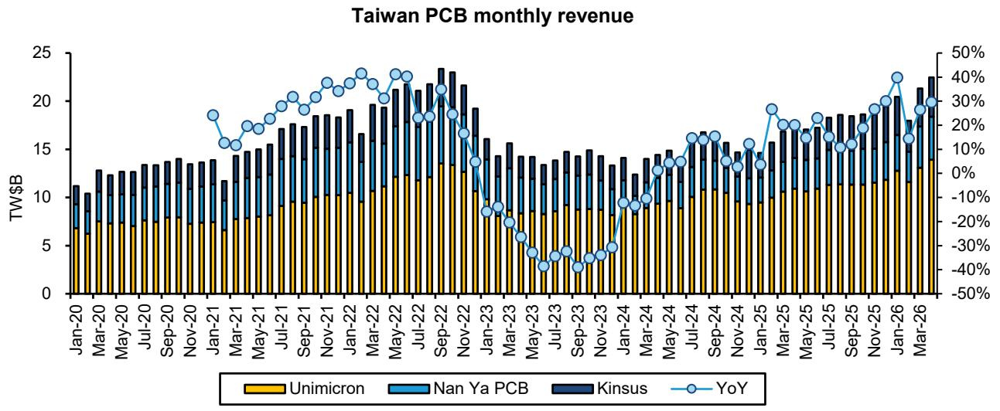

# AI PCB市场的真正信号不是需求，而是供给侧的定价权正在转移

2026年开局，亚洲PCB产业链交出了一份令人瞩目的成绩单。某外资投行最新研报显示，样本AI PCB企业在1Q26实现了同比38%、环比8%的收入增长。表面上看，这仍然是AI服务器需求驱动的故事。但深入拆解报告中的数据结构和边际变化，一个更值得产业决策者关注的判断浮现出来：**这轮周期的核心变量已经从“谁拿到了AI订单”转向“谁能在原材料紧缺和产能扩张的博弈中掌握定价权”。**

市场目前聚焦于AI PCB含量的提升和ASP上涨，这固然正确。但真正决定未来两三年行业格局分化的，是供给侧的结构性变化——从上游原材料到中游基板、再到下游封装，整个链条正在经历一场由成本推动和产能再分配引发的定价权重组。那些能够将规模优势转化为议价能力、并在原材料供应链上建立壁垒的企业，将在这轮周期中实现利润率的非线性跃升。

报告中最值得关注的信号并非1Q26的业绩本身，而是三个正在形成但尚未被充分定价的结构性趋势：ABF基板产能扩张的加速、上游原材料从T-glass到ABF薄膜的连锁涨价、以及中国大陆PCB企业在AI供应链中的渗透提速。这三个趋势叠加在一起，意味着行业正在从“需求拉动的量价齐升”过渡到“供给约束下的利润再分配”。

## 1. ABF基板收入已逼近前高，但真正的利润拐点取决于成本传导能力

1Q26，ABF基板收入同比增长40%，正在逼近4Q22的历史峰值。这个数字本身并不意外——AI加速器、服务器CPU的持续放量是明确的驱动力。但报告揭示了一个更关键的细节：收入增长的加速度正在加快，而且驱动因素正在从“量”转向“价”。

某外资投行估算，Unimicron的ABF基板ASP在1Q26环比上涨5%，并预计全年将加速至7-10%的季度环比涨幅。这一判断背后的核心假设是，从2Q26开始，约30%的原材料成本上涨将被传导至下游。这个假设如果成立，意味着ABF基板厂商的利润率修复将比市场预期的更为陡峭。

但这里存在一个尚未被充分验证的变量：成本传导的完全性。报告本身也指出，Unimicron的毛利率在2028年底仅恢复至约35%，这低于部分激进的市场预期。某外资投行模型刻意没有计入“短缺驱动的利润率飙升”，其隐含的判断是：即便在供给偏紧的环境下，下游客户（芯片设计公司、封装厂）仍然拥有一定的议价能力，基板厂商很难将全部成本涨幅转嫁出去。

对于产业决策者而言，这意味着ABF基板环节的投资逻辑需要从“周期弹性”切换到“成本管理能力”。那些能够通过规模效应和技术溢价消化部分成本压力的企业，将比单纯依赖涨价的企业获得更可持续的利润增长。

## 2. 原材料紧缺是2026年全年的主线，但二阶效应在于供应链的多元化

报告明确指出，T-glass、高端CCL和铜箔的供应紧张将至少持续到年底，这为整个PCB市场提供了强劲的定价环境。更值得注意的是，ABF薄膜也被报道将在2H26启动涨价。这意味着原材料压力正在从PCB的中游向上游的“最后一公里”蔓延。

渠道调研显示，部分CPU已经开始采用第二供应商的T-glass。但报告谨慎假设，GPU和ASIC在2026年底前对二线供应商的采用仍然有限。这个假设的合理性在于：AI加速器对基板可靠性和一致性的要求远高于服务器CPU，认证周期更长，客户切换成本更高。

但这个假设如果被打破——比如某家二线T-glass供应商在关键性能指标上取得突破——那么整个ABF基板的成本结构将面临重新定价。目前市场对ABF基板利润率修复的乐观预期，很大程度上建立在原材料供给瓶颈持续的基础之上。一旦供给端出现超预期的缓解，ASP上涨的动力也将减弱。

对投资者而言，需要密切跟踪的并非ABF基板厂商的订单能见度，而是上游原材料的产能扩张节奏和认证进展。这个链条上的任何边际变化，都可能引发对2027-2028年利润率假设的修正。

## 3. 中国大陆PCB企业的AI渗透率正在加速，但估值溢价需要业绩验证

报告中最引人注目的数据之一，是Zhen Ding的IC基板和网络PCB收入占比从1Q25的11%跃升至1Q26的20%。Zhen Ding作为全球最大的消费电子PCB供应商，其AI业务占比的快速提升，反映了一个更广泛的趋势：中国大陆PCB企业正在从消费电子和通信领域向AI基础设施供应链渗透。

Delton Tech也在扩大AI服务器CPU主板的供应，且首先聚焦于中国市场。Victory Giant和WUS Group的AI混合率分别达到52%和52%，已经与一线台系厂商不相上下。这些数字表明，AI PCB的供应链正在从日系、台系主导的格局，向更加分散、更多元的方向演变。

但这里需要提出一个审慎的问题：份额的获取是否意味着利润率的同步提升？报告中的毛利率数据显示，中国大陆PCB企业的毛利率改善速度普遍快于台系和日系企业，但这在很大程度上是基数效应和产能利用率提升的结果。随着行业进入大规模资本支出阶段——Victory Giant 2026年资本支出预计同比增长超过60%，WUS同样在大幅扩张——这些企业能否在产能扩张的同时维持利润率，仍然需要时间验证。

## 4. Unimicron的模型更新揭示了一个尚未被市场完全定价的利润爬坡路径

某外资投行将Unimicron的目标价从NT$610大幅上调至NT$990，核心驱动因素是2027-2028年平均EPS从NT$19.1上调至NT$30.8。但值得注意的是，即便上调后，其2027-2028年EPS预测仍然低于市场共识。

这种“看好但谨慎”的姿态背后，是某外资投行对利润率修复节奏的独特判断。报告模型假设毛利率在2028年底才达到约35%，这意味着利润率的改善将是渐进的，而非爆发式的。这与部分市场参与者期待的“短缺驱动利润率飙升”形成鲜明对比。

关键分歧在于：AI ABF+HDI业务收入占比将达到公司总收入的一半，支撑2025-2028年30%的收入复合增长率。但某外资投行认为，即便在这样的收入增速下，利润率的修复仍然需要时间，因为产能爬坡、折旧摊销和产品结构优化都需要一个过程。

对于持有Unimicron的投资者而言，需要思考的问题是：如果市场共识的利润率假设被证明过于乐观，股价是否已经充分反映了这一风险？反之，如果某外资投行的谨慎假设被证明过于保守，那么利润率的上行空间可能成为股价的催化剂。

## 5. 报告没有完全回答的关键问题：产能扩张是否会破坏定价环境

报告详细列出了多家企业的资本支出计划：Unimicron 2026年资本支出同比增长33%，Kinsus 2026-2027年资本支出分别增长31%和25%，Gold Circuit 2026年资本支出同比增长超过100%。这些数字清晰地表明，整个行业正在进入一个激进的产能扩张周期。

但报告没有完全回答的问题是：这些产能何时会集中释放？当新产能投放时，是否会引发ASP的竞争性下调？上一轮ABF基板周期（2021-2022年）的经验表明，产能扩张往往会滞后于需求增长，导致先涨后跌的周期波动。如果本轮产能扩张的节奏快于AI需求的增长曲线，2028年之后的定价环境可能面临压力。

某外资投行模型中对Unimicron 2028年后的利润率假设相对保守，可能已经隐含了对产能过剩的担忧。但对于Ibiden、Kinsus等其他企业，报告并未给出类似的远期利润率预测。这个缺口意味着，投资者在评估整个PCB板块的估值时，需要自行判断产能扩张对远期利润率的潜在冲击。

## 6. 一个值得持续跟踪的观察框架：从“AI含量”到“定价权含量”

综合以上分析，评估PCB/基板企业投资价值的框架，需要从传统的“AI收入占比”升级为更精细的“定价权含量”。具体而言，可以关注三个维度：

第一，原材料成本传导能力。在ABF薄膜、T-glass等上游涨价的背景下，企业能否将成本涨幅完全传导至下游，是利润率能否持续改善的关键。这取决于客户集中度、产品差异化程度和合同条款。

第二，产能扩张的纪律性。激进的资本支出虽然能够抢占市场份额，但也可能破坏行业定价环境。那些在扩张的同时保持产能利用率在健康水平的企业，更有可能维持利润率。

第三，技术壁垒的宽度。AI PCB并非同质化产品，不同应用场景对基板层数、线宽线距、材料性能的要求差异巨大。能够在高端AI加速器基板领域建立技术壁垒的企业，其定价权将远高于仅供应服务器CPU主板的企业。

这个框架可以帮助决策者在当前板块普遍上涨的环境中，区分哪些企业的利润增长是可持续的结构性改善，哪些只是周期性的价格弹性。

---

以上分析基于投行研报的公开数据和逻辑推演。报告本身还包含了对Ibiden、Ajinomoto等企业的详细模型更新、完整的PCB市场供需平衡表、以及各企业AI收入占比的细分数据。这些内容由于篇幅限制未能完全展开，但对于理解整个产业链的利润分配格局至关重要。

关于ABF基板产能扩张的具体时间表、各企业原材料采购策略的差异、以及AI加速器基板认证进展的最新动态，欢迎来星球微信群里继续讨论。我们会在群内分享完整报告的原始图表和解读笔记，并就上述未解问题展开深度交流。

Personal reading notes and learning share only. Not investment advice.

